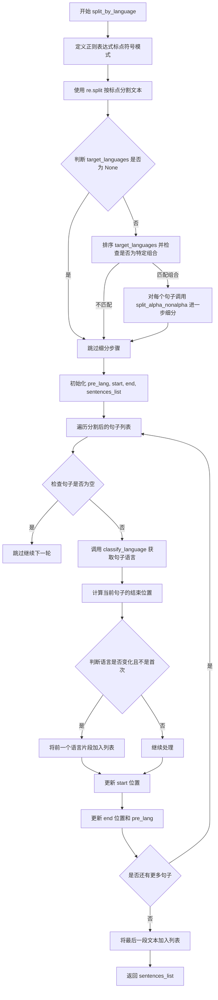
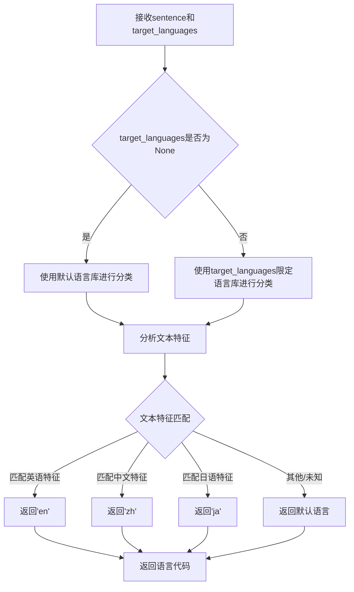
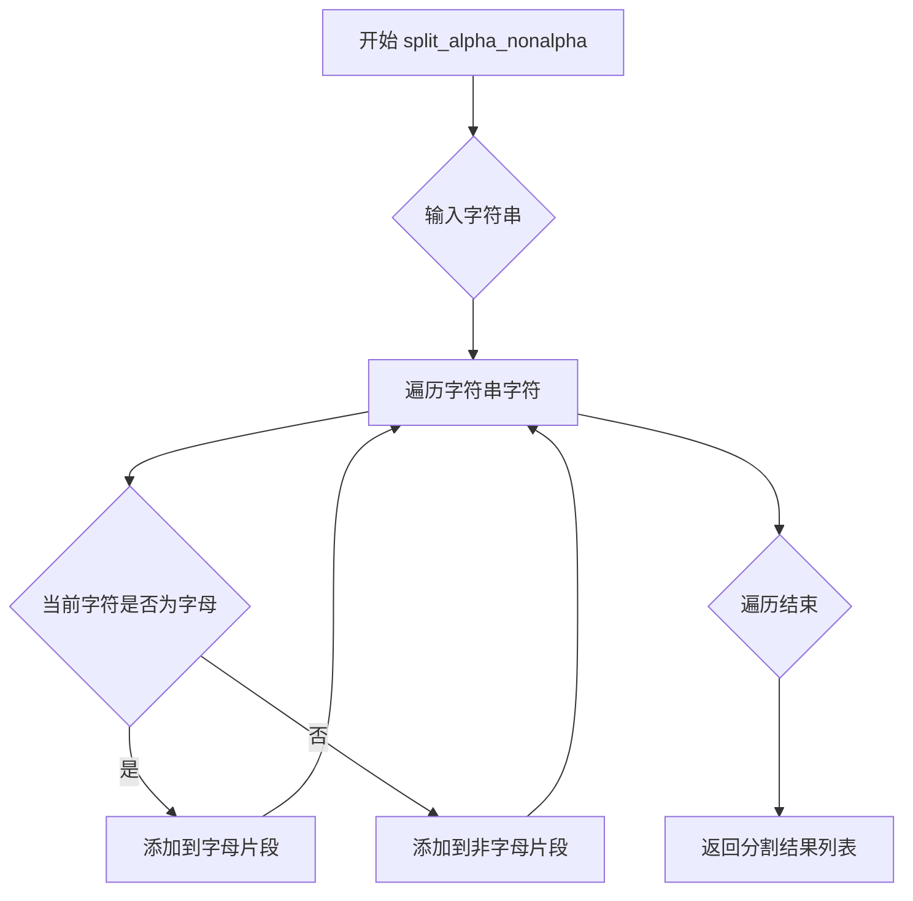

# `Bert-VITS2\tools\sentence.py` 详细设计文档

该代码是一个语言标注与分句处理工具，主要功能包括：检测文本是否为空、根据目标语言对文本进行语言标注（标记为[EN]、[ZH]、[JA]等）、按语言类型分割文本、以及按指定最大长度分割句子并标注语言。代码支持中、英、日三种语言的混合处理。

## 整体流程

```mermaid
graph TD
    A[开始] --> B{输入文本}
B --> C{调用函数类型?}
C --> D[markup_language]
C --> E[split_by_language]
C --> F[sentence_split]
C --> G[sentence_split_and_markup]
D --> D1[正则分句]
D1 --> D2{是否有目标语言?}
D2 -- 是 --> D3[调用split_alpha_nonalpha处理]
D2 -- 否 --> D4[遍历句子]
D3 --> D4
D4 --> D5[调用classify_language识别语言]
D5 --> D6[添加语言标记]
D6 --> D7[返回标注后的文本]
E --> E1[正则分句]
E1 --> E2{是否有目标语言?}
E2 -- 是 --> E3[调用split_alpha_nonalpha处理]
E2 -- 否 --> E4[遍历句子]
E3 --> E4
E4 --> E5[调用classify_language识别语言]
E5 --> E6[构建(文本, 语言)元组列表]
E6 --> E7[返回分割结果]
F --> F1[正则分句]
F1 --> F2[计算累积长度]
F2 --> F3{累计长度 >= max?}
F3 -- 是 --> F4[添加到句子列表并重置]
F3 -- 否 --> F2
F4 --> F5[处理剩余文本]
F5 --> F6[返回句子列表]
G --> G1{speaker_lang单语言?}
G1 -- 是 --> G2[调整lang为speaker_lang]
G1 -- 否 --> G3
G2 --> G3{lang是否为MIX?}
G3 -- 否 --> G4{max <= 0?}
G4 -- 是 --> G5[直接标注或调用markup_language]
G4 -- 否 --> G6[调用sentence_split分割]
G6 --> G7[遍历分割结果标注语言]
G3 -- 是 --> G8[直接返回原文本]
G5 --> G9[返回结果]
G7 --> G9
G8 --> G9
```

## 类结构

```
无类层次结构 (该文件为模块文件，仅包含函数)
```

## 全局变量及字段


### `pattern`
    
正则表达式字符串，用于匹配和分割文本中的标点符号

类型：`str`
    


### `sorted_target_languages`
    
排序后的目标语言列表，用于语言识别和过滤

类型：`list`
    


### `pre_lang`
    
前一个句子的语言，用于判断是否需要添加语言标签

类型：`str`
    


### `p`
    
文本处理位置指针，用于追踪和替换文本中的句子位置

类型：`int`
    


### `sentences`
    
正则分割后的句子列表，包含文本中的各个句子片段

类型：`list`
    


### `new_sentences`
    
处理后的新句子列表，用于存储细分后的句子

类型：`list`
    


### `lang`
    
当前句子的语言，通过语言分类器识别得到

类型：`str`
    


### `sentences_list`
    
返回的句子和语言标注列表，每项为(文本,语言)的元组

类型：`list`
    


### `start`
    
分割起始位置，标记当前语言片段的文本开始索引

类型：`int`
    


### `end`
    
分割结束位置，标记当前语言片段的文本结束索引

类型：`int`
    


### `count`
    
累积字符计数，用于控制单句最大长度分割

类型：`int`
    


### `i`
    
循环索引，用于遍历列表中的元素

类型：`int`
    


### `discarded_chars`
    
提取的分隔符列表，包含文本中的标点符号

类型：`list`
    


### `text`
    
输入/处理后的文本，作为函数的主要处理对象

类型：`str`
    


### `max`
    
最大句子长度，用于控制句子分割的阈值

类型：`int`
    


### `speaker_lang`
    
说话者支持的语言列表，用于限制语言识别范围

类型：`list`
    


    

## 全局函数及方法


### `check_is_none`

检查给定值是否为 `None`、空字符串或仅包含空白字符的字符串。

参数：

- `item`：任意类型，要检查的值

返回值：`bool`，如果值为 `None`、空字符串或仅包含空白字符则返回 `True`，否则返回 `False`

#### 流程图

```mermaid
flowchart TD
    A[开始检查 item] --> B{item is None?}
    B -->|是| C[返回 True]
    B -->|否| D{item 是字符串类型?}
    D -->|是| E{str(item).isspace?}
    D -->|否| F{str(item) == ''?}
    E -->|是| C
    E -->|否| F
    F -->|是| C
    F -->|否| G[返回 False]
```

#### 带注释源码

```python
def check_is_none(item) -> bool:
    """
    检查值是否为 None、空字符串或仅包含空白字符的字符串。
    
    参数:
        item: 任意类型，要检查的值
    
    返回:
        bool: 如果值为 None、空字符串或仅包含空白字符则返回 True，否则返回 False
    """
    # 检查 item 是否为 None
    return (
        item is None
        # 检查 item 是否为字符串且仅包含空白字符
        or (isinstance(item, str) and str(item).isspace())
        # 检查 item 转换为字符串后是否为空字符串
        or str(item) == ""
    )
```


### `markup_language`

为文本添加语言标记（Markup Language）。该函数通过正则表达式将文本按标点符号分割成句子，然后逐句调用语言分类器识别语言类型，最后在文本中插入语言标签（如 `[EN]`、`[ZH]`、`[JA]`）以标识各段文本的语言类型，支持对混合语言文本进行自动化语言标注。

#### 参数

- `text`：`str`，需要标记语言的目标文本
- `target_languages`：`list`，可选参数，指定目标语言列表，用于语言分类的约束

#### 返回值

- `str`，返回添加了语言标记的文本

#### 流程图

```mermaid
flowchart TD
    A([开始 markup_language]) --> B[定义标点符号正则模式 pattern]
    B --> C[使用 pattern 分割文本得到 sentences 列表]
    C --> D{target_languages 是否为 None?}
    D -->|否| E{sorted_target_languages 是否为特定组合?}
    D -->|是| F[初始化 pre_lang = 空字符串, p = 0]
    E -->|是| G[对每个 sentence 调用 split_alpha_nonalpha 进一步分割]
    E -->|否| F
    G --> F
    F --> H[遍历 sentences 中的每个 sentence]
    H --> I{check_is_none sentence?}
    I -->|是| J[跳过当前句子，继续下一个]
    I -->|否| K[调用 classify_language 识别语言]
    K --> L{pre_lang 是否为空?}
    L -->|是| M[在文本中替换第一个 sentence<br/>添加 [LANG] 标签]
    L -->|否| N{pre_lang 是否不等于当前 lang?}
    N -->|否| O[不添加标签，仅更新位置]
    N -->|是| P[在文本中替换 sentence<br/>添加 [pre_lang][lang] 标签]
    P --> Q[更新 p 位置]
    M --> R[更新 p 位置]
    O --> R
    R --> S[更新 pre_lang = lang]
    S --> T[继续处理下一个 sentence]
    J --> T
    T --> U{还有更多 sentence?}
    U -->|是| H
    U -->|否| V[在文本末尾添加 [pre_lang.upper()] 标签]
    V --> W([返回标记后的文本])
```

#### 带注释源码

```python
def markup_language(text: str, target_languages: list = None) -> str:
    """
    为文本添加语言标记（Markup Language）。
    
    该函数通过以下步骤为文本添加语言标签：
    1. 使用标点符号正则表达式分割文本为句子列表
    2. 如果指定了目标语言且为特定组合（en/zh, en/ja, en/ja/zh），
       则使用 split_alpha_nonalpha 进一步分割字母和非字母字符
    3. 遍历每个句子，使用 classify_language 识别语言
    4. 根据语言变化插入相应的语言标签 [LANG]
    
    参数:
        text: str, 需要标记语言的目标文本
        target_languages: list, 可选参数，指定目标语言列表
    
    返回:
        str, 返回添加了语言标记的文本
    """
    # 定义标点符号正则模式，包含中英文及日文标点符号
    pattern = (
        r"[\!\"\#\$\%\&\'\(\)\*\+\,\-\.\/\:\;\<\>\=\?\@\[\]\{\}\\\\\^\_\`"
        r"\！？。＂＃＄％＆＇（）＊＋，－／：；＜＝＞＠［＼］＾＿｀｛｜｝～｟｠｢｣､、〃》「」"
        r"『』【】〔〕〖〗〘〙〚〛〜〝〞〟〰〾〿–—‘\'\‛\“\”\„\‟…‧﹏.]+"
    )
    # 使用正则表达式按标点符号分割文本，返回句子列表
    sentences = re.split(pattern, text)

    # pre_lang: 记录上一次处理的语言类别
    # p: 记录当前处理位置（用于字符串替换时的索引偏移）
    pre_lang = ""
    p = 0

    # 如果指定了目标语言列表
    if target_languages is not None:
        # 对目标语言进行排序以进行统一比较
        sorted_target_languages = sorted(target_languages)
        # 针对特定语言组合（中文+英文、日文+英文、中英日三语）进行特殊处理
        if sorted_target_languages in [["en", "zh"], ["en", "ja"], ["en", "ja", "zh"]]:
            new_sentences = []
            # 对每个句子进一步按字母/非字母分割
            for sentence in sentences:
                new_sentences.extend(split_alpha_nonalpha(sentence))
            sentences = new_sentences

    # 遍历处理每个句子
    for sentence in sentences:
        # 跳过空句子（None、空字符串、纯空白）
        if check_is_none(sentence):
            continue

        # 调用语言分类器识别当前句子的语言
        lang = classify_language(sentence, target_languages)

        # 首次处理（pre_lang 为空）
        if pre_lang == "":
            # 替换文本中第一个匹配的句子，添加语言标签
            text = text[:p] + text[p:].replace(
                sentence, f"[{lang.upper()}]{sentence}", 1
            )
            # 更新位置偏移量，加上语言标签的长度
            p += len(f"[{lang.upper()}]")
        # 语言发生变化
        elif pre_lang != lang:
            # 替换句子，添加前一个语言标签和当前语言标签
            text = text[:p] + text[p:].replace(
                sentence, f"[{pre_lang.upper()}][{lang.upper()}]{sentence}", 1
            )
            # 更新位置偏移量
            p += len(f"[{pre_lang.upper()}][{lang.upper()}]")
        
        # 更新前一语言为当前语言
        pre_lang = lang
        # 计算下一个句子的起始位置：在剩余文本中查找当前句子的位置 + 句子长度
        p += text[p:].index(sentence) + len(sentence)
    
    # 在文本末尾添加最后一个语言标签
    text += f"[{pre_lang.upper()}]"

    return text
```


### `split_by_language`

该函数根据语言类型将输入文本分割成多个子字符串，并返回每个子字符串及其对应语言的列表。它使用正则表达式按标点符号分割句子，并根据 `target_languages` 参数决定是否需要进一步细分（如处理中英日混合文本）。

参数：

- `text`：`str`，需要分割的原始文本
- `target_languages`：`list`，可选，目标语言列表，用于指定需要识别和分割的语言种类，支持的语言包括 "en"（英语）、"zh"（中文）、"ja"（日语）

返回值：`list`，返回由元组组成的列表，每个元组包含两个元素：分割后的文本片段（`str`）和对应的语言类型（`str`）

#### 流程图



#### 带注释源码

```python
def split_by_language(text: str, target_languages: list = None) -> list:
    """
    按语言类型分割文本，返回 [(文本片段, 语言), ...] 的列表
    
    参数:
        text: 待分割的文本
        target_languages: 目标语言列表，如 ["zh", "en"] 或 ["zh", "ja", "en"]
    
    返回:
        由元组组成的列表，每个元组 (文本片段, 语言代码)
    """
    
    # 定义标点符号正则表达式，用于分割句子
    # 包含中英文标点符号：包括感叹号、引号、括号、冒号、分号、问号、中文标点等
    pattern = (
        r"[\!\"\#\$\%\&\'\(\)\*\+\,\-\.\/\:\;\<\>\=\?\@\[\]\{\}\\\\\^\_\`"
        r"\！？\。＂＃＄％＆＇（）＊＋，－／：；＜＝＞＠［＼］＾＿｀｛｜｝～｟｠｢｣､、〃》「」"
        r"『』【】〔〕〖〗〘〙〚〛〜〝〞〟〰〾〿–—‘\'\‛\“\”\„\‟…‧﹏.]+"
    )
    
    # 使用正则表达式按标点符号分割文本为句子列表
    sentences = re.split(pattern, text)

    # 初始化变量
    pre_lang = ""      # 前一个句子的语言
    start = 0          # 当前片段的起始位置
    end = 0            # 当前片段的结束位置
    sentences_list = [] # 存储结果的列表

    # 如果指定了目标语言，且是特定的组合（中英、中日、中英日）
    # 则需要进一步细分每个句子（将字母和非字母字符分开）
    if target_languages is not None:
        sorted_target_languages = sorted(target_languages)
        # 检查是否为需要进一步细分的语言组合
        if sorted_target_languages in [["en", "zh"], ["en", "ja"], ["en", "ja", "zh"]]:
            new_sentences = []
            # 对每个句子调用 split_alpha_nonalpha 进行细分
            for sentence in sentences:
                new_sentences.extend(split_alpha_nonalpha(sentence))
            sentences = new_sentences

    # 遍历处理每个句子
    for sentence in sentences:
        # 跳过空句子
        if check_is_none(sentence):
            continue

        # 使用语言分类器确定当前句子的语言
        lang = classify_language(sentence, target_languages)

        # 计算当前句子在原始文本中的结束位置
        # 从上一次结束位置开始查找当前句子的位置
        end += text[end:].index(sentence)
        
        # 如果语言发生了变化（非首次且与前一个语言不同）
        if pre_lang != "" and pre_lang != lang:
            # 将前一个语言对应的文本片段添加到结果列表
            sentences_list.append((text[start:end], pre_lang))
            # 更新起始位置为当前结束位置
            start = end
        
        # 更新结束位置（加上当前句子的长度）
        end += len(sentence)
        # 更新前一个语言为当前语言
        pre_lang = lang
    
    # 将最后一段文本（最后一个语言对应的部分）添加到结果列表
    sentences_list.append((text[start:], pre_lang))

    # 返回分割后的结果列表
    return sentences_list
```


### `sentence_split`

该函数根据指定的最大长度限制，将文本按标点符号分割成多个句子片段，每个片段累加长度不超过设定的最大值，返回分割后的句子列表。

参数：

- `text`：`str`，待分割的文本字符串
- `max`：`int`，每个句子片段的最大长度阈值

返回值：`list`，分割后的句子列表

#### 流程图

```mermaid
flowchart TD
    A[开始] --> B[定义标点符号正则模式]
    B --> C[使用re.split按标点分割文本得到sentences]
    C --> D[使用re.findall找出所有标点符号discarded_chars]
    D --> E[初始化sentences_list空列表, count=0, p=0]
    E --> F{遍历discarded_chars}
    F -->|对于每个标点符号i| G[count += len{sentences[i]} + len{i}]
    G --> H{count >= max?}
    H -->|是| I[将text[p:p+count]去掉首尾空格后加入sentences_list]
    I --> J[p += count, count = 0]
    J --> F
    H -->|否| F
    F --> K{遍历完成}
    K --> L{p < len{text}?}
    L -->|是| M[将text[p:]加入sentences_list]
    L -->|否| N[返回sentences_list]
    M --> N
```

#### 带注释源码

```
def sentence_split(text: str, max: int) -> list:
    # 定义标点符号正则模式：包含中英文常用标点符号
    # 包括: 感叹号、逗号、括号、破折号、加号、减号、句号、分号、问号等中英文标点
    pattern = r"[!(),—+\-.:;?？。，、；：]+"
    
    # re.split: 按标点符号分割文本，返回不包含标点的句子片段列表
    # 例如: "你好，世界！你好" -> ['你好', '世界', '你好']
    sentences = re.split(pattern, text)
    
    # re.findall: 找出文本中所有匹配的标点符号，返回标点符号列表
    # 例如: "你好，世界！你好" -> [',', '！']
    discarded_chars = re.findall(pattern, text)

    # 初始化结果列表和计数器
    # sentences_list: 存储分割后的句子
    # count: 当前累计的字符长度
    # p: 当前处理到的文本位置指针
    sentences_list, count, p = [], 0, 0

    # 按被分割的标点符号遍历
    # i: 当前标点符号在discarded_chars中的索引
    # discarded_chars: 遍历过程中的临时变量，代表当前标点符号
    for i, discarded_chars in enumerate(discarded_chars):
        # 累加当前句子长度和标点符号长度
        count += len(sentences[i]) + len(discarded_chars)
        
        # 当累计长度达到或超过最大长度限制时
        if count >= max:
            # 从原始文本中截取对应长度的片段，去除首尾空格后加入结果列表
            sentences_list.append(text[p : p + count].strip())
            # 移动指针到下一个起始位置
            p += count
            # 重置计数器
            count = 0

    # 处理最后剩余的文本（如果还有剩余内容）
    if p < len(text):
        sentences_list.append(text[p:])

    return sentences_list
```


### `sentence_split_and_markup`

该函数是文本分句与语言标注的综合性入口函数，根据指定的语言模式和最大句子长度，对输入文本进行分割处理，并对每个句子添加语言标签（如[EN]、[ZH]、[JA]等），支持自动检测、语言指定和混合语言三种模式。

参数：

- `text`：`str`，待处理的原始文本内容
- `max`：`int`，默认为50，句子最大字符长度阈值，超过该长度则进行分句
- `lang`：`str`，默认为"auto"，语言模式选择，可选值为"auto"（自动检测）、"mix"（不标注）、或其他语言代码（如"en"、"zh"等）
- `speaker_lang`：`list`，默认为None，讲话者支持的语言列表，若仅支持一种语言则优先使用该语言

返回值：`list`，返回处理后的句子列表，每个元素为带有语言标签的字符串

#### 流程图

```mermaid
flowchart TD
    A[开始 sentence_split_and_markup] --> B{ speaker_lang 长度是否为1}
    B -->|是| C[将 lang 设为 speaker_lang[0]]
    B -->|否| D{ lang 是否为 "MIX"}
    C --> D
    D -->|是| E[直接将 text 放入 sentences_list]
    D -->|否| F{ max <= 0}
    F -->|是| G{ lang 是否为 "AUTO"}
    G -->|是| H[调用 markup_language 对整个文本标注]
    G -->|否| I[使用 f'[{lang.upper()}]' 包装文本]
    F -->|否| J[调用 sentence_split 按 max 分句]
    J --> K[遍历每个句子]
    K --> L{ check_is_none 当前句子}
    L -->|是| K
    L -->|否| M{ lang 是否为 "AUTO"}
    M -->|是| N[调用 markup_language 标注句子]
    M -->|否| O[使用 f'[{lang.upper()}]' 包装句子]
    N --> P[添加到 sentences_list]
    O --> P
    P --> K
    H --> Q
    I --> Q
    E --> Q
    Q[遍历打印 debug 日志] --> R[返回 sentences_list]
```

#### 带注释源码

```python
def sentence_split_and_markup(text, max=50, lang="auto", speaker_lang=None):
    """
    综合分句与标注函数
    
    根据语言模式和最大长度对文本进行分句，并添加语言标签
    
    参数:
        text: str - 待处理的原始文本
        max: int - 句子最大字符长度，默认为50
        lang: str - 语言模式，"auto"自动检测，"mix"不标注，其他为指定语言
        speaker_lang: list - 讲话者支持的语言列表
    
    返回:
        list - 带语言标签的句子列表
    """
    
    # 如果该speaker只支持一种语言
    # 逻辑：如果指定了 speaker_lang 且只有一个元素
    # 则强制使用该语言作为默认语言，即使传入的 lang 不匹配
    if speaker_lang is not None and len(speaker_lang) == 1:
        # 调试日志：当传入语言与speaker_lang不匹配时提示
        if lang.upper() not in ["AUTO", "MIX"] and lang.lower() != speaker_lang[0]:
            logging.debug(
                f'lang "{lang}" is not in speaker_lang {speaker_lang},automatically set lang={speaker_lang[0]}'
            )
        # 覆盖 lang 参数为 speaker 支持的唯一语言
        lang = speaker_lang[0]

    # 初始化结果列表
    sentences_list = []
    
    # 非 MIX 模式：需要进行分句和语言标注
    if lang.upper() != "MIX":
        # 情况1：max <= 0 不进行分句处理
        if max <= 0:
            # 根据 lang 模式选择标注方式
            # AUTO 模式：调用 markup_language 自动检测语言
            # 其他模式：直接用指定语言标签包装
            sentences_list.append(
                markup_language(text, speaker_lang)
                if lang.upper() == "AUTO"
                else f"[{lang.upper()}]{text}[{lang.upper()}]"
            )
        else:
            # 情况2：max > 0 先分句再标注
            # 遍历分句结果，对每个非空句子进行语言标注
            for i in sentence_split(text, max):
                if check_is_none(i):
                    continue  # 跳过空句子
                sentences_list.append(
                    markup_language(i, speaker_lang)
                    if lang.upper() == "AUTO"
                    else f"[{lang.upper()}]{i}[{lang.upper()}]"
                )
    else:
        # MIX 模式：不做任何处理，直接返回原文本
        sentences_list.append(text)

    # 调试输出：打印每个处理后的句子
    for i in sentences_list:
        logging.debug(i)

    # 返回最终结果列表
    return sentences_list
```


### `classify_language`

该函数为外部导入的语言分类核心函数，用于根据文本内容识别所属语言类型，支持多语言混合场景下的语言检测，是整个语言标记和分割功能的基础。

参数：

- `sentence`：`str`，需要进行语言分类的文本片段
- `target_languages`：`list`，目标语言列表，用于限定分类范围，传入`None`时表示不限制语言种类

返回值：`str`，识别出的语言代码（如"en"、"zh"、"ja"等）

#### 流程图



#### 带注释源码

```python
# 该函数定义位于 tools.classify_language 模块中
# 由于是外部导入函数，以下为根据调用方式推断的函数签名和实现逻辑

def classify_language(sentence: str, target_languages: list = None) -> str:
    """
    语言分类函数 - 根据文本内容识别语言类型
    
    参数:
        sentence: 需要进行语言分类的文本片段
        target_languages: 可选的语言列表，用于限定分类范围
    
    返回值:
        识别出的语言代码字符串，如 'en', 'zh', 'ja' 等
    
    实现逻辑推测:
        1. 预处理文本（去除空白字符等）
        2. 根据 target_languages 确认可选语言范围
        3. 使用字符集匹配或统计方法识别语言
        4. 返回置信度最高的语言代码
    """
    # 实际实现可能包含以下逻辑:
    # - 基于Unicode范围检测（中文: \u4e00-\u9fff, 日语: \u3040-\u309f等）
    # - 基于字符频率统计的语言识别
    # - 基于正则表达式模式的语言特征匹配
    
    # 示例实现逻辑:
    if not sentence or sentence.isspace():
        return "unknown"
    
    # 根据target_languages过滤可选语言
    # 如果target_languages为None，则使用全部支持的语言
    
    # 进行语言检测并返回结果
    # 返回值格式为语言代码字符串
```


### `split_alpha_nonalpha`

该函数是一个外部导入函数，用于将输入字符串按照字符类型（字母字符与非字母字符）进行分割。它接受一个字符串参数，将其分割成字母部分和非字母部分的列表，并返回该列表。此函数主要用于处理混合语言的文本，将连续的语言片段进一步细分为更小的单元，以便后续的语言分类处理。

参数：

-  `sentence`：`str`，待分割的字符串输入

返回值：`list`，包含分割后的字母和非字母子串的列表

#### 流程图



#### 带注释源码

```
# 该函数定义位于 tools.classify_language 模块中
# 此处仅展示外部调用部分的上下文

# 在 markup_language 和 split_by_language 函数中的调用方式：
new_sentences = []
for sentence in sentences:
    # split_alpha_nonalpha 将字符串按字母/非字母分割
    # 例如："Hello世界" -> ["Hello", "世界"]
    new_sentences.extend(split_alpha_nonalpha(sentence))
sentences = new_sentences
```

**注意**：该函数的实际源码定义位于 `tools.classify_language` 模块中，当前代码文件仅导入了该函数并对其进行调用。从调用方式推断，该函数接收一个字符串参数并返回一个字符串列表，列表中交替包含字母字符段和非字母字符段。


## 关键组件


### 语言分类模块 (classify_language)

调用外部模块对句子进行语言分类识别，支持中文、日语、英语等多语言检测

### 字母数字分离模块 (split_alpha_nonalpha)

将混合语言文本拆分为字母/数字和非字母/数字片段，用于精细化语言边界处理

### 空值检查函数 (check_is_none)

检查输入项是否为None、空字符串或仅包含空白字符，用于流程中的过滤逻辑

### 语言标记函数 (markup_language)

为核心函数，根据检测到的语言为文本添加语言标签（如[EN]、[ZH]、[JA]），支持多语言混合文本的自动标注

### 按语言分割函数 (split_by_language)

将文本按语言边界分割为(文本片段, 语言类型)元组列表，支持指定目标语言列表进行过滤

### 句子分割函数 (sentence_split)

基于标点符号模式将文本分割为句子，支持指定最大长度限制，返回句子列表

### 综合分割标注函数 (sentence_split_and_markup)

整合句子分割与语言标记功能，支持自动模式、AUTO模式和MIX模式，适配单一语言speaker场景

### 标点符号正则模式

用于匹配中英文标点符号的正则表达式定义，支持语言标记和句子分割的分割依据


## 问题及建议


### 已知问题

-   **正则表达式模式重复定义**：在`markup_language`和`split_by_language`函数中，分割文本的正则表达式模式被重复定义了两次，违反DRY原则，维护时需同步修改多处
-   **字符串操作效率低下**：在`markup_language`函数中使用`text[:p] + text[p:].replace(sentence, ...)`进行字符串替换，每次操作都会创建新字符串，时间复杂度较高
-   **硬编码的语言组合判断**：目标语言支持判断使用了硬编码的列表`[["en", "zh"], ["en", "ja"], ["en", "ja", "zh"]]`，扩展性差，新增语言支持需修改代码
-   **返回值类型不一致**：`sentence_split`返回字符串列表，而`split_by_language`返回元组列表，调用方需要了解不同函数的返回格式
-   **变量名语义混淆**：`sentence_split`函数中循环变量`discarded_chars`被复用为循环计数器`i`，且变量名单复数混用造成理解困难
-   **边界条件处理缺陷**：`markup_language`函数无论文本是否为空都会在末尾添加语言标记`f"[{pre_lang.upper()}]"`，可能导致无意义的标记
-   **缺少输入参数验证**：各函数未对输入参数进行有效性检查，如`text`为`None`、`max`为负数或`target_languages`类型不正确等情况
-   **下标查找潜在风险**：`split_by_language`中使用`text[end:].index(sentence)`查找子串位置，若文本结构异常可能抛出`ValueError`
-   **类型转换隐患**：`check_is_none`函数对非字符串对象调用`str(item)`进行转换，可能产生意外行为或性能开销
-   **语言标记重复问题**：当`pre_lang == ""`时仅添加当前语言标记，但后续处理中可能产生重复的语言标记格式

### 优化建议

-   将重复的正则表达式模式提取为模块级常量，避免代码重复并便于维护
-   使用列表或其他可变数据结构替代字符串拼接操作，或考虑使用正则表达式的`re.sub`配合回调函数实现标记替换
-   将语言组合判断逻辑改为基于集合的动态检查，支持任意语言组合的灵活配置
-   统一函数返回值格式，或在文档中明确说明各函数返回值的具体结构
-   重命名循环变量，使用更清晰的变量名如`sentence_index`或`split_index`
-   在函数入口处添加输入参数验证，处理空值、类型错误等边界情况
-   优化末尾语言标记的添加逻辑，仅在文本非空且有意义时添加
-   使用更安全的位置查找方式，或添加异常处理逻辑
-   优化`check_is_none`函数，针对不同类型对象采用更合适的空值判断方式
-   检查并消除语言标记的重复添加逻辑，确保输出格式的一致性

## 其它


### 设计目标与约束

本代码库的设计目标是为多语言文本处理提供统一的语言标注和分割功能，支持中文、日文、英文三种语言的语言自动检测、标记和句子拆分。主要约束包括：目标语言仅支持"en"、"zh"、"ja"三种语言的任意组合；文本分割受max参数约束，默认为50字符；依赖外部模块classify_language和split_alpha_nonalpha进行语言分类。

### 错误处理与异常设计

代码采用宽松的错误处理策略。对于空值或空字符串，通过check_is_none函数统一处理，返回True表示空，False表示非空。在split_by_language和sentence_split中使用try-except处理index方法可能抛出的ValueError。当text[p:].index(sentence)找不到子串时，会抛出异常导致程序中断。日志记录使用logging.debug，在生产环境需调整日志级别。

### 数据流与状态机

markup_language函数的数据流：输入文本 -> 正则分割句子 -> 遍历句子判断语言 -> 动态替换文本添加语言标签 -> 输出带标签文本。split_by_language函数的数据流：输入文本 -> 正则分割 -> 判断语言 -> 累积构建片段列表 -> 输出(文本,语言)元组列表。sentence_split函数的数据流：输入文本和max长度 -> 正则分割句子和标点 -> 交替遍历计算累计长度 -> 达到max时切分新句子 -> 输出句子列表。

### 外部依赖与接口契约

主要依赖包括：Python标准库logging模块用于日志输出；第三方库regex（re的增强版）用于正则表达式处理；本地模块tools.classify_language提供classify_language函数和split_alpha_nonalpha函数。接口契约方面：classify_language(sentence, target_languages)接受句子字符串和目标语言列表，返回语言代码字符串；split_alpha_nonalpha(text)接受文本返回分割后的列表。

### 性能考虑与优化空间

当前实现存在多次字符串替换操作，时间复杂度较高。正则表达式pattern在每个函数中重复定义，可提取为模块级常量。split_by_language函数中text[end:].index(sentence)操作在字符串较长时效率低下，建议使用find或预先缓存位置信息。markup_language函数中多次切片和拼接会产生中间字符串对象，可考虑使用列表join方式优化。目标语言排序比较使用sorted(target_languages)每次调用都重新排序，可缓存结果。

### 配置与常量定义

语言标签pattern定义在函数内部重复出现三次，应提取为模块级常量。支持的标点符号集合硬编码在正则表达式中，不利于维护和扩展。目标语言组合判断逻辑仅支持特定三种组合 [["en", "zh"], ["en", "ja"], ["en", "ja", "zh"]]，扩展性差。

### 测试与边界条件

主要边界条件包括：空字符串输入返回空字符串；仅包含标点符号的文本返回空列表；target_languages为None时使用默认语言检测；max参数为0或负数时的处理逻辑。测试用例应覆盖：纯中文文本、纯英文文本、混合语言文本、中英日三种混合、仅标点符号、空输入等场景。

### 版本兼容性与迁移考虑

代码使用regex库而非标准re库，需确保部署环境已安装。当前classify_language的接口假设返回语言代码，若该函数实现变化会影响本模块。建议添加版本注解，记录依赖库版本要求。split_by_language的输出格式为(文本,语言)元组列表，若需JSON格式需额外转换层。


    