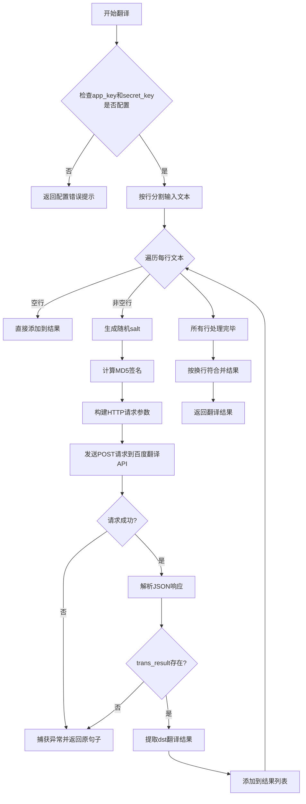
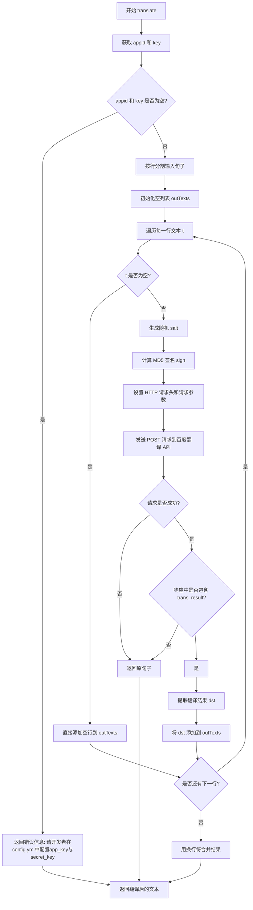
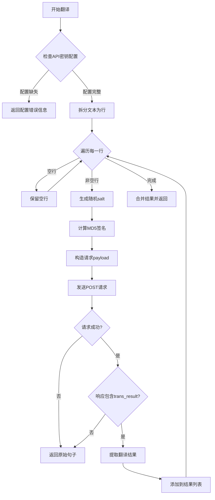

# `Bert-VITS2\tools\translate.py` 详细设计文档

这是一个百度翻译API的Python封装模块，提供文本翻译功能，支持多语言互译（如中文、英文、日文等），通过MD5签名验证与百度翻译服务端进行交互，将用户输入的文本发送至翻译API并返回翻译结果。

## 整体流程



## 类结构

```
无类层次结构（纯函数模块）
```

## 全局变量及字段


### `config.translate_config.app_key`
    
百度翻译API的应用ID，用于身份验证

类型：`str`
    


### `config.translate_config.secret_key`
    
百度翻译API的密钥，用于生成请求签名

类型：`str`
    


    

## 全局函数及方法


### `translate`

这是一个用于调用百度翻译API进行文本翻译的全局函数，支持多行文本翻译，自动处理签名计算和API请求，将输入的句子翻译成指定的目标语言。

参数：

- `Sentence`：`str`，待翻译的语句，支持多行文本
- `to_Language`：`str`，目标语言，默认为 "jp"（日语）
- `from_Language`：`str`，待翻译语句的语言，默认为 ""（空字符串表示自动检测）

返回值：`str`，翻译后的语句；出错时返回原句子或错误提示信息

#### 流程图



#### 带注释源码

```python
def translate(Sentence: str, to_Language: str = "jp", from_Language: str = ""):
    """
    :param Sentence: 待翻译语句
    :param from_Language: 待翻译语句语言
    :param to_Language: 目标语言
    :return: 翻译后语句 出错时返回None

    常见语言代码：中文 zh 英语 en 日语 jp
    """
    # 从配置中获取百度翻译API的appid和secret_key
    appid = config.translate_config.app_key
    key = config.translate_config.secret_key
    
    # 检查API密钥是否已配置
    if appid == "" or key == "":
        return "请开发者在config.yml中配置app_key与secret_key"
    
    # 百度翻译API接口地址
    url = "https://fanyi-api.baidu.com/api/trans/vip/translate"
    
    # 将输入的句子按行分割，支持多行翻译
    texts = Sentence.splitlines()
    outTexts = []
    
    # 遍历每一行进行处理
    for t in texts:
        if t != "":
            # 生成随机盐值，用于签名计算
            # 签名计算 参考文档 https://api.fanyi.baidu.com/product/113
            salt = str(random.randint(1, 100000))
            
            # 构造签名字符串：appid + 原文 + salt + secret_key
            signString = appid + t + salt + key
            
            # 使用MD5算法计算签名
            hs = hashlib.md5()
            hs.update(signString.encode("utf-8"))
            signString = hs.hexdigest()
            
            # 如果未指定源语言，使用自动检测
            if from_Language == "":
                from_Language = "auto"
            
            # 设置HTTP请求头
            headers = {"Content-Type": "application/x-www-form-urlencoded"}
            
            # 构造请求参数
            payload = {
                "q": t,                      # 待翻译文本
                "from": from_Language,        # 源语言
                "to": to_Language,            # 目标语言
                "appid": appid,               # 应用ID
                "salt": salt,                 # 随机盐值
                "sign": signString,           # 签名
            }
            
            # 发送翻译请求
            try:
                response = requests.post(
                    url=url, data=payload, headers=headers, timeout=3
                )
                # 解析JSON响应
                response = response.json()
                
                # 检查是否包含翻译结果
                if "trans_result" in response.keys():
                    result = response["trans_result"][0]
                    if "dst" in result.keys():
                        dst = result["dst"]
                        outTexts.append(dst)
            except Exception:
                # 发生异常时返回原句子
                return Sentence
        else:
            # 空行直接添加到结果中，保持行结构
            outTexts.append(t)
    
    # 用换行符合并所有翻译结果并返回
    return "\n".join(outTexts)
```

## 关键组件


### 百度翻译API封装模块

该模块提供对百度翻译API的封装，通过MD5签名认证机制实现多语言文本翻译功能，支持自动语言检测和批量文本处理。

### 全局函数 translate

**描述**: 百度翻译API调用函数，支持将文本翻译为目标语言

**参数**:
- `Sentence: str` - 待翻译语句
- `to_Language: str` - 目标语言，默认为"jp"(日语)
- `from_Language: str` - 源语言，默认为空字符串(自动检测)

**返回值**:
- `str` - 翻译后的文本，失败时返回原始文本或错误信息

**mermaid流程图**:



**源码**:
```python
def translate(Sentence: str, to_Language: str = "jp", from_Language: str = ""):
    """
    :param Sentence: 待翻译语句
    :param from_Language: 待翻译语句语言
    :to_Language: 目标语言
    :return: 翻译后语句 出错时返回None

    常见语言代码：中文 zh 英语 en 日语 jp
    """
    # 获取API配置密钥
    appid = config.translate_config.app_key
    key = config.translate_config.secret_key
    
    # 密钥校验
    if appid == "" or key == "":
        return "请开发者在config.yml中配置app_key与secret_key"
    
    # 百度翻译API端点
    url = "https://fanyi-api.baidu.com/api/trans/vip/translate"
    
    # 按行分割待翻译文本
    texts = Sentence.splitlines()
    outTexts = []
    
    # 逐行处理
    for t in texts:
        if t != "":
            # 签名计算 参考文档 https://api.fanyi.baidu.com/product/113
            salt = str(random.randint(1, 100000))  # 随机盐值
            signString = appid + t + salt + key    # 签名原文
            hs = hashlib.md5()                     # MD5哈希对象
            hs.update(signString.encode("utf-8")) # 更新签名
            signString = hs.hexdigest()            # 获取签名
            
            # 源语言为空时使用自动检测
            if from_Language == "":
                from_Language = "auto"
            
            # 请求头设置
            headers = {"Content-Type": "application/x-www-form-urlencoded"}
            
            # 请求参数
            payload = {
                "q": t,
                "from": from_Language,
                "to": to_Language,
                "appid": appid,
                "salt": salt,
                "sign": signString,
            }
            
            # 发送HTTP POST请求
            try:
                response = requests.post(
                    url=url, data=payload, headers=headers, timeout=3
                )
                response = response.json()
                
                # 解析响应结果
                if "trans_result" in response.keys():
                    result = response["trans_result"][0]
                    if "dst" in result.keys():
                        dst = result["dst"]
                        outTexts.append(dst)
            except Exception:
                # 异常时返回原始句子
                return Sentence
        else:
            # 空行保持原样
            outTexts.append(t)
    
    # 合并翻译结果
    return "\n".join(outTexts)
```

### 关键组件信息

#### 配置模块导入

- **名称**: config
- **描述**: 全局配置模块，提供translate_config包含app_key和secret_key

#### 随机数生成

- **名称**: random.randint
- **描述**: 生成用于签名计算的随机salt值

#### MD5签名计算

- **名称**: hashlib.md5
- **描述**: 使用MD5算法生成百度API所需的签名

#### HTTP请求

- **名称**: requests.post
- **描述**: 发送POST请求到百度翻译API，超时时间设为3秒

### 潜在技术债务与优化空间

1. **异常处理过于宽泛**: 使用`except Exception`捕获所有异常，应区分网络错误、API错误、JSON解析错误
2. **缺少重试机制**: API调用失败时直接返回原文本，应增加重试逻辑
3. **无日志记录**: 缺少日志功能，难以排查生产环境问题
4. **超时时间固定**: 3秒超时可能不适应复杂文本翻译
5. **无连接池复用**: 每次请求创建新连接，应使用session复用
6. **批量处理效率低**: 逐行翻译，应考虑合并请求或异步处理
7. **错误信息不明确**: 返回原始句子无法区分成功与失败
8. **无请求频率控制**: 可能触发API限流

### 其它项目

#### 设计目标与约束

- 目标：封装百度翻译Vip API实现多语言翻译
- 约束：必须使用MD5签名认证，超时时间3秒

#### 错误处理与异常设计

- 配置缺失：返回配置错误提示字符串
- 网络异常：返回原始句子
- API返回错误：静默忽略错误结果

#### 外部依赖与接口契约

- 依赖：config模块、random模块、hashlib模块、requests库
- 接口：translate(Sentence, to_Language, from_Language) -> str


## 问题及建议


### 已知问题

- **返回值类型不一致**：函数文档注释声称“出错时返回None”，但实际实现中配置为空时返回字符串错误信息，翻译异常时返回原句，正常时返回翻译后的字符串
- **异常处理过于宽泛**：使用`except Exception`捕获所有异常，不区分具体错误类型（网络错误、超时、API错误等），且异常被静默吞掉，无日志记录
- **逐行翻译效率低下**：百度翻译API支持批量翻译（一次请求可翻译多句），代码却按`splitlines()`逐行发送请求，增加网络开销和延迟
- **未处理API错误响应**：代码仅检查`trans_result`是否存在，但不处理百度API返回的错误码（如54001签名错误、54003调用频率超限、58001语言不支持等）
- **缺少日志记录**：无任何日志输出，运行时无法追踪请求状态、错误原因和性能指标
- **参数命名不一致**：函数参数使用`to_Language`和`from_Language`（snake_case），与代码风格不统一且与常见Python风格（snake_case）混用
- **缺少类型注解**：函数返回值没有类型注解，降低了代码的可读性和IDE支持
- **MD5签名安全性**：虽然百度API要求MD5签名，但MD5已被认为不安全，应在注释中说明这是第三方API要求

### 优化建议

- **统一返回值类型**：定义统一的返回结果结构体或使用异常抛出，避免返回类型混合字符串和None
- **实现批量翻译**：将待翻译文本一次性发送给百度API，减少网络请求次数，提升性能
- **完善错误处理**：区分网络异常、API业务错误、配置错误等具体异常类型，分别处理并记录日志
- **添加重试机制**：对于瞬时性错误（如网络波动、超时）实现指数退避重试
- **统一代码风格**：参数命名统一使用snake_case，并添加完整的类型注解
- **增加日志记录**：使用标准logging模块记录请求URL、响应状态、耗时、错误信息等
- **提取配置和常量**：将URL、headers等提取为模块级常量，salt生成逻辑可封装为独立函数
- **考虑接口抽象**：为翻译功能定义抽象基类，便于单元测试和后续更换翻译服务提供商

## 其它


### 设计目标与约束

**设计目标**：实现一个轻量级的翻译模块，通过调用百度翻译API将用户输入的文本翻译为指定目标语言，支持多语言翻译、批量处理和自动语言检测。

**约束条件**：
- 仅支持百度翻译API（https://fanyi-api.baidu.com/api/trans/vip/translate）
- 依赖config模块获取app_key和secret_key
- 网络请求超时时间设置为3秒
- 单次请求处理单行文本，不支持长文本批量翻译
- 输入语言支持自动检测（from_Language为空时）
- 目标语言需使用标准语言代码（如zh、en、jp等）

### 错误处理与异常设计

**异常处理策略**：
- 配置缺失：当app_key或secret_key为空时，返回提示字符串"请开发者在config.yml中配置app_key与secret_key"
- 网络请求异常：捕获所有Exception异常，静默处理并返回原句子
- API返回错误：检查响应中是否包含trans_result字段，若无则跳过当前行翻译
- 空行处理：保留空行，不进行翻译处理

**待改进点**：
- 当前使用宽泛的Exception捕获，建议区分网络超时、连接错误、API错误等具体异常类型
- 建议增加重试机制处理临时性网络故障
- 建议增加错误日志记录便于问题排查

### 数据流与状态机

**数据输入流程**：
1. 接收待翻译句子（Sentence）和目标语言（to_Language）
2. 使用splitlines()按换行符分割为行列表

**数据处理流程**：
```
输入句子 
→ 按行分割 
→ 遍历每行 
→ 非空行执行翻译 
→ 空行保留 
→ 合并结果
```

**单个文本翻译流程**：
```
文本 
→ 生成随机salt 
→ 拼接签名字符串 
→ 计算MD5签名 
→ 构建请求payload 
→ 发送POST请求 
→ 解析JSON响应 
→ 提取trans_result.dst 
→ 添加到结果列表
```

**状态机描述**：
- IDLE：初始状态
- SPLITTING：分割输入文本
- TRANSLATING：执行翻译请求
- PARSING：解析API响应
- COMPLETED：完成并返回结果

### 外部依赖与接口契约

**外部依赖**：
- requests库：用于发送HTTP POST请求
- hashlib.md5：用于计算百度API签名
- random.randint：用于生成随机salt值
- config模块：用于获取翻译API凭证

**接口契约**：
- 函数签名：translate(Sentence: str, to_Language: str = "jp", from_Language: str = "") -> str
- 输入参数：
  - Sentence：待翻译的字符串，支持多行
  - to_Language：目标语言代码，默认为"jp"（日语）
  - from_Language：源语言代码，默认为空表示自动检测
- 返回值：翻译后的字符串，失败时返回原始句子或错误提示字符串
- 异常：不抛出异常，内部处理所有异常情况

**第三方API**：
- 百度翻译API vip版本
- API端点：https://fanyi-api.baidu.com/api/trans/vip/translate
- 认证方式：appid + salt + secret_key的MD5签名
- 请求方式：HTTP POST application/x-www-form-urlencoded

### 配置管理

**配置来源**：通过config.translate_config对象获取

**配置项**：
- config.translate_config.app_key：百度翻译应用ID
- config.translate_config.secret_key：百度翻译应用密钥

**配置要求**：
- app_key和secret_key不能为空
- 需在config.yml或config.py中预先配置
- 密钥属于敏感信息，应避免硬编码和提交到版本控制系统

### 性能考量

**当前性能特征**：
- 单行翻译串行执行，无并发优化
- 每次请求独立生成salt和签名
- 网络请求超时3秒

**性能瓶颈**：
- 多行文本翻译时，API调用串行执行，耗时长
- 未实现请求结果缓存

**优化建议**：
- 考虑使用asyncio或线程池实现并行翻译
- 可增加请求间隔避免触发百度API频率限制
- 可考虑实现简单的内存缓存存储常用翻译结果

### 日志设计

**当前日志状态**：无日志记录功能

**建议增加的日志**：
- INFO级别：记录翻译请求发起、翻译结果返回
- WARNING级别：记录API返回错误、空配置警告
- ERROR级别：记录网络异常、解析失败等错误

**日志格式建议**：
```
[时间] [级别] 模块名 - 消息内容
例如：[2024-01-01 10:00:00] INFO translate - 开始翻译，原始文本长度: 100
```

### 测试策略

**当前测试状态**：无单元测试

**建议测试用例**：
1. 配置完整时的正常翻译功能测试
2. 配置缺失时的错误处理测试
3. 空字符串输入测试
4. 单行文本翻译测试
5. 多行文本翻译测试
6. 网络超时异常测试
7. API返回错误格式测试
8. 不同目标语言参数测试

**测试数据建议**：
- 中文到日文：中译日测试用例
- 英文到中文：英译中测试用例
- 自动语言检测：混合语言测试

### 安全考虑

**当前安全措施**：
- 使用MD5签名进行API认证
- 使用HTTPS加密传输

**安全风险**：
- config模块中的密钥可能因配置不当而暴露
- 签名计算中密钥参与明文拼接存在理论风险（MD5已不建议用于安全场景）

**安全建议**：
- 将密钥存储在环境变量或安全的配置中心
- 考虑迁移到更安全的签名算法
- 增加请求频率限制防止滥用
- API响应中的错误信息不应暴露给最终用户

### 版本兼容性

**Python版本要求**：
- 兼容Python 3.x版本
- 使用标准库hashlib和random，无版本特定依赖

**第三方库依赖**：
- requests库（建议版本2.x或3.x）
- 依赖config模块的具体实现

**兼容性注意事项**：
- hashlib.md5()的使用方式在Python 2和3中兼容
- str类型处理需注意编码（代码中已使用utf-8编码）
- response.json()方法在requests库各版本中稳定可用


    