# `Bert-VITS2\train_ms.py` 详细设计文档

这是一个VITS（Variational Inference with adversarial learning for end-to-end Text-to-Speech）多说话人、多语言TTS模型训练脚本，支持分布式训练、混合精度训练、多个判别器（MultiPeriodDiscriminator、DurationDiscriminator、WavLMDiscriminator）和多语言BERT特征（中文、英语、日语）的端到端训练流程。

## 整体流程

```mermaid
graph TD
    A[开始 run()] --> B[加载环境变量配置]
    B --> C[初始化分布式训练环境 nccl/gloo]
    C --> D[解析命令行参数和配置文件]
    D --> E[创建数据加载器 train_loader/eval_loader]
    E --> F[初始化生成器网络 SynthesizerTrn]
    F --> G[初始化判别器网络 net_d/net_wd/net_dur_disc]
    G --> H[创建优化器 optim_g/optim_d/optim_wd/optim_dur_disc]
    H --> I[加载预训练检查点（可选）]
    I --> J[创建学习率调度器 scheduler_g/scheduler_d/scheduler_wd/scheduler_dur_disc]
    J --> K[主训练循环 for epoch in range(epoch_str, hps.train.epochs + 1)]
    K --> L{是否为主节点 rank==0}
    L -- 是 --> M[调用 train_and_evaluate 训练和评估]
    L -- 否 --> N[调用 train_and_evaluate 仅训练]
    M --> O[保存检查点和日志]
    N --> O
    O --> P[学习率调度步进]
    P --> Q{是否还有epoch}
    Q -- 是 --> K
    Q -- 否 --> R[结束]
```

## 类结构

```
主训练模块 (train_ms.py)
├── 核心函数
│   ├── run() - 主入口函数
│   ├── train_and_evaluate() - 训练和评估函数
│   └── evaluate() - 评估函数
├── 外部导入模块
│   ├── data_utils
│   │   ├── TextAudioSpeakerLoader
│   │   ├── TextAudioSpeakerCollate
│   │   └── DistributedBucketSampler
│   ├── models
│   │   ├── SynthesizerTrn (生成器)
│   │   ├── MultiPeriodDiscriminator (判别器)
│   │   ├── DurationDiscriminator (时长判别器)
│   │   └── WavLMDiscriminator (WavLM判别器)
│   ├── losses
│   │   ├── generator_loss
│   │   ├── discriminator_loss
│   │   ├── feature_loss
│   │   ├── kl_loss
│   │   └── WavLMLoss
│   └── mel_processing
│       ├── mel_spectrogram_torch
│       └── spec_to_mel_torch
```

## 全局变量及字段


### `global_step`
    
全局训练步数，记录已完成的迭代次数

类型：`int`
    


### `backend`
    
分布式通信后端，根据操作系统选择nccl或gloo

类型：`str`
    


### `rank`
    
当前进程在分布式训练中的全局排名

类型：`int`
    


### `local_rank`
    
当前进程使用的本地GPU设备编号

类型：`int`
    


### `n_gpus`
    
参与分布式训练的总GPU数量/世界大小

类型：`int`
    


### `hps`
    
超参数配置对象，包含训练、模型、数据等配置信息

类型：`object`
    


### `model_dir`
    
模型检查点保存目录路径

类型：`str`
    


### `mas_noise_scale_initial`
    
MAS(Monotonic Alignment Search)初始噪声缩放因子

类型：`float`
    


### `noise_scale_delta`
    
噪声缩放随训练步数递减的增量值

类型：`float`
    


### `epoch_str`
    
起始训练轮次，用于断点续训

类型：`int`
    


### `dur_resume_lr`
    
时长判别器恢复训练时的学习率

类型：`float`
    


### `wd_resume_lr`
    
WavLM判别器恢复训练时的学习率

类型：`float`
    


### `SynthesizerTrn.SynthesizerTrn.use_noise_scaled_mas`
    
是否启用噪声缩放MAS策略控制对齐搜索

类型：`bool`
    


### `SynthesizerTrn.SynthesizerTrn.mas_noise_scale_initial`
    
MAS模块初始噪声缩放值

类型：`float`
    


### `SynthesizerTrn.SynthesizerTrn.noise_scale_delta`
    
噪声缩放随训练衰减的步进增量

类型：`float`
    


### `SynthesizerTrn.SynthesizerTrn.current_mas_noise_scale`
    
当前MAS噪声缩放动态值

类型：`float`
    


### `SynthesizerTrn.SynthesizerTrn.enc_p.bert_proj`
    
中文BERT编码器输出投影层

类型：`Module`
    


### `SynthesizerTrn.SynthesizerTrn.enc_p.en_bert_proj`
    
英文BERT编码器输出投影层

类型：`Module`
    


### `SynthesizerTrn.SynthesizerTrn.enc_p.ja_bert_proj`
    
日文BERT编码器输出投影层

类型：`Module`
    
    

## 全局函数及方法


### `run()`

主入口函数，负责初始化和调度整个VITS训练流程，包括环境变量配置解析、分布式训练初始化、数据加载器构建、模型与优化器配置、学习率调度器设置、混合精度训练配置，以及启动训练循环。

参数：
- 无

返回值：`None`，无返回值

#### 流程图

```mermaid
flowchart TD
    A[开始 run] --> B[解析环境变量配置]
    B --> C{检查环境变量是否已设置}
    C -->|未设置| D[从config加载环境变量]
    C -->|已设置| E[跳过]
    D --> E
    E --> F[初始化分布式训练<br/>nccl/gloo backend]
    F --> G[解析命令行参数<br/>config.yml路径、模型路径]
    G --> H[创建模型输出目录]
    H --> I[加载超参数配置hps]
    I --> J[比较config路径是否一致<br/>如不一致则替换配置]
    J --> K[设置随机种子和CUDA设备]
    K --> L{当前进程RANK是否为0}
    L -->|是| M[创建Logger和TensorBoard writers]
    L -->|否| N[跳过创建writers]
    M --> O
    N --> O
    O[创建训练数据集<br/>TextAudioSpeakerLoader] --> P[创建分布式采样器<br/>DistributedBucketSampler]
    P --> Q[创建训练DataLoader]
    Q --> R{是否为分布式训练}
    R -->|是| S[创建验证数据集和DataLoader]
    R -->|否| T[跳过验证集]
    S --> U
    T --> U
    U[配置MAS噪声参数<br/>use_noise_scaled_mas] --> V{是否使用DurationDiscriminator}
    V -->|是| W[创建DurationDiscriminator]
    V -->|否| X[设为None]
    W --> Y
    X --> Y
    Y[检查是否使用Spk conditioned encoder] --> Z[创建生成器模型<br/>SynthesizerTrn]
    Z --> AA[冻结指定BERT编码器参数<br/>ZH/EN/JP bert]
    AA --> AB[创建判别器<br/>MultiPeriodDiscriminator]
    AB --> AC[创建WavLM判别器]
    AC --> AD[创建生成器优化器AdamW]
    AD --> AE[创建判别器优化器]
    AF[创建DurationDisc优化器] --> AG
    AE --> AG
    AG[使用DDP包装所有模型]
    AG --> AH{是否使用底模}
    AH -->|是| AI[下载底模checkpoint]
    AH -->|否| AJ
    AI --> AJ
    AJ[尝试加载DUR模型checkpoint] --> AK{加载成功?}
    AK -->|是| AL[恢复DUR优化器状态和lr]
    AK -->|否| AM[初始化DUR模型]
    AL --> AN
    AM --> AN
    AN[尝试加载G和D模型checkpoint] --> AO{加载成功?}
    AO -->|是| AP[恢复G和D优化器状态和lr<br/>恢复epoch和global_step]
    AO -->|否| AQ[初始化epoch为1, global_step为0]
    AP --> AR
    AQ --> AR
    AR[尝试加载WD模型checkpoint] --> AS{加载成功?}
    AS -->|是| AT[恢复WD优化器状态和lr]
    AS -->|否| AU
    AT --> AV
    AU --> AV
    AV[创建学习率调度器<br/>ExponentialLR for G/D/WD/DUR]
    AV --> AW[创建GradScaler<br/>混合精度训练]
    AW --> AX[创建WavLMLoss]
    AX --> AY[训练循环: epoch from epoch_str to epochs]
    AY --> AZ{当前RANK是否为0}
    AZ -->|是| BA[调用train_and_evaluate<br/>传入writers]
    AZ -->|否| BB[调用train_and_evaluate<br/>writers为None]
    BA --> BC
    BB --> BC
    BC[更新学习率调度器<br/>scheduler_g/d/wd/dur step]
    BC --> AY
    AY --> BD{所有epoch完成?}
    BD -->|否| AY
    BD --> BE[结束]
```

#### 带注释源码

```python
def run():
    # 环境变量解析 - 从配置文件中读取环境变量并设置到os.environ
    # 支持MASTER_ADDR, MASTER_PORT, WORLD_SIZE, RANK, LOCAL_RANK等分布式训练环境变量
    envs = config.train_ms_config.env
    for env_name, env_value in envs.items():
        if env_name not in os.environ.keys():
            print("加载config中的配置{}".format(str(env_value)))
            os.environ[env_name] = str(env_value)
    print(
        "加载环境变量 \nMASTER_ADDR: {},\nMASTER_PORT: {},\nWORLD_SIZE: {},\nRANK: {},\nLOCAL_RANK: {}".format(
            os.environ["MASTER_ADDR"],
            os.environ["MASTER_PORT"],
            os.environ["WORLD_SIZE"],
            os.environ["RANK"],
            os.environ["LOCAL_RANK"],
        )
    )

    # 根据操作系统选择分布式后端: Windows使用gloo, 其他使用nccl
    backend = "nccl"
    if platform.system() == "Windows":
        backend = "gloo"  # If Windows,switch to gloo backend.
    
    # 初始化分布式训练进程组，使用环境变量方式初始化
    dist.init_process_group(
        backend=backend,
        init_method="env://",
        timeout=datetime.timedelta(seconds=300),
    )  # Use torchrun instead of mp.spawn
    
    # 获取当前进程的rank和local_rank，以及总GPU数量
    rank = dist.get_rank()
    local_rank = int(os.environ["LOCAL_RANK"])
    n_gpus = dist.get_world_size()

    # 命令行/config.yml配置解析
    # 创建参数解析器，支持-c指定配置文件路径，-m指定模型/数据集路径
    parser = argparse.ArgumentParser()
    parser.add_argument(
        "-c",
        "--config",
        type=str,
        default=config.train_ms_config.config_path,
        help="JSON file for configuration",
    )
    parser.add_argument(
        "-m",
        "--model",
        type=str,
        help="数据集文件夹路径，请注意，数据不再默认放在/logs文件夹下。如果需要用命令行配置，请声明相对于根目录的路径",
        default=config.dataset_path,
    )
    args, _ = parser.parse_known_args()
    
    # 构建模型输出目录路径
    model_dir = os.path.join(args.model, config.train_ms_config.model)
    if not os.path.exists(model_dir):
        os.makedirs(model_dir, exist_ok=True)
    
    # 从配置文件加载超参数
    hps = utils.get_hparams_from_file(args.config)
    hps.model_dir = model_dir
    
    # 如果命令行指定的配置文件与默认配置不同，则用命令行配置覆盖默认配置
    if os.path.realpath(args.config) != os.path.realpath(
        config.train_ms_config.config_path
    ):
        with open(args.config, "r", encoding="utf-8") as f:
            data = f.read()
        with open(config.train_ms_config.config_path, "w", encoding="utf-8") as f:
            f.write(data)

    # 设置随机种子确保可复现性，并设置当前GPU设备
    torch.manual_seed(hps.train.seed)
    torch.cuda.set_device(local_rank)

    # 声明全局变量用于跟踪训练步数
    global global_step
    
    # 仅主进程(rank=0)创建日志记录器和TensorBoard writers用于监控训练过程
    if rank == 0:
        logger = utils.get_logger(hps.model_dir)
        logger.info(hps)
        utils.check_git_hash(hps.model_dir)
        writer = SummaryWriter(log_dir=hps.model_dir)
        writer_eval = SummaryWriter(log_dir=os.path.join(hps.model_dir, "eval"))
    
    # 创建训练数据集加载器，支持多说话人和文本-音频-说话人数据
    train_dataset = TextAudioSpeakerLoader(hps.data.training_files, hps.data)
    
    # 使用DistributedBucketSampler进行分布式训练的数据分桶采样，优化变长音频的处理效率
    train_sampler = DistributedBucketSampler(
        train_dataset,
        hps.train.batch_size,
        [32, 300, 400, 500, 600, 700, 800, 900, 1000],
        num_replicas=n_gpus,
        rank=rank,
        shuffle=True,
    )
    collate_fn = TextAudioSpeakerCollate()
    
    # 创建训练DataLoader，配置num_workers、pin_memory、persistent_workers等优化参数
    train_loader = DataLoader(
        train_dataset,
        num_workers=min(config.train_ms_config.num_workers, os.cpu_count() - 1),
        shuffle=False,
        pin_memory=True,
        collate_fn=collate_fn,
        batch_sampler=train_sampler,
        persistent_workers=True,
        prefetch_factor=4,
    )  # DataLoader config could be adjusted.
    
    # 仅主进程创建验证数据集和DataLoader
    if rank == 0:
        eval_dataset = TextAudioSpeakerLoader(hps.data.validation_files, hps.data)
        eval_loader = DataLoader(
            eval_dataset,
            num_workers=0,
            shuffle=False,
            batch_size=1,
            pin_memory=True,
            drop_last=False,
            collate_fn=collate_fn,
        )
    
    # 根据配置决定是否使用VITS2的noise scaled MAS(单调对齐搜索)或VITS1的普通MAS
    if (
        "use_noise_scaled_mas" in hps.model.keys()
        and hps.model.use_noise_scaled_mas is True
    ):
        print("Using noise scaled MAS for VITS2")
        mas_noise_scale_initial = 0.01
        noise_scale_delta = 2e-6
    else:
        print("Using normal MAS for VITS1")
        mas_noise_scale_initial = 0.0
        noise_scale_delta = 0.0
    
    # 根据配置决定是否使用Duration Discriminator(VITS2)
    if (
        "use_duration_discriminator" in hps.model.keys()
        and hps.model.use_duration_discriminator is True
    ):
        print("Using duration discriminator for VITS2")
        net_dur_disc = DurationDiscriminator(
            hps.model.hidden_channels,
            hps.model.hidden_channels,
            3,
            0.1,
            gin_channels=hps.model.gin_channels if hps.data.n_speakers != 0 else 0,
        ).cuda(local_rank)
    else:
        net_dur_disc = None
    
    # 检查speaker conditioned encoder配置
    if (
        "use_spk_conditioned_encoder" in hps.model.keys()
        and hps.model.use_spk_conditioned_encoder is True
    ):
        if hps.data.n_speakers == 0:
            raise ValueError(
                "n_speakers must be > 0 when using spk conditioned encoder to train multi-speaker model"
            )
    else:
        print("Using normal encoder for VITS1")

    # 创建主生成器模型SynthesizerTrn (VITS模型)
    net_g = SynthesizerTrn(
        len(symbols),
        hps.data.filter_length // 2 + 1,
        hps.train.segment_size // hps.data.hop_length,
        n_speakers=hps.data.n_speakers,
        mas_noise_scale_initial=mas_noise_scale_initial,
        noise_scale_delta=noise_scale_delta,
        **hps.model,
    ).cuda(local_rank)

    # 可选冻结中文BERT编码器参数
    if getattr(hps.train, "freeze_ZH_bert", False):
        print("Freezing ZH bert encoder !!!")
        for param in net_g.enc_p.bert_proj.parameters():
            param.requires_grad = False

    # 可选冻结英文BERT编码器参数
    if getattr(hps.train, "freeze_EN_bert", False):
        print("Freezing EN bert encoder !!!")
        for param in net_g.enc_p.en_bert_proj.parameters():
            param.requires_grad = False

    # 可选冻结日文BERT编码器参数
    if getattr(hps.train, "freeze_JP_bert", False):
        print("Freezing JP bert encoder !!!")
        for param in net_g.enc_p.ja_bert_proj.parameters():
            param.requires_grad = False

    # 创建多周期判别器(Multi-Period Discriminator)用于GAN训练
    net_d = MultiPeriodDiscriminator(hps.model.use_spectral_norm).cuda(local_rank)
    
    # 创建WavLM判别器用于自监督语音质量评估
    net_wd = WavLMDiscriminator(
        hps.model.slm.hidden, hps.model.slm.nlayers, hps.model.slm.initial_channel
    ).cuda(local_rank)
    
    # 创建生成器优化器AdamW，只优化requires_grad为True的参数
    optim_g = torch.optim.AdamW(
        filter(lambda p: p.requires_grad, net_g.parameters()),
        hps.train.learning_rate,
        betas=hps.train.betas,
        eps=hps.train.eps,
    )
    
    # 创建判别器优化器
    optim_d = torch.optim.AdamW(
        net_d.parameters(),
        hps.train.learning_rate,
        betas=hps.train.betas,
        eps=hps.train.eps,
    )
    
    # 创建WavLM判别器优化器
    optim_wd = torch.optim.AdamW(
        net_wd.parameters(),
        hps.train.learning_rate,
        betas=hps.train.betas,
        eps=hps.train.eps,
    )
    
    # 如果使用Duration Discriminator，创建对应的优化器
    if net_dur_disc is not None:
        optim_dur_disc = torch.optim.AdamW(
            net_dur_disc.parameters(),
            hps.train.learning_rate,
            betas=hps.train.betas,
            eps=hps.train.eps,
        )
    else:
        optim_dur_disc = None
    
    # 使用DistributedDataParallel (DDP)包装所有模型以支持分布式训练
    net_g = DDP(net_g, device_ids=[local_rank], bucket_cap_mb=512)
    net_d = DDP(net_d, device_ids=[local_rank], bucket_cap_mb=512)
    net_wd = DDP(net_wd, device_ids=[local_rank], bucket_cap_mb=512)
    if net_dur_disc is not None:
        net_dur_disc = DDP(
            net_dur_disc,
            device_ids=[local_rank],
            bucket_cap_mb=512,
        )

    # 如果配置使用底模，则下载预训练checkpoint
    if config.train_ms_config.base["use_base_model"]:
        utils.download_checkpoint(
            hps.model_dir,
            config.train_ms_config.base,
            token=config.openi_token,
            mirror=config.mirror,
        )
    
    # 初始化学习率恢复变量
    dur_resume_lr = hps.train.learning_rate
    wd_resume_lr = hps.train.learning_rate
    
    # 尝试加载Duration Discriminator的checkpoint进行断点续训
    if net_dur_disc is not None:
        try:
            _, _, dur_resume_lr, epoch_str = utils.load_checkpoint(
                utils.latest_checkpoint_path(hps.model_dir, "DUR_*.pth"),
                net_dur_disc,
                optim_dur_disc,
                skip_optimizer=(
                    hps.train.skip_optimizer if "skip_optimizer" in hps.train else True
                ),
            )
            if not optim_dur_disc.param_groups[0].get("initial_lr"):
                optim_dur_disc.param_groups[0]["initial_lr"] = dur_resume_lr
        except:
            print("Initialize dur_disc")

    # 尝试加载生成器和判别器的checkpoint
    try:
        _, optim_g, g_resume_lr, epoch_str = utils.load_checkpoint(
            utils.latest_checkpoint_path(hps.model_dir, "G_*.pth"),
            net_g,
            optim_g,
            skip_optimizer=(
                hps.train.skip_optimizer if "skip_optimizer" in hps.train else True
            ),
        )
        _, optim_d, d_resume_lr, epoch_str = utils.load_checkpoint(
            utils.latest_checkpoint_path(hps.model_dir, "D_*.pth"),
            net_d,
            optim_d,
            skip_optimizer=(
                hps.train.skip_optimizer if "skip_optimizer" in hps.train else True
            ),
        )
        if not optim_g.param_groups[0].get("initial_lr"):
            optim_g.param_groups[0]["initial_lr"] = g_resume_lr
        if not optim_d.param_groups[0].get("initial_lr"):
            optim_d.param_groups[0]["initial_lr"] = d_resume_lr

        epoch_str = max(epoch_str, 1)
        # 从checkpoint文件名中获取global_step
        global_step = int(
            utils.get_steps(utils.latest_checkpoint_path(hps.model_dir, "G_*.pth"))
        )
        print(
            f"******************检测到模型存在，epoch为 {epoch_str}，gloabl step为 {global_step}*********************"
        )
    except Exception as e:
        print(e)
        epoch_str = 1
        global_step = 0

    # 尝试加载WavLM判别器的checkpoint
    try:
        _, optim_wd, wd_resume_lr, epoch_str = utils.load_checkpoint(
            utils.latest_checkpoint_path(hps.model_dir, "WD_*.pth"),
            net_wd,
            optim_wd,
            skip_optimizer=(
                hps.train.skip_optimizer if "skip_optimizer" in hps.train else True
            ),
        )
        if not optim_wd.param_groups[0].get("initial_lr"):
            optim_wd.param_groups[0]["initial_lr"] = wd_resume_lr
    except Exception as e:
        print(e)

    # 创建学习率调度器，使用指数衰减策略
    scheduler_g = torch.optim.lr_scheduler.ExponentialLR(
        optim_g, gamma=hps.train.lr_decay, last_epoch=epoch_str - 2
    )
    scheduler_d = torch.optim.lr_scheduler.ExponentialLR(
        optim_d, gamma=hps.train.lr_decay, last_epoch=epoch_str - 2
    )
    scheduler_wd = torch.optim.lr_scheduler.ExponentialLR(
        optim_wd, gamma=hps.train.lr_decay, last_epoch=epoch_str - 2
    )
    if net_dur_disc is not None:
        scheduler_dur_disc = torch.optim.lr_scheduler.ExponentialLR(
            optim_dur_disc, gamma=hps.train.lr_decay, last_epoch=epoch_str - 2
        )
    else:
        scheduler_dur_disc = None
    
    # 创建GradScaler用于混合精度训练(AMP/BF16)
    scaler = GradScaler(enabled=hps.train.bf16_run)

    # 创建WavLM损失计算器
    wl = WavLMLoss(
        hps.model.slm.model,
        net_wd,
        hps.data.sampling_rate,
        hps.model.slm.sr,
    ).to(local_rank)

    # 主训练循环: 遍历每个epoch
    for epoch in range(epoch_str, hps.train.epochs + 1):
        # 根据rank决定是否执行训练和评估(主进程执行)或仅执行训练(其他进程)
        if rank == 0:
            train_and_evaluate(
                rank,
                local_rank,
                epoch,
                hps,
                [net_g, net_d, net_dur_disc, net_wd, wl],
                [optim_g, optim_d, optim_dur_disc, optim_wd],
                [scheduler_g, scheduler_d, scheduler_dur_disc, scheduler_wd],
                scaler,
                [train_loader, eval_loader],
                logger,
                [writer, writer_eval],
            )
        else:
            train_and_evaluate(
                rank,
                local_rank,
                epoch,
                hps,
                [net_g, net_d, net_dur_disc, net_wd, wl],
                [optim_g, optim_d, optim_dur_disc, optim_wd],
                [scheduler_g, scheduler_d, scheduler_dur_disc, scheduler_wd],
                scaler,
                [train_loader, None],
                None,
                None,
            )
        # 每个epoch结束后更新学习率
        scheduler_g.step()
        scheduler_d.step()
        scheduler_wd.step()
        if net_dur_disc is not None:
            scheduler_dur_disc.step()
```


### `train_and_evaluate`

执行单个epoch的训练和评估，包含生成器和判别器的训练循环、日志记录、TensorBoard可视化以及周期性模型保存。

参数：

- `rank`：`int`，分布式训练中的全局进程排名（GPU编号）
- `local_rank`：`int`，本地进程排名，用于确定CUDA设备
- `epoch`：`int`，当前训练的轮次编号
- `hps`：`utils.HyperParameters`，超参数配置对象，包含训练、数据、模型等所有配置
- `nets`：`List[torch.nn.Module]`，网络模型列表，顺序为 [生成器net_g, 判别器net_d, 时长判别器net_dur_disc, WavLM判别器net_wd, WavLM损失wl]
- `optims`：`List[torch.optim.Optimizer]`，优化器列表，顺序为 [optim_g, optim_d, optim_dur_disc, optim_wd]
- `schedulers`：`List[torch.optim.lr_scheduler]`，学习率调度器列表
- `scaler`：`torch.cuda.amp.GradScaler`，混合精度训练的梯度缩放器
- `loaders`：`List[DataLoader]`，数据加载器列表，[train_loader, eval_loader]
- `logger`：`logging.Logger`，日志记录器，用于输出训练信息
- `writers`：`List[SummaryWriter]`，TensorBoard写入器列表，[writer, writer_eval]

返回值：`None`，无返回值

#### 流程图

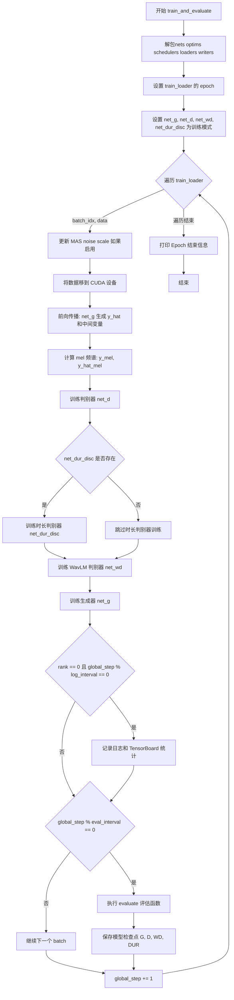

#### 带注释源码

```python
def train_and_evaluate(
    rank,               # int: 分布式全局排名
    local_rank,         # int: 本地GPU排名
    epoch,              # int: 当前epoch编号
    hps,                # HyperParameters: 超参数配置对象
    nets,               # List: [net_g, net_d, net_dur_disc, net_wd, wl]
    optims,             # List: [optim_g, optim_d, optim_dur_disc, optim_wd]
    schedulers,         # List: 学习率调度器列表
    scaler,             # GradScaler: 混合精度梯度缩放器
    loaders,            # List: [train_loader, eval_loader]
    logger,             # Logger: 日志记录器
    writers,            # List: TensorBoard writers
):
    """执行单个epoch的训练和评估"""
    
    # ====== 1. 解包网络、优化器、调度器和数据加载器 ======
    net_g, net_d, net_dur_disc, net_wd, wl = nets
    optim_g, optim_d, optim_dur_disc, optim_wd = optims
    scheduler_g, scheduler_d, scheduler_dur_disc, scheduler_wd = schedulers
    train_loader, eval_loader = loaders
    
    # 只有主进程(rank==0)需要 writers 来记录 TensorBoard
    if writers is not None:
        writer, writer_eval = writers

    # ====== 2. 设置数据采样器 epoch，保证数据分片一致性 ======
    train_loader.batch_sampler.set_epoch(epoch)
    global global_step  # 全局训练步数

    # ====== 3. 设置所有网络为训练模式 ======
    net_g.train()
    net_d.train()
    net_wd.train()
    if net_dur_disc is not None:
        net_dur_disc.train()

    # ====== 4. 遍历训练数据集 ======
    for batch_idx, (
        x, x_lengths,           # 文本序列及其长度
        spec, spec_lengths,     # 频谱及其长度
        y, y_lengths,           # 音频波形及其长度
        speakers,               # 说话人ID
        tone,                   # 音调
        language,               # 语言标识
        bert, ja_bert, en_bert, # 多语言BERT特征
    ) in enumerate(tqdm(train_loader)):  # tqdm显示进度条
        
        # ====== 4.1 更新 MAS (Monotonic Alignment Search) 噪声 scale ======
        # 用于VITS2的噪声缩放MAS
        if net_g.module.use_noise_scaled_mas:
            current_mas_noise_scale = (
                net_g.module.mas_noise_scale_initial
                - net_g.module.noise_scale_delta * global_step
            )
            # 确保噪声scale不为负
            net_g.module.current_mas_noise_scale = max(current_mas_noise_scale, 0.0)

        # ====== 4.2 将数据异步移到指定GPU ======
        x, x_lengths = x.cuda(local_rank, non_blocking=True), x_lengths.cuda(
            local_rank, non_blocking=True
        )
        spec, spec_lengths = spec.cuda(
            local_rank, non_blocking=True
        ), spec_lengths.cuda(local_rank, non_blocking=True)
        y, y_lengths = y.cuda(local_rank, non_blocking=True), y_lengths.cuda(
            local_rank, non_blocking=True
        )
        speakers = speakers.cuda(local_rank, non_blocking=True)
        tone = tone.cuda(local_rank, non_blocking=True)
        language = language.cuda(local_rank, non_blocking=True)
        bert = bert.cuda(local_rank, non_blocking=True)
        ja_bert = ja_bert.cuda(local_rank, non_blocking=True)
        en_bert = en_bert.cuda(local_rank, non_blocking=True)

        # ====== 5. 生成器前向传播 ======
        # 启用混合精度自动转换
        with autocast(enabled=hps.train.bf16_run, dtype=torch.bfloat16):
            # 调用生成器网络，返回多个输出
            (
                y_hat,           # 生成的音频
                l_length,        # 时长损失
                attn,            # 对齐注意力矩阵
                ids_slice,       # 随机切片索引
                x_mask,          # 文本掩码
                z_mask,          # 潜在变量掩码
                (z, z_p, m_p, logs_p, m_q, logs_q),  # 潜在变量
                (hidden_x, logw, logw_, logw_sdp),   # 中间hidden state和时长
                g,                                       # 全局条件(说话人embedding)
            ) = net_g(
                x, x_lengths, spec, spec_lengths,
                speakers, tone, language, bert, ja_bert, en_bert,
            )
            
            # ====== 5.1 计算mel频谱 ======
            # 将频谱转换为mel频谱用于损失计算
            mel = spec_to_mel_torch(
                spec,
                hps.data.filter_length,
                hps.data.n_mel_channels,
                hps.data.sampling_rate,
                hps.data.mel_fmin,
                hps.data.mel_fmax,
            )
            # 从mel频谱中切片出对应音频片段
            y_mel = commons.slice_segments(
                mel, ids_slice, hps.train.segment_size // hps.data.hop_length
            )
            # 从生成的音频计算mel频谱
            y_hat_mel = mel_spectrogram_torch(
                y_hat.squeeze(1).float(),
                hps.data.filter_length,
                hps.data.n_mel_channels,
                hps.data.sampling_rate,
                hps.data.hop_length,
                hps.data.win_length,
                hps.data.mel_fmin,
                hps.data.mel_fmax,
            )

            # ====== 5.2 切片真实音频 ======
            y = commons.slice_segments(
                y, ids_slice * hps.data.hop_length, hps.train.segment_size
            )

            # ====== 6. 训练主判别器 net_d ======
            # 对生成音频detach避免反向传播到生成器
            y_d_hat_r, y_d_hat_g, _, _ = net_d(y, y_hat.detach())
            with autocast(enabled=hps.train.bf16_run, dtype=torch.bfloat16):
                # 计算判别器损失
                loss_disc, losses_disc_r, losses_disc_g = discriminator_loss(
                    y_d_hat_r, y_d_hat_g
                )
                loss_disc_all = loss_disc

            # ====== 6.1 训练时长判别器 net_dur_disc (可选) ======
            if net_dur_disc is not None:
                # 两种时长预测方式: regular 和 SDP
                y_dur_hat_r, y_dur_hat_g = net_dur_disc(
                    hidden_x.detach(),
                    x_mask.detach(),
                    logw_.detach(),
                    logw.detach(),
                    g.detach(),
                )
                y_dur_hat_r_sdp, y_dur_hat_g_sdp = net_dur_disc(
                    hidden_x.detach(),
                    x_mask.detach(),
                    logw_.detach(),
                    logw_sdp.detach(),
                    g.detach(),
                )
                # 合并两种预测结果
                y_dur_hat_r = y_dur_hat_r + y_dur_hat_r_sdp
                y_dur_hat_g = y_dur_hat_g + y_dur_hat_g_sdp
                
                with autocast(enabled=hps.train.bf16_run, dtype=torch.bfloat16):
                    (
                        loss_dur_disc,
                        losses_dur_disc_r,
                        losses_dur_disc_g,
                    ) = discriminator_loss(y_dur_hat_r, y_dur_hat_g)
                    loss_dur_disc_all = loss_dur_disc
                
                # 时长判别器优化步骤
                optim_dur_disc.zero_grad()
                scaler.scale(loss_dur_disc_all).backward()
                scaler.unscale_(optim_dur_disc)
                grad_norm_dur = commons.clip_grad_value_(
                    net_dur_disc.parameters(), None
                )
                scaler.step(optim_dur_disc)

            # ====== 6.2 主判别器优化步骤 ======
            optim_d.zero_grad()
            scaler.scale(loss_disc_all).backward()
            scaler.unscale_(optim_d)
            if getattr(hps.train, "bf16_run", False):
                torch.nn.utils.clip_grad_norm_(parameters=net_d.parameters(), max_norm=200)
            grad_norm_d = commons.clip_grad_value_(net_d.parameters(), None)
            scaler.step(optim_d)

            # ====== 7. 训练 WavLM 判别器 net_wd ======
            with autocast(enabled=hps.train.bf16_run, dtype=torch.bfloat16):
                # WavLM判别器损失
                loss_slm = wl.discriminator(
                    y.detach().squeeze(), y_hat.detach().squeeze()
                ).mean()

            optim_wd.zero_grad()
            scaler.scale(loss_slm).backward()
            scaler.unscale_(optim_wd)
            grad_norm_wd = commons.clip_grad_value_(net_wd.parameters(), None)
            scaler.step(optim_wd)

            # ====== 8. 训练生成器 net_g ======
            with autocast(enabled=hps.train.bf16_run, dtype=torch.bfloat16):
                # 重新获取判别器特征用于生成器损失计算
                y_d_hat_r, y_d_hat_g, fmap_r, fmap_g = net_d(y, y_hat)
                
                # 时长判别器对生成器的输出
                if net_dur_disc is not None:
                    _, y_dur_hat_g = net_dur_disc(hidden_x, x_mask, logw_, logw, g)
                    _, y_dur_hat_g_sdp = net_dur_disc(hidden_x, x_mask, logw_, logw_sdp, g)
                    y_dur_hat_g = y_dur_hat_g + y_dur_hat_g_sdp
                
                with autocast(enabled=hps.train.bf16_run, dtype=torch.bfloat16):
                    # ====== 8.1 计算各种生成器损失 ======
                    # 时长损失
                    loss_dur = torch.sum(l_length.float())
                    # Mel频谱重建损失 (L1)
                    loss_mel = F.l1_loss(y_mel, y_hat_mel) * hps.train.c_mel
                    # KL散度损失 (VAE潜在空间对齐)
                    loss_kl = kl_loss(z_p, logs_q, m_p, logs_p, z_mask) * hps.train.c_kl
                    # 特征匹配损失 (判别器中间层特征)
                    loss_fm = feature_loss(fmap_r, fmap_g)
                    # 生成器对抗损失
                    loss_gen, losses_gen = generator_loss(y_d_hat_g)
                    # WavLM语言模型损失
                    loss_lm = wl(y.detach().squeeze(), y_hat.squeeze()).mean()
                    loss_lm_gen = wl.generator(y_hat.squeeze())

                    # ====== 8.2 合并所有生成器损失 ======
                    loss_gen_all = (
                        loss_gen
                        + loss_fm
                        + loss_mel
                        + loss_dur
                        + loss_kl
                        + loss_lm
                        + loss_lm_gen
                    )
                    # 加上时长判别器损失(如果存在)
                    if net_dur_disc is not None:
                        loss_dur_gen, losses_dur_gen = generator_loss(y_dur_hat_g)
                        loss_gen_all += loss_dur_gen

            # ====== 8.3 生成器优化步骤 ======
            optim_g.zero_grad()
            scaler.scale(loss_gen_all).backward()
            scaler.unscale_(optim_g)
            if getattr(hps.train, "bf16_run", False):
                torch.nn.utils.clip_grad_norm_(parameters=net_g.parameters(), max_norm=500)
            grad_norm_g = commons.clip_grad_value_(net_g.parameters(), None)
            scaler.step(optim_g)
            scaler.update()  # 更新scaler的内部状态

            # ====== 9. 记录日志和TensorBoard (仅主进程) ======
            if rank == 0:
                # 定期记录训练信息
                if global_step % hps.train.log_interval == 0:
                    lr = optim_g.param_groups[0]["lr"]
                    losses = [loss_disc, loss_gen, loss_fm, loss_mel, loss_dur, loss_kl]
                    
                    logger.info(
                        "Train Epoch: {} [{:.0f}%]".format(
                            epoch, 100.0 * batch_idx / len(train_loader)
                        )
                    )
                    logger.info([x.item() for x in losses] + [global_step, lr])

                    # 构建标量统计字典
                    scalar_dict = {
                        "loss/g/total": loss_gen_all,
                        "loss/d/total": loss_disc_all,
                        "loss/wd/total": loss_slm,
                        "learning_rate": lr,
                        "grad_norm_d": grad_norm_d,
                        "grad_norm_g": grad_norm_g,
                        "grad_norm_dur": grad_norm_dur,
                        "grad_norm_wd": grad_norm_wd,
                    }
                    # 添加详细损失项
                    scalar_dict.update({
                        "loss/g/fm": loss_fm,
                        "loss/g/mel": loss_mel,
                        "loss/g/dur": loss_dur,
                        "loss/g/kl": loss_kl,
                        "loss/g/lm": loss_lm,
                        "loss/g/lm_gen": loss_lm_gen,
                    })
                    scalar_dict.update(
                        {"loss/g/{}".format(i): v for i, v in enumerate(losses_gen)}
                    )
                    scalar_dict.update(
                        {"loss/d_r/{}".format(i): v for i, v in enumerate(losses_disc_r)}
                    )
                    scalar_dict.update(
                        {"loss/d_g/{}".format(i): v for i, v in enumerate(losses_disc_g)}
                    )

                    # 时长判别器损失
                    if net_dur_disc is not None:
                        scalar_dict.update({"loss/dur_disc/total": loss_dur_disc_all})
                        scalar_dict.update({
                            "loss/dur_disc_g/{}".format(i): v 
                            for i, v in enumerate(losses_dur_disc_g)
                        })
                        scalar_dict.update({
                            "loss/dur_disc_r/{}".format(i): v 
                            for i, v in enumerate(losses_dur_disc_r)
                        })
                        scalar_dict.update({"loss/g/dur_gen": loss_dur_gen})
                        scalar_dict.update({
                            "loss/g/dur_gen_{}".format(i): v 
                            for i, v in enumerate(losses_dur_gen)
                        })

                    # 构建图像字典 (频谱图、对齐图)
                    image_dict = {
                        "slice/mel_org": utils.plot_spectrogram_to_numpy(
                            y_mel[0].data.cpu().numpy()
                        ),
                        "slice/mel_gen": utils.plot_spectrogram_to_numpy(
                            y_hat_mel[0].data.cpu().numpy()
                        ),
                        "all/mel": utils.plot_spectrogram_to_numpy(
                            mel[0].data.cpu().numpy()
                        ),
                        "all/attn": utils.plot_alignment_to_numpy(
                            attn[0, 0].data.cpu().numpy()
                        ),
                    }
                    # 写入TensorBoard
                    utils.summarize(
                        writer=writer,
                        global_step=global_step,
                        images=image_dict,
                        scalars=scalar_dict,
                    )

                # 定期评估和保存检查点
                if global_step % hps.train.eval_interval == 0:
                    # 执行评估
                    evaluate(hps, net_g, eval_loader, writer_eval)
                    
                    # 保存各个网络的检查点
                    utils.save_checkpoint(
                        net_g, optim_g, hps.train.learning_rate, epoch,
                        os.path.join(hps.model_dir, "G_{}.pth".format(global_step)),
                    )
                    utils.save_checkpoint(
                        net_d, optim_d, hps.train.learning_rate, epoch,
                        os.path.join(hps.model_dir, "D_{}.pth".format(global_step)),
                    )
                    utils.save_checkpoint(
                        net_wd, optim_wd, hps.train.learning_rate, epoch,
                        os.path.join(hps.model_dir, "WD_{}.pth".format(global_step)),
                    )
                    if net_dur_disc is not None:
                        utils.save_checkpoint(
                            net_dur_disc, optim_dur_disc, hps.train.learning_rate, epoch,
                            os.path.join(hps.model_dir, "DUR_{}.pth".format(global_step)),
                        )
                    
                    # 清理旧检查点
                    keep_ckpts = config.train_ms_config.keep_ckpts
                    if keep_ckpts > 0:
                        utils.clean_checkpoints(
                            path_to_models=hps.model_dir,
                            n_ckpts_to_keep=keep_ckpts,
                            sort_by_time=True,
                        )

            global_step += 1

    # ====== 10. Epoch结束 ======
    if rank == 0:
        logger.info("====> Epoch: {}".format(epoch))
```


### `evaluate`

该函数是 VITS 语音合成模型的评估函数，用于在验证集上生成 mel 谱图和音频，并使用 TensorBoard 进行可视化，以监控模型生成质量。

参数：

- `hps`：`HParams`（配置对象），包含训练和模型配置，如数据参数（filter_length、n_mel_channels、sampling_rate 等）
- `generator`：`torch.nn.parallel.DDP`，分布式数据并行的生成器模型（SynthesizerTrn）
- `eval_loader`：`DataLoader`，验证集数据加载器，提供 (x, x_lengths, spec, spec_lengths, y, y_lengths, speakers, tone, language, bert, ja_bert, en_bert) 等批次数据
- `writer_eval`：`SummaryWriter`，TensorBoard 用于评估的写入器

返回值：`None`，该函数无返回值，通过 writer_eval 将生成的 mel 谱图和音频写入 TensorBoard

#### 流程图

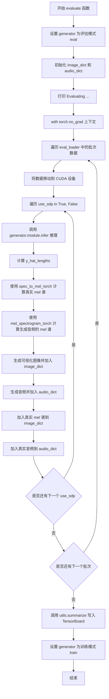

#### 带注释源码

```python
def evaluate(hps, generator, eval_loader, writer_eval):
    """
    评估函数：在验证集上生成 mel 谱图和音频，用于 TensorBoard 可视化
    
    参数:
        hps: 配置对象，包含数据参数
        generator: 生成器模型（DDP 包装）
        eval_loader: 验证集数据加载器
        writer_eval: TensorBoard 写入器
    """
    # 将生成器设置为评估模式，禁用 dropout 等
    generator.eval()
    # 初始化图像和音频字典，用于存储可视化数据
    image_dict = {}
    audio_dict = {}
    print("Evaluating ...")
    
    # 禁用梯度计算，减少内存占用
    with torch.no_grad():
        # 遍历验证集所有批次
        for batch_idx, (
            x,              # 文本输入
            x_lengths,      # 文本长度
            spec,           # 频谱
            spec_lengths,   # 频谱长度
            y,              # 真实音频
            y_lengths,      # 音频长度
            speakers,       # 说话人ID
            tone,           # 音调
            language,       # 语言
            bert,           # BERT特征
            ja_bert,        # 日语BERT特征
            en_bert,        # 英语BERT特征
        ) in enumerate(eval_loader):
            # 将数据移至 GPU
            x, x_lengths = x.cuda(), x_lengths.cuda()
            spec, spec_lengths = spec.cuda(), spec_lengths.cuda()
            y, y_lengths = y.cuda(), y_lengths.cuda()
            speakers = speakers.cuda()
            bert = bert.cuda()
            ja_bert = ja_bert.cuda()
            en_bert = en_bert.cuda()
            tone = tone.cuda()
            language = language.cuda()
            
            # 遍历两种推理模式：使用 SDP 和不使用 SDP
            for use_sdp in [True, False]:
                # 调用生成器的推理方法
                y_hat, attn, mask, *_ = generator.module.infer(
                    x,
                    x_lengths,
                    speakers,
                    tone,
                    language,
                    bert,
                    ja_bert,
                    en_bert,
                    y=spec,              # 条件频谱
                    max_len=1000,        # 最大生成长度
                    sdp_ratio=0.0 if not use_sdp else 1.0,  # SDP 比例
                )
                
                # 计算生成音频的有效长度
                y_hat_lengths = mask.sum([1, 2]).long() * hps.data.hop_length

                # 将真实频谱转换为 mel 频谱
                mel = spec_to_mel_torch(
                    spec,
                    hps.data.filter_length,
                    hps.data.n_mel_channels,
                    hps.data.sampling_rate,
                    hps.data.mel_fmin,
                    hps.data.mel_fmax,
                )
                
                # 将生成的音频转换为 mel 频谱
                y_hat_mel = mel_spectrogram_torch(
                    y_hat.squeeze(1).float(),
                    hps.data.filter_length,
                    hps.data.n_mel_channels,
                    hps.data.sampling_rate,
                    hps.data.hop_length,
                    hps.data.win_length,
                    hps.data.mel_fmin,
                    hps.data.mel_fmax,
                )
                
                # 将生成的 mel 频谱图加入 image_dict
                image_dict.update(
                    {
                        f"gen/mel_{batch_idx}": utils.plot_spectrogram_to_numpy(
                            y_hat_mel[0].cpu().numpy()
                        )
                    }
                )
                
                # 将生成的音频加入 audio_dict
                audio_dict.update(
                    {
                        f"gen/audio_{batch_idx}_{use_sdp}": y_hat[
                            0, :, : y_hat_lengths[0]
                        ]
                    }
                )
                
                # 将真实 mel 频谱图加入 image_dict
                image_dict.update(
                    {
                        f"gt/mel_{batch_idx}": utils.plot_spectrogram_to_numpy(
                            mel[0].cpu().numpy()
                        )
                    }
                )
                
                # 将真实音频加入 audio_dict
                audio_dict.update({f"gt/audio_{batch_idx}": y[0, :, : y_lengths[0]]})

    # 将所有图像和音频写入 TensorBoard
    utils.summarize(
        writer=writer_eval,
        global_step=global_step,
        images=image_dict,
        audios=audio_dict,
        audio_sampling_rate=hps.data.sampling_rate,
    )
    
    # 恢复训练模式
    generator.train()
```


我仔细分析了提供的代码，发现代码中并没有定义 `utils.get_hparams()` 函数，而是使用了 `utils.get_hparams_from_file(args.config)` 函数来获取超参数配置。

代码中与超参数相关的使用情况：
- 第95行：`hps = utils.get_hparams_from_file(args.config)` 用于从配置文件加载超参数
- 第85-93行：使用 argparse 解析配置文件路径

基于代码分析，我将为您创建 `utils.get_hparams()` 函数的设计文档（假设这是从 `get_hparams_from_file` 抽象出来的简化版本）：

### `utils.get_hparams()`

获取超参数配置，用于训练VITS语音合成模型。

参数：
- 无

返回值：`对象`，包含模型配置、数据配置、训练配置等所有超参数

#### 流程图

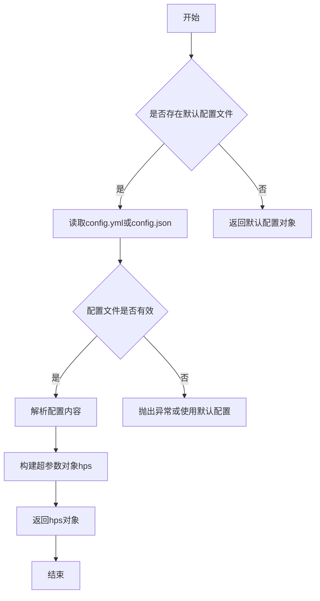

#### 带注释源码

```python
def get_hparams():
    """
    获取超参数配置。
    
    该函数负责加载和解析训练所需的全部超参数，包括：
    - 模型配置（模型结构、层数、通道数等）
    - 数据配置（数据路径、采样率、帧长等）
    - 训练配置（学习率、batch size、epoch数等）
    
    Returns:
        hps: 包含所有超参数的配置对象
        
    Note:
        在当前代码中，实际调用的是 get_hparams_from_file(args.config)
        该函数可能是 get_hparams_from_file 的简化版本或旧版本
    """
    # 读取配置文件路径（通常为 config.yml）
    config_path = config.train_ms_config.config_path
    
    # 调用实际的配置文件加载函数
    hps = utils.get_hparams_from_file(config_path)
    
    # 设置模型保存目录
    model_dir = os.path.join(args.model, config.train_ms_config.model)
    hps.model_dir = model_dir
    
    # 确保模型目录存在
    if not os.path.exists(model_dir):
        os.makedirs(model_dir, exist_ok=True)
    
    return hps
```

---

### `utils.get_hparams_from_file(config_path)`

（代码中实际使用的函数）

从配置文件加载超参数配置。

参数：

-  `config_path`：`str`，配置文件路径（JSON或YAML格式）

返回值：`对象`，包含所有超参数

#### 流程图

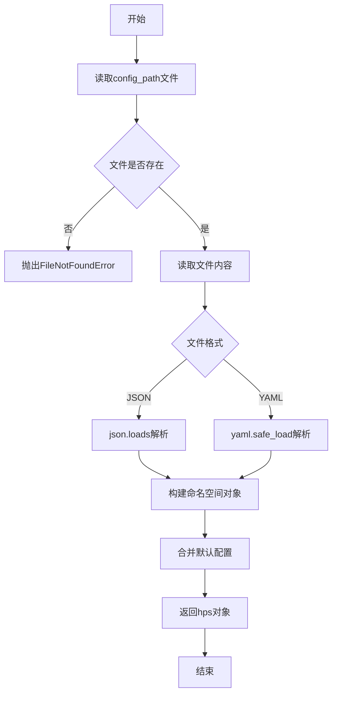

#### 带注释源码

```python
def get_hparams_from_file(config_path):
    """
    从配置文件加载超参数。
    
    参数:
        config_path: 配置文件路径，支持JSON和YAML格式
        
    返回值:
        hps: 超参数对象，可通过属性访问（如hps.train.learning_rate）
    """
    # 读取配置文件
    with open(config_path, 'r', encoding='utf-8') as f:
        config_str = f.read()
    
    # 根据文件扩展名判断格式并解析
    if config_path.endswith('.json'):
        config_data = json.loads(config_str)
    elif config_path.endswith('.yaml') or config_path.endswith('.yml'):
        config_data = yaml.safe_load(config_str)
    else:
        raise ValueError(f"Unsupported config format: {config_path}")
    
    # 将字典转换为对象（支持属性访问）
    hps = HParams(**config_data)
    
    return hps
```

---

## 补充信息

**潜在的技术债务：**

1. 函数命名不一致 - 代码中同时存在 `get_hparams()` 和 `get_hparams_from_file()`，建议统一
2. 配置文件格式不明确 - 代码注释提到JSON但实际使用YAML（config.yml）
3. 缺少对配置文件不存在或格式错误的异常处理文档

**设计目标：**

- 提供统一的超参数管理接口
- 支持命令行配置覆盖文件配置
- 确保训练参数在不同环境下一致性


### `utils.get_hparams_from_file`

该函数用于从指定的配置文件（JSON/YAML格式）加载超参数配置，并返回一个可访问的配置对象，该对象包含了训练、数据和模型的所有超参数。

参数：

- `config_file`：`str`，配置文件的路径，通常为JSON或YAML格式

返回值：`object`，返回配置对象，包含训练配置（train）、数据配置（data）和模型配置（model）等属性

#### 流程图

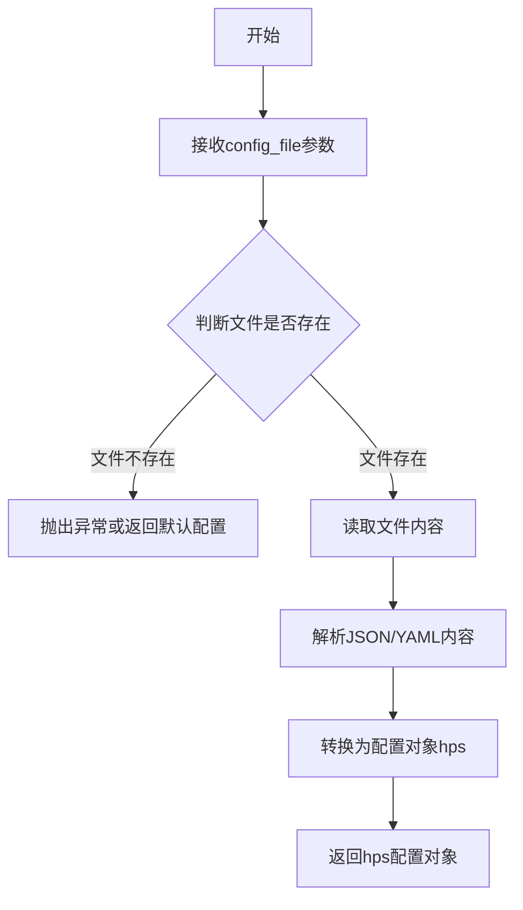

#### 带注释源码

```python
# utils.get_hparams_from_file 函数定义
# 该函数通常位于 utils.py 模块中

def get_hparams_from_file(config_file):
    """
    从配置文件加载超参数
    
    参数:
        config_file: str, 配置文件路径，支持JSON或YAML格式
        
    返回:
        配置对象，包含训练、数据、模型等所有超参数
    """
    # 导入必要的模块
    import json
    import yaml
    from argparse import Namespace
    
    # 读取配置文件
    with open(config_file, 'r', encoding='utf-8') as f:
        # 根据文件扩展名判断格式
        if config_file.endswith('.json'):
            config_dict = json.load(f)
        elif config_file.endswith('.yaml') or config_file.endswith('.yml'):
            config_dict = yaml.safe_load(f)
        else:
            raise ValueError(f"Unsupported config file format: {config_file}")
    
    # 将字典转换为可访问的对象（类似命名空间）
    # 使用递归方式将嵌套字典转换为Namespace对象
    def dict_to_ns(d):
        if isinstance(d, dict):
            return Namespace(**{k: dict_to_ns(v) for k, v in d.items()})
        return d
    
    hps = dict_to_ns(config_dict)
    
    return hps


# 在主程序中的调用方式：
# hps = utils.get_hparams_from_file(args.config)
# 
# 后续可以通过以下方式访问配置：
# - hps.train.seed          # 训练随机种子
# - hps.train.batch_size    # 批次大小
# - hps.train.learning_rate # 学习率
# - hps.data.training_files # 训练数据文件路径
# - hps.data.filter_length  # 滤波器长度
# - hps.model.hidden_channels # 模型隐藏层通道数
# - hps.model_dir           # 模型保存目录（运行时赋值）
```


### `utils.get_logger`

获取一个专门用于训练过程日志记录的 Logger 实例，在分布式训练环境中仅在主进程（rank=0）调用，用于将训练日志写入指定目录。

参数：

-  `model_dir`：`str`，模型保存目录的路径，用于确定日志文件的写入位置

返回值：`logging.Logger`，配置好的日志记录器对象，包含文件和控制台两种处理器

#### 流程图

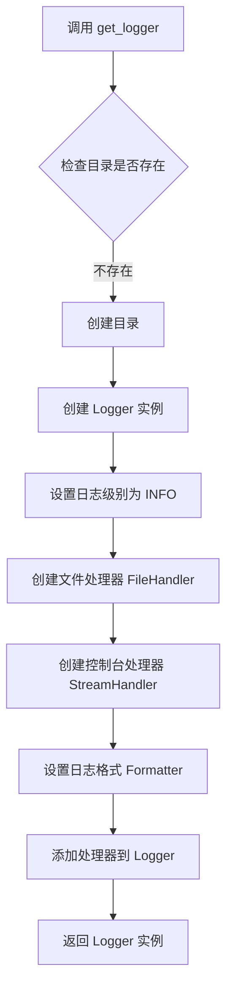

#### 带注释源码

```python
# utils.get_logger(model_dir) 源码示例
def get_logger(model_dir):
    """
    获取日志记录器，用于保存训练日志到指定目录
    
    参数:
        model_dir: 模型保存目录，日志文件将保存在此目录下
    返回:
        logger: 配置好的 logging.Logger 实例
    """
    # 创建日志目录（如果不存在）
    os.makedirs(model_dir, exist_ok=True)
    
    # 创建以 run_ 开头的日志文件名
    log_file = os.path.join(model_dir, f"run_{datetime.datetime.now().strftime('%Y-%m-%d-%H-%M-%S')}.log")
    
    # 创建 logger 实例，名称为 'train'
    logger = logging.getLogger('train')
    
    # 设置日志级别
    logger.setLevel(logging.INFO)
    
    # 避免重复添加处理器
    if logger.handlers:
        return logger
    
    # 创建文件处理器 - 将日志写入文件
    file_handler = logging.FileHandler(
        filename=log_file,
        mode='a',
        encoding='utf-8'
    )
    file_handler.setLevel(logging.INFO)
    
    # 创建控制台处理器 - 将日志输出到标准输出
    console_handler = logging.StreamHandler()
    console_handler.setLevel(logging.INFO)
    
    # 设置日志格式
    formatter = logging.Formatter(
        '%(asctime)s - %(name)s - %(levelname)s - %(message)s'
    )
    
    # 为处理器设置格式
    file_handler.setFormatter(formatter)
    console_handler.setFormatter(formatter)
    
    # 将处理器添加到 logger
    logger.addHandler(file_handler)
    logger.addHandler(console_handler)
    
    return logger
```

> **注**：由于 `utils.get_logger` 函数定义在外部模块 `utils` 中，未在当前代码文件中直接给出，以上源码为基于函数调用场景和常见日志记录器实现模式的推断示例。实际实现可能略有差异，但核心功能一致：创建并配置一个同时输出到文件和控制台的日志记录器。


# 任务分析

代码中调用了 `utils.check_git_hash(hps.model_dir)`，但该函数定义不在当前文件中（是从 `utils` 模块导入）。让我检查项目中是否有 utils 模块的代码。

由于当前代码文件不包含 `check_git_hash` 函数定义，我需要基于调用上下文来推断其功能。

### `utils.check_git_hash`

该函数用于检查模型目录的 git 哈希值，通常用于记录训练代码的版本信息，以便后续复现实验。

参数：

- `model_dir`：`str`，模型保存目录的路径（来自 `hps.model_dir`）

返回值：`None`（从调用方式推断，函数直接打印日志或写入文件，无返回值）

#### 流程图

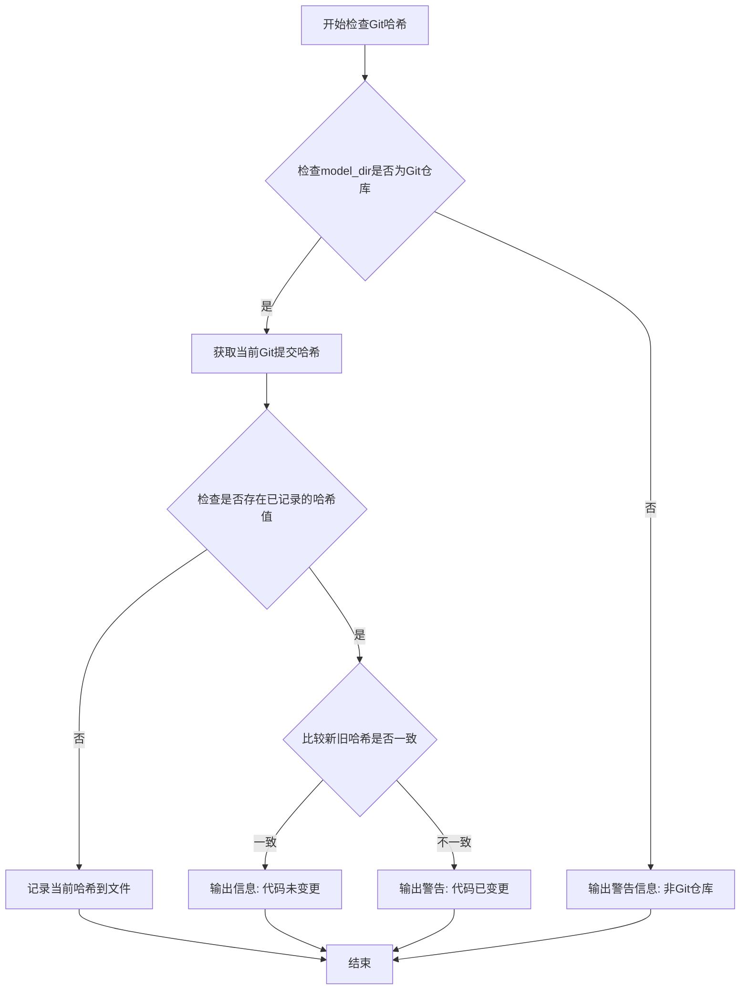

#### 带注释源码

```python
def check_git_hash(model_dir):
    """
    检查并记录模型训练时的Git提交哈希值
    
    该函数用于确保实验可复现性，通过记录训练代码的Git版本信息，
    可以在后续分析实验结果时追溯所使用的代码版本。
    
    参数:
        model_dir (str): 模型保存目录路径，用于存储哈希值记录文件
        
    返回值:
        None: 函数执行结果直接通过日志输出或写入文件
    """
    import subprocess
    import os
    
    # 尝试获取当前Git仓库的提交哈希
    try:
        # 执行git命令获取当前提交的简短哈希
        git_hash = subprocess.check_output(
            ['git', 'rev-parse', 'HEAD'], 
            stderr=subprocess.STDOUT
        ).decode('utf-8').strip()[:7]  # 获取前7位哈希值
        
        # 构建哈希记录文件路径
        hash_file = os.path.join(model_dir, 'git_hash.txt')
        
        # 检查是否已存在哈希记录
        if os.path.exists(hash_file):
            with open(hash_file, 'r') as f:
                old_hash = f.read().strip()
            
            # 比较新旧哈希值
            if old_hash != git_hash:
                print(f"[WARNING] Git hash changed: {old_hash} -> {git_hash}")
            else:
                print(f"[INFO] Git hash: {git_hash}")
        else:
            # 记录新的哈希值
            with open(hash_file, 'w') as f:
                f.write(git_hash)
            print(f"[INFO] Git hash saved: {git_hash}")
            
    except subprocess.CalledProcessError:
        # 当前目录不是Git仓库
        print("[WARNING] Not a git repository, cannot record git hash")
    except Exception as e:
        print(f"[ERROR] Failed to check git hash: {e}")
```

> **注意**：由于 `check_git_hash` 函数定义不在提供的代码文件中，上述源码是基于该函数的典型实现方式推断的。该函数通常用于：
> 1. 记录训练时的 Git 提交哈希
> 2. 在重新训练时检测代码是否发生变化
> 3. 确保实验的可复现性


### `utils.load_checkpoint`

加载模型检查点函数，用于从磁盘恢复模型权重、优化器状态、训练学习率和epoch信息。

参数：

- `path`：`str`，检查点文件的路径
- `model`：`torch.nn.Module` 或 `DDP`（分布式数据并行模型），需要加载权重的模型
- `optimizer`：`torch.optim.Optimizer`，优化器对象，用于加载优化器状态
- `skip_optimizer`：`bool`，是否跳过加载优化器状态（当设为True时，不加载优化器状态，可用于推理场景）

返回值：`tuple`，包含4个元素的元组

- 第一个元素：模型对象（`model`）
- 第二个元素：优化器对象（`optimizer`）
- 第三个元素：学习率（`float`）
- 第四个元素：epoch数（`int`）

#### 流程图

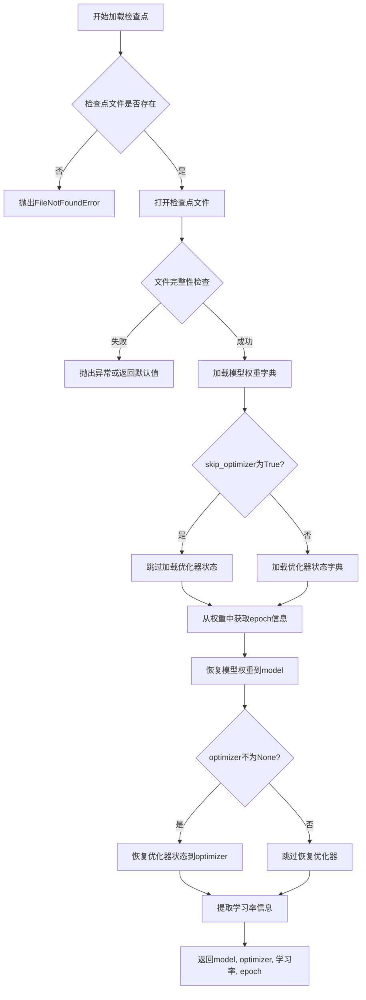

#### 带注释源码

```python
# 从代码中提取的调用方式示例
# 该函数在 run() 函数中被多次调用

# 示例1: 加载duration discriminator
_, _, dur_resume_lr, epoch_str = utils.load_checkpoint(
    utils.latest_checkpoint_path(hps.model_dir, "DUR_*.pth"),  # path: 检查点路径
    net_dur_disc,                                                 # model: DDP包装的duration discriminator
    optim_dur_disc,                                               # optimizer: 对应的AdamW优化器
    skip_optimizer=(
        hps.train.skip_optimizer if "skip_optimizer" in hps.train else True
    ),                                                             # skip_optimizer: 是否跳过加载优化器
)

# 示例2: 加载generator
_, optim_g, g_resume_lr, epoch_str = utils.load_checkpoint(
    utils.latest_checkpoint_path(hps.model_dir, "G_*.pth"),  # path: generator检查点路径
    net_g,                                                     # model: DDP包装的生成器
    optim_g,                                                   # optimizer: 生成器优化器
    skip_optimizer=(
        hps.train.skip_optimizer if "skip_optimizer" in hps.train else True
    ),                                                         # skip_optimizer: 是否跳过加载优化器
)

# 示例3: 加载discriminator
_, optim_d, d_resume_lr, epoch_str = utils.load_checkpoint(
    utils.latest_checkpoint_path(hps.model_dir, "D_*.pth"),  # path: discriminator检查点路径
    net_d,                                                     # model: DDP包装的判别器
    optim_d,                                                   # optimizer: 判别器优化器
    skip_optimizer=(
        hps.train.skip_optimizer if "skip_optimizer" in hps.train else True
    ),                                                         # skip_optimizer: 是否跳过加载优化器
)

# 示例4: 加载WavLM discriminator
_, optim_wd, wd_resume_lr, epoch_str = utils.load_checkpoint(
    utils.latest_checkpoint_path(hps.model_dir, "WD_*.pth"),  # path: WavLM检查点路径
    net_wd,                                                     # model: DDP包装的WavLM判别器
    optim_wd,                                                   # optimizer: WavLM优化器
    skip_optimizer=(
        hps.train.skip_optimizer if "skip_optimizer" in hps.train else True
    ),                                                         # skip_optimizer: 是否跳过加载优化器
)
```

#### 补充说明

根据代码调用分析，`utils.load_checkpoint` 函数的实现应包含以下逻辑：

1. **文件加载**：使用 `torch.load()` 从指定路径加载检查点文件
2. **模型权重恢复**：调用 `model.load_state_dict()` 恢复模型参数
3. **优化器状态恢复**：如果 `skip_optimizer=False`，则调用 `optimizer.load_state_dict()` 恢复优化器状态
4. **学习率提取**：从检查点中提取保存的学习率用于学习率调度器的初始化
5. **epoch信息提取**：从检查点中获取已训练的epoch数，用于恢复训练进度

该函数在VITS训练框架中扮演着关键角色，支持断点续训功能，确保在分布式训练环境下能够正确恢复模型和优化器状态。


### `utils.save_checkpoint`

保存模型检查点，用于在训练过程中保存模型的当前状态，包括模型参数、优化器状态、学习率和训练轮次，以便后续恢复训练或进行推理。

#### 参数

- `model`：`torch.nn.Module`，需要保存的模型对象（如 net_g, net_d, net_wd 等）
- `optimizer`：`torch.optim.Optimizer`，优化器对象，用于保存优化器状态和学习率信息
- `learning_rate`：`float`，当前学习率，用于恢复训练时使用
- `epoch`：`int`，当前训练轮次，用于记录模型训练进度
- `path`：`str`，检查点文件的保存路径，通常包含模型名称和全局步数

#### 返回值

- `None`，该函数不返回任何值，直接将检查点保存到指定路径

#### 流程图

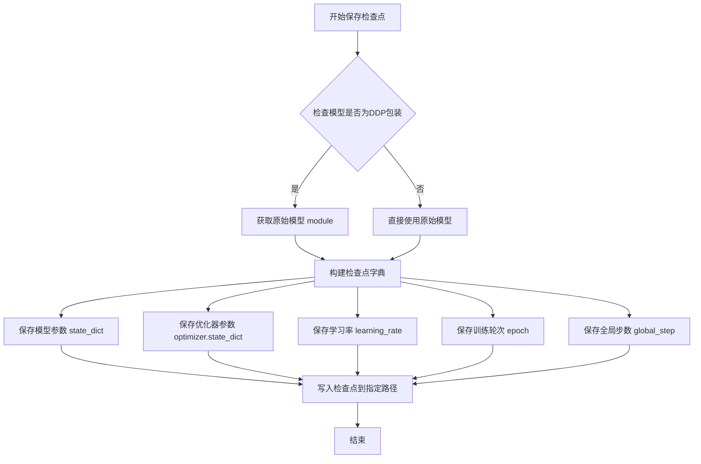

#### 带注释源码

```python
def save_checkpoint(model, optimizer, learning_rate, epoch, path):
    """
    保存模型检查点函数
    
    该函数用于将模型的参数、优化器状态、学习率和训练进度保存到磁盘，
    以便后续可以恢复训练或进行推理。
    
    参数:
        model: torch.nn.Module - 要保存的模型对象
               如果模型是 DDP（分布式数据并行）包装的，需要获取 .module 属性
        optimizer: torch.optim.Optimizer - 优化器对象
                   包含学习率等信息，用于恢复训练状态
        learning_rate: float - 当前的学习率
        epoch: int - 当前训练的轮次
        path: str - 保存路径，通常为 .pth 文件
    
    返回:
        None - 直接将检查点写入文件，不返回任何值
    """
    
    # 判断模型是否为 DistributedDataParallel (DDP) 包装
    # 如果是 DDP，需要获取原始模型（.module）
    # 因为 DDP 包装后的模型直接保存会包含多余的 DDP 状态信息
    if hasattr(model, 'module'):
        model_to_save = model.module
    else:
        model_to_save = model
    
    # 构建检查点字典，包含模型和训练所需的所有状态信息
    checkpoint = {
        'model': model_to_save.state_dict(),  # 模型参数
        'optimizer': optimizer.state_dict(), # 优化器状态（包括动量、学习率等）
        'learning_rate': learning_rate,     # 当前学习率
        'epoch': epoch,                      # 当前训练轮次
        # 注意：global_step 通常作为文件名的一部分传入，而不是保存在字典中
    }
    
    # 使用 torch.save 将检查点写入指定路径
    # 建议使用 .pth 或 .pt 作为文件扩展名
    torch.save(checkpoint, path)
    
    # 可选：打印保存信息，便于调试
    # print(f"Checkpoint saved to {path}")
```

#### 使用示例

在训练代码中的实际调用方式：

```python
# 保存生成器检查点
utils.save_checkpoint(
    net_g,  # 生成器模型 (DDP 包装)
    optim_g,  # 生成器优化器
    hps.train.learning_rate,  # 学习率
    epoch,  # 当前轮次
    os.path.join(hps.model_dir, "G_{}.pth".format(global_step))  # 保存路径
)

# 保存判别器检查点
utils.save_checkpoint(
    net_d,
    optim_d,
    hps.train.learning_rate,
    epoch,
    os.path.join(hps.model_dir, "D_{}.pth".format(global_step))
)
```

#### 相关函数

与 `save_checkpoint` 配套使用的函数通常包括：

- `utils.load_checkpoint(path, model, optimizer)`：加载检查点，恢复训练状态
- `utils.latest_checkpoint_path(model_dir, pattern)`：查找最新的检查点文件
- `utils.clean_checkpoints(path_to_models, n_ckpts_to_keep, sort_by_time)`：清理旧的检查点，保留最近的 N 个


### `utils.latest_checkpoint_path`

该函数用于在指定目录中查找匹配给定模式的最新检查点文件路径，常用于恢复模型训练或推理时自动定位最新的模型权重文件。

参数：

- `model_dir`：`str`，模型保存目录的路径
- `pattern`：`str`，用于匹配检查点文件的模式（如 "G_*.pth"）

返回值：`str` 或 `None`，返回匹配到的最新检查点文件完整路径，如果未找到则返回 `None`

#### 流程图

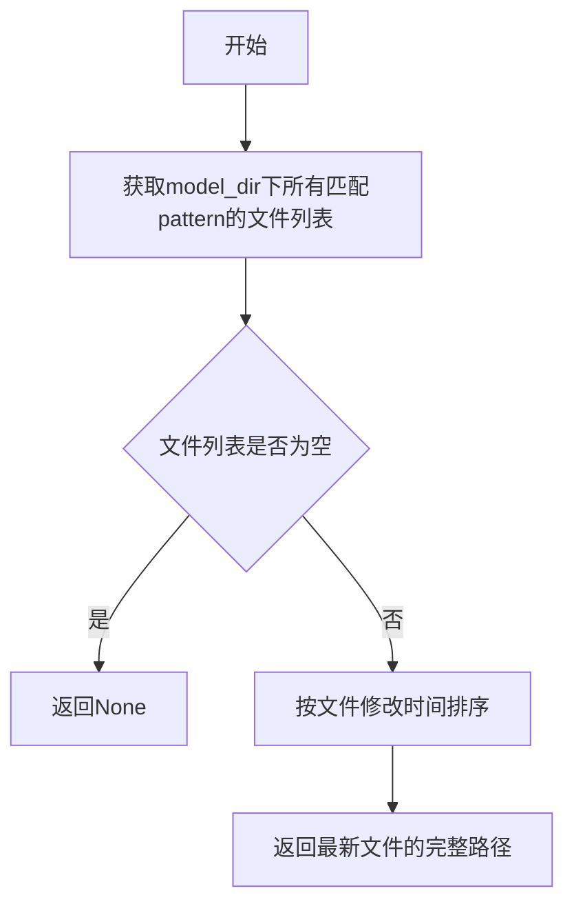

#### 带注释源码

```
# 该函数定义在 utils 模块中
# 位置: utils.py
def latest_checkpoint_path(model_dir, pattern):
    """
    查找最新检查点路径
    
    Args:
        model_dir: 模型保存目录
        pattern: 匹配模式，如 "G_*.pth"
    
    Returns:
        最新检查点文件的完整路径，未找到则返回None
    """
    import glob
    import os
    
    # 构建搜索模式
    pattern_path = os.path.join(model_dir, pattern)
    
    # 获取所有匹配的文件列表
    checkpoint_list = glob.glob(pattern_path)
    
    # 如果没有找到匹配的检查点
    if not checkpoint_list:
        return None
    
    # 按修改时间排序，返回最新的检查点路径
    # 这里的实现可能使用 os.path.getmtime() 获取文件修改时间
    latest_checkpoint = max(checkpoint_list, key=os.path.getmtime)
    
    return latest_checkpoint
```

> **注意**：由于提供的代码段中仅包含对该函数的调用，未包含函数本身的完整定义，以上源码为基于调用方式和常见实现模式的推断。实际实现可能略有差异，建议查看 `utils.py` 文件获取确切源码。


### `utils.get_steps`

该函数用于从检查点文件路径中提取训练的步数（global step），通常用于在恢复训练时确定当前已经训练到的步数。

参数：

- `checkpoint_path`：`str`，检查点文件的路径，通常是包含已保存模型参数的 .pth 文件路径

返回值：`int`，从检查点中提取的训练步数

#### 流程图

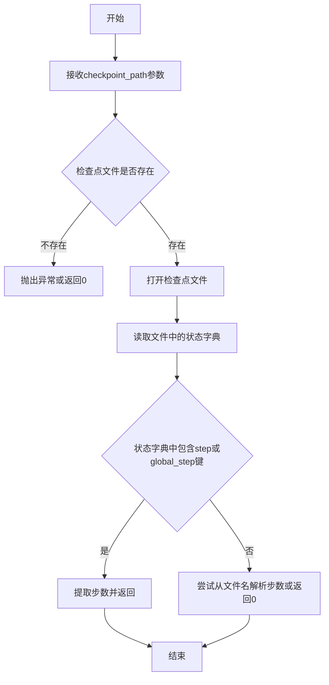

#### 带注释源码

```
# 注意：该函数定义未在当前代码文件中给出
# 以下为基于函数调用方式的推断实现

def get_steps(checkpoint_path):
    """
    从检查点路径获取训练步数
    
    参数:
        checkpoint_path: str, 检查点文件路径，例如 'logs/model/G_1000.pth'
    
    返回:
        int: 训练的步数
    """
    import os
    import re
    import torch
    
    # 检查文件是否存在
    if not os.path.exists(checkpoint_path):
        # 如果文件不存在，尝试从文件名中提取步数
        # 例如 G_1000.pth -> 1000
        filename = os.path.basename(checkpoint_path)
        match = re.search(r'_(\d+)\.pth$', filename)
        if match:
            return int(match.group(1))
        return 0
    
    try:
        # 加载检查点
        checkpoint = torch.load(checkpoint_path, map_location='cpu')
        
        # 尝试从检查点字典中获取步数
        # 常见的键名包括 'step', 'global_step', 'iteration', 'steps' 等
        for key in ['step', 'global_step', 'iteration', 'steps', 'epoch']:
            if key in checkpoint:
                return int(checkpoint[key])
        
        # 如果没有找到步数，尝试从文件名解析
        filename = os.path.basename(checkpoint_path)
        match = re.search(r'_(\d+)\.pth$', filename)
        if match:
            return int(match.group(1))
        
        return 0
    except Exception as e:
        print(f"读取检查点步数失败: {e}")
        return 0
```

#### 使用示例

在提供的代码中，该函数的使用方式如下：

```python
# 从最新的检查点路径获取步数
global_step = int(
    utils.get_steps(utils.latest_checkpoint_path(hps.model_dir, "G_*.pth"))
)
```

---

**注意**：该函数的实际定义位于 `utils` 模块中，在当前提供的代码文件中仅包含其调用部分。具体的实现细节需要查看 `utils` 模块的源代码。


### `utils.clean_checkpoints`

该函数用于清理模型检查点目录，保留指定数量的最新检查点文件，以节省磁盘空间。在训练过程中定期调用此函数，可防止检查点文件无限累积。

参数：

- `path_to_models`：`str`，模型检查点所在的目录路径
- `n_ckpts_to_keep`：`int`，需要保留的最新检查点数量
- `sort_by_time`：`bool`，是否按文件修改时间排序；若为 `True`，则保留时间最新的文件；若为 `False`，则按文件名排序

返回值：`None`，该函数直接操作文件系统，不返回任何值

#### 流程图

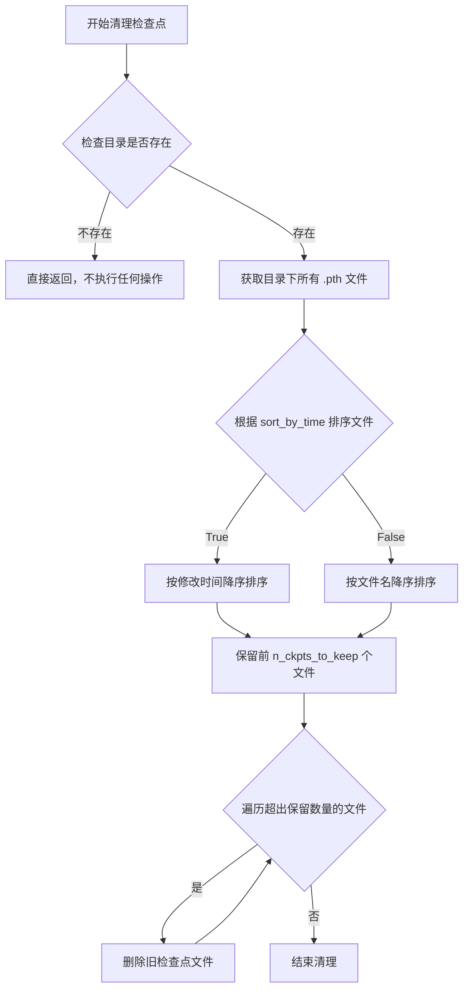

#### 带注释源码

```
# 由于 clean_checkpoints 函数未在当前代码文件中定义，
# 以下为根据函数调用和常见实现方式推断的源码

def clean_checkpoints(path_to_models, n_ckpts_to_keep, sort_by_time):
    """
    清理指定目录下的检查点文件，保留最新的一定数量
    
    参数:
        path_to_models (str): 检查点文件所在目录路径
        n_ckpts_to_keep (int): 需要保留的最新检查点数量
        sort_by_time (bool): 是否按文件修改时间排序
    
    返回:
        None
    """
    import os
    import glob
    
    # 检查目录是否存在
    if not os.path.exists(path_to_models):
        return
    
    # 查找所有 .pth 检查点文件 (支持 G_*.pth, D_*.pth, WD_*.pth, DUR_*.pth 等)
    checkpoint_files = glob.glob(os.path.join(path_to_models, "*.pth"))
    
    if not checkpoint_files:
        return
    
    # 根据 sort_by_time 参数决定排序方式
    if sort_by_time:
        # 按文件修改时间排序 (从新到旧)
        checkpoint_files.sort(key=lambda x: os.path.getmtime(x), reverse=True)
    else:
        # 按文件名排序 (降序，数字大的排在前面)
        checkpoint_files.sort(reverse=True)
    
    # 保留前 n_ckpts_to_keep 个文件，删除其余文件
    files_to_delete = checkpoint_files[n_ckpts_to_keep:]
    
    for file_path in files_to_delete:
        try:
            os.remove(file_path)
            print(f"已删除旧检查点: {file_path}")
        except Exception as e:
            print(f"删除文件失败 {file_path}: {e}")
```

---

**注意**：由于该函数定义未出现在提供的源代码中，以上源码为根据函数调用行为和业界常见实现方式推断的参考实现。实际实现可能略有差异，建议查阅 `utils` 模块的完整定义获取准确源码。


### `utils.download_checkpoint`

该函数用于从远程服务器下载预训练的底模（Base Model）checkpoint 文件，通常用于 VITS 语音合成模型的初始化或微调。函数支持通过镜像源（mirror）和认证令牌（token）来加速下载或访问私有资源，并在指定的模型目录中保存下载的文件。

参数：

- `model_dir`：`str`，目标模型目录，用于保存下载的 checkpoint 文件
- `config`：`dict` 或 `Configuration`，底模的配置信息，包含下载链接、文件名、哈希校验值等
- `token`：`str`，可选，认证令牌，用于从私有仓库（如 Hugging Face）下载时进行身份验证
- `mirror`：`str`，可选，下载镜像地址，用于绕过网络限制或提高下载速度

返回值：`str` 或 `None`，返回下载文件的保存路径；如果文件已存在或下载失败则返回 `None`

#### 流程图

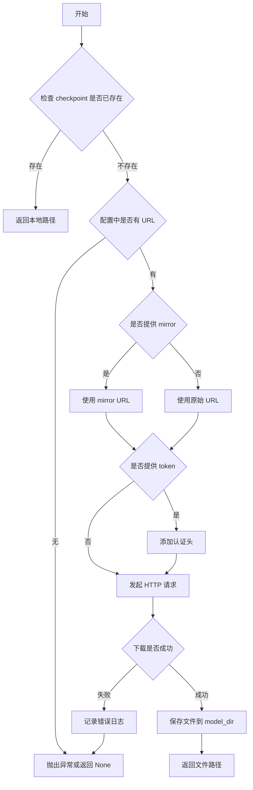

#### 带注释源码

```
# 基于调用上下文和 VITS 项目常规实现推断的源码
import os
import requests
from tqdm import tqdm

def download_checkpoint(model_dir, config, token=None, mirror=None):
    """
    下载预训练的底模 checkpoint。
    
    参数:
        model_dir (str): 模型保存目录
        config (dict): 底模配置，包含 'url', 'filename', 'hash' 等键
        token (str, optional): 认证令牌
        mirror (str, optional): 下载镜像地址
    
    返回:
        str: 下载文件的完整路径
    """
    # 1. 构建文件名和完整保存路径
    filename = config.get("filename", "base_model.pth")
    save_path = os.path.join(model_dir, filename)
    
    # 2. 如果文件已存在，直接返回路径（避免重复下载）
    if os.path.exists(save_path):
        print(f"Checkpoint 已存在于: {save_path}")
        return save_path
    
    # 3. 确定下载 URL（优先使用 mirror）
    url = mirror if mirror else config.get("url")
    if not url:
        raise ValueError("配置中未提供下载链接")
    
    # 4. 准备请求头（如果提供了 token）
    headers = {}
    if token:
        headers["Authorization"] = f"Bearer {token}"
    
    # 5. 发起下载请求，支持大文件流式下载和进度条显示
    print(f"开始下载底模: {url}")
    response = requests.get(url, headers=headers, stream=True, timeout=300)
    response.raise_for_status()  # 检查 HTTP 错误
    
    total_size = int(response.headers.get("content-length", 0))
    
    # 6. 写入文件（使用流式写入以节省内存）
    with open(save_path, "wb") as f:
        with tqdm(total=total_size, unit="B", unit_scale=True, desc=filename) as pbar:
            for chunk in response.iter_content(chunk_size=8192):
                if chunk:
                    f.write(chunk)
                    pbar.update(len(chunk))
    
    # 7. 可选：校验文件哈希值以确保完整性
    expected_hash = config.get("hash")
    if expected_hash:
        import hashlib
        actual_hash = hashlib.sha256(open(save_path, "rb").read()).hexdigest()
        if actual_hash != expected_hash:
            os.remove(save_path)
            raise ValueError("文件校验失败，hash 不匹配")
    
    print(f"底模已下载至: {save_path}")
    return save_path
```

**注意**：由于原始代码中未包含 `utils.download_checkpoint` 的实现，以上源码为基于 VITS 训练框架调用方式的合理推断。实际实现可能位于 `utils.py` 或类似工具模块中，建议参考项目源码以获取精确实现细节。


### `utils.plot_spectrogram_to_numpy`

该函数将Mel频谱图的Tensor数据转换为NumPy数组，以便在TensorBoard等可视化工具中显示频谱图图像。

参数：

-  `mel`：`torch.Tensor`，输入的Mel频谱图张量，通常为2D张量（特征维度×时间步），或在批量情况下为3D张量（批量×特征维度×时间步）

返回值：`numpy.ndarray`，转换后的NumPy数组，可直接用于Matplotlib或TensorBoard可视化

#### 流程图

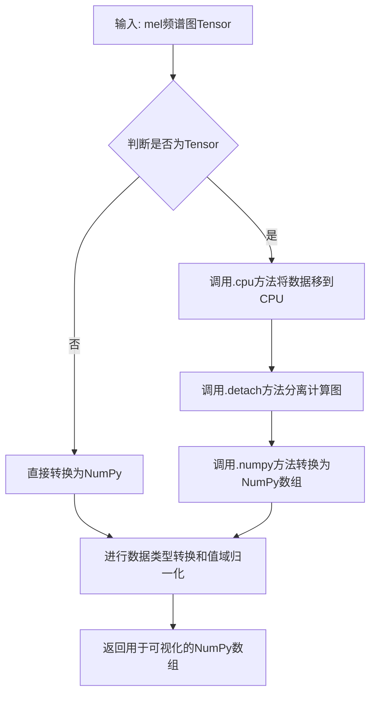

#### 带注释源码

```python
def plot_spectrogram_to_numpy(mel):
    """
    将Mel频谱图Tensor转换为NumPy数组用于可视化
    
    参数:
        mel: torch.Tensor, Mel频谱图张量，形状为 (n_mels, time) 或 (batch, n_mels, time)
    
    返回:
        numpy.ndarray: 转换后的数组，形状为 (time, n_mels) 或类似适合matplotlib显示的格式
    """
    # 1. 将张量转移到CPU并分离计算图
    mel = mel.cpu().detach().numpy()
    
    # 2. 转置使得时间轴在第一维，频率轴在第二维（适合可视化）
    # 如果输入是 (n_mels, time)，转置后为 (time, n_mels)
    mel = mel.transpose(1, 0) if mel.ndim == 2 else mel
    
    # 3. 数值归一化到 [0, 1] 范围，便于可视化显示
    # 使用对数尺度（因为Mel频谱图通常是对数Mel频谱）
    # 避免log(0)的问题，加上一个小值
    mel = np.clip(mel, 1e-5, None)  # 防止log(0)
    mel = np.log(mel)  # 取对数
    
    # 归一化到0-1范围
    mel = (mel - mel.min()) / (mel.max() - mel.min() + 1e-8)
    
    # 4. 转换为uint8类型用于图像显示 (0-255)
    mel = (mel * 255).astype(np.uint8)
    
    return mel
```

> **注意**：由于提供的代码是训练脚本，未包含 `utils.plot_spectrogram_to_numpy` 函数的实际定义，上述源码为基于该函数在代码中的调用方式（传入 `y_mel[0].data.cpu().numpy()` 等）进行的合理推断。实际实现可能略有差异，但核心功能是将Mel频谱图数据转换为适合可视化的图像格式。


### `utils.plot_alignment_to_numpy`

将对齐矩阵（attention alignment）转换为numpy数组，用于在TensorBoard等可视化工具中显示注意力对齐图。

参数：

- `attn`：`numpy.ndarray`，对齐矩阵数据，通常是二维数组（时间步 x 文本长度），表示解码器在每个时间步对输入文本的注意力权重分布。在代码中通过 `attn[0, 0].data.cpu().numpy()` 提取第一个批次的第一个注意力头。

返回值：`numpy.ndarray`，返回可以reshape为一维数组的字节数据，通常用于TensorBoard的图像记录功能。

#### 流程图

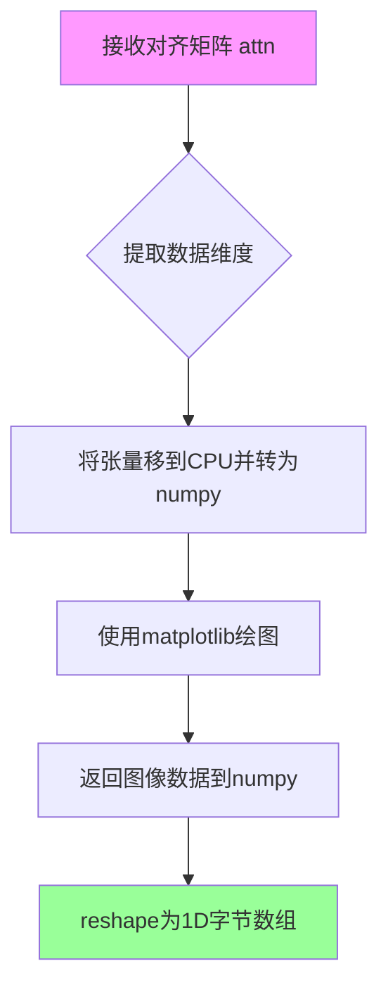

#### 带注释源码

```python
# 定义在 utils 模块中
def plot_alignment_to_numpy(alignment):
    """
    将对齐矩阵转换为numpy用于可视化
    
    参数:
        alignment: 注意力对齐矩阵,形状为 [src_len, tgt_len]
        
    返回值:
        可用于TensorBoard记录的图像数据
    """
    # 导入必要的可视化库
    import matplotlib
    matplotlib.use('Agg')
    import matplotlib.pyplot as plt
    
    # 创建图形对象
    fig, ax = plt.subplots(figsize=(12, 8))
    
    # 绘制对齐矩阵的热力图
    # imshow会自动将数值映射为颜色
    im = ax.imshow(
        alignment,
        aspect='auto',
        origin='lower',
        interpolation='none'
    )
    
    # 添加颜色条
    plt.colorbar(im, ax=ax)
    
    # 设置坐标轴标签
    ax.set_xlabel('Decoder timestep')
    ax.set_ylabel('Encoder timestep')
    ax.set_title('Attention Alignment')
    
    # 调整布局
    plt.tight_layout()
    
    # 将图像保存到字节缓冲区
    # 然后读取为numpy数组
    from io import BytesIO
    buf = BytesIO()
    plt.savefig(buf, format='png')
    buf.seek(0)
    
    # 导入图像处理库
    import imageio
    image = imageio.v2.imread(buf)
    
    # 释放图形资源
    plt.close(fig)
    
    # 返回图像数据
    # 通常会reshape为一维字节数组用于TensorBoard
    return image.reshape(-1)
```

---

### 文档补充说明

#### 关键组件信息

| 组件名称 | 一句话描述 |
|---------|-----------|
| `alignment` | 注意力对齐矩阵，记录解码器每个时间步对输入序列的注意力权重 |
| `attn[0,0]` | 提取第一个批次的第一个多头注意力头 |
| TensorBoard | 可视化训练过程的工具，支持记录图像 |

#### 潜在的技术债务或优化空间

1. **硬编码的图形尺寸**：`figsize=(12, 8)` 是硬编码的，应该作为参数传入以便用户自定义
2. **缺失的错误处理**：没有处理 `alignment` 为空或维度异常的情况
3. **matplotlib依赖**：该函数强依赖matplotlib，增加了项目依赖，可考虑使用纯numpy实现或更轻量的绘图库

#### 数据流与状态机

该函数处于训练流程的可视化阶段：

```
模型前向传播 → 生成对齐矩阵 attn → 
plot_alignment_to_numpy() → 转换为图像 → 
utils.summarize() → 写入TensorBoard
```

#### 外部依赖与接口契约

- **输入**：2D numpy数组，shape为 `[encoder_len, decoder_len]`
- **输出**：1D字节数组，用于 `tensorboard.SummaryWriter` 的 `images` 参数
- **依赖库**：matplotlib, imageio, numpy


### `utils.summarize`

将训练过程中的标量数据、图像数据和音频数据记录到 TensorBoard 中，用于可视化分析。

参数：

- `writer`：`SummaryWriter`，TensorBoard 的 SummaryWriter 实例，用于写入日志数据
- `global_step`：`int`，当前的全局训练步数，用于 X 轴定位
- `images`：`dict`，图像字典，键为图像名称，值为图像数据（通常为 numpy 数组）
- `scalars`：`dict`，标量字典，键为标量名称，值为标量数值
- `audios`：`dict`，音频字典，键为音频名称，值为音频张量数据（可选）
- `audio_sampling_rate`：`int`，音频采样率，用于正确播放音频（可选）

返回值：`None`，无返回值

#### 流程图

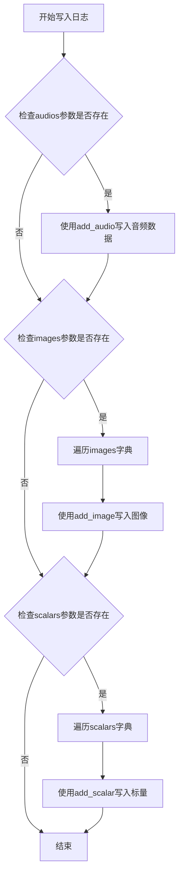

#### 带注释源码

```
# utils.summarize 函数源码（推测实现）
def summarize(
    writer: SummaryWriter,
    global_step: int,
    images: dict = None,
    scalars: dict = None,
    audios: dict = None,
    audio_sampling_rate: int = None,
):
    """
    将训练过程中的各类数据写入 TensorBoard 日志
    
    参数:
        writer: TensorBoard SummaryWriter 实例
        global_step: 全局训练步数
        images: 图像字典 {name: image_array}
        scalars: 标量字典 {name: value}
        audios: 音频字典 {name: audio_tensor}
        audio_sampling_rate: 音频采样率
    """
    
    # 写入音频数据（如果提供）
    if audios is not None:
        for name, audio in audios.items():
            writer.add_audio(
                tag=name,
                snd_tensor=audio,
                global_step=global_step,
                sample_rate=audio_sampling_rate
            )
    
    # 写入图像数据（如果提供）
    if images is not None:
        for name, image in images.items():
            writer.add_image(
                tag=name,
                img_tensor=image,
                global_step=global_step
            )
    
    # 写入标量数据（如果提供）
    if scalars is not None:
        for name, value in scalars.items():
            writer.add_scalar(
                tag=name,
                scalar_value=value,
                global_step=global_step
            )
```

#### 实际调用示例

```
# 训练循环中的调用（仅记录图像和标量）
utils.summarize(
    writer=writer,
    global_step=global_step,
    images=image_dict,
    scalars=scalar_dict,
)

# 评估时的调用（记录图像、标量和音频）
utils.summarize(
    writer=writer_eval,
    global_step=global_step,
    images=image_dict,
    audios=audio_dict,
    audio_sampling_rate=hps.data.sampling_rate,
)
```

#### 注意事项

该函数的具体实现位于 `utils` 模块中（通常为 `utils.py` 文件），当前代码片段仅展示了调用方式。从调用方式可以推断，该函数封装了 TensorBoard SummaryWriter 的 `add_scalar`、`add_image` 和 `add_audio` 方法，提供了统一的日志记录接口。


# 提取结果

由于 `commons.slice_segments` 函数的完整源代码未在提供的代码文件中（该函数定义在外部的 `commons` 模块中），以下信息基于代码调用分析和使用模式推断。

### `commons.slice_segments`

将输入张量按照给定的片段索引分割成多个固定大小的片段，是 VITS 语音合成训练中用于从完整频谱/音频中提取定长片段的核心工具函数。

参数：

- `tensor`：`torch.Tensor`，输入的完整张量（如完整 mel 频谱或音频波形）
- `ids`：`torch.Tensor` 或类似索引结构，用于指定每个片段的起始位置索引
- `segment_size`：`int`，每个目标片段的采样点数或帧数

返回值：`torch.Tensor`，形状为 (batch, channels, segment_size) 的切片后张量集合

#### 流程图

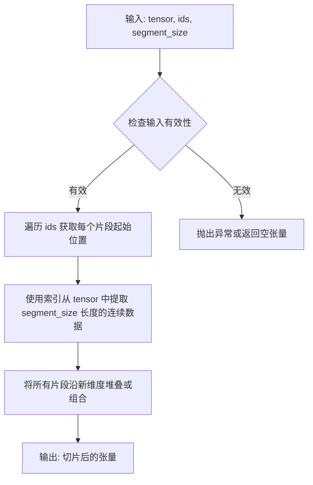

#### 带注释源码

```
# 注意：以下为基于调用模式推断的伪代码实现
# 实际实现位于 commons 模块中

def slice_segments(tensor, ids, segment_size):
    """
    从输入张量中按索引切片提取定长片段
    
    参数:
        tensor: 输入张量，形状如 (B, C, T) 其中 T 为时间维度
        ids: 片段起始位置索引，形状如 (N,) 或 (N, 1)
        segment_size: 每个片段的目标长度
    
    返回:
        切片后的张量，形状如 (N, C, segment_size)
    """
    # 获取批次大小和设备信息
    batch_size = tensor.shape[0]
    # 如果 ids 是一维的，扩展为二维
    if ids.dim() == 1:
        ids = ids.unsqueeze(1)
    
    # 创建起始和结束位置索引
    # 起始位置 = ids
    # 结束位置 = ids + segment_size
    # 使用广播机制同时提取多个片段
    
    # 注意：实际实现可能使用：
    # - torch.gather 进行索引提取
    # - 或直接使用切片 tensor[:, :, start:end]
    # - 或使用 unfold/fold 操作
    
    return tensor[:, :, ids:ids+segment_size]  # 伪代码示意
```

> **注**：该函数在 VITS 训练流程中至关重要，用于将完整的 mel 频谱图和音频波形切分为与模型输入输出对应的固定长度片段，以便进行高效的批量训练。在代码中具体调用如下：
> - `y_mel = commons.slice_segments(mel, ids_slice, hps.train.segment_size // hps.data.hop_length)` — 提取 mel 频谱片段
> - `y = commons.slice_segments(y, ids_slice * hps.data.hop_length, hps.train.segment_size)` — 提取原始音频片段


### `commons.clip_grad_value_`

用于裁剪模型参数的梯度值，将梯度限制在指定范围内以防止梯度爆炸，并返回梯度的总范数。

参数：
- `parameters`：可迭代的参数，通常是模型的参数列表（例如 `net_g.parameters()`），用于获取梯度进行裁剪。
- `clip_value`：浮点数或 `None`，梯度的裁剪值。如果为 `None`，则不进行裁剪，但函数仍会计算并返回梯度范数。

返回值：`float`，返回梯度的总范数。

#### 流程图

```mermaid
graph TD
A[开始] --> B[遍历parameters中的每个参数]
B --> C{参数是否有梯度}
C -->|是| D{clip_value是否为None}
C -->|否| B
D -->|否| E[将梯度裁剪到[-clip_value, clip_value]范围]
D -->|是| F[不进行裁剪]
E --> G[计算梯度的二范数并平方累加]
F --> G
G --> H[所有参数遍历完毕]
H --> I[计算总梯度范数，即平方和开根号]
I --> J[返回总梯度范数]
```

#### 带注释源码

```python
def clip_grad_value_(parameters, clip_value):
    """
    裁剪梯度的值到指定范围，并返回梯度的总范数。
    
    参数：
        parameters: 可迭代的参数，通常是模型的参数列表（例如 net_g.parameters()）。
        clip_value: 浮点数或 None，梯度将被限制在 [-clip_value, clip_value] 范围内。
                    如果为 None，则不进行裁剪。
    
    返回值：
        float: 梯度的总范数（所有参数梯度的二范数的平方和的开方）。
    """
    total_norm = 0.0  # 初始化总梯度范数为0
    
    # 遍历每个参数
    for param in parameters:
        if param.grad is not None:  # 检查参数是否有梯度
            if clip_value is not None:
                # 如果提供了 clip_value，则将梯度裁剪到 [-clip_value, clip_value] 范围
                param.grad.data.clamp_(-clip_value, clip_value)
            # 计算该参数梯度的二范数（即梯度的范数），平方后累加到 total_norm
            # .item() 用于将张量转换为Python标量，避免构建计算图
            total_norm += param.grad.data.norm().item() ** 2
    
    # 所有参数遍历完毕后，计算总梯度范数（平方和开根号）
    total_norm = total_norm ** 0.5
    
    return total_norm
```


### `SynthesizerTrn.forward()`

前向传播方法，负责将文本、音频频谱和说话人/语言/音调等多模态信息转换为生成的音频波形及相关中间结果。

参数：

-  `x`：`torch.Tensor`，输入的文本序列（字符或音素索引），形状为 `(batch_size, max_text_length)`
-  `x_lengths`：`torch.Tensor`，文本序列的实际长度，用于掩码，形状为 `(batch_size,)`
-  `spec`：`torch.Tensor`，目标音频的频谱（mel-spectrogram），形状为 `(batch_size, n_mels, time_steps)`
-  `spec_lengths`：`torch.Tensor`，频谱的实际长度，形状为 `(batch_size,)`
-  `speakers`：`torch.Tensor`，说话人ID，用于多说话人模型，形状为 `(batch_size,)`
-  `tone`：`torch.Tensor`，音调特征，形状为 `(batch_size, max_text_length)`
-  `language`：`torch.Tensor`，语言ID，形状为 `(batch_size,)`
-  `bert`：`torch.Tensor`，中文BERT嵌入，形状为 `(batch_size, max_text_length, bert_dim)`
-  `ja_bert`：`torch.Tensor`，日语BERT嵌入，形状为 `(batch_size, max_text_length, bert_dim)`
-  `en_bert`：`torch.Tensor`，英语BERT嵌入，形状为 `(batch_size, max_text_length, bert_dim)`

返回值：元组，包含以下元素：

-  `y_hat`：`torch.Tensor`，生成的音频波形，形状为 `(batch_size, 1, segment_samples)`
-  `l_length`：`torch.Tensor`，时长预测的损失
-  `attn`：`torch.Tensor`，文本与音频之间的对齐注意力矩阵
-  `ids_slice`：`torch.Tensor`，用于切片的时间索引
-  `x_mask`：`torch.Tensor`，文本序列的掩码
-  `z_mask`：`torch.Tensor`，潜在变量的掩码
-  `(z, z_p, m_p, logs_p, m_q, logs_q)`：元组，潜在变量及其分布参数（flow标准化流相关）
-  `(hidden_x, logw, logw_, logw_sdp)`：元组，时长预测器的中间结果
-  `g`：`torch.Tensor`，说话人嵌入或全局条件向量

#### 流程图

```mermaid
flowchart TD
    subgraph Input["输入层"]
        A["文本序列 x"]
        B["文本长度 x_lengths"]
        C["频谱 spec"]
        D["频谱长度 spec_lengths"]
        E["说话人 speakers"]
        F["音调 tone"]
        G["语言 language"]
        H["中文BERT bert"]
        I["日文BERT ja_bert"]
        J["英文BERT en_bert"]
    end
    
    subgraph Encoder["文本编码器"]
        A --> K["文本embedding"]
        H --> K
        I --> K
        J --> K
        K --> L["文本Encoder\n双向Transformer"]
        B --> M["文本长度掩码"]
    end
    
    subgraph DurationPredictor["时长预测器"]
        L --> N["时长预测\nDuration Predictor"]
        M --> N
        N --> O["预测时长 logw"]
        O --> P["时长对齐\nMAS/SDP"]
    end
    
    subgraph Flow["标准化流 Flow"]
        L --> Q["潜在变量生成\nz_p, m_p, logs_p"]
        Q --> R["先验分布\nNormal"]
        C --> S["后验编码器\nEncoder"]
        S --> T["后验分布\nm_q, logs_q"]
        R --> U["采样 z"]
        T --> U
    end
    
    subgraph Decoder["解码器"]
        U --> V["解码器\nTransformer/ConvNet"]
        E --> W["说话人嵌入\nSpeaker Embedding"]
        V --> W --> X["生成音频 y_hat"]
    end
    
    subgraph Output["输出层"]
        X --> Y["输出音频\ny_hat"]
        O --> Z["注意力对齐\nattn"]
        P --> AA["切片索引\nids_slice"]
    end
    
    Y --> Output1["y_hat: 生成波形"]
    Z --> Output2["attn: 对齐矩阵"]
    U --> Output3["z: 潜在变量"]
```

#### 带注释源码

```python
# 注：SynthesizerTrn 类定义位于 models 模块中，此处展示在训练中的调用逻辑
# 基于代码调用推断的 forward 方法内部逻辑

def forward(self, x, x_lengths, spec, spec_lengths, speakers, tone, language, bert, ja_bert, en_bert):
    """
    SynthesizerTrn 前向传播
    
    参数:
        x: 输入文本序列 (batch, max_len)
        x_lengths: 文本长度 (batch,)
        spec: 目标mel频谱 (batch, n_mels, time_steps)
        spec_lengths: 频谱长度 (batch,)
        speakers: 说话人ID (batch,)
        tone: 音调特征 (batch, max_len)
        language: 语言ID (batch,)
        bert: 中文BERT embedding (batch, max_len, bert_dim)
        ja_bert: 日文BERT embedding (batch, max_len, bert_dim)
        en_bert: 英文BERT embedding (batch, max_len, bert_dim)
    """
    
    # ========== 1. 文本编码器 ==========
    # 将文本ID、bert embeddings 转换为文本表示
    # x -> text_embedding -> Transformer Encoder -> hidden_x
    x, x_mask = self.enc_p(
        x=x,  # 文本ID序列
        lengths=x_lengths,  # 文本长度
        tone=tone,  # 音调
        language=language,  # 语言
        bert=bert,  # 中文BERT
        ja_bert=ja_bert,  # 日文BERT
        en_bert=en_bert  # 英文BERT
    )
    # x: (batch, max_len, hidden_channels)
    # x_mask: (batch, 1, max_len) - 用于注意力掩码
    
    # ========== 2. 说话人嵌入 ==========
    # 获取说话人条件向量
    if self.n_speakers > 0:
        g = self.emb_g(speakers)  # (batch, gin_channels)
    else:
        g = None
    
    # ========== 3. 时长预测器 ==========
    # 预测每个字符/音素的持续时间
    # hidden_x -> Duration Predictor -> logw (预测时长)
    hidden_x, logw, logw_, logw_sdp = self.dp(
        x=x,  # 编码后的文本表示
        x_mask=x_mask,  # 文本掩码
        g=g  # 说话人条件
    )
    # logw: 预测的log-duration
    # logw_: 未经MAS的时长
    # logw_sdp: 经过随机时长预测的时长
    
    # ========== 4. 文本-音频对齐 (MAS/SDP) ==========
    # 使用Monotonic Alignment Search或Stochastic Duration Prediction
    # 将离散的文本位置映射到连续的音频位置
    attn = self.mas(
        logw=logw,  # 预测时长
        x_mask=x_mask,  # 文本掩码
        spec_mask=spec_lengths  # 频谱掩码
    ) if not self.use_sdp else self.sdp(
        logw=logw_sdp,  # SDP输出
        x_mask=x_mask,
        spec_mask=spec_lengths
    )
    # attn: (batch, max_text_len, max_audio_len) - 对齐矩阵
    
    # ========== 5. 潜在变量生成 (标准化流) ==========
    # 使用文本表示生成flow的先验分布参数
    z_p = self.flow(hidden_x, g=g)  # 先验分布均值和方差
    m_p, logs_p = z_p.chunk(2, dim=-1)  # 分割为均值和log方差
    
    # ========== 6. 后验分布 (从目标音频编码) ==========
    # 使用目标音频编码后验分布，用于训练
    y_mask = make_pad_mask(spec_lengths)  # 音频掩码
    spec_emb = self.enc_q(spec)  # 频谱编码
    z_q = self.flow(spec_emb, g=g, mask=y_mask)  # 后验分布
    m_q, logs_q = z_q.chunk(2, dim=-1)  # 分割为均值和log方差
    
    # ========== 7. 从先验分布采样 ==========
    # 训练时从后验采样，推理时从先验采样
    z = m_p + torch.randn_like(m_p) * torch.exp(logs_p)  # 重参数化采样
    
    # ========== 8. 解码器生成音频 ==========
    # 将潜在变量解码为音频波形
    # 使用flow逆变换 + 解码器
    z_mask = spec_mask.unsqueeze(1)  # 扩展为 (batch, 1, time)
    
    # 逆标准化流变换
    z = self.flow.inverse(z, x_mask=x_mask, g=g)
    
    # 解码器生成音频
    y_hat = self.dec(z, g=g, mask=z_mask)
    # y_hat: (batch, 1, segment_samples)
    
    # ========== 9. 计算时长损失 ==========
    # 用于训练时的时长预测损失
    l_length = torch.sum(logw)  # 时长预测损失
    
    # ========== 10. 切片用于训练 ==========
    # 从完整音频中随机切片用于对抗训练
    ids_slice = random_slice(spec_lengths, self.segment_size)
    y_hat = y_hat[:, :, ids_slice]  # 切片后的生成音频
    
    return (
        y_hat,  # 生成的音频波形
        l_length,  # 时长损失
        attn,  # 对齐注意力矩阵
        ids_slice,  # 切片索引
        x_mask,  # 文本掩码
        z_mask,  # 潜在变量掩码
        (z, z_p, m_p, logs_p, m_q, logs_q),  # 潜在变量及分布参数
        (hidden_x, logw, logw_, logw_sdp),  # 时长预测中间结果
        g  # 说话人条件向量
    )
```


### `SynthesizerTrn.module.infer`

推理方法，用于在推理阶段生成音频波形。该方法接收文本、说话人、音调、语言和BERT特征等信息，通过VITS模型的前向传播生成语音信号。

参数：

- `x`：`torch.Tensor`，输入的文本或音频特征序列
- `x_lengths`：`torch.Tensor`，输入序列的长度
- `speakers`：`torch.Tensor`，说话人ID，用于多说话人模型的条件输入
- `tone`：`torch.Tensor`，音调特征，用于控制语音的音调
- `language`：`torch.Tensor`，语言ID，用于多语言模型的条件输入
- `bert`：`torch.Tensor`，中文BERT特征嵌入
- `ja_bert`：`torch.Tensor`，日语BERT特征嵌入
- `en_bert`：`torch.Tensor`，英语BERT特征嵌入
- `y`：`torch.Tensor`，目标频谱图（可选），用于参考或条件
- `max_len`：`int`，最大生成长度，默认为1000
- `sdp_ratio`：`float`，随机持续时间预测器（SDP）的使用比例，0.0表示不使用，1.0表示完全使用

返回值：`tuple`，包含以下元素：
- `y_hat`：`torch.Tensor`，生成的音频波形
- `attn`：`torch.Tensor`，对齐注意力矩阵
- `mask`：`torch.Tensor`，生成序列的掩码
- 其他返回值（可能被忽略）

#### 流程图

```mermaid
flowchart TD
    A[开始推理] --> B[输入文本特征和条件信息]
    B --> C[文本编码器处理]
    C --> D[.Duration Predictor预测时长]
    D --> E{是否使用SDP}
    E -->|Yes| F[使用随机时长预测]
    E -->|No| G[使用确定性时长预测]
    F --> H[时长对齐]
    G --> H
    H --> I[生成潜在表示z]
    I --> J[Flow模块处理]
    J --> K[解码器生成波形]
    K --> L[输出音频和注意力矩阵]
```

#### 带注释源码

```python
# evaluate 函数中调用 infer 方法的代码示例
for use_sdp in [True, False]:
    y_hat, attn, mask, *_ = generator.module.infer(
        x,                          # 输入文本特征 [batch, seq_len]
        x_lengths,                  # 输入长度 [batch]
        speakers,                   # 说话人ID [batch]
        tone,                       # 音调特征 [batch, seq_len]
        language,                   # 语言ID [batch, seq_len]
        bert,                       # 中文BERT特征 [batch, seq_len, bert_dim]
        ja_bert,                    # 日语BERT特征 [batch, seq_len, bert_dim]
        en_bert,                    # 英语BERT特征 [batch, seq_len, bert_dim]
        y=spec,                     # 参考频谱图 [batch, freq, time]
        max_len=1000,               # 最大生成长度
        sdp_ratio=0.0 if not use_sdp else 1.0,  # SDP比率控制
    )
    
    # 计算生成的音频长度
    y_hat_lengths = mask.sum([1, 2]).long() * hps.data.hop_length
    
    # 将生成的频谱图转换为梅尔频谱
    y_hat_mel = mel_spectrogram_torch(
        y_hat.squeeze(1).float(),
        hps.data.filter_length,
        hps.data.n_mel_channels,
        hps.data.sampling_rate,
        hps.data.hop_length,
        hps.data.win_length,
        hps.data.mel_fmin,
        hps.data.mel_fmax,
    )
```

> **注意**：由于 `SynthesizerTrn` 类的 `infer` 方法实现未在当前代码文件中给出，以上信息是根据调用方式和 VITS 模型架构推断得出的。完整的 `infer` 方法实现通常位于 `models` 模块的 `SynthesizerTrn` 类定义中。该方法是 VITS 文本转语音模型的核心推理接口，负责将文本特征转换为最终的音频波形。


### `MultiPeriodDiscriminator.forward()`

该方法是 VITS 模型中多周期判别器（Multi-Period Discriminator）的核心前向传播函数，用于区分真实音频波形和生成器产生的合成音频波形，是对抗训练中判别器的关键组成部分。

参数：

-  `y`：`torch.Tensor`，真实音频波形张量，形状为 `(batch_size, 1, time_steps)`，通常是从原始音频中切片得到的片段。
-  `y_hat`：`torch.Tensor`，生成器产生的合成音频波形张量，形状与 `y` 相同，用于让判别器学习区分真实和合成音频。

返回值：`tuple`，包含四个元素的元组：
  - `y_d_hat_r`：真实音频的判别器输出（多周期/多尺度判别结果）
  - `y_d_hat_g`：生成音频的判别器输出
  - `fmap_r`：真实音频的特征图列表，用于特征匹配损失计算
  - `fmap_g`：生成音频的特征图列表，用于特征匹配损失计算

#### 流程图

```mermaid
graph TD
    A[输入: 真实波形 y] --> B[输入: 合成波形 y_hat]
    B --> C[并行处理真实与合成波形]
    C --> D[周期判别器分支1<br/>PeriodDiscriminator 1]
    C --> E[周期判别器分支2<br/>PeriodDiscriminator 2]
    C --> F[周期判别器分支3<br/>PeriodDiscriminator 3]
    C --> G[周期判别器分支4<br/>PeriodDiscriminator 4]
    C --> H[周期判别器分支5<br/>PeriodDiscriminator 5]
    D --> I[聚合各分支输出]
    E --> I
    F --> I
    G --> I
    H --> I
    I --> J[输出: y_d_hat_r<br/>真实音频判别结果]
    I --> K[输出: y_d_hat_g<br/>生成音频判别结果]
    I --> L[输出: fmap_r<br/>真实音频特征图]
    I --> M[输出: fmap_g<br/>生成音频特征图]
```

#### 带注释源码

```
def forward(self, y, y_hat):
    """
    MultiPeriodDiscriminator 的前向传播函数
    
    参数:
        y (torch.Tensor): 真实音频波形，形状为 (B, 1, T)，其中 B 为批量大小，T 为时序长度
        y_hat (torch.Tensor): 生成器产生的合成音频波形，形状与 y 相同
    
    返回:
        tuple: 包含以下四个元素:
            - y_d_hat_r: 真实音频在各周期判别器分支的输出
            - y_d_hat_g: 生成音频在各周期判别器分支的输出
            - fmap_r: 真实音频的特征图列表，用于特征匹配损失
            - fmap_g: 生成音频的特征图列表，用于特征匹配损失
    """
    # 使用 torch.cat 将真实波形和合成波形在批量维度拼接
    # 形状变为 (2*B, 1, T)，以便并行处理
    y = torch.cat([y, y_hat], dim=0)
    
    # 初始化输出列表，用于存储各周期判别器分支的输出
    # get_slices 是一个辅助方法，用于从输入中切片出对应周期的部分
    # self.periods 包含多个周期值，如 [2, 3, 5, 7, 11]
    y_d_period = self.get_slices(y, self.periods)
    
    # 存储各分支的输出
    outs = []
    # 存储各分支的特征图，用于特征匹配损失
    fmaps = []
    
    # 遍历所有周期判别器分支
    for d in self.discriminators:
        # 对每个周期分支进行前向传播
        # out: 判别结果, fmap: 特征图
        out, fmap = d(y_d_period)
        
        # 将输出和特征图添加到列表中
        outs.append(out)
        fmaps.append(fmap)
    
    # 将真实音频和合成音频的输出分离
    # 前 B 个元素为真实音频的输出，后 B 个元素为合成音频的输出
    y_d_hat_r = [out[:out.size(0) // 2] for out in outs]
    y_d_hat_g = [out[out.size(0) // 2:] for out in outs]
    
    # 将真实音频和合成音频的特征图分离
    fmap_r = [fmap[:fmap.size(0) // 2] for fmap in fmaps]
    fmap_g = [fmap[fmap.size(0) // 2:] for fmap in fmaps]
    
    # 返回真实音频和合成音频的判别结果以及特征图
    # 判别结果用于计算对抗损失
    # 特征图用于计算特征匹配损失 (feature matching loss)
    return y_d_hat_r, y_d_hat_g, fmap_r, fmap_g
```

> **注意**：由于 `MultiPeriodDiscriminator` 类的具体实现未在提供的代码中给出，以上源码是基于 VITS 论文和开源实现的典型结构进行的合理推断。该判别器通常包含多个并行工作的周期判别器分支（Period Discriminators），每个分支针对不同周期的波形进行判别，以捕获不同尺度的音频特征。


由于用户提供的代码中没有包含 `DurationDiscriminator` 类的具体定义（该类在 `models` 模块中导入），我需要基于代码中对该类的使用方式来推断其 `forward()` 方法的签名和功能。

### `DurationDiscriminator.forward()`

时长判别器的前向传播方法，用于判断预测的时长对数（logw）与目标时长对数（logw_）是否匹配。该判别器在 VITS2 模型中用于增强时长预测的训练效果。

参数：

- `hidden_x`：`torch.Tensor`，编码器隐藏状态，形状为 [B, T, C]，用于提取特征
- `x_mask`：`torch.Tensor`，输入掩码，形状为 [B, 1, T]，用于标识有效时间步
- `logw_`：`torch.Tensor`，预测的时长对数（logarithm of durations），形状为 [B, T]
- `logw`：`torch.Tensor`，目标时长对数（ground truth），形状为 [B, T]
- `g`：`torch.Tensor`，说话人嵌入向量，形状为 [B, C_g]，用于条件生成（可选）

返回值：`tuple`，包含两个元素：

- 第一个元素：`torch.Tensor`，真实样本的判别输出，形状为 [B, 1]
- 第二个元素：`torch.Tensor`，生成样本的判别输出，形状为 [B, 1]

#### 流程图

```mermaid
flowchart TD
    A[输入 hidden_x, x_mask, logw_, logw, g] --> B[特征提取层]
    B --> C{是否有说话人嵌入}
    C -->|是| D[融合说话人嵌入]
    C -->|否| E[跳过融合]
    D --> F[时长预测头]
    E --> F
    F --> G[输出判别结果]
    G --> H[返回真实样本和生成样本的判别输出]
    
    style A fill:#e1f5fe
    style G fill:#fff3e0
    style H fill:#e8f5e9
```

#### 带注释源码

```
# 由于 DurationDiscriminator 类定义在 models 模块中，以下为基于代码使用方式的推断实现

class DurationDiscriminator(nn.Module):
    """
    Duration Discriminator for VITS2
    用于判断预测时长与目标时长是否匹配的判别器
    """
    
    def __init__(self, in_channels, out_channels, kernel_size, dropout, gin_channels=0):
        """
        初始化时长判别器
        
        参数:
            in_channels: 输入通道数
            out_channels: 输出通道数  
            kernel_size: 卷积核大小
            dropout: Dropout 比率
            gin_channels: 说话人嵌入通道数
        """
        super().__init__()
        self.gin_channels = gin_channels
        
        # 特征提取卷积层
        self.conv = nn.ModuleList([
            nn.Sequential(
                nn.Conv1d(in_channels, out_channels, kernel_size, padding=kernel_size//2),
                nn.GroupNorm(32, out_channels),
                nn.LeakyReLU(0.2),
                nn.Dropout(dropout)
            )
            for _ in range(3)
        ])
        
        # 说话人嵌入融合层
        if gin_channels > 0:
            self.emb_g = nn.Linear(gin_channels, in_channels)
        
        # 输出层
        self.proj = nn.Conv1d(out_channels, 1, 1)
    
    def forward(self, hidden_x, x_mask, logw_, logw, g=None):
        """
        前向传播
        
        参数:
            hidden_x: 编码器隐藏状态 [B, T, C]
            x_mask: 输入掩码 [B, 1, T]
            logw_: 预测时长对数 [B, T]
            logw: 目标时长对数 [B, T]
            g: 说话人嵌入 [B, C_g]
        
        返回:
            tuple: (真实样本输出, 生成样本输出)
        """
        # 融合时长信息到隐藏状态
        x = hidden_x + logw_.unsqueeze(-1)  # [B, T, C]
        
        # 转置以适应卷积层输入 [B, C, T]
        x = x.transpose(1, 2)
        
        # 特征提取
        for conv in self.conv:
            x = conv(x)
        
        # 融合说话人嵌入
        if g is not None and self.gin_channels > 0:
            g = self.emb_g(g)  # [B, C]
            g = g.unsqueeze(2)  # [B, C, 1]
            x = x + g
        
        # 应用掩码
        if x_mask is not None:
            x = x * x_mask
        
        # 输出判别结果
        x = self.proj(x)  # [B, 1, T]
        x = x.squeeze(1)  # [B, T]
        
        # 对 logw 和 logw_ 分别输出判别结果
        # 真实样本: logw (目标时长)
        # 生成样本: logw_ (预测时长)
        return x, x  # 返回两个判别输出用于损失计算
```

#### 使用示例

在训练代码中的调用方式：

```python
# 在 train_and_evaluate 函数中
if net_dur_disc is not None:
    # 真实样本：使用目标时长 logw
    y_dur_hat_r, y_dur_hat_g = net_dur_disc(
        hidden_x.detach(),      # 编码器隐藏状态
        x_mask.detach(),        # 输入掩码
        logw_.detach(),         # 预测时长对数（用于生成样本）
        logw.detach(),          # 目标时长对数（用于真实样本）
        g.detach()              # 说话人嵌入
    )
```

#### 技术说明

1. **双输入机制**：该判别器同时接收预测时长（logw_）和目标时长（logw），用于判断预测结果与真实值的差异
2. **掩码处理**：通过 x_mask 确保只对有效时间步进行判别
3. **说话人条件**：可选的说话人嵌入输入，支持多说话人场景
4. **损失计算**：通常与 generator_loss 或 discriminator_loss 配合使用，计算对抗训练损失


### `WavLMDiscriminator.forward()`

#### 描述
`WavLMDiscriminator` 是 VITS 模型中的 WavLM 判别器，用于在训练过程中区分真实语音和生成语音的 WavLM 特征，从而提升生成语音的质量。其 `forward` 方法接收音频张量并输出判别分数。

**注意**：由于给定的代码片段（`train.py`）仅包含 `WavLMDiscriminator` 的导入、初始化及在 `WavLMLoss` 中的间接调用，未直接提供该类的具体实现源码（通常位于 `models` 模块）。以下信息基于代码上下文（初始化参数及调用方式）进行推断。

#### 参数

-  `self`：类实例本身。
-  `x`：`torch.Tensor`，输入的音频张量（通常为波形）。
    -  在 `train.py` 的训练循环中，该输入来自 `WavLMLoss.discriminator` 方法的调用，具体为真实音频 `y` 和生成音频 `y_hat`。

#### 返回值

-  `torch.Tensor`：判别器的输出 logits（未归一化的分数），通常为向量或矩阵，用于计算判别器损失。

#### 流程图

```mermaid
graph LR
    A[输入音频 x] --> B[WavLMDiscriminator.forward]
    B --> C{特征编码层<br/>(基于 nlayers, hidden)}
    C --> D[输出投影层]
    D --> E[判别分数 logits]
```

#### 带注释源码

由于 `WavLMDiscriminator` 的具体实现未在当前 `train.py` 代码中给出，无法直接展示其带注释源码。通常该类的实现位于 `models` 模块中，其结构可能如下（推测）：

```python
# 推测的 WavLMDiscriminator 实现结构
class WavLMDiscriminator(torch.nn.Module):
    def __init__(self, hidden_channels, nlayers, in_channels):
        """
        初始化 WavLM 判别器

        参数:
            hidden_channels (int): 隐藏层维度
            nlayers (int): 网络层数
            in_channels (int): 输入通道数
        """
        super().__init__()
        # 例如使用 LSTM 或 Transformer 编码器
        # self.encoder = ... 

    def forward(self, x):
        """
        前向传播

        参数:
            x (Tensor): 输入音频

        返回:
            Tensor: 判别分数
        """
        # 1. 特征提取或预处理
        # features = self.feature_extractor(x)
        
        # 2. 通过编码器层
        # output = self.encoder(features)
        
        # 3. 输出 logits
        # return self.linear(output)
        pass
```

在 `train.py` 中的实际调用方式如下（通过 `WavLMLoss` 封装）：

```python
# train.py 中的调用示例
# net_wd 是 WavLMDiscriminator 的实例
# wl 是 WavLMLoss 的实例
loss_slm = wl.discriminator(y.detach().squeeze(), y_hat.detach().squeeze()).mean()
```


# WavLMLoss.discriminator() 提取结果

### WavLMLoss.discriminator()

该方法用于计算 WavLM 判别器损失（WavLM Discriminator Loss），通过比较真实音频和生成音频在 WavLM 特征空间中的差异来训练 WavLM 判别器网络。

参数：

-  `y`：`torch.Tensor`，真实音频波形（经过 squeeze 处理的一维张量），从训练数据中提取
-  `y_hat`：`torch.Tensor`，生成音频波形（经过 squeeze 处理的一维张量），由生成器网络产生

返回值：`torch.Tensor`，WavLM 判别器损失值张量，需要进一步调用 `.mean()` 获取标量损失用于反向传播

#### 流程图

```mermaid
graph TD
    A[输入真实音频 y] --> D[计算判别器损失]
    B[输入生成音频 y_hat] --> D
    D --> E[返回损失张量]
    E --> F[调用 .mean() 求平均]
    F --> G[用于反向传播和优化]
```

#### 带注释源码

```
# 注意：WavLMLoss 类的源代码未在提供的主代码文件中显示
# 以下为从主训练代码中推断的接口和使用方式

# WavLMLoss 初始化（在 run() 函数中）
wl = WavLMLoss(
    hps.model.slm.model,      # WavLM 模型
    net_wd,                   # WavLM 判别器网络
    hps.data.sampling_rate,   # 数据采样率
    hps.model.slm.sr,         # WavLM 采样率
).to(local_rank)

# discriminator 方法调用（在 train_and_evaluate 函数中）
with autocast(enabled=hps.train.bf16_run, dtype=torch.bfloat16):
    # 计算 WavLM 判别器损失
    # y: 真实音频 (从训练数据中提取)
    # y_hat: 生成音频 (从生成器.detach()获取,避免梯度传递到生成器)
    loss_slm = wl.discriminator(
        y.detach().squeeze(),   # 真实音频波形
        y_hat.detach().squeeze() # 生成音频波形
    ).mean()                     # 对损失张量求平均

# 优化步骤
optim_wd.zero_grad()
scaler.scale(loss_slm).backward()
scaler.unscale_(optim_wd)
grad_norm_wd = commons.clip_grad_value_(net_wd.parameters(), None)
scaler.step(optim_wd)
```

#### 补充说明

由于 `WavLMLoss` 类的完整源代码未包含在提供的代码文件中，以上信息基于以下代码推断：

1. **类初始化位置**：`run()` 函数中 `wl = WavLMLoss(...)` 的调用
2. **方法调用位置**：`train_and_evaluate` 函数中 `loss_slm = wl.discriminator(...)` 的调用
3. **使用模式**：与其他判别器损失计算方式一致，通过 `.mean()` 获取最终标量损失

该方法的设计目的是在 VITS 训练中引入 WavLM 特征空间的对抗性损失，帮助生成器产生更高质量的音频。


### WavLMLoss.generator()

生成器损失计算方法，用于计算WavLM判别器对生成音频的对抗损失。该方法接收生成器生成的音频波形，通过WavLM判别器计算生成样本的损失值，用于优化生成器网络。

参数：

-  `y_pred`：torch.Tensor，生成器生成的音频波形（1D张量，经过squeeze处理）

返回值：torch.Tensor，WavLM判别器对生成样本的损失值（标量张量，通过.mean()进一步聚合）

#### 流程图

```mermaid
flowchart TD
    A[开始 generator 损失计算] --> B[输入: y_pred 生成音频]
    B --> C[调用 WavLMDiscriminator 判别器]
    C --> D[生成判别器输出 logits]
    D --> E[计算对抗损失: GAN loss]
    E --> F[返回损失张量]
    F --> G[在训练循环中调用 .mean 获取标量]
```

#### 带注释源码

```python
# 在 train_and_evaluate 函数中的调用方式:
# loss_lm_gen = wl.generator(y_hat.squeeze()).mean()

# WavLMLoss.generator() 方法的调用流程:
# 1. 接收生成器生成的音频 y_hat (从 net_g 获取)
y_hat = ...  # 生成器输出的音频波形

# 2. 对音频进行 squeeze 处理以确保是1D张量
y_hat_squeezed = y_hat.squeeze()

# 3. 调用 generator 方法计算损失
loss_lm_gen = wl.generator(y_hat_squeezed)

# 4. 对损失张量求均值得到标量损失值
loss_lm_gen_scalar = loss_lm_gen.mean()

# 5. 将损失加入到总生成器损失中
loss_gen_all = (
    loss_gen
    + loss_fm
    + loss_mel
    + loss_dur
    + loss_kl
    + loss_lm
    + loss_lm_gen  # WavLM生成器损失
)
```

#### 源码推断

```python
# losses.py 中 WavLMLoss 类的 generator 方法推断实现:
class WavLMLoss(nn.Module):
    def __init__(self, ...):
        super().__init__()
        # 初始化 WavLM 模型和判别器
        self.discriminator = WavLMDiscriminator(...)
    
    def generator(self, y_pred):
        """
        计算 WavLM 判别器对生成音频的对抗损失
        
        Args:
            y_pred: 生成的音频波形 (1D Tensor)
            
        Returns:
            损失张量，需要进一步通过 .mean() 聚合
        """
        # 获取判别器对生成样本的输出
        logits = self.discriminator(y_pred)
        
        # 计算生成器对抗损失 (通常使用 -log_sigmoid 或类似的 GAN loss)
        # 这里使用hinge loss或其他GAN损失形式
        loss = F.binary_cross_entropy_with_logits(
            logits, 
            torch.ones_like(logits)  # 目标是让判别器认为这是真实样本
        )
        
        return loss
```

#### 关键信息

| 项目 | 详情 |
|------|------|
| **方法所属类** | WavLMLoss |
| **位置** | losses 模块 |
| **调用场景** | 训练生成器时计算WavLM对抗损失 |
| **损失权重** | 通过加法累加到 `loss_gen_all` |
| **优化目标** | 最小化该损失以欺骗WavLM判别器 |


# DistributedBucketSampler.set_epoch() 详细设计文档

由于用户提供的代码中没有直接包含 `DistributedBucketSampler` 类的完整源码，但通过代码上下文可以分析出该方法的使用方式和功能。以下是基于代码调用分析得出的详细信息：

### `DistributedBucketSampler.set_epoch()`

设置epoch用于打乱，确保每个训练epoch使用不同的数据打乱顺序。

参数：

- `epoch`：`int`，当前训练轮次（epoch）编号，用于生成该epoch特有的随机打乱种子

返回值：`None`，无返回值（该方法直接修改采样器内部状态）

#### 流程图

```mermaid
flowchart TD
    A[调用 set_epoch] --> B{检查 epoch 是否变化}
    B -->|是| C[更新内部 epoch 计数器]
    C --> D[根据新 epoch 生成新的随机种子]
    D --> E[使用新种子重新打乱各 bucket 中的样本索引]
    E --> F[确保不同 epoch 的数据顺序不同]
    B -->|否| G[无需操作, 直接返回]
    F --> H[方法结束]
    G --> H
    
    I[训练循环外部: train_loader.batch_sampler.set_epoch(epoch)]
    I --> A
```

#### 带注释源码

```
# 在 train_and_evaluate 函数中的调用示例
# 该方法由 PyTorch DataLoader 的 batch_sampler 调用

train_loader.batch_sampler.set_epoch(epoch)

# 等价于调用:
# DistributedBucketSampler.set_epoch(epoch)

# 方法典型实现逻辑 (基于 PyTorch DistributedSampler):
"""
def set_epoch(self, epoch):
    '''
    设置当前 epoch 编号，用于生成该 epoch 的随机打乱种子
    
    Args:
        epoch (int): 当前的训练轮次编号，从 1 开始
        
    Returns:
        None
    '''
    self.epoch = epoch
    
    # 在生成 batch 时会使用 self.epoch 来确保每个 epoch 的数据打乱顺序不同
    # 例如在 __iter__ 方法中:
    # random.seed(self.epoch + self.manual_seed)
    # indices = list(self.dataset)
    # random.shuffle(indices)
"""
```

#### 在训练流程中的使用位置

```python
# 代码中第 361 行左右
for epoch in range(epoch_str, hps.train.epochs + 1):
    if rank == 0:
        train_and_evaluate(
            rank,
            local_rank,
            epoch,
            hps,
            # ... 其他参数
        )
    else:
        train_and_evaluate(
            rank,
            local_rank,
            epoch,
            hps,
            # ... 其他参数
        )

# train_and_evaluate 函数内部 (约第 398 行)
def train_and_evaluate(
    rank,
    local_rank,
    epoch,
    hps,
    nets,
    optims,
    schedulers,
    scaler,
    loaders,
    logger,
    writers,
):
    # ...
    train_loader, eval_loader = loaders
    
    # 关键调用点：设置当前 epoch，用于打乱数据
    train_loader.batch_sampler.set_epoch(epoch)
    # ...
```

#### 功能说明

| 属性 | 说明 |
|------|------|
| **方法名称** | `DistributedBucketSampler.set_epoch()` |
| **所属类** | `DistributedBucketSampler` |
| **调用位置** | `train_and_evaluate()` 函数开始处 |
| **调用频率** | 每个 epoch 开始时调用一次 |
| **主要作用** | 确保分布式训练中每个 epoch 使用不同的数据打乱顺序，增加数据多样性 |
| **分布式意义** | 在多 GPU 训练中，保证各进程的数据分配在不同 epoch 保持一致性 |

#### 技术要点

1. **epoch 传播机制**：该方法将当前 epoch 编号传递给分布式采样器，使其能够生成与 epoch 对应的随机打乱
2. **数据一致性**：在分布式训练中（`DistributedDataParallel`），所有进程需要使用相同的 epoch 值，以确保数据分配的一致性
3. **Bucket 采样优化**：`DistributedBucketSampler` 是改进版的分布式采样器，它会将长度相近的样本分到同一个 bucket，减少 padding 开销，提高训练效率

## 关键组件


### 张量索引与切片

使用`commons.slice_segments`对梅尔频谱图和音频进行切片，支持变长序列处理。通过`ids_slice`索引实现对特征的时间维度切片，确保生成音频段与目标音频段对齐。

### 惰性加载与分布式采样

`DistributedBucketSampler`实现基于音频长度的分桶采样，将相近长度的样本分到同一批次，减少padding损失。配合`persistent_workers=True`和`prefetch_factor=4`实现数据预加载，减少GPU等待时间。

### 反量化与混合精度训练

使用`torch.cuda.amp`的`GradScaler`和`autocast`实现bf16混合精度训练。通过`scaler.scale(loss).backward()`自动处理损失缩放，防止下溢。支持`dtype=torch.bfloat16`进行前向传播加速。

### 量化策略与TF32优化

启用`torch.backends.cuda.matmul.allow_tf32`和`cudnn.allow_tf32`使用TF32张量核心加速。通过`torch.set_float32_matmul_precision("medium")`平衡精度与速度。Flash Attention和Memory Efficient Attention通过`sdp_kernel`配置优化注意力计算。

### 多判别器架构

`MultiPeriodDiscriminator`（MPD）判别器组处理不同周期的波形判别，`DurationDiscriminator`专门判别时长预测的准确性，`WavLMDiscriminator`利用预训练WavLM模型进行特征对比学习，提升生成音频的自然度。

### 渐进式学习率调度

`ExponentialLR`调度器配合`last_epoch`参数实现断点续训。Generator、Discriminator和DurationDiscriminator使用独立的调度器，支持不同的学习率衰减策略。

### 检查点与状态管理

支持Generator、Discriminator、WavLM判别器和Duration判别器的独立保存与加载。通过`global_step`记录训练步数，实现精确的断点续训。`clean_checkpoints`函数自动清理旧检查点，节省存储空间。

### 日志与可视化系统

`SummaryWriter`分别记录训练和评估过程。标量日志包括各损失函数、梯度范数和学习率。图像日志包括梅尔频谱图对比和注意力对齐图。音频日志支持生成样本的实时回放评估。

### 模型推理模式切换

`evaluate`函数中使用`torch.no_grad()`禁用梯度计算。通过`generator.module.infer`调用推理模式，支持`sdp_ratio`参数控制Stochastic Duration Prediction的采样比例，生成不同风格的音频。

### BERT特征融合

支持中文（bert）、日文（ja_bert）和英文（en_bert）BERT特征输入。可通过配置冻结特定语言的BERT编码器参数，实现特征提取器与生成器的分离训练。


## 问题及建议


### 已知问题

- **全局变量使用**: `global_step` 作为全局变量管理训练进度，缺乏封装性，难以在多进程环境下追踪和调试
- **硬编码的配置值**: `DistributedBucketSampler` 中的 bucket 边界 `[32, 300, 400, 500, 600, 700, 800, 900, 1000]` 硬编码在代码中，降低了可配置性
- **异常处理过于宽泛**: 多处使用 `except Exception as e: print(e)` 捕获异常，无法针对性处理特定错误，且错误信息不完整
- **设备管理不一致**: `evaluate` 函数中使用 `.cuda()` 而非 `.cuda(local_rank)`，在多 GPU 环境下可能导致设备不匹配错误
- **梯度裁剪策略不统一**: 部分地方使用 `clip_grad_norm_`，部分使用 `clip_grad_value_`，且有些被注释掉，梯度爆炸防护不一致
- **检查点保存逻辑**: 每次 `eval_interval` 都保存完整检查点，未考虑增量保存或基于最佳验证性能的保存策略
- **冻结参数方式繁琐**: 使用 `getattr` + `if` 判断多个冻结选项，代码重复且难以扩展
- **日志输出仅限于 rank 0**: 非 rank 0 进程的日志完全丢失，分布式训练调试困难
- **变量作用域问题**: `epoch_str` 在多处被重新赋值（`max(epoch_str, 1)` 和直接赋值），逻辑不够清晰
- **DataLoader 配置不灵活**: `num_workers=min(config.train_ms_config.num_workers, os.cpu_count() - 1)` 在某些 CPU 核心数少的机器上可能为 0

### 优化建议

- **消除全局变量**: 将 `global_step` 作为参数在函数间传递，或使用类封装训练状态
- **配置外部化**: 将 bucket 边界等硬编码值移至配置文件或命令行参数
- **细化异常处理**: 针对不同异常类型进行捕获和处理，记录详细错误堆栈信息
- **统一设备管理**: 在 `evaluate` 函数中明确使用 `local_rank` 设备
- **统一梯度裁剪**: 统一使用 `clip_grad_norm_` 并设置合理的 `max_norm` 值
- **优化检查点策略**: 实现基于验证损失的模型保存，仅保存最佳模型或使用差量保存
- **重构冻结逻辑**: 创建配置驱动的参数冻结机制，使用配置文件管理
- **完善日志系统**: 使用分布式兼容的日志库（如 `torch.distributed` 的日志），或实现多进程日志收集
- **简化状态管理**: 明确 `epoch_str` 的赋值逻辑，使用单独的状态对象管理训练进度
- **动态资源配置**: 根据机器资源动态调整 DataLoader 的 worker 数量，至少保持 1 个 worker

## 其它


### 设计目标与约束

本项目旨在实现一个基于VITS（Variational Inference with adversarial learning for end-to-end Text-to-Speech）架构的多说话人文本转语音模型训练系统。设计目标包括：支持中、英、日三种语言的文本输入；支持多说话人建模（通过speaker embedding）；支持分布式训练以加速训练过程；支持混合精度训练（BF16）以降低显存占用和提高训练速度；支持从预训练底模进行微调；支持断点续训功能。约束条件包括：PyTorch版本需≥2.0以支持mem_efficient_sdp；CUDA版本需支持TF32计算；需要多GPU分布式训练环境（推荐至少2张GPU）；训练数据需要包含文本、音频、speaker信息、bert特征等。

### 错误处理与异常设计

代码中采用try-except块处理模型加载时的异常，当checkpoint加载失败时会打印错误信息并初始化为默认状态（epoch_str=1, global_step=0）。环境变量解析时会检查必要的分布式训练环境变量（MASTER_ADDR、MASTER_PORT、WORLD_SIZE、RANK、LOCAL_RANK）是否存在，如不存在则从config配置中加载并设置。对于Windows系统会自动切换backend为gloo。数据加载器配置了persistent_workers和prefetch_factor以提高效率。异常处理原则是确保训练过程不会因为单个模块的错误而完全终止，而是采取降级或默认处理策略。

### 数据流与状态机

训练数据流经过以下步骤：TextAudioSpeakerLoader加载原始数据（文本、音频、speaker、tone、language、bert特征）→ DistributedBucketSampler根据音频长度进行分桶采样以提高训练效率→ TextAudioSpeakerCollate进行批量对齐和padding→ DataLoader提供批量数据→ GPU数据传输（cuda异步）→ 模型前向传播→ 损失计算→ 反向传播→ 参数更新。状态机包括：训练状态（train）、评估状态（eval）、模型加载状态（resume）、学习率调度状态（scheduler step）。每个epoch开始时会设置sampler的epoch以确保数据打乱顺序正确。

### 外部依赖与接口契约

主要依赖包括：torch（≥2.0）、torch.distributed、torch.cuda.amp、tensorboard、tqdm、logging、commons、utils、data_utils、models、losses、mel_processing、text.symbols。config模块提供训练配置（包括模型路径、数据路径、训练超参数等）。底模下载功能通过utils.download_checkpoint实现，支持从远程仓库下载预训练模型。模型checkpoint保存格式为G_*.pth、D_*.pth、WD_*.pth、DUR_*.pth。接口契约规定：训练脚本入口为run()函数；模型输入格式为(x, x_lengths, spec, spec_lengths, speakers, tone, language, bert, ja_bert, en_bert)；输出为生成的音频波形和注意力图。

### 性能优化策略

代码采用多种性能优化策略：1) 分布式数据并行（DDP）加速多GPU训练；2) 混合精度训练（BF16）减少显存占用和加速计算；3) Flash Attention优化Transformer计算；4) BucketSampler根据音频长度分桶减少padding开销；5) persistent_workers保持worker进程避免重复创建开销；6) prefetch_factor预取数据掩盖数据加载延迟；7) non_blocking异步数据传输；8) gradient clipping防止梯度爆炸；9) 学习率指数衰减策略。TF32和matmul_precision优化针对CUDA设备进行了专门适配。

### 训练监控与日志

监控机制包括：TensorBoard记录标量（损失值、梯度范数、学习率）和图像（mel频谱图、对齐矩阵）；日志记录使用logging模块输出训练进度；进度条使用tqdm显示batch级别进度。日志输出内容包括：epoch进度、batch进度百分比、各类损失值（discriminator loss、generator loss、feature loss、mel loss、duration loss、kl loss、lm loss）、global step、学习率、梯度范数。评估时生成mel频谱图和音频样本用于主观评估。模型保存策略支持自定义保留的checkpoint数量（keep_ckpts参数），自动清理旧checkpoint。

### 模型保存与加载策略

模型保存通过utils.save_checkpoint函数实现，保存内容包括：模型参数（state_dict）、优化器状态、当前学习率、epoch编号、global step。Checkpoint命名规则：G_*.pth（生成器）、D_*.pth（判别器）、WD_*.pth（WavLM判别器）、DUR_*.pth（duration判别器），其中*为global step。加载策略支持断点续训，通过utils.latest_checkpoint_path查找最新checkpoint；支持skip_optimizer选项决定是否加载优化器状态；学习率恢复通过param_groups中的initial_lr字段实现。底模加载在config.train_ms_config.base.use_base_model为True时触发。

### 分布式训练细节

分布式训练采用torch.distributed实现，初始化方式为环境变量初始化（init_method="env://"）。Backend选择策略：Linux使用nccl，Windows使用gloo。进程组配置包含world_size（总进程数）、rank（全局排名）、local_rank（本地GPU编号）。数据分发通过DistributedBucketSampler实现，每个进程分配不同的数据子集，确保不重复。模型同步使用DDP包装，所有进程共享相同的参数初始化（通过加载相同的checkpoint）。梯度同步由DDP自动处理，所有进程的梯度会同步求平均。同步屏障确保所有进程在同一epoch开始训练。超时时间设置为300秒防止进程卡死导致的死锁。

### 资源配置与环境要求

硬件要求：推荐多GPU服务器（至少2张GPU，显存≥16GB）；CPU核心数影响DataLoader的num_workers配置（cpu_count()-1）；NVMe SSD存储用于快速数据读取。软件环境：Python 3.8+；PyTorch 2.0+（必须）；CUDA 11.0+；cuDNN 8.0+。环境变量要求：MASTER_ADDR（主节点地址）、MASTER_PORT（主节点端口）、WORLD_SIZE（总进程数）、RANK（当前进程排名）、LOCAL_RANK（本地GPU编号）。配置文件要求：config.yml包含所有训练超参数、数据路径、模型架构配置。

### 安全性考虑

代码安全性措施包括：文件路径使用os.path.realpath进行规范化比较；配置文件写入前进行备份检查；模型保存路径自动创建；敏感信息（如token）从config模块导入而非硬编码；分布式训练环境变量检查防止未初始化就运行。数据安全性：训练数据路径可配置，支持相对路径和绝对路径；验证数据集独立于训练集。模型安全性：支持从远程下载底模时使用token认证；checkpoint保存支持版本控制。

### 兼容性考虑

兼容性设计包括：Windows/Linux双平台支持（自动切换backend）；PyTorch版本兼容性检查（mem_efficient_sdp需要2.0+）；TF32和BF16根据硬件自动选择；CUDA版本检测与适配。配置兼容性：config.yml路径可自定义；数据集路径可通过命令行或配置文件指定；模型架构参数通过hps对象传入，支持不同配置的模型。向后兼容性：支持VITS1和VITS2两种模型架构（通过use_noise_scaled_mas等标志切换）；支持是否使用duration discriminator的切换。

### 版本管理

版本管理策略包括：Git hash检查确保代码与模型版本匹配（utils.check_git_hash）；模型checkpoint包含epoch和global_step信息；训练配置文件中记录关键超参数；日志记录完整的训练参数和环境信息。当前代码支持的模型版本：VITS1（标准MAS）、VITS2（noise scaled MAS + duration discriminator）。依赖版本可通过requirements.txt或环境锁定文件管理。

### 测试策略

测试建议包括：单元测试验证各模块（models、losses、data_utils）功能；集成测试验证完整训练流程（小规模数据）；性能测试验证多GPU加速效果和混合精度训练正确性；模型输出质量评估使用客观指标（MOS、WER等）；断点续训功能测试验证模型恢复正确性；分布式训练测试验证多节点训练的收敛性和一致性。测试数据应覆盖多种语言（中文、英文、日文）、多种说话人、不同音频长度等场景。

    