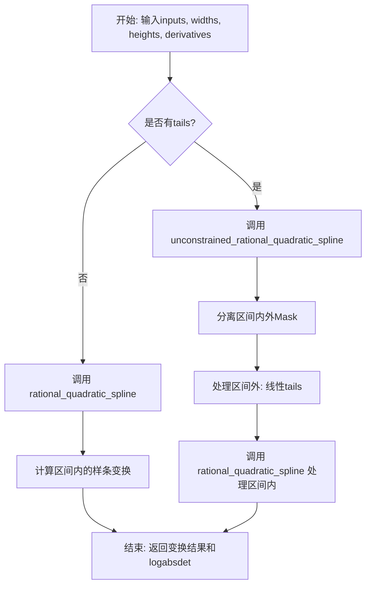
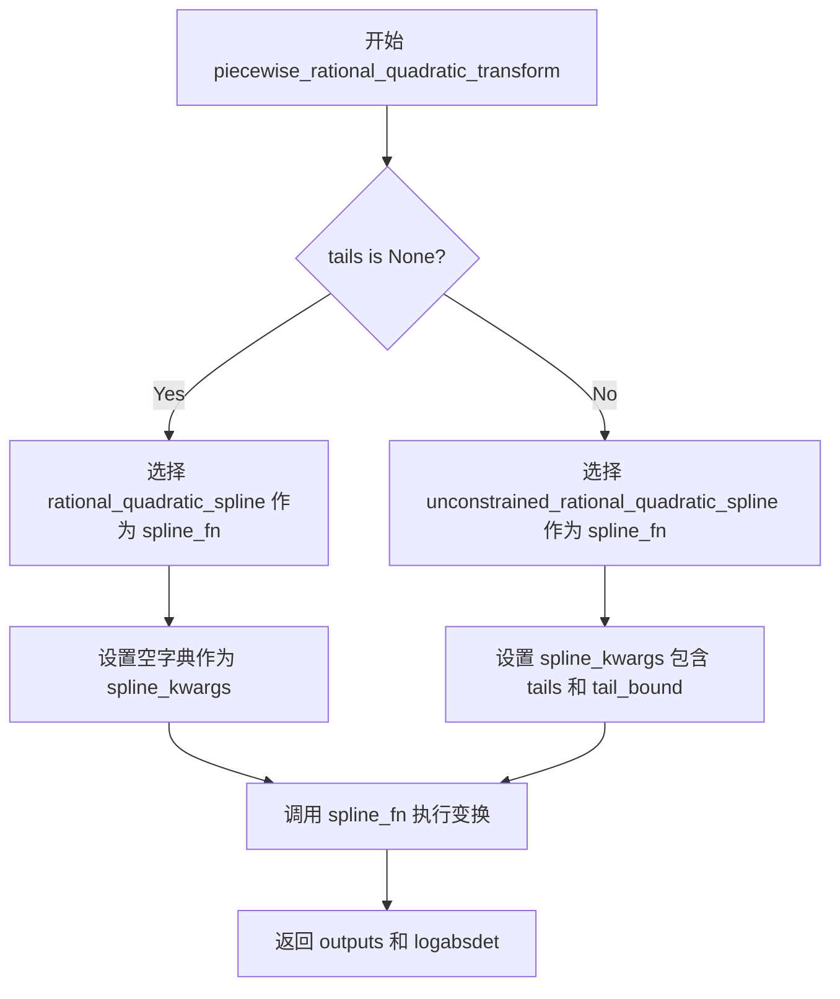
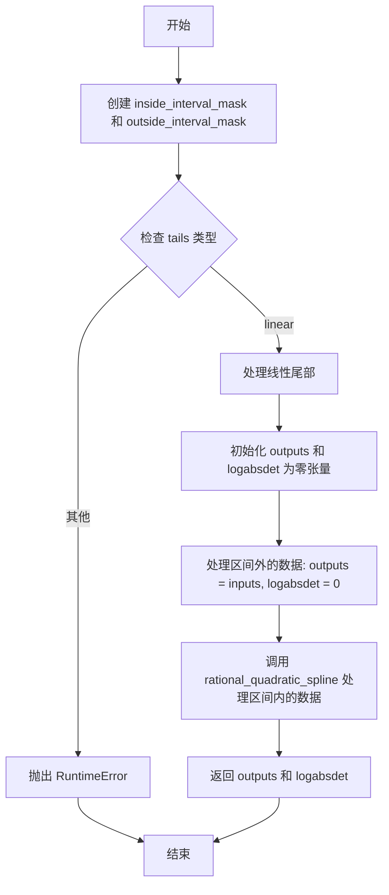
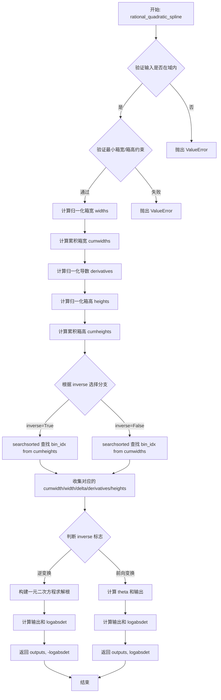

# `Bert-VITS2\transforms.py` 详细设计文档

该代码实现了一个分段有理二次样条（Piecewise Rational Quadratic Spline）变换函数，主要用于神经网络的归一化流（Normalizing Flows）中，将输入数据通过可逆的样条映射变换到新的概率分布空间，支持无约束的尾巴（tails）处理和雅可比行列式计算。

## 整体流程



## 类结构

```
模块: piecewise_rational_quadratic_spline (无类定义)
├── 全局函数集合
│   ├── piecewise_rational_quadratic_transform (主入口)
│   ├── searchsorted (辅助函数)
│   ├── unconstrained_rational_quadratic_spline (区间外处理)
│   └── rational_quadratic_spline (核心样条实现)
```

## 全局变量及字段


### `DEFAULT_MIN_BIN_WIDTH`
    
有理二次样条变换中最小分箱宽度的默认值，用于防止分箱过小导致数值不稳定

类型：`float`
    


### `DEFAULT_MIN_BIN_HEIGHT`
    
有理二次样条变换中最小分箱高度的默认值，用于防止分箱过小导致数值不稳定

类型：`float`
    


### `DEFAULT_MIN_DERIVATIVE`
    
有理二次样条变换中最小导数的默认值，用于保证样条函数的平滑性

类型：`float`
    


    

## 全局函数及方法


### `piecewise_rational_quadratic_transform`

该函数是 Normalizing Flow 模型中的核心变换组件，实现分段有理二次样条（Rational Quadratic Spline）变换。它根据输入的未归一化宽度、高度和导数参数，计算输入通过样条变换后的输出值以及变换的雅可比行列式绝对值的对数，支持前向和逆向变换，并可处理带尾部绑定的有界变换场景。

参数：

- `inputs`：`torch.Tensor`，输入张量，待变换的数值或样本
- `unnormalized_widths`：`torch.Tensor`，未归一化的箱宽度参数，用于定义样条的分段宽度
- `unnormalized_heights`：`torch.Tensor`，未归一化的箱高度参数，用于定义样条的分段高度
- `unnormalized_derivatives`：`torch.Tensor`，未归一化的导数参数，用于控制样条分段边界处的导数
- `inverse`：`bool`，是否执行逆向变换，默认为 False（执行前向变换）
- `tails`：`str` 或 `None`，尾部处理方式，可选 "linear" 或 None，默认为 None
- `tail_bound`：`float`，尾部边界值，用于限定输入范围，默认为 1.0
- `min_bin_width`：`float`，最小箱宽度约束，防止过小的箱宽，默认为 1e-3
- `min_bin_height`：`float`，最小箱高度约束，防止过小的箱高，默认为 1e-3
- `min_derivative`：`float`，最小导数值，用于防止导数接近零，默认为 1e-3

返回值：`tuple(torch.Tensor, torch.Tensor)`，返回变换后的输出张量和对应的雅可比行列式绝对值的对数（logabsdet）

#### 流程图



#### 带注释源码

```
def piecewise_rational_quadratic_transform(
    inputs,                      # 输入张量，待变换的数据
    unnormalized_widths,         # 未归一化的宽度参数
    unnormalized_heights,        # 未归一化的高度参数
    unnormalized_derivatives,    # 未归一化的导数参数
    inverse=False,               # 是否执行逆向变换
    tails=None,                  # 尾部处理方式
    tail_bound=1.0,              # 尾部边界值
    min_bin_width=DEFAULT_MIN_BIN_WIDTH,      # 最小箱宽度
    min_bin_height=DEFAULT_MIN_BIN_HEIGHT,    # 最小箱高度
    min_derivative=DEFAULT_MIN_DERIVATIVE,     # 最小导数
):
    """
    分段有理二次样条变换函数
    
    根据输入的未归一化参数计算有理二次样条变换，支持有界和无界（带尾部）两种模式。
    该变换是 Normalizing Flow 中的核心可逆变换组件。
    """
    
    # 判断是否需要处理尾部（tails）
    if tails is None:
        # 无尾部模式：使用标准有理二次样条
        spline_fn = rational_quadratic_spline
        spline_kwargs = {}  # 无需额外参数
    else:
        # 有尾部模式：使用无约束有理二次样条
        spline_fn = unconstrained_rational_quadratic_spline
        spline_kwargs = {"tails": tails, "tail_bound": tail_bound}

    # 调用实际的样条变换函数
    outputs, logabsdet = spline_fn(
        inputs=inputs,
        unnormalized_widths=unnormalized_widths,
        unnormalized_heights=unnormalized_heights,
        unnormalized_derivatives=unnormalized_derivatives,
        inverse=inverse,
        min_bin_width=min_bin_width,
        min_bin_height=min_bin_height,
        min_derivative=min_derivative,
        **spline_kwargs  # 展开尾部参数
    )
    
    # 返回变换结果和雅可比行列式绝对值的对数
    return outputs, logabsdet
```


### `searchsorted`

该函数实现了一个基于二分查找思想的搜索算法，用于在已排序的bin_locations数组中找出inputs中每个元素应该插入的位置索引。它通过比较操作和求和来模拟searchsorted的功能，是PyTorch环境下对numpy searchsorted的替代实现。

参数：

- `bin_locations`：`torch.Tensor`，累积分布的边界位置（通常是累积宽度或累积高度），维度为[..., num_bins]
- `inputs`：`torch.Tensor`，需要查找位置的输入值，维度为[..., num_inputs]
- `eps`：`float` = 1e-6，很小的正数，用于避免边界问题，确保最后一个bin被正确包含

返回值：`torch.Tensor`，整数类型的索引，表示inputs中每个元素在bin_locations中的插入位置，维度为[..., num_inputs]

#### 流程图

```mermaid
flowchart TD
    A[开始] --> B[将bin_locations最后一个维度最后一个值加上eps]
    B --> C[对inputs在最后维度添加新维度<br/>inputs[..., None]]
    C --> D[比较inputs[..., None] >= bin_locations<br/>得到布尔张量]
    D --> E[沿最后维度求和<br/>torch.sum result, dim=-1]
    E --> F[结果减1得到最终索引]
    F --> G[返回索引张量]
```

#### 带注释源码

```python
def searchsorted(bin_locations, inputs, eps=1e-6):
    """
    在已排序的bin_locations中查找inputs的插入位置
    
    参数:
        bin_locations: 累积边界位置张量，形状为[..., num_bins]
        inputs: 输入值张量，形状为[..., num_inputs]
        eps: 避免边界问题的小值，默认为1e-6
    
    返回:
        索引张量，形状为[..., num_inputs]
    """
    # 为了避免浮点数精度问题导致最后一个bin被遗漏
    # 给bin_locations的最后一个边界增加一个很小的值eps
    # 这样可以确保inputs中的最大值也能被正确分配到最后一个bin中
    bin_locations[..., -1] += eps
    
    # 使用比较和求和的方式实现类似searchsorted的功能
    # inputs[..., None]: 将inputs扩展一个维度，形状变为[..., 1]
    # 与bin_locations进行比较，形状为[..., num_bins]的布尔张量
    # True表示input值 >= 对应bin的边界
    # 沿最后一维求和，得到有多少个边界小于等于input值
    # 减1得到input应该属于的bin的索引（0-based）
    return torch.sum(inputs[..., None] >= bin_locations, dim=-1) - 1
```

#### 潜在的技术债务与优化空间

1. **算法效率**：当前实现使用比较+求和的方式，时间复杂度为O(N*M)，其中N是inputs数量，M是bin数量。可以考虑使用torch.searchsorted（PyTorch 1.7+原生支持）来提升性能，实现真正的二分查找O(N*log M)。

2. **数值稳定性**：使用eps来避免边界问题的做法虽然简单有效，但在边界值非常接近时可能引入误差。如果后续PyTorch版本稳定，可以考虑使用原生searchsorted。

3. **类型注解**：函数缺少类型注解，建议添加以提升代码可读性和IDE支持。

#### 外部依赖与接口契约

- **依赖**：PyTorch (torch)
- **输入约束**：
  - bin_locations必须是升序排列
  - inputs的值必须在bin_locations的范围内（如果不使用tails）
- **输出语义**：返回的索引i表示inputs[j]应该落在bin_locations[i]和bin_locations[i+1]之间（对于累积宽度/高度的情况）


### `unconstrained_rational_quadratic_spline`

该函数实现了无约束的有理二次样条变换（Unconstrained Rational Quadratic Spline Transform），用于在神经网络的归一化流（Normalizing Flows）中作为可逆变换函数。函数处理输入数据在尾部区间内外的不同情况：对于区间外的值使用线性尾部处理，对于区间内的值调用有理二次样条变换，并通过计算雅可比行列式的绝对值对数（logabsdet）来支持概率密度函数的变换计算。

参数：

- `inputs`：`torch.Tensor`，输入的原始数据张量
- `unnormalized_widths`：`torch.Tensor`，未归一化的箱子宽度参数
- `unnormalized_heights`：`torch.Tensor`，未归一化的箱子高度参数
- `unnormalized_derivatives`：`torch.Tensor`，未归一化的导数参数
- `inverse`：`bool`，是否执行逆变换，默认为 False
- `tails`：`str`，尾部类型，默认为 "linear"，目前仅支持线性尾部
- `tail_bound`：`float`，尾部边界值，默认为 1.0
- `min_bin_width`：`float`，最小箱子宽度，默认为 DEFAULT_MIN_BIN_WIDTH (1e-3)
- `min_bin_height`：`float`，最小箱子高度，默认为 DEFAULT_MIN_BIN_HEIGHT (1e-3)
- `min_derivative`：`float`，最小导数值，默认为 DEFAULT_MIN_DERIVATIVE (1e-3)

返回值：`Tuple[torch.Tensor, torch.Tensor]`，第一个是变换后的输出张量，第二个是变换的雅可比行列式绝对值的对数（logabsdet）

#### 流程图



#### 带注释源码

```python
def unconstrained_rational_quadratic_spline(
    inputs,                      # 输入张量
    unnormalized_widths,         # 未归一化宽度参数
    unnormalized_heights,        # 未归一化高度参数
    unnormalized_derivatives,    # 未归一化导数参数
    inverse=False,              # 是否逆变换
    tails="linear",              # 尾部类型，目前仅支持 'linear'
    tail_bound=1.0,             # 尾部边界值
    min_bin_width=DEFAULT_MIN_BIN_WIDTH,      # 最小箱子宽度 (1e-3)
    min_bin_height=DEFAULT_MIN_BIN_HEIGHT,    # 最小箱子高度 (1e-3)
    min_derivative=DEFAULT_MIN_DERIVATIVE,    # 最小导数值 (1e-3)
):
    """
    实现无约束有理二次样条变换，支持线性尾部处理。
    
    该函数将输入数据分为区间内和区间外两部分：
    - 区间外：使用线性尾部映射（Identity映射）
    - 区间内：调用 rational_quadratic_spline 进行有理二次样条变换
    """
    
    # 创建区间内外掩码：判断输入是否在 [-tail_bound, tail_bound] 范围内
    inside_interval_mask = (inputs >= -tail_bound) & (inputs <= tail_bound)
    outside_interval_mask = ~inside_interval_mask  # 取反得到区间外的掩码
    
    # 初始化输出和 logabsdet 为与输入相同形状的零张量
    outputs = torch.zeros_like(inputs)
    logabsdet = torch.zeros_like(inputs)
    
    # 根据 tails 参数处理不同的尾部类型
    if tails == "linear":
        # 对导数进行填充：首尾各加一个元素，形成导数数组的两端
        # 填充值为常数，用于边界条件的处理
        unnormalized_derivatives = F.pad(unnormalized_derivatives, pad=(1, 1))
        
        # 计算常数：使用 min_derivative 确保数值稳定性
        # 公式：log(exp(1 - min_derivative) - 1)
        constant = np.log(np.exp(1 - min_derivative) - 1)
        
        # 设置首尾导数值为常数
        # 这确保了边界处的导数不会为零或无穷大
        unnormalized_derivatives[..., 0] = constant      # 第一个导数
        unnormalized_derivatives[..., -1] = constant     # 最后一个导数
        
        # 处理区间外的值：直接复制输入，logabsdet 为 0（线性映射的雅可比为 1）
        outputs[outside_interval_mask] = inputs[outside_interval_mask]
        logabsdet[outside_interval_mask] = 0
    else:
        # 目前仅支持线性尾部，其他类型抛出未实现错误
        raise RuntimeError("{} tails are not implemented.".format(tails))
    
    # 处理区间内的值：调用有理二次样条变换
    # 使用掩码提取区间内的数据进行变换
    (
        outputs[inside_interval_mask],
        logabsdet[inside_interval_mask],
    ) = rational_quadratic_spline(
        inputs=inputs[inside_interval_mask],                    # 区间内的输入
        unnormalized_widths=unnormalized_widths[inside_interval_mask, :],   # 对应宽度参数
        unnormalized_heights=unnormalized_heights[inside_interval_mask, :], # 对应高度参数
        unnormalized_derivatives=unnormalized_derivatives[inside_interval_mask, :], # 对应导数参数
        inverse=inverse,                                         # 传递逆变换标志
        left=-tail_bound,                                        # 区间左边界
        right=tail_bound,                                        # 区间右边界
        bottom=-tail_bound,                                      # 区间下边界
        top=tail_bound,                                          # 区间上边界
        min_bin_width=min_bin_width,                             # 最小箱子宽度
        min_bin_height=min_bin_height,                           # 最小箱子高度
        min_derivative=min_derivative,                           # 最小导数
    )
    
    # 返回变换后的输出和雅可比行列式绝对值的对数
    return outputs, logabsdet
```


### `rational_quadratic_spline`

该函数实现了有理二次样条（Rational Quadratic Spline）变换，这是一种在规范化流（Normalizing Flows）中常用的灵活概率密度变换方法。该函数支持前向变换和逆变换，能够在给定区间内对输入进行非线性变换并计算变换的雅可比行列式对数绝对值。

参数：

- `inputs`：`torch.Tensor`，待变换的输入张量
- `unnormalized_widths`：`torch.Tensor`，未归一化的箱宽参数，形状为 (..., num_bins)
- `unnormalized_heights`：`torch.Tensor`，未归一化的箱高参数，形状为 (..., num_bins)
- `unnormalized_derivatives`：`torch.Tensor`，未归一化的导数参数，形状为 (..., num_bins)
- `inverse`：`bool`，是否执行逆变换，默认为 False（执行前向变换）
- `left`：`float`，样条区间左边界，默认为 0.0
- `right`：`float`，样条区间右边界，默认为 1.0
- `bottom`：`float`，样条区间下边界，默认为 0.0
- `top`：`float`，样条区间上边界，默认为 1.0
- `min_bin_width`：`float`，最小箱宽阈值，默认为 1e-3
- `min_bin_height`：`float`，最小箱高阈值，默认为 1e-3
- `min_derivative`：`float`，最小导数值，默认为 1e-3

返回值：`Tuple[torch.Tensor, torch.Tensor]`，包含变换后的输出张量（outputs）和雅可比行列式对数绝对值（logabsdet）

#### 流程图



#### 带注释源码

```python
def rational_quadratic_spline(
    inputs,                      # 输入张量，待变换的数据
    unnormalized_widths,         # 未归一化箱宽，形状 (..., num_bins)
    unnormalized_heights,       # 未归一化箱高，形状 (..., num_bins)
    unnormalized_derivatives,   # 未归一化导数，形状 (..., num_bins)
    inverse=False,               # 是否执行逆变换
    left=0.0,                    # 样条区间左边界
    right=1.0,                   # 样条区间右边界
    bottom=0.0,                  # 样条区间下边界
    top=1.0,                     # 样条区间上边界
    min_bin_width=DEFAULT_MIN_BIN_WIDTH,      # 最小箱宽，防止过小
    min_bin_height=DEFAULT_MIN_BIN_HEIGHT,    # 最小箱高，防止过小
    min_derivative=DEFAULT_MIN_DERIVATIVE,    # 最小导数值，确保平滑
):
    # === 输入验证：确保输入在定义域范围内 ===
    if torch.min(inputs) < left or torch.max(inputs) > right:
        raise ValueError("Input to a transform is not within its domain")

    # 获取箱的数量（最后一个维度的长度）
    num_bins = unnormalized_widths.shape[-1]

    # === 验证约束条件：确保最小箱宽/箱高不会太大导致无法分配 ===
    if min_bin_width * num_bins > 1.0:
        raise ValueError("Minimal bin width too large for the number of bins")
    if min_bin_height * num_bins > 1.0:
        raise ValueError("Minimal bin height too large for the number of bins")

    # === 步骤1：计算归一化箱宽 ===
    # 使用 softmax 将未归一化宽度转换为概率分布
    widths = F.softmax(unnormalized_widths, dim=-1)
    # 应用最小箱宽约束并进行线性缩放
    widths = min_bin_width + (1 - min_bin_width * num_bins) * widths
    # 计算累积宽度
    cumwidths = torch.cumsum(widths, dim=-1)
    # 在前面补零，作为累积宽度的起始点
    cumwidths = F.pad(cumwidths, pad=(1, 0), mode="constant", value=0.0)
    # 将累积宽度缩放到 [left, right] 区间
    cumwidths = (right - left) * cumwidths + left
    # 强制设置边界
    cumwidths[..., 0] = left
    cumwidths[..., -1] = right
    # 计算每个箱的实际宽度（相邻累积宽度之差）
    widths = cumwidths[..., 1:] - cumwidths[..., :-1]

    # === 步骤2：计算导数 ===
    # 使用 softplus 确保导数为正（软plus: log(1 + exp(x))）
    derivatives = min_derivative + F.softplus(unnormalized_derivatives)

    # === 步骤3：计算归一化箱高（与箱宽计算类似）===
    heights = F.softmax(unnormalized_heights, dim=-1)
    heights = min_bin_height + (1 - min_bin_height * num_bins) * heights
    cumheights = torch.cumsum(heights, dim=-1)
    cumheights = F.pad(cumheights, pad=(1, 0), mode="constant", value=0.0)
    cumheights = (top - bottom) * cumheights + bottom
    cumheights[..., 0] = bottom
    cumheights[..., -1] = top
    heights = cumheights[..., 1:] - cumheights[..., :-1]

    # === 步骤4：确定每个输入属于哪个箱 ===
    # 使用 searchsorted 找到输入在累积宽度/高度中的位置索引
    if inverse:
        # 逆变换：从累积高度中查找
        bin_idx = searchsorted(cumheights, inputs)[..., None]
    else:
        # 前向变换：从累积宽度中查找
        bin_idx = searchsorted(cumwidths, inputs)[..., None]

    # === 步骤5：收集每个输入对应箱的参数 ===
    # 使用 gather 操作根据 bin_idx 提取对应箱的参数
    input_cumwidths = cumwidths.gather(-1, bin_idx)[..., 0]      # 累积宽度边界
    input_bin_widths = widths.gather(-1, bin_idx)[..., 0]       # 箱宽度
    input_cumheights = cumheights.gather(-1, bin_idx)[..., 0]   # 累积高度边界
    
    # 计算高度与宽度之比 delta
    delta = heights / widths
    input_delta = delta.gather(-1, bin_idx)[..., 0]              # 箱的 delta 值
    
    # 收集导数值（当前点导数和下一个点导数）
    input_derivatives = derivatives.gather(-1, bin_idx)[..., 0]
    input_derivatives_plus_one = derivatives[..., 1:].gather(-1, bin_idx)[..., 0]
    
    # 收集箱高度
    input_heights = heights.gather(-1, bin_idx)[..., 0]

    # === 步骤6：执行前向或逆变换 ===
    if inverse:
        # === 逆变换：已知输出 y，求输入 x ===
        # 构造一元二次方程 ax^2 + bx + c = 0 的系数
        a = (inputs - input_cumheights) * (
            input_derivatives + input_derivatives_plus_one - 2 * input_delta
        ) + input_heights * (input_delta - input_derivatives)
        b = input_heights * input_derivatives - (inputs - input_cumheights) * (
            input_derivatives + input_derivatives_plus_one - 2 * input_delta
        )
        c = -input_delta * (inputs - input_cumheights)
        
        # 计算判别式 b^2 - 4ac
        discriminant = b.pow(2) - 4 * a * c
        # 确保数值稳定性，判别式应非负
        assert (discriminant >= 0).all()
        
        # 求根公式：x = 2c / (-b - sqrt(discriminant))
        root = (2 * c) / (-b - torch.sqrt(discriminant))
        # 计算输出 x（输入）
        outputs = root * input_bin_widths + input_cumwidths
        
        # === 计算逆变换的雅可比行列式 ===
        theta_one_minus_theta = root * (1 - root)
        denominator = input_delta + (
            (input_derivatives + input_derivatives_plus_one - 2 * input_delta)
            * theta_one_minus_theta
        )
        derivative_numerator = input_delta.pow(2) * (
            input_derivatives_plus_one * root.pow(2)
            + 2 * input_delta * theta_one_minus_theta
            + input_derivatives * (1 - root).pow(2)
        )
        logabsdet = torch.log(derivative_numerator) - 2 * torch.log(denominator)
        
        # 逆变换的雅可比行列式需要取负
        return outputs, -logabsdet
    else:
        # === 前向变换：已知输入 x，求输出 y ===
        # 计算归一化位置 theta（输入在箱内的相对位置）
        theta = (inputs - input_cumwidths) / input_bin_widths
        theta_one_minus_theta = theta * (1 - theta)
        
        # 计算有理二次分式的分子
        numerator = input_heights * (
            input_delta * theta.pow(2) + input_derivatives * theta_one_minus_theta
        )
        # 计算分母
        denominator = input_delta + (
            (input_derivatives + input_derivatives_plus_one - 2 * input_delta)
            * theta_one_minus_theta
        )
        # 计算输出 y
        outputs = input_cumheights + numerator / denominator
        
        # === 计算前向变换的雅可比行列式 ===
        derivative_numerator = input_delta.pow(2) * (
            input_derivatives_plus_one * theta.pow(2)
            + 2 * input_delta * theta_one_minus_theta
            + input_derivatives * (1 - theta).pow(2)
        )
        logabsdet = torch.log(derivative_numerator) - 2 * torch.log(denominator)
        
        return outputs, logabsdet
```

## 关键组件


### piecewise_rational_quadratic_transform

主入口函数，提供统一接口以支持带尾部（tails）和不带尾部两种模式的无约束有理二次样条变换，根据tails参数选择调用rational_quadratic_spline或unconstrained_rational_quadratic_spline。

### rational_quadratic_spline

核心样条变换函数，实现了有理二次样条的前向和逆向变换，包含bin宽度/高度的softmax归一化、累积分布计算、searchsorted索引查找、以及分段函数的闭式求解，支持inverse参数进行逆变换。

### unconstrained_rational_quadratic_spline

无约束样条函数，处理区间外部的尾部区域，使用线性尾部（tails="linear"）对超出[-tail_bound, tail_bound]范围的输入进行线性映射，区间内部通过布尔掩码调用rational_quadratic_spline处理。

### searchsorted

二分搜索函数，通过torch.sum(inputs[..., None] >= bin_locations, dim=-1) - 1计算输入在bin位置中的索引，用于确定输入属于哪个样条区间。

### 张量索引与惰性加载

使用inside_interval_mask和outside_interval_mask布尔掩码进行区间内外分离，避免显式循环，实现惰性计算：仅对区间内的输入执行复杂样条计算，区间外直接复制输入并设logabsdet为0。

### 反量化支持

通过inverse参数区分前向和逆向变换，前向使用theta = (x - cumwidths) / bin_widths计算输出，逆向通过求解二次方程 discriminant = b^2 - 4ac 获取根后再计算输出和logabsdet。

### 量化策略

使用F.softmax对unnormalized_widths和unnormalized_heights进行归一化，确保bin参数和为1；使用F.softplus对unnormalized_derivatives进行激活，确保导数非负；同时应用min_bin_width、min_bin_height、min_derivative进行下界约束。

### 全局配置常量

DEFAULT_MIN_BIN_WIDTH = 1e-3、DEFAULT_MIN_BIN_HEIGHT = 1e-3、DEFAULT_MIN_DERIVATIVE = 1e-3 分别定义最小bin宽度、高度和导数的默认下界，用于数值稳定性和防止退化解。


## 问题及建议


### 已知问题

-   **硬编码的全局常量**：DEFAULT_MIN_BIN_WIDTH、DEFAULT_MIN_BIN_HEIGHT、DEFAULT_MIN_DERIVATIVE 作为硬编码的全局常量分散在代码中，缺乏统一的配置管理机制，不利于超参数调优。
-   **不完整的 tails 支持**：unconstrained_rational_quadratic_spline 函数仅支持 "linear" tails，其他常见选项（如 "circular"、"bounded"）抛出未实现的 RuntimeError，但代码未提供清晰的接口扩展方式。
-   **缺少类型注解**：所有函数都缺少 Python 类型注解（type hints），降低了代码的可读性和 IDE 支持，也无法在静态分析阶段发现类型错误。
-   **缺乏输入 shape 验证**：未对 unnormalized_widths、unnormalized_heights、unnormalized_derivatives 的维度一致性进行完整验证，可能导致运行时难以追踪的错误。
-   **使用 assert 进行生产环境检查**：discriminant 的非负性检查使用 assert 语句，在 Python 优化模式（python -O）下会被跳过，不适合生产环境的错误处理。
-   **代码重复**：widths 和 heights 的计算逻辑高度重复（softmax → 缩放 → cumsum → padding → 归一化），违反了 DRY 原则。
-   **数值稳定性风险**：logabsdet 计算中涉及多次 log 和 pow 操作，在极端输入情况下可能出现数值溢出或 NaN，缺乏数值稳定性保护机制。

### 优化建议

-   **引入配置类或 dataclass**：创建超参数配置类，将 min_bin_width、min_bin_height、min_derivative 等参数封装其中，便于集中管理和测试。
-   **完善 tails 扩展机制**：将 tails 选项的处理抽象为策略模式或注册机制，预留接口以便轻松添加 "circular"、"bounded" 等其他 tails 类型，并提供清晰的 NotImplementedError 而非 RuntimeError。
-   **添加类型注解**：为所有函数参数和返回值添加类型注解，使用 Union、Optional、List 等类型提示提升代码质量。
-   **增强输入验证**：在函数入口处添加完整的 shape 兼容性检查，确保 unnormalized_widths、unnormalized_heights、unnormalized_derivatives 的最后维度一致，并提供有意义的错误信息。
-   **替换 assert 为显式检查**：将 discriminant >= 0 的检查替换为显式的条件判断和 ValueError 异常，确保在生产环境中始终生效。
-   **提取公共逻辑**：将 widths 和 heights 的计算抽取为独立的辅助函数（如 _compute_bin_parameters），减少代码重复并降低维护成本。
-   **添加数值稳定性保护**：在 logabsdet 计算前添加数值裁剪或使用更稳定的数学等价形式（如 logsumexp），并考虑添加 NaN/Inf 检测机制。
-   **补充文档字符串**：为所有公共函数添加详细的 docstring，说明参数含义、返回值、异常情况和数学背景。
-   **优化内存使用**：考虑使用 in-place 操作或 torch.no_grad() 上下文来减少不必要的梯度计算和内存分配。


## 其它


### 设计目标与约束

本代码实现了分段有理二次样条（Piecewise Rational Quadratic Spline）变换，主要用于归一化流（Normalizing Flows）模型中的可逆变换。设计目标包括：1）支持前向和逆向变换；2）通过softmax和softplus函数确保变换的单调性和可逆性；3）支持带尾巴（tails）的边界处理；4）计算变换的雅可比行列式对数（logabsdet）用于概率密度变换。约束条件包括输入必须在定义域内、箱子宽度和高度需满足最小值限制。

### 错误处理与异常设计

代码中包含以下错误处理机制：1）输入越界检查：在`rational_quadratic_spline`函数中检查输入是否超出定义域[left, right]，若超出则抛出ValueError；2）箱子尺寸验证：检查min_bin_width * num_bins和min_derivative * num_bins是否超过1.0，若超过则抛出ValueError；3）判别式非负断言：在逆变换计算中，使用assert确保判别式b^2 - 4ac >= 0；4）尾巴类型验证：在`unconstrained_rational_quadratic_spline`中，若tails参数不是"linear"则抛出RuntimeError。建议补充：更多边界情况的单元测试、对NaN和Inf值的检查、以及更友好的错误提示信息。

### 数据流与状态机

数据流主要分为三个层次：1）输入层：接收inputs、unnormalized_widths、unnormalized_heights、unnormalized_derivatives四个张量；2）处理层：首先通过softmax将unnormalized参数转换为有效的widths和heights，然后计算累积分布函数cumwidths和cumheights，接着使用searchsorted找到每个输入所属的bin，最后根据是否逆变换执行不同的计算公式；3）输出层：返回变换后的outputs和logabsdet。没有显式的状态机设计，函数调用是确定性的无状态变换。

### 外部依赖与接口契约

主要外部依赖包括：1）PyTorch (torch) - 张量运算和自动微分；2）torch.nn.functional (F) - softmax、softplus、pad等函数；3）NumPy (np) - 常数计算。接口契约：1）所有输入张量应具有相同的batch维度，最后一维为bin数量；2）unnormalized_widths、unnormalized_heights、unnormalized_derivatives的最后一维必须相同；3）输入张量dtype应为float32或float64；4）返回值outputs和logabsdet与输入inputs形状相同。

### 性能考虑与优化空间

当前实现存在以下性能优化空间：1）重复计算：gather操作和部分张量切片可能被重复调用多次；2）内存占用：中间变量如cumwidths、cumheights、delta等会占用额外内存；3）向量化程度：部分条件分支可以用掩码操作替代以提高GPU利用率；4）编译优化：可尝试使用torch.jit.script装饰器加速。建议：使用@torch.jit.script装饰器、减少中间张量创建、考虑使用in-place操作（需谨慎处理梯度）、添加CUDA内核融合支持。

### 数学原理说明

有理二次样条变换基于分段有理函数构建双射映射。核心公式：对于前向变换，y = h(x) = cumnheight + numerator/denominator，其中numerator = h_i * (δ_i * θ^2 + d_i * θ(1-θ))，denominator = δ_i + (d_i + d_{i+1} - 2δ_i) * θ(1-θ)，θ = (x - cumwidth_i) / width_i。逆变换通过求解二次方程得到。logabsdet = log(derivative_numerator) - 2 * log(denominator)，其中derivative_numerator = δ_i^2 * (d_{i+1} * θ^2 + 2δ_i * θ(1-θ) + d_i * (1-θ)^2)。通过softmax确保widths和heights为正且和为1，通过softplus确保derivatives为正。

### 使用示例与测试建议

典型使用场景：在 normalizing flow 中作为耦合层（coupling layer）的变换函数。示例代码：outputs, logabsdet = piecewise_rational_quadratic_transform(inputs, widths, heights, derivatives)。测试建议：1）验证前向和逆向变换的组合应近似等于恒等变换；2）验证logabsdet与数值微分结果的一致性；3）测试边界情况（输入接近tail_bound、极小/极大的unnormalized参数）；4）测试梯度流动正确性；5）性能基准测试。

    