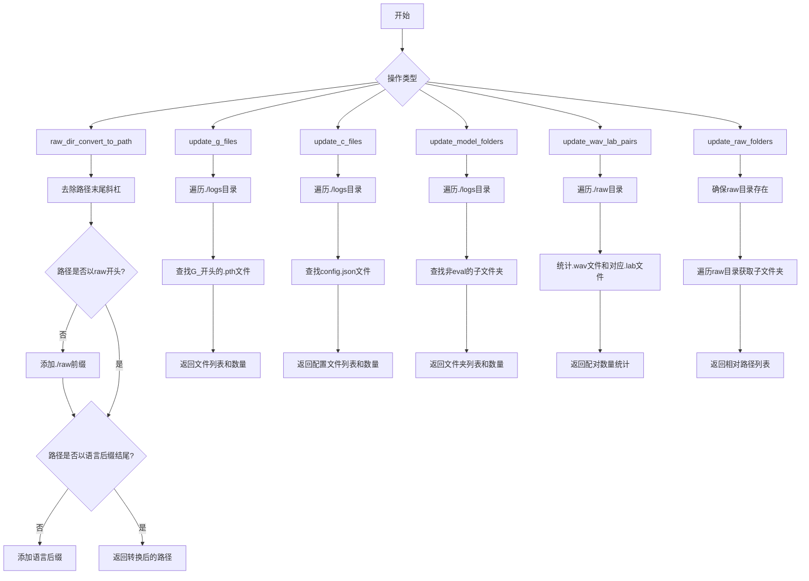
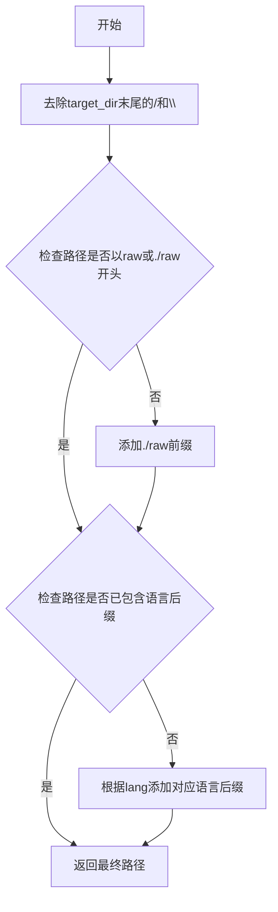
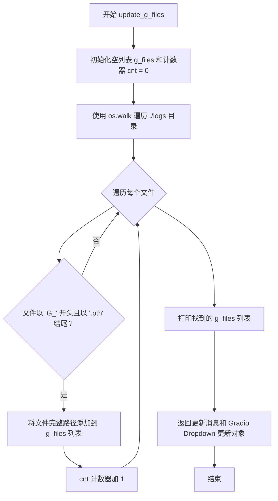
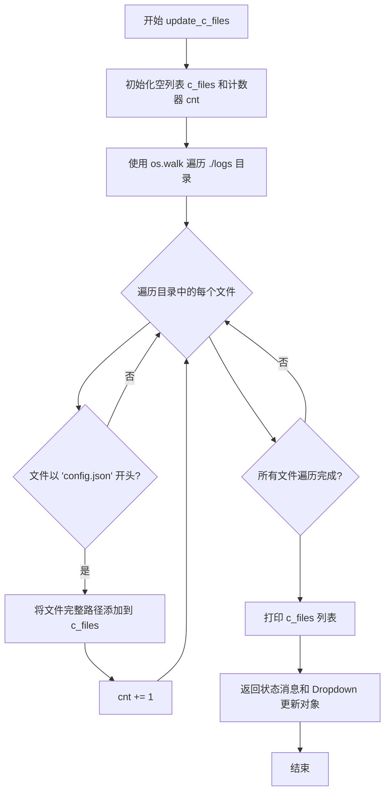
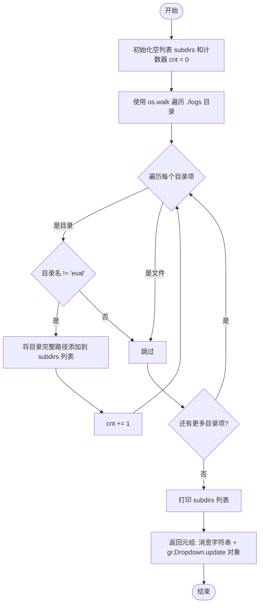
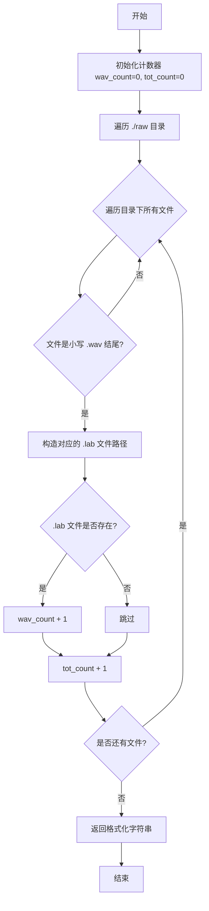
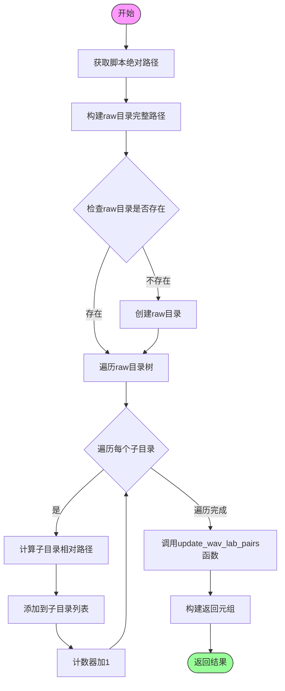

# `Bert-VITS2\update_status.py` 详细设计文档

这是一个Gradio UI应用的后端管理模块，主要用于扫描和管理模型文件（.pth权重文件、config.json配置文件）、模型文件夹，以及原始音频文件（WAV/LAB配对），并提供语言相关的目录路径转换功能。

## 整体流程



## 类结构

```
无类层次结构（全为模块级函数）
```

## 全局变量及字段


### `lang_dict`
    
语言代码到目录后缀的映射字典

类型：`dict`
    


    

## 全局函数及方法


### `raw_dir_convert_to_path`

该函数用于将用户输入的原始目录路径转换为规范化路径，确保路径以"raw"前缀开头，并添加对应的语言后缀（_en、_zh、_jp）。

参数：

- `target_dir`：`str`，目标目录路径，用户输入的原始目录名
- `lang`：`str`，语言选项，用于决定添加的语言后缀

返回值：`str`，返回处理后的规范化目录路径，包含"raw"前缀和语言后缀

#### 流程图



#### 带注释源码

```python
def raw_dir_convert_to_path(target_dir: str, lang):
    """
    转换原始目录路径，添加语言后缀和raw前缀
    
    参数:
        target_dir: str, 目标目录路径
        lang: str, 语言选项
    
    返回:
        str, 处理后的规范化路径
    """
    # 去除路径末尾的正斜杠和反斜杠
    res = target_dir.rstrip("/").rstrip("\\")
    
    # 检查路径是否以'raw'或'./raw'开头
    if (not target_dir.startswith("raw")) and (not target_dir.startswith("./raw")):
        # 如果不是，添加"./raw"前缀
        res = os.path.join("./raw", res)
    
    # 检查路径是否已包含语言后缀
    if (
        (not res.endswith("_zh"))
        and (not res.endswith("_jp"))
        and (not res.endswith("_en"))
    ):
        # 根据lang参数添加对应的语言后缀
        res += lang_dict[lang]
    
    return res
```


### `update_g_files`

扫描 logs 目录，查找所有以 "G_" 开头且以 ".pth" 结尾的模型权重文件，更新 Gradio 下拉菜单的选项列表，并返回找到的文件数量信息。

参数： 无

返回值：`tuple[str, gr.Dropdown.update]`，返回包含模型数量信息的字符串消息和 Gradio 下拉菜单的更新对象

#### 流程图



#### 带注释源码

```python
def update_g_files():
    """
    扫描 logs 目录，更新 G 模型权重文件列表
    用于查找以 G_ 开头且以 .pth 结尾的模型权重文件
    """
    g_files = []      # 用于存储找到的 G 模型权重文件路径列表
    cnt = 0           # 计数器，记录找到的模型文件数量
    
    # 使用 os.walk 递归遍历 logs 目录
    # os.walk 返回 (root, dirs, files) 三元组
    for root, dirs, files in os.walk(os.path.abspath("./logs")):
        # 遍历当前目录下的所有文件
        for file in files:
            # 检查文件名是否以 "G_" 开头且以 ".pth" 结尾
            if file.startswith("G_") and file.endswith(".pth"):
                # 拼接文件的完整路径并添加到列表
                g_files.append(os.path.join(root, file))
                # 计数器加 1
                cnt += 1
    
    # 打印找到的模型文件列表（用于调试）
    print(g_files)
    
    # 返回两个值：
    # 1. 字符串消息，包含找到的模型数量
    # 2. Gradio Dropdown 组件的更新对象，包含新的选项列表
    return f"更新模型列表完成, 共找到{cnt}个模型", gr.Dropdown.update(choices=g_files)
```


### `update_c_files`

扫描 logs 目录，更新配置文件（config.json）列表，返回更新后的模型配置文件列表和相应的 Gradio 组件更新信息。

参数：  
- 无

返回值：

- `str`，状态消息，描述找到的配置文件数量
- `gr.Dropdown.update`，Gradio 下拉菜单组件的更新对象，包含新的配置文件列表

#### 流程图



#### 带注释源码

```python
def update_c_files():
    """
    扫描 logs 目录，更新配置文件（config.json）列表
    
    该函数执行以下操作：
    1. 遍历 ./logs 目录下的所有文件
    2. 筛选出以 'config.json' 开头的配置文件
    3. 返回更新后的 Gradio Dropdown 组件选项
    """
    c_files = []      # 用于存储找到的配置文件路径列表
    cnt = 0           # 计数器，记录找到的配置文件数量
    
    # 遍历 logs 目录（使用绝对路径）
    for root, dirs, files in os.walk(os.path.abspath("./logs")):
        # 遍历当前目录下的所有文件
        for file in files:
            # 检查文件名是否以 'config.json' 开头
            if file.startswith("config.json"):
                # 拼接完整路径并添加到列表
                c_files.append(os.path.join(root, file))
                # 计数器加一
                cnt += 1
    
    # 打印找到的配置文件列表（用于调试）
    print(c_files)
    
    # 返回状态消息和 Gradio Dropdown 更新对象
    # 消息格式：'更新模型列表完成, 共找到{cnt}个配置文件'
    # Dropdown.update 会更新前端下拉菜单的选项
    return f"更新模型列表完成, 共找到{cnt}个配置文件", gr.Dropdown.update(
        choices=c_files
    )
```


### `update_model_folders`

扫描 logs 目录，更新模型文件夹列表，排除名为"eval"的目录，并返回包含文件夹路径的 Gradio 下拉菜单更新对象。

参数：

- 无参数

返回值：`tuple[str, gr.Dropdown.update]`，返回包含成功消息字符串和 Gradio 下拉菜单更新对象的元组

#### 流程图



#### 带注释源码

```python
def update_model_folders():
    """
    扫描 ./logs 目录，更新模型文件夹列表
    排除名为 'eval' 的目录，并返回 Gradio 下拉菜单更新对象
    """
    subdirs = []  # 用于存储找到的子目录路径
    cnt = 0       # 计数器，记录找到的目录数量
    
    # 遍历 logs 目录及其所有子目录
    for root, dirs, files in os.walk(os.path.abspath("./logs")):
        for dir_name in dirs:
            # 排除名为 'eval' 的目录（通常用于评估结果）
            if os.path.basename(dir_name) != "eval":
                subdirs.append(os.path.join(root, dir_name))
                cnt += 1
    
    # 打印找到的目录列表用于调试
    print(subdirs)
    
    # 返回成功消息和 Gradio 下拉菜单更新对象
    return f"更新模型文件夹列表完成, 共找到{cnt}个文件夹", gr.Dropdown.update(
        choices=subdirs
    )
```


# 设计文档：update_wav_lab_pairs 函数分析

## 1. 核心功能概述

`update_wav_lab_pairs` 函数用于遍历 `./raw` 目录统计 WAV 音频文件与对应 LAB 标注文件的配对情况，返回已配对文件数量与总 WAV 文件数量的比值字符串，常用于 UI 界面展示数据集标注完整性。

## 2. 文件整体运行流程

该代码文件包含多个文件更新相关函数，构成一个基于 Gradio 的语音数据集管理工具。主要流程如下：

```
┌─────────────────┐    ┌──────────────────┐    ┌─────────────────┐
│  update_g_files │    │ update_c_files   │    │update_model_    │
│  (更新模型列表)  │    │ (更新配置文件)    │    │folders          │
└────────┬────────┘    └────────┬─────────┘    └────────┬────────┘
         │                      │                       │
         └──────────────────────┼───────────────────────┘
                                │
                    ┌────────────▼────────────┐
                    │   update_raw_folders    │
                    │  (更新raw音频文件夹列表)  │
                    └────────────┬────────────┘
                                 │
                    ┌────────────▼────────────┐
                    │  update_wav_lab_pairs   │◄── 本次分析目标
                    │  (统计WAV/LAB配对数量)  │
                    └─────────────────────────┘
```

## 3. 函数详细信息

### `update_wav_lab_pairs`

统计 raw 目录中 WAV 与 LAB 文件的配对数量，返回格式为 "已配对数量 / 总WAV数量" 的字符串。

参数：无

返回值：`str`，返回配对统计字符串，格式为 "{wav_count} / {tot_count}"

#### 流程图



#### 带注释源码

```python
def update_wav_lab_pairs():
    """
    统计 raw 目录中 WAV 文件与对应 LAB 标注文件的配对数量
    
    Returns:
        str: 格式为 "{已配对数量} / {总WAV数量}" 的字符串
    """
    # 初始化计数器：wav_count统计已配对的WAV文件，tot_count统计总WAV文件数量
    wav_count = tot_count = 0
    
    # 使用 os.walk 遍历 ./raw 目录（包含所有子目录）
    for root, _, files in os.walk("./raw"):
        # 遍历当前目录下的所有文件
        for file in files:
            # 构造文件的完整路径
            file_path = os.path.join(root, file)
            
            # 判断文件是否为 WAV 音频文件（不区分大小写）
            if file.lower().endswith(".wav"):
                # 构造对应的 LAB 标注文件路径（将 .wav 替换为 .lab）
                lab_file = os.path.splitext(file_path)[0] + ".lab"
                
                # 检查对应的 LAB 文件是否存在
                if os.path.exists(lab_file):
                    # 存在配对的 LAB 文件，计数加一
                    wav_count += 1
                
                # 总 WAV 文件数量加一
                tot_count += 1
    
    # 返回格式化的统计字符串
    return f"{wav_count} / {tot_count}"
```

## 4. 关键组件信息

| 组件名称 | 描述 |
|---------|------|
| `os.walk` | 用于递归遍历目录树，获取所有文件 |
| `os.path.splitext` | 用于分离文件路径和扩展名，构造同名的 .lab 文件路径 |
| `os.path.exists` | 检查对应标注文件是否存在 |
| Gradio 组件集成 | 该函数返回值通常用于更新 `gr.Textbox` 组件显示 |

## 5. 潜在技术债务与优化空间

1. **硬编码路径问题**：路径 `./raw` 硬编码在函数内部，建议提取为配置参数或全局常量
2. **重复遍历**：如果同时需要更新文件夹列表和配对信息，会重复遍历同一目录，可考虑合并遍历逻辑
3. **性能考虑**：对于大规模数据集，每次调用都完整遍历目录，建议增加缓存机制或增量更新
4. **异常处理**：缺少对 `os.walk` 异常（如目录不存在）的处理
5. **命名规范**：变量名 `wav_count` 和 `tot_count` 可读性一般，建议使用更明确的命名

## 6. 其它项目

### 设计目标与约束
- **目标**：为语音数据集管理 UI 提供实时的标注文件配对统计
- **约束**：仅统计 .wav 和 .lab 文件配对，不处理其他格式

### 错误处理与异常设计
- 当前函数无异常处理，若 `./raw` 目录不存在，`os.walk` 会返回空迭代器，结果为 "0 / 0"
- 建议增加目录不存在时的友好提示

### 数据流与状态机
- 该函数为纯计算函数，无状态维护
- 属于被动调用模式，由 `update_raw_folders` 或 UI 事件触发调用

### 外部依赖与接口契约
- 依赖 Python 标准库 `os` 模块
- 返回值预期用于 Gradio `Textbox` 组件的 `value` 参数更新


### `update_raw_folders`

该函数用于扫描项目目录下的"raw"文件夹，获取所有子文件夹列表并返回统计信息，同时更新UI组件（Dropdown下拉框和Textbox文本框）以显示文件夹列表及WAV/LAB文件配对统计。

参数：
- 该函数无参数

返回值：`tuple`，返回一个包含三个元素的元组：
- 第一个元素：`str`，状态消息，描述找到的文件夹数量
- 第二个元素：`gr.Dropdown.update`，Gradio下拉菜单的更新对象，包含所有子文件夹列表
- 第三个元素：`gr.Textbox.update`，Gradio文本框的更新对象，包含WAV/LAB文件配对统计

#### 流程图



#### 带注释源码

```python
def update_raw_folders():
    """
    更新raw音频文件夹列表并返回统计信息
    
    该函数执行以下操作：
    1. 获取脚本所在目录的绝对路径
    2. 构建raw目录的完整路径
    3. 确保raw目录存在（如果不存在则创建）
    4. 遍历raw目录下所有子文件夹
    5. 计算每个子文件夹的相对路径
    6. 调用update_wav_lab_pairs获取WAV/LAB文件配对统计
    7. 返回包含状态消息和UI更新的元组
    """
    subdirs = []  # 用于存储所有子文件夹的相对路径
    cnt = 0  # 文件夹计数器
    
    # 获取当前脚本的绝对路径，确保无论从哪里运行脚本都能正确找到raw目录
    script_path = os.path.dirname(os.path.abspath(__file__))
    
    # 构建raw目录的完整路径（相对于脚本所在目录）
    raw_path = os.path.join(script_path, "raw")
    print(raw_path)  # 调试输出raw路径
    
    # 确保raw目录存在，如果不存在则创建
    os.makedirs(raw_path, exist_ok=True)
    
    # 遍历raw目录下的所有子目录（使用os.walk递归遍历）
    for root, dirs, files in os.walk(raw_path):
        for dir_name in dirs:
            # 计算子目录相对于脚本路径的相对路径，便于UI显示
            relative_path = os.path.relpath(
                os.path.join(root, dir_name), script_path
            )
            subdirs.append(relative_path)  # 添加到列表
            cnt += 1  # 计数器加1
    
    print(subdirs)  # 调试输出所有子文件夹列表
    
    # 返回元组：状态消息、Dropdown更新对象、Textbox更新对象
    return (
        f"更新raw音频文件夹列表完成, 共找到{cnt}个文件夹",
        gr.Dropdown.update(choices=subdirs),  # 更新下拉菜单选项
        gr.Textbox.update(value=update_wav_lab_pairs()),  # 更新文本框显示WAV/LAB统计
    )
```


## 关键组件


### 语言字典 (lang_dict)

定义支持的语言代码映射字典，用于路径转换时添加语言后缀。

### 原始目录路径转换 (raw_dir_convert_to_path)

将目标目录路径转换为符合语言约定的完整路径，自动添加语言后缀（_zh、_jp、_en）。

### G模型文件更新 (update_g_files)

遍历日志目录，查找所有以"G_"开头且以".pth"结尾的模型权重文件，返回更新结果消息和下拉选项。

### 配置文件更新 (update_c_files)

遍历日志目录，查找所有名为"config.json"的配置文件，返回更新结果消息和下拉选项。

### 模型文件夹更新 (update_model_folders)

遍历日志目录，获取所有子文件夹（排除eval目录），返回更新结果消息和下拉选项。

### WAV/LAB配对统计 (update_wav_lab_pairs)

遍历原始音频目录，统计WAV文件数量及其对应的LAB文件数量，返回配对统计字符串。

### 原始音频文件夹更新 (update_raw_folders)

确保raw目录存在，遍历获取所有子文件夹的相对路径，返回更新结果消息、下拉选项和WAV/LAB配对统计。


## 问题及建议


### 已知问题

-   **代码重复**：update_g_files()、update_c_files()、update_model_folders() 三个函数包含大量重复的 os.walk 遍历逻辑，每次调用都会重新遍历目录树，效率低下
-   **死代码**：raw_dir_convert_to_path 函数定义后从未被调用，属于无效代码
-   **硬编码路径**："./logs"、"./raw" 等路径在多处硬编码，缺乏统一配置管理
-   **缺少错误处理**：所有文件遍历和操作均无 try-except 保护，文件权限问题或路径不存在时会导致程序崩溃
-   **魔法字符串**：文件匹配模式（如 "G_"、"config.json"、".pth"）散布在代码中，缺乏常量定义
-   **调试代码残留**：多处 print 语句用于调试，生产环境应使用日志框架
-   **全局变量命名不规范**：lang_dict 作为全局常量应命名为 LANG_DICT（大写加下划线）
-   **类型注解不完整**：raw_dir_convert_to_path 函数的 lang 参数缺少类型注解，多个函数缺少返回值类型注解
-   **路径处理不一致**：部分使用相对路径 "./raw"，部分使用 os.path.abspath，行为不一致
-   **函数职责不单一**：update_raw_folders 内部调用 update_wav_lab_pairs，违反函数单一职责原则
-   **重复遍历问题**：多个 update 函数会重复遍历同一目录，系统文件多时性能影响明显
-   **缺少输入验证**：target_dir、lang 等参数未做有效性校验

### 优化建议

-   将重复的文件遍历逻辑抽取为通用函数，接受文件名前缀/后缀/目录等参数
-   使用配置文件或环境变量集中管理路径常量
-   为所有文件操作添加异常处理和错误返回值
-   删除未使用的 raw_dir_convert_to_path 函数
-   将 print 替换为 Python logging 模块
-   使用全局常量命名规范（LANG_DICT）
-   补充完整的类型注解
-   考虑缓存目录遍历结果或使用享元模式减少重复扫描
-   将 update_raw_folders 拆分为两个独立函数
-   添加参数校验逻辑
-   使用 pathlib 替代 os.path 提升代码可读性


## 其它


### 设计目标与约束

本代码是一个基于Gradio的GUI工具，主要用于管理深度学习模型的配置文件和原始音频数据。设计目标包括：提供可视化的模型文件管理界面，支持中、英、日三种语言的目录命名规范，自动扫描和更新模型列表，同步维护音频文件和对应的标注文件。约束条件包括：依赖特定的目录结构（./logs存放模型，./raw存放音频），文件命名必须遵循特定前缀规则（G_开头的模型文件，config.json配置文件），语言后缀仅支持_en、_zh、_jp三种。

### 错误处理与异常设计

代码中主要通过os.path.exists()检查文件是否存在，使用异常捕获机制处理文件操作异常。对于文件扫描函数，当目录不存在时os.walk会返回空列表，不会抛出异常。gr.Dropdown.update()用于处理UI组件更新异常，返回格式统一的计数信息便于调试。所有路径均使用os.path.join()和os.path.abspath()确保跨平台兼容性，目录创建使用os.makedirs( exist_ok=True)避免重复创建异常。

### 数据流与状态机

数据流主要分为三个分支：模型文件流（update_g_files扫描G_*.pth文件）、配置文件流（update_c_files扫描config.json文件）、原始数据流（update_raw_folders扫描raw目录）。状态转换通过Gradio的事件驱动机制实现，用户点击按钮触发相应更新函数，返回状态消息和组件更新对象。wav/lab配对检查形成独立的状态支线，不影响主流程。

### 外部依赖与接口契约

核心依赖包括：gradio（GUI框架版本需支持Dropdown.update和Textbox.update）、os模块（文件系统操作）、os.path模块（路径处理）。所有函数均为无状态纯函数，接受明确输入参数并返回标准格式：更新类函数返回(消息字符串, 组件更新对象)元组，计数类函数返回格式化字符串。lang_dict作为全局配置字典，定义了语言代码到目录后缀的映射关系。

### 性能考虑

代码使用os.walk()递归遍历目录，复杂度为O(n)其中n为文件总数。多次遍历./logs和./raw目录造成重复IO操作，可考虑合并扫描逻辑。字符串拼接使用os.path.join()而非格式化字符串，确保跨平台路径正确性。g_files、c_files等列表在函数内部声明，每次调用重新初始化，符合内存管理最佳实践。

### 安全性考虑

代码未实现用户输入验证机制，target_dir参数直接用于路径拼接存在路径遍历风险，建议增加路径规范化检查。raw_path基于__file__获取脚本目录，相对安全但仍需防止符号链接攻击。文件过滤仅使用startswith()和endswith()前缀匹配，未验证文件类型，建议增加文件魔数检查。目录遍历无深度限制，可能存在软链接循环风险。

### 目录结构约定

项目遵循特定目录结构：./logs存放训练产出（模型权重、配置文件、子目录），./raw存放原始音频数据和标注文件。语言子目录命名规范为原目录名+语言后缀（_en/_zh/_jp），通过lang_dict统一管理。eval目录被明确排除在扫描范围外。相对路径计算以脚本所在目录为基准，确保在不同工作目录下运行时路径一致性。

    