# `Bert-VITS2\utils.py` 详细设计文档

该文件是Bert-VITS2语音合成模型的工具函数集，提供了模型下载、检查点管理、音频处理、可视化、超参数管理、模型混合等核心功能，用于支撑端到端的语音合成训练和推理流程。

## 整体流程

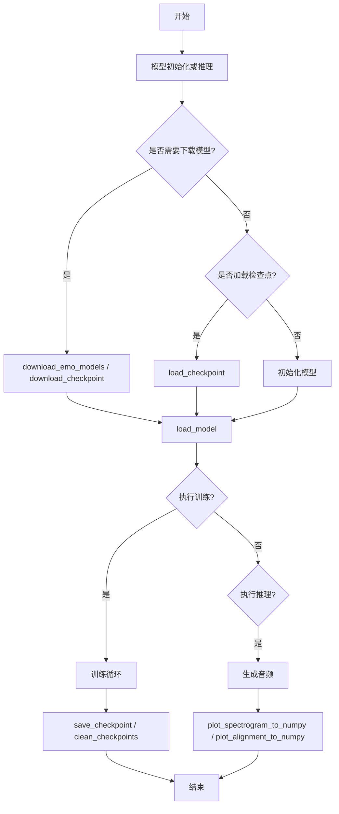

## 类结构

```
utils.py (工具模块)
├── HParams (超参数管理类)
├── 全局变量
│   ├── MATPLOTLIB_FLAG
│   └── logger
└── 全局函数
    ├── 模型下载相关
    │   ├── download_emo_models
    │   └── download_checkpoint
    ├── 检查点管理
    │   ├── load_checkpoint
    │   ├── save_checkpoint
    │   ├── latest_checkpoint_path
    │   └── clean_checkpoints
    ├── 可视化
    │   ├── plot_spectrogram_to_numpy
    │   └── plot_alignment_to_numpy
    ├── 音频处理
    │   ├── load_wav_to_torch
    │   └── load_filepaths_and_text
    ├── 超参数管理
    │   ├── get_hparams
    │   ├── get_hparams_from_dir
    │   └── get_hparams_from_file
    ├── 训练辅助
    │   ├── summarize
    │   ├── get_logger
    │   └── check_git_hash
    └── 模型操作
        ├── load_model
        ├── mix_model
        └── get_steps
```

## 全局变量及字段


### `MATPLOTLIB_FLAG`
    
全局标志位，用于标记matplotlib是否已初始化（避免重复初始化）

类型：`bool`
    


### `logger`
    
模块级日志记录器，用于输出程序运行时的日志信息

类型：`logging.Logger`
    


### `HParams.self.__dict__`
    
存储超参数键值对的字典对象

类型：`dict`
    
    

## 全局函数及方法


### `download_emo_models`

该函数用于从不同的模型源下载情感模型。当 mirror 参数为 "openi" 时，使用 OpenI 平台下载模型；否则使用 Hugging Face Hub 的 hf_hub_download 方法从指定仓库下载 PyTorch 模型文件到本地目录。

参数：

- `mirror`：`str`，镜像源标识，"openi" 表示使用 OpenI 平台，其他值表示使用 HuggingFace Hub
- `repo_id`：`str`，HuggingFace Hub 上的仓库 ID，格式如 "username/repo_name"
- `model_name`：`str`，本地模型保存目录的名称

返回值：`None`，该函数无返回值，直接将模型下载到本地

#### 流程图

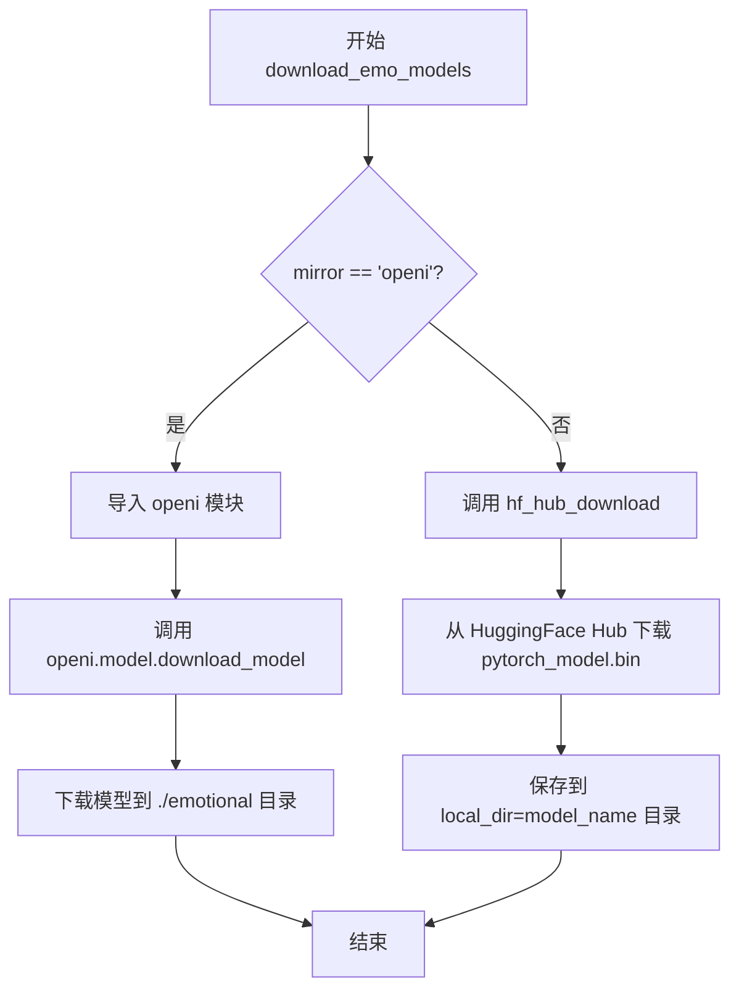

#### 带注释源码

```python
def download_emo_models(mirror, repo_id, model_name):
    """
    下载情感模型文件
    
    参数:
        mirror: 字符串,指定下载源。"openi"使用OpenI平台,其他值使用HuggingFace Hub
        repo_id: 字符串,HuggingFace Hub的仓库ID,如 "username/repo_name"
        model_name: 字符串,本地保存模型的目录名称
    """
    # 判断是否使用OpenI镜像源
    if mirror == "openi":
        # 导入OpenI模块(仅在使用openi镜像时导入)
        import openi

        # 使用OpenI平台下载模型
        # 参数1: 基础仓库名 "Stardust_minus/Bert-VITS2"
        # 参数2: 从repo_id中提取的仓库标识(取最后一个/后的部分)
        # 参数3: 本地保存路径 "./emotional"
        openi.model.download_model(
            "Stardust_minus/Bert-VITS2",
            repo_id.split("/")[-1],
            "./emotional",
        )
    else:
        # 使用HuggingFace Hub下载模型
        # 参数repo_id: HuggingFace仓库ID
        # 参数"pytorch_model.bin": 要下载的文件名
        # 参数local_dir: 本地保存目录
        # 参数local_dir_use_symlinks=False: 不使用符号链接,直接复制文件
        hf_hub_download(
            repo_id,
            "pytorch_model.bin",
            local_dir=model_name,
            local_dir_use_symlinks=False,
        )
```


### `download_checkpoint`

该函数用于从HuggingFace Hub或OpenI镜像源下载模型检查点文件（.pth），支持检查点已存在时跳过下载，并根据mirror参数选择不同的下载方式。

参数：

- `dir_path`：`str`，目标目录路径，用于存放下载的检查点文件
- `repo_config`：`dict`，仓库配置信息，包含`repo_id`和`model_image`等键值
- `token`：`Optional[str]`，可选的认证令牌，用于访问私有仓库
- `regex`：`str`，文件匹配正则表达式，默认为"G_\*.pth"，用于检查文件是否已存在
- `mirror`：`str`，下载镜像源，默认为"openi"，可选择其他镜像或HuggingFace Hub

返回值：`None`，该函数无返回值

#### 流程图

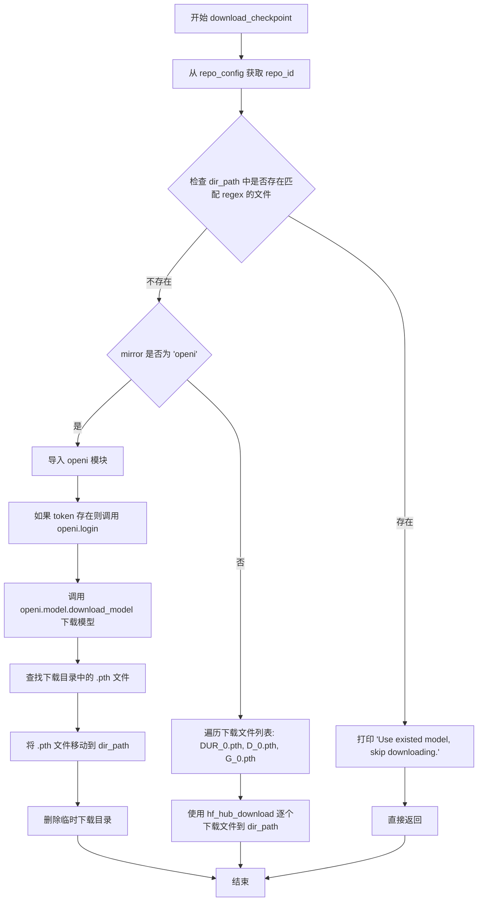

#### 带注释源码

```
def download_checkpoint(
    dir_path, repo_config, token=None, regex="G_*.pth", mirror="openi"
):
    # 从配置中获取仓库ID
    repo_id = repo_config["repo_id"]
    
    # 使用glob查找目录中是否存在匹配regex的检查点文件
    f_list = glob.glob(os.path.join(dir_path, regex))
    
    # 如果已存在匹配的检查点文件，则跳过下载
    if f_list:
        print("Use existed model, skip downloading.")
        return
    
    # 根据mirror参数选择不同的下载方式
    if mirror.lower() == "openi":
        # 使用OpenI镜像下载
        import openi

        # 如果提供了token，则用于登录
        kwargs = {"token": token} if token else {}
        openi.login(**kwargs)

        # 获取模型镜像名称
        model_image = repo_config["model_image"]
        
        # 从OpenI下载模型到指定目录
        openi.model.download_model(repo_id, model_image, dir_path)

        # 查找下载目录中的所有.pth文件
        fs = glob.glob(os.path.join(dir_path, model_image, "*.pth"))
        
        # 将下载的.pth文件移动到目标目录
        for file in fs:
            shutil.move(file, dir_path)
        
        # 删除临时目录
        shutil.rmtree(os.path.join(dir_path, model_image))
    else:
        # 使用HuggingFace Hub下载默认的三个检查点文件
        for file in ["DUR_0.pth", "D_0.pth", "G_0.pth"]:
            hf_hub_download(
                repo_id, file, local_dir=dir_path, local_dir_use_symlinks=False
            )
```


### `load_checkpoint`

该函数用于从指定的检查点文件加载模型权重、优化器状态、学习率和训练迭代次数，支持分布式模型和旧版本模型的向后兼容性处理。

参数：

- `checkpoint_path`：`str`，检查点文件的路径
- `model`：`torch.nn.Module`，需要加载权重的模型实例
- `optimizer`：`torch.optim.Optimizer`，可选参数，用于加载优化器状态
- `skip_optimizer`：`bool`，是否跳过加载优化器状态，默认为 False

返回值：`tuple`，包含 (model, optimizer, learning_rate, iteration)

#### 流程图

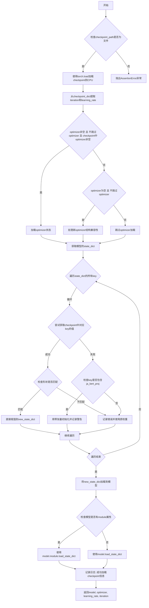

#### 带注释源码

```python
def load_checkpoint(checkpoint_path, model, optimizer=None, skip_optimizer=False):
    """
    加载检查点文件以恢复模型权重、优化器状态和训练进度
    
    参数:
        checkpoint_path: 检查点文件路径
        model: 要加载权重的模型
        optimizer: (可选) 要加载状态的优化器
        skip_optimizer: 是否跳过优化器状态加载
    
    返回:
        (model, optimizer, learning_rate, iteration) 元组
    """
    
    # 断言检查点文件存在
    assert os.path.isfile(checkpoint_path)
    
    # 将检查点文件加载到CPU（避免GPU内存问题）
    checkpoint_dict = torch.load(checkpoint_path, map_location="cpu")
    
    # 从检查点字典中提取训练迭代次数和学习率
    iteration = checkpoint_dict["iteration"]
    learning_rate = checkpoint_dict["learning_rate"]
    
    # 根据条件处理优化器状态加载
    if (
        optimizer is not None  # 优化器对象存在
        and not skip_optimizer  # 不跳过优化器加载
        and checkpoint_dict["optimizer"] is not None  # 检查点包含优化器状态
    ):
        # 标准情况：直接加载优化器状态
        optimizer.load_state_dict(checkpoint_dict["optimizer"])
    elif optimizer is None and not skip_optimizer:
        # 特殊情况：优化器为None但要求加载时，创建新的optimizer结构
        # 这里似乎有逻辑错误：optimizer为None时无法调用state_dict()
        # 注释说明：如果是推理模式或恢复检查点，禁用上行代码，启用本行
        new_opt_dict = optimizer.state_dict()
        new_opt_dict_params = new_opt_dict["param_groups"][0]["params"]
        new_opt_dict["param_groups"] = checkpoint_dict["optimizer"]["param_groups"]
        new_opt_dict["param_groups"][0]["params"] = new_opt_dict_params
        optimizer.load_state_dict(new_opt_dict)
    
    # 获取保存的模型状态字典
    saved_state_dict = checkpoint_dict["model"]
    
    # 处理分布式训练模型（DataParallel/DistributedDataParallel）
    if hasattr(model, "module"):
        state_dict = model.module.state_dict()
    else:
        state_dict = model.state_dict()
    
    # 构建新的状态字典，处理键不匹配问题
    new_state_dict = {}
    for k, v in state_dict.items():
        try:
            # 尝试从检查点获取对应键的权重
            new_state_dict[k] = saved_state_dict[k]
            # 验证形状一致性
            assert saved_state_dict[k].shape == v.shape, (
                saved_state_dict[k].shape,
                v.shape,
            )
        except:
            # 处理旧版本模型升级情况
            if "ja_bert_proj" in k:
                # 对于旧版本的ja_bert_proj参数，初始化为零以保持向后兼容
                v = torch.zeros_like(v)
                logger.warn(
                    f"Seems you are using the old version of the model, the {k} is automatically set to zero for backward compatibility"
                )
            else:
                # 记录键不存在的错误
                logger.error(f"{k} is not in the checkpoint")
            
            # 使用原模型的权重（零张量或其他）
            new_state_dict[k] = v
    
    # 将新状态字典加载到模型
    if hasattr(model, "module"):
        model.module.load_state_dict(new_state_dict, strict=False)
    else:
        model.load_state_dict(new_state_dict, strict=False)
    
    # 记录加载成功日志
    logger.info(
        "Loaded checkpoint '{}' (iteration {})".format(checkpoint_path, iteration)
    )
    
    # 返回模型、优化器、学习率和迭代次数
    return model, optimizer, learning_rate, iteration
```


### `save_checkpoint`

该函数用于将模型参数、优化器状态、学习率和当前迭代次数保存到指定的检查点文件中，以便后续恢复训练或进行推理。

参数：

- `model`：`torch.nn.Module`，需要保存的模型对象，函数会提取其状态字典（state_dict）
- `optimizer`：`torch.optim.Optimizer`，优化器对象，用于保存其状态以支持训练恢复
- `learning_rate`：`float`，当前学习率，用于记录训练超参数
- `iteration`：`int`，当前训练迭代次数，用于记录训练进度
- `checkpoint_path`：`str`，检查点文件的保存路径

返回值：`None`，该函数无返回值，直接将数据写入指定文件

#### 流程图

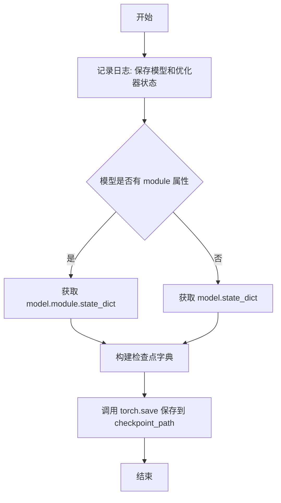

#### 带注释源码

```python
def save_checkpoint(model, optimizer, learning_rate, iteration, checkpoint_path):
    """
    保存模型和优化器的检查点
    
    参数:
        model: PyTorch模型对象
        optimizer: PyTorch优化器对象
        learning_rate: 当前学习率
        iteration: 当前迭代次数
        checkpoint_path: 检查点保存路径
    """
    # 记录保存日志，包含迭代次数和保存路径
    logger.info(
        "Saving model and optimizer state at iteration {} to {}".format(
            iteration, checkpoint_path
        )
    )
    
    # 判断模型是否使用了DataParallel或多GPU训练
    # 如果使用了，模型会有module属性，需要从module中获取state_dict
    if hasattr(model, "module"):
        state_dict = model.module.state_dict()
    else:
        state_dict = model.state_dict()
    
    # 使用torch.save保存检查点，包含:
    # - model: 模型的状态字典
    # - iteration: 当前迭代次数
    # - optimizer: 优化器的状态字典
    # - learning_rate: 当前学习率
    torch.save(
        {
            "model": state_dict,
            "iteration": iteration,
            "optimizer": optimizer.state_dict(),
            "learning_rate": learning_rate,
        },
        checkpoint_path,
    )
```


### `summarize`

该函数是一个用于将训练过程中的标量、直方图、图像和音频数据记录到 TensorBoard 的工具函数，支持批量写入多种数据类型并在指定全局步数下进行可视化监控。

参数：

- `writer`：`SummaryWriter`，TensorBoard 的日志写入器，用于将数据写入事件文件
- `global_step`：`int`，全局训练步数，用于标记数据记录的时间点
- `scalars`：`dict`，标量数据字典，键为标签名，值为待记录的标量数值
- `histograms`：`dict`，直方图数据字典，键为标签名，值为待记录的分布数据
- `images`：`dict`，图像数据字典，键为标签名，值为待记录的图像数据（HWC 格式）
- `audios`：`dict`，音频数据字典，键为标签名，值为待记录的音频波形数据
- `audio_sampling_rate`：`int`，音频采样率，默认为 22050 Hz

返回值：`None`，该函数无返回值，仅执行日志写入操作

#### 流程图

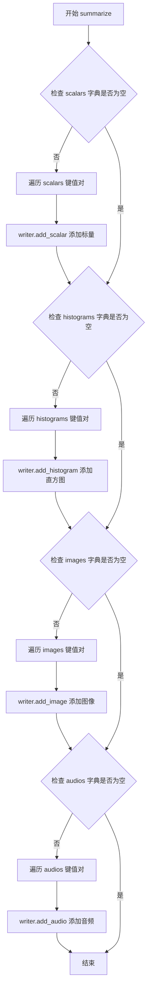

#### 带注释源码

```python
def summarize(
    writer,                  # TensorBoard SummaryWriter 实例，用于写入日志
    global_step,             # int，当前训练的全局步数
    scalars={},              # dict，标量数据映射表
    histograms={},           # dict，直方图数据映射表
    images={},              # dict，图像数据映射表（HWC格式）
    audios={},              # dict，音频数据映射表
    audio_sampling_rate=22050,  # int，音频采样率默认值
):
    """将训练过程中的多种数据类型记录到 TensorBoard"""
    
    # 遍历并记录所有标量数据（如 loss、learning_rate 等）
    for k, v in scalars.items():
        writer.add_scalar(k, v, global_step)
    
    # 遍历并记录所有直方图数据（如权重分布、激活值分布等）
    for k, v in histograms.items():
        writer.add_histogram(k, v, global_step)
    
    # 遍历并记录所有图像数据（如频谱图、对齐图等）
    # dataformats="HWC" 表示数据格式为 Height x Width x Channels
    for k, v in images.items():
        writer.add_image(k, v, global_step, dataformats="HWC")
    
    # 遍历并记录所有音频数据（如生成的语音样本等）
    for k, v in audios.items():
        writer.add_audio(k, v, global_step, audio_sampling_rate)
```


### `latest_checkpoint_path`

该函数用于在指定目录中查找匹配特定正则表达式的检查点文件，并返回文件名中包含最大数字的最新检查点路径。

参数：

- `dir_path`：`str`，要搜索检查点文件的目录路径
- `regex`：`str`，用于匹配文件名的正则表达式，默认为 "G_*.pth"

返回值：`str`，返回匹配文件列表中数字最大的文件完整路径

#### 流程图

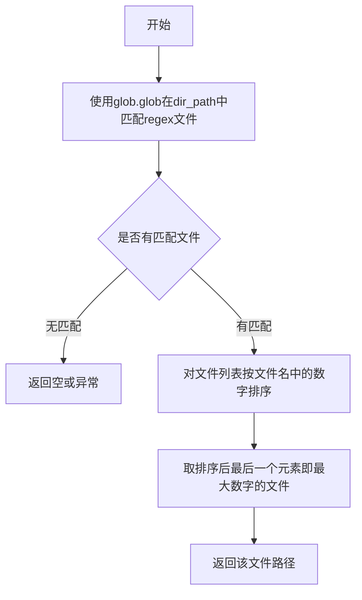

#### 带注释源码

```python
def latest_checkpoint_path(dir_path, regex="G_*.pth"):
    """
    查找目录中匹配正则表达式的最新检查点文件路径
    
    参数:
        dir_path: str, 要搜索的目录路径
        regex: str, 文件名匹配模式，默认为 "G_*.pth"
    
    返回:
        str: 数字最大的匹配文件完整路径
    """
    # 使用glob模块查找所有匹配regex模式的文件路径
    f_list = glob.glob(os.path.join(dir_path, regex))
    
    # 对文件列表按文件名中的数字进行排序
    # filter(str.isdigit, f) 提取文件名中的所有数字
    # int("".join(...)) 将提取的数字合并并转为整数用于排序
    f_list.sort(key=lambda f: int("".join(filter(str.isdigit, f))))
    
    # 获取排序后的最后一个元素，即数字最大的文件（最新检查点）
    x = f_list[-1]
    
    # 返回最新检查点文件的完整路径
    return x
```


### `plot_spectrogram_to_numpy`

将频谱图（Spectrogram）数据转换为numpy数组格式的RGB图像，用于在TensorBoard等可视化工具中显示频谱图。

参数：

- `spectrogram`：`numpy.ndarray`，输入的频谱图数据，通常是二维数组，表示频率在不同时间帧上的能量分布

返回值：`numpy.ndarray`，返回转换后的RGB图像数据，形状为 (图像高度, 图像宽度, 3)，数据类型为 uint8

#### 流程图

```mermaid
flowchart TD
    A[开始] --> B{MATPLOTLIB_FLAG 是否为 False?}
    B -->|是| C[导入 matplotlib 并设置后端为 Agg]
    B -->|否| D[跳过 matplotlib 初始化]
    C --> E[设置 MATPLOTLIB_FLAG 为 True]
    E --> F[设置 matplotlib 日志级别为 WARNING]
    D --> G[导入 matplotlib.pyplot 和 numpy]
    F --> G
    G --> H[创建画布 figsize=(10, 2)]
    H --> I[使用 imshow 绘制频谱图]
    I --> J[添加颜色条]
    J --> K[设置坐标轴标签: x=Frames, y=Channels]
    K --> L[调用 tight_layout 调整布局]
    L --> M[canvas.draw 渲染画布]
    M --> N[从 canvas 获取 RGB 数据]
    N --> O[将数据 reshape 为图像格式]
    O --> P[关闭画布释放资源]
    P --> Q[返回图像数据]
```

#### 带注释源码

```python
def plot_spectrogram_to_numpy(spectrogram):
    """
    将频谱图数据转换为RGB图像数组
    
    参数:
        spectrogram: 频谱图numpy数组，形状为 (频率 bins, 时间帧数)
    
    返回值:
        numpy.ndarray: RGB图像数据，形状为 (height, width, 3)，dtype=uint8
    """
    # 访问全局标志位，用于判断matplotlib是否已初始化
    global MATPLOTLIB_FLAG
    
    # 检查matplotlib是否已初始化，避免重复导入和配置
    if not MATPLOTLIB_FLAG:
        # 导入matplotlib库
        import matplotlib
        
        # 设置matplotlib后端为'Agg'，这是无头模式，适合服务器环境
        matplotlib.use("Agg")
        
        # 设置全局标志位为True，表示已初始化
        MATPLOTLIB_FLAG = True
        
        # 获取matplotlib的日志记录器
        mpl_logger = logging.getLogger("matplotlib")
        
        # 设置日志级别为WARNING，减少不必要的日志输出
        mpl_logger.setLevel(logging.WARNING)
    
    # 导入matplotlib的pylab模块，用于绘图
    import matplotlib.pylab as plt
    # 导入numpy用于数组操作
    import numpy as np

    # 创建画布和坐标轴， figsize设置宽度10英寸、高度2英寸
    fig, ax = plt.subplots(figsize=(10, 2))
    
    # 使用imshow绘制频谱图热力图
    # aspect='auto' 自动调整长宽比
    # origin='lower' 将原点设置在左下角
    # interpolation='none' 不进行插值
    im = ax.imshow(spectrogram, aspect="auto", origin="lower", interpolation="none")
    
    # 添加颜色条，显示频率能量的数值对应关系
    plt.colorbar(im, ax=ax)
    
    # 设置x轴标签为"Frames"（时间帧）
    plt.xlabel("Frames")
    # 设置y轴标签为"Channels"（频率通道）
    plt.ylabel("Channels")
    
    # 调整子图布局，避免标签被裁剪
    plt.tight_layout()

    # 渲染画布内容到缓冲区
    fig.canvas.draw()
    
    # 从画布的RGB缓冲区获取图像数据
    # tostring_rgb() 返回扁平化的RGB字符串数据
    # dtype=np.uint8 确保数据类型为无符号8位整数
    # sep="" 表示不使用分隔符
    data = np.fromstring(fig.canvas.tostring_rgb(), dtype=np.uint8, sep="")
    
    # 重塑数据为图像格式: (height, width, 3)
    # get_width_height() 返回 (width, height)，需要反转顺序 [::-1]
    # 添加通道维度 (+ (3,)) 表示RGB三个通道
    data = data.reshape(fig.canvas.get_width_height()[::-1] + (3,))
    
    # 关闭画布，释放内存资源，避免内存泄漏
    plt.close()
    
    # 返回转换后的图像数据
    return data
```


### `plot_alignment_to_numpy`

该函数用于将对齐矩阵（alignment matrix）可视化为numpy数组格式的图像数据。它接收一个对齐矩阵作为输入，可选地附加额外信息，然后使用matplotlib绘制热图并将其转换为RGB图像数组返回。

参数：

- `alignment`：`numpy.ndarray`，对齐矩阵数据，通常是注意力机制的输出，表示编码器和解码器时间步之间的对齐关系
- `info`：`str`，可选参数，用于在x轴标签上显示的额外信息（如说话者ID、文本内容等）

返回值：`numpy.ndarray`，uint8类型的RGB图像数据，形状为（图像高度，图像宽度，3），可直接用于可视化或日志记录

#### 流程图

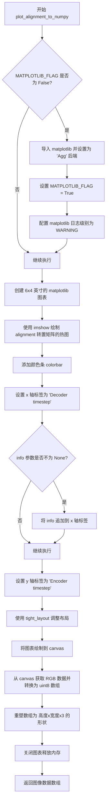

#### 带注释源码

```python
def plot_alignment_to_numpy(alignment, info=None):
    """
    将对齐矩阵可视化并转换为numpy图像数组
    
    参数:
        alignment: numpy.ndarray - 对齐矩阵数据
        info: str, optional - 附加信息
    
    返回:
        numpy.ndarray - RGB图像数据
    """
    # 全局标志，用于确保matplotlib只初始化一次
    global MATPLOTLIB_FLAG
    
    # 检查matplotlib是否已初始化，未初始化则进行初始化配置
    if not MATPLOTLIB_FLAG:
        import matplotlib
        # 使用非交互式后端，适合服务器环境绘图
        matplotlib.use("Agg")
        MATPLOTLIB_FLAG = True
        # 获取matplotlib日志记录器并设置日志级别
        mpl_logger = logging.getLogger("matplotlib")
        mpl_logger.setLevel(logging.WARNING)
    
    # 导入绘图所需模块
    import matplotlib.pylab as plt
    import numpy as np

    # 创建6x4英寸大小的图表和坐标轴
    fig, ax = plt.subplots(figsize=(6, 4))
    
    # 使用imshow绘制对齐矩阵的热图
    # transpose()转置矩阵，使encoder timestep在y轴，decoder timestep在x轴
    # origin="lower"设置原点位于左下角
    # interpolation="none"关闭插值，保持原始像素显示
    im = ax.imshow(
        alignment.transpose(), aspect="auto", origin="lower", interpolation="none"
    )
    
    # 在图表右侧添加颜色条，显示数值对应关系
    fig.colorbar(im, ax=ax)
    
    # 设置x轴标签
    xlabel = "Decoder timestep"
    # 如果提供了info参数，将其追加到x轴标签中（使用换行分隔）
    if info is not None:
        xlabel += "\n\n" + info
    plt.xlabel(xlabel)
    
    # 设置y轴标签
    plt.ylabel("Encoder timestep")
    
    # 调整子图布局，确保标签和标题不被截断
    plt.tight_layout()

    # 将图表绘制到canvas（内存缓冲区）
    fig.canvas.draw()
    
    # 从canvas获取RGB像素数据，转换为numpy uint8数组
    # tostring_rgb()返回原始RGB字符串，sep=""表示不使用分隔符
    data = np.fromstring(fig.canvas.tostring_rgb(), dtype=np.uint8, sep="")
    
    # 重塑数据为图像格式：高度x宽度x3（RGB三通道）
    # get_width_height()返回(宽度,高度)，取反得到(高度,宽度)
    data = data.reshape(fig.canvas.get_width_height()[::-1] + (3,))
    
    # 关闭图表，释放matplotlib资源，防止内存泄漏
    plt.close()
    
    # 返回生成的图像数据数组
    return data
```


### `load_wav_to_torch`

该函数用于将WAV音频文件加载到PyTorch张量中，通过`scipy.io.wavfile.read`读取音频文件并返回音频数据张量和采样率。

参数：

- `full_path`：`str`，WAV音频文件的完整路径

返回值：`Tuple[torch.Tensor, int]`，返回包含音频数据的FloatTensor和采样率的元组

#### 流程图

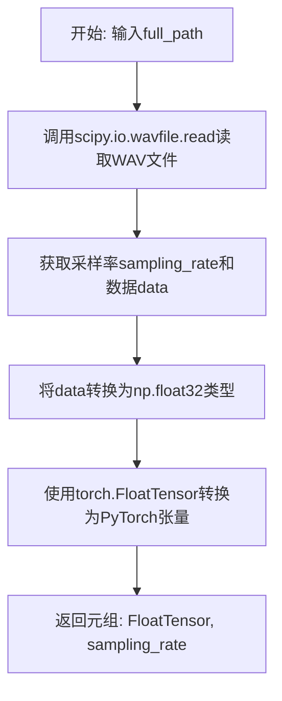

#### 带注释源码

```python
def load_wav_to_torch(full_path):
    """
    将WAV音频文件加载为PyTorch张量
    
    参数:
        full_path: str, WAV文件的完整路径
        
    返回:
        tuple: (torch.FloatTensor, int) - 音频数据张量和采样率
    """
    # 使用scipy读取WAV文件，返回采样率和原始音频数据
    # sampling_rate: 整数，表示音频的采样率（如22050, 44100等）
    # data: numpy数组，存储音频样本
    sampling_rate, data = read(full_path)
    
    # 将音频数据转换为numpy float32类型，然后转换为PyTorch FloatTensor
    # astype(np.float32)确保数据类型一致，避免精度问题
    # torch.FloatTensor接受numpy数组或Python列表并转换为张量
    return torch.FloatTensor(data.astype(np.float32)), sampling_rate
```


### `load_filepaths_and_text`

该函数用于从指定的文本文件中加载文件路径和对应的文本内容，按指定的分隔符对每行进行分割，返回包含文件路径和文本的二维列表。

参数：

- `filename`：`str`，要读取的文本文件路径
- `split`：`str`，用于分隔每行内容的分隔符，默认为 `"|"`

返回值：`List[List[str]]`，返回包含多个子列表的列表，每个子列表代表文件中的一行，内容为按分隔符分割后的字符串数组

#### 流程图

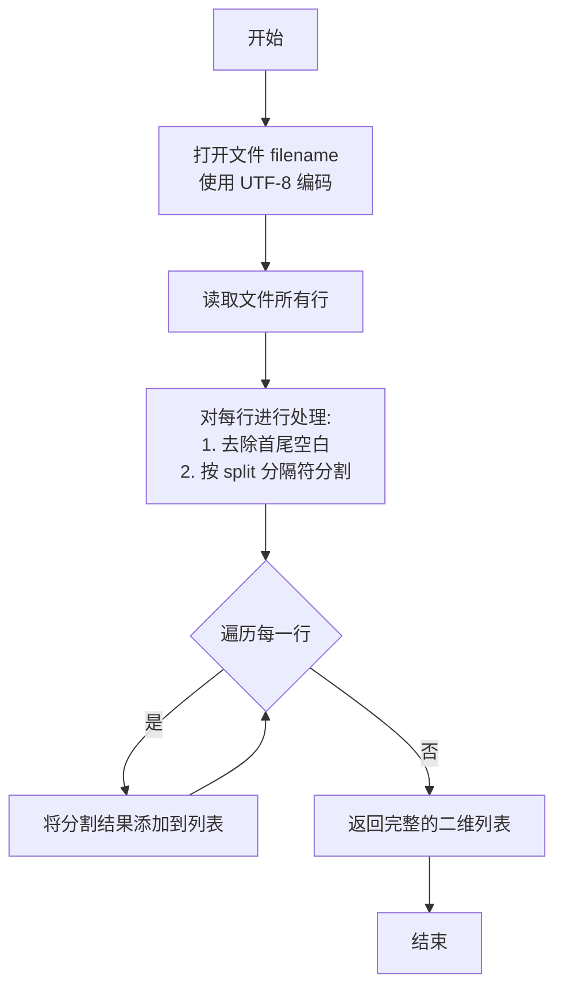

#### 带注释源码

```python
def load_filepaths_and_text(filename, split="|"):
    """
    从文本文件中加载文件路径和对应的文本内容
    
    参数:
        filename: str - 要读取的文本文件路径，文件每行包含文件路径和文本，使用分隔符连接
        split: str - 分隔符，用于分割每行的内容，默认为 "|"
    
    返回:
        List[List[str]] - 返回包含多个子列表的二维列表，每个子列表对应文件中的一行，
                         内容为按分隔符分割后的字符串数组
    """
    # 使用 UTF-8 编码打开文件，确保中文字符正确读取
    with open(filename, encoding="utf-8") as f:
        # 读取所有行，对每行进行处理：
        # 1. strip() - 去除每行首尾的空白字符（包括换行符空格等）
        # 2. split(split) - 按指定分隔符分割每行内容为字符串列表
        filepaths_and_text = [line.strip().split(split) for line in f]
    
    # 返回包含文件路径和文本的二维列表
    return filepaths_and_text
```


### `get_hparams`

该函数是超参数加载的核心入口，通过命令行参数指定配置文件和模型名称，初始化模型目录并加载/保存JSON配置，最终返回包含所有训练与模型配置信息的HParams对象。

参数：

- `init`：`bool`，默认为`True`。当为`True`时，从默认配置文件路径读取并复制到模型目录；当为`False`时，直接从模型目录读取已保存的配置文件。

返回值：`HParams`，返回包含模型配置信息的超参数对象，该对象支持字典式访问，并包含`model_dir`属性指向模型日志目录。

#### 流程图

```mermaid
flowchart TD
    A[开始 get_hparams] --> B[创建 ArgumentParser]
    B --> C[添加 -c/--config 参数]
    C --> D[添加 -m/--model 参数]
    D --> E[解析命令行参数 args]
    E --> F[构建模型目录路径: ./logs/{args.model}]
    F --> G{模型目录是否存在?}
    G -->|否| H[创建模型目录]
    G -->|是| I[继续]
    H --> I
    I --> J{init == True?}
    J -->|是| K[打开原始配置文件 config_path]
    K --> L[读取配置数据]
    L --> M[写入模型目录的 config_save_path]
    M --> N[关闭文件]
    J -->|否| O[打开模型目录的配置文件]
    O --> P[读取配置数据]
    P --> N
    N --> Q[解析 JSON 数据为 Python 字典]
    Q --> R[使用配置字典创建 HParams 对象]
    R --> S[设置 hparams.model_dir = model_dir]
    S --> T[返回 hparams 对象]
```

#### 带注释源码

```
def get_hparams(init=True):
    """
    加载超参数配置。
    
    参数:
        init (bool): 如果为True，则从默认配置文件复制到模型目录；
                    如果为False，则直接读取模型目录中已保存的配置。
    
    返回:
        HParams: 包含所有配置信息的超参数对象
    """
    
    # 创建命令行参数解析器，用于接收配置文件路径和模型名称
    parser = argparse.ArgumentParser()
    
    # 添加配置文件路径参数，支持 -c 或 --config 选项
    parser.add_argument(
        "-c",
        "--config",
        type=str,
        default="./configs/base.json",
        help="JSON file for configuration",
    )
    
    # 添加模型名称参数，支持 -m 或 --model 选项（必填）
    parser.add_argument("-m", "--model", type=str, required=True, help="Model name")

    # 解析命令行传入的参数
    args = parser.parse_args()
    
    # 根据模型名称构建日志/模型目录路径
    model_dir = os.path.join("./logs", args.model)

    # 如果模型目录不存在，则创建该目录
    if not os.path.exists(model_dir):
        os.makedirs(model_dir)

    # 获取配置文件的原始路径
    config_path = args.config
    # 构建模型目录中配置文件的保存路径
    config_save_path = os.path.join(model_dir, "config.json")
    
    # 根据init参数决定如何加载配置
    if init:
        # 模式1（初始化）: 从默认配置文件读取并复制到模型目录
        with open(config_path, "r", encoding="utf-8") as f:
            data = f.read()  # 读取原始配置内容
        with open(config_save_path, "w", encoding="utf-8") as f:
            f.write(data)  # 将配置写入模型目录
    else:
        # 模式2（恢复）: 直接从模型目录读取已保存的配置
        # 注意: 这里有一个潜在的拼写错误 'vencoding' 应该是 'encoding'
        with open(config_save_path, "r", vencoding="utf-8") as f:
            data = f.read()
    
    # 将JSON字符串解析为Python字典
    config = json.loads(data)
    
    # 使用配置字典初始化HParams对象
    hparams = HParams(**config)
    
    # 将模型目录路径添加到hparams对象中
    hparams.model_dir = model_dir
    
    # 返回完整的超参数对象
    return hparams
```


### `clean_checkpoints`

该函数用于清理模型检查点目录中的旧检查点文件，通过删除多余的检查点来释放磁盘空间，同时保留最近的几个检查点。

#### 参数

- `path_to_models`：`str`，模型目录的路径，默认为 `"logs/44k/"`
- `n_ckpts_to_keep`：`int`，要保留的检查点数量（不包括 G_0.pth、D_0.pth 等基础文件），默认为 `2`
- `sort_by_time`：`bool`，True 表示按修改时间排序删除旧文件，False 表示按文件名字典序删除，默认为 `True`

#### 流程图

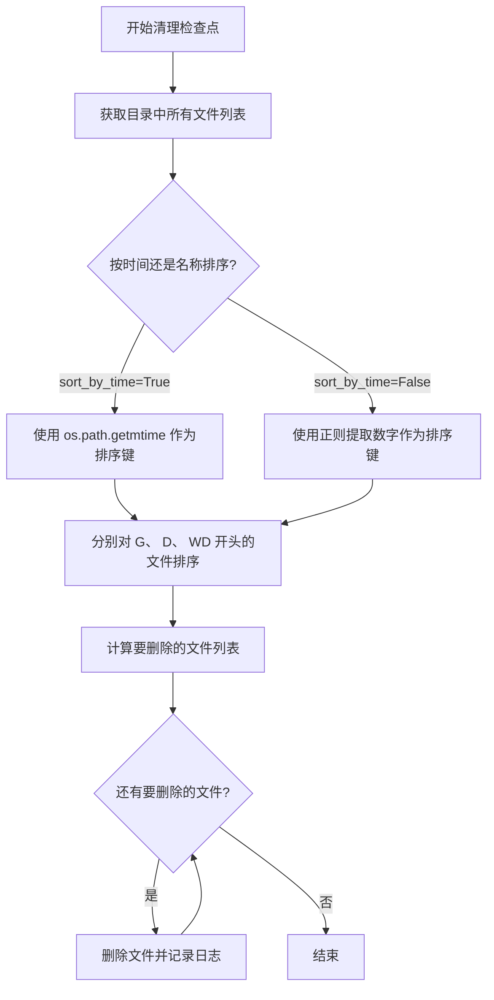

#### 带注释源码

```python
def clean_checkpoints(path_to_models="logs/44k/", n_ckpts_to_keep=2, sort_by_time=True):
    """Freeing up space by deleting saved ckpts

    Arguments:
    path_to_models    --  Path to the model directory
    n_ckpts_to_keep   --  Number of ckpts to keep, excluding G_0.pth and D_0.pth
    sort_by_time      --  True -> chronologically delete ckpts
                          False -> lexicographically delete ckpts
    """
    import re

    # 获取目录中所有文件（只保留文件，不包括目录）
    ckpts_files = [
        f
        for f in os.listdir(path_to_models)
        if os.path.isfile(os.path.join(path_to_models, f))
    ]

    # 定义名称排序键：从文件名中提取数字部分用于排序
    # 例如 G_1000.pth -> 1000
    def name_key(_f):
        return int(re.compile("._(\\d+)\\.pth").match(_f).group(1))

    # 定义时间排序键：获取文件的修改时间
    def time_key(_f):
        return os.path.getmtime(os.path.join(path_to_models, _f))

    # 根据参数选择排序方式
    sort_key = time_key if sort_by_time else name_key

    # 辅助函数：对指定前缀的文件进行排序（排除 _0.pth 基础文件）
    def x_sorted(_x):
        return sorted(
            [f for f in ckpts_files if f.startswith(_x) and not f.endswith("_0.pth")],
            key=sort_key,
        )

    # 收集所有需要删除的文件路径
    # 对 G、 D、 WD 三种类型的检查点分别处理
    # 保留最新的 n_ckpts_to_keep 个，删除其余的
    to_del = [
        os.path.join(path_to_models, fn)
        for fn in (
            x_sorted("G")[:-n_ckpts_to_keep]
            + x_sorted("D")[:-n_ckpts_to_keep]
            + x_sorted("WD")[:-n_ckpts_to_keep]
        )
    ]

    # 定义日志记录函数：输出被删除的文件信息
    def del_info(fn):
        return logger.info(f".. Free up space by deleting ckpt {fn}")

    # 定义删除 routine：删除文件并记录日志
    def del_routine(x):
        return [os.remove(x), del_info(x)]

    # 执行删除操作（使用列表推导式但忽略返回值）
    [del_routine(fn) for fn in to_del]
```

---

#### 关键组件信息

- **正则表达式** `re.compile("._(\\d+)\\.pth")`：用于从检查点文件名中提取数字编号
- **排序策略**：支持按修改时间或文件名数字顺序排序
- **保留规则**：始终保留以 `_0.pth` 结尾的基础检查点文件

#### 潜在技术债务与优化空间

1. **异常处理缺失**：函数未处理文件删除失败、目录不存在等情况，可能导致程序崩溃
2. **使用列表推导式执行副作用**：代码 `[del_routine(fn) for fn in to_del]` 使用列表推导式执行删除操作，不符合 Python 最佳实践，应使用普通循环
3. **硬编码检查点类型**：目前只支持 G、D、WD 三种类型的检查点，扩展性较差
4. **正则表达式重复编译**：虽然影响较小，但可以在函数外预编译正则表达式
5. **日志冗余**：每次删除文件都会记录日志，高频调用时可能影响性能


### `get_hparams_from_dir`

该函数从指定模型目录中读取配置文件（config.json），解析其中的JSON超参数数据，创建HParams对象并返回，提供了从磁盘加载模型配置的能力。

参数：

- `model_dir`：`str`，模型目录的路径，用于定位配置文件所在目录

返回值：`HParams`，从配置文件中加载超参数后创建的HParams对象，包含模型配置信息及model_dir属性

#### 流程图

```mermaid
flowchart TD
    A[开始] --> B[构造配置文件路径: model_dir + config.json]
    B --> C[打开并读取配置文件]
    C --> D[解析JSON数据为Python字典]
    E[创建HParams对象: HParams(**config)]
    D --> E
    E --> F[设置hparams.model_dir = model_dir]
    F --> G[返回hparams对象]
    G --> H[结束]
```

#### 带注释源码

```python
def get_hparams_from_dir(model_dir):
    """
    从模型目录中加载超参数配置
    
    参数:
        model_dir: 模型目录路径，用于定位config.json配置文件
    
    返回:
        HParams对象，包含从配置文件加载的超参数
    """
    # 构造配置文件的完整路径：模型目录/config.json
    config_save_path = os.path.join(model_dir, "config.json")
    
    # 以UTF-8编码打开并读取配置文件内容
    with open(config_save_path, "r", encoding="utf-8") as f:
        data = f.read()
    
    # 将JSON字符串解析为Python字典
    config = json.loads(data)
    
    # 使用配置字典初始化HParams对象
    hparams = HParams(**config)
    
    # 将模型目录路径保存到hparams对象中
    hparams.model_dir = model_dir
    
    # 返回包含超参数配置的对象
    return hparams
```


### `get_hparams_from_file`

该函数用于从指定的 JSON 配置文件中读取超参数配置，将其解析为 Python 对象并返回 HParams 实例，以便后续模型训练或推理使用。

参数：

- `config_path`：`str`，配置文件路径，指向包含超参数的 JSON 文件

返回值：`HParams`，返回从 JSON 配置文件中加载的超参数对象

#### 流程图

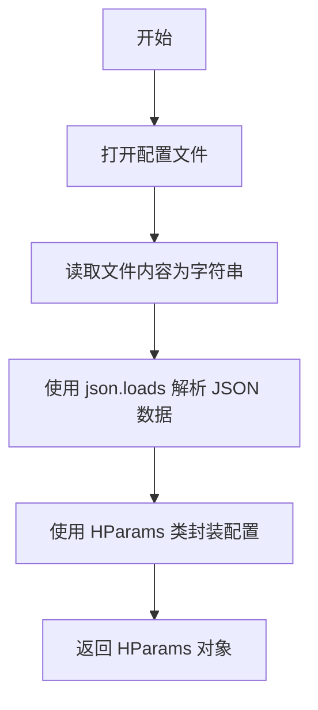

#### 带注释源码

```python
def get_hparams_from_file(config_path):
    # 打开指定路径的配置文件，使用 UTF-8 编码读取
    with open(config_path, "r", encoding="utf-8") as f:
        # 读取整个文件内容为字符串
        data = f.read()
    
    # 将 JSON 字符串解析为 Python 字典
    config = json.loads(data)
    
    # 使用 HParams 类封装配置字典为对象，支持字典嵌套
    hparams = HParams(**config)
    
    # 返回包含超参数的 HParams 对象
    return hparams
```

#### 关键组件信息

| 名称 | 描述 |
|------|------|
| `HParams` | 超参数配置类，用于将字典格式的配置转换为可访问的对象格式 |
| `json` | Python 标准库模块，用于解析 JSON 格式的配置文件 |

#### 潜在的技术债务或优化空间

1. **缺少文件存在性检查**：未验证 `config_path` 是否存在，可能导致 `FileNotFoundError`
2. **缺少异常处理**：未捕获 JSON 解析错误、文件读取错误等异常情况
3. **缺乏日志记录**：没有输出任何日志信息，难以追踪配置加载过程
4. **不支持默认值**：当配置文件缺失时没有回退机制

#### 其它项目

- **错误处理与异常设计**：当前未实现任何错误处理机制，建议添加文件存在性检查和 JSON 解析异常捕获
- **外部依赖与接口契约**：依赖 `HParams` 类的实现，调用方需确保传入有效的 JSON 文件路径
- **数据流**：配置文件（JSON）→ 字符串 → 字典 → HParams 对象


### `check_git_hash`

该函数用于检查并验证模型目录中的 Git 提交哈希值是否与当前代码库的哈希值一致，如果不一致则记录警告信息，若不存在哈希文件则创建并保存当前哈希值。

参数：

- `model_dir`：`str`，模型目录的路径，用于存放 git hash 文件

返回值：`None`，该函数不返回任何值

#### 流程图

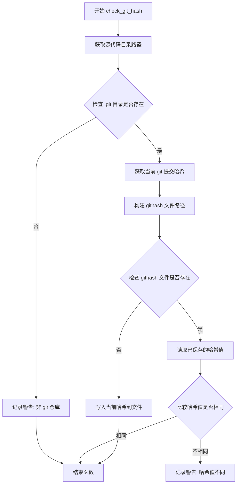

#### 带注释源码

```python
def check_git_hash(model_dir):
    """
    检查模型目录中的 git 哈希值是否与当前代码库的哈希值一致
    
    Args:
        model_dir: 模型目录路径，用于存放 git hash 文件
    """
    # 获取当前脚本所在的源代码目录路径
    source_dir = os.path.dirname(os.path.realpath(__file__))
    
    # 检查源代码目录是否为 git 仓库（即是否存在 .git 目录）
    if not os.path.exists(os.path.join(source_dir, ".git")):
        logger.warn(
            "{} is not a git repository, therefore hash value comparison will be ignored.".format(
                source_dir
            )
        )
        return

    # 使用 git 命令获取当前提交的完整哈希值
    cur_hash = subprocess.getoutput("git rev-parse HEAD")

    # 构建模型目录下的 githash 文件路径
    path = os.path.join(model_dir, "githash")
    
    # 检查 githash 文件是否已存在
    if os.path.exists(path):
        # 读取已保存的哈希值
        saved_hash = open(path).read()
        # 比较保存的哈希与当前哈希是否不同
        if saved_hash != cur_hash:
            logger.warn(
                "git hash values are different. {}(saved) != {}(current)".format(
                    saved_hash[:8], cur_hash[:8]
                )
            )
    else:
        # 如果文件不存在，则创建并写入当前哈希值
        open(path, "w").write(cur_hash)
```


### `get_logger`

该函数用于创建一个配置完整的日志记录器，支持将日志输出到指定目录下的文件中，并返回该logger对象供调用者使用。

参数：

- `model_dir`：`str`，模型日志存储的目录路径
- `filename`：`str`，日志文件名，默认为"train.log"

返回值：`logging.Logger`，返回配置好的日志记录器实例

#### 流程图

```mermaid
flowchart TD
    A[开始] --> B[获取全局logger变量]
    B --> C[使用os.path.basename(model_dir)创建logger]
    C --> D[设置logger级别为DEBUG]
    D --> E[创建日志格式化器]
    E --> F{检查model_dir是否存在}
    F -->|否| G[创建model_dir目录]
    G --> H
    F -->|是| H[创建FileHandler]
    H --> I[设置Handler级别为DEBUG]
    I --> J[为Handler设置格式化器]
    J --> K[将Handler添加到logger]
    K --> L[返回logger对象]
```

#### 带注释源码

```python
def get_logger(model_dir, filename="train.log"):
    """
    创建一个配置完整的日志记录器
    
    参数:
        model_dir: str, 日志文件存储的目录路径
        filename: str, 日志文件名, 默认为"train.log"
    
    返回:
        logging.Logger: 配置好的日志记录器实例
    """
    global logger  # 引用全局logger变量
    # 使用model_dir的基础路径名作为logger名称，便于识别日志来源
    logger = logging.getLogger(os.path.basename(model_dir))
    # 设置日志级别为DEBUG，支持详细调试信息
    logger.setLevel(logging.DEBUG)

    # 创建格式化器，定义日志输出格式：时间\t日志名\t级别\t消息
    formatter = logging.Formatter("%(asctime)s\t%(name)s\t%(levelname)s\t%(message)s")
    
    # 确保日志目录存在，不存在则创建
    if not os.path.exists(model_dir):
        os.makedirs(model_dir)
    
    # 创建文件处理器，将日志写入指定目录下的文件
    h = logging.FileHandler(os.path.join(model_dir, filename))
    h.setLevel(logging.DEBUG)  # 设置处理器日志级别
    h.setFormatter(formatter)  # 应用格式化器
    logger.addHandler(h)  # 将处理器添加到logger
    
    return logger  # 返回配置好的logger实例
```


### `load_model`

该函数用于加载预训练的语音合成模型，通过读取配置文件创建模型架构，并从检查点文件加载训练好的权重，返回一个已设置为评估模式的 SynthesizerTrn 模型实例。

参数：

- `model_path`：`str`，模型检查点文件（.pth）的路径，用于加载训练好的权重
- `config_path`：`str`，JSON 格式的配置文件路径，包含模型和数据的相关超参数

返回值：`SynthesizerTrn`，加载了检查点权重并设置为评估模式（eval）的 PyTorch 模型对象

#### 流程图

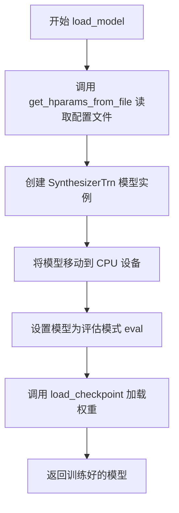

#### 带注释源码

```python
def load_model(model_path, config_path):
    """
    加载预训练的语音合成模型
    
    Args:
        model_path: 模型检查点文件路径
        config_path: 配置文件路径
    
    Returns:
        net: 加载了权重并设置为评估模式的模型
    """
    # 步骤1: 从配置文件加载超参数
    hps = get_hparams_from_file(config_path)
    
    # 步骤2: 创建 SynthesizerTrn 模型实例
    # 参数说明:
    #   108: 声学特征维度 (filter_length // 2 + 1)
    #   hps.data.filter_length // 2 + 1: 频谱维度
    #   hps.train.segment_size // hps.data.hop_length: 时间步长
    #   n_speakers: 说话人数量
    #   **hps.model: 展开模型配置字典
    net = SynthesizerTrn(
        # len(symbols),
        108,
        hps.data.filter_length // 2 + 1,
        hps.train.segment_size // hps.data.hop_length,
        n_speakers=hps.data.n_speakers,
        **hps.model,
    ).to("cpu")  # 将模型放置在 CPU 上
    
    # 步骤3: 设置为评估模式，禁用 dropout 等训练特定层
    _ = net.eval()
    
    # 步骤4: 加载预训练检查点权重
    # 参数: checkpoint路径, 模型对象, 优化器(这里为None), 跳过优化器加载
    _ = load_checkpoint(model_path, net, None, skip_optimizer=True)
    
    # 步骤5: 返回加载好的模型
    return net
```


### `mix_model`

该函数用于将两个神经网络模型的权重进行混合，可根据voice_ratio（声音比例）和tone_ratio（音色比例）将两个模型的参数按加权方式融合，并保存为新的checkpoint文件。

参数：

- `network1`：`torch.nn.Module`，第一个神经网络模型（主模型）
- `network2`：`torch.nn.Module`，第二个神经网络模型（用于混合的模型）
- `output_path`：`str`，混合后模型的保存路径
- `voice_ratio`：`tuple`，声音比例，默认为(0.5, 0.5)，用于非enc_p层的混合权重
- `tone_ratio`：`tuple`，音色比例，默认为(0.5, 0.5)，用于enc_p层的混合权重

返回值：`None`，该函数无返回值，直接将混合后的模型保存到output_path

#### 流程图

```mermaid
flowchart TD
    A[开始 mix_model] --> B{network1是否有module属性}
    B -->|是| C[获取network1.module和network2.module的状态字典]
    B -->|否| D[获取network1和network2自身的状态字典]
    C --> E[遍历state_dict1的所有键]
    D --> E
    E --> F{键k是否在state_dict2中}
    F -->|否| G[跳过该键, 继续下一键]
    F -->|是| H{键k包含'enc_p'}
    H -->|是| I[使用tone_ratio混合参数]
    H -->|否| J[使用voice_ratio混合参数]
    I --> K[更新state_dict1[k]]
    J --> K
    G --> L{是否还有未处理的键}
    L -->|是| E
    L -->|否| M[遍历state_dict2中不在state_dict1的键]
    M --> N[将state_dict2的键复制到state_dict1]
    N --> O[保存混合后的状态字典到output_path]
    O --> P[结束]
```

#### 带注释源码

```python
def mix_model(
    network1, network2, output_path, voice_ratio=(0.5, 0.5), tone_ratio=(0.5, 0.5)
):
    """
    混合两个神经网络模型的权重
    
    参数:
        network1: 第一个神经网络模型（主模型）
        network2: 第二个神经网络模型（用于混合的模型）
        output_path: 混合后模型的保存路径
        voice_ratio: 声音比例，用于非enc_p层的混合权重
        tone_ratio: 音色比例，用于enc_p层的混合权重
    """
    # 判断是否使用DataParallel/DistributedDataParallel包装的模型
    if hasattr(network1, "module"):
        # 如果模型被DataParallel包装，需要从module获取state_dict
        state_dict1 = network1.module.state_dict()
        state_dict2 = network2.module.state_dict()
    else:
        # 普通模型直接获取state_dict
        state_dict1 = network1.state_dict()
        state_dict2 = network2.state_dict()
    
    # 遍历第一个模型的参数
    for k in state_dict1.keys():
        # 跳过不存在的参数键
        if k not in state_dict2.keys():
            continue
        
        # 判断是否为音色相关参数(enc_p开头的层)
        if "enc_p" in k:
            # 使用tone_ratio混合音色参数
            # tone_ratio[0]权重给network1, tone_ratio[1]权重给network2
            state_dict1[k] = (
                state_dict1[k].clone() * tone_ratio[0]
                + state_dict2[k].clone() * tone_ratio[1]
            )
        else:
            # 使用voice_ratio混合其他参数
            # voice_ratio[0]权重给network1, voice_ratio[1]权重给network2
            state_dict1[k] = (
                state_dict1[k].clone() * voice_ratio[0]
                + state_dict2[k].clone() * voice_ratio[1]
            )
    
    # 将network2独有的参数添加到混合后的模型中
    for k in state_dict2.keys():
        if k not in state_dict1.keys():
            # 复制network2独有的参数到state_dict1
            state_dict1[k] = state_dict2[k].clone()
    
    # 保存混合后的模型检查点
    torch.save(
        {
            "model": state_dict1,
            "iteration": 0,
            "optimizer": None,
            "learning_rate": 0
        },
        output_path,
    )
```


### `get_steps`

该函数用于从模型文件路径中提取数字序列，通常用于获取模型的训练步数或版本号。

参数：

- `model_path`：`str`，模型文件的路径，用于从中提取数字信息

返回值：`str | None`，返回路径中的最后一个数字序列（通常是训练步数），如果路径中没有数字则返回 `None`

#### 流程图

```mermaid
flowchart TD
    A[开始] --> B[接收 model_path 参数]
    B --> C{使用正则表达式 \d+ 匹配路径中的数字}
    C --> D{存在匹配结果?}
    D -->|是| E[返回最后一个数字 matches[-1]]
    D -->|否| F[返回 None]
    E --> G[结束]
    F --> G
```

#### 带注释源码

```python
def get_steps(model_path):
    """
    从模型文件路径中提取数字序列
    
    参数:
        model_path: 模型文件的路径字符串
        
    返回:
        路径中的最后一个数字序列，如果不存在数字则返回None
    """
    # 使用正则表达式查找路径中所有的连续数字序列
    matches = re.findall(r"\d+", model_path)
    # 如果存在匹配，返回最后一个数字（通常表示训练步数或版本号）
    # 否则返回None
    return matches[-1] if matches else None
```

---

#### 补充说明

**设计目标**：该函数的主要设计目标是从模型检查点路径中快速提取训练迭代次数。例如，路径 `logs/44k/G_1000.pth` 中的 `1000` 表示第1000次迭代。

**潜在优化空间**：

1. **正则表达式预编译**：如果该函数在高频循环中调用，可以考虑预编译正则表达式 `r"\d+"` 以提升性能
2. **边界情况处理**：当前实现假设路径格式正确，未对空字符串或特殊路径进行额外校验
3. **类型提示**：建议添加类型提示以提升代码可读性和IDE支持，例如 `def get_steps(model_path: str) -> str | None:`


### `HParams.__init__`

该方法是 HParams 类的构造函数，用于将传入的字典参数递归地转换为 HParams 对象的属性，支持嵌套字典结构。

参数：

- `self`：`HParams`，隐式的实例对象，代表当前 HParams 类的实例
- `**kwargs`：`任意类型`（字典），关键字参数集合，用于传递配置参数

返回值：`None`，该方法不返回任何值

#### 流程图

```mermaid
flowchart TD
    A[开始 __init__] --> B{遍历 kwargs.items()}
    B --> C{检查 v 是否为 dict 类型}
    C -->|是| D[递归创建 HParams(**v)]
    C -->|否| E[直接使用 v]
    D --> F[设置 self[k] = v]
    E --> F
    F --> G{继续遍历}
    G -->|是| B
    G -->|否| H[结束]
```

#### 带注释源码

```python
def __init__(self, **kwargs):
    """
    初始化 HParams 对象，将 kwargs 中的键值对设置为对象的属性
    
    参数:
        **kwargs: 关键字参数，允许传入任意数量的键值对
                  支持嵌套字典，将递归创建 HParams 对象
    """
    # 遍历所有传入的关键字参数
    for k, v in kwargs.items():
        # 检查当前值是否为字典类型
        if type(v) == dict:
            # 如果是字典，递归创建 HParams 对象
            # 支持配置参数的嵌套结构（如 {"data": {"sample_rate": 22050}}）
            v = HParams(**v)
        # 将键值对设置为对象的属性
        # 使用 self[k] = v 会调用 __setitem__ 方法
        self[k] = v
```


### `HParams.keys`

该方法返回 HParams 对象内部字典的所有键（属性名）的视图，允许对超参数进行迭代和成员资格测试。

参数： 无

返回值：`dict_keys`，返回 HParams 实例中存储的超参数字典的键视图，提供对字典键的动态视图，支持迭代和成员测试。

#### 流程图

```mermaid
flowchart TD
    A[调用 HParams.keys 方法] --> B{检查 self.__dict__}
    B --> C[返回 self.__dict__.keys()]
    C --> D[返回 dict_keys 视图对象]
    
    style A fill:#e1f5fe
    style C fill:#c8e6c9
    style D fill:#fff9c4
```

#### 带注释源码

```python
def keys(self):
    """
    返回 HParams 对象内部字典的所有键（属性名）的视图。
    
    该方法允许用户获取存储在 HParams 实例中的所有超参数名称，
    支持迭代和成员资格测试（in 操作符）。
    
    Returns:
        dict_keys: 包含所有超参数键的字典键视图对象
    """
    # 返回内部 __dict__ 字典的键视图
    # __dict__ 在 HParams.__init__ 中被填充，包含所有通过 kwargs 传入的参数
    # 以及通过 __setitem__ 方法动态添加的属性
    return self.__dict__.keys()
```


### `HParams.items`

该方法是HParams类的实例方法，用于返回HParams对象中所有键值对的字典视图（dict_items），允许外部遍历或访问该超参数对象内部存储的所有配置项。

参数： 无

返回值：`dict_items`，返回HParams对象内部字典（`self.__dict__`）的键值对视图（items view），可用于遍历或转换为其他数据结构。

#### 流程图

```mermaid
flowchart TD
    A[开始: 调用items方法] --> B{检查self.__dict__是否存在}
    B -->|是| C[调用self.__dict__.items方法]
    C --> D[返回dict_items对象]
    D --> E[结束]
    
    B -->|否| F[返回空dict_items]
    F --> E
```

#### 带注释源码

```python
def items(self):
    """返回HParams对象中所有键值对的字典视图
    
    该方法继承自Python字典协议的items()方法,
    返回self.__dict__.items(),即对象内部存储的
    所有键值对的视图(view),而非副本。
    
    Returns:
        dict_items: 包含HParams对象所有键值对的字典视图对象
    """
    return self.__dict__.items()
```


### `HParams.values`

该方法用于获取 HParams 对象内部字典的所有值，返回一个 dict_values 对象，允许外部遍历或访问 HParams 实例中存储的所有配置参数值。

参数：

- 无（仅包含隐式参数 `self`）

返回值：`dict_values`，返回 HParams 对象内部 `__dict__` 字典的所有值，可用于遍历或转换为列表等操作。

#### 流程图

```mermaid
flowchart TD
    A[开始] --> B{self.__dict__是否存在}
    B -->|是| C[返回 self.__dict__.values]
    B -->|否| D[返回空dict_values或抛出异常]
    C --> E[结束]
    D --> E
```

#### 带注释源码

```python
def values(self):
    """
    返回 HParams 对象内部字典的所有值
    
    该方法作为字典接口的代理方法，允许用户以类似字典的方式
    访问 HParams 对象中存储的配置参数值。
    
    Returns:
        dict_values: 包含 HParams 所有属性值的字典视图对象
    """
    return self.__dict__.values()
```


### `HParams.__len__`

该方法返回 HParams 对象中存储的属性数量，通过获取内部 `__dict__` 字典的长度来实现。

参数：

- `self`：`HParams` 实例本身，隐式参数，表示当前 HParams 对象

返回值：`int`，返回 HParams 对象中存储的属性数量

#### 流程图

```mermaid
flowchart TD
    A[开始 __len__] --> B{self.__dict__}
    B --> C[计算 __dict__ 长度]
    C --> D[返回长度值]
```

#### 带注释源码

```python
def __len__(self):
    """
    返回 HParams 对象中存储的属性数量
    
    该方法通过获取对象内部 __dict__ 字典的长度来计算
    当前 HParams 实例中包含的所有键值对数量
    
    Returns:
        int: 对象中存储的属性数量
    """
    return len(self.__dict__)
```


### `HParams.__getitem__`

该方法是 `HParams` 类的魔术方法（dunder method），通过委托给 `getattr` 函数实现字典风格的键访问，允许用户使用 `hparams[key]` 的形式获取配置参数的值。

参数：

- `key`：`str`，要获取的配置参数的键名

返回值：`Any`，返回对应键名的属性值，如果键不存在则抛出 `AttributeError` 异常

#### 流程图

```mermaid
flowchart TD
    A[调用 hparams[key]] --> B{调用 __getitem__ 方法}
    B --> C[获取 self 和 key]
    C --> D[执行 getattr self, key]
    D --> E{键是否存在?}
    E -->|是| F[返回属性值]
    E -->|否| G[抛出 AttributeError]
```

#### 带注释源码

```python
def __getitem__(self, key):
    """
    魔术方法，实现字典风格访问
    
    参数:
        key: str, 要获取的属性名称
        
    返回:
        任意类型, 返回对应键名的属性值
        
    异常:
        AttributeError: 当键不存在时抛出
    """
    return getattr(self, key)  # 使用 getattr 获取对象的属性值
```

---

#### 补充信息

**所属类完整信息：**

`HParams` 类是一个配置参数管理类，核心设计用于将嵌套的字典配置转换为可递归访问的对象。该类位于代码文件的工具函数区域，属于模型训练配置管理模块的一部分。

**类的字段和方法概览：**

| 名称 | 类型 | 描述 |
|------|------|------|
| `__init__` | 方法 | 初始化方法，将 kwargs 转换为对象属性，递归处理嵌套字典 |
| `keys` | 方法 | 返回所有键的列表 |
| `items` | 方法 | 返回键值对元组的列表 |
| `values` | 方法 | 返回所有值的列表 |
| `__len__` | 方法 | 返回配置参数的数量 |
| `__getitem__` | 方法 | 实现字典风格访问（`hparams[key]`） |
| `__setitem__` | 方法 | 实现字典风格赋值（`hparams[key] = value`） |
| `__contains__` | 方法 | 实现成员检查（`key in hparams`） |
| `__repr__` | 方法 | 返回对象的字符串表示 |

**技术债务与优化空间：**

1. **缺少默认值处理**：当前实现会在键不存在时抛出 `AttributeError`，可以考虑像字典的 `get` 方法一样支持默认值参数
2. **类型注解缺失**：方法参数和返回值都缺少类型注解，不利于静态分析和代码可读性
3. **错误信息不够友好**：当键不存在时，抛出的 `AttributeError` 信息较为简洁，可考虑提供更详细的错误上下文
4. **递归深度问题**：虽然 `__init__` 中对嵌套字典进行了递归转换，但未设置递归深度限制，极深的嵌套可能导致栈溢出

**设计目标与约束：**

- 目标：提供一种便捷的方式来访问嵌套配置参数，兼顾字典的灵活性和面向对象的访问方式
- 约束：依赖 Python 的内置 `getattr` 函数实现，必须确保键名是有效的 Python 标识符

**外部依赖与接口契约：**

- 该方法无外部依赖，仅使用 Python 内置函数
- 接口契约：调用方传入有效的属性键名，返回对应的属性值；传入不存在的键名将抛出 `AttributeError`


### `HParams.__setitem__`

该方法是一个特殊方法（魔术方法），用于支持像字典一样的属性赋值操作，允许通过 `hparams[key] = value` 的语法将键值对设置为对象的属性。

参数：

-  `key`：`str`，要设置的属性名称
-  `value`：`any`，要设置的属性值，可以是任意类型

返回值：`None`，`setattr` 方法的返回值为 `None`

#### 流程图

```mermaid
flowchart TD
    A[调用 hparams[key] = value] --> B{检查key是否存在}
    B -->|否| C[使用setattr设置属性]
    B -->|是| C
    C --> D[返回None]
```

#### 带注释源码

```python
def __setitem__(self, key, value):
    """
    支持字典-style的属性赋值操作
    
    参数:
        key: 属性名称（通常为字符串类型）
        value: 要赋值的值（可以是任意类型）
    
    返回:
        None: setattr的返回值
    """
    return setattr(self, key, value)
```


### `HParams.__contains__`

该方法用于检查 HParams 对象中是否包含指定的键，类似于字典的 `in` 操作符行为。

参数：

- `key`：`str`，要检查的键名

返回值：`bool`，如果 HParams 对象的 `__dict__` 中存在该键则返回 `True`，否则返回 `False`

#### 流程图

```mermaid
flowchart TD
    A[开始 __contains__] --> B{key in self.__dict__}
    B -->|True| C[返回 True]
    B -->|False| D[返回 False]
    C --> E[结束]
    D --> E
```

#### 带注释源码

```python
def __contains__(self, key):
    """
    检查 HParams 对象中是否包含指定的键
    
    参数:
        key: 要检查的键名
        
    返回:
        bool: 如果键存在于 __dict__ 中返回 True，否则返回 False
    """
    return key in self.__dict__
```


### `HParams.__repr__`

该方法是 `HParams` 类的魔术方法，用于返回对象的官方字符串表示形式。实现上调用了 Python 对象内部字典 `__dict__` 的 `__repr__` 方法，从而展示 HParams 对象当前存储的所有配置参数。

参数：

- `self`：`HParams` 实例，隐式参数，代表当前 HParams 对象

返回值：`str`，返回包含对象所有属性和值的字典表示字符串

#### 流程图

```mermaid
flowchart TD
    A[开始 __repr__] --> B{执行 self.__dict__.__repr__()}
    B --> C[返回字典的字符串表示]
    C --> D[结束]
```

#### 带注释源码

```
def __repr__(self):
    """
    返回 HParams 对象的官方字符串表示
    
    该方法返回对象内部 __dict__ 属性（即存储所有键值对的字典）
    的字符串表示形式，便于调试和查看当前配置内容。
    
    Returns:
        str: 包含所有配置参数的字典字符串
    """
    return self.__dict__.__repr__()
```

## 关键组件


### 模型下载模块

提供从HuggingFace Hub或OpenI镜像下载情感模型和检查点文件的功能，支持不同的镜像源配置和本地目录管理。

### 检查点管理系统

负责加载、 保存和清理模型检查点，包含从磁盘恢复模型状态、保存训练中间结果、自动删除旧检查点以释放磁盘空间等功能。

### 训练监控与可视化模块

用于记录和可视化训练过程中的各类指标，包括标量统计、直方图分布、图像数据和音频样本，支持将Matplotlib图表转换为NumPy数组格式。

### 音频数据处理模块

提供加载音频文件和解析数据路径的工具函数，支持将WAV文件转换为PyTorch张量，并按指定分隔符读取文件路径与文本的对应关系。

### 超参数配置管理模块

实现统一的超参数配置管理，支持从JSON文件或保存的目录中加载配置，提供HParams类进行配置字典的封装和访问。

### 模型加载与混合模块

提供模型权重加载和混合功能，支持根据指定的声音比例和音色比例对两个模型的权重进行线性插值混合，生成新的模型文件。

### 日志与版本控制模块

提供训练日志记录和Git版本哈希检查功能，确保训练过程的可追溯性和模型与代码版本的一致性。


## 问题及建议


### 已知问题

-   `get_hparams`函数中存在拼写错误：使用`vencoding`参数读取JSON文件，应该为`encoding`
-   `load_checkpoint`函数存在逻辑缺陷：当`optimizer`为`None`且`skip_optimizer`为`False`时，代码尝试调用`optimizer.state_dict()`会导致`AttributeError`
-   `clean_checkpoints`函数使用列表推导式执行带有副作用的操作（删除文件），违反Python最佳实践，且正则表达式每次调用都重新编译
-   `check_git_hash`函数使用`subprocess.getoutput("git rev-parse HEAD")`存在潜在命令注入风险，应使用`subprocess.run`的安全参数
-   `MATPLOTLIB_FLAG`全局变量管理不当，多个函数中重复检查和初始化matplotlib
-   `HParams`类使用`__dict__`直接存储数据，可能与类内置方法冲突（如`keys()`, `items()`等）
-   文件操作存在资源泄漏：多处使用`open(path)`未使用`with`语句或未显式关闭文件句柄
-   `plot_spectrogram_to_numpy`和`plot_alignment_to_numpy`存在大量重复代码，可重构为通用函数
-   条件导入`import openi`在函数内部进行，若模块不存在会导致运行时错误而非导入时错误
-   `numpy.fromstring`已弃用，应使用`numpy.frombuffer`
-   `load_checkpoint`中异常处理使用裸`except:`捕获所有异常，不利于精准调试

### 优化建议

-   修复`get_hparams`中的`vencoding`为`encoding`，确保JSON文件正确读取
-   重构`load_checkpoint`中的优化器加载逻辑，明确处理`optimizer is None`的情况，避免运行时错误
-   将`clean_checkpoints`中的列表推导式改为普通for循环，并在函数外部预编译正则表达式以提高性能
-   使用`subprocess.run`替代`subprocess.getoutput`，并设置`shell=False`以消除安全风险
-   考虑使用类或单例模式管理matplotlib初始化，避免全局变量污染
-   为`HParams`类添加独立的存储字典，将配置数据与类方法隔离
-   所有文件操作使用`with`语句确保资源正确释放
-   抽取`plot_spectrogram_to_numpy`和`plot_alignment_to_numpy`的公共逻辑到通用绘图函数
-   将`import openi`移至文件顶部，或添加`try-except ImportError`处理并提供清晰的错误信息
-   替换`numpy.fromstring`为`numpy.frombuffer`以兼容新版本NumPy
-   细化异常处理，具体捕获特定异常类型而非使用裸`except:`
-   为关键函数添加类型注解和文档字符串，提高代码可维护性


## 其它


### 设计目标与约束

本代码库主要服务于BERT-VITS2语音合成模型的训练、推理和模型管理。具体设计目标包括：(1) 支持从HuggingFace Hub或OpenI镜像下载预训练模型和检查点；(2) 提供完整的检查点保存、加载和清理机制，支持训练恢复和模型演进追踪；(3) 实现模型权重的混合功能，支持多模型融合以实现声音克隆或风格迁移；(4) 提供训练过程中的可视化功能，包括频谱图、对齐矩阵、音频等；(5) 支持多说话人模型的配置管理。约束条件包括：默认使用CPU进行推理但训练需要GPU支持；模型文件较大需要合理的存储管理策略；部分功能依赖特定版本的PyTorch和深度学习框架。

### 错误处理与异常设计

代码中的错误处理主要采用以下策略：(1) **模型加载兼容性处理**：在load_checkpoint函数中，使用try-except捕获键不匹配和形状不一致的情况，对于旧版本模型缺少的层（如ja_bert_proj）自动初始化为零张量以保证向后兼容；(2) **文件存在性检查**：使用os.path.isfile和os.path.exists进行路径验证，在下载前检查本地是否已存在模型避免重复下载；(3) **Git仓库验证**：check_git_hash函数在模型目录不存在.git目录时发出警告但不中断执行；(4) **日志记录**：使用Python logging模块记录关键操作和错误信息，包括模型加载进度、参数不匹配警告等；(5) **参数校验**：get_hparams函数中使用argparse进行命令行参数验证，model和config为必需参数。

### 数据流与状态机

主要数据流包括三个核心流程：(1) **配置加载流程**：get_hparams → 解析命令行参数 → 读取JSON配置文件 → 创建HParams对象 → 返回包含model_dir的配置对象；(2) **模型加载流程**：load_checkpoint → 加载.pth文件 → 解析checkpoint_dict → 提取iteration/learning_rate/optimizer/state_dict → 处理模型权重兼容性 → 返回更新后的model/optimizer/learning_rate/iteration；(3) **检查点管理流程**：save_checkpoint → 获取模型state_dict → 组装checkpoint字典 → 使用torch.save持久化；clean_checkpoints → 扫描检查点文件 → 按时间或名称排序 → 删除多余的旧检查点。状态转换主要体现为：训练初始化 → 训练中（定期保存检查点） → 训练恢复/推理。

### 外部依赖与接口契约

核心依赖包括：(1) **torch**：模型定义和保存的核心深度学习框架；(2) **huggingface_hub**：从HuggingFace Hub下载模型和检查点的官方SDK；(3) **scipy**：音频文件读取（scipy.io.wavfile.read）；(4) **numpy**：数值计算和数组操作；(5) **matplotlib**：训练可视化（频谱图、对齐矩阵）；(6) **glob/os/shutil**：文件系统操作；(7) **argparse**：命令行参数解析；(8) **openi**（可选）：国内镜像源支持。接口契约方面：download_emo_models和download_checkpoint支持mirror参数切换下载源；load_checkpoint和save_checkpoint遵循PyTorch标准的检查点格式；HParams类提供类似字典的接口支持keys()/items()/values()和下标访问。

### 配置文件格式

配置采用JSON格式，默认配置文件为./configs/base.json。配置结构应包含以下主要部分：(1) **data**：数据相关参数，包括filter_length（滤波器长度）、hop_length（跳跃长度）、segment_size（音频片段长度）、n_speakers（说话人数量）等；(2) **model**：模型架构参数，包括transformer层数、注意力头数、隐藏层维度等；(3) **train**：训练参数，包括learning_rate（学习率）、optimizer（优化器类型）、batch_size（批次大小）等。配置加载后会添加model_dir字段指向日志/模型输出目录，保存到model_dir/config.json供后续恢复使用。

### 资源要求

(1) **存储空间**：模型检查点文件较大（通常数百MB到数GB），clean_checkpoints函数提供了清理机制建议保留最近2个检查点；(2) **内存需求**：模型加载到CPU或GPU内存，训练时需要足够的GPU显存；(3) **计算资源**：推理可在CPU进行但效率较低，训练强烈建议使用GPU；(4) **网络带宽**：首次运行需要从HuggingFace或OpenI下载模型文件，国内用户可使用openi镜像加速。

### 安全性考虑

(1) **Token管理**：download_checkpoint函数支持token参数用于私有仓库认证，但token通过函数参数传递而非硬编码，需要用户自行管理安全性；(2) **文件操作**：部分函数直接使用open()读写文件未显式关闭，建议使用with语句或显式close()；(3) **代码执行**：使用subprocess执行git命令存在潜在命令注入风险，虽然在check_git_hash中使用的是固定命令但仍需注意；(4) **路径安全**：模型保存路径通过命令行参数传入需进行路径遍历检查防止写入敏感目录。

### 性能考虑

(1) **检查点管理**：latest_checkpoint_path使用glob.glob遍历文件并按数字排序，大目录可能有性能影响；(2) **模型加载**：load_checkpoint中使用torch.load的map_location="cpu"避免GPU内存溢出；(3) **可视化**：plot_spectrogram_to_numpy和plot_alignment_to_numpy使用matplotlib的Agg后端避免GUI开销，图片数据直接转为numpy数组；(4) **混合模型**：mix_model函数通过权重线性插值实现模型融合，计算量与模型规模成正比。

### 测试策略建议

建议补充的测试包括：(1) **单元测试**：测试HParams类的字典接口功能；测试load_filepaths_and_text的文件解析；测试clean_checkpoints的删除逻辑；(2) **集成测试**：测试完整的模型下载流程（可mock）；测试检查点保存和加载的往返一致性；测试配置文件的正确序列化和反序列化；(3) **回归测试**：验证旧版本模型文件的兼容性处理；(4) **性能测试**：测试大模型文件的加载时间；测试检查点清理的执行效率。

### 部署注意事项

(1) **环境准备**：需要安装Python 3.8+及PyTorch、numpy、scipy等依赖；如使用OpenI镜像需安装openi包；(2) **目录结构**：默认日志保存在./logs目录，模型配置会创建config.json，需要保证目录写入权限；(3) **首次运行**：首次使用需下载较大模型文件，建议配置网络代理或使用国内镜像；(4) **分布式训练**：当前代码未包含分布式训练支持，如需多GPU训练需自行扩展；(5) **模型混合**：使用mix_model函数混合模型时需要注意voice_ratio和tone_ratio参数的物理意义，混合后的模型保存路径需指定。

    