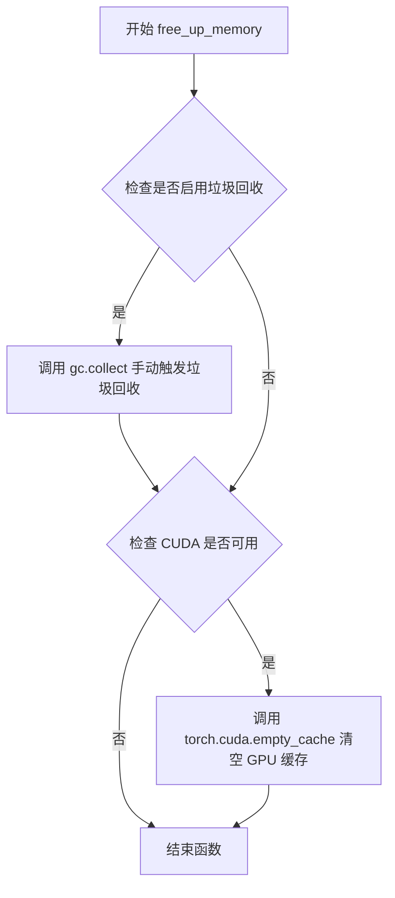
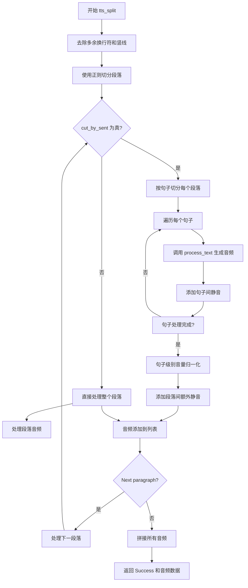
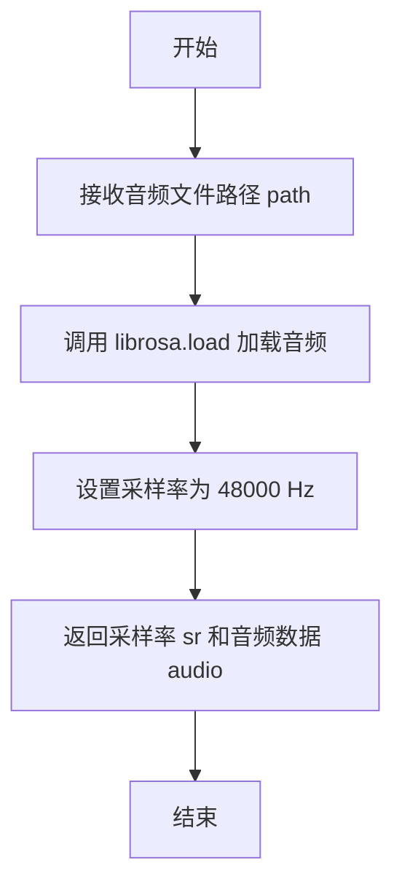
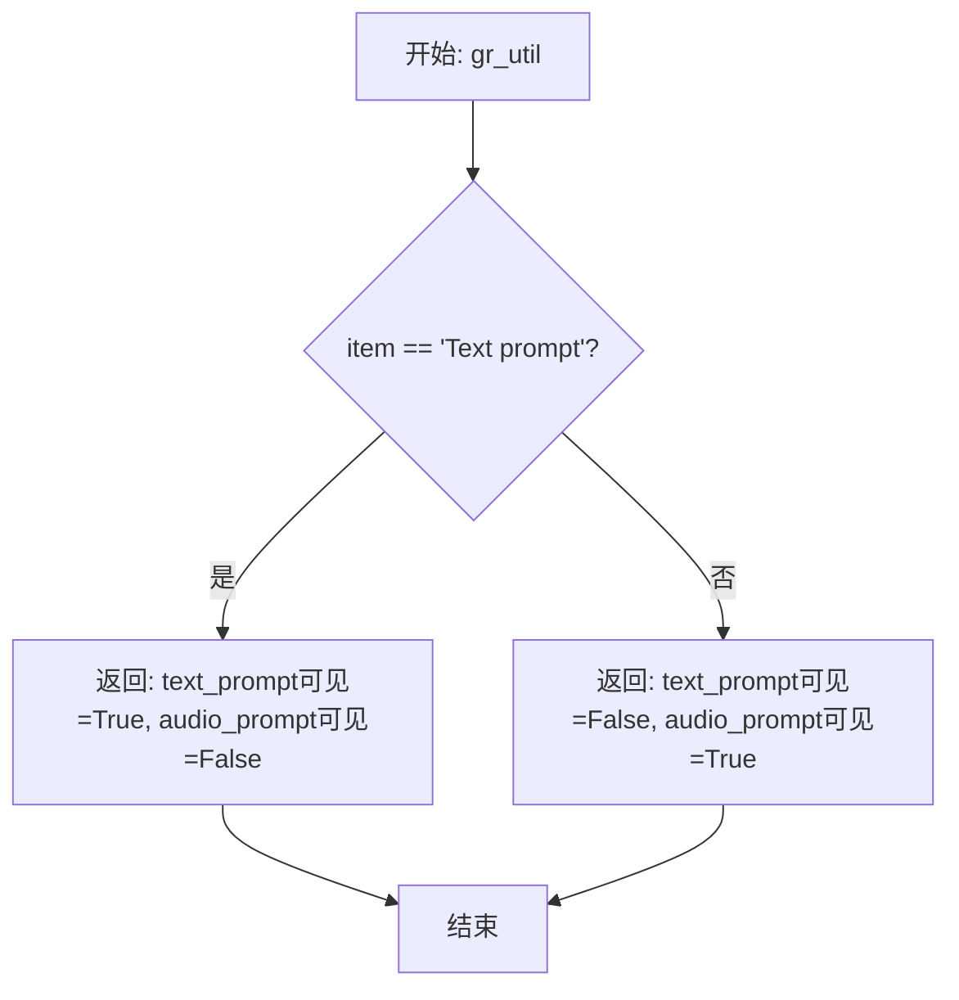

# `Bert-VITS2\webui.py` 详细设计文档

这是一个基于 Gradio 框架构建的 Web UI 服务端代码，用于调用底层的 VITS 语音合成模型（Net G），处理用户输入的文本、语言选择、说话人配置，并通过推理引擎生成对应的音频波形返回给前端。

## 整体流程

```mermaid
graph TD
    User[用户访问 Web UI] --> Input[输入文本、选择说话人/语言/参数]
    Input --> GenerateBtn{点击生成按钮}
    GenerateBtn --> TTSFunc[调用 tts_fn]
    TTSFunc --> ProcessText[调用 process_text 进行文本预处理]
    ProcessText --> LangCheck{判断语言模式}
    LangCheck -- mix --> ProcessMix[调用 process_mix 解析混合格式]
    LangCheck -- auto --> ProcessAuto[调用 process_auto 自动检测语言]
    LangCheck -- specific --> DirectSlice[直接按竖线切分文本]
    ProcessMix --> GenMulti[调用 generate_audio_multilang]
    ProcessAuto --> GenMulti
    DirectSlice --> GenSingle[调用 generate_audio]
    GenMulti --> Loop[循环遍历文本片段]
    GenSingle --> Loop
    Loop --> Infer[调用 infer / infer_multilang]
    Infer --> Model[调用 net_g (VITS模型) 推理]
    Model --> Audio16bit[转换为16位WAV]
    Audio16bit --> Concat[numpy 拼接音频片段]
    Concat --> Return[返回 (状态, 音频数据)]
```

## 类结构

```
webui.py (主程序模块)
├── Global Variables (全局变量)
│   ├── net_g (加载的生成器模型)
│   ├── device (计算设备 CPU/CUDA/MPS)
│   ├── hps (超参数配置对象)
│   ├── speakers (说话人列表)
│   └── languages (支持的语言列表)
└── Global Functions (全局函数)
    ├── free_up_memory (显存清理函数)
    ├── generate_audio (单语言音频生成)
    ├── generate_audio_multilang (多语言音频生成)
    ├── tts_split (文本切分与生成逻辑)
    ├── process_mix (混合语言文本解析)
    ├── process_auto (自动语言检测处理)
    ├── process_text (文本处理分发中心)
    ├── tts_fn (Gradio 按钮绑定的主生成函数)
    ├── format_utils (文本格式化工具)
    ├── load_audio (Librosa 音频加载)
    └── gr_util (UI 元素显隐控制)
```

## 全局变量及字段


### `net_g`
    
用于生成音频的神经网络模型（GPT-SoVITS声学模型）

类型：`torch.nn.Module`
    


### `device`
    
指定用于推理的计算设备（cuda/mps/cpu）

类型：`str`
    


### `hps`
    
存储模型配置和超参数的全局对象，包含采样率、说话人映射等数据

类型：`HParams`
    


### `speaker_ids`
    
说话人名称到ID的映射字典

类型：`dict`
    


### `speakers`
    
可供选择的说话人名称列表

类型：`list`
    


### `languages`
    
支持的语言选项列表，包含ZH、JP、EN、mix、auto

类型：`list`
    


    

## 全局函数及方法


### `free_up_memory`

该函数用于在推理前释放内存资源，通过显式调用垃圾回收和清空 CUDA 缓存来释放可能因异常未被清理的大变量内存，确保后续推理运行有足够的内存空间。

参数：  
无

返回值：`None`，无返回值

#### 流程图



#### 带注释源码

```python
def free_up_memory():
    # Prior inference run might have large variables not cleaned up due to exception during the run.
    # Free up as much memory as possible to allow this run to be successful.
    # 手动触发 Python 垃圾回收，释放因上一次推理异常退出而未被清理的大对象
    gc.collect()
    # 检查系统是否支持 CUDA（GPU 加速），若支持则清空 GPU 显存缓存
    if torch.cuda.is_available():
        # 清空 CUDA 缓存，释放 GPU 显存供当前推理使用
        torch.cuda.empty_cache()
```


### `generate_audio`

该函数是语音合成系统的核心推理函数，接收文本片段、语音参数、说话人信息、参考音频和风格控制参数，遍历每个文本片段调用推理引擎生成音频，并将结果转换为16位WAV格式后返回音频列表。

参数：

-  `slices`：`List[str]`，文本片段列表，每个元素是需要合成的文本
-  `sdp_ratio`：`float`，SDP（Soft Decision Precision）比率，控制语音合成中的随机性
-  `noise_scale`：`float`，噪声系数，影响音频生成的自然度
-  `noise_scale_w`：`float`，噪声权重系数，控制噪声在音高生成中的影响
-  `length_scale`：`float`，长度缩放因子，控制生成音频的时长
-  `speaker`：`int`，说话人ID，用于选择特定的说话人模型
-  `language`：`str`，语言标识符（如"ZH"、"JP"、"EN"）
-  `reference_audio`：`numpy.ndarray`，参考音频，用于风格迁移
-  `emotion`：`str`，情感标签，控制生成音频的情感风格
-  `style_text`：`str`，风格文本，辅助控制生成风格
-  `style_weight`：`float`，风格权重，控制风格文本的影响程度
-  `skip_start`：`bool`，是否跳过片段开始部分（默认为False）
-  `skip_end`：`bool`，是否跳过片段结束部分（默认为False）

返回值：`List[numpy.ndarray]`，返回16位WAV格式的音频数据列表

#### 流程图

```mermaid
flowchart TD
    A[开始 generate_audio] --> B[调用 free_up_memory 释放内存]
    B --> C[初始化空音频列表 audio_list]
    C --> D[遍历 slices 中的每个 piece]
    D --> E{idx != 0?}
    E -->|Yes| F[skip_start = True]
    E -->|No| G[skip_start = False]
    F --> H{idx != len(slices) - 1?}
    G --> H
    H -->|Yes| I[skip_end = True]
    H -->|No| J[skip_end = False]
    I --> K[调用 infer 生成音频]
    J --> K
    K --> L[调用 convert_to_16_bit_wav 转换音频格式]
    L --> M[将转换后的音频添加到 audio_list]
    M --> N{还有更多片段?}
    N -->|Yes| D
    N -->|No| O[返回 audio_list]
    O --> P[结束]
```

#### 带注释源码

```python
def generate_audio(
    slices,                      # List[str]: 文本片段列表
    sdp_ratio,                   # float: SDP比率，控制合成随机性
    noise_scale,                 # float: 噪声系数
    noise_scale_w,               # float: 噪声权重系数
    length_scale,                # float: 长度缩放因子
    speaker,                     # int: 说话人ID
    language,                    # str: 语言标识符
    reference_audio,             # numpy.ndarray: 参考音频
    emotion,                     # str: 情感标签
    style_text,                  # str: 风格文本
    style_weight,                # float: 风格权重
    skip_start=False,            # bool: 是否跳过开始部分
    skip_end=False,              # bool: 是否跳过结束部分
):
    audio_list = []              # 初始化空音频列表用于存储生成的音频
    
    # 调用内存释放函数，清理上一次推理可能残留的大变量
    free_up_memory()
    
    # 使用 torch.no_grad() 禁用梯度计算，节省显存和计算资源
    with torch.no_grad():
        # 遍历所有文本片段，逐个生成音频
        for idx, piece in enumerate(slices):
            # 根据当前片段索引决定是否跳过开始/结束部分
            # 第一个片段不跳过开始，最后一个片段不跳过结束
            skip_start = idx != 0
            skip_end = idx != len(slices) - 1
            
            # 调用推理函数生成单个音频片段
            audio = infer(
                piece,                       # 当前文本片段
                reference_audio=reference_audio,
                emotion=emotion,
                sdp_ratio=sdp_ratio,
                noise_scale=noise_scale,
                noise_scale_w=noise_scale_w,
                length_scale=length_scale,
                sid=speaker,                 # speaker ID
                language=language,
                hps=hps,                     # 超参数配置
                net_g=net_g,                 # 生成器网络
                device=device,               # 计算设备
                skip_start=skip_start,
                skip_end=skip_end,
                style_text=style_text,
                style_weight=style_weight,
            )
            
            # 将生成的音频转换为16位WAV格式
            audio16bit = gr.processing_utils.convert_to_16_bit_wav(audio)
            
            # 将转换后的音频添加到列表中
            audio_list.append(audio16bit)
    
    # 返回生成的音频列表
    return audio_list
```


### `generate_audio_multilang`

该函数是 VITS 语音合成系统的多语言音频生成核心函数，接收分片后的文本列表及对应语言标识，通过循环调用 `infer_multilang` 推理接口逐片生成音频，并将每片音频转换为 16 位 WAV 格式后追加到列表中返回，适用于混合语言文本的语音合成场景。

参数：

- `slices`：`List`，分片后的文本列表，每个元素为一段待合成语音的文本
- `sdp_ratio`：`float`，SDP（Soft DP）比率，控制韵律预测的随机性，取值范围通常为 0~1
- `noise_scale`：`float`，噪声规模参数，用于控制音频生成过程中的噪声水平
- `noise_scale_w`：`float`，波形噪声规模参数，用于控制波形级别的噪声
- `length_scale`：`float`，长度缩放因子，控制生成语音的语速，值越大语速越慢
- `speaker`：`int` 或 `str`，说话人 ID，用于选择特定的说话人声音
- `language`：`List[str]`，语言标识列表，与 `slices` 对应，标识每段文本使用的语言（如 "ZH"、"JP"、"EN"）
- `reference_audio`：`np.ndarray` 或 `None`，参考音频数据，用于语音风格迁移或音色克隆
- `emotion`：`str` 或情感标识字符串，用于指定生成语音的情感风格
- `skip_start`：`bool`，是否跳过每片音频的开头部分（可选，默认 False）
- `skip_end`：`bool`，是否跳过每片音频的结尾部分（可选，默认 False）

返回值：`List[np.ndarray]`，返回 16 位 WAV 格式的音频数据列表，每个元素对应一段文本生成的音频

#### 流程图

```mermaid
flowchart TD
    A[开始 generate_audio_multilang] --> B[调用 free_up_memory 释放显存]
    B --> C[进入 torch.no_grad 上下文]
    C --> D[遍历 slices 列表, 获取索引 idx 和文本 piece]
    E{idx != 0} -->|True| F[skip_start = True]
    E -->|False| G[skip_start = False]
    H{idx != len<br/>slices - 1} -->|True| I[skip_end = True]
    H -->|False| J[skip_end = False]
    F --> K[调用 infer_multilang 推理]
    G --> K
    I --> K
    J --> K
    K --> L[传入 piece 和 language[idx] 获取单片音频]
    L --> M[调用 convert_to_16_bit_wav 转换为16位]
    M --> N[将音频追加到 audio_list]
    N --> O{是否还有下一个 slice}
    O -->|是| D
    O -->|否| P[返回 audio_list]
```

#### 带注释源码

```python
def generate_audio_multilang(
    slices,               # List: 分片后的文本列表，每个元素为一段待合成语音的文本
    sdp_ratio,            # float: SDP比率，控制韵律预测的随机性
    noise_scale,          # float: 噪声规模参数
    noise_scale_w,        # float: 波形噪声规模参数
    length_scale,         # float: 长度缩放因子，控制语速
    speaker,              # int/str: 说话人ID
    language,             # List[str]: 语言标识列表，与slices对应
    reference_audio,      # np.ndarray/None: 参考音频，用于风格迁移
    emotion,              # str: 情感标识
    skip_start=False,     # bool: 是否跳过片头
    skip_end=False,       # bool: 是否跳过片尾
):
    """
    多语言音频生成函数
    遍历文本分片列表，为每段文本调用推理接口生成对应语言的音频
    """
    audio_list = []       # 初始化音频列表，用于存储各分片生成的音频
    
    # 调用内存释放函数，清理上一次推理可能遗留的大变量，防止OOM
    free_up_memory()
    
    # 使用 torch.no_grad() 上下文管理器，禁用梯度计算以节省显存
    with torch.no_grad():
        # 遍历所有文本分片
        for idx, piece in enumerate(slices):
            # 动态计算 skip_start：非首片时跳过片头，避免音频片段重叠时的衔接噪声
            skip_start = idx != 0
            # 动态计算 skip_end：非末片时跳过片尾，保证音频片段间的平滑过渡
            skip_end = idx != len(slices) - 1
            
            # 调用多语言推理接口 infer_multilang 生成单片音频
            # 注意：language 参数使用 language[idx] 获取当前片对应的语言
            audio = infer_multilang(
                piece,                     # 当前片的文本内容
                reference_audio=reference_audio,
                emotion=emotion,
                sdp_ratio=sdp_ratio,
                noise_scale=noise_scale,
                noise_scale_w=noise_scale_w,
                length_scale=length_scale,
                sid=speaker,
                language=language[idx],    # 关键：每片使用对应的语言标识
                hps=hps,
                net_g=net_g,
                device=device,
                skip_start=skip_start,
                skip_end=skip_end,
            )
            
            # 将生成的音频转换为 Gradio 要求的 16 位 WAV 格式
            audio16bit = gr.processing_utils.convert_to_16_bit_wav(audio)
            
            # 将转换后的音频追加到列表中
            audio_list.append(audio16bit)
    
    # 返回所有分片音频的列表
    return audio_list
```


### `tts_split`

该函数是文本转语音(TTS)系统的核心切分与生成函数，负责将输入文本按段落和句子进行切分，生成对应的音频数据，并处理段落间和句子间的静音间隔。

参数：

- `text`：`str`，输入的待转换文本内容
- `speaker`：`speaker`，说话人ID或名称，用于选择音色
- `sdp_ratio`：`sdp_ratio`，SDP (Stochastic Duration Predictor) 比率，控制音频生成的不确定性
- `noise_scale`：`noise_scale`，噪声尺度参数，影响音频生成的细节
- `noise_scale_w`：`noise_scale_w`，噪声尺度权重参数
- `length_scale`：`length_scale`，长度缩放因子，控制生成音频的语速
- `language`：`language`，目标语言类型（如"ZH"、"JP"、"EN"、"mix"、"auto"）
- `cut_by_sent`：`cut_by_sent`，布尔值，是否按句子切分文本（否则按段落切分）
- `interval_between_para`：`interval_between_para`，段落之间的静音间隔（秒）
- `interval_between_sent`：`interval_between_sent`，句子之间的静音间隔（秒）
- `reference_audio`：`reference_audio`，参考音频路径，用于风格迁移
- `emotion`：`emotion`，情绪标签，用于控制生成音频的情感
- `style_text`：`style_text`，辅助风格文本，用于语义辅助
- `style_weight`：`style_weight`，辅助风格文本的权重（0-1之间）

返回值：`tuple`，返回包含状态和音频数据的元组，格式为 `("Success", (hps.data.sampling_rate, audio_concat))`，其中 `hps.data.sampling_rate` 是采样率，`audio_concat` 是拼接后的音频数据

#### 流程图



#### 带注释源码

```python
def tts_split(
    text: str,
    speaker,
    sdp_ratio,
    noise_scale,
    noise_scale_w,
    length_scale,
    language,
    cut_by_sent,
    interval_between_para,
    interval_between_sent,
    reference_audio,
    emotion,
    style_text,
    style_weight,
):
    # 步骤1: 预处理文本，去除多余的换行符（将双换行替换为单换行）
    while text.find("\n\n") != -1:
        text = text.replace("\n\n", "\n")
    # 步骤2: 移除竖线字符（竖线在混合语言模式中是特殊分隔符）
    text = text.replace("|", "")
    
    # 步骤3: 使用正则表达式按段落切分文本
    para_list = re_matching.cut_para(text)
    # 步骤4: 过滤掉空段落
    para_list = [p for p in para_list if p != ""]
    
    # 初始化音频列表
    audio_list = []
    
    # 步骤5: 遍历每个段落进行处理
    for p in para_list:
        if not cut_by_sent:
            # 模式A: 不按句子切分，直接处理整个段落
            # 调用 process_text 生成段落音频
            audio_list += process_text(
                p,
                speaker,
                sdp_ratio,
                noise_scale,
                noise_scale_w,
                length_scale,
                language,
                reference_audio,
                emotion,
                style_text,
                style_weight,
            )
            # 添加段落间的静音间隔（采样率44100 * 秒数）
            silence = np.zeros((int)(44100 * interval_between_para), dtype=np.int16)
            audio_list.append(silence)
        else:
            # 模式B: 按句子切分处理
            audio_list_sent = []  # 当前段落的句子音频列表
            # 使用正则切分句子
            sent_list = re_matching.cut_sent(p)
            sent_list = [s for s in sent_list if s != ""]
            
            # 遍历每个句子
            for s in sent_list:
                # 生成句子音频
                audio_list_sent += process_text(
                    s,
                    speaker,
                    sdp_ratio,
                    noise_scale,
                    noise_scale_w,
                    length_scale,
                    language,
                    reference_audio,
                    emotion,
                    style_text,
                    style_weight,
                )
                # 添加句子间静音
                silence = np.zeros((int)(44100 * interval_between_sent))
                audio_list_sent.append(silence)
            
            # 如果段落间静音时长大于句子间静音时长，添加额外静音
            if (interval_between_para - interval_between_sent) > 0:
                silence = np.zeros(
                    (int)(44100 * (interval_between_para - interval_between_sent))
                )
                audio_list_sent.append(silence)
            
            # 对完整句子进行音量归一化处理（拼接后转换）
            audio16bit = gr.processing_utils.convert_to_16_bit_wav(
                np.concatenate(audio_list_sent)
            )
            audio_list.append(audio16bit)
    
    # 步骤6: 拼接所有音频片段
    audio_concat = np.concatenate(audio_list)
    # 步骤7: 返回成功状态和音频数据（采样率，音频数组）
    return ("Success", (hps.data.sampling_rate, audio_concat))
```


### `process_mix`

该函数用于处理混语（mix）模式的文本切片数据，从切片中提取说话人信息，并将文本和语言信息整理成平行的数据结构返回。

参数：

- `slice`：`list`，包含语言-内容对（lang, content）的列表，最后一个元素为说话人信息

返回值：`tuple`，返回三个元素的元组 - 文本数据（二维列表）、语言数据（二维列表）、说话人

#### 流程图

```mermaid
flowchart TD
    A[开始 process_mix] --> B[从slice中弹出最后一个元素作为_speaker]
    B --> C[初始化空列表 _text 和 _lang]
    C --> D[遍历slice中的每个 lang, content 对]
    D --> E{content是否为空}
    E -->|是| F[跳过当前迭代]
    E -->|否| G[按"|"分割content并过滤空字符串]
    G --> H{_text是否为空}
    H -->|是| I[为每个part创建独立的子列表]
    I --> J[为每个part创建对应的语言子列表]
    H -->|否| K[将content[0]追加到_text[-1]]
    K --> L[将lang追加到_lang[-1]]
    L --> M{content长度>1}
    M -->|是| N[为剩余part创建新子列表并添加到_text]
    N --> O[为剩余part创建对应语言子列表并添加到_lang]
    M -->|否| P[返回 _text, _lang, _speaker]
    F --> D
    J --> P
    O --> P
```

#### 带注释源码

```python
def process_mix(slice):
    # 从切片中弹出最后一个元素作为说话人信息
    _speaker = slice.pop()
    
    # 初始化文本和语言列表
    _text, _lang = [], []
    
    # 遍历切片中的每个(语言, 内容)对
    for lang, content in slice:
        # 按"|"分割内容，并过滤掉空字符串
        content = content.split("|")
        content = [part for part in content if part != ""]
        
        # 如果内容为空，跳过当前迭代
        if len(content) == 0:
            continue
        
        # 如果_text为空，初始化结构
        if len(_text) == 0:
            # 为每个内容部分创建独立的子列表
            _text = [[part] for part in content]
            # 为每个内容部分创建对应的语言子列表
            _lang = [[lang] for part in content]
        else:
            # 将第一个内容追加到最后一个文本子列表
            _text[-1].append(content[0])
            # 将语言追加到最后一个语言子列表
            _lang[-1].append(lang)
            
            # 如果有多个内容部分，为后续部分创建新的子列表
            if len(content) > 1:
                _text += [[part] for part in content[1:]]
                _lang += [[lang] for part in content[1:]]
    
    # 返回文本、语言和说话人信息
    return _text, _lang, _speaker
```


### `process_auto`

该函数用于自动检测并处理输入文本的语言，根据"|"分割的每个片段进行语言识别和文本切分，最终返回按语言分组的文本列表和对应的语言代码列表。

参数：
- `text`：`str`，输入的文本字符串，可能包含用"|"分割的多个片段

返回值：`_text`（`list`），嵌套列表结构，每个子列表包含对应片段的句子文本；`_lang`（`list`），嵌套列表结构，每个子列表对应 `_text` 中文本的语言代码（如 "ZH", "JP", "EN"）

#### 流程图

```mermaid
flowchart TD
    A[开始: 输入 text] --> B[初始化空列表 _text, _lang]
    B --> C{遍历 text.split('|') 的每个 slice}
    C -->|slice 为空| C
    C -->|slice 非空| D[初始化 temp_text, temp_lang]
    D --> E[调用 split_by_language 分割语言]
    E --> F{遍历 sentences_list 中的每个 sentence, lang}
    F -->|sentence 为空| F
    F -->|sentence 非空| G[将 sentence 加入 temp_text]
    G --> H{lang == 'ja'?}
    H -->|是| I[lang 转换为 'jp']
    H -->|否| J[lang 保持不变]
    I --> K[lang 转换为大写]
    J --> K
    K --> L[将 lang 加入 temp_lang]
    L --> F
    F -->|遍历完成| M[将 temp_text 加入 _text]
    M --> N[将 temp_lang 加入 _lang]
    N --> C
    C -->|遍历完成| O[返回 _text, _lang]
    O --> P[结束]
```

#### 带注释源码

```python
def process_auto(text):
    """
    自动检测并处理输入文本的语言和内容。
    
    该函数接受一个包含用"|"分割的文本片段的字符串，
    对每个片段进行语言识别（支持中文、日语、英语），
    并返回结构化的文本和语言列表。
    
    参数:
        text: 输入的文本字符串，可包含多个用"|"分隔的片段
        
    返回:
        _text: 二维列表，每个子列表包含对应片段的句子
        _lang: 二维列表，每个子列表包含对应句子的语言代码
    """
    _text, _lang = [], []  # 初始化结果列表
    
    # 按"|"分割文本，处理多个片段
    for slice in text.split("|"):
        if slice == "":  # 跳过空片段
            continue
        
        temp_text, temp_lang = [], []  # 临时存储当前片段的数据
        
        # 调用语言分割工具，识别文本中的语言
        # target_languages 指定支持的语言：中文、日语、英语
        sentences_list = split_by_language(slice, target_languages=["zh", "ja", "en"])
        
        # 遍历识别出的每个句子及其语言
        for sentence, lang in sentences_list:
            if sentence == "":  # 跳过空句子
                continue
            
            # 将句子文本添加到临时列表
            temp_text.append(sentence)
            
            # 语言代码标准化处理
            if lang == "ja":  # 日语代码转换
                lang = "jp"
            
            # 将语言代码转换为大写格式（如 "ZH", "JP", "EN"）
            temp_lang.append(lang.upper())
        
        # 将当前片段的处理结果添加到总结果中
        _text.append(temp_text)
        _lang.append(temp_lang)
    
    return _text, _lang  # 返回处理后的文本和语言列表
```


### `process_text`

该函数是文本转语音（TTS）处理的核心入口函数，根据不同的语言模式（混合语言"mix"、自动检测"auto"或特定语言）对输入文本进行分片处理，并调用相应的音频生成函数，最终返回生成的音频列表。

参数：

- `text`：`str`，输入的待合成文本内容
- `speaker`：`任意类型`，说话人ID或说话人名称
- `sdp_ratio`：`任意类型`，SDP（Soft-Duration-Prior）比率，用于控制语音合成的韵律
- `noise_scale`：`任意类型`，噪声缩放因子，控制语音合成中的噪声水平
- `noise_scale_w`：`任意类型`，噪声缩放因子（用于波长），控制语音的细节特征
- `length_scale`：`任意类型`，长度缩放因子，控制合成语音的时长
- `language`：`str`，语言模式，可选值为"mix"、"auto"或具体语言代码（如"ZH"、"JP"、"EN"）
- `reference_audio`：`任意类型`，参考音频，用于风格迁移或情感合成
- `emotion`：`任意类型`，情感标签，控制合成语音的情感风格
- `style_text`：`str | None`，可选参数，辅助文本，用于语义融合增强（默认为None）
- `style_weight`：`float | int`，可选参数，辅助文本的混合权重，范围通常为0到1（默认为0）

返回值：`list`，返回生成的音频数据列表，每个元素为一段音频的numpy数组。

#### 流程图

```mermaid
flowchart TD
    A[开始 process_text] --> B{语言类型判断}
    B -->|language == 'mix'| C[验证混合文本]
    B -->|language.lower() == 'auto'| D[自动检测语言]
    B -->|其他| E[使用单语言处理]
    
    C --> C1{验证是否通过}
    C1 -->|失败| C2[返回错误信息和静音]
    C1 -->|通过| C3[遍历混合文本切片]
    C3 --> C4[调用 process_mix 解析]
    C4 --> C5[调用 generate_audio_multilang 生成音频]
    C5 --> F[添加到音频列表]
    
    D --> D1[调用 process_auto 检测语言]
    D1 --> D2[调用 generate_audio_multilang]
    D2 --> F
    
    E --> E1[按'|'分割文本]
    E1 --> E2[调用 generate_audio]
    E2 --> F
    
    F --> G[返回音频列表]
```

#### 带注释源码

```python
def process_text(
    text: str,
    speaker,
    sdp_ratio,
    noise_scale,
    noise_scale_w,
    length_scale,
    language,
    reference_audio,
    emotion,
    style_text=None,
    style_weight=0,
):
    """
    处理文本转语音的核心函数，根据语言模式分发到不同的处理流程
    
    参数:
        text: 输入文本
        speaker: 说话人
        sdp_ratio: SDP比率
        noise_scale: 噪声缩放
        noise_scale_w: 波长噪声缩放
        length_scale: 长度缩放
        language: 语言模式 ('mix', 'auto', 或具体语言)
        reference_audio: 参考音频
        emotion: 情感
        style_text: 辅助文本
        style_weight: 辅助权重
    返回:
        audio_list: 音频列表
    """
    # 初始化音频列表
    audio_list = []
    
    # 混合语言处理模式
    if language == "mix":
        # 验证混合文本格式是否合法
        bool_valid, str_valid = re_matching.validate_text(text)
        if not bool_valid:
            # 验证失败返回错误信息和0.5秒静音
            return str_valid, (
                hps.data.sampling_rate,
                np.concatenate([np.zeros(hps.data.sampling_rate // 2)]),
            )
        # 遍历混合文本的每个切片
        for slice in re_matching.text_matching(text):
            # 解析混合文本片段获取文本、语言和说话人
            _text, _lang, _speaker = process_mix(slice)
            if _speaker is None:
                continue
            print(f"Text: {_text}\nLang: {_lang}")
            # 调用多语言音频生成函数
            audio_list.extend(
                generate_audio_multilang(
                    _text,
                    sdp_ratio,
                    noise_scale,
                    noise_scale_w,
                    length_scale,
                    _speaker,
                    _lang,
                    reference_audio,
                    emotion,
                )
            )
    # 自动语言检测模式
    elif language.lower() == "auto":
        # 自动检测文本中的语言
        _text, _lang = process_auto(text)
        print(f"Text: {_text}\nLang: {_lang}")
        # 调用多语言音频生成函数
        audio_list.extend(
            generate_audio_multilang(
                _text,
                sdp_ratio,
                noise_scale,
                noise_scale_w,
                length_scale,
                speaker,
                _lang,
                reference_audio,
                emotion,
            )
        )
    # 单语言处理模式
    else:
        # 按'|'分割文本为多个片段
        audio_list.extend(
            generate_audio(
                text.split("|"),
                sdp_ratio,
                noise_scale,
                noise_scale_w,
                length_scale,
                speaker,
                language,
                reference_audio,
                emotion,
                style_text,
                style_weight,
            )
        )
    # 返回生成的音频列表
    return audio_list
```


### `tts_fn`

该函数是文本转语音（TTS）的主入口函数，负责接收用户输入的文本及相关参数，处理音频提示模式（文本提示或音频提示），调用内部文本处理流程生成音频列表，并将生成的音频片段拼接后返回。

参数：

- `text`：`str`，用户输入的要转换为语音的文本内容
- `speaker`：`speaker`，说话人ID，用于选择生成音频的声音角色
- `sdp_ratio`：`float`，SDP（Speech Dixture Prior）比率，控制语音生成的多样性
- `noise_scale`：`float`，噪声缩放系数，影响音频生成的噪声水平
- `noise_scale_w`：`float`，噪声缩放系数（用于波长），影响音频生成的细节
- `length_scale`：`float`，长度缩放因子，控制生成音频的时长
- `language`：`str`，语言类型，支持 "ZH"、"JP"、"EN"、"mix"、"auto" 等
- `reference_audio`：`str`，参考音频路径，用于音频提示模式
- `emotion`：`emotion`，情感标签，影响生成音频的情感风格
- `prompt_mode`：`str`，提示模式，可选 "Text prompt" 或 "Audio prompt"
- `style_text`：`str`，可选，辅助文本，用于融合文本语义
- `style_weight`：`float`，可选，辅助文本的权重，默认为 0

返回值：`tuple`，返回元组包含状态字符串和音频数据元组，格式为 `("Success", (采样率, 音频数组))` 或 `("Invalid audio prompt", None)`

#### 流程图

```mermaid
flowchart TD
    A[开始 tts_fn] --> B{style_text == ''}
    B -->|是| C[style_text = None]
    B -->|否| D{观察 prompt_mode}
    D -->|Audio prompt| E{reference_audio == None}
    E -->|是| F[返回 ('Invalid audio prompt', None)]
    E -->|否| G[调用 load_audio 加载参考音频]
    G --> H[获取音频数据 reference_audio]
    D -->|Text prompt| I[reference_audio = None]
    C --> J[调用 process_text 生成音频列表]
    H --> J
    I --> J
    J --> K[拼接音频列表 audio_concat]
    K --> L[返回 ('Success', (采样率, audio_concat))]
```

#### 带注释源码

```python
def tts_fn(
    text: str,
    speaker,
    sdp_ratio,
    noise_scale,
    noise_scale_w,
    length_scale,
    language,
    reference_audio,
    emotion,
    prompt_mode,
    style_text=None,
    style_weight=0,
):
    # 如果辅助文本为空字符串，则设置为 None
    if style_text == "":
        style_text = None
    
    # 根据提示模式处理参考音频
    if prompt_mode == "Audio prompt":
        # 音频提示模式下，如果没有提供参考音频，返回错误
        if reference_audio == None:
            return ("Invalid audio prompt", None)
        else:
            # 加载参考音频并获取音频数据（索引1为音频数组）
            reference_audio = load_audio(reference_audio)[1]
    else:
        # 文本提示模式下，不使用参考音频
        reference_audio = None

    # 调用 process_text 处理文本并生成音频列表
    audio_list = process_text(
        text,
        speaker,
        sdp_ratio,
        noise_scale,
        noise_scale_w,
        length_scale,
        language,
        reference_audio,
        emotion,
        style_text,
        style_weight,
    )

    # 拼接所有音频片段
    audio_concat = np.concatenate(audio_list)
    
    # 返回成功状态和音频数据（采样率，音频数组）
    return "Success", (hps.data.sampling_rate, audio_concat)
```


### `format_utils`

该函数用于自动检测文本语言并将文本格式化为 MIX 格式，返回语言类型为 "mix" 和格式化后的文本字符串。

参数：

- `text`：`str`，需要格式化的输入文本
- `speaker`：`str` 或 `int`，说话人标识

返回值：`tuple[str, str]`，返回元组，第一个元素为语言类型 "mix"，第二个元素为格式化后的文本字符串，格式为 `[说话人]<lang>内容|lang>内容|...`

#### 流程图

```mermaid
flowchart TD
    A[开始 format_utils] --> B[调用 process_auto 处理文本]
    B --> C{获取 _text, _lang}
    C --> D[初始化结果字符串 res = [speaker]]
    D --> E[遍历 lang_s, content_s]
    E --> F{遍历 lang, content}
    F --> G[res += f<lang.lower>{content}]
    G --> H[添加分隔符 |]
    H --> I{是否还有更多语言内容}
    I -->|是| F
    I -->|否| E
    E --> J{是否还有更多片段}
    J -->|是| E
    J -->|否| K[返回 'mix', res[:-1]]
    K --> L[结束]
```

#### 带注释源码

```python
def format_utils(text, speaker):
    """
    自动检测文本语言并格式化为 MIX 格式
    
    参数:
        text: 输入文本字符串
        speaker: 说话人标识
    
    返回:
        tuple: (语言类型 'mix', 格式化后的文本字符串)
    """
    # 调用 process_auto 函数自动检测文本中的语言并分割
    # 返回的 _text 是二维列表，包含每个片段的文本内容
    # 返回的 _lang 是二维列表，包含每个片段的语言标签
    _text, _lang = process_auto(text)
    
    # 初始化结果字符串，以说话人标识开头
    res = f"[{speaker}]"
    
    # 遍历语言和文本的二维列表
    for lang_s, content_s in zip(_lang, _text):
        # 内层遍历处理每个片段中的语言-内容对
        for lang, content in zip(lang_s, content_s):
            # 将语言转为小写并用尖括号包裹，与内容拼接
            # 格式: <zh>中文内容
            res += f"<{lang.lower()}>{content}"
        # 每个片段结束时添加分隔符 |
        res += "|"
    
    # 移除最后的分隔符，返回语言类型 'mix' 和格式化文本
    return "mix", res[:-1]
```


### `load_audio`

该函数用于从指定路径加载音频文件，使用 librosa 库将音频以指定采样率读取到内存中，并返回采样率与音频数据。

参数：

- `path`：`str`，音频文件的路径

返回值：`tuple[int, np.ndarray]`，返回音频的采样率（Hz）和音频数据（numpy 数组）

#### 流程图



#### 带注释源码

```python
def load_audio(path):
    """
    加载音频文件

    参数:
        path: 音频文件的路径

    返回:
        tuple: (采样率, 音频数据)
    """
    # 使用 librosa 库加载音频文件，采样率设为 48000 Hz
    audio, sr = librosa.load(path, 48000)
    # 注释: 这里是预留的重采样代码，目前未使用
    # audio = librosa.resample(audio, 44100, 48000)
    # 返回采样率和音频数据
    return sr, audio
```


### `gr_util`

该函数是Gradio UI组件的可见性控制函数，用于根据用户选择的提示模式（Text prompt或Audio prompt）动态切换对应输入组件的显示与隐藏状态，实现文本提示和音频提示两种输入方式的无缝切换。

参数：

- `item`：`str`，表示用户选择的提示模式类型，可能值为"Text prompt"或"Audio prompt"

返回值：`tuple[dict, dict]`，返回两个字典组成的元组，每个字典包含`visible`和`__type__`字段，用于更新Gradio组件的可见性状态

#### 流程图



#### 带注释源码

```python
def gr_util(item):
    """
    Gradio UI组件可见性控制函数
    
    根据传入的prompt模式参数，动态控制Text prompt和Audio prompt
    两个输入组件的显示与隐藏状态，实现UI的动态切换
    
    参数:
        item: str - prompt模式选择，可选值为"Text prompt"或"Audio prompt"
    
    返回:
        tuple: 包含两个字典的元组
            - 第一个字典: 用于更新text_prompt组件的可见性状态
            - 第二个字典: 用于更新audio_prompt组件的可见性状态
            - 每个字典包含:
                - visible: bool - 组件是否可见
                - __type__: str - Gradio更新类型标识，固定为"update"
    """
    if item == "Text prompt":
        # 用户选择文本提示模式时，显示文本输入框，隐藏音频输入框
        return {"visible": True, "__type__": "update"}, {
            "visible": False,
            "__type__": "update",
        }
    else:
        # 用户选择音频提示模式时，隐藏文本输入框，显示音频输入框
        return {"visible": False, "__type__": "update"}, {
            "visible": True,
            "__type__": "update",
        }
```

## 关键组件


### 核心功能概述

这是一个基于 VITS (Variational Inference with adversarial learning for end-to-end Text-to-Speech) 模型的文本转语音 (TTS) Web 应用，使用 Gradio 构建交互式界面，支持多语言（中文、日语、英语）、多说话人、音频/文本提示风格控制、文本按句/段落切分生成等功能。

### 文件整体运行流程

1. **初始化阶段**：加载配置、初始化模型 (`get_net_g`)、设置设备 (CPU/CUDA/MPS)
2. **Web UI 构建**：使用 Gradio 构建包含文本输入、说话人选择、语言选择、参数调节、音频生成按钮等组件的界面
3. **用户交互流程**：用户输入文本 → 选择参数 → 点击生成 → 触发 `tts_fn` 或 `tts_split` 函数
4. **文本处理**：对输入文本进行语言检测、分句、分段、多语言混合处理
5. **音频生成**：调用 `generate_audio` 或 `generate_audio_multilang` 进行模型推理
6. **音频后处理**：转换为 16 位 WAV 格式、拼接、返回播放

---

### 关键组件信息

### 1. 张量索引与惰性加载

在 `generate_audio` 和 `generate_audio_multilang` 函数中使用 `with torch.no_grad():` 上下文管理器，禁用梯度计算以减少显存占用。同时通过 `free_up_memory()` 函数显式调用 `gc.collect()` 和 `torch.cuda.empty_cache()` 释放 GPU 内存。

### 2. 反量化支持

使用 `gr.processing_utils.convert_to_16_bit_wav()` 将模型输出的浮点型音频数据转换为 16 位整数 WAV 格式，确保音频兼容性。

### 3. 量化策略与生成参数

代码暴露多个 VITS 模型推理控制参数：`sdp_ratio` (SDP/DP 混合比例)、`noise_scale` (噪声水平)、`noise_scale_w` (噪声宽度)、`length_scale` (语速控制)，用于平衡生成质量与多样性。

### 4. 多语言混合处理

支持 `mix` 和 `auto` 两种语言模式：通过 `process_mix` 处理显式多语言标记 (如 `<zh>`, `<jp>`)，通过 `process_auto` + `split_by_language` 自动检测语言，支持中英日混合生成。

### 5. 文本分句与分段

`re_matching.cut_para` 和 `re_matching.cut_sent` 分别实现按段落和按句子切分文本，配合 `interval_between_sent` 和 `interval_between_para` 参数控制段落/句子间的静音时长。

### 6. 音频提示与文本提示

支持两种风格提示模式：`Audio prompt` 通过 `load_audio` 加载参考音频；`Text prompt` 通过 `style_text` 和 `style_weight` 参数利用 BERT 语义混合辅助生成。

### 7. 模型推理封装

`infer` 和 `infer_multilang` 函数封装了 VITS 核心推理逻辑，接收文本、说话人 ID、语言、提示音频、风格参数等，输出原始音频张量。

### 8. Web UI 交互组件

使用 Gradio 构建完整 TTS 控制界面，包含文本输入区、说话人下拉框、语言选择、参数滑块、生成/切分/翻译按钮，支持实时音频预览。

---

### 潜在技术债务与优化空间

1. **全局变量管理**：`net_g` 和 `hps` 作为全局变量，缺乏封装，可能导致状态不一致
2. **异常处理缺失**：推理过程中未捕获异常，模型加载失败时无优雅降级
3. **硬编码采样率**：多处使用 `44100` 硬编码，应从 `hps.data.sampling_rate` 统一获取
4. **重复代码**：`generate_audio` 与 `generate_audio_multilang` 存在大量重复逻辑，可抽象合并
5. **日志级别管理**：通过 `logging.getLogger(...).setLevel(logging.WARNING)` 抑制第三方库日志，应使用配置文件统一管理
6. **音频加载冗余**：音频提示每次上传都重新加载 `load_audio`，可增加缓存机制

## 问题及建议


### 已知问题

-   **全局变量依赖问题**：`hps`在`if __name__ == "__main__":`块中定义，但在`generate_audio`、`generate_audio_multilang`、`tts_split`、`process_text`、`tts_fn`等多个函数中直接使用，会导致在非main上下文调用时出现`NameError`
-   **参数覆盖问题**：`generate_audio`和`generate_audio_multilang`函数中，`skip_start`和`skip_end`参数在函数开头被直接覆盖，导致调用时传入的值被忽略
-   **代码重复**：`generate_audio`和`generate_audio_multilang`存在大量重复代码，违反了DRY原则
-   **硬编码采样率**：多处使用硬编码的`44100`，如`tts_split`中的`np.zeros((int)(44100 * interval_between_para))`，应统一使用`hps.data.sampling_rate`
-   **变量遮蔽**：`slicer`变量在代码中定义了两次（按钮组件），导致变量引用混淆
-   **缺少异常处理**：`load_audio`函数使用`librosa.load`但没有任何异常处理，文件不存在或格式错误时会直接崩溃
-   **函数职责过重**：`process_text`函数处理了多种语言模式（mix、auto、其他），逻辑分支复杂，违反单一职责原则
-   **返回值不一致**：`process_text`函数在某些分支返回错误字符串元组（如`return str_valid, (...)`），在其他分支返回`audio_list`，导致调用方处理困难
-   **未使用的导入**：`re_matching`模块被导入但具体实现未在代码中体现
-   **注释代码未清理**：多处注释掉的代码（如`silence`变量、音频重采样代码）长期存在

### 优化建议

-   **重构全局变量**：将`hps`和`net_g`通过参数传递或依赖注入方式提供给函数，避免全局状态依赖
-   **合并重复函数**：将`generate_audio`和`generate_audio_multilang`合并，通过参数区分处理逻辑
-   **移除参数覆盖**：删除函数内部对`skip_start`和`skip_end`的重新赋值，使用传入的参数值
-   **统一采样率**：将所有硬编码的`44100`替换为`hps.data.sampling_rate`
-   **修复变量命名**：为第二个`slicer`按钮使用不同变量名，避免遮蔽
-   **添加异常处理**：为`load_audio`函数添加try-except处理，记录日志并返回合理错误
-   **拆分复杂函数**：将`process_text`拆分为多个独立函数，分别处理不同语言模式
-   **统一返回值**：确保所有分支返回相同类型的对象，或使用Result模式封装
-   **清理无用代码**：删除注释掉的代码，保持代码库整洁

## 其它


### 设计目标与约束

本项目旨在构建一个基于深度学习的多语言文本转语音（TTS）Web服务，提供实时、高质量的语音合成能力。核心设计目标包括：支持中文、日文、英文等多种语言的语音生成；通过说话人嵌入实现多音色支持；支持情感合成和风格控制；提供友好的Web界面便于用户交互。约束条件方面，需在消费级GPU（如RTX系列）上实现实时或近实时推理；模型文件大小需控制在合理范围内以便分发；Web界面响应时间需控制在用户可接受范围内（<5秒生成100字符音频）。

### 错误处理与异常设计

代码中的错误处理主要通过以下机制实现：在`process_text`函数中，当语言为"mix"时调用`re_matching.validate_text`进行文本验证，验证失败返回错误信息而非异常中断；`generate_audio`和`generate_audio_multilang`函数通过`free_up_memory`在推理前清理显存以避免OOM；`tts_fn`中对音频提示模式进行空值检查。异常捕获方面，主要依赖Python的默认异常传播机制，未见显式的try-except块。改进建议：应在关键推理路径添加异常捕获，如模型加载失败、音频文件读取失败等情况；建议定义统一的错误码和错误消息格式；应添加输入参数的有效性校验（如文本长度限制、音频格式校验）。

### 数据流与状态机

整体数据流如下：用户通过Gradio界面输入文本、选择说话人、设置参数 → `tts_fn`接收请求 → 根据语言模式分支处理 → 调用`process_text`进行文本预处理（分句、分段、语言检测） → 调用`generate_audio`或`generate_audio_multilang`进行推理 → 拼接音频片段 → 返回音频和状态。状态机方面，界面主要存在三种状态：输入状态（等待用户输入）、处理状态（生成中，禁用输入）、完成状态（显示结果）。`prompt_mode`切换时通过`gr_util`函数控制文本提示和音频提示组件的可见性。

### 外部依赖与接口契约

核心外部依赖包括：`torch`（深度学习框架，版本需与CUDA匹配）、`gradio`（Web UI框架，版本需兼容）、`librosa`（音频处理，固定采样率48000Hz）、`numpy`（数值计算）、`utils`和`infer`模块（内部模型推理封装）。配置依赖通过`config`模块的`webui_config`对象获取，包括设备选择、模型路径、端口配置等。接口契约方面，`generate_audio`和`infer`函数是关键接口，需保证参数兼容性；`re_matching`模块的`cut_para`、`cut_sent`、`validate_text`、`text_matching`函数需按约定格式返回数据；`split_by_language`函数需返回(文本, 语言代码)元组列表。

### 性能要求与指标

推理性能目标：在RTX 3090上，单句100字符音频生成时间应<3秒；多语言混合文本处理，单段落总生成时间应<10秒。内存管理：单次推理显存占用应<8GB，需通过`free_up_memory`函数在每轮推理前清理缓存。音频质量：采样率固定为44100Hz或48000Hz（从代码看处理过程中保持48000Hz，返回时转换为44100Hz），输出格式为16位PCM WAV。并发处理：当前设计为单用户顺序处理，未支持并发请求，改进方向可考虑使用队列管理请求。

### 安全性考虑

当前代码未包含身份认证和访问控制机制，所有可访问该Web服务的用户均可使用全部功能。输入验证方面，`tts_split`函数对文本进行了一定清洗（去除多余换行、去除管道符），但未对文本长度和内容进行严格限制，存在潜在的DoS风险（超长文本导致内存溢出）。文件安全方面，`load_audio`函数直接加载用户上传的音频文件，建议添加文件类型和大小校验。模型安全方面，模型文件路径通过配置文件指定，需确保配置文件访问权限。

### 配置管理

配置通过`config`模块的`webui_config`对象集中管理，关键配置项包括：`device`（计算设备选择，支持cuda/mps/cpu）、`config_path`（模型配置文件路径）、`model`（模型文件路径）、`port`（Web服务端口）、`share`（是否生成公开链接）、`debug`（调试模式开关）。配置采用代码内硬编码方式，未见环境变量覆盖或配置文件热加载机制。改进建议：支持命令行参数覆盖、支持.env文件配置、添加配置变更热加载能力。

### 资源管理

显存管理通过`free_up_memory`函数实现，包括`gc.collect()`和`torch.cuda.empty_cache()`调用，在每轮`generate_audio`前执行以释放前序推理残留内存。模型加载采用延迟加载模式，在`if __name__ == "__main__"`块中加载一次并缓存于全局变量`net_g`，避免重复加载开销。音频处理采用流式处理，音频片段逐个生成后拼接，避免一次性加载整个音频到内存。临时文件管理未在代码中体现，改进方向需考虑音频缓存清理机制。

### 兼容性设计

设备兼容性：代码通过`device`配置和`PYTORCH_ENABLE_MPS_FALLBACK`环境变量支持CPU、CUDA、MPS三种设备，推理时根据设备选择合适的代码路径。Python版本兼容性：代码未指定Python版本要求，从import语句推断需Python 3.8+。依赖版本兼容性：通过import直接导入模块，未指定版本约束，生产环境建议锁定依赖版本。Web浏览器兼容性：依赖Gradio框架本身处理浏览器兼容性问题。音频格式兼容性：仅支持常见音频格式（librosa可读取的格式），输出固定为16位WAV。

### 测试策略

当前代码未包含单元测试或集成测试。测试建议方向：单元测试层面，应对`process_text`、`process_auto`、`process_mix`、`tts_split`等文本处理函数进行测试，覆盖正常输入、边界输入（如空文本、超长文本）、异常输入（如无效语言代码）；应对`free_up_memory`函数进行内存释放效果验证。集成测试层面，应对完整TTS流程进行端到端测试，验证输入文本到输出音频的完整链路；应测试多语言混合、说话人切换等复杂场景。性能测试层面，应建立推理时延基准测试，监控不同文本长度、设备配置下的性能指标。

### 部署架构

当前为单机部署模式，直接通过`app.launch`启动Gradio服务。生产部署建议：使用Gunicorn或uWSGI作为WSGI服务器替代Gradio内置服务器以提升并发处理能力；配置Nginx反向代理处理静态资源和负载均衡；使用Systemd或Docker管理服务进程确保自启动和故障恢复。容器化方面，建议编写Dockerfile，基于CUDA镜像构建，确保GPU驱动和CUDA版本匹配。扩展方向：可考虑将推理服务拆分为独立的REST API，微服务架构部署，支持多实例水平扩展。


    