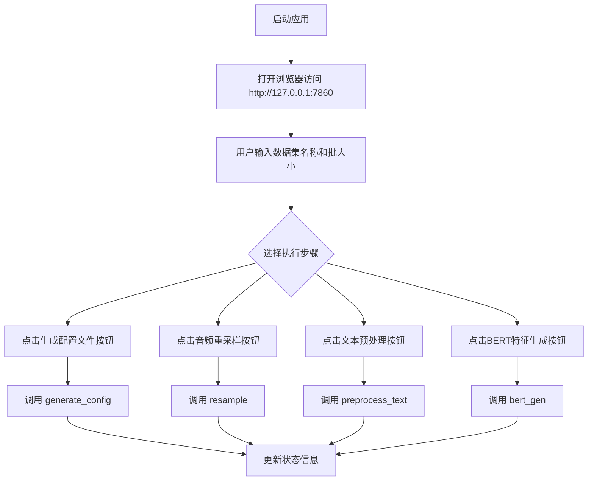
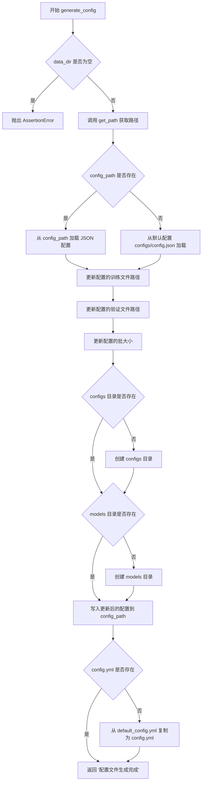
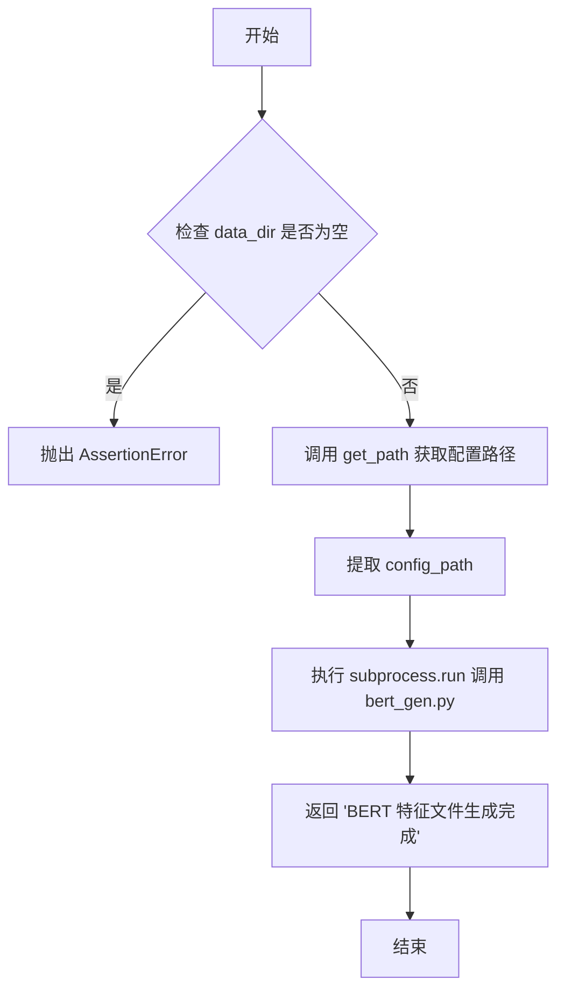

# `Bert-VITS2\webui_preprocess.py` 详细设计文档

这是一个基于 Gradio 的 Web UI 应用，用于 Bert-VITS2 语音合成模型的数据预处理流程管理。通过图形化界面，用户可以一键执行数据配置文件生成、音频重采样、文本标签预处理和 BERT 特征生成等步骤，简化了模型训练前的数据准备工作。

## 整体流程



## 类结构

```
无自定义类 (纯函数模块)
└── Gradio UI 组件层级
    ├── gr.Blocks (根容器)
    │   ├── gr.Row
    │   │   └── gr.Column
    │   │       ├── gr.Markdown (说明文档)
    │   │       ├── gr.Textbox (数据集名称输入)
    │   │       ├── gr.Textbox (状态信息显示)
    │   │       ├── gr.Slider (批大小选择)
    │   │       └── gr.Button (执行按钮组)
```

## 全局变量及字段


### `gr`
    
Gradio库，用于构建Web界面

类型：`module`
    


### `webbrowser`
    
用于自动打开浏览器

类型：`module`
    


### `os`
    
操作系统接口模块

类型：`module`
    


### `json`
    
JSON处理模块

类型：`module`
    


### `subprocess`
    
子进程管理模块

类型：`module`
    


### `shutil`
    
文件和目录操作模块

类型：`module`
    


### `get_path`
    
根据数据集名称获取各文件路径

类型：`function`
    


### `generate_config`
    
生成训练配置文件并设置批次大小

类型：`function`
    


### `resample`
    
调用外部脚本对音频文件进行重采样预处理

类型：`function`
    


### `preprocess_text`
    
预处理标签文件并调用文本处理脚本

类型：`function`
    


### `bert_gen`
    
调用BERT特征生成脚本

类型：`function`
    


### `app`
    
Gradio主应用容器

类型：`gr.Blocks`
    


### `data_dir`
    
数据集名称输入框

类型：`gr.Textbox`
    


### `info`
    
状态信息显示框

类型：`gr.Textbox`
    


### `batch_size`
    
训练批次大小调节滑块

类型：`gr.Slider`
    


### `generate_config_btn`
    
生成配置文件按钮

类型：`gr.Button`
    


### `resample_btn`
    
音频预处理按钮

类型：`gr.Button`
    


### `preprocess_text_btn`
    
文本预处理按钮

类型：`gr.Button`
    


### `bert_gen_btn`
    
BERT特征生成按钮

类型：`gr.Button`
    


    

## 全局函数及方法


### `get_path`

该函数用于构建数据集处理所需的各种文件路径，根据传入的数据集目录名称，生成配置、标签、训练集、验证集和配置文件等关键路径。

参数：

- `data_dir`：`str`，数据集目录名称，即放置在 `./data` 文件夹下的数据集文件夹名称

返回值：`tuple[str, str, str, str, str]`，返回包含以下五个路径的元组：
- `start_path`：数据集根目录路径
- `lbl_path`：标签文件（esd.list）路径
- `train_path`：训练集列表文件路径
- `val_path`：验证集列表文件路径
- `config_path`：配置文件（config.json）路径

#### 流程图

```mermaid
flowchart TD
    A[开始 get_path] --> B[输入: data_dir]
    B --> C[构建 start_path<br/>os.path.join('./data', data_dir)]
    C --> D[构建 lbl_path<br/>os.path.join(start_path, 'esd.list')]
    D --> E[构建 train_path<br/>os.path.join(start_path, 'train.list')]
    E --> F[构建 val_path<br/>os.path.join(start_path, 'val.list')]
    F --> G[构建 config_path<br/>os.path.join(start_path, 'configs', 'config.json')]
    G --> H[返回元组<br/>(start_path, lbl_path, train_path, val_path, config_path)]
    H --> I[结束]
```

#### 带注释源码

```python
def get_path(data_dir):
    """
    构建数据集处理所需的各种文件路径
    
    参数:
        data_dir: 数据集目录名称
    
    返回:
        包含5个路径的元组: (start_path, lbl_path, train_path, val_path, config_path)
    """
    # 拼接数据集根目录路径: ./data/{data_dir}
    start_path = os.path.join("./data", data_dir)
    
    # 拼接标签文件路径: ./data/{data_dir}/esd.list
    lbl_path = os.path.join(start_path, "esd.list")
    
    # 拼接训练集列表文件路径: ./data/{data_dir}/train.list
    train_path = os.path.join(start_path, "train.list")
    
    # 拼接验证集列表文件路径: ./data/{data_dir}/val.list
    val_path = os.path.join(start_path, "val.list")
    
    # 拼接配置文件路径: ./data/{data_dir}/configs/config.json
    config_path = os.path.join(start_path, "configs", "config.json")
    
    # 返回所有构建的路径
    return start_path, lbl_path, train_path, val_path, config_path
```


### `generate_config`

该函数根据提供的数据集名称和批大小，生成并更新训练配置文件。它首先获取数据目录的各个文件路径，然后加载或复制基础配置，修改其中的训练文件路径、验证文件路径和批大小参数，最后确保必要的输出目录存在，并将更新后的配置写入文件。

参数：

- `data_dir`：`str`，数据集目录名称，即放置在 `data` 文件夹下的数据集所在文件夹的名称
- `batch_size`：`int`，训练时的批大小（Batch size），用于配置训练参数

返回值：`str`，返回 "配置文件生成完成" 表示配置已成功生成

#### 流程图



#### 带注释源码

```python
def generate_config(data_dir, batch_size):
    """
    生成训练配置文件
    
    参数:
        data_dir: str, 数据集目录名称
        batch_size: int, 训练批大小
    
    返回:
        str: 配置文件生成完成
    """
    # 断言验证：确保数据集名称不为空
    assert data_dir != "", "数据集名称不能为空"
    
    # 获取数据目录的各个文件路径
    # start_path: 数据集根目录
    # _: lbl_path，标签文件路径（本函数未使用）
    # train_path: 训练列表文件路径
    # val_path: 验证列表文件路径
    # config_path: 配置文件路径
    start_path, _, train_path, val_path, config_path = get_path(data_dir)
    
    # 判断配置文件是否已存在于数据目录中
    if os.path.isfile(config_path):
        # 存在则从数据目录加载配置
        config = json.load(open(config_path, "r", encoding="utf-8"))
    else:
        # 不存在则从默认配置加载
        config = json.load(open("configs/config.json", "r", encoding="utf-8"))
    
    # 更新配置中的训练文件路径
    config["data"]["training_files"] = train_path
    # 更新配置中的验证文件路径
    config["data"]["validation_files"] = val_path
    # 更新配置中的批大小
    config["train"]["batch_size"] = batch_size
    
    # 构建配置输出目录路径
    out_path = os.path.join(start_path, "configs")
    # 如果配置目录不存在，则创建
    if not os.path.isdir(out_path):
        os.mkdir(out_path)
    
    # 构建模型输出目录路径
    model_path = os.path.join(start_path, "models")
    # 如果模型目录不存在，则创建
    if not os.path.isdir(model_path):
        os.mkdir(model_path)
    
    # 将更新后的配置写入配置文件
    with open(config_path, "w", encoding="utf-8") as f:
        json.dump(config, f, indent=4)
    
    # 如果项目根目录下的 config.yml 不存在
    if not os.path.exists("config.yml"):
        # 从默认配置模板复制
        shutil.copy(src="default_config.yml", dst="config.yml")
    
    # 返回完成信息
    return "配置文件生成完成"
```


### `resample`

该函数用于对原始音频文件进行重采样处理，将音频转换为指定的采样率（44.1kHz），并将处理后的文件保存到目标目录。它通过调用外部脚本 `resample_legacy.py` 来完成实际的音频处理工作。

参数：

- `data_dir`：`str`，数据集目录名称，用于定位数据集的路径

返回值：`str`，返回"音频文件预处理完成"表示音频重采样处理已成功完成

#### 流程图

```mermaid
flowchart TD
    A[开始 resample] --> B{验证 data_dir 是否为空}
    B -->|是| C[抛出 AssertionError]
    B -->|否| D[调用 get_path 获取路径]
    D --> E[构建 raw 输入目录路径]
    E --> F[构建 wavs 输出目录路径]
    F --> G[执行 subprocess.run 调用 resample_legacy.py]
    G --> H[设置采样率 --sr 44100]
    H --> I[设置输入目录 --in_dir {raw}]
    I --> J[设置输出目录 --out_dir {wavs}]
    J --> K[返回 "音频文件预处理完成"]
```

#### 带注释源码

```python
def resample(data_dir):
    """
    对原始音频文件进行重采样处理
    
    参数:
        data_dir (str): 数据集目录名称，存储在 data 文件夹下的子文件夹名称
    
    返回:
        str: 音频文件预处理完成的提示信息
    """
    # 断言验证：确保数据集名称不为空
    assert data_dir != "", "数据集名称不能为空"
    
    # 获取数据集的起始路径和配置文件路径
    # start_path: 数据集的根目录 (./data/{data_dir})
    # config_path: 配置文件路径
    start_path, _, _, _, config_path = get_path(data_dir)
    
    # 构建输入输出路径
    # in_dir: 原始音频文件所在目录 (./data/{data_dir}/raw)
    in_dir = os.path.join(start_path, "raw")
    # out_dir: 重采样后音频文件输出目录 (./data/{data_dir}/wavs)
    out_dir = os.path.join(start_path, "wavs")
    
    # 使用 subprocess 调用外部 Python 脚本进行音频重采样
    # 采样率设置为 44100 Hz (CD 音质)
    subprocess.run(
        [
            "python",                    # 解释器
            "resample_legacy.py",        # 重采样脚本
            "--sr",                      # 采样率参数
            "44100",                     # 目标采样率 44.1kHz
            "--in_dir",                  # 输入目录参数
            f"{in_dir}",                 # 原始音频目录路径
            "--out_dir",                 # 输出目录参数
            f"{out_dir}",                # 重采样后音频输出目录
        ]
    )
    
    # 返回处理完成提示信息
    return "音频文件预处理完成"
```


### `preprocess_text`

该函数负责预处理文本标签文件，首先读取数据集的标签列表（esd.list），将音频路径转换为绝对路径格式，然后调用外部 Python 脚本进行进一步的文本预处理，最终生成训练集和验证集列表文件。

参数：

- `data_dir`：`str`，数据集名称，即放置在 `data` 文件夹下的数据集文件夹名称，不能为空

返回值：`str`，返回预处理完成的状态信息 "标签文件预处理完成"

#### 流程图

```mermaid
flowchart TD
    A[开始 preprocess_text] --> B{验证 data_dir 非空}
    B -->|是| C[调用 get_path 获取路径]
    B -->|否| D[抛出 AssertionError]
    C --> E[读取 lbl_path 标签文件]
    E --> F[逐行处理标签内容]
    F --> G[解析每行: path|spk|language|text]
    G --> H[转换 path 为绝对路径]
    H --> I[替换反斜杠为正斜杠]
    I --> J[写入更新后的标签行]
    J --> K{是否处理完所有行?}
    K -->|否| F
    K -->|是| L[调用 subprocess.run 执行 preprocess_text.py]
    L --> M[返回 '标签文件预处理完成']
    M --> N[结束]
```

#### 带注释源码

```python
def preprocess_text(data_dir):
    """预处理文本标签文件，转换路径格式并调用外部预处理脚本
    
    Args:
        data_dir: 数据集名称字符串，不能为空
        
    Returns:
        str: 预处理完成的状态信息
    """
    # 断言验证：确保数据集名称不为空
    assert data_dir != "", "数据集名称不能为空"
    
    # 获取数据相关的路径信息
    # start_path: 数据集根目录
    # lbl_path: 标签文件路径 (esd.list)
    # train_path: 训练集列表文件路径
    # val_path: 验证集列表文件路径
    # config_path: 配置文件路径
    start_path, lbl_path, train_path, val_path, config_path = get_path(data_dir)
    
    # 读取标签文件的所有行
    lines = open(lbl_path, "r", encoding="utf-8").readlines()
    
    # 重新打开标签文件进行写入操作
    with open(lbl_path, "w", encoding="utf-8") as f:
        # 遍历每一行标签数据
        for line in lines:
            # 使用 | 分割每行，获取 path, spk, language, text 四个字段
            path, spk, language, text = line.strip().split("|")
            
            # 构造新的音频文件绝对路径：
            # 1. os.path.join(start_path, "wavs", os.path.basename(path))
            #    将相对路径转换为 data/{data_dir}/wavs/{filename}.wav 格式
            # 2. replace("\\", "/") 将 Windows 反斜杠替换为正斜杠
            path = os.path.join(start_path, "wavs", os.path.basename(path)).replace(
                "\\", "/"
            )
            
            # 写入更新后的标签行，保持原有格式
            f.writelines(f"{path}|{spk}|{language}|{text}\n")
    
    # 调用外部 Python 脚本进行进一步的文本预处理
    # 该脚本会根据配置生成训练集和验证集列表
    subprocess.run(
        [
            "python",
            "preprocess_text.py",
            "--transcription-path",
            f"{lbl_path}",       # 标签文件路径
            "--train-path",
            f"{train_path}",     # 训练集输出路径
            "--val-path",
            f"{val_path}",       # 验证集输出路径
            "--config-path",
            f"{config_path}",    # 配置文件路径
        ]
    )
    
    # 返回处理完成的状态信息
    return "标签文件预处理完成"
```


### `bert_gen`

该函数是数据预处理流程的第四步，用于调用外部脚本生成 BERT 特征文件。它接收数据集名称作为参数，通过获取配置文件路径并执行 `bert_gen.py` 脚本来生成 BERT 特征，为后续模型训练提供必要的特征输入。

参数：

- `data_dir`：`str`，数据集目录名称，即放置在 `data` 文件夹下的数据集所在文件夹的名称

返回值：`str`，返回操作完成的提示信息 "BERT 特征文件生成完成"

#### 流程图



#### 带注释源码

```python
def bert_gen(data_dir):
    """
    生成 BERT 特征文件
    
    该函数是数据预处理流程的第四步，用于调用外部脚本生成 BERT 特征文件。
    BERT 特征是 Bert-VITS2 语音合成模型的重要输入特征之一。
    
    参数:
        data_dir (str): 数据集目录名称，必须不为空
        
    返回:
        str: 操作完成的提示信息
    """
    # 断言检查：确保数据集名称不为空，避免后续操作失败
    assert data_dir != "", "数据集名称不能为空"
    
    # 调用 get_path 函数获取配置文件路径
    # 返回值中忽略前四个元素（start_path, lbl_path, train_path, val_path）
    # 只获取第五个元素 config_path
    _, _, _, _, config_path = get_path(data_dir)
    
    # 使用 subprocess 执行外部 Python 脚本生成 BERT 特征
    # bert_gen.py 脚本读取配置文件并生成对应的 BERT 特征文件
    subprocess.run(["python", "bert_gen.py", "--config", f"{config_path}"])
    
    # 返回操作完成的提示信息，供 UI 显示
    return "BERT 特征文件生成完成"
```

## 关键组件


### 路径管理模块 (get_path 函数)

构建数据集各文件的完整路径，包括数据根目录、标签文件路径、训练集路径、验证集路径和配置文件路径，返回五个路径字符串供其他函数使用。

### 配置生成模块 (generate_config 函数)

加载或创建JSON配置文件，更新训练/验证文件路径和批大小参数，创建必要的模型输出目录，复制默认配置文件，并返回操作完成状态信息。

### 音频重采样模块 (resample 函数)

调用外部脚本 resample_legacy.py 将原始音频文件重采样至 44100Hz，支持批量处理输入输出目录中的 WAV 文件，返回预处理完成状态。

### 文本预处理模块 (preprocess_text 函数)

解析 esd.list 标签文件，修正其中的路径分隔符为 Unix 风格，调用外部脚本 preprocess_text.py 生成训练和验证列表文件，返回预处理完成状态。

### BERT 特征生成模块 (bert_gen 函数)

调用外部脚本 bert_gen.py 基于配置文件生成 BERT 文本嵌入特征，用于后续模型训练，返回特征生成完成状态。

### Gradio Web UI 界面

提供交互式网页界面，包含数据集名称文本输入、批大小滑块组件、四个执行按钮（生成配置/音频预处理/文本预处理/BERT特征），以及实时状态信息显示区域。

### 事件绑定与回调系统

通过 Gradio 的 click 方法绑定四个按钮与对应处理函数，建立用户交互到后端处理函数的触发链路，实现流程化数据预处理。

### 子进程调用封装

使用 subprocess.run 同步执行外部 Python 脚本进行实际的数据处理工作，实现主应用与预处理脚本的进程隔离。


## 问题及建议


### 已知问题

- **subprocess调用无错误处理**：`subprocess.run`调用外部脚本时未检查返回码，脚本执行失败时界面仍显示成功，无错误反馈机制
- **文件操作缺乏异常捕获**：所有文件读写操作（`json.load`、`open`等）均未使用`try-except`包裹，文件不存在或格式错误时程序会直接崩溃
- **资源未显式释放**：`json.load(open(...))`未使用上下文管理器，文件句柄依赖Python垃圾回收机制自动释放
- **硬编码配置值**：采样率44100在`resample`函数中硬编码，缺乏灵活性；default_config.yml等文件名也是硬编码
- **路径处理不一致**：虽然`preprocess_text`中对反斜杠做了替换，但其他函数可能存在跨平台路径兼容性问题
- **重复代码逻辑**：`get_path`函数在多个地方被重复调用，部分函数解包了不需要的返回值
- **无类型注解**：所有函数参数和返回值均无类型提示，降低了代码可读性和可维护性
- **UI交互反馈缺失**：按钮点击后无loading状态，无法获知任务是否正在进行或已卡死

### 优化建议

- 为所有`subprocess.run`调用添加`check=True`或手动检查返回码，并通过`info`组件向用户展示错误信息
- 使用`try-except`包裹文件操作和外部脚本调用，捕获并处理`FileNotFoundError`、`json.JSONDecodeError`等异常
- 统一使用上下文管理器（`with open(...) as f`）处理文件操作
- 将硬编码值（如采样率、端口号）提取为配置文件或函数默认参数
- 考虑添加`gr.Loading`组件或在点击时更新UI状态，提供更好的用户体验
- 为关键函数添加类型注解和文档字符串，提升代码可读性
- 可将`get_path`返回的路径封装为命名元组或数据类，避免解包混淆

## 其它


### 设计目标与约束

本项目旨在为BERT-VITS2语音合成模型提供可视化的数据预处理Web界面，降低用户操作门槛。设计目标包括：(1) 简化预处理流程，将配置生成、音频重采样、文本预处理、BERT特征生成四个步骤通过统一界面操作；(2) 提供交互式反馈，通过状态信息框显示每步执行结果；(3) 遵循BERT-VITS2项目的数据规范，确保预处理结果可直接用于后续训练和部署。约束条件包括：用户需预先下载并放置BERT和WavLM模型到指定目录；数据必须按照规定目录结构组织（data/{数据集名}/raw/、esd.list等）；依赖外部Python脚本（resample_legacy.py、preprocess_text.py、bert_gen.py）执行实际处理逻辑；当前仅支持单数据集顺序处理，暂不支持多任务并行。

### 错误处理与异常设计

代码中的错误处理主要依赖以下机制：(1) **输入验证**：使用assert语句检查data_dir参数非空，若为空则抛出AssertionError并提示“数据集名称不能为空”，该检查存在于generate_config、resample、preprocess_text、bert_gen四个函数中；(2) **文件读取异常**：generate_config函数中使用json.load读取配置文件时未做异常捕获，若文件格式错误或不存在可能导致程序中断；(3) **子进程异常**：subprocess.run调用外部脚本（resample_legacy.py、preprocess_text.py、bert_gen.py）时未检查返回码，若脚本执行失败（例如缺少依赖、脚本不存在），UI仅显示“完成”状态信息但实际可能处理失败；(4) **目录创建**：使用os.mkdir创建目录时未检查父目录是否存在或权限问题。改进建议：添加try-except捕获文件IO异常和子进程返回码检查，向UI返回更详细的错误信息而非仅显示成功提示；考虑添加日志记录功能，记录每步执行的详细状态。

### 数据流与状态机

整体数据处理流程遵循线性状态机模式，状态流转如下：(1) **初始状态**：UI加载完成，等待用户输入数据集名称和批大小；(2) **配置生成状态**：用户点击“执行”按钮后，generate_config函数被调用，读取或复制基础配置，修改训练/验证文件路径和批大小，生成config.json到数据目录；(3) **音频重采样状态**：resample函数被调用，通过subprocess调用resample_legacy.py脚本，将raw目录下的音频文件重采样为44100Hz并输出到wavs目录；(4) **文本预处理状态**：preprocess_text函数被调用，首先修改esd.list中的音频路径为绝对路径，然后调用preprocess_text.py脚本生成train.list和val.list；(5) **BERT特征生成状态**：bert_gen函数被调用，调用bert_gen.py脚本根据config.json配置生成BERT特征文件。各状态之间为串行依赖关系，用户需按顺序执行，当前不支持跳过某一步或回退重做。

### 外部依赖与接口契约

本项目与多个外部组件存在依赖关系：(1) **Gradio框架**：版本未指定，需pip install gradio安装，用于构建Web UI；(2) **外部Python脚本**：resample_legacy.py（音频重采样）、preprocess_text.py（文本预处理生成训练列表）、bert_gen.py（BERT特征生成），这些脚本接受特定命令行参数，假设存在于项目根目录；(3) **配置文件**：default_config.yml作为基础配置模板、configs/config.json作为数据集配置，均需存在于指定路径；(4) **模型文件**：中文RoBERTa、日文DeBERTa、英文DeBERTa需放置在bert目录下，WavLM需放置在slm目录下；(5) **数据目录结构**：输入数据必须遵循data/{数据集名}/raw/{音频文件}.wav和data/{数据集名}/esd.list的格式，esd.list每行格式为“{音频文件名}|{说话人}|{语言ID}|{文本内容}”。接口契约要求：各外部脚本需返回0表示成功，非0表示失败；config.json需包含data.training_files、data.validation_files、train.batch_size等配置项；数据集目录下需有configs和models子目录供脚本写入。

### 部署与运行环境要求

运行环境要求包括：(1) **Python版本**：建议Python 3.8+；(2) **系统依赖**：需安装ffmpeg用于音频处理（resample_legacy.py可能依赖）；(3) **显存要求**：batch_size参数默认值8，最大支持64，对应24GB显存建议使用12；(4) **网络访问**：首次启动时自动打开浏览器访问http://127.0.0.1:7860，需确保本机端口7860未被占用；(5) **文件权限**：需对data/{数据集名}/configs和data/{数据集名}/models目录有写权限。部署方式为直接运行Python脚本，启动后自动打开浏览器访问Web界面，share=False表示仅本地访问，如需远程访问可设置share=True或配置反向代理。服务启动参数server_port=7860指定监听端口。

### 安全考虑与输入校验

当前代码存在以下安全考量：(1) **路径遍历风险**：data_dir参数直接拼接到路径中，未做路径规范化和校验，恶意输入可能导致路径穿越（如“../../”）；(2) **命令注入风险**：subprocess.run使用列表形式传参避免了shell注入，但外部脚本可能存在漏洞；(3) **文件覆盖风险**：generate_config直接覆盖config.json，preprocess_text直接修改esd.list，未做备份或确认机制；(4) **资源耗尽风险**：batch_size最大值为64，若数据量巨大可能导致内存溢出或处理超时。改进建议：对data_dir进行路径规范化和安全校验；添加确认对话框避免误操作；考虑添加处理进度条和超时机制。

### 可测试性与扩展性

代码的可测试性分析：(1) **单元测试**：各处理函数（generate_config、resample、preprocess_text、bert_gen）具有明确的输入输出，可编写单元测试验证逻辑，但当前未提供测试用例；(2) **集成测试**：可模拟完整流程验证各步骤顺序执行和状态传递；(3) **UI测试**：Gradio提供测试接口可模拟用户交互。扩展性分析：(1) **新增预处理步骤**：需在UI中添加新的Button和对应处理函数，遵循现有模式；(2) **多语言支持**：当前UI文本为中文，可扩展为多语言；(3) **配置参数扩展**：可在generate_config中增加更多可配置项；(4) **并行处理**：可改造为异步任务队列，支持多数据集并行处理。当前架构耦合度较低，主要逻辑在独立函数中，便于扩展。

    