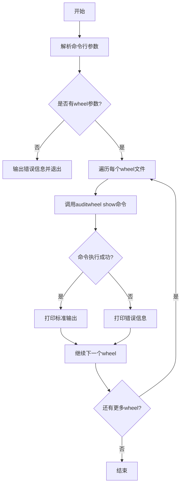
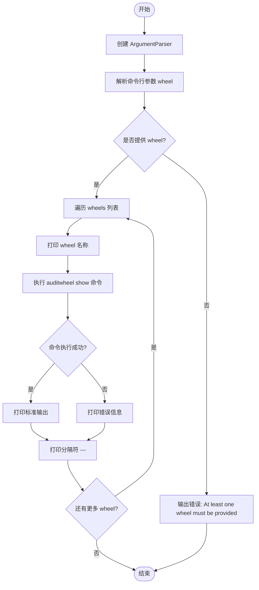

# `bitsandbytes\.github\scripts\auditwheel_show.py` 详细设计文档

这是一个命令行工具脚本，用于批量检查Python wheel包的外部依赖ABI兼容性，通过调用auditwheel工具对每个提供的wheel文件执行show命令，并打印其依赖信息和可能的错误。

## 整体流程



## 类结构

```
（本代码无类定义，仅包含全局函数）
```

## 全局变量及字段


### `ap`
    
命令行参数解析器对象，用于定义和解析命令行参数

类型：`ArgumentParser`
    


### `args`
    
解析后的命令行参数，包含wheels列表

类型：`Namespace`
    


### `whl`
    
当前正在处理的wheel文件名

类型：`str`
    


### `audit_wheel_output`
    
auditwheel命令的执行结果对象，包含stdout和stderr

类型：`CompletedProcess`
    


    

## 全局函数及方法


### `main`

该脚本是审计车轮（wheel）打包工具的命令行前端，通过接收一个或多个 wheel 文件路径，依次调用 `auditwheel show` 命令来检查并展示每个 wheel 的外部依赖（shared libraries）信息，最后将结果格式化输出。

参数：
- 无参数（不接受任何函数参数，使用 `argparse` 解析命令行参数）

返回值：`None`，无返回值（该函数直接打印结果到标准输出）

#### 流程图



#### 带注释源码

```python
import argparse
import subprocess


def main():
    """
    主函数：解析命令行参数，循环调用 auditwheel 并打印结果
    """
    # 创建命令行参数解析器
    ap = argparse.ArgumentParser()
    
    # 添加 wheels 参数：接受零个或多个 wheel 文件路径
    ap.add_argument("wheels", nargs="*")
    
    # 解析命令行参数
    args = ap.parse_args()
    
    # 检查是否提供了至少一个 wheel 文件
    if not args.wheels:
        # 如果没有提供，输出错误信息并退出
        ap.error("At least one wheel must be provided.")
    
    # 遍历每一个提供的 wheel 文件
    for whl in args.wheels:
        # 打印 wheel 文件名称（使用 Markdown 格式）
        print(f"### `{whl}`")

        # 调用 auditwheel show 命令，获取输出
        audit_wheel_output = subprocess.run(
            ["auditwheel", "show", whl],  # 命令行命令及参数
            capture_output=True,          # 捕获标准输出和标准错误
            text=True,                    # 返回字符串而非字节
            errors="backslashreplace",    # 处理编码错误
        )

        # 如果有标准输出，打印它
        if audit_wheel_output.stdout:
            print(audit_wheel_output.stdout)

        # 如果有标准错误，打印错误信息（使用 Markdown 格式）
        if audit_wheel_output.stderr:
            print(f"**Error:**\n```\n{audit_wheel_output.stderr}\n```")

        # 打印分隔符
        print("---")


if __name__ == "__main__":
    main()
```

## 关键组件


### 命令行参数解析

使用 argparse 解析用户输入的 wheel 文件路径，支持接收一个或多个参数，并通过错误处理确保至少提供一个 wheel 文件。

### 子进程执行

通过 subprocess.run 调用 auditwheel 工具检查每个 wheel 文件的依赖和兼容性信息，捕获标准输出和标准错误流。

### 错误处理机制

对未提供 wheel 参数的情况进行错误提示，同时处理 auditwheel 命令执行过程中可能出现的异常错误。

### 输出格式化

将 auditwheel 的输出结果格式化为 Markdown 文档样式，包括 wheel 文件名、审计信息和错误提示的展示。

## 问题及建议


### 已知问题

-   **缺少对 auditwheel 命令的可用性检查**：代码直接运行 auditwheel 命令，但没有验证该命令是否已安装或是否在 PATH 中，可能导致模糊的错误信息。
-   **未处理 auditwheel 命令的执行失败**：代码仅打印 stdout 和 stderr，没有检查返回码。如果 auditwheel 命令失败（如文件不存在或权限问题），代码仍继续处理后续文件，可能忽略错误。
-   **缺乏对输入文件的有效性验证**：只检查了是否提供了 wheel 文件路径，但没有验证文件是否存在、是否为有效的 wheel 文件或路径是否可读。
-   **顺序处理效率低下**：代码顺序遍历并处理每个 wheel 文件，当文件数量较多时性能较差，缺乏并发处理能力。
-   **错误处理不一致**：缺少 wheel 参数时使用 `ap.error()`，但其他错误（如 auditwheel 失败）仅打印到 stdout，没有使用相同的错误处理机制。
-   **输出格式缺乏结构化**：直接打印原始输出，没有解析或结构化，不便于后续集成或自动化处理。
-   **代码内聚度过高**：所有逻辑集中在 main 函数中，包括参数解析、命令执行和输出打印，降低了可读性和可维护性。
-   **缺少日志记录**：没有使用日志框架，难以追踪执行过程或调试问题。

### 优化建议

-   **添加 auditwheel 命令检查**：在运行前检查 auditwheel 是否可用，例如通过 `subprocess.run(["auditwheel", "--version"], ...)` 验证，不存在时给出明确提示。
-   **增加返回码检查**：检查 `audit_wheel_output.returncode`，如果非零，根据情况决定是终止还是继续，并记录错误。
-   **验证输入文件**：在处理前检查文件是否存在、是否为 .whl 文件、是否有读取权限，必要时跳过或报错。
-   **考虑并发处理**：使用 `concurrent.futures` 或 `multiprocessing` 并行处理 wheel 文件，提升性能。
-   **统一错误处理**：对所有错误情况使用一致的处理方式，例如抛出异常或记录日志，而不是仅打印。
-   **结构化输出**：将输出解析为结构化格式（如 JSON），或提供选项控制输出格式，便于其他工具解析。
-   **重构代码**：将 main 函数拆分为更小的函数，例如 `validate_args()`、`run_auditwheel(whl)`、`print_output()`，提高可维护性。
-   **引入日志记录**：使用 Python 的 `logging` 模块，记录处理过程、警告和错误，替代或增强 print 输出。

## 其它


### 设计目标与约束

该工具的主要设计目标是提供一个命令行界面，用于批量检查Python wheel包的外部依赖情况，通过调用auditwheel工具获取并展示每个wheel的依赖信息。设计约束包括：必须提供至少一个wheel文件路径作为参数；依赖auditwheel工具在系统PATH中可用；输出格式为Markdown以便集成到文档系统中。

### 错误处理与异常设计

代码采用了显式的错误处理策略。对于命令行参数缺失错误，使用argparse内置的error机制抛出错误并显示用法信息。对于subprocess执行错误，通过检查stderr内容并以Markdown代码块形式打印错误信息。代码未对auditwheel工具不存在或执行超时进行处理，这是潜在的改进点。subprocess.run使用errors="backslashreplace"处理编码问题，避免UnicodeDecodeError。

### 数据流与状态机

该脚本的数据流较为简单：命令行参数输入 → 参数解析验证 → 遍历wheel列表 → 对每个wheel执行auditwheel命令 → 捕获并格式化输出 → 打印结果。没有复杂的状态机设计，属于线性流程。唯一的状态是命令行参数解析后的args对象和循环迭代状态。

### 外部依赖与接口契约

主要外部依赖包括：Python标准库中的argparse模块用于命令行解析，subprocess模块用于执行外部命令，auditwheel工具作为外部CLI程序依赖。接口契约方面：输入为文件路径形式的命令行参数，输出为格式化文本（Markdown格式），auditwheel命令需在系统环境中可用且支持"show"子命令。

### 性能考虑

当前实现对每个wheel串行执行auditwheel命令，对于大量wheel文件可能存在性能瓶颈。可考虑使用multiprocessing或concurrent.futures实现并行执行。subprocess.run默认等待命令完成，属于同步阻塞调用。内存占用方面，代码使用capture_output=True避免管道缓冲区阻塞，但输出内容会一次性加载到内存。

### 安全性考虑

代码直接使用用户提供的文件路径参数传递给subprocess，存在命令注入风险（虽然auditwheel的show子命令接收文件路径参数而非shell命令）。建议在生产环境中对whl参数进行路径验证，确保文件存在且为有效的wheel文件。subprocess使用列表形式传参避免shell=True带来的安全问题。

### 兼容性考虑

代码依赖Python 3标准库，理论上支持Python 3.2+版本。auditwheel工具主要在Linux环境使用，Windows环境下auditwheel不可用。输出格式使用Unicode编码，通过backslashreplace处理特殊字符，具有较好的跨平台兼容性。

### 使用示例

基本用法：python script.py package.whl
多个wheel：python script.py package1.whl package2.whl
通配符使用：python script.py *.whl（在shell中展开）

    