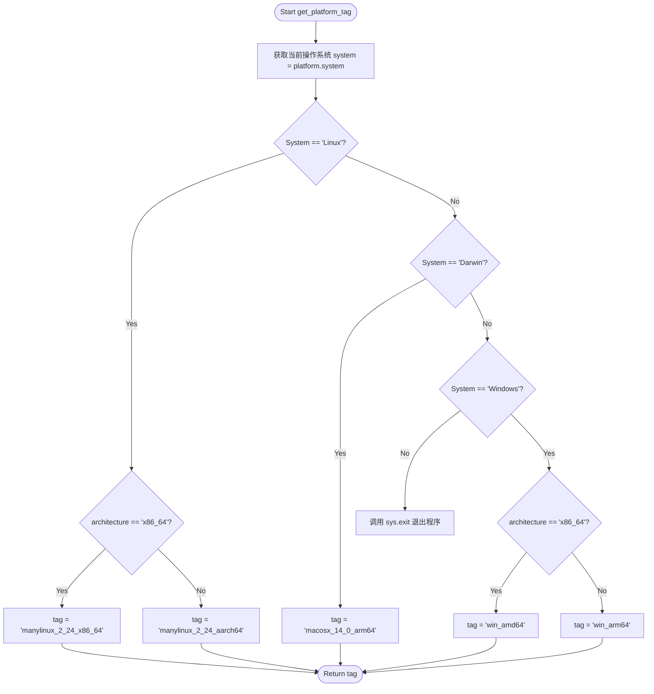
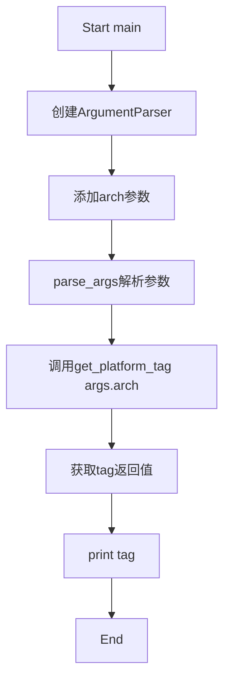

# `bitsandbytes\.github\scripts\set_platform_tag.py` 详细设计文档

一个命令行工具，用于根据传入的系统架构参数和当前运行的操作系统（Linux/Darwin/Windows），动态生成特定平台的Python wheel安装标签（tag），以便在CI/CD流程中确定正确的构建目标。

## 整体流程

```mermaid
graph TD
    A[开始] --> B[解析命令行参数]
    B --> C[args = parser.parse_args()]
    C --> D[tag = get_platform_tag(args.arch)]
    D --> E{platform.system()}
    E -- Linux --> F{architecture == x86_64?}
    E -- Darwin --> G[tag = macosx_14_0_arm64]
    E -- Windows --> H{architecture == x86_64?}
    F -- 是 --> I[tag = manylinux_2_24_x86_64]
    F -- 否 --> J[tag = manylinux_2_24_aarch64]
    H -- 是 --> K[tag = win_amd64]
    H -- 否 --> L[tag = win_arm64]
    I --> M[print(tag)]
    J --> M
    G --> M
    K --> M
    L --> M
    M --> N[结束]
```

## 类结构

```
无类层次结构（扁平结构）
```

## 全局变量及字段


### `system`
    
操作系统名称（Linux/Darwin/Windows）

类型：`str`
    


### `tag`
    
生成的平台标签字符串

类型：`str`
    


### `args`
    
解析后的命令行参数对象

类型：`Namespace`
    


### `parser`
    
命令行参数解析器

类型：`ArgumentParser`
    


### `architecture`
    
输入的架构参数（x86_64/aarch64）

类型：`str`
    


    

## 全局函数及方法


### `get_platform_tag`

该函数根据当前操作系统和传入的目标架构参数，返回对应的 Python wheel 包平台标签（platform tag），用于支持多平台包的构建兼容性判断。

参数：
- `architecture`：`str`，目标 CPU 架构（如 "x86_64", "aarch64"）。

返回值：`str`，对应的平台标签字符串（如 "manylinux_2_24_x86_64", "win_amd64"）。

#### 流程图



#### 带注释源码

```python
def get_platform_tag(architecture):
    """
    根据传入的架构和当前系统返回对应的平台标签。
    
    参数:
        architecture (str): 目标架构，例如 'x86_64' 或 'aarch64'。
        
    返回:
        str: 平台标签字符串。
    """
    # 获取当前操作系统名称 (Linux, Darwin, Windows, etc.)
    system = platform.system()

    if system == "Linux":
        # Linux 平台判断：仅区分 x86_64 和 aarch64
        # 注意：此处假设非 x86_64 即为 aarch64，未处理 i686 等其他架构
        tag = "manylinux_2_24_x86_64" if architecture == "x86_64" else "manylinux_2_24_aarch64"
    elif system == "Darwin":
        # Darwin (macOS) 平台判断：目前代码硬编码返回 macosx_14_0_arm64
        # 注意：此处忽略了传入的 architecture 参数，可能导致在 x86_64 Mac 上构建时标签不准确
        tag = "macosx_14_0_arm64"
    elif system == "Windows":
        # Windows 平台判断：区分 amd64 (x86_64) 和 arm64
        # 注意：此处假设非 x86_64 即为 arm64
        tag = "win_amd64" if architecture == "x86_64" else "win_arm64"
    else:
        # 如果是不支持的操作系统，则打印错误信息并退出程序
        sys.exit(f"Unsupported system: {system}")

    return tag
```


### `main()`

入口函数，负责解析命令行参数、调用`get_platform_tag`获取平台标签并打印结果。

参数： 无

返回值： `None`，该函数不返回值，仅通过`print`输出平台标签到标准输出。

#### 流程图



#### 带注释源码

```python
def main():
    # 创建命令行参数解析器，描述信息为"Determine platform tag."
    parser = argparse.ArgumentParser(description="Determine platform tag.")
    
    # 添加位置参数arch，用于接收架构信息（如x86_64, aarch64）
    parser.add_argument("arch", type=str, help="Architecture (e.g., x86_64, aarch64)")
    
    # 解析命令行参数，提取arch值
    args = parser.parse_args()
    
    # 调用get_platform_tag函数，传入架构参数，获取对应的平台标签
    tag = get_platform_tag(args.arch)
    
    # 打印平台标签，该输出会被GitHub Actions工作流捕获
    print(tag)  # This will be captured by the GitHub Actions workflow
```

## 关键组件


### get_platform_tag 函数

根据传入的系统和架构参数，返回对应的多平台标签字符串，用于Python包的wheel兼容性标识。

### main 函数

解析命令行参数（架构类型），调用平台标签获取函数并输出结果，是脚本的入口点。

### 命令行参数解析模块

使用argparse模块实现，帮助文档生成和命令行参数解析，支持传入架构参数（如x86_64、aarch64）。

### 系统平台检测模块

使用platform模块获取当前操作系统信息，用于判断系统类型（Linux/Darwin/Windows）以确定合适的平台标签。


## 问题及建议


### 已知问题

- 架构参数（architecture）未进行有效性验证，用户输入无效值时程序行为不明确
- macOS版本号（14_0）硬编码，无法自动适配不同macOS版本
- manylinux标签使用固定版本号（2_24），与当前PyPA规范可能不一致
- 缺少类型注解（type hints），降低代码可读性和IDE支持
- 错误信息直接调用sys.exit()，不够优雅且难以被调用方捕获
- 函数和main函数缺少文档字符串（docstring）
- 没有使用logging模块，调试信息输出不便
- print输出没有区分标准输出和标准错误
- 代码未考虑跨平台兼容性测试场景（如ARM32架构）

### 优化建议

- 添加架构参数白名单验证，对非法输入给出明确错误提示
- 提取版本号为常量或配置文件，便于维护和更新
- 为所有函数添加类型注解和文档字符串
- 使用logging模块替代print，提高日志可配置性
- 将错误处理改为抛出自定义异常，便于调用方处理
- 考虑支持--list选项列出所有支持的平台组合
- 添加单元测试，覆盖正常路径和异常路径
- 考虑重构为更模块化的结构，将平台映射数据与逻辑分离


## 其它


### 设计目标与约束

本代码的核心设计目标是根据传入的CPU架构参数（x86_64或aarch64），结合当前运行的操作系统，返回对应的平台标签（platform tag），以便在Python包的构建和分发过程中正确标识目标平台。约束条件包括：仅支持Linux、Darwin（macOS）和Windows三种主流操作系统，且架构仅支持x86_64和aarch64/arm64两种现代架构。

### 错误处理与异常设计

代码采用主动退出的错误处理方式。当检测到不支持的操作系统时，调用`sys.exit()`并传入错误消息立即终止程序。在命令行参数解析阶段，`argparse`模块会自动处理无效参数、缺少参数等情况并给出友好提示。程序没有捕获异常，错误信息会直接输出到标准错误流。

### 数据流与状态机

程序的数据流相对简单：用户通过命令行传入架构参数 → `argparse`解析参数 → 传递给`get_platform_tag()`函数 → 函数调用`platform.system()`获取当前系统 → 根据系统和架构的组合查表返回对应标签 → 最终通过`print()`输出到标准输出。状态机可以简化为：输入验证状态 → 平台判断状态 → 标签生成状态 → 输出状态。

### 外部依赖与接口契约

本程序依赖Python标准库，无需第三方依赖。具体依赖包括：`argparse`（命令行参数解析）、`platform`（获取系统信息）、`sys`（系统退出）。接口契约方面：主函数`main()`无返回值，通过print输出结果；`get_platform_tag(architecture)`函数接收字符串类型的架构参数，返回字符串类型的平台标签，调用方需自行处理不支持的系统场景。

### 安全性考虑

代码安全性风险较低，因为不涉及文件操作、网络通信或用户输入的敏感数据处理。命令行参数`arch`的类型被限制为字符串，但未对取值进行严格校验，可能传入无效值（如"armv7"）导致返回不准确的标签。建议添加参数值验证逻辑以增强健壮性。

### 性能考虑

代码性能开销极低，执行路径短且无阻塞操作。`platform.system()`的调用开销可忽略不计，整体时间复杂度为O(1)。内存占用主要来自argparse解析器实例，峰值内存使用低于1MB。

### 测试策略建议

建议为`get_platform_tag()`函数编写单元测试，覆盖所有支持的系统和架构组合（共6种：Linux×2、Darwin×2、Windows×2）。由于`platform.system()`返回真实系统值，测试时可通过mock方式模拟不同系统环境。同时应测试无效架构输入的处理逻辑。

### 部署与集成说明

该脚本设计为独立命令行工具使用，可通过`python script.py x86_64`方式调用。在GitHub Actions工作流中，通过捕获print输出获取平台标签值用于后续构建步骤。无需特殊部署配置，兼容Python 3.6及以上版本。

### 配置管理与扩展性

当前代码将平台标签映射关系硬编码在函数中，若需支持更多系统或架构（如FreeBSD、WebAssembly等），需要修改源代码。建议将映射关系提取为配置文件或常量定义，便于未来扩展。参数验证逻辑也可考虑外部化。

### 版本兼容性

代码仅使用Python标准库，无外部依赖，兼容性良好。建议在代码头部添加Python版本要求注释（如`# Requires: Python 3.6+`），并确保在CI/CD环境中测试不同Python版本的兼容性。

### 日志与监控

当前实现不包含日志功能，所有输出通过print和sys.exit实现。对于集成到CI/CD流水线的场景，建议保持简洁设计；若作为独立工具长期使用，可考虑引入logging模块分级记录执行状态。


    