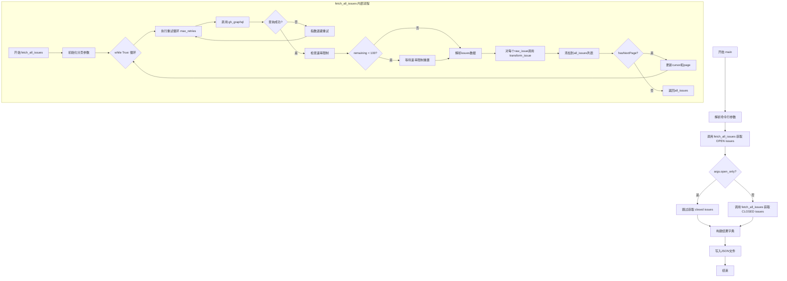
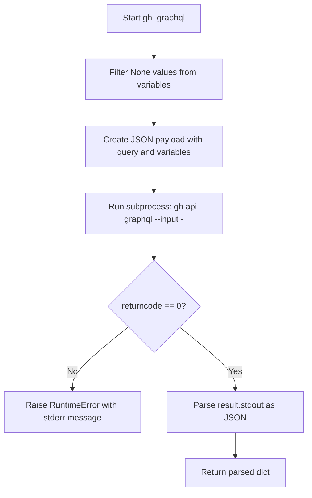
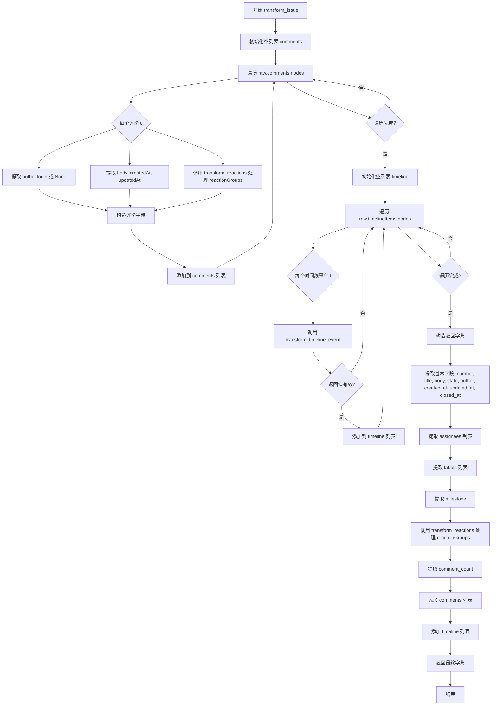
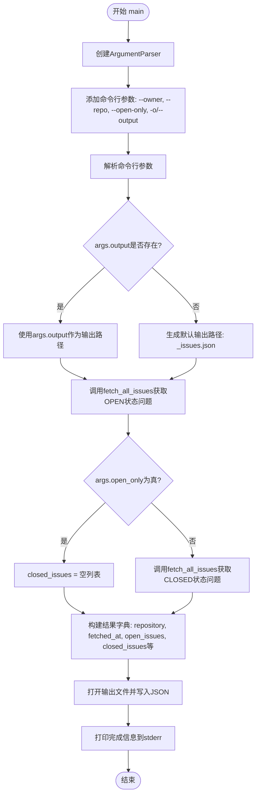

# `bitsandbytes\agents\fetch_issues.py` 详细设计文档

一个通过GitHub GraphQL API抓取仓库所有issues（包含open和closed状态）并存储为结构化JSON的工具，支持分页查询、重试机制和速率限制处理。

## 整体流程



## 类结构

```
无类层次结构 (函数式编程)
└── 全局函数
    ├── gh_graphql (GraphQL执行器)
    ├── transform_reactions (反应转换)
    ├── transform_timeline_event (时间线事件转换)
    ├── transform_issue (Issue转换)
    ├── fetch_all_issues (主抓取逻辑)
    └── main (入口函数)
```

## 全局变量及字段


### `GRAPHQL_QUERY`
    
包含完整GraphQL查询语句的全局变量，用于获取issue详情、评论、时间线等信息

类型：`str`
    


    

## 全局函数及方法


### `gh_graphql`

该函数通过 GitHub CLI (`gh`) 执行 GraphQL 查询，将查询和变量封装为 JSON payload 通过 stdin 传递给 `gh api graphql` 命令，并返回解析后的 JSON 响应。

参数：

- `query`：`str`，GraphQL 查询语句
- `variables`：`dict`，GraphQL 查询所需的变量字典

返回值：`dict`，GraphQL API 返回的 JSON 数据解析后的字典

#### 流程图



#### 带注释源码

```python
def gh_graphql(query: str, variables: dict) -> dict:
    """Execute a GraphQL query via the gh CLI, passing the full payload as JSON on stdin."""
    # 过滤掉 variables 中的 None 值，避免 GraphQL 查询出错
    clean_vars = {k: v for k, v in variables.items() if v is not None}
    # 构建完整的 GraphQL 请求 payload
    payload = json.dumps({"query": query, "variables": clean_vars})
    # 使用 gh CLI 执行 GraphQL 查询，通过 stdin 传递 JSON payload
    result = subprocess.run(
        ["gh", "api", "graphql", "--input", "-"],
        input=payload, capture_output=True, text=True,
    )
    # 检查命令执行是否成功，失败则抛出异常
    if result.returncode != 0:
        raise RuntimeError(f"gh api graphql failed: {result.stderr}")
    # 解析 stdout 中的 JSON 响应并返回
    return json.loads(result.stdout)
```


### `transform_reactions`

将GitHub GraphQL返回的reactionGroups列表转换为扁平字典格式，过滤掉计数为零的reaction，仅保留有用户响应的reaction类型及其对应的用户总数。

参数：

- `reaction_groups`：`list`，GitHub GraphQL查询返回的reactionGroups节点列表，每个节点包含`content`（reaction类型名称）和`users`（包含`totalCount`的用户集合）字段

返回值：`dict`，键为reaction类型（如"THUMBS_UP"、"HEART"等Emoji名称），值为对应的用户总数计数

#### 流程图

```mermaid
flowchart TD
    A[开始: 传入 reaction_groups 列表] --> B{列表是否为空}
    B -->|是| C[返回空字典 {}]
    B -->|否| D[初始化空字典 reactions]
    D --> E[遍历 reaction_groups 中的每个 rg]
    E --> F[获取 rg['users']['totalCount']]
    G{count > 0?}
    F --> G
    G -->|否| E
    G -->|是| H[将 reactions[rg['content']] = count 添加到字典]
    H --> E
    E --> I{遍历完成?}
    I -->|否| E
    I -->|是| J[返回 reactions 字典]
    C --> J
```

#### 带注释源码

```python
def transform_reactions(reaction_groups: list) -> dict:
    """
    将 reactionGroups 列表转换为扁平字典，过滤掉计数为零的reaction。
    
    此函数用于处理GitHub GraphQL返回的reaction数据，将其规范化为
    更易于使用的键值对格式，其中键是reaction类型，值是用户总数。
    
    参数:
        reaction_groups: GitHub GraphQL返回的reactionGroups节点列表
                        每个节点结构: {'content': str, 'users': {'totalCount': int}}
    
    返回:
        包含所有非零计数reaction的字典，格式: {'THUMBS_UP': 5, 'HEART': 2, ...}
    """
    # 初始化结果字典
    reactions = {}
    
    # 遍历每一个reaction group
    for rg in reaction_groups:
        # 从当前reaction group中提取用户总数
        count = rg["users"]["totalCount"]
        
        # 仅添加计数大于零的reaction（过滤掉无人响应的reaction）
        if count > 0:
            # 键为reaction内容（如THUMBS_UP），值为用户计数
            reactions[rg["content"]] = count
    
    # 返回构建好的扁平字典
    return reactions
```


### `transform_timeline_event`

将 GraphQL timeline 事件节点扁平化为统一的字典结构，用于处理 GitHub Issue 的时间线事件（如跨引用、标签变更、关闭和重新打开事件）。

参数：

- `event`：`dict`，GraphQL 查询返回的原始 timeline 事件节点，包含 `__typename` 等字段

返回值：`dict | None`，扁平化后的事件字典，若事件类型不识别则返回 `None`

#### 流程图

```mermaid
flowchart TD
    A([开始]) --> B[获取 event.__typename]
    B --> C{typename == 'CrossReferencedEvent'?}
    C -->|是| D[提取 source 字段]
    D --> E[返回包含 type/source_type/source_number/source_title/source_state/source_url/created_at 的字典]
    C -->|否| F{typename in ['LabeledEvent', 'UnlabeledEvent']?}
    F -->|是| G[提取 label.name 和 createdAt]
    H[返回包含 type/label/created_at 的字典]
    F -->|否| I{typename in ['ClosedEvent', 'ReopenedEvent']?}
    I -->|是| J[提取 createdAt]
    K[返回包含 type/created_at 的字典]
    I -->|否| L[返回 None]
    E --> M([结束])
    H --> M
    K --> M
    L --> M
```

#### 带注释源码

```python
def transform_timeline_event(event: dict) -> dict | None:
    """Flatten a timeline event node."""
    # 从事件字典中获取类型标识符
    typename = event.get("__typename")
    
    # 处理跨引用事件（Issue 引用其他 Issue 或 PR）
    if typename == "CrossReferencedEvent":
        source = event.get("source", {})
        return {
            "type": "CrossReferencedEvent",
            "created_at": event.get("createdAt"),
            "source_type": source.get("__typename"),
            "source_number": source.get("number"),
            "source_title": source.get("title"),
            "source_state": source.get("state"),
            "source_url": source.get("url"),
        }
    
    # 处理标签变更事件（添加或移除标签）
    elif typename in ("LabeledEvent", "UnlabeledEvent"):
        return {
            "type": typename,
            "label": event.get("label", {}).get("name"),
            "created_at": event.get("createdAt"),
        }
    
    # 处理 Issue 状态变更事件（关闭或重新打开）
    elif typename in ("ClosedEvent", "ReopenedEvent"):
        return {
            "type": typename,
            "created_at": event.get("createdAt"),
        }
    
    # 不识别的事件类型返回 None
    return None
```


### `transform_issue(raw: dict) -> dict`

该函数将原始 GraphQL GitHub Issue 节点转换为规范化、清爽的 JSON 结构。它遍历评论和时间线事件，调用辅助函数进行转换，并提取关键字段（如编号、标题、正文、状态、作者、创建/更新时间、关闭时间、受让人、标签、里程碑、反应、评论数量等），最终返回一个统一格式的字典。

**参数：**

- `raw`：`dict`，原始 GraphQL 查询返回的 Issue 节点对象

**返回值：** `dict`，转换后的规范化 Issue 数据结构

#### 流程图



#### 带注释源码

```python
def transform_issue(raw: dict) -> dict:
    """Transform a raw GraphQL issue node into our clean structure."""
    # 1. 处理评论列表
    comments = []
    # 遍历原始 GraphQL 节点中的评论节点
    for c in raw["comments"]["nodes"]:
        # 提取评论作者登录名，若无作者则为 None
        author_login = c["author"]["login"] if c.get("author") else None
        # 构建单条评论的字典结构
        comments.append({
            "author": author_login,
            "body": c["body"],
            "created_at": c["createdAt"],
            "updated_at": c["updatedAt"],
            # 调用辅助函数将反应组转换为扁平字典
            "reactions": transform_reactions(c.get("reactionGroups", [])),
        })

    # 2. 处理时间线事件
    timeline = []
    # 遍历原始 GraphQL 节点中的时间线项目节点
    for t in raw["timelineItems"]["nodes"]:
        # 调用辅助函数扁平化单个时间线事件
        transformed = transform_timeline_event(t)
        # 仅保留有效转换的事件（过滤掉返回 None 的事件）
        if transformed:
            timeline.append(transformed)

    # 3. 构建并返回最终的规范化 Issue 结构
    return {
        # 基本字段直接映射
        "number": raw["number"],
        "title": raw["title"],
        "body": raw["body"],
        "state": raw["state"],
        # 作者登录名，若无作者则为 None
        "author": raw["author"]["login"] if raw.get("author") else None,
        # 时间戳字段统一使用下划线命名风格
        "created_at": raw["createdAt"],
        "updated_at": raw["updatedAt"],
        "closed_at": raw["closedAt"],
        # 从节点列表中提取登录名/名称数组
        "assignees": [a["login"] for a in raw["assignees"]["nodes"]],
        "labels": [l["name"] for l in raw["labels"]["nodes"]],
        # 里程碑可能不存在，使用 .get() 允许为 None
        "milestone": raw.get("milestone"),
        # 处理反应数据
        "reactions": transform_reactions(raw.get("reactionGroups", [])),
        # 评论总数
        "comment_count": raw["comments"]["totalCount"],
        # 处理后的评论列表
        "comments": comments,
        # 处理后的时间线事件列表
        "timeline": timeline,
    }
```


### `fetch_all_issues`

该函数通过 GitHub GraphQL API 分页获取指定仓库的 issues（支持 OPEN/CLOSED 等状态），并使用指数退避算法处理请求失败，同时监控速率限制以确保 API 调用的稳定性。

参数：

- `owner`：`str`，仓库所有者（Owner）的用户名或组织名
- `repo`：`str`，仓库名称（Repository name）
- `states`：`list[str] | None`，要获取的 issue 状态列表，默认为 `["OPEN"]`，支持如 `["OPEN"]`、`["CLOSED"]` 或 `["OPEN", "CLOSED"]`

返回值：`list[dict]`，返回转换后的结构化 issue 列表，每个 issue 包含编号、标题、正文、状态、作者、创建/更新时间、关闭时间、受理人、标签、里程碑、反应、评论数、评论详情和时间线事件等信息

#### 流程图

```mermaid
flowchart TD
    A[开始 fetch_all_issues] --> B{states 是否为 None?}
    B -->|是| C[设置 states = ['OPEN']]
    B -->|否| D[使用传入的 states]
    C --> E[初始化 all_issues, cursor, page, max_retries]
    D --> E
    E --> F[进入分页循环 while True]
    F --> G[for attempt in range max_retries]
    G --> H[调用 gh_graphql 获取数据]
    H --> I{请求是否成功?}
    I -->|是| J[break 跳出重试循环]
    I -->|否| K{attempt < max_retries - 1?}
    K -->|是| L[计算 wait = min 2**attempt, 60]
    L --> M[打印错误并等待 wait 秒]
    M --> G
    K -->|否| N[raise 抛出异常]
    J --> O[获取 rateLimit 信息]
    O --> P{remaining < 100?}
    P -->|是| Q[计算 wait_seconds 并 sleep]
    P -->|否| R[继续执行]
    Q --> R
    R --> S[获取 issues nodes 和 totalCount]
    S --> T[遍历 raw_issues]
    T --> U[调用 transform_issue 转换]
    U --> V[添加到 all_issues]
    V --> W{是否还有更多页面?}
    W -->|否| X[return all_issues]
    W -->|是| Y[更新 cursor 和 page]
    Y --> F
```

#### 带注释源码

```python
def fetch_all_issues(owner: str, repo: str, states: list[str] | None = None) -> list[dict]:
    """Fetch issues with pagination and exponential backoff."""
    # 如果未指定状态，默认只获取 OPEN 状态的 issues
    if states is None:
        states = ["OPEN"]
    
    # 初始化结果列表和分页游标
    all_issues = []
    cursor = None
    page = 1
    # 最大重试次数为 5 次
    max_retries = 5
    # 生成日志标签，用于打印信息（如 "open" 或 "open/closed"）
    label = "/".join(s.lower() for s in states)

    # 开始分页循环，持续获取直到没有下一页
    while True:
        # 指数退避重试循环
        for attempt in range(max_retries):
            try:
                # 打印当前获取状态到标准错误
                print(f"Fetching {label} issues page {page}...", file=sys.stderr)
                # 调用 GraphQL 查询获取数据，传入 owner、repo、cursor 和 states
                data = gh_graphql(GRAPHQL_QUERY, {
                    "owner": owner, "repo": repo, "cursor": cursor, "states": states,
                })
                # 成功获取数据，跳出重试循环
                break
            except RuntimeError as e:
                # 计算等待时间：指数退避，最长 60 秒
                wait = min(2 ** attempt, 60)
                # 打印错误信息
                print(f"Error on attempt {attempt + 1}: {e}", file=sys.stderr)
                # 如果还有重试机会，则等待后重试
                if attempt < max_retries - 1:
                    print(f"Retrying in {wait}s...", file=sys.stderr)
                    time.sleep(wait)
                else:
                    # 重试次数用尽，抛出异常
                    raise

        # 获取速率限制信息
        rate = data["data"]["rateLimit"]
        # 打印剩余请求次数和本次请求消耗
        print(f"  Rate limit: {rate['remaining']} remaining, cost: {rate['cost']}", file=sys.stderr)

        # 如果剩余请求次数小于 100，等待速率限制重置
        if rate["remaining"] < 100:
            # 解析速率限制重置时间（ISO 格式带 Z 结尾）
            reset_at = datetime.fromisoformat(rate["resetAt"].replace("Z", "+00:00"))
            # 计算需要等待的秒数，并额外加 5 秒缓冲
            wait_seconds = (reset_at - datetime.now(timezone.utc)).total_seconds() + 5
            # 如果需要等待
            if wait_seconds > 0:
                # 打印等待信息
                print(f"  Rate limit low, waiting {wait_seconds:.0f}s until reset...", file=sys.stderr)
                # 休眠等待
                time.sleep(wait_seconds)

        # 从返回数据中提取 issues 数据
        issues_data = data["data"]["repository"]["issues"]
        raw_issues = issues_data["nodes"]
        total = issues_data["totalCount"]

        # 遍历每一页的原始 issues 并转换后添加到结果列表
        for raw in raw_issues:
            all_issues.append(transform_issue(raw))

        # 打印当前获取进度
        print(f"  Fetched {len(all_issues)}/{total} issues", file=sys.stderr)

        # 获取分页信息
        page_info = issues_data["pageInfo"]
        # 如果没有下一页，退出循环
        if not page_info["hasNextPage"]:
            break

        # 更新游标和页码，准备获取下一页
        cursor = page_info["endCursor"]
        page += 1

    # 返回所有获取到的 issues
    return all_issues
```


### `main`

该函数为脚本入口点，负责解析命令行参数、调用问题获取函数并将结果以结构化JSON格式保存到文件中。

参数：此函数不接受任何参数。

返回值：`None`，无返回值。

#### 流程图



#### 带注释源码

```python
def main():
    """脚本入口点，解析参数并协调整个问题获取流程。"""
    
    # 步骤1: 创建命令行参数解析器
    parser = argparse.ArgumentParser(description="Fetch all GitHub issues into a JSON file.")
    
    # 步骤2: 添加所需参数
    # --owner: GitHub仓库所有者，默认为bitsandbytes-foundation
    parser.add_argument("--owner", default="bitsandbytes-foundation", help="Repository owner")
    # --repo: GitHub仓库名称，默认为bitsandbytes
    parser.add_argument("--repo", default="bitsandbytes", help="Repository name")
    # --open-only: 仅获取开放问题
    parser.add_argument("--open-only", action="store_true", help="Only fetch open issues")
    # -o/--output: 输出JSON文件路径
    parser.add_argument("-o", "--output", default=None,
                        help="Output JSON file path (default: <repo>_issues.json in script dir)")
    
    # 步骤3: 解析命令行参数
    args = parser.parse_args()

    # 步骤4: 确定输出文件路径
    # 如果用户未指定输出路径，则默认使用脚本所在目录下的<repo>_issues.json
    output_path = args.output or str(Path(__file__).parent / f"{args.repo}_issues.json")

    # 步骤5: 获取开放状态的问题
    # 调用fetch_all_issues函数，使用"OPEN"状态过滤
    open_issues = fetch_all_issues(args.owner, args.repo, ["OPEN"])
    print(file=sys.stderr)  # 输出空行分隔不同阶段的输出

    # 步骤6: 根据参数决定是否获取封闭状态的问题
    if args.open_only:
        # 如果指定了--open-only参数，则不获取封闭问题
        closed_issues = []
    else:
        # 否则获取封闭状态的问题
        closed_issues = fetch_all_issues(args.owner, args.repo, ["CLOSED"])
        print(file=sys.stderr)  # 输出空行分隔

    # 步骤7: 构建结果数据结构
    # 包含仓库信息、获取时间、问题列表和计数
    result = {
        "repository": f"{args.owner}/{args.repo}",
        "fetched_at": datetime.now(timezone.utc).isoformat(),
        "open_issues": open_issues,
        "open_count": len(open_issues),
        "closed_issues": closed_issues,
        "closed_count": len(closed_issues),
    }

    # 步骤8: 将结果写入JSON文件
    # 使用indent=2美化JSON格式，ensure_ascii=False允许非ASCII字符
    with open(output_path, "w") as f:
        json.dump(result, f, indent=2, ensure_ascii=False)

    # 步骤9: 输出完成信息到stderr
    print(f"Wrote {len(open_issues)} open + {len(closed_issues)} closed issues to {output_path}",
          file=sys.stderr)
```

## 关键组件


### GraphQL查询定义

包含完整的GraphQL查询语句，用于获取GitHub仓库的issues数据，包括number、title、body、state、创建更新时间、作者、 assignee、labels、milestone、reactions、comments、时间线事件等信息，以及速率限制信息。

### gh_graphql函数

通过gh CLI执行GraphQL查询的底层函数，接收查询字符串和变量字典，过滤空值后构建JSON payload，使用subprocess调用gh api graphql命令，返回解析后的JSON响应。

### transform_reactions函数

将GraphQL返回的reactionGroups数组转换为扁平化字典的转换函数，遍历反应组并只保留用户数大于0的反应，过滤掉零计数反应以减少数据冗余。

### transform_timeline_event函数

将时间线事件节点进行扁平化处理的转换函数，支持CrossReferencedEvent、LabeledEvent、UnlabeledEvent、ClosedEvent、ReopenedEvent等事件类型的转换，返回标准化的字典结构。

### transform_issue函数

将原始GraphQL issue节点转换为干净结构的核心转换函数，遍历comments和timelineItems节点，调用transform_reactions和transform_timeline_event进行嵌套转换，返回包含所有issue字段的字典。

### fetch_all_issues函数

分页获取所有issues的主函数，支持指定owner、repo和states参数，实现指数退避重试机制（最多5次重试，2的幂次等待时间，上限60秒），检测速率限制并在低于阈值时自动等待重置，带有详细的进度日志输出。

### main函数

命令行入口函数，解析--owner、--repo、--open-only、-o/--output等参数，根据是否指定open_only决定是否获取closed issues，最终将open_issues和closed_issues封装为包含仓库信息、获取时间、问题计数的结果字典并写入JSON文件。

### 命令行参数解析

使用argparse模块定义四个命令行参数：--owner（默认bitsandbytes-foundation）、--repo（默认bitsandbytes）、--open-only标志位、-o/--output输出文件路径，实现灵活的配置选项。

### 速率限制处理

在fetch_all_issues函数中实现的速率限制保护机制，当剩余请求数低于100时计算距离重置时间的秒数并主动等待，避免API请求失败。

### 指数退避重试

在获取issues页面时实现的失败重试机制，最大重试次数为5次，每次等待时间为2的attempt次方秒（最大60秒），确保在网络不稳定或临时API问题时能够自动恢复。


## 问题及建议


### 已知问题

-   **GraphQL错误响应未处理**：`gh_graphql`函数只检查`returncode`，未检查GraphQL响应中的`errors`字段，可能导致静默失败
-   **缺少JSON解析错误处理**：`json.loads(result.stdout)`未捕获`JSONDecodeError`，可能导致程序崩溃
-   **嵌套字典访问缺乏空值保护**：`transform_issue`等函数直接使用`raw["author"]["login"]`等链式访问，未考虑`author`为`None`的情况（虽然有部分保护，但不一致）
-   **milestone字段空值处理不一致**：`transform_issue`中直接返回`raw.get("milestone")`，未进行空值过滤，可能包含`None`值
-   **重复代码逻辑**：`fetch_all_issues`被调用两次（open和closed），每次调用都会独立处理速率限制和分页，没有复用机制
-   **硬编码的配置值**：GraphQL查询中的`first: 100`、`first: 10`、`first: 20`、`first: 50`等分页大小硬编码，无法在不修改代码的情况下调整

### 优化建议

-   **增强错误处理**：在`gh_graphql`中添加对GraphQL `errors`字段的检查，并捕获`JSONDecodeError`
-   **统一空值处理**：对所有嵌套字典访问使用一致的`get()`方法链或空值检查模式
-   **提取配置参数**：将分页大小、速率限制阈值、重试次数等硬编码值提取为命令行参数或配置文件
-   **代码复用优化**：将`fetch_all_issues`重构为可复用的generator或添加缓存机制，避免重复获取
-   **添加日志框架**：使用标准`logging`模块替代`print`到`stderr`，便于生产环境监控
-   **添加数据验证**：在`transform_issue`后添加schema验证，确保输出数据完整性

## 其它


### 设计目标与约束

本代码的核心设计目标是实现一个可靠、高效的GitHub仓库Issues数据获取工具，能够完整获取指定仓库的所有open和closed状态的issues，并将数据持久化为结构化的JSON文件。主要约束包括：1）依赖GitHub CLI（gh）工具进行GraphQL API调用，必须确保gh已安装且已通过`gh auth login`进行认证；2）受GitHub API速率限制约束，需要实现适当的等待和重试机制；3）使用分页机制处理大量issues，每次最多获取100条记录；4）输出JSON文件大小可能较大，需要考虑磁盘空间。

### 错误处理与异常设计

代码采用多层错误处理机制。在网络请求层面，`gh_graphql`函数通过捕获`subprocess.run`的非零返回码抛出`RuntimeError`，并在`fetch_all_issues`函数中通过指数退避策略（最多5次重试，间隔2^attempt秒，最多60秒）处理临时性网络错误。在API速率限制层面，代码检测剩余请求次数，当剩余量低于100时计算距离下次重置的等待时间并自动休眠。在数据转换层面，`transform_timeline_event`函数对无法识别的时间线事件类型返回None，由调用方过滤。未来可考虑增加更细粒度的异常类型，如`RateLimitError`、`AuthenticationError`、`QueryError`等，以便调用方进行针对性处理。

### 数据流与状态机

数据流遵循以下主要路径：main函数解析命令行参数后，首先调用fetch_all_issues获取open issues，然后根据--open-only标志决定是否获取closed issues。fetch_all_issues函数进入分页循环，每次循环调用gh_graphql执行GraphQL查询，返回的原始数据经过transform_issue函数转换为清洁结构，该函数内部又调用transform_reactions和transform_timeline_event分别处理反应和时间线数据。所有issues累积到all_issues列表后返回main函数，最终与元数据（仓库名、获取时间、各类计数）一起写入JSON文件。状态机方面，fetch_all_issues内部维护分页状态（cursor、page、hasNextPage），通过pageInfo.hasNextPage判断是否继续循环。

### 外部依赖与接口契约

本代码依赖以下外部组件：1）Python标准库：argparse（命令行参数解析）、json（数据序列化）、subprocess（调用gh CLI）、sys（标准流操作）、time（延时控制）、datetime（时间处理）、pathlib（路径操作）；2）GitHub CLI（gh）：必须预先安装并完成认证，通过`gh api graphql`接口执行GraphQL查询；3）GitHub GraphQL API：提供repository.issues查询端点，返回issues及相关关联数据（labels、assignees、milestone、comments、timeline等）。接口契约方面，gh_graphql函数接收query字符串和variables字典，返回解析后的JSON数据字典；transform系列函数接收原始GraphQL节点字典，返回扁平化的Python字典；fetch_all_issues接收owner、repo和可选的states列表，返回完整issues列表。

### 性能考虑

代码在性能方面有以下考量：1）批量获取：GraphQL查询每次最多获取100条issues，减少网络往返次数；2）连接复用：使用subprocess.run每次创建新进程调用gh，存在一定开销，可考虑使用GitHub REST API配合requests库以实现连接池；3）内存使用：所有issues在内存中累积后一次性写入JSON，大型仓库可能产生数MB甚至数十MB的JSON文件，建议对超大型仓库分批写入或采用流式JSON序列化；4）速率限制等待：检测到低速率限制时可能触发长时间等待（数小时），这是外部约束导致的不可避免开销。

### 安全性考虑

代码在安全性方面需要注意：1）认证凭证：依赖gh CLI的认证状态，敏感token存储在gh配置中而非代码内，较为安全；2）输入验证：owner和repo参数来自命令行，当前未做格式验证，恶意输入可能导致注入问题，但GitHub API本身会验证仓库有效性；3）敏感数据：获取的issues内容可能包含敏感信息，输出的JSON文件应妥善保管，建议加入.gitignore或配置适当的文件权限；4）错误信息泄露：RuntimeError中包含stderr输出，可能暴露API相关错误信息，建议在生产环境对错误日志进行脱敏处理。

### 配置与参数

本代码通过命令行参数提供配置，主要参数包括：--owner：仓库所有者，默认为"bitsandbytes-foundation"；--repo：仓库名称，默认为"bitsandbytes"；--open-only：布尔标志，仅获取open状态的issues，默认为false（即同时获取open和closed）；-o/--output：输出JSON文件路径，默认为脚本所在目录的"<repo>_issues.json"。此外，代码内部硬编码了GraphQL查询模板（GRAPHQL_QUERY变量），包含查询字段和分页参数，如需调整获取字段或分页大小需修改该常量。

### 使用示例

基本用法：获取默认仓库（bitsandbytes-foundation/bitsandbytes）的所有issues并保存为JSON文件。
```bash
python fetch_issues.py
```

指定仓库：
```bash
python fetch_issues.py --owner=your-org --repo=your-repo
```

仅获取open状态的issues：
```bash
python fetch_issues.py --open-only
```

指定输出文件：
```bash
python fetch_issues.py -o custom_output.json
```

组合使用：
```bash
python fetch_issues.py --owner=myorg --repo=myproject --open-only -o myproject_open.json
```

### 测试策略

本代码当前缺少单元测试，建议补充以下测试用例：1）transform_reactions函数测试：验证空列表、单反应、多反应（含零计数过滤）等场景；2）transform_timeline_event函数测试：覆盖各类事件类型（CrossReferencedEvent、LabeledEvent、UnlabeledEvent、ClosedEvent、ReopenedEvent）以及未知类型返回None的情况；3）transform_issue函数测试：构造完整的raw GraphQL节点，验证输出结构正确性；4）gh_graphql函数mock测试：模拟gh命令返回，验证参数构造和错误处理逻辑；5）集成测试：使用GitHub测试仓库（或模拟的GraphQL服务器）验证完整流程。由于依赖gh CLI和真实API，建议使用unittest.mock或录制/回放技术隔离外部依赖。


    