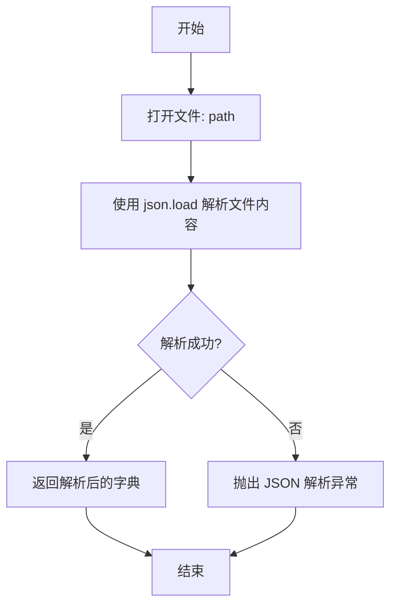
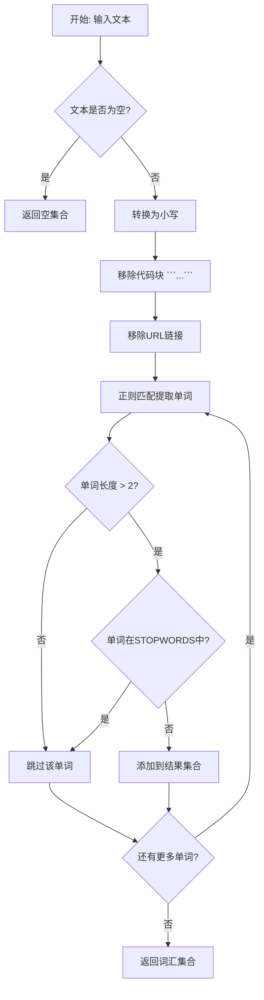
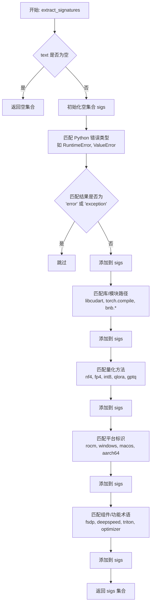
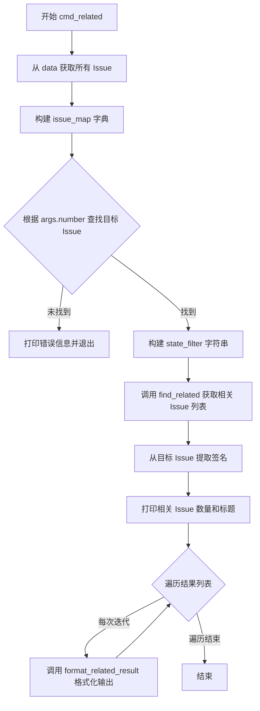
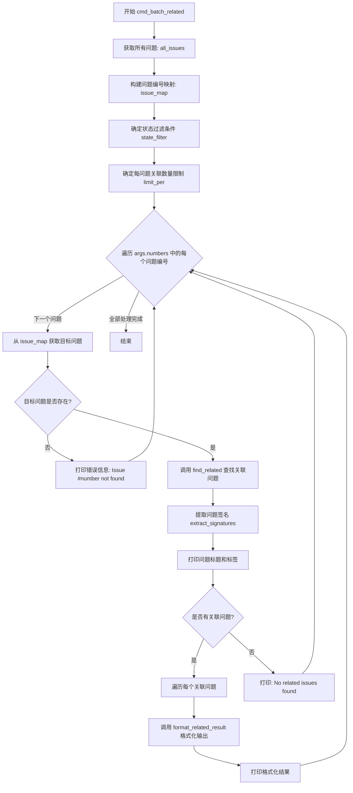
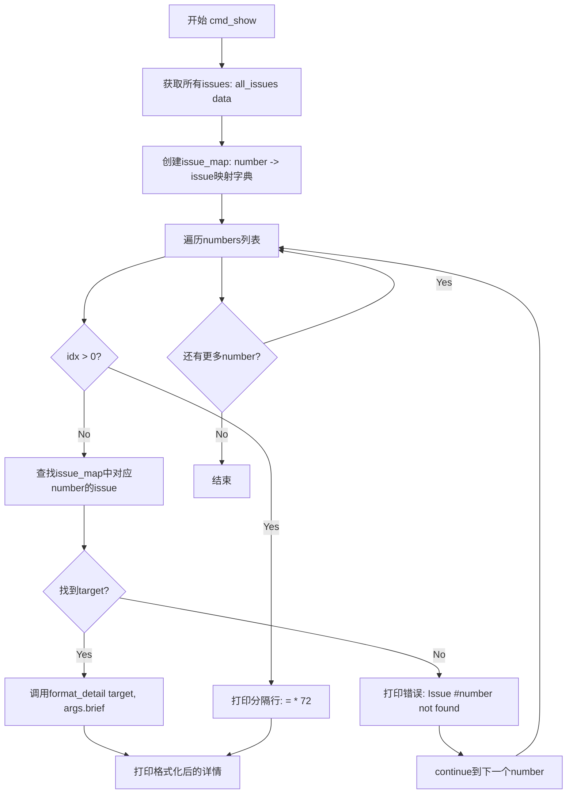
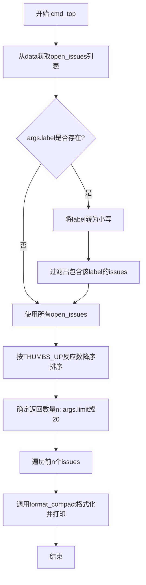
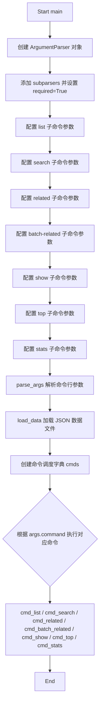

# `bitsandbytes\agents\query_issues.py` 详细设计文档

一个用于从本地JSON数据文件中搜索和查询GitHub issues的命令行工具，支持列出issues、关键词搜索、查找相关issues、批量查找、显示详情、热门issues排名和统计信息等功能，专为Agent消费优化，注重质量和灵活性。

## 整体流程

```mermaid
graph TD
    A[程序入口 main()] --> B[解析命令行参数 argparse]
    B --> C[加载数据 load_data]
    C --> D{命令类型 command}
    D -->|list| E[cmd_list: 列出issues]
    D -->|search| F[cmd_search: 关键词搜索]
    D -->|related| G[cmd_related: 查找相关issues]
    D -->|batch-related| H[cmd_batch_related: 批量查找相关]
    D -->|show| I[cmd_show: 显示issue详情]
    D -->|top| J[cmd_top: 热门issues排名]
    D -->|stats| K[cmd_stats: 统计信息]
    E --> L[格式化输出并打印]
    F --> L
    G --> L
    H --> L
    I --> L
    J --> L
    K --> L
```

## 类结构

```
模块级脚本 (无类定义)
├── 全局变量
│   ├── DEFAULT_DATA
│   └── STOPWORDS
├── 数据加载函数
│   ├── load_data
│   └── all_issues
├── 格式化函数
format_compact
format_list_line
format_detail
format_related_result
├── 文本处理函数
tokenize
extract_signatures
├── 搜索算法函数
find_related
└── 命令处理函数
    ├── cmd_list
    ├── cmd_search
    ├── cmd_related
    ├── cmd_batch_related
    ├── cmd_show
    ├── cmd_top
    └── cmd_stats
```

## 全局变量及字段


### `DEFAULT_DATA`
    
默认的GitHub issues数据文件路径，指向与脚本同目录下的bitsandbytes_issues.json文件

类型：`Path`
    


### `STOPWORDS`
    
用于文本匹配的停用词集合，过滤掉常见无意义的词汇如'the'、'and'、'cuda'等以提高搜索质量

类型：`frozenset[str]`
    


    

## 全局函数及方法


### `load_data`

从指定的文件路径读取 JSON 数据文件并返回解析后的字典对象。该函数是整个程序的入口点，负责加载本地存储的 GitHub Issues 数据，为后续的查询、搜索和关联分析提供数据基础。

参数：

- `path`：`str`，要加载的 JSON 文件路径

返回值：`dict`，从 JSON 文件解析得到的字典对象，通常包含 `open_issues`、`closed_issues`、`repository`、`fetched_at` 等键

#### 流程图



#### 带注释源码

```python
def load_data(path: str) -> dict:
    """
    从指定路径加载 JSON 格式的 GitHub Issues 数据文件。
    
    Args:
        path: JSON 文件的路径字符串
        
    Returns:
        包含 issues 数据的字典对象
    """
    # 以只读模式打开文件
    with open(path) as f:
        # 解析 JSON 内容并返回字典
        return json.load(f)
```


### `all_issues`

获取数据中的所有问题（开放问题和已关闭问题的合并列表）。

参数：

- `data`：`dict`，包含 `open_issues` 和 `closed_issues` 键的字典，通常来自 `load_data` 函数加载的 JSON 数据

返回值：`list[dict]`，返回所有问题的列表，按顺序为先所有开放问题，后跟所有已关闭问题

#### 流程图

```mermaid
flowchart TD
    A[开始] --> B[输入 data: dict]
    B --> C[提取 data['open_issues']]
    C --> D[提取 data['closed_issues']]
    D --> E[使用 + 拼接两个列表]
    E --> F[返回合并后的列表]
    F --> G[结束]
```

#### 带注释源码

```python
def all_issues(data: dict) -> list[dict]:
    """获取数据中的所有问题（开放问题和已关闭问题的合并列表）。
    
    参数:
        data: 包含 'open_issues' 和 'closed_issues' 键的字典
        
    返回:
        所有问题的列表，按顺序为开放问题在前，已关闭问题在后
    """
    return data['open_issues'] + data['closed_issues']
```


### `format_compact`

该函数将单个issue字典转换为紧凑的单行摘要字符串，用于在列表视图中快速展示issue的核心信息（编号、状态、标签、评论数、反应数、标题）。

参数：

- `issue`：`dict`，包含issue完整信息的字典对象，必须包含 `number`、`state`、`labels`、`comment_count`、`reactions`、`title` 等字段

返回值：`str`，格式化后的单行摘要字符串

#### 流程图

```mermaid
flowchart TD
    A[输入: issue dict] --> B{issue['labels']是否存在?}
    B -->|是| C[取前3个标签并用逗号连接]
    B -->|否| D[使用'-'作为默认值]
    C --> E[获取THUMBS_UP反应数]
    D --> E
    E --> F[格式化输出字符串]
    F --> G[返回单行摘要]
    
    style A fill:#e1f5fe
    style G fill:#c8e6c9
```

#### 带注释源码

```python
def format_compact(issue: dict) -> str:
    """One-line summary of an issue.
    
    将issue对象转换为紧凑的单行摘要格式，用于列表展示。
    
    Args:
        issue: 包含issue完整信息的字典，必须包含以下键:
            - number: int, issue编号
            - state: str, issue状态 ('open' 或 'closed')
            - labels: list, 标签列表
            - comment_count: int, 评论数量
            - reactions: dict, 反应数据字典 (包含THUMBS_UP等)
            - title: str, issue标题
    
    Returns:
        str: 格式化后的单行摘要字符串，格式为:
            #编号 状态 [标签] (评论数c 反应数↑) 标题(截断至80字符)
    """
    # 处理标签：最多显示3个，超出部分截断；无标签时显示'-'
    labels = ', '.join(issue['labels'][:3]) if issue['labels'] else '-'
    
    # 获取点赞(THUMBS_UP)反应数量，默认为0
    thumbs = issue['reactions'].get('THUMBS_UP', 0)
    
    # 格式化返回单行字符串
    # - issue编号：右对齐，占5位
    # - 状态：左对齐，占6位
    # - 标题：截断至80字符
    return (f"#{issue['number']:<5d} {issue['state']:<6s} "
            f"[{labels}] ({issue['comment_count']}c {thumbs}\u2191) "
            f"{issue['title'][:80]}")
```


### `format_list_line`

生成问题的紧凑单行摘要，包含日期和关键元数据，用于列表视图展示。

参数：

- `issue`：`dict`，待格式化的 GitHub Issue 字典对象，包含 `labels`、`reactions`、`timeline`、`number`、`updated_at`、`comment_count`、`title` 等字段

返回值：`str`，格式化后的单行问题摘要字符串

#### 流程图

```mermaid
flowchart TD
    A[开始: format_list_line] --> B{issue['labels']是否存在?}
    B -->|是| C[取前3个标签并用逗号连接]
    B -->|否| D[使用'-'作为默认值]
    C --> E[获取点赞数 THUMBS_UP]
    D --> E
    E --> F{遍历 timeline 查找 CrossReferencedEvent?}
    F --> G{类型为 PullRequest<br/>且状态为 OPEN?}
    G -->|是| H[记录 PR 编号]
    G -->|否| I[跳过]
    H --> J{存在关联 PR?}
    I --> J
    J -->|是| K[生成 PR#{编号} 标记]
    J -->|否| L[空字符串]
    K --> M[格式化最终输出字符串]
    L --> M
    M --> N[返回格式化字符串]
```

#### 带注释源码

```python
def format_list_line(issue: dict) -> str:
    """Compact one-line summary for list view, with date and key metadata."""
    # 处理标签：取前3个用逗号连接，无标签则用'-'代替
    labels = ', '.join(issue['labels'][:3]) if issue['labels'] else '-'
    
    # 获取点赞数（THUMBS_UP），默认为0
    thumbs = issue['reactions'].get('THUMBS_UP', 0)
    
    # 从时间线中筛选关联的PR（CrossReferencedEvent 类型）
    # 只保留 source_type 为 PullRequest 且状态为 OPEN 的记录
    prs = [t for t in issue['timeline']
           if t['type'] == 'CrossReferencedEvent'
           and t.get('source_type') == 'PullRequest'
           and t.get('source_state') == 'OPEN']
    
    # 如果存在关联的开放PR，生成PR编号标记
    pr_marker = f" PR#{prs[0]['source_number']}" if prs else ""
    
    # 组装最终的单行格式：
    # 格式: "#{编号} {更新日期} [{标签}] {评论数}c {点赞数}↑{PR标记}  {标题}"
    return (f"#{issue['number']:<5d} {issue['updated_at'][:10]} "
            f"[{labels}] {issue['comment_count']}c {thumbs}\u2191"
            f"{pr_marker}  {issue['title'][:70]}")
```


### `format_detail`

该函数用于生成 GitHub Issue 的完整详细信息视图，包含 Issue 的标题、状态、作者、标签、指派人、反应、交叉引用、主体内容以及所有评论。支持 `brief` 参数以简短模式显示（截断正文，仅显示首尾评论）。

参数：

- `issue`：`dict`，GitHub Issue 的完整数据字典，包含 number、title、state、author、created_at、updated_at、labels、assignees、reactions、body、comments 等字段
- `brief`：`bool`，可选参数，默认为 False。设为 True 时，正文截断至 1000 字符，且仅显示首尾两条评论

返回值：`str`，格式化后的 Issue 详细信息字符串，包含多行文本

#### 流程图

```mermaid
flowchart TD
    A[开始 format_detail] --> B[构建基础信息行]
    B --> C{issue 有 reactions?}
    C -->|Yes| D[添加 reactions 字符串]
    C -->|No| E[跳过 reactions]
    D --> E
    E --> F[添加评论数量]
    F --> G[提取 timeline 中的 CrossReferencedEvent]
    G --> H{有交叉引用?}
    H -->|Yes| I[遍历并添加最多 15 条交叉引用]
    H -->J[跳过交叉引用]
    I --> J
    J --> K[处理 body 内容]
    K --> L{brief 模式?}
    L -->|Yes| M{body 长度 > 1000?}
    L -->|No| N{body 长度 > 5000?}
    M -->|Yes| O[截断至 1000 字符 + 省略提示]
    M -->|No| P[保留原 body]
    N -->|Yes| Q[截断至 5000 字符 + 省略提示]
    N -->|No| R[保留原 body]
    O --> S
    P --> S
    Q --> S
    R --> S
    S --> T{issue 有 comments?}
    T -->|No| U[返回 '\n'.join(lines)]
    T -->|Yes| V{brief 模式?}
    V -->|Yes| W[仅提取首条和末条评论]
    V -->|No| X[遍历所有评论]
    W --> Y[添加评论信息到 lines]
    X --> Y
    Y --> U
```

#### 带注释源码

```python
def format_detail(issue: dict, brief: bool = False) -> str:
    """Full detail view of an issue including body and comments."""
    # 初始化 lines 列表，包含 Issue 的基本元信息
    lines = [
        f"#{issue['number']}: {issue['title']}",  # Issue 编号和标题
        f"State: {issue['state']}  Author: {issue['author']}  "  # 状态、作者
        f"Created: {issue['created_at'][:10]}  Updated: {issue['updated_at'][:10]}",  # 创建和更新时间（取前10位日期）
        f"Labels: {', '.join(issue['labels']) or 'none'}",  # 标签列表，无则显示 'none'
        f"Assignees: {', '.join(issue['assignees']) or 'none'}",  # 指派人列表，无则显示 'none'
    ]
    
    # 如果存在反应信息，格式化为字符串并添加到 lines
    if issue['reactions']:
        rxn = '  '.join(f"{k}:{v}" for k, v in issue['reactions'].items())
        lines.append(f"Reactions: {rxn}")
    
    # 添加评论数量信息
    lines.append(f"Comments: {issue['comment_count']}")

    # Cross-references (PRs and issues)
    # 从 timeline 中筛选出类型为 CrossReferencedEvent 的交叉引用事件
    xrefs = [t for t in issue['timeline'] if t['type'] == 'CrossReferencedEvent']
    if xrefs:
        lines.append(f"Cross-references ({len(xrefs)}):")
        # 遍历最多 15 条交叉引用，添加来源类型、编号、状态和标题
        for x in xrefs[:15]:
            lines.append(f"  {x['source_type']} #{x['source_number']} "
                         f"[{x['source_state']}]: {x['source_title'][:60]}")

    lines.append("")  # 空行分隔元信息和正文

    # Body
    body = (issue['body'] or '').strip()  # 获取 Issue 正文，去除首尾空白
    if brief:
        # brief 模式下，正文截断至 1000 字符
        if len(body) > 1000:
            body = body[:1000] + "\n... [truncated, use show without --brief for full]"
    else:
        # Full body 模式，正文截断至 5000 字符（处理超长 Issue）
        if len(body) > 5000:
            body = body[:5000] + "\n... [truncated at 5000 chars]"
    lines.append(body)  # 添加正文内容

    # Comments
    # 处理评论展示逻辑
    if issue['comments']:
        lines.append("")
        lines.append(f"--- Comments ({issue['comment_count']}) ---")
        comments = issue['comments']
        if brief:
            # brief 模式：仅显示首条和末条评论
            to_show = []
            if comments:
                to_show.append(('first', comments[0]))  # 添加首条评论
            if len(comments) > 1:
                to_show.append(('last', comments[-1]))  # 添加末条评论
            for label, c in to_show:
                rxn = ''
                # 如果有评论反应，格式化反应字符串
                if c['reactions']:
                    rxn = ' | ' + ' '.join(f"{k}:{v}" for k, v in c['reactions'].items())
                c_body = c['body'].replace('\n', ' ').strip()[:300]  # 评论正文，去除换行并截断
                lines.append(f"  [{label}] @{c['author'] or '?'} ({c['created_at'][:10]}){rxn}:")
                lines.append(f"    {c_body}")
            if len(comments) > 2:
                lines.append(f"  ... {len(comments) - 2} more comments (use show without --brief)")
        else:
            # Full 模式：显示所有评论
            for idx, c in enumerate(comments):
                rxn = ''
                if c['reactions']:
                    rxn = ' | ' + ' '.join(f"{k}:{v}" for k, v in c['reactions'].items())
                lines.append(f"  [{idx+1}] @{c['author'] or '?'} ({c['created_at'][:10]}){rxn}:")
                c_body = c['body'].strip()
                # 单条评论超长时截断至 2000 字符
                if len(c_body) > 2000:
                    c_body = c_body[:2000] + "\n    ... [comment truncated]"
                # 缩进评论正文
                for line in c_body.split('\n'):
                    lines.append(f"    {line}")
                lines.append("")  # 空行分隔评论

    return '\n'.join(lines)  # 将所有行拼接为最终字符串
```


### `tokenize`

该函数是一个文本分词工具，用于从给定的文本中提取有意义的关键词（tokens），通过移除代码块、URL链接、停用词和过短的词汇，以支持后续的文本相似度匹配和关键词检索。

参数：

- `text`：`str`，需要分词的原始文本输入

返回值：`set[str]`，返回一个小写的有意义词汇集合，用于文本匹配或相似度计算

#### 流程图



#### 带注释源码

```python
def tokenize(text: str) -> set[str]:
    """Extract meaningful lowercase tokens."""
    # 1. 空值检查：如果输入为空，直接返回空集合
    if not text:
        return set()
    
    # 2. 转换为小写：统一处理，便于后续匹配
    text = text.lower()
    
    # 3. 移除代码块：使用正则替换删除 ```...``` 格式的代码块
    # flags=re.DOTALL 使 . 可以匹配换行符
    text = re.sub(r'```.*?```', '', text, flags=re.DOTALL)
    
    # 4. 移除URL：删除 http:// 或 https:// 开头的URL链接
    text = re.sub(r'https?://\S+', '', text)
    
    # 5. 提取单词：匹配以字母开头，后续包含字母、数字、下划线或点的字符串
    # 正则 [a-z][a-z0-9_.]+ 匹配有意义的单词
    words = re.findall(r'[a-z][a-z0-9_.]+', text)
    
    # 6. 过滤词汇：保留长度大于2且不在停用词列表中的词汇
    # STOPWORDS 包含常见无意义词汇（如 'the', 'and', 'cuda' 等）
    return {w for w in words if len(w) > 2 and w not in STOPWORDS}
```


### `extract_signatures`

从给定的文本中提取错误类型、库名称、量化方法、平台信息和特定组件/功能术语等技术特征签名，用于在问题搜索中识别和匹配相关的技术关键词。

参数：

-  `text`：`str`，待分析的文本内容，通常为问题的标题或正文

返回值：`set[str]`，提取的技术特征签名集合（全部为小写），可能包含错误类型、库路径、量化方法、平台标识和组件名称等

#### 流程图



#### 带注释源码

```python
def extract_signatures(text: str) -> set[str]:
    """Extract error types, library names, and technical terms.

    These are specific, discriminative terms — not general words like 'cuda'
    which appear in most issues and add noise.
    """
    # 空文本直接返回空集合，避免无效处理
    if not text:
        return set()
    
    # 初始化结果集合，使用 set 自动去重
    sigs = set()
    
    # 提取 Python 错误类型（如 RuntimeError, KeyError 等）
    # 排除通用的 'error' 和 'exception' 因为它们缺乏区分度
    for m in re.finditer(r'(\w+Error|\w+Exception)', text):
        val = m.group(0).lower()
        if val not in ('error', 'exception'):
            sigs.add(val)
    
    # 提取特定的库/模块路径
    # 包含 CUDA 运行时库、bitsandbytes 相关模块、torch.compile 等
    for m in re.finditer(r'(libcudart|libbitsandbytes|torch\.compile|bnb\.\w+|bitsandbytes\.\w+)', text):
        sigs.add(m.group(0).lower())
    
    # 提取量化方法相关术语
    # 包括 NF4/FP4 量化、INT8/INT4、LORA/QLORA、GPTQ、AWQ 等
    for m in re.finditer(r'(nf4|fp4|int8|int4|qlora|lora|gptq|awq)', text, re.I):
        sigs.add(m.group(0).lower())
    
    # 提取平台标识（排除 cuda 因为太常见）
    # 包括 ROCm、Windows、macOS、Apple Silicon、ARM64、XPU、Ascend、Gaudi 等
    for m in re.finditer(r'(rocm|windows|macos|apple.?silicon|aarch64|arm64|xpu|ascend|gaudi)', text, re.I):
        sigs.add(m.group(0).lower())
    
    # 提取特定组件/功能术语
    # 包括分布式训练框架 (FSDP, DeepSpeed)、Triton、矩阵乘法、优化器、量化/反量化、检查点等
    for m in re.finditer(r'(fsdp|deepspeed|triton|matmul|optimizer|quantiz\w+|dequantiz\w+|checkpoint)', text, re.I):
        sigs.add(m.group(0).lower())
    
    # 返回提取的技术签名集合
    return sigs
```


### `find_related`

该函数通过计算标题、正文和标签的词汇和特征重叠度，为给定目标 issue 打分并返回最相关的其他 issue 列表。评分机制赋予特征匹配（签名）最高权重，其次是标签，最后是普通词汇。

参数：

- `target`：`dict`，目标 issue 对象，包含 title、body、labels 等字段
- `issues`：`list[dict]`，待搜索的全部 issue 列表
- `state_filter`：`str | None`，可选的状态过滤条件（"open" 或 "closed"）
- `limit`：`int`，返回结果数量上限，默认为 15

返回值：`list[tuple]`，按相关性得分降序排列的结果列表，每个元素为 `(score, issue, sig_overlap, token_overlap)` 元组

#### 流程图

```mermaid
flowchart TD
    A[开始 find_related] --> B[构建查询文本<br/>target.title + target.body前1000字符]
    B --> C[调用 tokenize 获取查询词集合]
    C --> D[调用 extract_signatures 获取特征集合]
    D --> E[获取目标 issue 标签集合]
    E --> F[初始化空结果列表 scored]
    F --> G{遍历 issues 中的每个 issue}
    G -->|是目标 issue 自身| H[跳过本次循环]
    G -->|否| I{检查 state_filter}
    I -->|不匹配| H
    I -->|匹配或无过滤| J[构建 issue 文本<br/>title + body前200字符]
    J --> K[tokenize 和 extract_signatures]
    K --> L[计算特征交集 sig_overlap]
    L --> M[计算词汇交集 token_overlap]
    M --> N[计算标签交集 label_overlap]
    N --> O[计算得分<br/>score = len(sig_overlap)*3<br/>+ len(token_overlap)<br/>+ len(label_overlap)]
    O --> P{score >= 3?}
    P -->|是| Q[将元组加入 scored 列表]
    P -->|否| H
    Q --> H
    H --> G
    G -->|遍历完成| R[按得分降序排序 scored]
    R --> S[返回前 limit 条结果]
    S --> T[结束]
```

#### 带注释源码

```python
def find_related(target: dict, issues: list[dict], state_filter: str | None = None,
                 limit: int = 15) -> list[tuple]:
    """Find issues related to target. Returns list of (score, issue, sig_overlap, token_overlap)."""
    # 1. 构建查询文本：合并目标 issue 的标题和正文（前1000字符以控制长度）
    query_text = target['title'] + ' ' + (target['body'] or '')[:1000]
    # 2. 提取查询的词汇单元（过滤停用词和短词）
    query_tokens = tokenize(query_text)
    # 3. 提取查询的技术特征（错误类型、库名、量化方法等）
    query_sigs = extract_signatures(query_text)
    # 4. 将目标 issue 的标签转换为集合便于交集运算
    query_labels = set(target['labels'])

    # 初始化已评分结果列表
    scored = []
    # 遍历所有 issue 进行相似度计算
    for issue in issues:
        # 跳过目标 issue 自身，避免匹配到自己
        if issue['number'] == target['number']:
            continue
        # 如果指定了状态过滤且当前 issue 状态不匹配，则跳过
        if state_filter and issue['state'] != state_filter:
            continue

        # 对每个候选 issue 构建文本：标题 + body 前200字符
        body_preview = (issue['body'] or '')[:200]
        issue_text = issue['title'] + ' ' + body_preview
        # 提取该 issue 的词汇和特征
        issue_tokens = tokenize(issue_text)
        issue_sigs = extract_signatures(issue_text)

        # 计算三维度交集：特征、词汇、标签
        sig_overlap = query_sigs & issue_sigs
        token_overlap = query_tokens & issue_tokens
        label_overlap = query_labels & set(issue['labels'])

        # 加权评分：特征匹配权重最高(3倍)，标签次之，词汇最低
        score = len(sig_overlap) * 3 + len(token_overlap) + len(label_overlap)
        # 只有得分>=3的才视为相关（避免噪音匹配）
        if score >= 3:
            scored.append((score, issue, sig_overlap, token_overlap))

    # 按得分降序排列
    scored.sort(key=lambda x: -x[0])
    # 返回最多 limit 条结果
    return scored[:limit]
```


### `format_related_result`

该函数用于格式化单个相关 Issue 的查询结果，将相关 Issue 的基本信息、匹配分数和匹配的关键词整理为可读的文本输出，支持详细模式以展示更多上下文信息。

参数：

-  `score`：`int`，表示目标 Issue 与当前相关 Issue 之间的匹配分数，分数越高表示相关性越强
-  `issue`：`dict`，包含相关 Issue 的完整数据，如标题、状态、标签、评论等信息的字典对象
-  `sig_ol`：`set`，技术签名重叠集合，包含从 Issue 中提取的技术术语（如错误类型、库名称、量化方法等）
-  `tok_ol`：`set`，关键词重叠集合，包含从 Issue 标题和正文中提取的一般性关键词
-  `verbose`：`bool`，可选参数，默认为 `False`，设为 `True` 时会额外输出 Issue 正文预览和最后一条评论

返回值：`str`，返回格式化的多行字符串，包含 Issue 的紧凑摘要、匹配分数、匹配的关键词列表，以及在详细模式下的正文预览和最新评论信息

#### 流程图

```mermaid
flowchart TD
    A[开始 format_related_result] --> B[创建空列表 lines]
    B --> C[调用 format_compact 格式化 Issue 紧凑信息并添加到 lines]
    C --> D[合并 sig_ol 和 tok_ol 为 matched 列表]
    D --> E[添加匹配分数和前8个关键词到 lines]
    E --> F{verbose == True?}
    F -->|否| G[将 lines 拼接为字符串返回]
    F -->|是| H[获取 issue['body'] 预览最多300字符]
    H --> I{body_preview 存在?}
    I -->|是| J[添加 Body 预览到 lines]
    I -->|否| K{issue['comments'] 存在?}
    J --> K
    K -->|是| L[获取最后一条评论并添加详细信息到 lines]
    K -->|否| M[添加空行到 lines]
    L --> M
    M --> G
```

#### 带注释源码

```python
def format_related_result(score, issue, sig_ol, tok_ol, verbose=False):
    """Format a single related-issue result.
    
    Args:
        score: 匹配分数，反映目标 Issue 与当前 Issue 的相关程度
        issue: 相关的 Issue 字典，包含标题、状态、标签、正文、评论等字段
        sig_ol: 技术签名重叠集合（错误类型、库名、量化方法等）
        tok_ol: 关键词重叠集合（一般性术语）
        verbose: 是否输出详细模式（包含正文预览和最后评论）
    
    Returns:
        格式化的多行字符串，包含 Issue 摘要和匹配信息
    """
    lines = []
    # 第一行：Issue 的紧凑格式摘要（编号、状态、标签、评论数、标题）
    lines.append(f"  {format_compact(issue)}")
    # 合并技术签名和关键词，排序后取前8个显示
    matched = list(sig_ol) + list(tok_ol)
    lines.append(f"    score={score}  matched: {', '.join(sorted(matched)[:8])}")
    # 如果是详细模式，额外输出正文预览和最后评论
    if verbose:
        # 获取正文前300字符的预览，去除换行符
        body_preview = (issue['body'] or '').replace('\n', ' ').strip()[:300]
        if body_preview:
            lines.append(f"    Body: {body_preview}")
        # 显示最后一条评论（通常包含解决方案或关键信息）
        if issue['comments']:
            last = issue['comments'][-1]
            last_body = last['body'].replace('\n', ' ').strip()[:200]
            lines.append(f"    Last comment @{last['author'] or '?'} ({last['created_at'][:10]}): {last_body}")
        lines.append("")
    # 将所有行拼接为单个字符串返回
    return '\n'.join(lines)
```


### `cmd_list`

该函数用于从本地JSON数据文件中列出GitHub issues，支持按状态、标签过滤，并按指定字段排序，以紧凑的单行格式展示。

参数：

- `args`：`argparse.Namespace`，命令行参数对象，包含 `state`（状态过滤）、`label`（标签过滤）、`unlabeled`（无标签过滤）、`sort`（排序字段）、`limit`（结果数量限制）
- `data`：`dict`，从JSON文件加载的完整数据字典，包含 `open_issues` 和 `closed_issues` 列表

返回值：`None`，该函数直接打印结果到标准输出，不返回任何值

#### 流程图

```mermaid
flowchart TD
    A[开始 cmd_list] --> B{args.state 是否存在?}
    B -->|是| C{args.state == 'open'?}
    B -->|否| D[issues = data.open_issues]
    C -->|是| E[issues = data.open_issues]
    C -->|否| F[issues = data.closed_issues]
    D --> G{args.label 是否存在?}
    E --> G
    F --> G
    G -->|是| H[过滤出匹配标签的 issues]
    G -->|否| I{args.unlabeled 是否存在?}
    H --> I
    I -->|是| J[过滤出无标签的 issues]
    I -->|否| K{根据 sort 排序}
    J --> K
    K --> L[limit = args.limit 或总数量]
    L --> M{遍历 issues[:limit]}
    M -->|每条| N[调用 format_list_line 打印]
    M -->|完成| O{limit < 总数量?}
    O -->|是| P[打印 '... X more' 提示]
    O -->|否| Q[打印总数到 stderr]
    N --> M
    P --> Q
    Q --> R[结束]
```

#### 带注释源码

```python
def cmd_list(args, data):
    """List issues with compact one-line summaries.
    
    根据命令行参数过滤、排序并列出issues，以紧凑格式打印。
    支持按状态(open/closed)、标签过滤，按更新时间/创建时间/
    评论数/点赞数排序，并可限制输出数量。
    """
    # ---- 1. 按状态过滤 ----
    # 根据 args.state 参数决定获取开放还是关闭的 issues
    if args.state:
        if args.state == 'open':
            issues = list(data['open_issues'])  # 复制列表避免修改原数据
        else:
            issues = list(data['closed_issues'])
    else:
        # 默认只显示 open 状态的 issues
        issues = list(data['open_issues'])

    # ---- 2. 按标签过滤 ----
    # 支持按指定标签名称过滤，不区分大小写
    if args.label:
        label_lower = args.label.lower()
        issues = [i for i in issues if any(label_lower == l.lower() for l in i['labels'])]

    # ---- 3. 按无标签过滤 ----
    # 只显示没有分配任何标签的 issues
    if args.unlabeled:
        issues = [i for i in issues if not i['labels']]

    # ---- 4. 排序处理 ----
    # 支持按更新时间、创建时间、评论数、点赞数排序
    # 默认按更新时间倒序排列
    sort_key = args.sort or 'updated'
    if sort_key == 'updated':
        issues.sort(key=lambda i: i['updated_at'], reverse=True)
    elif sort_key == 'created':
        issues.sort(key=lambda i: i['created_at'], reverse=True)
    elif sort_key == 'comments':
        issues.sort(key=lambda i: i['comment_count'], reverse=True)
    elif sort_key == 'reactions':
        issues.sort(key=lambda i: i['reactions'].get('THUMBS_UP', 0), reverse=True)

    # ---- 5. 输出结果 ----
    # 限制输出数量，默认为全部显示
    n = args.limit or len(issues)
    for issue in issues[:n]:
        print(format_list_line(issue))  # 打印每条 issue 的紧凑格式
    
    # 如果还有更多结果，打印提示信息
    if n < len(issues):
        print(f"... {len(issues) - n} more (use --limit to show more)")
    
    # 打印总数量到 stderr，避免干扰标准输出
    print(f"\n({len(issues)} total)", file=sys.stderr)
```


### `cmd_search`

搜索 GitHub issues 中的关键词，支持按状态和标签过滤，按点赞数排序输出。

参数：

-  `args`：`argparse.Namespace`，包含命令行参数的对象，包含 `query`（搜索词）、`state`（状态过滤）、`label`（标签过滤）、`title_only`（是否只搜索标题）、`limit`（结果数量限制）
-  `data`：`dict`，包含所有 issues 数据的字典，包含 `open_issues` 和 `closed_issues` 列表

返回值：`None`，该函数直接打印结果到标准输出，无返回值

#### 流程图

```mermaid
flowchart TD
    A[开始 cmd_search] --> B[获取查询词并转为小写]
    B --> C[调用 all_issues 获取所有 issues]
    C --> D{args.state 是否存在?}
    D -->|是| E[按 state 过滤 issues]
    D -->|否| F{args.label 是否存在?}
    E --> F
    F -->|是| G[按 label 过滤 issues]
    F -->|否| H[遍历过滤后的 issues]
    G --> H
    H --> I[构建搜索文本: title + body[:2000]]
    I --> J{查询词全部在文本中?}
    J -->|是| K[将该 issue 加入结果列表]
    J -->|否| L[继续下一个 issue]
    K --> L
    L --> M{还有更多 issues?}
    M -->|是| H
    M -->|否| N[按 THUMBS_UP 点赞数降序排序结果]
    N --> O[打印前 n 条结果]
    O --> P[打印匹配总数到 stderr]
    P --> Q[结束]
```

#### 带注释源码

```python
def cmd_search(args, data):
    """Search issues by keyword."""
    # 将查询词转为小写并分割成单词列表
    query = args.query.lower()
    query_words = query.split()
    
    # 获取所有 issues（包括 open 和 closed）
    issues = all_issues(data)

    # 如果指定了 state 参数，按状态过滤
    if args.state:
        state = args.state.upper()
        issues = [i for i in issues if i['state'] == state]

    # 如果指定了 label 参数，按标签过滤
    if args.label:
        label_lower = args.label.lower()
        issues = [i for i in issues if any(label_lower == l.lower() for l in i['labels'])]

    # 遍历每个 issue，查找匹配的
    results = []
    for issue in issues:
        # 获取标题并转为小写
        text = issue['title'].lower()
        # 除非指定了 --title-only，否则在正文中搜索（只取前 2000 字符）
        if not args.title_only:
            text += ' ' + (issue['body'] or '').lower()[:2000]
        # 只有当所有查询词都在文本中时才匹配
        if all(w in text for w in query_words):
            results.append(issue)

    # 按点赞数（THUMBS_UP）降序排序
    results.sort(key=lambda i: i['reactions'].get('THUMBS_UP', 0), reverse=True)
    
    # 限制结果数量（默认 20）
    n = args.limit or 20
    
    # 打印结果（每行一个 issue，使用紧凑格式）
    for issue in results[:n]:
        print(format_compact(issue))
    
    # 如果有更多结果，打印提示信息
    if len(results) > n:
        print(f"... {len(results) - n} more results (use --limit to show more)")
    elif not results:
        print("No results found.")
    
    # 打印匹配总数到 stderr
    print(f"\n({len(results)} matches)", file=sys.stderr)
```


### `cmd_related`

根据传入的命令行参数（目标 Issue 编号），从本地 JSON 数据中查找并展示与该 Issue 相关的其他 Issue。函数通过文本签名匹配、关键词重叠和标签重叠计算相关性得分，最终按得分降序输出结果列表。

参数：

-  `args`：`argparse.Namespace`，命令行参数对象，包含以下属性：
  - `args.number`：`int`，目标 Issue 编号，用于查找相关 Issue
  - `args.state`：`str | None`，状态过滤器，可选 `"open"` 或 `"closed"`
  - `args.limit`：`int | None`，返回结果数量上限，默认为 15
  - `args.verbose`：`bool`，是否显示 Issue 正文预览和最后一条评论
-  `data`：`dict`，从 JSON 文件加载的完整数据，包含 `open_issues` 和 `closed_issues` 两个键

返回值：`None`，该函数直接打印结果到标准输出，不返回任何值

#### 流程图



#### 带注释源码

```python
def cmd_related(args, data):
    """Find issues related to a given issue number."""
    # 从数据字典中提取所有 Issue（包括 open 和 closed）
    issues = all_issues(data)
    # 构建 Issue 编号到 Issue 对象的映射字典，便于快速查找
    issue_map = {i['number']: i for i in issues}

    # 根据命令行传入的 Issue 编号获取目标 Issue 对象
    target = issue_map.get(args.number)
    # 如果目标 Issue 不存在，打印错误信息并以状态码 1 退出程序
    if not target:
        print(f"Issue #{args.number} not found.", file=sys.stderr)
        sys.exit(1)

    # 根据 args.state 构建状态过滤器字符串（'OPEN'、'CLOSED' 或 None）
    state_filter = args.state.upper() if args.state else None
    # 调用 find_related 函数查找相关 Issue，默认最多返回 15 条
    results = find_related(target, issues, state_filter, args.limit or 15)

    # 从目标 Issue 的标题和正文（前 1000 字符）中提取签名特征
    query_sigs = extract_signatures(target['title'] + ' ' + (target['body'] or '')[:1000])
    # 打印相关 Issue 的编号和标题（截断至 70 字符）
    print(f"Issues related to #{target['number']}: {target['title'][:70]}")
    # 打印提取到的签名列表，若无签名则显示 'none'
    print(f"  Signatures: {query_sigs or 'none'}")
    # 打印空行分隔 header 和结果
    print()

    # 遍历所有相关 Issue 结果，按 score 降序排列
    for score, issue, sig_ol, tok_ol in results:
        # 调用格式化函数打印每条结果，verbose 参数控制是否显示正文预览和最后评论
        print(format_related_result(score, issue, sig_ol, tok_ol, verbose=args.verbose))
```


### `cmd_batch_related`

该函数用于批量查询多个GitHub问题的相关问题，遍历用户指定的问题编号列表，为每个问题调用`find_related`函数查找相关联的问题，并格式化输出每个问题及其关联问题的详细信息（包含标签、签名匹配度等）。

参数：

- `args`：`argparse.Namespace`，命令行参数对象，包含`numbers`（要查询的问题编号列表）、`state`（状态过滤条件）、`limit`（每个问题返回的关联问题数量限制）和`verbose`（是否显示详细信息）
- `data`：`dict`，从JSON文件加载的完整GitHub问题数据，包含`open_issues`和`closed_issues`列表

返回值：`None`，该函数直接打印结果到标准输出，不返回任何值

#### 流程图



#### 带注释源码

```python
def cmd_batch_related(args, data):
    """Find related issues for multiple issues at once.
    
    该命令用于批量查询多个GitHub问题的相关问题。
    遍历用户提供的每个问题编号，查找并显示关联的问题列表。
    支持状态过滤、结果数量限制和详细输出模式。
    
    Args:
        args: 包含以下属性的命名空间对象:
            - numbers: List[int], 要查询的问题编号列表
            - state: Optional[str], 状态过滤条件 ('open' 或 'closed')
            - limit: Optional[int], 每个问题返回的关联问题数量限制
            - verbose: bool, 是否显示详细信息(包含问题正文和最后评论)
        data: dict, 包含所有问题的JSON数据,结构如下:
            - 'open_issues': List[dict], 已开放问题列表
            - 'closed_issues': List[dict], 已关闭问题列表
    
    Returns:
        None: 结果直接打印到标准输出,无返回值
    """
    # 从数据中获取所有问题(开放+关闭)
    issues = all_issues(data)
    
    # 构建问题编号到问题对象的映射字典,用于快速查找
    # 格式: {issue_number: issue_dict}
    issue_map = {i['number']: i for i in issues}

    # 处理状态过滤参数:如果指定了state则转换为大写,否则为None
    # None表示不限制状态,返回所有相关问题
    state_filter = args.state.upper() if args.state else None
    
    # 设置每个问题的关联问题数量限制,默认值为5
    limit_per = args.limit or 5

    # 遍历用户指定的所有问题编号
    for number in args.numbers:
        # 从映射中获取目标问题对象
        target = issue_map.get(number)
        
        # 如果问题编号不存在,打印错误信息并继续处理下一个
        if not target:
            print(f"Issue #{number} not found.", file=sys.stderr)
            continue

        # 调用find_related函数查找关联问题
        # 返回格式: List[Tuple[score, issue, sig_overlap, token_overlap]]
        results = find_related(target, issues, state_filter, limit_per)
        
        # 提取目标问题的技术签名(错误类型、库名、量化方法等)
        # 用于显示和匹配分析
        query_sigs = extract_signatures(target['title'] + ' ' + (target['body'] or '')[:1000])

        # 打印分隔线和问题标题(截断至65字符)
        print(f"=== #{target['number']}: {target['title'][:65]} ===")
        
        # 打印问题标签和技术签名信息
        # 如果没有标签则显示'none',如果没有签名则显示'none'
        print(f"  Labels: {', '.join(target['labels']) or 'none'}  "
              f"Signatures: {query_sigs or 'none'}")

        # 如果找到关联问题,则遍历并格式化输出每个结果
        if results:
            for score, issue, sig_ol, tok_ol in results:
                # 调用format_related_result格式化单个结果
                # verbose=True时包含问题正文预览和最后评论
                print(format_related_result(score, issue, sig_ol, tok_ol, verbose=args.verbose))
        else:
            # 没有找到关联问题时打印提示信息
            print("  No related issues found.")
            print()
```


### `cmd_show`

显示一个或多个GitHub Issue的完整详情（包括正文和所有评论）。

参数：

- `args`：`argparse.Namespace`，命令行参数对象，包含以下属性：
  - `numbers`：`list[int]`，要显示的Issue编号列表
  - `brief`：`bool`，是否以简洁模式显示（截断正文，仅显示首尾评论）
- `data`：`dict`，从JSON文件加载的完整数据字典，包含`open_issues`和`closed_issues`键

返回值：`None`，该函数直接打印输出，不返回任何值

#### 流程图



#### 带注释源码

```python
def cmd_show(args, data):
    """Show full detail for one or more issues.
    
    显示一个或多个GitHub Issue的完整详情。
    如果显示多个issue，会在每个issue之间打印分隔线。
    
    参数:
        args: 包含numbers(issue编号列表)和brief(是否简洁模式)的命名空间对象
        data: 包含open_issues和closed_issues的完整数据字典
    
    返回:
        None: 直接打印到stdout/stderr
    """
    # 获取所有issues（open + closed）
    issues = all_issues(data)
    
    # 构建number到issue对象的映射字典，用于快速查找
    issue_map = {i['number']: i for i in issues}

    # 获取命令行传入的issue编号列表
    numbers = args.numbers
    
    # 遍历每个要显示的issue编号
    for idx, number in enumerate(numbers):
        # 从映射中查找对应的issue
        target = issue_map.get(number)
        
        # 如果未找到，输出错误信息到stderr并跳过
        if not target:
            print(f"Issue #{number} not found.", file=sys.stderr)
            continue
        
        # 如果不是第一个issue，打印分隔线以区分多个输出
        if idx > 0:
            print("\n" + "=" * 72 + "\n")
        
        # 调用format_detail函数格式化并打印issue详情
        # brief参数控制是否截断正文、仅显示首尾评论
        print(format_detail(target, brief=args.brief))
```


### `cmd_top`

列出按反应数量排序的热门问题。

参数：

-  `args`：命令行参数对象，包含 `label`（可选，过滤标签）和 `limit`（可选，限制返回数量，默认为20）
-  `data`：包含仓库所有issue数据的字典，包含 `open_issues` 列表

返回值：`None`，该函数直接打印结果到标准输出

#### 流程图



#### 带注释源码

```python
def cmd_top(args, data):
    """List top issues by reaction count.
    
    根据GitHub reactions中的thumbs up数量对开放问题进行排序展示，
    支持按label过滤和数量限制。
    """
    # 从数据中获取open_issues列表
    issues = data['open_issues']
    
    # 如果指定了label参数，则过滤只包含该label的issues
    if args.label:
        label_lower = args.label.lower()
        issues = [i for i in issues if any(label_lower == l.lower() for l in i['labels'])]

    # 根据THUMBS_UP reaction数量降序排序（最多的在前）
    issues = sorted(issues, key=lambda i: i['reactions'].get('THUMBS_UP', 0), reverse=True)
    
    # 确定要显示的问题数量：优先使用args.limit，默认为20
    n = args.limit or 20
    
    # 遍历前n个问题，使用format_compact格式化后打印
    for issue in issues[:n]:
        print(format_compact(issue))
```


### `cmd_stats`

该函数用于显示 GitHub 问题的摘要统计信息，包括仓库信息、开放/关闭问题数量，以及按频率排序的标签统计。

参数：

- `args`：`argparse.Namespace`，命令行参数对象（此函数未使用额外参数）
- `data`：`dict`，从 JSON 文件加载的完整问题数据，包含 `repository`、`fetched_at`、`open_count`、`closed_count`、`open_issues` 等字段

返回值：`None`，该函数无返回值，仅通过 `print` 输出统计信息到标准输出

#### 流程图

```mermaid
flowchart TD
    A[开始 cmd_stats] --> B[导入 collections.Counter]
    B --> C[打印仓库名称: data.repository]
    C --> D[打印数据获取时间: data.fetched_at 前19字符]
    D --> E[打印开放和关闭问题数量]
    E --> F[打印空行分隔]
    F --> G[初始化 label_counts = Counter]
    G --> H[遍历 data.open_issues]
    H --> I{遍历每个 issue 的 labels}
    I -->|每个 label| J[label_counts[l] += 1]
    J --> I
    I -->|labels遍历完| K[打印 "Open issue labels:"]
    K --> L[遍历 label_counts.most_common]
    L -->|每对 label, count| M[打印 计数和标签名]
    M --> L
    L -->|遍历完| N[计算 unlabeled 数量]
    N --> O[打印未标记问题数量]
    O --> P[结束]
```

#### 带注释源码

```python
def cmd_stats(args, data):
    """Show summary statistics.
    
    输出仓库级统计信息：
    - 仓库名称和获取时间
    - 开放/关闭问题总数
    - 开放问题的标签分布
    - 未标记问题数量
    """
    # 导入 Counter 用于统计标签频率
    from collections import Counter
    
    # 打印仓库基础信息
    print(f"Repository: {data['repository']}")           # 仓库名称
    print(f"Fetched: {data['fetched_at'][:19]}")        # 数据获取时间（截取前19字符）
    print(f"Open: {data['open_count']}  Closed: {data['closed_count']}")  # 问题数量统计
    print()                                              # 空行分隔
    
    # 统计开放问题的标签分布
    label_counts = Counter()                             # 初始化计数器
    for i in data['open_issues']:                        # 遍历所有开放问题
        for l in i['labels']:                            # 遍历每个问题的标签列表
            label_counts[l] += 1                         # 累加计数
    
    # 打印标签统计标题
    print("Open issue labels:")
    
    # 按频率降序打印每个标签及其计数
    for label, count in label_counts.most_common():
        print(f"  {count:3d}  {label}")                  # 右对齐显示计数（3位宽度）
    
    # 统计未标记（unlabeled）的开放问题数量
    unlabeled = sum(1 for i in data['open_issues'] if not i['labels'])
    print(f"  {unlabeled:3d}  (unlabeled)")              # 打印未标记问题统计
```


### `main`

主函数作为 GitHub Issues 查询工具的入口点，通过 argparse 解析命令行参数，加载本地 JSON 数据文件，并根据子命令（如 list、search、related、batch-related、show、top、stats）调度到相应的处理函数执行具体操作。

参数：

- 无参数

返回值：`None`，无返回值

#### 流程图



#### 带注释源码

```python
def main():
    """主入口函数：解析命令行参数并调度到对应的命令处理函数"""
    # 1. 创建 ArgumentParser 对象，用于解析命令行参数
    parser = argparse.ArgumentParser(description="Query GitHub issues from local JSON data.")
    
    # 2. 添加数据文件路径参数，默认为项目目录下的 bitsandbytes_issues.json
    parser.add_argument("-d", "--data", default=str(DEFAULT_DATA), help="Path to issues JSON file")
    
    # 3. 创建子命令解析器，设置 command 为必选参数
    sub = parser.add_subparsers(dest="command", required=True)

    # ---- list 子命令配置 ----
    # 功能：列出问题（一行一个）
    p_list = sub.add_parser("list", help="List issues (one line each)")
    p_list.add_argument("--state", choices=["open", "closed"], help="Filter by state (default: open)")
    p_list.add_argument("--label", help="Filter by label name")
    p_list.add_argument("--unlabeled", action="store_true", help="Only show unlabeled issues")
    p_list.add_argument("--sort", choices=["updated", "created", "comments", "reactions"],
                        help="Sort order (default: updated)")
    p_list.add_argument("--limit", type=int, help="Max results")

    # ---- search 子命令配置 ----
    # 功能：关键词搜索
    p_search = sub.add_parser("search", help="Keyword search")
    p_search.add_argument("query", help="Search terms")
    p_search.add_argument("--title-only", action="store_true", help="Search title only (default: title + body)")
    p_search.add_argument("--state", choices=["open", "closed"], help="Filter by state")
    p_search.add_argument("--label", help="Filter by label name")
    p_search.add_argument("--limit", type=int, help="Max results (default 20)")

    # ---- related 子命令配置 ----
    # 功能：查找相关问题
    p_related = sub.add_parser("related", help="Find related issues")
    p_related.add_argument("number", type=int, help="Issue number to find related issues for")
    p_related.add_argument("--state", choices=["open", "closed"], help="Only show open or closed")
    p_related.add_argument("--limit", type=int, help="Max results (default 15)")
    p_related.add_argument("-v", "--verbose", action="store_true",
                           help="Show body preview and last comment for each result")

    # ---- batch-related 子命令配置 ----
    # 功能：批量查找相关问题
    p_batch = sub.add_parser("batch-related", help="Find related issues for multiple issues at once")
    p_batch.add_argument("numbers", type=int, nargs="+", help="Issue numbers")
    p_batch.add_argument("--state", choices=["open", "closed"], help="Only show open or closed")
    p_batch.add_argument("--limit", type=int, help="Max results per issue (default 5)")
    p_batch.add_argument("-v", "--verbose", action="store_true",
                         help="Show body preview and last comment for each result")

    # ---- show 子命令配置 ----
    # 功能：显示完整的问题详情（正文+评论）
    p_show = sub.add_parser("show", help="Show full issue detail (body + comments)")
    p_show.add_argument("numbers", type=int, nargs="+", help="Issue number(s)")
    p_show.add_argument("--brief", action="store_true",
                        help="Truncated body, first+last comment only")

    # ---- top 子命令配置 ----
    # 功能：按反应数列出热门问题
    p_top = sub.add_parser("top", help="Top open issues by reactions")
    p_top.add_argument("--label", help="Filter by label")
    p_top.add_argument("--limit", type=int, help="Max results (default 20)")

    # ---- stats 子命令配置 ----
    # 功能：显示摘要统计信息
    sub.add_parser("stats", help="Summary statistics")

    # 4. 解析命令行参数
    args = parser.parse_args()
    
    # 5. 加载 JSON 数据文件
    data = load_data(args.data)

    # 6. 创建命令调度字典，将子命令名称映射到对应的处理函数
    cmds = {
        'list': cmd_list, 
        'search': cmd_search, 
        'related': cmd_related,
        'batch-related': cmd_batch_related, 
        'show': cmd_show,
        'top': cmd_top, 
        'stats': cmd_stats,
    }
    
    # 7. 根据解析出的子命令名称，调用对应的处理函数
    #    处理函数接收 (args, data) 两个参数
    cmds[args.command](args, data)
```

## 关键组件


### STOPWORDS 停用词集合

包含高频但无区分度的英文词汇和项目特定常见词，用于过滤tokenize结果中的无效词汇，提高相似度计算质量。

### tokenize 文本分词函数

将问题标题和正文转换为小写，去除代码块和URL，提取有意义的词汇token，过滤停用词和短词。

### extract_signatures 特征提取函数

从文本中提取技术特征，包括Python异常类型、库路径、量化方法（nf4/fp4/int8/int4/qlora等）、平台信息（rocm/windows/macos等）和组件特性（fsdp/deepspeed/triton等）。

### find_related 相关问题查找函数

基于token重叠、signature重叠和标签重叠计算问题相似度，返回加权评分的问题列表，用于发现相关issue。

### format_compact / format_list_line / format_detail 问题格式化函数

将issue对象转换为不同详细程度的文本表示，包括紧凑摘要、列表视图和完整详情（含正文和评论）。

### 命令函数集合

- cmd_list: 列出问题，支持状态、标签过滤和多种排序方式
- cmd_search: 关键词全文搜索，支持标题/正文搜索
- cmd_related/cmd_batch_related: 单个/批量查找相关问题
- cmd_show: 显示问题完整详情
- cmd_top: 按点赞数排序热门问题
- cmd_stats: 统计标签分布等汇总信息

### 命令行参数解析器

基于argparse构建的子命令解析系统，支持7个子命令及其各自参数，提供灵活的CLI交互接口。

## 问题及建议


### 已知问题

-   **缺乏异常处理**：`load_data()` 函数未处理文件不存在、JSON解析错误或数据文件格式不符合预期的情况，可能导致程序崩溃。
-   **数据未验证**：加载JSON后未验证其结构是否包含 `open_issues`、`closed_issues` 等必要字段，可能导致运行时 KeyError。
-   **重复计算**：在 `find_related()` 中，对每个候选issue重复调用 `tokenize()` 和 `extract_signatures()`，且 `cmd_related` 和 `cmd_batch_related` 中重复计算 `query_sigs`。
-   **命令行参数默认值不一致**：`search` 命令默认 limit 为 20，`related` 默认 15，`top` 默认 20，`list` 则无默认限制仅受限于数据量。
-   **过滤逻辑不一致**：`cmd_list` 命令在未指定 `--state` 时仅显示 open issues，而 `cmd_search` 默认搜索所有 issues，这种行为差异可能导致用户困惑。
-   **魔数散落**：代码中多处使用硬编码数值（如 1000、2000、5000、15、80、70、300 等）而未定义为常量，影响可维护性。
-   **函数过长**：`format_detail()` 函数承担了过多职责（格式化标题、标签、引用、正文、评论等），建议拆分。

### 优化建议

-   **添加异常处理**：为 `load_data()` 添加 try-except 块捕获 FileNotFoundError、json.JSONDecodeError，并在加载后验证数据结构。
-   **引入缓存机制**：为 `tokenize()` 和 `extract_signatures()` 结果添加缓存（使用 `functools.lru_cache` 或手动缓存），避免重复计算。
-   **统一常量定义**：将所有魔数提取为模块级常量，如 `DEFAULT_BODY_PREVIEW_LENGTH`、`DEFAULT_LIMIT` 等。
-   **重构大函数**：将 `format_detail()` 拆分为 `format_issue_header()`、`format_issue_body()`、`format_issue_comments()` 等独立函数。
-   **统一命令行行为**：在 `cmd_list` 中添加 `--all` 选项以明确选择显示所有状态，或将默认行为改为显示所有issues以保持一致性。
-   **添加类型提示完善**：为部分函数（如 `extract_signatures()`）的返回类型添加明确注解。
-   **考虑性能优化**：对于大规模数据，可预先构建issue的tokens和signatures索引，避免每次查询时全量遍历。

## 其它


### 设计目标与约束

**设计目标**：提供一个从本地JSON文件查询和分析GitHub Issues的工具，专注于为AI代理（agent）提供高质量、灵活且紧凑的输出。核心目标是实现离线查询能力，避免网络调用，同时支持关键词搜索、关联发现、统计摘要等多种查询模式。

**主要约束**：
- 仅支持从本地JSON文件读取数据，不直接调用GitHub API
- 数据格式依赖于预先抓取的GitHub Issues JSON结构
- 优化输出格式以适合程序化解析和代理消费
- 无持久化状态，所有操作基于内存中的数据

### 错误处理与异常设计

**文件读取错误**：当指定的数据文件路径不存在或无法读取时，Python的`open()`和`json.load()`会抛出`FileNotFoundError`和`JSONDecodeError`，这些异常会直接向上传播导致程序终止。

**数据缺失错误**：当查询的Issue编号不存在时，代码通过`issue_map.get()`返回`None`并打印错误信息到`stderr`，随后调用`sys.exit(1)`以错误码退出。

**参数验证错误**：`argparse`模块自动处理无效参数和缺失必要参数的情况，生成帮助信息并退出。

**边界情况处理**：
- 空查询结果时打印友好提示"No results found."
- 超过显示限制时打印"... more"提示
- 长文本截断处理（body截断至5000字符，comments截断至2000字符）

### 数据流与状态机

**数据加载阶段**：
1. `main()`解析CLI参数
2. 调用`load_data(path)`读取JSON文件
3. JSON数据加载至内存，形成`data`字典

**命令分发阶段**：
1. 根据`args.command`从`cmds`字典选择对应处理函数
2. 传入`(args, data)`元组执行
3. 各命令函数内部进行数据过滤、排序、格式化

**主要数据流转路径**：
- `list`命令：data['open_issues']/data['closed_issues'] → 过滤(label, state) → 排序 → 格式化输出
- `search`命令：all_issues() → 关键词匹配 → 排序(reactions) → 格式化输出
- `related`命令：all_issues() → tokenize + extract_signatures → 相似度计算 → 排序 → 输出
- `show`命令：issue_map[number] → format_detail() → 输出
- `top`命令：open_issues → 过滤(label) → 排序(reactions) → 输出
- `stats`命令：统计label分布 → 输出

### 外部依赖与接口契约

**标准库依赖**：
- `argparse`：命令行参数解析
- `json`：JSON数据加载
- `re`：正则表达式匹配（tokenize, extract_signatures）
- `sys`：系统退出码和stderr输出
- `pathlib`：路径操作（DEFAULT_DATA）
- `collections.Counter`：统计功能（cmd_stats）

**数据文件接口契约**：
JSON文件必须包含以下顶层字段：
- `repository`: 仓库名称（字符串）
- `fetched_at`: 抓取时间（ISO格式字符串）
- `open_count`: 打开状态Issue数量（整数）
- `closed_count`: 关闭状态Issue数量（整数）
- `open_issues`: 打开状态Issue列表（数组）
- `closed_issues`: 关闭状态Issue列表（数组）

每个Issue对象必须包含：`number`, `state`, `title`, `body`, `labels`, `assignees`, `author`, `created_at`, `updated_at`, `comment_count`, `comments`, `reactions`, `timeline`等字段。

### 性能考虑与优化空间

**当前优化措施**：
- 使用`frozenset`存储STOPWORDS，提升查找效率
- `tokenize()`和`extract_signatures()`使用`set`存储结果，便于交集运算
- 批量操作时复用`all_issues()`结果，避免重复构建
- 字符串截断限制处理长度（如body[:1000]）

**潜在性能瓶颈**：
- `find_related()`对每个Issue进行全量tokenize，对于大规模数据集（数千条）可能有性能问题
- `cmd_search`中对每个Issue执行字符串拼接和lower操作，可考虑预处理
- 正则表达式`re.findall`和`re.sub`在大量文本上可能较慢

**优化建议**：
- 对高频调用函数添加缓存装饰器（@lru_cache）
- 预先构建issue的token集合而非运行时计算
- 使用生成器替代列表推导式减少内存占用

### 配置与扩展性

**运行时配置**：
- `-d/--data`参数指定JSON文件路径
- 各子命令特有的过滤和排序参数
- 默认数据文件路径为脚本同目录下的`bitsandbytes_issues.json`

**扩展性设计**：
- 子命令通过`add_subparsers()`模式添加，便于扩展新命令
- 格式化函数（format_compact, format_list_line, format_detail）独立定义，便于修改输出格式
- tokenize和extract_signatures逻辑封装，可针对不同领域术语库进行扩展
- STOPWORDS定义为模块级常量，可根据实际需求调整

### 测试策略

**当前状态**：代码中未包含单元测试或集成测试。

**建议测试用例**：
1. **数据加载测试**：测试正常JSON加载、文件不存在时的错误处理、损坏JSON的异常捕获
2. **命令功能测试**：mock数据文件，验证list/search/related/show/top/stats各命令的输出
3. **边界条件测试**：空结果集、超大limit值、不存在的issue编号、特殊字符处理
4. **性能基准测试**：测量大数据集（1000+ issues）上的查询响应时间

### 日志与可观测性

**当前实现**：完全依赖`print()`向stdout输出结果，stderr仅用于打印统计信息（如总数）和错误消息。

**改进建议**：
- 引入标准日志模块（logging），区分INFO/DEBUG/WARNING/ERROR级别
- 添加`-v/--verbose`全局参数控制详细输出
- 对长时间运行的操作添加进度指示器

### 安全性考量

**当前安全特性**：
- 仅读取本地文件，无网络请求
- 不执行任意代码（无eval/exec）
- 路径参数受限在本地文件系统

**潜在风险**：
- JSON反序列化可能受到恶意构造数据的攻击（理论风险，本地可信数据可忽略）
- 文件路径未做严格校验，理论上可读取任意本地文件（通过--data参数）
- 输出中可能包含敏感信息（issue内容），需注意终端泄露

### 版本与兼容性

**Python版本要求**：代码使用Python 3.10+语法（类型标注`list[dict]`），需Python 3.10及以上版本。

**数据格式兼容性**：当前代码与特定JSON结构紧耦合，当GitHub API返回格式变化时需同步更新。未来可考虑引入JSON Schema验证或版本协商机制。

### 并发与线程安全

**当前设计**：单线程顺序执行，无并发需求。

**线程安全性分析**：
- 全局变量STOPWORDS为不可变集合，线程安全
- 函数均为纯函数（无副作用），除`load_data()`读取文件外
- 若扩展为Web服务，需注意JSON数据在多线程间共享时的只读保护

### 资源管理

**文件资源**：通过上下文管理器`with open(path) as f`自动管理文件句柄。

**内存管理**：
- JSON数据一次性加载至内存，大数据集可能导致内存占用较高
- 字符串操作中大量使用切片，避免生成中间大字符串
- 建议对超大数据集（万级issues）考虑流式处理或数据库替代方案

### 命名规范与代码风格

**遵循的规范**：
- 函数命名使用snake_case（PEP 8）
- 类注释使用docstring
- 类型标注使用Python 3.10+内联语法
- 常量使用UPPER_SNAKE_CASE

**代码风格特点**：
- 紧凑优先的实用主义风格
- 鼓励使用海象运算符（Walrus Operator）减少重复计算
- 列表推导式和生成器表达式优先于显式循环

### 相关文档与维护信息

**维护建议**：
- 定期更新STOPWORDS集合以适应新话题
- 随着GitHub API变化更新预期的JSON字段
- 考虑添加--version参数显示版本信息
- 代码结构清晰，适合作为独立模块或脚本运行

    