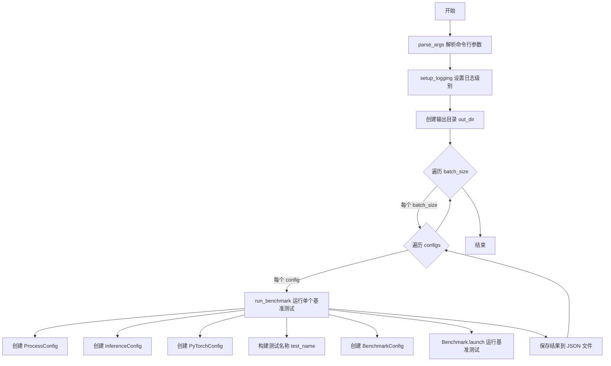
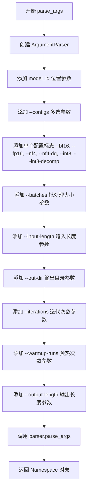
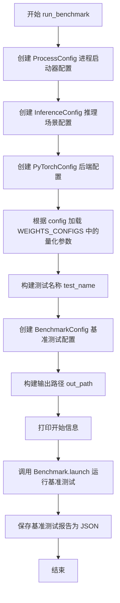

# `bitsandbytes\benchmarking\inference_benchmark.py` 详细设计文档

A command-line inference benchmarking tool that measures latency and memory performance of large language models under various quantization configurations (bf16, fp16, nf4, nf4-dq, int8, int8-decomp) across different batch sizes using the optimum-benchmark framework.

## 整体流程



## 类结构

```
无类层次结构（脚本文件）
外部依赖类:
├── Benchmark (optimum_benchmark)
├── BenchmarkConfig (optimum_benchmark)
├── InferenceConfig (optimum_benchmark)
├── ProcessConfig (optimum_benchmark)
└── PyTorchConfig (optimum_benchmark)
```

## 全局变量及字段


### `BFLOAT16_SUPPORT`
    
表示当前GPU是否支持BFloat16精度

类型：`bool`
    


### `WEIGHTS_CONFIGS`
    
存储不同量化配置（fp16/bf16/nf4/nf4-dq/int8/int8-decomp）的模型加载参数

类型：`dict`
    


### `args`
    
解析后的命令行参数

类型：`Namespace`
    


### `out_dir`
    
输出报告的目录路径

类型：`Path`
    


### `batch_size`
    
当前遍历的批次大小

类型：`int`
    


### `config`
    
当前遍历的配置名称

类型：`str`
    


### `run_benchmark.launcher_config`
    
进程配置，用于设置进程隔离和启动方式

类型：`ProcessConfig`
    


### `run_benchmark.scenario_config`
    
推理场景配置，包含延迟、内存、输入形状和迭代次数等设置

类型：`InferenceConfig`
    


### `run_benchmark.backend_config`
    
PyTorch后端配置，包含设备、模型和量化参数

类型：`PyTorchConfig`
    


### `run_benchmark.test_name`
    
基准测试的唯一名称，包含配置和参数信息

类型：`str`
    


### `run_benchmark.benchmark_config`
    
完整的基准测试配置，整合所有配置对象

类型：`BenchmarkConfig`
    


### `run_benchmark.out_path`
    
输出JSON文件的完整路径

类型：`Path`
    


### `run_benchmark.benchmark_report`
    
基准测试结果对象，包含性能指标数据

类型：`BenchmarkResult`
    
    

## 全局函数及方法


### `parse_args`

该函数用于解析命令行参数，创建一个 `argparse.ArgumentParser` 实例，定义所有需要的命令行选项（包括模型ID、配置类型、批处理大小、输入输出长度等），并返回包含所有配置选项的 `argparse.Namespace` 对象，供主程序后续使用。

参数：- 该函数没有输入参数

返回值：`argparse.Namespace`，包含以下属性：
- `model_id`：str，要使用的模型检查点路径
- `configs`：list[str]，要运行的配置列表（如 ["nf4", "int8"]）
- `batches`：list[int]，要测试的批处理大小列表
- `input_length`：int，输入序列长度
- `out-dir`：str，输出目录路径
- `iterations`：int，每次基准测试的迭代次数
- `warmup-runs`：int，预热运行次数
- `output-length`：int，输出token长度

#### 流程图



#### 带注释源码

```python
def parse_args():
    """
    解析命令行参数，返回包含所有配置选项的Namespace对象。
    
    该函数创建一个argparse.ArgumentParser实例，定义所有需要的命令行选项，
    包括模型ID、配置类型、批处理大小、输入输出长度等，并返回解析后的参数对象。
    """
    # 创建参数解析器，设置工具描述
    parser = argparse.ArgumentParser(description="bitsandbytes inference benchmark tool")

    # 添加位置参数 model_id：指定要使用的模型检查点路径（必需参数）
    parser.add_argument("model_id", type=str, help="The model checkpoint to use.")

    # 添加 --configs 选项：多选参数，允许用户指定运行哪些配置
    # 默认值为 ["nf4", "int8", "int8-decomp"]，必须从预定义 choices 中选择
    parser.add_argument(
        "--configs",
        nargs="+",  # 接受一个或多个值
        choices=["bf16", "fp16", "nf4", "nf4-dq", "int8", "int8-decomp"],  # 允许的配置选项
        default=["nf4", "int8", "int8-decomp"],  # 默认配置
    )
    
    # 添加单独的布尔标志选项，每个标志会将对应配置添加到 configs 列表中
    # 使用 action="append_const" 将 const 指定的常量追加到 dest 指定的列表
    parser.add_argument("--bf16", dest="configs", action="append_const", const="bf16")
    parser.add_argument("--fp16", dest="configs", action="append_const", const="fp16")
    parser.add_argument("--nf4", dest="configs", action="append_const", const="nf4")
    parser.add_argument("--nf4-dq", dest="configs", action="append_const", const="nf4-dq")
    parser.add_argument("--int8", dest="configs", action="append_const", const="int8")
    parser.add_argument("--int8-decomp", dest="configs", action="append_const", const="int8-decomp")

    # 添加 --batches 选项：指定要测试的批处理大小列表，默认 [1, 8, 16, 32]
    parser.add_argument("--batches", nargs="+", type=int, default=[1, 8, 16, 32])
    
    # 添加 --input-length 选项：指定输入序列长度，默认 64
    parser.add_argument("--input-length", type=int, default=64)

    # 添加 --out-dir 选项：指定输出报告的目录，默认 "reports"
    parser.add_argument("--out-dir", type=str, default="reports")

    # 添加 --iterations 选项：每次基准测试的迭代次数，默认 10
    parser.add_argument("--iterations", type=int, default=10, help="Number of iterations for each benchmark run")
    
    # 添加 --warmup-runs 选项：预热运行次数（用于预热GPU，排除初始化影响），默认 10
    parser.add_argument(
        "--warmup-runs", type=int, default=10, help="Number of warmup runs to discard before measurement"
    )
    
    # 添加 --output-length 选项：生成文本的长度（同时设置 min_new_tokens 和 max_new_tokens），默认 64
    parser.add_argument(
        "--output-length",
        type=int,
        default=64,
        help="If set, `max_new_tokens` and `min_new_tokens` will be set to this value.",
    )

    # 解析命令行参数并返回 Namespace 对象
    return parser.parse_args()
```


### `run_benchmark`

执行单个基准测试函数，接受命令行参数、配置类型和批大小，构建完整的基准测试配置（包括推理场景、PyTorch后端和进程启动器），运行基准测试并将结果保存为JSON文件。

参数：

- `args`：`argparse.Namespace`，包含以下关键属性：
  - `model_id`（str）：模型检查点路径或HuggingFace模型ID
  - `input_length`（int）：输入序列长度，默认64
  - `output_length`（int）：输出序列长度，默认64
  - `iterations`（int）：基准测试迭代次数，默认10
  - `warmup_runs`（int）：预热迭代次数，默认10
- `config`：`str`，量化配置类型，可选值为"bf16"、"fp16"、"nf4"、"nf4-dq"、"int8"、"int8-decomp"之一
- `batch_size`：`int`，推理批大小

返回值：`None`，函数执行完成后将基准测试结果保存至JSON文件，不返回任何值

#### 流程图



#### 带注释源码

```python
def run_benchmark(args, config, batch_size):
    """
    执行单个基准测试
    
    参数:
        args: 命令行参数对象，包含model_id、input_length、output_length等配置
        config: 量化配置类型字符串，如'bf16'、'int8'等
        batch_size: 推理批次大小
    
    返回:
        None: 结果直接保存为JSON文件，不返回数据
    """
    # 配置进程启动器，设置设备隔离模式和spawn启动方法
    launcher_config = ProcessConfig(
        device_isolation=True,          # 启用设备隔离
        device_isolation_action="warn", # 隔离冲突时发出警告
        start_method="spawn"            # 使用spawn方式启动子进程
    )
    
    # 配置推理场景参数
    scenario_config = InferenceConfig(
        latency=True,                   # 测量延迟
        memory=True,                    # 测量内存
        input_shapes={"batch_size": batch_size, "sequence_length": args.input_length},
        iterations=args.iterations,     # 迭代次数
        warmup_runs=args.warmup_runs,   # 预热次数
        # 将duration设为0以禁用基于时间的停止条件
        # 这确保所有基准测试运行相同数量的操作，无论硬件速度如何
        duration=0,
        # 为了一致的结果，固定输出token的最小和最大值
        generate_kwargs={"min_new_tokens": args.output_length, "max_new_tokens": args.output_length},
        forward_kwargs={"min_new_tokens": args.output_length, "max_new_tokens": args.output_length},
    )

    # 配置PyTorch后端，使用CUDA和指定量化方案
    backend_config = PyTorchConfig(
        device="cuda",                  # 使用CUDA设备
        device_ids="0",                 # 使用GPU 0
        device_map="auto",              # 自动分配设备
        no_weights=False,               # 加载权重
        model=args.model_id,            # 模型ID或路径
        **WEIGHTS_CONFIGS[config],      # 根据config展开量化配置
    )

    # 生成测试名称，包含所有关键参数便于识别
    test_name = (
        f"benchmark-{config}"           # 配置类型
        f"-bsz-{batch_size}"            # 批大小
        f"-isz-{args.input_length}"     # 输入长度
        f"-osz-{args.output_length}"    # 输出长度
        f"-iter-{args.iterations}"      # 迭代次数
        f"-wrmup-{args.warmup_runs}"    # 预热次数
    )
    
    # 组装完整的基准测试配置
    benchmark_config = BenchmarkConfig(
        name=test_name,
        scenario=scenario_config,
        launcher=launcher_config,
        backend=backend_config,
    )

    # 构建输出文件路径，使用模块级变量out_dir
    out_path = out_dir / (test_name + ".json")
    
    # 打印开始信息，便于日志追踪
    print(f"[{test_name}] Starting:")
    
    # 启动基准测试并获取报告
    benchmark_report = Benchmark.launch(benchmark_config)
    
    # 将报告保存为JSON文件
    benchmark_report.save_json(out_path)
```

## 关键组件


### 参数解析模块（parse_args）

负责解析命令行参数，支持多种量化配置选项和基准测试参数设置

### 量化配置字典（WEIGHTS_CONFIGS）

定义了六种量化策略的完整配置，包含数据类型、量化方案和bitsandbytes参数

### 基准测试运行函数（run_benchmark）

封装optimum-benchmark的Benchmark配置，构建完整的推理性能测试流程

### CUDA后端配置（PyTorchConfig）

配置PyTorch运行参数，包括设备映射、模型加载和量化策略应用

### 测试场景配置（InferenceConfig）

设置延迟和内存测量参数，定义输入输出形状和生成策略

### 进程隔离配置（ProcessConfig）

配置多进程基准测试的隔离策略和启动方式

### 主程序入口（if __name__ == "__main__"）

整合参数解析、输出目录创建和批量基准测试执行流程

### 设备能力检测（BFLOAT16_SUPPORT）

动态检测CUDA设备是否支持bfloat16精度

### 输出报告模块

将基准测试结果保存为JSON格式，便于后续分析比较


## 问题及建议


### 已知问题

- **命令行参数冲突风险**：`--configs` 的 default 值与通过 `--bf16`/`--fp16` 等单独标志添加的配置可能产生冲突，因为它们都操作同一个目标 `dest="configs"`
- **硬编码 GPU 设备**：`device_ids="0"` 硬编码为单个 GPU，多 GPU 环境无法利用，且无设备可用性检查
- **缺乏错误处理**：未检查 CUDA 可用性、模型是否存在或加载失败的情况，异常会直接中断程序
- **缺少类型注解**：整个代码无类型提示，降低了代码可读性和 IDE 支持
- **魔法数字和硬编码值**：批次大小 `[1, 8, 16, 32]`、默认配置名等硬编码在代码中，应提取为常量或配置
- **配置对象重复创建**：`run_benchmark` 中每次迭代都重新创建 `ProcessConfig`、`InferenceConfig` 等对象，可提取为模板
- **量化配置不支持动态计算精度**：WEIGHTS_CONFIGS 中 bnb_4bit_compute_dtype 依赖 BFLOAT16_SUPPORT 但未考虑其他设备（如 CPU）

### 优化建议

- 添加 `try-except` 块捕获模型加载异常，提供有意义的错误信息
- 增加 `--device-ids` 参数支持多 GPU，或默认使用 `cuda:0` 的动态获取方式
- 为关键函数和类添加类型注解，使用 `typing.Optional`、`typing.List` 等
- 将默认批次、配置列表等提取为模块级常量
- 考虑将重复的配置创建逻辑封装为工厂函数或配置生成器
- 添加 `--verbose` 或 `--quiet` 参数控制日志级别，区分关键信息和调试信息
- 增加模型存在性检查：`Path(args.model_id).exists() or HuggingFace Hub API 检查`
- 添加结果汇总功能，可在所有基准测试完成后输出对比表格

## 其它


### 设计目标与约束

本工具旨在为LLM推理提供标准化的基准测试，支持多种量化配置（fp16/bf16/nf4/int8等）和不同batch_size下的性能评估。核心约束包括：1）确保所有基准测试运行相同数量的操作以保证可比性；2）结果可复现性（cudnn.deterministic=True）；3）结果输出为JSON格式便于后续分析。

### 错误处理与异常设计

代码依赖`optimum_benchmark`库进行基准测试运行，异常处理主要包括：1）`Path.mkdir`的`exist_ok=True`参数避免目录已存在错误；2）通过`try-except`捕获模型加载失败（由`Benchmark.launch`内部抛出）；3）设备隔离配置使用`warn`级别处理GPU不可用情况。

### 数据流与状态机

主流程状态机：parse_args() → 创建out_dir → 遍历(batch_size, config)组合 → run_benchmark() → 保存JSON结果。每个config使用独立的WEIGHTS_CONFIGS映射，batch内串行执行确保资源顺序释放。

### 外部依赖与接口契约

核心依赖：transformers（模型加载）、accelerate（设备管理）、bitsandbytes（量化）、optimum-benchmark（基准测试框架）。model_id参数接受HuggingFace模型ID或本地路径。输出JSON包含latency、memory等指标。

### 配置管理设计

WEIGHTS_CONFIGS字典集中管理所有量化配置，每个配置包含torch_dtype、quantization_scheme、quantization_config三个维度。新增量化方法只需在字典中添加条目，符合开闭原则。

### 资源清理与内存管理

使用ProcessConfig的device_isolation=True实现进程级资源隔离。cudnn.benchmark=False避免内存碎片，cudnn.deterministic=True确保结果可复现。out_dir使用pathlib.Path统一管理。

### 命令行接口设计

使用argparse实现，支持两种配置方式：1）--configs批量指定；2）--bf16等独立flag追加。默认值组合为["nf4", "int8", "int8-decomp"]，batches默认[1,8,16,32]覆盖典型推理场景。

### 一致性与可重复性设计

关键设计点：1）duration=0禁用时间停止条件，强制执行完iterations；2）固定min_new_tokens和max_new_tokens确保生成token数一致；3）warmup-runs预热后测量；4）cudnn.deterministic=True保证CUDA计算确定性。

### 结果输出设计

每个测试生成独立JSON文件，命名格式：benchmark-{config}-bsz-{batch_size}-isz-{input_length}-osz-{output_length}-iter-{iterations}-wrmup-{warmup_runs}。所有结果保存在out-dir目录下，便于脚本批量处理和对比分析。

### 可扩展性设计

量化配置通过WEIGHTS_CONFIGS字典管理，新增量化方法只需添加条目。batch遍历使用for循环，可轻松改为并行处理。BenchmarkConfig各组件（scenario/backend/launcher）分离设计，便于单独替换或扩展。

### 性能特征分析

基准测试覆盖四个维度：latency（延迟）、memory（显存）、throughput（吞吐量通过batch体现）、warmup（预热影响）。通过不同batch_size测试可观察batch扩展性，不同config测试可评估量化精度与速度 tradeoff。

### 版本兼容性检查

BFLOAT16_SUPPORT动态检测CUDA设备计算能力（>=8.0），自动选择bf16或fp16作为NF4的compute_dtype。llm_int8_threshold区分int8和int8-decomp（分解模式），分别为0.0和6.0。

    