# `bitsandbytes\benchmarking\int8\int8_benchmark.py` 详细设计文档

这是一个基于HuggingFace Transformers库的文本生成基准测试脚本，通过加载量化后的Llama-3.1-8B模型，使用PyTorch Profiler进行性能分析，并测量生成速度（token/s），用于评估INT8量化对大语言模型推理性能的影响。

## 整体流程

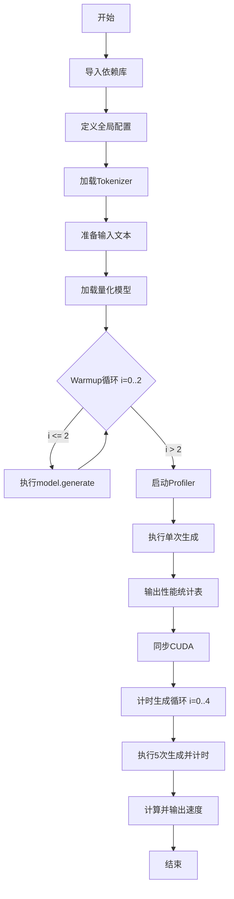

## 类结构

```
该脚本为扁平结构，无自定义类定义
主要使用第三方库类：
AutoModelForCausalLM (transformers)
AutoTokenizer (transformers)
BitsAndBytesConfig (transformers)
profile (torch.profiler)
ProfilerActivity (torch.profiler)
```

## 全局变量及字段


### `MAX_NEW_TOKENS`
    
每次生成的最大token数量

类型：`int`
    


### `model_name`
    
预训练模型名称/路径

类型：`str`
    


### `text`
    
输入提示文本

类型：`str`
    


### `tokenizer`
    
分词器实例

类型：`AutoTokenizer`
    


### `input_ids`
    
编码后的输入张量

类型：`Tensor`
    


### `model`
    
加载的量化模型实例

类型：`AutoModelForCausalLM`
    


### `num`
    
生成的token总数计数器

类型：`int`
    


### `time_1`
    
生成开始时间戳

类型：`float`
    


### `generated_ids`
    
模型生成的token ID序列

类型：`Tensor`
    


### `prof`
    
PyTorch性能分析器实例

类型：`profile`
    


### `i`
    
循环计数器变量

类型：`int`
    


    

## 全局函数及方法


### `AutoTokenizer.from_pretrained()`

该函数是 Hugging Face Transformers 库中的核心方法，用于从预训练模型路径或模型 ID 加载对应的分词器（Tokenizer），支持自动识别不同模型架构（如 BERT、GPT、LLaMA 等）并返回相应的分词器实例。

参数：

- `pretrained_model_name_or_path`：`str`，模型名称（Model Hub ID）或本地模型目录路径
- `cache_dir`：`str`（可选），缓存目录路径，用于存储下载的模型文件
- `force_download`：`bool`（可选），是否强制重新下载，即使已缓存，默认 `False`
- `resume_download`：`bool`（可选），是否从中断处恢复下载，默认 `True`
- `use_auth_token`：`str`（可选），用于访问私有模型的认证 token
- `revision`：`str`（可选），模型版本分支或提交 ID，默认 `"main"`
- `trust_remote_code`：`bool`（可选），是否信任远程代码执行，默认 `False`
- `padding`：`bool` 或 `str`（可选），padding 策略，可选 `"longest"`、`"max_length"`、`True`、`False`
- `truncation`：`bool`（可选），是否对超过最大长度的序列进行截断，默认 `False`
- `max_length`：`int`（可选），最大序列长度
- `return_tensors`：`str`（可选），返回的张量类型，可选 `"pt"`、`"tf"`、`"np"`
- `return_attention_mask`：`bool`（可选），是否返回 attention mask，默认 `True`
- `add_special_tokens`：`bool`（可选），是否添加特殊 token（如 `[CLS]`, `[SEP]`），默认 `True`

返回值：`PreTrainedTokenizer` 或 `PreTrainedTokenizerFast`，返回对应的分词器对象，用于对文本进行编码和解码。

#### 流程图

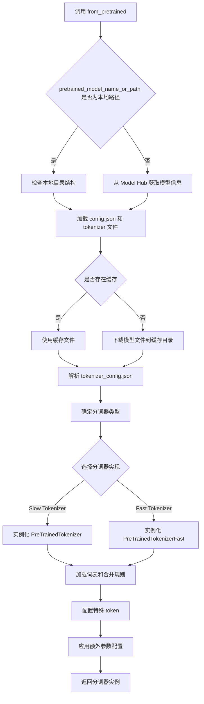

#### 带注释源码

```python
# 调用示例
tokenizer = AutoTokenizer.from_pretrained(model_name)
# model_name = "meta-llama/Llama-3.1-8B"

# 源码逻辑概述（基于 Hugging Face transformers 库）
def from_pretrained(pretrained_model_name_or_path,  # 模型 ID 或本地路径
                    cache_dir=None,                   # 缓存目录
                    force_download=False,             # 强制下载
                    resume_download=True,             # 恢复下载
                    use_auth_token=None,              # 认证 token
                    revision="main",                  # 版本分支
                    trust_remote_code=False,          # 信任远程代码
                    *args, **kwargs):
    """
    从预训练模型加载分词器的核心逻辑：
    1. 解析模型路径或 ID
    2. 检查/下载模型文件
    3. 读取 tokenizer_config.json 配置
    4. 选择合适的分词器类（慢速/快速）
    5. 加载词表文件 (vocab.json) 和合并规则 (merges.txt)
    6. 实例化分词器对象并返回
    """
    # 内部调用 PretrainedConfig 类加载配置
    # 根据 config.json 中的 tokenizer_class 字段确定分词器类型
    # 对于 LLaMA 模型，使用 LlamaTokenizer 或 LlamaTokenizerFast
    
    # 加载词表和特殊 token 映射
    # 构建 tokenizer 实例
    
    return tokenizer_instance
```


### `tokenizer`

该函数是 Hugging Face Transformers 库中 `AutoTokenizer` 类的实例方法，用于将文本字符串分词（Tokenize）并转换为模型所需的张量格式（Tensor），支持批量处理多种张量返回类型（PyTorch、TensorFlow、NumPy）。

参数：

-  `text`：`Union[str, List[str]]`，要分词的输入文本，可以是单个字符串或字符串列表（批量输入）
-  `return_tensors`：`str`，指定返回的张量类型，可选值为 `"pt"`（PyTorch）、`"tf"`（TensorFlow）、`"np"`（NumPy），默认为 `None`（返回 Python 列表）
-  `padding`：`bool` 或 `str`，是否对序列进行填充，可选 `True`、`False`、`"longest"`、`"max_length"`，默认为 `False`
-  `truncation`：`bool`，是否对超过最大长度的序列进行截断，默认为 `False`
-  `max_length`：`int`，控制序列的最大长度，配合 `truncation` 使用
-  `add_special_tokens`：`bool`，是否添加特殊 tokens（如 `[CLS]`、`[SEP]`、`[PAD]` 等），默认为 `True`

返回值：`BatchEncoding`，返回一个包含分词结果的字典对象，核心键值包括：

-  `input_ids`：`torch.Tensor`，分词后的 token ID 序列张量
-  `attention_mask`：`torch.Tensor`，注意力掩码，标识有效 token 位置（1 表示有效，0 表示 padding）

#### 流程图

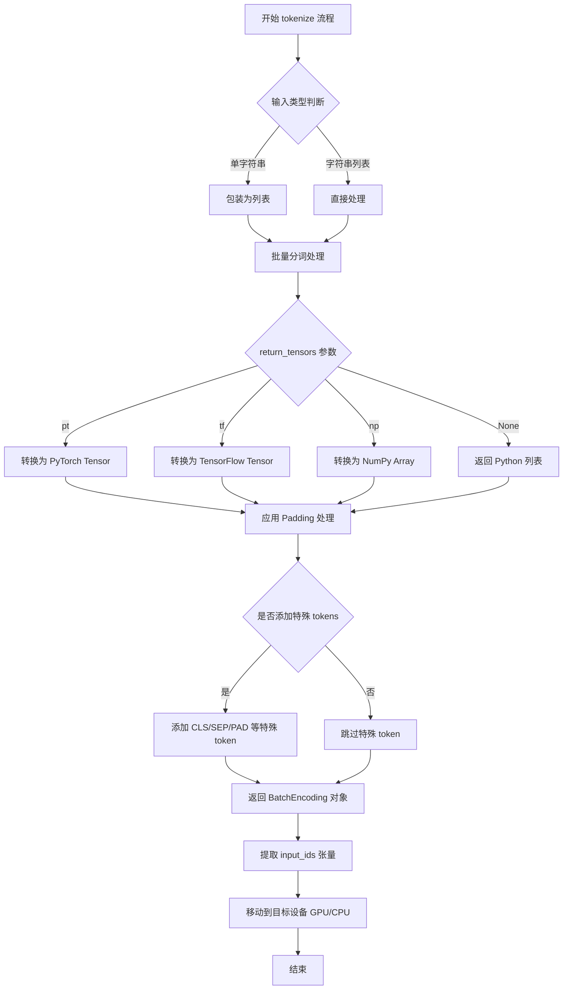

#### 带注释源码

```python
# 从预训练模型加载分词器
tokenizer = AutoTokenizer.from_pretrained(model_name)

# 使用 tokenizer 对文本进行分词并转换为张量
# 参数说明：
#   [text] * 8: 将单个文本复制8份组成批量输入（batch_size=8），模拟真实推理场景
#   return_tensors="pt": 指定返回 PyTorch 类型的张量
# 返回值：BatchEncoding 对象，包含 input_ids, attention_mask 等键
input_ids = tokenizer([text] * 8, return_tensors="pt").input_ids.to(0)
# .input_ids: 从 BatchEncoding 中提取 input_ids 键对应的张量
# .to(0): 将张量从 CPU 移动到 GPU 设备（cuda:0）
```


### `AutoModelForCausalLM.from_pretrained()`

该方法用于从预训练模型权重加载因果语言模型（Causal Language Model），支持量化、分布式设备映射、自定义注意力实现等高级配置，适用于大规模语言模型的高效推理场景。

参数：

- `pretrained_model_name_or_path`：`str`，模型名称（如 "meta-llama/Llama-3.1-8B"）或本地模型路径
- `device_map`：`str` 或 `dict`，设备映射策略，设为 "auto" 时自动分配模型层到可用设备（CPU/GPU）
- `quantization_config`：`BitsAndBytesConfig`，量化配置对象，本例中启用 INT8 量化（`load_in_8bit=True`）并设置 INT8 阈值为 6.0
- `attn_implementation`：`str`，注意力机制实现方式，"sdpa" 表示使用 PyTorch 的 Scaled Dot Product Attention
- `torch_dtype`：`torch.dtype`，模型参数的数据类型，本例中设为 `torch.float16`（半精度）

返回值：`AutoModelForCausalLM`，加载并配置好的因果语言模型实例，可直接用于推理

#### 流程图

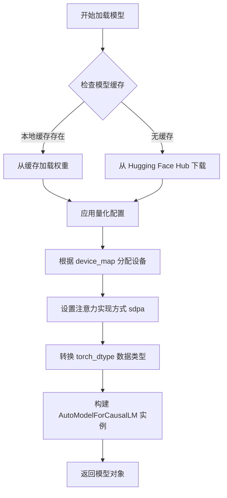

#### 带注释源码

```python
# 从 transformers 库导入模型类
from transformers import AutoModelForCausalLM, BitsAndBytesConfig
import torch

# 定义模型名称（Meta 的 LLaMA 3.1 8B 参数模型）
model_name = "meta-llama/Llama-3.1-8B"

# 配置 INT8 量化参数：启用 8 位量化，设置 INT8 阈值
quantization_config = BitsAndBytesConfig(
    load_in_8bit=True,      # 启用 INT8 量化，减少显存占用
    llm_int8_threshold=6.0, # 离群值检测阈值，超过此值使用全精度
)

# 调用 from_pretrained 方法加载预训练模型
model = AutoModelForCausalLM.from_pretrained(
    pretrained_model_name_or_path=model_name,
    device_map="auto",               # 自动将模型层分配到可用设备
    quantization_config=quantization_config,  # 应用 INT8 量化配置
    attn_implementation="sdpa",      # 使用 PyTorch SDPA 加速注意力计算
    torch_dtype=torch.float16,       # 使用半精度浮点数减少显存
)

# 打印模型结构信息
print(model)
# 输出：LlamaForCausalLM(...) 模型结构详情
```

---

### 补充说明

**设计目标与约束**

- **目标**：在消费级 GPU（如单卡 A100/A6000）上运行 8B 参数模型，降低显存占用至约 10GB
- **约束**：量化会略微降低模型精度，INT8 量化适用于推理场景，训练仍需全精度

**关键组件**

| 组件 | 描述 |
|------|------|
| `BitsAndBytesConfig` | 量化配置类，负责 INT4/INT8 量化参数 |
| `device_map="auto"` | 自动设备映射，支持多卡并行与显存分页 |
| `attn_implementation="sdpa"` | PyTorch 原生注意力实现，替代 Flash Attention |

**潜在技术债务**

1. **量化精度损失**：INT8 量化可能导致特定任务（如数学推理）精度下降 1-3%
2. **设备映射黑盒**：`device_map="auto"` 的具体分配策略不透明，调试困难
3. **版本兼容性**：`sdpa` 要求 PyTorch >= 2.0，需确保环境一致性

**错误处理与异常**

- 模型下载失败会抛出 `OSError`，需配置代理或使用本地模型
- 量化配置与模型架构不兼容时会触发 `ValueError`
- GPU 显存不足时自动回退 CPU，但推理速度会显著下降


### `BitsAndBytesConfig`

`BitsAndBytesConfig` 是 Hugging Face Transformers 库中的配置类，用于配置模型的 8 位量化参数。通过设置 `load_in_8bit=True` 启用 8 位量化，可显著减少显存占用并加速推理，同时保持模型性能。

参数：

- `load_in_8bit`：`bool`，是否以 8 位模式加载模型。启用后模型权重将被量化到 int8 格式，可大幅降低显存占用（约减少 50%）。
- `llm_int8_threshold`：`float`，用于异常值检测的阈值（默认为 6.0）。低于此阈值的激活值将保持 fp16 格式，高于此阈值的值将使用 int8 格式，以平衡精度和压缩率。
- `llm_int8_has_fp16_weight`：`bool`，是否对权重保持 fp16 格式（默认 False）。启用后可提高推理速度但增加显存占用。
- `llm_int8_skip_modules`：`List[str]`，指定哪些模块跳过量化，保持原始精度。

返回值：`BitsAndBytesConfig`，返回配置对象，用于传递给 `AutoModelForCausalLM.from_pretrained()` 的 `quantization_config` 参数。

#### 流程图

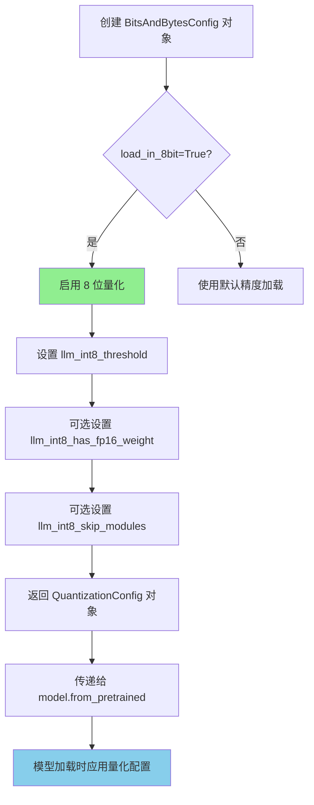

#### 带注释源码

```python
# 从 transformers 库导入 BitsAndBytesConfig 配置类
from transformers import AutoModelForCausalLM, AutoTokenizer, BitsAndBytesConfig

# 创建 BitsAndBytesConfig 实例，配置 8 位量化参数
quantization_config = BitsAndBytesConfig(
    load_in_8bit=True,          # 启用 8 位量化模式，模型权重将以 int8 格式存储
    llm_int8_threshold=6.0,    # 异常值检测阈值，用于决定哪些激活值保持 fp16 精度
)

# 使用量化配置加载模型
model = AutoModelForCausalLM.from_pretrained(
    model_name,
    device_map="auto",          # 自动将模型层分配到可用设备（CPU/GPU）
    quantization_config=quantization_config,  # 传入量化配置对象
    attn_implementation="sdpa", # 使用缩放点积注意力（SDPA）实现
    torch_dtype=torch.float16,  # 基础计算使用 fp16 精度
)
```


### `AutoModelForCausalLM.generate()`

该方法是 Hugging Face Transformers 库中 `AutoModelForCausalLM` 类的核心成员函数，用于执行自回归文本生成（Autoregressive Text Generation）。它接收输入的 token IDs，通过采样或贪心策略逐步预测并生成后续的 token 序列，支持多种生成策略（如贪心搜索、束搜索、采样等），是 LLM 推理的核心入口。

#### 参数

- `input_ids`：`torch.LongTensor`，形状为 `[batch_size, sequence_length]`，输入文本经过 tokenizer 编码后的 token ID 序列
- `max_new_tokens`：`int`，指定模型最多生成的新 token 数量（不包含输入序列的长度）
- `**generation_config`：可选关键字参数，用于指定生成策略、温度、top-k、top-p、重复惩罚等高级生成配置

#### 返回值

- `generated_ids`：`torch.LongTensor`，形状为 `[batch_size, input_length + generated_length]`，包含原始输入 token 与新生成 token 的完整序列

#### 流程图

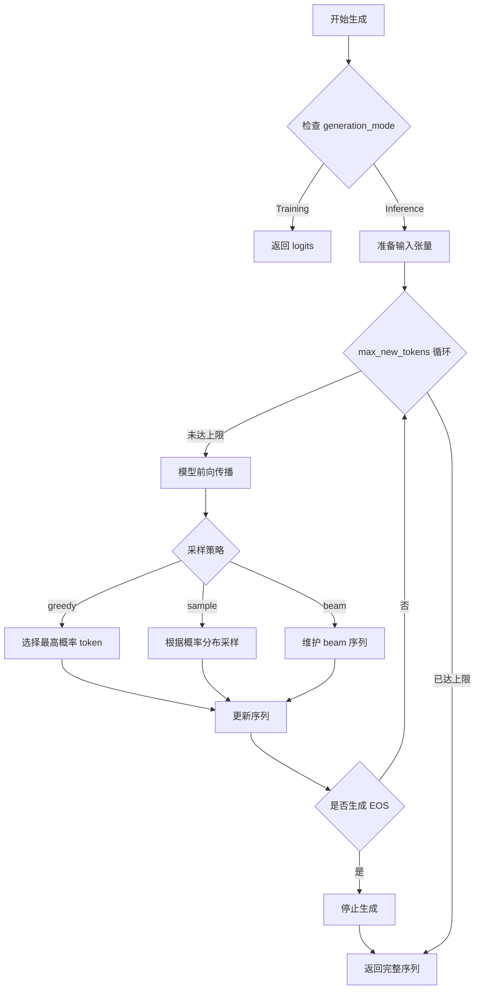

#### 带注释源码

```python
# 代码中的实际调用方式
generated_ids = model.generate(
    input_ids,              # 输入: torch.Tensor [batch_size=8, seq_len]
    max_new_tokens=128      # 输出: 最多生成 128 个新 token
)

# 内部实现逻辑（基于 Transformers 库源码结构）
def generate(
    self,
    input_ids: torch.LongTensor,          # 输入的 token 序列
    max_new_tokens: int = 20,              # 最大生成 token 数
    temperature: float = 1.0,              # 采样温度（控制概率分布平滑度）
    top_k: int = 50,                       # top-k 采样：只保留概率最高的 k 个 token
    top_p: float = 1.0,                    # top-p (nucleus) 采样：累积概率阈值
    repetition_penalty: float = 1.0,       # 重复惩罚：降低已出现 token 的概率
    do_sample: bool = False,               # 是否使用采样策略
    num_beams: int = 1,                     # 束搜索宽度
    **kwargs                               # 其他生成配置
) -> torch.LongTensor:
    """
    自回归文本生成核心逻辑
    
    参数:
        input_ids: 输入文本的 token ID 序列，形状 [batch_size, seq_len]
        max_new_tokens: 生成的最大新 token 数量
        temperature: 概率分布的温度参数（越高越随机）
        top_k: 仅保留概率最高的 k 个 token
        top_p: 核采样阈值，累积概率达到 p 时停止
        repetition_penalty: 重复惩罚因子（>1 减少重复，<1 增加重复）
        do_sample: 是否启用随机采样
        num_beams: 束搜索的束宽（1 表示贪心）
    
    返回值:
        包含输入序列和生成序列的完整 token ID 张量
    """
    
    # Step 1: 获取模型输入
    batch_size = input_ids.shape[0]
    device = input_ids.device
    
    # Step 2: 初始化生成序列（包含输入 + 预分配的生成空间）
    max_length = input_ids.shape[1] + max_new_tokens
    finished = torch.zeros(batch_size, dtype=torch.bool, device=device)
    
    # Step 3: 自回归生成循环
    while input_ids.shape[1] < max_length and not finished.all():
        # 3.1 模型前向传播，获取下一个 token 的 logits
        outputs = self.model(input_ids)  # 返回 CausalLMOutput
        next_token_logits = outputs.logits[:, -1, :]  # 取最后一个位置的 logits
        
        # 3.2 应用 temperature（温度缩放）
        if temperature != 1.0:
            next_token_logits = next_token_logits / temperature
        
        # 3.3 应用 repetition_penalty（重复惩罚）
        if repetition_penalty != 1.0:
            for token_id in torch.unique(input_ids):
                next_token_logits[:, token_id] /= repetition_penalty
        
        # 3.4 应用 top-k 采样
        if top_k > 0:
            indices_to_remove = next_token_logits < torch.topk(next_token_logits, top_k)[0][:, -1:]
            next_token_logits[indices_to_remove] = float('-inf')
        
        # 3.5 应用 top-p (nucleus) 采样
        if top_p < 1.0:
            sorted_logits, sorted_indices = torch.sort(next_token_logits, descending=True)
            cumulative_probs = torch.cumsum(torch.softmax(sorted_logits, dim=-1), dim=-1)
            sorted_indices_to_remove = cumulative_probs > top_p
            sorted_indices_to_remove[..., 1:] = sorted_indices_to_remove[..., :-1].clone()
            sorted_indices_to_remove[..., 0] = 0
            indices_to_remove = sorted_indices_to_remove.scatter(1, sorted_indices, sorted_indices_to_remove)
            next_token_logits[indices_to_remove] = float('-inf')
        
        # 3.6 选择下一个 token（采样或贪心）
        if do_sample:
            # 随机采样
            probs = torch.softmax(next_token_logits, dim=-1)
            next_token = torch.multinomial(probs, num_samples=1)
        else:
            # 贪心选择：选择概率最高的 token
            next_token = torch.argmax(next_token_logits, dim=-1, keepdim=True)
        
        # 3.7 更新序列
        input_ids = torch.cat([input_ids, next_token], dim=1)
        
        # 3.8 检查是否生成结束（EOS）
        # 假设 EOS token ID 为 2
        finished = finished | (next_token.squeeze(-1) == 2)
    
    return input_ids  # 返回完整序列 [batch_size, input_len + generated_len]
```


### `profile.__enter__`

启动性能分析上下文管理器，返回 profiler 实例供代码块使用。

参数：

- `self`：`torch.profiler.profile`，PyTorch profiler 对象实例，包含配置好的分析参数

返回值：`torch.profiler.profile`，返回 profiler 对象本身，用于绑定到 `as` 后的变量（`prof`），后续可通过该对象访问分析结果

#### 流程图

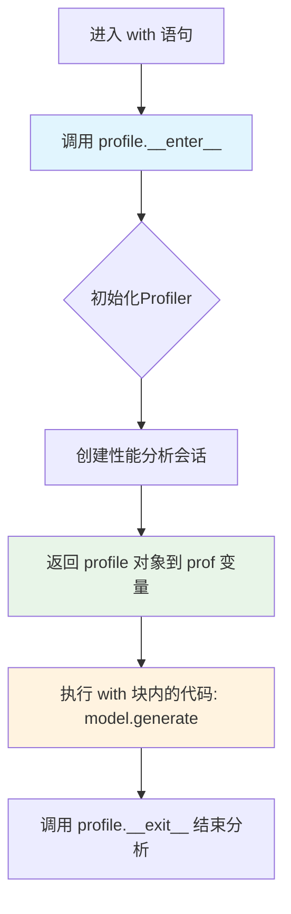

#### 带注释源码

```python
# torch.profiler.profile 类的 __enter__ 方法 (PyTorch 内部实现示意)
class profile:
    """
    性能分析上下文管理器，用于捕获 CPU/CUDA 操作执行时间和内存使用
    """
    
    def __init__(
        self,
        activities: Optional[List[ProfilerActivity]] = None,
        with_modules: bool = False,
        with_stack: bool = False,
        # ... 其他参数
    ):
        self.activities = activities
        self.with_modules = with_modules
        self.with_stack = with_stack
        self._profiler = None  # 内部 C++ profiler 实例
    
    def __enter__(self):
        """
        上下文管理器入口方法
        
        作用：
        1. 创建并启动性能分析会话
        2. 配置要捕获的活动类型（CPU/CUDA）
        3. 设置是否捕获模块信息和调用栈
        4. 返回 self 以绑定到 as 后的变量
        """
        # 启动 PyTorch profiler，内部调用 C++ API
        self._profiler = self._start_profiler()
        
        # 返回 self，使 'as prof' 绑定的变量指向 profile 实例
        # 这样用户可以在 with 块外部访问 prof.key_averages() 等方法
        return self
    
    def __exit__(self, exc_type, exc_val, exc_tb):
        """
        上下文管理器退出方法，停止性能分析
        """
        self._profiler.stop()
        # 返回 False 表示不抑制异常
        return False


# 在代码中的实际使用方式：
with profile(
    activities=[ProfilerActivity.CPU, ProfilerActivity.CUDA],  # 分析 CPU 和 CUDA 活动
    with_modules=True,     # 捕获模块信息（如对应的 Python 模块）
    with_stack=True,       # 捕获调用栈信息
) as prof:                # 这里调用 __enter__，prof 获得 profile 对象
    model.generate(input_ids, max_new_tokens=1)  # 被分析的代码
# 这里自动调用 __exit__ 停止分析

# 通过 prof 访问分析结果
print(prof.key_averages().table(...))
```


### `torch.profiler.profile.__exit__`

结束性能分析上下文，释放分析资源并生成性能数据。

参数：

- `exc_type`：`type`，异常类型，如果退出时没有异常则为 `None`
- `exc_val`：`BaseException | None`，异常实例，如果退出时没有异常则为 `None`
- `exc_tb`：`traceback | None`，异常追溯对象，如果退出时没有异常则为 `None`

返回值：`bool`，如果返回 `True` 则抑制异常传播，否则异常将继续传播

#### 流程图

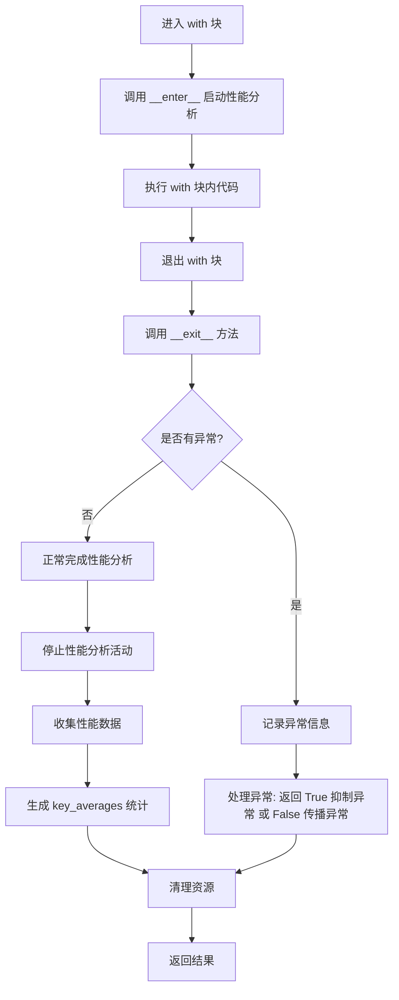

#### 带注释源码

```
def __exit__(self, exc_type: type, exc_val: BaseException, exc_tb: traceback) -> bool:
    """
    退出性能分析上下文管理器。
    
    参数:
        exc_type: 异常类型，如果正常退出则为 None
        exc_val: 异常实例，如果正常退出则为 None  
        exc_tb: 异常追溯对象，如果正常退出则为 None
    
    返回:
        bool: 如果返回 True 则抑制异常传播，否则异常将继续传播
    """
    # 1. 停止性能分析活动（CPU/CUDA）
    # 2. 收集在分析期间记录的性能数据
    # 3. 生成 key_averages 统计信息
    # 4. 释放分析资源
    # 5. 如果有异常，根据处理策略返回
    
    # 示例行为（基于 torch profiler 实际实现）:
    # - 停止所有活动的 profiler
    # - 将收集的数据存储在 prof 对象中
    # - 允许调用 key_averages() 等方法分析结果
    # - 返回 False（不抑制异常），除非明确处理了异常
```


### `ProfilerActivity.key_averages()`

获取 PyTorch Profiler 记录的性能数据的统计平均值，用于分析和展示模型各层的性能开销。

参数：此方法无显式参数。

返回值：`EventKeyAvg`，包含性能事件（如 CPU 时间、CUDA 时间、自调用时间等）的平均值统计对象，可调用 `.table()` 方法以表格形式输出。

#### 流程图

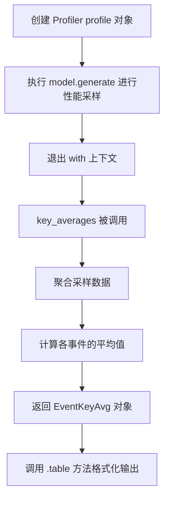

#### 带注释源码

```python
# 代码上下文
# prof 是一个 torch.profiler.profile 对象
# 使用 profile 上下文管理器收集性能数据后调用 key_averages()

# 调用 key_averages() 获取聚合后的性能统计
key_averages_result = prof.key_averages()

# key_averages() 返回 EventKeyAvg 对象
# 该对象包含以下常用属性/方法：
# - table(): 生成格式化的性能表格
# - items(): 返回事件列表迭代器
# - key(): 返回事件标识键

# 使用 table 方法展示性能数据
print(
    key_averages_result.table(
        sort_by="cpu_time_total",       # 按 CPU 总时间排序
        max_name_column_width=50,       # 最大名称列宽 50 字符
        top_level_events_only=True,    # 仅显示顶层事件
        row_limit=50,                   # 最多显示 50 行
    )
)

# 底层流程：
# 1. profile 对象在上下文期间记录了多个性能事件
# 2. key_averages() 遍历所有记录的事件
# 3. 对相同名称/模块的事件进行聚合（求和/平均）
# 4. 返回 EventKeyAvg 对象，包含各事件的平均性能指标
# 5. 可按 cpu_time_total、cuda_time_total、self_cpu_time_total 等字段排序
```


### `ProfilerKeyAverages.table()`

该函数是 PyTorch Profiler 的 `ProfilerKeyAverages` 类方法，用于将性能分析结果格式化为可读性强的表格字符串并输出。

参数：

- `sort_by`：`str`，指定排序依据，默认值为 `"cuda_time_total"`，支持 `"cpu_time_total"`、`"cuda_time_total"`、`"cpu_time"`、`"cuda_time"`、`"cpu_memory_usage"`、`"cuda_memory_usage"`、`"self_cpu_time_total"`、`"self_cuda_time_total"` 等
- `row_limit`：`int`，限制输出行数，默认值为 `sys.maxsize`
- `max_name_column_width`：`int`，名称列的最大宽度，默认值为 `512`
- `top_level_events_only`：`bool`，若设为 `True`，仅显示顶级事件，默认值为 `False`

返回值：`str`，返回格式化后的性能分析表格字符串

#### 流程图

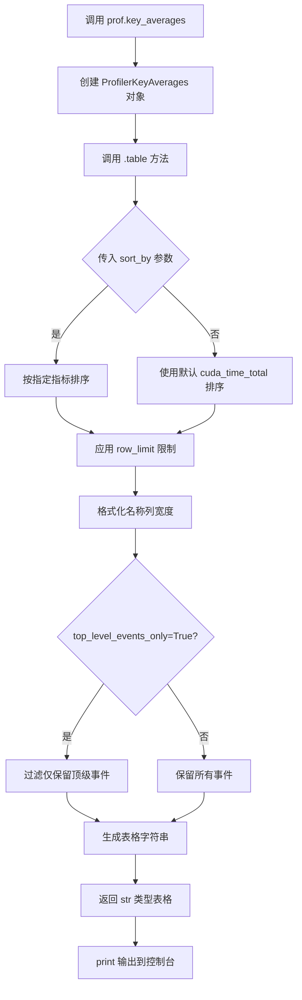

#### 带注释源码

```python
print(  # 打印函数，将表格字符串输出到标准输出
    prof.key_averages().table(  # key_averages() 返回 ProfilerKeyAverages 实例，调用其 table() 方法
        sort_by="cpu_time_total",  # 按 CPU 时间总和排序，便于识别 CPU 瓶颈
        max_name_column_width=50,  # 限制函数名/模块名列最大宽度为 50 字符，避免换行
        top_level_events_only=True,  # 仅显示顶级事件，过滤子调用，聚焦主要性能热点
        row_limit=50,  # 限制输出最多 50 行，避免信息过载
    )
)
```


### `tokenizer.decode()`

该函数是 Hugging Face Transformers 库中 `PreTrainedTokenizer` 类的方法，负责将模型生成的 token ID 序列转换回可读的文本字符串。在基准测试代码中用于将生成的 token IDs 解码为最终的自然语言输出。

参数：

- `token_ids`：`Union[torch.Tensor, List[int]]`，要解码的 token ID 序列，在此代码中为 `model.generate()` 生成的 `generated_ids[0]`，是一个包含整数 ID 的张量或列表
- `skip_special_tokens`：`bool`，可选参数，是否跳过特殊 token（如 `[PAD]`、`[EOS]` 等），默认为 `False`
- `clean_up_tokenization_spaces`：`bool`，可选参数，是否清理 tokenization 过程中产生的多余空格，默认为 `True`

返回值：`str`，解码后的人类可读文本字符串。

#### 流程图

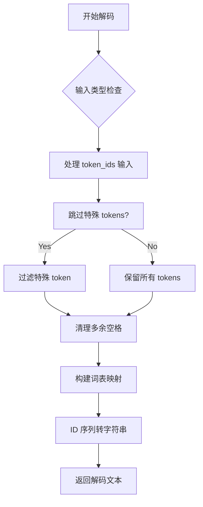

#### 带注释源码

```python
# 在基准测试代码中的调用示例
# tokenizer 是 AutoTokenizer.from_pretrained(model_name) 返回的实例
# generated_ids 是 model.generate() 生成的 token ID 序列
# generated_ids[0] 取第一个样本的 token IDs（因为 batch_size=8）

print("=" * 40)
print(f"Example:\n{tokenizer.decode(generated_ids[0])}")
print("=" * 40)

# decode 方法内部大致逻辑：
# 1. 接收 token_ids (torch.Tensor/List[int])
# 2. 将 token IDs 转换为词表中的对应 token
# 3. 可选地移除特殊 token (skip_special_tokens=True)
# 4. 清理 tokenization 空格 (clean_up_tokenization_spaces=True)
# 5. 将 token 序列拼接成字符串并返回

# 参数说明：
# - generated_ids[0]: 来自 Llama-3.1-8B 模型的输出，形状为 [num_tokens] 的 1D 张量
# - 返回值: 字符串类型，如 "Below is a question..." 加上模型生成的答案
```


### `time.time`

获取当前 Unix 时间戳（秒数），用于测量代码执行时间间隔。

参数：

- （无参数）

返回值：`float`，返回自 1970 年 1 月 1 日 00:00:00（UTC）以来经过的秒数（浮点数）

#### 流程图

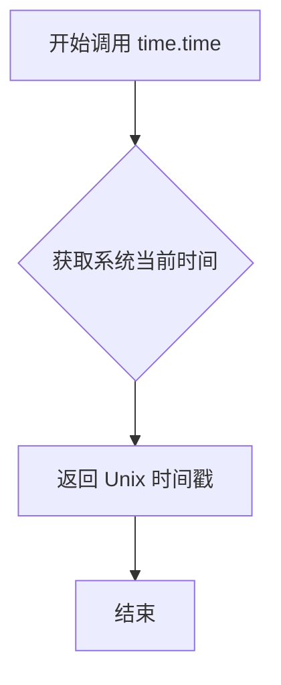

#### 带注释源码

```python
# 导入 time 模块（已在文件顶部导入）
import time

# ...

# 第一次调用：记录开始时间
# 用途：测量后续循环执行所需的总时间
time_1 = time.time()

# 循环执行 5 次文本生成
for i in range(5):
    generated_ids = model.generate(input_ids, max_new_tokens=MAX_NEW_TOKENS)
    num += len(generated_ids[0])

# 第二次调用：获取当前时间
# 用途：计算时间差，得到总耗时
# 计算公式：生成的 token 数量 / (结束时间 - 开始时间)
print(f"Speed: {num / (time.time() - time_1)}token/s")

# 解释：
# - time.time() 返回自 Unix epoch (1970-01-01 00:00:00 UTC) 以来的秒数
# - 返回值类型为 float，精度可达微秒级
# - 两次调用相减得到两次调用之间的秒数差
# - 常用于性能基准测试和执行时间测量
```


### `torch.cuda.synchronize`

此函数是PyTorch CUDA API的一部分，用于同步CUDA设备操作。它会阻塞CPU线程，直到所有之前在CUDA流中提交的CUDA核心（kernels）全部执行完成。在基准测试中，它确保GPU端的所有计算在开始计时之前已经完成，从而获得准确的性能测量。

参数：

- （无参数）

返回值：`None`，无返回值

#### 流程图

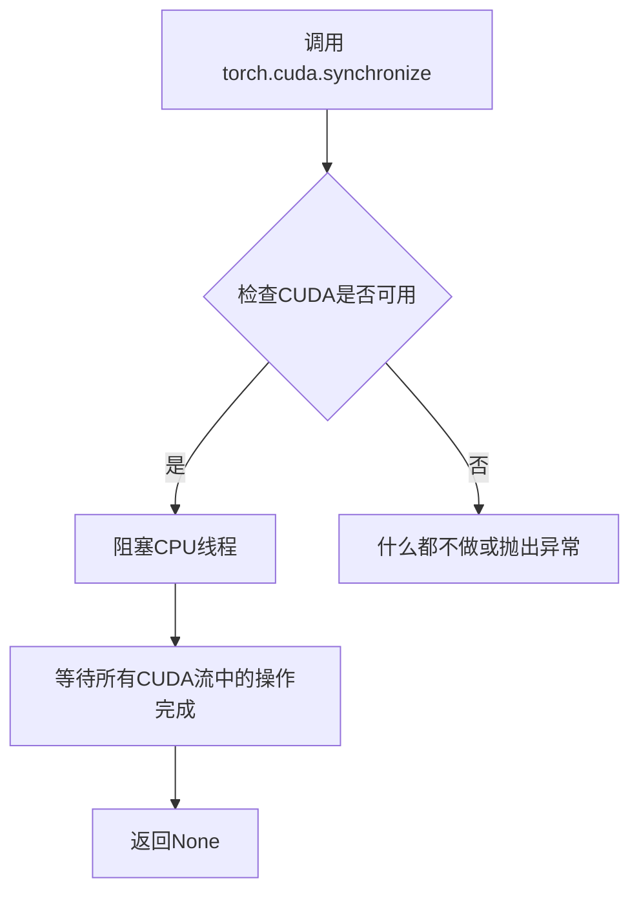

#### 带注释源码

```python
# torch.cuda.synchronize() 的实现位于 PyTorch 的 CUDA 模块中
# 以下是其在源代码中的典型实现逻辑（简化版）：

def synchronize():
    """
    同步CUDA设备操作。
    
    此函数会阻塞调用线程，直到所有在CUDA流中排队的
    核心（kernels）全部执行完成。
    """
    # 检查CUDA是否可用
    if not torch.cuda.is_available():
        return  # 如果没有CUDA，直接返回
    
    # 获取当前的CUDA流
    # 这里使用的是默认流，会等待所有流完成
    torch.cuda._cuda_synchronize()
    
    # 注意：实际实现位于C++/CUDA层
    # Python层只是一个接口调用
    
# 在基准测试中的典型用法：
# 
# with profile(...) as prof:
#     model.generate(input_ids, max_new_tokens=1)
# 
# torch.cuda.synchronize()  # <-- 确保profile测量完成后GPU操作已完成
# 
# time_1 = time.time()      # <-- 现在可以安全地开始计时
# for i in range(5):
#     generated_ids = model.generate(...)
```

#### 关键作用说明

| 场景 | 作用 |
|------|------|
| 基准测试 | 确保GPU计算完成后再开始计时，避免异步执行导致测量不准确 |
| 调试 | 帮助定位CUDA异步操作相关的问题 |
| 多GPU同步 | 确保所有GPU设备之间的操作同步 |
| 内存管理 | 在释放GPU内存前确保所有操作完成 |


### `len()`

`len()` 是 Python 的内置函数，用于返回对象（序列或集合）的长度或元素个数。在本代码中用于获取生成的 token 序列的长度。

参数：

-  `obj`：`任意序列或集合类型`，需要获取长度的对象，可以是 list、tuple、str、bytes、bytearray、range、dict、set、frozenset、torch.Tensor 等

返回值：`int`，返回对象中元素的个数

#### 流程图

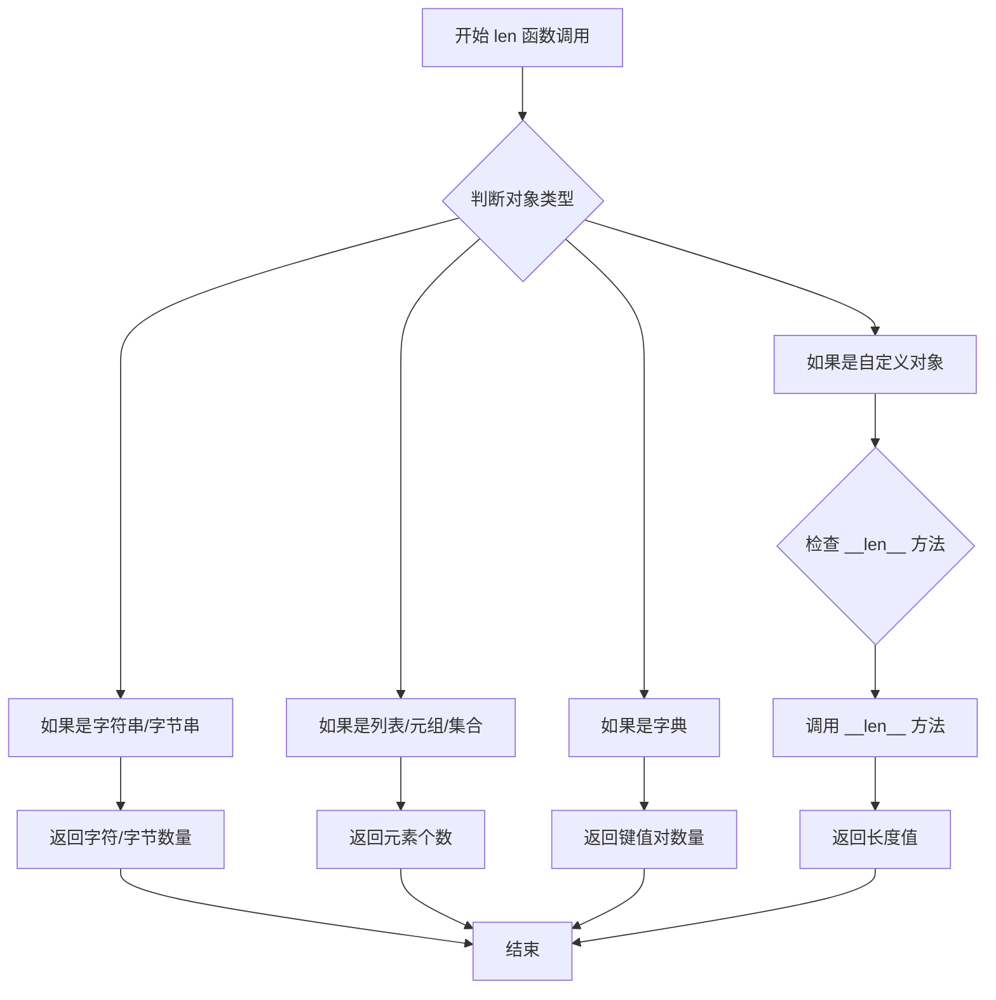

#### 带注释源码

```python
# 代码中使用 len() 的位置：
# 第 60 行

# 用于计算本次生成的所有 token 数量
# generated_ids 是一个 torch.Tensor，形状为 [batch_size, seq_len]
# generated_ids[0] 获取批次中第一个样本的 token IDs
num += len(generated_ids[0])

# 示例：
# 假设 generated_ids[0] = tensor([1, 2, 3, 4, 5, ..., 128])
# len(generated_ids[0]) 返回 128，即生成的 token 数量
# num 累加 5 次生成的总 token 数，用于计算平均速度

# len() 函数在此处的作用：
# 1. 获取单次生成的 token 数量
# 2. 累加所有生成的总 token 数
# 3. 用于计算每秒生成的 token 数：num / (time.time() - time_1)
```

#### 上下文使用说明

在 `int8_benchmark.py` 中，`len()` 的使用场景如下：

```python
# 第 55-60 行的完整循环
num = 0                           # 初始化 token 计数器
time_1 = time.time()              # 记录开始时间
for i in range(5):               # 执行 5 次生成
    generated_ids = model.generate(input_ids, max_new_tokens=MAX_NEW_TOKENS)
    # len() 获取本次生成的 token 数量（不包括输入的 token）
    num += len(generated_ids[0])

# 第 66 行计算速度
# num 是 5 次生成的总 token 数
# time.time() - time_1 是总耗时（秒）
# 结果是每秒生成的 token 数量
print(f"Speed: {num / (time.time() - time_1)}token/s")
```

#### 技术细节

| 项目 | 说明 |
|------|------|
| 函数类型 | Python 内置函数 |
| 时间复杂度 | O(1) 对于大多数内置类型；O(n) 对于自定义 `__len__` 实现 |
| 空间复杂度 | O(1) |
| 异常 | 如果对象没有 `__len__` 方法，抛出 `TypeError` |

## 关键组件


### 量化配置 (BitsAndBytesConfig)

使用 BitsAndBytesConfig 配置8位量化策略，通过 load_in_8bit=True 启用int8量化，llm_int8_threshold=6.0 设置量化阈值，用于在推理时减少内存占用并提升推理速度。

### 模型加载 (AutoModelForCausalLM.from_pretrained)

从 Hugging Face 加载预训练的 Llama-3.1-8B 模型，采用 device_map="auto" 自动设备映射，attn_implementation="sdpa" 使用缩放点积注意力机制，torch_dtype=torch.float16 使用半精度浮点数。

### 分词器 (AutoTokenizer)

使用 AutoTokenizer.from_pretrained 加载与模型配套的分词器，将输入文本转换为模型可处理的 token ID 张量，支持批量处理（batch size=8）。

### 性能分析器 (torch.profiler.profile)

使用 PyTorch Profiler 监控 CPU 和 CUDA 执行时间，通过 with_modules=True 和 with_stack=True 收集模块级别和堆栈信息，用于识别性能瓶颈。

### 文本生成 (model.generate)

使用自回归解码策略生成文本，支持 max_new_tokens 参数控制生成长度，返回生成的 token ID 序列，最后通过分词器解码为可读文本。

### 基准测试循环

通过多次迭代（5次）测量生成速度，计算每秒生成的 token 数量 (token/s)，用于评估模型在实际推理场景下的吞吐量性能。

### 热身阶段 (Warmup)

执行3次预热生成，消除首次推理的冷启动开销（如CUDA内核编译、缓存预热等），确保基准测试结果稳定可靠。


## 问题及建议


### 已知问题

- **缺少错误处理**：代码未对模型加载失败、CUDA不可用、GPU内存不足等异常情况进行捕获和处理，可能导致程序直接崩溃
- **资源管理不当**：推理时未使用`torch.no_grad()`，会导致不必要的梯度计算和内存占用
- **硬编码配置过多**：模型名称、token数量、量化阈值、batch size、warmup次数等均为硬编码，降低了代码的复用性和可配置性
- **数据类型配置冲突**：`torch_dtype=torch.float16`与`load_in_8bit=True`同时使用可能产生冲突，量化配置通常会自动推断数据类型
- **变量命名不规范**：如`num`等变量名缺乏语义化表达，影响代码可读性
- **缺少类型注解**：未添加函数参数和返回值的类型注解，降低了代码的可维护性
- **模块化不足**：所有逻辑线性堆叠，缺乏函数封装，测试和复用困难
- **缺少日志和进度提示**：实际生成阶段无任何输出，用户无法感知程序运行状态

### 优化建议

- **添加异常处理**：使用try-except捕获模型加载、推理过程中的异常，并给出友好的错误提示
- **禁用梯度计算**：在推理代码块外包裹`with torch.no_grad():`，减少内存占用
- **配置外部化**：使用argparse或配置文件管理模型路径、参数等，支持命令行参数传入
- **移除冗余配置**：量化推理时移除`torch_dtype`参数，或明确注释其作用
- **规范化命名**：使用有意义的变量名，如将`num`改为`total_tokens_generated`
- **函数封装**：将模型加载、推理、基准测试等逻辑拆分为独立函数，提高可测试性
- **添加torch.cuda.synchronize()**：在计时前添加同步，确保GPU操作完成后再计时，提高测量准确性
- **增加运行模式判断**：添加对CUDA可用性的检查，在无GPU环境下给出提示或降级处理

## 其它


### 设计目标与约束

本基准测试旨在评估INT8量化后的大型语言模型（LLaMA 3.1 8B）在文本生成任务上的性能表现，包括推理速度和内存占用。设计约束包括：使用PyTorch Profiler进行性能分析，采用BitsAndBytesConfig实现INT8量化，限定最大生成长度为128 tokens，批处理大小为8，测试硬件需支持CUDA。

### 错误处理与异常设计

代码缺少显式的错误处理机制。主要风险点包括：模型加载失败（网络、磁盘空间、HuggingFace令牌）、CUDA内存不足、量化配置不兼容。建议增加异常捕获：try-except块处理ModelLoadingError、CUDAOutOfMemoryError，添加模型路径有效性检查，增加量化失败时的回退机制（如回退到FP16）。

### 数据流与状态机

数据流如下：文本输入 → Tokenizer编码 → 张量准备 → 模型加载（量化） → Warmup预热 → Profiler性能分析 → 批量生成 → 解码输出。状态机转换：IDLE（初始化）→ LOADING（加载模型）→ WARMUP（预热）→ PROFILING（性能分析）→ GENERATING（生成）→ COMPLETED（完成）。

### 外部依赖与接口契约

核心依赖包括：torch（支持CUDA）、transformers>=4.35.0、bitsandbytes（量化）、accelerate（设备映射）。接口契约：model_name必须为HuggingFace Hub支持的CausalLM模型，tokenizer需与model_name匹配，输入text需为有效UTF-8字符串，输出generated_ids为整型张量。

### 性能指标与评估标准

关键性能指标：生成速度（tokens/秒）、首次生成延迟（秒）、GPU内存峰值（MB）、CPU时间占比。评估标准：INT8量化应实现至少2倍内存降低，推理速度应接近或优于FP16基准（视硬件而定），profiler输出应清晰展示热点函数。

### 配置管理与参数说明

关键配置参数：MAX_NEW_TOKENS=128控制单次生成最大长度，model_name指定模型标识符，BitsAndBytesConfig中load_in_8bit=True启用INT8量化，llm_int8_threshold=6.0设置量化阈值，attn_implementation="sdpa"使用缩放点积注意力优化，torch_dtype=torch.float16指定基础数据类型。

### 安全性与隐私考虑

模型下载需连接HuggingFace Hub，建议添加网络代理配置验证。输入文本可能包含敏感信息，生成的输出应进行内容过滤。生产环境部署时需考虑模型蒸馏版权问题，建议添加使用条款确认。

### 可扩展性与未来改进

扩展方向：支持多模型对比测试（FP16/INT4/INT8）、增加KV缓存量化、集成NVIDIA NSight Systems支持、添加更详细的内存分析（triton profiler）。建议将配置参数化，支持命令行参数输入，增加结果导出功能（JSON/CSV），支持分布式推理场景。

### 资源清理与生命周期管理

代码缺少显式资源清理：model应调用del model + torch.cuda.empty_cache()释放GPU内存，profiler对象应在使用后清理。建议使用context manager或finally块确保资源释放，考虑添加graceful shutdown机制处理中断信号。

### 测试策略与验证方法

建议增加单元测试：tokenizer输出形状验证、模型加载成功性检查、生成输出长度验证、量化前后输出一致性对比（温度=0）。集成测试应覆盖不同模型规模、不同量化配置、多种输入长度场景。


    