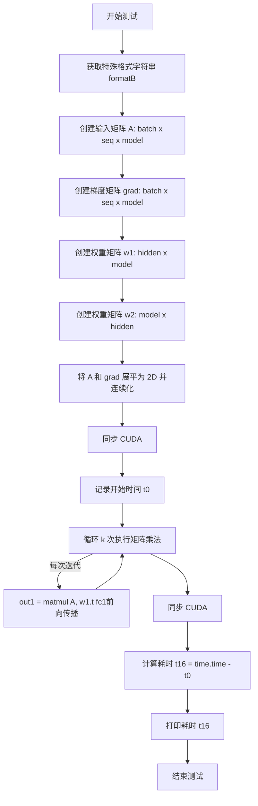

# `bitsandbytes\benchmarking\int8\training_benchmark.py` 详细设计文档

这是一个用于测试8位训练性能的基准测试脚本，通过执行矩阵乘法操作来评估GPU在INT8量化训练场景下的计算性能。

## 整体流程

```mermaid
graph TD
    A[开始] --> B[设置测试参数 batch, seq, model, hidden]
    B --> C[获取特殊格式字符串 formatB = F.get_special_format_str()]
    C --> D[初始化张量: A, grad, w1, w2]
    D --> E[设置 dtype = torch.int8]
    E --> F[将 A 和 grad reshape 为 2D 并连续存储]
    F --> G[同步 CUDA 设备]
    G --> H[记录开始时间 t0 = time.time()]
    H --> I{for i in range(k)}
    I --> J[执行矩阵乘法: out1 = torch.matmul(A, w1.t())]
    J --> I
    I --> K[同步 CUDA 设备]
    K --> L[计算耗时 t16 = time.time() - t0]
    L --> M[打印耗时 print(t16)]
    M --> N[结束]
```

## 类结构

```

```

## 全局变量及字段


### `k`
    
迭代次数，用于控制基准测试循环的执行次数

类型：`int`
    


    

## 全局函数及方法


### `test_bench_8bit_training`

这是一个pytest基准测试函数，用于测试8位训练中矩阵运算（主要是FC1层的前向传播）的性能，通过多次迭代矩阵乘法来评估计算效率。

参数：

-  `batch`：`int`，批量大小，指定输入数据的批次维度
-  `seq`：`int`，序列长度，指定时序数据的序列长度
-  `model`：`int`，模型维度，指定权重矩阵的输入维度
-  `hidden`：`int`，隐藏层维度，指定权重矩阵的输出维度

返回值：`None`，该函数为pytest测试函数，无返回值，结果通过打印输出

#### 流程图



#### 带注释源码

```python
@pytest.mark.parametrize(
    ("batch", "seq", "model", "hidden"),
    [
        pytest.param(2, 512, 4 * 1024, 3 * 4 * 1024, id="batch=2, seq=512, model=4k, hidden=12k"),
        pytest.param(2, 512, 5120, 3 * 5120, id="batch=2, seq=512, model=5k, hidden=15k"),
        pytest.param(2, 512, 12 * 1024, 4 * 12 * 1024, id="batch=2, seq=512, model=12k, hidden=48k"),
    ],
)
@pytest.mark.benchmark
def test_bench_8bit_training(batch, seq, model, hidden):
    """8位训练基准测试函数，测试矩阵运算性能"""
    
    # 获取特殊格式字符串，用于后续量化操作
    formatB = F.get_special_format_str()
    
    # 创建输入张量 A: (batch, seq, model)，半精度浮点数
    A = torch.randn(batch, seq, model, device="cuda").half()
    
    # 创建梯度张量 grad: (batch, seq, model)，半精度浮点数
    grad = torch.randn(batch, seq, model, device="cuda").half()
    
    # 创建第一个权重矩阵 w1: (hidden, model)，int8范围随机值
    w1 = torch.randint(-128, 127, size=(hidden, model), device="cuda").half()
    
    # 创建第二个权重矩阵 w2: (model, hidden)，int8范围随机值
    w2 = torch.randint(-128, 127, size=(model, hidden), device="cuda").half()
    
    print("")  # 打印空行用于格式化输出
    
    # 设置数据类型为 int8
    dtype = torch.int8
    
    # 将 A 展平为 (batch*seq, model) 的2D张量并确保内存连续
    A = A.view(-1, A.shape[-1]).contiguous()
    
    # 将 grad 展平为 (batch*seq, model) 的2D张量并确保内存连续
    grad = grad.view(-1, grad.shape[-1]).contiguous()
    
    # 同步 CUDA，确保之前的所有操作完成
    torch.cuda.synchronize()
    
    # 记录测试开始时间
    t0 = time.time()
    
    # 执行 k 次迭代的矩阵乘法基准测试
    for i in range(k):
        # FC1 层前向传播: out1 = A @ w1.T
        # 结果形状: (batch*seq, hidden)
        out1 = torch.matmul(A, w1.t())  # fc1
        
        # 注意: 以下代码被注释掉，属于完整的8位训练前向+反向传播流程
        # out2 = torch.matmul(out1, w2.t())  # FC2 层前向传播
        
        # d1 = torch.matmul(grad, w2)  # 梯度反向传播 delta1
        # d2 = torch.matmul(d1, w1)    # 梯度反向传播 delta2
        
        # grad1 = torch.einsum('bo,bh->oh', out1, grad)  # 计算 w2 的梯度
        # grad2 = torch.einsum('bh,bo->ho', A, d2)       # 计算 w1 的梯度
    
    # 再次同步 CUDA，确保所有矩阵运算完成
    torch.cuda.synchronize()
    
    # 计算总耗时
    t16 = time.time() - t0
    
    # 打印基准测试结果
    print(t16)
    
    # 注意: 以下代码被注释掉，包含完整的8位量化矩阵乘法实现
    # 包括: double_quant 量化、transform2 变换、igemmlt 整数矩阵乘法
    # 以及 mm_dequant 解量化等操作
```

## 关键组件


### 张量索引与形状重塑

在基准测试中，输入张量通过 `view(-1, A.shape[-1]).contiguous()` 进行展平操作，将三维张量 (batch, seq, model) 转换为二维张量 (batch*seq, model)，以便于后续矩阵乘法操作。这种索引方式确保了连续内存布局，优化了GPU计算效率。

### 反量化支持 (Dequantization Support)

代码中通过 `F.mm_dequant()` 函数实现反量化功能，将int8矩阵乘法的结果（32位整数）转换回原始精度。该函数接收量化后的输出、缩放因子和统计信息，完成从压缩格式到原始数据格式的重建，是8-bit训练中梯度计算的关键环节。

### 量化策略 (Quantization Strategy)

代码采用双重量化(Double Quantization)策略，通过 `F.double_quant()` 对权重和激活值进行两次量化以提取行/列统计信息。同时使用 `F.transform2()` 进行格式转换（如col32格式），支持不同的矩阵乘法变体(igemmlt)，实现了高效的int8矩阵运算管道。

### 矩阵变换与转置

代码支持多种矩阵变换操作，包括使用 `transpose=True` 参数对权重矩阵进行转置，以支持不同层的反向传播计算。`transform2` 函数将量化后的张量转换为特定格式（如列32格式），为后续的整数矩阵乘法做准备。

### 稀疏矩阵支持

通过 `F.spmm_coo()` 函数支持稀疏矩阵乘法操作，该函数接收COO格式的稀疏张量，可将稀疏权重与密集输入相乘，实现了量化与稀疏技术的结合以进一步压缩模型。

### 基准测试配置

代码定义了参数化测试用例，涵盖不同模型规模（4k-12k）和隐藏层维度（12k-48k），使用 `torch.randint` 生成随机整数权重，并配置打印选项以控制输出精度和格式，为8-bit训练性能评估提供标准化的测试框架。


## 问题及建议


### 已知问题

-   **大量死代码（注释掉的代码）**: 代码中存在大段被注释掉的8位量化计算逻辑（包括double_quant、transform2、igemmlt等调用），这些代码与当前实际执行的float16矩阵乘法无关，导致代码行数冗余、阅读困难，且无法确定这些被注释的代码是已废弃还是计划未来使用。
-   **基准测试逻辑不完整**: 当前实际测试的仅是普通的`torch.matmul`（float16半精度），并未执行真正的8位量化训练计算流程（如代码中被注释的double_quant、transform等操作），因此无法真实反映8bit训练的基准性能。
-   **warmup代码被注释**: 关键的warmup循环（用于预热GPU、避免冷启动影响）被完全注释掉，导致基准测试结果可能受CUDA JIT编译等因素干扰，测量不够稳定准确。
-   **硬编码配置值**: 迭代次数`k=20`、打印精度、阈值（代码中提到的`threshold=3.5`）等参数直接硬编码，缺乏配置化，若需调整测试参数必须修改源码。
-   **同步时机可能不精确**: `torch.cuda.synchronize()`放置在循环外部而非每次迭代内部，循环体内的GPU操作可能被部分缓冲，影响时间测量的精确度。
-   **缺少基准对照说明**: 测试名称为`test_bench_8bit_training`，但实际未执行任何8bit相关计算，测试名称与实现不符，容易造成误解。
-   **无错误处理与资源清理**: 代码未包含任何异常捕获机制，且未调用`torch.cuda.empty_cache()`或显式释放GPU张量，在异常情况下可能导致GPU内存泄漏。
-   **打印语句用于性能输出**: 使用`print(t16)`输出性能数据，非正式的基准日志格式，不利于后续自动化解析和结果收集。

### 优化建议

-   **清理或重构注释代码**: 将被注释的大段8bit计算代码移至独立的辅助文件或使用`#if 0 ... #endif`条件编译结构，或明确标注为"已废弃"以便后续删除，避免干扰主测试流程。
-   **补充完整的8bit训练基准逻辑**: 取消注释相关代码并修复其中可能存在的问题（如变量作用域、维度匹配等），确保测试真正覆盖8bit量化的矩阵运算流程，或明确标注当前为"baseline float16性能对比"。
-   **恢复warmup逻辑**: 保留至少10-20次迭代的warmup循环，并在warmup后调用`torch.cuda.synchronize()`确保GPU状态稳定，使基准测试结果更可靠。
-   **配置化参数**: 使用`pytest.mark.parametrize`或外部配置文件管理`k`值、矩阵维度、阈值等参数，或通过`conftest.py`定义fixture提供配置，提升测试灵活性。
-   **优化同步与计时**: 考虑在每次循环迭代内部添加同步点（`torch.cuda.synchronize()`），或使用`torch.cuda.Event`进行精确的GPU时间测量，以获得更准确的性能数据。
-   **添加错误处理与资源管理**: 使用`try-finally`确保GPU资源释放，考虑使用pytest的`yield`fixture管理测试资源，并在必要时添加`torch.cuda.empty_cache()`调用。
-   **统一日志输出格式**: 使用标准输出或日志库（如`logging`）输出结构化性能数据，便于CI/CD系统解析和比对历史结果。
-   **修正测试名称与文档**: 若当前仅测试float16 baseline，应将测试重命名为`test_bench_baseline_fp16_training`；或添加docstring明确说明此测试为8bit训练的baseline对照。


## 其它


### 设计目标与约束

该基准测试代码的核心设计目标是评估8位（int8）矩阵运算在深度学习训练场景下的性能表现。测试聚焦于全连接层（FC layer）的矩阵乘法性能，通过模拟不同的模型规模（hidden size和model size）来验证int8量化在训练中的可行性。设计约束包括：1）必须在CUDA设备上运行；2）使用half精度（float16）作为输入数据类型；3）测试参数固定为k=20次迭代以获取稳定的性能数据。

### 错误处理与异常设计

代码中未包含显式的错误处理机制，主要依赖pytest框架进行测试管理。潜在异常场景包括：CUDA内存不足时torch操作会抛出RuntimeError；输入张量维度不匹配时会产生torch.cuda.OutOfMemoryError；设备不兼容时会导致assertion失败。当前设计建议添加：1）CUDA同步检查以确保操作完成；2）异常捕获机制处理内存溢出情况；3）输入参数合法性校验。

### 数据流与状态机

基准测试的数据流如下：初始化阶段创建随机输入A、梯度grad以及权重矩阵w1、w2；处理阶段将输入reshape为(batch*seq, model)的2D张量并确保内存连续性；执行阶段运行k次矩阵乘法操作并计时；输出阶段打印性能结果。状态机转换：IDLE → INITIALIZED → READY → RUNNING → COMPLETED → RESULTS。

### 外部依赖与接口契约

主要依赖包括：1）torch库（需支持CUDA和half精度）；2）pytest框架（用于参数化测试和基准标记）；3）bitsandbytes库的functional模块（提供get_special_format_str等函数）。接口契约要求：F.get_special_format_str()返回格式字符串；所有张量操作必须在CUDA设备上执行；输入张量必须为half类型。

### 性能考量

当前测试仅启用基本的矩阵乘法操作（out1 = torch.matmul(A, w1.t())），其他计算步骤被注释。性能瓶颈分析：1）内存带宽是主要限制因素；2）int8量化计算未被启用（相关代码被注释）；3）缺少CUDA图优化。优化建议：启用完整的8位量化流程（double_quant、transform2、igemmlt、mm_dequant），并使用CUDA图捕获计算图以减少内核启动开销。

### 安全性考虑

代码中权重使用整数范围-128到127（int8范围），符合8位有符号整数规范。潜在安全风险：1）随机生成的测试数据可能无法覆盖边界情况；2）缺少数值稳定性检查。建议添加：1）NaN/Inf检测；2）数值范围验证；3）对比FP16基准以检测量化误差。

### 测试策略

采用pytest参数化测试，覆盖三种模型配置：batch=2, seq=512, model=4k/hidden=12k；batch=2, seq=512, model=5k/hidden=15k；batch=2, seq=512, model=12k/hidden=48k。测试标记包括@pytest.mark.benchmark用于性能测试识别。测试执行流程：创建张量 → 同步 → 计时 → 循环执行 → 同步 → 输出耗时。

### 配置与参数说明

关键配置参数：k=20（迭代次数用于平均性能）；batch=2（批次大小）；seq=512（序列长度）；dtype=torch.int8（目标计算精度）。torch.set_printoptions配置输出格式为precision=5、linewidth=120、edgeitems=20。输入张量A和grad使用float16（half()），权重w1、w2使用int8范围（-128到127）的float16表示。


    