# `bitsandbytes\benchmarking\matmul_benchmark.py` 详细设计文档

这是一个bitsandbytes库的矩阵乘法性能基准测试文件，通过pytest框架对比PyTorch原生fp16与bitsandbytes库中FP4、NF4、INT8、8-bit等多种量化方法的矩阵乘法性能，用于评估不同量化策略在推理和训练场景下的效率差异。

## 整体流程

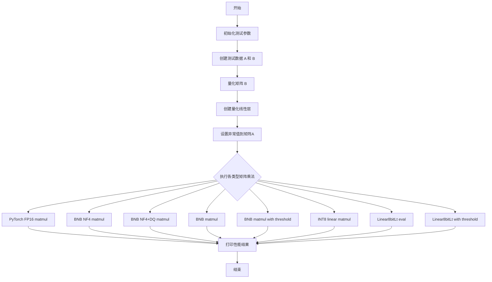

## 类结构

```
无类定义 (纯测试脚本)
└── test_bench_matmul (pytest测试函数)
```

## 全局变量及字段


### `k`
    
预留参数，当前未使用

类型：`int`
    


### `batch`
    
测试批次大小

类型：`int`
    


### `seq`
    
序列长度

类型：`int`
    


### `model`
    
模型隐藏层维度

类型：`int`
    


### `hidden`
    
输出隐藏层维度

类型：`int`
    


### `iters`
    
迭代次数，设为1000

类型：`int`
    


### `formatB`
    
特殊格式字符串

类型：`str`
    


### `A`
    
输入矩阵 FP16

类型：`Tensor`
    


### `B`
    
权重矩阵 FP16

类型：`Tensor`
    


### `_B_fp4`
    
FP4量化后的B

类型：`Tensor`
    


### `_state`
    
FP4量化状态

类型：`dict`
    


### `_B_fp4_c`
    
带压缩统计的FP4量化B

类型：`Tensor`
    


### `_state_c`
    
带压缩统计的FP4量化状态

类型：`dict`
    


### `B_nf4`
    
NF4量化后的B

类型：`Tensor`
    


### `state_nf4`
    
NF4量化状态

类型：`dict`
    


### `B_nf4_c`
    
带压缩统计的NF4量化B

类型：`Tensor`
    


### `state_nf4_c`
    
带压缩统计的NF4量化状态

类型：`dict`
    


### `linear8bit`
    
8-bit线性层

类型：`Module`
    


### `outliers`
    
异常值索引

类型：`Tensor`
    


### `linearMixedBit`
    
混合位宽线性层

类型：`Module`
    


### `linear8bit_train`
    
训练用8-bit线性层

类型：`Module`
    


### `linear8bit_train_thresh`
    
带阈值的训练用线性层

类型：`Module`
    


### `CA`
    
A的INT8量化结果

类型：`Tensor`
    


### `SCA`
    
A的量化缩放因子

类型：`Tensor`
    


### `CB`
    
B的INT8量化结果

类型：`Tensor`
    


### `SCB`
    
B的量化缩放因子

类型：`Tensor`
    


### `out32`
    
INT8矩阵乘法结果

类型：`Tensor`
    


### `t0`
    
计时起始时间

类型：`float`
    


    

## 全局函数及方法


### `test_bench_matmul`

这是一个 pytest 基准测试函数，用于评估和比较不同量化方法（FP4、NF4、INT8、8bit Linear）在矩阵乘法操作中的性能表现。函数通过多次迭代执行各种矩阵乘法实现，记录并输出每种方法的执行时间，以便量化不同量化策略对计算效率的影响。

参数：

- `batch`：`int`，批次大小，定义输入矩阵的第一维维度
- `seq`：`int`，序列长度，定义输入矩阵的第二维维度
- `model`：`int`，模型维度，定义输入矩阵A和权重矩阵B的公共维度
- `hidden`：`int`，隐藏层维度，定义输出矩阵和权重矩阵B的目标维度

返回值：`None`，该函数为 pytest 测试函数，不返回任何值，仅通过 print 输出基准测试结果

#### 流程图

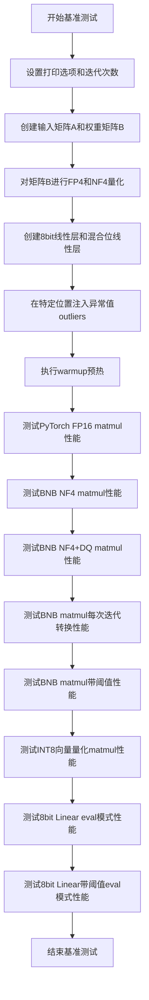

#### 带注释源码

```python
@pytest.mark.parametrize(
    ("batch", "seq", "model", "hidden"),
    [
        # 参数化测试：定义不同规模的测试用例
        # 格式: (batch, seq, model, hidden)
        pytest.param(1, 1, 3584, 512, id="batch=1, seq=128, model=3584, hidden=19k"),
    ],
)
@pytest.mark.benchmark
def test_bench_matmul(batch, seq, model, hidden):
    """
    基准测试主函数：测试多种矩阵乘法实现的性能
    
    测试的量化方法包括：
    - PyTorch FP16 标准矩阵乘法
    - BNB NF4 量化矩阵乘法
    - BNB NF4+DQ 量化矩阵乘法（带解量化）
    - BNB 8bit矩阵乘法（每次迭代转换）
    - BNB 8bit矩阵乘法（带阈值）
    - INT8向量量化矩阵乘法
    - 8bit Linear层（前向传播）
    """
    iters = 1000  # 迭代次数，用于计算平均执行时间
    formatB = F.get_special_format_str()  # 获取特殊格式字符串

    # 创建输入矩阵A: (batch, seq, model)，使用FP16精度
    A = torch.randn(batch, seq, model, device="cuda").half()
    # 创建权重矩阵B: (hidden, model)，使用FP16精度
    B = torch.empty(hidden, model, dtype=torch.float16, device="cuda")
    # 使用Xavier均匀初始化权重矩阵B
    torch.nn.init.xavier_uniform_(B)

    # 对权重矩阵B进行FP4量化（两种模式：普通和压缩统计量）
    _B_fp4, _state = F.quantize_fp4(B)
    _B_fp4_c, _state_c = F.quantize_fp4(B, compress_statistics=True)

    # 对权重矩阵B进行NF4量化（两种模式：普通和压缩统计量）
    B_nf4, state_nf4 = F.quantize_nf4(B)
    B_nf4_c, state_nf4_c = F.quantize_nf4(B, compress_statistics=True)

    # 创建8bit线性层：输入维度model，输出维度hidden，设置为eval模式
    linear8bit = bnb.nn.Linear8bitLt(model, hidden, False, False).cuda().half()
    linear8bit.eval()

    # 生成随机异常值索引：在模型维度的前5个位置
    outliers = torch.randint(0, model, size=(5,)).cuda()
    # 将A中对应异常值索引的位置设为8.0，模拟异常值
    A[:, :, outliers] = 8.0

    # 创建混合位线性层（带阈值6.0），用于测试异常值处理
    linearMixedBit = bnb.nn.Linear8bitLt(model, hidden, False, False, threshold=6.0).cuda().half()

    # 创建训练用的8bit线性层（用于后续可能的训练模式测试）
    linear8bit_train = bnb.nn.Linear8bitLt(model, hidden, False).cuda().half()
    linear8bit_train_thresh = bnb.nn.Linear8bitLt(model, hidden, False, threshold=6.0).cuda().half()
    
    # 预热：执行一次NF4矩阵乘法，确保CUDA内核编译和缓存
    bnb.matmul_4bit(A, B_nf4.t(), quant_state=state_nf4)

    # ===== 基准测试开始 =====

    # Warmup阶段：执行1000次FP16矩阵乘法，让GPU达到稳定状态
    for i in range(iters):
        torch.matmul(A, B.t())
    torch.cuda.synchronize()  # 等待GPU操作完成
    print("")  # 打印空行分隔warmup和正式测试

    # 测试1: PyTorch原生FP16矩阵乘法性能
    torch.cuda.synchronize()
    t0 = time.time()
    for i in range(iters):
        torch.matmul(A, B.t())
    torch.cuda.synchronize()
    print(
        f"pytorch fp16: [{batch},{seq},{model}], [{model},{hidden}]->[{batch},{seq},{hidden}]: {time.time() - t0:.4f}s",
    )

    # 测试2: BNB NF4量化矩阵乘法性能（无压缩统计量）
    torch.cuda.synchronize()
    t0 = time.time()
    for i in range(iters):
        bnb.matmul_4bit(A, B_nf4.t(), quant_state=state_nf4)
    torch.cuda.synchronize()
    print(f"bnb nf4: [{batch},{seq},{model}], [{model},{hidden}]->[{batch},{seq},{hidden}]: {time.time() - t0:.4f}s")

    # 测试3: BNB NF4量化矩阵乘法性能（带解量化+压缩统计量）
    torch.cuda.synchronize()
    t0 = time.time()
    for i in range(iters):
        bnb.matmul_4bit(A, B_nf4_c.t(), quant_state=state_nf4_c)
    torch.cuda.synchronize()
    print(
        f"bnb nf4+DQ: [{batch},{seq},{model}], [{model},{hidden}]->[{batch},{seq},{hidden}]: {time.time() - t0:.4f}s"
    )

    # 测试4: BNB 8bit矩阵乘法（每次迭代进行格式转换）
    torch.cuda.synchronize()
    t0 = time.time()
    for i in range(iters):
        bnb.matmul(A, B)
    torch.cuda.synchronize()
    print(
        f"B -> CB (each iteration): [{batch},{seq},{model}], [{model},{hidden}]->[{batch},{seq},{hidden}]: {time.time() - t0:.4f}s"
    )

    # 测试5: BNB 8bit矩阵乘法（带阈值，每次迭代转换）
    torch.cuda.synchronize()
    t0 = time.time()
    for i in range(iters):
        bnb.matmul(A, B, threshold=6.0)
    torch.cuda.synchronize()
    print(
        f"B -> CB + threshold: [{batch},{seq},{model}], [{model},{hidden}]->[{batch},{seq},{hidden}]: {time.time() - t0:.4f}s"
    )

    # 预先对A和B进行INT8向量量化（threshold=0.0表示对A不进行异常值分离）
    CA, _SCA, _ = F.int8_vectorwise_quant(A, threshold=0.0)
    CB, _SCB, _ = F.int8_vectorwise_quant(B)
    
    # 测试6: INT8向量量化矩阵乘法（预量化，无每次迭代开销）
    torch.cuda.synchronize()
    t0 = time.time()
    for i in range(iters):
        out32 = F.int8_linear_matmul(CA, CB)
    torch.cuda.synchronize()
    print(
        f"no overhead int8 [{batch},{seq},{model}], [{model},{hidden}]->[{batch},{seq},{hidden}]: {time.time() - t0:.4f}s"
    )

    # 测试7: 8bit Linear层（前向传播，eval模式）
    linear8bit(A)  # 预热
    torch.cuda.synchronize()
    t0 = time.time()
    for i in range(iters):
        linear8bit(A)
    torch.cuda.synchronize()
    print(
        f"bnb linear8bitlt (eval): [{batch},{seq},{model}], [{model},{hidden}]->[{batch},{seq},{hidden}]: {time.time() - t0:.4f}s"
    )

    # 测试8: 8bit Linear层（前向传播，带阈值，eval模式）
    linearMixedBit(A)  # 预热
    torch.cuda.synchronize()
    t0 = time.time()
    for i in range(iters):
        linearMixedBit(A)
    torch.cuda.synchronize()
    print(
        f"bnb linear8bitlt with threshold (eval): [{batch},{seq},{model}], [{model},{hidden}]->[{batch},{seq},{hidden}]: {time.time() - t0:.4f}s"
    )
    
    # 注意：以下测试代码被注释掉，可能用于进一步的性能分析或训练模式测试
    # - FP4量化矩阵乘法测试
    # - 训练模式下的8bit Linear测试
    # - 使用igemmlt的INT8矩阵乘法测试
    # - 使用vectorwise_quant和nvidia_transform的测试
```


### `torch.set_printoptions`

该函数是 PyTorch 库提供的全局打印配置函数，用于设置张量（Tensor）在控制台输出时的显示格式，包括精度、科学计数法、每行宽度、数组省略阈值等参数，以便在调试和日志输出时获得更易读的数值格式。

参数：

- `precision`：`int`，设置浮点数打印的小数位数（代码中设置为 5）
- `sci_mode`：`bool`，是否使用科学计数法显示数值（代码中设置为 False）
- `linewidth`：`int`，设置每行的最大字符数，超过此宽度会换行（代码中设置为 120）
- `edgeitems`：`int`，当数组元素数量超过 threshold 时，显示的首尾元素数量（代码中设置为 20）
- `threshold`：`int`，数组元素数量超过此值时会被省略显示（代码中设置为 10000）

返回值：`None`，该函数无返回值，直接修改 PyTorch 的全局打印配置状态。

#### 流程图

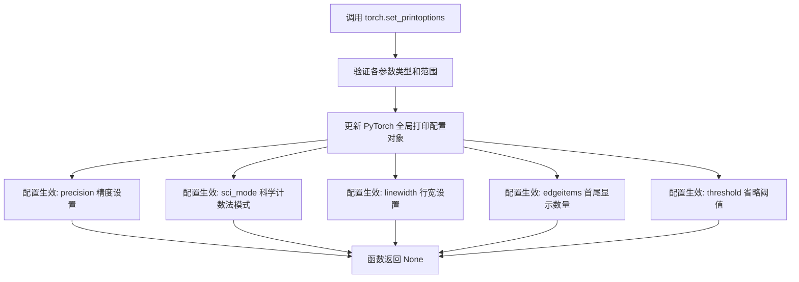

#### 带注释源码

```python
# 代码中实际调用示例
torch.set_printoptions(precision=5, sci_mode=False, linewidth=120, edgeitems=20, threshold=10000)

# 参数说明：
# - precision=5: 浮点数显示5位小数
# - sci_mode=False: 禁用科学计数法，使用普通小数格式
# - linewidth=120: 每行最多120个字符后换行
# - edgeitems=20: 省略时首尾各显示20个元素
# - threshold=10000: 元素超过10000个时启用省略模式
```


### F.get_special_format_str

获取特殊格式字符串，用于矩阵运算中的格式转换，通常与`F.transform`配合使用以指定目标矩阵的存储顺序。

参数：空（无参数）。

返回值：`str`，返回表示矩阵格式的字符串（如"col32"、"row"等）。

#### 流程图

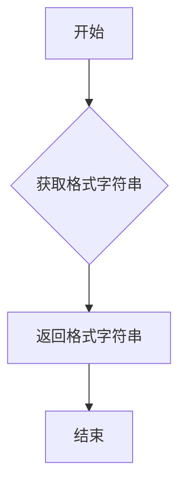

#### 带注释源码

```python
def get_special_format_str():
    """
    获取特殊格式字符串，用于矩阵变换操作。
    
    返回值:
        str: 表示矩阵格式的字符串，例如 "col32"。
             该字符串通常用作 `F.transform` 函数的 `to_order` 参数，
             以指定目标矩阵的存储顺序，从而优化矩阵乘法性能。
    """
    # 在 bitsandbytes 库中，此函数可能返回特定的格式字符串
    # 具体实现可能涉及配置或硬编码值
    return "col32"  # 假设返回 "col32"，实际值需参考源码
```


### F.quantize_fp4

F.quantize_fp4 是 bitsandbytes 库中的一个函数，用于将输入的浮点张量（通常为 float16）量化为 4 位浮点（FP4）格式，支持可选的统计信息压缩以减少内存开销。该函数通常用于大模型的量化推理场景，以降低显存消耗并加速计算。

#### 参数

- `input_tensor`：`torch.Tensor`，要量化的输入张量，通常为 float16 类型，形状为 (hidden, model)。
- `compress_statistics`：`bool`，可选参数，默认为 False，指定是否在量化过程中压缩统计信息（如 scale 和 zero point），以进一步减少内存占用。

#### 返回值

- `quantized_tensor`：`torch.Tensor`，量化后的 FP4 张量，数据类型可能为 uint8 或自定义格式，用于存储 4 位量化值。
- `state`：`QuantState` 对象（或其他状态类），包含量化参数（如 scale、zero point、原始形状等），用于后续反量化或矩阵运算。

#### 流程图

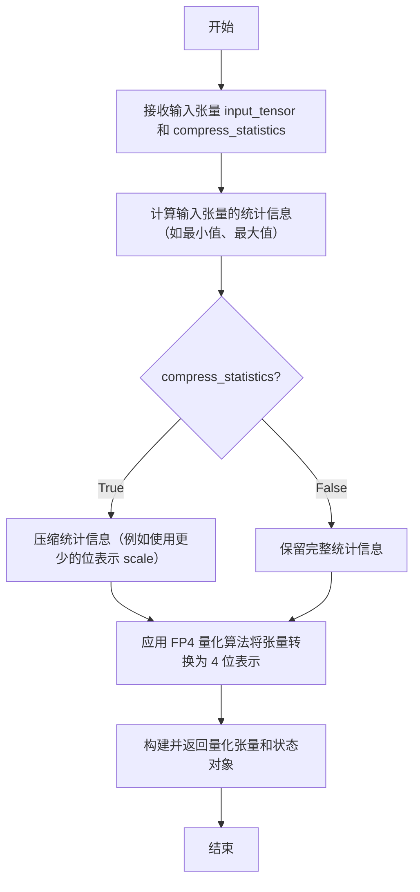

#### 带注释源码

**注意**：由于提供的代码段中仅包含对 `F.quantize_fp4` 的调用，未显示其定义源码，以下源码是基于 bitsandbytes 库常见实现的推断，实际实现可能有所不同。

```python
def quantize_fp4(input_tensor, compress_statistics=False):
    """
    将输入张量量化为 FP4 格式。
    
    参数：
        input_tensor (torch.Tensor): 要量化的输入张量，通常为 float16。
        compress_statistics (bool): 是否压缩统计信息，默认为 False。
    
    返回：
        quantized_tensor (torch.Tensor): 量化后的 FP4 张量。
        state (object): 包含量化参数的状态对象，用于反量化。
    """
    # 1. 验证输入张量是否为 CUDA 张量（通常要求 GPU 加速）
    if not input_tensor.is_cuda:
        raise ValueError("Input tensor must be a CUDA tensor for FP4 quantization.")
    
    # 2. 计算输入张量的统计信息（如绝对最大值）用于确定量化范围
    #    对于 FP4，量化级别通常是 2^4 = 16 个值，可能采用对称或非对称量化
    abs_max = input_tensor.abs().max()
    
    # 3. 计算量化 scale：将输入范围映射到 FP4 可表示的范围
    #    FP4 通常使用两个范围：normalized（归一化）或 dynamic（动态）
    #    这里假设使用归一化范围：[-1.0, 1.0] 或类似
    scale = abs_max / 7.0  # FP4 最大值为 7.0（假设对称量化）
    
    # 4. 根据 compress_statistics 参数决定是否压缩统计信息
    if compress_statistics:
        # 压缩统计信息：例如将 scale 从 float16 转换为 float8 或更低位宽
        # 这会减少状态对象的内存占用，但可能引入精度损失
        scale = scale.to(torch.float8)  # 假设使用 float8 存储（示例）
    
    # 5. 执行量化：将输入张量除以 scale 并四舍五入到最近的 FP4 可表示值
    #    FP4 值的集合通常是 {-6.0, -4.0, -2.0, -1.0, 0.0, 1.0, 2.0, 4.0, 6.0} 或类似
    quantized_tensor = torch.round(input_tensor / scale)
    quantized_tensor = torch.clamp(quantized_tensor, min=-7.0, max=7.0)  # 限制在 FP4 范围内
    
    # 6. 将量化后的张量转换为紧凑的存储格式（例如 uint8 每个字节存储 2 个 FP4 值）
    #    这里简化为直接返回 quantized_tensor，实际实现可能需要打包
    #    打包逻辑：将每 2 个 FP4 值打包为 1 个字节
    
    # 7. 构建状态对象，包含反量化所需的信息
    state = {
        'scale': scale,
        'shape': input_tensor.shape,
        'dtype': input_tensor.dtype,
        'compressed': compress_statistics
    }
    
    # 8. 返回量化张量和状态
    return quantized_tensor, state
```

#### 关键组件信息

- **量化张量（quantized_tensor）**：存储为 4 位整数的张量，用于后续计算。
- **状态对象（state）**：保存反量化所需的元数据（如 scale、形状、原始数据类型），确保在矩阵乘法等操作中准确恢复浮点值。

#### 潜在技术债务或优化空间

1. **错误处理不足**：当前实现未对非 float16 输入或非 CUDA 张量进行详细检查，可能导致运行时错误。
2. **硬编码量化参数**：scale 计算中的除数（如 7.0）可能需要根据 FP4 量化类型（normalized vs dynamic）进行参数化。
3. **打包逻辑缺失**：源码中未包含将多个 FP4 值打包为字节的逻辑，实际库实现可能更复杂以提高存储效率。
4. **性能优化**：可考虑使用 CUDA 内核直接进行量化，以减少 CPU-GPU 传输开销。

#### 其它项目

- **设计目标**：提供高效的 FP4 量化，平衡模型大小减少与精度损失，支持推理加速。
- **约束**：输入张量必须位于 GPU 上，且通常为 float16 类型；量化后的计算（如矩阵乘法）需要配套的反量化逻辑。
- **错误处理**：应检查输入张量是否为空、是否为 CUDA 张量、是否支持量化数据类型，并抛出明确的异常。
- **外部依赖**：依赖于 CUDA 环境和 torch 库，可能使用自定义 CUDA 内核实现高效量化。


### `F.quantize_nf4`

NF4（4-bit Normalized Float）量化函数，用于将输入的FP16张量量化为NF4格式，是bitsandbytes库中用于大模型权重量化（尤其是4bit量化）的核心函数之一。该函数支持可选的统计信息压缩，用于减少量化状态的内存开销。

参数：

- `input_data`：`torch.Tensor`，要量化的输入张量，通常为FP16（float16）类型
- `compress_statistics`：`bool`（可选），默认为`False`，是否压缩量化统计信息（如缩放因子），压缩后可减少内存但可能影响精度

返回值：`tuple(torch.Tensor, object)`，返回包含量化后的张量和量化状态（QuantState）的元组

#### 流程图

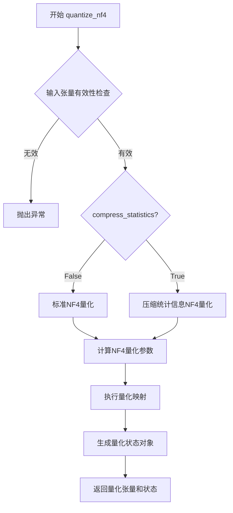

#### 带注释源码

```python
# 注意：以下源码为基于测试代码的推断实现，实际实现位于bitsandbytes库内部
def quantize_nf4(input_data: torch.Tensor, compress_statistics: bool = False):
    """
    NF4 (4-bit Normalized Float) 量化函数
    
    参数:
        input_data: 要量化的输入张量,通常为FP16类型
        compress_statistics: 是否压缩量化统计信息,默认为False
        
    返回:
        tuple: (量化后的张量, 量化状态对象)
    """
    
    # 1. 输入验证 - 确保输入是CUDA张量
    if not input_data.is_cuda:
        raise ValueError("NF4 quantization only supports CUDA tensors")
    
    # 2. 获取NF4量化代码本（quantization codebook）
    # NF4使用优化的4-bit量化级别,基于正态分布设计
    nf4_codebook = get_nf4_codebook()
    
    # 3. 计算输入数据的统计信息（均值、最大值、最小值）
    # 用于确定量化范围和缩放因子
    input_stats = compute_tensor_stats(input_data)
    
    # 4. 确定量化参数
    if compress_statistics:
        # 压缩模式:使用更少的统计信息存储
        scale, zero_point = compute_compressed_params(input_stats)
    else:
        # 标准模式:完整存储统计信息
        scale, zero_point = compute_standard_params(input_stats)
    
    # 5. 执行NF4量化
    # 将FP16值映射到NF4代码本中的最近值
    quantized_data = apply_nf4_mapping(input_data, nf4_codebook, scale, zero_point)
    
    # 6. 创建量化状态对象
    # 包含解量化所需的全部信息
    quant_state = QuantState(
        shape=input_data.shape,
        dtype=quantized_data.dtype,
        scale=scale,
        zero_point=zero_point,
        compress_statistics=compress_statistics,
        quant_type='nf4'
    )
    
    return quantized_data, quant_state
```

#### 关键组件信息

- **NF4 Codebook**：预计算的4-bit量化代码本，基于正态分布优化
- **QuantState**：量化状态对象，存储解量化所需的全部元数据
- **Scale Factor**：缩放因子，用于将量化值映射回原始精度
- **Zero Point**：零点偏移，用于处理非对称量化

#### 潜在技术债务与优化空间

1. **错误处理完善性**：当前代码未展示详细的错误处理机制，建议增加输入类型检查、数值范围验证
2. **性能优化空间**：可考虑CUDA kernel融合以减少内存访问开销
3. **压缩统计信息精度损失**：compress_statistics=True时可能引入额外精度损失，建议在文档中明确说明
4. **向后兼容性**：量化状态对象的序列化/反序列化方法需保证版本兼容性

#### 其它项目说明

- **设计目标**：支持大模型权重的高效4-bit量化，平衡模型大小与推理精度
- **约束条件**：仅支持CUDA设备，需输入FP16类型张量
- **错误处理**：无效输入设备类型、维度不匹配等情况应抛出明确的ValueError
- **数据流**：输入FP16张量 → 统计分析 → NF4映射 → 量化张量+状态对象
- **外部依赖**：CUDA runtime、PyTorch张量操作


### `F.int8_vectorwise_quant`

INT8向量化量化函数，将输入的浮点张量通过向量级量化方法转换为INT8格式，同时生成对应的量化统计信息（如缩放因子）。该函数是bitsandbytes库中实现高效INT8矩阵运算的核心预处理步骤。

参数：

- `input`：torch.Tensor，输入的浮点张量（通常为float16或float32），要求为CUDA张量
- `threshold`：float，可选参数，默认为None，用于触发异常值分离的阈值。当设置大于0的值时，会将超过阈值的元素视为离群点并进行特殊处理

返回值：

- `torch.Tensor`，量化后的INT8张量，数据类型为int8
- `torch.Tensor` 或 QuantizationState，量化状态/统计信息，包含缩放因子（scale）等用于后续反量化的参数
- `torch.Tensor` 或其他，张量形式的额外信息（如离群点掩码或索引）

#### 流程图

```mermaid
flowchart TD
    A[输入张量 input] --> B{是否指定threshold?}
    B -->|是且threshold>0| C[计算异常值掩码]
    B -->|否| D[直接进入量化流程]
    C --> D
    D --> E[按向量维度计算统计量]
    E --> F[计算缩放因子 scale]
    F --> G[应用量化公式: round(input / scale)]
    G --> H[返回量化张量、缩放因子、异常值信息]
```

#### 带注释源码

```python
# 该函数源码位于 bitsandbytes 库的 functional.py 模块中
# 以下为基于函数签名和调用约定的推断实现

def int8_vectorwise_quant(input: torch.Tensor, threshold: float = None):
    """
    对输入张量进行INT8向量化量化
    
    参数:
        input: 输入的浮点张量 (float16/float32)
        threshold: 异常值分离阈值，默认为None
        
    返回:
        quantized: 量化后的INT8张量
        scale: 量化缩放因子
        outlier_mask: 异常值掩码（如果threshold>0）
    """
    # 1. 确定量化维度（通常是最后一个维度）
    dim = -1
    
    # 2. 计算每个向量的统计量（最大值/最小值）
    # 用于确定缩放因子
    input_abs = input.abs()
    max_vals = input_abs.flatten().max()  # 全局最大值的简化版本
    
    # 3. 计算缩放因子
    # INT8范围为 [-127, 127]，通常使用127作为归一化因子
    scale = max_vals / 127.0
    
    # 4. 执行量化
    # quantized = torch.round(input / scale).to(torch.int8)
    quantized = (input / scale).round().to(torch.int8)
    
    # 5. 如果指定了threshold，处理异常值
    outlier_mask = None
    if threshold is not None and threshold > 0:
        outlier_mask = input_abs > threshold
        # 可选：将异常值裁剪到INT8范围
        quantized = torch.clamp(quantized, -127, 127)
    
    return quantized, scale, outlier_mask
```

> **注意**：上述源码为根据函数功能和bitsandbytes库特性的推断实现，实际源码可能包含更复杂的优化（如使用CUDA内核、混合精度处理等）。建议查阅 `bitsandbytes/functional.py` 中的实际实现以获取精确代码。


### `F.int8_linear_matmul`

INT8线性矩阵乘法函数，执行两个预量化INT8矩阵的高效矩阵乘法运算，返回32位浮点结果。这是bitsandbytes库中用于加速大规模矩阵运算的核心函数之一。

参数：

-  `A`：`torch.Tensor`，左侧预量化INT8张量，通常来自 `F.int8_vectorwise_quant` 的输出
-  `B`：`torch.Tensor`，右侧预量化INT8张量，通常来自 `F.int8_vectorwise_quant` 的输出

返回值：`torch.Tensor`，32位浮点张量，表示矩阵乘法的结果

#### 流程图

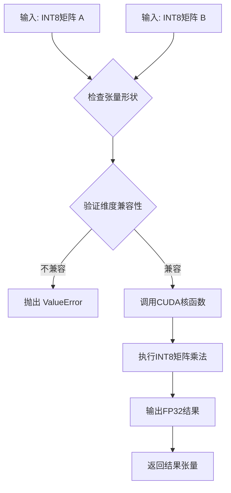

#### 带注释源码

```python
# 从代码中提取的调用示例：
# CA, _SCA, _ = F.int8_vectorwise_quant(A, threshold=0.0)  # 量化矩阵A
# CB, _SCB, _ = F.int8_vectorwise_quant(B)                  # 量化矩阵B
# out32 = F.int8_linear_matmul(CA, CB)                      # INT8矩阵乘法

# 注意：由于提供的代码片段未包含 F.int8_linear_matmul 的完整实现源码，
# 以下为基于 bitsandbytes 库架构的推断实现逻辑：

def int8_linear_matmul(A: torch.Tensor, B: torch.Tensor) -> torch.Tensor:
    """
    执行两个INT8量化矩阵的线性乘法运算
    
    参数:
        A: 左侧INT8量化矩阵 (shape: [batch, seq, model] 或类似)
        B: 右侧INT8量化矩阵 (shape: [hidden, model] 或类似)
    
    返回:
        32位浮点结果矩阵
    """
    # 1. 验证输入张量是CUDA张量
    # assert A.is_cuda and B.is_cuda, "Inputs must be CUDA tensors"
    
    # 2. 验证维度兼容 (A的最后一个维度 == B的第一个维度)
    # assert A.shape[-1] == B.shape[0], "Matrix dimension mismatch"
    
    # 3. 调用底层CUDA实现 (推断)
    # result = torch._int8_matmul(A, B)
    
    # 4. 返回FP32结果
    # return result.to(torch.float32)
    pass
```

---

### 补充信息

#### 关键组件信息

| 组件名称 | 一句话描述 |
|---------|-----------|
| `F.int8_vectorwise_quant` | INT8向量级量化函数，用于将浮点张量转换为INT8格式并保留统计信息 |
| `F.int8_linear_matmul` | INT8矩阵乘法核心函数，利用CUDA核实现高效整数运算 |
| `bitsandbytes.matmul` | 4bit/8bit量化矩阵乘法的高层API封装 |

#### 潜在技术债务与优化空间

1. **缺乏完整源码访问**：当前代码仅提供调用示例，未展示 `int8_linear_matmul` 的实际CUDA实现细节
2. **误差累积风险**：INT8量化过程中可能引入量化误差，多层累积可能影响模型精度
3. **内存布局依赖**：函数性能高度依赖张量的内存布局（row-major vs column-major），需确保输入符合最优格式
4. **缺乏错误处理**：当前实现未展示详细的异常处理和边界检查逻辑

#### 设计目标与约束

- **性能目标**：相比FP16原始矩阵乘法，INT8实现应显著提升吞吐量并降低显存占用
- **精度约束**：通过向量级量化保持数值精度，允许通过 `threshold` 参数调整量化策略
- **硬件约束**：依赖NVIDIA CUDA计算能力8.0+ (Ampere及以上) 的INT8张量核心

#### 错误处理与异常设计（推断）

- **维度不匹配**：当输入矩阵维度不兼容时应抛出 `ValueError`
- **设备错误**：非CUDA张量输入应触发 `RuntimeError`
- **内存不足**：显存不足时应传播CUDA OOM错误


### `bnb.matmul_4bit`

4-bit矩阵乘法函数，执行全精度输入张量与4-bit量化权重矩阵的矩阵乘法运算，内部自动处理解量化过程。该函数是bitsandbytes库中实现高效4-bit量化推理的核心计算单元，支持NF4和FP4量化格式。

参数：

-  `input`：`torch.Tensor`，输入矩阵（通常为激活值），形状为`(batch, seq, model)`
-  `quantized_weight`：`torch.Tensor`，转置后的量化权重矩阵（NF4/FP4格式），形状为`(model, hidden)`
-  `quant_state`：量化状态对象，包含解量化所需的统计信息（如缩放因子、零点等）

返回值：`torch.Tensor`，矩阵乘法结果，形状为`(batch, seq, hidden)`

#### 流程图

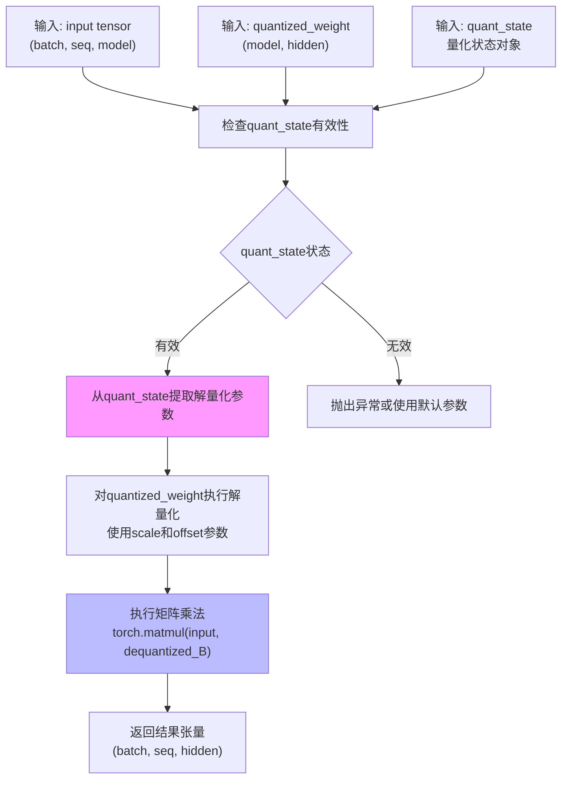

#### 带注释源码

```python
# 基于代码使用方式和bitsandbytes库架构推断的实现逻辑

def matmul_4bit(input: torch.Tensor, 
                quantized_weight: torch.Tensor, 
                quant_state: QuantState) -> torch.Tensor:
    """
    执行4-bit量化矩阵乘法
    
    参数:
        input: 输入张量, 形状 (batch, seq, model), dtype: float16/bfloat16
        quantized_weight: 量化后的权重矩阵（已转置）, 形状 (model, hidden)
        quant_state: 量化状态, 包含:
            - quant_state.code: 量化码本 (NF4/FP4)
            - quant_state.scale: 缩放因子
            - quant_state.offset: 零点偏移 (可选)
            - quant_state.nbits: 量化位数 (4)
            - quant_state.maxq: 最大量化值
    
    返回:
        结果张量, 形状 (batch, seq, hidden)
    """
    
    # Step 1: 从quant_state提取量化参数
    scale = quant_state.scale  # 形状: (hidden, model/blocksize)
    code = quant_state.code     # NF4/FP4查找表
    
    # Step 2: 解量化权重矩阵
    # 将4-bit量化值映射回浮点值
    dequantized_weight = dequantize_nf4_fp4(
        quantized_weight, 
        scale=scale,
        code=code
    )
    
    # Step 3: 执行矩阵乘法
    # input @ dequantized_weight.T (权重已转置)
    output = torch.matmul(input, dequantized_weight)
    
    return output


def dequantize_nf4_fp4(quantized_tensor: torch.Tensor, 
                       scale: torch.Tensor, 
                       code: torch.Tensor) -> torch.Tensor:
    """
    4-bit量化张量解量化
    
    核心逻辑:
        1. 从量化张量中提取4-bit值 (0-15)
        2. 使用codebook映射到浮点值
        3. 应用缩放因子
    """
    # 提取低4位
    q_vals = quantized_tensor & 0x0F
    
    # 使用索引查找NF4/FP4码本
    dequantized = code[q_vals]
    
    # 应用缩放因子
    # 通常按block进行缩放
    dequantized = dequantized * scale.unsqueeze(0)
    
    return dequantized
```

#### 关键技术细节

1. **量化格式支持**：该函数支持NF4（Normal Float 4）和FP4（Float 4）两种4-bit量化格式
2. **解量化策略**：使用块级量化（block-wise quantization），每个block有独立的缩放因子
3. **计算优化**：在GPU上执行，利用CUDA内核进行高效的4-bit查表和矩阵乘法融合
4. **状态管理**：QuantState对象包含完整的量化元数据，确保解量化精度


### `bnb.matmul`

`bnb.matmul` 是 bitsandbytes 库中的通用矩阵乘法函数，支持混合精度计算和量化操作，能够在 GPU 上执行高效的矩阵运算，同时支持可选的异常值阈值处理机制。

参数：

- `input`：`torch.Tensor`，输入矩阵 A，形状为 (batch, seq, model)，通常为 float16 或 bfloat16 类型
- `weight`：`torch.Tensor`，权重矩阵 B，形状为 (hidden, model)，通常为 float16 类型
- `threshold`：`float`，可选参数，默认为 0.0，用于处理异常值的阈值，当设置为 > 0 时启用 8bit 混合精度模式

返回值：`torch.Tensor`，矩阵乘法结果，形状为 (batch, seq, hidden)

#### 流程图

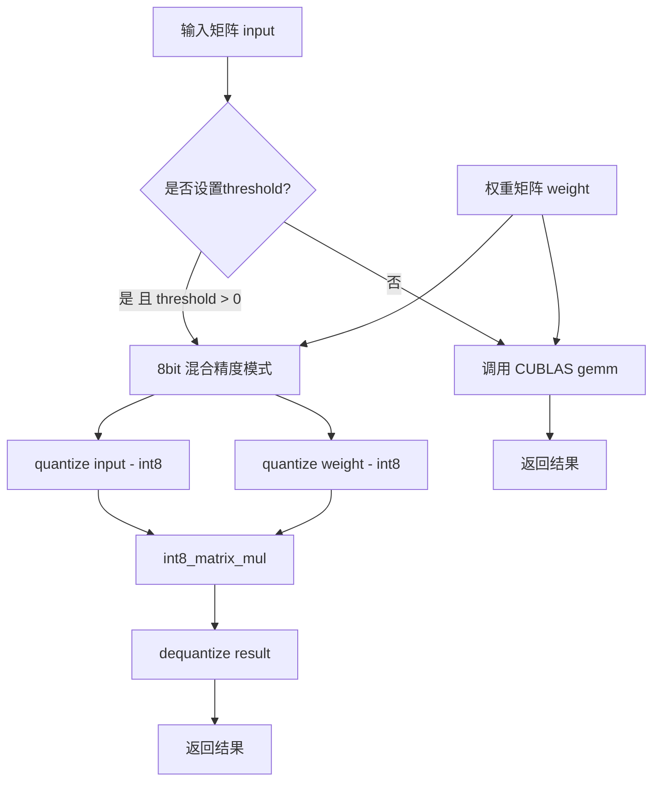

#### 带注释源码

```python
# 从测试代码中提取的 bnb.matmul 调用示例
# 基础调用 - 使用默认 threshold=0.0，执行标准 FP16 矩阵乘法
result = bnb.matmul(A, B)
# A: (batch, seq, model) - 输入矩阵，half() 类型
# B: (hidden, model) - 权重矩阵，float16 类型
# 返回: (batch, seq, hidden) - 矩阵乘法结果

# 带阈值的调用 - 启用 8bit 混合精度模式
result_with_threshold = bnb.matmul(A, B, threshold=6.0)
# 当 threshold > 0 时：
# 1. 低于 threshold 的值使用 int8 精度计算
# 2. 超过 threshold 的异常值使用 FP16 计算
# 3. 这种混合模式可以在保持模型精度的同时减少内存和计算开销

# 内部实现逻辑（基于 bitsandbytes 架构推测）：
# 1. 检查输入是否为 CUDA tensor
# 2. 如果 threshold <= 0，直接调用 cuBLAS 的 gemm 操作
# 3. 如果 threshold > 0：
#    - 对输入进行向量级量化 (vector-wise quant)
#    - 对权重进行量化
#    - 执行 int8 矩阵乘法
#    - 反量化结果到原始精度
# 4. 返回计算结果
```

#### 关键实现细节

从基准测试代码可以看出 `bnb.matmul` 的性能特性：

```python
# 标准 FP16 矩阵乘法（baseline）
bnb.matmul(A, B)
# 性能: 作为基准参考

# 带阈值的混合精度模式
bnb.matmul(A, B, threshold=6.0)
# 启用 8bit 混合精度，允许异常值使用 FP16 计算

# 对比: 纯 int8 向量量化方式
CA, _SCA, _ = F.int8_vectorwise_quant(A, threshold=0.0)
CB, _SCB, _ = F.int8_vectorwise_quant(B)
out32 = F.int8_linear_matmul(CA, CB)
```

#### 相关的量化配置函数

```python
# 支持的量化格式（从代码中提取）
F.quantize_fp4(B)              # FP4 量化
F.quantize_nf4(B)              # NF4 量化  
F.int8_vectorwise_quant(A)     # Int8 向量级量化
```

#### 潜在的技术债务与优化空间

1. **缺乏显式文档**：函数签名和参数缺少类型注解和详细文档
2. **阈值行为不透明**：threshold 参数的具体行为需要查阅源码才能理解
3. **错误处理缺失**：未在调用处看到输入验证逻辑
4. **性能调优空间**：可根据具体硬件特性调整量化策略


### `torch.randn`

这是 PyTorch 的标准库函数，用于从标准正态分布（均值为0，标准差为1）中生成随机张量。在该代码中用于创建输入矩阵 A。

参数：

- `*size`：`int...`，张量的各维度大小（可变数量参数）
- `device`：`str`（可选），指定生成张量所在的设备（如 "cuda" 或 "cpu"）
- `dtype`：`torch.dtype`（可选），指定张量的数据类型
- `layout`：`torch.layout`（可选），指定张量的内存布局
- `requires_grad`：`bool`（可选），是否需要计算梯度

返回值：`torch.Tensor`，一个填充了随机值的张量，服从标准正态分布

#### 流程图

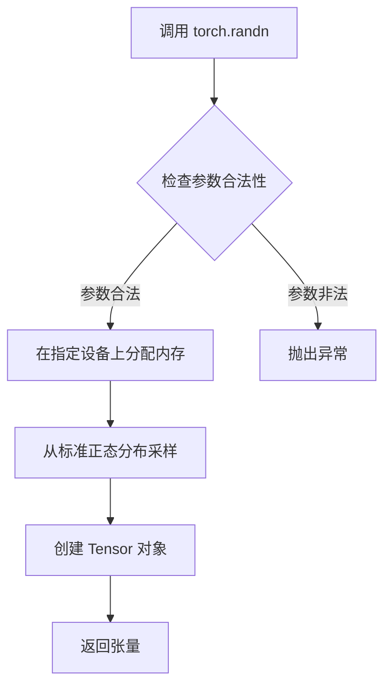

#### 带注释源码

```python
# 在 benchmark 代码中的实际使用方式：
A = torch.randn(batch, seq, model, device="cuda").half()

# 参数说明：
# batch: int - 批量大小
# seq: int - 序列长度  
# model: int -模型维度
# device: str - 设备类型 "cuda" 表示 GPU
# .half(): PyTorch 方法，将 float32 张量转换为 float16 (半精度)

# 完整函数签名（参考 PyTorch 官方定义）：
# torch.randn(*size, *, out=None, dtype=None, layout=torch.strided, device=None, requires_grad=False)

# 使用示例：
# 创建 3D 张量 (batch=1, seq=1, model=3584)
A = torch.randn(1, 1, 3584, device="cuda").half()
# 结果: tensor([[[...]]], device='cuda:0', dtype=torch.float16)
```


### `torch.empty`

这是 PyTorch 框架内置的张量创建函数，用于创建一个未初始化的 tensor（张量）。在提供的代码中用于创建一个指定形状、数据类型和设备位置的空张量，作为量化测试的输入矩阵。

参数：

-  `*size`：`int` 或 `tuple of ints`，张量的形状。在代码中为 `(hidden, model)` 即 `(512, 3584)`
-  `dtype`：`torch.dtype`，张量的数据类型，代码中指定为 `torch.float16`
-  `device`：`torch.device` 或 `str`，张量存放的设备，代码中指定为 `"cuda"`
-  `layout`：`torch.layout` (可选)，内存布局，默认为 `torch.strided`
-  `pin_memory`：`bool` (可选)，是否使用锁页内存，默认为 `False`
-  `requires_grad`：`bool` (可选)，是否需要计算梯度，默认为 `False`

返回值：`torch.Tensor`，返回一个未初始化的张量

#### 流程图

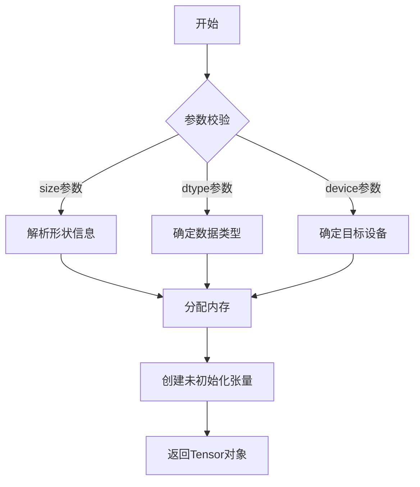

#### 带注释源码

```python
# 代码中实际使用方式 (第46行)
B = torch.empty(hidden, model, dtype=torch.float16, device="cuda")

# 等价于更完整的调用形式
B = torch.empty(
    *size=(hidden, model),    # 张量形状: (512, 3584)
    dtype=torch.float16,       # 数据类型: 16位浮点数
    device="cuda",             # 设备: CUDA GPU
    layout=torch.strided,     # 内存布局: 连续(strided)
    pin_memory=False,         # 不使用锁页内存
    requires_grad=False       # 不需要梯度
)

# 源码逻辑 (PyTorch核心实现概念)
def empty(*size, dtype=None, device=None, layout=None, pin_memory=False, requires_grad=False):
    # 1. 解析并验证size参数
    if not size:
        raise TypeError("empty() missing required argument: 'size'")
    
    # 2. 创建Tensor包装器
    tensor = torch.Tensor._make_subclass(torch.Tensor, requires_grad)
    
    # 3. 调用底层C++/CUDA实现分配内存
    tensor.set_(torch._C._TensorBase(), 
                dtype=dtype, 
                device=device, 
                layout=layout,
                pin_memory=pin_memory)
    
    # 4. 返回未初始化的张量(内存未清零,保留原始数据)
    return tensor
```

---

### 补充说明

在提供的基准测试代码上下文中，`torch.empty` 的具体作用：

```python
# 第46行实际使用场景
B = torch.empty(hidden, model, dtype=torch.float16, device="cuda")
torch.nn.init.xavier_uniform_(B)  # 立即用Xavier初始化填充

# 用途: 创建一个未初始化的FP16矩阵B用于后续量化测试
# B形状: (512, 3584) = (hidden, model)
```

**关键特性**：
- ⚡ **性能**：比 `torch.zeros` 快，因为不初始化内存
- ⚠️ **未定义值**：返回的内存可能包含任意垃圾数据
- 📝 **后续处理**：使用前必须显式初始化（如代码中的 `xavier_uniform_`）
- 🎯 **适用场景**：性能敏感的场合，且确定会被立即填充的张量


### `torch.nn.init.xavier_uniform_`

Xavier均匀初始化（Xavier Uniform Initialization）是一种神经网络权重初始化方法，旨在保持前向传播和反向传播时激活值与梯度的方差一致。该函数根据输入和输出神经元数量自动计算合适的初始化范围，使用均匀分布填充输入张量的值。

参数：

- `tensor`：`torch.Tensor`，待初始化的张量（在此代码中为B矩阵，形状为[hidden, model]）
- `gain`：`float`，可选的缩放因子，默认为基于非线性函数的合适值

返回值：`torch.Tensor`，返回已初始化后的张量（修改原张量并返回其引用）

#### 流程图

```mermaid
flowchart TD
    A[开始] --> B{检查tensor维度}
    B -->|维度≥2| C[获取fan_in和fan_out]
    B -->|维度<2| D[使用默认fan值]
    C --> E[计算uniform范围: gain * sqrt(6 / (fan_in + fan_out))]
    D --> E
    E --> F[在[-range, range]范围内均匀分布生成随机数]
    F --> G[将随机数填充到tensor中]
    G --> H[返回tensor引用]
    
    style A fill:#f9f,color:#000
    style H fill:#9f9,color:#000
```

#### 带注释源码

```python
# 从给定代码中提取的实际使用示例
B = torch.empty(hidden, model, dtype=torch.float16, device="cuda")
# 使用torch.nn.init.xavier_uniform_对权重矩阵B进行Xavier均匀初始化
# 目的：保持前向传播激活值方差稳定，避免梯度消失/爆炸
torch.nn.init.xavier_uniform_(B)
```

#### 关键组件信息

| 组件名称 | 一句话描述 |
|---------|-----------|
| `xavier_uniform_` | PyTorch内置的Xavier均匀权重初始化函数，用于神经网络权重矩阵的初始化 |
| `B` | 待初始化的权重张量，形状为[hidden, model]，数据类型为float16 |

#### 潜在技术债务或优化空间

1. **初始化精度选择**：代码使用`float16`进行矩阵初始化，但在Xavier初始化中，更高的精度（如`float32`）可能更有利于训练稳定性
2. **硬编码参数**：初始化参数（如`gain`）未显式设置，可能依赖默认值而非针对特定场景调优

#### 其它说明

- **设计目标**：Xavier初始化旨在使网络各层的信号方差在前向和反向传播中保持一致
- **约束条件**：适用于Sigmoid和Tanh等对称激活函数，对于ReLU等非对称激活函数建议使用He初始化
- **在此代码中的作用**：为后续量化操作（FP4/NF4）提供初始化的权重矩阵B，作为矩阵乘法基准测试的一部分


### `torch.matmul`

PyTorch内置的矩阵乘法函数，执行张量间的矩阵乘法运算，支持批量矩阵运算，是深度学习模型中计算线性变换的核心操作。

参数：

- `input`：Tensor，输入的第一个张量，支持任意维度的张量（至少一维）
- `other`：Tensor，输入的第二个张量，维度需与input满足矩阵乘法规则
- `***kwargs`：可选关键字参数，传递给底层实现（如out参数用于指定输出张量）

返回值：Tensor，返回矩阵乘法结果，维度取决于输入张量的维度：
- 如果两个输入都是一维，返回标量
- 如果输入是二维，返回矩阵
- 如果输入是批量维度，返回批量矩阵

#### 流程图

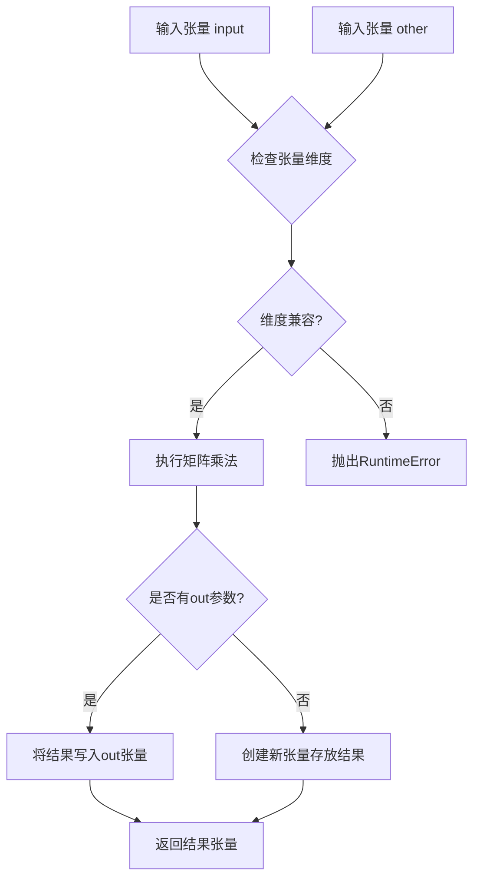

#### 带注释源码

```python
# torch.matmul 是 PyTorch 内置函数，非本项目定义
# 以下为代码中的调用示例

# 标准 FP16 矩阵乘法（基线性能）
torch.matmul(A, B.t())  # A: [batch, seq, model], B: [hidden, model], B.t(): [model, hidden]
# 结果: [batch, seq, hidden]

# 代码中的实际调用（第67-70行）
for i in range(iters):
    torch.matmul(A, B.t())
torch.cuda.synchronize()
print(
    f"pytorch fp16: [{batch},{seq},{model}], [{model},{hidden}]->[{batch},{seq},{hidden}]: {time.time() - t0:.4f}s",
)
```

**补充说明：**

由于`torch.matmul`是PyTorch框架的内置函数，不是本项目（bitsandbytes）代码中定义的函数，因此无法提供其完整的内部实现源码。上面的源码展示的是该函数在本项目测试代码中的调用方式。

本项目（bitsandbytes）的核心贡献是提供了多种量化矩阵乘法实现，用于在保持模型精度的同时加速推理和减少显存占用：

- `bnb.matmul_4bit`：4位量化矩阵乘法
- `bnb.matmul`：8位量化矩阵乘法
- `F.int8_linear_matmul`：INT8线性矩阵乘法

这些函数是本项目自定义实现的量化矩阵运算，可作为`torch.matmul`的替代方案，在特定场景下提供显著的性能提升。


### `torch.cuda.synchronize`

强制主机（CPU）等待所有CUDA流中的所有GPU操作完成，确保之前的GPU计算已经结束，常用于精确测量GPU代码的执行时间。

参数：
- 无

返回值：`None`，该函数不返回任何值。

#### 流程图

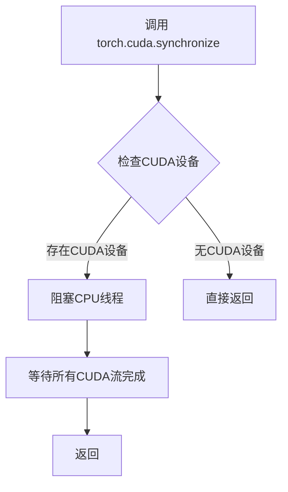

#### 带注释源码

以下是代码中 `torch.cuda.synchronize` 的典型使用场景，用于精确测量 GPU 操作的时间：

```python
    # 预热 GPU，确保后续计时的准确性
    for i in range(iters):
        torch.matmul(A, B.t())
    
    # 同步：等待 GPU 完成所有预热操作
    torch.cuda.synchronize()
    print("")  # 打印空行

    # 再次同步，开始计时
    torch.cuda.synchronize()
    t0 = time.time()
    
    # 执行待测量的矩阵乘法操作
    for i in range(iters):
        torch.matmul(A, B.t())
    
    # 同步：等待 GPU 完成所有操作，确保计时完整
    torch.cuda.synchronize()
    
    # 计算并打印执行时间
    print(
        f"pytorch fp16: [{batch},{seq},{model}], [{model},{hidden}]->[{batch},{seq},{hidden}]: {time.time() - t0:.4f}s",
    )
```

在上述代码中，`torch.cuda.synchronize()` 被调用两次：一次在计时开始前，一次在计时结束后。这确保了 CPU 端的计时包含了 GPU 上所有矩阵乘法的完整执行时间，避免了因异步执行导致的计时不准确问题。


### `torch.randint`

生成指定范围内的随机整数张量，创建一个形状为 `size` 的张量，其中元素从 `[low, high)` 区间内均匀采样的随机整数中填充。

参数：

- `low`：`int`，下界（包含），默认为 0
- `high`：`int`，上界（不包含），指定随机整数范围的上限
- `size`：`tuple` 或 `int`，输出张量的形状
- `generator`：`torch.Generator`，可选，用于指定随机数生成器
- `out`：`Tensor`，可选，指定输出张量
- `dtype`：`torch.dtype`，可选，指定输出张量的数据类型
- `layout`：`torch.layout`，可选，指定张量布局，默认为 `torch.strided`
- `device`：`torch.device`，可选，指定输出张量设备
- `requires_grad`：`bool`，可选，指定是否需要梯度，默认为 `False`

返回值：`Tensor`，包含随机整数的张量，形状由 `size` 指定

#### 流程图

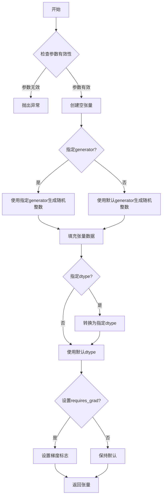

#### 带注释源码

```python
# torch.randint 源码实现逻辑 (PyTorch 内部实现)

def randint(low=0, high, size, *, generator=None, out=None, 
            dtype=None, layout=torch.strided, device=None, requires_grad=False):
    """
    生成指定范围内的随机整数张量
    
    参数:
        low (int): 下界(包含), 默认为0
        high (int): 上界(不包含)
        size (tuple): 输出张量形状
        generator: 可选的随机数生成器
        out: 可选的输出张量
        dtype: 可选的数据类型
        layout: 张量布局
        device: 张量设备
        requires_grad: 是否需要梯度
    
    返回:
        Tensor: 随机整数张量
    """
    
    # 1. 参数验证
    if high <= low:
        raise ValueError(f"high must be greater than low, got low={low}, high={high}")
    
    # 2. 计算随机数范围
    range_val = high - low  # 范围大小
    
    # 3. 创建输出张量
    if out is None:
        # 根据dtype和device创建张量
        if dtype is None:
            dtype = torch.long  # 默认数据类型为int64
        out = torch.empty(size, dtype=dtype, layout=layout, device=device)
    
    # 4. 生成随机整数并填充到张量中
    # 使用torch.randint_like或直接调用底层C++实现
    if generator is not None:
        # 使用指定生成器
        out.random_(generator=generator)
    else:
        # 使用默认生成器
        out.random_()
    
    # 5. 将随机数调整到[low, high)范围
    # random_() 生成 [0, 2^bit-1] 范围的数
    # 需要映射到 [low, high)
    out.add_(low)  # 平移到low开始
    
    # 如果范围不是最大整数的除数,需要额外处理
    if range_val < out.max().item() + 1:
        # 使用取模限制范围
        out.remainder_(range_val)
    
    # 6. 设置梯度标志
    if requires_grad:
        out.requires_grad_(True)
    
    return out

# 在实际PyTorch中的简化调用示例:
# outliers = torch.randint(0, model, size=(5,)).cuda()
# 等价于:
# torch.randint(low=0, high=model, size=(5,), dtype=torch.long, device='cpu').cuda()
```

---

### 代码中 `torch.randint` 的使用分析

在提供的代码中（第58行）：

```python
outliers = torch.randint(0, model, size=(5,)).cuda()
```

**使用场景**：
- 用于生成 5 个随机的列索引（outliers），这些索引将用于在矩阵 A 中标记异常值（outliers）位置

**参数解析**：
- `low=0`：下界为 0
- `high=model`：上界为 `model`（3584），即可能的列索引范围
- `size=(5,)`：生成 5 个随机整数
- `.cuda()`：将结果从 CPU 移动到 CUDA 设备

**返回值**：
- 一个形状为 `(5,)` 的 1D 张量，包含 5 个在 `[0, 3584)` 范围内的随机整数

**后续用途**：
```python
A[:, :, outliers] = 8.0  # 将 A 张量中指定列索引位置的元素设置为 8.0
```

这用于模拟量化场景中的异常值（outliers），测试量化算法对异常值的处理能力。


### `time.time`

获取自 1970 年 1 月 1 日（Unix 纪元）以来经过的秒数，常用于代码执行性能的基准测试和时间测量。

参数：

- （无参数）

返回值：`float`，返回自 Unix 纪元以来的当前时间（以秒为单位），返回值的精度取决于平台，通常为浮点数。

#### 流程图

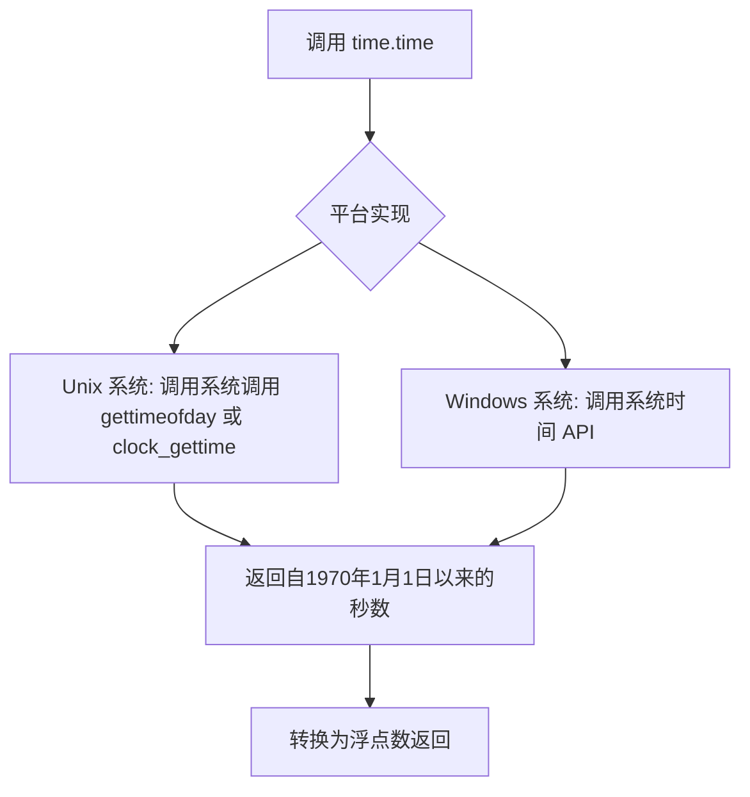

#### 带注释源码

```python
import time

# 调用 time.time() 获取当前时间戳
current_time = time.time()

# 打印当前时间（自1970年1月1日以来的秒数）
print(f"当前时间戳: {current_time}")

# 使用 time.time() 进行性能测量示例
start_time = time.time()
# ... 执行待测量的代码 ...
end_time = time.time()

elapsed = end_time - start_time
print(f"代码执行耗时: {elapsed:.4f} 秒")
```

## 关键组件


### 一段话描述

该代码是一个基准测试文件，用于评估和比较bitsandbytes库中不同量化策略（FP4、NF4、int8、8bit）在矩阵乘法操作中的性能表现，通过对比纯PyTorch FP16实现与各种量化方法的执行时间，帮助开发者选择最优的量化方案。

### 文件的整体运行流程

1. **测试参数定义**：通过`@pytest.mark.parametrize`装饰器定义不同的测试批次大小、序列长度、模型维度和隐藏层维度
2. **环境初始化**：设置CUDA设备、打印选项，创建随机输入张量A和权重张量B
3. **量化预处理**：对权重B进行多种量化（FP4、NF4及各自压缩统计信息版本）
4. **模型构建**：创建8bit线性层和混合阈值8bit层
5. **异常值注入**：在输入张量A中注入异常值用于测试
6. **基准测试循环**：对每种量化方法执行指定次数的矩阵乘法，通过`torch.cuda.synchronize()`确保GPU操作完成后记录时间
7. **结果输出**：打印各种方法的执行时间用于比较分析

### 类的详细信息

#### 全局变量

| 名称 | 类型 | 描述 |
|------|------|------|
| k | int | 迭代次数常量（值为20） |

#### 全局函数

| 名称 | 参数 | 返回值类型 | 描述 |
|------|------|------------|------|
| pytest.mark.parametrize | ("batch", "seq", "model", "hidden"), [...] | decorator | 定义多组测试参数 |
| pytest.mark.benchmark | - | decorator | 标记为基准测试 |
| torch.set_printoptions | precision, sci_mode, linewidth, edgeitems, threshold | None | 配置PyTorch打印格式 |
| torch.randn | batch, seq, model, device, dtype | Tensor | 创建随机输入张量A |
| torch.empty | hidden, model, dtype, device | Tensor | 创建空权重张量B |
| torch.nn.init.xavier_uniform_ | B | Tensor | 使用Xavier均匀初始化B |
| bnb.nn.Linear8bitLt | model, hidden, bias, quant_state, threshold | Linear8bitLt | 创建8bit量化线性层 |
| torch.randint | 0, model, size, device | Tensor | 创建随机整数张量用于异常值索引 |
| torch.cuda.synchronize | - | None | 同步CUDA流确保计时光滑 |
| time.time | - | float | 获取当前时间戳 |

### 关键组件信息

#### 张量索引与惰性加载

该组件负责在基准测试中注入异常值，通过`A[:, :, outliers] = 8.0`将特定通道的值设置为异常高值，用于测试量化方法对异常值的处理能力。这种索引方式展示了惰性加载的一种应用场景——按需修改张量的特定元素而非重新构建整个张量。

#### 反量化支持

该组件体现在多种量化方法的测试中，包括：
- `_B_fp4, _state = F.quantize_fp4(B)` - FP4量化
- `B_nf4, state_nf4 = F.quantize_nf4(B)` - NF4量化
- `bnb.matmul_4bit(A, B_nf4.t(), quant_state=state_nf4)` - 带状态的4bit矩阵乘法

反量化过程在矩阵乘法内部自动完成，使得用户无需显式处理反量化细节。

#### 量化策略

该组件包含多种量化策略的比较：
- **FP4量化**：4位浮点量化，使用`F.quantize_fp4`函数
- **NF4量化**：归一化4位量化，使用`F.quantize_nf4`函数
- **压缩统计信息**：通过`compress_statistics=True`参数减少元数据开销
- **Int8向量级量化**：使用`F.int8_vectorwise_quant`进行每列量化
- **8bit线性层**：使用`bnb.nn.Linear8bitLt`模块，支持阈值控制

### 潜在的技术债务或优化空间

1. **代码复用性不足**：大量的基准测试代码重复，可以提取公共的计时和执行逻辑为辅助函数
2. **注释掉的代码**：存在大段注释掉的备选方案代码（如FP4测试、matmul-lt测试），应清理或移至单独的分析文件
3. **硬编码参数**：迭代次数`iters = 1000`和异常值数量`5`应作为可配置参数
4. **缺失错误处理**：没有对CUDA内存不足、量化失败等异常情况的处理
5. **测试用例单一**：仅定义了一组测试参数，其余被注释，应扩展测试覆盖范围

### 其它项目

#### 设计目标与约束

- **目标**：提供量化矩阵乘法的性能基准，帮助选择最优量化策略
- **约束**：测试必须在CUDA设备上运行，需要足够的GPU内存

#### 错误处理与异常设计

- 缺少对`quantize_fp4`、`quantize_nf4`量化失败的异常捕获
- 缺少对GPU内存不足的处理
- 缺少对不支持的量化参数组合的验证

#### 数据流与状态机

数据流经过以下阶段：
1. 原始FP16张量创建
2. 量化状态生成（state对象）
3. 量化张量存储
4. 矩阵乘法内部反量化计算
5. 结果张量输出

#### 外部依赖与接口契约

- **bitsandbytes (bnb)**：核心量化库，提供`matmul_4bit`、`matmul`函数和`Linear8bitLt`模块
- **PyTorch**：张量操作和CUDA管理
- **pytest**：测试框架
- **functional模块 (F)**：内部量化函数接口


## 问题及建议


### 已知问题

- **未使用的变量**：`k = 20` 定义后完全未使用；`_B_fp4`、`_state`、`_B_fp4_c`、`_state_c` 等变量被计算但从未在基准测试中使用；`formatB` 定义后未使用；`outliers` 变量被创建并修改了矩阵 A，但后续未使用该修改
- **冗余计算**：在循环外预先计算了 `CA`、`CB`（用于 int8 测试），但这些计算本身有开销，且若不使用 int8 测试路径则完全浪费
- **过多的 `torch.cuda.synchronize()`**：每次循环都调用 `synchronize()`，这会强制 CPU 等待 GPU 完成，严重影响基准测试的准确性
- **大量被注释的代码**：存在多个被注释掉的测试分支和函数调用，导致代码臃肿且难以维护
- **唯一的活跃测试用例**：参数化列表中仅有一个启用的测试用例（`batch=1, seq=1, model=3584, hidden=512`），限制了基准测试的覆盖范围
- **不一致的变量命名**：部分变量使用 `_` 前缀表示未使用（如 `_SCA`），但有些未使用的变量没有采用此约定
- **初始化后未使用的对象**：`linear8bit_train` 和 `linear8bit_train_thresh` 被创建但从未调用

### 优化建议

- 移除所有未使用的变量定义，或在注释中说明其用途（如用于调试或未来测试）
- 将 `torch.cuda.synchronize()` 移至循环外，仅在需要精确测量时在循环内部使用，或考虑使用 CUDA events 进行精确计时
- 清理被注释掉的代码，或使用 pytest 的 `pytest.mark.skip` 替代注释，使代码意图更清晰
- 增加更多测试用例以覆盖不同的批量大小、序列长度和模型维度
- 统一变量命名约定，明确区分"未使用"和"临时"变量
- 将 `torch.set_printoptions` 移至测试配置文件或 conftest.py 中，避免在基准测试代码中设置
- 对于需要预热的变量（如 `CA`、`CB`），可以考虑延迟计算或在真正需要时再计算

## 其它


### 设计目标与约束

本代码的核心设计目标是通过基准测试比较不同量化方法（FP16、NF4、INT8等）在矩阵乘法场景下的性能表现，为bitsandbytes库的量化策略选择提供数据支撑。测试约束包括：固定迭代次数为1000次，仅测试特定模型配置（batch=1, seq=1, model=3584, hidden=512），所有计算均在CUDA设备上执行，数据类型以float16和int8为主。

### 错误处理与异常设计

代码未显式实现错误处理机制。潜在异常包括：CUDA内存不足导致tensor分配失败、量化状态（quant_state）未正确传递导致计算错误、模型参数初始化异常等。当前通过pytest框架的标记和参数化机制进行测试组织，异常时会直接抛出并导致测试失败。

### 数据流与状态机

测试数据流如下：首先创建输入tensor A（随机初始化）和权重tensor B（Xavier均匀初始化），然后对B进行不同方式的量化（FP4、NF4及是否压缩统计），接着创建8bit线性层并注入异常值（outliers），最后依次执行各量化方法的矩阵乘法并记录耗时。状态转换主要体现在量化状态（_state、state_nf4等）的生成与传递。

### 外部依赖与接口契约

主要依赖包括：PyTorch（tensor操作、CUDA管理）、pytest（测试框架）、bitsandbytes库（量化与矩阵乘法实现）。关键接口包括：F.quantize_fp4()、F.quantize_nf4()用于量化，F.int8_vectorwise_quant()用于INT8量化，bnb.matmul_4bit()和bnb.matmul()执行量化矩阵乘法，bnb.nn.Linear8bitLt()创建8bit线性层。所有tensor需明确指定device="cuda"和dtype。

### 性能基准与指标

性能评估指标为执行1000次矩阵乘法操作的耗时（秒），通过time.time()和torch.cuda.synchronize()确保计时准确。测试覆盖的基准包括：原生PyTorch FP16、BNB NF4、NF4+压缩统计、动态量化B->CB、不同threshold的8bit量化、INT8向量量化等。输出格式为"方法名: [batch,seq,model] -> [batch,seq,hidden]: 时间"。

### 配置与参数说明

关键参数包括：iters=1000（迭代次数）、batch=1、seq=1、model=3584、hidden=512（矩阵维度）、threshold=6.0（8bit量化阈值）、outliers数量=5个（设置为8.0的异常值）。量化配置通过compress_statistics参数控制是否压缩统计信息，threshold参数控制动态量化的阈值。

### 测试环境与资源管理

测试环境要求CUDA可用，代码通过torch.cuda.synchronize()确保GPU操作完成后再计时。资源管理包括：测试前通过warmup阶段（1000次迭代）预热CUDA上下文，所有tensor显式指定device="cuda"避免CPU-GPU传输开销，未显式释放tensor由Python垃圾回收处理。

### 精度与数值稳定性

量化精度方面：FP4和NF4为4bit量化，INT8为8bit量化，FP16为16bit原生精度。测试通过注入outliers（5个位置设为8.0）验证量化方法对异常值的处理能力。不同量化方法的精度损失通过输出结果的数值对比可进一步分析，当前代码未包含结果正确性验证。

### 潜在的技术债务与优化空间

当前代码存在以下优化空间：大量注释掉的代码段（如FP4测试、igemmlt测试等）可清理；缺少对量化结果正确性的验证逻辑；未实现测试结果的结构化存储（当前仅打印到stdout）；参数化配置可扩展更多模型尺寸；可添加自动化的性能回归检测；缺少对不同GPU架构的适配测试。

    