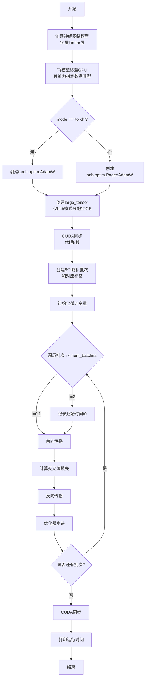

# `bitsandbytes\benchmarking\optimizer_benchmark.py` 详细设计文档

这是一个基准测试脚本，用于测试bitsandbytes库中PagedAdamW优化器与PyTorch标准AdamW优化器在处理大模型参数时的性能差异，通过创建多层线性网络并进行前向传播、损失计算、反向传播和参数更新来测量执行时间。

## 整体流程

```mermaid
graph TD
    A[开始测试] --> B[创建神经网络层 Sequential ModuleList]
B --> C{模式选择}
C -- torch模式 --> D[使用 torch.optim.AdamW]
C -- bnb模式 --> E[使用 bnb.optim.PagedAdamW 并分配大型GPU张量]
D --> F[GPU同步 等待5秒]
E --> F
F --> G[生成测试数据 batches 和 labels]
G --> H{遍历每个batch}
H -- i=0,1,3,4 --> I[前向传播 out1 = layers1(b)]
I --> J[计算交叉熵损失 loss1]
J --> K[反向传播 loss1.backward]
K --> L[优化器步骤 optim.step]
H -- i=2 --> M[记录起始时间 t0]
M --> I
L --> H
H --> N[结束循环]
N --> O[GPU同步]
O --> P[输出执行时间]
```

## 类结构

```
无类定义
├── 模块级
│   ├── str2optimizers (全局变量)
│   └── test_stream_optimizer_bench (测试函数)
```

## 全局变量及字段


### `str2optimizers`
    
优化器名称到(标准优化器类, bitsandbytes优化器类)的映射字典，用于在torch和bnb模式间切换优化器实现

类型：`dict[str, tuple[type, type]]`
    


    

## 全局函数及方法


### `test_stream_optimizer_bench`

这是一个参数化基准测试函数，用于测试 PagedAdamW 优化器（来自 bitsandbytes 库）与标准 PyTorch AdamW 优化器的性能差异。函数创建一个包含 10 个线性层的神经网络，在 GPU 上运行指定数量的训练批次，并测量优化器的执行时间，同时考虑了大内存分配场景（12GB 显存测试）。

参数：

- `dim1`：`int`，模型的输入/输出维度大小，参数化为 2*1024
- `gtype`：`torch.dtype`，张量的数据类型，参数化为 torch.float16
- `optim_name`：`str`，优化器名称，参数化为 "paged_adamw"
- `mode`：`str`，运行模式，参数化为 "bnb"（bitsandbytes）或 "torch"（原生 PyTorch）

返回值：`None`，无返回值（pytest 测试函数）

#### 流程图



#### 带注释源码

```python
@pytest.mark.parametrize("dim1", [2 * 1024], ids=id_formatter("dim1"))
@pytest.mark.parametrize("gtype", [torch.float16], ids=describe_dtype)
@pytest.mark.parametrize("optim_name", ["paged_adamw"], ids=id_formatter("optim_name"))
@pytest.mark.parametrize("mode", ["bnb"], ids=id_formatter("mode"))
@pytest.mark.benchmark
def test_stream_optimizer_bench(dim1, gtype, optim_name, mode):
    """
    参数化基准测试函数，用于测试优化器性能
    
    参数:
        dim1: 线性层的输入/输出维度
        gtype: 模型权重的数据类型
        optim_name: 优化器名称字符串
        mode: 'bnb'使用bitsandbytes优化器, 'torch'使用PyTorch原生优化器
    """
    
    # 创建神经网络: 10个Linear层组成的Sequential模块
    layers1 = torch.nn.Sequential(*torch.nn.ModuleList([torch.nn.Linear(dim1, dim1) for i in range(10)]))
    
    # 将模型转换为指定数据类型(float16)并移至GPU
    layers1 = layers1.to(gtype)
    layers1 = layers1.cuda()

    large_tensor = None
    # 根据mode选择优化器类型
    if mode == "torch":
        # 使用原生PyTorch AdamW
        optim = str2optimizers[optim_name][0](layers1.parameters())
    else:
        # 使用bitsandbytes的PagedAdamW优化器
        optim = str2optimizers[optim_name][1](layers1.parameters())
        # 分配12GB显存用于模拟大模型场景
        large_tensor = torch.empty((int(4.5e9),), device="cuda")

    # 确保GPU操作完成，并等待系统稳定
    torch.cuda.synchronize()
    time.sleep(5)

    # 设置训练参数: 5个批次
    num_batches = 5
    # 生成随机输入批次 (batch_size=128, dim1维度)
    batches = torch.randn(num_batches, 128, dim1, device="cuda").to(gtype)
    # 生成随机分类标签 (10个类别)
    lbls = torch.randint(0, 10, size=(num_batches, 128)).cuda()

    # 训练循环
    for i in range(num_batches):
        print(i)
        b = batches[i]
        # 在第3个批次(i=2)开始计时，忽略前两个批次的预热时间
        if i == 2:
            torch.cuda.synchronize()
            t0 = time.time()

        # 前向传播
        out1 = layers1(b)

        # 计算交叉熵损失并取均值
        loss1 = torch.nn.functional.cross_entropy(out1, lbls[i]).mean()
        # 反向传播计算梯度
        loss1.backward()
        # 优化器更新参数
        optim.step()
    
    # 同步确保所有GPU操作完成
    torch.cuda.synchronize()
    # 打印模式名称和总耗时(从第3个批次开始)
    print(mode, time.time() - t0)
```

## 关键组件


### PagedAdamW优化器

bitsandbytes库中的页式AdamW优化器，支持内存高效的参数管理，用于大规模模型的训练优化。

### 张量索引与惰性加载

通过预生成批次张量 `batches` 使用索引 `batches[i]` 进行访问；`large_tensor` 仅在bnb模式下惰性创建，用于占用GPU内存模拟真实训练场景。

### 反量化支持

使用 `torch.float16` 半精度数据类型，通过 `layers1.to(gtype)` 将模型转换为指定精度，配合bnb优化器实现高效的半精度计算。

### 量化策略

代码通过 `gtype` 参数配置量化精度（float16），结合bitsandbytes库的PagedAdamW优化器实现量化模型的训练加速。

### CUDA同步与计时

使用 `torch.cuda.synchronize()` 确保GPU操作完成，精确测量第3次迭代开始的训练耗时，用于基准性能评估。

### 模型构建

通过 `torch.nn.ModuleList` 和 `torch.nn.Sequential` 构建包含10个Linear层的神经网络，用于模拟真实Transformer模型的优化器基准测试。


## 问题及建议


### 已知问题

- **变量初始化问题**：`t0` 仅在 `i == 2` 时被赋值，但如果 `mode` 不等于 `"bnb"` 或 `optim_name` 不在 `str2optimizers` 中，`t0` 可能未定义导致后续 `print` 语句报错
- **硬编码值过多**：维度（2*1024）、批次数量（5）、内存大小（4.5e9）、等待时间（5秒）均为硬编码，降低了测试的可配置性和可维护性
- **模式验证缺失**：仅检查 `mode == "torch"` 或 `mode == "bnb"`，但未对无效的 `mode` 值进行错误处理，可能导致代码执行到一半才发现问题
- **预热时间处理不当**：只记录 `i >= 2` 的时间，但前两次迭代实际包含模型编译和CUDA预热，影响基准测试结果的准确性
- **资源未显式释放**：`large_tensor` 分配后没有显式的资源清理机制，可能导致内存碎片和测试间耦合
- **优化器映射不完整**：`str2optimizers` 仅定义了一个优化器映射，扩展性差，且 `optim_name` 未验证是否存在于字典中
- **测试无断言**：基准测试函数没有任何断言语句，仅输出时间，无法自动判定性能是否符合预期

### 优化建议

- 将硬编码的测试参数（dim1、num_batches、large_tensor_size等）提取为 pytest fixture 或测试参数，实现配置化管理
- 在循环前初始化 `t0` 变量并添加 `mode` 的有效性验证，确保所有代码路径都能安全执行
- 增加预热阶段（warm-up iterations），在计时前让模型和优化器完成CUDA内核编译和缓存
- 使用 `torch.cuda.memory_reserved()` 和 `torch.cuda.max_memory_allocated()` 等API显式管理内存，并在测试后调用 `del large_tensor; torch.cuda.empty_cache()` 释放资源
- 扩展 `str2optimizers` 字典支持更多优化器，并添加 `optim_name` 的存在性检查
- 为基准测试添加性能阈值断言或与历史结果对比的逻辑，提高测试的自动化程度

## 其它


### 设计目标与约束

验证bitsandbytes库的PagedAdamW优化器在CUDA环境下的性能表现，通过对比torch原生的AdamW优化器，评估其在处理大模型参数时的效率和内存管理能力。测试约束包括：固定维度为2*1024，使用float16数据类型，仅测试paged_adamw优化器，运行模式分为torch和bnb两种，测试批次数为5次，每次批次大小为128。

### 错误处理与异常设计

代码主要依赖pytest框架进行测试断言，未显式实现复杂的异常处理机制。潜在异常场景包括：GPU内存不足时torch.empty可能抛出OutOfMemoryError；CUDA设备不可用时cuda()调用会失败；优化器参数类型不匹配时会在初始化阶段抛出TypeError。当前采用静默处理方式，异常由pytest测试框架捕获并报告。

### 数据流与状态机

测试数据流如下：首先初始化10个Linear层组成的Sequential模型并迁移至CUDA；然后创建large_tensor用于模拟显存占用（bnb模式下12GB）；接着生成5个随机批次数据batches和对应标签lbls；循环执行前向传播、损失计算、反向传播和优化器更新。状态转换顺序为：模型初始化 → 优化器初始化 → 数据准备 → 训练循环（前向→损失→反向→更新）。

### 外部依赖与接口契约

主要外部依赖包括：pytest框架（测试执行）、torch库（张量计算与优化器）、bitsandbytes库（bnb.optim.PagedAdamW优化器）、tests.helpers模块（describe_dtype和id_formatter工具函数）。接口契约方面：优化器接收parameters()迭代器，step()方法无参数且返回None，模型forward接受形状为(batch_size, dim1)的输入张量，损失函数为cross_entropy。

### 性能评估指标

测试通过torch.cuda.synchronize()确保GPU操作完成，使用time.time()计算从第3个批次开始到第5个批次结束的总耗时。输出指标包括各批次索引打印和最终运行时间，用于对比torch原生优化器与bitsandbytes优化器的性能差异。

### 测试配置与参数化

采用pytest.mark.parametrize装饰器进行多维度参数化配置：dim1参数设置为2*1024（2048维），gtype参数为torch.float16（半精度浮点数），optim_name固定为"paged_adamw"，mode在"bnb"和"torch"间切换用于对比测试。ids参数使用自定义格式化函数将参数值转为可读测试标识。

### 资源清理与后处理

代码未显式实现资源清理逻辑，依赖Python垃圾回收机制。测试结束后CUDA上下文会自动释放，但建议显式调用del关键字删除大型张量（large_tensor、layers1、optim等）以加速显存回收。torch.cuda.empty_cache()可作为可选的显式清理操作。

### 测试环境要求

运行要求包括：CUDA可用且显存充足（bnb模式需约12GB以上剩余显存）、已安装torch和bitsandbytes库、tests.helpers模块中的工具函数可用。测试通过@pytest.mark.benchmark标记表明其性能基准测试性质。

    