# `bitsandbytes\benchmarking\switchback\make_plot_with_jsonl.py` 详细设计文档

该脚本使用matplotlib和pandas读取JSON格式的性能基准测试数据，绘制两个图表展示线性层在不同维度下的操作时间消耗和不同批量大小下的加速百分比，并保存为PDF文件。

## 整体流程

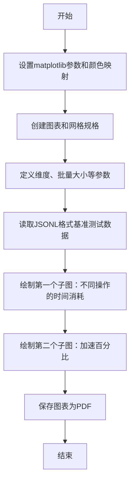

## 类结构

```
该脚本为单文件程序，无类定义
主要包含主程序流程和多个数据处理循环
```

## 全局变量及字段


### `cmap`
    
颜色映射对象，用于图表中不同系列的着色

类型：`matplotlib.colors.Colormap`
    


### `fig`
    
matplotlib图表对象，用于容纳所有子图

类型：`matplotlib.figure.Figure`
    


### `gs`
    
网格规格对象，定义图表的网格布局

类型：`matplotlib.gridspec.GridSpec`
    


### `dims_to_consider`
    
要考虑嵌入维度列表，用于X轴数据

类型：`List[int]`
    


### `batch_size_for_plot1`
    
第一个图的批量大小，用于筛选数据

类型：`int`
    


### `batch_sizes_for_plot2`
    
第二个图的批量大小列表，用于不同批量的比较

类型：`List[int]`
    


### `dims_to_xtick`
    
X轴刻度值列表，用于设置X轴刻度

类型：`List[int]`
    


### `logscale_plot1`
    
标志位，决定第一个图是否使用对数刻度

类型：`bool`
    


### `rdf`
    
原始pandas DataFrame，从JSON文件读取的原始数据

类型：`pandas.DataFrame`
    


### `df`
    
过滤后的pandas DataFrame，根据批量大小过滤后的数据

类型：`pandas.DataFrame`
    


### `ax`
    
matplotlib坐标轴对象，用于绑制子图

类型：`matplotlib.axes.Axes`
    


### `xs`
    
X轴数据列表，用于绑制线条的X坐标

类型：`List[int]`
    


### `ys`
    
Y轴数据列表，用于绑制线条的Y坐标

类型：`List[float]`
    


### `df_`
    
临时数据子集，用于在循环中存储过滤后的DataFrame

类型：`pandas.DataFrame`
    


### `embed_dim`
    
嵌入维度变量，表示当前的嵌入维度值

类型：`int`
    


### `y_`
    
累积时间值，用于累加多个操作的时间

类型：`float`
    


### `k_`
    
操作名称子串，用于从复合键中拆分出单个操作键

类型：`str`
    


### `all_xs`
    
所有X轴数据列表的列表，用于存储不同批量大小的X数据

类型：`List[List[int]]`
    


### `all_ys`
    
所有Y轴数据列表的列表，用于存储不同批量大小的Y数据

类型：`List[List[float]]`
    


### `real_ys`
    
计算得到的加速百分比列表，用于绑制加速百分比图

类型：`List[float]`
    


### `batch_size`
    
批量大小变量，表示当前循环中的批量大小

类型：`int`
    


### `marker`
    
标记样式字符串，用于指定数据点的标记形状

类型：`str`
    


### `ls`
    
线型字符串，用于指定线条的样式

类型：`str`
    


### `color`
    
颜色字符串或值，用于指定线条的颜色

类型：`str`
    


### `name`
    
标签名称字符串，用于图例中的标签

类型：`str`
    


### `k`
    
操作键名，表示要查询的操作组合

类型：`str`
    


### `leg`
    
图例对象，用于显示图例

类型：`matplotlib.legend.Legend`
    


    

## 全局函数及方法


### `plt.get_cmap`

获取指定名称的颜色映射（Colormap）对象，用于在图表中分配颜色。

参数：

- `name`：`str`，颜色映射的名称，如 "cool"、"viridis"、"plasma" 等 matplotlib 支持的颜色映射名称

返回值：`matplotlib.colors.Colormap`，返回对应的颜色映射对象，可用于在绘图中为数据点分配颜色

#### 流程图

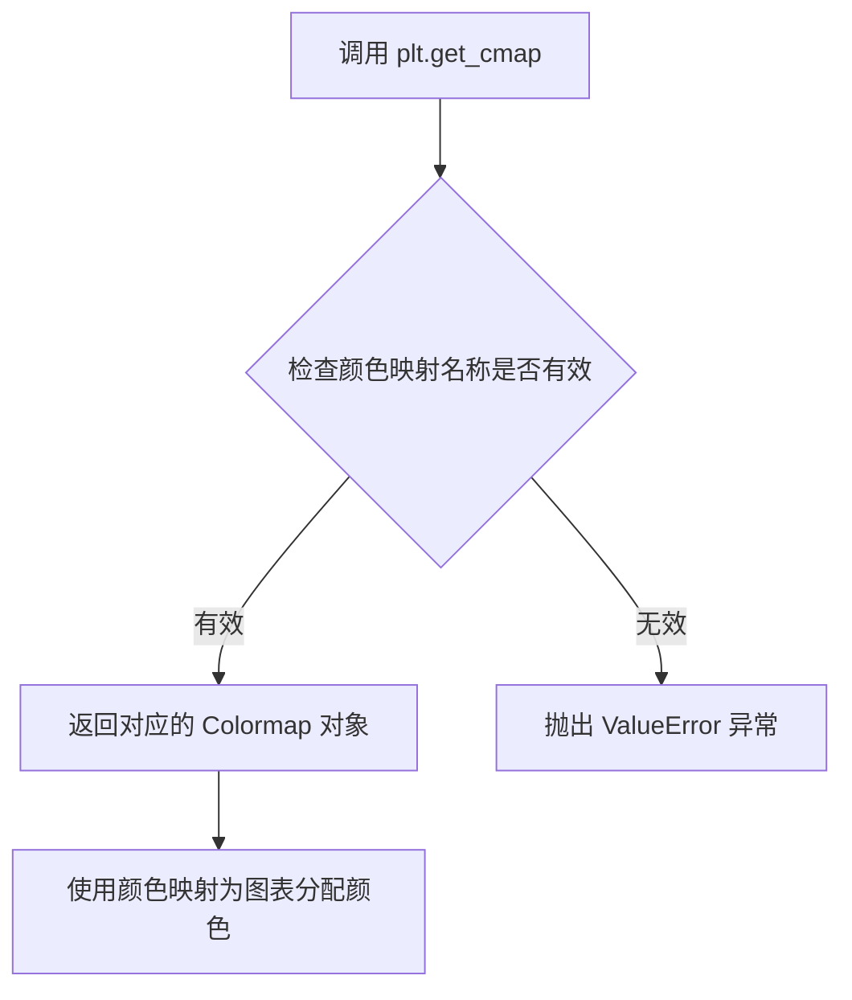

#### 带注释源码

```python
# 导入必要的库
import matplotlib.gridspec as gridspec
import matplotlib.pyplot as plt
import pandas as pd

# 获取名为 "cool" 的颜色映射对象
# "cool" 是 matplotlib 内置的颜色映射，从青色到洋红色的渐变
cmap = plt.get_cmap("cool")

# 后续代码中使用该颜色映射为不同的 batch size 分配不同的颜色
# j * 0.25 生成 0, 0.25, 0.5, 0.75 四个索引值
# cmap(j * 0.25) 返回对应的 RGBA 颜色值
color = cmap(j * 0.25)
```


### `plt.figure`

创建并返回一个新的 matplotlib Figure 对象，用于后续图表的绘制。

参数：

- `tight_layout`：`bool`，是否自动调整子图参数以防止重叠，代码中设置为 `True`
- `figsize`：`tuple of (float, float)`，图形的宽和高（英寸），代码中设置为 `(12, 3.5)`

返回值：`matplotlib.figure.Figure`，返回新创建的图形对象，后续可通过 `add_subplot` 添加子图

#### 流程图

```mermaid
graph TD
    A[调用 plt.figure] --> B{参数验证}
    B -->|tight_layout=True| C[启用自动布局调整]
    B -->|figsize=(12, 3.5)| D[设置图形尺寸为宽12高3.5英寸]
    C --> E[创建 Figure 对象]
    D --> E
    E --> F[返回 Figure 实例]
    F --> G[通过 fig.add_subplot 添加子图]
```

#### 带注释源码

```python
# 导入必要的库
import matplotlib.gridspec as gridspec  # 用于网格布局
import matplotlib.pyplot as plt          # matplotlib 主模块
import pandas as pd                      # 数据处理

# 获取颜色映射
cmap = plt.get_cmap("cool")

if __name__ == "__main__":
    # 创建图形对象，tight_layout=True 自动调整子图布局防止重叠
    # figsize=(12, 3.5) 设置图形宽度12英寸、高度3.5英寸
    fig = plt.figure(tight_layout=True, figsize=(12, 3.5))
    
    # 创建 GridSpec 网格布局：1行2列
    gs = gridspec.GridSpec(1, 2)

    # 定义要考虑的嵌入维度列表
    dims_to_consider = [1024, 1280, 1408, 1664, 2048, 4096]
    
    # 第一个子图的批次大小
    batch_size_for_plot1 = 32768
    
    # 第二个子图要比较的批次大小列表
    batch_sizes_for_plot2 = [2**14, 2**15, 2**16, 2**17]
    
    # X轴刻度位置
    dims_to_xtick = [1024, 2048, 4096]
    
    # 是否对第一个子图使用对数刻度
    logscale_plot1 = True

    # 在网格的第一个位置添加子图 (第一行第一列)
    ax = fig.add_subplot(gs[0, 0])

    # 从 JSONL 文件读取性能基准数据
    rdf = pd.read_json("speed_benchmark/info_a100_py2l.json", lines=True)
    
    # 筛选特定批次大小的数据
    df = rdf[rdf.batch_size == batch_size_for_plot1]

    # 遍历不同操作的配置，绘制多条曲线
    # 每个元组包含: (操作键名, 标记, 线型, 颜色, 图例名)
    for k, marker, ls, color, name in [
        ("standard_gx+standard_gw+standard_fwd", "s", "-", "C2", "Standard fp16 (sum of parts)"),
        (
            "x_quantize_rowwise+g_quantize_rowwise+w_quantize_global+w_quantize_global_transpose+standard_gw+global_fwd+global_bwd",
            "o",
            "-",
            "C4",
            "SwitchBack int8 (sum of parts)",
        ),
        ("standard_fwd", "^", "--", "C2", "Matmul XW (standard)"),
        ("standard_gw", "^", "-.", "C2", "Matmul GW (standard)"),
        ("standard_gx", "^", ":", "gray", "Matmul GX (both)"),
        ("global_fwd", "^", "--", "C4", "Int8 Matmul XW (switchback)"),
        ("global_bwd", "^", "-.", "C4", "Int8 Matmul GW (switchback)"),
        ("x_quantize_rowwise", "P", "--", "C4", "Quantize rowwise X (switchback)"),
        ("g_quantize_rowwise", "P", "-.", "C4", "Quantize rowwise G (switchback)"),
        ("w_quantize_global", ".", "--", "C4", "Quantize global W (switchback)"),
        ("w_quantize_global_transpose", ".", "-.", "C4", "Quantize global and\ntranspose W (switchback)"),
    ]:
        xs = []  # X轴数据（嵌入维度）
        ys = []  # Y轴数据（时间）
        
        # 遍历每个嵌入维度
        for embed_dim in dims_to_consider:
            # 第一次处理: dim -> 4*dim
            df_ = df[df.dim_in == embed_dim]
            df_ = df_[df_.dim_out == embed_dim * 4]
            xs.append(embed_dim)
            y_ = 0
            
            # 累加多个操作的时间
            for k_ in k.split("+"):
                y_ += df_[k_].values[0]
            
            # 第二次处理: 4*dim -> dim
            df_ = df[df.dim_in == embed_dim * 4]
            df_ = df_[df_.dim_out == embed_dim]
            for k_ in k.split("+"):
                y_ += df_[k_].values[0]
            
            # 时间取平均（双向操作）
            ys.append(y_ * 0.5)

        # 绘制曲线
        ax.plot(
            xs,
            ys,
            color=color,
            label=name,
            marker=marker,
            markersize=5 if marker == "s" else 5,
            linestyle=ls,
            linewidth=2 if "+" in k else 1.0,
        )

    # 设置坐标轴标签
    ax.set_xlabel("dim", fontsize=13)
    ax.set_ylabel("time (ms)", fontsize=13)

    # 显示网格
    ax.grid()

    # 设置坐标轴刻度类型
    ax.set_xscale("log")
    if logscale_plot1:
        ax.set_yscale("log")

    # 设置刻度字体大小
    ax.tick_params(axis="x", labelsize=11)
    ax.tick_params(axis="y", labelsize=11)

    # 设置X轴刻度
    ax.set_xticks(dims_to_xtick)
    ax.set_xticklabels(dims_to_xtick)
    ax.set_xticks([], minor=True)

    # 配置图例
    leg = ax.legend(loc="upper center", bbox_to_anchor=(-0.64, 1.0), ncol=1, fontsize=10)
    leg.get_texts()[0].set_fontweight("bold")
    leg.get_texts()[1].set_fontweight("bold")
    
    # 调整布局边距
    plt.subplots_adjust(left=0.1)
    
    # 设置子图标题
    ax.set_title("  Linear layer, batch * sequence length = 32k", fontsize=10, loc="left", y=1.05, pad=-20)

    # 在网格的第二个位置添加子图 (第一行第二列)
    ax = fig.add_subplot(gs[0, 1])

    # 遍历不同的批次大小，绘制加速比
    for j, batch_size in enumerate(batch_sizes_for_plot2):
        all_xs, all_ys = [], []
        
        # 遍历标准方法与SwitchBack方法
        for k, marker, ls, color, name in [
            ("standard_gx+standard_gw+standard_fwd", "s", "-", "C2", "Standard fp16 (total time)"),
            (
                "x_quantize_rowwise+g_quantize_rowwise+w_quantize_global+w_quantize_global_transpose+standard_gw+global_fwd+global_bwd",
                "o",
                "-",
                "C4",
                "SwitchBack int8 (total time)",
            ),
        ]:
            xs, ys = [], []
            df = rdf[rdf.batch_size == batch_size]
            
            # 遍历每个嵌入维度计算时间
            for embed_dim in dims_to_consider:
                df_ = df[df.dim_in == embed_dim]
                df_ = df_[df_.dim_out == embed_dim * 4]
                xs.append(embed_dim)
                y_ = 0
                for k_ in k.split("+"):
                    y_ += df_[k_].values[0]
                df_ = df[df.dim_in == embed_dim * 4]
                df_ = df_[df_.dim_out == embed_dim]
                for k_ in k.split("+"):
                    y_ += df_[k_].values[0]
                ys.append(y_ * 0.5)
            all_xs.append(xs)
            all_ys.append(ys)

        # 计算加速百分比
        color = cmap(j * 0.25)
        real_ys = [-((all_ys[1][i] - all_ys[0][i]) / all_ys[0][i]) * 100 for i in range(len(all_ys[0]))]
        
        markers = ["^", "v", "P", "o"]
        
        # 绘制加速比曲线
        ax.plot(
            all_xs[0],
            real_ys,
            color=color,
            label=f"batch * sequence length = {batch_size}",
            marker=markers[j],
            markersize=5 if marker == "s" else 5,
        )

    # 配置第二个子图
    ax.legend()
    ax.set_xlabel("dim", fontsize=13)
    ax.set_xscale("log")
    ax.grid()
    ax.set_ylabel(r"% speedup", fontsize=13)

    ax.tick_params(axis="x", labelsize=11)
    ax.tick_params(axis="y", labelsize=11)

    ax.set_xticks(dims_to_xtick)
    ax.set_xticklabels(dims_to_xtick)
    ax.set_xticks([], minor=True)

    ax.set_title("  Linear layer summary, varying dimensions", fontsize=10, loc="left", y=1.05, pad=-20)

    # 保存图形到PDF文件
    plt.savefig("speed_benchmark/plot_with_info.pdf", bbox_inches="tight")
```


### `gridspec.GridSpec`

GridSpec 是 matplotlib 中用于定义子图网格布局的类，它指定了 figure 中子图的位置和大小关系。通过 GridSpec，用户可以创建复杂的多行多列布局，并灵活地控制子图之间的间距和相对大小。

参数：

- `nrows`：`int`，行数，指定网格的行数量，代码中传入 `1`
- `ncols`：`int`，列数，指定网格的列数量，代码中传入 `2`
- `height_ratios`：`array-like`，可选，行高比例，用于指定各行的相对高度
- `width_ratios`：`array-like`，可选，列宽比例，用于指定各列的相对宽度
- `hspace`：`float`，可选，垂直方向子图之间的间距
- `wspace`：`float`，可选，水平方向子图之间的间距

返回值：`GridSpec`，返回创建的网格规格对象，用于后续通过索引（如 `gs[0, 0]`）获取子图位置

#### 流程图

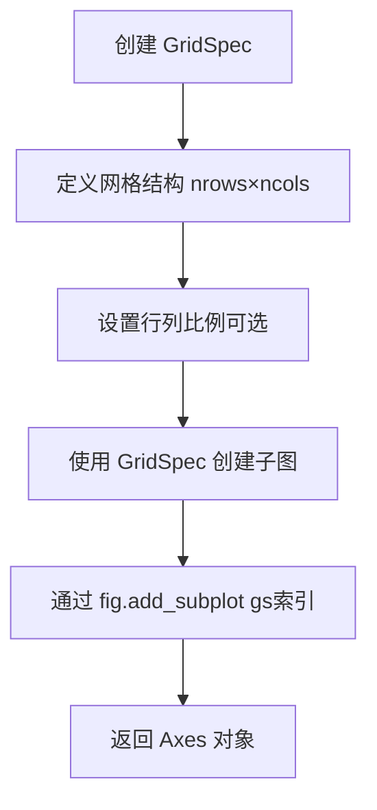

#### 带注释源码

```python
# 导入 matplotlib 的 gridspec 模块
import matplotlib.gridspec as gridspec
import matplotlib.pyplot as plt

# 获取颜色映射
cmap = plt.get_cmap("cool")

if __name__ == "__main__":
    # 创建图形对象，tight_layout=True 自动调整子图间距
    # figsize=(12, 3.5) 设置图形宽度12英寸、高度3.5英寸
    fig = plt.figure(tight_layout=True, figsize=(12, 3.5))
    
    # 创建网格规格：1行2列的网格布局
    # 这是 GridSpec 的核心用法：指定行数和列数
    gs = gridspec.GridSpec(1, 2)
    
    # 定义要考虑的维度列表
    dims_to_consider = [1024, 1280, 1408, 1664, 2048, 4096]
    batch_size_for_plot1 = 32768
    batch_sizes_for_plot2 = [2**14, 2**15, 2**16, 2**17]
    dims_to_xtick = [1024, 2048, 4096]
    logscale_plot1 = True

    # 使用 GridSpec 索引获取子图位置：gs[0, 0] 表示第1行第1列
    # 这创建了一个占据网格中特定位置的子图
    ax = fig.add_subplot(gs[0, 0])
    
    # 读取数据文件
    rdf = pd.read_json("speed_benchmark/info_a100_py2.jsonl", lines=True)
    df = rdf[rdf.batch_size == batch_size_for_plot1]

    # 绘制第一个子图的各种数据线条（代码省略）
    # ... 绘图逻辑 ...
    
    # 同样使用 GridSpec 创建右侧子图：gs[0, 1] 表示第1行第2列
    ax = fig.add_subplot(gs[0, 1])
    
    # 绘制第二个子图的数据（代码省略）
    # ... 绘图逻辑 ...
    
    # 保存图形为 PDF 文件
    plt.savefig("speed_benchmark/plot_with_info.pdf", bbox_inches="tight")
```

### 关键组件信息

| 组件名称 | 一句话描述 |
|---------|-----------|
| `GridSpec` | 用于定义 matplotlib 图形中子图网格布局的类 |
| `fig.add_subplot(gs[i, j])` | 根据 GridSpec 索引创建子图的方法 |
| `cmap` | 颜色映射对象，用于为不同数据系列分配颜色 |

### 潜在技术债务与优化空间

1. **硬编码配置**：维度列表、批量大小等参数硬编码在主脚本中，应提取为配置文件或命令行参数
2. **数据文件路径**：JSON 数据文件路径硬编码，缺乏灵活性
3. **重复绘图逻辑**：两个子图的绘图逻辑有重复代码，可抽象为函数
4. **TODO 注释**：代码中有一个 TODO 注释标记了待办事项
5. **魔法数字**：如 `j * 0.25`、`0.5` 等数值缺乏明确含义，应定义为常量

### 其它说明

**设计目标与约束**：
- 本代码用于可视化深度学习模型的性能基准测试结果
- 支持对数刻度显示（logscale）以适应大范围数值

**错误处理**：
- 缺乏对文件读取失败、JSON 解析错误的异常处理
- 缺乏对空数据 DataFrame 的检查

**数据流**：
1. 读取 JSONL 格式的性能数据
2. 根据过滤条件筛选数据
3. 聚合计算不同操作的时间消耗
4. 使用 matplotlib 绑定到 GridSpec 创建的网格中
5. 输出 PDF 格式的图表


### `Figure.add_subplot`

在matplotlib中，`Figure.add_subplot`方法用于向图形对象添加一个子图（Axes）。它可以接受多种参数形式（如行/列/位置、GridSpec对象等），并在指定位置创建一个Axes对象返回。

参数：

-  `*args`：可变位置参数，支持三种调用方式：
    - 三个整数 `(rows, cols, index)`：分别表示子图网格的行数、列数和要创建的第几个子图（从1开始）
    - 一个三位整数：如 `211` 表示 2行1列的第1个位置
    - `gridspec.GridSpec` 或 `gridspec.GridSpecFromSubplotSpec` 对象：用于更灵活的子图布局指定
-  `**kwargs`：可选关键字参数，将传递给`Axes`的创建（如`projection`、`polar`等）

返回值：`matplotlib.axes.Axes`，创建好的子图轴对象，用于后续的绘图操作（如`plot`、`set_xlabel`等）。

#### 流程图

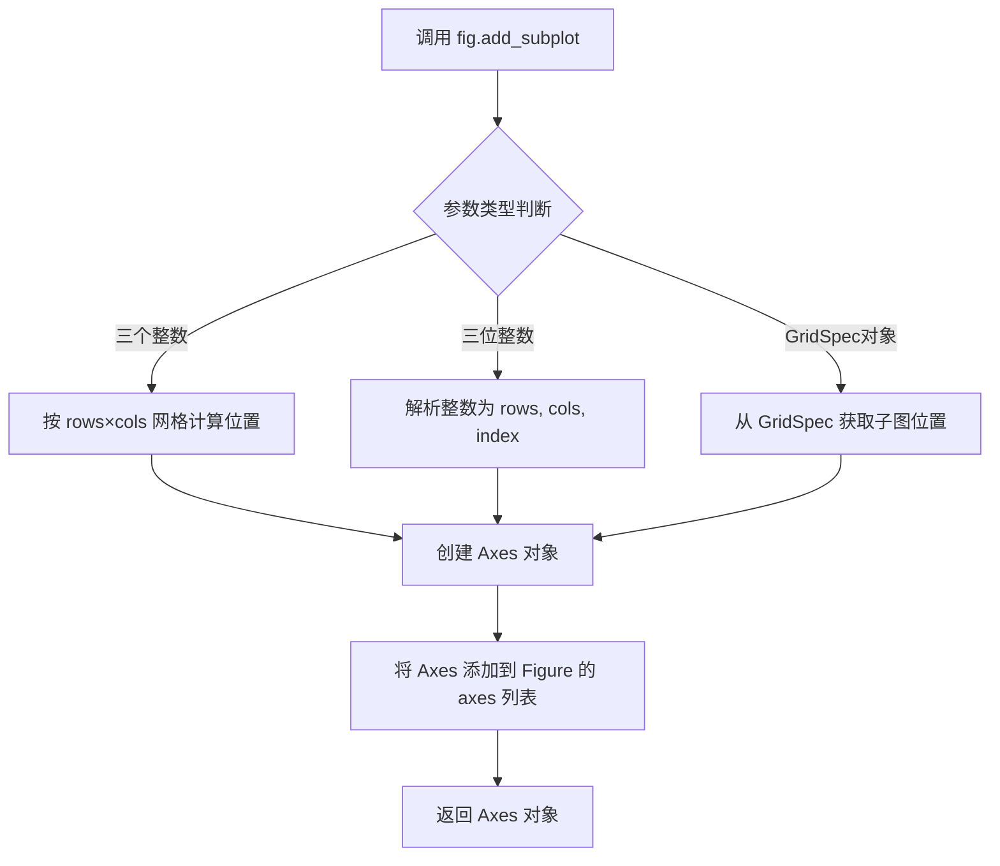

#### 带注释源码

```python
# 代码中 fig.add_subplot 的两种实际调用方式

# 方式一：使用 GridSpec 对象添加子图（第一个子图位置：第0行第0列）
ax = fig.add_subplot(gs[0, 0])
# 参数: gridspec.GridSpec 的切片对象
# 返回: Axes 对象，赋值给 ax 变量用于后续绑定

# 方式二：使用 GridSpec 对象添加子图（第二个子图位置：第0行第1列）
ax = fig.add_subplot(gs[0, 1])
# 参数: gridspec.GridSpec 的切片对象
# 返回: Axes 对象，赋值给 ax 变量用于后续绑定

# 在代码中的实际用途：
# 1. 第一个 add_subplot 创建一个左边的子图，用于绘制不同操作的时间对比
#    - 设置 x 轴为 dim，y 轴为 time (ms)
#    - 绘制多条线表示不同操作的时间消耗

# 2. 第二个 add_subplot 创建一个右边的子图，用于绘制不同 batch size 下的加速比
#    - 设置 x 轴为 dim，y 轴为 % speedup
#    - 绘制不同颜色的线表示不同 batch size 的加速效果
```


### `pd.read_json`

该函数是 Pandas 库中的全局函数，用于从 JSON 文件或 JSON 格式的字符串中读取数据并转换为 DataFrame。在此代码中，它读取包含性能基准测试结果的 JSONL（JSON Lines）文件。

#### 参数

- `path_or_buffer`：`str`，要读取的 JSON 文件路径，这里为 `"speed_benchmark/info_a100_py2.jsonl"`
- `lines`：`bool`，如果设置为 `True`，则将文件视为每行一个 JSON 对象的格式（JSON Lines），这里为 `True`

#### 返回值

- `DataFrame`，返回包含 JSON 数据的 Pandas DataFrame 对象

#### 流程图

```mermaid
flowchart TD
    A[开始读取 JSON 文件] --> B{传入文件路径和参数}
    B --> C[打开指定路径的文件<br/>path_or_buffer = "speed_benchmark/info_a100_py2.jsonl"]
    C --> D{lines 参数}
    D -->|True| E[按行解析 JSON<br/>每行作为独立的 JSON 对象]
    D -->|False| F[解析整个文件为单个 JSON 对象]
    E --> G[将每行 JSON 转换为 DataFrame 的一行]
    F --> G
    G --> H[返回 DataFrame 对象]
    H --> I[赋值给变量 rdf]
    I --> J[结束]
```

#### 带注释源码

```python
# 读取 JSON Lines 格式的性能基准测试数据
# 参数说明：
#   - 第一个参数 "speed_benchmark/info_a100_py2.jsonl": JSON 文件路径
#   - lines=True: 指定文件格式为 JSON Lines（每行一个独立的 JSON 对象）
# 返回值：
#   - rdf: 包含所有 JSON 记录行的 DataFrame 对象
rdf = pd.read_json("speed_benchmark/info_a100_py2.jsonl", lines=True)

# 后续使用示例：
# 根据 batch_size 筛选数据
df = rdf[rdf.batch_size == batch_size_for_plot1]
```


### `main` - 数据可视化主函数

该脚本从 JSONL 文件中读取性能基准测试数据，绘制两个子图分别展示不同操作的时间消耗和不同批次大小下的性能提升百分比，并将结果保存为 PDF 文件。

#### 参数

由于该代码块为脚本入口，无显式函数参数，但包含以下关键配置常量：

- `dims_to_consider`：`list[int]`，要考虑的嵌入维度列表 [1024, 1280, 1408, 1664, 2048, 4096]
- `batch_size_for_plot1`：`int`，第一个图的批次大小 32768
- `batch_sizes_for_plot2`：`list[int]`，第二个图的批次大小列表 [2**14, 2**15, 2**16, 2**17]
- `dims_to_xtick`：`list[int]`，X 轴刻度值 [1024, 2048, 4096]
- `logscale_plot1`：`bool`，是否对第一个图使用对数刻度 True
- `input_file`：`str`，输入数据文件路径 "speed_benchmark/info_a100_py2.jsonl"
- `output_file`：`str`，输出图像文件路径 "speed_benchmark/plot_with_info.pdf"

#### 返回值

- `None`：该脚本不返回任何值，结果直接保存为 PDF 文件

#### 流程图

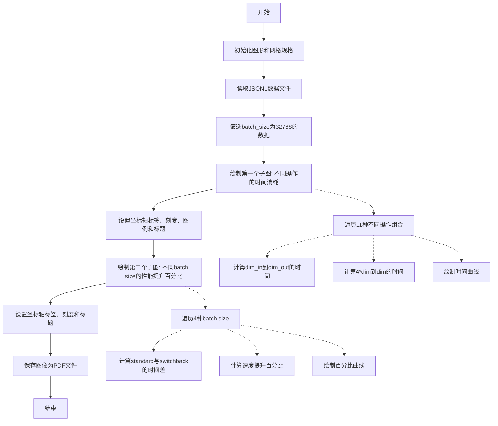

#### 带注释源码

```python
import matplotlib.gridspec as gridspec  # 网格布局
import pandas as pd  # 数据处理
import matplotlib.pyplot as plt  # 绘图

# 获取颜色映射 'cool'
cmap = plt.get_cmap("cool")

if __name__ == "__main__":
    # ========== 初始化图形 ==========
    fig = plt.figure(tight_layout=True, figsize=(12, 3.5))  # 创建图形，12x3.5英寸
    gs = gridspec.GridSpec(1, 2)  # 1行2列的网格布局

    # ========== 配置参数 ==========
    dims_to_consider = [1024, 1280, 1408, 1664, 2048, 4096]  # 嵌入维度列表
    batch_size_for_plot1 = 32768  # 第一个图的固定batch size
    batch_sizes_for_plot2 = [2**14, 2**15, 2**16, 2**17]  # 第二个图的batch size范围
    dims_to_xtick = [1024, 2048, 4096]  # X轴刻度
    logscale_plot1 = True  # 第一个图使用对数Y轴

    # ========== 读取数据 ==========
    ax = fig.add_subplot(gs[0, 0])  # 创建第一个子图
    rdf = pd.read_json("speed_benchmark/info_a100_py2.jsonl", lines=True)  # 读取JSONL数据
    df = rdf[rdf.batch_size == batch_size_for_plot1]  # 筛选特定batch size的数据

    # ========== 第一个子图: 时间消耗对比 ==========
    # 定义11种操作组合及其绘图属性(键名、标记、线型、颜色、名称)
    operations = [
        ("standard_gx+standard_gw+standard_fwd", "s", "-", "C2", "Standard fp16 (sum of parts)"),
        ("x_quantize_rowwise+g_quantize_rowwise+w_quantize_global+w_quantize_global_transpose+standard_gw+global_fwd+global_bwd", "o", "-", "C4", "SwitchBack int8 (sum of parts)"),
        ("standard_fwd", "^", "--", "C2", "Matmul XW (standard)"),
        ("standard_gw", "^", "-.", "C2", "Matmul GW (standard)"),
        ("standard_gx", "^", ":", "gray", "Matmul GX (both)"),
        ("global_fwd", "^", "--", "C4", "Int8 Matmul XW (switchback)"),
        ("global_bwd", "^", "-.", "C4", "Int8 Matmul GW (switchback)"),
        ("x_quantize_rowwise", "P", "--", "C4", "Quantize rowwise X (switchback)"),
        ("g_quantize_rowwise", "P", "-.", "C4", "Quantize rowwise G (switchback)"),
        ("w_quantize_global", ".", "--", "C4", "Quantize global W (switchback)"),
        ("w_quantize_global_transpose", ".", "-.", "C4", "Quantize global and\ntranspose W (switchback)"),
    ]

    for k, marker, ls, color, name in operations:
        xs, ys = [], []  # 存储X轴和Y轴数据
        # 遍历每个嵌入维度
        for embed_dim in dims_to_consider:
            # 计算 dim -> 4*dim 的时间
            df_ = df[df.dim_in == embed_dim]
            df_ = df_[df_.dim_out == embed_dim * 4]
            xs.append(embed_dim)
            y_ = 0
            for k_ in k.split("+"):  # 累加多个操作的时间
                y_ += df_[k_].values[0]
            
            # 计算 4*dim -> dim 的时间
            df_ = df[df.dim_in == embed_dim * 4]
            df_ = df_[df_.dim_out == embed_dim]
            for k_ in k.split("+"):
                y_ += df_[k_].values[0]
            ys.append(y_ * 0.5)  # 取平均值

        # 绘制曲线
        ax.plot(xs, ys, color=color, label=name, marker=marker,
                markersize=5 if marker == "s" else 5, linestyle=ls,
                linewidth=2 if "+" in k else 1.0)

    # 设置第一个子图属性
    ax.set_xlabel("dim", fontsize=13)
    ax.set_ylabel("time (ms)", fontsize=13)
    ax.grid()
    ax.set_xscale("log")
    if logscale_plot1:
        ax.set_yscale("log")
    ax.tick_params(axis="x", labelsize=11)
    ax.tick_params(axis="y", labelsize=11)
    ax.set_xticks(dims_to_xtick)
    ax.set_xticklabels(dims_to_xtick)
    ax.set_xticks([], minor=True)
    leg = ax.legend(loc="upper center", bbox_to_anchor=(-0.64, 1.0), ncol=1, fontsize=10)
    leg.get_texts()[0].set_fontweight("bold")
    leg.get_texts()[1].set_fontweight("bold")
    plt.subplots_adjust(left=0.1)
    ax.set_title("  Linear layer, batch * sequence length = 32k", fontsize=10, loc="left", y=1.05, pad=-20)

    # ========== 第二个子图: 速度提升百分比 ==========
    ax = fig.add_subplot(gs[0, 1])
    
    for j, batch_size in enumerate(batch_sizes_for_plot2):
        all_xs, all_ys = [], []
        for k, marker, ls, color, name in [
            ("standard_gx+standard_gw+standard_fwd", "s", "-", "C2", "Standard fp16 (total time)"),
            ("x_quantize_rowwise+g_quantize_rowwise+w_quantize_global+w_quantize_global_transpose+standard_gw+global_fwd+global_bwd", "o", "-", "C4", "SwitchBack int8 (total time)"),
        ]:
            xs, ys = [], []
            df = rdf[rdf.batch_size == batch_size]
            for embed_dim in dims_to_consider:
                df_ = df[df.dim_in == embed_dim]
                df_ = df_[df_.dim_out == embed_dim * 4]
                xs.append(embed_dim)
                y_ = 0
                for k_ in k.split("+"):
                    y_ += df_[k_].values[0]
                df_ = df[df.dim_in == embed_dim * 4]
                df_ = df_[df_.dim_out == embed_dim]
                for k_ in k.split("+"):
                    y_ += df_[k_].values[0]
                ys.append(y_ * 0.5)
            all_xs.append(xs)
            all_ys.append(ys)

        # 计算速度提升百分比: (standard - switchback) / standard * 100
        color = cmap(j * 0.25)
        real_ys = [-((all_ys[1][i] - all_ys[0][i]) / all_ys[0][i]) * 100 for i in range(len(all_ys[0]))]
        markers = ["^", "v", "P", "o"]
        ax.plot(all_xs[0], real_ys, color=color,
                label=f"batch * sequence length = {batch_size}",
                marker=markers[j], markersize=5)

    # 设置第二个子图属性
    ax.legend()
    ax.set_xlabel("dim", fontsize=13)
    ax.set_xscale("log")
    ax.grid()
    ax.set_ylabel(r"% speedup", fontsize=13)
    ax.tick_params(axis="x", labelsize=11)
    ax.tick_params(axis="y", labelsize=11)
    ax.set_xticks(dims_to_xtick)
    ax.set_xticklabels(dims_to_xtick)
    ax.set_xticks([], minor=True)
    ax.set_title("  Linear layer summary, varying dimensions", fontsize=10, loc="left", y=1.05, pad=-20)

    # ========== 保存图像 ==========
    plt.savefig("speed_benchmark/plot_with_info.pdf", bbox_inches="tight")
```


### `ax.plot`

`ax.plot` 是 Matplotlib 库中 `Axes` 对象的方法，用于在图表上绘制线条和标记。该方法接受 x 和 y 坐标数据，并根据提供的样式参数（颜色、标记、线型、线宽等）绘制折线图。

#### 参数

- `x`：数组或列表，X 轴数据点
- `y`：数组或列表，Y 轴数据点
- `color`：字符串（如 `"C2"`、`"C4"`、`"gray"`），线条颜色
- `label`：字符串，图例中显示的标签名称
- `marker`：字符串（如 `"s"`、`"o"`、`"^"`），数据点标记样式
- `markersize`：整数，标记大小
- `linestyle`：字符串（如 `"-"`、`"--"`、`"-."`），线型样式
- `linewidth`：浮点数或整数，线条宽度

#### 返回值：`list of matplotlib.lines.Line2D`

返回一个包含所有创建的线条对象的列表，每个 `Line2D` 对象代表一条绘制的线条。

#### 流程图

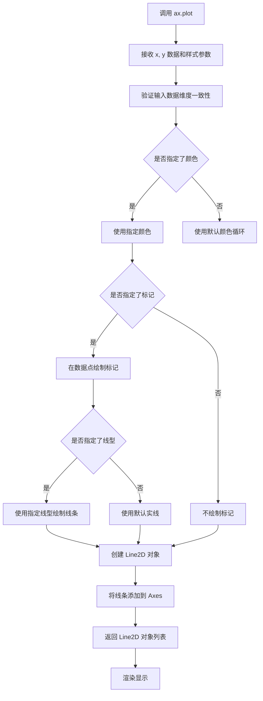

#### 带注释源码

```python
# 第一次调用 ax.plot - 绘制不同操作的时间对比
ax.plot(
    xs,                                    # X轴数据：embed_dim 列表 [1024, 1280, 1408, 1664, 2048, 4096]
    ys,                                    # Y轴数据：时间值列表（毫秒）
    color=color,                           # 线条颜色（如 "C2", "C4", "gray"）
    label=name,                            # 图例标签（如 "Standard fp16 (sum of parts)"）
    marker=marker,                         # 标记样式（如 "s", "o", "^", "P", "."）
    markersize=5 if marker == "s" else 5, # 标记大小，如果 marker 是 "s" 则为 5，否则为 5
    linestyle=ls,                          # 线型（如 "-" 实线, "--" 虚线, "-." 点划线, ":" 点线）
    linewidth=2 if "+" in k else 1.0,     # 线宽，如果 k 包含 "+" 则为 2，否则为 1.0
)

# 第二次调用 ax.plot - 绘制不同批大小的加速百分比
ax.plot(
    all_xs[0],                                      # X轴数据：embed_dim 列表
    real_ys,                                        # Y轴数据：加速百分比列表 [负百分比值]
    color=color,                                    # 线条颜色（从 cmap 渐变色获取）
    label=f"batch * sequence length = {batch_size}", # 图例标签（如 "batch * sequence length = 16384"）
    marker=markers[j],                              # 标记样式（从 markers 列表中选择）
    markersize=5 if marker == "s" else 5,           # 标记大小
)
```

#### 补充说明

在代码中，`ax.plot` 被调用了两次，用于生成两种不同的可视化图表：

1. **第一次调用**（第 67-78 行）：绘制线性层中不同操作的时间消耗对比，包括标准 fp16 和 SwitchBack int8 两种方法的各个组成部分。

2. **第二次调用**（第 127-135 行）：绘制不同批大小下相对于标准 fp16 的加速百分比。

这两个调用都使用了 Matplotlib 的 `plot` 方法的常用参数，通过不同的数据源和样式配置实现了复杂的数据可视化效果。


### `ax.set_xlabel` (Axes.set_xlabel)

设置Axes对象的X轴标签（xlabel），用于在matplotlib图表上显示X轴的名称或描述。

参数：

- `xlabel`： `str`，X轴标签的文本内容，例如 `"dim"`、`"time (ms)"` 等
- `fontdict`： `dict`，可选，用于设置文本属性的字典，如 `{'fontsize': 13, 'fontweight': 'bold'}`
- `labelpad`： `float`，可选，标签与X轴之间的间距（磅值），默认为 `None`（使用matplotlib默认间距）
- `**kwargs`： `Any`，其他关键字参数，用于直接设置文本属性，常用参数包括：
  - `fontsize`/`size`：字体大小
  - `fontweight`/`weight`：字体粗细（如 `'bold'`、`'normal'`）
  - `color`：文本颜色
  - `rotation`：旋转角度
  - `horizontalalignment`/`ha`：水平对齐方式（`'left'`、`'center'`、`'right'`）
  - `verticalalignment`/`va`：垂直对齐方式

返回值： `None`，该方法直接修改Axes对象的属性，无返回值

#### 流程图

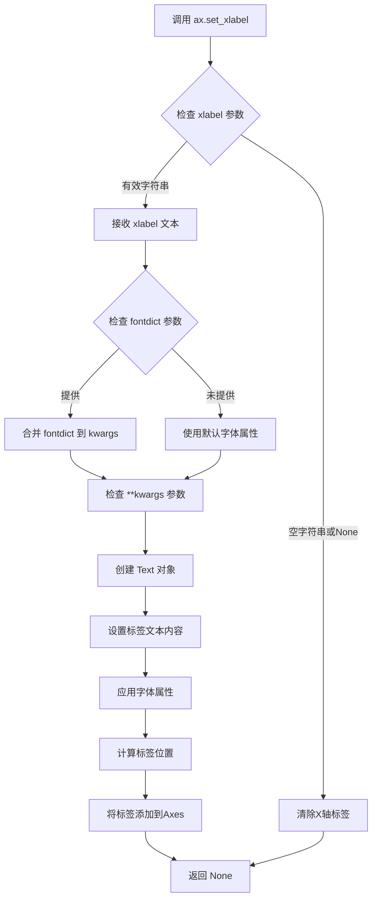

#### 带注释源码

```python
# matplotlib.axes._axes.Axes.set_xlabel 方法源码（简化版）

def set_xlabel(self, xlabel, fontdict=None, labelpad=None, **kwargs):
    """
    设置X轴的标签（xlabel）。
    
    参数:
    -----------
    xlabel : str
        X轴标签的文本内容。
    fontdict : dict, optional
        控制文本外观的字典，例如 {'fontsize': 12, 'fontweight': 'bold'}。
    labelpad : float, optional
        标签与轴之间的间距（磅值）。
    **kwargs : 
        传递给 Text 类的关键字参数，用于自定义文本样式。
        常用参数: fontsize, fontweight, color, rotation, ha, va 等。
    
    返回:
    -----------
    None
        此方法直接修改Axes对象，不返回任何值。
    
    示例:
    -----------
    >>> ax.set_xlabel("Time (s)", fontsize=12, fontweight='bold')
    >>> ax.set_xlabel("X Axis", fontdict={'fontsize': 14, 'color': 'red'})
    """
    
    # 1. 如果提供了 fontdict，将其合并到 kwargs 中
    #    fontdict 的优先级低于直接传递的 kwargs
    if fontdict:
        kwargs.update(fontdict)
    
    # 2. 获取当前的 xlabel 文本对象（如果已存在）
    #    label 属性存储了 X 轴标签的 Text 对象
    label = self.xaxis.get_label()
    
    # 3. 设置标签的文本内容
    #    'set_text' 方法更新标签显示的文本
    label.set_text(xlabel)
    
    # 4. 应用文本属性（字体大小、粗细、颜色等）
    #    update 方法批量设置多个属性
    label.update(kwargs)
    
    # 5. 如果提供了 labelpad，更新标签与轴之间的间距
    if labelpad is not None:
        self.xaxis.labelpad = labelpad
    
    # 6. 返回 None（方法直接修改对象状态，无返回值）
    return None
```

#### 在代码中的实际使用示例

```python
# 第一次使用：设置左图的X轴标签
ax.set_xlabel("dim", fontsize=13)
# 参数说明：
#   - "dim"：标签文本，表示维度
#   - fontsize=13：设置字体大小为13磅

# 第二次使用：设置右图的X轴标签
ax.set_xlabel("dim", fontsize=13)
# 同样设置维度标签，保持两图X轴标签一致
```

#### 关键点说明

| 特性 | 说明 |
|------|------|
| 所属类 | `matplotlib.axes.Axes` |
| 所在模块 | `matplotlib.axes` |
| 返回值类型 | `None` |
| 常见用途 | 为图表X轴添加描述性标签，便于理解数据含义 |
| 常用参数组合 | `ax.set_xlabel("标签名", fontsize=数值, fontweight='bold')` |


### `ax.set_ylabel`

设置Y轴的标签（ylabel），用于在matplotlib图表中为Y轴添加描述性文本。该方法允许用户指定Y轴的名称以及相关的格式属性，如字体大小、字体粗细、对齐方式等。

参数：

- `ylabel`：字符串或 Artist，要显示在Y轴上的文本标签内容
- `fontsize`：整数（可选），设置标签文本的字体大小，代码中传入 `13`
- `fontweight`：字符串或整数（可选），设置字体粗细程度
- `labelpad`：浮点数（可选），设置标签与坐标轴之间的间距
- `rotation`：浮点数或字符串（可选），设置文本的旋转角度
- `horizontalalignment` 或 `ha`：字符串（可选），设置水平对齐方式
- `verticalalignment` 或 `va`：字符串（可选），设置垂直对齐方式
- `**kwargs`：其他关键字参数，接受matplotlib Text对象的通用属性

返回值：`None`，该方法直接修改Axes对象的Y轴标签属性，不返回任何值

#### 流程图

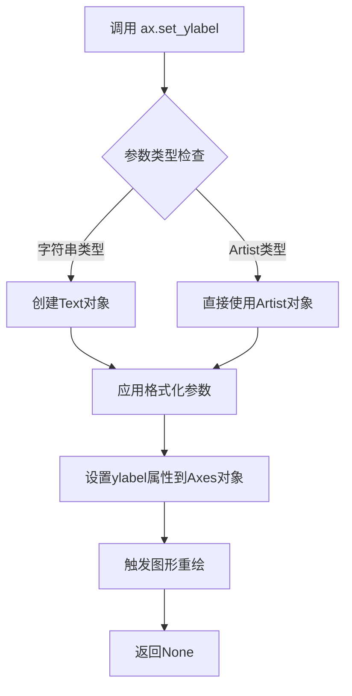

#### 带注释源码

```python
# 在代码中的实际调用示例：

# 第一个子图设置Y轴标签为"time (ms)"
ax.set_ylabel("time (ms)", fontsize=13)

# 第二个子图设置Y轴标签为百分比加速
ax.set_ylabel(r"% speedup", fontsize=13)

# 方法内部实现逻辑（简化版）
def set_ylabel(self, ylabel, fontdict=None, labelpad=None, **kwargs):
    """
    Set the label for the y-axis.
    
    Parameters:
    -----------
    ylabel : str
        The label text.
    fontdict : dict, optional
        A dictionary to control the appearance of the label.
    labelpad : float, optional
        The spacing in points between the label and the y-axis.
    **kwargs
        Text properties. Common ones include:
        - fontsize: size in points
        - fontweight: 'normal', 'bold', etc.
        - rotation: rotation angle in degrees
    """
    # 获取或创建Y轴标签的Text对象
    label = self.yaxis.get_label()
    
    # 设置标签文本
    label.set_text(ylabel)
    
    # 如果提供了fontdict，应用字体属性
    if fontdict is not None:
        label.update(fontdict)
    
    # 应用其他关键字参数（如fontsize）
    label.update(kwargs)
    
    # 如果指定了labelpad，设置标签与轴的间距
    if labelpad is not None:
        self.yaxis.set_label_coords(-0.08, labelpad)
    
    # 返回None，直接修改对象状态
    return None
```


### `ax.set_xscale`

设置 X 轴的刻度类型为对数刻度（logarithmic scale），用于在绘制图表时使 X 轴呈现对数分布而非线性分布，这在处理跨越多个数量级的数据时尤为有用。

参数：

- `value`：`str`，指定刻度类型，可选值包括 'linear'（线性，默认）、'log'（对数）、'symlog'（对称对数）、'logit'（logit 变换）等

返回值：`None`，该方法直接修改 Axes 对象的状态，不返回任何值

#### 流程图

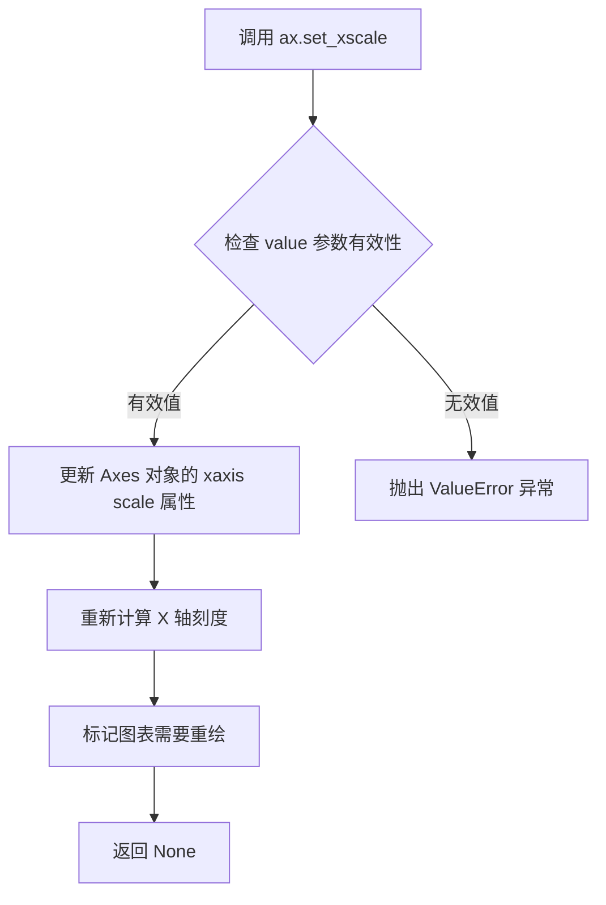

#### 带注释源码

```python
# 调用 set_xscale 设置 X 轴为对数刻度
# 参数 "log" 表示使用对数刻度
# 这将使 X 轴的刻度呈对数分布，适合处理跨度大的数据
ax.set_xscale("log")

# 再次调用 set_xscale 为第二个子图设置对数刻度
ax.set_xscale("log")
```

#### 关键组件信息

| 组件名称 | 一句话描述 |
|---------|-----------|
| `matplotlib.pyplot` | Python 最流行的 2D 绘图库，提供面向对象的图表 API |
| `Axes.set_xscale` | matplotlib Axes 类的成员方法，用于设置坐标轴刻度类型 |
| `GridSpec` | matplotlib 的网格布局管理器，用于创建复杂的多子图布局 |

#### 潜在的技术债务或优化空间

1. **硬编码的刻度类型**：代码中多次调用 `ax.set_yscale` 和 `ax.set_xscale` 却没有在开始时定义配置变量，不利于后期维护和调整
2. **魔法数字**：批处理大小、维度值等以硬编码形式散落在代码各处，应提取为配置文件或常量
3. **重复绘图逻辑**：两个子图的绘图逻辑存在大量重复代码，可抽象为通用函数以提高代码复用性

#### 其它项目

**设计目标与约束**：
- 该脚本用于可视化深度学习模型的性能基准测试数据
- 依赖外部 JSON 数据文件（`speed_benchmark/info_a100_py2.jsonl`）
- 输出格式为 PDF 文件

**错误处理与异常设计**：
- 未对数据文件读取失败的情况进行处理
- 未对 DataFrame 查询结果为空的情况进行保护
- matplotlib 本身会对无效的 scale 参数抛出 `ValueError`

**数据流与状态机**：
- 数据流：JSON 文件 → pandas DataFrame → 数据过滤与聚合 → matplotlib 可视化
- 状态机：读取数据 → 过滤数据 → 绘制图表 → 保存文件

**外部依赖与接口契约**：
- 依赖 `matplotlib`、`pandas`、`gridspec`
- 输入：JSONL 格式的性能数据
- 输出：PDF 格式的可视化图表


### `ax.set_yscale`

设置Y轴的刻度类型（比例尺），用于控制Y轴数据的显示方式，例如线性刻度、对数刻度等。

参数：

-   `scale`：`str`，要设置的Y轴比例类型。常见值包括 `"linear"`（线性）、`"log"`（对数）、`"symlog"`（对称对数）、`"logit"`（逻辑回归）等。

返回值：`None`，该方法直接修改轴的属性，不返回任何值。

#### 流程图

```mermaid
flowchart TD
    A[开始] --> B{检查 logscale_plot1 是否为 True?}
    B -- 是 --> C[调用 ax.set_yscale('log')]
    B -- 否 --> D[保持默认的线性刻度]
    C --> E[结束]
    D --> E
```

#### 带注释源码

```python
# 如果 logscale_plot1 为 True，则将 Y 轴设置为对数刻度
# scale 参数 'log' 表示使用对数比例尺，这对于跨越多个数量级的数据非常有用
if logscale_plot1:
    ax.set_yscale("log")
```


### `ax.set_xticks`

设置 Axes 对象 X 轴的刻度位置。该方法是 Matplotlib 库中 `matplotlib.axes.Axes` 类的成员方法，用于控制 X 轴上刻度线的显示位置，可以设置主刻度或次刻度（minor ticks）。

参数：

- `ticks`：`list` 或 `array-like`，要设置的刻度位置列表。例如 `[1024, 2048, 4096]` 表示在 X 轴的 1024、2048、4096 位置显示刻度。传入空列表 `[]` 可以清除所有刻度。
- `minor`：`bool`，可选参数，默认为 `False`。当设置为 `True` 时，设置的是次刻度（minor ticks）的位置，而不是主刻度（major ticks）。

返回值：`None`，该方法无返回值，直接修改 Axes 对象的 X 轴刻度属性。

#### 流程图

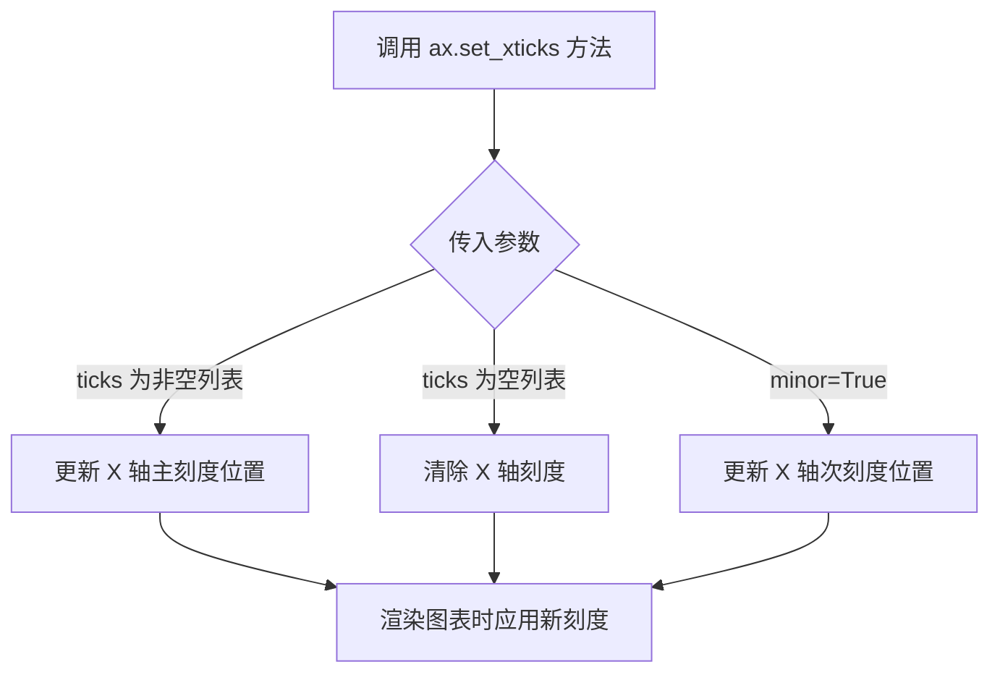

#### 带注释源码

```python
# 在代码中的实际使用示例

# 第一次使用：设置主刻度位置
ax.set_xticks(dims_to_xtick)  # dims_to_xtick = [1024, 2048, 4096]
# 解释：在 X 轴的 1024、2048、4096 位置设置刻度线

# 设置刻度标签（与刻度位置对应）
ax.set_xticklabels(dims_to_xtick)  # 设置刻度上显示的文本标签

# 第二次使用：清除次刻度
ax.set_xticks([], minor=True)
# 解释：将次刻度设置为空列表，即清除所有次刻度线

# 第三次使用（在第二个子图中）
ax.set_xticks(dims_to_xtick)  # 再次设置主刻度位置
ax.set_xticklabels(dims_to_xtick)
ax.set_xticks([], minor=True)  # 清除次刻度
```

#### 额外说明

该方法是 Matplotlib 库的内置方法，不是用户自定义函数。在代码中的作用是：
1. 控制 X 轴刻度的精确位置，实现对数坐标轴上的特定点显示刻度
2. 配合 `set_xticklabels` 使用，确保刻度位置和标签一一对应
3. 通过 `minor=True` 参数可以独立控制次刻度，常用于消除自动生成的次刻度干扰


### `Axes.set_xticklabels`

设置 x 轴刻度标签，用于自定义 x 轴上显示的文本内容。

参数：

- `labels`：`list of str`，要显示的刻度标签列表（如 `['1024', '2048', '4096']`）
- `fontdict`：`dict`，可选，用于控制刻度标签外观的字体字典（如 `{'fontsize': 11}`）
- `minor`：`bool`，可选，是否设置次要（minor）刻度标签，默认为 `False`
- `**kwargs`：可选，其他传递给 `matplotlib.text.Text` 的关键字参数（如 `fontsize`, `rotation`, `color` 等）

返回值：`list of matplotlib.text.Text`，返回设置的刻度标签文本对象列表

#### 流程图

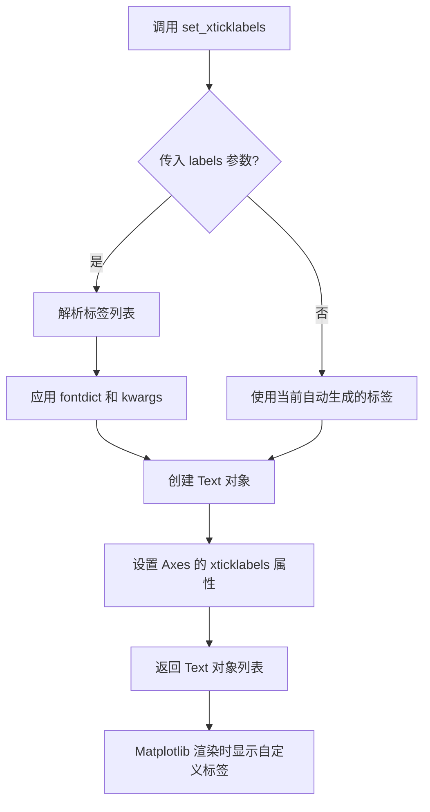

#### 带注释源码

```python
# 在代码中的实际调用示例
ax.set_xticklabels(dims_to_xtick)
ax.set_xticks([], minor=True)

# 方法签名（来自 matplotlib 库）
# def set_xticklabels(self, labels, *, fontdict=None, minor=False, **kwargs):
#     """
#     Set the xaxis' labels with list of string labels.
#     
#     Parameters:
#     -----------
#     labels : list of str
#         The labels to display on the x-axis ticks.
#     fontdict : dict, optional
#         A dictionary controlling the appearance of the labels.
#     minor : bool, default: False
#         If False, get or set the major labels/locations.
#         If True, get or set the minor labels/locations.
#     **kwargs : properties
#         Text properties to control appearance.
#     
#     Returns:
#     --------
#     list of Text
#         The list of text objects.
#     """
#     # ... 内部实现省略

# 调用流程解析：
# 1. labels=dims_to_xtick (值为 [1024, 2048, 4096])
# 2. 方法将这些值转换为字符串标签
# 3. 创建对应的 Text 对象
# 4. 返回 Text 对象列表供后续操作（如 legend、样式修改）使用

# 配合 set_xticks 使用的场景：
ax.set_xticks(dims_to_xtick)      # 设置刻度位置（主要刻度）
ax.set_xticks([], minor=True)     # 清空次要刻度
ax.set_xticklabels(dims_to_xtick) # 设置刻度标签文本
```


### `ax.tick_params`

该函数是 matplotlib 库中 `matplotlib.axes.Axes` 类的实例方法，用于设置刻度线（tick marks）和刻度标签（tick labels）的属性，如大小、颜色、方向等。在代码中用于调整图表 x 轴和 y 轴刻度标签的字体大小，以提升图表的可读性。

#### 参数

- `axis`：`str`，指定要设置参数的轴，可选值为 `'x'`、`'y'` 或 `'both'`。代码中分别使用 `'x'` 和 `'y'` 分别设置 x 轴和 y 轴的刻度参数。
- `labelsize`：`int` 或 `float`，设置刻度标签的字体大小（以磅为单位）。代码中设置为 `11`，使刻度标签字体大小为 11 磅。

#### 返回值

- `None`，该方法直接修改 Axes 对象的刻度参数，不返回任何值。

#### 流程图

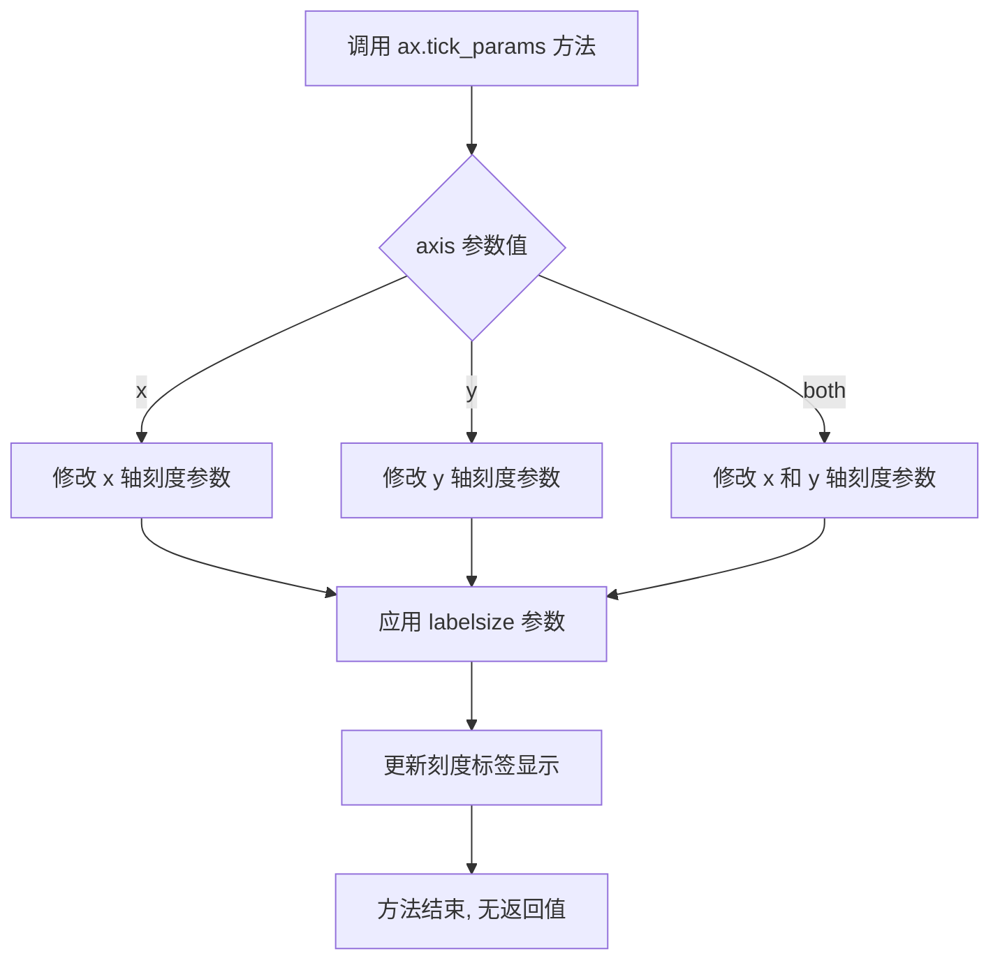

#### 带注释源码

```python
# 调用 tick_params 设置 x 轴刻度标签的字体大小
ax.tick_params(axis="x", labelsize=11)
# 参数说明：
# - axis="x": 指定只修改 x 轴的刻度参数
# - labelsize=11: 设置刻度标签的字体大小为 11 磅

# 调用 tick_params 设置 y 轴刻度标签的字体大小
ax.tick_params(axis="y", labelsize=11)
# 参数说明：
# - axis="y": 指定只修改 y 轴的刻度参数
# - labelsize=11: 设置刻度标签的字体大小为 11 磅
```


### `ax.legend`

该函数是 Matplotlib 中 Axes 对象的图例（Legend）方法，用于将图例添加到坐标轴中，支持自定义图例位置、样式和对齐方式。在代码中主要用于显示不同数据系列的标签，以便区分图表中各个线条的含义。

参数：

- `loc`：`str`，图例在坐标轴中的位置，如 "upper center"、"lower right" 等预定义位置
- `bbox_to_anchor`：`tuple`，用于指定图例框的锚点坐标，格式为 (x, y)，支持将图例放置在坐标轴外部
- `ncol`：`int`，图例的列数，用于多列布局
- `fontsize`：`int`，图例文字的字体大小

返回值：`matplotlib.legend.Legend`，返回创建的 Legend 对象，可用于进一步自定义图例样式

#### 流程图

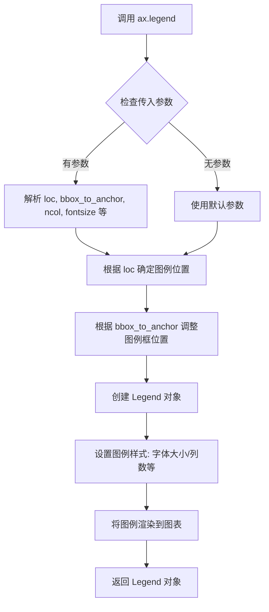

#### 带注释源码

```python
# 在第一个子图中创建图例
leg = ax.legend(
    loc="upper center",          # 图例位置: 上方居中
    bbox_to_anchor=(-0.64, 1.0), # 锚点坐标: 向左偏移并向上延伸
    ncol=1,                      # 图例列数: 1列
    fontsize=10                  # 字体大小: 10磅
)

# 获取图例文本对象并设置字体加粗
leg.get_texts()[0].set_fontweight("bold")  # 第一个图例项加粗
leg.get_texts()[1].set_fontweight("bold")  # 第二个图例项加粗

# ... 后续绘图代码 ...

# 在第二个子图中创建默认图例
ax.legend()  # 使用所有 plot 的 label 参数自动生成图例
```


### `ax.set_title`

设置子图的标题文本和样式。

参数：

- `label`：`str`，标题文本内容
- `fontsize`：`int`，标题字体大小（代码中为 10）
- `loc`：`str`，标题对齐方式，可选 'left', 'center', 'right'（代码中为 "left"）
- `y`：`float`，标题相对于 y 轴位置的偏移量（代码中为 1.05）
- `pad`：`float`，标题与子图顶部的间距（代码中为 -20）

返回值：`Text`，返回 matplotlib 文本对象，表示设置好的标题

#### 流程图

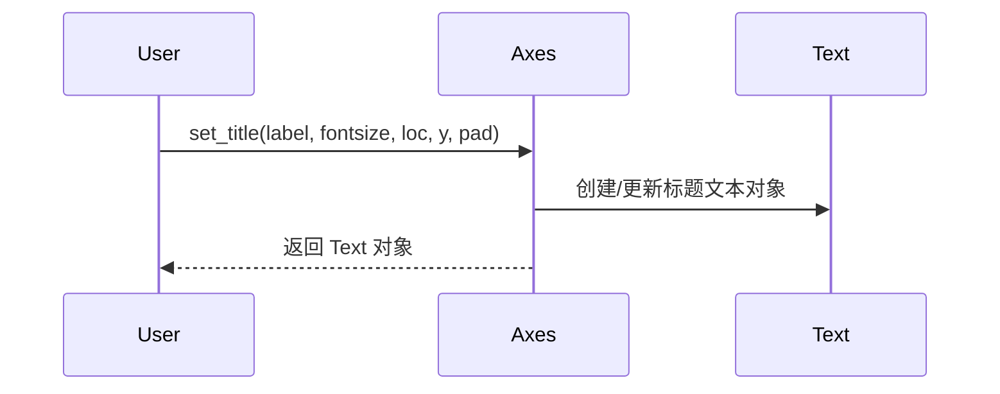

#### 带注释源码

```python
# 代码中第一次调用 set_title
ax.set_title(
    "  Linear layer, batch * sequence length = 32k",  # label: 标题文本
    fontsize=10,        # fontsize: 字体大小为10
    loc="left",         # loc: 左对齐
    y=1.05,             # y: y轴偏移量1.05（向上偏移）
    pad=-20             # pad: 标题与子图顶部间距为-20
)

# 代码中第二次调用 set_title
ax.set_title(
    "  Linear layer summary, varying dimensions",  # label: 标题文本
    fontsize=10,        # fontsize: 字体大小为10
    loc="left",         # loc: 左对齐
    y=1.05,             # y: y轴偏移量1.05（向上偏移）
    pad=-20             # pad: 标题与子图顶部间距为-20
)
```


### `ax.grid`

在matplotlib的Axes对象上调用`ax.grid()`用于在图表上显示网格线，以便更直观地查看数据点与坐标值的对应关系。该方法根据参数设置在图表的背景上绘制网格线，支持针对主刻度、次刻度或两者同时显示网格，同时也支持仅在x轴、y轴或两个轴上显示网格。

参数：

- `b`： `bool` 或 `None`，可选，是否显示网格。默认为`None`（切换当前状态）
- `which`： `str`，可选，绘制网格的刻度类型，可选值为`'major'`、`'minor'`或`'both'`。默认为`'major'`
- `axis`： `str`，可选，设置网格所在的轴，可选值为`'both'`、`'x'`或`'y'`。默认为`'both'`

返回值：`None`，无返回值

#### 流程图

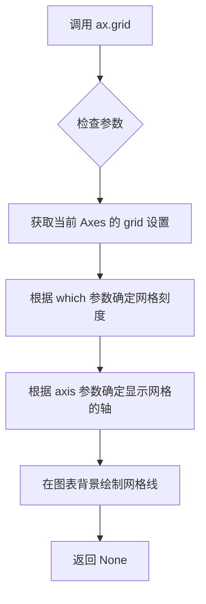

#### 带注释源码

```python
# 在第一个子图上添加网格线（默认参数）
ax.grid()

# 在第二个子图上添加网格线（默认参数）
ax.grid()

# 完整调用形式（matplotlib API）
# ax.grid(b=True, which='major', axis='both')
# 参数说明：
# - b=True: 显示网格线
# - which='major': 只显示主刻度间的网格线
# - axis='both': x轴和y轴都显示网格线

# 等效的详细调用（在代码中的实际使用）
ax.grid(b=None, which='major', axis='both')
```

#### 实际代码上下文

```python
# 第一个子图的网格设置（约第89行）
ax.grid()  # 使用默认参数，在主刻度处显示x和y轴的网格线

# ... 设置标签、刻度、图例等 ...

# 第二个子图的网格设置（约第140行）
ax.grid()  # 使用默认参数，在主刻度处显示x和y轴的网格线
```


### `plt.subplots_adjust`

该函数是 Matplotlib 库中的一个全局函数，用于调整当前 Figure 中子图（subplots）的布局参数，包括子图区域的左右上下边界以及子图之间的间距。在本代码中用于调整第一个子图区域的左边距，以便为图例等元素留出空间。

参数：

- `left`：`float`，子图区域左侧边界相对于图形宽度的比例（0.0 到 1.0 之间），值越小左边距越大
- `bottom`：`float`，子图区域底部边界相对于图形高度的比例（可选，默认 None）
- `right`：`float`，子图区域右侧边界相对于图形宽度的比例（可选，默认 None）
- `top`：`float`，子图区域顶部边界相对于图形高度的比例（可选，默认 None）
- `wspace`：`float`，子图之间水平方向的间距，相对于子图平均宽度的比例（可选，默认 None）
- `hspace`：`float`，子图之间垂直方向的间距，相对于子图平均高度的比例（可选，默认 None）

返回值：`None`，该函数无返回值，直接修改当前 Figure 的布局参数

#### 流程图

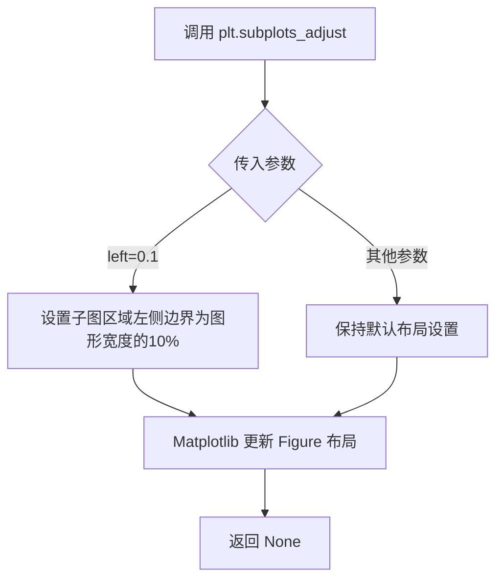

#### 带注释源码

```python
# 调整子图的布局参数
# left=0.1 表示将子图的左边距设置为图形宽度的 10%
# 这样可以为左侧的图例等元素预留足够的空间，避免内容被截断
plt.subplots_adjust(left=0.1)
```


### `plt.savefig`

`plt.savefig` 是 Matplotlib 库中的一个函数，用于将当前图形保存到文件。本代码中调用该函数将绘制的两张性能对比图表保存为 PDF 文件到指定路径，并使用 `bbox_inches="tight"` 参数自动调整边框以确保图表内容不被裁剪。

参数：

- `fname`：`str`，文件保存路径，值为 `"speed_benchmark/plot_with_info.pdf"`，指定输出文件的位置和名称
- `bbox_inches`：`str`，值为 `"tight"`，表示裁剪图表周围的空白区域，使图表内容紧贴边缘
- `dpi`：（可选）`float`，图像分辨率，默认为 Matplotlib 默认值
- `format`：（可选）`str`，文件格式，如 'pdf'、'png'、'jpg' 等，默认根据文件扩展名自动推断
- `pad_inches`：（可选）`float`，当 `bbox_inches="tight"` 时的内边距大小
- `facecolor`：（可选）`str` 或 `tuple`，图像背景色
- `edgecolor`：（可选）`str` 或 `tuple`，图像边框颜色
- `transparent`：（可选）`bool`，是否透明背景

返回值：`None`，该函数无返回值，直接将图形写入文件系统

#### 流程图

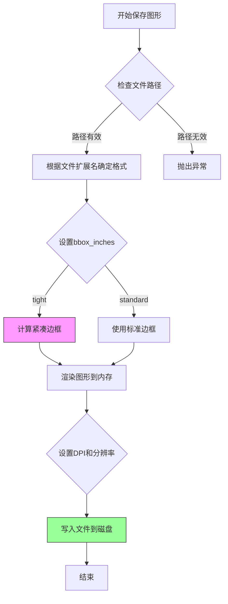

#### 带注释源码

```python
# 调用 plt.savefig 将 figure 对象保存为 PDF 文件
# 参数说明：
#   第一个参数：输出文件路径，保存为 speed_benchmark/plot_with_info.pdf
#   bbox_inches='tight'：自动裁剪周围空白区域，确保标签和图例不被截断
plt.savefig("speed_benchmark/plot_with_info.pdf", bbox_inches="tight")

# 完整函数签名（参考 Matplotlib 官方文档）：
# matplotlib.pyplot.savefig(fname, *, dpi='figure', format=None, 
#                           bbox_inches=None, pad_inches=0.1,
#                           facecolor='auto', edgecolor='auto',
#                           backend=None, **kwargs)
#
# 工作原理：
# 1. 获取当前 figure 对象（由 plt.figure() 创建）
# 2. 根据 fname 确定输出路径和格式
# 3. 如果 bbox_inches='tight'，计算实际内容的边界框并裁剪空白
# 4. 使用指定的 DPI 和格式渲染图形
# 5. 将渲染结果写入指定文件
```

## 关键组件


### 数据读取与过滤模块

该模块负责从JSONL文件中读取性能基准测试数据，并根据batch_size、dim_in和dim_out等维度进行数据过滤和聚合，为后续绘图提供符合条件的数据子集。

### 绘图配置模块

该模块负责配置matplotlib的图表属性，包括坐标轴标签、刻度、网格、图例、标题等视觉元素，以及对数刻度设置和子图布局管理。

### 量化策略标识解析模块

该模块通过解析包含多个量化操作组合的字符串（如"x_quantize_rowwise+g_quantize_rowwise+w_quantize_global+..."），将不同的量化策略映射为可视化图表中的曲线名称和颜色，用于展示标准fp16与SwitchBack int8两种量化方案的Performance对比。

### 性能计算与聚合模块

该模块遍历不同的嵌入维度，对两类模型（前向传播、反向传播）的多个性能指标进行累加求和，计算总执行时间或加速百分比，并生成可供matplotlib绑定的xs和ys数据序列。

### PDF导出模块

该模块负责将生成的图表保存为PDF格式文件，使用tight_layout确保子图布局紧凑，并使用bbox_inches='tight'裁剪多余空白区域。


## 问题及建议


### 已知问题

- **硬编码路径和文件名**：数据文件路径 `"speed_benchmark/info_a100_py2.jsonl"` 和输出路径 `"speed_benchmark/plot_with_info.pdf"` 硬编码在代码中，缺乏灵活性
- **硬编码配置参数**：所有绘图参数（`dims_to_consider`、`batch_size_for_plot1`、`batch_sizes_for_plot2` 等）都直接写在代码中，无法通过命令行或配置文件调整
- **代码重复**：两个子图的数据处理逻辑高度相似（筛选 DataFrame、遍历维度、累加时间），存在明显的代码重复
- **DataFrame 筛选效率低**：在循环中多次对同一 DataFrame 进行重复筛选操作（`df[df.dim_in == ...]` 和 `df_[df_.dim_out == ...]`），且没有预先过滤不存在的行
- **变量名覆盖风险**：第二个图的循环中重新赋值 `df = rdf[rdf.batch_size == batch_size]`，覆盖了第一个图使用的 `df` 变量，容易造成混淆
- **魔法数字和字符串**：颜色映射索引 `j * 0.25`、乘以 `0.5`、乘以 `100` 等数值缺乏解释
- **TODO 注释未完成**：`# TODO: change this to what you want.` 表明部分逻辑可能需要根据实际需求调整
- **无错误处理**：假设 JSONL 文件存在且格式正确，没有任何异常捕获机制
- **样式与数据耦合**：颜色、标记、线型等绘图样式配置与数据处理逻辑混在一起，难以维护

### 优化建议

- **提取配置参数**：将所有配置参数（路径、维度列表、批次大小等）统一放入配置文件（如 JSON/YAML）或使用 `argparse` 解析命令行参数
- **封装数据处理函数**：将 DataFrame 筛选和时间计算逻辑抽取为独立函数，如 `compute_operation_time(df, batch_size, embed_dim, operations)`，减少代码重复
- **使用数据预处理**：在循环外部预先过滤和聚合数据，避免在循环内重复筛选 DataFrame
- **解耦样式与逻辑**：将颜色、标记、线型等样式配置抽离到单独的字典或配置文件中
- **添加错误处理**：为文件读取操作添加 `try-except` 捕获 FileNotFoundError 和 JSON 解析错误
- **消除魔法数字**：为 `0.5`、`100`、`0.25` 等数值定义具名常量并添加注释说明其含义
- **修复变量覆盖**：确保不同子图使用独立的变量名，或使用深拷贝避免状态污染

## 其它


### 设计目标与约束

本代码的设计目标是将性能基准测试数据可视化为两张对比图：(1) 展示标准fp16与SwitchBack int8两种计算方式下不同操作的时间消耗；(2) 展示在不同batch size下SwitchBack相对Standard的加速百分比。约束条件包括：数据源固定为`speed_benchmark/info_a100_py2.jsonl`，输出固定为`speed_benchmark/plot_with_info.pdf`，支持的维度列表为`[1024, 1280, 1408, 1664, 2048, 4096]`，支持的batch size为`[16384, 32768, 65536, 131072]`。

### 错误处理与异常设计

代码缺乏显式的错误处理机制。潜在异常包括：(1) 文件读取异常 - `pd.read_json`若文件不存在或格式错误会抛出`FileNotFoundError`或`ValueError`；(2) 数据筛选异常 - 若筛选条件无匹配结果，`df[k_].values[0]`会抛出`IndexError`；(3) 图表渲染异常 - 若matplotlib后端不可用会抛出相关异常。建议添加try-except块捕获`FileNotFoundError`、`KeyError`、`IndexError`，并为数据空值情况提供fallback处理。

### 数据流与状态机

数据流为：JSONL文件 → Pandas DataFrame → 多重过滤(按batch_size、dim_in、dim_out) → 计算时间累加值 → Matplotlib绑定数据绘制曲线 → PDF输出。状态机可简化为三状态：LOADING(加载数据)、PROCESSING(过滤计算)、RENDERING(绘图保存)。无复杂状态转换逻辑，属于线性流程。

### 外部依赖与接口契约

外部依赖包括：(1) `matplotlib.gridspec` - 子图布局管理；(2) `matplotlib.pyplot` - 绘图API；(3) `pandas` - 数据读取与处理；(4) `plt.get_cmap("cool")` - 颜色映射。接口契约：输入文件`speed_benchmark/info_a100_py2.jsonl`应为JSONL格式，每行包含`batch_size`、`dim_in`、`dim_out`及多个时间测量字段；输出文件为`speed_benchmark/plot_with_info.pdf`。

### 配置与参数说明

关键配置参数包括：`dims_to_consider`定义x轴维度列表；`batch_size_for_plot1`固定为32768用于左图；`batch_sizes_for_plot2`定义右图batch size遍历列表；`dims_to_xtick`定义x轴刻度；`logscale_plot1`控制左图y轴是否使用对数刻度。这些参数以硬编码形式存在，建议抽取为配置文件或命令行参数以提高灵活性。

### 性能特征与基准

代码性能瓶颈主要在数据过滤环节，多次调用`df[df.condition]`导致DataFrame重复扫描。数据量估算：若每种配置组合有多条记录，总数据量约在百行至千行级别，当前实现可满足需求。对于更大数据集，建议预先索引或使用`query()`方法优化。绘图操作本身性能可接受。

### 可维护性与扩展性

代码可维护性问题包括：(1) 重复代码模式 - 左图和右图的数据处理逻辑高度相似，可抽取为函数`compute_time_series`；(2) 硬编码配置 - 颜色、标签、样式信息分散在长元组中；(3) 魔数缺乏解释 - 如`0.5`系数、颜色代码`C2/C4`缺乏说明。扩展性方面：添加新操作类型需修改多个元组；添加新batch size只需修改列表；添加新维度需修改`dims_to_consider`和`dims_to_xtick`。

### 测试与验证策略

当前代码无单元测试。验证要点包括：(1) 输入文件存在性检查；(2) 数据完整性验证 - 确认所需列名存在；(3) 数值合理性检查 - 时间值应为正数，加速百分比应在合理范围内；(4) 图像输出验证 - 检查PDF文件是否成功生成且非空。建议添加pytest测试用例覆盖核心计算逻辑。

### 部署与运行环境

运行环境要求：(1) Python 3.x；(2) 已安装`matplotlib`、`pandas`依赖；(3) 支持的操作系统包括Linux、macOS、Windows；(4) 需要图形后端支持（非交互式环境需设置`matplotlib.use('Agg')`）。部署方式为独立脚本，可通过cron定时任务或CI/CD pipeline触发执行。

### 版本与变更记录

初始版本v1.0：实现基本绘图功能，包含左图(时间消耗对比)和右图(加速百分比)。TODO待办项：代码中包含TODO注释提示`# TODO: change this to what you want`，表明部分配置可能需要根据实际需求调整。后续可考虑添加命令行参数支持、配置文件外置、测试覆盖等改进。


    