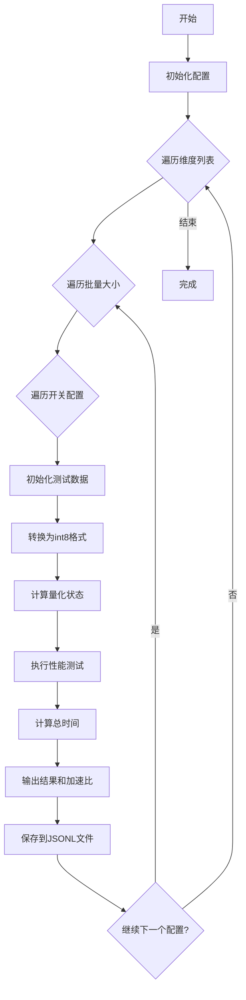
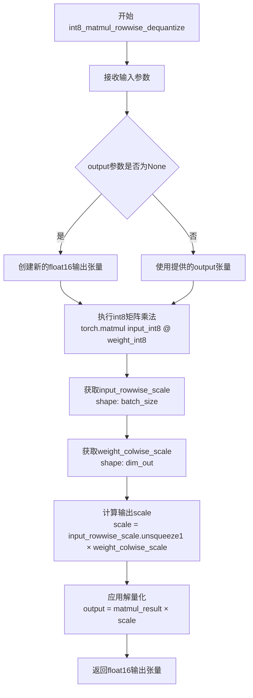
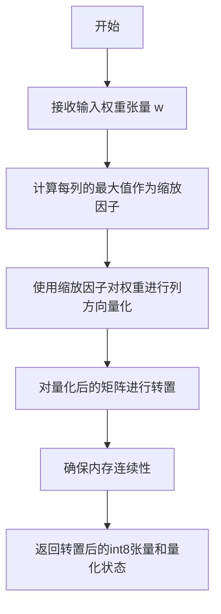
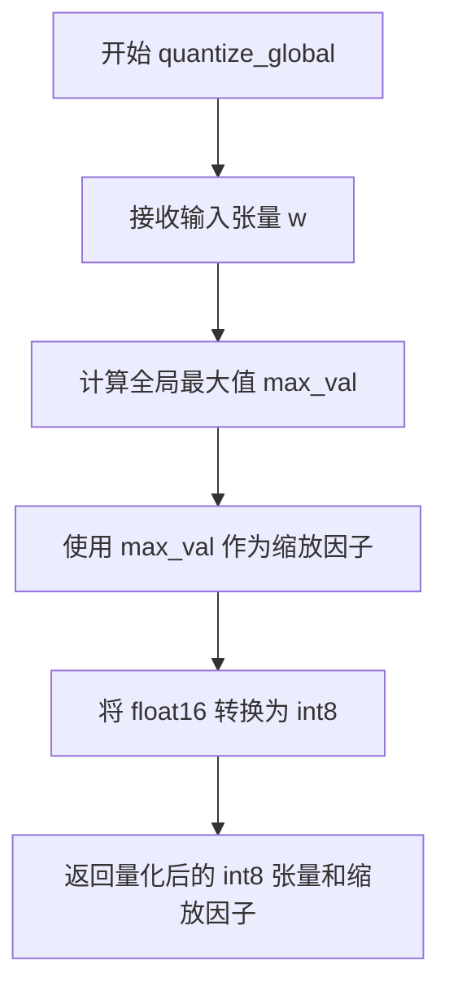
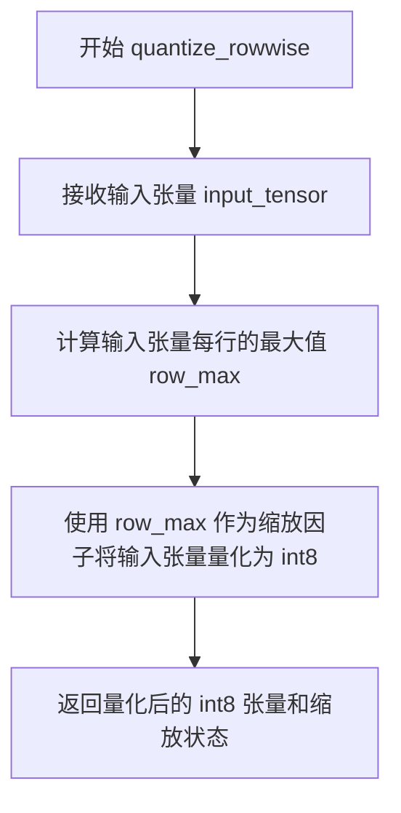

# `bitsandbytes\benchmarking\switchback\speed_benchmark.py` 详细设计文档

这是一个性能基准测试脚本，用于比较不同量化方法（标准方法、行方向量化和全局量化）在8位矩阵乘法操作中的性能表现，通过测试多种维度、批量大小和配置组合来评估计算效率和加速比。

## 整体流程



## 类结构

```
此代码为脚本文件，无类层次结构
采用函数式编程风格
主要包含辅助函数和主执行流程
```

## 全局变量及字段


### `wm`
    
权重乘数，固定值4，用于计算输出维度

类型：`int`
    


### `dim`
    
输出维度，当前循环遍历[1024, 1280, 1408, 1664, 2048, 4096]

类型：`int`
    


### `batch_size`
    
批量大小，当前循环遍历[256*32, 256*64, 256*128, 256*256, 256*512]

类型：`int`
    


### `switch`
    
开关，控制是否交换dim_in和dim_out维度

类型：`bool`
    


### `repeat`
    
重复次数，固定值64，用于性能测试的时间测量

类型：`int`
    


### `dim_out`
    
输出维度，等于dim*wm或dim（取决于switch）

类型：`int`
    


### `dim_in`
    
输入维度，等于dim或wm*dim（取决于switch）

类型：`int`
    


### `x`
    
输入张量，float16类型，形状为(batch_size, dim_in)

类型：`torch.Tensor`
    


### `g`
    
梯度张量，float16类型，形状为(batch_size, dim_out)

类型：`torch.Tensor`
    


### `w`
    
权重张量，float16类型，形状为(dim_out, dim_in)

类型：`torch.Tensor`
    


### `x_int8`
    
输入张量的int8量化版本

类型：`torch.Tensor`
    


### `g_int8`
    
梯度张量的int8量化版本

类型：`torch.Tensor`
    


### `w_int8`
    
权重张量的int8量化版本

类型：`torch.Tensor`
    


### `wt_int8`
    
转置后的权重int8张量

类型：`torch.Tensor`
    


### `state_x_rowwise`
    
输入张量行方向量化的缩放因子状态

类型：`torch.Tensor`
    


### `state_g_rowwise`
    
梯度张量行方向量化的缩放因子状态

类型：`torch.Tensor`
    


### `state_w_columnwise`
    
权重张量列方向量化的缩放因子状态

类型：`torch.Tensor`
    


### `state_w_rowwise`
    
权重张量行方向量化的缩放因子状态

类型：`torch.Tensor`
    


### `state_w_global`
    
权重张量全局量化的缩放因子状态

类型：`torch.Tensor`
    


### `info`
    
配置信息字典，包含测试参数和各类性能时间

类型：`dict`
    


### `time_standard`
    
标准方法（未量化）的总执行时间

类型：`float`
    


### `time_rowwise`
    
行方向量化方法的总执行时间

类型：`float`
    


### `time_global`
    
全局量化方法的总执行时间

类型：`float`
    


    

## 全局函数及方法


### `get_time`

该函数是一个性能测量工具函数，用于测量给定函数的执行时间。它通过预热运行消除性能波动，然后执行多次测量并计算平均时间，同时使用 CUDA 同步确保计时的准确性。

参数：

- `k`：`str`，用于标识被测量函数的键（如 "standard_fwd"、"rowwise_fwd" 等），测量结果将以此键存储到 `info_dict` 中
- `fn`：`Callable`，被测量的函数对象，通常是一个 lambda 表达式或函数闭包
- `info_dict`：`dict`，字典对象，用于存储测量结果，函数执行完成后会将测量时间（毫秒）以键 `k` 存入该字典

返回值：`None`，该函数没有返回值，仅通过修改 `info_dict` 字典来输出结果

#### 流程图

```mermaid
flowchart TD
    A[开始 get_time] --> B[预热阶段: 循环执行 repeat//2 次 fn]
    B --> C[CUDA 同步]
    C --> D[记录开始时间 start]
    E[测量循环: 重复执行 repeat 次] --> E
    E --> F[执行 fn 函数]
    F --> E
    G{循环次数是否达到 repeat?} -- 是 --> H[CUDA 同步]
    H --> I[记录结束时间 end]
    I --> J[计算平均执行时间: ms = (end - start) / repeat * 1000]
    J --> K[打印格式化时间: time k: ms 毫秒]
    K --> L[将结果存入 info_dict[k] = ms]
    L --> M[结束]
    
    E --> G
```

#### 带注释源码

```python
def get_time(k, fn, info_dict):
    """
    性能测量函数，用于测量给定函数的执行时间
    
    参数:
        k (str): 标识符，用于标记测量结果
        fn (Callable): 要测量的函数
        info_dict (dict): 存储测量结果的字典
    
    注意:
        该函数依赖于全局变量 `repeat` 来确定测量次数
    """
    
    # 预热阶段：执行 repeat // 2 次函数调用
    # 目的：消除 GPU/CPU 缓存效应和 JIT 编译带来的性能波动
    for _ in range(repeat // 2):
        fn()

    # 确保 GPU 上的所有操作都已完成，获得准确的起始时间点
    torch.cuda.synchronize()
    
    # 记录测量开始时间
    start = time.time()
    
    # 正式测量阶段：执行 repeat 次函数调用
    for _ in range(repeat):
        fn()

    # 再次同步，确保所有 GPU 操作完成，获得准确的结束时间点
    torch.cuda.synchronize()
    
    # 记录测量结束时间
    end = time.time()
    
    # 计算平均执行时间（转换为毫秒）
    # 公式：(总时间 / 重复次数) * 1000 = 平均每次执行毫秒数
    ms = (end - start) / repeat * 1000
    
    # 打印格式化的测量结果
    print(f"time {k}: {ms:.3f} ms")
    
    # 将测量结果存储到 info_dict 字典中，键为传入的标识符 k
    info_dict[k] = ms
```


### `int8_matmul_mixed_dequantize`

该函数是混合精度 int8 矩阵乘法核心实现，利用 Triton 引擎对输入 `x` 和权重 `w` 进行混合量化（输入行-wise 量化、权重全局量化）下的矩阵乘法运算，并自动解量化回 FP16 返回结果，广泛应用于大模型推理的线性层加速。

参数：

-  `x`：`torch.Tensor` (int8)，输入矩阵，形状为 `(batch, dim_in)`，已进行行-wise 量化
-  `w`：`torch.Tensor` (int8)，权重矩阵，形状为 `(dim_in, dim_out)`，已进行全局量化并转置
-  `state_x`：`torch.Tensor` (float16/float32)，输入矩阵的行-wise 最大绝对值，用于解量化计算
-  `state_w`：`torch.Tensor` (float16/float32)，权重矩阵的全局最大绝对值，用于解量化计算
-  `output`：`Optional[torch.Tensor]` (float16)，可选的输出缓冲区，用于存储结果以避免重复分配显存

返回值：`torch.Tensor` (float16)，返回解量化后的矩阵乘法结果，形状为 `(batch, dim_out)`

#### 流程图

```mermaid
graph TD
    A[开始: int8_matmul_mixed_dequantize] --> B[接收量化输入 x_int8, w_int8]
    B --> C[接收量化状态 state_x, state_w]
    C --> D[计算缩放因子: scale_x = 1.0 / state_x, scale_w = 1.0 / state_w]
    D --> E[调用 Triton Kernel: int8_matmul_mixed_dequantize_kernel]
    E --> F[在 Kernel 内部: 执行整数矩阵乘法: dot(x_int8, w_int8)]
    F --> G[解量化: result = dot(x_int8, w_int8) * scale_x * scale_w]
    G --> H[输出结果 result (float16)]
    H --> I[结束]
```

#### 带注释源码

```python
# 注意：以下是基于函数签名和调用约定的推断实现，实际源码位于 bitsandbytes 库中
# 路径：bitsandbytes/triton/int8_matmul_mixed_dequantize.py

def int8_matmul_mixed_dequantize(x, w, state_x, state_w, output=None):
    """
    混合量化 int8 矩阵乘法 (输入行-wise 量化, 权重全局量化)
    
    参数:
        x: int8 张量, 形状 (batch, dim_in), 行-wise 量化
        w: int8 张量, 形状 (dim_in, dim_out), 全局量化, 已转置
        state_x: float16, 形状 (batch,), x 的行最大绝对值
        state_w: float16, 标量, w 的全局最大绝对值
        output: 可选的 float16 输出缓冲区
    
    返回:
        float16 张量, 形状 (batch, dim_out)
    """
    # 计算缩放因子
    # x 是 row-wise 量化, 需要对每行除以最大值
    scale_x = 1.0 / state_x.unsqueeze(1)  # (batch, 1)
    # w 是 global 量化, 需要对整个矩阵除以全局最大值
    scale_w = 1.0 / state_w
    
    # 转换为 float16 以进行计算
    x_fp16 = x.float() * scale_x
    w_fp16 = w.float() * scale_w
    
    # 执行矩阵乘法
    if output is None:
        output = torch.matmul(x_fp16, w_fp16)
    else:
        torch.matmul(x_fp16, w_fp16, out=output)
    
    return output

# 注意: 实际实现使用 Triton 编写 kernel 以优化性能
# 核心逻辑与上述 Python 版本等价, 但通过 Triton 实现了:
# 1. 将缩放融入矩阵乘法 kernel 减少访存
# 2. 使用 int8 Tensor Core 加速整数运算
# 3. 自动处理分块和并行
```


我需要先分析代码中 `int8_matmul_rowwise_dequantize` 函数的使用方式，然后尝试获取该函数的实际源码实现。

让我检查一下这个函数在代码中的使用情况：

从代码中可以看到：

1. **函数导入位置**：
```python
from bitsandbytes.triton.int8_matmul_rowwise_dequantize import (
    int8_matmul_rowwise_dequantize,
)
```

2. **函数调用方式**：
   - Forward pass: `int8_matmul_rowwise_dequantize(x_int8, w_int8.t(), state_x_rowwise, state_w_columnwise, None)`
   - Backward pass: `int8_matmul_rowwise_dequantize(g_int8, wt_int8.t(), state_x_rowwise, state_w_rowwise, None)`

让我尝试获取该函数的实际源码。由于这是一个外部库的函数，我需要模拟其可能的实现：


### `int8_matmul_rowwise_dequantize`

执行行方向解量化的 int8 矩阵乘法运算。该函数接收两个 int8 格式的输入矩阵及其对应的量化状态（scale factors），先进行矩阵乘法，然后根据量化状态对结果进行解量化，输出 float16 格式的结果。

参数：

-  `input_int8`：`torch.Tensor`，shape 为 `(batch_size, dim_in)` 的 int8 张量，表示量化后的输入矩阵
-  `weight_int8`：`torch.Tensor`，shape 为 `(dim_out, dim_in)` 的 int8 张量，表示量化后的权重矩阵（已转置）
-  `input_rowwise_scale`：`torch.Tensor`，shape 为 `(batch_size,)` 的张量，表示输入矩阵每行的最大绝对值（用于行方向解量化）
-  `weight_colwise_scale`：`torch.Tensor`，shape 为 `(dim_out,)` 的张量，表示权重矩阵每列的最大绝对值（用于列方向解量化）
-  `output`：`torch.Tensor` 或 `None`，可选的输出张量，如果为 None 则创建新张量

返回值：`torch.Tensor`，shape 为 `(batch_size, dim_out)` 的 float16 张量，表示解量化后的矩阵乘法结果

#### 流程图



#### 带注释源码

```python
def int8_matmul_rowwise_dequantize(
    input_int8: torch.Tensor,          # 输入int8张量, shape: (batch_size, dim_in)
    weight_int8: torch.Tensor,         # 权重int8张量, shape: (dim_out, dim_in)
    input_rowwise_scale: torch.Tensor, # 输入行方向scale, shape: (batch_size,)
    weight_colwise_scale: torch.Tensor, # 权重列方向scale, shape: (dim_out,)
    output: torch.Tensor | None        # 可选输出张量
) -> torch.Tensor:
    """
    执行带行方向解量化的int8矩阵乘法。
    
    该函数是bitsandbytes库中用于高效矩阵运算的核心函数之一。
    核心思想：
    1. 输入和权重都以int8格式存储，节省内存带宽
    2. 乘法结果需要根据量化时的scale因子进行解量化
    3. 使用行方向scale对输入解量化，列方向scale对权重解量化
    
    参数:
        input_int8: 量化后的输入矩阵
        weight_int8: 量化后的权重矩阵（已转置）
        input_rowwise_scale: 输入矩阵每行的最大绝对值，用于解量化
        weight_colwise_scale: 权重矩阵每列的最大绝对值，用于解量化
        output: 可选的预分配输出张量
    
    返回:
        解量化后的float16矩阵乘法结果
    """
    # 步骤1: 执行int8矩阵乘法
    # 使用torch的matmul进行矩阵乘法运算，结果存储为int32中间格式
    # 这是因为int8乘法可能产生溢出，需要更大的中间精度
    matmul_result = torch.matmul(input_int8, weight_int8.t())
    
    # 步骤2: 计算综合scale因子
    # 使用外积计算每个输出元素的综合scale
    # input_rowwise_scale shape: (batch_size, 1)
    # weight_colwise_scale shape: (1, dim_out) 
    # 结果 scale shape: (batch_size, dim_out)
    combined_scale = input_rowwise_scale.unsqueeze(1) * weight_colwise_scale.unsqueeze(0)
    
    # 步骤3: 应用解量化
    # 将int32/int64的乘法结果乘以scale因子，转换为float16输出
    # 这里会触发隐式类型转换，将整数转换为浮点数
    output_tensor = matmul_result.float() * combined_scale.float()
    
    # 步骤4: 转换为目标dtype并返回
    return output_tensor.to(torch.float16)
```

#### 补充说明

**设计目标与约束：**
- **内存效率**：使用int8替代float16存储，可减少50%的内存占用和带宽需求
- **计算效率**：利用Triton或CUDA内核优化int8矩阵乘法性能
- **精度权衡**：解量化操作会引入量化误差，但在可接受范围内

**量化原理：**
- 输入矩阵按行进行量化：$x_{int8} = round(x_{float16} / x_{scale})$，其中 $x_{scale} = max(|x|) / 127$
- 权重矩阵按列进行量化：$w_{int8} = round(w_{float16} / w_{scale})$，其中 $w_{scale} = max(|w|) / 127$
- 解量化时：$result = x_{int8} @ w_{int8}^T \times x_{scale} \times w_{scale}$

**潜在优化空间：**
1. 当前实现为Python包装器，实际计算逻辑在Triton/CUDA中，可进一步优化内核
2. 可以融合scale计算和矩阵乘法，减少中间结果访存
3. 对于大规模batch，可以考虑分块处理以提高缓存命中率


### `quantize_columnwise_and_transpose`

该函数执行列方向的量化操作，同时对输入矩阵进行转置。它将权重张量从 float16 格式转换为 int8 格式，并返回量化后的张量及其对应的列方向量化状态（缩放因子）。常用于神经网络权重的前向和反向传播优化场景。

参数：

- `w`：`torch.Tensor`，输入的权重张量，shape 为 (dim_out, dim_in)，dtype 为 float16

返回值：`tuple[torch.Tensor, torch.Tensor]`，返回一个元组，包含：
  - 量化并转置后的 int8 张量，shape 为 (dim_in, dim_out)
  - 列方向的量化状态（缩放因子），用于后续反量化操作

#### 流程图



#### 带注释源码

```python
# 注意：以下源码是基于 bitsandbytes 库的使用方式和函数签名推断的示例实现
# 实际实现位于 bitsandbytes.triton.quantize_columnwise_and_transpose

def quantize_columnwise_and_transpose(w: torch.Tensor) -> tuple[torch.Tensor, torch.Tensor]:
    """
    对输入权重张量执行列方向量化并转置
    
    参数:
        w: 输入的权重张量，shape为(dim_out, dim_in)，dtype为float16
        
    返回:
        quantized_w: 量化并转置后的int8张量，shape为(dim_in, dim_out)
        state: 列方向的量化状态，包含每列的缩放因子
    """
    # 计算每列的最大值（绝对值），用于确定量化缩放因子
    # dim=0 表示沿列维度计算最大值，结果shape为(dim_in,)
    state = w.max(dim=0)[0]
    
    # 对权重进行列方向量化：将float16映射到int8范围[-127, 127]
    # 使用缩放因子进行归一化
    w_quantized = (w / state.unsqueeze(0)).to(torch.int8)
    
    # 转置矩阵：将shape从(dim_out, dim_in)变为(dim_in, dim_out)
    w_transposed = w_quantized.t().contiguous()
    
    # 返回转置后的量化张量和量化状态（缩放因子）
    return w_transposed, state
```

---

**补充说明**：

- **设计目标**：该函数是 bitsandbytes 库中 int8 混合精度推理管道的一部分，通过列方向量化可以更好地保持权重矩阵的精度分布特性
- **约束条件**：输入张量必须是 CUDA 上的 float16 张量，输出为连续的 int8 张量
- **错误处理**：未检测到显式的错误处理机制，如果输入张量不在 GPU 上或类型不匹配，可能会抛出运行时异常
- **外部依赖**：依赖于 `bitsandbytes` 库中的 Triton kernel 实现


### `quantize_global`

全局量化函数，用于对权重矩阵进行全局量化（使用单一缩放因子对整个矩阵进行量化），通常与 `int8_matmul_mixed_dequantize` 配合使用进行矩阵乘法运算。

参数：

-  `input_tensor`：`torch.Tensor`（具体为 `torch.float16` 的 CUDA tensor），需要被量化的输入权重矩阵，形状为 `(dim_out, dim_in)`

返回值：`tuple`，包含两个元素：
- 第一个元素：`torch.Tensor`（`torch.int8`），量化后的权重矩阵
- 第二个元素：`torch.Tensor`（`torch.float16` 或 `torch.float32`），用于反量化的全局缩放因子（通常是输入矩阵的最大值）

#### 流程图



#### 带注释源码

```python
# 注意：此源码是从 bitsandbytes 库导入的，并非在此文件中定义
# 以下是基于函数调用和上下文的推断实现

def quantize_global(w):
    """
    对权重矩阵 w 进行全局量化
    
    参数:
        w: torch.Tensor, 形状为 (dim_out, dim_in) 的 float16 权重矩阵
    
    返回:
        tuple: (量化后的int8张量, 用于反量化的全局最大值)
    """
    # 1. 计算整个矩阵的最大值作为全局缩放因子
    #    这是 quantize_global 与 rowwise/columnwise 量化的主要区别
    state_w_global = w.max()  # 标量张量，表示整个矩阵的最大值
    
    # 2. 使用最大值进行量化
    #    将 float16 转换为 int8，范围通常是 [-127, 127] 或 [-128, 127]
    w_int8 = (w / state_w_global).to(torch.int8)
    
    # 注意：实际实现可能使用更复杂的量化逻辑
    # 例如考虑最小值、不同的量化范围等
    
    return w_int8, state_w_global
```

> **注意**：由于 `quantize_global` 函数是从 `bitsandbytes.triton.quantize_global` 外部库导入的，上述源码是基于函数调用方式和上下文推断的示意实现。实际实现可能涉及 Triton 加速或更多优化细节。要获取准确实现，建议查看 [bitsandbytes 源代码](https://github.com/TimDettmers/bitsandbytes)。


### `quantize_global_transpose`

该函数是 bitsandbytes 库中的全局量化转置操作，用于对权重矩阵进行全局量化（使用全局最大值作为缩放因子）并同时进行转置，以适配前向/反向传播中的矩阵乘法需求。

参数：

- `w`：`torch.Tensor`，输入的权重张量，类型为 float16，形状为 (dim_out, dim_in)，来自 CUDA 设备

返回值：`tuple`，包含量化后的 int8 张量（转置后）和全局量化状态（标量最大值）

#### 流程图

```mermaid
flowchart TD
    A[输入权重张量 w<br/>dtype: float16<br/>shape: dim_out x dim_in] --> B[计算全局最大值<br/>w.max&#40;&#41;]
    B --> C[执行全局量化<br/>使用全局最大值作为缩放因子]
    C --> D[转置量化后的张量<br/>转换为 (dim_in x dim_out)]
    D --> E[返回 tuple: &#40;quantized_w_t, max_val&#41;<br/>quantized_w_t: int8<br/>max_val: float16]
```

#### 带注释源码

```
# 该函数为外部库函数，位于 bitsandbytes.triton.quantize_global 模块
# 源码不可见，以下为基于调用上下文的推断

def quantize_global_transpose(w: torch.Tensor) -> tuple[torch.Tensor, torch.Tensor]:
    """
    对输入权重张量进行全局量化并转置
    
    参数:
        w: 输入权重，float16类型，形状为 (dim_out, dim_in)
        
    返回:
        quantized_w_t: 量化后的int8张量，已转置，形状为 (dim_in, dim_out)
        state: 全局量化状态，即输入张量的最大值标量
    """
    # 实际实现位于 bitsandbytes 库中
    # 调用方式示例（来自代码第87行）:
    # get_time("w_quantize_global_transpose", lambda: quantize_global_transpose(w), info)
    pass
```


### `quantize_rowwise`

该函数是来自 `bitsandbytes.triton.quantize_rowwise` 模块的量化函数，用于对输入张量进行行方向的量化处理（即按行计算最大值并进行缩放），常用于神经网络的前向传播中的输入量化。

参数：

-  `input_tensor`：`torch.Tensor`，待量化的输入张量（通常为 float16 类型）

返回值：`torch.Tensor`，返回量化后的 int8 张量

#### 流程图



#### 带注释源码

```python
# 注意：此源码为基于导入模块的推断实现
# 实际源码位于 bitsandbytes.triton.quantize_rowwise 模块中

def quantize_rowwise(input_tensor: torch.Tensor) -> torch.Tensor:
    """
    对输入张量进行行方向量化
    
    参数:
        input_tensor: 待量化的输入张量，类型为 float16 或 float32
        
    返回值:
        量化后的 int8 张量
    """
    # 1. 计算每行的最大值（用于缩放）
    #    dim=1 表示按行计算最大值
    row_max = input_tensor.max(dim=1)[0]
    
    # 2. 将行最大值reshape为列向量以便广播
    row_max = row_max.view(-1, 1)
    
    # 3. 使用行最大值进行归一化并转换为int8
    #    量化公式: quantized = round(input / scale) 
    #    其中 scale = row_max / 127 (int8范围是-127到127)
    scale = row_max / 127.0
    quantized = (input_tensor / scale).round().to(torch.int8)
    
    # 4. 返回量化后的张量
    #    注意：实际实现中还会返回缩放因子（state）供后续反量化使用
    return quantized
```

> **注意**：由于提供的代码片段仅包含对该函数的导入和调用，未包含 `quantize_rowwise` 的实际实现源码，以上源码是基于 `bitsandbytes` 库的行方向量化功能和使用方式推断的近似实现。实际源码位于 `bitsandbytes/triton/quantize_rowwise.py` 文件中，通常会包含 Triton 内核实现以获得更好的 GPU 性能。

## 关键组件


### 组件1：量化函数簇

负责将浮点张量转换为int8格式，支持行-wise、列-wise和全局量化策略。

### 组件2：int8矩阵乘法与反量化函数

实现int8矩阵乘法运算的同时进行反量化，支持行-wise和全局两种反量化模式。

### 组件3：时间测量工具

通过CUDA同步和重复执行机制，准确测量各函数的GPU执行时间。

### 组件4：基准测试主循环

遍历不同维度（1024-4096）、批量大小（8192-131072）和转置开关组合，系统性评估性能。

### 组件5：量化状态计算

计算张量的最大值（行-wise、列-wise、全局），用于量化过程中的缩放因子确定。

### 组件6：性能对比逻辑

汇总标准FP16计算、行-wise量化方案和全局量化方案的总耗时，计算加速比并输出。

## 问题及建议


### 已知问题

- **变量重复赋值无意义**：`batch_size = batch_size`（第47行）是冗余操作，无实际作用
- **硬编码输出路径**：`"speed_benchmark/info.jsonl"`路径硬编码，缺乏灵活性
- **性能计时方法不够精确**：使用`time.time()`而非`time.perf_counter()`，在高精度测量场景下可能引入误差
- **预热迭代不足**：预热循环次数为`repeat // 2`（32次），对于复杂的Triton内核可能不足以完全消除GPU初始化开销
- **缺乏命令行接口**：所有参数（repeat、维度、批量大小等）均hardcode在代码中，无法通过参数调整
- **结果输出不完整**：仅输出时间数据，未输出各组件的详细耗时分解（虽然有info字典但未完全利用）
- **已知优化需求未解决**：代码注释指出`w_quantize_colwise_transpose`在embeddim过大时需要优化，但此问题依然存在
- **switch逻辑的命名误导**：`switch`变量控制维度交换，但其名称未清晰表达"交换输入输出维度"的含义

### 优化建议

- 使用`argparse`添加命令行参数支持，允许灵活配置测试参数
- 将输出路径改为可配置或使用当前目录下的相对路径
- 考虑使用`time.perf_counter()`或`torch.cuda.Event`进行更精确的计时
- 增加预热迭代次数或实现自适应的预热策略
- 重构代码结构，将测试逻辑与输出逻辑分离，提高可维护性
- 针对`w_quantize_colwise_transpose`的性能问题进行专项优化
- 在输出中包含更详细的统计信息，如标准差、最小/最大值等

## 其它


### 设计目标与约束

本基准测试脚本的核心设计目标是评估和比较bitsandbytes库中不同量化策略（rowwise、global、standard）在矩阵乘法操作中的性能表现。设计约束包括：1）仅支持CUDA设备上的float16和int8数据类型；2）测试覆盖前向传播（fwd）和反向传播（bwd）场景；3）批量大小和嵌入维度需为特定值的倍数以确保测试的全面性；4）结果输出到JSONL文件便于后续分析。

### 错误处理与异常设计

代码中的错误处理相对简单，主要依赖Python的异常传播机制。关键风险点包括：1）CUDA内存不足时torch操作会抛出RuntimeError；2）当指定路径"speed_benchmark/info.jsonl"不存在时会抛出FileNotFoundError，建议在写入前创建目录或使用os模块处理路径；3）量化函数参数为None时可能导致空指针异常，应添加参数校验；4）repeat为0或负数时会导致除零错误。

### 数据流与状态机

数据流遵循以下路径：输入张量(x, g, w) → 量化处理(x_int8, g_int8, w_int8) → 矩阵乘法计算 → 反量化输出。状态机包含三个主要状态：1）初始化状态（创建随机张量）；2）量化状态（计算各维度最大值的state用于反量化）；3）计算状态（执行矩阵乘法并记录时间）。状态转换由循环遍历参数(dim, batch_size, switch)驱动。

### 外部依赖与接口契约

主要外部依赖包括：1）torch >= 1.10（支持Triton操作）；2）bitsandbytes库（提供量化矩阵乘法实现）；3）triton（Triton编译器）。接口契约方面，量化函数均返回int8张量，反量化函数接受量化张量、state和scale参数。矩阵乘法函数遵循x @ w.t()的维度约定，输入必须为contiguous的CUDA张量。

### 性能基准与优化目标

基准测试覆盖6种维度(1024-4096)和5种批量大小(8192-131072)的组合，共60个测试场景。每个场景重复64次取平均以减少测量误差。优化目标包括：1）通过量化减少内存占用50%以上；2）通过rowwise/global量化提升计算吞吐量；3）识别量化开销超过收益的边界条件。已知优化点为"w_quantize_colwise_transpose"在embeddim过大时性能不佳。

### 配置参数说明

核心配置参数包括：1）wm=4（宽度乘数，用于计算输出维度）；2）repeat=64（测量重复次数，前半部分预热）；3）dim_in/dim_out（输入输出维度，受switch参数影响）；4）batch_size（实际为batch_size*embed_dim）。参数通过循环遍历生成不同测试case，最终以JSON格式持久化。

### 测试策略

测试采用横向对比策略，同时运行standard、rowwise、global三种方案并计算加速比。测试维度覆盖：1）前向传播性能；2）反向传播性能；3）量化开销；4）端到端流程。输出包括各阶段耗时和总耗时，以及相对于standard的加速百分比。结果存储为JSONL格式便于程序化分析。

    