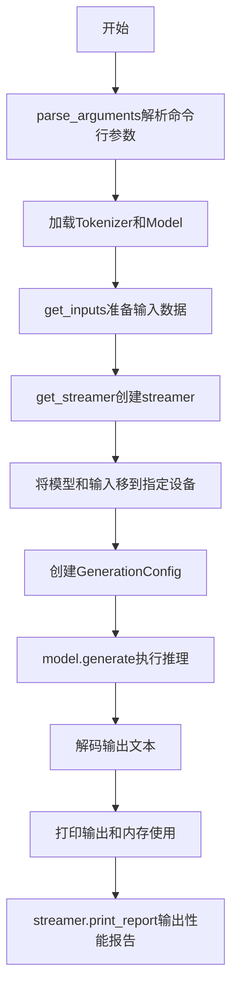
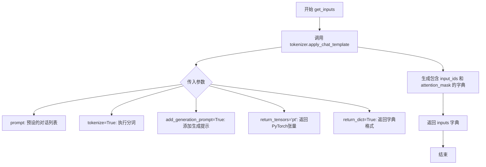
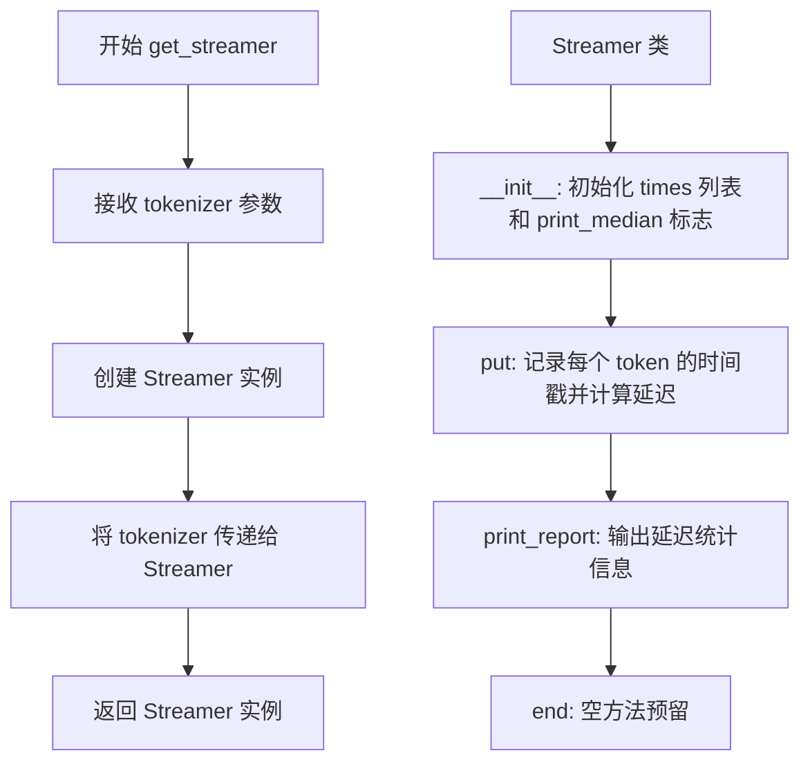
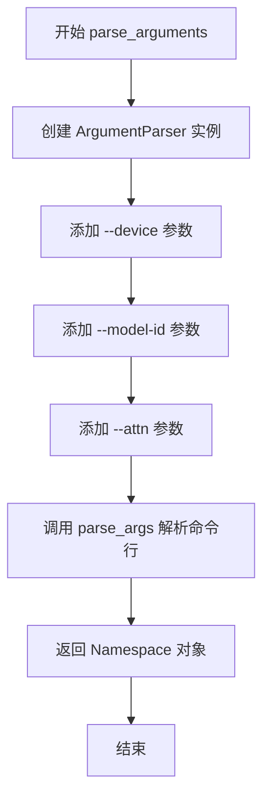
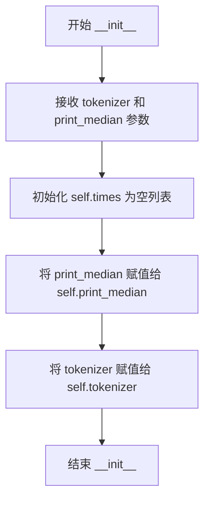
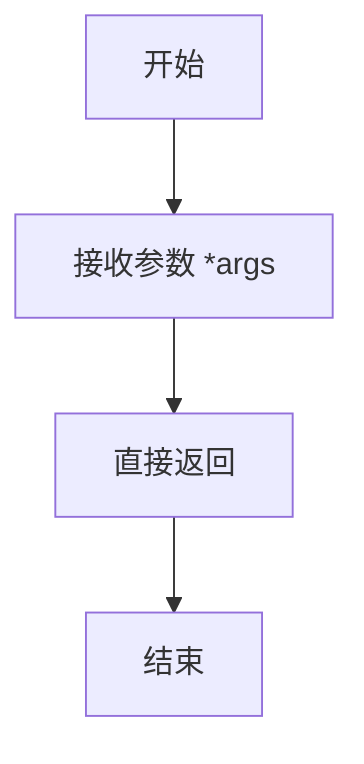

# `bitsandbytes\benchmarking\xpu\inference_benchmark.py` 详细设计文档

一个用于对大语言模型（LLM）进行推理基准测试的脚本，支持在不同设备（xpu/cuda/cpu）上运行，支持多种注意力实现方式（eager/flash_attention/sdpa），并提供详细的令牌延迟统计和性能报告。

## 整体流程



## 类结构

```
Streamer (用于追踪推理性能的类)
```

## 全局变量及字段


### `MAX_NEW_TOKENS`
    
最大新令牌数

类型：`int`
    


### `get_time`
    
时间获取函数

类型：`function`
    


### `system_prompt`
    
系统提示词

类型：`str`
    


### `user_prompt`
    
用户提示词（长文本）

类型：`str`
    


### `prompt`
    
完整的对话模板

类型：`list`
    


### `Streamer.times`
    
存储时间戳列表

类型：`list`
    


### `Streamer.print_median`
    
是否打印中位数

类型：`bool`
    


### `Streamer.tokenizer`
    
分词器引用

类型：`tokenizer对象`
    
    

## 全局函数及方法


### `get_inputs(tokenizer)`

该函数负责将预定义的对话提示（包含系统提示和用户提示）通过分词器的聊天模板进行分词处理，生成模型所需的输入张量（input_ids 和 attention_mask），以便进行后续的生成任务。

参数：

- `tokenizer`：`transformers.AutoTokenizer`，Hugging Face Transformers 库中的分词器对象，用于对文本进行分词、编码和应用聊天模板

返回值：`dict`，返回包含 'input_ids' 和 'attention_mask' 的字典，'input_ids' 为输入 token 的 ID 序列（PyTorch 张量），'attention_mask' 为注意力掩码（PyTorch 张量），用于指示哪些位置是有效 token

#### 流程图



#### 带注释源码

```python
def get_inputs(tokenizer):
    """
    准备模型输入的函数，将对话提示转换为模型可处理的张量格式
    
    参数:
        tokenizer: Hugging Face Transformers 的分词器对象
        
    返回:
        包含 input_ids 和 attention_mask 的字典
    """
    # 使用分词器的 apply_chat_template 方法将对话模板转换为模型输入
    inputs = tokenizer.apply_chat_template(
        prompt,           # 预定义的对话列表，包含 system 和 user 角色
        tokenize=True,    # 立即对文本进行分词，生成 token IDs
        add_generation_prompt=True,  # 在用户消息后添加模型生成回复的提示标记
        return_tensors="pt",         # 返回 PyTorch 格式的张量
        return_dict=True,            # 以字典形式返回结果，包含 input_ids 和 attention_mask
    )
    # 返回包含模型输入的字典
    return inputs
```


### `get_streamer`

该函数用于创建一个 `Streamer` 实例，该实例用于在语言模型生成过程中追踪和记录每个 token 的推理延迟，以便后续进行性能分析和报告。

参数：

- `tokenizer`：`transformers.Tokenizer`，用于将文本转换为 token 的分词器对象

返回值：`Streamer`，返回一个 `Streamer` 对象，用于在模型生成过程中记录延迟信息

#### 流程图



#### 带注释源码

```python
def get_streamer(tokenizer):
    """
    创建一个 Streamer 实例用于追踪 token 生成延迟
    
    参数:
        tokenizer: transformers.Tokenizer，用于分词的对象
        
    返回:
        Streamer: 用于在模型生成过程中记录延迟的流式处理对象
    """
    # 创建 Streamer 实例，传入 tokenizer 用于可能的解码操作
    streamer = Streamer(tokenizer)
    
    # 可选：使用 TextStreamer（transformers 内置）替代自定义实现
    # streamer = TextStreamer(tokenizer, skip_prompt=True, skip_special_tokens=True)
    
    return streamer


class Streamer:
    """
    自定义流式处理类，用于追踪语言模型生成过程中的 token 延迟
    
    此类实现了 transformers 库的流式接口，用于 model.generate() 的 streamer 参数
    """
    
    def __init__(self, tokenizer, print_median=False):
        """
        初始化 Streamer
        
        参数:
            tokenizer: 分词器对象
            print_median: 是否在每 10 个 token 后打印中位数延迟
        """
        self.times = []  # 存储每个 token 的生成时间戳
        self.print_median = print_median  # 控制是否打印中位数
        self.tokenizer = tokenizer  # 保存分词器引用

    def put(self, t):
        """
        每生成一个 token 后调用此方法
        
        参数:
            t: torch.Tensor，新生成的 token ID
        """
        self.times.append(get_time())  # 记录当前时间
        
        # 计算并打印相邻 token 之间的延迟
        if len(self.times) > 1:
            print(f"Token latency: {1000 * (self.times[-1] - self.times[-2]):.1f} ms")

        # 每生成 10 个 token 且 print_median 为 True 时打印中位数
        if len(self.times) % 10 == 3 and self.print_median:
            ts = np.array(self.times)
            diff = ts[1:] - ts[:-1]
            print("Token latency median:", np.median(1000 * diff), "ms")

    def print_report(self):
        """
        在生成完成后打印完整的延迟统计报告
        
        包含中位数和多个百分位数 (10, 25, 50, 75, 90)
        """
        times = np.array(self.times)
        diff = times[1:] - times[:-1]  # 计算相邻 token 的时间差
        
        # 打印中位数延迟
        print(f"Median latency: {round(np.median(diff) * 1000, 2)}ms")
        
        # 计算并打印百分位数
        percentiles = [10, 25, 50, 75, 90]
        print(
            "Latency percentiles",
            {p: round(1000 * float(np.percentile(diff, p)), 1) for p in percentiles},
        )

    def end(self, *args):
        """
        生成完成时调用的方法
        
        参数:
            *args: 预留参数，用于兼容不同接口
        """
        pass
```


### `parse_arguments`

该函数使用 Python 的 `argparse` 模块解析命令行参数，返回一个包含设备类型、模型 ID 和注意力机制实现方式等配置的命名空间对象，供主程序在推理任务中使用。

参数： 无（该函数不接受任何输入参数）

返回值：`argparse.Namespace`，包含以下属性： - `device`：`str`，指定运行推理的设备（如 xpu、cuda、cpu），默认为 "xpu" - `model_id`：`str`，Hugging Face 模型 ID 或本地路径，默认为 "unsloth/Meta-Llama-3.1-8B-Instruct-bnb-4bit" - `attn`：`str`，注意力机制实现方式（eager、flash_attention、sdpa），默认为 "eager"

#### 流程图



#### 带注释源码

```python
def parse_arguments():
    """
    解析命令行参数并返回配置对象。
    
    该函数创建一个 argparse.ArgumentParser 实例，定义并添加三个命令行参数：
    --device: 指定运行推理的设备类型
    --model-id: 指定要使用的 Hugging Face 模型 ID 或本地路径
    --attn: 指定注意力机制的实现方式
    
    Returns:
        argparse.Namespace: 包含解析后的命令行参数的对象
            - device (str): 推理设备，默认为 "xpu"
            - model_id (str): 模型标识符，默认为 "unsloth/Meta-Llama-3.1-8B-Instruct-bnb-4bit"
            - attn (str): 注意力实现，默认为 "eager"，可选值为 ["eager", "flash_attention", "sdpa"]
    """
    # 创建 ArgumentParser 实例，设置程序描述信息
    parser = argparse.ArgumentParser(description="Run inference benchmark for LLM models")
    
    # 添加 --device 参数：指定运行推理的设备
    parser.add_argument(
        "--device",
        type=str,
        default="xpu",
        help="Device to run inference on (e.g., xpu, cuda, cpu)",
    )
    
    # 添加 --model-id 参数：指定模型 ID 或本地路径
    parser.add_argument(
        "--model-id",
        type=str,
        default="unsloth/Meta-Llama-3.1-8B-Instruct-bnb-4bit",
        help="Model ID from Hugging Face or local path",
    )
    
    # 添加 --attn 参数：指定注意力实现方式，带有可选值约束
    parser.add_argument(
        "--attn",
        type=str,
        default="eager",
        choices=["eager", "flash_attention", "sdpa"],
        help="Attention implementation to use",
    )
    
    # 解析命令行参数并返回 Namespace 对象
    return parser.parse_args()
```


### `Streamer.__init__`

该方法是 `Streamer` 类的构造函数，用于初始化流式输出处理器。它接收分词器和一个可选的布尔参数，用于配置是否打印延迟中位数统计信息，并初始化用于记录时间戳的列表和分词器引用。

参数：

-  `tokenizer`：`Tokenizer`，Hugging Face 的分词器对象，用于解码 token
-  `print_median`： `bool`，可选参数（默认为 `False`），设置为 `True` 时会在每处理 10 个 token 后打印延迟中位数

返回值：`None`，该方法不返回任何值，仅初始化对象状态

#### 流程图



#### 带注释源码

```python
def __init__(self, tokenizer, print_median=False):
    """
    初始化 Streamer 对象
    
    参数:
        tokenizer: Hugging Face 的分词器对象，用于后续解码 token
        print_median: 是否在每10个token后打印延迟中位数的标志
    """
    # 用于记录每个 token 产生时的时间戳
    self.times = []
    
    # 控制是否打印延迟中位数的布尔标志
    self.print_median = print_median
    
    # 保存分词器引用，用于后续解码
    self.tokenizer = tokenizer
```


### `Streamer.put`

该方法作为推理过程中的流式回调，在每个新 token 生成时被调用，用于记录并输出 token 生成的延迟信息，以监控模型推理性能。

参数：

- `t`：`torch.Tensor` 或 `int`，由 `model.generate()` 传递的生成 token，但在当前实现中未使用，仅作为回调接口占位符

返回值：`None`，该方法仅执行打印操作，不返回任何值

#### 流程图

```mermaid
flowchart TD
    A[接收 token t] --> B[记录当前时间到 self.times]
    B --> C{len[self.times] > 1?}
    C -->|Yes| D[计算当前token与前一token的时间差]
    D --> E[打印 Token latency: xxx ms]
    C -->|No| F[跳过延迟计算]
    E --> G{len[self.times] % 10 == 3<br/>且 print_median == True?}
    F --> G
    G -->|Yes| H[计算时间差数组]
    H --> I[计算中位数延迟]
    I --> J[打印 Token latency median: xxx ms]
    G -->|No| K[结束本次调用]
    J --> K
```

#### 带注释源码

```python
def put(self, t):
    """
    流式回调方法，在每个新 token 生成时被调用。
    用于记录 token 生成的时间点，并计算和打印延迟信息。
    
    参数:
        t: 由 Hugging Face model.generate() 传递的生成 token tensor，
           当前实现中未使用，仅保持与 Streamer 接口的兼容性
    """
    # 记录当前时间戳到列表中，用于后续延迟计算
    self.times.append(get_time())
    
    # 如果不是第一个 token，则计算与前一个 token 的时间差
    if len(self.times) > 1:
        # 计算延迟（毫秒）并打印
        print(f"Token latency: {1000 * (self.times[-1] - self.times[-2]):.1f} ms")

    # 每隔 10 个 token（第 13, 23, 33... 个）且 print_median 为 True 时
    # 计算并打印延迟的中位数
    if len(self.times) % 10 == 3 and self.print_median:
        # 将时间列表转换为 numpy 数组
        ts = np.array(self.times)
        # 计算相邻时间戳之间的差值
        diff = ts[1:] - ts[:-1]
        # 打印延迟中位数（毫秒）
        print("Token latency median:", np.median(1000 * diff), "ms")
```


### `Streamer.print_report`

该方法用于计算并打印生成过程中所有token的延迟统计报告，包括中位数延迟和多个百分位数（10%、25%、50%、75%、90%），帮助分析模型推理性能。

参数：无（仅包含隐式参数 `self`）

返回值：`None`，无返回值，仅打印统计信息到控制台

#### 流程图

```mermaid
flowchart TD
    A[开始 print_report] --> B[将 self.times 转换为 NumPy 数组]
    B --> C[计算相邻时间戳之间的差值 diff]
    C --> D[计算中位数延迟: np.median(diff) * 1000]
    D --> E[打印 Median latency]
    E --> F[定义百分位数列表: 10, 25, 50, 75, 90]
    F --> G[对每个百分位数计算延迟值]
    G --> H[打印 Latency percentiles 字典]
    H --> I[结束]
```

#### 带注释源码

```python
def print_report(self):
    """
    打印生成任务的延迟统计报告。
    
    该方法分析 Streamer 在整个生成过程中记录的每个 token 生成时间戳，
    计算相邻 token 之间的时间差，然后输出中位数延迟和多个百分位数的延迟值。
    """
    # 将存储的时间戳列表转换为 NumPy 数组以便进行向量化计算
    times = np.array(self.times)
    
    # 计算相邻时间戳之间的差值，得到每个 token 的生成延迟
    # 例如：times = [t0, t1, t2, t3]
    #       diff = [t1-t0, t2-t1, t3-t2]
    diff = times[1:] - times[:-1]
    
    # 计算中位数延迟并转换为毫秒单位，打印输出
    print(f"Median latency: {round(np.median(diff) * 1000, 2)}ms")
    
    # 定义需要计算的百分位数列表
    percentiles = [10, 25, 50, 75, 90]
    
    # 使用字典推导式计算每个百分位数对应的延迟值（毫秒）
    # np.percentile 函数计算给定百分位的值
    # float() 转换确保兼容性，round() 保留一位小数
    print(
        "Latency percentiles",
        {p: round(1000 * float(np.percentile(diff, p)), 1) for p in percentiles},
    )
```


### `Streamer.end`

该方法是一个空实现的结束钩子，用于在文本生成完成后执行清理或报告打印操作，当前版本仅作为接口占位符。

参数：

- `*args`：`Any`，可变数量的参数，用于接收生成器传递的结束信号参数

返回值：`None`，无返回值描述

#### 流程图



#### 带注释源码

```python
def end(self, *args):
    """
    Streamer 类的结束方法，作为生成完成后的钩子
    
    参数:
        *args: 可变数量的参数，用于接收生成器传递的结束信号参数
               在 Hugging Face 的生成器中通常用于接收最后的输出
    
    返回值:
        None: 该方法为空实现，不返回任何值
    
    说明:
        - 这是一个占位符方法，当前没有实现任何功能
        - 在 Hugging Face transformers 库中，streamer 的 end 方法
          会在生成完成后被调用，用于清理资源或打印最终报告
        - 当前实现为空，可能是为了满足 Streamer 接口的要求
        - 实际的时间统计和报告通过 print_report() 方法单独调用
    """
    pass
```

## 关键组件


### Streamer 类

用于流式输出推理结果并统计推理延迟的自定义输出流处理器，记录每个token的生成时间并计算延迟统计信息。

### get_inputs 函数

将预定义的聊天提示模板应用并转换为模型所需的张量输入格式。

### get_streamer 函数

创建并返回配置好的Streamer实例用于处理流式输出。

### parse_arguments 函数

解析命令行参数，包括设备类型、模型ID和注意力实现方式。

### GenerationConfig 配置

定义生成参数，包括最大新token数量、是否采样、eos_token_id等。

### 模型加载与推理流程

使用Hugging Face的AutoModelForCausalLM和AutoTokenizer加载预训练模型，并在指定设备上执行推理。


## 问题及建议


### 已知问题

- **硬编码配置缺乏灵活性**：MAX_NEW_TOKENS、system_prompt、user_prompt等关键参数直接写死在代码中，无法通过命令行动态调整，限制了脚本的通用性
- **设备兼容性处理不足**：代码中直接使用`torch.xpu.max_memory_allocated()`，仅支持XPU设备，当使用CUDA或CPU时会抛出AttributeError异常
- **异常处理机制缺失**：整个推理流程（模型加载、tokenization、生成）没有任何try-except保护，一旦网络问题或模型加载失败会导致程序直接崩溃
- **未使用的导入和代码**：注释掉的`intel_extension_for_pytorch`和`TextStreamer`导入表明存在废弃代码，Streamer类的end方法也是空实现
- **资源清理不规范**：未使用torch.no_grad()上下文管理器进行推理，生成完成后也未显式调用model.cpu()或清理GPU缓存
- **tokenizer边界风险**：apply_chat_template可能返回空值或异常，但代码中未做校验
- **输出编码问题**：使用`r"\Output"`原始字符串但实际打印内容不需要原始字符串，语法略显冗余

### 优化建议

- **命令行参数化**：将MAX_NEW_TOKENS、system_prompt、user_prompt等通过argparse添加为可配置参数
- **设备统一抽象**：使用`torch.cuda.max_memory_allocated() if device == 'cuda' else (torch.xpu.max_memory_allocated() if device == 'xpu' else 0)`或统一封装来兼容多设备
- **添加异常捕获**：在模型加载、推理关键路径添加try-except-exceptional处理，记录详细错误日志并提供友好的错误提示
- **推理优化**：使用@torch.no_grad()装饰器或上下文管理器减少显存占用；考虑添加warmup预热推理
- **代码清理**：移除未使用的导入 Streamer.end方法可考虑删除或实现真正的清理逻辑
- **添加配置校验**：在解析参数后验证model_id有效性、device可用性、attn实现与模型的兼容性
- **完善日志**：使用Python logging模块替代print语句，支持不同日志级别便于排查问题

## 其它


### 设计目标与约束

本代码的设计目标是提供一个轻量级的LLM推理基准测试工具，用于评估不同硬件平台（XPU/CUDA/CPU）和不同注意力机制实现下的推理性能。约束条件包括：仅支持Hugging Face格式的因果语言模型、依赖PyTorch生态、需要在支持CUDA或XPU的设备上运行以获得最佳性能。

### 错误处理与异常设计

代码采用Python内置的异常处理机制，未显式定义自定义异常。主要潜在异常包括：模型加载失败（IOError、OSError）、设备不支持（RuntimeError）、tokenizer加载失败（异常会被传播至调用方）、生成超时或内存溢出。改进建议：添加try-except块捕获模型加载和推理过程中的异常，提供友好的错误信息。

### 数据流与状态机

数据流如下：命令行参数解析 → 模型和tokenizer加载 → 构建输入prompt → 应用chat模板并tokenize → 模型推理生成 → 流式输出处理 → 性能报告生成。状态机主要体现在Streamer类的状态转换：初始化（__init__）→ 流式接收token（put）→ 结束生成（end）→ 生成报告（print_report）。

### 外部依赖与接口契约

核心依赖包括：torch>=2.0、transformers>=4.30、numpy、argparse（标准库）。可选依赖：intel_extension_for_pytorch（已注释）。接口契约：model.generate()接受inputs、streamer、generation_config参数，返回torch.Tensor类型的output_ids。Streamer接口需实现put()和end()方法以兼容transformers的streamer机制。

### 性能指标与基准

代码测量以下性能指标：单token延迟（毫秒）、中位数延迟、延迟百分位数（10/25/50/75/90）、峰值内存使用（MB）。当前默认配置：MAX_NEW_TOKENS=256，generation_config使用greedy decoding（do_sample=False）。

### 配置与参数说明

主要命令行参数：--device（默认xpu）、--model-id（默认unsloth/Meta-Llama-3.1-8B-Instruct-bnb-4bit）、--attn（默认eager，可选flash_attention/sdpa）。GenerationConfig参数：use_cache=True、forced_eos_token_id=1、eos_token_id=1、max_new_tokens=256、do_sample=False。

### 使用示例与调用方式

基本调用：python script.py
指定设备：python script.py --device cuda
指定模型：python script.py --model-id meta-llama/Llama-2-7b-hf
指定注意力：python script.py --attn flash_attention

### 安全考虑

代码不涉及用户数据持久化或网络传输，无敏感信息处理。潜在风险：模型加载可能触发远程代码执行（如果使用不受信任的模型路径），建议在生产环境中使用本地验证的模型。内存监控使用torch.xpu.max_memory_allocated()，需确保设备支持XPU。

### 测试策略

当前代码无单元测试。建议测试策略：1) 验证tokenizer和model加载正确性；2) 验证生成输出非空且符合预期格式；3) 性能回归测试（对比基准延迟）；4) 多设备兼容性测试。

### 部署注意事项

部署环境需要：Python 3.8+、PyTorch 2.0+、transformers库、足够显存（8B模型约需8-16GB）。如使用XPU需安装Intel Extension for PyTorch。建议使用虚拟环境隔离依赖。生产部署时应移除或参数化hard-coded的user_prompt。

### 监控与日志

当前仅使用print()进行基本输出，无结构化日志。建议改进：使用Python logging模块分级记录（DEBUG/INFO/WARNING/ERROR），添加时间戳和模块名称，便于生产环境监控和问题排查。

### 版本兼容性

代码依赖的transformers库API可能随版本变化，GenerationConfig的某些参数在不同版本间可能有差异。建议锁定依赖版本或在requirements.txt中指定兼容版本范围。

    