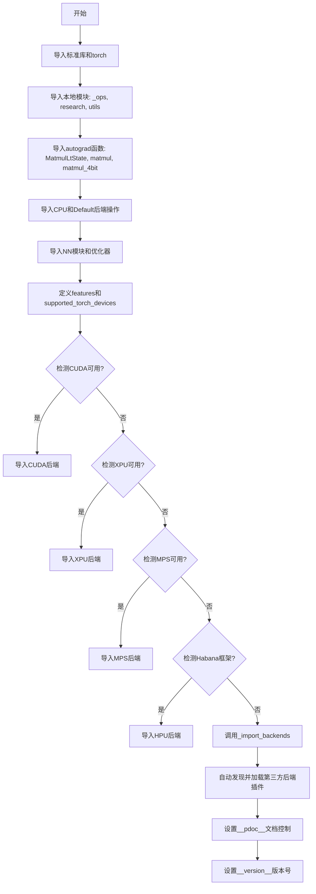
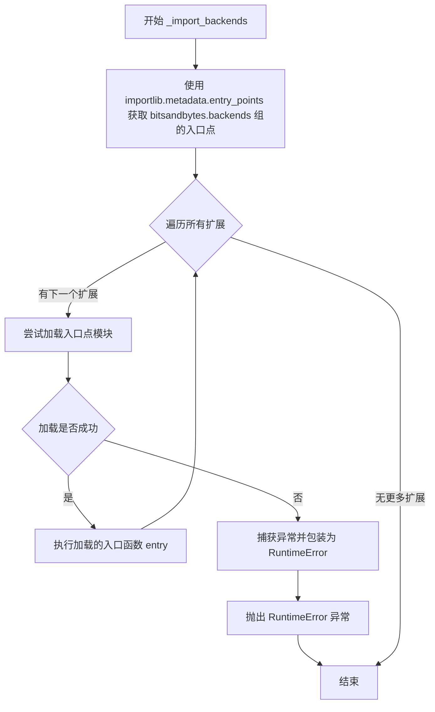

# `bitsandbytes\bitsandbytes\__init__.py` 详细设计文档

bitsandbytes库的根模块初始化文件，负责导入核心操作、研究模块、工具函数，并基于检测到的硬件平台动态加载CPU、CUDA、XPU、MPS、HPU等后端操作，同时提供后端插件的自动发现和加载机制，支持多后端AI模型量化推理。

## 整体流程



## 类结构

```
bitsandbytes (根包)
├── _ops (核心操作模块)
├── research (研究模块)
├── utils (工具模块)
├── autograd._functions (自动梯度函数)
│   ├── MatmulLtState
│   ├── matmul
│   └── matmul_4bit
├── backends (后端模块)
│   ├── cpu.ops
│   ├── default.ops
│   ├── cuda.ops (条件导入)
│   ├── xpu.ops (条件导入)
│   ├── mps.ops (条件导入)
│   └── hpu.ops (条件导入)
├── nn.modules (神经网络模块)
└── optim.adam (优化器模块)
```

## 全局变量及字段


### `features`
    
A set of feature flags indicating enabled capabilities, currently containing 'multi_backend' for transformers/diffusers integration compatibility

类型：`set[str]`
    


### `supported_torch_devices`
    
A set of supported PyTorch device types including cpu, cuda, xpu, hpu, npu, and mps for bitsandbytes operations

类型：`set[str]`
    


### `__pdoc__`
    
A dictionary controlling documentation generation visibility for specific modules and classes, marking certain items to be hidden from public docs

类型：`dict[str, bool]`
    


### `__version__`
    
A string representing the current version of the bitsandbytes package, currently set to '0.50.0.dev0'

类型：`str`
    


    

## 全局函数及方法


### `_import_backends`

该函数用于自动发现并加载所有已安装的第三方后端包。通过 Python 入口点机制（entry points），扫描注册在 `bitsandbytes.backends` 组中的所有扩展模块，并执行其加载函数，从而实现后端的动态注册。

参数：

- 无参数

返回值：`None`，无返回值描述

#### 流程图



#### 带注释源码

```python
def _import_backends():
    """
    Discover and autoload all available backends installed as separate packages.
    Packages with an entrypoint for "bitsandbytes.backends" will be loaded.
    Inspired by PyTorch implementation: https://pytorch.org/tutorials/prototype/python_extension_autoload.html
    """
    # 使用 importlib.metadata.entry_points 获取注册在 "bitsandbytes.backends" 组下的所有入口点
    # 这允许第三方包通过在 setup.py/pyproject.toml 中定义 entry_points 来自动被发现
    from importlib.metadata import entry_points

    # 获取 group="bitsandbytes.backends" 的所有入口点
    extensions = entry_points(group="bitsandbytes.backends")

    # 遍历每个入口点，尝试加载并执行
    for ext in extensions:
        try:
            # 加载入口点对应的模块
            entry = ext.load()
            # 执行加载的入口函数，通常用于注册后端操作
            entry()
        except Exception as e:
            # 如果加载或执行失败，抛出 RuntimeError 并保留原始异常链
            raise RuntimeError(f"bitsandbytes: failed to load backend {ext.name}: {e}") from e


# 模块加载时立即执行该函数，实现后端自动发现
_import_backends()
```

## 关键组件


### 多后端支持框架

该模块是一个多后端量化库（bitsandbytes）的初始化入口，通过动态导入机制支持CPU、CUDA、XPU、HPU、NPU、MPS等多种计算设备，并提供插件化的后端自动发现与加载功能。

### 张量索引与惰性加载

代码使用条件导入和`hasattr`检查实现设备的惰性加载，仅在实际设备可用时才加载对应的后端模块，避免不必要的依赖和错误。

### 反量化支持

通过导入`autograd._functions`模块中的`MatmulLtState`、`matmul`和`matmul_4bit`函数，提供低精度矩阵乘法的反向量化计算支持。

### 量化策略

导入`optim.adam`和`nn.modules`模块，提供8位优化器和量化神经网络模块的实现。

### 插件化后端系统

通过`_import_backends()`函数使用Python的`entry_points`机制实现插件式后端自动发现，允许第三方包作为后端扩展被动态加载。

### 多设备支持

通过`supported_torch_devices`集合定义支持的设备类型，包括CPU、CUDA、XPU、HPU、NPU和MPS。


## 问题及建议


### 已知问题

- **隐式依赖加载风险**：代码通过 `importlib.util.find_spec` 和 `hasattr` 进行多次条件检查来加载不同硬件后端（CUDA、XPU、MPS、HPU、NPU），若任何一个后端加载失败可能导致整个模块导入失败，缺乏健壮的错误隔离机制
- **重复的条件检查逻辑**：对 `habana_frameworks` 进行了两次 `find_spec` 检查，代码冗余且可读性差
- **异常信息不完整**：`_import_backends` 函数中捕获异常后直接 `raise RuntimeError`，原始异常堆栈可能被掩盖，不利于调试
- **未使用的顶层导入**：导入了 `_ops`、`research`、`utils`、`modules` 等模块但未在 `__init__.py` 中直接使用，这些导入仅作为包级导出，可能增加不必要的导入时间
- **硬编码的版本号**：版本号 `0.50.0.dev0` 带有 `.dev0` 后缀，表明可能是开发期间的临时版本，需在正式发布时更新

### 优化建议

- **添加后端加载失败隔离机制**：将每个后端的导入包装在独立的 try-except 块中，允许部分后端加载失败时仍能使用可用后端，可通过配置变量记录加载状态
- **合并重复的条件检查逻辑**：将 `habana_frameworks` 的检查合并为一次操作，避免重复的 `find_spec` 调用
- **改进异常处理**：在 `_import_backends` 中保留原始异常信息，使用 `raise ... from e` 并添加更多上下文信息，或记录日志后继续加载其他后端
- **延迟导入非核心模块**：对于 `_ops`、`research`、`utils` 等非核心组件，可考虑使用延迟导入（lazy import）以加快模块初始化速度
- **统一后端注册机制**：目前后端通过两种方式加载（条件导入 + entry_points），建议统一为基于 entry_points 的动态加载机制，便于扩展和维护

## 其它


### 设计目标与约束

本项目(bitsandbytes)是一个高性能的PyTorch量化库，旨在提供8位和4位矩阵乘法等量化计算功能，支持多种硬件后端。设计目标包括：1)实现高效的量化模型推理和训练；2)支持多硬件平台（CPU、CUDA、XPU、MPS、HPU、NPU）；3)提供与Transformers和Diffusers的兼容性；4)支持动态后端加载机制。约束条件包括：依赖PyTorch>=1.21.0、需要支持CUDA/XPU/MPS/HPU/NPU等特定硬件、动态加载的后端需遵循entry_points接口规范。

### 错误处理与异常设计

代码中的错误处理主要体现在后端加载阶段：1)_import_backends()函数中使用try-except捕获后端加载异常，并抛出RuntimeError详细说明失败原因；2)使用importlib.util.find_spec检查可选依赖habana_frameworks是否存在；3)硬件可用性检查（如torch.cuda.is_available()）失败时会静默跳过相关后端导入。潜在改进：建议对每种硬件后端添加更详细的可用性检查和用户提示。

### 外部依赖与接口契约

主要外部依赖包括：1)torch（核心依赖，必须）；2)importlib（Python标准库）；3)importlib.metadata（Python 3.8+，用于entry_points发现）；4)habana_frameworks.torch（可选，Intel Gaudi加速器支持）。接口契约：1)后端包需提供"bitsandbytes.backends" entry_points；2)每个后端需提供ops模块，包含量化操作实现；3)后端入口函数无参数要求。

### 数据流与状态机

模块初始化流程：1)静态导入核心模块（_ops, research, utils）；2)静态导入autograd函数（MatmulLtState等）；3)静态导入各后端ops模块（CPU、Default、CUDA等）；4)动态检查并导入可选硬件后端；5)调用_import_backends()发现并加载外部后端包。无复杂状态机，主要状态为后端可用性检测和加载结果。

### 模块关系图

```
┌─────────────────────────────────────────────────────┐
│                    bitsandbytes                     │
├─────────────────────────────────────────────────────┤
│  ┌─────────┐  ┌─────────┐  ┌─────────┐  ┌────────┐ │
│  │  _ops   │  │ research│  │  utils  │  │  nn    │ │
│  └─────────┘  └─────────┘  └─────────┘  └────────┘ │
│  ┌─────────┐  ┌─────────┐  ┌─────────────────────┐ │
│  │ autograd│  │ optim   │  │    backends          │ │
│  │         │  │ (adam)  │  │ (cpu/default/cuda/   │ │
│  └─────────┘  └─────────┘  │  xpu/mps/hpu/npu)   │ │
│                             └─────────────────────┘ │
└─────────────────────────────────────────────────────┘
```

### 版本与发布信息

当前版本：__version__ = "0.50.0.dev0"，遵循语义化版本规范。License：MIT。代码中定义了__pdoc__用于控制文档生成，排除libbitsandbytes和部分优化器类的文档。

### 关键技术特性

1)多后端支持：通过动态加载机制支持6+种硬件平台；2)信号机制：通过features = {"multi_backend"}向Transformers/Diffusers表明支持多后端；3)可选依赖：habana_frameworks为可选导入，不存在时不会报错；4)兼容性检查：使用hasattr和is_available()多层检查确保安全导入。


    