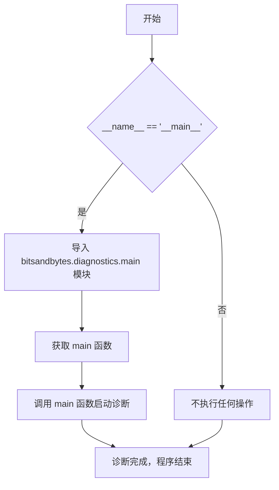
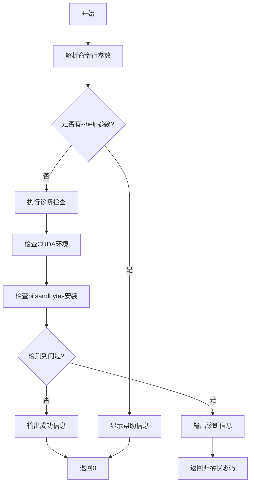
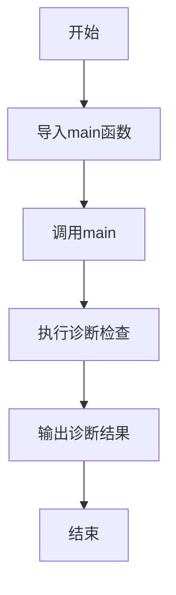

# `bitsandbytes\bitsandbytes\__main__.py` 详细设计文档

这是一个非常简洁的入口文件，用于启动 bitsandbytes 库的诊断工具。它在作为主程序运行时导入并调用 bitsandbytes.diagnostics.main 模块中的 main 函数，从而触发库的内部诊断检查流程。

## 整体流程



## 类结构

```
此文件为入口脚本，无自定义类结构
仅作为模块导入和函数调用的桥接点
```

## 全局变量及字段


    

## 全局函数及方法


### `main`

这是 `bitsandbytes.diagnostics.main` 模块的入口函数，负责执行 bitsandbytes 库的诊断功能，可能包括检查CUDA版本、验证安装、检测潜在配置问题等。

参数：

- 无显式参数（通过命令行参数传入）

返回值：`int`，返回程序执行状态码（通常 0 表示成功，非 0 表示错误）

#### 流程图



#### 带注释源码

```python
# 从 bitsandbytes.diagnostics.main 导入 main 函数
# 这是入口点模块，用于执行库诊断
if __name__ == "__main__":
    from bitsandbytes.diagnostics.main import main

    # 执行诊断主函数
    main()
```

---

### 补充说明

**注意**：提供的代码片段仅包含入口点调用，未包含 `main` 函数的具体实现。以下是基于模块名称的合理推断：

**关键组件信息**：

- `bitsandbytes.diagnostics.main`：诊断模块的主入口点

**潜在技术债务/优化空间**：
- 由于未提供完整实现，无法进行详细分析

**其他项目**：
- 该函数很可能依赖 `argparse` 处理命令行参数
- 可能在无参数时使用默认配置执行完整诊断

## 关键组件


### 核心功能描述

该代码是bitsandbytes库的诊断入口脚本，用于在命令行直接运行时执行系统环境检查、GPU兼容性验证和库功能诊断，确保量化所需的依赖和硬件环境满足要求。

### 文件运行流程

1. 脚本作为主程序入口执行（`if __name__ == "__main__"`）
2. 动态导入`bitsandbytes.diagnostics.main`模块中的`main`函数
3. 调用`main()`函数启动诊断流程
4. 诊断程序执行完成后脚本退出

### 全局函数

#### main 函数
- **函数名**: main
- **参数**: 无
- **参数类型**: 无
- **参数描述**: 无需传入参数，由诊断模块自动检测系统环境
- **返回值类型**: None
- **返回值描述**: 无返回值，执行诊断检查后直接退出
- **mermaid流程图**: 

- **带注释源码**:
```python
if __name__ == "__main__":
    # 条件判断：确保脚本作为主程序运行，而非被导入
    from bitsandbytes.diagnostics.main import main
    # 从bitsandbytes诊断模块导入主函数
    main()
    # 执行诊断检查并输出结果
```

### 关键组件信息

#### bitsandbytes.diagnostics.main
- **名称**: bitsandbytes诊断主模块
- **描述**: 负责执行系统环境检查、CUDA版本验证、GPU可用性检测、量化功能支持情况等诊断任务的模块

### 潜在技术债务与优化空间

1. **缺乏错误处理**: 主入口点没有try-except包装，如果导入或执行失败会直接抛出未处理的异常
2. **无命令行参数支持**: 缺少argparse等参数解析机制，无法自定义诊断级别或输出格式
3. **模块耦合**: 直接导入具体模块路径，限制了诊断功能的可配置性和扩展性

### 其他项目

#### 设计目标
- 提供开箱即用的诊断工具，帮助用户快速排查bitsandbytes量化库的安装和环境问题
- 降低用户调试成本，提升库的可维护性

#### 约束条件
- 依赖于bitsandbytes库的正确安装
- 需要Python解释器支持动态导入

#### 错误处理
- 导入失败时抛出ImportError
- 诊断过程中的错误由diagnostics.main模块内部处理

#### 外部依赖
- bitsandbytes库本身
- 可能的CUDA运行时环境
- Python标准库（if __name__ == "__main__" 模式）


## 问题及建议


### 已知问题

-   **缺乏错误处理**：代码没有使用 try-except 块来捕获导入错误或 main() 执行期间的异常，可能导致程序以不友好的错误信息终止
-   **缺少命令行参数支持**：直接调用 main() 而不传递任何参数，限制了脚本的灵活性和可配置性
-   **无文档注释**：代码缺少模块级或函数级的文档字符串，无法帮助理解脚本用途和维护
-   **隐式依赖无验证**：依赖 bitsandbytes 库但未进行版本检查或依赖存在性验证，可能导致运行时才发现缺失
-   **缺少日志记录**：没有日志输出，难以进行调试和问题追踪
-   **入口点过于简单**：作为项目入口点，功能过于单一，缺乏使用说明或帮助信息

### 优化建议

-   **添加异常处理**：使用 try-except 捕获 ImportError、Exception 等异常，提供友好的错误提示并优雅退出
-   **引入 argparse**：支持命令行参数传递，如 --config、--verbose 等选项，增强脚本灵活性
-   **添加文档字符串**：为模块添加 docstring 说明脚本功能、作者、版本等信息
-   **添加依赖验证**：在导入前检查 bitsandbytes 是否已安装，或使用 try-except 捕获 ImportError 并给出安装提示
-   **集成日志模块**：使用 logging 模块记录程序运行状态，支持不同日志级别配置
-   **添加版本信息和帮助**：提供 --version 和 --help 选项，提升用户体验

## 其它


### 设计目标与约束

该代码作为bitsandbytes库的诊断入口脚本，核心目标是在命令行环境下快速启动库的自诊断功能，帮助用户排查常见的库使用问题。设计约束包括：仅支持作为主程序入口运行（`if __name__ == "__main__"`），不支持作为模块导入调用，依赖bitsandbytes库的正确安装。

### 错误处理与异常设计

该脚本本身不包含显式的错误处理逻辑，错误处理委托给`bitsandbytes.diagnostics.main`模块。潜在异常包括：ImportError（库未安装或诊断模块缺失）、RuntimeError（诊断过程中的运行时错误）、以及由于Python版本不兼容导致的异常。建议在调用main前添加异常捕获机制，提升用户体验。

### 数据流与状态机

数据流较为简单：脚本入口 → 导入diagnostics模块 → 调用main函数 → 诊断逻辑执行 → 输出诊断结果 → 程序终止。无复杂状态机设计，属于线性执行流程。

### 外部依赖与接口契约

核心依赖为`bitsandbytes`库，具体依赖`bitsandbytes.diagnostics.main`模块的`main`函数。该函数应无参数输入（从sys.argv获取命令行参数），返回值通常为None或整数（退出码）。接口契约要求调用方确保库已正确安装，且Python环境满足版本要求。

### 性能考量

该脚本本身无性能瓶颈，性能取决于`diagnostics.main`的实现。诊断功能通常为一次性执行任务，不涉及高频调用或长时间运行，无需特殊性能优化。

### 安全性考虑

脚本从相对路径导入模块，不涉及用户输入处理或网络请求，安全性风险较低。但需确保导入的库来源可信，防止依赖供应链攻击。

### 配置管理

该脚本无独立配置管理，所有配置由`diagnostics.main`模块内部处理或通过命令行参数传入。

### 版本兼容性

脚本兼容Python 3.7+（标准写法），但具体兼容性取决于bitsandbytes库的版本要求。建议在文档中注明支持的Python版本范围和bitsandbytes库版本。

### 测试策略

该脚本本身无需单元测试，测试重点应放在`bitsandbytes.diagnostics.main`模块的功能验证上。集成测试可验证脚本作为入口点的正确性。

### 部署注意事项

作为库的一部分随bitsandbytes包分发，无需独立部署。安装时需确保依赖库版本兼容。

### 日志和监控

脚本本身不实现日志功能，日志由`diagnostics.main`模块负责。建议在调用main前初始化日志系统，便于问题排查。

    