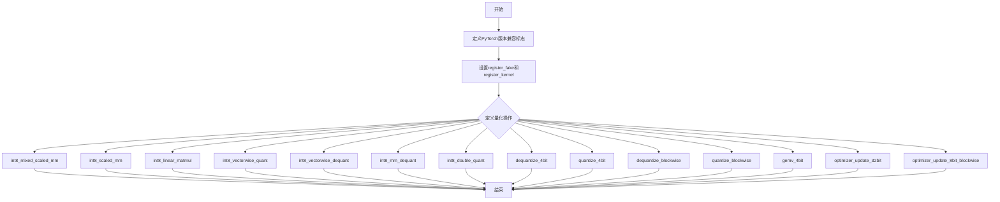
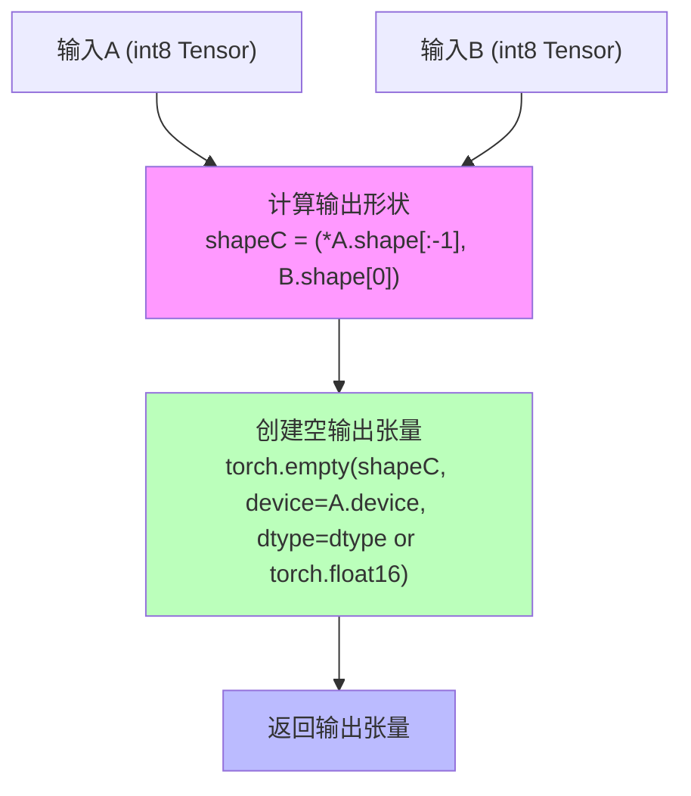
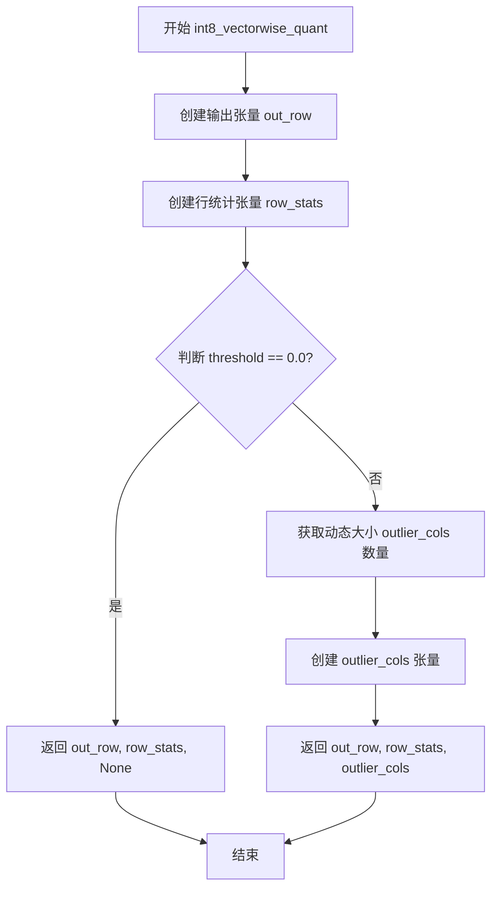
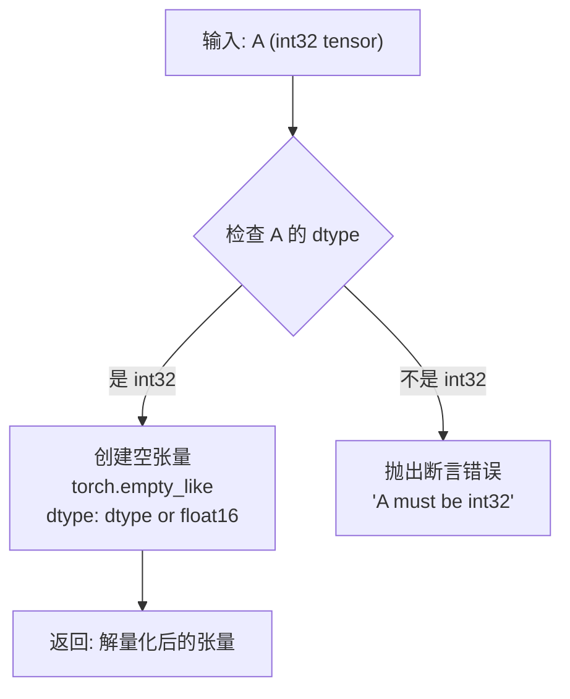
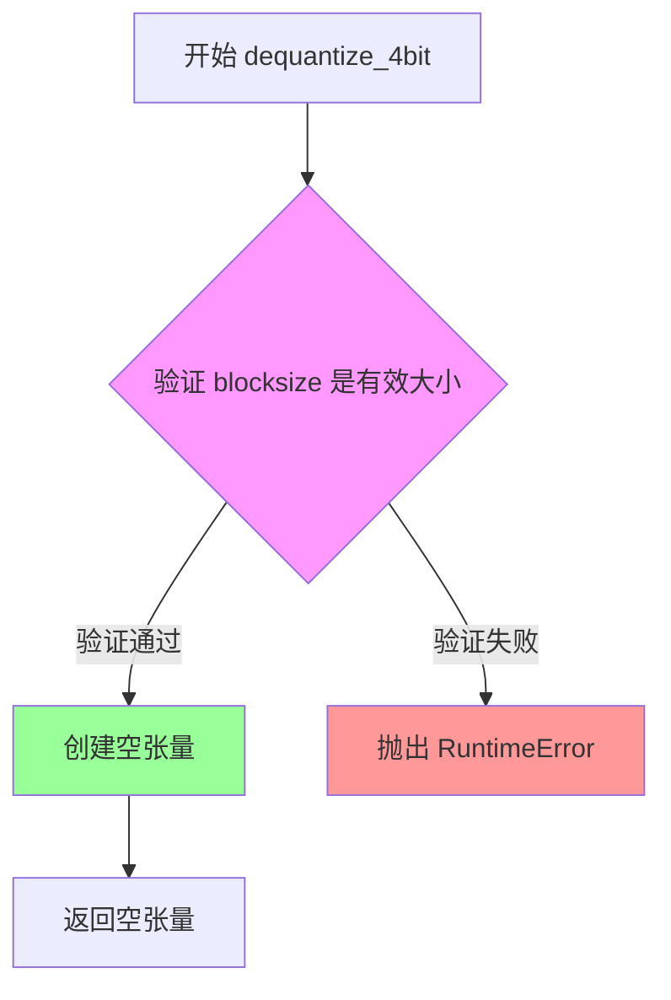
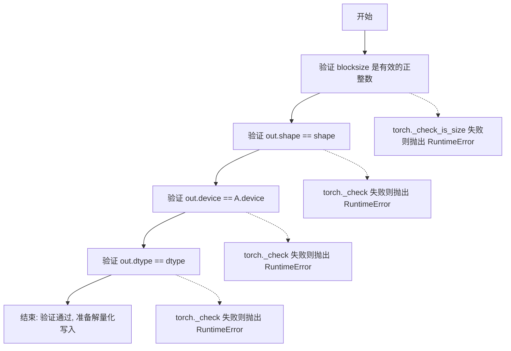
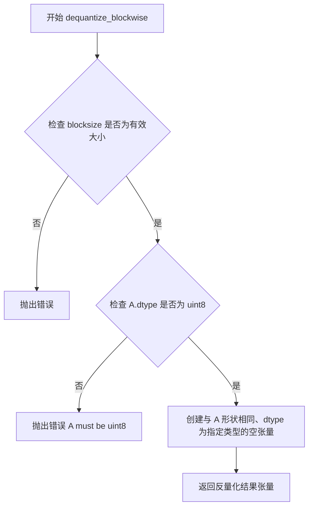
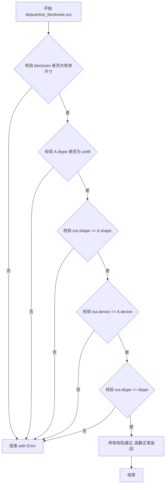
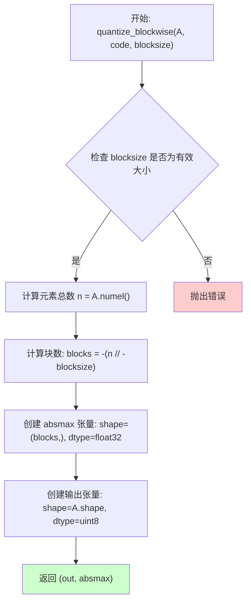
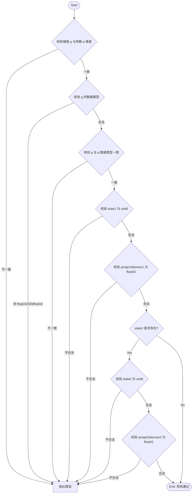

# `bitsandbytes\bitsandbytes\_ops.py` 详细设计文档

该文件定义了bitsandbytes库的自定义PyTorch操作，用于8位和4位量化/反量化操作以及优化器更新，支持高效的混合精度矩阵乘法、模型量化和8位优化器，以减少神经网络推理和训练的内存占用和计算开销。

## 整体流程



## 类结构

```
全局变量和函数 (无类结构)
├── 全局变量
│   ├── _IS_TORCH_GTE_24 (布尔标志)
│   ├── register_fake (函数引用)
│   └── register_kernel (函数引用)
├── 8位量化操作
│   ├── int8_mixed_scaled_mm
│   ├── int8_scaled_mm
│   ├── int8_linear_matmul
│   ├── int8_vectorwise_quant
│   ├── int8_vectorwise_dequant
│   ├── int8_mm_dequant
│   └── int8_double_quant
├── 4位量化操作
│   ├── dequantize_4bit
│   ├── quantize_4bit
│   ├── dequantize_blockwise
│   ├── quantize_blockwise
│   └── gemv_4bit
└── 优化器操作
    ├── optimizer_update_32bit
    └── optimizer_update_8bit_blockwise
```

## 全局变量及字段


### `_IS_TORCH_GTE_24`
    
标记PyTorch版本是否大于等于2.4的布尔标志，用于条件选择不同的自定义算子注册API

类型：`bool`
    


### `register_fake`
    
根据PyTorch版本动态选择的函数引用，用于注册自定义操作的假实现（fake implementation），支持PyTorch 2.4+的register_fake或旧版本的impl_abstract

类型：`Callable`
    


### `register_kernel`
    
根据PyTorch版本动态选择的函数引用，用于注册自定义操作的内核实现，支持PyTorch 2.4+的register_kernel或旧版本的impl

类型：`Callable`
    


    

## 全局函数及方法


### `int8_mixed_scaled_mm` (fake implementation)

这是一个用于 int8 混合精度矩阵乘法的 fake 实现（PyTorch Fake Kernel），定义在 `bitsandbytes` 命名空间下。该函数模拟了带有缩放因子（scaling）的 int8 矩阵乘法、反量化（dequantization）以及可选偏置（bias）相加的运算过程，主要用于 PyTorch 的 dispatch 机制和自动求导系统中的符号追踪（symbolic tracing）。

参数：

- `A`：`torch.Tensor`，原始输入张量，通常为 float16 或 bfloat16 类型
- `CA`：`torch.Tensor`，经过 int8 量化后的 A 张量（Quantized A）
- `CB`：`torch.Tensor`，经过 int8 量化后的 B 张量（Quantized B）
- `SCA`：`torch.Tensor`，用于对 A 进行反量化的缩放因子（Scaling Factor for A）
- `SCB`：`torch.Tensor`，用于对 B 进行反量化的缩放因子（Scaling Factor for B）
- `outlier_cols`：`Optional[torch.Tensor]`，可选参数，用于存储异常列索引的张量，默认为 None
- `bias`：`Optional[torch.Tensor]`，可选参数，偏置张量，默认为 None

返回值：`tuple[torch.Tensor, Optional[torch.Tensor]]`，返回一个元组，包含计算结果张量（与 CA 的最后维度之前的形状相同，B 的第一维度作为输出矩阵的行数）和可选的异常列子张量（如果 outlier_cols 不为 None）

#### 流程图

```mermaid
flowchart TD
    A[输入参数: A, CA, CB, SCA, SCB, outlier_cols, bias] --> B[计算输出形状: shapeC = (*CA.shape[:-1], CB.shape[0])]
    B --> C[创建空输出张量: out = torch.empty]
    C --> D{outlier_cols 是否存在?}
    D -->|是| E[获取动态大小: new_dynamic_size]
    D -->|否| F[跳过异常列处理]
    E --> G[创建异常列子张量: subA = A.new_empty]
    F --> H[返回结果: out 和 subA]
    G --> H
```

#### 带注释源码

```python
@register_fake("bitsandbytes::int8_mixed_scaled_mm")
def _(
    A: torch.Tensor,              # 原始输入张量（通常为 float16/bfloat16）
    CA: torch.Tensor,             # 量化后的 A 张量（int8）
    CB: torch.Tensor,             # 量化后的 B 张量（int8）
    SCA: torch.Tensor,            # A 的缩放因子（float32）
    SCB: torch.Tensor,            # B 的缩放因子（float32）
    outlier_cols: Optional[torch.Tensor] = None,  # 可选的异常列索引张量
    bias: Optional[torch.Tensor] = None,           # 可选的偏置张量
) -> tuple[torch.Tensor, Optional[torch.Tensor]]:
    """
    Fake implementation for int8 mixed precision matmul with dequantization and bias.
    
    This function simulates the behavior of int8_mixed_scaled_mm for symbolic tracing
    and automatic differentiation in PyTorch. It does not perform actual computation,
    but returns appropriately shaped empty tensors to satisfy the tracing system.
    """
    
    # 计算输出矩阵 C 的形状：取 CA 的前 N-1 维，取 CB 的第一维作为输出行数
    # 例如：CA.shape = (batch, m, k), CB.shape = (k, n) -> shapeC = (batch, m, n)
    shapeC = (*CA.shape[:-1], CB.shape[0])

    # 创建一个与 A 设备相同、类型相同的空张量用于输出
    # 注意：这里 dtype 保持为 A.dtype（即原始输入类型，如 float16）
    out = torch.empty(shapeC, device=A.device, dtype=A.dtype)

    # 使用 PyTorch 的上下文管理器获取动态大小，用于处理异常列
    # 这在符号追踪时非常重要，因为静态图不知道具体的运行时大小
    outlier_cols = torch.library.get_ctx().new_dynamic_size()
    
    # 创建一个与 outlier_cols 大小相同的 int64 类型张量
    # 用于表示哪些列包含异常值（outliers）
    subA = A.new_empty(outlier_cols, dtype=torch.int64)

    # 返回计算结果和异常列信息
    # 如果调用时没有传入 outlier_cols，这里仍然返回计算结果
    # 但 subA 用于追踪时满足返回类型签名
    return out, subA
```


### `bitsandbytes::int8_scaled_mm`

这是一个用于int8矩阵乘法的PyTorch自定义算子fake实现，执行int8矩阵乘法并进行反量化（dequantization）和偏置相加的高级操作。该函数是bitsandbytes库中int8混合精度矩阵乘法的核心组件。

参数：

- `A`：`torch.Tensor`，输入的int8张量矩阵A
- `B`：`torch.Tensor`，输入的int8张量矩阵B
- `row_stats`：`torch.Tensor`，行方向的缩放统计信息，用于反量化
- `col_stats`：`torch.Tensor`，列方向的缩放统计信息，用于反量化
- `bias`：`Optional[torch.Tensor]`，可选的偏置向量，在矩阵乘法后加到结果上
- `dtype`：`Optional[torch.dtype]`，可选的输出数据类型，默认为torch.float16

返回值：`torch.Tensor`，反量化后的浮点结果张量

#### 流程图



#### 带注释源码

```python
# 使用torch.library.define定义自定义PyTorch算子
# 该算子执行int8矩阵乘法 + 反量化 + 偏置相加
torch.library.define(
    "bitsandbytes::int8_scaled_mm",
    # 定义函数签名：输入A, B, row_stats, col_stats, 可选bias和dtype
    "(Tensor A, Tensor B, Tensor row_stats, Tensor col_stats, Tensor? bias=None, ScalarType? dtype=None) -> Tensor",
)

# 使用fake模式注册该算子（用于torch.compile和推理模式）
# 这是一个抽象实现，仅返回正确形状和类型的空张量
@register_fake("bitsandbytes::int8_scaled_mm")
def _(
    A: torch.Tensor,       # 输入矩阵A，int8类型
    B: torch.Tensor,       # 输入矩阵B，int8类型
    row_stats: torch.Tensor,  # 行统计信息，用于反量化
    col_stats: torch.Tensor,  # 列统计信息，用于反量化
    bias: Optional[torch.Tensor] = None,  # 可选偏置
    dtype: Optional[torch.dtype] = None,   # 输出数据类型
) -> torch.Tensor:
    # 计算输出矩阵C的形状：
    # 保留A的前n-1维，最后一维由B的第一维决定（即B的行数/输出列数）
    shapeC = (*A.shape[:-1], B.shape[0])

    # 返回一个空张量，设备与A相同，dtype默认为float16或指定的dtype
    # 实际计算逻辑由C++/CUDA实现完成，这里只是fake实现
    return torch.empty(shapeC, device=A.device, dtype=dtype or torch.float16)
```


### `int8_linear_matmul`

该函数是 bitsandbytes 库中的一个核心算子，用于执行 int8 类型的矩阵乘法操作（无偏移/反量化），属于低位宽量化推理的关键算子。它接受两个 int8 张量 A 和 B，返回 int32 类型的矩阵乘法结果 C。

#### 参数

- `A`：`torch.Tensor`，左侧输入矩阵，必须为 int8 类型
- `B`：`torch.Tensor`，右侧输入矩阵，必须为 int8 类型
- `out`：`torch.Tensor`，可选参数，用于存储输出结果的张量，必须为 int32 类型

#### 返回值

- `torch.Tensor`（主函数）：返回 int32 类型的矩阵乘法结果，形状为 `(*A.shape[:-1], B.shape[0])`
- `None`（out 版本）：直接修改传入的 `out` 张量，无返回值

#### 流程图

```mermaid
flowchart TD
    A[输入 A: int8 Tensor] --> B[校验 A.dtype == int8]
    C[输入 B: int8 Tensor] --> D[校验 B.dtype == int8]
    B --> E[计算输出形状: shapeC = (*A.shape[:-1], B.shape[0])]
    D --> E
    E --> F{是否传入 out 参数?}
    F -->|是| G[校验 out.shape == shapeC]
    F -->|否| H[创建空张量 out = torch.empty]
    G --> I[校验 out.device == A.device]
    I --> J[校验 out.dtype == int32]
    H --> K[返回 out]
    J --> K
    K --> L[结束]
```

#### 带注释源码

```python
# 主函数定义：int8 矩阵乘法算子（fake 实现）
# 注册到 PyTorch 的 custom op 系统中
@register_fake("bitsandbytes::int8_linear_matmul")
def _(A: torch.Tensor, B: torch.Tensor):
    # 参数校验：确保左侧矩阵 A 的数据类型为 int8
    torch._check(A.dtype == torch.int8, lambda: "A must be int8")
    # 参数校验：确保右侧矩阵 B 的数据类型为 int8
    torch._check(B.dtype == torch.int8, lambda: "B must be int8")
    
    # 计算输出矩阵 C 的形状：
    # - 保留 A 的前 N-1 维（支持批量矩阵乘法）
    # - 最后一维取 B 的行数
    shapeC = (*A.shape[:-1], B.shape[0])
    
    # 创建指定形状的输出张量，dtype 为 int32（防止溢出）
    return torch.empty(shapeC, device=A.device, dtype=torch.int32)


# out 重载版本：支持传入预分配的输出张量
@register_fake("bitsandbytes::int8_linear_matmul.out")
def _(A: torch.Tensor, B: torch.Tensor, out: torch.Tensor):
    # 计算输出矩阵 C 的形状
    shapeC = (*A.shape[:-1], B.shape[0])

    # 参数校验：确保 A 为 int8 类型
    torch._check(A.dtype == torch.int8, lambda: "A must be int8")
    # 参数校验：确保 B 为 int8 类型
    torch._check(B.dtype == torch.int8, lambda: "B must be int8")
    # 参数校验：确保传入的 out 张量形状正确
    torch._check(out.shape == shapeC, lambda: f"Expected out.shape == {shapeC}, got {out.shape}")
    # 参数校验：确保 out 与 A 在同一设备上
    torch._check(out.device == A.device, lambda: f"Expected out.device == {A.device}, got {out.device}")
    # 参数校验：确保 out 的数据类型为 int32
    torch._check(out.dtype == torch.int32, lambda: f"Expected out.dtype == int32, got {out.dtype}")
    
    # 注意：fake 实现中不实际执行矩阵乘法，仅验证张量元信息
    # 实际 kernel 在 C++/CUDA 层实现
```


### `int8_linear_matmul.out`

这是一个 int8 矩阵乘法的 fake 实现（用于 PyTorch 2.4+ 的 `torch.compile` 追踪），通过 `torch.library.define` 注册为自定义算子，执行 int8 类型矩阵 A 和 B 的乘法，结果写入预分配的 int32 类型输出张量 out 中，并进行严格的类型、形状和设备一致性检查。

参数：

-  `A`：`torch.Tensor`，输入矩阵 A，必须是 int8 类型
-  `B`：`torch.Tensor`，输入矩阵 B，必须是 int8 类型
-  `out`：`torch.Tensor`，预分配的输出张量，必须是 int32 类型，且 shape、device 与计算结果一致

返回值：`None`（空元组），表示这是一个 in-place 操作，通过修改 `out` 张量返回结果

#### 流程图

```mermaid
flowchart TD
    A[输入: A (int8), B (int8), out (int32)] --> B1{检查 A.dtype == int8}
    B1 -- 否 --> E1[抛出异常: A must be int8]
    B1 -- 是 --> B2{检查 B.dtype == int8}
    B2 -- 否 --> E2[抛出异常: B must be int8]
    B2 -- 是 --> B3{检查 out.shape == shapeC}
    B3 -- 否 --> E3[抛出异常: Expected out.shape == ...]
    B3 -- 是 --> B4{检查 out.device == A.device}
    B4 -- 否 --> E4[抛出异常: Expected out.device == ...]
    B4 -- 是 --> B5{检查 out.dtype == int32}
    B5 -- 否 --> E5[抛出异常: Expected out.dtype == int32]
    B5 -- 是 --> C[计算完成<br/>out 已预分配<br/>返回 None]
```

#### 带注释源码

```python
# 定义自定义算子 int8_linear_matmul.out
# 签名: (Tensor A, Tensor B, Tensor! out) -> ()
torch.library.define(
    "bitsandbytes::int8_linear_matmul.out",
    "(Tensor A, Tensor B, Tensor! out) -> ()",
)

# 使用 register_fake 装饰器注册 fake 实现
# 用于 torch.compile 追踪时模拟算子行为
@register_fake("bitsandbytes::int8_linear_matmul.out")
def _(A: torch.Tensor, B: torch.Tensor, out: torch.Tensor):
    # 计算输出矩阵 C 的形状: (*A.shape[:-1], B.shape[0])
    # 保持 A 的批量维度，最后一维由 B 的行数决定
    shapeC = (*A.shape[:-1], B.shape[0])

    # === 输入验证 ===
    
    # 检查 A 是否为 int8 类型
    torch._check(A.dtype == torch.int8, lambda: "A must be int8")
    
    # 检查 B 是否为 int8 类型
    torch._check(B.dtype == torch.int8, lambda: "B must be int8")
    
    # 检查预分配的输出张量 shape 是否与计算结果一致
    torch._check(out.shape == shapeC, lambda: f"Expected out.shape == {shapeC}, got {out.shape}")
    
    # 检查输出张量设备是否与输入 A 一致
    torch._check(out.device == A.device, lambda: f"Expected out.device == {A.device}, got {out.device}")
    
    # 检查输出张量 dtype 是否为 int32
    # int8 * int8 的矩阵乘法结果需要 int32 存储以避免溢出
    torch._check(out.dtype == torch.int32, lambda: f"Expected out.dtype == int32, got {out.dtype}")

    # fake 实现中不实际执行矩阵乘法
    # 仅通过预分配的 out 张量返回结果（in-place 语义）
    # 返回空元组表示无返回值
```


### `bitsandbytes::int8_vectorwise_quant`

该函数是 bitsandbytes 库中 int8 向量级量化操作的 fake 实现（用于 PyTorch 2.4+ 的抽象自定义算子）。它接收一个输入张量，根据阈值对张量进行向量级 int8 量化，返回量化后的张量、行统计信息以及可选的离群列索引。

参数：

-  `A`：`torch.Tensor`，输入的需要进行 int8 量化的张量
-  `threshold`：`float`，阈值参数，用于决定是否追踪离群列（默认为 0.0）

返回值：`tuple[torch.Tensor, torch.Tensor, Optional[torch.Tensor]]`，包含三个元素的元组：
-  `out_row`：`torch.Tensor`，量化后的 int8 张量，形状与输入 A 相同
-  `row_stats`：`torch.Tensor`，行级统计信息（float32），用于反量化
-  `outlier_cols`：`Optional[torch.Tensor]`，离群列索引（int64），当 threshold=0.0 时为 None

#### 流程图



#### 带注释源码

```python
@register_fake("bitsandbytes::int8_vectorwise_quant")
def _(A: torch.Tensor, threshold=0.0):
    # 创建量化后的输出张量，形状与输入 A 相同，设备与 A 相同，数据类型为 int8
    out_row = torch.empty(A.shape, device=A.device, dtype=torch.int8)
    
    # 创建行统计信息张量，用于存储每行的缩放因子
    # 形状为 prod(A.shape[:-1])，即除了最后一维的所有元素的乘积
    row_stats = torch.empty(prod(A.shape[:-1]), device=A.device, dtype=torch.float32)

    # 如果阈值为 0.0，则不需要追踪离群列，直接返回
    if threshold == 0.0:
        return out_row, row_stats, None

    # 当 threshold > 0 时，需要追踪离群列
    # 使用 torch.library.get_ctx().new_dynamic_size() 获取动态大小
    outlier_cols = torch.library.get_ctx().new_dynamic_size()

    # 返回量化后的张量、行统计信息以及离群列索引
    return out_row, row_stats, A.new_empty(outlier_cols, dtype=torch.int64)
```


### `int8_vectorwise_dequant`

该函数是 bitsandbytes 库中的 int8 向量级反量化操作，接受 int8 量化张量 A 和对应的统计信息（缩放因子）stats，将量化数据重新转换为 float32 浮点格式。

参数：

- `A`：`torch.Tensor`，输入的 int8 量化张量
- `stats`：`torch.Tensor`，用于反量化的缩放因子（通常为 float32 类型的一维张量）

返回值：`torch.Tensor`，返回反量化后的 float32 浮点张量

#### 流程图

```mermaid
flowchart TD
    A[输入: int8_tensor A] --> B[检查 A.dtype == torch.int8]
    B --> C{使用 Fake 还是 Default Kernel}
    C -->|Fake 实现| D[torch.empty_like A, dtype=torch.float32]
    C -->|Default Kernel| E[stats.view(-1, 1) 扩展维度]
    E --> F[A * stats.view(-1, 1) * 7.874015718698502e-3]
    F --> G[返回 float32 张量]
    D --> G
```

#### 带注释源码

```python
# 定义自定义操作：int8_vectorwise_dequant
# 输入：int8 张量 A，统计信息 stats
# 输出：反量化后的 float32 张量
torch.library.define("bitsandbytes::int8_vectorwise_dequant", "(Tensor A, Tensor stats) -> Tensor")


# Fake 实现（用于 PyTorch 2.4+ 的符号跟踪）
@register_fake("bitsandbytes::int8_vectorwise_dequant")
def _(A: torch.Tensor, stats: torch.Tensor) -> torch.Tensor:
    # 验证输入必须是 int8 类型
    torch._check(A.dtype == torch.int8, lambda: "A must be int8")
    # 返回与 A 形状相同的 float32 空张量（占位符）
    return torch.empty_like(A, dtype=torch.float32)


# Default Kernel 实现（实际执行逻辑）
@register_kernel("bitsandbytes::int8_vectorwise_dequant", "default")
def _(A: torch.Tensor, stats: torch.Tensor):
    # 反量化公式：A * stats * (1/127)
    # 7.874015718698502e-3 = 1/127.0，是 127 的倒数
    return A * stats.view(-1, 1) * 7.874015718698502e-3
```


### `int8_vectorwise_dequant.default`

该函数是 bitsandbytes 库中 `int8_vectorwise_dequant` 算子的默认 PyTorch 原生实现，用于将 int8 量化张量根据向量级统计信息（缩放因子）进行去量化，恢复为 float32 精度。

参数：

- `A`：`torch.Tensor`，输入的 int8 量化张量，待去量化的数据
- `stats`：`torch.Tensor`，float32 类型的统计信息张量，包含每列的缩放因子，用于去量化

返回值：`torch.Tensor`，去量化后的 float32 张量，形状与输入 A 相同

#### 流程图

```mermaid
flowchart TD
    Start[开始] --> InputA[输入 int8 张量 A]
    InputA --> InputStats[输入 stats 张量]
    InputStats --> ReshapeStats[stats.view(-1, 1)<br/>将 stats 重塑为列向量形状]
    ReshapeStats --> Multiply[逐元素乘法<br/>A * stats.view(-1, 1)]
    Multiply --> Scale[乘以缩放因子<br/>× 7.874015718698502e-3]
    Scale --> Output[返回 float32 张量]
```

#### 带注释源码

```python
@register_kernel("bitsandbytes::int8_vectorwise_dequant", "default")
def _(A: torch.Tensor, stats: torch.Tensor):
    # To dequantize we divide by 127, or multiply by the reciprocal.
    # 7.874015718698502e-3 = 1.0 / 127.0
    # 这是量化时的逆操作：将 int8 值乘以缩放因子得到浮点数
    return A * stats.view(-1, 1) * 7.874015718698502e-3
```


### `bitsandbytes::int8_mm_dequant`

该函数是 int8 矩阵乘法解量化（dequantization）操作的反向注册实现（fake implementation），用于在 PyTorch 的符号追踪（symbolic tracing）中提供形状推导和类型检查功能。它接受 int32 格式的矩阵乘法结果、行方向缩放因子、列方向缩放因子，以及可选的目标数据类型和偏置，输出解量化后的浮点张量。

参数：

-  `A`：`torch.Tensor`，int32 类型的矩阵乘法结果输入张量
-  `row_stats`：`torch.Tensor`，行方向的缩放因子（用于解量化）
-  `col_stats`：`torch.Tensor`，列方向的缩放因子（用于解量化）
-  `dtype`：`Optional[torch.dtype]`，可选的目标输出数据类型，默认为 float16
-  `bias`：`Optional[torch.Tensor]`，可选的偏置向量，在解量化后相加

返回值：`torch.Tensor`，解量化后的浮点张量，形状为 (..., B.shape[0])，dtype 由参数 dtype 指定

#### 流程图



#### 带注释源码

```python
# 注册自定义算子到 PyTorch 的符号追踪系统
torch.library.define(
    "bitsandbytes::int8_mm_dequant",
    # 定义函数签名：A 是 int32 类型的矩阵乘积，row_stats 和 col_stats 是缩放因子
    # dtype 指定输出类型（可选，默认为 None），bias 是可选的偏置
    "(Tensor A, Tensor row_stats, Tensor col_stats, ScalarType? dtype=None, Tensor? bias=None) -> Tensor",
)

# 使用 register_fake 装饰器注册该算子的 fake（抽象）实现
# 用于 PyTorch 2.4+ 的符号追踪（torch.compile 场景）
@register_fake("bitsandbytes::int8_mm_dequant")
def _(
    A: torch.Tensor,              # 输入：int32 类型的矩阵乘法结果
    row_stats: torch.Tensor,     # 输入：行方向的缩放因子（dequantization scale）
    col_stats: torch.Tensor,     # 输入：列方向的缩放因子（dequantization scale）
    dtype: Optional[torch.dtype] = None,  # 可选参数：目标输出数据类型
    bias: Optional[torch.Tensor] = None,  # 可选参数：偏置向量
) -> torch.Tensor:
    """
    Fake implementation of int8_mm_dequant for symbolic tracing.
    
    This function performs the following operations:
    1. Validates that input A has int32 dtype (the result of int8 matrix multiplication)
    2. Creates an empty output tensor with the same shape as A but with the specified dtype
    3. The actual dequantization logic is implemented in the backend C++/CUDA code
    """
    # 静态检查：确保输入 A 的数据类型为 int32
    # 这是 int8 矩阵乘法后的累积数据类型
    torch._check(A.dtype == torch.int32, lambda: "A must be int32")
    
    # 返回一个与 A 形状相同的空张量，数据类型为指定的 dtype 或默认的 float16
    # 注意：这里只是为符号追踪提供形状信息，不进行实际的解量化计算
    return torch.empty_like(A, dtype=dtype or torch.float16)
```


### `int8_double_quant`

该函数是 `bitsandbytes` 库中的 int8 双重量化（double quantization）的 fake 实现，用于在 PyTorch 中定义自定义操作并注册模拟版本。它接受一个输入张量和一个阈值，返回两个量化后的张量（行和列方向）以及对应的统计量，可能还包括异常列索引。

参数：
- `A`：`torch.Tensor`，输入张量
- `threshold`：`float`，量化阈值，默认为 0.0

返回值：`tuple[torch.Tensor, torch.Tensor, torch.Tensor, torch.Tensor, Optional[torch.Tensor]]`，返回行量化结果（int8）、列量化结果（int8）、行统计量（float32）、列统计量（float32）、异常列索引（可选，int64）

#### 流程图

```mermaid
graph TD
    Start[输入: A, threshold] --> CreateOutRow[创建 out_row: 与 A 同形状的 int8 空张量]
    CreateOutRow --> CreateOutCol[创建 out_col: 与 A 同形状的 int8 空张量]
    CreateOutCol --> CreateRowStats[创建 row_stats: 形状为 prod(A.shape[:-1]) 的 float32 空张量]
    CreateRowStats --> CreateColStats[创建 col_stats: 形状为 A.shape[-1] 的 float32 空张量]
    CreateColStats --> GetOutlierN[获取 outlier_n: 动态大小]
    GetOutlierN --> CreateOutlierCols[创建 outlier_cols: 形状为 outlier_n 的 int64 空张量]
    CreateOutlierCols --> Return[返回 out_row, out_col, row_stats, col_stats, outlier_cols]
```

#### 带注释源码

```python
@register_fake("bitsandbytes::int8_double_quant")
def _(
    A: torch.Tensor,
    threshold=0.0,
) -> tuple[torch.Tensor, torch.Tensor, torch.Tensor, torch.Tensor, Optional[torch.Tensor]]:
    # 创建与输入 A 形状和设备相同的 int8 空张量，用于存储行量化结果
    out_row = torch.empty_like(A, dtype=torch.int8)
    # 创建与输入 A 形状和设备相同的 int8 空张量，用于存储列量化结果
    out_col = torch.empty_like(A, dtype=torch.int8)
    # 创建行统计量空张量，形状为 A 前 n-1 维的乘积，类型为 float32
    row_stats = torch.empty(prod(A.shape[:-1]), device=A.device, dtype=torch.float32)
    # 创建列统计量空张量，形状为 A 的最后一维，类型为 float32
    col_stats = torch.empty(A.shape[-1], device=A.device, dtype=torch.float32)
    # 从当前上下文中获取动态大小，用于确定异常列的数量
    outlier_n = torch.library.get_ctx().new_dynamic_size()
    # 创建异常列索引空张量，形状为 outlier_n，类型为 int64
    outlier_cols = A.new_empty(outlier_n, dtype=torch.int64)
    # 返回量化后的张量、统计量及异常列索引
    return out_row, out_col, row_stats, col_stats, outlier_cols
```


### `bitsandbytes::dequantize_4bit`

该函数是 bitsandbytes 库中用于将 4bit 量化数据解量化为浮点张量的 PyTorch 自定义算子的 fake 实现（用于 PyTorch 2.4+ 的 torch.compile 模式下的符号追踪），它接收量化后的数据、块级最大值缩放因子、块大小、量化类型及目标形状信息，验证参数合法性后返回指定形状和解码类型的空张量。

参数：

-  `A`：`torch.Tensor`，4bit 量化数据张量（存储压缩后的 4 位整数数据）
-  `absmax`：`torch.Tensor`，块级绝对最大值缩放因子，用于解量化时的数值还原
-  `blocksize`：`int`，量化块大小，指定多少个元素共享一个缩放因子
-  `quant_type`：`str`，量化类型字符串（如 "fp4"、"nf4" 等），标识不同的 4bit 量化格式
-  `shape`：`Sequence[int]`，输出张量的目标形状，用于构建返回的空张量
-  `dtype`：`torch.dtype`，输出张量的目标数据类型（如 torch.float16、torch.bfloat16 等）

返回值：`torch.Tensor`，返回指定形状（shape）和数据类型（dtype）的空张量，实际解量化计算由 C++/CUDA 后端实现

#### 流程图



#### 带注释源码

```python
@register_fake("bitsandbytes::dequantize_4bit")
def _(
    A: torch.Tensor,          # 输入：4bit 量化数据张量
    absmax: torch.Tensor,     # 输入：块级最大值缩放因子
    blocksize: int,          # 输入：量化块大小
    quant_type: str,         # 输入：量化类型标识
    shape: Sequence[int],    # 输入：目标输出形状
    dtype: torch.dtype,      # 输入：目标数据类型
) -> torch.Tensor:           # 输出：解量化后的浮点张量
    """
    bitsandbytes::dequantize_4bit 算子的 fake 实现。
    用于 PyTorch torch.compile 在追踪阶段返回符合预期的空张量，
    实际解量化计算由后端 C++/CUDA kernels 执行。
    """
    # 验证 blocksize 是有效的尺寸值（非负整数）
    torch._check_is_size(blocksize)
    
    # 创建指定形状、dtype 和设备位置的空张量
    # 实际数值将在后端 kernel 中计算并填充
    return torch.empty(shape, dtype=dtype, device=A.device)
```

---
**补充说明**：

代码中还包含一个重载版本 `bitsandbytes::dequantize_4bit.out`，允许调用者传入预分配的输出张量 `out`，该版本同样进行参数校验（shape/device/dtype 一致性检查），但核心解量化逻辑同样由后端实现。此 fake 实现仅用于确保 torch.compile 追踪图的类型信息正确，不执行业务计算。


### `bitsandbytes::dequantize_4bit.out`

该函数是 `bitsandbytes::dequantize_4bit` 的 `out` 变体（原地输出版本），用于在 PyTorch 2.4+ 的 `torch.compile` 模式下对 4 位量化数据进行解量化。它接受一个预分配的输出张量 `out`，通过验证其形状、设备和数据类型与输入参数匹配，确保解量化结果能正确写入。

参数：

-  `A`：`torch.Tensor`，输入的 4 位量化数据张量（通常为 `torch.uint8` 或类似的低精度格式）
-  `absmax`：`torch.Tensor`，用于存储每个块的最大绝对值的张量，作为解量化的缩放因子
-  `blocksize`：`int`，量化块的大小，用于分块解量化计算
-  `quant_type`：`str`，量化类型的标识字符串（如 "fp4"、"nf4" 等）
-  `shape`：`Sequence[int]`，输出张量的目标形状
-  `dtype`：`torch.dtype`，输出张量的目标数据类型（如 `torch.float16`）
-  `out`：`torch.Tensor`，预分配的张量，用于存储解量化结果（带 `!` 表示原地修改）

返回值：`None`，函数通过修改 `out` 张量返回结果（符合 `out` 约定的副作用返回模式）

#### 流程图



#### 带注释源码

```python
# 使用 PyTorch 2.4+ 的 register_fake 装饰器注册 fake 实现
# 用于 torch.compile 模式下的抽象解释
@register_fake("bitsandbytes::dequantize_4bit.out")
def _(
    A: torch.Tensor,                    # 输入的 4bit 量化数据张量
    absmax: torch.Tensor,               # 每个量化块的最大绝对值（缩放因子）
    blocksize: int,                     # 量化块大小，必须为正整数
    quant_type: str,                   # 量化类型标识（如 "fp4", "nf4"）
    shape: Sequence[int],              # 输出张量的目标形状
    dtype: torch.dtype,                # 输出张量的数据类型
    out: torch.Tensor,                 # 预分配的输出张量（原地修改）
) -> None:
    """
    4bit 解量化操作的 fake 实现（out 变体）。
    
    此函数不执行实际的解量化计算，仅验证张量属性和形状，
    为 torch.compile 提供正确的抽象行为。
    """
    
    # 验证 blocksize 是有效的非负整数（用于分块计算）
    torch._check_is_size(blocksize)
    
    # 验证输出张量的形状与预期的 shape 匹配
    torch._check(
        out.shape == shape, 
        lambda: f"Expected out.shape == {shape}, got {out.shape}"
    )
    
    # 验证输出张量的设备与输入张量 A 的设备一致
    torch._check(
        out.device == A.device, 
        lambda: f"Expected out.device == {A.device}, got {out.device}"
    )
    
    # 验证输出张量的数据类型与指定的 dtype 匹配
    torch._check(
        out.dtype == dtype, 
        lambda: f"Expected out.dtype == {dtype}, got {out.dtype}"
    )
    
    # 注意：实际解量化逻辑在 default kernel 中实现
    # 此处仅进行属性验证，返回 None（符合 out 约定的返回值）
```


### `bitsandbytes::quantize_4bit`

该函数是 bitsandbytes 库中的一个 4bit 量化操作，通过将输入张量 A 按指定的 blocksize 分块，计算每块的绝对最大值(absmax)，并将数据压缩为 4bit 表示存储在输出张量中。这是大语言模型推理中常用的量化技术，用于减少内存占用和加速计算。

参数：

- `A`：`torch.Tensor`，输入的需要进行 4bit 量化的张量
- `blocksize`：`int`，分块大小，用于将输入张量划分为多个块进行独立量化
- `quant_type`：`str`，量化类型字符串，指定使用的量化方式（如 "fp4"、"nf4" 等）
- `quant_storage`：`torch.dtype`，量化后数据的存储数据类型

返回值：`tuple[torch.Tensor, torch.Tensor]`，返回一个元组，包含：
- 第一个元素：量化后的数据张量，形状为 `((n + 1) // (quant_storage.itemsize * 2), 1)`
- 第二个元素：每块的绝对最大值(absmax)张量，形状为 `(blocks,)`

#### 流程图

```mermaid
flowchart TD
    A[开始 quantize_4bit] --> B{验证 blocksize 是有效的尺寸}
    B -->|是| C[计算输入张量的总元素数 n]
    B -->|否| Z[抛出错误]
    C --> D[计算分块数量: blocks = -(n // -blocksize)]
    D --> E[创建 absmax 张量]
    E --> F[创建输出张量 out]
    F --> G[返回 out 和 absmax]
    
    style B fill:#ff9999
    style Z fill:#ff6666
```

#### 带注释源码

```python
@register_fake("bitsandbytes::quantize_4bit")
def _(
    A: torch.Tensor, blocksize: int, quant_type: str, quant_storage: torch.dtype
) -> tuple[torch.Tensor, torch.Tensor]:
    # 验证 blocksize 是否为有效的尺寸（非负整数）
    torch._check_is_size(blocksize)

    # 获取输入张量的总元素数量
    n = A.numel()
    
    # 计算需要分块的数量，使用向上取整的算法
    # -(n // -blocksize) 等价于 math.ceil(n / blocksize)
    blocks = -(n // -blocksize)
    
    # 创建每块的绝对最大值(absmax)张量，形状为 (blocks,)
    # 数据类型为 float32，用于存储每块的量化缩放因子
    absmax = torch.empty((blocks,), device=A.device, dtype=torch.float32)
    
    # 创建输出张量用于存储量化后的数据
    # 大小计算：每个 quant_storage 可以存储 2 个 4bit 值
    # 公式: (n + 1) // (quant_storage.itemsize * 2)
    out = torch.empty(((n + 1) // (quant_storage.itemsize * 2), 1), device=A.device, dtype=quant_storage)
    
    # 返回量化后的数据张量和 absmax 张量
    return out, absmax
```


### `bitsandbytes::dequantize_blockwise`

该函数是 bitsandbytes 库中的 4 位块式反量化（dequantize）操作的反向实现（fake/virtual 实现），用于将 uint8 格式的量化数据反量化为指定的浮点 dtype。

参数：

- `A`：`torch.Tensor`，输入的 uint8 量化张量
- `absmax`：`torch.Tensor`，每个量化块的绝对最大值，用于反量化缩放
- `code`：`torch.Tensor`，量化编码表（codebook），用于将量化索引映射回实际值
- `blocksize`：`int`，量化块大小，指定多少个元素共享一个 absmax 值
- `dtype`：`torch.dtype`，反量化输出目标数据类型（如 float16、bfloat16）

返回值：`torch.Tensor`，反量化后的浮点张量，形状与输入 A 相同

#### 流程图



#### 带注释源码

```python
@register_fake("bitsandbytes::dequantize_blockwise")
def _(A: torch.Tensor, absmax: torch.Tensor, code: torch.Tensor, blocksize: int, dtype: torch.dtype) -> torch.Tensor:
    """
    Fake implementation for dequantize_blockwise operation.
    用于 PT2E (PyTorch 2 Exorcist) 追踪的虚拟实现，仅验证输入合法性并返回正确形状的 tensor。
    """
    # 验证 blocksize 是有效的非负整数（用于静态分析）
    torch._check_is_size(blocksize)
    
    # 验证输入张量 A 必须是 uint8 类型（4bit 量化数据存储为 uint8）
    torch._check(A.dtype == torch.uint8, lambda: f"A must be uint8, got {A.dtype}")
    
    # 返回与输入 A 形状相同的空张量，dtype 为目标数据类型
    # 实际反量化逻辑由 bitsandbytes C++/CUDA 实现完成
    return torch.empty_like(A, dtype=dtype)
```


### `bitsandbytes::dequantize_blockwise.out`

该函数是 `bitsandbytes` 库中用于 4 位块式反量化的 PyTorch 自定义操作（fake 实现），通过 `torch.library.register_fake` 装饰器注册，用于在 PyTorch 2.4+ 版本中支持量化模型的符号追踪（symbolic tracing）。该函数接收量化后的 uint8 张量、块统计信息、编码表及块大小，执行反量化前的参数校验，确保输出张量的形状、设备和数据类型符合预期。

参数：

- `A`：`torch.Tensor`，uint8 类型的量化输入张量，包含待反量化的数据
- `absmax`：`torch.Tensor`，每个量化块的绝对最大值，用于反量化时的缩放
- `code`：`torch.Tensor`，量化编码表，定义值到浮点数的映射关系
- `blocksize`：`int`，量化块大小，必须为正整数
- `dtype`：`torch.dtype`，输出张量的目标数据类型（如 float16、float32 等）
- `out`：`torch.Tensor`，预分配的反量化输出张量，函数将验证其属性并写入结果

返回值：`None`，该函数通过修改 `out` 张量来返回反量化结果，而非通过返回值传递

#### 流程图



#### 带注释源码

```python
@register_fake("bitsandbytes::dequantize_blockwise.out")
def _(
    A: torch.Tensor,          # 输入: uint8 类型的量化张量
    absmax: torch.Tensor,     # 输入: 块级绝对最大值，用于缩放因子
    code: torch.Tensor,       # 输入: 量化编码表
    blocksize: int,           # 输入: 量化块大小
    dtype: torch.dtype,      # 输入: 目标输出数据类型
    out: torch.Tensor,        # 输出: 预分配的反量化结果张量
):
    """
    bitsandbytes::dequantize_blockwise.out 的 fake 实现.
    用于 PyTorch 符号追踪，不执行实际反量化运算，仅校验张量属性.
    """
    # 校验 blocksize 为有效的正整数尺寸
    torch._check_is_size(blocksize)
    
    # 校验输入张量 A 的数据类型必须为 uint8（无符号 8 位整数）
    torch._check(A.dtype == torch.uint8, lambda: f"A must be uint8, got {A.dtype}")
    
    # 校验输出张量形状与输入张量形状一致
    torch._check(out.shape == A.shape, lambda: f"Expected out.shape == {A.shape}, got {out.shape}")
    
    # 校验输出张量设备与输入张量设备一致
    torch._check(out.device == A.device, lambda: f"Expected out.device == {A.device}, got {out.device}")
    
    # 校验输出张量数据类型与指定的目标数据类型一致
    torch._check(out.dtype == dtype, lambda: f"Expected out.dtype == {dtype}, got {out.dtype}")
    
    # 注意: 此 fake 实现不执行实际反量化逻辑，仅返回空值
    # 实际反量化由 bitsandbytes::int8_vectorwise_dequant 的 "default" kernel 实现
    # 反量化公式: output = A * stats.view(-1, 1) * 7.874015718698502e-3
```


### `bitsandbytes::quantize_blockwise`

该函数是 bitsandbytes 库中的一个算子，用于对输入张量进行块级量化（block-wise quantization）。它接受一个输入张量 A 和块大小 blocksize，返回量化后的张量以及每个块的绝对最大值（absmax）。该实现是一个 fake 抽象算子，用于 PyTorch 的 JIT 编译和符号追踪场景。

参数：

- `A`：`torch.Tensor`，待量化的输入张量
- `code`：`torch.Tensor`，量化码本（在该 fake 实现中未实际使用，仅作为接口占位）
- `blocksize`：`int`，量化块大小，指定每个块包含的元素数量

返回值：`tuple[torch.Tensor, torch.Tensor]`，返回一个元组，包含：
- 量化后的张量（dtype 为 torch.uint8）
- 每个块的绝对最大值数组（dtype 为 torch.float32）

#### 流程图



#### 带注释源码

```python
@register_fake("bitsandbytes::quantize_blockwise")
def _(A: torch.Tensor, code: torch.Tensor, blocksize: int) -> tuple[torch.Tensor, torch.Tensor]:
    # 验证 blocksize 是否为有效的非负整数尺寸
    torch._check_is_size(blocksize)
    
    # 计算输入张量的总元素数量
    n = A.numel()
    
    # 计算所需的块数量，使用向上取整的整数除法
    # 公式 -(n // -blocksize) 等价于 math.ceil(n / blocksize)
    blocks = -(n // -blocksize)
    
    # 为每个块分配绝对最大值的存储空间
    # shape: (blocks,), dtype: float32 用于存储每个块的缩放因子
    absmax = torch.empty((blocks,), device=A.device, dtype=torch.float32)
    
    # 创建量化后的输出张量，使用与输入相同的 shape 和 device，dtype 转换为 uint8
    out = torch.empty_like(A, dtype=torch.uint8)
    
    # 返回量化后的张量和对应的 absmax 值
    # out: 块级量化后的 uint8 张量
    # absmax: 用于反量化的每块绝对最大值
    return out, absmax
```


### `bitsandbytes::gemv_4bit`

该函数是 `bitsandbytes` 库中 4 位量化矩阵向量乘法（GEMV）的 fake 实现（用于 PyTorch 2.4+ 的自定义算子注册），用于在追踪（tracing）或 AOT（ahead-of-time）编译时提供形状和设备信息的抽象实现，不执行实际的数值计算，仅验证输入合法性并返回符合预期形状的空张量。

参数：

- `A`：`torch.Tensor`，输入向量/矩阵，必须是 float16、bfloat16 或 float32 类型，且最后一个维度代表向量长度
- `B`：`torch.Tensor`，量化后的 4 位权重矩阵，底层存储类型必须是 uint8、bfloat16、float16 或 float32
- `shapeB`：`Sequence[int]`，权重矩阵 B 的原始形状（量化前的形状）
- `absmax`：`torch.Tensor`，量化时的绝对最大值，用于反量化计算
- `code`：`torch.Tensor`，量化编码表，存储 4 位到浮点的映射
- `blocksize`：`int`，量化块大小，必须为正整数

返回值：`torch.Tensor`，返回形状为 `(*A.shape[:-1], shapeB[0])` 的输出张量，设备与输入 A 相同，数据类型与 A 相同

#### 流程图

```mermaid
flowchart TD
    A[开始] --> B[验证 blocksize 为正整数]
    B --> C[验证 A 是向量且 A.numel == A.size(-1)]
    C --> D{A.dtype in [float16, bfloat16, float32]?}
    D -->|否| E[抛出异常: A 必须是 float16/bfloat16/float32]
    D -->|是| F{B.dtype in [uint8, bfloat16, float16, float32]?}
    F -->|否| G[抛出异常: B 必须是 uint8/bfloat16/float16/float32]
    F -->|是| H[计算输出形状: (*A.shape[:-1], shapeB[0])]
    H --> I[创建空张量, device=A.device, dtype=A.dtype]
    I --> J[返回输出张量]
```

#### 带注释源码

```python
@register_fake("bitsandbytes::gemv_4bit")
def _(
    A: torch.Tensor, 
    B: torch.Tensor, 
    shapeB: Sequence[int], 
    absmax: torch.Tensor, 
    code: torch.Tensor, 
    blocksize: int
) -> torch.Tensor:
    """
    4位量化矩阵向量乘法的fake实现（用于PyTorch 2.4+的torch.library.register_fake装饰器）
    
    此函数不执行实际的GEMV计算，仅用于:
    1. 在torch.compile或torch.export时提供形状推断
    2. 验证输入张量的合法性
    3. 返回符合预期形状的空张量占位符
    """
    
    # 验证量化块大小是正数（用于后续的形状计算）
    torch._check_is_size(blocksize)
    
    # 验证A是向量：张量总元素数必须等于最后一个维度的大小
    # 即前面的维度必须都是1（例如[1, 1, n]或[n]都是合法的向量）
    torch._check(A.numel() == A.size(-1), 
                  lambda: f"A must be a vector with leading dimensions of 1, got {A.shape}")
    
    # 验证A的数据类型：只支持浮点类型
    torch._check(
        A.dtype in [torch.float16, torch.bfloat16, torch.float32],
        lambda: f"A must be float16, bfloat16, or float32, got {A.dtype}",
    )
    
    # 验证B的数据类型：B是量化后的4位权重，其底层存储可以是:
    # - uint8: 纯量化存储
    # - bfloat16/float16/float32: 用于某些特殊场景的混合存储
    torch._check(
        B.dtype in [torch.uint8, torch.bfloat16, torch.float16, torch.float32],
        lambda: f"B must be backed by storage of type uint8, bfloat16, float16, or float32, got {B.dtype}",
    )
    
    # 计算输出形状:
    # - 输入A的形状为 [..., M]（最后维度是向量长度M）
    # - 输出形状为 [..., N]，其中N = shapeB[0]（B的第一维/行数）
    # - 这是标准的GEMV: y = A @ B^T, 其中A是[... , M], B是[N, M]或压缩形式
    shape = (*A.shape[:-1], shapeB[0])
    
    # 创建空张量占位符，保留A的设备和数据类型
    return torch.empty(shape, device=A.device, dtype=A.dtype)
```


### `bitsandbytes::gemv_4bit.out`

该函数是4-bit矩阵向量乘法（GEMV）的fake实现，用于在PyTorch Fake Tensor模式下提供抽象推理能力。它执行输入参数验证，包括检查A是否为向量、B的存储类型、blocksize的有效性，以及输出张量的shape、device和dtype是否匹配预期。

参数：

-  `A`：`torch.Tensor`，输入向量张量，dtype必须为float16、bfloat16或float32
-  `B`：`torch.Tensor`，4-bit量化矩阵，存储类型支持uint8、bfloat16、float16或float32
-  `shapeB`：`Sequence[int]`，矩阵B的原始形状，用于确定输出维度
-  `absmax`：`torch.Tensor`，用于反量化的绝对最大值张量
-  `code`：`torch.Tensor`，量化编码表张量
-  `blocksize`：`int`，量化块大小，必须为有效尺寸
-  `out`：`torch.Tensor`，输出张量（in-place），shape、device和dtype需与输入匹配

返回值：`None`，该函数为in-place操作，通过out参数返回结果

#### 流程图

```mermaid
flowchart TD
    A[Start: gemv_4bit.out] --> B[检查blocksize是否为有效尺寸]
    B --> C{验证A是否为向量}
    C -->|是| D[验证A的dtype: float16/bfloat16/float32]
    C -->|否| E[抛出异常: A must be a vector]
    D --> F{验证B的dtype: uint8/bfloat16/float16/float32}
    F -->|是| G[验证out.shape == A.shape[:-1] + shapeB[0]]
    F -->|否| H[抛出异常: B dtype not supported]
    G --> I[验证out.device == A.device]
    I --> J[验证out.dtype == A.dtype]
    J --> K[End: 验证通过, 操作完成]
    E --> K
    H --> K
```

#### 带注释源码

```python
@register_fake("bitsandbytes::gemv_4bit.out")
def _(
    A: torch.Tensor,
    B: torch.Tensor,
    shapeB: Sequence[int],
    absmax: torch.Tensor,
    code: torch.Tensor,
    blocksize: int,
    out: torch.Tensor,
) -> None:
    """
    4-bit GEMV (Matrix-Vector Multiplication) fake implementation.
    
    This function validates input parameters for the 4-bit quantized matrix-vector
    multiplication operation. In fake mode, no actual computation is performed;
    only shape/dtype/device consistency checks are performed.
    """
    # Validate blocksize is a valid non-negative integer
    torch._check_is_size(blocksize)
    
    # Validate A is a vector (all leading dimensions must be 1, only last dimension contains data)
    torch._check(A.numel() == A.size(-1), lambda: f"A must be a vector with leading dimensions of 1, got {A.shape}")
    
    # Validate A's dtype is one of the supported floating point types
    torch._check(
        A.dtype in [torch.float16, torch.bfloat16, torch.float32],
        lambda: f"A must be float16, bfloat16, or float32, got {A.dtype}",
    )
    
    # Validate B's storage dtype is supported (uint8 for quantized, or fp types for non-quantized)
    torch._check(
        B.dtype in [torch.uint8, torch.bfloat16, torch.float16, torch.float32],
        lambda: f"B must be backed by storage of type uint8, bfloat16, float16, or float32, got {B.dtype}",
    )
    
    # Validate output shape matches expected: (*leading_dims_of_A, first_dim_of_B)
    torch._check(
        out.shape == (*A.shape[:-1], shapeB[0]),
        lambda: f"Expected out.shape == {(*A.shape[:-1], shapeB[0])}, got {out.shape}",
    )
    
    # Validate output device matches input device
    torch._check(out.device == A.device, lambda: f"Expected out.device == {A.device}, got {out.device}")
    
    # Validate output dtype matches input A's dtype
    torch._check(out.dtype == A.dtype, lambda: f"Expected out.dtype == {A.dtype}, got {out.dtype}")
```


### `bitsandbytes::optimizer_update_32bit`

这是 bitsandbytes 库中定义的 32 位优化器更新操作的 fake 实现，用于在 PyTorch 序列化（scripting）或 TorchExport 场景下提供抽象实现。该函数执行优化器参数更新逻辑，包括梯度归一化、动量计算、权重衰减等操作，但不执行实际数值计算，仅验证输入张量的形状和数据类型合法性。

参数：

- `optimizer_name`：`str`，优化器名称标识符，用于区分不同的优化器实现
- `g`：`torch.Tensor`，梯度张量（a0! 表示为可变参数，会被修改）
- `p`：`torch.Tensor`，模型参数张量（a1! 表示为可变参数，会被修改）
- `state1`：`torch.Tensor`，优化器第一状态张量（如一阶动量，a2! 表示为可变参数）
- `state2`：`Optional[torch.Tensor]`，优化器第二状态张量（如二阶动量，可选，a3! 表示为可变参数）
- `unorm_vec`：`Optional[torch.Tensor]`，用于梯度归一化的向量（可选，a4! 表示为可变参数）
- `max_unorm`：`float`，梯度归一化的最大范数值
- `param_norm`：`float`，参数范数值，用于梯度缩放
- `beta1`：`float`，一阶动量衰减系数（Adam 的 beta1）
- `beta2`：`float`，二阶动量衰减系数（Adam 的 beta2）
- `beta3`：`float`，三阶动量衰减系数（用于某些高级优化策略）
- `alpha`：`float`，学习率缩放因子
- `eps`：`float`，用于数值稳定性的 epsilon 值
- `weight_decay`：`float`，权重衰减系数（L2 正则化）
- `step`：`int`，当前优化步骤计数
- `lr`：`float`，当前学习率
- `gnorm_scale`：`float`，梯度范数缩放因子
- `skip_zeros`：`bool`，是否跳过零值梯度（默认为 False）

返回值：`None`，该函数为 in-place 操作，通过修改输入张量（g, p, state1, state2, unorm_vec）返回结果

#### 流程图

```mermaid
flowchart TD
    A[开始 optimizer_update_32bit] --> B[验证 g 和 p 的元素数量相等]
    B --> C{验证通过?}
    C -->|否| D[抛出 ValueError]
    C -->|是| E[定义合法的计算数据类型列表: float16, bfloat16, float32]
    E --> F{验证 g 的数据类型在列表中?}
    F -->|否| G[抛出 ValueError]
    F -->|是| H{验证 g.dtype == p.dtype?]
    H -->|否| I[抛出 ValueError]
    H -->|是| J[所有验证通过, 返回 None]
    D --> K[结束 with 异常]
    G --> K
    I --> K
    J --> L[结束]
```

#### 带注释源码

```python
# 使用 torch.library.define 定义一个新的自定义操作符
# 位于 bitsandbytes 命名空间下，用于 32 位优化器参数更新
torch.library.define(
    "bitsandbytes::optimizer_update_32bit",
    # 定义操作符的函数签名：
    # - optimizer_name: 优化器名称字符串
    # - g: 梯度张量 (a0! 表示会被修改)
    # - p: 参数张量 (a1! 表示会被修改)
    # - state1: 优化器状态1 (a2! 表示会被修改)
    # - state2: 优化器状态2，可选 (a3! 表示可选且会被修改)
    # - unorm_vec: 归一化向量，可选 (a4! 表示可选且会被修改)
    # - max_unorm: 最大归一化值
    # - param_norm: 参数范数
    # - beta1, beta2, beta3: 动量衰减系数
    # - alpha: 缩放因子
    # - eps: 数值稳定性 epsilon
    # - weight_decay: 权重衰减
    # - step: 优化步数
    # - lr: 学习率
    # - gnorm_scale: 梯度范数缩放
    # - skip_zeros: 是否跳过零值梯度
    "(str optimizer_name, Tensor(a0!) g, Tensor(a1!) p, Tensor(a2!) state1, Tensor(a3!)? state2, Tensor(a4!)? unorm_vec, float max_unorm, float param_norm, float beta1, float beta2, float beta3, float alpha, float eps, float weight_decay, int step, float lr, float gnorm_scale, bool skip_zeros=False) -> ()",
)


# 使用 register_fake 装饰器注册该操作的 fake (abstract) 实现
# 用于 PyTorch 的序列化 (scripting) 或 TorchExport 等场景
# fake 实现不执行实际计算，仅提供形状和 dtype 信息
@register_fake("bitsandbytes::optimizer_update_32bit")
def _(
    optimizer_name: str,          # 优化器名称标识符
    g: torch.Tensor,               # 梯度张量，输入输出参数
    p: torch.Tensor,               # 模型参数张量，输入输出参数
    state1: torch.Tensor,         # 第一优化器状态张量
    state2: Optional[torch.Tensor],# 第二优化器状态，可选
    unorm_vec: Optional[torch.Tensor],# 归一化向量，可选
    max_unorm: float,             # 最大归一化值
    param_norm: float,            # 参数范数
    beta1: float,                 # 一阶动量衰减
    beta2: float,                 # 二阶动量衰减
    beta3: float,                 # 三阶动量衰减
    alpha: float,                 # 缩放因子
    eps: float,                   # 数值稳定性 epsilon
    weight_decay: float,          # 权重衰减系数
    step: int,                    # 当前优化步数
    lr: float,                    # 学习率
    gnorm_scale: float,           # 梯度范数缩放因子
    skip_zeros=False,             # 是否跳过零值梯度，默认 False
) -> None:
    # 验证梯度张量 g 和参数张量 p 的元素数量必须相同
    # 如果不同则抛出清晰的错误信息
    torch._check(
        g.numel() == p.numel(),
        lambda: f"g and p must have the same number of elements, got {g.numel()} and {p.numel()}",
    )
    
    # 定义支持的计算数据类型列表
    # 支持 float16, bfloat16, float32 三种精度
    compute_dtypes = [torch.float16, torch.bfloat16, torch.float32]

    # 验证梯度张量的数据类型是否在支持列表中
    torch._check(
        g.dtype in compute_dtypes,
        lambda: f"g must be bfloat16, float16, or float32, got {g.dtype}",
    )
    
    # 验证梯度张量和参数张量必须具有相同的数据类型
    # 以确保计算的一致性
    torch._check(
        g.dtype == p.dtype,
        lambda: f"Expected all tensors to have the same dtype, got g.dtype={g.dtype}, p.dtype={p.dtype}",
    )
    
    # 注意：这是一个 fake 实现，实际的优化器更新逻辑
    # 在 C++/CUDA kernel 中实现，此处仅进行输入验证
    # 实际实现会执行：
    # 1. 梯度归一化（基于 max_unorm 和 param_norm）
    # 2. 动量更新（使用 beta1, beta2, beta3）
    # 3. 权重衰减（weight_decay）
    # 4. 参数更新（使用学习率 lr 和 alpha 缩放）
    # 5. 可选的零值梯度跳过（skip_zeros）
```


### `optimizer_update_8bit_blockwise` (Fake Implementation)

这是 `bitsandbytes` 库中用于 8-bit 分块优化器更新的 PyTorch 自定义算子（Operator）的伪造（Fake）实现。该函数不执行实际的数值计算，而是作为 PyTorch AOT（ahead-of-time）编译和量化追踪的存根（stub），主要负责校验输入张量的维度、数据类型和设备是否符合 8-bit 量化优化器内核的要求，并为图编译过程提供符号形状信息。

参数：

- `optimizer_name`：`str`，优化器的标识名称（如 "adam"）。
- `g`：`torch.Tensor`，输入梯度张量（通常为 float16/bfloat16/float32）。
- `p`：`torch.Tensor`，模型参数张量，需与 `g` 维度一致。
- `state1`：`torch.Tensor`，一阶动量状态（量化后的 uint8 张量）。
- `state2`：`Optional[torch.Tensor]`，二阶动量状态（量化后的 uint8 张量，可选）。
- `beta1`：`float`，一阶动量衰减系数。
- `beta2`：`float`，二阶动量衰减系数。
- `beta3`：`float`，优化器特定的衰减系数（用于自适应归一化等）。
- `alpha`：`float`，更新步长的缩放因子。
- `eps`：`float`，用于数值稳定的 epsilon 项。
- `step`：`int`，当前训练步数。
- `lr`：`float`，学习率（Learning Rate）。
- `qmap1`：`torch.Tensor`，状态1的量化查找表（Quantization Map，必须为 float32）。
- `qmap2`：`Optional[torch.Tensor]`，状态2的量化查找表（可选，必须为 float32）。
- `absmax1`：`torch.Tensor`，状态1的绝对最大值（用于反量化，必须为 float32）。
- `absmax2`：`Optional[torch.Tensor]`，状态2的绝对最大值（可选，必须为 float32）。
- `weight_decay`：`float`，权重衰减系数。
- `gnorm_scale`：`float`，梯度范数（Gradient Norm）的缩放因子。
- `skip_zeros`：`bool`，是否跳过梯度为零的参数更新（默认为 False）。

返回值：`None`。该算子通常以 in-place 方式更新参数 `p`，因此返回类型为空。

#### 流程图



#### 带注释源码

```python
@register_fake("bitsandbytes::optimizer_update_8bit_blockwise")
def _(
    optimizer_name: str,
    g: torch.Tensor,
    p: torch.Tensor,
    state1: torch.Tensor,
    state2: Optional[torch.Tensor],
    beta1: float,
    beta2: float,
    beta3: float,
    alpha: float,
    eps: float,
    step: int,
    lr: float,
    qmap1: torch.Tensor,
    qmap2: Optional[torch.Tensor],
    absmax1: torch.Tensor,
    absmax2: Optional[torch.Tensor],
    weight_decay: float,
    gnorm_scale: float,
    skip_zeros=False,
) -> None:
    # 校验梯度 g 和参数 p 的元素个数是否相等
    torch._check(
        g.numel() == p.numel(),
        lambda: f"g and p must have the same number of elements, got {g.numel()} and {p.numel()}",
    )
    # 定义支持的计算数据类型列表
    compute_dtypes = [torch.float16, torch.bfloat16, torch.float32]

    # 校验梯度 g 的数据类型是否符合要求
    torch._check(
        g.dtype in compute_dtypes,
        lambda: f"g must be bfloat16, float16, or float32, got {g.dtype}",
    )
    # 校验参数 p 的数据类型是否与梯度 g 一致
    torch._check(
        g.dtype == p.dtype,
        lambda: f"Expected all tensors to have the same dtype, got g.dtype={g.dtype}, p.dtype={p.dtype}",
    )
    # 校验一阶动量状态 state1 的数据类型必须为 uint8（量化后）
    torch._check(
        state1.dtype == torch.uint8,
        lambda: f"state1 must be uint8, got {state1.dtype}",
    )
    # 校验量化查找表 qmap1 和绝对最大值 absmax1 的数据类型必须为 float32
    torch._check(
        qmap1.dtype == absmax1.dtype == torch.float32,
        lambda: f"Expected qmap1 and absmax1 to be float32, got qmap1.dtype={qmap1.dtype}, absmax1.dtype={absmax1.dtype}",
    )
    # 如果存在二阶动量 state2，则进行额外的校验
    if state2 is not None:
        torch._check(
            state2.dtype == torch.uint8,
            lambda: f"state2 must be uint8, got {state2.dtype}",
        )
        torch._check(
            qmap2.dtype == absmax2.dtype == torch.float32,
            lambda: f"Expected qmap2 and absmax2 to be float32, got qmap2.dtype={qmap2.dtype}, absmax2.dtype={absmax2.dtype}",
        )
```


## 关键组件


### 混合精度 int8 矩阵乘法算子

该模块定义了 bitsandbytes 库中用于 int8 和 4bit 量化的自定义 PyTorch 算子，支持量化矩阵乘法、反量化、量化/反量化操作以及量化优化器更新。

### PyTorch 版本兼容性检查

检测当前 PyTorch 版本是否大于等于 2.4，以决定使用 `torch.library.register_fake` 还是 `torch.library.impl_abstract` 来注册抽象实现。

### int8_mixed_scaled_mm 算子

混合精度 int8 矩阵乘法算子，支持 int8 输入、反量化系数、异常列检测和偏置加法。

### int8_scaled_mm 算子

高级 int8 矩阵乘法算子，执行 int8 矩阵乘法后进行反量化，可选偏置和输出数据类型。

### int8_linear_matmul 算子

纯 int8 线性矩阵乘法算子，输入输出均为 int8 类型，返回 int32 结果。

### int8_vectorwise_quant 算子

int8 向量级量化算子，对输入张量进行按行量化，返回量化结果、行统计量和异常列信息。

### int8_vectorwise_dequant 算子

int8 向量级反量化算子，使用行统计量将 int8 张量反量化为浮点类型。

### int8_mm_dequant 算子

int8 矩阵乘法结果反量化算子，将 int32 矩阵乘法结果反量化为指定数据类型。

### int8_double_quant 算子

int8 双重量化算子，同时对输入进行行列两个方向的量化，生成行/列量化结果和统计量。

### dequantize_4bit 算子

4bit 块级反量化算子，使用绝对最大值和编码表将 4bit 数据反量化为浮点张量。

### quantize_4bit 算子

4bit 块级量化算子，将浮点张量量化为 4bit 表示，返回量化数据和块级绝对最大值。

### dequantize_blockwise 算子

通用块级反量化算子，支持自定义码表的块级反量化操作。

### quantize_blockwise 算子

通用块级量化算子，基于码表对输入进行块级量化。

### gemv_4bit 算子

4bit 矩阵向量乘法算子，执行向量与 4bit 量化矩阵的乘法操作。

### optimizer_update_32bit 算子

32bit 优化器更新算子，支持多种优化器（如 Adam）的参数更新逻辑。

### optimizer_update_8bit_blockwise 算子

8bit 块级优化器更新算子，使用块级量化状态进行高效参数更新。

## 问题及建议


### 已知问题

- **版本兼容处理不够健壮**：通过`hasattr(torch.library, "register_fake")`动态检测PyTorch版本，这种方式在未来版本变化时可能失效，建议使用更明确的版本检查或try-except捕获ImportError
- **缺少实际CUDA内核实现**：代码仅注册了fake实现（用于torch.compile），但未提供实际kernel，会导致运行时无法执行这些操作
- **硬编码magic numbers**：多处使用硬编码数值如`7.874015718698502e-3`（1/127近似值），应提取为明确常量并添加注释说明
- **代码重复**：多个函数中重复出现相似的dtype检查、shape检查逻辑，可抽象为通用辅助函数
- **类型注解不完整**：部分函数参数缺少类型注解（如`threshold=0.0`），影响代码可读性和静态分析
- **参数校验不够全面**：仅使用`_check_is_size`检查blocksize是否为非负整数，未验证其是否合理（如是否超过tensor大小）
- **文档缺失**：代码无docstring，无法让使用者快速理解各操作用途和约束条件

### 优化建议

- 使用`torch.version.__version__`进行明确的版本比较或提供fallback机制
- 补充实际CUDA/C++ kernel实现的注册代码，或明确标注仅为stub
- 将magic number提取为模块级常量（如`DEQUANT_SCALE = 1.0/127.0`）并添加注释
- 创建验证辅助函数如`validate_tensor_dtype`、`validate_tensor_shape`减少重复代码
- 完善类型注解，使用`typing.TypeAlias`或`TypeGuard`增强类型安全
- 添加参数校验范围检查，确保blocksize等参数在合理区间内
- 为每个`torch.library.define`的操作添加docstring，说明功能、参数约束和返回值含义

## 其它


### 设计目标与约束

本模块旨在为bitsandbytes库提供PyTorch自定义操作（Custom Operators）的抽象实现，用于支持int8和4bit量化矩阵运算、反量化操作以及8bit/32bit优化器更新。通过PyTorch的library机制注册这些操作，使其能够与torch.compile兼容，实现高效的混合精度计算。设计约束包括：仅支持PyTorch 2.3及以上版本（部分特性需要2.4+），依赖PyTorch的torch.library模块，所有张量操作需遵循PyTorch的设备（device）和数据类型（dtype）一致性要求。

### 错误处理与异常设计

代码中广泛使用`torch._check`和`torch._check_is_size`进行运行时断言检查。每个自定义操作都包含输入验证逻辑，例如：`int8_linear_matmul`检查输入A和B必须为int8类型；`gemv_4bit`验证A的dtype必须为float16/bfloat16/float32，B的dtype必须为uint8/bfloat16/float16/float32；`optimizer_update_32bit`和`optimizer_update_8bit_blockwise`检查g和p的元素数量一致且数据类型匹配。异常信息通过lambda函数延迟生成，提供清晰的错误上下文。`out`参数的重载操作额外检查输出张量的shape、device和dtype是否符合预期。

### 数据流与状态机

本模块为无状态函数式操作，数据流为单向流动。以典型量化流程为例：原始float张量 → `int8_vectorwise_quant`或`quantize_4bit`进行量化 → 存储量化后的张量及统计信息（row_stats、col_stats、absmax） → 执行矩阵运算（如`int8_mixed_scaled_mm`） → 使用`int8_vectorwise_dequant`或`dequantize_4bit`反量化恢复float表示。优化器操作（`optimizer_update_32bit`、`optimizer_update_8bit_blockwise`）采用in-place更新模式，通过TensorList的mutability标记（a0!、a1!等）指示参数g、p、state的修改。

### 外部依赖与接口契约

核心依赖为PyTorch（需包含torch.library模块），通过动态检测`torch.library.register_fake`的存在性判断版本并选择兼容接口：PyTorch 2.4+使用`torch.library.register_fake`和`torch.library.register_kernel`，PyTorch ≤2.3使用`torch.library.impl_abstract`和`torch.library.impl`。外部接口契约包括：所有自定义操作遵循`torch.library.define`的模式定义，函数签名需与schema严格匹配，返回值类型标注需使用Python类型提示，量化操作需返回足够的信息用于后续反量化。

### 性能考虑与优化点

模块采用惰性内存分配策略，使用`torch.empty`而非`torch.zeros`避免不必要的初始化开销。`int8_vectorwise_dequant`的默认实现使用常数`7.874015718698502e-3`（即1/127）替代除法运算以提升性能。动态尺寸（dynamic shape）通过`torch.library.get_ctx().new_dynamic_size()`处理，支持变长输出（如outlier列）。当前实现为抽象 Fake 模式，实际计算效率取决于后续注册的CUDA kernel实现。

### 兼容性考虑

代码通过`_IS_TORCH_GTE_24`标志实现PyTorch 2.3与2.4+的兼容性适配。所有操作均支持CPU和CUDA设备，具体执行设备由输入张量device决定。dtype处理遵循可选参数优先原则（如`int8_scaled_mm`的dtype参数），未指定时使用默认float16。4bit量化操作的`quant_type`参数为字符串类型，需与C++端实现保持一致。

### 内存管理

量化操作产生的统计信息（row_stats、col_stats、absmax）与量化数据本身分离存储，便于梯度反向传播时的内存复用。`int8_double_quant`同时返回行列量化结果和outlier信息，支持异常值单独处理。所有`torch.empty`调用确保按需分配，避免预分配过大内存。

### 精度与数值稳定性

反量化操作使用固定缩放因子（4bit用absmax，8bit用1/127），需确保量化时使用的缩放因子与反量化一致。`gemv_4bit`操作对输入A的维度有严格要求（最后一维必须为向量），防止广播语义导致的精度损失。优化器操作中`beta1`、`beta2`、`beta3`参数遵循Adam/类似优化器的标准更新规则。

### 并发与线程安全

本模块为无状态函数式操作，天然支持并发执行。优化器更新操作使用in-place修改，但各参数张量独立无共享依赖，无需额外同步。多个操作可并行调用，前提是各自操作的张量无数据竞争。

### 使用示例

```python
import torch
from bitsandbytes import functional as F

# int8 向量量化示例
A = torch.randn(4, 8, dtype=torch.float16, device='cuda')
quant_A, row_stats, outlier_cols = F.int8_vectorwise_quant(A, threshold=0.0)

# int8 矩阵乘法与反量化
B = torch.randint(-127, 127, (8, 16), dtype=torch.int8, device='cuda')
col_stats = torch.ones(16, dtype=torch.float32, device='cuda')
result = F.int8_scaled_mm(quant_A, B, row_stats, col_stats, dtype=torch.float16)

# 4bit 量化与反量化
C = torch.randn(32, 64, dtype=torch.float16, device='cuda')
quant_C, absmax = F.quantize_4bit(C, blocksize=64, quant_type="fp4", quant_storage=torch.uint8)
dequant_C = F.dequantize_4bit(quant_C, absmax, 64, "fp4", C.shape, torch.float16)
```

### 测试策略

建议测试覆盖：1) 各操作的基本功能验证（输出shape和dtype正确性）；2) 输入合法性校验（dtype、device、shape不匹配时异常抛出）；3) 数值精度对比（量化-反量化后相对误差应在可接受范围内）；4) 动态shape支持（变长输出的正确处理）；5) 设备迁移（CPU/CUDA切换）；6) PyTorch版本兼容性（2.3 vs 2.4+行为差异）。

    