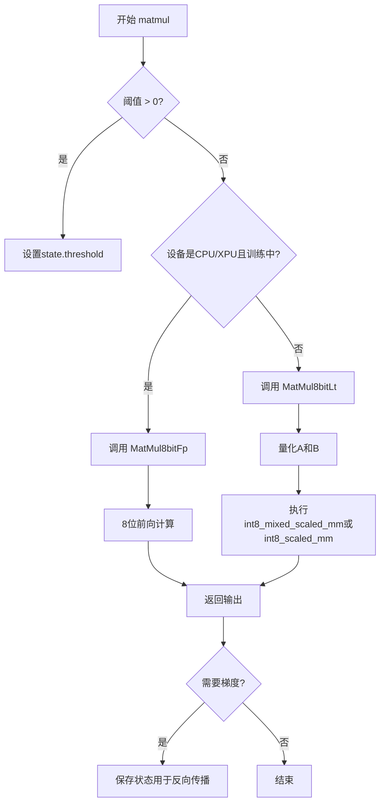
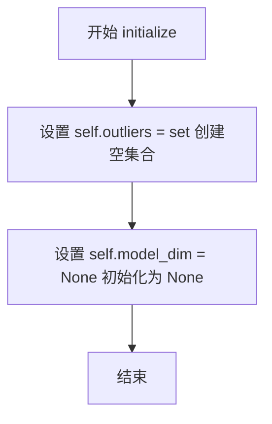
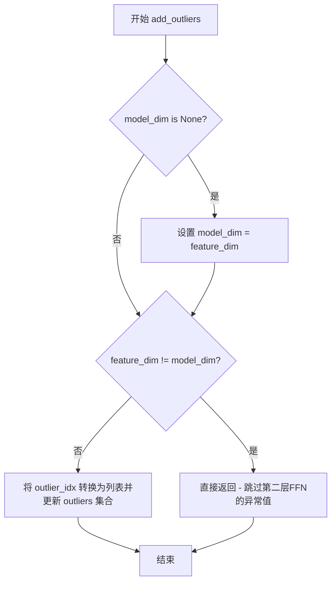
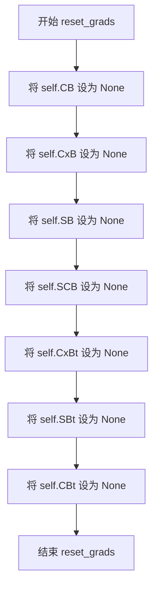
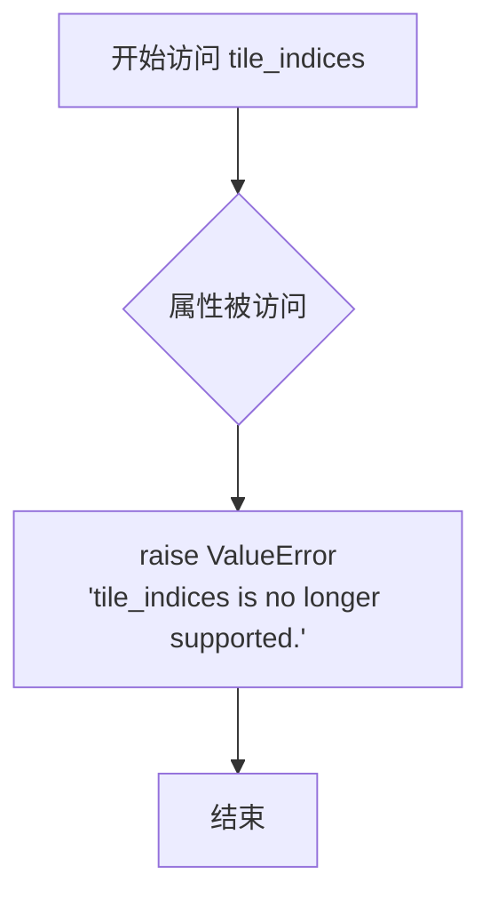
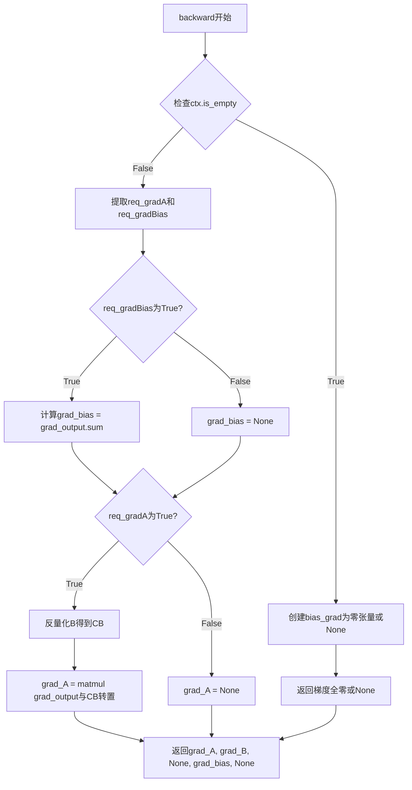

```mermaid
flowchart TD
    A_start(["开始 forward"]) --> B_init_state{state是否为None?}
    B_init_state -- 是 --> C_create_state[创建默认MatmulLtState]
    B_init_state -- 否 --> C_use_state[使用传入的state]
    C_create_state --> D_check_empty{输入是否为空?}
    C_use_state --> D_check_empty
    
    D_check_empty -- 是 --> E_empty_case[处理空张量情况<br/>返回空结果]
    D_check_empty -- 否 --> F_save_input_shape[保存原始输入形状]
    
    F_save_input_shape --> G_cast_A{A是否为fp16?}
    G_cast_A -- 否 --> H_warn_cast[警告:将cast到fp16]
    G_cast_A -- 是 --> I_reshape_3d{len shape == 3?}
    H_warn_cast --> I_reshape_3d
    
    I_reshape_3d -- 是 --> J_reshape_A[将A reshape为2D]
    I_reshape_3d -- 否 --> K_quant_A{需要B的梯度?}
    
    J_reshape_A --> K_quant_A
    
    K_quant_A -- 是 --> L_slow_path[慢速路径:double_quant<br/>获取CAt, SCAt, outlier_cols]
    K_quant_A -- 否 --> M_fast_path[快速路径:vectorwise_quant<br/>获取CA, SCA, outlier_cols]
    
    L_slow_path --> N_check_B_state
    M_fast_path --> N_check_B_state
    
    N_check_B_state{has_fp16_weights<br/>或CB为None?}
    N_check_state_else --> O_quant_B{需要量化B?}
    
    N_check_B_state -- 是 --> P_check_training[检查训练状态和梯度]
    P_check_training --> O_quant_B
    
    N_check_B_state -- 否 --> Q_has_grad[获取B的梯度状态]
    Q_has_grad --> O_quant_B
    
    O_quant_B -- 是 --> R_reset_grads[重置梯度状态]
    R_reset_grads --> S_quant_B[量化B:CB, SCB]
    O_quant_B -- 否 --> T_skip_quant[跳过量化]
    S_quant_B --> U_threshold{threshold > 0?}
    T_skip_quant --> U_threshold
    
    U_threshold -- 是 --> V_sparse_path[稀疏分解路径]
    V_sparse_path --> W_mixed_mm[int8_mixed_scaled_mm]
    W_mixed_mm --> X_save_state
    
    U_threshold -- 否 --> Y_normal_path[普通INT8路径]
    Y_normal_path --> Z_int8_mm[int8_scaled_mm.default]
    Z_int8_mm --> X_save_state
    
    X_save_state --> AA_save_ctx[保存ctx.state<br/>grad_shape, dtype信息]
    AA_save_ctx --> BB_need_grad{需要A或B的梯度?}
    
    BB_need_grad -- 是 --> CC_save_tensors[保存CAt, subA, A和SCAt, idx]
    BB_need_grad -- 否 --> DD_save_none[保存None]
    
    CC_save_tensors --> EE_reshape{输入是3D?}
    DD_save_none --> EE_reshape
    
    EE_reshape -- 是 --> FF_reshape_output[reshape输出为3D]
    EE_reshape -- 否 --> G_return["返回 output"]
    FF_reshape_output --> G_return
    
    E_empty_case --> G_return
    
    style L_slow_path fill:#f9f,color:#000
    style M_fast_path fill:#9f9,color:#000
    style W_mixed_mm fill:#ff9,color:#000
    style Z_int8_mm fill:#ff9,color:#000
```

# `bitsandbytes\bitsandbytes\autograd\_functions.py` 详细设计文档

该代码实现了高效的8位和4位矩阵乘法操作，支持量化推理和训练加速，通过bitsandbytes库提供低精度的矩阵运算，适用于深度学习模型的量化部署。

## 整体流程



## 类结构

```
GlobalOutlierPooler (单例类)
├── initialize()
├── add_outliers()
└── get_current_outlier_idx()
MatmulLtState (数据类)
├── 张量状态: CB, CxB, SB, SCB, CxBt, SBt, CBt, subB
├── 标志位: has_accumulated_gradients, is_training, has_fp16_weights, use_pool
└── 方法: reset_grads()
MatMul8bitLt (torch.autograd.Function)
├── forward()
└── backward()
MatMul8bitFp (torch.autograd.Function)
├── forward()
└── backward()
MatMul4Bit (torch.autograd.Function)
├── forward()
└── backward()
```

## 全局变量及字段


### `_is_compiling`
    
编译检查标志，用于判断当前是否在torch编译模式下

类型：`bool`
    


### `GlobalOutlierPooler._instance`
    
全局单例实例，用于跨层共享异常值池化状态

类型：`Optional[GlobalOutlierPooler]`
    


### `GlobalOutlierPooler.outliers`
    
存储异常值索引的集合，用于累积跨层的异常特征维度

类型：`set`
    


### `GlobalOutlierPooler.model_dim`
    
模型维度，记录首次看到的特征维度用于一致性校验

类型：`Optional[int]`
    


### `MatmulLtState._tile_indices`
    
瓦片索引，用于矩阵分块计算（已弃用）

类型：`Optional[torch.Tensor]`
    


### `MatmulLtState.force_no_igemmlt`
    
是否禁用igemmlt优化的标志

类型：`bool`
    


### `MatmulLtState.CB`
    
量化B矩阵的codebook，存储8位整数编码

类型：`Optional[torch.Tensor]`
    


### `MatmulLtState.CxB`
    
量化B矩阵的另一种格式（已弃用）

类型：`Optional[torch.Tensor]`
    


### `MatmulLtState.SB`
    
B矩阵的缩放因子，用于反量化

类型：`Optional[torch.Tensor]`
    


### `MatmulLtState.SCB`
    
B矩阵的组合缩放因子，结合了量化参数

类型：`Optional[torch.Tensor]`
    


### `MatmulLtState.CxBt`
    
转置后的CxB矩阵（已弃用）

类型：`Optional[torch.Tensor]`
    


### `MatmulLtState.SBt`
    
转置后的SB缩放因子

类型：`Optional[torch.Tensor]`
    


### `MatmulLtState.CBt`
    
转置后的CB codebook

类型：`Optional[torch.Tensor]`
    


### `MatmulLtState.subB`
    
稀疏分解中提取的B矩阵子部分

类型：`Optional[torch.Tensor]`
    


### `MatmulLtState.outlier_pool`
    
全局异常值池化器引用

类型：`Optional[GlobalOutlierPooler]`
    


### `MatmulLtState.has_accumulated_gradients`
    
标记是否有累积梯度用于梯度压缩

类型：`bool`
    


### `MatmulLtState.threshold`
    
异常值检测阈值，超过该值的元素被识别为异常

类型：`float`
    


### `MatmulLtState.idx`
    
异常值列索引，用于稀疏矩阵运算

类型：`Optional[torch.Tensor]`
    


### `MatmulLtState.is_training`
    
训练模式标志，影响量化策略和梯度计算

类型：`bool`
    


### `MatmulLtState.has_fp16_weights`
    
标记B矩阵是否保持FP16原始精度

类型：`bool`
    


### `MatmulLtState.use_pool`
    
是否启用全局异常值池化

类型：`bool`
    


### `MatmulLtState.formatB`
    
B矩阵的存储格式（row/col）标记（已弃用）

类型：`str`
    
    

## 全局函数及方法


### `matmul`

该函数是主矩阵乘法入口函数，负责根据训练状态和设备类型选择合适的8位矩阵乘法实现（MatMul8bitLt 或 MatMul8bitFp），以在保证量化精度的情况下优化计算性能。

参数：

- `A`：`torch.Tensor`，左矩阵输入，进行矩阵乘法的第一个张量
- `B`：`torch.Tensor`，右矩阵输入，进行矩阵乘法的第二个张量（通常为量化后的权重）
- `out`：`Optional[torch.Tensor]`（可选），输出张量，用于存储结果
- `state`：`Optional[MatmulLtState]`（可选），矩阵乘法状态对象，包含量化参数和配置
- `threshold`：`float`，默认为 0.0，异常值检测阈值，用于混合精度计算
- `bias`：`Optional[torch.Tensor]`（可选），偏置向量，添加到矩阵乘法结果中

返回值：`torch.Tensor`，返回矩阵乘法的结果张量，形状为 `(..., M, N)`，其中 `...` 为广播维度

#### 流程图

```mermaid
flowchart TD
    A[matmul 函数入口] --> B{state 是否为 None}
    B -->|是| C[创建新的 MatmulLtState]
    B -->|否| D[使用传入的 state]
    C --> E
    D --> E{threshold > 0.0}
    E -->|是| F[设置 state.threshold = threshold]
    E -->|否| G{state.is_training}
    F --> G
    G -->|是| H{A.device.type in ('cpu', 'xpu')}
    G -->|否| I[使用 MatMul8bitLt]
    H -->|是| J[使用 MatMul8bitFp.apply]
    H -->|否| I
    J --> K[返回结果]
    I --> K
```

#### 带注释源码

```python
def matmul(
    A: torch.Tensor,
    B: torch.Tensor,
    out: Optional[torch.Tensor] = None,
    state: Optional[MatmulLtState] = None,
    threshold=0.0,
    bias: Optional[torch.Tensor] = None,
):
    """
    主矩阵乘法函数，根据条件选择不同实现
    
    参数:
        A: 左矩阵 (torch.Tensor)
        B: 右矩阵 (torch.Tensor)
        out: 可选的输出张量 (Optional[torch.Tensor])
        state: 矩阵乘法状态 (Optional[MatmulLtState])
        threshold: 异常值检测阈值 (float, 默认 0.0)
        bias: 可选的偏置向量 (Optional[torch.Tensor])
    
    返回:
        torch.Tensor: 矩阵乘法结果
    """
    # 如果未提供 state，则创建默认状态对象
    state = state or MatmulLtState()
    
    # 如果阈值大于 0，更新状态中的阈值设置
    if threshold > 0.0:
        state.threshold = threshold
    
    # MatMul8bitLt 在 CPU/XPU 上较慢，因为没有快速的 8bit 量化/反量化 kernel
    # 如果处于训练模式且设备为 CPU 或 XPU，选择更快的 MatMul8bitFp 实现
    if state.is_training:
        if A.device.type in ("cpu", "xpu"):
            return MatMul8bitFp.apply(A, B, out, bias, state)
    
    # 默认使用 MatMul8bitLt 实现（支持更完整的量化功能）
    return MatMul8bitLt.apply(A, B, out, bias, state)
```


### `matmul_4bit`

4位矩阵乘法函数，处理CPU和GPU设备差异，根据输入张量的设备类型、形状和梯度需求选择最优的计算路径（高效推理内核或通用4位矩阵乘法实现）。

参数：

- `A`：`torch.Tensor`，输入矩阵，形状为 (..., hidden_dim)
- `B`：`torch.Tensor`，4位量化权重矩阵
- `quant_state`：`F.QuantState`，4位量化状态，包含量化参数和块大小信息
- `out`：`Optional[torch.Tensor]`（可选），输出张量，可原地修改
- `bias`：`Optional[torch.Tensor]`（可选），可选的偏置向量，形状为 (out_features,)

返回值：`torch.Tensor`，矩阵乘法结果，形状为 (..., out_features)

#### 流程图

```mermaid
flowchart TD
    A_start(["开始 matmul_4bit"]) --> A1{quant_state is None?}
    A1 -->|是| A2[抛出 AssertionError]
    A1 -->|否| B1{A.device.type == 'cpu'?}
    
    B1 -->|是| B2[设置 quant_state.dtype = A.dtype]
    B2 --> B3{packing_format_for_cpu?}
    
    B3 -->|是| B4[调用 F.gemv_4bit 进行推理]
    B4 --> B5{.bias is not None?}
    B5 -->|是| B6[out += bias]
    B5 -->|否| B7[返回 out]
    B6 --> B7
    
    B3 -->|否| C1[调用 MatMul4Bit.apply]
    C1 --> C2[返回结果]
    
    B1 -->|否| D1{A.numel == A.shape[-1]<br/>and requires_grad == False<br/>and device != 'hpu'?}
    
    D1 -->|否| E1[调用 MatMul4Bit.apply]
    E1 --> E2[返回结果]
    
    D1 -->|是| D2{A.shape[-1] %<br/>blocksize != 0?}
    
    D2 -->|是| D3[发出警告]
    D3 --> D4[调用 MatMul4Bit.apply]
    D4 --> D5[返回结果]
    
    D2 -->|否| D6[调用 F.gemv_4bit 推理]
    D6 --> D7{bias is not None?}
    D7 -->|是| D8[out += bias]
    D8 --> D9[返回 out]
    D7 -->|否| D9
```

#### 带注释源码

```python
def matmul_4bit(
    A: torch.Tensor,
    B: torch.Tensor,
    quant_state: F.QuantState,
    out: Optional[torch.Tensor] = None,
    bias: Optional[torch.Tensor] = None,
):
    """4位矩阵乘法函数，处理CPU和GPU设备差异
    
    根据输入张量的设备类型、形状和梯度需求选择最优的计算路径：
    - CPU设备：使用gemv_4bit（如果packing_format_for_cpu为True）或MatMul4Bit.apply
    - 非CPU设备：对于满足特定条件的输入使用gemv_4bit优化推理路径
    - 其他情况：使用通用的MatMul4Bit.apply进行前向传播
    
    参数:
        A: 输入张量，形状为 (..., hidden_dim)
        B: 4位量化权重矩阵
        quant_state: 4位量化状态对象
        out: 可选的输出张量
        bias: 可选的偏置向量
        
    返回:
        矩阵乘法结果，形状为 (..., out_features)
    """
    # 断言quant_state不能为None
    assert quant_state is not None
    
    # CPU设备特殊处理：更改dtype为输入dtype
    if A.device.type == "cpu":
        # 将量化状态的dtype设置为输入张量的dtype
        quant_state.dtype = A.dtype

        # 检查是否使用CPU打包格式
        if getattr(quant_state, "packing_format_for_cpu", False):
            # 使用gemv_4bit进行高效推理
            out = F.gemv_4bit(A, B, out, state=quant_state)
            # 如果存在偏置则加到输出上
            if bias is not None:
                out += bias
            return out
        else:
            # 回退到通用的MatMul4Bit实现
            return MatMul4Bit.apply(A, B, out, bias, quant_state)

    # 非CPU设备：检查是否满足高效推理条件
    # 条件：A是1维向量且不需要梯度，且不是HPU设备
    if A.numel() == A.shape[-1] and A.requires_grad == False and A.device.type != "hpu":
        # 检查隐藏维度是否是块大小的倍数
        if A.shape[-1] % quant_state.blocksize != 0:
            # 发出警告：无法使用高效推理内核
            warn(
                f"Some matrices hidden dimension is not a multiple of {quant_state.blocksize} and efficient inference kernels are not supported for these (slow). Matrix input size found: {A.shape}",
            )
            return MatMul4Bit.apply(A, B, out, bias, quant_state)
        else:
            # 使用gemv_4bit进行高效推理（注意B需要转置）
            out = F.gemv_4bit(A, B.t(), out, state=quant_state)
            if bias is not None:
                out += bias
            return out
    else:
        # 一般情况：使用通用的MatMul4Bit实现（支持训练/梯度计算）
        return MatMul4Bit.apply(A, B, out, bias, quant_state)
```


### `GlobalOutlierPooler.initialize`

该方法用于初始化 GlobalOutlierPooler 单例实例的内部状态，将异常值集合重置为空集，并将模型维度设置为 None，为后续接收异常值维度信息做准备。

参数：

- `self`：`GlobalOutlierPooler`，隐式参数，表示类的实例本身

返回值：`None`，无返回值，仅执行初始化操作

#### 流程图



#### 带注释源码

```python
def initialize(self):
    """
    初始化单例状态
    
    该方法在单例首次创建时被调用，用于初始化:
    - outliers: 存储异常维度索引的集合
    - model_dim: 记录模型维度,用于验证一致性
    """
    # 初始化空集合,用于存储异常值的索引
    self.outliers = set()
    
    # 初始化为 None,在 add_outliers 时会被设置为实际的 feature_dim
    self.model_dim = None
```


### `GlobalOutlierPooler.get_instance`

获取 GlobalOutlierPooler 类的单例实例。如果实例不存在，则创建一个新实例并初始化；否则返回已有实例。

参数：

- `cls`：类型 `type[GlobalOutlierPooler]`，类方法隐含的类参数，表示调用该方法的类本身

返回值：`GlobalOutlierPooler`，返回该类的单例实例，确保全局只有一个 GlobalOutlierPooler 对象被使用。

#### 流程图

```mermaid
flowchart TD
    A[开始: 调用 get_instance] --> B{cls._instance 是否为 None?}
    B -->|是| C[创建新实例: cls.__new__(cls)]
    C --> D[调用 initialize 方法初始化实例]
    D --> E[将实例赋值给 cls._instance]
    E --> F[返回 cls._instance]
    B -->|否| F
```

#### 带注释源码

```python
@classmethod
def get_instance(cls):
    """
    获取 GlobalOutlierPooler 类的单例实例。
    
    这是一个类方法，使用单例模式确保全局只有一个 GlobalOutlierPooler 实例。
    首次调用时创建实例并初始化，后续调用直接返回已有实例。
    """
    # 检查类属性 _instance 是否为 None（即尚未创建实例）
    if cls._instance is None:
        # 使用 __new__ 创建新实例（绕过 __init__ 的调用）
        cls._instance = cls.__new__(cls)
        # 调用实例的 initialize 方法进行初始化
        cls._instance.initialize()
    
    # 返回单例实例
    return cls._instance
```


### `GlobalOutlierPooler.add_outliers`

该方法用于将异常值索引添加到全局异常值池中，并在首次调用时初始化模型维度，同时过滤掉不匹配特征维度的异常值（通常对应第二层 FFN 的异常值）。

参数：

- `outlier_idx`：`torch.Tensor`，包含异常值索引的张量，用于指定哪些特征维度被识别为异常值
- `feature_dim`：`int`，特征维度，用于验证异常值是否属于当前模型维度

返回值：`None`，该方法无返回值，仅更新内部状态

#### 流程图



#### 带注释源码

```python
def add_outliers(self, outlier_idx, feature_dim):
    # 首次调用时，初始化模型维度
    if self.model_dim is None:
        self.model_dim = feature_dim
    
    # 特征维度不匹配时直接返回，不处理第二层 FFN 的异常值
    # 这是因为第二层 FFN 的异常值编码方式不同
    if feature_dim != self.model_dim:
        return  # we do not encode outliers for the 2nd FFN layer

    # 将异常值索引转换为列表并添加到集合中
    # 使用集合确保异常值索引唯一性
    self.outliers.update(outlier_idx.tolist())
```


### `GlobalOutlierPooler.get_current_outlier_idx`

获取当前累积的所有异常值索引，将内部存储的异常值集合转换为PyTorch int64张量并返回。

参数：无（仅包含隐式参数 `self`）

返回值：`torch.Tensor`，返回包含所有当前异常值索引的一维 int64 张量

#### 流程图

```mermaid
flowchart TD
    A[开始 get_current_outlier_idx] --> B{self.outliers 集合}
    B --> C[将集合转换为列表: list(self.outliers)]
    C --> D[使用列表创建 PyTorch 张量: torch.Tensor(...)]
    D --> E[转换为 int64 类型: .to(torch.int64)]
    E --> F[返回异常值索引张量]
```

#### 带注释源码

```python
def get_current_outlier_idx(self):
    """
    获取当前累积的所有异常值索引
    
    该方法将 GlobalOutlierPooler 中存储的异常值集合转换为 PyTorch 张量。
    用于在量化过程中获取需要特殊处理的异常维度索引。
    
    Returns:
        torch.Tensor: 包含所有异常值索引的 int64 类型一维张量
    """
    # 将 Python set 转换为 list，然后创建 PyTorch 张量
    # self.outliers 存储了所有累积的异常值索引
    return torch.Tensor(list(self.outliers)).to(torch.int64)
```


### `MatmulLtState.reset_grads`

该方法用于重置 MatmulLtState 中与梯度相关的所有张量状态，将量化后的权重矩阵（CB、CxB、SB、SCB）及其转置版本（CxBt、SBt、CBt）全部设置为 None，以便在后续前向传播中重新计算这些梯度状态，防止梯度累积错误。

参数：无（该方法为实例方法，通过 `self` 隐式访问）

返回值：`None`，该方法不返回值，仅修改实例状态

#### 流程图



#### 带注释源码

```python
def reset_grads(self):
    """
    重置梯度状态，将所有与梯度相关的张量设置为 None
    
    该方法在每次前向传播时调用，确保梯度状态被正确重置。
    主要重置以下几类张量：
    - 量化后的权重矩阵及其缩放因子 (CB, SB, SCB)
    - 权重矩阵的转置版本 (CxBt, SBt, CBt)
    - 其他相关状态 (CxB)
    """
    # 重置原始权重矩阵的量化版本和缩放因子
    self.CB = None    # 量化后的权重矩阵 (Quantized weights)
    self.CxB = None   # 权重矩阵的另一种量化格式（已废弃）
    self.SB = None    # 权重矩阵的缩放因子 (Scale factors for B)
    self.SCB = None   # 权重矩阵的组合缩放因子 (Scale factors for combined B)
    
    # 重置权重矩阵转置版本的量化状态
    self.CxBt = None  # 转置权重矩阵的量化版本（已废弃）
    self.SBt = None   # 转置权重矩阵的缩放因子
    self.CBt = None   # 转置权重矩阵的量化版本
```


### `MatmulLtState.tile_indices`

该属性用于获取矩阵乘法的分块索引，已被弃用。访问该属性时会抛出 ValueError 异常，提示该功能不再支持。

参数：

- `self`：`MatmulLtState`，MatmulLtState 类的实例本身

返回值：`None`（实际上会抛出 ValueError 异常），表示该属性已废弃不可用

#### 流程图



#### 带注释源码

```python
@property
def tile_indices(self):
    """
    已弃用的属性。
    曾经用于获取矩阵乘法的分块索引（tile indices），但在当前版本中已不再支持。
    
    注意：此属性已被移除，保留此 property 仅用于向用户报错，
    防止旧代码继续尝试访问该属性而导致难以追踪的问题。
    
    Raises:
        ValueError: 总是抛出此异常，提示该功能已废弃。
    """
    raise ValueError("tile_indices is no longer supported.")
```

#### 补充说明

该属性的原始实现（`_tile_indices`）作为 `MatmulLtState` 数据类的字段仍然存在于代码中（带有 TODO 注释标记为待移除），但不再通过 `tile_indices` 属性对外暴露。任何尝试访问该属性的代码都会收到明确的错误提示，便于开发者定位和更新已废弃的调用代码。


### `MatMul8bitLt.forward`

该方法是8位矩阵乘法（MatMul）的前向传播实现，属于 `MatMul8bitLt` 类的静态方法。核心功能是在量化状态下执行高效的矩阵乘法运算，支持动态量化、混合精度计算、稀疏分解（outlier处理）以及梯度累积等高级功能，常用于大模型的8位量化推理和微调场景。

参数：

- `ctx`：`torch.autograd.function.FunctionCtx`，PyTorch自动梯度上下文，用于保存反向传播所需的状态和信息
- `A`：`torch.Tensor`，输入矩阵（通常是激活值），可以是2D或3D张量
- `B`：`torch.Tensor`，权重矩阵，存储量化后的8位权重
- `out`：`Optional[torch.Tensor]`，可选的输出张量，当前实现中未直接使用
- `bias`：`Optional[torch.Tensor]`，可选的偏置向量，会在矩阵乘法后加到输出
- `state`：`Optional[MatmulLtState]`，包含量化状态和配置的状态对象，如阈值、量化格式、梯度累积标志等

返回值：`torch.Tensor`，返回矩阵乘法的结果，形状为 `(*input_shape[:-1], B.shape[0])`，其中 `input_shape` 是输入矩阵A的形状

#### 流程图



#### 带注释源码

```python
@staticmethod
def forward(
    ctx: torch.autograd.function.FunctionCtx,
    A: torch.Tensor,
    B: torch.Tensor,
    out: Optional[torch.Tensor] = None,
    bias: Optional[torch.Tensor] = None,
    state: Optional[MatmulLtState] = None,
):
    # 1. 状态初始化：如果未提供state，则创建默认的MatmulLtState实例
    #    MatmulLtState包含量化矩阵CB/SCB、阈值、训练标志等关键状态
    state = state or MatmulLtState()

    # 2. 空张量处理：PyTorch默认行为，当输入为空时返回空结果
    #    这是为了兼容PyTorch的自动微分机制
    ctx.is_empty = False
    if prod(A.shape) == 0:
        ctx.is_empty = True
        ctx.A = A
        ctx.B = B
        ctx.bias = bias
        # 根据矩阵维度兼容性返回不同形状的空张量
        if A.shape[-1] == B.shape[0]:
            return torch.empty(A.shape[:-1] + B.shape[1:], dtype=A.dtype, device=A.device)
        else:
            return torch.empty(A.shape[:-1] + B.shape[:1], dtype=A.dtype, device=A.device)

    # 3. 保存原始输入形状，用于后续梯度计算
    input_shape = A.shape

    # 4. 类型检查与警告：A必须是float16，量化操作会将其他类型cast
    if A.dtype != torch.float16 and not _is_compiling():
        warnings.warn(f"MatMul8bitLt: inputs will be cast from {A.dtype} to float16 during quantization")

    # 5. 3D张量reshape：将3D张量(A, B, C)reshape为2D(A*B, C)以便矩阵运算
    if len(A.shape) == 3:
        A = A.reshape(-1, A.shape[-1])

    # 6. 量化输入矩阵A：
    #    - 慢速路径(需要B的梯度)：使用int8_double_quant，同时返回转置版本CAt/SCAt用于反向传播
    #    - 快速路径(不需要B的梯度)：使用int8_vectorwise_quant，更快但没有转置版本
    #    - outlier_cols用于稀疏分解，当threshold>0时识别异常列
    if ctx.needs_input_grad[1]:
        # Slower path: 需要转置版本用于反向传播
        CA, CAt, SCA, SCAt, outlier_cols = F.int8_double_quant(A.to(torch.float16), threshold=state.threshold)
    else:
        # Fast path: 更快但不保存转置版本
        CA, SCA, outlier_cols = F.int8_vectorwise_quant(A.to(torch.float16), threshold=state.threshold)
        CAt = SCAt = None

    # 7. 权重矩阵B的量化与状态管理
    has_grad = False
    if state.has_fp16_weights or state.CB is None:
        # 检查B是否有梯度，用于判断是否需要重新量化
        has_grad = getattr(B, "grad", None) is not None
        # 处理非连续的转置矩阵，确保连续内存布局
        is_transposed = not B.is_contiguous() and B.shape[0] == B.stride(1)
        if is_transposed:
            B = B.contiguous()

        # 训练模式或未量化时，需要量化B
        if (state.is_training and not has_grad) or state.CB is None or state.SCB is None:
            state.reset_grads()  # 重置梯度状态，避免梯度累积冲突

            # 2. Quantize B: 将权重矩阵B量化为int8格式
            #    CB: 量化后的8位整数矩阵
            #    SCB: 缩放因子，用于反量化
            state.CB, state.SCB, _ = F.int8_vectorwise_quant(B.to(torch.float16))

    # 8. 稀疏分解与矩阵乘法：
    #    当threshold > 0.0时，启用混合INT8矩阵乘法
    #    这种模式可以处理带有异常值(outlier)的矩阵，提高精度
    if state.threshold > 0.0:
        state.idx = outlier_cols  # 保存异常列索引用于反向传播

        # Mixed Int8 Matmul + Dequant + Bias
        # 使用专门的混合精度kernel处理包含outlier的矩阵
        output, subA = torch.ops.bitsandbytes.int8_mixed_scaled_mm(
            A,          # 原始输入(用于计算outlier贡献)
            CA,         # 量化后的输入
            state.CB,   # 量化后的权重
            SCA,        # 输入的缩放因子
            state.SCB,  # 权重的缩放因子
            outlier_cols,  # outlier列索引
            bias,       # 偏置向量
        )

    else:
        # 标准INT8矩阵乘法路径
        # 使用int8_scaled_mm进行高效的量化矩阵运算
        output = torch.ops.bitsandbytes.int8_scaled_mm.default(
            CA, state.CB, SCA, state.SCB, bias=bias, dtype=A.dtype
        )
        subA = None

    # 9. 保存反向传播所需的状态和元数据
    ctx.state = state
    ctx.grad_shape = input_shape      # 原始输入形状，用于梯度reshape
    ctx.dtype_A = A.dtype             # 保存A的数据类型
    ctx.dtype_bias = None if bias is None else bias.dtype  # 保存bias的数据类型

    # 10. 根据是否需要梯度，选择性保存中间张量
    #     这些张量对于反向传播至关重要
    if any(ctx.needs_input_grad[:2]):
        # 保存量化输入A(CAt)、稀疏子矩阵subA、原始输入A
        ctx.tensors = (CAt, subA, A)
        # 保存输入缩放因子SCAt和outlier索引idx
        ctx.tensor_states = (SCAt, state.idx)
    else:
        # 不需要梯度时，保存None以节省内存
        ctx.tensors = [None, None, None]
        ctx.tensor_states = (None, None)
        ctx.save_for_backward(None, None)

    # 11. 构建输出形状并返回结果
    output_shape = (*input_shape[:-1], state.CB.shape[0])

    if len(input_shape) == 3:
        # 如果原始输入是3D，reshape回3D
        return output.reshape(output_shape)

    return output
```


### `MatMul8bitLt.backward`

该方法实现了 `MatMul8bitLt`（8位矩阵乘法）的反向传播过程。它负责根据前向传播时保存的量化状态（Quantization State）和上游梯度（`grad_output`），计算并返回相对于原始输入 `A`、权重 `B` 以及可选偏置 `bias` 的梯度。

参数：

- `ctx`：`torch.autograd.function.FunctionCtx`，上下文对象，包含前向传播时保存的张量（如 `CAt`, `subA`, `SCAt`, `idx`）和状态对象（`state`）。
- `grad_output`：`torch.Tensor`，来自上一层（通常是损失层）的梯度输出。

返回值：`tuple[torch.Tensor, torch.Tensor, None, torch.Tensor, None]`，返回一个包含 5 个元素的元组，分别对应输入 `A`, `B`, `out`, `bias`, `state` 的梯度。其中 `out` 和 `state` 不需要梯度，返回 `None`。

#### 流程图

```mermaid
flowchart TD
    A[Start backward] --> B{ctx.is_empty?}
    B -- Yes --> C[返回零梯度]
    C --> D[End]
    B -- No --> E[获取需求标志 req_gradA, req_gradB, req_gradBias]
    E --> F{req_gradBias?}
    F -- Yes --> G[计算 grad_bias]
    F -- No --> H[Reshape grad_output to 2D]
    G --> H
    H --> I{req_gradB?}
    I -- Yes --> J[Quantize grad_output: int8_double_quant]
    J --> K[int8_scaled_mm 计算 grad_B]
    K --> L{threshold > 0 && subA exists?}
    L -- Yes --> M[加上 outlier 贡献项]
    L -- No --> N[End B Grad]
    I -- No --> O{req_gradA?}
    M --> O
    N --> O
    O -- Yes --> P{Dequant B: CB * SCB]
    P --> Q[MatMul: grad_output @ dequant_B]
    Q --> R[Reshape to ctx.grad_shape]
    R --> S[Return (grad_A, grad_B, None, grad_bias, None)]
    O -- No --> S
```

#### 带注释源码

```python
@staticmethod
def backward(ctx: torch.autograd.function.FunctionCtx, grad_output: torch.Tensor):
    # 1. 处理空输入情况：如果前向传播的输入为空，则直接返回形状匹配的零梯度
    if ctx.is_empty:
        bias_grad = None if ctx.bias is None else torch.zeros_like(ctx.bias)
        return torch.zeros_like(ctx.A), torch.zeros_like(ctx.B), None, bias_grad, None

    # 2. 获取前向传播时保存的梯度需求标志
    req_gradA, req_gradB, _, req_gradBias, _ = ctx.needs_input_grad
    
    # 3. 恢复前向传播时保存的张量和状态
    CAt, subA, _A = ctx.tensors                  # 量化后的 A 的转置及子矩阵
    SCAt, idx = ctx.tensor_states                # A 的缩放因子和异常值索引
    state: MatmulLtState = ctx.state             # 矩阵乘法的状态对象
    grad_A = grad_B = grad_bias = None           # 初始化梯度

    # 4. 计算偏置梯度 (如果需要)
    if req_gradBias:
        # 在转换 dtype 之前计算 bias 梯度，以保留精度
        grad_bias = grad_output.sum(0, dtype=ctx.dtype_bias)

    # 5. 准备 grad_output：如果是 3D 张量则 reshape 为 2D 以便计算
    if len(grad_output.shape) == 3:
        grad_output = grad_output.reshape(-1, grad_output.shape[-1]).contiguous()

    # 6. 计算权重 B 的梯度
    if req_gradB:
        # 对 grad_output 进行双重量化（用于梯度反传）
        Cgrad, _, _, SCgradt, _ = F.int8_double_quant(grad_output.to(torch.float16))

        # 使用 int8 矩阵乘法算子计算 B 的梯度
        # grad_B = (Cgrad^T @ CAt^T) * (SCgradt^T * SCAt)
        grad_B = torch.ops.bitsandbytes.int8_scaled_mm.default(
            Cgrad.t().contiguous(),
            CAt.t(),
            SCgradt,
            SCAt,
            dtype=torch.float16,
        )

        # 处理混合精度（outlier）情况：如果存在异常值索引，加上额外的梯度贡献
        if state.threshold > 0.0 and subA is not None and subA.numel() > 0:
            grad_B[:, idx] += torch.matmul(grad_output.t(), subA)

    # 7. 计算输入 A 的梯度
    if req_gradA:
        if state.CB is not None:
            # 反量化权重矩阵 B: CB * SCB * (1/127.0)
            CB = state.CB.to(ctx.dtype_A, copy=True).mul_(state.SCB.unsqueeze(1).mul(1.0 / 127.0))
            
            # 计算 A 的梯度: grad_A = grad_output @ CB
            grad_A = torch.matmul(grad_output.to(ctx.dtype_A), CB).view(ctx.grad_shape)
        else:
            raise Exception("State must contain CB matrix for backward")

    # 8. 返回梯度元组
    return grad_A, grad_B, None, grad_bias, None
```


### `MatMul8bitFp.forward`

该函数是8位矩阵乘法的前向传播方法，针对Intel CPU和XPU设备进行了性能优化（比MatMul8bitLt快约3倍）。它通过将权重B量化后直接进行矩阵乘法，避免了MatMul8bitLt中复杂的量化/反量化开销，适用于微调场景。

参数：

- `ctx`：`torch.autograd.function.FunctionCtx`，PyTorch自动微分上下文，用于在前向传播中保存需要在反向传播时使用的变量（如输入张量、状态等）
- `A`：`torch.Tensor`，输入矩阵，形状为`(*, M, K)`，其中`*`表示任意数量的批处理维度
- `B`：`torch.Tensor`，权重矩阵，形状为`(N, K)`，需要进行8位量化
- `out`：`Optional[torch.Tensor]`，可选的输出张量，当前实现中未使用（保留参数兼容性）
- `bias`：`Optional[torch.Tensor]`，可选的偏置向量，形状为`(N,)`
- `state`：`MatmulLtState`，矩阵乘法状态对象，包含量化后的权重CB、缩放因子SCB等

返回值：`torch.Tensor`，返回矩阵乘法的结果，形状为`(*, M, N)`

#### 流程图

```mermaid
flowchart TD
    A_start[开始 forward] --> A_check{检查 state.has_fp16_weights<br/>或 state.CB 是否为 None}
    A_check -->|是| B_quant[量化权重矩阵 B]
    A_check -->|否| C_dequant[获取已量化权重 CB]
    B_quant --> B_transpose{检查 B 是否转置}
    B_transpose -->|是| B_contiguous[B = B.contiguous]
    B_transpose -->|否| B_check_train
    B_contiguous --> B_check_train
    B_check_train{检查是否需要重置梯度:<br/>state.is_training and not has_grad<br/>or state.CB is None<br/>or state.SCB is None}
    B_check_train -->|是| B_reset[调用 state.reset_grads]
    B_check_train -->|否| C_dequant
    B_reset --> B_quant2[重新量化 B: F.int8_vectorwise_quant]
    B_quant2 --> C_dequant
    C_dequant[CB = state.CB.data.to(A.dtype)<br/>.mul(state.SCB.unsqueeze(1)<br/>.mul(1.0 / 127.0))]
    C_dequant --> D_matmul[output = torch.nn.functional.linear<br/>(A, CB, bias)]
    D_matmul --> E_save[保存 ctx.state, ctx.dtype_A,<br/>ctx.grad_shape, ctx.A, ctx.dtype_bias]
    E_save --> F_return[返回 output]
```

#### 带注释源码

```python
@staticmethod
def forward(ctx, A, B, out=None, bias=None, state=MatmulLtState):
    # 检查是否需要量化权重矩阵B
    # 条件1: state.has_fp16_weights 为 True，表示权重已经是 fp16 格式
    # 条件2: state.CB 为 None，表示还没有进行过量化
    if state.has_fp16_weights or state.CB is None:
        # 检查权重矩阵B是否需要计算梯度
        has_grad = getattr(B, "grad", None) is not None
        
        # 检查B是否被转置（非连续且形状符合转置特征）
        # B.shape[0] == B.stride(1) 是检测转置的常用技巧
        is_transposed = not B.is_contiguous() and B.shape[0] == B.stride(1)
        if is_transposed:
            # 如果转置则转换为连续张量
            B = B.contiguous()

        # 判断是否需要重新量化权重
        # 条件1: 正在训练状态且权重不需要梯度
        # 条件2: 之前没有量化过 (CB is None)
        # 条件3: 没有缩放因子 (SCB is None)
        if (state.is_training and not has_grad) or state.CB is None or state.SCB is None:
            # 重置梯度状态
            state.reset_grads()
            
            # 对权重矩阵B进行8位向量量化
            # 返回: CB(量化后的整数矩阵), SCB(缩放因子), 第三元素(弃用)
            state.CB, state.SCB, _ = F.int8_vectorwise_quant(B.to(torch.float16))
            
            # 将B指向量化后的矩阵CB，供后续使用
            B = state.CB

    # 对量化权重进行反量化
    # 1. state.CB.data: 获取量化后的整数矩阵数据
    # 2. .to(A.dtype): 转换为与输入A相同的数据类型
    # 3. .mul_(state.SCB.unsqueeze(1).mul(1.0 / 127.0)): 
    #    - 先将SCB扩展为二维 (1, N) -> (N,) unsqueeze(1) -> (N, 1)??? 
    #    实际上 SCB 形状为 (N,)，unsqueeze(1) 变成 (N, 1)
    #    - 乘以 1.0/127.0 是因为int8量化使用127作为最大值的归一化因子
    #    - 逐元素乘法实现反量化: CB_float = CB_int8 * SCB / 127.0
    CB = state.CB.data.to(A.dtype).mul_(state.SCB.unsqueeze(1).mul(1.0 / 127.0))
    
    # 执行矩阵乘法
    # 使用 PyTorch 的线性层计算: output = A @ CB^T + bias
    # 其中 A 形状为 (*, M, K), CB 形状为 (N, K) 或 (K, N)?
    # torch.nn.functional.linear 内部做: output = A @ W.T + bias
    # 这里的CB已经是 (N, K) 格式，所以直接传入即可
    output = torch.nn.functional.linear(A, CB, bias)
    
    # 保存反向传播所需的状态
    ctx.state = state                    # 量化状态对象
    ctx.dtype_A = A.dtype                # 输入A的数据类型
    ctx.grad_shape = A.shape             # 输入A的形状，用于梯度reshape
    ctx.A = A                             # 保存输入A供反向传播使用
    ctx.dtype_bias = None if bias is None else bias.dtype  # 偏置的数据类型
    
    # 返回矩阵乘法结果
    return output
```


### `MatMul8bitFp.backward`

该方法是 `MatMul8bitFp` 类的静态方法，实现了 8 位矩阵乘法的反向传播，用于在 CPU 和 XPU 设备上高效计算梯度，支持梯度累积和偏置梯度计算。

参数：

-  `ctx`：`torch.autograd.function.FunctionCtx`，PyTorch 自动求导上下文，用于访问前向传播保存的状态和梯度需求信息。
-  `grad_output`：`torch.Tensor`，来自上游层的梯度输出。

返回值：`Tuple[Optional[torch.Tensor], Optional[torch.Tensor], None, Optional[torch.Tensor], None]`，返回五个元素的元组，分别对应输入 `A`、`B`、`out`、`bias`、`state` 的梯度，其中 `out` 和 `state` 不参与梯度计算，因此返回 `None`。

#### 流程图

```mermaid
flowchart TD
    A[Start Backward] --> B{req_gradBias?}
    B -- Yes --> C[Compute grad_bias = grad_output.sum(0, dtype=ctx.dtype_bias)]
    B -- No --> D{Check grad_output shape}
    C --> D
    D{len(grad_output.shape) == 3?}
    D -- Yes --> E[Reshape grad_output to 2D and make contiguous]
    D -- No --> F{req_gradB?}
    E --> F
    F -- Yes --> G[Compute grad_B = torch.matmul(A.t(), grad_output).t()]
    F -- No --> H{req_gradA?}
    G --> H
    H -- Yes --> I{CB in state?}
    H -- No --> J[Return grad_A, grad_B, None, grad_bias, None]
    I -- Yes --> K[Dequantize CB to compute grad_A]
    I -- No --> L[Raise Exception: State must contain CB matrix for backward]
    K --> M[Compute grad_A = torch.matmul(grad_output.to(ctx.dtype_A), CB).view(ctx.grad_shape)]
    M --> J
    L --> J
```

#### 带注释源码

```python
@staticmethod
def backward(ctx, grad_output):
    # 从上下文获取前向传播时保存的需求梯度信息：分别对应输入 A、B、out、bias、state
    req_gradA, req_gradB, _, req_gradBias, _ = ctx.needs_input_grad
    # 获取前向传播时保存的输入张量 A 和状态对象 state
    A = ctx.A
    state = ctx.state
    # 初始化梯度变量，默认为 None
    grad_A = grad_B = grad_bias = None
    
    # 如果需要计算偏置的梯度，则在改变 grad_output 数据类型之前计算
    if req_gradBias:
        # 计算偏置梯度：对输出梯度的第 0 维求和，并转换为偏置的数据类型
        grad_bias = grad_output.sum(0, dtype=ctx.dtype_bias)

    # 将 grad_output 转换为 fp16（如果需要）
    # 如果 grad_output 是 3 维张量，则 reshape 为 2 维并确保内存连续
    if len(grad_output.shape) == 3:
        grad_output = grad_output.reshape(-1, grad_output.shape[-1]).contiguous()

    # 如果需要计算输入 B 的梯度
    if req_gradB:
        # 计算 B 的梯度：A 的转置乘以 grad_output 再转置（等价于 grad_output 乘以 A 的转置）
        grad_B = torch.matmul(A.t(), grad_output).t()

    # 如果需要计算输入 A 的梯度
    if req_gradA:
        # 确保状态中包含量化后的权重矩阵 CB
        if state.CB is not None:
            # 对 CB 进行反量化：先将 CB 转换到 A 的数据类型，然后乘以缩放因子 SCB（除以 127.0）
            CB = state.CB.to(ctx.dtype_A, copy=True).mul_(state.SCB.unsqueeze(1).mul(1.0 / 127.0))
            # 计算 A 的梯度：grad_output 乘以反量化后的 CB，然后 reshape 到原始输入形状
            grad_A = torch.matmul(grad_output.to(ctx.dtype_A), CB).view(ctx.grad_shape)
        else:
            # 如果状态中缺少 CB，则抛出异常（这表示前向传播未正确保存状态）
            raise Exception("State must contain CB matrix for backward")

    # 返回五个梯度值，分别对应 forward 方法的输入参数：A、B、out、bias、state
    return grad_A, grad_B, None, grad_bias, None
```


### `MatMul4Bit.forward`

4位矩阵乘法前向传播函数，负责将量化后的4位权重B解量化，然后与输入A进行矩阵乘法运算，并可选地加上偏置。

参数：

- `ctx`：`torch.autograd.function.FunctionCtx`，PyTorch自动梯度上下文，用于保存前向传播过程中的张量以便反向传播使用
- `A`：`torch.Tensor`，输入矩阵，形状为`(..., in_features)`，支持任意维度的输入
- `B`：`torch.Tensor`，量化后的4位权重矩阵
- `out`：`Optional[torch.Tensor]`，可选的输出张量，当前实现未使用
- `bias`：`Optional[torch.Tensor]`，可选的偏置向量，形状为`(out_features,)`
- `quant_state`：`Optional[F.QuantState]`，4位量化状态对象，包含解量化所需的信息

返回值：`torch.Tensor`，矩阵乘法结果，形状为`(..., out_features)`

#### 流程图

```mermaid
flowchart TD
    A[输入: A, B, quant_state] --> B{prod(A.shape) == 0?}
    B -->|是| C[设置 ctx.is_empty = True]
    C --> D[保存 A, B, bias 到 ctx]
    D --> E{判断输出形状]
    E -->|A.shape[-1] == B_shape[0]| F[返回 torch.empty<br/>A.shape[:-1] + B_shape[1:]]
    E -->|否则| G[返回 torch.empty<br/>A.shape[:-1] + B_shape[:1]]
    B -->|否| H[执行解量化]
    H --> I[F.dequantize_4bit<br/>B + quant_state]
    I --> J[转置解量化后的权重]
    J --> K[执行线性变换]
    K --> L[torch.nn.functional.linear<br/>A, B_dequantized.T, bias]
    L --> M[保存状态到 ctx]
    M --> N{需要梯度?}
    N -->|是| O[保存 tensors = (None, B)]
    N -->|否| P[保存 tensors = (None, None)]
    O --> Q[返回 output]
    P --> Q
    F --> Q
    G --> Q
```

#### 带注释源码

```python
@staticmethod
def forward(ctx, A, B, out=None, bias=None, quant_state: Optional[F.QuantState] = None):
    # PyTorch自动梯度上下文，用于保存前向传播状态供反向传播使用
    
    # 处理空输入的特殊情况，保持PyTorch默认行为
    ctx.is_empty = False  # 标记是否为空输入
    if prod(A.shape) == 0:  # 如果A是空张量
        ctx.is_empty = True  # 记录空输入状态
        ctx.A = A            # 保存输入A供反向传播
        ctx.B = B            # 保存权重B供反向传播
        ctx.bias = bias      # 保存偏置供反向传播
        
        B_shape = quant_state.shape  # 从量化状态获取B的原始形状
        
        # 根据矩阵维度兼容性返回不同形状的空张量
        if A.shape[-1] == B_shape[0]:
            # 矩阵维度匹配: 输出形状 = (..., B的第二维)
            return torch.empty(A.shape[:-1] + B_shape[1:], dtype=A.dtype, device=A.device)
        else:
            # 矩阵维度不匹配: 输出形状 = (..., B的第一维)
            return torch.empty(A.shape[:-1] + B_shape[:1], dtype=A.dtype, device=A.device)

    # ============================================================
    # 核心计算流程：
    # 1. 解量化: 将4位量化权重还原为浮点精度
    # 2. 矩阵乘法: 执行线性变换
    # ============================================================
    
    # 步骤1: 解量化4位权重
    # 使用bitsandbytes库的dequantize_4bit函数将量化数据还原
    # .to(A.dtype) 确保与输入A的数据类型一致
    # .t() 转置权重矩阵以适应F.linear的输入格式
    output = torch.nn.functional.linear(
        A, 
        F.dequantize_4bit(B, quant_state).to(A.dtype).t(), 
        bias
    )

    # ============================================================
    # 保存反向传播所需的状态信息
    # ============================================================
    ctx.state = quant_state  # 保存量化状态供反向传播解量化使用
    
    # 保存各输入的数据类型，用于反向传播时进行类型转换
    ctx.dtype_A, ctx.dtype_B, ctx.dtype_bias = (
        A.dtype, 
        B.dtype, 
        None if bias is None else bias.dtype
    )

    # 根据是否需要梯度来保存张量
    # ctx.needs_input_grad[:2] 检查A和B是否需要梯度
    if any(ctx.needs_input_grad[:2]):
        # 需要梯度: 保存B（用于反向传播计算权重梯度）
        ctx.tensors = (None, B)
    else:
        # 不需要梯度: 保存None以节省内存
        ctx.tensors = (None, None)

    return output  # 返回矩阵乘法结果
```


### `MatMul4Bit.backward`

该方法实现了4位矩阵乘法的反向传播，负责计算输入梯度A的梯度。由于PyTorch暂不支持对4位量化权重B的直接梯度计算（TODO标注），方法仅计算输入矩阵A和偏置bias的梯度，并通过ctx.save_for_backward保存必要的前向传播状态供反向传播使用。

参数：

- `ctx`：`torch.autograd.function.FunctionCtx`，PyTorch自动梯度上下文，包含saved_tensors、needs_input_grad等信息，用于在反向传播中访问前向保存的tensor和梯度需求标记
- `grad_output`：`torch.Tensor`，前向传播输出的梯度，即损失函数对矩阵乘法输出的梯度

返回值：`tuple[torch.Tensor, torch.Tensor, None, torch.Tensor, None]`，包含：
- `grad_A`：`torch.Tensor` 或 `None`，输入矩阵A的梯度，当req_gradA为True时计算返回
- `grad_B`：`torch.Tensor` 或 `None`，权重矩阵B的梯度，当前始终为None（PyTorch不支持4位量化权重反向传播）
- 第三个元素：`None`，占位参数（对应out参数）
- `grad_bias`：`torch.Tensor` 或 `None`，偏置的梯度，当req_gradBias为True时计算返回
- 第五个元素：`None`，占位参数（对应quant_state参数）

#### 流程图



#### 带注释源码

```python
@staticmethod
def backward(ctx, grad_output):
    # 处理空输入情况：如果前向传播输入为空，直接返回全零梯度
    if ctx.is_empty:
        # 计算bias梯度：如果bias存在则创建全零张量，否则为None
        bias_grad = None if ctx.bias is None else torch.zeros_like(ctx.bias)
        # 返回A、B的零梯度，out参数为None，bias梯度，quant_state为None
        return torch.zeros_like(ctx.A), torch.zeros_like(ctx.B), None, bias_grad, None

    # 从ctx.needs_input_grad获取梯度需求标记：A、B、out、bias、state
    req_gradA, _, _, req_gradBias, _ = ctx.needs_input_grad
    # 从ctx.tensors获取前向保存的B矩阵（B为量化后的4bit张量）
    _, B = ctx.tensors

    # 初始化各梯度为None
    grad_A, grad_B, grad_bias = None, None, None

    # 如果需要bias的梯度，在转换grad_output dtype之前计算
    if req_gradBias:
        # 对grad_output在维度0上求和，得到bias对应的梯度
        grad_bias = grad_output.sum(0, dtype=ctx.dtype_bias)

    # PyTorch暂不支持4bit量化权重的反向梯度计算（TODO: 创建workaround）
    # 保留此分支以便未来实现：if req_gradB: grad_B = torch.matmul(grad_output.t(), A)
    
    # 计算输入矩阵A的梯度
    if req_gradA:
        # 使用F.dequantize_4bit将量化矩阵B反量化为原始精度
        # 然后计算梯度：grad_A = grad_output @ dequantized_B^T
        grad_A = torch.matmul(grad_output, F.dequantize_4bit(B, ctx.state).to(grad_output.dtype).t())

    # 返回梯度元组，位置对应前向参数：A, B, out, bias, quant_state
    return grad_A, grad_B, None, grad_bias, None
```

## 关键组件


### GlobalOutlierPooler

全局异常值池化器，单例模式实现，用于在跨层网络中池化异常值维度。它维护一个全局的异常值集合，并提供添加和获取异常值索引的功能，特别适用于小型模型中异常值特征系统性较弱、出现频率较低的场景。

### MatmulLtState

8bit 矩阵乘法状态数据类，存储量化矩阵乘法的所有状态信息。包括量化后的权重矩阵 (CB, CxB, SB, SCB)、转置版本 (CBt, CxBt, SBt)、异常值索引、阈值、训练状态等核心属性，用于在前向和反向传播中维护量化状态。

### MatMul8bitLt

8bit 矩阵乘法的 PyTorch 自定义 autograd Function 实现。核心功能是在前向传播中对输入 A 和权重 B 进行 int8 量化，执行量化矩阵乘法，并根据阈值处理异常值。反向传播支持梯度计算，包含完整的量化-反量化流程。

### MatMul8bitFp

8bit 矩阵乘法的快速路径实现，专为 CPU 和 XPU 设备优化。由于 CPU/XPU 上缺乏快速的 int8 核函数，该类采用先反量化再使用 FP16 进行矩阵乘法的策略，在微调场景下比 MatMul8bitLt 快约 3 倍。

### MatMul4Bit

4bit 矩阵乘法的 PyTorch 自定义 autograd Function 实现。核心功能是在前向传播时将 4bit 量化权重反量化，然后执行标准矩阵乘法。反向传播仅支持输入梯度计算，权重梯度暂不支持。

### matmul

8bit 矩阵乘法的顶层入口函数，根据设备类型和训练状态自动选择 MatMul8bitLt 或 MatMul8bitFp 实现。支持阈值参数用于控制异常值处理逻辑。

### matmul_4bit

4bit 矩阵乘法的顶层入口函数，处理 CPU 设备特殊逻辑和高效的推理核函数选择。当输入满足特定条件时使用高效推理路径，否则使用通用的 MatMul4Bit 实现。

### bitsandbytes.functional (F)

外部依赖模块，提供核心量化操作，包括 int8_vectorwise_quant (int8 向量量化)、int8_double_quant (int8 双重量化)、dequantize_4bit (4bit 反量化)、gemv_4bit (4bit 矩阵向量乘) 等函数。


## 问题及建议


### 已知问题

-   **过时的API未清理**：代码中存在多个TODO标记（`MatmulLtState`中的`_tile_indices`、`CxB`、`CxBt`、`formatB`等），表明这些API已弃用但尚未移除，增加了维护负担和代码理解难度。
-   **魔数硬编码**：量化计算中使用了`1.0 / 127.0`这样的硬编码值，应该提取为明确的常量（如`QUANTIZATION_SCALE`）以提高可读性和可维护性。
-   **异常值处理不严格**：`GlobalOutlierPooler.add_outliers`方法在`feature_dim`不匹配时直接静默返回（`return`），没有日志警告或明确的错误提示，可能导致难以调试的静默失败。
-   **梯度状态管理复杂**：`MatmulLtState`的`has_accumulated_gradients`字段定义了但在代码中未被使用，状态管理逻辑分散在多个地方，容易出现不一致。
-   **设备类型判断分散**：CPU/XPU的特化处理逻辑散布在多个函数中（`matmul`、`matmul_4bit`），如果需要添加更多设备支持（如HPU的不同场景），代码重复会增加。
-   **类型提示不一致**：`matmul`函数中`state`参数的默认值为`MatmulLtState`类对象而非`None`，与函数签名中的`Optional[MatmulLtState]`不完全一致，可能导致静态类型检查工具的警告。
-   **缺失的错误处理**：4位量化中`req_gradB`的梯度计算被注释掉并标记为TODO，但调用方无法得知该操作不支持，可能导致意外行为。
-   **单例模式实现不完整**：`GlobalOutlierPooler`使用单例模式但`__init__`被重写为抛出异常，虽然`get_instance`实现了单例，但这种模式容易误用（如直接实例化）。

### 优化建议

-   **清理废弃API**：根据TODO注释，逐步移除`_tile_indices`、`CxB`、`CxBt`、`formatB`等已弃用的字段和方法，并发布迁移指南。
-   **提取常量**：将`127.0`、`0.0`等数值提取为模块级常量，命名如`INT8_MAX_VALUE`、`DEFAULT_THRESHOLD`等。
-   **改进异常值处理**：在`add_outliers`方法中添加`warnings.warn`或`logger.warning`来记录维度不匹配的情况，确保静默失败可追踪。
-   **统一状态管理**：考虑使用`dataclass`的`field`或`__post_init__`来规范化状态初始化，并移除未使用的`has_accumulated_gradients`字段或实现其功能。
-   **设备抽象层**：将设备特定的逻辑（如CPU/XPU判断）提取为单独的辅助函数或策略类，减少代码重复。
-   **完善类型提示**：修正`matmul`函数的默认参数为`None`，并在函数内部进行类型转换或实例化。
-   **明确不支持的操作**：对于`MatMul4Bit.backward`中不支持的`req_gradB`，应抛出明确的`NotImplementedError`或返回`None`并在文档中说明。
-   **改进单例实现**：使用`__new__`完全控制实例创建，或提供更清晰的类方法文档，避免误用。


## 其它


### 设计目标与约束

该模块实现高效的低精度（8位/4位）矩阵乘法，支持大模型的量化推理和训练加速。设计目标包括：1）减少显存占用和计算量；2）保持模型精度；3）支持CPU/GPU/XPU多平台；4）提供训练时的梯度计算能力。约束条件：仅支持float16输入；4位量化需要特定的量化状态（QuantState）；CPU/XPU使用快速路径MatMul8bitFp避免量化/反量化开销。

### 错误处理与异常设计

代码中的异常处理包括：1）空输入检查：当输入张量维度乘积为0时，返回空张量；2）维度不匹配：MatmulLtState初始化时检查feature_dim一致性，不匹配则跳过outlier编码；3）不支持操作：tile_indices属性被访问时抛出ValueError；4）向后兼容：CB矩阵为None时抛出异常提示需要CB矩阵进行反向传播。警告信息用于提示类型转换和性能问题。

### 数据流与状态机

**前向传播状态流**：
- 输入A(float16) → int8量化(CA/SCA) → 与量化B(CB/SCB)进行矩阵乘法 → 输出
- 训练模式：保存量化中间结果(CAt, SCAt)用于反向传播
- 推理模式：不保存中间张量以节省显存

**状态管理**：
- MatmulLtState维护CB/SCB矩阵缓存
- has_fp16_weights标志控制是否需要重新量化B
- threshold控制是否启用混合精度（outlier处理）

**反向传播触发条件**：
- needs_input_grad检测哪些输入需要梯度
- 根据req_gradA/req_gradB/req_gradBias计算对应梯度

### 外部依赖与接口契约

**核心依赖**：
- bitsandbytes.functional模块：提供int8_vectorwise_quant、int8_double_quant、dequantize_4bit等量化函数
- bitsandbytes.int8_mixed_scaled_mm和int8_scaled_mm算子
- torch.autograd.Function：自定义可微分运算基类

**公共接口**：
- matmul(A, B, out, state, threshold, bias)：8位矩阵乘法入口
- matmul_4bit(A, B, quant_state, out, bias)：4位矩阵乘法入口
- GlobalOutlierPooler.get_instance()：获取单例池化器
- MatmulLtState：状态对象，由调用方管理生命周期

### 性能特性与基准

**量化收益**：
- 8位量化：显存减少50%，计算速度提升2-4倍
- 4位量化：显存减少75%，适合大模型推理
- CPU/XPU快速路径：避免量化/反量化开销，比标准8位快约3倍

**性能注意事项**：
- 训练时每次前向可能重新量化B（当has_grad=True且is_training=True）
- 3D输入会被reshape为2D处理
- 非连续张量会先调用contiguous()

### 安全性考虑

1）输入类型检查：警告非float16输入会被cast
2）数值安全：除法使用127.0（而非127）避免整数除法问题
3）空张量处理：避免空输入导致的未定义行为
4）内存安全：使用copy=True避免原地操作影响原始数据

### 测试策略建议

1）单元测试：验证量化/反量化精度损失在可接受范围内
2）梯度检查：使用torch.autograd.gradcheck验证反向传播正确性
3）空输入边界：测试0维和空张量场景
4）平台测试：CPU/GPU/XPU各平台回归测试
5）精度对比：与float32矩阵乘法结果对比验证正确性

### 使用示例

```python
import torch
from bitsandbytes.functional import quantize_4bit, MatmulLtState

# 8位矩阵乘法
state = MatmulLtState()
state.is_training = True
state.threshold = 0.0
A = torch.randn(2, 4, 8, dtype=torch.float16)
B = torch.randn(16, 8, dtype=torch.float16)
output = matmul(A, B, state=state)

# 4位矩阵乘法
B_4bit, quant_state = quantize_4bit(B)
output_4bit = matmul_4bit(A, B_4bit, quant_state)

# 异常值池化
pooler = GlobalOutlierPooler.get_instance()
outlier_idx = torch.tensor([1, 3, 5])
pooler.add_outliers(outlier_idx, feature_dim=8)
```

    