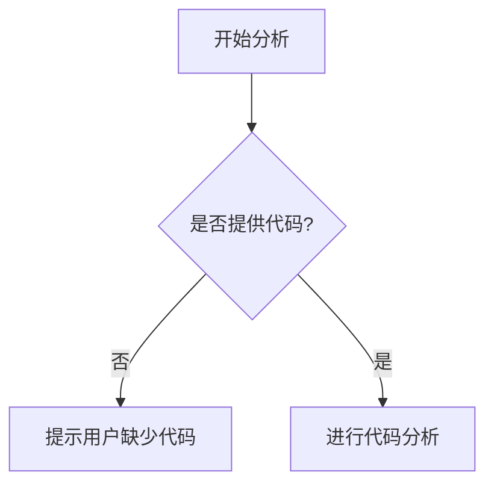

# `bitsandbytes\bitsandbytes\backends\cpu\__init__.py` 详细设计文档

未提供源代码，无法进行分析

## 整体流程



## 类结构

```

```

## 全局变量及字段


    

## 全局函数及方法


## 关键组件


### 代码输入缺失

未提供源代码进行分析。请在"代码"部分提供需要分析的源代码，以便识别关键组件并生成详细设计文档。


## 问题及建议


### 已知问题

-   未提供任何代码内容，无法进行技术债务或优化空间的分析

### 优化建议

-   请提供需要分析的源代码，以便进行详细的技术债务识别和优化建议


## 其它


### 设计目标与约束
（说明本项目的主要设计目标，如实现高并发处理、支持可扩展性、保证数据一致性等；并列出关键约束条件，例如技术栈限制、兼容性要求、法规合规、预算与时间约束等）

### 错误处理与异常设计
（描述系统整体的异常分类（如业务异常、系统异常、网络异常），异常的传播机制，统一错误码的定义方式，日志记录的策略，以及异常发生时的降级或回滚方案）

### 数据流与状态机
（用文字或状态图说明核心业务对象的状态转换过程，事件驱动的流程，数据在各模块之间的流动路径，以及状态机的入口、出口和异常状态处理）

### 外部依赖与接口契约
（列出项目所依赖的外部服务、第三方库或 Open API，说明每个依赖的接口签名、调用协议、版本要求、超时与重试策略、容错处理以及契约的变更管理方式）

### 性能要求
（明确系统的响应时间、吞吐量、并发用户数、资源利用率（CPU、内存、磁盘、网络）等性能指标，并给出相应的基准测试、压测方案以及性能瓶颈的排查方法）

### 安全性与权限
（阐述身份认证、授权、加密、审计等安全机制；列出安全合规要求（如 GDPR、PCI‑DSS），并说明防止注入、XSS、CSRF 等常见攻击的防护措施以及密钥管理方案）

### 可维护性与测试策略
（描述代码的组织结构、模块化原则、依赖注入策略；规定单元测试、集成测试、端到端测试的覆盖率要求，自动化测试框架，CI/CD 流程，以及代码审查与静态分析工具的使用）

### 部署与运维
（说明部署平台（虚拟机、容器、K8s），环境划分（开发、测试、预生产、生产），灰度发布与回滚方案，监控告警阈值，日志收集与查询，灾备与恢复策略）

### 版本控制与变更管理
（规定代码分支策略（如 GitFlow），版本号命名规范，变更审批流程，发布说明（Release Notes）模板，以及对公共接口进行版本化管理的办法）

### 日志与监控
（定义日志级别、格式、输出方式（文件、ES、Kafka），关键业务指标的监控（QPS、错误率、延迟），告警规则，故障追踪和分布式请求链路（Tracing）方案）

### 配置管理
（阐述配置文件的组织结构、环境变量的使用、配置的加载顺序、动态刷新机制以及对敏感信息（密钥、密码）的加密存储与访问控制）

### 兼容性
（说明前端/后端不同版本的兼容性策略，浏览器、操作系统、移动设备的适配范围，向后兼容/向前兼容的接口演进规则以及兼容性测试计划）

### 风险评估
（列出技术风险（如技术栈成熟度、第三方依赖安全），业务风险（如需求变更、用户增长），外部风险（如法规变更、网络攻击）并给出相应的风险缓解措施和应急预案）

### 附录与参考文献
（提供相关的技术文档链接、标准规范、术语表、参考文献以及项目相关的历史变更记录）


    