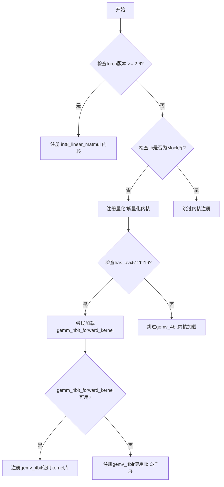
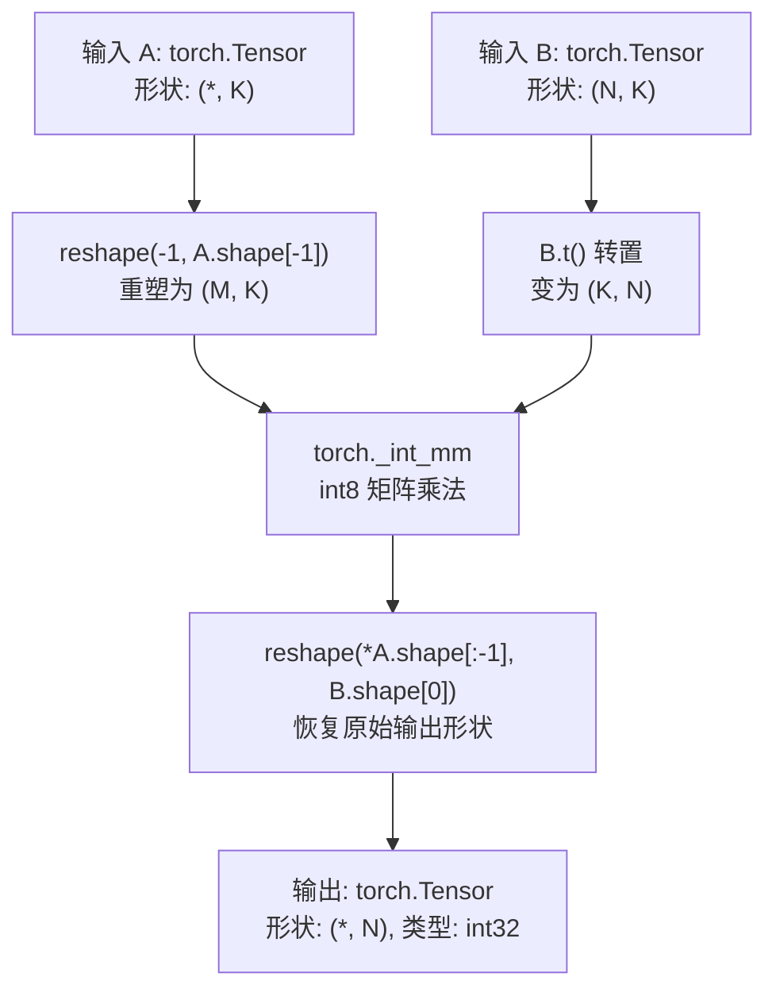
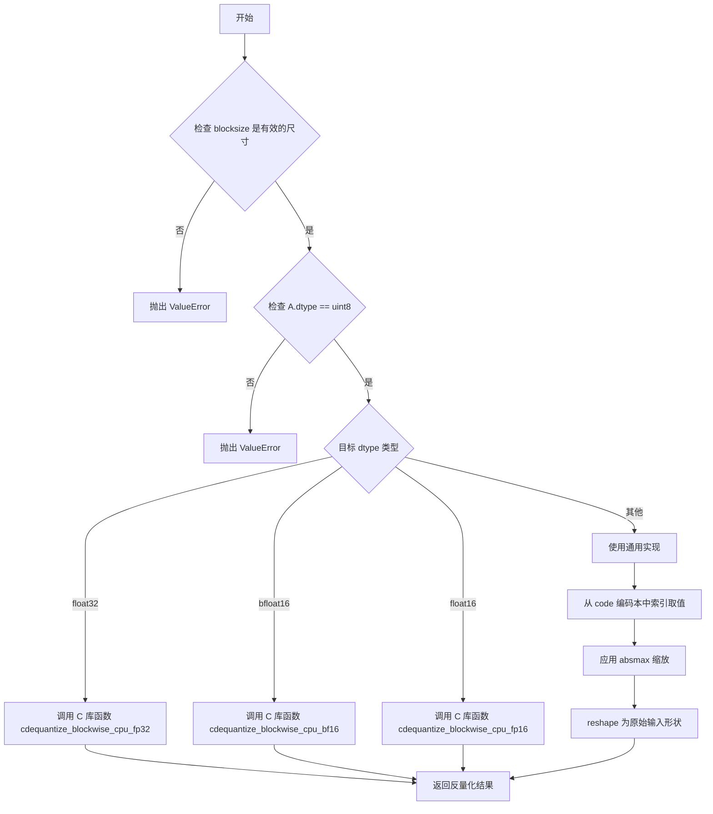
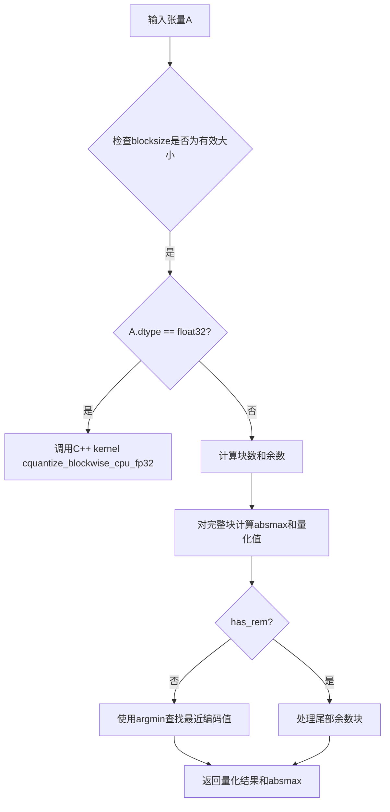
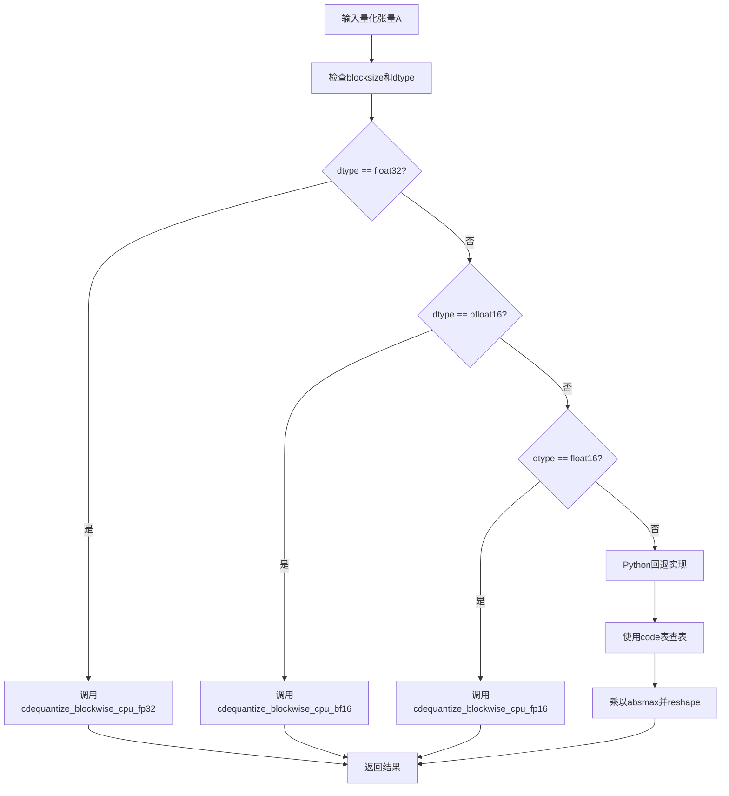
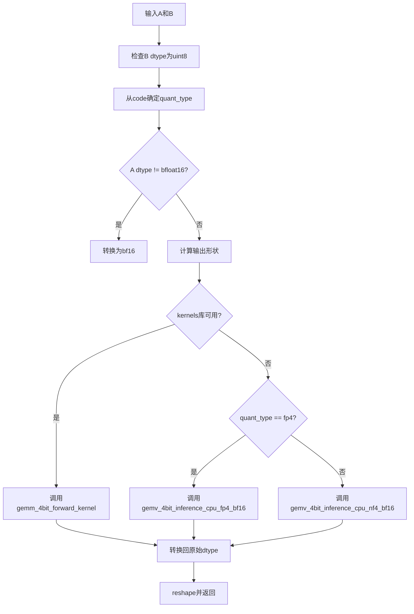

# `bitsandbytes\bitsandbytes\backends\cpu\ops.py` 详细设计文档

该文件实现了CPU上的4bit量化操作，包括块级量化/解量化、4bit解量化以及4bit矩阵向量乘法（gemv），支持NF4和FP4两种量化格式，主要用于大语言模型的量化推理场景。

## 整体流程



## 类结构

```
Global Variables
├── logger (logging.Logger)
├── _has_avx512 (bool)
└── gemm_4bit_forward_kernel (function/None)
Functions (注册为torch内核)
├── int8_linear_matmul (torch >= 2.6)
├── quantize_blockwise (非Mock库)
├── dequantize_blockwise (非Mock库)
├── dequantize_4bit (非Mock库)
└── gemv_4bit (has_avx512bf16为True)
```

## 全局变量及字段


### `logger`
    
用于记录模块日志的Logger实例

类型：`logging.Logger`
    


### `_has_avx512`
    
标记CPU是否支持AVX512指令集的布尔值

类型：`bool`
    


### `gemm_4bit_forward_kernel`
    
外部kernel库的4bit GEMM前向函数，加载失败时为None

类型：`Optional[Callable]`
    


    

## 全局函数及方法


### `bitsandbytes::int8_linear_matmul` (int8 矩阵乘法内核)

这是 bitsandbytes 库中针对 torch >= 2.6 版本的 int8 矩阵乘法内核，利用 PyTorch 原生的 `_int_mm` 算子实现高效的 int8 矩阵乘法运算。

参数：

- `A`：`torch.Tensor`，输入的 int8 矩阵（第一个操作数）
- `B`：`torch.Tensor`，输入的 int8 矩阵（第二个操作数，在内部转置后使用）

返回值：`torch.Tensor`，返回 int32 类型的矩阵乘法结果，形状为 `(*A.shape[:-1], B.shape[0])`

#### 流程图



#### 带注释源码

```python
# 仅在 PyTorch 版本 >= 2.6 时注册此内核
if torch.__version__ >= (2, 6):

    # 注册名为 "bitsandbytes::int8_linear_matmul" 的内核到 cpu 后端
    @register_kernel("bitsandbytes::int8_linear_matmul", "cpu")
    def _(A: torch.Tensor, B: torch.Tensor):
        # 使用 PyTorch 原生的 _int_mm 算子执行 int8@s8->int32 矩阵乘法
        # 1. 将 A 重塑为二维张量 (M, K)，其中 M = prod(A.shape[:-1])
        # 2. 对 B 进行转置从 (N, K) 变为 (K, N)
        # 3. 执行矩阵乘法得到 (M, N) 的 int32 结果
        # 4. 重塑回原始输出形状 (*, N)
        return torch._int_mm(
            A.reshape(-1, A.shape[-1]),  # 重塑 A 为二维 (M, K)
            B.t(),                        # 转置 B 为 (K, N)
        ).reshape(*A.shape[:-1], B.shape[0])  # 恢复输出形状 (*, N)
```


### `bitsandbytes::quantize_blockwise` (块级量化内核)

该函数是块级量化内核，用于将输入张量按块进行量化，通过找到码本中最接近的值进行离散化，并计算每块的最大绝对值(absmax)用于后续反量化。

参数：

- `A`：`torch.Tensor`，待量化的输入张量，支持任意形状和数据类型（当前主要优化支持float32）
- `code`：`torch.Tensor`，量化码本（codebook），包含离散的量化值
- `blocksize`：`int`，块大小，指定每多少个元素划分为一个块进行独立量化

返回值：`tuple[torch.Tensor, torch.Tensor]`，返回量化后的张量（uint8类型）和每块的absmax值（float32类型）

#### 流程图

```mermaid
flowchart TD
    A[开始 quantize_blockwise] --> B{检查 blocksize 是否为有效大小}
    B -->|是| C[获取输入张量 A 的元素总数 n]
    C --> D{A.dtype == torch.float32?}
    D -->|是| E[调用 C++ 优化核函数 cquantize_blockwise_cpu_fp32]
    D -->|否| F[计算块数量和尾部的剩余元素]
    F --> G[初始化 absmax 和输出张量]
    G --> H[将 A 重新形状为 n 个元素的一维张量]
    H --> I[处理完整块: 计算每块最大值并缩放到 [-1, 1]]
    I --> J{has_rem?}
    J -->|是| K[处理尾部剩余元素]
    J -->|否| L[使用码本进行最近邻查找量化]
    K --> L
    L --> M[将量化索引转换为 uint8 并reshape回原形状]
    M --> N[返回 out 和 absmax]
    E --> N
```

#### 带注释源码

```python
@register_kernel("bitsandbytes::quantize_blockwise", "cpu")
def _(A: torch.Tensor, code: torch.Tensor, blocksize: int) -> tuple[torch.Tensor, torch.Tensor]:
    # 验证 blocksize 是一个有效的尺寸值
    torch._check_is_size(blocksize)

    # 获取输入张量的总元素个数
    n = A.numel()

    # 只有 FP32 数据类型有优化的 C++ 内核实现
    if A.dtype == torch.float32:
        # 计算完整块的数量（向上取整）
        blocks = -(n // -blocksize)

        # 初始化每块的绝对最大值数组（float32类型）
        absmax = torch.empty((blocks,), device=A.device, dtype=torch.float32)
        # 初始化与输入相同形状的输出张量（uint8类型）
        out = torch.empty_like(A, dtype=torch.uint8)

        # 调用优化的 C++ 核函数进行快速量化
        # 参数：code指针, A指针, absmax指针, out指针, blocksize, 元素总数
        lib.cquantize_blockwise_cpu_fp32(
            get_ptr(code),
            get_ptr(A),
            get_ptr(absmax),
            get_ptr(out),
            ct.c_longlong(blocksize),
            ct.c_longlong(n),
        )
    else:
        # 处理非 float32 类型的通用量化路径
        rem = n % blocksize  # 尾部剩余元素数量
        has_rem = rem > 0     # 是否有尾部需要特殊处理
        blocks = n // blocksize + has_rem  # 总块数
        
        # 初始化 absmax 数组（float32）
        absmax = torch.zeros((blocks,), device=A.device, dtype=torch.float32)
        
        # 将输入张量展平为一维
        A_reshaped = A.reshape(n)
        
        # 提取完整块部分（排除尾部）
        A_com = A_reshaped[: n - rem]
        A_com_reshaped = A_com.reshape(n // blocksize, blocksize)
        
        # 计算每个完整块的最大绝对值
        absmax[: blocks - has_rem] = torch.abs(A_com_reshaped).max(dim=-1)[0]
        
        # 将数据缩放到 [-1, 1] 范围（按块归一化）
        scaled_A = torch.clamp(
            A_com_reshaped * (1 / absmax[: blocks - has_rem].view(-1, 1)), 
            -1, 1
        )
        scaled_A = scaled_A.reshape(-1)  # 展平为一维
        
        # 处理尾部剩余元素（如果有）
        if has_rem:
            # 计算尾部元素的最大绝对值
            absmax[-1] = torch.abs(A_reshaped[n - rem :]).max()
            # 缩放尾部元素到 [-1, 1]
            scaled_A_rem = torch.clamp(
                A_reshaped[n - rem :] * (1 / absmax[-1]), 
                -1, 1
            )
            # 将尾部量化结果拼接到主结果
            scaled_A = torch.cat([scaled_A, scaled_A_rem], dim=0)

        # 使用码本进行最近邻量化：
        # 计算每个缩放值与码本中所有值的距离
        diff = torch.abs(scaled_A.unsqueeze(-1) - code.to(scaled_A.device))
        
        # 找到最小距离的索引（最接近的量化值）
        out = torch.argmin(diff, dim=-1).to(torch.uint8).to(scaled_A.device).reshape(A.shape)

    # 返回量化后的张量和每块的 absmax
    return out, absmax
```


### `dequantize_blockwise`

块级解量化内核，将块级量化的 uint8 张量根据绝对最大值、编码本和块大小反量化为指定的目标数据类型（float32、bfloat16 或 float16）。

参数：

- `A`：`torch.Tensor`，输入的块级量化张量，dtype 为 uint8
- `absmax`：`torch.Tensor`，每个块的绝对最大值，用于反量化缩放
- `code`：`torch.Tensor`，量化编码本，包含量化级别的原始浮点值
- `blocksize`：`int`，块大小，指定每个块包含的元素数量
- `dtype`：`torch.dtype`，目标输出数据类型，支持 float32、bfloat16、float16

返回值：`torch.Tensor`，反量化后的张量，dtype 与指定的 dtype 参数一致

#### 流程图



#### 带注释源码

```python
@register_kernel("bitsandbytes::dequantize_blockwise", "cpu")
def _(
    A: torch.Tensor, absmax: torch.Tensor, code: torch.Tensor, blocksize: int, dtype: torch.dtype
) -> torch.Tensor:
    # 参数验证：确保 blocksize 是有效的尺寸（非负整数）
    torch._check_is_size(blocksize)
    # 参数验证：确保输入 A 是 uint8 类型（块级量化数据）
    torch._check(A.dtype == torch.uint8, lambda: f"A must be uint8, got {A.dtype}")

    # 创建与输入 A 形状相同的输出张量，dtype 为目标数据类型
    out = torch.empty_like(A, dtype=dtype)
    
    # 根据目标 dtype 选择不同的 C 库优化实现路径
    if dtype == torch.float32:
        # 调用 FP32 优化的 C 库函数进行快速解量化
        lib.cdequantize_blockwise_cpu_fp32(
            get_ptr(code),
            get_ptr(A),
            get_ptr(absmax),
            get_ptr(out),
            ct.c_longlong(blocksize),
            ct.c_longlong(A.numel()),
        )
    elif dtype == torch.bfloat16:
        # 调用 BF16 优化的 C 库函数
        lib.cdequantize_blockwise_cpu_bf16(
            get_ptr(code),
            get_ptr(A),
            get_ptr(absmax),
            get_ptr(out),
            ct.c_longlong(blocksize),
            ct.c_longlong(A.numel()),
        )
    elif dtype == torch.float16:
        # 调用 FP16 优化的 C 库函数
        lib.cdequantize_blockwise_cpu_fp16(
            get_ptr(code),
            get_ptr(A),
            get_ptr(absmax),
            get_ptr(out),
            ct.c_longlong(blocksize),
            ct.c_longlong(A.numel()),
        )
    else:
        # 通用实现路径：用于不支持直接 C 库调用的 dtype
        # 通过编码本索引获取量化值
        out = code[A.reshape(-1).int()]
        # 计算完整块数和剩余元素数
        blocks = out.shape[-1] // blocksize
        res = out.shape[-1] % blocksize
        # 如果有剩余元素，用零填充到块大小
        if res != 0:
            out = torch.nn.functional.pad(out, (0, blocksize - res), mode="constant", value=0)
        # 应用块级绝对最大值缩放：先将编码本值乘以对应的 abmax，然后转换为目标 dtype
        out = (out.view(-1, blocksize) * absmax.view(-1, 1)).to(dtype).reshape(-1)
        # 裁剪回原始元素数量
        out = out[: blocks * blocksize + res]
        # reshape 为输入的原始形状
        out = out.reshape(A.shape)

    return out
```


### `dequantize_4bit`

该函数是 `bitsandbytes::dequantize_4bit` 的 CPU 实现，负责将 4bit 量化数据（NF4 或 FP4 格式）解量化回浮点数据类型。它根据量化类型和目标数据类型调用相应的 C++ 底层库函数，支持 bfloat16、float16 和 float32 三种输出格式，并在特定条件下（如 AVX512 且 blocksize >= 2048 或奇数形状）回退到通用实现。

参数：

- `A`：`torch.Tensor`，量化后的输入张量，通常为 uint8 类型
- `absmax`：`torch.Tensor`，每个量化块的最大绝对值，用于反量化缩放
- `blocksize`：`int`，量化块大小，必须为正整数
- `quant_type`：`str`，量化类型，必须为 "nf4" 或 "fp4"
- `shape`：`Sequence[int]`，输出张量的目标形状
- `dtype`：`torch.dtype`，输出数据类型，支持 bfloat16、float16、float32

返回值：`torch.Tensor`，解量化后的浮点张量，形状为 `shape`，数据类型为 `dtype`

#### 流程图

```mermaid
flowchart TD
    A[开始 dequantize_4bit] --> B{检查 blocksize 为正整数}
    B --> C{检查 quant_type 为 nf4 或 fp4}
    C --> D{检查 dtype 支持 16/32 位浮点数}
    D --> E{AVX512 且 blocksize >= 2048<br/>且 dtype != bfloat16?}
    E -->|是| F[回退到 _dequantize_4bit_impl]
    E -->|否| G{shape[-1] 为奇数?}
    G -->|是| F
    G -->|否| H{将 A 转换为 uint8}
    H --> I{absmax 转换为 float32}
    I --> J[处理 shape 为一维的情况]
    J --> K[计算 m, n 并 reshape A]
    K --> L{分配输出张量}
    L --> M{quant_type == fp4?}
    M -->|是| N{dtype == float32?}
    M -->|否| O{dtype == float32?}
    N -->|是| P[调用 fp4_fp32 核]
    N -->|否| Q{dtype == bfloat16?}
    Q -->|是| R[调用 fp4_bf16 核]
    Q -->|否| S[调用 fp4_fp16 核]
    O -->|是| T[调用 nf4_fp32 核]
    O -->|否| U{dtype == bfloat16?}
    U -->|是| V[调用 nf4_bf16 核]
    U -->|否| W[调用 nf4_fp16 核]
    P --> X[返回 out]
    R --> X
    S --> X
    T --> X
    V --> X
    W --> X
    F --> Y[返回解量化结果]
    X --> Z[结束]
```

#### 带注释源码

```python
@register_kernel("bitsandbytes::dequantize_4bit", "cpu")
def _(
    A: torch.Tensor,              # 量化后的输入张量（uint8）
    absmax: torch.Tensor,         # 每个block的最大绝对值
    blocksize: int,               # 量化块大小
    quant_type: str,              # 量化类型："nf4" 或 "fp4"
    shape: Sequence[int],         # 输出目标形状
    dtype: torch.dtype,           # 输出数据类型
) -> torch.Tensor:
    # 检查 blocksize 是有效的正整数
    torch._check_is_size(blocksize)
    # 检查 quant_type 必须是 nf4 或 fp4
    torch._check(quant_type in ("nf4", "fp4"), lambda: f"quant_type must be nf4 or fp4, got {quant_type}")
    # 检查 dtype 支持 16/32 位浮点数
    torch._check(
        dtype in [torch.bfloat16, torch.float16, torch.float32],
        lambda: f"Blockwise 4bit dequantization only supports 16/32-bit floats, but got {dtype}",
    )

    # AVX512 实现对 fp16/fp32 和 blocksize >= 2048 有精度问题，回退到通用实现
    # 注意：这不是常见用例
    avx512_fallback = _has_avx512 and blocksize >= 2048 and dtype != torch.bfloat16

    # 奇数形状不被此内核支持，回退到通用实现
    shape_fallback = shape[-1] % 2 != 0

    # 如果需要回退，调用默认实现
    if avx512_fallback or shape_fallback:
        from ..default.ops import _dequantize_4bit_impl

        return _dequantize_4bit_impl(A, absmax, blocksize, quant_type, shape, dtype)

    # 启用非 uint8 数据类型输入（确保 A 为 uint8）
    if A.dtype != torch.uint8:
        A = A.view(torch.uint8)

    # TODO: 支持半精度 absmax（当前只支持 float32）
    if absmax.dtype != torch.float32:
        absmax = absmax.float()

    # 处理一维形状的情况
    if len(shape) == 1:
        shape = (1, shape[0])

    # 计算输出维度：m = 批量维度乘积，n = 最后一维
    m = prod(shape[:-1])
    n = shape[-1]

    # 将 A reshape 为 (m, n//2)，因为每个字节存储 2 个 4bit 值
    A = A.reshape(m, n // 2)
    # 创建输出张量
    out = torch.empty(shape, dtype=dtype, device=A.device)

    # 根据 quant_type 和 dtype 调用相应的 C++ 底层函数
    if quant_type == "fp4":
        if dtype == torch.float32:
            # FP4 -> Float32 解量化
            lib.cdequantize_blockwise_cpu_fp4_fp32(
                get_ptr(A),
                get_ptr(absmax),
                get_ptr(out),
                ct.c_longlong(blocksize),
                ct.c_longlong(m),
                ct.c_longlong(n),
            )
        elif dtype == torch.bfloat16:
            # FP4 -> BFloat16 解量化
            lib.cdequantize_blockwise_cpu_fp4_bf16(
                get_ptr(A),
                get_ptr(absmax),
                get_ptr(out),
                ct.c_longlong(blocksize),
                ct.c_longlong(m),
                ct.c_longlong(n),
            )
        elif dtype == torch.float16:
            # FP4 -> Float16 解量化
            lib.cdequantize_blockwise_cpu_fp4_fp16(
                get_ptr(A),
                get_ptr(absmax),
                get_ptr(out),
                ct.c_longlong(blocksize),
                ct.c_longlong(m),
                ct.c_longlong(n),
            )
    elif quant_type == "nf4":
        if dtype == torch.float32:
            # NF4 -> Float32 解量化
            lib.cdequantize_blockwise_cpu_nf4_fp32(
                get_ptr(A),
                get_ptr(absmax),
                get_ptr(out),
                ct.c_longlong(blocksize),
                ct.c_longlong(m),
                ct.c_longlong(n),
            )
        elif dtype == torch.bfloat16:
            # NF4 -> BFloat16 解量化
            lib.cdequantize_blockwise_cpu_nf4_bf16(
                get_ptr(A),
                get_ptr(absmax),
                get_ptr(out),
                ct.c_longlong(blocksize),
                ct.c_longlong(m),
                ct.c_longlong(n),
            )
        elif dtype == torch.float16:
            # NF4 -> Float16 解量化
            lib.cdequantize_blockwise_cpu_nf4_fp16(
                get_ptr(A),
                get_ptr(absmax),
                get_ptr(out),
                ct.c_longlong(blocksize),
                ct.c_longlong(m),
                ct.c_longlong(n),
            )
    else:
        raise ValueError

    return out
```


### `bitsandbytes::gemv_4bit` (4bit矩阵向量乘法内核)

这是一个在CPU上执行的4bit矩阵向量乘法（GEMV）内核函数，用于加速量化后的4bit权重与输入矩阵的乘法运算，支持NF4和FP4两种量化类型，并利用AVX512加速（如果可用）。

参数：

- `A`：`torch.Tensor`，输入矩阵，类型为bf16/fp16/fp32
- `B`：`torch.Tensor`，量化后的权重矩阵，必须是uint8类型
- `shapeB`：`Sequence[int]`，权重矩阵B的原始形状
- `absmax`：`torch.Tensor`，每个量化块的绝对最大值，用于反量化
- `code`：`torch.Tensor`，量化编码表（NF4或FP4的码本）
- `blocksize`：`int`，量化块大小

返回值：`torch.Tensor`，矩阵向量乘法的结果，形状为 `(*A.shape[:-1], shapeB[0])`

#### 流程图

```mermaid
flowchart TD
    A[输入 A, B, shapeB, absmax, code, blocksize] --> B{检查 B.dtype == uint8}
    B -->|否| C[抛出断言错误]
    B -->|是| D[确定量化类型: code[1] > 0 ? fp4 : nf4]
    D --> E{检查 A.dtype == bfloat16}
    E -->|否| F[将 A 转换为 bfloat16]
    E -->|是| G[保持 A 不变]
    F --> H[计算输出形状: (*A.shape[:-1], shapeB[0])]
    G --> H
    H --> I{检查 gemm_4bit_forward_kernel 是否可用}
    I -->|是| J[使用 gemm_4bit_forward_kernel 计算]
    I -->|否| K{检查 quant_type == fp4}
    K -->|是| L[调用 lib.gemv_4bit_inference_cpu_fp4_bf16]
    K -->|否| M[调用 lib.gemv_4bit_inference_cpu_nf4_bf16]
    J --> N{检查原始 dtype != bfloat16}
    L --> N
    M --> N
    N -->|是| O[将输出转换回原始 dtype]
    N -->|否| P[保持输出为 bfloat16]
    O --> Q[ reshape 为 final_out_shape 并返回]
    P --> Q
```

#### 带注释源码

```python
@register_kernel("bitsandbytes::gemv_4bit", "cpu")
def _(
    A: torch.Tensor,
    B: torch.Tensor,
    shapeB: Sequence[int],
    absmax: torch.Tensor,
    code: torch.Tensor,
    blocksize: int,
) -> torch.Tensor:
    # 验证输入权重必须是uint8类型（量化后的格式）
    assert B.dtype == torch.uint8, "Only support uint8 qweight"
    
    # 保存原始输入数据类型用于最终转换
    dtype = A.dtype
    
    # 根据code[1]判断量化类型：>0为fp4，否则为nf4
    quant_type = "fp4" if code[1] > 0 else "nf4"
    
    # CPU融合算子目前仅支持bf16，若输入不是bf16则进行转换
    if dtype != torch.bfloat16:
        A = A.to(torch.bfloat16)

    # 计算最终输出形状：保留A的前n-1维，最后一维变为shapeB[0]
    final_out_shape = (*A.shape[:-1], shapeB[0])
    
    # 将A展平为二维矩阵（批量维度合并）
    A = A.reshape(-1, A.shape[-1])
    out_shape = (*A.shape[:-1], shapeB[0])
    
    # 尝试使用优化的gemm_4bit_forward_kernel（来自kernels库）
    if gemm_4bit_forward_kernel is not None:
        # 将量化类型转换为数字：fp4=1, nf4=0
        quant_type_num = 1 if quant_type == "fp4" else 0
        # 调用优化的内核进行计算
        out = gemm_4bit_forward_kernel(A, B, absmax, blocksize, quant_type_num)
    else:
        # 回退方案：使用lib库中的gemv_4bit_inference函数
        # 分配输出张量
        out = torch.empty(out_shape, dtype=A.dtype, device=A.device)
        
        # 获取矩阵维度信息
        M = A.shape[0]    # 批量大小
        N = shapeB[0]     # 输出维度
        K = A.shape[1]    # 输入维度
        
        # 获取内存步长用于高效的批量计算
        x_strideM = A.stride(0)
        out_strideM = out.stride(0)
        
        # 根据量化类型选择对应的CUDA/AVX512内核
        if quant_type == "fp4":
            lib.gemv_4bit_inference_cpu_fp4_bf16(
                ct.c_int64(M),
                ct.c_int64(N),
                ct.c_int64(K),
                get_ptr(A),
                get_ptr(B),
                get_ptr(absmax),
                get_ptr(out),
                ct.c_int64(blocksize),
                ct.c_int64(x_strideM),
                ct.c_int64(out_strideM),
            )
        elif quant_type == "nf4":
            lib.gemv_4bit_inference_cpu_nf4_bf16(
                ct.c_int64(M),
                ct.c_int64(N),
                ct.c_int64(K),
                get_ptr(A),
                get_ptr(B),
                get_ptr(absmax),
                get_ptr(out),
                ct.c_int64(blocksize),
                ct.c_int64(x_strideM),
                ct.c_int64(out_strideM),
            )

    # 如果原始输入不是bf16，则将输出转换回原始数据类型
    if dtype != torch.bfloat16:
        out = out.to(dtype)

    # 将输出reshape为最终形状并返回
    return out.reshape(final_out_shape)
```

## 关键组件


### 张量索引与惰性加载

代码中使用codebook（code张量）进行索引来实现反量化，采用惰性加载策略只在需要时获取量化值。例如在`dequantize_blockwise`中通过`out = code[A.reshape(-1).int()]`进行索引，以及在量化过程中使用`torch.argmin(diff, dim=-1)`找到最接近的codebook条目。

### 反量化支持

代码实现了多种dtype的反量化支持，包括float32、bfloat16和float16。通过条件分支调用不同的C++内核函数（如`cdequantize_blockwise_cpu_fp32`、`cdequantize_blockwise_cpu_bf16`、`cdequantize_blockwise_cpu_fp16`），同时提供了通用Python实现作为fallback。

### 量化策略

代码支持两种主要的量化策略：int8块级量化和4位量化（nf4/fp4）。int8量化使用绝对最大值（absmax）进行缩放，4位量化使用预定义的codebook进行查找。量化过程根据输入dtype选择不同的处理路径，FP32使用C++内核，其他类型使用Python实现。

### AVX512优化与Fallback机制

代码包含针对AVX512指令集的优化检查，当检测到AVX512但blocksize>=2048且dtype不为bf16时会触发精度问题的fallback。此外，对于奇数形状（shape[-1] % 2 != 0）也会回退到通用实现。`has_avx512bf16()`函数用于检测硬件支持情况。

### 4位GEMV推理

实现了高效的4位矩阵-向量乘积推理（gemv_4bit），支持通过可选的`kernels`库加载融合内核，或使用底层的lib调用（`gemv_4bit_inference_cpu_fp4_bf16`/`gemv_4bit_inference_cpu_nf4_bf16`）。该组件会自动处理dtype转换并输出正确的shape。

### int8线性矩阵乘法

使用`torch._int_mm`实现int8@s8->s32的矩阵乘法，仅在PyTorch>=2.6时启用以避免溢出问题。该操作注册为"bitsandbytes::int8_linear_matmul"内核。

### 块级量化核心逻辑

`quantize_blockwise`函数实现了核心的块级量化逻辑：将输入张量分块，计算每块的绝对最大值，将数据缩放到[-1,1]范围，然后通过查找codebook找到最近的量化值并返回uint8索引和absmax。

## 问题及建议


### 已知问题

- **TODO未完成**：代码中存在`# TODO(matthewdouglas): aarch64?`注释，表明对aarch64架构的支持尚未实现
- **隐式假设风险**：`quant_type = "fp4" if code[1] > 0 else "nf4"`使用魔数进行类型判断，缺乏明确文档说明，易产生误解
- **硬编码的fallback条件**：`avx512_fallback`条件中`blocksize >= 2048 and dtype != torch.bfloat16`是硬编码阈值，缺乏灵活性
- **kernel加载静默失败**：当`gemm_4bit_forward_kernel`加载失败时仅记录warning，运行时可能因kernel为None导致后续调用失败
- **类型转换开销**：`absmax = absmax.float()`在每次调用时都进行转换，未考虑已为float32的情况
- **大量重复代码模式**：在`dequantize_4bit`和`quantize_blockwise`函数中，针对不同dtype的分支处理存在显著重复

### 优化建议

- 将aarch64支持列入开发计划，或在代码中明确标注为不支持的平台
- 将quant_type的判断逻辑提取为明确的常量或辅助函数，添加文档注释说明code[1]的编码规则
- 将blocksize和dtype的fallback阈值提取为配置常量，便于维护和调整
- 在kernel加载失败时增加更健壮的错误处理，或在后续调用前检查kernel可用性
- 在类型转换前添加dtype检查，避免不必要的Tensor复制操作
- 使用策略模式或字典映射将重复的dtype/quant_type分支逻辑进行重构，提高代码可维护性


## 其它


### 一段话描述

该代码是bitsandbytes库的CPU后端实现，提供了4bit和8bit量化相关的核心操作，包括int8矩阵乘法、块级量化和反量化、4bit矩阵向量乘法等功能，支持NF4和FP4量化格式，并利用AVX512指令集加速推理。

### 文件整体运行流程

代码在模块加载时首先检测CPU的AVX512支持能力和PyTorch版本，然后根据版本条件注册int8线性矩阵乘法内核。对于非模拟库，加载并注册量化/反量化内核：quantize_blockwise实现块级FP32量化和通用量化；dequantize_blockwise根据目标数据类型调用对应C++实现或Python回退；dequantize_4bit处理NF4/FP4的4bit反量化，包含AVX512和奇数形状的回退逻辑；gemv_4bit执行4bit矩阵向量乘法，优先使用kernels库的融合内核，否则回退到lib实现。

### 全局变量

#### _has_avx512

- **类型**: bool
- **描述**: 标识当前CPU是否支持AVX512指令集，通过torch.backends.cpu.get_cpu_capability()获取

#### logger

- **类型**: logging.Logger
- **描述**: 模块级日志记录器，用于输出警告和调试信息

### 全局函数

#### quantize_blockwise(A: torch.Tensor, code: torch.Tensor, blocksize: int) -> tuple[torch.Tensor, torch.Tensor]

- **参数**:
  - A: 待量化输入张量，支持float32及其他类型
  - code: 量化编码表，用于查找最接近值
  - blocksize: 块大小，指定每个absmax覆盖的元素数量
- **返回值**: tuple[torch.Tensor, torch.Tensor] - (量化后的uint8张量, 每个块的absmax值)
- **流程图**: 

- **源码**:
```python
@register_kernel("bitsandbytes::quantize_blockwise", "cpu")
def _(A: torch.Tensor, code: torch.Tensor, blocksize: int) -> tuple[torch.Tensor, torch.Tensor]:
    torch._check_is_size(blocksize)
    n = A.numel()
    # Only FP32 has c++ kernrl
    if A.dtype == torch.float32:
        blocks = -(n // -blocksize)
        absmax = torch.empty((blocks,), device=A.device, dtype=torch.float32)
        out = torch.empty_like(A, dtype=torch.uint8)
        lib.cquantize_blockwise_cpu_fp32(
            get_ptr(code),
            get_ptr(A),
            get_ptr(absmax),
            get_ptr(out),
            ct.c_longlong(blocksize),
            ct.c_longlong(n),
        )
    else:
        rem = n % blocksize
        has_rem = rem > 0
        blocks = n // blocksize + has_rem
        absmax = torch.zeros((blocks,), device=A.device, dtype=torch.float32)
        A_reshaped = A.reshape(n)
        A_com = A_reshaped[: n - rem]
        A_com_reshaped = A_com.reshape(n // blocksize, blocksize)
        absmax[: blocks - has_rem] = torch.abs(A_com_reshaped).max(dim=-1)[0]
        scaled_A = torch.clamp(A_com_reshaped * (1 / absmax[: blocks - has_rem].view(-1, 1)), -1, 1)
        scaled_A = scaled_A.reshape(-1)
        if has_rem:
            absmax[-1] = torch.abs(A_reshaped[n - rem :]).max()
            scaled_A_rem = torch.clamp(A_reshaped[n - rem :] * (1 / absmax[-1]), -1, 1)
            scaled_A = torch.cat([scaled_A, scaled_A_rem], dim=0)
        diff = torch.abs(scaled_A.unsqueeze(-1) - code.to(scaled_A.device))
        out = torch.argmin(diff, dim=-1).to(torch.uint8).to(scaled_A.device).reshape(A.shape)
    return out, absmax
```

#### dequantize_blockwise(A: torch.Tensor, absmax: torch.Tensor, code: torch.Tensor, blocksize: int, dtype: torch.dtype) -> torch.Tensor

- **参数**:
  - A: uint8量化张量
  - absmax: 每块的绝对最大值
  - code: 解码表
  - blocksize: 块大小
  - dtype: 目标数据类型
- **返回值**: torch.Tensor - 反量化后的张量
- **流程图**:

- **源码**:
```python
@register_kernel("bitsandbytes::dequantize_blockwise", "cpu")
def _(
    A: torch.Tensor, absmax: torch.Tensor, code: torch.Tensor, blocksize: int, dtype: torch.dtype
) -> torch.Tensor:
    torch._check_is_size(blocksize)
    torch._check(A.dtype == torch.uint8, lambda: f"A must be uint8, got {A.dtype}")
    out = torch.empty_like(A, dtype=dtype)
    if dtype == torch.float32:
        lib.cdequantize_blockwise_cpu_fp32(
            get_ptr(code),
            get_ptr(A),
            get_ptr(absmax),
            get_ptr(out),
            ct.c_longlong(blocksize),
            ct.c_longlong(A.numel()),
        )
    elif dtype == torch.bfloat16:
        lib.cdequantize_blockwise_cpu_bf16(
            get_ptr(code),
            get_ptr(A),
            get_ptr(absmax),
            get_ptr(out),
            ct.c_longlong(blocksize),
            ct.c_longlong(A.numel()),
        )
    elif dtype == torch.float16:
        lib.cdequantize_blockwise_cpu_fp16(
            get_ptr(code),
            get_ptr(A),
            get_ptr(absmax),
            get_ptr(out),
            ct.c_longlong(blocksize),
            ct.c_longlong(A.numel()),
        )
    else:
        out = code[A.reshape(-1).int()]
        blocks = out.shape[-1] // blocksize
        res = out.shape[-1] % blocksize
        if res != 0:
            out = torch.nn.functional.pad(out, (0, blocksize - res), mode="constant", value=0)
        out = (out.view(-1, blocksize) * absmax.view(-1, 1)).to(dtype).reshape(-1)
        out = out[: blocks * blocksize + res]
        out = out.reshape(A.shape)
    return out
```

#### dequantize_4bit(A: torch.Tensor, absmax: torch.Tensor, blocksize: int, quant_type: str, shape: Sequence[int], dtype: torch.dtype) -> torch.Tensor

- **参数**:
  - A: 4bit量化张量
  - absmax: 每块的绝对最大值
  - blocksize: 块大小
  - quant_type: 量化类型，nf4或fp4
  - shape: 输出形状
  - dtype: 目标数据类型
- **返回值**: torch.Tensor - 反量化后的张量
- **流程图**:
```mermaid
flowchart TD
    A[输入4bit张量] --> B[参数校验]
    B --> C{AVX512 + blocksize>=2048 + 非bf16?}
    C -->|是| D[回退到default实现]
    C -->|否| E{shape[-1] % 2 != 0?}
    E -->|是| D
    E -->|否| F[转换uint8和float32]
    F --> G[reshape并分配输出]
    G --> H quant_type == fp4?
    H -->|是| I{dtype?}
    H -->|否| J{执行NF4反量化kernel}
    I --> K[调用对应fp4 kernel]
    J --> L[返回结果]
    K --> L
```
- **源码**:
```python
@register_kernel("bitsandbytes::dequantize_4bit", "cpu")
def _(
    A: torch.Tensor,
    absmax: torch.Tensor,
    blocksize: int,
    quant_type: str,
    shape: Sequence[int],
    dtype: torch.dtype,
) -> torch.Tensor:
    torch._check_is_size(blocksize)
    torch._check(quant_type in ("nf4", "fp4"), lambda: f"quant_type must be nf4 or fp4, got {quant_type}")
    torch._check(
        dtype in [torch.bfloat16, torch.float16, torch.float32],
        lambda: f"Blockwise 4bit dequantization only supports 16/32-bit floats, but got {dtype}",
    )
    # Fallback as AVX512 implementation has accuracy issues with fp16/fp32 and blocksize >= 2048
    avx512_fallback = _has_avx512 and blocksize >= 2048 and dtype != torch.bfloat16
    # Odd shape is not supported by this kernel; fallback to generic implementation
    shape_fallback = shape[-1] % 2 != 0
    if avx512_fallback or shape_fallback:
        from ..default.ops import _dequantize_4bit_impl
        return _dequantize_4bit_impl(A, absmax, blocksize, quant_type, shape, dtype)
    # Enable non uint8 dtype
    if A.dtype != torch.uint8:
        A = A.view(torch.uint8)
    # TODO: support half precision absmax
    if absmax.dtype != torch.float32:
        absmax = absmax.float()
    if len(shape) == 1:
        shape = (1, shape[0])
    m = prod(shape[:-1])
    n = shape[-1]
    A = A.reshape(m, n // 2)
    out = torch.empty(shape, dtype=dtype, device=A.device)
    if quant_type == "fp4":
        if dtype == torch.float32:
            lib.cdequantize_blockwise_cpu_fp4_fp32(...)
        elif dtype == torch.bfloat16:
            lib.cdequantize_blockwise_cpu_fp4_bf16(...)
        elif dtype == torch.float16:
            lib.cdequantize_blockwise_cpu_fp4_fp16(...)
    elif quant_type == "nf4":
        if dtype == torch.float32:
            lib.cdequantize_blockwise_cpu_nf4_fp32(...)
        elif dtype == torch.bfloat16:
            lib.cdequantize_blockwise_cpu_nf4_bf16(...)
        elif dtype == torch.float16:
            lib.cdequantize_blockwise_cpu_nf4_fp16(...)
    else:
        raise ValueError
    return out
```

#### gemv_4bit(A: torch.Tensor, B: torch.Tensor, shapeB: Sequence[int], absmax: torch.Tensor, code: torch.Tensor, blocksize: int) -> torch.Tensor

- **参数**:
  - A: 输入激活张量
  - B: 4bit量化权重张量
  - shapeB: 权重形状
  - absmax: 权重每块的absmax
  - code: 量化编码表
  - blocksize: 块大小
- **返回值**: torch.Tensor - 矩阵向量乘结果
- **流程图**:

- **源码**:
```python
@register_kernel("bitsandbytes::gemv_4bit", "cpu")
def _(
    A: torch.Tensor,
    B: torch.Tensor,
    shapeB: Sequence[int],
    absmax: torch.Tensor,
    code: torch.Tensor,
    blocksize: int,
) -> torch.Tensor:
    assert B.dtype == torch.uint8, "Only support uint8 qweight"
    dtype = A.dtype
    quant_type = "fp4" if code[1] > 0 else "nf4"
    # cpu fused op only support bf16 for now.
    if dtype != torch.bfloat16:
        A = A.to(torch.bfloat16)
    final_out_shape = (*A.shape[:-1], shapeB[0])
    A = A.reshape(-1, A.shape[-1])
    out_shape = (*A.shape[:-1], shapeB[0])
    if gemm_4bit_forward_kernel is not None:
        quant_type_num = 1 if quant_type == "fp4" else 0
        out = gemm_4bit_forward_kernel(A, B, absmax, blocksize, quant_type_num)
    else:
        out = torch.empty(out_shape, dtype=A.dtype, device=A.device)
        M = A.shape[0]
        N = shapeB[0]
        K = A.shape[1]
        x_strideM = A.stride(0)
        out_strideM = out.stride(0)
        if quant_type == "fp4":
            lib.gemv_4bit_inference_cpu_fp4_bf16(...)
        elif quant_type == "nf4":
            lib.gemv_4bit_inference_cpu_nf4_bf16(...)
    if dtype != torch.bfloat16:
        out = out.to(dtype)
    return out.reshape(final_out_shape)
```

### 关键组件信息

#### ErrorHandlerMockBNBNativeLibrary

- **描述**: 模拟库类，用于在测试环境中替代真实的BNB原生库，避免C++扩展依赖

#### get_ptr函数

- **描述**: 从torch.Tensor获取底层数据指针的辅助函数

#### register_kernel装饰器

- **描述**: 内核注册机制，将Python函数绑定到指定的算子名称和设备后端

#### has_avx512bf16函数

- **描述**: 检测CPU是否支持AVX512_BF16指令集

### 潜在的技术债务或优化空间

1. **版本硬编码限制**: 代码强制要求torch>=2.6才启用int8矩阵乘法，但实际2.4+已支持，限制过于严格
2. **ARM64架构支持缺失**: TODO中提及aarch64支持尚未实现，当前仅支持x86_64
3. **absmax精度限制**: TODO指出half precision absmax尚未支持，强制转换为float32
4. **异常处理宽泛**: 捕获所有Exception用于加载kernels库，可能隐藏具体错误
5. **重复代码模式**: quant_type和dtype的分支判断存在大量重复，可通过函数映射表简化
6. **Python回退性能**: 非float32/bf16/fp16的反量化使用纯Python实现，性能较低
7. **内存拷贝开销**: 多次reshape和view操作可能导致不必要的内存拷贝

### 设计目标与约束

- **设计目标**: 提供高性能的CPU端量化推理支持，优化内存占用和计算效率
- **硬件约束**: 依赖x86_64架构的AVX512/VNNI指令集以获得最佳性能
- **精度约束**: 默认使用float32存储absmax以避免溢出，int8矩阵乘法需要torch>=2.6
- **兼容性约束**: 仅支持NF4和FP4两种4bit量化格式，支持bf16/fp16/fp32三种输出精度

### 错误处理与异常设计

- **参数校验**: 使用torch._check和torch._check_is_size进行编译时参数校验
- **类型检查**: 验证输入张量dtype、blocksize有效性、quant_type合法性
- **回退机制**: 对于不支持的场景（AVX512精度问题、奇数形状、缺失内核）自动回退到Python实现
- **库加载容错**: kernels库加载失败时记录警告并回退到lib实现，使用try-except捕获异常

### 数据流与状态机

量化流程：输入FP张量 -> 块分区计算absmax -> 缩放并clamp到[-1,1] -> 查表找最近编码 -> 输出uint8索引

反量化流程：输入uint8索引 + absmax + code表 -> 查表获取量化值 -> 乘以absmax恢复尺度 -> 转换为目标dtype

GEMV流程：输入激活 -> 转换为bf16 -> 调用4bit推理kernel -> 根据quant_type选择fp4/nf4实现 -> 输出结果

### 外部依赖与接口契约

- **PyTorch**: 核心依赖，提供张量操作、矩阵乘法kernel(_int_mm)、CPU能力检测
- **bitsandbytes.cextension**: 提供C++库的绑定(lib)和错误处理模拟类
- **bitsandbytes._ops**: 提供register_kernel装饰器进行内核注册
- **kernels库** (可选): 第三方高性能融合kernel，版本>=0.11.1，失败时降级到lib实现
- **C++原生库**: 提供高性能的量化/反量化kernel实现，通过ctypes调用

### 总结

该代码模块是bitsandbytes在CPU端量化计算的核心实现，通过register_kernel机制注册了4个主要算子，利用C++实现保证性能，同时通过Python回退保证功能完备性。设计上支持多种精度和量化格式，具备完善的错误处理和回退机制，但存在一定的技术债务和优化空间。

    