```mermaid
flowchart TD
    A[输入 Tensor A] --> B[A.contiguous]
    B --> C{检查 blocksize}
    C -->|ROCM| D[必须在 64, 128, 256, 512, 1024, 2048, 4096 中]
    C -->|CUDA| E[必须在 32, 64, 128, 256, 512, 1024, 2048, 4096 中]
    D --> F{检查 quant_type}
    E --> F
    F --> G{检查 A.dtype}
    G -->|bfloat16| H{quant_type == fp4?}
    G -->|float16| I{quant_type == fp4?}
    G -->|float32| J{quant_type == fp4?}
    H -->|Yes| K[调用 cquantize_blockwise_bf16_fp4]
    H -->|No| L[调用 cquantize_blockwise_bf16_nf4]
    I -->|Yes| M[调用 cquantize_blockwise_fp16_fp4]
    I -->|No| N[调用 cquantize_blockwise_fp16_nf4]
    J -->|Yes| O[调用 cquantize_blockwise_fp32_fp4]
    J -->|No| P[调用 cquantize_blockwise_fp32_nf4]
    K --> Q[返回 out, absmax]
    L --> Q
    M --> Q
    N --> Q
    O --> Q
    P --> Q
```

# `bitsandbytes\bitsandbytes\backends\cuda\ops.py` 详细设计文档

该文件实现了bitsandbytes库的底层计算核心功能，包括int8/4bit量化与反量化、分块量化、矩阵乘法优化以及8bit/32bit优化器更新操作，通过CUDA内核与cuBLAS库实现高效的GPU加速计算。

## 整体流程


## 类结构

```
Functional (模块命名空间)
├── 量化/反量化函数
│   ├── int8_linear_matmul (int8矩阵乘法)
│   ├── int8_mm_dequant (int8反量化)
│   ├── int8_vectorwise_quant (向量级量化)
│   ├── int8_double_quant (双重量化)
│   ├── quantize_blockwise (分块量化)
│   ├── dequantize_blockwise (分块反量化)
│   ├── quantize_4bit (4bit量化)
│   └── dequantize_4bit (4bit反量化)
├── 矩阵运算函数
│   ├── gemv_4bit (4bit矩阵向量乘)
│   └── _gemv_4bit_impl (4bit矩阵向量乘实现)
├── 优化器更新函数
│   ├── _optimizer_update_32bit_impl (32位优化器)
│   └── _optimizer_update_8bit_blockwise_impl (8位分块优化器)
└── 全局变量
    ├── str2optimizer32bit (32位优化器映射)
    └── str2optimizer8bit_blockwise (8位分块优化器映射)
```

## 全局变量及字段


### `str2optimizer32bit`
    
Dictionary mapping 32-bit optimizer names to their corresponding CUDA kernel functions for gradient updates

类型：`Dict[str, Tuple[ctypes.CFunction, ...]]`
    


### `str2optimizer8bit_blockwise`
    
Dictionary mapping 8-bit blockwise optimizer names to their corresponding CUDA kernel functions for memory-efficient gradient updates

类型：`Dict[str, Tuple[ctypes.CFunction, ...]]`
    


### `ROCM_WARP_SIZE_64`
    
Boolean flag indicating whether ROCm warp size is 64 (for AMD GPUs) versus 32 (for NVIDIA GPUs)

类型：`bool`
    


### `lib`
    
CUDA library binding module containing low-level C functions for quantization and optimization operations

类型：`ctypes.CDLL`
    


### `CUBLAS_Context`
    
Class for managing cuBLAS context and operations on CUDA devices, providing device-specific handles

类型：`class`
    


### `_cuda_device_of`
    
Context manager that ensures tensor operations execute on the correct CUDA device by setting device scope

类型：`Callable`
    


### `_get_tensor_stream`
    
Function to retrieve the CUDA stream associated with a tensor for ordered kernel execution

类型：`Callable`
    


### `get_ptr`
    
Function to extract the device pointer address from a PyTorch tensor for passing to CUDA kernel calls

类型：`Callable`
    


    

## 全局函数及方法


### `_int8_linear_matmul_impl`

该函数实现了 int8 类型的矩阵乘法操作，是 `bitsandbytes` 库中 8 位线性层计算的核心实现。它执行 B^T @ A 的矩阵乘法，其中 A 和 B 均为 int8 张量，输出为 int32 张量。当内部维度不能被 4 整除时会回退到 fp32 计算。

参数：

-  `A`：`torch.Tensor`，输入张量，形状为 (k, m)，数据类型为 int8，代表权重或激活值
-  `B`：`torch.Tensor`，输入张量，形状为 (batch, tokens, k) 或 (batch, k)，数据类型为 int8，代表激活值或权重
-  `out`：`torch.Tensor`，预分配的输出张量，数据类型为 int32，用于存储矩阵乘法结果

返回值：`torch.Tensor`，返回 int32 类型的输出张量，包含 B^T @ A 的结果

#### 流程图

```mermaid
flowchart TD
    A[开始] --> B[交换 A, B 位置]
    B --> C[获取 shapeA, shapeB]
    C --> D{输入验证}
    D -->|失败| E[抛出异常]
    D -->|成功| F[计算输出形状 shapeC]
    F --> G{验证输出形状}
    G -->|失败| H[抛出异常]
    G -->|成功| I{计算 lda, ldb, ldc]
    I --> J{验证内部维度匹配 lda == ldb}
    J -->|失败| K[抛出异常]
    J -->|成功| L{检查 lda % 4 == 0}
    L -->|否| M[回退到 fp32 计算]
    L -->|是| N[获取 CUDA 上下文和指针]
    N --> O[调用 cigemmlt_32 CUDA 核心]
    O --> P{检查错误代码}
    P -->|100| Q[抛出 NotImplementedError]
    P -->|其他错误| R[抛出 RuntimeError]
    P -->|无错误| S[返回输出张量]
    M --> T[复制结果到 out]
    T --> S
    E --> Z[结束]
    H --> Z
    K --> Z
    Q --> Z
    R --> Z
    S --> Z
```

#### 带注释源码

```python
def _int8_linear_matmul_impl(A: torch.Tensor, B: torch.Tensor, out: torch.Tensor):
    # 交换 A 和 B，使计算变为 B^T @ A (即 B @ A^T 的等价形式)
    # 这是因为 cuBLAS 的 int8 matmul 实现特性
    A, B = B, A

    # 获取交换后的形状
    shapeA = A.shape
    shapeB = B.shape

    # === 参数验证 ===
    # 验证 A 必须是 int8 类型 (错误消息中写的是 B，实际指 A)
    torch._check(A.dtype == torch.int8, lambda: "B must be int8")
    # 验证 B 必须是 int8 类型 (错误消息中写的是 A，实际指 B)
    torch._check(B.dtype == torch.int8, lambda: "A must be int8")
    # A 必须是二维张量 (权重矩阵: outputs x inputs)
    torch._check(A.ndim == 2, lambda: "Only two dimensional matrices are supported for argument B")
    # B 必须是二维或三维张量 (激活值: batch x tokens x inputs 或 batch x inputs)
    torch._check(B.ndim in [2, 3], lambda: "Only two or three dimensional matrices are supported for argument A")
    # 验证 B 的维度不能为空
    torch._check(prod(shapeB) > 0, lambda: f"Input tensor dimensions need to be > 0: {shapeB}")
    # 验证输出必须是 int32 类型
    torch._check(out.dtype == torch.int32)

    # 计算输出形状: (batch, tokens, outputs)
    shapeC = (*shapeB[:-1], shapeA[0])
    # 验证输出张量形状是否匹配
    torch._check(out.shape == shapeC, lambda: f"Output shape {out.shape} does not match expected shape {shapeC}")

    # === 提取矩阵维度信息 ===
    k, m = shapeA  # k: 内部维度/输入维度, m: 输出维度 (来自 A)
    n = prod(shapeB[:-1])  # n: 批次大小 x token 数量 (来自 B)
    lda = shapeA[-1]  # 权重矩阵 A 的主维度 (outputs, inputs)
    ldb = shapeB[-1]  # 激活值 B 的主维度 (batch, tokens, inputs)
    ldc = shapeC[-1]  # 输出 C 的主维度 (batch, tokens, outputs)

    # 验证矩阵乘法的内部维度必须匹配 (即 A 的列数必须等于 B 的行数/维度)
    torch._check(
        lda == ldb,
        lambda: f"int8_linear_matmul only supports B^T @ A. Inner dimensions do not match: B @ A = {shapeB} @ {shapeA}",
    )

    # cuBLASLt 不支持内部维度不能被 4 整除的 int8 矩阵乘法
    # 在这种情况下，我们将回退到较慢的 fp32 计算
    # 幸运的是，这应该不常见
    if lda % 4 != 0:
        # 使用 PyTorch 的 float32 matmul，然后转换为 int32
        result = torch.matmul(B.float(), A.float().t()).to(torch.int32)
        return out.copy_(result)

    # === 调用 CUDA 核心执行矩阵乘法 ===
    with _cuda_device_of(A):
        # 获取 cuBLAS 上下文
        ctx = CUBLAS_Context.get_instance().get_context(A.device)
        # 获取张量的设备指针
        ptrA = get_ptr(A)
        ptrB = get_ptr(B)
        ptrC = get_ptr(out)
        ptrRowScale = None  # 行缩放因子，当前未使用
        # 转换为 ctypes 类型
        m = ct.c_int32(m)
        n = ct.c_int32(n)
        k = ct.c_int32(k)
        lda = ct.c_int32(lda)
        ldb = ct.c_int32(ldb)
        ldc = ct.c_int32(ldc)
        # 获取 CUDA 流
        stream = _get_tensor_stream(A)

        # 调用 CUDA 核心执行 int8 矩阵乘法 (使用 INT8_MMLT 指令)
        has_error = lib.cigemmlt_32(ctx, m, n, k, ptrA, ptrB, ptrC, ptrRowScale, lda, ldb, ldc, stream)

    # === 错误处理 ===
    if has_error:
        if has_error == 100:
            # `ERR_NOT_IMPLEMENTED` 在 `ops.cu` 中定义为 100
            # TODO: 警告并实现回退到 fp32 计算?
            raise NotImplementedError("int8_linear_matmul not implemented!")
        else:
            raise RuntimeError(
                f"cublasLt ran into an error!\n\t{shapeA=}, {shapeB=}, {shapeC=}\n\t{(lda, ldb, ldc)=}\n\t{(m, n, k)=}"
            )

    return out
```


### `int8_linear_matmul`

该函数执行 int8 类型矩阵的线性乘法运算（int8 matrix multiplication），使用 CUDA 加速的 cuBLASLt 库，并在内部维度不能被 4 整除时自动回退到 fp32 计算。

参数：

- `A`：`torch.Tensor`，第一个输入矩阵，int8 类型，形状为 (k, m)，其中 k 是内部维度，m 是输出维度
- `B`：`torch.Tensor`，第二个输入矩阵，int8 类型，形状为 (batch, tokens, k) 或 (k, n)
- `out`：`torch.Tensor`，输出矩阵，int32 类型，形状为 (batch, tokens, m)

返回值：`torch.Tensor`，返回 int32 类型的矩阵乘法结果

#### 流程图


#### 带注释源码

```python
@register_kernel("bitsandbytes::int8_linear_matmul", "cuda")
def _(A: torch.Tensor, B: torch.Tensor):
    # 创建输出张量，形状为 (A.shape[:-1], B.shape[0])，即 (batch, tokens, m)
    out = torch.empty((*A.shape[:-1], B.shape[0]), device=A.device, dtype=torch.int32)
    return _int8_linear_matmul_impl(A, B, out)


@register_kernel("bitsandbytes::int8_linear_matmul.out", "cuda")
def _(A: torch.Tensor, B: torch.Tensor, out: torch.Tensor):
    # 带输出缓冲区的版本，直接调用实现函数
    _int8_linear_matmul_impl(A, B, out)


def _int8_linear_matmul_impl(A: torch.Tensor, B: torch.Tensor, out: torch.Tensor):
    # 交换 A 和 B，因为函数内部实现是 B^T @ A
    A, B = B, A

    shapeA = A.shape
    shapeB = B.shape

    # 参数类型检查：确保 A 和 B 都是 int8 类型
    torch._check(A.dtype == torch.int8, lambda: "B must be int8")
    torch._check(B.dtype == torch.int8, lambda: "A must be int8")
    
    # 维度检查：确保矩阵维度符合要求
    torch._check(A.ndim == 2, lambda: "Only two dimensional matrices are supported for argument B")
    torch._check(B.ndim in [2, 3], lambda: "Only two or three dimensional matrices are supported for argument A")
    
    # 确保输入张量维度有效
    torch._check(prod(shapeB) > 0, lambda: f"Input tensor dimensions need to be > 0: {shapeB}")
    torch._check(out.dtype == torch.int32)

    # 计算输出形状：(batch, tokens, outputs)
    shapeC = (*shapeB[:-1], shapeA[0])
    torch._check(out.shape == shapeC, lambda: f"Output shape {out.shape} does not match expected shape {shapeC}")

    # 提取矩阵维度：k 是内部维度，m 是 A 的行数（输出维度）
    k, m = shapeA
    n = prod(shapeB[:-1])  # B 的批量维度和 token 维度的乘积
    
    # 设置 leading dimensions (lda, ldb, ldc)
    lda = shapeA[-1]  # Weights (outputs, inputs)
    ldb = shapeB[-1]  # Activations (batch, tokens, inputs)
    ldc = shapeC[-1]  # Output (batch, tokens, outputs)

    # 验证内部维度匹配（cuBLAS 要求 B^T @ A）
    torch._check(
        lda == ldb,
        lambda: f"int8_linear_matmul only supports B^T @ A. Inner dimensions do not match: B @ A = {shapeB} @ {shapeA}",
    )

    # cuBLASLt 不支持内部维度不能被 4 整除的 int8 矩阵乘法
    # 在这种情况下，回退到较慢的 fp32 计算
    if lda % 4 != 0:
        result = torch.matmul(B.float(), A.float().t()).to(torch.int32)
        return out.copy_(result)

    # 获取 CUDA 上下文和设备指针
    with _cuda_device_of(A):
        ctx = CUBLAS_Context.get_instance().get_context(A.device)
        ptrA = get_ptr(A)
        ptrB = get_ptr(B)
        ptrC = get_ptr(out)
        ptrRowScale = None
        
        # 转换为 ctypes 类型
        m = ct.c_int32(m)
        n = ct.c_int32(n)
        k = ct.c_int32(k)
        lda = ct.c_int32(lda)
        ldb = ct.c_int32(ldb)
        ldc = ct.c_int32(ldc)
        stream = _get_tensor_stream(A)

        # 调用 CUDA 内核执行 int8 矩阵乘法
        has_error = lib.cigemmlt_32(ctx, m, n, k, ptrA, ptrB, ptrC, ptrRowScale, lda, ldb, ldc, stream)

    # 错误处理
    if has_error:
        if has_error == 100:
            # `ERR_NOT_IMPLEMENTED` 定义为 100
            # TODO: 警告并实现 fp32 回退？
            raise NotImplementedError("int8_linear_matmul not implemented!")
        else:
            raise RuntimeError(
                f"cublasLt ran into an error!\n\t{shapeA=}, {shapeB=}, {shapeC=}\n\t{(lda, ldb, ldc)=}\n\t{(m, n, k)=}"
            )

    return out
```


### `int8_linear_matmul.out`

该函数是 `bitsandbytes` 库中 int8 线性矩阵乘法的核心实现，通过 CUDA 上的 cuBLASLt 库执行高效的 int8 矩阵乘法运算（B^T @ A），支持 2D/3D 输入张量，并包含对不支持的维度的 fp32 回退处理。

参数：

- `A`：`torch.Tensor`，权重矩阵（int8 类型，2D 张量）
- `B`：`torch.Tensor`，激活矩阵（int8 类型，可为 2D 或 3D 张量）
- `out`：`torch.Tensor`，输出矩阵（int32 类型，用于存储矩阵乘法结果）

返回值：`torch.Tensor`，返回填充好的 int32 类型输出张量

#### 流程图

```mermaid
flowchart TD
    A["输入 A, B, out 张量"] --> B[交换 A, B 位置]
    B --> C[获取 shapeA, shapeB]
    C --> D{参数校验}
    D -->|dtype 检查| D1["A, B 必须为 int8<br/>out 必须为 int32"]
    D -->|维度检查| D2["A 为 2D<br/>B 为 2D 或 3D"]
    D -->|形状检查| D3["shapeB > 0<br/>out.shape 匹配"]
    D --> E[计算 shapeC]
    E --> F[计算 k, m, n, lda, ldb, ldc]
    F --> G{lda == ldb<br/>inner dimension match?}
    G -->|No| H[抛出异常]
    G -->|Yes| I{lda % 4 == 0?}
    I -->|No| J[fp32 回退计算<br/>B.float() @ A.float().t()<br/>转为 int32]
    I -->|Yes| K[获取 CUDA context<br/>和 tensor pointer]
    K --> L[调用 cigemmlt_32<br/>执行 int8 matmul]
    L --> M{has_error?}
    M -->|100| N[NotImplementedError]
    M -->|其他| O[RuntimeError]
    M -->|No| P[返回 out 张量]
    J --> P
```

#### 带注释源码

```python
@register_kernel("bitsandbytes::int8_linear_matmul.out", "cuda")
def _(A: torch.Tensor, B: torch.Tensor, out: torch.Tensor):
    """执行 int8 线性矩阵乘法 (B^T @ A)，结果存入 out"""
    _int8_linear_matmul_impl(A, B, out)


def _int8_linear_matmul_impl(A: torch.Tensor, B: torch.Tensor, out: torch.Tensor):
    """int8 矩阵乘法实现函数
    
    执行矩阵乘法 B^T @ A，其中:
    - A: 权重矩阵，shape [k, m]，int8
    - B: 激活矩阵，shape [..., n, k]，int8
    - out: 输出矩阵，shape [..., n, m]，int32
    """
    # 交换 A 和 B，因为我们要计算 B^T @ A
    A, B = B, A

    shapeA = A.shape
    shapeB = B.shape

    # === 参数校验 ===
    torch._check(A.dtype == torch.int8, lambda: "B must be int8")
    torch._check(B.dtype == torch.int8, lambda: "A must be int8")
    torch._check(A.ndim == 2, lambda: "Only two dimensional matrices are supported for argument B")
    torch._check(B.ndim in [2, 3], lambda: "Only two or three dimensional matrices are supported for argument A")
    torch._check(prod(shapeB) > 0, lambda: f"Input tensor dimensions need to be > 0: {shapeB}")
    torch._check(out.dtype == torch.int32)

    # 计算输出形状: (*shapeB[:-1], shapeA[0])
    shapeC = (*shapeB[:-1], shapeA[0])
    torch._check(out.shape == shapeC, lambda: f"Output shape {out.shape} does not match expected shape {shapeC}")

    # === 设置矩阵维度参数 ===
    # k: A 的行数（同时也是 B 的列数/inner dimension）
    # m: A 的列数（输出维度）
    k, m = shapeA
    # n: B 的 batch * token 维度
    n = prod(shapeB[:-1])
    
    # lda, ldb, ldc 分别是 A, B, C 的主维stride
    lda = shapeA[-1]  # Weights (outputs, inputs)
    ldb = shapeB[-1]  # Activations (batch, tokens, inputs)
    ldc = shapeC[-1]  # Output (batch, tokens, outputs)

    # 确保 inner dimension 匹配
    torch._check(
        lda == ldb,
        lambda: f"int8_linear_matmul only supports B^T @ A. Inner dimensions do not match: B @ A = {shapeB} @ {shapeA}",
    )

    # === cuBLASLt int8 matmul 特殊处理 ===
    # cuBLASLt 不支持 inner dimension 不是 4 的倍数的 int8 matmul
    # 这种情况下回退到较慢的 fp32 计算
    if lda % 4 != 0:
        # 使用 PyTorch 的 matmul 进行 fp32 计算
        result = torch.matmul(B.float(), A.float().t()).to(torch.int32)
        return out.copy_(result)

    # === 调用 CUDA cuBLASLt kernel ===
    with _cuda_device_of(A):
        # 获取 cuBLAS context
        ctx = CUBLAS_Context.get_instance().get_context(A.device)
        
        # 获取 GPU 指针
        ptrA = get_ptr(A)
        ptrB = get_ptr(B)
        ptrC = get_ptr(out)
        ptrRowScale = None  # int8 matmul 不需要 row scale
        
        # 转换为 ctypes 类型
        m = ct.c_int32(m)
        n = ct.c_int32(n)
        k = ct.c_int32(k)
        lda = ct.c_int32(lda)
        ldb = ct.c_int32(ldb)
        ldc = ct.c_int32(ldc)
        stream = _get_tensor_stream(A)

        # 调用底层 CUBAS 函数执行 int8 矩阵乘法
        has_error = lib.cigemmlt_32(ctx, m, n, k, ptrA, ptrB, ptrC, ptrRowScale, lda, ldb, ldc, stream)

    # === 错误处理 ===
    if has_error:
        if has_error == 100:
            # `ERR_NOT_IMPLEMENTED` 定义为 100（在 ops.cu 中）
            raise NotImplementedError("int8_linear_matmul not implemented!")
        else:
            raise RuntimeError(
                f"cublasLt ran into an error!\n\t{shapeA=}, {shapeB=}, {shapeC=}\n\t{(lda, ldb, ldc)=}\n\t{(m, n, k)=}"
            )

    return out
```


### `int8_mm_dequant`

该函数执行 INT32 矩阵的反量化操作，将 int32 量化矩阵与行列统计信息（row_stats、col_stats）结合，通过 CUDA 内核转换为 float16 输出，并可选地添加偏置，最终根据指定的 dtype 返回结果。

参数：

- `A`：`torch.Tensor`，输入的 int32 量化矩阵
- `row_stats`：`torch.Tensor`，行方向的统计信息（float32），用于反量化
- `col_stats`：`torch.Tensor`，列方向的统计信息（float32），用于反量化
- `dtype`：`Optional[torch.dtype]`，可选的目标数据类型，默认为 None
- `bias`：`Optional[torch.Tensor]`，可选的偏置张量，仅支持 fp16 融合

返回值：`torch.Tensor`，反量化后的浮点矩阵

#### 流程图

```mermaid
flowchart TD
    A[开始 int8_mm_dequant] --> B{检查 A dtype 是否为 int32}
    B -->|否| B1[抛出 TypeError]
    B -->|是| C{检查 row_stats dtype 是否为 float32}
    C -->|否| C1[抛出 TypeError]
    C -->|是| D{检查 col_stats dtype 是否为 float32}
    D -->|否| D1[抛出 TypeError]
    D -->|是| E[创建 float16 输出张量]
    E --> F[获取各张量的设备指针]
    F --> G[计算 numRows 和 numCols]
    G --> H{处理 bias 指针}
    H -->|bias 存在且为 fp16| I[使用融合偏置]
    H -->|否则| J[ptrBias 设为 None]
    I --> K[调用 CUDA 内核 cdequant_mm_int32_fp16]
    J --> K
    K --> L{判断是否需要单独添加 bias}
    L -->|bias 存在且不为 fp16| M[out.add_(bias)]
    L -->|否则| N[跳过偏置添加]
    M --> O[转换为目标 dtype]
    N --> O
    O --> P[返回结果]
```

#### 带注释源码

```python
@register_kernel("bitsandbytes::int8_mm_dequant", "cuda")
def _(
    A: torch.Tensor,
    row_stats: torch.Tensor,
    col_stats: torch.Tensor,
    dtype: Optional[torch.dtype] = None,
    bias: Optional[torch.Tensor] = None,
) -> torch.Tensor:
    # 输入类型校验：A 必须是 int32 类型
    torch._check(A.dtype == torch.int32, lambda: f"A must be int32, got {A.dtype}")
    # row_stats 必须是 float32 类型
    torch._check(row_stats.dtype == torch.float32, lambda: f"row_stats must be float32, got {row_stats.dtype}")
    # col_stats 必须是 float32 类型
    torch._check(col_stats.dtype == torch.float32, lambda: f"col_stats must be float32, got {col_stats.dtype}")

    # 注意：CUDA 内核目前仅支持 fp16 输出
    # 后续根据需要转换为目标 dtype
    out = torch.empty_like(A, dtype=torch.float16)

    # 获取各张量的设备指针，用于传递给 CUDA 内核
    ptrA = get_ptr(A)
    ptrOut = get_ptr(out)
    ptrRowStats = get_ptr(row_stats)
    ptrColStats = get_ptr(col_stats)
    
    # 计算矩阵维度：numRows 为 A 前 n-1 维的乘积，numCols 为最后一维大小
    numRows = ct.c_int32(prod(A.shape[:-1]))
    numCols = ct.c_int32(A.shape[-1])

    # 注意：内核融合的偏置仅支持 fp16
    # TODO(matthewdouglas): 考虑支持 bf16 融合偏置
    # 仅当 bias 存在且类型为 float16 时才传递有效指针，否则为 None
    ptrBias = get_ptr(bias) if bias is not None and bias.dtype == torch.float16 else None

    # 在 A 所在的 CUDA 设备上执行操作
    with _cuda_device_of(A):
        # 调用 CUDA 内核执行 int32 到 fp16 的反量化矩阵乘法
        lib.cdequant_mm_int32_fp16(
            ptrA, ptrRowStats, ptrColStats, ptrOut, ptrBias, numRows, numCols, _get_tensor_stream(A)
        )

    # 如果偏置未融合到内核中（dtype 不是 fp16），单独添加偏置
    if bias is not None and bias.dtype != torch.float16:
        out.add_(bias)

    # 转换为指定的目标 dtype，默认为 torch.float16
    return out.to(dtype or torch.float16)
```


### `int8_vectorwise_quant`

对输入的 float16 张量进行向量方向的 int8 量化，生成量化后的 int8 张量、每行的统计信息（用于反量化的最大绝对值）以及异常值列的索引（当阈值大于0时）。

参数：

- `A`：`torch.Tensor`，输入的 float16 张量，待量化的原始数据
- `threshold`：`float`，用于识别异常值的阈值，默认为 0.0，超过此阈值的元素被视为异常值

返回值：`tuple[torch.Tensor, torch.Tensor, Optional[torch.Tensor]]`，返回一个包含三个元素的元组：
- 第一个元素：量化后的 int8 张量，形状与输入 A 相同
- 第二个元素：row_stats，每行的 float32 统计信息（行最大绝对值），用于反量化
- 第三个元素：outlier_cols，异常值列的索引（int64），当 threshold > 0 时有值，否则为 None 或空张量

#### 流程图

```mermaid
flowchart TD
    A[输入: A (float16), threshold] --> B{检查 A.dtype == float16}
    B -->|否| C[抛出 TypeError]
    B -->|是| D{检查 threshold >= 0}
    D -->|否| E[抛出 ValueError]
    D -->|是| F[计算 rows 和 cols]
    F --> G[创建 row_stats (float32) 和 out_row (int8)]
    G --> H{threshold > 0?}
    H -->|否| I[outlier_cols = None]
    H -->|是| J[查找异常值: outliers = abs(A) >= threshold]
    J --> K{outliers.any()?}
    K -->|是| L[outlier_cols = argwhere(outliers.any(dim=0))]
    K -->|否| M[outlier_cols = empty(0)]
    I --> N[调用 CUDA kernel: cint8_vector_quant]
    L --> N
    M --> N
    N --> O{rows > 1 且 outlier_cols 存在?}
    O -->|是| P[将异常值列置零: out_row[:, outlier_cols] = 0]
    O -->|否| Q[跳过置零步骤]
    P --> R[返回 out_row, row_stats, outlier_cols]
    Q --> R
```

#### 带注释源码

```python
@register_kernel("bitsandbytes::int8_vectorwise_quant", "cuda")
def _(A: torch.Tensor, threshold=0.0):
    """对输入 float16 张量进行向量方向 int8 量化
    
    参数:
        A: 输入的 float16 张量
        threshold: 异常值阈值，超过该值的元素被视为异常值
        
    返回:
        (out_row, row_stats, outlier_cols) 元组
        - out_row: 量化后的 int8 张量
        - row_stats: 每行的最大绝对值统计 (float32)
        - outlier_cols: 异常值列索引 (int64 or None)
    """
    # 输入类型检查
    torch._check(A.dtype == torch.float16, lambda: f"A must be float16, got {A.dtype}")
    # 阈值非负检查
    torch._check(threshold >= 0.0, lambda: "threshold must be non-negative")

    # 计算张量维度: 将最后维度之前的所有维度展平为行维度
    rows = prod(A.shape[:-1])  # 总行数
    cols = A.shape[-1]         # 列数

    # 预分配输出张量
    row_stats = torch.empty(rows, device=A.device, dtype=torch.float32)  # 行统计信息
    out_row = torch.empty(A.shape, device=A.device, dtype=torch.int8)     # 量化结果

    outlier_cols = None

    # 当阈值大于0时，识别并记录异常值列
    if threshold > 0.0:
        # 找出绝对值超过阈值的元素
        outliers = A.abs() >= threshold

        if outliers.any():
            # 找出任何行中存在异常值的列
            outlier_cols = torch.argwhere(outliers.any(dim=0)).view(-1)
        else:
            # 为 torch.compile 支持返回一个空张量
            outlier_cols = torch.empty(0, device=A.device, dtype=torch.int64)

    # 调用 CUDA kernel 执行量化
    with _cuda_device_of(A):
        lib.cint8_vector_quant(
            get_ptr(A),
            get_ptr(out_row),
            get_ptr(row_stats),
            ct.c_float(threshold),
            ct.c_int32(rows),
            ct.c_int32(cols),
            _get_tensor_stream(A),
        )

    # Zero out values from outlier columns across all rows.
    # The kernel will handle this for outliers themselves, so we can optimize for rows=1.
    # 对于多行情况，将异常值列置零（单行由内核处理）
    if rows > 1 and outlier_cols is not None:
        out_row[:, outlier_cols] = 0

    return out_row, row_stats, outlier_cols
```


### `int8_double_quant`

该函数执行int8双重量化，对输入张量同时进行行方向和列方向的量化，返回两种量化结果及其对应的统计信息。

参数：

-  `A`：`torch.Tensor`，输入的 float16 类型张量，需要进行双重量化
-  `threshold`：`float`，默认为 0.0，异常值检测阈值，用于标记超过该阈值的列

返回值：`tuple[torch.Tensor, torch.Tensor, torch.Tensor, torch.Tensor, Optional[torch.Tensor]]`，返回 (行方向量化结果, 列方向量化结果, 行统计信息, 列统计信息 flatten 后转 float32, 异常列索引)

#### 流程图

```mermaid
flowchart TD
    A[开始 int8_double_quant] --> B[调用 int8_vectorwise_quant CUDA kernel]
    B --> C[获取 quant_row, row_stats, outlier_cols]
    C --> D[调用 _get_col_absmax 获取列统计]
    D --> E{threshold > 0.0?}
    E -->|是| F[使用 outlier_mask 遮罩原始输入 A]
    E -->|否| G[跳过遮罩]
    F --> H[计算 quant_col = round(A * 127.0 / col_stats)]
    G --> H
    H --> I[返回 quant_row, quant_col, row_stats, col_stats.flatten().float(), outlier_cols]
    
    subgraph _get_col_absmax
    D1[输入 A, threshold] --> D2[计算 absA = A.abs().view]
    D2 --> D3{threshold > 0.0?}
    D3 -->|是| D4[生成 outlier_mask]
    D3 -->|否| D5[outlier_mask = None]
    D4 --> D6[masked_fill absA]
    D5 --> D6
    D6 --> D7[col_stats = absA.amax(dim=0)]
    D7 --> D8[返回 col_stats, outlier_mask]
    end
```

#### 带注释源码

```python
@register_kernel("bitsandbytes::int8_double_quant", "cuda")
def _(
    A: torch.Tensor,
    threshold=0.0,
) -> tuple[torch.Tensor, torch.Tensor, torch.Tensor, torch.Tensor, Optional[torch.Tensor]]:
    """
    对输入张量 A 执行 int8 双重量化（行方向 + 列方向）
    
    参数:
        A: 输入的 float16 张量
        threshold: 异常值检测阈值，默认为 0.0
    
    返回:
        quant_row: 行方向量化结果 (int8)
        quant_col: 列方向量化结果 (int8)
        row_stats: 行方向统计信息 (float32)
        col_stats: 列方向统计信息 flatten 后转 float32
        outlier_cols: 异常列索引 (可选)
    """
    
    # 步骤1: 使用 CUDA kernel 执行行方向的向量量化
    # 调用已注册的 int8_vectorwise_quant kernel
    quant_row, row_stats, outlier_cols = torch.ops.bitsandbytes.int8_vectorwise_quant.default(
        A,
        threshold=threshold,
    )

    # 步骤2: 使用 PyTorch 实现列方向的量化
    # 调用内部辅助函数获取列方向的绝对最大值统计
    col_stats, outlier_mask = _get_col_absmax(A, threshold=threshold)
    
    # 步骤3: 如果存在异常值遮罩，则将原始输入中对应的异常值置零
    if threshold > 0.0 and outlier_mask is not None:
        A = A.masked_fill(outlier_mask, 0.0)
    
    # 步骤4: 执行列方向量化: quant = round(A * 127.0 / col_stats)
    # 使用 unsqueeze(0) 扩展 col_stats 以便广播
    quant_col = torch.round(A.mul(127.0) / col_stats.unsqueeze(0)).to(torch.int8)

    # 返回5个结果:
    # 1. quant_row: 行方向量化结果
    # 2. quant_col: 列方向量化结果  
    # 3. row_stats: 行方向统计信息（来自 kernel）
    # 4. col_stats.flatten().float(): 列统计信息展平后转 float32
    # 5. outlier_cols: 异常列索引（来自 kernel）
    return quant_row, quant_col, row_stats, col_stats.flatten().float(), outlier_cols


def _get_col_absmax(
    A: torch.Tensor,
    threshold=0.0,
) -> tuple[torch.Tensor, Optional[torch.Tensor]]:
    """
    计算列方向的绝对最大值统计，并可选地生成异常值遮罩
    
    参数:
        A: 输入张量 (float16/float32)
        threshold: 异常值检测阈值
    
    返回:
        col_stats: 每列的绝对最大值
        outlier_mask: 异常值遮罩 (可选)
    """
    # 验证输入是浮点数类型
    torch._check(A.is_floating_point())

    outlier_mask = None

    # 将张量 view 为 (行数*批次, 列数) 的2D张量
    absA = A.abs().view(-1, A.shape[-1])

    # 如果设置了阈值，则生成异常值遮罩
    if threshold > 0.0:
        # 标记超过阈值的元素为异常值
        outlier_mask = absA >= threshold
        # 将异常值从统计计算中排除（置零）
        absA.masked_fill_(outlier_mask, 0.0)

    # 计算每列的绝对最大值，保持列维度
    # shape [cols]; unsqueeze(0) gives [1,cols]
    col_stats = absA.amax(dim=0, keepdim=False).float()

    return col_stats, outlier_mask
```


### `_get_col_absmax`

该函数用于计算输入张量每列的最大绝对值（column-wise absolute maximum），并在启用阈值时返回异常值的掩码，常作为 int8 双重量化中列方向统计信息的计算核心。

参数：

- `A`：`torch.Tensor`，输入的浮点张量，通常为 float16 类型
- `threshold`：`float`，默认为 0.0，用于过滤异常值的阈值；当大于 0 时，绝对值超过该阈值的元素将被标记并在统计时置零

返回值：`tuple[torch.Tensor, Optional[torch.Tensor]]`，第一项为每列的最大绝对值（float 类型），第二项为异常值掩码（当 threshold > 0 时返回，否则为 None）

#### 流程图


#### 带注释源码

```python
def _get_col_absmax(
    A: torch.Tensor,
    threshold=0.0,
) -> tuple[torch.Tensor, Optional[torch.Tensor]]:
    # 检查输入是否为浮点张量，确保后续 abs 操作有效
    torch._check(A.is_floating_point())

    # 初始化异常值掩码为 None，当 threshold > 0 时才会被赋值
    outlier_mask = None

    # 将输入张量取绝对值后 reshape 为 2D 张量
    # 形状从 (*..., cols) 变为 (-1, cols)，便于按列计算统计量
    absA = A.abs().view(-1, A.shape[-1])

    # 如果指定了阈值，则计算异常值掩码并在统计时排除这些异常值
    if threshold > 0.0:
        # Filter outliers from stats when enabled
        outlier_mask = absA >= threshold
        # 将异常值位置置零，避免其影响列最大值的计算
        absA.masked_fill_(outlier_mask, 0.0)

    # shape [cols]; unsqueeze(0) gives [1,cols]
    # 计算每列的最大绝对值，结果形状为 [cols]
    col_stats = absA.amax(dim=0, keepdim=False).float()

    return col_stats, outlier_mask
```


### `quantize_blockwise`

该函数是 bitsandbytes 库中的核心量化 kernel，用于对输入张量进行分块量化（blockwise quantization）。它接受一个浮点张量、码本（codebook）和块大小，然后将其转换为 uint8 量化表示，同时计算每个块的最大绝对值（absmax）用于后续反量化。支持 float16、bfloat16 和 float32 三种输入数据类型，并根据 ROCM 架构限制不同的块大小。

参数：

- `A`：`torch.Tensor`，输入的待量化浮点张量，支持 float16、bfloat32 或 float32 类型
- `code`：`torch.Tensor`，量化码本（codebook），必须为 float32 类型，包含分块量化的查找表
- `blocksize`：`int`，分块大小，必须为正整数，支持 32/64/128/256/512/1024/2048/4096（在非 ROCM 环境下还支持 32）

返回值：`tuple[torch.Tensor, torch.Tensor]`，返回两个张量：

- 第一个为 uint8 类型的量化结果张量，形状与输入 A 相同
- 第二个为 float32 类型的每块最大绝对值（absmax）张量，形状为 (blocks,)，其中 blocks = ceil(A.numel() / blocksize)

#### 流程图


#### 带注释源码

```python
@register_kernel("bitsandbytes::quantize_blockwise", "cuda")
def _(A: torch.Tensor, code: torch.Tensor, blocksize: int) -> tuple[torch.Tensor, torch.Tensor]:
    # 确保输入张量在内存中连续，优化 GPU 访问性能
    A = A.contiguous()
    
    # 验证 blocksize 是有效的正整数
    torch._check_is_size(blocksize)

    # 根据 ROCM 架构限制检查支持的 blocksize
    # ROCM 环境下不支持 32 位 warp，因此排除 blocksize=32
    if ROCM_WARP_SIZE_64:
        torch._check(blocksize in [4096, 2048, 1024, 512, 256, 128, 64])
    else:
        torch._check(blocksize in [4096, 2048, 1024, 512, 256, 128, 64, 32])

    # 验证码本数据类型必须为 float32
    torch._check(code.dtype == torch.float32, lambda: f"code must be float32, got {code.dtype}")

    # 计算输入张量的总元素个数
    n = A.numel()
    # 计算需要的块数量（向上取整）
    blocks = -(n // -blocksize)
    
    # 为每个块分配存储最大绝对值的 float32 张量
    absmax = torch.empty((blocks,), device=A.device, dtype=torch.float32)
    # 为量化结果分配 uint8 类型的输出张量
    out = torch.empty_like(A, dtype=torch.uint8)

    # 在输入张量所在的 CUDA 设备上执行量化操作
    with _cuda_device_of(A):
        # 准备传递给 C 库的参数：码本指针、输入张量指针、absmax 指针、输出指针、块大小、元素总数
        args = (
            get_ptr(code),
            get_ptr(A),
            get_ptr(absmax),
            get_ptr(out),
            ct.c_int32(blocksize),
            ct.c_int(A.numel()),
        )

        # 根据输入张量的数据类型分派到不同的 CUDA kernel 实现
        if A.dtype == torch.float16:
            lib.cquantize_blockwise_fp16(*args)
        elif A.dtype == torch.bfloat16:
            lib.cquantize_blockwise_bf16(*args)
        elif A.dtype == torch.float32:
            lib.cquantize_blockwise_fp32(*args)
        else:
            # 目前仅支持 16 位和 32 位浮点类型
            raise ValueError(f"Blockwise quantization only supports 16/32-bit floats, but got {A.dtype}")

    # 返回量化后的 uint8 张量以及每个块的 absmax 用于后续反量化
    return out, absmax
```


### `dequantize_blockwise`

该函数是 bitsandbytes 库中用于对块级量化数据进行解量化的核心 CUDA 内核注册函数。它接受 uint8 类型的量化张量、最大绝对值、代码本和块大小等参数，根据指定的目标数据类型（fp16/bf16/fp32）调用相应的 CUDA 底层库完成解量化操作，并返回解量化后的浮点张量。

参数：

- `A`：`torch.Tensor`，uint8 类型的输入张量，包含块级量化后的数据
- `absmax`：`torch.Tensor`，float32 类型的张量，记录每个块的最大绝对值
- `code`：`torch.Tensor`，float32 类型的代码本，用于存储量化映射表
- `blocksize`：`int`，块大小，支持 32/64/128/256/512/1024/2048/4096
- `dtype`：`torch.dtype`，目标输出数据类型，支持 float16/bfloat16/float32

返回值：`torch.Tensor`，解量化后的浮点类型张量，形状与输入 A 相同

#### 流程图


#### 带注释源码

```python
@register_kernel("bitsandbytes::dequantize_blockwise", "cuda")
def _(A: torch.Tensor, absmax: torch.Tensor, code: torch.Tensor, blocksize: int, dtype: torch.dtype) -> torch.Tensor:
    # 创建一个与输入 A 形状相同、dtype 为目标类型的空张量用于存储输出
    out = torch.empty_like(A, dtype=dtype)
    # 调用内部实现函数，传入输出张量的引用
    _dequantize_blockwise_impl(A, absmax, code, blocksize, dtype, out=out)
    return out


@register_kernel("bitsandbytes::dequantize_blockwise.out", "cuda")
def _(
    A: torch.Tensor,
    absmax: torch.Tensor,
    code: torch.Tensor,
    blocksize: int,
    dtype: torch.dtype,
    out: torch.Tensor,
) -> None:
    # 验证输出张量的数据类型是否符合预期
    torch._check(out.dtype == dtype, lambda: f"Expected out.dtype == {dtype}, got {out.dtype}")
    # 验证输出张量的形状是否与输入 A 一致
    torch._check(out.shape == A.shape, lambda: f"Expected out.shape == {A.shape}, got {out.shape}")
    # 调用内部实现函数，使用预先分配的输出张量
    _dequantize_blockwise_impl(A, absmax, code, blocksize, dtype, out=out)


def _dequantize_blockwise_impl(
    A: torch.Tensor, absmax: torch.Tensor, code: torch.Tensor, blocksize: int, dtype: torch.dtype, out: torch.Tensor
) -> None:
    # 确保输入张量是连续的内存布局
    A = A.contiguous()
    # 根据不同的硬件平台验证 blocksize 是否在支持列表中
    if ROCM_WARP_SIZE_64:
        # ROCM 平台不支持 32 的块大小
        torch._check(blocksize in [4096, 2048, 1024, 512, 256, 128, 64])
    else:
        # CUDA 平台支持完整的块大小列表
        torch._check(blocksize in [4096, 2048, 1024, 512, 256, 128, 64, 32])

    # 验证输入数据必须是 uint8 类型的量化数据
    torch._check(A.dtype == torch.uint8, lambda: f"A must be uint8, got {A.dtype}")
    # 验证目标数据类型必须是支持的浮点类型
    torch._check(
        dtype in [torch.float16, torch.bfloat16, torch.float32],
        lambda: f"Blockwise dequantization only supports 16bit/32bit floating types, got {dtype}",
    )

    # 在 CUDA 设备上执行解量化操作
    with _cuda_device_of(A):
        # 准备传递给 C 库的参数指针
        args = (
            get_ptr(code),    # 代码本指针
            get_ptr(A),       # 量化数据指针
            get_ptr(absmax),  # 最大绝对值指针
            get_ptr(out),     # 输出指针
            ct.c_int(blocksize),  # 块大小
            ct.c_int(A.numel()),  # 总元素数量
            _get_tensor_stream(A),  # CUDA 流
        )

        # 根据目标数据类型调用对应的 CUDA 内核
        if dtype == torch.float16:
            lib.cdequantize_blockwise_fp16(*args)
        elif dtype == torch.bfloat16:
            lib.cdequantize_blockwise_bf16(*args)
        elif dtype == torch.float32:
            lib.cdequantize_blockwise_fp32(*args)
```


### `dequantize_blockwise.out`

该函数是块量化反量化（blockwise dequantization）的CUDA kernel入口函数，负责将uint8格式的量化数据反量化为指定的浮点类型（float16/bfloat16/float32）。它通过验证输出张量的dtype和shape后，调用底层实现函数完成实际的反量化计算。

参数：

- `A`：`torch.Tensor`，输入的量化uint8张量
- `absmax`：`torch.Tensor`，每个block的绝对最大值（float32类型）
- `code`：`torch.Tensor`，量化码本（float32类型）
- `blocksize`：`int`，量化块大小（支持32/64/128/256/512/1024/2048/4096）
- `dtype`：`torch.dtype`，目标输出数据类型（float16/bfloat16/float32）
- `out`：`torch.Tensor`，输出张量，用于存储反量化结果

返回值：`None`，该函数为in-place操作，直接修改`out`张量

#### 流程图


#### 带注释源码

```python
@register_kernel("bitsandbytes::dequantize_blockwise.out", "cuda")
def _(
    A: torch.Tensor,          # 输入的量化uint8张量
    absmax: torch.Tensor,     # 每个block的绝对最大值
    code: torch.Tensor,       # 量化码本
    blocksize: int,           # 量化块大小
    dtype: torch.dtype,       # 目标输出数据类型
    out: torch.Tensor,        # 输出张量
) -> None:
    # 验证输出张量的dtype是否与指定的dtype匹配
    torch._check(out.dtype == dtype, lambda: f"Expected out.dtype == {dtype}, got {out.dtype}")
    # 验证输出张量的shape是否与输入张量的shape匹配
    torch._check(out.shape == A.shape, lambda: f"Expected out.shape == {A.shape}, got {out.shape}")
    # 调用底层实现函数完成反量化
    _dequantize_blockwise_impl(A, absmax, code, blocksize, dtype, out=out)
```


### `_dequantize_blockwise_impl`

该函数是块级反量化（blockwise dequantization）的核心实现，负责将 uint8 格式的量化张量根据块级最大绝对值（absmax）和码本（code）反量化为指定的浮点精度（fp16/bfloat16/fp32），支持 CUDA 设备上的高效计算。

参数：

- `A`：`torch.Tensor`，输入的 uint8 量化张量
- `absmax`：`torch.Tensor`，块级最大绝对值张量，用于反量化缩放
- `code`：`torch.Tensor`，float32 类型的码本，包含量化映射表
- `blocksize`：`int`，每个块的元素数量，必须为 32/64/128/256/512/1024/2048/4096
- `dtype`：`torch.dtype`，目标输出数据类型，支持 torch.float16、torch.bfloat16、torch.float32
- `out`：`torch.Tensor`，预先分配的反量化输出张量，形状与 A 相同

返回值：`None`，函数通过修改 `out` 张量返回结果

#### 流程图

```mermaid
flowchart TD
    A1[开始 _dequantize_blockwise_impl] --> A2[确保 A 张量连续]
    A2 --> A3[验证 blocksize 合法性<br/>ROCM 环境: 64/128/256/512/1024/2048/4096<br/>CUDA 环境: 32/64/128/256/512/1024/2048/4096]
    A3 --> A4[验证 A.dtype == torch.uint8]
    A4 --> A5[验证 dtype in [fp16, bf16, fp32]]
    A5 --> A6[构建 CUDA kernel 参数<br/>code_ptr, A_ptr, absmax_ptr, out_ptr<br/>blocksize, numel, stream]
    A6 --> A7{根据 dtype 选择 kernel}
    A7 -->|fp16| A8[调用 cdequantize_blockwise_fp16]
    A7 -->|bf16| A9[调用 cdequantize_blockwise_bf16]
    A7 -->|fp32| A10[调用 cdequantize_blockwise_fp32]
    A8 --> A11[返回 (out 通过参数修改)]
    A9 --> A11
    A10 --> A11
    A11[结束]
```

#### 带注释源码

```python
def _dequantize_blockwise_impl(
    A: torch.Tensor,           # 输入: uint8 量化张量
    absmax: torch.Tensor,      # 输入: 块级最大绝对值，用于缩放因子
    code: torch.Tensor,        # 输入: float32 码本，量化查找表
    blocksize: int,            # 输入: 块大小，必须为特定值
    dtype: torch.dtype,         # 输入: 目标输出类型 fp16/bf16/fp32
    out: torch.Tensor,         # 输出: 预分配的张量，存放反量化结果
) -> None:
    """
    块级反量化实现函数。
    
    该函数将 uint8 量化数据根据每个块的 absmax 值和 code 码本
    反量化为指定的浮点精度。核心逻辑通过调用 CUDA kernels 完成。
    """
    # 确保输入张量在内存中连续，优化 CUDA 访问模式
    A = A.contiguous()
    
    # 根据 ROCM 或 CUDA 环境验证 blocksize 是否支持
    # ROCM 使用 64-warp，CUDA 使用 32-warp
    if ROCM_WARP_SIZE_64:
        torch._check(blocksize in [4096, 2048, 1024, 512, 256, 128, 64])
    else:
        torch._check(blocksize in [4096, 2048, 1024, 512, 256, 128, 64, 32])

    # 验证输入数据类型：量化数据必须为 uint8
    torch._check(A.dtype == torch.uint8, lambda: f"A must be uint8, got {A.dtype}")
    
    # 验证输出数据类型：仅支持 16/32 位浮点数
    torch._check(
        dtype in [torch.float16, torch.bfloat16, torch.float32],
        lambda: f"Blockwise dequantization only supports 16bit/32bit floating types, got {dtype}",
    )

    # 使用上下文管理器确保在正确的 CUDA 设备上执行
    with _cuda_device_of(A):
        # 构造传递给 C 库的参数元组
        args = (
            get_ptr(code),      # 码本指针
            get_ptr(A),         # 输入量化数据指针
            get_ptr(absmax),    # 块级最大值指针
            get_ptr(out),       # 输出指针
            ct.c_int(blocksize),  # 块大小
            ct.c_int(A.numel()),  # 总元素数量
            _get_tensor_stream(A),  # CUDA 流
        )

        # 根据目标数据类型动态选择对应的 CUDA kernel
        if dtype == torch.float16:
            # 调用 fp16 反量化 kernel
            lib.cdequantize_blockwise_fp16(*args)
        elif dtype == torch.bfloat16:
            # 调用 bfloat16 反量化 kernel
            lib.cdequantize_blockwise_bf16(*args)
        elif dtype == torch.float32:
            # 调用 fp32 反量化 kernel
            lib.cdequantize_blockwise_fp32(*args)
        
        # 注意: 结果通过 out 参数直接修改，无返回值
```


### `quantize_4bit`

该函数执行 4 位块量化（blockwise quantization），将输入的浮点Tensor（bfloat16/float16/float32）转换为 4 位量化表示，支持 FP4 和 NF4 两种量化类型，并返回量化后的数据及每个块的最大绝对值（absmax）。

参数：

- `A`：`torch.Tensor`，输入的待量化浮点张量，支持 bfloat16、float16 和 float32 类型
- `blocksize`：`int`，量化块大小，必须为 4096、2048、1024、512、256、128、64 或 32（ROCM 下不支持 32）
- `quant_type`：`str`，量化类型，值为 "fp4" 或 "nf4"
- `quant_storage`：`torch.dtype`，量化后数据的存储类型

返回值：`tuple[torch.Tensor, torch.Tensor]`，第一个是量化后的 4 位数据（uint8 存储），第二个是每个块的 absmax 值（float32）

#### 流程图



#### 带注释源码

```python
@register_kernel("bitsandbytes::quantize_4bit", "cuda")
def _(
    A: torch.Tensor, blocksize: int, quant_type: str, quant_storage: torch.dtype
) -> tuple[torch.Tensor, torch.Tensor]:
    # 确保输入张量是连续的（Contiguous Memory）
    A = A.contiguous()
    
    # 根据是否为 ROCM 架构验证 blocksize 是否合法
    if ROCM_WARP_SIZE_64:
        torch._check(blocksize in [4096, 2048, 1024, 512, 256, 128, 64])
    else:
        torch._check(blocksize in [4096, 2048, 1024, 512, 256, 128, 64, 32])

    # 验证量化类型必须是 fp4 或 nf4
    torch._check(quant_type in ["fp4", "nf4"])
    
    # 验证输入数据类型必须是 16/32 位浮点数
    torch._check(
        A.dtype in [torch.bfloat16, torch.float16, torch.float32],
        lambda: f"Blockwise 4bit quantization only supports 16/32-bit floats, but got {A.dtype}",
    )

    # 计算元素总数和块数量
    n = A.numel()
    blocks = -(n // -blocksize)  # 向上整除，计算所需块数
    
    # 创建输出张量：absmax 存储每个块的最大绝对值
    absmax = torch.empty((blocks,), device=A.device, dtype=torch.float32)
    
    # 创建量化后输出张量
    # 每个 uint8 存储 2 个 4-bit 值，所以长度为 (n + 1) // 2
    out = torch.empty(((n + 1) // (quant_storage.itemsize * 2), 1), device=A.device, dtype=quant_storage)

    # 在 CUDA 设备上执行量化
    with _cuda_device_of(A):
        # 准备传递给 C 库的参数
        args = (
            None,
            get_ptr(A),
            get_ptr(absmax),
            get_ptr(out),
            ct.c_int32(blocksize),
            ct.c_int32(n),
        )

        # 根据输入数据类型和量化类型选择对应的 CUDA kernel
        if A.dtype == torch.bfloat16:
            if quant_type == "fp4":
                lib.cquantize_blockwise_bf16_fp4(*args)
            else:
                lib.cquantize_blockwise_bf16_nf4(*args)
        elif A.dtype == torch.float16:
            if quant_type == "fp4":
                lib.cquantize_blockwise_fp16_fp4(*args)
            else:
                lib.cquantize_blockwise_fp16_nf4(*args)
        elif A.dtype == torch.float32:
            if quant_type == "fp4":
                lib.cquantize_blockwise_fp32_fp4(*args)
            else:
                lib.cquantize_blockwise_fp32_nf4(*args)

    # 返回量化后的数据和每个块的 absmax
    return out, absmax
```


### `dequantize_4bit`

该函数是 4 位量化张量的解量化核心实现，支持 FP4 和 NF4 两种量化类型，通过 CUDA 内核将压缩的 4 位数据恢复为指定的浮点精度（bfloat16/float16/float32）。

参数：

- `A`：`torch.Tensor`，压缩后的 4 位量化数据（uint8 类型）
- `absmax`：`torch.Tensor`，每个量化块的绝对最大值（float32 类型）
- `blocksize`：`int`，量化块大小，必须是 32/64/128/256/512/1024/2048/4096 之一
- `quant_type`：`str`，量化类型，支持 "fp4" 或 "nf4"
- `shape`：`Sequence[int]`，输出张量的目标形状
- `dtype`：`torch.dtype`，输出数据类型，支持 bfloat16/float16/float32
- `out`：`torch.Tensor`（可选），预分配的输出张量（out 变体使用）

返回值：`torch.Tensor` 或 `None`，返回解量化后的浮点张量，或通过 out 参数直接写入

#### 流程图


#### 带注释源码

```python
@register_kernel("bitsandbytes::dequantize_4bit", "cuda")
def _(
    A: torch.Tensor,          # 输入：压缩的 4 位量化数据
    absmax: torch.Tensor,     # 输入：每个块的绝对最大值
    blocksize: int,           # 输入：量化块大小
    quant_type: str,          # 输入：量化类型 "fp4" 或 "nf4"
    shape: Sequence[int],     # 输入：输出目标形状
    dtype: torch.dtype,        # 输入：期望的输出数据类型
) -> torch.Tensor:
    # 创建指定形状和类型的空输出张量
    out = torch.empty(shape, dtype=dtype, device=A.device)
    # 调用内部实现函数进行解量化
    _dequantize_4bit_impl(A, absmax, blocksize, quant_type, dtype, out=out)
    return out


@register_kernel("bitsandbytes::dequantize_4bit.out", "cuda")
def _(
    A: torch.Tensor,          # 输入：压缩的 4 位量化数据
    absmax: torch.Tensor,     # 输入：每个块的绝对最大值
    blocksize: int,           # 输入：量化块大小
    quant_type: str,          # 输入：量化类型 "fp4" 或 "nf4"
    shape: Sequence[int],     # 输入：输出目标形状
    dtype: torch.dtype,       # 输入：期望的输出数据类型
    out: torch.Tensor,        # 输入/输出：预分配的输出张量
) -> None:
    # 验证输出张量形状是否匹配
    torch._check(out.shape == shape, lambda: f"Expected out.shape == {shape}, got {out.shape}")
    # 验证输出张量数据类型是否匹配
    torch._check(out.dtype == dtype, lambda: f"Expected out.dtype == {dtype}, got {out.dtype}")
    # 调用内部实现函数进行解量化
    _dequantize_4bit_impl(A, absmax, blocksize, quant_type, dtype, out=out)


def _dequantize_4bit_impl(
    A: torch.Tensor,          # 输入：压缩的 4 位量化数据
    absmax: torch.Tensor,     # 输入：每个块的绝对最大值
    blocksize: int,           # 输入：量化块大小
    quant_type: str,          # 输入：量化类型 "fp4" 或 "nf4"
    dtype: torch.dtype,       # 输入：输出数据类型
    out: torch.Tensor,        # 输出：解量化结果张量
) -> None:
    # 确保输入数据是连续内存布局
    A = A.contiguous()
    
    # 根据硬件平台验证 blocksize 是否支持
    if ROCM_WARP_SIZE_64:
        torch._check(blocksize in [4096, 2048, 1024, 512, 256, 128, 64])
    else:
        torch._check(blocksize in [4096, 2048, 1024, 512, 256, 128, 64, 32])
    
    # 验证输入数据类型为 uint8
    torch._check(A.dtype == torch.uint8, lambda: f"A must be uint8, got {A.dtype}")
    # 验证输出数据类型支持
    torch._check(
        dtype in [torch.float16, torch.bfloat16, torch.float32],
        lambda: f"Blockwise 4bit dequantization only supports 16/32-bit floats, got {dtype}",
    )
    
    # 在 CUDA 设备上执行解量化操作
    with _cuda_device_of(A):
        # 准备 CUDA 内核参数：code指针、A指针、absmax指针、out指针、blocksize、元素数量、流
        args = (
            None,
            get_ptr(A),
            get_ptr(absmax),
            get_ptr(out),
            ct.c_int(blocksize),
            ct.c_int32(out.numel()),
            _get_tensor_stream(A),
        )
        
        # 根据输出数据类型和量化类型选择对应的 CUDA 内核
        if out.dtype == torch.bfloat16:
            if quant_type == "fp4":
                lib.cdequantize_blockwise_bf16_fp4(*args)
            else:
                lib.cdequantize_blockwise_bf16_nf4(*args)
        elif out.dtype == torch.float16:
            if quant_type == "fp4":
                lib.cdequantize_blockwise_fp16_fp4(*args)
            else:
                lib.cdequantize_blockwise_fp16_nf4(*args)
        elif out.dtype == torch.float32:
            if quant_type == "fp4":
                lib.cdequantize_blockwise_fp32_fp4(*args)
            else:
                lib.cdequantize_blockwise_fp32_nf4(*args)
```


### `dequantize_4bit.out`

该函数是 4 位反量化操作的对外接口（out-place 版本），负责验证输出张量形状和数据类型，然后将任务委托给内部实现函数 `_dequantize_4bit_impl` 执行具体的 4 位块式反量化计算，支持 FP4 和 NF4 两种量化类型，并将结果存储到预分配的输出张量中。

参数：

- `A`：`torch.Tensor`，压缩后的 4 位张量数据（uint8 存储）
- `absmax`：`torch.Tensor`，每个量化块的最大绝对值（float32），用于反量化缩放
- `blocksize`：`int`，量化块大小，必须是 32/64/128/256/512/1024/2048/4096 之一
- `quant_type`：`str`，量化类型，支持 "fp4"（浮点 4 位）或 "nf4"（归一化浮点 4 位）
- `shape`：`Sequence[int]`，输出张量的目标形状
- `dtype`：`torch.dtype`，输出数据类型，支持 bfloat16/float16/float32
- `out`：`torch.Tensor`，预分配的反量化输出张量

返回值：`None`，操作直接修改 `out` 张量内容

#### 流程图


#### 带注释源码

```python
@register_kernel("bitsandbytes::dequantize_4bit.out", "cuda")
def _(
    A: torch.Tensor,          # 输入：压缩的 4 位数据（uint8 格式）
    absmax: torch.Tensor,    # 输入：每个 block 的最大绝对值（float32）
    blocksize: int,          # 输入：量化块大小
    quant_type: str,         # 输入：量化类型，"fp4" 或 "nf4"
    shape: Sequence[int],    # 输入：输出张量的目标形状
    dtype: torch.dtype,      # 输入：输出数据类型
    out: torch.Tensor,       # 输入/输出：预分配的反量化结果张量
) -> None:
    # 验证输出张量形状是否与预期形状匹配
    torch._check(out.shape == shape, lambda: f"Expected out.shape == {shape}, got {out.shape}")
    
    # 验证输出数据类型是否与预期数据类型匹配
    torch._check(out.dtype == dtype, lambda: f"Expected out.dtype == {dtype}, got {out.dtype}")
    
    # 委托给内部实现函数执行实际的反量化计算
    _dequantize_4bit_impl(A, absmax, blocksize, quant_type, dtype, out=out)
```


### `_dequantize_4bit_impl`

该函数是 4 位量化块的反量化（dequantization）实现函数，用于将 uint8 存储的 4 位量化数据解码为指定的浮点类型（float16/bfloat16/float32）。

参数：

-  `A`：`torch.Tensor`，输入的 uint8 类型 4 位量化数据张量
-  `absmax`：`torch.Tensor`，每个量化块的最大绝对值统计张量，用于反量化时的缩放
-  `blocksize`：`int`，量化块大小，必须为 32/64/128/256/512/1024/2048/4096 之一
-  `quant_type`：`str`，量化类型，可选值为 "fp4"（浮点 4 位）或 "nf4"（归一化浮点 4 位）
-  `dtype`：`torch.dtype`，输出数据类型，支持 torch.float16、torch.bfloat16 或 torch.float32
-  `out`：`torch.Tensor`，用于存储反量化结果的张量，其形状和类型已在调用方验证

返回值：`None`，结果通过 `out` 参数输出

#### 流程图

```mermaid
flowchart TD
    A[开始 _dequantize_4bit_impl] --> B[A = A.contiguous]
    B --> C{ROCM_WARP_SIZE_64}
    C -->|True| D[检查 blocksize ∈ 4096/2048/1024/512/256/128/64]
    C -->|False| E[检查 blocksize ∈ 4096/2048/1024/512/256/128/64/32]
    D --> F[检查 quant_type ∈ ['fp4', 'nf4']]
    E --> F
    F --> G{检查 dtype ∈ [bfloat16, float16, float32]}
    G -->|不合法| H[抛出 ValueError 异常]
    G -->|合法| I[构建 CUDA 核函数参数 args]
    I --> J{out.dtype}
    J -->|bfloat16| K{quant_type}
    J -->|float16| L{quant_type}
    J -->|float32| M{quant_type}
    K -->|fp4| N[调用 lib.cdequantize_blockwise_bf16_fp4]
    K -->|nf4| O[调用 lib.cdequantize_blockwise_bf16_nf4]
    L -->|fp4| P[调用 lib.cdequantize_blockwise_fp16_fp4]
    L -->|nf4| Q[调用 lib.cdequantize_blockwise_fp16_nf4]
    M -->|fp4| R[调用 lib.cdequantize_blockwise_fp32_fp4]
    M -->|nf4| S[调用 lib.cdequantize_blockwise_fp32_nf4]
    N --> T[返回]
    O --> T
    P --> T
    Q --> T
    R --> T
    S --> T
    H --> T
```

#### 带注释源码

```python
def _dequantize_4bit_impl(
    A: torch.Tensor,
    absmax: torch.Tensor,
    blocksize: int,
    quant_type: str,
    dtype: torch.dtype,
    out: torch.Tensor,
) -> None:
    """4位量化块的反量化实现函数
    
    参数:
        A: uint8类型的4位量化数据张量
        absmax: 每个量化块的最大绝对值，用于反量化缩放
        blocksize: 量化块大小
        quant_type: 量化类型，"fp4"或"nf4"
        dtype: 输出数据类型
        out: 存储反量化结果的张量
    """
    # 确保输入张量在内存中是连续存储的
    A = A.contiguous()
    
    # 根据ROCM架构检查blocksize是否合法
    if ROCM_WARP_SIZE_64:
        torch._check(blocksize in [4096, 2048, 1024, 512, 256, 128, 64])
    else:
        torch._check(blocksize in [4096, 2048, 1024, 512, 256, 128, 64, 32])

    # 验证量化类型参数
    torch._check(quant_type in ["fp4", "nf4"])
    
    # 验证输出数据类型是否支持
    torch._check(
        dtype in [torch.bfloat16, torch.float16, torch.float32],
        lambda: f"Blockwise 4bit dequantization only supports 16/32-bit floats, but got {dtype}",
    )

    # 使用CUDA设备上下文执行反量化
    with _cuda_device_of(A):
        # 构建传递给C++ CUDA核函数的参数元组
        args = (
            None,                       # 预留参数，通常为codebook指针
            get_ptr(A),                 # 量化数据指针
            get_ptr(absmax),            # 块最大值指针
            get_ptr(out),               # 输出张量指针
            ct.c_int(blocksize),       # 块大小
            ct.c_int32(out.numel()),   # 输出元素总数
            _get_tensor_stream(A),     # CUDA流
        )

        # 根据输出数据类型和量化类型选择对应的CUDA核函数
        if out.dtype == torch.bfloat16:
            if quant_type == "fp4":
                lib.cdequantize_blockwise_bf16_fp4(*args)
            else:
                lib.cdequantize_blockwise_bf16_nf4(*args)
        elif out.dtype == torch.float16:
            if quant_type == "fp4":
                lib.cdequantize_blockwise_fp16_fp4(*args)
            else:
                lib.cdequantize_blockwise_fp16_nf4(*args)
        elif out.dtype == torch.float32:
            if quant_type == "fp4":
                lib.cdequantize_blockwise_fp32_fp4(*args)
            else:
                lib.cdequantize_blockwise_fp32_nf4(*args)
```


### `gemv_4bit`

执行 4 位量化矩阵向量乘法（GEMV），将激活矩阵 A 与 4 位量化权重矩阵 B 相乘，并利用 absmax 缩放因子和编码本进行反量化。

参数：

- `A`：`torch.Tensor`，输入激活矩阵，支持 float16、bfloat16 或 float32 类型
- `B`：`torch.Tensor`，4 位量化权重矩阵，存储为紧凑格式
- `shapeB`：`Sequence[int]`，权重矩阵 B 的原始形状信息
- `absmax`：`torch.Tensor`，每个量化块的绝对最大值，用于反量化
- `code`：`torch.Tensor`，量化编码本，包含 4 位值的浮点表示
- `blocksize`：`int`，量化块大小（支持的值为 4096, 2048, 1024, 512, 256, 128, 64, 32）

返回值：`torch.Tensor`，浮点类型的矩阵乘法结果，形状为 `(*A.shape[:-1], shapeB[0])`

#### 流程图


#### 带注释源码

```python
@register_kernel("bitsandbytes::gemv_4bit", "cuda")
def _(
    A: torch.Tensor,           # 输入激活矩阵 (float16/bfloat16/float32)
    B: torch.Tensor,           # 4bit 量化权重矩阵
    shapeB: Sequence[int],     # 权重矩阵的原始形状
    absmax: torch.Tensor,      # 每个量化块的绝对最大值
    code: torch.Tensor,        # 量化编码本 (float32)
    blocksize: int,            # 量化块大小
) -> torch.Tensor:
    """执行 4 位量化矩阵向量乘法并返回浮点结果"""
    # 计算输出形状：保留 A 的前 n-1 维，添加 B 的第一维
    shape = (*A.shape[:-1], shapeB[0])
    
    # 创建与输入 A 同设备同 dtype 的输出张量
    out = torch.empty(shape, device=A.device, dtype=A.dtype)
    
    # 调用内部实现函数
    _gemv_4bit_impl(A, B, shapeB, absmax, code, blocksize, out=out)
    return out


@register_kernel("bitsandbytes::gemv_4bit.out", "cuda")
def _(
    A: torch.Tensor,            # 输入激活矩阵
    B: torch.Tensor,           # 4bit 量化权重矩阵
    shapeB: Sequence[int],     # 权重矩阵的原始形状
    absmax: torch.Tensor,      # 每个量化块的绝对最大值
    code: torch.Tensor,        # 量化编码本
    blocksize: int,            # 量化块大小
    out: torch.Tensor,         # 预分配的输出张量
) -> None:
    """使用预分配输出张量执行 4 位量化 GEMV"""
    # 验证输出形状是否匹配预期
    torch._check(
        out.shape == (*A.shape[:-1], shapeB[0]),
        lambda: f"Expected out.shape == {(*A.shape[:-1], shapeB[0])}, got {out.shape}",
    )
    # 验证输出数据类型是否与输入 A 一致
    torch._check(out.dtype == A.dtype, lambda: f"Expected out.dtype == {A.dtype}, got {out.dtype}")
    
    # 调用内部实现
    _gemv_4bit_impl(A, B, shapeB, absmax, code, blocksize, out=out)


def _gemv_4bit_impl(
    A: torch.Tensor,            # 输入激活矩阵
    B: torch.Tensor,           # 4bit 量化权重矩阵
    shapeB: Sequence[int],     # 权重矩阵原始形状 [输出维, 输入维]
    absmax: torch.Tensor,      # 块级绝对最大值 (float32)
    code: torch.Tensor,        # 量化编码本 (float32)
    blocksize: int,            # 量化块大小
    out: torch.Tensor,         # 输出张量 (in-place 修改)
) -> None:
    """4 位量化 GEMV 的内部实现"""
    
    # 验证 blocksize 是有效的尺寸
    torch._check_is_size(blocksize)

    # 注释说明：以下检查不是严格必要的，开销大于收益，因此被注释掉
    # 检查 A 是否为向量（首维为 1）
    # 检查 A 的数据类型是否为浮点类型
    # 检查 B 的存储类型
    # 检查 absmax 和 code 的数据类型

    # 设置矩阵维度参数
    # m: 输出维度 (B 的第一维)
    m = ct.c_int32(shapeB[0])
    # n: 批量大小 (固定为 1，用于向量乘法)
    n = ct.c_int32(1)
    # k: 输入维度 (B 的第二维)
    k = ct.c_int32(shapeB[1])

    # 设置主Stride参数
    lda = m                    # A 的 leading dimension
    # B 的 leading dimension: (输入维 + 1) // 2, 因为 4bit 使用 2 个字节存储
    ldb = ct.c_int32((A.shape[-1] + 1) // 2)
    ldc = m                    # C 的 leading dimension

    # 获取 CUDA 流
    stream = _get_tensor_stream(A)

    # 在 A 所在的 CUDA 设备上执行操作
    with _cuda_device_of(A):
        if A.dtype == torch.float16:
            # 调用 float16 版本的 4bit GEMV kernel
            lib.cgemm_4bit_inference_naive_fp16(
                m, n, k,
                get_ptr(A),       # A 的设备指针
                get_ptr(B),       # B 的设备指针
                get_ptr(absmax),  # 缩放因子指针
                get_ptr(code),    # 编码本指针
                get_ptr(out),     # 输出指针
                lda, ldb, ldc,    # leading dimensions
                ct.c_int32(blocksize),
                stream,
            )
        elif A.dtype == torch.bfloat16:
            # 调用 bfloat16 版本的 4bit GEMV kernel
            lib.cgemm_4bit_inference_naive_bf16(
                m, n, k,
                get_ptr(A),
                get_ptr(B),
                get_ptr(absmax),
                get_ptr(code),
                get_ptr(out),
                lda, ldb, ldc,
                ct.c_int32(blocksize),
                stream,
            )
        elif A.dtype == torch.float32:
            # 调用 float32 版本的 4bit GEMV kernel
            lib.cgemm_4bit_inference_naive_fp32(
                m, n, k,
                get_ptr(A),
                get_ptr(B),
                get_ptr(absmax),
                get_ptr(code),
                get_ptr(out),
                lda, ldb, ldc,
                ct.c_int32(blocksize),
                stream,
            )
```


### `gemv_4bit.out`

该函数是 `bitsandbytes` 库中 4 位矩阵向量乘法（GEMV）的核心实现之一，负责执行带有预计算量化参数（absmax 和 code）的 4 位权重矩阵与输入向量/矩阵的乘法运算，并支持原地输出结果。

参数：

- `A`：`torch.Tensor`，输入矩阵，类型为 float16、bfloat16 或 float32
- `B`：`torch.Tensor`，4 位量化权重矩阵，存储格式为 uint8
- `shapeB`：`Sequence[int]`，权重矩阵 B 的原始形状（未量化前的形状）
- `absmax`：`torch.Tensor`，每个量化块的绝对最大值，用于反量化
- `code`：`torch.Tensor`，量化查找表，用于将 4 位索引映射回浮点值
- `blocksize`：`int`，量化块大小，必须为 32/64/128/256/512/1024/2048/4096 之一
- `out`：`torch.Tensor`，输出矩阵，用于存储结果（原地操作）

返回值：`None`，结果通过 `out` 参数原地返回

#### 流程图


#### 带注释源码

```python
@register_kernel("bitsandbytes::gemv_4bit.out", "cuda")
def _(
    A: torch.Tensor,          # 输入激活矩阵，形状为 (..., K)，支持 float16/bfloat16/float32
    B: torch.Tensor,          # 4 位量化权重矩阵，存储格式为 uint8
    shapeB: Sequence[int],   # 权重矩阵的原始形状 (M, K)
    absmax: torch.Tensor,    # 量化块的绝对最大值，用于反量化计算
    code: torch.Tensor,       # 量化查找表，存储 16 个量化值
    blocksize: int,           # 量化块大小
    out: torch.Tensor,        # 输出 tensor，形状为 (..., M)，与 A dtype 相同
) -> None:
    # 验证输出形状是否正确：应为 (A.shape[:-1] + shapeB[0])
    torch._check(
        out.shape == (*A.shape[:-1], shapeB[0]),
        lambda: f"Expected out.shape == {(*A.shape[:-1], shapeB[0])}, got {out.shape}",
    )
    # 验证输出数据类型是否与输入 A 一致
    torch._check(out.dtype == A.dtype, lambda: f"Expected out.dtype == {A.dtype}, got {out.dtype}")
    # 调用内部实现函数
    _gemv_4bit_impl(A, B, shapeB, absmax, code, blocksize, out=out)
```


### `_gemv_4bit_impl`

该函数是 4-bit 量化矩阵向量乘法（GEMV）的核心实现，负责执行 `A @ B` 操作，其中 `B` 是经过 4-bit 量化（fp4/nf4）的权重矩阵，函数根据 `A` 的数据类型（fp16/bf16/fp32）调用对应的 CUDA 底层库函数完成计算，结果通过 `out` 参数输出。

参数：

- `A`：`torch.Tensor`，输入激活张量，支持 float16、bfloat16 或 float32 类型
- `B`：`torch.Tensor`，4-bit 量化权重矩阵（底层存储为 uint8）
- `shapeB`：`Sequence[int]`，权重矩阵 B 的原始形状信息
- `absmax`：`torch.Tensor`，每个量化块的绝对最大值（float32 类型），用于反量化
- `code`：`torch.Tensor`，量化查找表（float32 类型），存储量化值到浮点值的映射
- `blocksize`：`int`，量化块大小，必须为 32/64/128/256/512/1024/2048/4096 之一
- `out`：`torch.Tensor`，输出张量，用于存储 GEMV 运算结果

返回值：`None`，计算结果通过 `out` 参数直接修改

#### 流程图


#### 带注释源码

```python
def _gemv_4bit_impl(
    A: torch.Tensor,
    B: torch.Tensor,
    shapeB: Sequence[int],
    absmax: torch.Tensor,
    code: torch.Tensor,
    blocksize: int,
    out: torch.Tensor,
) -> None:
    """4-bit 量化矩阵向量乘法实现函数
    
    该函数执行 GEMV 操作: out = A @ B，其中 B 是 4-bit 量化权重。
    计算过程中使用 absmax 和 code 进行反量化，恢复浮点精度后再进行矩阵乘法。
    
    参数:
        A: 输入激活张量，形状为 (..., in_features)，支持 fp16/bf16/fp32
        B: 4-bit 量化权重，底层以 uint8 存储（每字节包含两个 4-bit 值）
        shapeB: 权重原始形状，用于确定输出维度
        absmax: 每个量化块的绝对最大值，用于反量化缩放
        code: 量化编码表，定义 4-bit 值到浮点值的映射
        blocksize: 量化块大小，必须为 32/64/128/256/512/1024/2048/4096
        out: 输出张量，形状为 (..., out_features)
    """
    # 检查 blocksize 是否为合法的量化块大小
    torch._check_is_size(blocksize)

    # 下面的类型检查被注释掉了，因为检查开销较大且调用方已保证数据类型正确
    # if A.numel() != A.size(-1):
    #     raise ValueError(f"A must be a vector with leading dimensions of 1, got {A.shape}")
    # if A.dtype not in [torch.float16, torch.bfloat16, torch.float32]:
    #     raise ValueError(f"A must be float16, bfloat16, or float32, got {A.dtype}")
    # if B.dtype not in [torch.uint8, torch.bfloat16, torch.float16, torch.float32]:
    #     raise ValueError(f"B must be backed by storage of type uint8, bfloat16, float16, or float32, got {B.dtype}")
    # if absmax.dtype != torch.float32:
    #     raise ValueError(f"absmax must be float32, got {absmax.dtype}")
    # if code.dtype != torch.float32:
    #     raise ValueError(f"code must be float32, got {code.dtype}")

    # 将形状参数转换为 ctypes 类型，以便传递给 C/CUDA 函数
    m = ct.c_int32(shapeB[0])    # 输出维度 (out_features)
    n = ct.c_int32(1)           # 向量维度（GEMV 中 B 被视为列向量）
    k = ct.c_int32(shapeB[1])   # 输入维度 (in_features)

    # 计算leading dimension参数，用于指定矩阵每行的步长
    lda = m                     # A 的 leading dimension
    ldb = ct.c_int32((A.shape[-1] + 1) // 2)  # B 的 leading dimension（4-bit 数据按字节存储）
    ldc = m                     # C (out) 的 leading dimension

    # 获取当前张量所在的 CUDA 流
    stream = _get_tensor_stream(A)

    # 在 A 所在的 CUDA 设备上执行操作
    with _cuda_device_of(A):
        # 根据 A 的数据类型选择对应的 CUDA 核心函数
        # 每个函数都执行相同的 4-bit GEMV 逻辑，但针对特定浮点类型优化
        if A.dtype == torch.float16:
            lib.cgemm_4bit_inference_naive_fp16(
                m, n, k,                      # 矩阵维度: MxN @ NxK -> MxK
                get_ptr(A),                   # 输入激活指针
                get_ptr(B),                   # 4-bit 量化权重指针
                get_ptr(absmax),              # 绝对最大值指针（反量化用）
                get_ptr(code),                # 量化编码表指针
                get_ptr(out),                 # 输出指针
                lda, ldb, ldc,                # leading dimensions
                ct.c_int32(blocksize),        # 量化块大小
                stream,                       # CUDA 流
            )
        elif A.dtype == torch.bfloat16:
            lib.cgemm_4bit_inference_naive_bf16(
                m, n, k,
                get_ptr(A),
                get_ptr(B),
                get_ptr(absmax),
                get_ptr(code),
                get_ptr(out),
                lda, ldb, ldc,
                ct.c_int32(blocksize),
                stream,
            )
        elif A.dtype == torch.float32:
            lib.cgemm_4bit_inference_naive_fp32(
                m, n, k,
                get_ptr(A),
                get_ptr(B),
                get_ptr(absmax),
                get_ptr(code),
                get_ptr(out),
                lda, ldb, ldc,
                ct.c_int32(blocksize),
                stream,
            )
    # 注意: 该函数没有返回值，结果直接写入 out 参数指向的张量中
```


### `_optimizer_update_32bit_impl`

该函数是32位优化器参数更新的核心实现，负责根据不同的优化器名称（如Adam、Momentum、RMSprop等）和梯度数据类型（float32、float16、bfloat16）动态选择并调用对应的CUDA底层C函数来执行参数更新操作。

参数：

- `optimizer_name`：`str`，优化器的名称，用于从`str2optimizer32bit`字典中查找对应的CUDA实现函数
- `g`：`torch.Tensor`，梯度张量，包含了当前参数的梯度信息
- `p`：`torch.Tensor`，参数张量，需要更新的模型参数
- `state1`：`torch.Tensor`，优化器第一状态张量，用于存储动量等信息
- `state2`：`Optional[torch.Tensor]`，优化器第二状态张量，用于存储二阶动量等信息，某些优化器可能不需要
- `unorm_vec`：`Optional[torch.Tensor]`，用于梯度归一化的向量
- `max_unorm`：`float`，梯度裁剪的最大范数值
- `param_norm`：`float`，参数的范数值
- `beta1`：`float`，一阶动量衰减系数（Adam等优化器使用）
- `beta2`：`float`，二阶动量衰减系数（Adam等优化器使用）
- `beta3`：`float`，额外的衰减系数（AdaMaxMix等优化器使用）
- `alpha`：`float`，学习率缩放因子
- `eps`：`float`，防止除零的epsilon值
- `weight_decay`：`float`，权重衰减系数（L2正则化）
- `step`：`int`，当前的训练步数
- `lr`：`float`，学习率
- `gnorm_scale`：`float`，梯度范数缩放因子
- `skip_zeros`：`bool`，是否跳过零梯度（默认为False）

返回值：`None`，该函数直接修改传入的张量（`p`、`state1`、`state2`等），不返回任何值

#### 流程图

```mermaid
flowchart TD
    A[开始 _optimizer_update_32bit_impl] --> B{optimizer_name 是否在 str2optimizer32bit 中?}
    B -->|否| C[抛出 ValueError: 不支持的优化器名称]
    B -->|是| D{判断梯度数据类型}
    D -->|g.dtype == torch.float32| E[选择 optim_fns[0]]
    D -->|g.dtype == torch.float16| F[选择 optim_fns[1]]
    D -->|g.dtype == torch.bfloat16 且 len == 3| G[选择 optim_fns[2]]
    D -->|其他| H[抛出 ValueError: 不支持的数据类型组合]
    E --> I[获取 CUDA 设备上下文]
    F --> I
    G --> I
    I --> J[调用 optim_func 并传入所有参数]
    J --> K[结束]
```

#### 带注释源码

```python
def _optimizer_update_32bit_impl(
    optimizer_name: str,          # 优化器名称，如 "adam", "momentum", "rmsprop" 等
    g: torch.Tensor,               # 梯度张量，dtype 可为 float32/float16/bfloat16
    p: torch.Tensor,               # 参数张量，需要被更新的模型参数
    state1: torch.Tensor,          # 第一状态张量，存储一阶动量等
    state2: Optional[torch.Tensor], # 第二状态张量，可选，存储二阶动量等
    unorm_vec: Optional[torch.Tensor], # 用于梯度归一化的向量
    max_unorm: float,             # 梯度裁剪的最大范数阈值
    param_norm: float,            # 参数的当前范数
    beta1: float,                  # Adam 一阶动量衰减系数
    beta2: float,                  # Adam 二阶动量衰减系数
    beta3: float,                  # AdaMax 等的额外衰减系数
    alpha: float,                  # 学习率缩放因子
    eps: float,                    # 防止除零的小常数
    weight_decay: float,          # 权重衰减系数
    step: int,                     # 当前训练步数
    lr: float,                     # 学习率
    gnorm_scale: float,            # 梯度范数缩放因子
    skip_zeros: bool = False,      # 是否跳过零梯度值
) -> None:
    # 根据优化器名称从预定义字典中获取对应的CUDA函数元组
    optim_fns = str2optimizer32bit.get(optimizer_name, None)
    
    # 如果优化器名称不在支持列表中，抛出异常
    if optim_fns is None:
        raise ValueError(
            f"Unsupported optimizer name: {optimizer_name}. "
            f"Supported optimizers: {list(str2optimizer8bit_blockwise.keys())}"
        )
    
    # 根据梯度数据类型选择对应的优化器实现函数
    if g.dtype == torch.float32:
        optim_func = optim_fns[0]  # float32 版本的CUDA函数
    elif g.dtype == torch.float16:
        optim_func = optim_fns[1]  # float16 版本的CUDA函数
    elif g.dtype == torch.bfloat16 and len(optim_fns) == 3:
        optim_func = optim_fns[2]  # bfloat16 版本的CUDA函数（如果存在）
    else:
        # 不支持的数据类型组合，抛出异常
        raise ValueError(
            f"Gradient+optimizer bit data type combination not supported: "
            f"grad {g.dtype}, optimizer {state1.dtype}",
        )

    # 确保在正确的CUDA设备上执行
    with _cuda_device_of(g):
        # 调用底层CUDA C函数执行实际的参数更新
        optim_func(
            get_ptr(g),            # 梯度指针
            get_ptr(p),            # 参数指针
            get_ptr(state1),      # 状态1指针
            get_ptr(state2),       # 状态2指针（可能为None）
            get_ptr(unorm_vec),    # 归一化向量指针（可能为None）
            ct.c_float(max_unorm), # 最大范数
            ct.c_float(param_norm),# 参数范数
            ct.c_float(beta1),    # beta1 系数
            ct.c_float(beta2),    # beta2 系数
            ct.c_float(beta3),    # beta3 系数
            ct.c_float(alpha),    # 缩放因子 alpha
            ct.c_float(eps),      # epsilon 值
            ct.c_float(weight_decay), # 权重衰减
            ct.c_int32(step),      # 步数
            ct.c_float(lr),       # 学习率
            ct.c_float(gnorm_scale), # 梯度范数缩放
            ct.c_bool(skip_zeros), # 是否跳过零值
            ct.c_int32(g.numel()), # 梯度元素总数
        )
```


### `_optimizer_update_8bit_blockwise_impl`

该函数是8位分块优化器的核心实现，负责根据梯度和优化器状态更新模型参数。函数通过查找优化器类型和梯度数据类型，选择对应的CUDA优化器函数进行参数更新，支持Adam、Momentum、RMSprop、Lion、Adagrad和AdEMAMix等优化器，并利用分块量化技术减少内存占用。

参数：

- `optimizer_name`：`str`，优化器名称（如"adam", "momentum", "rmsprop"等）
- `g`：`torch.Tensor`，梯度张量，支持float16、bfloat16或float32类型
- `p`：`torch.Tensor`，模型参数张量
- `state1`：`torch.Tensor`，优化器状态1（8位分块状态）
- `state2`：`Optional[torch.Tensor]`，优化器状态2（可选，用于Adam等二阶矩优化器）
- `beta1`：`float`，Adam优化器的beta1参数（一阶矩估计衰减率）
- `beta2`：`float`，Adam优化器的beta2参数（二阶矩估计衰减率）
- `beta3`：`float`，AdEMAMix优化器的beta3参数
- `alpha`：`float`，优化器更新缩放因子
- `eps`：`float`，防止除零的epsilon值
- `step`：`int`，当前训练步数
- `lr`：`float`，学习率
- `qmap1`：`torch.Tensor`，状态1的量化映射表（float32类型）
- `qmap2`：`Optional[torch.Tensor]`，状态2的量化映射表（可选）
- `absmax1`：`torch.Tensor`，状态1的绝对最大值（用于反量化）
- `absmax2`：`Optional[torch.Tensor]`，状态2的绝对最大值（可选）
- `weight_decay`：`float`，权重衰减系数（L2正则化）
- `gnorm_scale`：`float`，梯度范数缩放因子
- `skip_zeros`：`bool`，是否跳过零值梯度（默认为False）

返回值：`None`，该函数直接修改传入的张量，不返回任何值

#### 流程图

```mermaid
flowchart TD
    A[开始 _optimizer_update_8bit_blockwise_impl] --> B[根据 optimizer_name 查找优化器函数集合]
    B --> C{optimizer_fns 是否存在?}
    C -->|否| D[抛出 ValueError 异常]
    C -->|是| E{梯度数据类型是 float32?}
    E -->|是| F[选择 optim_fns[0] 函数]
    E -->|否| G{梯度数据类型是 float16?}
    G -->|是| H[选择 optim_fns[1] 函数]
    G -->|否| I{梯度数据类型是 bfloat16?}
    I -->|是| J[选择 optim_fns[2] 函数]
    I -->|否| K[抛出 ValueError 异常]
    F --> L[进入 CUDA 设备上下文]
    H --> L
    J --> L
    D --> M[结束]
    K --> M
    L --> N[调用 CUDA 优化器函数]
    N --> O[传入参数: p, g, state1, state2, beta1-3, alpha, eps, step, lr, qmap1-2, absmax1-2, weight_decay, gnorm_scale, skip_zeros, g.numel]
    O --> M
```

#### 带注释源码

```python
def _optimizer_update_8bit_blockwise_impl(
    optimizer_name: str,          # 优化器名称，决定使用哪个优化器实现
    g: torch.Tensor,              # 梯度张量，类型必须为 float16/bfloat16/float32
    p: torch.Tensor,              # 模型参数张量，将被更新
    state1: torch.Tensor,         # 优化器状态1，存储量化后的动量等
    state2: Optional[torch.Tensor],  # 优化器状态2，用于Adam类优化器的二阶矩
    beta1: float,                 # 一阶矩衰减系数，控制动量更新
    beta2: float,                 # 二阶矩衰减系数，控制梯度方差估计
    beta3: float,                 # 三阶矩系数，用于AdEMAMix优化器
    alpha: float,                 # 更新缩放因子
    eps: float,                   # 数值稳定性参数，防止除零
    step: int,                    # 当前优化步骤编号
    lr: float,                    # 学习率，控制参数更新步长
    qmap1: torch.Tensor,          # 状态1的量化映射表，定义如何将浮点数映射到8位
    qmap2: Optional[torch.Tensor],   # 状态2的量化映射表（可选）
    absmax1: torch.Tensor,        # 状态1的绝对最大值，用于反量化计算
    absmax2: Optional[torch.Tensor], # 状态2的绝对最大值（可选）
    weight_decay: float,          # L2权重衰减系数
    gnorm_scale: float,           # 梯度范数缩放因子，用于梯度裁剪
    skip_zeros=False,             # 标志位，是否跳过零值梯度以优化性能
) -> None:
    # 从预定义的优化器字典中获取对应的CUDA函数集合
    optimizer_fns = str2optimizer8bit_blockwise.get(optimizer_name)
    
    # 检查优化器名称是否有效
    if optimizer_fns is None:
        raise ValueError(
            f"Unsupported optimizer name: {optimizer_name}. Supported optimizers: {list(str2optimizer8bit_blockwise.keys())}"
        )

    # 根据梯度数据类型选择正确的CUDA优化器实现函数
    if g.dtype == torch.float32:
        optimizer_fn = optimizer_fns[0]  # FP32 梯度使用 FP32 优化器
    elif g.dtype == torch.float16:
        optimizer_fn = optimizer_fns[1]  # FP16 梯度使用 FP16 优化器
    elif g.dtype == torch.bfloat16:
        optimizer_fn = optimizer_fns[2]  # BF16 梯度使用 BF16 优化器
    else:
        raise ValueError(
            f"Unsupported gradient dtype: {g.dtype}. Supported dtypes: torch.float32, torch.float16, torch.bfloat16"
        )

    # 使用 CUDA 设备的上下文管理器，确保在正确的 GPU 上执行
    with _cuda_device_of(g):
        # 调用底层的 CUDA 优化器函数，执行实际的参数更新
        # 参数按照地址传递，以减少数据传输开销
        optimizer_fn(
            get_ptr(p),           # 参数张量指针
            get_ptr(g),           # 梯度张量指针
            get_ptr(state1),     # 状态1指针
            get_ptr(state2),      # 状态2指针（可为None）
            ct.c_float(beta1),    # 转换为C float类型
            ct.c_float(beta2),
            ct.c_float(beta3),
            ct.c_float(alpha),
            ct.c_float(eps),
            ct.c_int32(step),     # 转换为C int32类型
            ct.c_float(lr),
            get_ptr(qmap1),       # 量化映射表1指针
            get_ptr(qmap2),       # 量化映射表2指针（可为None）
            get_ptr(absmax1),     # 绝对最大值1指针
            get_ptr(absmax2),     # 绝对最大值2指针（可为None）
            ct.c_float(weight_decay),
            ct.c_float(gnorm_scale),
            ct.c_bool(skip_zeros),
            ct.c_int32(g.numel()), # 梯度元素总数
        )
```

## 关键组件


### int8_linear_matmul

int8矩阵乘法核心实现，支持int8精度的矩阵运算，内部使用cuBLASLt进行计算，当内部维度不能被4整除时回退到fp32计算。

### int8_mm_dequant

int8矩阵乘法的反量化模块，将int32结果根据行统计量和列统计量反量化为浮点精度，支持可选的bias融合。

### int8_vectorwise_quant

向量级int8量化，对输入张量进行逐行量化，计算每行的最大绝对值作为缩放因子，支持基于阈值的异常值检测。

### int8_double_quant

双重量化实现，结合行级和列级量化策略，产生四个输出：行量化结果、列量化结果、行统计量和列统计量。

### quantize_blockwise

分块量化核心实现，支持fp16/bf16/fp32输入，按指定块大小（32-4096）进行分组量化，输出量化后的uint8张量和每个块的最大绝对值。

### dequantize_blockwise

分块反量化实现，根据量化码本和每个块的最大绝对值将uint8数据恢复为浮点格式，支持多种输出精度。

### quantize_4bit

4位量化实现，支持fp4和nf4两种量化类型，将输入数据压缩为4位表示，适用于模型权重压缩场景。

### dequantize_4bit

4位反量化实现，将4位量化数据根据缩放因子恢复为原始精度，支持批量推理场景。

### gemv_4bit

4位矩阵向量乘法融合实现，在单次内核调用中完成4位权重解压缩和矩阵向量乘法的融合计算。

### 优化器更新模块

包含32位精度和8位块状两种优化器实现，支持adam、momentum、rmsprop、lion、adagrad、lamb、ademamix等多种优化算法，通过查找表动态调度对应的CUDA内核函数。

## 问题及建议


### 已知问题

-   **错误处理被注释**：`_optimizer_update_8bit_blockwise_impl` 中有大量输入验证代码被注释掉，导致参数合法性检查缺失，可能引发难以追踪的运行时错误
-   **TODO 标记表明功能不完整**：代码中存在多处 TODO 注释（如 `int8_linear_matmul_impl` 中关于 fp32 fallback 的 TODO、`_int8_mm_dequant` 中关于 bf16 fused bias 支持的 TODO），表明有功能尚未完成
-   **参数命名与实际行为不一致**：`_int8_linear_matmul_impl` 开头执行 `A, B = B, A` 交换操作，导致参数名与实际含义不符，增加代码理解难度
-   **硬编码的 fallback 逻辑**：当 `lda % 4 != 0` 时，`int8_linear_matmul_impl` 直接使用 `torch.matmul` 作为 fallback，没有实现更高效的路径，且警告缺失
-   **异常信息不够详细**：捕获 `has_error` 时，仅根据错误码 100 区分是否 NotImplementedError，其他错误码的诊断信息不够详细
-   **重复的 blocksize 检查**：多个函数（`quantize_blockwise`、`dequantize_blockwise`、`quantize_4bit`、`dequantize_4bit`）都有相同的 ROCM/非ROCM 的 blocksize 验证逻辑，违反 DRY 原则
-   **量化/反量化函数代码重复**：针对 float16、bfloat16、float32 的分支逻辑在 `quantize_blockwise`、`dequantize_blockwise`、`quantize_4bit`、`dequantize_4bit` 中重复出现，可通过工厂函数或策略模式优化
-   **缺少 dtype 验证**：`_gemv_4bit_impl` 中存在大量被注释的类型检查，降低了代码健壮性
-   **optimizer 映射表重复**：`str2optimizer32bit` 和 `str2optimizer8bit_blockwise` 中 adam 和 lamb 映射到相同的函数指针，造成冗余

### 优化建议

-   **启用输入验证**：恢复 `_optimizer_update_8bit_blockwise_impl` 中被注释的输入检查，或将其移至专门的验证函数中，提高代码健壮性
-   **消除参数交换**：重构 `_int8_linear_matmul_impl`，避免参数交换操作，或在函数文档中明确说明参数语义
-   **提取公共逻辑**：将重复的 blocksize 检查和 dtype 分支逻辑提取为独立函数或使用装饰器模式
-   **完善 fallback 实现**：为非 4 倍数维度的 int8 matmul 实现更高效的 fallback 路径，而非简单回退到 fp32 计算
-   **增强错误诊断**：在异常处理中提供更多上下文信息，如调用栈、tensor shape、device 信息等
-   **清理 optimizer 映射表**：合并重复的函数指针映射，或使用更清晰的数据结构
-   **添加单元测试**：针对边界条件（如 blocksize、dtype 组合、threshold 值）增加测试覆盖
-   **补充文档字符串**：为关键函数添加详细的参数说明、返回值描述和使用示例
-   **配置化 threshold**：将硬编码的 threshold 默认值改为可配置的全局或类级别参数


## 其它


### 设计目标与约束

本模块是 bitsandbytes 库的核心运算模块，主要目标是提供高效的 CUDA 量化矩阵乘法和优化器更新操作。设计约束包括：1) 仅支持 CUDA 设备运行；2) 量化操作仅支持 fp16/bf16/fp32 输入类型；3) 4-bit 量化仅支持 fp4 和 nf4 量化类型；4) int8 matmul 内部维度必须能被 4 整除（cuBLASLt 限制）；5) ROCM 平台与 CUDA 平台的 warp size 不同（64 vs 32），影响 block size 选择。

### 错误处理与异常设计

代码采用多层次错误处理机制：1) 使用 `torch._check` 进行输入验证，包括 dtype 检查、维度检查、形状兼容性检查、数值有效性检查（如 threshold >= 0）；2) 对于不可恢复的错误（如未实现的操作）抛出 `NotImplementedError`；3) 对于 CUDA 运行时错误解析错误码并抛出 `RuntimeError`，包含详细的张量形状信息便于调试；4) 某些边界情况会触发 fallback 逻辑（如 int8 matmul 内部维度不可被 4 整除时回退到 fp32 计算）。

### 数据流与状态机

主要数据流路径包括：1) **int8 量化推理流**：float16 输入 → `int8_vectorwise_quant` 进行行方向量化 → `int8_linear_matmul` 执行矩阵乘法 → `int8_mm_dequant` 反量化输出；2) **4-bit 量化推理流**：float16/bf16/fp32 输入 → `quantize_4bit` 块级量化 → `gemv_4bit` 执行矩阵乘法 → `dequantize_4bit` 反量化；3) **双量化流**：输入先经行方向量化，再经列方向量化得到 `quant_row` 和 `quant_col`；4) **优化器更新流**：32位优化器直接更新参数，8位分块优化器使用量化状态（qmap、absmax）进行更新。

### 外部依赖与接口契约

外部依赖包括：1) **CUDA/cuBLASLt**：提供 int8 矩阵乘法核心实现（`cigemmlt_32`）；2) **自定义 CUDA 核函数**：通过 `lib` 对象调用（`cdequant_mm_int32_fp16`、`cint8_vector_quant`、`cquantize_blockwise_*`、`cdequantize_blockwise_*`、`cgemm_4bit_inference_naive_*`、各类优化器核函数）；3) **PyTorch**：使用 `torch.Tensor`、`torch.ops.bitsandbytes` 注册自定义算子；4) **ROCM 支持**：通过 `ROCM_WARP_SIZE_64` 标志处理平台差异。接口契约：所有注册为 `register_kernel` 的函数遵循 PyTorch dispatch 机制，输入张量需为 CUDA 设备张量，输出张量由函数内部创建或通过 out 参数接收。

### 性能特性与优化空间

性能关键点：1) int8 matmul 在内部维度不可被 4 整除时触发慢速 fp32 fallback；2) 4-bit 推理核函数针对不同数据类型（fp16/bf16/fp32）有独立实现；3) 优化器更新支持 skip_zeros 优化稀疏梯度；4) 使用 CUDA stream 保持异步执行。优化空间：1) 可为 bfloat16 fused bias 提供支持（代码 TODO）；2) outlier 列过滤性能可进一步优化；3) 可添加更多数据类型组合的 fallback 实现；4) 可考虑实现 int8 矩阵乘法的更通用版本。

### 线程模型与并发考虑

所有 CUDA 操作通过 `_cuda_device_of` 上下文管理器确保在正确的设备上执行，使用 `_get_tensor_stream` 获取与输入张量关联的 CUDA stream 以保持操作与 PyTorch 异步执行同步。32位和8位块优化器实现为同步调用，依赖 CUDA 事件或 stream 同步机制确保顺序执行。量化/反量化操作通常为独立 kernel 调用，不涉及多线程间通信。

### 内存布局与数据格式

内存布局约定：1) 矩阵采用列主序（column-major）格式以适配 cuBLAS；2) 4-bit 权重存储使用紧凑格式，每 2 个 4bit 值占用 1 byte；3) 块级量化按 blocksize 分块存储 absmax；4) 8bit 优化器状态使用 uint8 存储，配合 float32 的 qmap 和 absmax 进行解码。量化码本（codebook）统一使用 float32 存储。


    