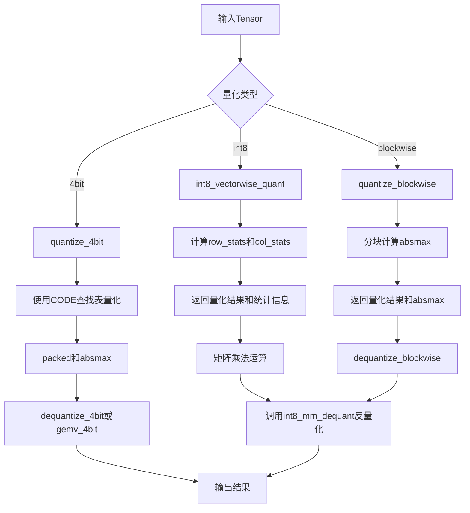
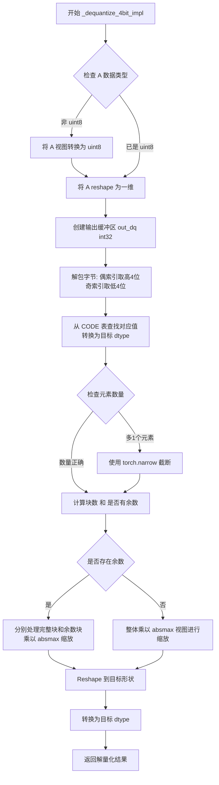
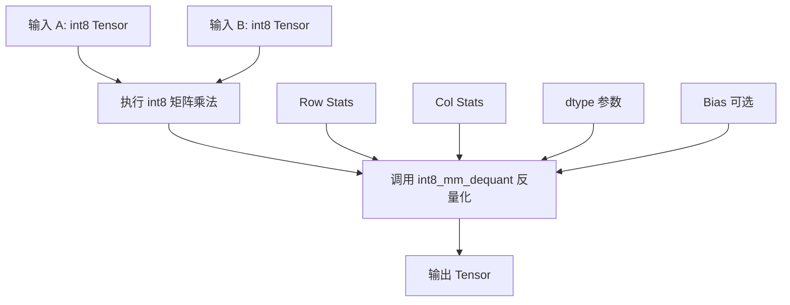
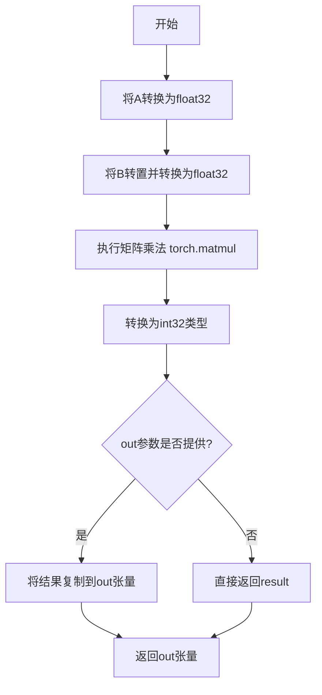
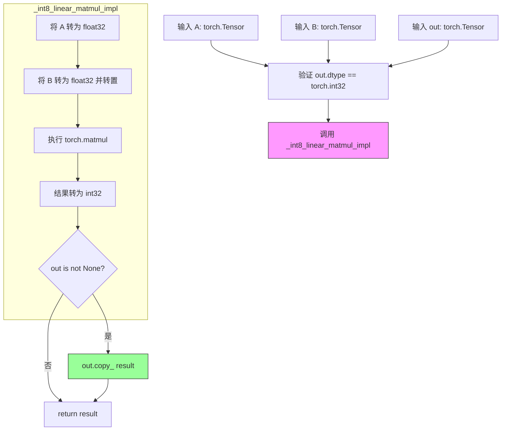
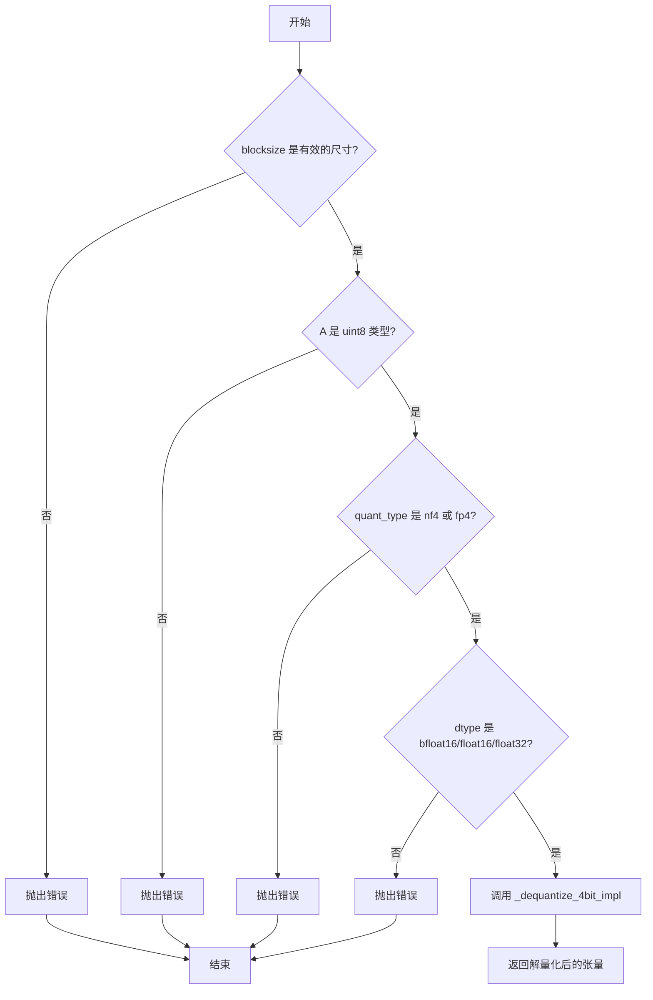

# `bitsandbytes\bitsandbytes\backends\default\ops.py` 详细设计文档

该文件实现了bitsandbytes库的量化核心操作和优化器内核，包括int8矩阵乘法、4bit量化/反量化、分块量化等操作，以及32位优化器（如Adam、Lion等）的预处理和更新逻辑

## 整体流程



## 类结构

```
OpsModule (核心操作模块)
├── 量化内核 (Quantization Kernels)
│   ├── int8_vectorwise_quant (向量级int8量化)
│   ├── quantize_blockwise (分块量化)
│   ├── quantize_4bit (4bit量化)
│   ├── dequantize_blockwise (分块反量化)
│   └── dequantize_4bit (4bit反量化)
├── 矩阵乘法内核 (Matmul Kernels)
│   ├── int8_mm_dequant (int8矩阵乘+反量化)
│   ├── int8_scaled_mm (int8缩放矩阵乘)
│   ├── int8_mixed_scaled_mm (int8混合缩放矩阵乘)
│   ├── int8_linear_matmul (int8线性矩阵乘)
│   └── gemv_4bit (4bit矩阵向量乘)
└── 优化器内核 (Optimizer Kernels)
    ├── _optimizer_precondition_32bit (预处理)
    └── _optimizer_update_32bit (参数更新)
```

## 全局变量及字段


### `MOMENTUM`
    
Optimizer ID constant for Momentum optimizer, used in kernel comparisons

类型：`int`
    


### `RMSPROP`
    
Optimizer ID constant for RMSprop optimizer, used in kernel comparisons

类型：`int`
    


### `ADAGRAD`
    
Optimizer ID constant for Adagrad optimizer, used in kernel comparisons

类型：`int`
    


### `ADAM`
    
Optimizer ID constant for Adam optimizer, used in kernel comparisons

类型：`int`
    


### `LION`
    
Optimizer ID constant for LION optimizer, must be larger than other optimizer IDs due to kernel comparisons

类型：`int`
    


### `ADEMAMIX`
    
Optimizer ID constant for AdEMAMix optimizer, used in kernel comparisons

类型：`int`
    


### `name2optimizer_id`
    
Dictionary mapping optimizer name strings to their corresponding integer IDs for kernel dispatch

类型：`dict[str, int]`
    


    

## 全局函数及方法


### `_try_torch_compile`

该函数是一个装饰器工厂，用于包装 PyTorch 的 `torch.compile` 功能。当编译成功时，返回编译后的函数；当编译失败时，自动回退到执行原始函数，从而确保代码的兼容性。

参数：

- `func`：可选的 `Callable`，当直接作为装饰器使用且不带参数时传入的函数对象，默认为 `None`
- `**compile_kwargs`：可变关键字参数，用于传递至 `torch.compile` 的配置选项（如 `mode`、`backend` 等）

返回值：`Callable`，返回装饰后的函数。如果传入 `func` 参数，则返回包装后的函数；否则返回装饰器函数。

#### 流程图

```mermaid
flowchart TD
    A[开始] --> B{func is None?}
    B -->|是| C[返回decorator函数]
    B -->|否| D[直接调用decorator(func)]
    C --> E[装饰器被调用]
    E --> F[尝试 torch.compile fn]
    F --> G{编译成功?}
    G -->|是| H[创建wrapper函数]
    G -->|否| I[返回原始函数fn]
    H --> J{wrapper被调用}
    J --> K{compiled_fn执行成功?}
    K -->|是| L[返回compiled_fn结果]
    K -->|否| M[返回fn原始结果]
    D --> N[返回装饰后的函数]
    
    style H fill:#90EE90
    style I fill:#FFB6C1
    style M fill:#FFB6C1
```

#### 带注释源码

```python
def _try_torch_compile(func=None, **compile_kwargs):
    """
    Wrapper around torch.compile that falls back to the original function if compilation fails.
    
    用法：
    1. @_try_torch_compile
       def foo(): ...
    
    2. @_try_torch_compile(mode='reduce-overhead')
       def bar(): ...
    """
    
    # 定义内部装饰器函数
    def decorator(fn):
        # 尝试编译函数，如果torch.compile不可用或失败则捕获异常
        try:
            # 使用torch.compile编译函数，传入任意额外参数
            compiled_fn = torch.compile(fn, **compile_kwargs)

            # 使用wraps保持原函数的元信息（__name__、__doc__等）
            @wraps(fn)
            def wrapper(*args, **kwargs):
                """执行编译后函数的包装器"""
                try:
                    # 尝试执行编译后的函数
                    return compiled_fn(*args, **kwargs)
                except Exception:
                    # 编译后函数执行失败，回退到原始函数
                    return fn(*args, **kwargs)

            return wrapper
        except Exception:
            # 编译阶段失败（如torch.compile不可用），返回原始函数
            return fn

    # 判断调用方式：
    # 方式1：@_try_torch_compile 带参数调用，返回decorator
    if func is None:
        return decorator
    # 方式2：@_try_torch_compile 不带参数直接装饰，直接执行装饰
    else:
        return decorator(func)
```


### `_int8_linear_matmul_impl`

该函数是 int8 矩阵乘法的朴素实现（naive implementation），通过将 int8/ int32 输入张量转换为 float32 进行矩阵运算，然后再将结果转换回 int32。这是 bitsandbytes 库中 int8 矩阵乘法的底层实现，支持可选的输出张量参数以避免内存分配。

参数：

- `A`：`torch.Tensor`，输入矩阵 A，类型为 int32（根据调用方约定）
- `B`：`torch.Tensor`，输入矩阵 B，类型为 int32（根据调用方约定）
- `out`：`Optional[torch.Tensor]`，可选的输出张量，用于存储结果。如果为 None，则创建新张量

返回值：`torch.Tensor`，返回 int32 类型的矩阵乘积结果

#### 流程图

```mermaid
flowchart TD
    A[输入 A: torch.Tensor] --> B1[转换为 float32]
    B[输入 B: torch.Tensor] --> T[转置为 B.t()]
    T --> B2[转换为 float32]
    B1 --> MM[矩阵乘法 torch.matmul]
    B2 --> MM
    MM --> C[转换为 int32]
    C --> Check{out is not None?}
    Check -->|Yes| Copy[复制结果到 out]
    Check -->|No| New[创建新张量]
    Copy --> Return[返回 result]
    New --> Return
```

#### 带注释源码

```python
def _int8_linear_matmul_impl(A: torch.Tensor, B: torch.Tensor, out: Optional[torch.Tensor] = None):
    # Naive implementation: perform matmul in fp32
    # 1. 将输入矩阵 A 从 int32 转换为 float32，以获得更高精度
    # 2. 将输入矩阵 B 转置并转换为 float32
    # 3. 执行矩阵乘法操作
    # 4. 将结果转换回 int32
    result = torch.matmul(A.float(), B.float().t()).to(torch.int32)
    
    # 如果提供了 out 参数，则将结果复制到指定的输出张量中
    if out is not None:
        result = out.copy_(result)
    
    # 返回计算结果（int32 类型的矩阵）
    return result
```


### `_dequantize_4bit_impl`

该函数实现4位量化数据的解量化（反量化）逻辑，将压缩的uint8张量（每字节存储2个4位值）通过查找表和块级缩放因子还原为指定数据类型的浮点张量，支持NF4和FP4两种量化格式。

参数：

-  `A`：`torch.Tensor`，压缩后的4位量化数据，存储为uint8格式（每字节包含2个4位值）
-  `absmax`：`torch.Tensor`，每个量化块的绝对最大值，用于反量化时的缩放
-  `blocksize`：`int`，量化块大小，定义了每个块包含的元素数量
-  `quant_type`：`str`，量化类型，值为"nf4"（正态分布4位）或"fp4"（浮点4位）
-  `shape`：`Sequence[int]`，输出张量的目标形状，用于最终reshape
-  `dtype`：`torch.dtype`，输出数据类型，支持bfloat16、float16或float32

返回值：`torch.Tensor`，解量化后的浮点张量，形状为指定的shape，数据类型为dtype

#### 流程图



#### 带注释源码

```python
def _dequantize_4bit_impl(
    A: torch.Tensor,
    absmax: torch.Tensor,
    blocksize: int,
    quant_type: str,
    shape: Sequence[int],
    dtype: torch.dtype,
) -> torch.Tensor:
    # 如果输入不是 uint8 类型（例如可能是其他整型），将其视图转换为 uint8
    # 这是为了统一处理不同存储格式的量化数据
    if A.dtype != torch.uint8:
        A = A.view(torch.uint8)

    # 将输入展平为一维张量，便于后续按字节处理
    A = A.reshape(-1)
    
    # 创建输出缓冲区，每个字节将解码为2个4位值，使用int32存储中间结果
    # 这样可以避免后续计算中的精度问题
    out_dq = torch.empty(A.size(0) * 2, dtype=torch.int32, device=A.device)
    
    # 获取总元素数量
    n = out_dq.numel()
    
    # 解包操作：每个uint8字节包含两个4位值
    # 偶数位置取高4位（通过右移4位）
    # 奇数位置取低4位（通过与0xF按位与）
    out_dq[1::2] = A & 0xF
    out_dq[::2] = A >> 4
    
    # 从 CODE 查找表获取对应量化值的浮点表示
    # CODE 根据 quant_type ("nf4" 或 "fp4") 提供量化码本
    # 先转换为 dtype 避免后续类型不匹配问题，再转移到正确设备
    code = CODE[quant_type].to(dtype).to(A.device)
    out_dq = code[out_dq]

    # 处理可能的边界情况：当解码后的元素数量比预期多1个时
    # 这通常发生在原始数据处理时的边界处理
    if out_dq.numel() != n:
        assert out_dq.numel() == n + 1
        out_dq = torch.narrow(out_dq, 0, 0, n)
    
    # 计算完整块数量和余数块大小
    blocks = n // blocksize
    blocks += 1 if n % blocksize > 0 else 0
    rem = n % blocksize
    has_rem = rem > 0

    # 创建最终输出张量，使用目标形状和数据类型
    out = torch.empty(shape, dtype=dtype, device=A.device).reshape(-1)
    
    # 根据是否存在余数块，采用不同的缩放策略
    if has_rem:
        # 完整块：view 成 (n_rem, blocksize) 然后乘以对应块的 absmax
        out[: n - rem] = (out_dq[: n - rem].view(-1, blocksize) * absmax[: blocks - has_rem].view(-1, 1)).reshape(-1)
        # 余数块：直接乘以最后一个 absmax 值
        out[n - rem :] = out_dq[n - rem :] * absmax[-1]
    else:
        # 无余数时，整体进行块级缩放
        out = out_dq.view(-1, blocksize) * absmax.view(-1, 1)

    # 恢复原始形状，注意保留批次维度
    out = out.reshape(-1, *shape[1:]).to(dtype)

    return out
```


### `int8_mm_dequant`

该函数是 int8 矩阵乘法反量化内核，执行 int8 矩阵乘法结果的反量化操作。它接收 int32 格式的矩阵乘法结果以及对应的行列缩放统计量，通过逐元素乘法和缩放因子将结果反量化为目标浮点精度（默认 float16），可选地添加偏置后输出。

参数：

- `A`：`torch.Tensor`，int32 类型的输入矩阵，通常为 int8 矩阵乘法的 int32 结果
- `row_stats`：`torch.Tensor`，float32 类型的行缩放统计量，用于反量化
- `col_stats`：`torch.Tensor`，float32 类型的列缩放统计量，用于反量化
- `dtype`：`Optional[torch.dtype]`，可选的目标输出数据类型，默认为 torch.float16
- `bias`：`Optional[torch.Tensor]`，可选的偏置张量，将加到反量化结果上

返回值：`torch.Tensor`，反量化后的浮点类型矩阵， dtype 由参数指定或默认为 float16

#### 流程图

```mermaid
flowchart TD
    A[输入 A, row_stats, col_stats, dtype, bias] --> B{类型检查}
    B -->|A 不是 int32| E[抛出异常]
    B -->|row_stats 不是 float32| E
    B -->|col_stats 不是 float32| E
    E --> F[结束]
    
    B -->|通过| C[reshape 操作]
    C --> D[计算 out = A * (row_stats * col_stats) * 6.200124e-05]
    D --> G{ bias 是否存在}
    G -->|是| H[out += bias]
    G -->|否| I[转换为 dtype 并返回]
    H --> I
```

#### 带注释源码

```python
@register_kernel("bitsandbytes::int8_mm_dequant", "default")
def _(
    A: torch.Tensor,
    row_stats: torch.Tensor,
    col_stats: torch.Tensor,
    dtype: Optional[torch.dtype] = None,
    bias: Optional[torch.Tensor] = None,
) -> torch.Tensor:
    # 类型检查：确保 A 是 int32 类型
    torch._check(A.dtype == torch.int32, lambda: f"A must be int32, got {A.dtype}")
    # 类型检查：确保 row_stats 是 float32 类型
    torch._check(row_stats.dtype == torch.float32, lambda: f"row_stats must be float32, got {row_stats.dtype}")
    # 类型检查：确保 col_stats 是 float32 类型
    torch._check(col_stats.dtype == torch.float32, lambda: f"col_stats must be float32, got {col_stats.dtype}")

    # 将 A 展平为 2D 张量，保留最后一维
    A_calc = A.view(-1, A.shape[-1])
    # 将 row_stats  reshape 为列向量 (n, 1)
    row_stats = row_stats.reshape(-1).unsqueeze(-1)
    # 将 col_stats reshape 为行向量 (1, m)
    col_stats = col_stats.reshape(-1).unsqueeze(0)

    # 执行反量化：乘以行统计量、列统计量和缩放因子 6.200124e-05
    # 6.200124e-05 是 int8 到 float16 的量化常数
    out = A_calc * (row_stats * col_stats) * 6.200124e-05
    
    # 如果提供了偏置，则加到结果上
    if bias is not None:
        out += bias

    # 转换为目标 dtype，默认为 float16
    return out.to(dtype or torch.float16)
```


### `int8_mixed_scaled_mm`

该函数执行 INT8 混合尺度矩阵乘法（mixed-scaled matrix multiplication），支持处理包含异常值（outliers）的矩阵乘法运算。当存在异常值列时，该函数会将这些列保留在原始精度中进行计算，然后通过矩阵加法（addmm）将结果合并回输出。

参数：

- `A`：`torch.Tensor`，原始输入矩阵（包含异常值的原始精度数据）
- `CA`：`torch.Tensor`，量化后的 A 矩阵（int8 格式）
- `CB`：`torch.Tensor`，量化后的 B 矩阵（权重，int8 格式）
- `SCA`：`torch.Tensor`，A 矩阵的缩放因子（scale factors）
- `SCB`：`torch.Tensor`，B 矩阵的缩放因子（scale factors）
- `outlier_cols`：`Optional[torch.Tensor]`，包含异常值列索引的张量，默认为 None
- `bias`：`Optional[torch.Tensor]`，可选的偏置向量，默认为 None

返回值：`tuple[torch.Tensor, Optional[torch.Tensor]]`，返回混合尺度矩阵乘法的结果张量以及提取的异常值子矩阵（subA），若无异常值则 subA 为空张量

#### 流程图

```mermaid
flowchart TD
    A([开始: int8_mixed_scaled_mm]) --> B{outlier_cols 是否存在且非空?}
    B -->|是| C[提取异常值列 subA = A[:, outlier_cols]]
    C --> D[反量化对应权重列 subB]
    D --> E[执行 INT8 矩阵乘法: output = int8_scaled_mm]
    E --> F{subB 是否存在?}
    F -->|是| G[矩阵加法合并: output.addmm(subA, subB)]
    G --> H[返回 output, subA]
    F -->|否| H
    B -->|否| I[创建空张量 subA 兼容 torch.compile]
    I --> E
    H --> J([结束])
```

#### 带注释源码

```python
@register_kernel("bitsandbytes::int8_mixed_scaled_mm", "default")
def _(
    A: torch.Tensor,
    CA: torch.Tensor,
    CB: torch.Tensor,
    SCA: torch.Tensor,
    SCB: torch.Tensor,
    outlier_cols: Optional[torch.Tensor] = None,
    bias: Optional[torch.Tensor] = None,
) -> tuple[torch.Tensor, Optional[torch.Tensor]]:
    """执行 INT8 混合尺度矩阵乘法，支持异常值处理
    
    参数:
        A: 原始输入矩阵（fp16/bf16），包含可能超出量化范围的异常值
        CA: 量化后的 A 矩阵（int8），已对异常值列进行清零处理
        CB: 量化后的 B 权重矩阵（int8）
        SCA: A 矩阵的缩放因子，用于反量化
        SCB: B 矩阵的缩放因子，用于反量化
        outlier_cols: 异常值列的索引，用于定位需要保留原始精度的列
        bias: 可选的偏置项
    
    返回:
        output: 混合精度矩阵乘法结果
        subA: 提取的异常值列子矩阵（用于后续处理）
    """
    subB = None  # 初始化 subB 为 None，表示当前无异常值列需要特殊处理

    # 检查是否存在异常值列
    if outlier_cols is not None and outlier_cols.numel():
        # ======= 处理存在异常值的分支 =======
        
        # 从原始矩阵 A 中提取异常值列，保持原始精度
        subA = A[:, outlier_cols].contiguous()

        # 对应权重列进行反量化（从 int8 转换回原始精度）
        # CB[:, outlier_cols] 提取异常值对应的权重列
        # SCB 是对应的缩放因子
        subB = (
            torch.ops.bitsandbytes.int8_vectorwise_dequant.default(
                CB[:, outlier_cols].contiguous(),  # 异常值列的权重
                SCB  # 缩放因子
            )
            .to(A.dtype)  # 转换回原始输入数据类型（fp16/bf16）
            .t()  # 转置以适配矩阵乘法维度
        )

        # TODO: 如果存在 fp16 权重，直接使用原始权重而非反量化
        # if state.has_fp16_weights: subB = B[:, outlier_cols].t()

    else:
        # ======= 处理无异常值的分支 =======
        # 为 torch.compile 创建空张量，确保编译图完整
        subA = torch.empty(0, device=A.device, dtype=A.dtype)

    # ======= 核心计算：INT8 矩阵乘法 + 反量化 + 偏置 =======
    # 使用量化矩阵进行高效矩阵乘法，然后自动反量化回原始精度
    output = torch.ops.bitsandbytes.int8_scaled_mm.default(
        CA,    # 量化后的 A
        CB,    # 量化后的 B
        SCA,   # A 的缩放因子
        SCB,   # B 的缩放因子
        bias=bias,   # 可选偏置
        dtype=A.dtype  # 输出数据类型
    )

    # ======= 合并异常值计算结果 =======
    # 如果存在异常值列，将单独计算的结果通过矩阵加法合并
    if subB is not None:
        # addmm: output = output + subA @ subB
        # 将异常值列的计算结果加回到主输出中
        output = output.addmm(subA, subB)

    # 返回最终结果和提取的异常值子矩阵
    return output, subA
```


### `int8_scaled_mm`

该函数是 bitsandbytes 库中 int8 矩阵乘法的核心实现，接收量化后的 int8 输入矩阵和权重矩阵，结合行/列统计信息进行矩阵乘法运算，然后通过反量化操作将结果转换为目标数据类型（默认为 float16），同时支持可选的偏置项相加。

参数：

- `A`：`torch.Tensor`，量化后的 int8 输入矩阵
- `B`：`torch.Tensor`，量化后的 int8 权重矩阵
- `row_stats`：`torch.Tensor`，用于反量化的行统计信息（float32）
- `col_stats`：`torch.Tensor`，用于反量化的列统计信息（float32）
- `bias`：`Optional[torch.Tensor]`，可选的偏置项，形状需与输出兼容
- `dtype`：`Optional[torch.dtype]`，输出数据类型，默认为 torch.float16

返回值：`torch.Tensor`，反量化后的矩阵乘法结果

#### 流程图



#### 带注释源码

```python
@register_kernel("bitsandbytes::int8_scaled_mm", "default")
def _(
    A: torch.Tensor,
    B: torch.Tensor,
    row_stats: torch.Tensor,
    col_stats: torch.Tensor,
    bias: Optional[torch.Tensor] = None,
    dtype: Optional[torch.dtype] = None,
) -> torch.Tensor:
    # 第一步：执行 int8 矩阵乘法运算，得到 int32 输出的中间结果
    # 调用底层 int8_linear_matmul 内核进行矩阵乘法
    out_i32 = torch.ops.bitsandbytes.int8_linear_matmul.default(A, B)
    
    # 第二步：调用 int8_mm_dequant 内核进行反量化
    # 该内核会结合 row_stats 和 col_stats 对 int32 结果进行反量化
    # 并将结果转换为指定的 dtype（默认为 float16）
    # 如果提供了 bias，则会加到输出上
    return torch.ops.bitsandbytes.int8_mm_dequant.default(
        out_i32,
        row_stats,
        col_stats,
        dtype=dtype or torch.float16,
        bias=bias,
    )
```


### `_int8_linear_matmul_impl`

这是一个int8矩阵乘法的朴素实现函数，执行浮点矩阵乘法并将结果转换为int32格式。

参数：

- `A`：`torch.Tensor`，输入的int8张量A
- `B`：`torch.Tensor`，输入的int8张量B
- `out`：`Optional[torch.Tensor] = None`，可选的输出张量，用于存储结果

返回值：`torch.Tensor`，返回int32类型的矩阵乘积结果

#### 流程图



#### 带注释源码

```python
def _int8_linear_matmul_impl(A: torch.Tensor, B: torch.Tensor, out: Optional[torch.Tensor] = None):
    """
    int8矩阵乘法的朴素实现
    
    执行步骤：
    1. 将输入A和B转换为float32类型
    2. 对B进行转置
    3. 执行矩阵乘法
    4. 将结果转换为int32
    5. 如果提供了out参数，则复制结果到out中
    
    参数:
        A: torch.Tensor - 输入的int8张量矩阵A
        B: torch.Tensor - 输入的int8张量矩阵B
        out: Optional[torch.Tensor] - 可选的输出张量，如果提供则结果存储到此张量
    
    返回:
        torch.Tensor - int32类型的矩阵乘积结果
    """
    
    # 将A转换为float32并执行矩阵乘法
    # 注意：B需要先转置(.t())再进行乘法，这是标准的矩阵乘法规则
    result = torch.matmul(A.float(), B.float().t()).to(torch.int32)
    
    # 如果提供了out参数，则将结果复制到out张量中
    # 使用copy_方法进行原地复制，避免创建新的张量
    if out is not None:
        result = out.copy_(result)
    
    # 返回计算结果
    return result
```


### `int8_linear_matmul.out`

该函数是 int8 矩阵乘法的核心实现，执行 int8 张量的矩阵乘法运算。它是 `bitsandbytes::int8_linear_matmul` 内核的带输出张量版本，通过将 int8 输入先转换为 float32，执行矩阵乘法后再转回 int32，实现简化的 int8 矩阵乘法功能。

参数：

- `A`：`torch.Tensor`，第一个输入的 int8 张量
- `B`：`torch.Tensor`，第二个输入的 int8 张量（将在内部转置后进行乘法）
- `out`：`torch.Tensor`，用于存储结果的 int32 张量

返回值：`torch.Tensor` 或 `None`，如果提供了 `out` 参数则直接写入 `out` 并返回 `None`，否则返回计算结果

#### 流程图



#### 带注释源码

```python
@register_kernel("bitsandbytes::int8_linear_matmul.out", "default")
def _(A: torch.Tensor, B: torch.Tensor, out: torch.Tensor):
    """
    带输出张量的 int8 矩阵乘法内核
    
    参数:
        A: 第一个输入张量 (int8)
        B: 第二个输入张量 (int8)
        out: 用于存储结果的输出张量 (int32)
    """
    # 验证输出张量数据类型必须为 int32
    torch._check(out.dtype == torch.int32)
    # 调用内部实现函数
    _int8_linear_matmul_impl(A, B, out)


def _int8_linear_matmul_impl(A: torch.Tensor, B: torch.Tensor, out: Optional[torch.Tensor] = None):
    """
    int8 矩阵乘法的朴素实现
    
    实现逻辑:
        1. 将 int8 输入转换为 float32 进行计算
        2. 对 B 进行转置 (B.float().t())
        3. 执行矩阵乘法
        4. 将结果转换为 int32
        5. 如果提供了 out 参数，则复制到 out 中
    
    参数:
        A: 第一个输入张量
        B: 第二个输入张量
        out: 可选的输出张量
        
    返回:
        如果 out 为 None，返回结果张量；否则返回 None
    """
    # 朴素实现: 在 fp32 中执行矩阵乘法
    # 注意: 这里的实现是最简版本，生产环境会使用更高效的定制内核
    result = torch.matmul(A.float(), B.float().t()).to(torch.int32)
    
    if out is not None:
        # 如果提供了输出张量，将结果复制到其中
        # 使用 copy_ 而不是直接赋值，以保持计算图的连接性
        result = out.copy_(result)
    
    return result
```


### `int8_vectorwise_quant`

该函数实现了一种带有异常值处理的INT8向量量化方法，通过逐行计算绝对最大值进行归一化，并将超过阈值的异常值单独保留以便后续恢复，最终返回量化后的INT8张量、行统计信息（每行的绝对最大值）以及异常列索引。

参数：
- `A`：`torch.Tensor`，输入的需要进行INT8量化的张量，支持任意维度但最后一个维度为特征维度
- `threshold`：浮点数，默认为0.0，用于判断异常值的阈值，当输入张量的绝对值大于等于该阈值时被视为异常值

返回值：元组 `(torch.Tensor, torch.Tensor, Optional[torch.Tensor])`，包含三个元素——量化后的INT8张量（与输入形状相同）、每行的绝对最大值（float32类型的一维张量）、异常列的索引（int64类型的一维张量，如果没有异常值则为空张量）

#### 流程图

```mermaid
flowchart TD
    A[输入张量 A] --> B[计算总行数 rows = prod(A.shape[:-1])]
    B --> C{threshold > 0.0?}
    C -->|是| D[计算异常值掩码 outliers = abs(A) >= threshold]
    D --> E{outliers.any?}
    E -->|是| F[找出异常列索引 outlier_cols]
    F --> G[备份异常值 outlier_restore]
    G --> H[将异常位置置零 A[outliers] = 0]
    E -->|否| I[创建空异常列索引用于torch.compile支持]
    C -->|否| J[设置 outlier_cols = None, outlier_restore = None]
    I --> K
    H --> K[计算每行绝对最大值 row_stats]
    J --> K
    K --> L[量化到INT8 out_row = round(A * 127.0 / row_stats)]
    L --> M{rows > 1 and outlier_cols is not None?}
    M -->|是| N[将异常列置零 out_row[:, outlier_cols] = 0]
    M -->|否| O
    N --> O{outlier_restore is not None?}
    O --> P[恢复异常值 A[outliers] = outlier_restore]
    P --> Q[返回 out_row, row_stats, outlier_cols]
```

#### 带注释源码

```python
@register_kernel("bitsandbytes::int8_vectorwise_quant", "default")
def _(A: torch.Tensor, threshold=0.0):
    # 计算张量维度数量：对于2D矩阵是行数，对于3D及以上是前N-1维的乘积
    rows = prod(A.shape[:-1])
    
    # 初始化异常列索引为None
    outlier_cols = None
    
    # 初始化异常值备份为None
    outlier_restore = None

    # 如果设置了阈值，则进行异常值检测和处理
    if threshold > 0.0:
        # 创建一个布尔掩码，标记绝对值超过阈值的元素
        outliers = A.abs() >= threshold

        # 如果存在异常值
        if outliers.any():
            # 确定哪些列包含异常值（沿dim=0方向any操作）
            # torch.argwhere返回非零元素的索引，view(-1)展平为一维
            outlier_cols = torch.argwhere(outliers.any(dim=0)).view(-1)
            
            # 克隆异常值用于后续恢复
            outlier_restore = A[outliers].clone()
            
            # 在量化前将异常值置零，避免它们影响量化因子计算
            A[outliers] = 0
        else:
            # 为了支持torch.compile，当没有异常值时创建空张量
            outlier_cols = torch.empty(0, device=A.device, dtype=torch.int64)

    # 获取每行的绝对最大值（用于归一化）
    # dim=1表示沿最后一个维度（特征维度）计算最大值
    row_stats = torch.max(A.abs(), dim=1).values.float()

    # 逐行量化到int8
    # 公式：x_q = round(x * 127.0 / max_abs)
    # row_stats.unsqueeze(-1)将形状从[rows]扩展为[rows, 1]以支持广播
    out_row = torch.round(A * (127.0 / row_stats.unsqueeze(-1))).to(torch.int8)

    # 对于多行情况，将异常列的所有值置零
    # 因为这些列包含异常值，不应该被量化存储
    if rows > 1 and outlier_cols is not None:
        out_row[:, outlier_cols] = 0

    # 如果之前保存了异常值，将其恢复到原始张量A中
    if outlier_restore is not None:
        A[outliers] = outlier_restore

    # 返回：量化后的INT8张量、行统计信息、异常列索引
    return out_row, row_stats, outlier_cols
```


### `quantize_blockwise`

对输入张量进行分块量化，将浮点数据映射到基于查找表的离散int8值，同时保留每个块的绝对最大值用于反量化。

参数：

- `A`：`torch.Tensor`，输入的要量化的浮点张量
- `code`：`torch.Tensor`，量化查找表（LUT），包含可能的离散量化值
- `blocksize`：`int`，每个分块的元素数量，必须为正整数

返回值：`tuple[torch.Tensor, torch.Tensor]`，返回包含量化后的uint8张量（与输入形状相同）和每个块的绝对最大值（float32类型）的元组

#### 流程图

```mermaid
flowchart TD
    A([开始 quantize_blockwise]) --> B[torch._check_is_size<br/>验证blocksize有效性]
    B --> C[n = A.numel<br/>计算总元素数]
    C --> D[rem = n % blocksize<br/>计算余数]
    D --> E[has_rem = rem > 0<br/>判断是否有剩余块]
    E --> F[blocks = n // blocksize + has_rem<br/>计算总块数]
    F --> G[absmax = torch.zeros<br/>初始化absmax张量]
    G --> H[A_reshaped = A.reshape(n)<br/>展平输入张量]
    H --> I[A_com = A_reshaped[:n - rem]<br/>提取完整块部分]
    I --> J[A_com_reshaped = A_com.reshape<br/>重塑为块矩阵]
    J --> K[absmax[:blocks-has_rem] = torch.abs.max<br/>计算完整块absmax]
    K --> L[scaled_A = torch.clamp<br/>缩放并截断到[-1,1]]
    L --> M{has_rem?}
    M -->|是| N[absmax[-1] = torch.abs.max<br/>计算剩余块absmax]
    M -->|否| O
    N --> P[scaled_A_rem = torch.clamp<br/>缩放剩余块]
    P --> Q[scaled_A = torch.cat<br/>拼接完整块和剩余块]
    Q --> R
    M -->|否| R[diff = torch.abs - code<br/>计算与查找表的差值]
    R --> S[out = torch.argmin<br/>找到最接近的量化索引]
    S --> T[to uint8 + reshape<br/>转换为uint8并恢复形状]
    T --> U([返回 out, absmax])
```

#### 带注释源码

```python
@register_kernel("bitsandbytes::quantize_blockwise", "default")
def _(A: torch.Tensor, code: torch.Tensor, blocksize: int) -> tuple[torch.Tensor, torch.Tensor]:
    """
    对输入张量进行分块量化。
    
    算法流程：
    1. 将输入张量划分为多个固定大小的块
    2. 对每个块计算绝对最大值(absmax)作为缩放因子
    3. 将块内的值缩放到[-1, 1]范围
    4. 通过查找表(code)找到最接近的量化值
    5. 返回量化后的张量及每个块的absmax用于反量化
    """
    # 检查blocksize是否为有效的正整数
    torch._check_is_size(blocksize)

    # 计算输入张量的总元素个数
    n = A.numel()
    
    # 计算无法被blocksize整除的余数部分
    rem = n % blocksize
    
    # 判断是否存在剩余的不完整块
    has_rem = rem > 0
    
    # 计算总块数：如果有剩余块则+1，否则不变
    blocks = n // blocksize + has_rem
    
    # 初始化absmax数组，用于存储每个块的最大绝对值
    # 形状为(blocks,)，数据类型为float32
    absmax = torch.zeros((blocks,), device=A.device, dtype=torch.float32)
    
    # 将输入张量展平为一维
    A_reshaped = A.reshape(n)
    
    # 提取完整块部分（去掉末尾的剩余元素）
    A_com = A_reshaped[: n - rem]
    
    # 将完整块重塑为 (块数, 块大小) 的二维张量
    # 用于后续按块进行操作
    A_com_reshaped = A_com.reshape(n // blocksize, blocksize)
    
    # 计算每个完整块的绝对最大值
    # dim=-1 表示在块内（最后一个维度）求最大值
    absmax[: blocks - has_rem] = torch.abs(A_com_reshaped).max(dim=-1)[0]
    
    # 使用absmax进行缩放：将值缩放到[-1, 1]范围
    # 1 / absmax.view(-1, 1) 是每个块的缩放因子
    scaled_A = torch.clamp(A_com_reshaped * (1 / absmax[: blocks - has_rem].view(-1, 1)), -1, 1)
    
    # 重新展平为一维，准备与查找表进行匹配
    scaled_A = scaled_A.reshape(-1)
    
    # 处理可能存在的剩余不完整块
    if has_rem:
        # 计算剩余元素的absmax
        absmax[-1] = torch.abs(A_reshaped[n - rem :]).max()
        
        # 对剩余元素进行缩放和截断
        scaled_A_rem = torch.clamp(A_reshaped[n - rem :] * (1 / absmax[-1]), -1, 1)
        
        # 将完整块的量化结果与剩余块的量化结果拼接
        scaled_A = torch.cat([scaled_A, scaled_A_rem], dim=0)

    # 计算缩放后的值与查找表中每个值的差值
    # unsqueeze(-1) 将scaled_A从 (n,) 扩展为 (n, 1)
    # code 从 (code_len,) 扩展为 (1, code_len)
    # 结果diff形状为 (n, code_len)
    diff = torch.abs(scaled_A.unsqueeze(-1) - code.to(scaled_A.device))
    
    # 找到最小差值对应的索引（即查找表中最接近的值）
    # argmin返回最小值的位置索引
    out = torch.argmin(diff, dim=-1).to(torch.uint8).to(scaled_A.device).reshape(A.shape)

    # 返回量化后的张量（形状与输入相同）和每个块的absmax
    return out, absmax
```


### `dequantize_blockwise`

该函数是 bitsandbytes 库中的块级别量化解量化内核，通过查找代码本（codebook）将 uint8 量化数据还原为原始浮点数据，并结合每个块的绝对最大值（absmax）进行缩放，最终将解量化后的张量 reshape 为与输入 A 相同的形状。

参数：

- `A`：`torch.Tensor`，输入的 uint8 量化张量，包含要解量化的数据
- `absmax`：`torch.Tensor`，每个块的绝对最大值（float32 类型），用于反量化时的缩放
- `code`：`torch.Tensor`，代码本（lookup table），包含量化值对应的浮点重建值
- `blocksize`：`int`，块大小，指定每个块包含多少个元素
- `dtype`：`torch.dtype`，输出数据的目标数据类型（如 torch.float16）

返回值：`torch.Tensor`，解量化后的浮点张量，形状与输入 A 相同

#### 流程图

```mermaid
flowchart TD
    A[输入: A量化张量, absmax, code, blocksize, dtype] --> B{验证blocksize是否为有效整数}
    B -->|是| C{验证A是否为uint8类型}
    C -->|是| D[将A reshape为1维并转换为int类型]
    D --> E[通过code[A.int]查找重建值]
    E --> F{检查是否有剩余元素res != 0}
    F -->|是| G[使用padding填充到blocksize倍数]
    F -->|否| H[跳过padding]
    G --> I[将数据view为blocksize大小的块]
    H --> I
    I --> J[乘以absmax缩放因子并转换为目标dtype]
    J --> K[截取到正确的元素数量]
    K --> L[reshape为输入A的形状]
    L --> M[输出: 解量化后的张量]
```

#### 带注释源码

```python
@register_kernel("bitsandbytes::dequantize_blockwise", "default")
def _(A: torch.Tensor, absmax: torch.Tensor, code: torch.Tensor, blocksize: int, dtype: torch.dtype) -> torch.Tensor:
    # 验证 blocksize 是有效的正整数
    torch._check_is_size(blocksize)
    # 验证输入 A 必须是 uint8 类型（量化格式）
    torch._check(A.dtype == torch.uint8, lambda: f"A must be uint8, got {A.dtype}")

    # 使用 codebook 查找表进行解量化：将量化索引映射回浮点值
    # A.reshape(-1).int() 将输入展平并转换为整数索引
    out = code[A.reshape(-1).int()]
    
    # 计算完整块的数量和剩余元素数量
    blocks = out.shape[-1] // blocksize
    res = out.shape[-1] % blocksize
    
    # 如果有剩余元素（不足一个完整块），用零填充到 blocksize
    if res != 0:
        out = torch.nn.functional.pad(out, (0, blocksize - res), mode="constant", value=0)
    
    # 将数据 view 为 (-1, blocksize) 的形状，然后乘以 absmax 进行缩放
    # absmax.view(-1, 1) 将每个块的缩放因子广播到该块的所有元素
    out = (out.view(-1, blocksize) * absmax.view(-1, 1)).to(dtype).reshape(-1)
    
    # 截取到正确的元素数量（去除 padding 引入的多余元素）
    out = out[: blocks * blocksize + res]
    
    # 最后 reshape 为输入 A 的原始形状
    out = out.reshape(A.shape)

    return out
```


### `quantize_4bit`

该函数执行4位块量化（Blockwise 4-bit Quantization），将输入的浮点张量（A）量化为NF4或FP4格式，并返回打包后的4位量化数据及每个块的最大绝对值（absmax），用于后续解量化。

参数：

- `A`：`torch.Tensor`，待量化的输入张量，支持 bfloat16、float16 或 float32 类型
- `blocksize`：`int`，量化块大小，必须为正整数
- `quant_type`：`str`，量化类型，可选值为 "nf4" 或 "fp4"
- `quant_storage`：`torch.dtype`，量化数据的存储数据类型

返回值：`tuple[torch.Tensor, torch.Tensor]`，返回两个张量组成的元组：
  - 第一个元素为打包后的4位量化数据（packed tensor）
  - 第二个元素为每个块的绝对最大值（absmax tensor），类型为 float32

#### 流程图

```mermaid
flowchart TD
    A[开始 quantize_4bit] --> B[输入验证: 检查 blocksize, quant_type, A.dtype]
    B --> C[计算总元素数 n 和块数 blocks]
    C --> D{是否有余数 rem?}
    D -->|Yes| E[计算完整块和部分块]
    D -->|No| F[只计算完整块]
    E --> G[对完整块计算 absmax 并缩放到 [-1, 1]]
    F --> G
    G --> H{rem > 0?}
    H -->|Yes| I[对部分块计算 absmax 并缩放]
    I --> J[拼接完整块和部分块的缩放数据]
    H -->|No| J
    J --> K[获取对应 quant_type 的编码查找表 CODE]
    K --> L[通过 argmin 在查找表中找到最近邻量化值]
    L --> M[每两个4bit值打包成一个字节]
    M --> N{quant_storage != uint8?}
    N -->|Yes| O[按 quant_storage 类型重塑 packed 数据]
    N -->|No| P[直接返回 packed 和 absmax]
    O --> P
    P --> Q[结束]
```

#### 带注释源码

```python
@register_kernel("bitsandbytes::quantize_4bit", "default")
def _(
    A: torch.Tensor, blocksize: int, quant_type: str, quant_storage: torch.dtype
) -> tuple[torch.Tensor, torch.Tensor]:
    # 输入参数验证：确保 blocksize 为正整数
    torch._check_is_size(blocksize)
    # 验证量化类型只支持 nf4 或 fp4
    torch._check(quant_type in ("nf4", "fp4"), lambda: f"quant_type must be nf4 or fp4, got {quant_type}")
    # 验证输入数据类型只支持 16/32 位浮点数
    torch._check(
        A.dtype in [torch.bfloat16, torch.float16, torch.float32],
        lambda: f"Blockwise 4bit quantization only supports 16/32-bit floats, but got {A.dtype}",
    )

    # 获取扁平化后的元素总数 n
    n = A.numel()
    # 计算完整块数量
    full_blocks = n // blocksize
    # 计算余数（部分块元素数）
    rem = n % blocksize
    # 总块数：有余数时加1，否则等于完整块数
    blocks = full_blocks + 1 if rem else full_blocks
    
    # 初始化 absmax 向量，用于存储每个块的最大绝对值，类型为 float32
    absmax = torch.zeros((blocks,), device=A.device, dtype=torch.float32)
    # 将输入张量展平为一维
    A_flattened = A.reshape(n)

    # ---- 处理完整块 ----
    # 提取完整块数据并重塑为 (块数, 块大小) 的二维张量
    A_full_blocks = A_flattened[: n - rem].reshape(n // blocksize, blocksize)
    # 计算每个块的绝对最大值（按最后一个维度取 max）
    absmax[:full_blocks] = torch.abs(A_full_blocks).max(dim=-1)[0]
    # 将数据缩放到 [-1, 1] 范围：先乘以 1/absmax，再 clamp 限制范围
    scaled = torch.clamp(A_full_blocks * (1 / absmax[:full_blocks].view(-1, 1)), -1, 1).reshape(-1)

    # ---- 处理部分块（如果有）----
    if rem:
        # 提取剩余的余数部分
        A_rem = A_flattened[-rem:]
        # 计算余数部分的最大绝对值
        absmax[-1] = torch.abs(A_rem).max()
        # 同样缩放到 [-1, 1] 范围
        scaled_rem = torch.clamp(A_rem * (1 / absmax[-1]), -1, 1)
        # 将完整块和部分块的缩放数据拼接起来
        scaled = torch.cat([scaled, scaled_rem], dim=0)

    # ---- 量化操作：使用查找表 ----
    # 获取对应量化类型的编码查找表（如 NF4 或 FP4 的量化码本）
    code = CODE[quant_type].to(scaled.device).to(scaled.dtype)
    # 对每个缩放后的值，在查找表中找到最近的码字（通过计算绝对差并取最小索引）
    quantized = torch.argmin(torch.abs(scaled.view(-1, 1) - code), dim=-1, keepdim=True).to(torch.uint8)

    # ---- 打包操作：每两个 4-bit 值压缩到一个字节 ----
    # 偶数位置的值左移4位，奇数位置的值保持不变，然后按位或运算合并
    packed = quantized[::2] << 4 | quantized[1::2]

    # 如果量化存储类型不是 uint8，则按指定类型重塑数据
    if quant_storage != torch.uint8:
        # squeeze 去除单维度，view 重塑为指定存储类型，再 unsqueeze 恢复形状
        packed = packed.squeeze().view(quant_storage).unsqueeze(1)

    # 返回打包后的量化数据和每个块的 absmax（转为 float32）
    return packed, absmax.float()
```


### `dequantize_4bit`

该函数是 4 位量化张量的解量化内核，注册于 `bitsandbytes::dequantize_4bit` 操作。它接收一个使用 NF4 或 FP4 格式量化的 uint8 张量以及对应的块级最大绝对值，进行输入校验后调用内部实现函数将量化数据恢复为指定的浮点数据类型（bfloat16/float16/float32）。

参数：

-  `A`：`torch.Tensor`，输入的 4 位量化张量（存储为 uint8 格式）
-  `absmax`：`torch.Tensor`，每个量化块的绝对最大值，用于反量化缩放
-  `blocksize`：`int`，块大小，指定每个块包含的元素数量
-  `quant_type`：`str`，量化类型，必须为 "nf4" 或 "fp4"
-  `shape`：`Sequence[int]`，解量化后张量的目标形状
-  `dtype`：`torch.dtype`，输出张量的目标数据类型（支持 bfloat16、float16、float32）

返回值：`torch.Tensor`，解量化后的浮点张量，形状为 `shape`，数据类型为 `dtype`

#### 流程图



#### 带注释源码

```python
@register_kernel("bitsandbytes::dequantize_4bit", "default")
def _(
    A: torch.Tensor,          # 输入：4位量化数据，存储在uint8中
    absmax: torch.Tensor,     # 输入：每个块的绝对最大值（缩放因子）
    blocksize: int,           # 输入：块大小
    quant_type: str,          # 输入：量化类型，"nf4" 或 "fp4"
    shape: Sequence[int],     # 输入：输出张量的目标形状
    dtype: torch.dtype,       # 输入：输出数据类型
) -> torch.Tensor:
    # 验证 blocksize 是有效的正整数
    torch._check_is_size(blocksize)
    # 验证输入 A 是 uint8 类型（量化数据存储格式）
    torch._check(A.dtype == torch.uint8, lambda: f"A must be uint8, got {A.dtype}")

    # 验证量化类型是支持的格式
    torch._check(quant_type in ("nf4", "fp4"), lambda: f"quant_type must be nf4 or fp4, got {quant_type}")
    # 验证输出数据类型是支持的浮点类型
    torch._check(
        dtype in [torch.bfloat16, torch.float16, torch.float32],
        lambda: f"Blockwise 4bit dequantization only supports 16/32-bit floats, but got {dtype}",
    )

    # 委托给内部实现函数执行实际解量化逻辑
    return _dequantize_4bit_impl(A, absmax, blocksize, quant_type, shape, dtype)
```


### `bitsandbytes::gemv_4bit`

该函数是 4bit 量化矩阵向量乘法（GEMV）的核心实现，通过将 4bit 量化权重反量化为原始精度，然后使用 PyTorch 的线性层执行矩阵乘法运算。

参数：

- `A`：`torch.Tensor`，输入矩阵，通常为激活值或输入向量
- `B`：`torch.Tensor`，4bit 量化后的权重矩阵（packed 格式）
- `shapeB`：`Sequence[int]`，权重矩阵 B 的原始形状，用于反量化时reshape
- `absmax`：`torch.Tensor`，每个量化块的绝对最大值（absmax），用于反量化缩放
- `code`：`torch.Tensor`，NF4/FP4 编码查找表，用于将量化值映射回浮点值
- `blocksize`：`int`，块大小，用于分块反量化

返回值：`torch.Tensor`，矩阵乘法结果，数据类型与输入 A 相同（float16/bfloat16）

#### 流程图

```mermaid
flowchart TD
    A["输入 A (float16/bfloat16)"] --> F[判断量化类型]
    B["输入 B (uint8 packed)"] --> F
    C["输入 code (编码表)"] --> F
    
    F --> G{code[1] > 0?}
    G -->|Yes| H[quant_type = "fp4"]
    G -->|No| I[quant_type = "nf4"]
    
    H --> J[调用 dequantize_4bit]
    I --> J
    
    J --> K["B_dq (反量化权重)"]
    
    K --> L[调用 torch.nn.functional.linear]
    A --> L
    
    L --> M["输出结果 (float16/bfloat16)"]
    
    style J fill:#f9f,stroke:#333
    style L fill:#9f9,stroke:#333
```

#### 带注释源码

```python
@register_kernel("bitsandbytes::gemv_4bit", "default")
def _(
    A: torch.Tensor,
    B: torch.Tensor,
    shapeB: Sequence[int],
    absmax: torch.Tensor,
    code: torch.Tensor,
    blocksize: int,
) -> torch.Tensor:
    # 通过检查编码表的第二个元素判断量化类型
    # 如果 code[1] > 0 表示使用 FP4 编码，否则使用 NF4 编码
    quant_type = "fp4" if code[1] > 0 else "nf4"
    
    # 调用 4bit 反量化操作，将 packed uint8 权重解包并反量化为全精度浮点数
    # 使用传入的 absmax 作为缩放因子，blocksize 作为块大小
    # 输出数据类型与输入 A 保持一致
    B_dq = torch.ops.bitsandbytes.dequantize_4bit.default(
        B, 
        absmax, 
        blocksize, 
        quant_type, 
        shapeB, 
        A.dtype
    )

    # 使用 PyTorch 的线性层执行矩阵乘法
    # 等价于: A @ B_dq.T + bias（这里 bias 为 None）
    # 这是标准的 GEMV 操作，但权重 B_dq 已经过反量化
    return torch.nn.functional.linear(
        A,
        B_dq,
        bias=None,
    )
```


### `_optimizer_update_32bit`

统一优化器更新内核，支持多种优化算法（ADAM、ADEMAMIX、MOMENTUM、LION、RMSPROP、ADAGRAD），根据 `optimizer_id` 执行对应的参数更新逻辑，包括梯度缩放、动量更新、学习率应用、权重衰减和梯度裁剪等操作。

参数：

- `g`：`torch.Tensor`，梯度张量
- `p`：`torch.Tensor`，参数张量（模型权重）
- `state1`：`torch.Tensor`，一阶动量状态（如 SGD 的动量或 ADAM 的 m）
- `state2`：`Optional[torch.Tensor]`，二阶动量状态（如 ADAM 的 v）
- `unorm_vec`：`Optional[torch.Tensor]`，累积梯度范数向量，用于梯度裁剪
- `max_unorm`：`float`，最大梯度范数，用于裁剪
- `param_norm`：`float`，参数范数
- `beta1`：`float`，一阶动量衰减参数
- `beta2`：`float`，二阶动量衰减参数
- `beta3`：`float`，ADEMAMIX 专用参数
- `alpha`：`float`，ADEMAMIX 混合参数
- `eps`：`float`，数值稳定性epsilon
- `weight_decay`：`float`，L2正则化权重衰减
- `step`：`int`，当前训练步数
- `lr`：`float`，学习率
- `gnorm_scale`：`float`，梯度范数缩放因子
- `optimizer_id`：`int`，优化器标识符（0=MOMENTUM, 1=RMSPROP, 2=ADAGRAD, 3=ADAM, 4=LION, 5=ADEMAMIX）

返回值：`None`，该函数直接原地修改传入的张量（`p`、`state1`、`state2`），无返回值

#### 流程图

```mermaid
flowchart TD
    A[开始] --> B[将参数和梯度转为float类型]
    B --> C{weight_decay > 0 且 optimizer_id in [0,1,2,4]?}
    C -->|Yes| D[添加权重衰减: g_vals = g_vals + p_vals * weight_decay]
    C -->|No| E{max_unorm > 0?}
    D --> E
    E -->|Yes| F[计算当前梯度范数并裁剪]
    E -->|No| G{根据optimizer_id执行对应分支}
    F --> G
    G --> H{optimizer_id == 3 ADAM?}
    H -->|Yes| I[ADAM更新逻辑]
    H -->|No| J{optimizer_id == 5 ADEMAMIX?}
    J -->|Yes| K[ADEMAMIX更新逻辑]
    J -->|No| L{optimizer_id == 0 MOMENTUM?}
    L -->|Yes| M[MOMENTUM更新逻辑]
    L -->|No| N{optimizer_id == 4 LION?}
    N -->|Yes| O[LION更新逻辑]
    N -->|No| P{optimizer_id == 1 RMSPROP?}
    P -->|Yes| Q[RMSPROP更新逻辑]
    P -->|No| R{optimizer_id == 2 ADAGRAD?}
    R -->|Yes| S[ADAGRAD更新逻辑]
    I --> T[复制更新后的状态到原张量]
    K --> T
    M --> T
    O --> T
    Q --> T
    S --> T
    T --> U[将更新后的参数复制回原张量]
    U --> V[结束]
```

#### 带注释源码

```python
@_try_torch_compile
def _optimizer_update_32bit(
    g: torch.Tensor,
    p: torch.Tensor,
    state1: torch.Tensor,
    state2: Optional[torch.Tensor],
    unorm_vec: Optional[torch.Tensor],
    max_unorm: float,
    param_norm: float,
    beta1: float,
    beta2: float,
    beta3: float,
    alpha: float,
    eps: float,
    weight_decay: float,
    step: int,
    lr: float,
    gnorm_scale: float,
    optimizer_id: int,
):
    """Unified optimizer update kernel"""

    # 将参数和梯度转换为 float32 以进行精确计算
    p_vals = p.float()
    # 对梯度进行缩放（常用于梯度归一化）
    g_vals = (gnorm_scale * g).float()

    # 对于单状态优化器（MOMENTUM, RMSPROP, ADAGRAD, LION），如果有权重衰减则直接加到梯度上
    if optimizer_id in [0, 1, 2, 4] and weight_decay > 0.0:
        g_vals = g_vals + p_vals * weight_decay

    # 初始化更新缩放因子
    update_scale = 1.0

    # 如果设置了最大梯度范数，则进行梯度裁剪
    if max_unorm > 0.0:
        # 计算当前梯度范数
        current_unorm = torch.sqrt(unorm_vec)
        if optimizer_id in [0, 1, 2, 4]:  # 1-state optimizers (带epsilon比较)
            if current_unorm > max_unorm * param_norm + eps:
                update_scale = (max_unorm * param_norm + eps) / current_unorm
        else:  # 2-state optimizers (不带epsilon比较)
            if current_unorm > max_unorm * param_norm:
                update_scale = (max_unorm * param_norm) / current_unorm

    # ========== ADAM 优化器更新 ==========
    if optimizer_id == 3:  # ADAM
        # 更新一阶和二阶动量
        s1_vals = state1 * beta1 + (1.0 - beta1) * g_vals
        s2_vals = state2 * beta2 + (1.0 - beta2) * g_vals * g_vals

        # 计算修正系数
        correction1 = 1.0 - beta1**step
        correction2 = sqrt(1.0 - beta2**step)
        step_size = -lr * correction2 / correction1

        # 应用权重衰减（ADAM 特有的权重衰减方式）
        if weight_decay > 0.0:
            p_vals = p_vals * (1.0 - lr * weight_decay)

        # 计算更新值：使用修正后的动量除以修正后的二阶矩的平方根
        update_val = update_scale * step_size * (s1_vals / (torch.sqrt(s2_vals) + eps * correction2))
        p_vals = p_vals + update_val

        # 原地更新状态
        state1.copy_(s1_vals)
        state2.copy_(s2_vals)

    # ========== ADEMAMIX 优化器更新 ==========
    elif optimizer_id == 5:  # ADEMAMIX
        # 解码状态：state1[0] 是一阶动量 m1, state1[1] 是 m2, state2 是 nu
        s1_vals = state1[0]
        s3_vals = state1[1]
        s2_vals = state2

        # 计算混合动量和自适应项
        m1 = s1_vals * beta1 + (1.0 - beta1) * g_vals
        m2 = s3_vals * beta3 + (1.0 - beta3) * g_vals
        nu = s2_vals * beta2 + (1.0 - beta2) * g_vals * g_vals

        correction1 = 1.0 - beta1**step
        correction2 = sqrt(1.0 - beta2**step)

        # 应用权重衰减
        if weight_decay > 0.0:
            p_vals = p_vals * (1.0 - lr * weight_decay)

        # 混合动量 = m1/correction1 + alpha * m2
        mixed_momentum = (m1 / correction1) + (alpha * m2)
        # 自适应项 = sqrt(nu)/correction2 + eps
        adaptive_term = (torch.sqrt(nu) / correction2) + eps
        # 参数更新
        p_vals = p_vals - lr * (mixed_momentum / adaptive_term)

        # 原地更新状态
        state1[0].copy_(m1)
        state1[1].copy_(m2)
        state2.copy_(nu)

    # ========== MOMENTUM (SGD with Momentum) 优化器更新 ==========
    elif optimizer_id == 0:  # MOMENTUM
        if step == 1:
            s1_vals = g_vals
        else:
            s1_vals = state1 * beta1 + g_vals

        update_val = update_scale * (-lr * s1_vals)
        p_vals = p_vals + update_val

        state1.copy_(s1_vals)

    # ========== LION 优化器更新 ==========
    elif optimizer_id == 4:  # LION
        # 使用 beta2 计算动量更新方向
        momentum_update = state1 * beta1 + (1.0 - beta1) * g_vals
        # 使用符号函数更新参数
        update_val = update_scale * lr * torch.sign(momentum_update)
        p_vals = p_vals - update_val

        # 使用 beta2 保存动量状态
        s1_vals = state1 * beta2 + (1.0 - beta2) * g_vals
        state1.copy_(s1_vals)

    # ========== RMSPROP 优化器更新 ==========
    elif optimizer_id == 1:  # RMSPROP
        # 只使用二阶动量（方差）
        s1_vals = state1 * beta1 + (1.0 - beta1) * g_vals * g_vals
        update_val = update_scale * lr * g_vals / (torch.sqrt(s1_vals) + eps)
        p_vals = p_vals - update_val

        state1.copy_(s1_vals)

    # ========== ADAGRAD 优化器更新 ==========
    elif optimizer_id == 2:  # ADAGRAD
        # 累积所有历史梯度的平方
        s1_vals = state1 + g_vals * g_vals
        update_val = lr * g_vals / (torch.sqrt(s1_vals) + eps)
        p_vals = p_vals - update_val

        state1.copy_(s1_vals)

    # 将更新后的参数值复制回原始参数张量
    p.copy_(p_vals)
```


### `_optimizer_precondition_32bit`

该函数是32位优化器的预处理核心函数，根据不同的优化器类型（Adam、AdamW、Momentum、RMSProp、Adagrad、LION、AdaDemax等）计算梯度更新值和更新范数，并将总范数累加到输出向量中。

参数：

- `g`：`torch.Tensor`，输入梯度张量
- `p`：`torch.Tensor`，参数张量（用于某些优化器的计算）
- `state1`：`torch.Tensor`，优化器第一状态（动量或梯度平方和等）
- `state2`：`Optional[torch.Tensor]`，优化器第二状态（用于Adam类优化器）
- `unorm_vec`：`torch.Tensor`，用于存储累积更新范数的输出向量
- `beta1`：`float`，一阶矩估计的指数衰减率
- `beta2`：`float`，二阶矩估计的指数衰减率
- `eps`：`float`，防止除零的 epsilon 值
- `weight_decay`：`float`，权重衰减系数
- `step`：`int`，当前训练步数
- `lr`：`float`，学习率
- `gnorm_scale`：`float`，梯度缩放因子
- `optimizer_id`：`int`，优化器类型标识符（0=Momentum, 1=RMSProp, 2=Adagrad, 3=Adam, 4=LION, 5=AdaDemix）

返回值：`None`，函数通过 `unorm_vec.add_()` 原位更新累积范数

#### 流程图

```mermaid
flowchart TD
    A[开始] --> B[计算缩放后的梯度 g_vals = gnorm_scale * g]
    B --> C{optimizer_id 判断}
    
    C -->|3 ADAM| D[计算偏差校正因子 correction1, correction2]
    D --> E[更新状态: s1_vals = state1 * beta1 + (1-beta1) * g_vals]
    E --> F[更新状态: s2_vals = state2 * beta2 + (1-beta2) * g_vals²]
    F --> G[应用校正: s1_vals *= correction1, s2_vals *= correction2]
    G --> H[计算更新值: update_vals = s1_vals / (sqrt(s2_vals) + eps)]
    H --> I[计算更新范数: update_norm = update_vals²]
    
    C -->|5 ADEMAMIX| J[直接使用 state1 作为 update_norm]
    
    C -->|0 MOMENTUM| K{step == 1?}
    K -->|是| L[初始化 s1_vals = g_vals]
    K -->|否| M[更新 s1_vals = state1 * beta1 + g_vals]
    L --> N[计算 update_norm = s1_vals²]
    M --> N
    
    C -->|4 LION| O[计算 s1_vals = state1 * beta2 + (1-beta2) * g_vals]
    O --> P[设置 update_norm = s1_vals]
    
    C -->|1 RMSPROP| Q[计算 s1_vals = state1 * beta1 + (1-beta1) * g_vals²]
    Q --> R[计算 update_vals = g_vals / (sqrt(s1_vals) + eps)]
    R --> S[计算 update_norm = update_vals²]
    
    C -->|2 ADAGRAD| T[累加 s1_vals = state1 + g_vals²]
    T --> U[计算 update_vals = g_vals / (sqrt(s1_vals) + eps)]
    U --> S
    
    I --> V[计算总范数: total_norm = sum(update_norm)]
    N --> V
    P --> V
    S --> V
    J --> V
    
    V --> W[原位添加: unorm_vec.add_(total_norm)]
    W --> X[结束]
```

#### 带注释源码

```python
@_try_torch_compile
def _optimizer_precondition_32bit(
    g: torch.Tensor,          # 输入梯度张量
    p: torch.Tensor,          # 参数张量（用于特定优化器计算）
    state1: torch.Tensor,     # 一阶优化器状态（动量/梯度平方和）
    state2: Optional[torch.Tensor],  # 二阶优化器状态（Adam类使用）
    unorm_vec: torch.Tensor,  # 输出：累积的更新范数
    beta1: float,             # 一阶矩衰减率
    beta2: float,             # 二阶矩衰减率
    eps: float,               # 防止除零的epsilon
    weight_decay: float,      # 权重衰减系数
    step: int,                # 当前训练步数
    lr: float,                # 学习率
    gnorm_scale: float,       # 梯度缩放因子
    optimizer_id: int,        # 优化器类型标识
):
    """Preprocessing optimizer, computing update norm"""

    # 步骤1: 对输入梯度进行缩放
    g_vals = gnorm_scale * g

    # 步骤2: 根据优化器类型计算更新值和更新范数
    if optimizer_id == 3:  # ADAM
        # 计算偏差校正因子，用于修正初始迭代时的偏差
        correction1 = 1.0 / (1.0 - beta1**step)
        correction2 = 1.0 / (1.0 - beta2**step)

        # 更新一阶矩估计（动量）
        s1_vals = state1 * beta1 + (1.0 - beta1) * g_vals
        # 更新二阶矩估计（梯度平方的指数移动平均）
        s2_vals = state2 * beta2 + (1.0 - beta2) * g_vals * g_vals

        # 应用偏差校正
        s1_vals = s1_vals * correction1
        s2_vals = s2_vals * correction2

        # 计算Adam更新值：m / (sqrt(v) + eps)
        update_vals = s1_vals / (torch.sqrt(s2_vals) + eps)
        # 计算更新范数的平方
        update_norm = update_vals * update_vals

    elif optimizer_id == 5:  # ADEMAMIX
        # AdaDemix优化器直接使用状态1作为更新范数
        update_norm = state1

    elif optimizer_id == 0:  # MOMENTUM
        # 动量优化器
        if step == 1:
            # 第一次迭代时，初始化动量为当前梯度
            s1_vals = g_vals
        else:
            # 累积动量: v = beta1 * v + g
            s1_vals = state1 * beta1 + g_vals
        # 更新范数为动量的平方
        update_norm = s1_vals * s1_vals

    elif optimizer_id == 4:  # LION
        # LION优化器使用beta2作为动量衰减率
        s1_vals = state1 * beta2 + (1.0 - beta2) * g_vals
        update_norm = s1_vals

    elif optimizer_id == 1:  # RMSPROP
        # RMSProp: 维护梯度平方的移动平均
        s1_vals = state1 * beta1 + (1.0 - beta1) * g_vals * g_vals
        # 更新值 = g / sqrt(s + eps)
        update_vals = g_vals / (torch.sqrt(s1_vals) + eps)
        update_norm = update_vals * update_vals

    elif optimizer_id == 2:  # ADAGRAD
        # AdaGrad: 累积所有历史梯度的平方
        s1_vals = state1 + g_vals * g_vals
        # 更新值 = g / sqrt(s + eps)
        update_vals = g_vals / (torch.sqrt(s1_vals) + eps)
        update_norm = update_vals * update_vals

    # 步骤3: 计算所有更新值的总范数
    total_norm = torch.sum(update_norm)
    # 步骤4: 将总范数累加到输出向量中（原位操作）
    unorm_vec.add_(total_norm)
```


### `_optimizer_update_32bit`

统一的32位优化器更新内核函数，支持多种优化器算法（MOMENTUM、RMSPROP、ADAGRAD、ADAM、LION、ADEMAMIX），根据 `optimizer_id` 参数动态选择对应的优化策略来更新模型参数，同时支持梯度裁剪和权重衰减。

参数：

- `g`：`torch.Tensor`，梯度张量
- `p`：`torch.Tensor`，模型参数张量
- `state1`：`torch.Tensor`，优化器状态张量（包含动量或其他一阶矩估计）
- `state2`：`Optional[torch.Tensor]`，优化器二阶状态张量（用于ADAM等二阶优化器）
- `unorm_vec`：`Optional[torch.Tensor]`，用于存储更新范数平方的向量
- `max_unorm`：`float`，最大更新范数阈值，用于梯度裁剪
- `param_norm`：`float`，参数范数，用于计算裁剪阈值
- `beta1`：`float`，一阶矩估计的衰减系数
- `beta2`：`float`，二阶矩估计的衰减系数
- `beta3`：`float`，ADEMAMIX特有的三阶矩衰减系数
- `alpha`：`float`，ADEMAMIX特有的混合动量权重系数
- `eps`：`float`，防止除零的 epsilon 常数
- `weight_decay`：`float`，权重衰减系数（L2正则化）
- `step`：`int`，当前训练步数
- `lr`：`float`，学习率
- `gnorm_scale`：`float`，梯度范数缩放因子
- `optimizer_id`：`int`，优化器类型标识符（0=MOMENTUM, 1=RMSPROP, 2=ADAGRAD, 3=ADAM, 4=LION, 5=ADEMAMIX）

返回值：`None`（函数直接修改输入的张量 `p`、`state1`、`state2`，不返回新张量）

#### 流程图

```mermaid
flowchart TD
    A[开始 _optimizer_update_32bit] --> B[将参数 p 和梯度 g 转为 float 类型]
    B --> C{weight_decay > 0 且 optimizer_id in [0,1,2,4]?}
    C -->|Yes| D[应用权重衰减: g_vals = g_vals + p_vals * weight_decay]
    C -->|No| E{optimizer_id == 3 ADAM?}
    D --> E
    E -->|Yes| F[执行 ADAM 更新逻辑]
    E -->|No| G{optimizer_id == 5 ADEMAMIX?}
    G -->|Yes| H[执行 ADEMAMIX 更新逻辑]
    G -->|No| I{optimizer_id == 0 MOMENTUM?}
    I -->|Yes| J[执行 MOMENTUM 更新逻辑]
    I -->|No| K{optimizer_id == 4 LION?}
    K -->|Yes| L[执行 LION 更新逻辑]
    K -->|No| M{optimizer_id == 1 RMSPROP?}
    M -->|Yes| N[执行 RMSPROP 更新逻辑]
    M -->|No| O{optimizer_id == 2 ADAGRAD?}
    O -->|Yes| P[执行 ADAGRAD 更新逻辑]
    F --> Q{是否需要梯度裁剪 max_unorm > 0?}
    H --> Q
    J --> Q
    L --> Q
    N --> Q
    P --> Q
    Q -->|Yes| R[计算 update_scale 裁剪因子]
    Q -->|No| S[update_scale = 1.0]
    R --> T[应用 update_scale 到更新值]
    S --> U[将更新后的参数复制回原张量 p.copy_]
    U --> V[结束]
    
    style F fill:#ffcccc
    style H fill:#ccffcc
    style J fill:#ccccff
    style L fill:#ffffcc
    style N fill:#ffccff
    style P fill:#ccffff
```

#### 带注释源码

```python
@_try_torch_compile
def _optimizer_update_32bit(
    g: torch.Tensor,
    p: torch.Tensor,
    state1: torch.Tensor,
    state2: Optional[torch.Tensor],
    unorm_vec: Optional[torch.Tensor],
    max_unorm: float,
    param_norm: float,
    beta1: float,
    beta2: float,
    beta3: float,
    alpha: float,
    eps: float,
    weight_decay: float,
    step: int,
    lr: float,
    gnorm_scale: float,
    optimizer_id: int,
):
    """Unified optimizer update kernel"""

    # 将参数和梯度转换为 float32 以提高计算精度
    p_vals = p.float()
    g_vals = (gnorm_scale * g).float()
    
    # 对于单状态优化器（MOMENTUM, RMSPROP, ADAGRAD, LION），应用权重衰减
    if optimizer_id in [0, 1, 2, 4] and weight_decay > 0.0:
        g_vals = g_vals + p_vals * weight_decay

    # 初始化更新缩放因子
    update_scale = 1.0
    
    # 如果设置了最大更新范数，则进行梯度裁剪
    if max_unorm > 0.0:
        current_unorm = torch.sqrt(unorm_vec)
        if optimizer_id in [0, 1, 2, 4]:  # 1-state optimizers (带 eps 阈值)
            if current_unorm > max_unorm * param_norm + eps:
                update_scale = (max_unorm * param_norm + eps) / current_unorm
        else:  # 2-state optimizers (不带 eps 阈值)
            if current_unorm > max_unorm * param_norm:
                update_scale = (max_unorm * param_norm) / current_unorm

    # ============ ADAM 优化器 (optimizer_id == 3) ============
    if optimizer_id == 3:  # ADAM
        # 更新一阶和二阶矩估计
        s1_vals = state1 * beta1 + (1.0 - beta1) * g_vals
        s2_vals = state2 * beta2 + (1.0 - beta2) * g_vals * g_vals

        # 计算 Adam 修正系数
        correction1 = 1.0 - beta1**step
        correction2 = sqrt(1.0 - beta2**step)
        step_size = -lr * correction2 / correction1

        # 应用权重衰减到参数
        if weight_decay > 0.0:
            p_vals = p_vals * (1.0 - lr * weight_decay)

        # 计算更新值并应用裁剪
        update_val = update_scale * step_size * (s1_vals / (torch.sqrt(s2_vals) + eps * correction2))
        p_vals = p_vals + update_val

        # 将状态保存回原张量
        state1.copy_(s1_vals)
        state2.copy_(s2_vals)

    # ============ ADEMAMIX 优化器 (optimizer_id == 5) ============
    elif optimizer_id == 5:  # ADEMAMIX
        # 提取状态分量
        s1_vals = state1[0]  # 一阶矩
        s3_vals = state1[1]  # 另一动量
        s2_vals = state2      # 二阶矩

        # 计算混合动量
        m1 = s1_vals * beta1 + (1.0 - beta1) * g_vals
        m2 = s3_vals * beta3 + (1.0 - beta3) * g_vals
        nu = s2_vals * beta2 + (1.0 - beta2) * g_vals * g_vals

        # 修正系数
        correction1 = 1.0 - beta1**step
        correction2 = sqrt(1.0 - beta2**step)

        # 应用权重衰减
        if weight_decay > 0.0:
            p_vals = p_vals * (1.0 - lr * weight_decay)

        # 计算混合动量和自适应项
        mixed_momentum = (m1 / correction1) + (alpha * m2)
        adaptive_term = (torch.sqrt(nu) / correction2) + eps
        p_vals = p_vals - lr * (mixed_momentum / adaptive_term)

        # 保存状态
        state1[0].copy_(m1)
        state1[1].copy_(m2)
        state2.copy_(nu)

    # ============ MOMENTUM 优化器 (optimizer_id == 0) ============
    elif optimizer_id == 0:  # MOMENTUM
        if step == 1:
            s1_vals = g_vals  # 首次迭代直接使用梯度
        else:
            s1_vals = state1 * beta1 + g_vals  # 累积动量

        # 应用更新
        update_val = update_scale * (-lr * s1_vals)
        p_vals = p_vals + update_val

        state1.copy_(s1_vals)

    # ============ LION 优化器 (optimizer_id == 4) ============
    elif optimizer_id == 4:  # LION
        # LION 使用 sign() 函数更新
        momentum_update = state1 * beta1 + (1.0 - beta1) * g_vals
        update_val = update_scale * lr * torch.sign(momentum_update)
        p_vals = p_vals - update_val

        s1_vals = state1 * beta2 + (1.0 - beta2) * g_vals
        state1.copy_(s1_vals)

    # ============ RMSPROP 优化器 (optimizer_id == 1) ============
    elif optimizer_id == 1:  # RMSPROP
        s1_vals = state1 * beta1 + (1.0 - beta1) * g_vals * g_vals
        update_val = update_scale * lr * g_vals / (torch.sqrt(s1_vals) + eps)
        p_vals = p_vals - update_val

        state1.copy_(s1_vals)

    # ============ ADAGRAD 优化器 (optimizer_id == 2) ============
    elif optimizer_id == 2:  # ADAGRAD
        s1_vals = state1 + g_vals * g_vals
        update_val = lr * g_vals / (torch.sqrt(s1_vals) + eps)
        p_vals = p_vals - update_val

        state1.copy_(s1_vals)

    # 将更新后的参数复制回原始张量
    p.copy_(p_vals)
```

## 关键组件


[int8 矩阵运算与反量化组件]

### int8 量化矩阵乘法

核心的 int8 量化矩阵乘法实现，包含 int8_mm_dequant、int8_scaled_mm、int8_linear_matmul 等 kernel，实现高效的量化矩阵运算。

### 4bit 量化与反量化

支持 nf4 和 fp4 两种 4bit 量化格式，提供 quantize_4bit 和 dequantize_4bit 操作，用于模型权重的高效压缩与解压缩。

### 块级量化（Blockwise Quantization）

使用指定 blocksize 进行分块量化，通过 quantize_blockwise 和 dequantize_blockwise 实现细粒度的量化控制，适用于大模型的权重压缩。

### 向量化量化（Vectorwise Quantization）

实现 int8_vectorwise_quant，进行行级别的量化处理，支持阈值检测和异常值保留。

### 异常列处理机制

在 int8_mixed_scaled_mm 中处理 outlier 列，提取原始精度异常值并单独反量化，最后通过 addmm 合并回输出。

### 统一优化器更新

实现多种优化器算法的 32 位优化器 kernel，支持 MOMENTUM、RMSPROP、ADAGRAD、ADAM、LION、ADEMAMIX 六种优化器。

### GEMV 4bit 算子

gemv_4bit 实现 4bit 量化矩阵向量乘法，封装反量化操作后调用 torch.nn.functional.linear。

### torch.compile 包装器

_try_torch_compile 装饰器尝试使用 torch.compile 加速计算，失败时回退到原始函数，确保兼容性。


## 问题及建议


### 已知问题

-   **魔法数字和硬编码常量**：多处使用硬编码的数值（如`6.200124e-05`、`127.0`、`0xF`）缺乏注释说明其来源和含义，影响代码可维护性。
-   **optimizer_id使用整数比较**：在`_optimizer_precondition_32bit`和`_optimizer_update_32bit`中使用`optimizer_id == 3`、`optimizer_id == 5`等整数比较，而非使用已定义的常量（`ADAM`、`ADEMAMIX`等），降低代码可读性。
-   **int8_vectorwise_quant的原地修改**：函数中直接修改输入张量`A[outliers] = 0`和`A[outliers] = outlier_restore`，可能产生副作用，调用方未明确此行为。
-   **类型转换冗余**：多处存在不必要的类型转换，如在`_int8_linear_matmul_impl`中先将结果转为int32，再在后续操作中转回float，可能影响性能。
-   **torch.compile异常处理过于宽泛**：`_try_torch_compile`中使用`except Exception`捕获所有异常并静默降级，可能隐藏潜在的编译错误，降低可调试性。
-   **边界条件处理不完善**：`_dequantize_4bit_impl`中对`n==0`（空张量）的情况未做显式处理，可能导致异常或错误行为。
- **函数参数过多**：`_optimizer_update_32bit`和`_optimizer_precondition_32bit`函数参数超过15个，违反了良好的函数设计原则，影响可读性和可测试性。
- **quantize_blockwise的冗余计算**：当`has_rem=False`时，仍执行`has_rem`分支的相关计算（尽管为空），存在不必要的计算开销。
- **缺少类型注解**：部分内部函数和变量缺少完整的类型注解，降低了静态检查能力。

### 优化建议

-   **提取常量**：将硬编码的数值提取为命名常量，并添加详细注释说明其物理意义或计算公式。
-   **使用枚举或常量替代魔法数字**：将所有`optimizer_id`的整数比较替换为已定义的常量（如`ADAM`、`LION`等）。
-   **避免原地修改**：修改`int8_vectorwise_quant`的行为，使用返回新张量或明确在文档中标注副作用。
-   **精简类型转换链**：分析数据类型转换的必要性，移除冗余操作，或使用`to()`的`copy=False`参数避免不必要的内存分配。
-   **改进异常处理**：在`torch.compile`失败时记录警告日志，而非静默降级；考虑添加更细粒度的异常类型捕获。
-   **添加边界检查**：在`_dequantize_4bit_impl`中添加对`n==0`的处理逻辑。
-   **重构大函数**：将优化器相关的两个大函数拆分为更小的子函数，每个子函数负责单一职责。
-   **优化quantize_blockwise**：重构条件分支，避免在`has_rem=False`时执行无效计算。
-   **完善类型注解**：为所有公共函数和关键变量添加完整的类型注解，提升代码可读性和静态分析能力。

## 其它


### 设计目标与约束

本模块旨在实现高效的神经网络量化操作，支持 INT8 和 4bit 量化，以减少模型存储和推理计算成本。设计目标包括：1）提供多种量化精度（INT8、NF4、FP4）支持；2）保持量化后模型的数值精度在可接受范围内；3）优化矩阵运算性能，减少量化/反量化开销；4）支持多种优化器（Adam、Momentum、RMSProp、AdaGrad、LION、AdaMemix）的 32 位实现。约束条件包括：仅支持 PyTorch 作为计算后端；量化仅适用于浮点类型（bfloat16、float16、float32）；4bit 量化要求 blocksize 必须为正整数。

### 错误处理与异常设计

代码采用 PyTorch 的 `torch._check` 和 `torch._check_is_size` 进行运行时类型和尺寸验证。所有 kernel 函数在执行前都会检查输入张量的 dtype 是否符合预期（如 A 必须是 int32、row_stats 必须是 float32 等）。当量化类型不匹配时，会抛出明确的错误信息（如 "quant_type must be nf4 or fp4"）。对于编译失败的情况，`_try_torch_compile` 装饰器会捕获异常并回退到原始函数，确保代码的健壮性。

### 数据流与状态机

数据流主要分为量化流和优化器更新流两个主线。量化流：原始浮点张量 → 块级量化（计算 absmax）→ 查表量化（codebook lookup）→ 打包存储（4bit/8bit）→ 反量化 → 矩阵运算。优化器更新流：梯度 → 预处理器（计算更新范数）→ 参数更新器（应用更新）→ 参数范数归一化。状态机转换由优化器 ID（MOMENTUM=0、RMSPROP=1、ADAGRAD=2、ADAM=3、LION=4、ADEMAMIX=5）控制不同分支逻辑。

### 外部依赖与接口契约

本模块依赖以下外部组件：1）PyTorch 张量运算（torch.matmul、torch.ops 等）；2）bitsandbytes 自定义算子（通过 `..._ops.register_kernel` 注册）；3）CODE 常量（从 `..utils` 导入的量化查表表）。接口契约规定：所有 kernel 函数必须使用 `@register_kernel` 装饰器注册；量化函数的输入输出必须符合指定的 dtype 要求；优化器函数接受特定的参数集（g、p、state1、state2 等）且参数类型必须为 Tensor。

### 性能考虑与优化空间

当前实现中 `_int8_linear_matmul_impl` 使用朴素 fp32 矩阵乘法实现，存在显著优化空间（如使用 SIMD 指令或 GPU 加速）。`_try_torch_compile` 尝试使用 torch.compile 加速但在失败时回退，可能导致不可预测的性能曲线。4bit 量化采用按块缩放（per-block scaling），可通过融合操作减少内存访问。优化器更新中对某些分支（如 LION、ADEMAMIX）存在重复计算，可考虑合并。

### 内存管理与资源释放

量化过程中会创建多个临时张量（如 `A_reshaped`、`scaled_A`、`out_row`），这些张量在函数返回后由 PyTorch 自动释放。对于大张量操作，建议显式调用 `.contiguous()` 确保内存连续以提升访问效率。优化器状态（state1、state2）使用 in-place 更新（`.copy_()`），减少了内存分配但需要确保调用顺序正确以避免数据竞争。

### 兼容性考虑

代码兼容 PyTorch 2.0+ 的 `torch.compile` 功能，但 fallback 机制确保了向后兼容。量化格式遵循 bitsandbytes 社区规范，NF4/FP4 量化表固定。优化器实现与标准 PyTorch 优化器行为一致，但参数更新顺序和数值精度可能存在微小差异。不同设备（CPU/CUDA）的支持取决于底层 bitsandbytes 算子的实现。

### 并发与线程安全

当前实现在单线程环境下运行正常，多线程并发调用时需注意：1）共享状态张量（如 unorm_vec）使用 `.add_()` 和 `.zero_()` 的非原子操作，可能存在竞态条件；2）量化过程中的 `A[outliers] = 0` 和 `A[outliers] = outlier_restore` 为非原子写操作。建议在多线程场景下对共享资源加锁或使用线程局部副本。

### 测试策略建议

应覆盖以下测试场景：1）不同量化精度（INT8、NF4、FP4）的正向传播精度验证；2）量化-反量化循环的误差分析；3）各优化器在标准测试函数上的收敛性验证；4）异常输入的类型检查和错误消息验证；5）CUDA 设备上的正确性测试；6）torch.compile 开启/关闭场景的功能一致性测试。

### 版本演化与扩展性

当前版本支持基础量化操作和优化器，可考虑扩展方向：1）支持更多量化精度（如 2bit、binary）；2）实现混合精度量化（不同层使用不同精度）；3）添加量化感知训练（QAT）支持；4）优化器支持混合精度状态（如 bfloat16）；5）集成更高效的底层算子替代朴素实现。

    