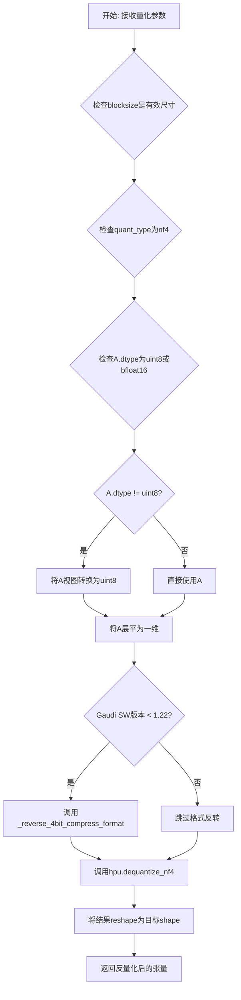
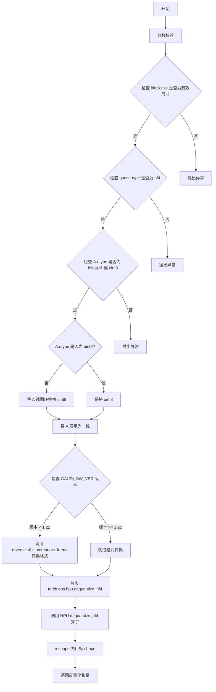

# `bitsandbytes\bitsandbytes\backends\hpu\ops.py` 详细设计文档

该代码实现了一个用于Gaudi HPU（Habana处理单元）的4位NF4量化张量反量化内核，通过register_kernel装饰器注册为'hpu'后端的'bitsandbytes::dequantize_4bit'操作，支持与旧版本Gaudi软件的向后兼容性，并调用HPU专有的dequantize_nf4算子完成实际的反量化操作。

## 整体流程



## 类结构

```
模块文件 (无类定义)
└── 全局函数
    ├── _reverse_4bit_compress_format (内部辅助函数)
    └── dequantize_4bit (注册的HPU内核)
```

## 全局变量及字段


### `GAUDI_SW_VER`
    
用于版本检查，判断Gaudi软件版本是否小于1.22，以决定是否需要反向4位压缩格式

类型：`version object (from ..._ops.utils)`
    


    

## 全局函数及方法


### `_reverse_4bit_compress_format`

该函数是一个4位压缩格式反转辅助函数，用于在标准4-bit压缩格式和IPEX压缩格式之间进行转换。它通过位操作将每个字节中的高4位和低4位进行互换，实现压缩格式的反转，主要用于确保与Gaudi软件旧版本的向后兼容性。

参数：

- `weight`：`torch.Tensor`，输入的权重张量，包含以压缩格式存储的4位权重数据

返回值：`torch.Tensor`，返回反转后的权重张量，格式已从IPEX格式转换回标准格式（或反之）

#### 流程图

```mermaid
flowchart TD
    A[开始] --> B[输入 weight: torch.Tensor]
    B --> C[out_1 = (weight & 0xF0) >> 4<br/>提取高4位并移到低4位]
    C --> D[out_2 = (weight & 0xF) << 4<br/>提取低4位并移到高4位]
    D --> E[out = out_1 | out_2<br/>合并两部分实现4位反转]
    E --> F[返回 out: torch.Tensor]
    F --> G[结束]
```

#### 带注释源码

```python
def _reverse_4bit_compress_format(weight: torch.Tensor):
    """
    将4位压缩格式进行反转（用于格式转换）
    
    参数:
        weight: torch.Tensor - 输入的权重张量
    
    返回:
        torch.Tensor - 反转后的权重张量
    """
    # 提取高4位（0xF0 = 11110000），然后右移4位放到低4位
    out_1 = (weight & 0xF0) >> 4
    
    # 提取低4位（0xF = 00001111），然后左移4位放到高4位
    out_2 = (weight & 0xF) << 4
    
    # 通过或运算合并两部分，实现4位压缩格式的反转
    out = out_1 | out_2
    
    return out
```


### `dequantize_4bit` (bitsandbytes::dequantize_4bit)

该函数是 HPU（Habana Gaudi）上用于将 4-bit NF4 量化张量反量化为浮点张量的核心内核实现，支持与旧版 Gaudi 软件的向后兼容性。

参数：

- `A`：`torch.Tensor`，输入的量化张量，支持 bfloat16 或 uint8 格式
- `absmax`：`torch.Tensor`，量化参数，存储每个块的最大绝对值
- `blocksize`：`int`，量化块大小，用于分组量化
- `quant_type`：`str`，量化类型，当前仅支持 "nf4"
- `shape`：`Sequence[int]`，输出张量的目标形状
- `dtype`：`torch.dtype`，输出张量的数据类型

返回值：`torch.Tensor`，反量化后的浮点张量

#### 流程图



#### 带注释源码

```python
# 装饰器注册：该函数注册为 "bitsandbytes::dequantize_4bit" 操作，在 HPU 后端执行
@register_kernel("bitsandbytes::dequantize_4bit", "hpu")
def _(
    A: torch.Tensor,                    # 输入：4-bit 量化张量（bfloat16 或 uint8 存储格式）
    absmax: torch.Tensor,               # 输入：每个量化块的最大绝对值（缩放因子）
    blocksize: int,                     # 输入：量化块大小，必须为正整数
    quant_type: str,                    # 输入：量化类型，当前仅支持 "nf4"
    shape: Sequence[int],               # 输入：输出张量的目标形状
    dtype: torch.dtype,                 # 输入：输出数据类型（通常为 bfloat16）
) -> torch.Tensor:                      # 输出：反量化后的浮点张量
    
    # 步骤1：参数校验 - 确保 blocksize 是有效的尺寸值
    torch._check_is_size(blocksize)
    
    # 步骤2：校验量化类型必须为 nf4
    torch._check(quant_type == "nf4", lambda: f"quant_type must be nf4, got {quant_type}")
    
    # 步骤3：校验输入张量数据类型必须为 bfloat16 或 uint8
    torch._check(
        A.dtype in [torch.bfloat16, torch.uint8],
        lambda: f"quant_storage supports uint8 or bfloat16, but got {A.dtype}",
    )

    # 步骤4：如果输入不是 uint8，则将其视图转换为 uint8（底层存储格式）
    if A.dtype != torch.uint8:
        A = A.view(torch.uint8)

    # 步骤5：将张量展平为一维，便于后续处理
    A = A.reshape(-1)

    # 步骤6：兼容性处理 - 对于旧版 Gaudi 软件（< 1.22），需要反转 4-bit 压缩格式
    if GAUDI_SW_VER and (GAUDI_SW_VER.major < 1 or GAUDI_SW_VER.minor < 22):
        A = _reverse_4bit_compress_format(A)

    # 步骤7：调用 HPU 专用的 NF4 反量化算子执行核心反量化操作
    # 输入：展平的张量、缩放因子、块大小
    # 输出：指定形状和数据类型的反量化结果
    out_dq = torch.ops.hpu.dequantize_nf4(
        A,
        absmax.to(dtype),               # 将缩放因子转换为目标数据类型
        blocksize,
        out_shape=(math.prod(shape),),  # 计算输出总元素数
        out_dtype=dtype,                 # 指定输出数据类型
    )

    # 步骤8：将一维结果 reshape 为目标形状
    output = out_dq.reshape(shape)

    # 返回反量化后的浮点张量
    return output
```

## 关键组件


### 一段话描述

该代码实现了针对HPU（Habana处理器单元）的4位NF4量化张量的解量化（dequantize）内核，支持与旧版本Gaudi软件的向后兼容，通过位操作反转压缩格式并调用底层HPU原生解量化操作完成张量恢复。

### 文件运行流程

1. 导入依赖模块和HPU操作注册器
2. 定义 `_reverse_4bit_compress_format` 函数用于格式反转（兼容旧版本）
3. 通过 `@register_kernel` 装饰器注册 `dequantize_4bit` 内核到HPU后端
4. 执行解量化：参数校验 → 类型转换 → 格式反转（版本判断） → 调用HPU原生解量化 → 形状重塑

### 全局变量和全局函数

| 名称 | 类型 | 描述 |
|------|------|------|
| `GAUDI_SW_VER` | `utils.GAUDI_SW_VER` | Gaudi软件版本号，用于判断是否需要格式反转 |
| `_reverse_4bit_compress_format` | `function` | 反转4位压缩格式的辅助函数，用于向后兼容 |

### 类信息

本代码无类定义，仅包含模块级函数。

### 函数详细信息

#### 1. `_reverse_4bit_compress_format`

| 项目 | 内容 |
|------|------|
| **名称** | `_reverse_4bit_compress_format` |
| **参数** | `weight: torch.Tensor` - 输入的压缩格式张量 |
| **参数类型** | `torch.Tensor` |
| **返回值类型** | `torch.Tensor` |
| **返回值描述** | 反转压缩格式后的张量 |

**mermaid流程图**：
```mermaid
flowchart TD
    A[输入weight张量] --> B[weight & 0xF0 右移4位]
    C[输入weight张量] --> D[weight & 0xF 左移4位]
    B --> E[out_1]
    D --> F[out_2]
    E --> G[out_1 | out_2]
    F --> G
    G --> H[返回out张量]
```

**源码**：
```python
def _reverse_4bit_compress_format(weight: torch.Tensor):
    out_1 = (weight & 0xF0) >> 4  # 高4位右移到低4位
    out_2 = (weight & 0xF) << 4   # 低4位左移到高4位
    out = out_1 | out_2           # 合并
    return out
```

---

#### 2. `dequantize_4bit` (通过装饰器注册)

| 项目 | 内容 |
|------|------|
| **名称** | `dequantize_4bit` (注册为 "bitsandbytes::dequantize_4bit") |
| **参数** | `A: torch.Tensor` - 量化后的张量存储 |
| **参数** | `absmax: torch.Tensor` - 每个块的最大绝对值 |
| **参数** | `blocksize: int` - 量化块大小 |
| **参数** | `quant_type: str` - 量化类型（仅支持nf4） |
| **参数** | `shape: Sequence[int]` - 输出目标形状 |
| **参数** | `dtype: torch.dtype` - 输出数据类型 |
| **返回值类型** | `torch.Tensor` |
| **返回值描述** | 解量化后的浮点张量 |

**mermaid流程图**：
```mermaid
flowchart TD
    A[输入A, absmax, blocksize, quant_type, shape, dtype] --> B{参数校验}
    B -->|blocksize| C[torch._check_is_size]
    B -->|quant_type| D[检查是否为nf4]
    B -->|A.dtype| E[检查是否为bfloat16或uint8]
    E --> F{是否为uint8?}
    F -->|否| G[A.view(torch.uint8)]
    F -->|是| H[A保持原样]
    G --> I[A.reshape(-1)]
    H --> I
    I --> J{GAUDI_SW_VER &lt; 1.22?}
    J -->|是| K[_reverse_4bit_compress_format]
    J -->|否| L[跳过格式反转]
    K --> M[调用torch.ops.hpu.dequantize_nf4]
    L --> M
    M --> N[out_dq.reshape(shape)]
    N --> O[返回output]
```

**源码**：
```python
@register_kernel("bitsandbytes::dequantize_4bit", "hpu")
def _(
    A: torch.Tensor,
    absmax: torch.Tensor,
    blocksize: int,
    quant_type: str,
    shape: Sequence[int],
    dtype: torch.dtype,
) -> torch.Tensor:
    # 参数校验
    torch._check_is_size(blocksize)
    torch._check(quant_type == "nf4", lambda: f"quant_type must be nf4, got {quant_type}")
    torch._check(
        A.dtype in [torch.bfloat16, torch.uint8],
        lambda: f"quant_storage supports uint8 or bfloat16, but got {A.dtype}",
    )

    # 非uint8类型转换为uint8视图
    if A.dtype != torch.uint8:
        A = A.view(torch.uint8)

    A = A.reshape(-1)

    # 版本兼容：旧版本需要反转压缩格式
    if GAUDI_SW_VER and (GAUDI_SW_VER.major < 1 or GAUDI_SW_VER.minor < 22):
        A = _reverse_4bit_compress_format(A)

    # HPU解量化操作
    out_dq = torch.ops.hpu.dequantize_nf4(
        A,
        absmax.to(dtype),
        blocksize,
        out_shape=(math.prod(shape),),
        out_dtype=dtype,
    )

    # 恢复原始形状
    output = out_dq.reshape(shape)

    return output
```

### 关键组件信息

#### 张量索引与惰性加载

使用 `A.reshape(-1)` 将输入展平为一维，然后在解量化后通过 `output = out_dq.reshape(shape)` 恢复原始形状，实现了解量化的延迟形状恢复，避免中间形状转换开销。

#### 反量化支持

通过注册 `bitsandbytes::dequantize_4bit` 内核到HPU后端，调用 `torch.ops.hpu.dequantize_nf4` 原生操作完成NF4量化张量的解量化，支持 `bfloat16` 和 `uint8` 两种存储格式。

#### 量化策略

采用NF4（Normalized Float 4-bit）量化策略，使用 `absmax` 作为缩放因子，按 `blocksize` 分块进行量化，支持可配置的块大小和输出数据类型。

### 潜在技术债务或优化空间

1. **版本判断逻辑复杂**：`GAUDI_SW_VER.major < 1 or GAUDI_SW_VER.minor < 22` 的判断逻辑在 `minor` 为0时会出错，应使用更健壮的版本比较方式
2. **硬编码版本阈值**：版本号 1.22 硬编码在代码中，建议提取为配置常量
3. **缺少量化类型扩展**：目前仅支持NF4，未来可能需要支持其他4位量化格式（如FP4）
4. **错误信息不够详细**：参数校验失败时的错误信息可以包含更多调试信息

### 其它项目

#### 设计目标与约束

- **目标**：为Habana Gaudi HPU提供高性能的4位NF4量化张量解量化能力
- **约束**：仅支持NF4量化类型，输入存储格式限定为uint8或bfloat16

#### 错误处理与异常设计

使用 `torch._check` 和 `torch._check_is_size` 进行运行时参数校验，确保：
- `blocksize` 为有效的尺寸值
- `quant_type` 必须为 "nf4"
- 输入张量数据类型符合要求

#### 数据流与状态机

数据流为：压缩张量(A) → 展平 → [条件格式反转] → HPU解量化 → 形状恢复 → 浮点输出

#### 外部依赖与接口契约

- 依赖 `torch.ops.hpu.dequantize_nf4` 底层HPU操作
- 通过 `register_kernel` 装饰器遵循HPU内核注册协议
- 依赖 `GAUDI_SW_VER` 全局变量获取软件版本信息


## 问题及建议


### 已知问题

-   **版本检查逻辑缺陷**：`GAUDI_SW_VER.major < 1 or GAUDI_SW_VER.minor < 22` 的判断逻辑存在严重错误，当 major >= 1 但 minor 较小（如 major=2, minor=10）时会错误地应用旧格式转换，应改为 `GAUDI_SW_VER.major < 1 or (GAUDI_SW_VER.major == 1 and GAUDI_SW_VER.minor < 22)`
-   **缺少 shape 有效性验证**：参数 `shape` 只在最后用于 reshape，但没有验证其元素乘积是否与 reshape 后的元素数量匹配，可能导致运行时错误
-   **缺少 absmax 张量验证**：没有验证 `absmax` 张量的形状和维度是否与 weight、blocksize 匹配
-   **缺少 dtype 有效性验证**：虽然检查了 A 的 dtype，但没有验证输出的 `dtype` 是否为有效的浮点类型（如 bfloat16, float16, float32）
-   **空张量边界情况未处理**：没有处理 A 为空或 blocksize 为 0 的边界情况
-   **硬编码值缺乏注释**：代码中的魔数（如 0xF0, 0xF, 4, 22）缺乏解释性注释

### 优化建议

-   **修复版本检查逻辑**：修正版本比较逻辑或提取为独立的版本判断函数 `_needs_reverse_compress_format()`
-   **添加输入验证**：增加对 shape、absmax、dtype 的验证逻辑，确保与量化参数一致
-   **添加边界情况处理**：处理 A 为空、blocksize <= 0 等异常输入
-   **提取向后兼容逻辑**：将版本检查和格式转换逻辑提取为独立的辅助函数，并添加明确的文档说明
-   **增加类型注解精度**：将 `shape: Sequence[int]` 改为 `shape: Tuple[int, ...]` 或 `shape: List[int]`，增加代码可读性
-   **添加文档字符串**：为 `_reverse_4bit_compress_format` 和主函数添加详细的 docstring，说明参数含义和返回值

## 其它


### 设计目标与约束

该代码的核心目标是在华为Gaudi (HPU) 设备上实现4位NF4量化张量的解量化(dequantize)操作，支持与旧版本Gaudi软件的后向兼容性。设计约束包括：仅支持NF4量化类型、输入张量 dtype 必须为 torch.bfloat16 或 torch.uint8、blocksize 必须为正整数、受限于特定Gaudi软件版本(GAUDI_SW_VER >= 1.22)的原生支持。

### 错误处理与异常设计

代码使用 PyTorch 内置的检查函数进行错误处理：`torch._check_is_size(blocksize)` 验证 blocksize 为有效的尺寸值；`torch._check(quant_type == "nf4", ...)` 确保量化类型为 NF4；`torch._check(A.dtype in [...], ...)` 验证输入数据类型合法。所有错误均通过 lambda 函数返回描述性错误信息，格式为 f-string 包含实际获得的参数值，便于调试定位问题。

### 数据流与状态机

数据流处理流程如下：1) 接收输入张量 A、absmax、blocksize、quant_type、shape、dtype 参数；2) 将 A 转换为 uint8 类型（如需要）；3) 将 A reshape 为一维张量；4) 判断 GAUDI_SW_VER 版本，若版本小于 1.22 则调用 `_reverse_4bit_compress_format` 进行格式转换；5) 调用 HPU 原生解量化操作 `torch.ops.hpu.dequantize_nf4`；6) 将结果 reshape 为目标 shape 并返回。状态转换主要体现在 dtype 转换（A.dtype 转换）和 shape 转换（一维与多维之间）。

### 外部依赖与接口契约

主要外部依赖包括：`torch` (PyTorch 核心库)、`collections.abc.Sequence` (序列类型抽象)、`math` (数学运算)、`..._ops` 中的 `register_kernel` 装饰器 (Gaudi 特定内核注册机制)、`..utils` 中的 `GAUDI_SW_VER` (Gaudi 软件版本常量)。接口契约方面：输入参数 A 为量化后的张量、absmax 为量化块的最大绝对值、blocksize 为量化块大小、quant_type 必须为字符串 "nf4"、shape 为目标输出形状、dtype 为输出数据类型；返回值为解量化后的浮点张量。

### 关键组件信息

_reverse_4bit_compress_format: 用于在旧版 Gaudi 软件中转换 4 位压缩格式的辅助函数，负责将标准格式与 ipex 格式进行互换。register_kernel 装饰器: Gaudi 特定的内核注册机制，将函数绑定到特定操作和设备。GAUDI_SW_VER: 全局版本常量，用于判断当前 Gaudi 软件版本以决定是否需要格式转换。torch.ops.hpu.dequantize_nf4: HPU 原生解量化操作，实现核心的 NF4 解码逻辑。

### 潜在技术债务与优化空间

版本兼容性逻辑混合在主流程中，可考虑提取为独立适配层以提高代码可读性；错误信息可以更加详细，包含更多上下文信息；blocksize 的有效性检查可扩展为范围检查而非仅类型检查；对于未来的量化类型支持（如 fp4），当前架构需要较大改动。

    