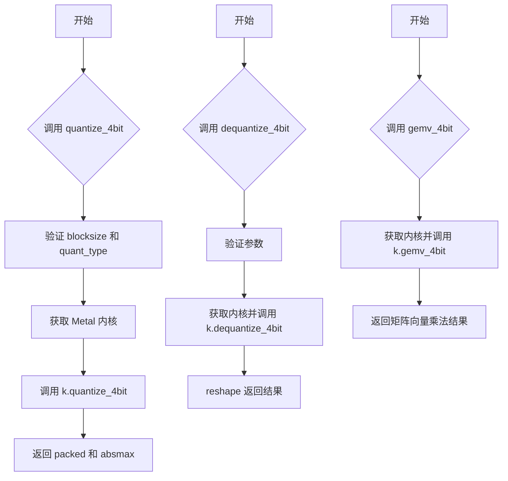
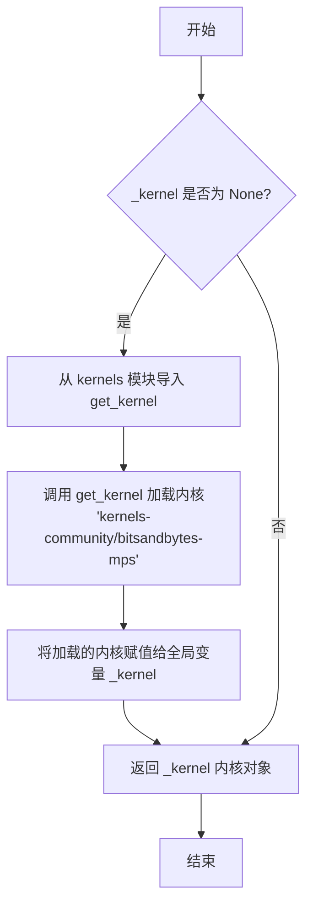
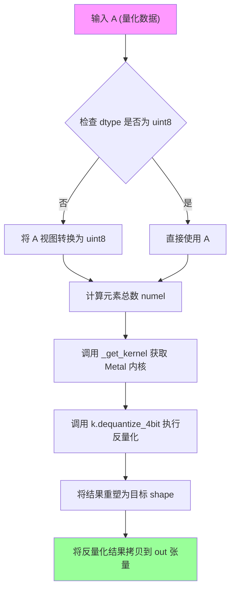
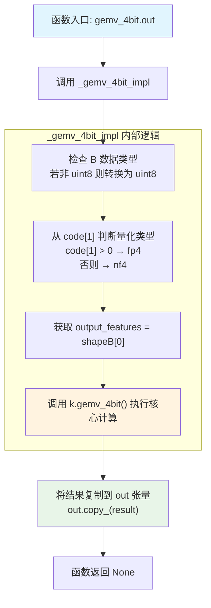

# `bitsandbytes\bitsandbytes\backends\mps\ops.py` 详细设计文档

MPS (Metal Performance Shaders) 后端实现，为 bitsandbytes 4-bit 量化操作提供 Metal 内核支持，包括 4bit 量化、解量化和矩阵向量乘法 (gemv) 功能，通过 HuggingFace Kernels Hub 延迟加载 Metal 内核。

## 整体流程



## 类结构

```
模块: bitsandbytes_mps (无类定义)
├── 全局变量
│   ├── _QUANT_MAP (量化类型映射)
│   └── _kernel (延迟加载的内核)
├── 工具函数
│   └── _get_kernel (内核加载器)
├── 实现函数
│   ├── _dequantize_4bit_impl
│   └── _gemv_4bit_impl
└── 注册的 Kernel 函数 (通过装饰器)
    ├── quantize_4bit
    ├── dequantize_4bit
    ├── dequantize_4bit.out
    ├── gemv_4bit
    └── gemv_4bit.out
```

## 全局变量及字段


### `_QUANT_MAP`
    
量化类型映射表，将字符串(fp4/nf4)映射到Metal内核使用的整数标识

类型：`dict[str, int]`
    


### `_kernel`
    
延迟加载的bitsandbytes-mps内核单例，首次调用_get_kernel时初始化

类型：`Optional[Any]`
    


    

## 全局函数及方法


### `_get_kernel`

获取或加载 bitsandbytes-mps Metal 内核的延迟加载函数，确保内核只在首次调用时初始化，后续调用直接返回缓存的内核实例。

参数：

- （无参数）

返回值：`Any`（内核对象），返回包含 `quantize_4bit`、`dequantize_4bit`、`gemv_4bit` 方法的内核对象

#### 流程图



#### 带注释源码

```python
_kernel = None  # 全局变量，缓存已加载的内核对象，初始为 None


def _get_kernel():
    """Lazily load the bitsandbytes-mps kernel (local build or Hub)."""
    global _kernel  # 声明使用全局变量 _kernel
    if _kernel is None:  # 检查内核是否已加载
        from kernels import get_kernel  # 动态导入内核获取函数

        # TODO: use kernels-community/bitsandbytes-mps when it's available
        _kernel = get_kernel("kernels-community/bitsandbytes-mps")  # 加载指定的内核
    return _kernel  # 返回已加载/缓存的内核对象
```


### `quantize_4bit`

该函数是 bitsandbytes 4-bit 量化操作在 MPS (Metal Performance Shaders) 后端的实现，接收输入张量、量化块大小、量化类型和存储数据类型，执行 4-bit 量化并返回打包后的量化数据及其绝对最大值。

参数：

- `A`：`torch.Tensor`，输入的待量化张量
- `blocksize`：`int`，量化块大小，必须为 64、128、256 或 512 之一
- `quant_type`：`str`，量化类型，支持 "fp4" 或 "nf4"
- `quant_storage`：`torch.dtype`，量化后的存储数据类型

返回值：`tuple[torch.Tensor, torch.Tensor]`，包含打包后的量化张量（形状调整后）和绝对最大值张量

#### 流程图

```mermaid
flowchart TD
    A[开始 quantize_4bit] --> B{验证 blocksize 是否合法}
    B -->|合法| C{验证 quant_type 是否合法}
    B -->|不合法| D[抛出 RuntimeError]
    C -->|合法| E[调用 _get_kernel 获取内核]
    C -->|不合法| D
    E --> F[调用 k.quantize_4bit 执行量化]
    F --> G[将 packed 转换为 quant_storage 类型]
    G --> H[对 packed 进行 unsqueeze 操作]
    I[返回 (packed, absmax)]
    H --> I
```

#### 带注释源码

```python
@register_kernel("bitsandbytes::quantize_4bit", "mps")
def _(
    A: torch.Tensor,          # 输入张量，待量化的数据
    blocksize: int,           # 量化块大小，必须为 64/128/256/512
    quant_type: str,          # 量化类型，"fp4" 或 "nf4"
    quant_storage: torch.dtype,  # 量化后的存储数据类型
) -> tuple[torch.Tensor, torch.Tensor]:
    """MPS 后端的 4-bit 量化实现函数。
    
    该函数被注册为 bitsandbytes::quantize_4bit 内核的 MPS 实现，
    用于将输入张量进行 4-bit 量化。
    """
    # 检查 blocksize 是否在支持的值列表中
    torch._check(blocksize in [64, 128, 256, 512])
    # 检查 quant_type 是否为支持的量化类型
    torch._check(quant_type in ("fp4", "nf4"))

    # 懒加载 bitsandbytes-mps 内核
    k = _get_kernel()
    # 调用 Metal 内核执行实际的 4-bit 量化操作
    # 将 quant_type 字符串转换为内核使用的整数编码
    packed, absmax = k.quantize_4bit(A.contiguous(), blocksize, _QUANT_MAP[quant_type])

    # 将 packed 转换为指定的 quant_storage 类型并调整维度
    # unsqueeze(1) 在第1维添加一个维度，用于后续矩阵运算
    packed = packed.view(quant_storage).unsqueeze(1)

    # 返回打包后的量化数据和绝对最大值（用于反量化）
    return packed, absmax
```


### `_dequantize_4bit_impl`

该函数是 MPS (Metal Performance Shaders) 后端的 4-bit 反量化核心实现，负责将压缩的 4-bit 量化数据解压缩为原始精度（float32 等）的张量。它通过 Metal kernel 执行实际的 GPU 反量化运算。

参数：

- `A`：`torch.Tensor`，压缩后的 4-bit 量化数据张量
- `absmax`：`torch.Tensor`，每个量化块的绝对最大值，用于反量化计算
- `blocksize`：`int`，量化块大小（64, 128, 256, 512 之一）
- `quant_type`：`str`，量化类型，值为 "fp4" 或 "nf4"
- `shape`：`Sequence[int]`，输出张量的目标形状
- `dtype`：`torch.dtype`，输出张量的目标数据类型

返回值：`torch.Tensor`，反量化后的浮点张量，形状为指定的 shape

#### 流程图

```mermaid
flowchart TD
    A[开始] --> B{检查 A.dtype == torch.uint8?}
    B -->|否| C[将 A 转换为 torch.uint8]
    B -->|是| D[继续]
    C --> D
    D --> E[计算 numel = prod(shape)]
    E --> F[获取 Metal Kernel]
    F --> G[调用 k.dequantize_4bit 方法]
    G --> H[将输出 reshape 为 shape]
    H --> I[返回反量化结果]
```

#### 带注释源码

```python
def _dequantize_4bit_impl(
    A: torch.Tensor,
    absmax: torch.Tensor,
    blocksize: int,
    quant_type: str,
    shape: Sequence[int],
    dtype: torch.dtype,
) -> torch.Tensor:
    """MPS 后端 4-bit 反量化核心实现函数。
    
    参数:
        A: 压缩后的 4-bit 量化数据张量
        absmax: 每个量化块的绝对最大值，用于反量化计算
        blocksize: 量化块大小，支持 64, 128, 256, 512
        quant_type: 量化类型，"fp4" 或 "nf4"
        shape: 输出张量的目标形状
        dtype: 输出张量的目标数据类型
    
    返回:
        反量化后的浮点张量
    """
    # 确保输入数据是 uint8 格式（MPS kernel 要求）
    if A.dtype != torch.uint8:
        A = A.view(torch.uint8)

    # 计算输出张量的总元素数量
    numel = prod(shape)
    
    # 懒加载 Metal kernel（首次调用时加载）
    k = _get_kernel()
    
    # 调用 Metal kernel 执行实际的 4-bit 反量化运算
    # 参数包括：量化数据、absmax、块大小、量化类型映射、元素数量、目标数据类型
    out = k.dequantize_4bit(A, absmax, blocksize, _QUANT_MAP[quant_type], numel, dtype)
    
    # 将反量化结果 reshape 为目标形状并返回
    return out.reshape(shape)
```


### `dequantize_4bit`

该函数是 bitsandbytes 4-bit quantization 的 MPS（Metal Performance Shaders）后端实现，用于将量化后的 4-bit 数据解量化回浮点张量。它接受量化数据、绝对最大值、块大小、量化类型、目标形状和数据类型作为输入，通过 Metal 内核执行解量化操作并返回解量化后的浮点张量。

参数：

- `A`：`torch.Tensor`，量化后的张量数据（通常为 uint8 类型）
- `absmax`：`torch.Tensor`，用于解量化的绝对最大值（每 block 的缩放因子）
- `blocksize`：`int`，量化块大小，必须是 64、128、256 或 512 之一
- `quant_type`：`str`，量化类型，支持 "fp4"（浮点4位）或 "nf4"（归一化浮点4位）
- `shape`：`Sequence[int]`，解量化后张量的目标形状
- `dtype`：`torch.dtype`，解量化后张量的目标数据类型

返回值：`torch.Tensor`，解量化后的浮点张量，形状为指定的 shape，数据类型为指定的 dtype

#### 流程图

```mermaid
flowchart TD
    A[开始 dequantize_4bit] --> B{检查 blocksize 是否有效}
    B -->|有效| C{检查 quant_type 是否有效}
    B -->|无效| D[抛出 RuntimeError]
    C -->|有效| E{检查 A.dtype 是否为 uint8}
    C -->|无效| D
    E -->|是| F[调用 _dequantize_4bit_impl]
    E -->|否| G[将 A 视图转换为 uint8]
    G --> F
    F --> H[计算 numel = prod(shape)]
    H --> I[获取 Metal 内核]
    I --> J[调用内核的 dequantize_4bit 方法]
    J --> K[将结果 reshape 为 shape]
    K --> L[返回解量化后的张量]
```

#### 带注释源码

```python
@register_kernel("bitsandbytes::dequantize_4bit", "mps")
def _(
    A: torch.Tensor,
    absmax: torch.Tensor,
    blocksize: int,
    quant_type: str,
    shape: Sequence[int],
    dtype: torch.dtype,
) -> torch.Tensor:
    """MPS 后端的 4-bit 解量化核心函数.
    
    参数:
        A: 量化后的张量数据, 通常是 uint8 类型
        absmax: 每 block 的绝对最大值, 用于反量化时的缩放
        blocksize: 量化使用的块大小, 必须是 [64, 128, 256, 512] 之一
        quant_type: 量化类型字符串, 支持 "fp4" 或 "nf4"
        shape: 输出张量的目标形状
        dtype: 输出张量的数据类型
    
    返回:
        解量化后的浮点张量
    """
    # 验证 blocksize 是否为支持的块大小
    torch._check(blocksize in [64, 128, 256, 512])
    
    # 验证 quant_type 是否为支持的量化类型
    torch._check(quant_type in ("fp4", "nf4"))
    
    # 调用内部实现函数执行实际的解量化操作
    return _dequantize_4bit_impl(A, absmax, blocksize, quant_type, shape, dtype)


def _dequantize_4bit_impl(
    A: torch.Tensor,
    absmax: torch.Tensor,
    blocksize: int,
    quant_type: str,
    shape: Sequence[int],
    dtype: torch.dtype,
) -> torch.Tensor:
    """4-bit 解量化的内部实现函数.
    
    该函数负责:
    1. 确保输入张量 A 为 uint8 类型
    2. 计算输出张量的元素总数
    3. 调用 Metal 内核执行解量化
    4. 将结果 reshape 为目标形状
    
    参数:
        A: 量化后的张量数据
        absmax: 绝对最大值张量
        blocksize: 块大小
        quant_type: 量化类型
        shape: 目标输出形状
        dtype: 目标数据类型
    
    返回:
        解量化后的张量
    """
    # 如果输入张量不是 uint8 类型, 则进行视图转换
    # 这是为了确保数据格式符合内核期望
    if A.dtype != torch.uint8:
        A = A.view(torch.uint8)
    
    # 计算输出张量的总元素数量
    numel = prod(shape)
    
    # 获取 Metal 内核 (延迟加载)
    k = _get_kernel()
    
    # 调用内核的 dequantize_4bit 方法执行解量化
    # 参数包括: 输入数据、absmax、blocksize、量化类型映射、元素数量、数据类型
    out = k.dequantize_4bit(A, absmax, blocksize, _QUANT_MAP[quant_type], numel, dtype)
    
    # 将输出 reshape 为目标形状并返回
    return out.reshape(shape)
```


### `dequantize_4bit.out`

该函数是 bitsandbytes 4-bit 反量化操作的 MPS（Metal Performance Shaders）后端实现，通过调用 Metal 内核将量化后的 4 位数据（fp4 或 nf4 格式）反量化为原始精度张量，并支持就地写入输出张量。

参数：

- `A`：`torch.Tensor`，量化后的输入张量，包含打包的 4 位权重数据
- `absmax`：`torch.Tensor`，每个量化块的绝对最大值，用于反量化计算
- `blocksize`：`int`，量化块大小，必须是 [64, 128, 256, 512] 之一
- `quant_type`：`str`，量化类型，必须是 "fp4" 或 "nf4"
- `shape`：`Sequence[int]`，输出张量的目标形状
- `dtype`：`torch.dtype`，输出张量的数据类型
- `out`：`torch.Tensor`，就地写入的目标输出张量

返回值：`None`，结果直接写入到 `out` 参数中

#### 流程图



#### 带注释源码

```python
@register_kernel("bitsandbytes::dequantize_4bit.out", "mps")
def _(
    A: torch.Tensor,
    absmax: torch.Tensor,
    blocksize: int,
    quant_type: str,
    shape: Sequence[int],
    dtype: torch.dtype,
    out: torch.Tensor,
) -> None:
    """4-bit 反量化 kernel 的 out 变体，就地写入输出张量。
    
    参数:
        A: 量化后的输入张量，打包成 uint8 格式的 4 位数据
        absmax: 每个量化块的绝对最大值，用于反量化缩放
        blocksize: 量化块大小，必须是 [64, 128, 256, 512]
        quant_type: 量化类型，"fp4" 或 "nf4"
        shape: 输出张量的目标形状
        dtype: 输出张量的数据类型
        out: 就地写入的目标输出张量
    
    返回:
        None，结果直接写入到 out 参数中
    """
    # 调用内部实现函数执行实际反量化操作
    # 该函数处理 dtype 转换、形状重塑等细节
    result = _dequantize_4bit_impl(A, absmax, blocksize, quant_type, shape, dtype)
    
    # 将反量化结果拷贝到指定的输出张量中，实现就地写入
    out.copy_(result)
```

---

### `_dequantize_4bit_impl`（内部实现函数）

参数：

- `A`：`torch.Tensor`，量化后的输入张量
- `absmax`：`torch.Tensor`，每个量化块的绝对最大值
- `blocksize`：`int`，量化块大小
- `quant_type`：`str`，量化类型 ("fp4" 或 "nf4")
- `shape`：`Sequence[int]`，输出张量的目标形状
- `dtype`：`torch.dtype`，输出张量的数据类型

返回值：`torch.Tensor`，反量化后的浮点张量

#### 带注释源码

```python
def _dequantize_4bit_impl(
    A: torch.Tensor,
    absmax: torch.Tensor,
    blocksize: int,
    quant_type: str,
    shape: Sequence[int],
    dtype: torch.dtype,
) -> torch.Tensor:
    """4-bit 反量化的核心实现逻辑。
    
    参数:
        A: 量化后的输入张量
        absmax: 每个量化块的绝对最大值
        blocksize: 量化块大小
        quant_type: 量化类型，"fp4" 或 "nf4"
        shape: 输出张量的目标形状
        dtype: 输出张量的数据类型
    
    返回:
        反量化后的浮点张量
    """
    # 确保输入数据是 uint8 格式，因为 4 位数据打包在字节中
    if A.dtype != torch.uint8:
        A = A.view(torch.uint8)
    
    # 计算输出张量的元素总数
    numel = prod(shape)
    
    # 获取 Metal 内核（延迟加载）
    k = _get_kernel()
    
    # 调用 Metal 内核执行实际反量化操作
    # 参数: 输入数据, absmax, 块大小, 量化类型映射, 元素数, 目标 dtype
    out = k.dequantize_4bit(A, absmax, blocksize, _QUANT_MAP[quant_type], numel, dtype)
    
    # 将结果重塑为目标形状并返回
    return out.reshape(shape)
```


### `_gemv_4bit_impl`

该函数实现4-bit量化矩阵向量乘法（GEMV），将输入矩阵A与量化后的权重矩阵B进行矩阵乘法运算，同时利用abs_max值进行反量化，返回浮点结果。

参数：

- `A`：`torch.Tensor`，输入的激活矩阵
- `B`：`torch.Tensor`，4-bit量化后的权重矩阵（内部存储为uint8）
- `shapeB`：`Sequence[int]`，权重矩阵B的形状，用于确定输出维度
- `absmax`：`torch.Tensor`，每个量化块的绝对最大值，用于反量化
- `code`：`torch.Tensor`，编码信息张量，通过code[1]判断量化类型（fp4或nf4）
- `blocksize`：`int`，量化块大小，必须为64、128、256或512之一

返回值：`torch.Tensor`，矩阵向量乘法的浮点结果

#### 流程图

```mermaid
flowchart TD
    A[开始] --> B{检查B的数据类型}
    B -->|不是uint8| C[B.view转换为uint8]
    B -->|是uint8| D[继续]
    C --> D
    D --> E[从code[1]判断量化类型]
    E --> F[获取output_features从shapeB[0]]
    F --> G[调用_get_kernel获取MPS kernel]
    G --> H[调用k.gemv_4bit执行量化矩阵乘法]
    H --> I[返回结果张量]
```

#### 带注释源码

```python
def _gemv_4bit_impl(
    A: torch.Tensor,          # 输入激活矩阵 (通常是浮点张量)
    B: torch.Tensor,          # 量化后的权重矩阵 (存储为uint8)
    shapeB: Sequence[int],    # 权重矩阵的形状 [output_features, ...]
    absmax: torch.Tensor,     # 每个块的绝对最大值，用于反量化
    code: torch.Tensor,       # 编码信息，通过code[1]判断量化类型
    blocksize: int,           # 量化块大小
) -> torch.Tensor:
    """执行4-bit量化矩阵向量乘法 (GEMV)
    
    该函数是bitsandbytes 4-bit量化在MPS后端的核心计算实现。
    它将输入矩阵A与量化后的权重矩阵B相乘，结果自动反量化为浮点数。
    """
    
    # 确保权重矩阵B是uint8类型（MPS kernel要求的格式）
    if B.dtype != torch.uint8:
        B = B.view(torch.uint8)

    # 根据code[1]判断量化类型：>0为fp4，否则为nf4
    # _QUANT_MAP = {"fp4": 1, "nf4": 2}
    quant_type_int = _QUANT_MAP["fp4"] if code[1] > 0 else _QUANT_MAP["nf4"]
    
    # 从shapeB获取输出特征维度
    output_features = shapeB[0]

    # 获取MPS kernel（延迟加载）
    k = _get_kernel()
    
    # 调用Metal kernel执行量化GEMV
    # 参数: A, B, absmax, output_features, blocksize, quant_type_int
    # 返回: 浮点类型的矩阵乘法结果
    return k.gemv_4bit(A, B, absmax, output_features, blocksize, quant_type_int)
```


### `gemv_4bit`

该函数执行 4-bit 量化矩阵向量乘法 (Generalized Matrix-Vector Multiplication)，利用 Metal Performance Shaders (MPS) 后端和 bitsandbytes 4-bit 量化技术，实现高效的量化权重与输入矩阵的乘法运算。

参数：

- `A`：`torch.Tensor`，输入矩阵/向量
- `B`：`torch.Tensor`，量化后的 4-bit 权重矩阵（存储为 uint8 格式）
- `shapeB`：`Sequence[int]`，权重矩阵 B 的原始形状，用于确定输出特征维度
- `absmax`：`torch.Tensor`，每个量化块的最大绝对值，用于反量化
- `code`：`torch.Tensor`，量化代码张量，其第二个元素决定量化类型（fp4 或 nf4）
- `blocksize`：`int`，量化块大小，必须为 64、128、256 或 512 之一

返回值：`torch.Tensor`，矩阵向量乘法的结果张量

#### 流程图

```mermaid
flowchart TD
    A[输入 A] --> B1{检查 B 数据类型}
    B1 -->|不是 uint8| C1[将 B 转换为 uint8]
    B1 -->|是 uint8| C2[继续]
    C1 --> C2
    
    C2 --> D[从 code[1] 判断量化类型]
    D -->|code[1] > 0| E[quant_type_int = 1<br/>fp4]
    D -->|code[1] <= 0| F[quant_type_int = 2<br/>nf4]
    
    E --> G[提取 output_features = shapeB[0]]
    F --> G
    
    G --> H[调用 _get_kernel 获取内核]
    H --> I[k.gemv_4bit 执行计算]
    I --> J[返回结果张量]
```

#### 带注释源码

```python
def _gemv_4bit_impl(
    A: torch.Tensor,
    B: torch.Tensor,
    shapeB: Sequence[int],
    absmax: torch.Tensor,
    code: torch.Tensor,
    blocksize: int,
) -> torch.Tensor:
    """4-bit 量化矩阵向量乘法的内部实现函数。
    
    参数:
        A: 输入矩阵/向量张量
        B: 量化后的权重矩阵（packed 格式）
        shapeB: 权重矩阵的原始形状，用于确定输出维度
        absmax: 量化块的最大绝对值，用于反量化
        code: 量化类型代码，code[1] 决定使用 fp4 还是 nf4
        blocksize: 量化块大小
    
    返回:
        矩阵向量乘法的结果张量
    """
    # 确保 B 是 uint8 类型，如果不是则进行视图转换
    # 这是因为 4-bit 数据以 2 个值 packed 到一个字节中
    if B.dtype != torch.uint8:
        B = B.view(torch.uint8)

    # 根据 code[1] 的值判断量化类型
    # code[1] > 0 表示使用 FP4 ( Floating Point 4-bit )
    # code[1] <= 0 表示使用 NF4 ( Normal Float 4-bit )
    quant_type_int = _QUANT_MAP["fp4"] if code[1] > 0 else _QUANT_MAP["nf4"]
    
    # 从 shapeB 中提取输出特征维度（权重矩阵的行数）
    output_features = shapeB[0]

    # 获取 Metal 内核（延迟加载）
    k = _get_kernel()
    
    # 调用 Metal 内核执行 4-bit 量化 GEMV
    # 参数: 输入 A, 量化权重 B, absmax, 输出特征数, 块大小, 量化类型
    return k.gemv_4bit(A, B, absmax, output_features, blocksize, quant_type_int)


@register_kernel("bitsandbytes::gemv_4bit", "mps")
def _(
    A: torch.Tensor,
    B: torch.Tensor,
    shapeB: Sequence[int],
    absmax: torch.Tensor,
    code: torch.Tensor,
    blocksize: int,
) -> torch.Tensor:
    """注册的 MPS 设备上的 gemv_4bit 操作入口点。
    
    通过 register_kernel 装饰器将函数注册到 bitsandbytes::gemv_4bit 操作，
    设备类型为 mps (Metal Performance Shaders)。
    """
    return _gemv_4bit_impl(A, B, shapeB, absmax, code, blocksize)


@register_kernel("bitsandbytes::gemv_4bit.out", "mps")
def _(
    A: torch.Tensor,
    B: torch.Tensor,
    shapeB: Sequence[int],
    absmax: torch.Tensor,
    code: torch.Tensor,
    blocksize: int,
    out: torch.Tensor,
) -> None:
    """带输出张量的 gemv_4bit 变体，避免额外的内存分配。
    
    参数:
        out: 预分配的结果张量，结果将直接写入此张量
    """
    result = _gemv_4bit_impl(A, B, shapeB, absmax, code, blocksize)
    out.copy_(result)
```


### gemv_4bit.out

该函数是 bitsandbytes 4-bit 量化 GEMV（通用矩阵-向量乘法）运算的 MPS（Metal Performance Shaders）后端实现。通过调用底层 Metal 内核执行高效的 4-bit 量化矩阵向量乘法运算，支持 FP4 和 NF4 两种量化类型，并将结果写入预分配的输出张量中。

参数：

- `A`：`torch.Tensor`，输入矩阵（通常为权重矩阵），要求连续内存布局
- `B`：`torch.Tensor`，输入向量/矩阵（通常为激活值），要求连续内存布局
- `shapeB`：`Sequence[int]`，B 的形状，用于确定输出维度
- `absmax`：`torch.Tensor`，量化块的绝对最大值张量，用于反量化计算
- `code`：`torch.Tensor`，量化编码张量，通过 `code[1]` 判断量化类型（>0 为 FP4，否则为 NF4）
- `blocksize`：`int`，量化块大小，必须为 64、128、256 或 512 之一
- `out`：`torch.Tensor`，预分配的输出张量，用于存储计算结果

返回值：`None`，计算结果通过 `out.copy_(result)` 直接写入到输出张量中

#### 流程图



#### 带注释源码

```python
@register_kernel("bitsandbytes::gemv_4bit.out", "mps")
def _(
    A: torch.Tensor,
    B: torch.Tensor,
    shapeB: Sequence[int],
    absmax: torch.Tensor,
    code: torch.Tensor,
    blocksize: int,
    out: torch.Tensor,
) -> None:
    """MPS 后端实现：4-bit 量化 GEMV 运算，结果写入预分配张量。
    
    参数:
        A: 输入权重矩阵（已量化数据）
        B: 输入激活向量/矩阵（待相乘数据）
        shapeB: B 的原始形状，用于确定输出维度
        absmax: 量化块的绝对最大值，用于反量化
        code: 量化编码，通过 code[1] 判断量化类型
        blocksize: 量化块大小，必须为 64/128/256/512
        out: 预分配的输出张量
    
    返回:
        None，结果通过 in-place 写入 out 张量
    """
    # 调用内部实现函数执行核心计算
    # 该函数会：
    # 1. 确保 B 为 uint8 类型（量化数据格式）
    # 2. 根据 code[1] 判断使用 FP4 还是 NF4 量化
    # 3. 调用 Metal 内核执行 GEMV 计算
    result = _gemv_4bit_impl(A, B, shapeB, absmax, code, blocksize)
    
    # 将计算结果复制到预分配的输出张量中
    # 使用 copy_ 进行显式复制而非赋值，确保张量内存正确管理
    out.copy_(result)
```

## 关键组件


### 量化类型映射 (_QUANT_MAP)

将 bitsandbytes 使用的字符串量化类型（"fp4"、"nf4"）映射到 Metal 内核使用的整数值（1、2）。

### 惰性内核加载 (_get_kernel)

延迟加载 bitsandbytes-mps Metal 内核，仅在首次调用时从 kernels 模块获取，支持本地构建或 Hub 远程加载。

### 4-bit 量化操作 (quantize_4bit)

将输入张量量化为 4-bit 格式，支持 FP4 和 NF4 量化类型，返回压缩后的张量和绝对最大值(absmax)。

### 4-bit 反量化操作 (dequantize_4bit)

将 4-bit 量化张量还原为浮点精度，支持指定输出形状和数据类型，提供 in-place 输出模式。

### 4-bit 矩阵向量乘法 (gemv_4bit)

执行 4-bit 量化矩阵与浮点向量的乘法运算，根据量化代码动态判断使用 FP4 或 NF4 解码方式。

### 内核注册机制 (register_kernel)

通过装饰器模式将量化操作注册到 PyTorch 的 MPS 后端调度系统，实现算子分发。


## 问题及建议


### 已知问题

- **全局变量线程安全风险**：`_kernel` 全局变量在多线程环境下可能被并发访问和初始化，存在潜在的竞态条件，缺乏线程锁保护机制
- **硬编码依赖路径**：TODO 注释表明当前使用硬编码的 kernel 路径 `"kernels-community/bitsandbytes-mps"`，缺少动态配置能力
- **错误处理不完善**：仅使用 `torch._check` 做基础参数校验，未检查输入 tensor 的 device 是否匹配、shape 有效性、以及 kernel 加载失败等异常情况
- **量化类型映射扩展性差**：`_QUANT_MAP` 字典硬编码了 fp4 和 nf4 两种类型，若需扩展量化格式需要修改多处代码，缺乏统一管理
- **code 参数逻辑不透明**：`quant_type_int = _QUANT_MAP["fp4"] if code[1] > 0 else _QUANT_MAP["nf4"]` 的逻辑没有任何注释说明，code[1] 的含义和判断依据不清晰
- **类型提示不够精确**：quant_type 参数应使用 `Literal["fp4", "nf4"]` 替代 `str`，返回值 tuple 可以更具体地标注 tensor 维度
- **魔法数字缺乏解释**：blocksize 允许值 [64, 128, 256, 512] 和 _QUANT_MAP 的值 [1, 2] 都是魔法数字，缺少常量定义或注释说明其含义

### 优化建议

- 使用 `threading.Lock` 保护全局 `_kernel` 的初始化过程，或使用 Python 3.11+ 的 `threading.local()` 实现线程安全的延迟加载
- 将 kernel 路径提取为可配置的模块级变量或环境变量，支持从配置文件或参数动态指定
- 增加输入验证：检查 A、absmax、B 等 tensor 必须在 MPS device 上，验证 shape 维度一致性，为 kernel 加载失败添加 try-except 包装
- 将 _QUANT_MAP 改为枚举类或 dataclass，并添加方法来支持动态注册新的量化类型
- 为 code 参数及其索引含义添加详细的文档字符串，说明 code tensor 的结构和各字段用途
- 完善类型提示，使用 `typing.Literal` 约束 quant_type 可选值，使用 `typing.TypeAlias` 定义类型别名
- 将 blocksize 允许值定义为模块级常量列表，并添加注释说明各值的适用场景和性能特点
- 为关键函数添加 docstring，说明参数含义、返回值和使用示例
- 考虑使用 `torch.empty_like` 或 in-place 操作替代 `out.copy_(result)` 以减少内存分配

## 其它


### 设计目标与约束

本模块旨在为PyTorch提供Metal Performance Shaders (MPS) 后端支持的4位量化操作，实现与bitsandbytes库在GPU计算上的兼容。设计约束包括：仅支持blocksize为64、128、256、512的量化块大小；仅支持fp4和nf4两种量化类型；依赖kernels-community/bitsandbytes-mps内核；必须在Apple Silicon Mac上运行（MPS要求）。

### 错误处理与异常设计

代码使用torch._check进行运行时断言检查。错误类型包括：blocksize不合法时抛出RuntimeError；quant_type不在支持列表中时抛出RuntimeError；kernel加载失败时传播ImportError。函数返回类型根据操作不同分别为tuple[torch.Tensor, torch.Tensor]（量化）、torch.Tensor（反量化/矩阵向量乘法）和None（out版本）。

### 数据流与状态机

量化流程：输入Tensor A → 连续内存布局检查 → 调用MPS kernel quantize_4bit → 返回packed数据（view为quant_storage）和absmax。反量化流程：packed数据 + absmax → dequantize_4bit kernel → 输出Tensor。矩阵向量乘法流程：输入A、B、absmax、code → 判断quant_type → gemv_4bit kernel → 输出结果。

### 外部依赖与接口契约

主要依赖包括：torch (PyTorch核心库)、kernels (HuggingFace Kernels Hub)、collections.abc.Sequence、math.prod。外部接口通过register_kernel装饰器注册到PyTorch操作系统，支持bitsandbytes::quantize_4bit、bitsandbytes::dequantize_4bit、bitsandbytes::gemv_4bit三个核心操作及其out变体。

### 性能考虑

kernel采用延迟加载机制（lazy loading），首次调用时初始化。量化操作要求输入Tensor必须是连续的（contiguous()）。反量化操作会根据需要自动转换dtype为uint8。矩阵向量乘法通过code[1]判断量化类型（fp4/nf4），根据此选择对应的量化映射。

### 兼容性考虑

本实现仅适用于Apple Silicon Macs (MPS后端)。quant_storage参数用于指定量化后的存储类型。dtype参数控制反量化输出类型。blocksize必须与量化时使用的值一致。shape参数需要与原始张量维度匹配。

### 安全性考虑

无用户输入直接处理，通过PyTorch的tensor类型进行操作。kernel代码由社区提供，需确保来源可靠。量化/反量化过程不涉及敏感数据处理。

### 配置与参数说明

_QUANT_MAP：量化类型映射字典，fp4映射为1，nf4映射为2。blocksize：量化块大小，可选64/128/256/512。quant_type：量化类型字符串，仅支持"fp4"和"nf4"。quant_storage：量化后的存储dtype。shape：反量化输出形状。dtype：输出数据类型。

### 使用示例

```python
# 量化
packed, absmax = quantize_4bit(A, blocksize=256, quant_type="nf4", quant_storage=torch.uint8)

# 反量化
output = dequantize_4bit(packed, absmax, blocksize=256, quant_type="nf4", shape=A.shape, dtype=torch.float32)

# 矩阵向量乘法
result = gemv_4bit(A, B, shapeB=B.shape, absmax=absmax, code=code_tensor, blocksize=256)
```

### 测试策略建议

应覆盖所有支持的blocksize值和quant_type组合。需验证连续与非连续输入的处理。测试out参数版本的内存写入行为。验证kernel加载失败时的错误传播。


    