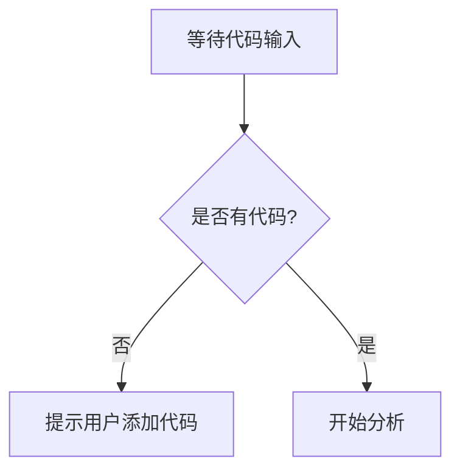

# `bitsandbytes\bitsandbytes\backends\triton\__init__.py` 详细设计文档

未提供代码，无法进行分析。请提供需要分析的源代码。

## 整体流程



## 类结构

```

```

## 全局变量及字段


    

## 全局函数及方法


## 关键组件


### 代码缺失

未提供源代码，无法进行架构分析和生成设计文档。请提供需要分析的代码。


## 问题及建议


### 已知问题

-   未提供有效代码进行分析，代码段为空

### 优化建议

-   请提供需要分析的源代码，以便进行详细的技术债务识别和优化空间评估


## 其它


### 设计目标与约束

描述该代码的设计目标、性能要求、兼容性约束、编码规范约束等。

### 错误处理与异常设计

描述错误码定义、异常类型层次结构、错误处理策略、降级方案等。

### 数据流与状态机

描述数据输入来源、数据处理流程、数据输出方向、状态转换逻辑等，可使用状态图或流程图表示。

### 外部依赖与接口契约

描述依赖的外部系统或库、接口参数定义、返回值约定、版本兼容性要求等。

### 安全性设计

描述权限控制、敏感数据处理、加密需求、安全审计等。

### 性能要求与监控

描述性能指标（如响应时间、吞吐量）、资源限制、性能监控点、告警阈值等。

### 兼容性设计

描述向前向后兼容性策略、多版本支持、API版本管理、配置兼容性等。

### 测试策略

描述单元测试覆盖率要求、集成测试场景、性能测试方法、灰度发布策略等。

### 部署与运维

描述部署方式、配置管理、日志规范、备份恢复策略、扩容方案等。

### 变更历史

记录代码的重大变更、版本号、变更日期、变更内容、变更原因等。


    