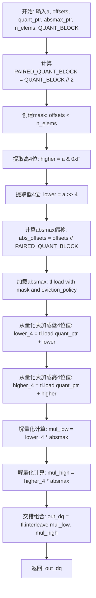
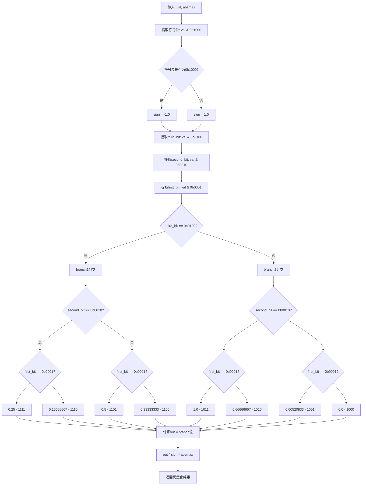
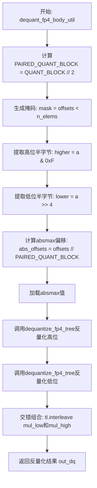
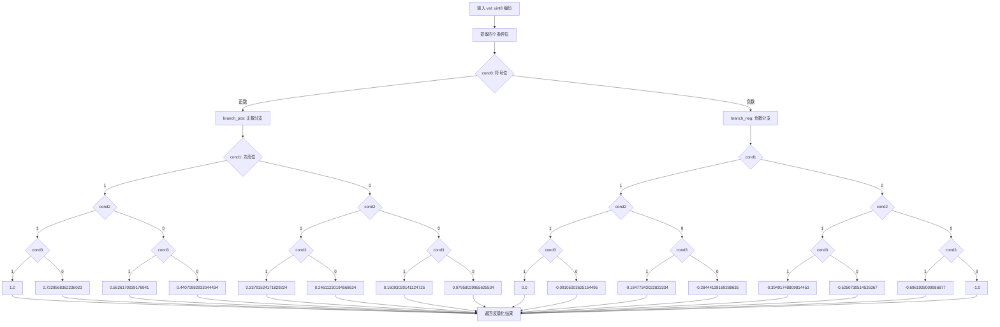
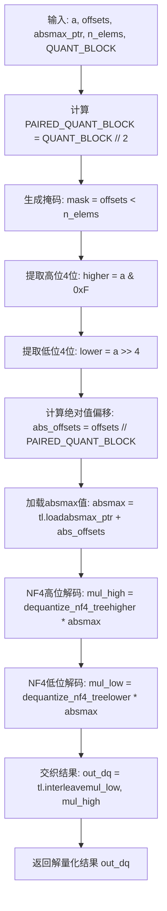
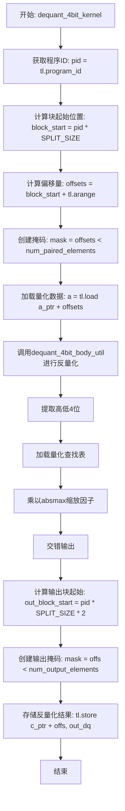
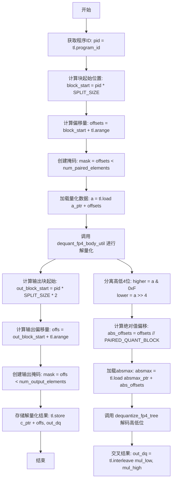
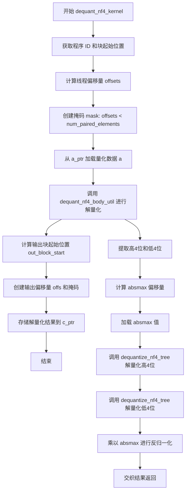
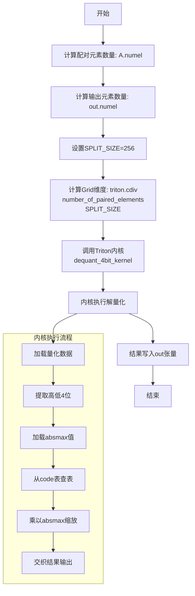

# `bitsandbytes\bitsandbytes\backends\triton\kernels_4bit.py` 详细设计文档

该文件实现了基于Triton的4-bit量化（FP4/NF4）和解量化GPU内核，用于深度学习模型的权重压缩。核心功能包括：1) 将FP32/FP16张量量化为4-bit表示；2) 支持FP4（浮点4位）和NF4（归一化浮点4位）两种量化格式；3) 实现高效的GPU并行解量化操作。

## 整体流程

```mermaid
graph TD
    A[输入张量 A] --> B[quantize_4bit_blockwise_triton]
    B --> C{quant_type == 'fp4'?}
    C -- 是 --> D[quantize_fp4_blockwise_kernel]
    C -- 否 --> E[quantize_nf4_blockwise_kernel]
    D --> F[计算 absmax]
    E --> F
    F --> G[归一化: A_normalized = A / absmax]
    G --> H[clamp到[-1.0, 1.0]]
    H --> I[FP4: 映射到量化码字 / NF4: 查表量化]
    I --> J[打包: 每2个4bit合并为1个uint8]
    J --> K[输出: quantized_out, absmax]
    K --> L[dequantize_4bit_impl]
    L --> M{quant_type == 'fp4'?}
    M -- 是 --> N[dequant_fp4_kernel]
    M -- 否 --> O[dequant_nf4_kernel]
    N --> P[解包: 分离高低4bit]
    O --> P
    P --> Q[查表解量化]
    Q --> R[反交错: interleave]
    R --> S[输出: 恢复的浮点张量]
```

## 类结构

```
Triton Kernel Module
├── 量化内核 (Quantization Kernels)
│   ├── quantize_fp4_blockwise_kernel (FP4量化)
│   ├── quantize_nf4_blockwise_kernel (NF4量化)
│   └── quantize_4bit_blockwise_kernel (通用量化)
├── 解量化内核 (Dequantization Kernels)
│   ├── dequant_4bit_kernel (通用解量化)
│   ├── dequant_fp4_kernel (FP4解量化)
│   └── dequant_nf4_kernel (NF4解量化)
├── 辅助函数 (Utility Functions)
│   ├── dequant_4bit_body_util
│   ├── dequant_fp4_body_util
│   ├── dequant_nf4_body_util
│   ├── dequantize_fp4_tree
│   └── dequantize_nf4_tree
└── Python封装 (Python Wrappers)
    ├── quantize_4bit_blockwise_triton
    ├── dequantize_4bit_impl
    └── dequantize_4bit_impl_passing_code
```

## 全局变量及字段


### `A_ptr`
    
输入张量指针，指向待量化的原始浮点数据

类型：`ptr`
    


### `absmax_ptr`
    
绝对最大值指针，存储每个量化块的尺度因子

类型：`ptr`
    


### `out_ptr`
    
输出指针，存储量化后的4bit打包数据

类型：`ptr`
    


### `quant_ptr`
    
量化编码表指针，存储4bit量化码本

类型：`ptr`
    


### `code_ptr`
    
编码表指针，用于查找量化等级

类型：`ptr`
    


### `n_elements`
    
输入元素的总数

类型：`int`
    


### `BLOCK_SIZE`
    
每个量化块的元素大小

类型：`tl.constexpr int`
    


### `SPLIT_NUM_BLOCKS`
    
每个线程处理的块数量

类型：`tl.constexpr int`
    


### `PAIRED_SPLIT_NUM_BLOCKS`
    
成对分割块数量，用于处理正负半部分

类型：`tl.constexpr int`
    


### `QUANT_BLOCK`
    
量化块大小（等于BLOCK_SIZE）

类型：`tl.constexpr int`
    


### `SPLIT_SIZE`
    
dequant kernel的分割大小

类型：`tl.constexpr int`
    


### `num_paired_elements`
    
配对后的元素数量（原始元素数的一半）

类型：`int`
    


### `num_output_elements`
    
输出元素的总数

类型：`int`
    


### `CODE_SIZE`
    
量化码本的大小

类型：`tl.constexpr int`
    


### `block_start_idx`
    
当前线程处理的起始块索引

类型：`int`
    


### `thread_idx`
    
线程索引向量，用于计算元素偏移

类型：`tl.tensor`
    


### `offsets`
    
全局内存偏移量向量

类型：`tl.tensor`
    


### `mask`
    
边界掩码，用于处理不完整的块

类型：`tl.tensor`
    


### `A`
    
从全局内存加载的输入数据

类型：`tl.tensor`
    


### `A_reshaped`
    
重塑后的输入数据，形状为(PAIRED_SPLIT_NUM_BLOCKS, BLOCK_SIZE)

类型：`tl.tensor`
    


### `absmax`
    
每个量化块的绝对最大值

类型：`tl.tensor`
    


### `A_normalized`
    
归一化后的输入值，范围[-1, 1]

类型：`tl.tensor`
    


### `sign`
    
符号位编码，负数为0b1000，正数为0b0000

类型：`tl.tensor`
    


### `A_absf`
    
归一化后值的绝对值

类型：`tl.tensor`
    


### `result`
    
FP4/NF4量化编码结果

类型：`tl.tensor`
    


### `quantized`
    
量化后的4bit值

类型：`tl.tensor`
    


### `packed`
    
两个4bit值打包成1个uint8

类型：`tl.tensor`
    


### `packed_flat`
    
展平后的打包数据

类型：`tl.tensor`
    


### `out_offsets`
    
输出内存的偏移量

类型：`tl.tensor`
    


### `out_mask`
    
输出边界掩码

类型：`tl.tensor`
    


### `higher`
    
uint8值的高4位

类型：`tl.tensor`
    


### `lower`
    
uint8值的低4位

类型：`tl.tensor`
    


### `abs_offsets`
    
用于索引absmax的块偏移量

类型：`tl.tensor`
    


### `lower_4`
    
低4bit在码本中的值

类型：`tl.tensor`
    


### `higher_4`
    
高4bit在码本中的值

类型：`tl.tensor`
    


### `mul_high`
    
高4bit解码后的值乘以absmax

类型：`tl.tensor`
    


### `mul_low`
    
低4bit解码后的值乘以absmax

类型：`tl.tensor`
    


### `out_dq`
    
反量化后的输出结果

类型：`tl.tensor`
    


### `val`
    
待解码的4bit值

类型：`tl.tensor`
    


### `cond0`
    
第0位（符号位）条件

类型：`tl.tensor`
    


### `cond1`
    
第1位条件

类型：`tl.tensor`
    


### `cond2`
    
第2位条件

类型：`tl.tensor`
    


### `cond3`
    
第3位条件

类型：`tl.tensor`
    


### `branch_pos`
    
正值分支的NF4解码值

类型：`tl.tensor`
    


### `branch_neg`
    
负值分支的NF4解码值

类型：`tl.tensor`
    


### `third_bit`
    
FP4解码的第3位

类型：`tl.tensor`
    


### `second_bit`
    
FP4解码的第2位

类型：`tl.tensor`
    


### `first_bit`
    
FP4解码的第1位

类型：`tl.tensor`
    


### `branch1`
    
FP4解码分支1

类型：`tl.tensor`
    


### `branch2`
    
FP4解码分支2

类型：`tl.tensor`
    


### `out`
    
FP4解码的中间结果

类型：`tl.tensor`
    


### `lower_pivot`
    
二分查找下界索引

类型：`tl.tensor`
    


### `upper_pivot`
    
二分查找上界索引

类型：`tl.tensor`
    


### `pivot`
    
二分查找中间点索引

类型：`tl.tensor`
    


### `val_loaded`
    
从码本加载的量化阈值

类型：`tl.tensor`
    


### `is_higher`
    
比较结果，指示值是否大于阈值

类型：`tl.tensor`
    


### `lower_val`
    
下界索引对应的码本值

类型：`tl.tensor`
    


### `upper_val`
    
上界索引对应的码本值

类型：`tl.tensor`
    


### `lower_dist`
    
归一化值与下界值的距离

类型：`tl.tensor`
    


### `upper_dist`
    
归一化值与上界值的距离

类型：`tl.tensor`
    


    

## 全局函数及方法


### `quantize_fp4_blockwise_kernel`

该函数是一个Triton JIT编译的内核函数，用于对输入张量进行块级别的FP4量化。它首先计算每个块的绝对最大值（absmax），然后将输入数据归一化到[-1, 1]范围，接着根据阈值将浮点值量化为4位表示，最后将两个4位值打包成一个字节存储。

参数：

- `A_ptr`：`tl.pointer`，输入张量的指针，指向待量化的浮点数据
- `absmax_ptr`：`tl.pointer`，输出指针，用于存储每个块的绝对最大值
- `out_ptr`：`tl.pointer`，输出指针，用于存储量化后的FP4打包数据
- `n_elements`：`int`，输入张量的总元素数量
- `BLOCK_SIZE`：`tl.constexpr`，每个块的元素数量（编译时常量）
- `SPLIT_NUM_BLOCKS`：`tl.constexpr`，要分割的块数量（编译时常量）

返回值：`None`（无返回值），该函数为Triton内核，通过`tl.store`直接写入输出指针

#### 流程图

```mermaid
graph TD
    A[开始: 获取block起始索引和线程索引] --> B[计算offsets和mask]
    B --> C[从A_ptr加载输入数据A]
    C --> D[将A重塑为2D形状: PAIRED_SPLIT_NUM_BLOCKS x BLOCK_SIZE]
    D --> E[沿axis=1计算每行的绝对最大值absmax]
    E --> F[存储absmax到absmax_ptr]
    F --> G[归一化: A_normalized = A_reshaped / absmax[:, None]]
    G --> H[clamp操作: 限制到[-1.0, 1.0]范围]
    H --> I[计算符号位: sign = 0b1000如果<0否则0b0000]
    I --> J[取绝对值: A_absf = abs(A_normalized)]
    J --> K{根据阈值分层量化}
    K -->|A_absf > 0.29166667| L{进一步判断阈值}
    K -->|A_absf <= 0.29166667| M{进一步判断阈值}
    L -->|A_absf > 0.583333| N{Absf > 0.8333333}
    L -->|A_absf <= 0.583333| O{Absf > 0.4166667}
    M -->|A_absf > 0.0859375| P{Absf > 0.20833333}
    M -->|A_absf <= 0.0859375| Q{Absf > 0.00260417}
    N --> R[result = 0b011]
    N --> S[result = 0b010]
    O --> T[result = 0b101]
    O --> U[result = 0b100]
    P --> V[result = 0b0111]
    P --> W[result = 0b0110]
    Q --> X[result = 0b0001]
    Q --> Y[result = 0b0000]
    R --> Z[quantized = result ^ sign]
    S --> Z
    T --> Z
    U --> Z
    V --> Z
    W --> Z
    X --> Z
    Y --> Z
    Z --> AA[重塑quantized为: PAIRED_SPLIT_NUM_BLOCKS x BLOCK_SIZE/2 x 2]
    AA --> AB[分离左右两部分: left, right]
    AB --> AC[打包: packed = left << 4 | (right & 0xF)]
    AC --> AD[计算输出偏移量和mask]
    AD --> AE[存储packed到out_ptr]
    AE --> F[结束]
```

#### 带注释源码

```python
@triton.jit
def quantize_fp4_blockwise_kernel(
    A_ptr,          # 输入: 待量化的浮点张量指针
    absmax_ptr,     # 输出: 每个块的绝对最大值指针
    out_ptr,        # 输出: 量化后的FP4数据指针
    n_elements,     # 输入: 输入张量的总元素数
    BLOCK_SIZE: tl.constexpr,      # 编译时常量: 每个块的元素数
    SPLIT_NUM_BLOCKS: tl.constexpr, # 编译时常量: 分割的块数量
):
    # PAIRED_SPLIT_NUM_BLOCKS = SPLIT_NUM_BLOCKS * 2
    # 因为FP4是半字节(4bit)，每个字节存储2个值，所以需要2倍的块数来处理
    PAIRED_SPLIT_NUM_BLOCKS: tl.constexpr = SPLIT_NUM_BLOCKS * 2
    
    # 获取当前程序块(Program Block)的ID，计算起始索引
    # 每个program处理PAIRED_SPLIT_NUM_BLOCKS个块
    block_start_idx = tl.program_id(0) * PAIRED_SPLIT_NUM_BLOCKS
    
    # 创建线程索引数组，范围[0, PAIRED_SPLIT_NUM_BLOCKS * BLOCK_SIZE)
    thread_idx = tl.arange(0, PAIRED_SPLIT_NUM_BLOCKS * BLOCK_SIZE)

    # 计算全局偏移量: 块起始位置 * 块大小 + 线程索引
    offsets = block_start_idx * BLOCK_SIZE + thread_idx
    
    # 创建mask，用于处理边界情况（最后一个不完整块）
    mask = offsets < n_elements

    # 从输入指针加载数据，使用mask处理越界情况，填充0.0
    A = tl.load(A_ptr + offsets, mask=mask, other=0.0)

    # 重塑数据为2D张量: (PAIRED_SPLIT_NUM_BLOCKS, BLOCK_SIZE)
    # 这样可以方便地对每个块独立计算absmax
    A_reshaped = tl.reshape(A, (PAIRED_SPLIT_NUM_BLOCKS, BLOCK_SIZE))

    # 沿axis=1计算每行（即每个块）的绝对最大值
    # 结果形状: (PAIRED_SPLIT_NUM_BLOCKS,)
    absmax = tl.max(tl.abs(A_reshaped), axis=1)
    
    # 存储每个块的absmax到输出指针
    # 使用arange生成连续索引 [0, PAIRED_SPLIT_NUM_BLOCKS)
    tl.store(absmax_ptr + block_start_idx + tl.arange(0, PAIRED_SPLIT_NUM_BLOCKS), absmax)

    # 归一化: 将每个元素除以对应块的absmax
    # [:, None] 用于广播，使absmax形状适配2D张量
    A_normalized = A_reshaped / absmax[:, None]
    
    # 将归一化后的值限制在[-1.0, 1.0]范围内
    A_normalized = tl.clamp(A_normalized, -1.0, 1.0)

    # 提取符号位: 负数用0b1000表示，正数用0b0000表示
    sign = tl.where(A_normalized < 0, 0b1000, 0b0000)
    
    # 取绝对值用于后续的阈值判断
    A_absf = tl.abs(A_normalized)

    # FP4量化: 使用嵌套的tl.where实现决策树，根据绝对值大小选择量化级别
    # 阈值序列: 0.29166667, 0.583333, 0.8333333, 0.4166667, 0.0859375, 0.20833333, 0.00260417
    result = tl.where(
        A_absf > 0.29166667,  # 第一层判断
        tl.where(
            A_absf > 0.583333,  # 第二层判断 (>0.29166667分支)
            tl.where(A_absf > 0.8333333, 0b011, 0b010),  # 0b010=2, 0b011=3
            tl.where(A_absf > 0.4166667, 0b101, 0b100)   # 0b100=4, 0b101=5
        ),
        tl.where(
            A_absf > 0.0859375,  # 第二层判断 (<=0.29166667分支)
            tl.where(A_absf > 0.20833333, 0b0111, 0b0110),  # 0b0110=6, 0b0111=7
            tl.where(A_absf > 0.00260417, 0b0001, 0b0000)   # 0b0000=0, 0b0001=1
        ),
    )
    
    # 将量化值与符号位进行XOR操作，得到最终的FP4编码
    # 转换为uint8类型
    quantized = (result ^ sign).to(tl.uint8)

    # 重塑量化数据为3D: (PAIRED_SPLIT_NUM_BLOCKS, BLOCK_SIZE // 2, 2)
    # BLOCK_SIZE // 2 因为每个块现在存储一半的元素（每2个4-bit值打包成1字节）
    quantized = quantized.reshape((PAIRED_SPLIT_NUM_BLOCKS, BLOCK_SIZE // 2, 2))
    
    # 分割成左右两部分: left和right各存储一半
    left, right = quantized.split()
    
    # 打包: 将两个4-bit值合并为一个字节
    # left左移4位，然后与right的低4位进行OR操作
    packed = left << 4 | (right & 0xF)

    # 再次重塑为1D张量，准备输出
    packed_flat = tl.reshape(packed, (BLOCK_SIZE * SPLIT_NUM_BLOCKS,))
    
    # 计算输出偏移量: 每个program处理的起始位置 + 当前线程偏移
    # BLOCK_SIZE // 2 因为输出是输入大小的一半（每2个元素打包成1个）
    out_offsets = block_start_idx * BLOCK_SIZE // 2 + tl.arange(0, SPLIT_NUM_BLOCKS * BLOCK_SIZE)
    
    # 计算输出mask: 使用 n - n//2 而不是 (n+1)//2 避免大整数溢出
    out_mask = out_offsets < (n_elements - n_elements // 2)
    
    # 存储打包后的量化数据到输出指针
    tl.store(out_ptr + out_offsets, packed_flat, mask=out_mask)
```


### `quantize_nf4_blockwise_kernel`

该函数是一个Triton JIT编译的内核，用于将输入的浮点数张量按照NF4（4位归一化浮点数）格式进行分块量化。它首先计算每个块的绝对最大值（absmax）进行归一化，然后根据预定义的阈值将浮点数映射到4位量化值，最后将两个4位值打包成一个字节存储。

参数：

- `A_ptr`：`tl.tensor`（输入张量指针），输入的待量化浮点数据指针
- `absmax_ptr`：`tl.tensor`（输出张量指针），存储每个块的最大绝对值，用于反量化
- `out_ptr`：`tl.tensor`（输出张量指针），存储量化后的4位打包数据
- `n_elements`：`int`，输入张量的总元素数量
- `BLOCK_SIZE`：`tl.constexpr`（int），每个块的元素数量（编译时常量）
- `SPLIT_NUM_BLOCKS`：`tl.constexpr`（int），每个线程组处理的块数量（编译时常量）

返回值：`None`（无返回值，结果通过指针参数输出）

#### 流程图

```mermaid
graph TD
    A[开始] --> B[计算块起始索引<br/>block_start_idx = program_id * PAIRED_SPLIT_NUM_BLOCKS]
    B --> C[生成线程索引<br/>thread_idx =.arange 0 to PAIRED_SPLIT_NUM_BLOCKS \* BLOCK_SIZE]
    C --> D[计算偏移量并创建掩码<br/>offsets = block_start_idx \* BLOCK_SIZE + thread_idx<br/>mask = offsets < n_elements]
    D --> E[加载输入数据<br/>A = tl.load A_ptr + offsets]
    E --> F[重塑数据为2D块<br/>A_reshaped = reshape to PAIRED_SPLIT_NUM_BLOCKS x BLOCK_SIZE]
    F --> G[计算每块的最大绝对值<br/>absmax = max abs A_reshaped axis=1]
    G --> H[存储absmax到输出指针<br/>tl.store absmax_ptr]
    H --> I[归一化数据<br/>A_normalized = A_reshaped / absmax[:, None]<br/>clamp to -1.0, 1.0]
    I --> J[NF4量化阈值判断<br/>使用多层tl.where根据阈值映射到0b0000-0b1111]
    J --> K[重塑并打包4位值<br/>reshape to PAIRED_SPLIT_NUM_BLOCKS x BLOCK_SIZE//2 x 2<br/>left << 4 | right]
    K --> L[计算输出偏移和掩码<br/>out_offsets = block_start_idx \* BLOCK_SIZE // 2]
    L --> M[存储打包结果<br/>tl.store out_ptr + out_offsets]
    M --> N[结束]
```

#### 带注释源码

```python
@triton.jit
def quantize_nf4_blockwise_kernel(
    A_ptr,           # 输入张量指针（待量化数据）
    absmax_ptr,      # 输出指针，存储每个块的最大绝对值
    out_ptr,         # 输出指针，存储量化后的数据
    n_elements,      # 输入元素总数
    BLOCK_SIZE: tl.constexpr,      # 每个块的元素数（编译时常量）
    SPLIT_NUM_BLOCKS: tl.constexpr, # 分割的块数量（编译时常量）
):
    # 计算配对的分割块数（每个线程处理2*SPLIT_NUM_BLOCKS个块）
    PAIRED_SPLIT_NUM_BLOCKS: tl.constexpr = SPLIT_NUM_BLOCKS * 2
    
    # 获取当前线程块的起始索引
    # program_id(0) 获取grid中当前block的索引
    block_start_idx = tl.program_id(0) * PAIRED_SPLIT_NUM_BLOCKS
    
    # 生成线程索引范围 [0, PAIRED_SPLIT_NUM_BLOCKS * BLOCK_SIZE)
    thread_idx = tl.arange(0, PAIRED_SPLIT_NUM_BLOCKS * BLOCK_SIZE)

    # 计算全局偏移量：块起始位置 + 线程索引
    offsets = block_start_idx * BLOCK_SIZE + thread_idx
    
    # 创建掩码：只处理有效范围内的元素（避免越界）
    mask = offsets < n_elements

    # 从输入指针加载数据，使用掩码处理边界情况
    # other=0.0 表示越界元素填充为0
    A = tl.load(A_ptr + offsets, mask=mask, other=0.0)

    # 将1D数据重塑为2D：(PAIRED_SPLIT_NUM_BLOCKS, BLOCK_SIZE)
    # 这样可以方便地按块进行计算
    A_reshaped = tl.reshape(A, (PAIRED_SPLIT_NUM_BLOCKS, BLOCK_SIZE))

    # 计算每个块的最大绝对值（沿axis=1，即每个块内）
    # 结果形状：(PAIRED_SPLIT_NUM_BLOCKS,)
    absmax = tl.max(tl.abs(A_reshaped), axis=1)
    
    # 存储每个块的absmax到输出数组
    # 索引：block_start_idx + [0, PAIRED_SPLIT_NUM_BLOCKS)
    tl.store(absmax_ptr + block_start_idx + tl.arange(0, PAIRED_SPLIT_NUM_BLOCKS), absmax)

    # 归一化：将数据除以对应的absmax
    A_normalized = A_reshaped / absmax[:, None]
    # 限制范围到 [-1.0, 1.0]
    A_normalized = tl.clamp(A_normalized, -1.0, 1.0)

    # NF4量化核心逻辑：使用嵌套的tl.where进行阈值判断
    # 根据归一化值所在的区间映射到对应的4位编码 (0b0000 - 0b1111)
    # 阈值基于NF4量化表的分位点
    result = tl.where(
        A_normalized > 0.03979014977812767,           # 第1层分界点
        tl.where(
            A_normalized > 0.3893125355243683,        # 第2层分界点
            tl.where(
                A_normalized > 0.6427869200706482,    # 第3层分界点
                tl.where(A_normalized > 0.8614784181118011, 0b1111, 0b1110),
                tl.where(A_normalized > 0.5016634166240692, 0b1101, 0b1100),
            ),
            tl.where(
                A_normalized > 0.2035212516784668,
                tl.where(A_normalized > 0.2920137718319893, 0b1011, 0b1010),
                tl.where(A_normalized > 0.1202552504837513, 0b1001, 0b1000),
            ),
        ),
        tl.where(
            A_normalized > -0.33967943489551544,      # 负值区间
            tl.where(
                A_normalized > -0.13791173323988914,
                tl.where(A_normalized > -0.045525018125772476, 0b0111, 0b0110),
                tl.where(A_normalized > -0.23460740596055984, 0b0101, 0b0100),
            ),
            tl.where(
                A_normalized > -0.6106329262256622,
                tl.where(A_normalized > -0.4599952697753906, 0b0011, 0b0010),
                tl.where(A_normalized > -0.8480964004993439, 0b0001, 0b0000),
            ),
        ),
    )
    
    # 转换为无符号8位整数
    quantized = result.to(tl.uint8)

    # 重塑量化结果：(PAIRED_SPLIT_NUM_BLOCKS, BLOCK_SIZE // 2, 2)
    # 每两个4位值打包成一个字节
    quantized = quantized.reshape((PAIRED_SPLIT_NUM_BLOCKS, BLOCK_SIZE // 2, 2))

    # 分离左右两部分：每个字节的低4位和高4位
    left, right = quantized.split()
    # 打包：左移4位并与右半部分按位或
    # left占用高4位，right占用低4位
    packed = left << 4 | (right & 0xF)

    # 重新展平为1D：(BLOCK_SIZE * SPLIT_NUM_BLOCKS,)
    packed_flat = tl.reshape(packed, (BLOCK_SIZE * SPLIT_NUM_BLOCKS,))
    
    # 计算输出偏移量
    # 每个块原来有BLOCK_SIZE个float，量化后只需BLOCK_SIZE//2个字节
    out_offsets = block_start_idx * BLOCK_SIZE // 2 + tl.arange(0, SPLIT_NUM_BLOCKS * BLOCK_SIZE)
    
    # 计算输出掩码：n_elements个float量化后需要n_elements//2个字节存储
    # 使用 n - n//2 而非 (n+1)//2 避免大整数溢出
    out_mask = out_offsets < (n_elements - n_elements // 2)
    
    # 存储打包后的量化结果
    tl.store(out_ptr + out_offsets, packed_flat, mask=out_mask)
```


### `quantize_4bit_blockwise_kernel`

这是一个Triton JIT编译的CUDA核函数，用于实现基于自定义编码本（codebook）的4位块级量化。函数通过二分搜索算法在给定的编码本中查找最接近的量化值，并将其打包成4位格式存储。

参数：

- `A_ptr`：`tl.tensor`，输入的原始浮点数据指针
- `code_ptr`：`tl.tensor`，量化编码本（codebook）的指针，包含所有可能的量化层级
- `absmax_ptr`：`tl.tensor`，存储每个块绝对最大值的指针，用于反量化
- `out_ptr`：`tl.tensor`，输出指针，存储量化后的4位打包数据
- `n_elements`：`int`，输入元素的总数
- `BLOCK_SIZE`：`tl.constexpr`，每个量化块的元素数量（编译时常量）
- `CODE_SIZE`：`tl.constexpr`，编码本的大小（编译时常量）
- `SPLIT_NUM_BLOCKS`：`tl.constexpr`，每个线程处理的块数量（编译时常量）

返回值：`void`，该函数无返回值，通过`tl.store`直接写入输出指针

#### 流程图

```mermaid
flowchart TD
    A[开始] --> B[计算block_start_idx和thread_idx]
    B --> C[计算offsets和mask]
    C --> D[tl.load加载输入数据A]
    D --> E[reshape成PAIRED_SPLIT_NUM_BLOCKS×BLOCK_SIZE矩阵]
    E --> F[计算每行的absmax并存储]
    F --> G[归一化数据到-1, 1范围]
    G --> H[初始化lower_pivot和upper_pivot]
    H --> I[二分搜索循环4次]
    I --> J[计算每个值的量化索引]
    J --> K[reshape并bitcast打包数据]
    K --> L[left<<4 | right压缩存储]
    L --> M[计算输出偏移量和mask]
    M --> N[tl.store写入量化结果]
    N --> O[结束]
```

#### 带注释源码

```python
@triton.jit
def quantize_4bit_blockwise_kernel(
    A_ptr,          # 输入浮点数据指针
    code_ptr,       # 量化编码本指针
    absmax_ptr,     # 块级绝对最大值指针
    out_ptr,        # 量化输出指针
    n_elements,     # 总元素数量
    BLOCK_SIZE: tl.constexpr,      # 块大小
    CODE_SIZE: tl.constexpr,       # 编码本大小
    SPLIT_NUM_BLOCKS: tl.constexpr, # 分割块数
):
    # 计算配对的分割块数（每个线程处理2个块）
    PAIRED_SPLIT_NUM_BLOCKS: tl.constexpr = SPLIT_NUM_BLOCKS * 2
    
    # 获取当前block的起始索引
    block_start_idx = tl.program_id(0) * PAIRED_SPLIT_NUM_BLOCKS
    
    # 生成线程索引
    thread_idx = tl.arange(0, PAIRED_SPLIT_NUM_BLOCKS * BLOCK_SIZE)

    # 计算全局偏移量
    offsets = block_start_idx * BLOCK_SIZE + thread_idx
    
    # 创建边界掩码
    mask = offsets < n_elements

    # 加载输入数据，超出范围的值设为0.0
    A = tl.load(A_ptr + offsets, mask=mask, other=0.0)

    # 重塑数据为(配对分割块数, 块大小)的二维张量，以便并行处理多个块
    A_reshaped = tl.reshape(A, (PAIRED_SPLIT_NUM_BLOCKS, BLOCK_SIZE))

    # 计算每个块的最大绝对值（用于归一化和反量化）
    absmax = tl.max(tl.abs(A_reshaped), axis=1)
    # 存储每个块的absmax到输出缓冲区
    tl.store(absmax_ptr + block_start_idx + tl.arange(0, PAIRED_SPLIT_NUM_BLOCKS), absmax)

    # 归一化数据到[-1, 1]范围
    A_normalized = A_reshaped / absmax[:, None]
    A_normalized = tl.clamp(A_normalized, -1.0, 1.0)

    # 初始化二分搜索的上下界
    lower_pivot = tl.zeros((PAIRED_SPLIT_NUM_BLOCKS, BLOCK_SIZE), dtype=tl.int32)
    upper_pivot = tl.full((PAIRED_SPLIT_NUM_BLOCKS, BLOCK_SIZE), CODE_SIZE - 1, dtype=tl.int32)

    # 二分搜索找到最接近的量化层级（4次迭代 = ceil(log2(16))）
    for _ in range(4):  # ceil(log2(code_size)) = 4
        # 计算中点
        pivot = (lower_pivot + upper_pivot) // 2
        # 从编码本加载中点对应的值
        val = tl.load(code_ptr + pivot)
        # 比较归一化值与编码本值
        is_higher = A_normalized > val  # code[pivot]
        # 更新上下界
        lower_pivot = tl.where(is_higher, pivot, lower_pivot)
        upper_pivot = tl.where(is_higher, upper_pivot, pivot)

    # 选择最近的层级（上界或下界）
    lower_val = tl.load(code_ptr + lower_pivot)
    upper_val = tl.load(code_ptr + upper_pivot)
    # 计算距离
    lower_dist = tl.abs(A_normalized - lower_val)
    upper_dist = tl.abs(A_normalized - upper_val)
    # 选择距离较小的索引，转换为uint8
    quantized = tl.where(lower_dist <= upper_dist, lower_pivot, upper_pivot).to(tl.uint8)

    # 重塑为(配对分割块数, 块大小/2, 2)以进行打包
    quantized = quantized.reshape((PAIRED_SPLIT_NUM_BLOCKS, BLOCK_SIZE // 2, 2))
    # 使用bitcast转换类型
    quantized = quantized.to(tl.uint8, bitcast=True)
    # 分离高低4位
    left, right = quantized.split()
    # 打包：左移4位并与右半部分按位或
    packed = left << 4 | (right & 0xF)

    # 展平打包后的数据
    packed_flat = tl.reshape(packed, (BLOCK_SIZE * SPLIT_NUM_BLOCKS,))
    # 计算输出偏移量
    out_offsets = block_start_idx * BLOCK_SIZE // 2 + tl.arange(0, SPLIT_NUM_BLOCKS * BLOCK_SIZE)
    # 输出掩码（元素数除以2，因为4位=0.5字节）
    out_mask = out_offsets < n_elements // 2
    # 存储量化结果
    tl.store(out_ptr + out_offsets, packed_flat, mask=out_mask)
```


### `quantize_4bit_blockwise_triton`

该函数是4位量化（FP4或NF4）的Python封装函数，负责根据量化类型选择对应的Triton内核进行块级量化计算，输入张量被归一化后映射到指定的4位量化码本，并返回量化后的张量及每个块的绝对最大值。

参数：

- `A`：`torch.Tensor`，输入的待量化浮点张量
- `blocksize`：`int`，每个量化块的元素数量（BLOCK_SIZE）
- `quant_type`：`str`，量化类型，支持"fp4"（浮点4位）或"nf4"（归一化浮点4位）
- `blocks`：`int`，总块数量，用于计算网格维度
- `absmax`：`torch.Tensor`，用于存储每个块的绝对最大值的输出张量
- `num_elements`：`int`，输入张量的总元素数量
- `quantized_out`：`torch.Tensor`，用于存储量化后结果的输出张量

返回值：`tuple`，包含`quantized_out`和`absmax`，即量化后的张量及对应的绝对最大值

#### 流程图

```mermaid
flowchart TD
    A[开始 quantize_4bit_blockwise_triton] --> B[计算网格大小: grid = triton.cdiv(blocks, 4)]
    B --> C{quant_type == 'fp4'?}
    C -->|Yes| D[调用 quantize_fp4_blockwise_kernel 内核]
    C -->|No| E[调用 quantize_nf4_blockwise_kernel 内核]
    D --> F[返回 quantized_out 和 absmax]
    E --> F
```

#### 带注释源码

```python
def quantize_4bit_blockwise_triton(A, blocksize, quant_type, blocks, absmax, num_elements, quantized_out):
    """
    4位块级量化Triton封装函数
    
    参数:
        A: 输入浮点张量 (torch.Tensor)
        blocksize: 量化块大小 (int)
        quant_type: 量化类型，"fp4"或"nf4" (str)
        blocks: 总块数 (int)
        absmax: 存储每块绝对最大值的张量 (torch.Tensor)
        num_elements: 元素总数 (int)
        quantized_out: 量化输出张量 (torch.Tensor)
    
    返回:
        (quantized_out, absmax): 量化结果和绝对最大值元组
    """
    # 设置分割块数，用于网格并行计算
    split_num_blocks = 4
    
    # 计算网格维度：向上整除，确定需要多少个并行块
    grid = (triton.cdiv(blocks, split_num_blocks),)
    
    # 根据量化类型选择对应的Triton内核
    if quant_type == "fp4":
        # 调用FP4量化内核
        quantize_fp4_blockwise_kernel[grid](
            A_ptr=A,              # 输入张量指针
            absmax_ptr=absmax,    # 绝对最大值输出指针
            out_ptr=quantized_out, # 量化结果输出指针
            n_elements=num_elements, # 元素总数
            BLOCK_SIZE=blocksize,    # 块大小
            SPLIT_NUM_BLOCKS=split_num_blocks, # 分割块数
        )
    else:
        # 调用NF4量化内核
        quantize_nf4_blockwise_kernel[grid](
            A_ptr=A,
            absmax_ptr=absmax,
            out_ptr=quantized_out,
            n_elements=num_elements,
            BLOCK_SIZE=blocksize,
            SPLIT_NUM_BLOCKS=split_num_blocks,
        )
    
    # 返回量化后的张量和绝对最大值
    return quantized_out, absmax
```


### `dequant_4bit_body_util`

该函数是 Triton JIT 编译的内核函数，用于将4位量化数据解量化为浮点数据。它从打包的 uint8 张量中提取高低4位，通过量化查找表和块级绝对最大值(absmax)进行解量化，最后交错组合得到完整的浮点输出。

参数：

- `a`：`tl.tensor`（uint8），输入的打包量化数据，每个字节包含两个4位量化值
- `offsets`：`tl.tensor`（int64），当前线程处理元素的偏移量数组
- `quant_ptr`：`tl.constexpr`（指针），量化查找表（codebook）的指针，包含归一化的量化值
- `absmax_ptr`：`tl.constexpr`（指针），每个量化块的绝对最大值指针，用于反量化缩放
- `n_elems`：`tl.tensor`（int64），输入元素总数，用于边界掩码
- `QUANT_BLOCK`：`tl.constexpr`（int），量化块大小（编译时常量），定义多少个元素共享一个absmax

返回值：`tl.tensor`（float32），解量化后的浮点张量，维度为输入的两倍（因为每个字节解压为两个浮点数）

#### 流程图



#### 带注释源码

```python
@triton.jit
def dequant_4bit_body_util(
    a,                      # 输入: 打包的uint8张量，每个字节含两个4位值
    offsets,                # 偏移量数组，用于寻址和掩码
    quant_ptr,             # 量化查找表(codebook)指针
    absmax_ptr,            # 块级绝对最大值指针
    n_elems,               # 元素总数，用于边界检查
    QUANT_BLOCK: tl.constexpr  # 量化块大小（编译时常量）
):
    # 计算成对的量化块数量（每个块处理2个4位值）
    PAIRED_QUANT_BLOCK: tl.constexpr = QUANT_BLOCK // 2
    
    # 创建边界掩码，确保不越界
    mask = offsets < n_elems
    
    # 从打包的uint8中提取高4位（第二个4位值）
    higher = a & 0xF
    
    # 从打包的uint8中提取低4位（第一个4位值）
    lower = a >> 4

    # 计算absmax数组的偏移量：每个PAIRED_QUANT_BLOCK元素共享一个absmax
    abs_offsets = offsets // PAIRED_QUANT_BLOCK
    
    # 加载对应块的absmax值，使用evict_last策略优化缓存
    # mask确保边界安全，other=1.0为越界时的默认值
    absmax = tl.load(absmax_ptr + abs_offsets, mask=mask, other=1.0, eviction_policy="evict_last")

    # 从量化查找表加载低4位对应的归一化值
    # 使用evict_last策略，因为这是只读数据且被多次访问
    lower_4 = tl.load(quant_ptr + lower, eviction_policy="evict_last")
    
    # 从量化查找表加载高4位对应的归一化值
    higher_4 = tl.load(quant_ptr + higher, eviction_policy="evict_last")

    # 使用absmax缩放还原：反量化 = 归一化值 * absmax
    mul_high = higher_4 * absmax
    mul_low = lower_4 * absmax
    
    # 交错组合低4位和高4位的解量化结果
    # 使输出恢复为原始的交错顺序（low0, high0, low1, high1, ...）
    out_dq = tl.interleave(mul_low, mul_high)
    
    # 返回解量化后的浮点张量
    return out_dq
```


### `dequantize_fp4_tree`

该函数是Triton JIT编译的内核函数，用于将FP4量化数据反量化恢复为浮点数值。函数通过解析4位编码值中的符号位和三个数据位，根据FP4编码表查表得到对应的缩放因子，再乘以绝对最大值(absmax)得到最终的反量化结果。

参数：

- `val`：`tl.tensor` (uint8)，4位FP4量化值（每个字节包含2个4位值）
- `absmax`：`tl.tensor` (float32/float16)，每个量化块的绝对最大值，用于缩放

返回值：`tl.tensor`，反量化后的浮点数值（float32类型），与absmax类型一致

#### 流程图



#### 带注释源码

```python
@triton.jit
def dequantize_fp4_tree(val, absmax):
    # val: tl.tensor (uint8) - 输入的4位FP4量化值，每个字节存储2个4位值
    # absmax: tl.tensor (float32/float16) - 每个量化块的绝对最大值，用于反量化缩放
    # FP4编码格式示例: 00001100  00001011  00001001  00001111
    
    # 步骤1: 提取符号位 (第4位，0b1000)
    # 如果符号位为1，则值为负数；否则为正数
    sign = tl.where((val & 0b1000) == 0b1000, -1.0, 1.0)  # -1
    
    # 步骤2: 提取三个数据位用于查表
    # third_bit: 第3位 (0b0100)，用于决定使用branch1还是branch2
    third_bit = (val & 0b0100) == 0b0100  # True
    # second_bit: 第2位 (0b0010)
    second_bit = (val & 0b0010) == 0b0010  # False
    # first_bit: 第1位 (0b0001)
    first_bit = (val & 0b0001) == 0b0001  # False

    # 步骤3: 根据third_bit选择分支
    # third_bit=1 时使用branch1（对应 FP4 编码 01xx）
    # third_bit=0 时使用branch2（对应 FP4 编码 00xx）
    
    # branch1: third_bit=1 时的解码表
    #   - second_bit=1, first_bit=1 -> 0.25 (1111)
    #   - second_bit=1, first_bit=0 -> 0.16666667 (1110)
    #   - second_bit=0, first_bit=1 -> 0.5 (1101)
    #   - second_bit=0, first_bit=0 -> 0.33333333 (1100)
    branch1 = tl.where(
        second_bit,
        tl.where(first_bit, 0.25, 0.16666667),  # 1111, 1110
        tl.where(first_bit, 0.5, 0.33333333),   # 1101, 1100
    )
    
    # branch2: third_bit=0 时的解码表
    #   - second_bit=1, first_bit=1 -> 1.0 (1011)
    #   - second_bit=1, first_bit=0 -> 0.66666667 (1010)
    #   - second_bit=0, first_bit=1 -> 0.00520833 (1001)
    #   - second_bit=0, first_bit=0 -> 0.0 (1000)
    branch2 = tl.where(
        second_bit,
        tl.where(first_bit, 1.0, 0.66666667),   # 1011, 1010
        tl.where(first_bit, 0.00520833, 0.0),  # 1001, 1000
    )
    
    # 步骤4: 根据third_bit选择branch1或branch2
    out = tl.where(third_bit, branch1, branch2)
    
    # 步骤5: 应用符号和缩放
    # 最终值 = 查表结果 × 符号 × absmax
    return out * sign * absmax
```


### `dequant_fp4_body_util`

该函数是Triton JIT编译的内核函数，用于将FP4量化数据反量化恢复为浮点数据。它通过提取输入张量中的高位和低位4位半字节，结合预计算的absmax缩放因子，调用`dequantize_fp4_tree`进行FP4到浮点的解码，最后通过`tl.interleave`交错组合高低位结果输出反量化后的浮点张量。

参数：

- `a`：`tl.tensor`（uint8），输入的量化数据，包含打包的4位FP4值
- `offsets`：`tl.tensor`（int64），用于计算元素偏移量和掩码的索引张量
- `absmax_ptr`：指针，指向存储每个量化块绝对最大值的内存位置
- `n_elems`：`int`，要处理的元素总数，用于边界检查和掩码生成
- `QUANT_BLOCK`：`tl.constexpr`（int），量化块大小，决定了多少个元素共享一个absmax值

返回值：`tl.tensor`（float32），反量化后的浮点数据张量

#### 流程图



#### 带注释源码

```python
@triton.jit
def dequant_fp4_body_util(a, offsets, absmax_ptr, n_elems, QUANT_BLOCK: tl.constexpr):
    # 计算成对的量化块大小，每个量化块包含2个FP4值
    PAIRED_QUANT_BLOCK: tl.constexpr = QUANT_BLOCK // 2
    
    # 生成掩码，用于边界检查和条件加载/存储
    mask = offsets < n_elems
    
    # 提取高位4位半字节（每个uint8存储2个FP4值）
    higher = a & 0xF
    
    # 提取低位4位半字节，通过右移4位获取
    lower = a >> 4

    # 计算绝对最大值的偏移量，确定每个元素对应的absmax块
    abs_offsets = offsets // PAIRED_QUANT_BLOCK
    
    # 从absmax_ptr加载对应的绝对最大值，使用mask进行边界保护
    # eviction_policy="evict_last"优化缓存策略
    absmax = tl.load(absmax_ptr + abs_offsets, mask=mask, other=1.0, eviction_policy="evict_last")

    # 调用辅助函数dequantize_fp4_tree将高位FP4值解码为浮点数
    mul_high = dequantize_fp4_tree(higher, absmax)
    
    # 调用辅助函数dequantize_fp4_tree将低位FP4值解码为浮点数
    mul_low = dequantize_fp4_tree(lower, absmax)
    
    # 使用interleave交错组合低位和高位结果，恢复原始顺序
    out_dq = tl.interleave(mul_low, mul_high)
    
    # 返回反量化后的浮点张量
    return out_dq
```


### `dequantize_nf4_tree`

该函数是 NF4（4-bit Normalized Float）量化格式的反量化核心实现，通过解析 uint8 编码中的 4 个 bit 位来查表得到对应的浮点数值，用于将量化数据恢复为浮点表示。

参数：

- `val`：`tl.tensor (uint8)`，待反量化的 4-bit NF4 量化值（每个字节包含两个 4-bit 值）

返回值：`tl.tensor`，返回反量化后的浮点数值（float32/float16），已乘以 absmax 的归一化值

#### 流程图



#### 带注释源码

```python
@triton.jit
def dequantize_nf4_tree(val):
    """
    NF4 反量化核心函数：将 4-bit NF4 编码值转换为对应的浮点数值
    
    NF4 是一种非对称量化格式，使用 16 个量化等级（0000-1111），
    其中正负值的量化等级数量不相等，以更好地拟合正态分布的数据。
    """
    # 提取每个 4-bit 值的四个条件位
    cond0 = (val & 0b1000) == 0b1000  # 符号位：0=负数，1=正数
    cond1 = (val & 0b0100) == 0b0100  # 次高位
    cond2 = (val & 0b0010) == 0b0010  # 第三位
    cond3 = (val & 0b0001) == 0b0001  # 最低位

    # Positive branch (val & 0b1000) == 8
    # 正数分支：根据 cond1/cond2/cond3 的组合查表返回对应的量化值
    branch_pos = tl.where(
        cond1,
        tl.where(
            cond2,
            tl.where(cond3, 1.0, 0.7229568362236023),  # 1111, 1110
            tl.where(cond3, 0.5626170039176941, 0.44070982933044434),  # 1101, 1100
        ),
        tl.where(
            cond2,
            tl.where(cond3, 0.33791524171829224, 0.24611230194568634),  # 1011, 1010
            tl.where(cond3, 0.16093020141124725, 0.07958029955625534),  # 1001, 1000
        ),
    )

    # Negative branch (val & 0b1000) == 0
    # 负数分支：返回对应的负量化值（绝对值较小）
    branch_neg = tl.where(
        cond1,
        tl.where(
            cond2,
            tl.where(cond3, 0.0, -0.09105003625154495),  # 0111, 0110
            tl.where(cond3, -0.18477343022823334, -0.28444138169288635),  # 0101, 0100
        ),
        tl.where(
            cond2,
            tl.where(cond3, -0.39491748809814453, -0.5250730514526367),  # 0011, 0010
            tl.where(cond3, -0.6961928009986877, -1.0),  # 0001, 0000
        ),
    )
    
    # 根据符号位选择正负分支，返回归一化后的反量化值
    # 该返回值还需乘以 absmax 才能得到最终的反量化结果
    return tl.where(cond0, branch_pos, branch_neg)
```


### `dequant_nf4_body_util`

该函数是Triton JIT编译的NF4（4位归一化浮点）解量化核心函数，用于将uint8存储的NF4量化数据解压缩回浮点数值。它通过提取高低4位、查询NF4量化表并结合absmax缩放因子完成反量化操作。

参数：

- `a`：`tl.tensor`（uint8类型），输入的量化数据，包含打包的NF4值
- `offsets`：`tl.tensor`（int64类型），当前线程处理元素的位置偏移量数组
- `absmax_ptr`：`tl.tensor`（float类型指针），指向存储每个量化块最大绝对值的内存位置
- `n_elems`：`int`（或tl.tensor），需要处理的元素总数，用于边界掩码
- `QUANT_BLOCK`：`tl.constexpr`（int），量化块大小，必须为编译时常量

返回值：`tl.tensor`（float类型），解量化后的浮点数值数组

#### 流程图



#### 带注释源码

```python
@triton.jit
def dequant_nf4_body_util(a, offsets, absmax_ptr, n_elems, QUANT_BLOCK: tl.constexpr):
    # 计算配对的量化块大小（每个块包含2个NF4值，因为2个4位值打包在1个uint8中）
    PAIRED_QUANT_BLOCK: tl.constexpr = QUANT_BLOCK // 2
    
    # 创建边界掩码，确保操作不会超出有效元素范围
    mask = offsets < n_elems
    
    # 从打包的uint8中提取高位4位（第一个NF4值）
    higher = a & 0xF
    
    # 从打包的uint8中提取低位4位（第二个NF4值），通过右移4位
    lower = a >> 4

    # 计算用于获取absmax的偏移量：每个配对块对应一个absmax值
    abs_offsets = offsets // PAIRED_QUANT_BLOCK
    
    # 从absmax_ptr加载当前块的最大绝对值缩放因子
    # eviction_policy="evict_last" 优化GPU缓存使用
    # other=1.0 确保掩码外的元素有默认值
    absmax = tl.load(absmax_ptr + abs_offsets, mask=mask, other=1.0, eviction_policy="evict_last")
    
    # 使用NF4量化表将高位4位解码为浮点数，并乘以absmax进行缩放
    mul_high = dequantize_nf4_tree(higher) * absmax
    
    # 使用NF4量化表将低位4位解码为浮点数，并乘以absmax进行缩放
    mul_low = dequantize_nf4_tree(lower) * absmax
    
    # 使用interleave交织操作将低位和高位结果重新排列为正确的输出顺序
    # 这是因为原始数据在打包时是按交织顺序存储的
    out_dq = tl.interleave(mul_low, mul_high)
    
    # 返回解量化后的浮点数值
    return out_dq
```


### `dequant_4bit_kernel`

该函数是一个Triton JIT编译内核，用于将4位量化数据反量化（dequantize）为浮点数据。它通过加载量化数据、查表获取量化值、乘以缩放因子（absmax），将压缩的4位数据还原为原始精度的浮点数据。

参数：

- `a_ptr`：`tl.tensor`（uint8 指针），输入的4位量化数据指针，数据以交错方式存储（每字节包含两个4位值）
- `c_ptr`：`tl.tensor`（float32/float16 指针），输出反量化后的浮点数据指针
- `quant_ptr`：`tl.tensor`（uint8 指针），量化查找表（LUT）指针，包含4位量化码本
- `absmax_ptr`：`tl.tensor`（float32/float16 指针），每个量化块的绝对最大值缩放因子指针
- `num_paired_elements`：`int`，配对元素的数量（即量化数据的元素数，等于原始元素数的一半）
- `num_output_elements`：`int`，输出元素的总数（原始未量化的元素数量）
- `QUANT_BLOCK`：`tl.constexpr`（int），量化块大小，必须为编译时常量
- `SPLIT_SIZE`：`tl.constexpr`（int），Triton内核的分割大小（每个线程块处理的元素数），必须为编译时常量

返回值：`void`，无返回值。结果直接写入 `c_ptr` 指向的输出张量。

#### 流程图



#### 带注释源码

```python
@triton.jit
def dequant_4bit_kernel(
    a_ptr,              # 输入: 4位量化数据指针（uint8数组，每字节存2个4位值）
    c_ptr,              # 输出: 反量化后浮点数据指针
    quant_ptr,          # 量化码本/查找表指针
    absmax_ptr,         # 每个块的绝对最大值缩放因子
    num_paired_elements,# 配对元素数量（量化后元素数）
    num_output_elements,# 输出元素数量（原始元素数）
    QUANT_BLOCK: tl.constexpr,  # 量化块大小（编译时常量）
    SPLIT_SIZE: tl.constexpr,   # 线程块处理元素数（编译时常量）
):
    # 获取当前程序/线程块ID（使用1D网格）
    pid = tl.program_id(axis=0)
    
    # 计算当前块处理的起始位置
    block_start = pid * SPLIT_SIZE
    
    # 计算当前线程处理的元素偏移量
    offsets = block_start + tl.arange(0, SPLIT_SIZE)
    
    # 创建边界掩码，防止越界访问
    mask = offsets < num_paired_elements
    
    # 从输入指针加载量化数据（uint8）
    a = tl.load(a_ptr + offsets, mask, eviction_policy="evict_first")
    
    # 调用底层反量化工具函数
    # 该函数负责：
    # 1. 从量化字节中提取高4位和低4位
    # 2. 根据QUANT_BLOCK计算absmax索引并加载缩放因子
    # 3. 通过quant_ptr查找表获取对应的量化值
    # 4. 乘以absmax得到反量化结果
    # 5. 使用tl.interleave交错高低位结果
    out_dq = dequant_4bit_body_util(
        a=a,
        offsets=offsets,
        quant_ptr=quant_ptr,
        absmax_ptr=absmax_ptr,
        n_elems=num_paired_elements,
        QUANT_BLOCK=QUANT_BLOCK,
    )
    
    # 计算输出张量的起始位置（输出是输入的2倍大小）
    out_block_start = pid * SPLIT_SIZE * 2
    
    # 计算输出偏移量
    offs = out_block_start + tl.arange(0, SPLIT_SIZE * 2)
    
    # 创建输出边界掩码
    mask = offs < num_output_elements
    
    # 存储反量化结果到输出指针
    tl.store(c_ptr + offs, out_dq, mask)
```


### `dequant_fp4_kernel`

该函数是 Triton JIT 编译的核函数，用于对 FP4 量化数据进行块级解量化。它加载量化数据，利用预计算的绝对最大值（absmax）和 FP4 解量化树将压缩的 4 位数据解压缩为原始精度，并存储到输出缓冲区。

参数：

- `a_ptr`：`Pointer`（Triton 指针），输入的 FP4 量化数据指针，指向待解量化的数据块
- `c_ptr`：`Pointer`（Triton 指针），输出指针，存储解量化后的浮点结果
- `absmax_ptr`：`Pointer`（Triton 指针），绝对最大值指针，存储每个量化块的缩放因子
- `num_paired_elements`：`int32`，配对元素数量，表示输入量化数据的元素数（因为 4bit 压缩所以是配对的）
- `num_output_elements`：`int32`，输出元素数量，表示解量化后应输出的元素总数
- `QUANT_BLOCK`：`tl.constexpr`（int32），常量，表示量化块的大小（必须是 2 的倍数）
- `SPLIT_SIZE`：`tl.constexpr`（int32），常量，表示每个线程块处理的元素数量，用于计算网格划分

返回值：`None`，该函数为 Triton kernel，直接通过指针参数返回结果，无返回值

#### 流程图



#### 带注释源码

```python
@triton.jit
def dequant_fp4_kernel(
    a_ptr,                      # 输入：量化后的FP4数据指针（uint8数组）
    c_ptr,                      # 输出：解量化后的浮点数据指针
    absmax_ptr,                 # 输入：每个块的绝对最大值指针（float）
    num_paired_elements,       # 输入：配对的元素数量（输入数组长度）
    num_output_elements,        # 输入：输出元素数量（应为num_paired_elements * 2）
    QUANT_BLOCK: tl.constexpr, # 常量：量化块大小
    SPLIT_SIZE: tl.constexpr,  # 常量：分割大小（每个程序处理的元素数）
):
    # 获取当前程序ID（使用1D网格，axis=0）
    pid = tl.program_id(axis=0)
    
    # 计算当前块的起始索引
    block_start = pid * SPLIT_SIZE
    
    # 生成当前块的偏移量数组 [0, 1, 2, ..., SPLIT_SIZE-1]
    offsets = block_start + tl.arange(0, SPLIT_SIZE)
    
    # 创建掩码：只处理有效范围内的元素
    mask = offsets < num_paired_elements
    
    # 从输入指针加载量化数据（uint8）
    a = tl.load(a_ptr + offsets, mask, eviction_policy="evict_first")
    
    # 调用解量化工具函数进行实际的FP4解量化
    out_dq = dequant_fp4_body_util(
        a=a,                    # 量化数据
        offsets=offsets,        # 偏移量
        absmax_ptr=absmax_ptr,  # 绝对最大值数组
        n_elems=num_paired_elements,  # 元素数量
        QUANT_BLOCK=QUANT_BLOCK,       # 量化块大小
    )
    
    # 计算输出块的起始位置（每个输入元素产生2个输出元素）
    out_block_start = pid * SPLIT_SIZE * 2
    
    # 生成输出偏移量数组
    offs = out_block_start + tl.arange(0, SPLIT_SIZE * 2)
    
    # 创建输出掩码
    mask = offs < num_output_elements
    
    # 存储解量化结果到输出指针
    tl.store(c_ptr + offs, out_dq, mask)
```


### `dequant_nf4_kernel`

该函数是一个 Triton JIT 编译的内核函数，用于将 NF4（Normalized Float 4-bit）格式的量化数据解量化回原始浮点数据。它通过读取存储的量化值和对应的绝对最大值（absmax），利用 NF4 解量化查找表将 4 位量化值转换为浮点数值，并输出到目标张量中。

参数：

- `a_ptr`：`tl.tensor`（指针），输入的 NF4 量化数据指针，指向需要解量化的 4 位压缩数据
- `c_ptr`：`tl.tensor`（指针），输出的解量化数据指针，存储解量化后的浮点数值
- `absmax_ptr`：`tl.tensor`（指针），绝对最大值指针，存储每个量化块的缩放因子（absmax），用于反归一化
- `num_paired_elements`：`int`，配对元素的数量，即输入量化数据的元素个数（按字节计）
- `num_output_elements`：`int`，输出元素的数量，即解量化后原始浮点数据的元素个数
- `QUANT_BLOCK`：`tl.constexpr`，量化块大小的常量表达式，指定每个量化块包含的元素数量
- `SPLIT_SIZE`：`tl.constexpr`，拆分大小的常量表达式，指定每个线程块处理的元素数量

返回值：`None`，该函数为 Triton 内核函数，直接在 GPU 上执行，不返回任何值，结果通过 `c_ptr` 输出参数返回

#### 流程图



#### 带注释源码

```python
@triton.jit
def dequant_nf4_kernel(
    a_ptr,                     # 输入: NF4 量化数据的指针（uint8 数组）
    c_ptr,                     # 输出: 解量化后浮点数据的指针
    absmax_ptr,                # 输入: 每个量化块的 absmax 值的指针
    num_paired_elements,       # 输入: 配对元素数量（量化后的字节数）
    num_output_elements,       # 输入: 输出元素数量（解量化后的元素数）
    QUANT_BLOCK: tl.constexpr, # 常量: 量化块大小
    SPLIT_SIZE: tl.constexpr,  # 常量: 每个线程块处理的元素数量
):
    # 获取当前程序 ID（使用 1D 启动网格）
    pid = tl.program_id(axis=0)
    
    # 计算当前块的起始位置
    block_start = pid * SPLIT_SIZE
    
    # 创建当前块的偏移量数组 [0, 1, 2, ..., SPLIT_SIZE-1]
    offsets = block_start + tl.arange(0, SPLIT_SIZE)
    
    # 创建掩码：只处理有效范围内的元素
    mask = offsets < num_paired_elements
    
    # 从输入指针加载量化数据（uint8 格式）
    # 使用 eviction_policy="evict_first" 优化缓存
    a = tl.load(a_ptr + offsets, mask, eviction_policy="evict_first")
    
    # 调用解量化核心函数处理数据
    out_dq = dequant_nf4_body_util(
        a=a,                        # 输入的量化数据
        offsets=offsets,           # 当前偏移量
        absmax_ptr=absmax_ptr,     # absmax 指针
        n_elems=num_paired_elements, # 有效元素数量
        QUANT_BLOCK=QUANT_BLOCK,   # 量化块大小
    )
    
    # 计算输出块的起始位置（输出是输入的 2 倍大小，因为 4bit -> 32bit）
    out_block_start = pid * SPLIT_SIZE * 2
    
    # 创建输出偏移量数组
    offs = out_block_start + tl.arange(0, SPLIT_SIZE * 2)
    
    # 创建输出掩码
    mask = offs < num_output_elements
    
    # 将解量化结果存储到输出指针
    tl.store(c_ptr + offs, out_dq, mask)
```


### `dequantize_4bit_impl`

该函数是4位量化张量的Triton实现解量化核心函数，负责将FP4或NF4格式的4位量化数据解量化回浮点数据。函数根据`quant_type`参数选择对应的Triton内核（`dequant_fp4_kernel`或`dequant_nf4_kernel`）执行解量化操作，利用`absmax`（绝对最大值）和`blocksize`（块大小）将打包的uint8格式4位量化数据还原为原始精度浮点数据并存入输出张量。

参数：

- `A`：`torch.Tensor`，输入的量化张量，包含以uint8格式打包的4位量化数据
- `absmax`：`torch.Tensor`，量化过程中计算的每个块的绝对最大值，用于解量化时的缩放
- `blocksize`：`int`，量化块大小，决定了多少个元素共享一个absmax值
- `quant_type`：`str`，量化类型，支持"fp4"（浮点4位）或"nf4"（归一化浮点4位）
- `dtype`：`torch.dtype`，输出张量的目标数据类型
- `out`：`torch.Tensor`，输出张量，用于存储解量化后的浮点数据

返回值：`None`，函数通过修改`out`张量返回结果

#### 流程图

```mermaid
flowchart TD
    A[开始 dequantize_4bit_impl] --> B[计算配对元素数量<br/>number_of_paired_elements = A.numel()]
    B --> C[计算输出元素数量<br/>num_output_elements = out.numel()]
    C --> D[设置 SPLIT_SIZE = 256]
    D --> E[计算Grid维度<br/>grid = triton.cdiv<br/>number_of_paired_elements, SPLIT_SIZE]
    E --> F{quant_type == 'fp4'?}
    F -->|Yes| G[调用 dequant_fp4_kernel]
    F -->|No| H[调用 dequant_nf4_kernel]
    G --> I[执行FP4解量化内核]
    H --> J[执行NF4解量化内核]
    I --> K[解量化结果写入out张量]
    J --> K
    K --> L[结束]
    
    subgraph "Triton Kernel内部流程"
        L1[加载打包的量化数据] --> L2[提取高4位和低4位]
        L2 --> L3[计算absmax偏移量]
        L3 --> L4[加载对应absmax值]
        L4 --> L5[查表解量化<br/>dequantize_fp4_tree<br/>或 dequantize_nf4_tree]
        L5 --> L6[与absmax相乘]
        L6 --> L7[交错合并结果<br/>tl.interleave]
    end
```

#### 带注释源码

```python
def dequantize_4bit_impl(
    A: torch.Tensor,          # 输入量化张量，uint8格式打包的4位数据
    absmax: torch.Tensor,     # 每个量化块的绝对最大值
    blocksize: int,            # 量化块大小
    quant_type: str,          # 量化类型: "fp4" 或 "nf4"
    dtype: torch.dtype,       # 输出数据类型
    out: torch.Tensor,        # 输出张量，存储解量化结果
) -> None:
    """
    4位量化张量解量化实现函数
    
    核心逻辑：
    - 输入数据A是打包的uint8张量，每个uint8包含2个4位量化值
    - 由于是交错存储，实际元素数量是A.numel() * 2
    - 解量化时需要根据quant_type选择对应内核
    """
    
    # 计算配对元素数量：A中uint8元素的数量（每个uint8包含2个4位值）
    # Elements are in uint8 format, so interleaved
    # so total amount of data is 2 * elem_count
    number_of_paired_elements = A.numel()
    
    # 计算输出元素数量
    num_output_elements = out.numel()
    
    # SPLIT_SIZE是Triton内核的分区大小
    # we assume that split_size > quant_blocksize
    SPLIT_SIZE = 256
    
    # 计算Triton grid维度：需要多少个并行程序块来处理数据
    # grid = lambda META: (triton.cdiv(number_of_paired_elements, META['SPLIT_SIZE']), )
    grid = (triton.cdiv(number_of_paired_elements, SPLIT_SIZE),)
    
    # 根据量化类型选择对应的Triton内核
    if quant_type == "fp4":
        # FP4量化解量化内核
        # 参数：输入张量A、输出张量out、absmax、配对元素数、输出元素数、块大小、分区大小
        dequant_fp4_kernel[grid](
            A,                          # 量化输入指针
            out,                        # 解量化输出指针  
            absmax,                     # 绝对最大值指针
            number_of_paired_elements,  # 配对的元素数量
            num_output_elements,        # 输出元素数量
            blocksize,                  # 量化块大小
            SPLIT_SIZE                  # 分区大小
        )
    else:
        # NF4量化解量化内核（NF4 = Normalized Float 4-bit）
        dequant_nf4_kernel[grid](
            A,
            out,
            absmax,
            number_of_paired_elements,
            num_output_elements,
            blocksize,
            SPLIT_SIZE
        )
```


### `dequantize_4bit_impl_passing_code`

该函数是一个基于Triton GPU加速库实现的4位量化张量解量化函数，通过调用Triton内核 `dequant_4bit_kernel` 来执行解量化操作，支持自定义量化查找表（code），将量化后的uint8数据解压缩还原为原始精度浮点数张量。

参数：

- `A`：`torch.Tensor`，输入的量化数据（uint8格式），包含打包的4位量化值
- `absmax`：`torch.Tensor`，每个量化块的绝对最大值，用于反量化时的缩放
- `blocksize`：`int`，量化块大小，指定多少个元素共享一个absmax值
- `code`：`torch.Tensor`，量化查找表（codebook），定义4位量化值的浮点映射关系
- `dtype`：`torch.dtype`，输出张量的数据类型（未直接在函数体中使用）
- `out`：`torch.Tensor`，预分配的输出张量，用于存储解量化后的浮点结果

返回值：`None`，函数通过修改 `out` 张量返回解量化结果

#### 流程图



#### 带注释源码

```python
def dequantize_4bit_impl_passing_code(
    A: torch.Tensor,
    absmax: torch.Tensor,
    blocksize: int,
    code: torch.Tensor,
    dtype: torch.dtype,
    out: torch.Tensor,
) -> None:
    """
    4位量化张量解量化函数（支持自定义量化码表）
    
    参数:
        A: 量化后的uint8张量，数据以每2个元素打包成1个字节存储
        absmax: 每个量化块的绝对最大值，用于反量化缩放
        blocksize: 量化块大小，指定多少个连续元素共享一个absmax
        code: 自定义量化查找表，定义16个4位值对应的浮点数映射
        dtype: 输出张量的数据类型
        out: 预分配的输出张量，用于存储解量化结果
    """
    # 获取配对元素数量（量化数据中的字节数）
    number_of_paired_elements = A.numel()
    
    # 获取输出元素数量（解量化后的实际元素数，应该是A元素数的2倍）
    num_output_elements = out.numel()
    
    # 定义每个Triton线程块处理的元素数量
    # 这里硬编码为256，实际可通过autotune优化
    SPLIT_SIZE = 256
    
    # 计算Triton Grid维度：总元素数除以每个block处理的数量，向上取整
    grid = (triton.cdiv(number_of_paired_elements, SPLIT_SIZE),)
    
    # 调用Triton GPU内核执行解量化操作
    dequant_4bit_kernel[grid](
        A,                          # 量化输入数据指针
        out,                        # 解量化输出指针
        code,                       # 量化查找表指针
        absmax,                     # 绝对最大值指针
        number_of_paired_elements,  # 配对元素数量
        num_output_elements,        # 输出元素数量
        blocksize,                  # 量化块大小
        SPLIT_SIZE                  # 分割大小
    )
```

## 关键组件


### 概述

该代码实现了基于Triton的4位量化（FP4和NF4格式）与反量化 kernels，用于在GPU上对PyTorch张量进行高效的块级量化，核心功能是通过分块计算absmax并进行定点量化编码以实现模型权重压缩。

### 文件整体运行流程

1. **量化流程**：输入张量A → `quantize_4bit_blockwise_triton` 根据quant_type选择对应kernel → `quantize_fp4_blockwise_kernel` 或 `quantize_nf4_blockwise_kernel` 计算每块absmax并进行FP4/NF4编码 → 输出量化后数据与absmax
2. **反量化流程**：输入量化数据 → `dequantize_4bit_impl` 或 `dequantize_4bit_impl_passing_code` 根据quant_type选择kernel → `dequant_fp4_kernel` / `dequant_nf4_kernel` / `dequant_4bit_kernel` → 通过dequant_*_body_util和dequantize_*_tree函数解码 → 输出浮点张量

### 类/函数详细信息

#### 全局变量/常量

| 名称 | 类型 | 描述 |
|------|------|------|
| triton | module | Triton JIT编译库 |
| tl | module | Triton language命名空间 |

#### 函数: quantize_fp4_blockwise_kernel

- **参数**: A_ptr (pointer), absmax_ptr (pointer), out_ptr (pointer), n_elements (int), BLOCK_SIZE (tl.constexpr), SPLIT_NUM_BLOCKS (tl.constexpr)
- **返回值**: void (kernel)
- **描述**: Triton JIT kernel，对输入张量进行FP4块级量化，使用absmax缩放并通过阈值判断将浮点值映射到4位编码

#### 函数: quantize_nf4_blockwise_kernel

- **参数**: A_ptr (pointer), absmax_ptr (pointer), out_ptr (pointer), n_elements (int), BLOCK_SIZE (tl.constexpr), SPLIT_NUM_BLOCKS (tl.constexpr)
- **返回值**: void (kernel)
- **描述**: Triton JIT kernel，对输入张量进行NF4块级量化，使用预定义的NF4量化阈值表进行最近邻查找量化

#### 函数: quantize_4bit_blockwise_triton

- **参数**: A (torch.Tensor), blocksize (int), quant_type (str), blocks (int), absmax (torch.Tensor), num_elements (int), quantized_out (torch.Tensor)
- **返回值**: tuple (quantized_out, absmax)
- **描述**: Python封装函数，根据quant_type分发到对应的Triton量化kernel

#### 函数: dequant_4bit_body_util

- **参数**: a (tl.tensor), offsets (tl.tensor), quant_ptr (pointer), absmax_ptr (pointer), n_elems (int), QUANT_BLOCK (tl.constexpr)
- **返回值**: tl.tensor
- **描述**: 通用4位反量化body实现，通过查找表将量化值转换回浮点数

#### 函数: dequantize_fp4_tree

- **参数**: val (tl.tensor), absmax (tl.tensor)
- **返回值**: tl.tensor
- **描述**: FP4反量化解码树，根据4位编码的各bit位解析出对应的缩放因子

#### 函数: dequant_fp4_body_util

- **参数**: a (tl.tensor), offsets (tl.tensor), absmax_ptr (pointer), n_elems (int), QUANT_BLOCK (tl.constexpr)
- **返回值**: tl.tensor
- **描述**: FP4专用反量化body实现，结合absmax和FP4解码树进行反量化

#### 函数: dequantize_nf4_tree

- **参数**: val (tl.tensor)
- **返回值**: tl.tensor
- **描述**: NF4反量化解码树，根据NF4编码值查表返回对应的归一化浮点值

#### 函数: dequant_nf4_body_util

- **参数**: a (tl.tensor), offsets (tl.tensor), absmax_ptr (pointer), n_elems (int), QUANT_BLOCK (tl.constexpr)
- **返回值**: tl.tensor
- **描述**: NF4专用反量化body实现，使用NF4解码树和absmax进行反量化

#### 函数: dequant_4bit_kernel

- **参数**: a_ptr (pointer), c_ptr (pointer), quant_ptr (pointer), absmax_ptr (pointer), num_paired_elements (int), num_output_elements (int), QUANT_BLOCK (tl.constexpr), SPLIT_SIZE (tl.constexpr)
- **返回值**: void (kernel)
- **描述**: 通用4位反量化主kernel，支持传入自定义code查找表进行反量化

#### 函数: dequant_fp4_kernel

- **参数**: a_ptr (pointer), c_ptr (pointer), absmax_ptr (pointer), num_paired_elements (int), num_output_elements (int), QUANT_BLOCK (tl.constexpr), SPLIT_SIZE (tl.constexpr)
- **返回值**: void (kernel)
- **描述**: FP4专用反量化主kernel，内联调用dequant_fp4_body_util

#### 函数: dequant_nf4_kernel

- **参数**: a_ptr (pointer), c_ptr (pointer), absmax_ptr (pointer), num_paired_elements (int), num_output_elements (int), QUANT_BLOCK (tl.constexpr), SPLIT_SIZE (tl.constexpr)
- **返回值**: void (kernel)
- **描述**: NF4专用反量化主kernel，内联调用dequant_nf4_body_util

#### 函数: dequantize_4bit_impl

- **参数**: A (torch.Tensor), absmax (torch.Tensor), blocksize (int), quant_type (str), dtype (torch.dtype), out (torch.Tensor)
- **返回值**: None
- **描述**: 反量化实现分发函数，根据quant_type选择调用FP4或NF4专用kernel

#### 函数: dequantize_4bit_impl_passing_code

- **参数**: A (torch.Tensor), absmax (torch.Tensor), blocksize (int), code (torch.Tensor), dtype (torch.dtype), out (torch.Tensor)
- **返回值**: None
- **描述**: 支持传入自定义量化码表的反量化实现

#### 函数: quantize_4bit_blockwise_kernel

- **参数**: A_ptr (pointer), code_ptr (pointer), absmax_ptr (pointer), out_ptr (pointer), n_elements (int), BLOCK_SIZE (tl.constexpr), CODE_SIZE (tl.constexpr), SPLIT_NUM_BLOCKS (tl.constexpr)
- **返回值**: void (kernel)
- **描述**: 通用量化fallback kernel，使用二分搜索和自定义code表进行量化

### 关键组件信息

#### 张量索引与数据分块

通过BLOCK_SIZE和SPLIT_NUM_BLOCKS参数控制分块大小，采用paired split blocks机制（PAIRED_SPLIT_NUM_BLOCKS = SPLIT_NUM_BLOCKS * 2）实现双通道处理

#### 惰性加载与掩码处理

使用tl.load配合mask参数实现边界惰性加载，避免越界访问；out_mask使用n - n//2计算避免大整数溢出

#### FP4量化策略

采用非对称编码：sign bit单独处理，剩余3bits通过嵌套tl.where实现多级阈值判断（0.29166667, 0.583333, 0.8333333等）

#### NF4量化策略

使用预定义阈值表的二分层级结构，通过8个阈值将[-1,1]区间划分为16个离散等级

#### 数据打包

量化后每2个4位数打包为1个uint8：left << 4 | (right & 0xF)，使用tl.reshape和split实现交错存储

### 潜在技术债务与优化空间

1. **代码重复**：quantize_fp4_blockwise_kernel和quantize_nf4_blockwise_kernel有大量重复结构，可抽象为通用框架
2. **硬编码参数**：SPLIT_SIZE=256、split_num_blocks=4等参数硬编码，应通过autotune或配置传入
3. **注释掉的autotune**：多处被注释的@triton.autotune配置未启用，可能影响性能调优
4. **除法替代**：部分整数除法可用位移优化（如n_elements // 2）
5. ** evicted策略**：eviction_policy使用固定值，未针对不同硬件配置优化

### 其它项目

#### 设计目标

在GPU上实现高效的4位量化/反量化，支持FP4和NF4两种格式，兼顾压缩率和恢复精度

#### 约束

- 输入张量必须为连续内存布局
- blocksize需能被BLOCK_SIZE整除
- n_elements需为2的倍数以保证pack完整性

#### 错误处理

通过mask边界检查防止越界，mask=False时加载other=0.0或1.0默认值

#### 外部依赖

- torch: PyTorch张量操作
- triton: GPU kernel JIT编译
- triton.language: Triton DSL


## 问题及建议


### 已知问题

-   **魔法数字和硬编码阈值**：FP4和NF4量化阈值（如0.29166667、0.583333、0.8333333等）硬编码在代码中，缺乏解释性且难以维护
-   **硬编码的调度参数**：SPLIT_SIZE=256、split_num_blocks=4被硬编码，无法根据硬件自动调优
-   **大量代码重复**：FP4和NF4的quantize/dequantize内核结构高度相似，存在显著的代码重复；反量化函数之间也有大量重复逻辑
-   **被注释掉的autotune配置**：多个内核的@triton.autotune装饰器被注释掉，导致无法自动选择最优配置
-   **未使用的变量和参数**：code_ptr参数在某些函数中未被使用；注释掉的代码遗留了大量未清理的片段
-   **命名不一致**：变量命名存在不一致（如PAIRED_SPLIT_NUM_BLOCKS的拼写错误，应为PAIRED）
-   **缺少输入验证**：没有对blocksize、quant_type等参数进行有效性验证
-   **潜在的整数溢出风险**：在计算out_offsets时使用BLOCK_SIZE // 2，虽然有注释说明使用n - n//2避免溢出，但边界条件处理仍需谨慎

### 优化建议

-   **提取常量**：将所有硬编码阈值定义为模块级常量或枚举类，提高可读性和可维护性
-   **启用autotune**：取消注释autotune配置，让Triton自动选择最优的num_stages、num_warps和SPLIT_SIZE参数
-   **重构公共逻辑**：将quantize和dequantize内核的公共逻辑提取到共享函数或基函数中，减少代码重复
-   **清理死代码**：移除所有被注释掉的代码段，保持代码库整洁
-   **添加参数验证**：在入口函数中添加对blocksize（必须为2的幂）、quant_type（有效值检查）等参数的验证
-   **统一命名规范**：修复拼写错误并统一变量命名风格
-   **考虑使用查找表**：对于FP4/NF4的反量化树，可以考虑使用常量数组查找表替代多层条件分支，可能提升性能

## 其它


### 设计目标与约束

本代码实现基于Triton框架的4位（FP4和NF4）量化与反量化GPU内核。设计目标包括：1）避免从CUDA源代码加载内核，提供纯Python/Triton实现；2）支持块级量化（block-wise quantization），每个数据块独立计算absmax归一化因子；3）通过将两个4位值打包成一个字节来节省存储空间；4）提供高效的GPU并行计算能力。主要约束包括：输入张量必须为torch.Tensor，量化块大小必须为2的幂次方，输出使用交织存储方式。

### 错误处理与异常设计

代码主要依赖Triton框架进行错误处理。关键错误处理场景包括：1）边界检查：使用mask确保不访问越界内存，如`mask = offsets < n_elements`和`out_mask = out_offsets < (n_elements - n_elements // 2)`；2）默认值填充：越界时使用0.0或其他默认值加载，如`tl.load(..., other=0.0)`和`tl.load(..., other=1.0)`；3）整数溢出防护：使用`n - n//2`而非`(n+1)//2`避免大整数溢出；4）quant_type参数验证：在quantize_4bit_blockwise_triton和dequantize_4bit_impl中仅支持"fp4"和"nf4"两种类型。

### 数据流与状态机

**量化数据流**：输入张量A → 计算块级absmax → 归一化至[-1,1]范围 → 根据量化类型映射到4位码字 → 两两打包到字节 → 输出量化数据和absmax。**反量化数据流**：输入量化字节和absmax → 拆分为高低4位 → 查询解码表 → 乘以absmax恢复 → 交织重组输出。**状态转换**：FP4使用符号位+幅度量化，NF4使用对称量化表，无显式状态机，流程由quant_type参数决定分支。

### 外部依赖与接口契约

**外部依赖**：1）torch (PyTorch张量)；2）triton (Triton编译器基础设施)；3）triton.language (Triton DSL)。**接口契约**：quantize_4bit_blockwise_triton(A, blocksize, quant_type, blocks, absmax, num_elements, quantized_out) → 返回(quantized_out, absmax)；dequantize_4bit_impl(A, absmax, blocksize, quant_type, dtype, out) → 返回None（原地操作）；quant_type可选"fp4"或"nf4"；blocksize必须能被2整除（用于打包）；absmax输出大小为blocks//2（每个块对共享一个absmax）。

### 性能特征与优化考量

**已实施的优化**：1）常量折叠：使用tl.constexpr修饰BLOCK_SIZE、SPLIT_NUM_BLOCKS等编译时常量；2）内存访问模式优化：使用eviction_policy="evict_last"和"evict_first"优化缓存；3）向量化操作：使用tl.reshape、tl.interleave等向量化指令；4）双块处理：PAIRED_SPLIT_NUM_BLOCKS = SPLIT_NUM_BLOCKS * 2同时处理两个块以提高并行度；5）预计算偏移：thread_idx和offsets预计算减少运行时开销。**潜在优化空间**：1）autotune配置被注释掉，可重新启用以自动选择最优配置；2）SPLIT_SIZE硬编码为256，可参数化；3）可添加更多autotune configs覆盖不同硬件。

### 数值精度与量化细节

**FP4量化**：使用非对称量化，8个量化层级（0b0000到0b0111为负数，0b1000到0b1111为正数），符号位单独处理，阈值包括0.29166667、0.583333、0.8333333、0.4166667、0.0859375、0.20833333、0.00260417。**NF4量化**：使用对称量化表，16个层级覆盖[-1, 1]范围，阈值基于标准NF4量化表（如-0.8480964、-0.6106329、-0.4599953等）。**精度注意**：归一化后使用tl.clamp限制在[-1.0, 1.0]防止极端值；反量化时使用tl.interleave恢复原始顺序。

### 内存布局与数据组织

**量化输入布局**：连续张量，按行优先存储。**量化输出布局**：每2个4位值打包为1个字节，输出大小为n//2。**absmax布局**：大小为blocks（每个块对对应1个absmax值），存储在absmax_ptr指向的内存。**反量化布局**：输入为交织的字节对（每字节含2个4位值），输出为展开的浮点张量。

### 并行策略与线程组织

**Grid配置**：量化使用grid = (triton.cdiv(blocks, split_num_blocks),)，反量化使用grid = (triton.cdiv(number_of_paired_elements, SPLIT_SIZE),)。**线程组织**：每个program处理PAIRED_SPLIT_NUM_BLOCKS * BLOCK_SIZE个元素（量化）或SPLIT_SIZE个元素（反量化）。**Warps和Stages**：注释中显示可配置num_warps（4或32）和num_stages（2或4）以适应不同GPU架构。

### 使用示例与调用方式

```python
# 量化示例
A = torch.randn(1024, device='cuda')
blocksize = 64
blocks = A.numel() // blocksize
absmax = torch.zeros(blocks, device='cuda')
quantized_out = torch.zeros(blocks * blocksize // 2, dtype=torch.uint8, device='cuda')
quantize_4bit_blockwise_triton(A, blocksize, "fp4", blocks, absmax, A.numel(), quantized_out)

# 反量化示例
out = torch.zeros(1024, device='cuda')
dequantize_4bit_impl(quantized_out, absmax, blocksize, "fp4", torch.float32, out)
```


    