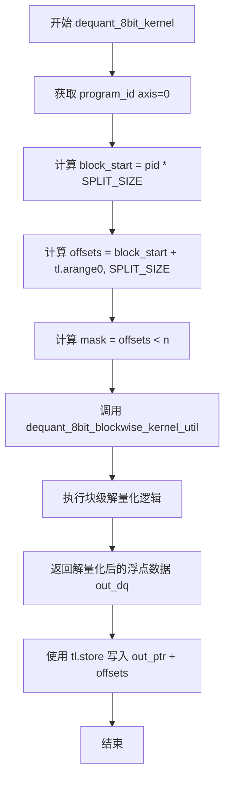
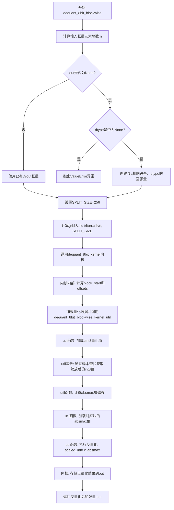
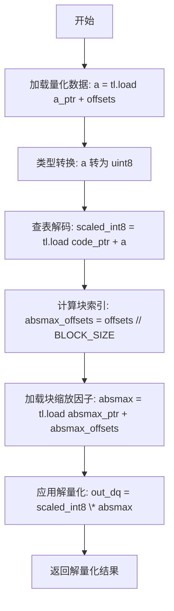

# `bitsandbytes\bitsandbytes\backends\triton\kernels_8bit_quant.py` 详细设计文档

This file implements GPU-accelerated 8-bit block-wise quantization and dequantization for PyTorch tensors using the Triton compiler. It provides functions to convert high-precision float tensors into compact uint8 representations using a codebook and absolute maximum scaling (absmax), and vice versa, optimizing for efficient inference in large language models.

## 整体流程

```mermaid
graph TD
    Start((Input Tensor)) --> Type{Operation}
    Type -->|Quantization| Q_Wrapper[quantize_blockwise_triton]
    Q_Wrapper --> Q_Grid[triton.cdiv(blocks, split_num_blocks)]
    Q_Grid --> Q_Kernel[quantize_8bit_blockwise_kernel]
    Q_Kernel --> Q_Util{calls quantize_8bit_blockwise_kernel_util}
    Q_Util --> Q_Algo[Binary Search Codebook]
    Q_Algo --> Q_Out[Output: UInt8 Indices + Absmax]
    Type -->|Dequantization| DQ_Wrapper[dequant_8bit_blockwise]
    DQ_Wrapper --> DQ_Grid[triton.cdiv(n, SPLIT_SIZE)]
    DQ_Grid --> DQ_Kernel[dequant_8bit_kernel]
    DQ_Kernel --> DQ_Util{calls dequant_8bit_blockwise_kernel_util}
    DQ_Util --> DQ_Algo[Lookup Code & Multiply Scale]
    DQ_Algo --> DQ_Out[Output: Float Tensor]
```

## 类结构

```
quantize_triton.py (Module)
├── Python Wrappers (Host Code)
│   ├── dequant_8bit_blockwise
│   └── quantize_blockwise_triton
├── Triton Kernels (Device Code)
│   ├── dequant_8bit_kernel
│   └── quantize_8bit_blockwise_kernel
└── Triton Utility Kernels
    ├── dequant_8bit_blockwise_kernel_util
    └── quantize_8bit_blockwise_kernel_util
```

## 全局变量及字段


### `dequant_8bit_kernel.a_ptr`
    
输入的量化数据指针，指向待反量化的8位数据

类型：`pointer`
    


### `dequant_8bit_kernel.out_ptr`
    
输出的反量化数据指针，存储反量化后的浮点结果

类型：`pointer`
    


### `dequant_8bit_kernel.code_ptr`
    
代码本指针，指向量化查找表，用于将8位索引映射回原始值

类型：`pointer`
    


### `dequant_8bit_kernel.absmax_ptr`
    
绝对最大值指针，指向每个量化块的缩放因子

类型：`pointer`
    


### `dequant_8bit_kernel.n`
    
输入元素总数，用于计算线程数和边界检查

类型：`int`
    


### `dequant_8bit_kernel.QUANT_BLOCK`
    
量化块大小常量，表示每个块包含的元素数量

类型：`tl.constexpr`
    


### `dequant_8bit_kernel.SPLIT_SIZE`
    
分割大小常量，定义每个程序实例处理的元素数量

类型：`tl.constexpr`
    


### `dequant_8bit_blockwise.a`
    
输入的量化张量，包含要反量化的8位数据

类型：`torch.Tensor`
    


### `dequant_8bit_blockwise.absmax`
    
绝对最大值张量，包含每个量化块的缩放因子

类型：`torch.Tensor`
    


### `dequant_8bit_blockwise.quant_state_code`
    
量化状态代码张量，包含代码本（查找表）数据

类型：`torch.Tensor`
    


### `dequant_8bit_blockwise.quant_blocksize`
    
量化块大小，指定分块量化的块尺寸

类型：`int`
    


### `dequant_8bit_blockwise.dtype`
    
输出数据类型，指定反量化后张量的数据类型

类型：`torch.dtype`
    


### `dequant_8bit_blockwise.out`
    
输出张量，用于存储反量化结果，可由调用者提供

类型：`torch.Tensor`
    


### `quantize_8bit_blockwise_kernel.A_ptr`
    
输入数据指针，指向待量化的浮点数据

类型：`pointer`
    


### `quantize_8bit_blockwise_kernel.code_ptr`
    
代码本指针，指向量化查找表

类型：`pointer`
    


### `quantize_8bit_blockwise_kernel.absmax_ptr`
    
绝对最大值指针，存储每个块计算出的缩放因子

类型：`pointer`
    


### `quantize_8bit_blockwise_kernel.out_ptr`
    
量化输出指针，存储量化后的8位数据

类型：`pointer`
    


### `quantize_8bit_blockwise_kernel.n_elements`
    
元素总数，表示输入数据的总元素个数

类型：`int`
    


### `quantize_8bit_blockwise_kernel.BLOCK_SIZE`
    
块大小常量，表示每个量化块包含的元素数量

类型：`tl.constexpr`
    


### `quantize_8bit_blockwise_kernel.CODE_SIZE`
    
代码本大小常量，表示量化等级的数量

类型：`tl.constexpr`
    


### `quantize_8bit_blockwise_kernel.SPLIT_NUM_BLOCKS`
    
分割块数常量，表示每个线程处理的块数量

类型：`tl.constexpr`
    


### `quantize_blockwise_triton.A`
    
输入张量，待量化的浮点数据

类型：`torch.Tensor`
    


### `quantize_blockwise_triton.code`
    
代码本张量，包含量化查找表的值

类型：`torch.Tensor`
    


### `quantize_blockwise_triton.blocksize`
    
块大小，表示分块量化的块尺寸

类型：`int`
    


### `quantize_blockwise_triton.absmax`
    
绝对最大值张量，存储每个块的缩放因子，如果为None则创建

类型：`torch.Tensor`
    


### `quantize_blockwise_triton.out`
    
输出张量，存储量化后的uint8数据，如果为None则创建

类型：`torch.Tensor`
    


### `quantize_8bit_blockwise_kernel_util.a`
    
输入数据张量，包含待量化的浮点值

类型：`tensor`
    


### `quantize_8bit_blockwise_kernel_util.code_ptr`
    
代码本指针，指向量化查找表用于二分搜索

类型：`pointer`
    


### `quantize_8bit_blockwise_kernel_util.CODE_SIZE`
    
代码本大小常量，决定二分搜索的迭代次数

类型：`tl.constexpr`
    


### `quantize_8bit_blockwise_kernel_util.BLOCK_SIZE`
    
块大小常量，表示每个量化块的大小

类型：`tl.constexpr`
    


### `quantize_8bit_blockwise_kernel_util.N_PER_TH`
    
每个线程处理的数量常量，用于数据重塑

类型：`tl.constexpr`
    


### `dequant_8bit_blockwise_kernel_util.a_ptr`
    
输入指针，指向量化的8位数据

类型：`pointer`
    


### `dequant_8bit_blockwise_kernel_util.offsets`
    
偏移量数组，用于计算内存访问位置

类型：`tensor`
    


### `dequant_8bit_blockwise_kernel_util.code_ptr`
    
代码本指针，指向将索引映射回值的查找表

类型：`pointer`
    


### `dequant_8bit_blockwise_kernel_util.absmax_ptr`
    
绝对最大值指针，指向每个块的缩放因子

类型：`pointer`
    


### `dequant_8bit_blockwise_kernel_util.mask`
    
掩码张量，用于处理边界情况防止越界访问

类型：`tensor`
    


### `dequant_8bit_blockwise_kernel_util.BLOCK_SIZE`
    
块大小常量，用于计算absmax的偏移量

类型：`tl.constexpr`
    
    

## 全局函数及方法


### `dequant_8bit_kernel`

该函数是一个 Triton JIT 编译的 CUDA kernel，用于对 8 位量化数据进行块级解量化（dequantization）。它通过程序 ID 计算数据分块，利用 `dequant_8bit_blockwise_kernel_util` 辅助函数将量化数据转换为浮点数，并使用绝对最大值（absmax）作为缩放因子进行反量化。

参数：

- `a_ptr`：`triton.language.pointer`，输入的 8 位量化数据指针，指向待解量化的量化张量
- `out_ptr`：`triton.language.pointer`，输出指针，用于存储解量化后的浮点数据
- `code_ptr`：`triton.language.pointer`，编码表指针，存储量化值到浮点值的映射码本
- `absmax_ptr`：`triton.language.pointer`，绝对最大值指针，存储每个量化块的缩放因子（absmax）
- `n`：`tl.constexpr`（实际为 int），输入张量的总元素数量
- `QUANT_BLOCK`：`tl.constexpr`，量化块大小，用于计算 absmax 索引和块内元素定位
- `SPLIT_SIZE`：`tl.constexpr`，每个 Triton block 处理的数据元素数量，用于数据分块

返回值：`None`（void），Triton kernel 通过 `tl.store` 直接写入输出指针，无返回值

#### 流程图



#### 带注释源码

```python
@triton.jit
def dequant_8bit_kernel(
    a_ptr,           # 输入：量化后的8位数据指针
    out_ptr,         # 输出：解量化后浮点数据指针
    code_ptr,        # 输入：量化码本指针（lookup table）
    absmax_ptr,      # 输入：每个块的绝对最大值（缩放因子）指针
    n,               # 输入：总元素个数
    QUANT_BLOCK: tl.constexpr,  # 常量：量化块大小（如64）
    SPLIT_SIZE: tl.constexpr,   # 常量：每个block处理的数据量（如256）
):
    # 获取当前 Triton 程序的 ID（用于并行处理数据分块）
    pid = tl.program_id(axis=0)
    
    # 计算当前 block 的起始位置
    block_start = pid * SPLIT_SIZE
    
    # 生成当前 block 的偏移量数组 [block_start, block_start+1, ..., block_start+SPLIT_SIZE-1]
    offsets = block_start + tl.arange(0, SPLIT_SIZE)
    
    # 创建掩码，处理边界情况（最后一个 block 可能不完整）
    mask = offsets < n
    
    # 调用辅助函数执行实际的块级解量化：
    # 1. 加载量化数据 (uint8)
    # 2. 通过 code_ptr 查询码本得到有符号 int8
    # 3. 计算块索引，加载对应的 absmax 缩放因子
    # 4. 乘以缩放因子得到浮点输出
    out_dq = dequant_8bit_blockwise_kernel_util(
        a_ptr, 
        offsets, 
        code_ptr, 
        absmax_ptr, 
        mask, 
        QUANT_BLOCK
    )
    
    # 将解量化结果存储到输出张量，mask 确保不越界
    tl.store(out_ptr + offsets, out_dq, mask)
```


### `dequant_8bit_blockwise`

该函数是8位块级反量化（dequantization）的高性能实现，利用Triton GPU并行计算能力将uint8量化张量转换回浮点张量。它通过查找量化码本并结合每个块的绝对最大值（absmax）缩放因子，实现高效的逆量化操作。

参数：

- `a`：`torch.Tensor`，输入的量化uint8张量，包含要反量化的数据
- `absmax`：`torch.Tensor`，每个量化块的绝对最大值（scale factor），用于反量化时的缩放
- `quant_state_code`：`torch.Tensor`，量化码本（codebook/LUT），存储量化索引到浮点值的映射
- `quant_blocksize`：`int`，块大小，默认为64，指定多少个元素共享一个absmax缩放因子
- `dtype`：`torch.dtype`，输出张量的目标数据类型，当out为None时必须指定
- `out`：`torch.Tensor`，可选的输出张量，如果为None则创建新张量

返回值：`torch.Tensor`，反量化后的浮点张量，数据类型由dtype指定

#### 流程图



#### 带注释源码

```python
def dequant_8bit_blockwise(
    a: torch.Tensor,              # 输入: 量化后的uint8张量
    absmax: torch.Tensor,         # 输入: 每个块的absmax缩放因子
    quant_state_code: torch.Tensor,  # 输入: 量化码本/LUT
    quant_blocksize: int = 64,   # 参数: 块大小，默认64
    dtype: torch.dtype = None,    # 参数: 输出数据类型
    out: torch.Tensor = None,     # 参数: 可选的输出张量
):
    """
    8位块级反量化函数
    
    将量化后的uint8张量通过查找码本并应用absmax缩放，
    转换为浮点张量。使用Triton GPU加速。
    
    Args:
        a: 量化输入张量
        absmax: 每个块的绝对最大值（缩放因子）
        quant_state_code: 量化码本
        quant_blocksize: 块大小
        dtype: 输出数据类型
        out: 输出张量（可选）
    
    Returns:
        反量化后的浮点张量
    """
    
    # 获取输入张量的总元素数量
    n = a.numel()
    
    # 如果没有提供输出张量，则创建新的空张量
    if out is None:
        # 必须指定dtype，否则抛出异常
        if dtype is None:
            raise ValueError("If out is None, dtype must be specified")
        # 创建与输入相同形状和设备的空张量
        out = torch.empty_like(a, dtype=dtype, device=a.device)

    # 定义Triton kernel的分块大小
    SPLIT_SIZE = 256
    
    # 计算grid维度：需要多少个并行程序来处理所有元素
    # triton.cdiv 实现 ceil(n / SPLIT_SIZE)
    grid = (triton.cdiv(n, SPLIT_SIZE),)
    
    # 调用Triton JIT编译的kernel进行GPU加速反量化
    dequant_8bit_kernel[grid](
        a,                      # 输入量化张量
        out,                    # 输出张量
        quant_state_code,      # 量化码本
        absmax,                 # 块级缩放因子
        n,                      # 元素总数
        quant_blocksize,        # 块大小
        SPLIT_SIZE,             # 分块大小
    )
    
    # 返回反量化结果
    return out
```

**关联的Triton Kernel代码（参考）：**

```python
@triton.jit
def dequant_8bit_kernel(
    a_ptr,          # 输入量化张量指针
    out_ptr,        # 输出张量指针
    code_ptr,       # 码本指针
    absmax_ptr,     # absmax指针
    n,              # 元素总数
    QUANT_BLOCK: tl.constexpr,   # 块大小常量
    SPLIT_SIZE: tl.constexpr,    # 分块大小常量
):
    # 获取当前程序ID（并行维度）
    pid = tl.program_id(axis=0)
    
    # 计算当前block的起始位置
    block_start = pid * SPLIT_SIZE
    
    # 生成当前block的偏移量
    offsets = block_start + tl.arange(0, SPLIT_SIZE)
    
    # 创建掩码：确保不超出边界
    mask = offsets < n
    
    # 调用util函数执行实际反量化
    out_dq = dequant_8bit_blockwise_kernel_util(
        a_ptr, offsets, code_ptr, absmax_ptr, mask, QUANT_BLOCK
    )
    
    # 存储结果到输出张量
    tl.store(out_ptr + offsets, out_dq, mask)


@triton.jit
def dequant_8bit_blockwise_kernel_util(
    a_ptr,          # 输入指针
    offsets,        # 偏移量
    code_ptr,       # 码本指针
    absmax_ptr,     # absmax指针
    mask,           # 掩码
    BLOCK_SIZE: tl.constexpr,   # 块大小
):
    # 1. 加载量化数据（uint8）
    a = tl.load(a_ptr + offsets, mask, other=0).to(tl.uint8)
    
    # 2. 通过码本查找：将量化索引转换为缩放后的int8值
    scaled_int8 = tl.load(code_ptr + a, mask)
    
    # 3. 计算每个元素所属的absmax块索引
    absmax_offsets = offsets // BLOCK_SIZE
    
    # 4. 加载对应块的absmax缩放因子
    absmax = tl.load(absmax_ptr + absmax_offsets, mask=mask, other=0.0, eviction_policy="evict_last")
    
    # 5. 应用缩放：反量化 = 缩放后的int8值 * absmax
    out_dq = scaled_int8 * absmax
    
    return out_dq
```


### `quantize_8bit_blockwise_kernel`

这是一个Triton JIT编译的内核函数，用于执行8位块级量化（8-bit blockwise quantization）。该函数将输入的浮点张量按照固定大小的块进行分组，对每个块计算最大绝对值（absmax）作为缩放因子，然后使用二元搜索在量化码本（codebook）中查找最接近的量化值，最终输出量化后的uint8张量及对应的absmax缩放因子。

参数：

- `A_ptr`：`tl.tensor`，输入待量化的浮点数据指针
- `code_ptr`：`tl.tensor`，量化码本（codebook）的指针，包含CODE_SIZE个量化层级值
- `absmax_ptr`：`tl.tensor`，输出指针，用于存储每个量化块的absmax（最大绝对值）
- `out_ptr`：`tl.tensor`，输出指针，用于存储量化后的uint8索引值
- `n_elements`：`int32`，输入张量的总元素个数
- `BLOCK_SIZE`：`tl.constexpr`，每个量化块的元素数量（块大小）
- `CODE_SIZE`：`tl.constexpr`，量化码本的长度（码本中量化值的个数）
- `SPLIT_NUM_BLOCKS`：`tl.constexpr`，每个线程组（thread group）处理的块数量

返回值：`void`，该函数为Triton内核，无返回值。量化结果通过`out_ptr`输出，absmax通过`absmax_ptr`输出。

#### 流程图

```mermaid
flowchart TD
    A[开始] --> B[获取block_start_idx = program_id \* SPLIT_NUM_BLOCKS]
    B --> C[计算thread_idx = arange(0, SPLIT_NUM_BLOCKS \* BLOCK_SIZE)]
    C --> D[计算offsets = block_start_idx \* BLOCK_SIZE + thread_idx]
    D --> E[创建mask = offsets < n_elements]
    E --> F[从A_ptr加载输入数据A = load(A_ptr + offsets)]
    F --> G[调用quantize_8bit_blockwise_kernel_util进行量化]
    G --> H[获得quantized和absmax]
    H --> I[存储absmax到absmax_ptr + block_start_idx]
    I --> J[存储quantized到out_ptr + offsets]
    J --> K[结束]
```

#### 带注释源码

```python
@triton.jit
def quantize_8bit_blockwise_kernel(
    A_ptr,          # 输入：待量化的浮点张量指针
    code_ptr,       # 输入：量化码本指针，存储量化层级的值
    absmax_ptr,     # 输出：每个块的absmax（最大绝对值）指针
    out_ptr,        # 输出：量化后的uint8索引指针
    n_elements,     # 输入：输入张量的总元素个数
    BLOCK_SIZE: tl.constexpr,      # 常量：每个块的元素数量
    CODE_SIZE: tl.constexpr,       # 常量：码本大小
    SPLIT_NUM_BLOCKS: tl.constexpr,  # 常量：每个线程组处理的块数
):
    # 获取当前线程块的起始索引（按块计算）
    block_start_idx = tl.program_id(0) * SPLIT_NUM_BLOCKS
    
    # 计算线程索引范围，用于处理多个块的数据
    # thread_idx的形状为 (SPLIT_NUM_BLOCKS * BLOCK_SIZE,)
    thread_idx = tl.arange(0, SPLIT_NUM_BLOCKS * BLOCK_SIZE)
    
    # 计算全局偏移量：块起始位置 + 线程索引
    offsets = block_start_idx * BLOCK_SIZE + thread_idx
    
    # 创建边界掩码，确保不越界访问
    mask = offsets < n_elements
    
    # 从输入指针加载数据，使用mask处理边界情况
    A = tl.load(A_ptr + offsets, mask=mask, other=0.0)
    
    # 调用Triton util函数执行核心量化逻辑
    # 输入: A - 原始浮点数据, code_ptr - 码本, CODE_SIZE - 码本大小
    # BLOCK_SIZE - 块大小, SPLIT_NUM_BLOCKS - 每线程块数
    quantized, absmax = quantize_8bit_blockwise_kernel_util(
        A, code_ptr, CODE_SIZE, BLOCK_SIZE, SPLIT_NUM_BLOCKS
    )
    
    # 存储每个块的absmax值
    # 写入位置：absmax_ptr + block_start_idx，写入数量为SPLIT_NUM_BLOCKS个
    tl.store(absmax_ptr + block_start_idx + tl.arange(0, SPLIT_NUM_BLOCKS), absmax)
    
    # 存储量化后的结果
    # 使用mask确保边界安全写入
    tl.store(out_ptr + offsets, quantized, mask=mask)
```


### `quantize_blockwise_triton`

该函数是一个基于Triton实现的块级8位量化（blockwise quantization）函数，用于将输入的浮点张量压缩为uint8格式，同时保留每个块的缩放因子（absmax），支持自定义块大小和原地输出优化。

参数：

- `A`：`torch.Tensor`，输入的待量化浮点张量
- `code`：`torch.Tensor`，量化查找表（LUT），包含离散的量化级别值
- `blocksize`：`int`，每个量化块包含的元素数量
- `absmax`：`torch.Tensor`，可选参数，每个块的绝对最大值（缩放因子），若为None则自动创建
- `out`：`torch.Tensor`，可选参数，存储量化结果的输出张量，若为None则自动创建

返回值：`Tuple[torch.Tensor, torch.Tensor]`，返回量化后的uint8张量及其对应的absmax缩放因子张量

#### 流程图

```mermaid
flowchart TD
    A[输入张量 A, code, blocksize] --> B[计算块数量 blocks]
    B --> C{absmax 为 None?}
    C -->|是| D[创建 blocks 大小的 absmax 张量]
    C -->|否| E[使用传入的 absmax]
    D --> F{out 为 None?}
    E --> F
    F -->|是| G[创建与 A.flatten() 同形状的 uint8 张量]
    F -->|否| H[使用传入的 out 张量]
    G --> I[计算 grid = cdiv(blocks, 1)]
    H --> I
    I --> J[调用 quantize_8bit_blockwise_kernel Triton 内核]
    J --> K[将输出 reshape 为原始 A.shape]
    K --> L[返回 out 和 absmax]
```

#### 带注释源码

```
def quantize_blockwise_triton(A, code, blocksize, absmax=None, out=None):
    # 获取输入张量的总元素数量
    n = A.numel()
    
    # 计算需要的块数量（向上取整）
    # 使用巧妙的负整除法: -(n // -blocksize) 等同于 math.ceil(n / blocksize)
    blocks = -(n // -blocksize)

    # 如果未提供 absmax，则为每个块创建一个空的缩放因子张量
    # 缩放因子张量的 dtype 继承自输入张量 A
    if absmax is None:
        absmax = torch.empty((blocks,), device=A.device, dtype=A.dtype)
    
    # 如果未提供输出张量，则创建一个与 A 形状相同的 uint8 张量
    # 使用 flatten() 确保一维存储
    if out is None:
        out = torch.empty_like(A.flatten(), dtype=torch.uint8)

    # 设置每个 CUDA block 处理的块数量（当前固定为 1）
    split_num_blocks = 1
    
    # 计算 grid 大小：需要处理的块数 / 每个 grid 点处理的块数
    grid = (triton.cdiv(blocks, split_num_blocks),)
    
    # 调用 Triton JIT 编译的内核函数进行量化计算
    quantize_8bit_blockwise_kernel[grid](
        A_ptr=A,           # 输入张量指针
        code_ptr=code,     # 量化编码表指针
        absmax_ptr=absmax, # 缩放因子输出指针
        out_ptr=out,       # 量化结果输出指针
        n_elements=n,      # 总元素数量
        BLOCK_SIZE=blocksize,  # 块大小
        CODE_SIZE=code.numel(), # 编码表大小
        SPLIT_NUM_BLOCKS=split_num_blocks,  # 每个 grid 点处理的块数
    )
    
    # 将量化结果 reshape 回原始输入张量的形状
    out = out.reshape(A.shape)

    # 返回量化后的张量和对应的缩放因子
    return out, absmax
```


### `quantize_8bit_blockwise_kernel_util`

这是一个 Triton JIT 内核工具函数，用于执行 8 位块量化（blockwise quantization）。它接收输入张量，使用二进制搜索在代码本（codebook）中找到最接近的量化值，计算每个块的绝对最大值（absmax）作为缩放因子，并返回扁平化的量化结果和对应的 absmax 值。

参数：

- `a`：`tl.tensor`，输入的已重塑张量，形状为 `(N_PER_TH, BLOCK_SIZE)`，表示每个线程处理的块数据
- `code_ptr`：`tl.tensor`，代码本（codebook）指针，存储量化查找表
- `CODE_SIZE`：`tl.constexpr`，代码本大小（常量），表示量化级别的数量
- `BLOCK_SIZE`：`tl.constexpr`，块大小（常量），每个块包含的元素数量
- `N_PER_TH`：`tl.constexpr`，每个线程处理的块数量（常量）

返回值：`tuple`，包含两个元素：

- `quantized_flat`：`tl.tensor`（uint8），扁平化的量化结果，形状为 `(BLOCK_SIZE * N_PER_TH,)`
- `absmax`：`tl.tensor`，每个块的绝对最大值，形状为 `(N_PER_TH,)`

#### 流程图

```mermaid
flowchart TD
    A[输入: a, code_ptr, CODE_SIZE, BLOCK_SIZE, N_PER_TH] --> B[重塑输入张量]
    B --> C[计算每块absmax: absmax = maxabs<a>]
    C --> D[归一化: a_normalized = a / absmax]
    D --> E[clamp到[-1.0, 1.0]范围]
    E --> F[初始化lower_pivot=0, upper_pivot=CODE_SIZE-1]
    F --> G{循环8次}
    G --> H[pivot = (lower + upper) // 2]
    H --> I[加载code_ptr[pivot]]
    I --> J[比较: a_normalized > code[pivot]]
    J --> K[更新lower_pivot和upper_pivot]
    K --> G
    G --> L[加载code[lower_pivot]和code[upper_pivot]]
    L --> M[计算距离: lower_dist, upper_dist]
    M --> N[选择最近的量化级别]
    N --> O[返回quantized_flat和absmax]
```

#### 带注释源码

```python
@triton.jit
def quantize_8bit_blockwise_kernel_util(
    a,                      # 输入张量，已重塑为 (N_PER_TH, BLOCK_SIZE)
    code_ptr,               # 代码本指针，存储量化查找表
    CODE_SIZE: tl.constexpr,  # 代码本大小
    BLOCK_SIZE: tl.constexpr, # 块大小
    N_PER_TH: tl.constexpr,   # 每个线程处理的块数
):
    # 为了能够处理多个块 -> 将输入重塑为 2D (N_PER_TH, BLOCK_SIZE)
    a_reshaped = tl.reshape(a, (N_PER_TH, BLOCK_SIZE))

    # 计算每个块的绝对最大值（absmax）
    # 对每个块（axis=1）求最大绝对值，结果形状为 (N_PER_TH,)
    absmax = tl.max(tl.abs(a_reshaped), axis=1)

    # 归一化：将输入除以对应块的absmax
    a_normalized = a_reshaped / absmax[:, None]
    
    # 限制归一化后的值在 [-1.0, 1.0] 范围内
    a_normalized = tl.clamp(a_normalized, -1.0, 1.0)

    # 初始化二进制搜索的下界和上界
    # lower_pivot: 初始为0，表示代码本索引下界
    # upper_pivot: 初始为CODE_SIZE-1，表示代码本索引上界
    lower_pivot = tl.zeros((N_PER_TH, BLOCK_SIZE), dtype=tl.int32)
    upper_pivot = tl.full((N_PER_TH, BLOCK_SIZE), CODE_SIZE - 1, dtype=tl.int32)

    # 二进制搜索：在代码本中查找最接近的量化值
    # 循环8次，因为CODE_SIZE=256时，log2(256)=8
    for _ in range(8):
        # 计算中点索引
        pivot = (lower_pivot + upper_pivot) // 2
        # 加载代码本中pivot位置的value
        val = tl.load(code_ptr + pivot)
        # 比较归一化值与代码本值
        is_higher = a_normalized > val  # code[pivot]
        # 根据比较结果更新上下界
        lower_pivot = tl.where(is_higher, pivot, lower_pivot)
        upper_pivot = tl.where(is_higher, upper_pivot, pivot)

    # 搜索结束后，选择最接近的量化级别
    # 加载上下界对应的代码本值
    lower_val = tl.load(code_ptr + lower_pivot)
    upper_val = tl.load(code_ptr + upper_pivot)
    # 计算距离
    lower_dist = tl.abs(a_normalized - lower_val)
    upper_dist = tl.abs(a_normalized - upper_val)
    # 选择距离较小的那个，并转换为uint8
    quantized = tl.where(lower_dist <= upper_dist, lower_pivot, upper_pivot).to(tl.uint8)

    # 将量化结果从2D重塑为1D（扁平化）
    quantized_flat = tl.reshape(quantized, (BLOCK_SIZE * N_PER_TH,))
    
    # 返回扁平化的量化结果和每个块的absmax
    return quantized_flat, absmax
```


### `dequant_8bit_blockwise_kernel_util`

这是一个 Triton JIT 编译的内核函数，用于执行 8 位量化块的反量化操作。它从量化张量中加载数据，通过查表映射回有符号整数，并结合块级缩放因子（absmax）将结果还原为浮点数。

参数：

- `a_ptr`：输入的量化数据指针（`tl.tensor`，uint8 类型），指向待解量化的量化张量
- `offsets`：偏移量张量（`tl.tensor`，用于计算数据索引），指定当前线程要处理的数据位置
- `code_ptr`：查询表指针（`tl.tensor`，fp32 类型），将量化索引映射回原始浮点值
- `absmax_ptr`：块级绝对最大值指针（`tl.tensor`，fp32 类型），存储每个量化块的缩放因子
- `mask`：计算掩码（`tl.tensor`，bool 类型），标识有效的输出位置以处理边界情况
- `BLOCK_SIZE`：`tl.constexpr` 类型（int），常量表达式，表示量化块的大小，用于计算块索引

返回值：`tl.tensor`（fp32 类型），解量化后的浮点张量，包含还原后的原始数值

#### 流程图



#### 带注释源码

```python
@triton.jit
def dequant_8bit_blockwise_kernel_util(
    a_ptr,          # 输入：量化数据指针（uint8 数组）
    offsets,        # 输入：当前线程的偏移量索引
    code_ptr,       # 输入：解码查找表指针（fp32 数组）
    absmax_ptr,     # 输入：块级缩放因子指针（fp32 数组）
    mask,           # 输入：有效位置掩码（bool 数组）
    BLOCK_SIZE: tl.constexpr,  # 常量：每个量化块的元素数量
):
    # 步骤 1: 从输入指针加载量化数据（uint8 格式），并转换为 uint8 类型
    a = tl.load(a_ptr + offsets, mask, other=0).to(tl.uint8)
    
    # 步骤 2: 使用量化值作为索引，从代码表中查找对应的有符号整数（int8）
    scaled_int8 = tl.load(code_ptr + a, mask)
    
    # 步骤 3: 计算每个元素所属的块索引（整除操作）
    # 例如：BLOCK_SIZE=64 时，offsets 0-63 对应块 0，64-127 对应块 1
    absmax_offsets = offsets // BLOCK_SIZE
    
    # 步骤 4: 加载对应块的绝对最大值（缩放因子）
    # eviction_policy="evict_last" 优化：优先保留在缓存中供后续使用
    absmax = tl.load(absmax_ptr + absmax_offsets, mask=mask, other=0.0, eviction_policy="evict_last")
    
    # 步骤 5: 应用解量化公式：原始值 = 量化值 × 缩放因子
    out_dq = scaled_int8 * absmax
    
    # 步骤 6: 返回解量化后的浮点结果
    return out_dq
```

## 关键组件


### 张量索引与块处理

该代码使用Triton框架实现8位块级量化与反量化，通过块级别的索引偏移计算和掩码机制处理变长张量，实现数据的高效分块加载与存储。

### 反量化支持

dequant_8bit_kernel和dequant_8bit_blockwise_kernel_util函数共同实现8位张量的反量化，通过查找码本(codebook)获取量化值并乘以对应的缩放因子(absmax)还原原始浮点数。

### 量化策略

quantize_8bit_blockwise_kernel_util采用块级量化策略，计算每个块的绝对最大值(absmax)作为缩放因子，使用二进制搜索在码本中查找最接近的量化值，实现高效的有符号浮点数到无符号8位整数的映射。

### 二进制搜索码本查找

量化核心算法使用8轮固定迭代的二进制搜索，在码本中定位最接近目标归一化值的量化级别，通过比较lower_pivot和upper_pivot对应的码本值与目标值的距离，选择更接近的量化结果。

### 惰性加载与掩码处理

代码使用tl.load配合mask参数实现惰性加载，仅处理有效范围内的数据元素，避免边界条件下的越界访问，masked operation确保未使用的线程不产生无效计算。

### 内存访问优化

dequant_8bit_blockwise_kernel_util中使用eviction_policy="evict_last"优化absmax缩放因子的加载策略，减少缓存争用并提升内存访问效率。

### 块级缩放因子管理

absmax张量存储每个量化块的缩放因子，通过整数除法(offsets // BLOCK_SIZE)计算块索引，实现缩放因子与量化数据的一一对应关系，支持不同块大小的量化配置。

### 向量化与形状重塑

quantize_8bit_blockwise_kernel_util使用tl.reshape将一维张量重塑为二维块结构(N_PER_TH, BLOCK_SIZE)，实现批量并行处理多个数据块，利用Triton的向量化操作提升吞吐量。


## 问题及建议


### 已知问题

- **硬编码的循环次数**: `quantize_8bit_blockwise_kernel_util` 函数中的循环次数硬编码为8次（`for _ in range(8):`），这假设了 `CODE_SIZE=256`（2^8），但没有动态计算，当 code_size 变化时会导致错误或效率低下。
- **缺失的 `@triton.jit` 装饰器**: `dequant_8bit_blockwise_kernel_util` 函数在被 `dequant_8bit_kernel` 调用时，需要在同一个 JIT 模块中定义，当前代码中该函数的定义位置和调用关系可能导致 Triton 无法正确内联。
- **参数命名不一致**: 代码中存在多处命名不一致问题，如 `quant_state_code` vs `code_ptr`、`quant_blocksize` vs `BLOCK_SIZE`、`QUANT_BLOCK` vs `BLOCK_SIZE`，增加了理解和维护难度。
- **类型提示不完整**: 缺少函数参数和返回值的类型注解，特别是 `quantize_blockwise_triton` 和 `dequant_8bit_blockwise` 函数缺少完整的类型标注。
- **被注释掉的 Autotune 配置**: 大量 `@triton.autotune` 装饰器被注释掉，包括多种 SPLIT_SIZE、num_stages、num_warps 和 grf_mode 配置，这可能导致无法找到最优的硬件执行参数。
- **代码结构问题**: 两个 `*_kernel_util` 函数应该是内部函数或需要明确其作用域，当前实现可能造成模块级别的命名污染。
- **设备管理缺失**: 代码没有明确指定 CUDA 设备（`device` 参数），在多 GPU 环境下可能出现设备不匹配错误。
- **边界条件处理**: `quantize_8bit_blockwise_kernel` 中 `grid` 的计算使用 `triton.cdiv(blocks, split_num_blocks)`，但 `split_num_blocks` 固定为1，可能不是最优配置。
- **缺少输入验证**: `quantize_blockwise_triton` 函数没有验证 `code` tensor 的形状和内容，`absmax` tensor 的 dtype 没有被明确指定。
- **无文档注释**: 整个代码库没有任何 docstring 或注释来说明函数用途、参数含义和返回值。

### 优化建议

- **动态计算循环次数**: 使用 `int(math.ceil(math.log2(CODE_SIZE)))` 替代硬编码的8，或将循环次数作为参数传入。
- **启用 Autotune**: 取消注释 `@triton.autotune` 装饰器并添加更多配置选项，让 Triton 自动选择最优配置；特别是恢复 `grf_mode`、`num_stages` 和 `num_warps` 的调优。
- **统一命名规范**: 将参数名称统一为 `code_ptr`/`code`、`quant_blocksize`/`BLOCK_SIZE`、`QUANT_BLOCK`/`BLOCK_SIZE` 等。
- **添加类型注解**: 为所有函数添加完整的类型注解，包括 `torch.Tensor`、`int`、`Optional` 等类型。
- **添加设备参数**: 在 kernel 调用时显式指定 `device=a.device` 或从 tensor 中提取设备信息。
- **添加输入验证**: 检查 `code` 的形状是否为 (256,)、`absmax` 是否为正确形状等。
- **添加文档注释**: 为每个函数和重要代码块添加 docstring，说明功能、参数和返回值。
- **重构代码结构**: 将 `*_util` 函数定义为模块内部函数或在 class 中组织，以避免全局命名污染。
- **支持更多量化方法**: 当前仅支持 absmax 量化，可考虑添加零点（zero-point）量化支持。
- **优化网格计算**: 考虑使用 `grid = lambda META: (triton.cdiv(n, META["SPLIT_SIZE"]),)` 形式使 grid 与 kernel meta 参数关联。


## 其它


### 设计目标与约束

本模块旨在实现高效的GPU加速8位块量化/反量化操作，用于深度学习模型压缩场景。设计目标包括：(1) 通过Triton编译优化实现接近硬件峰值的吞吐量；(2) 支持任意形状的输入Tensor；(3) 提供可配置的量化块大小（blocksize）以适应不同模型层的需求。核心约束包括：量化码本大小固定为256（8bit），仅支持NVIDIA GPU上的Triton运行时，输出类型限定为uint8。

### 错误处理与异常设计

代码中包含以下错误检查机制：(1) `dequant_8bit_blockwise`函数在`out`参数为None时强制要求指定`dtype`参数，否则抛出`ValueError`；(2) Triton内核通过mask机制处理边界情况，避免访问越界内存；(3) 量化/反量化过程中使用`tl.load`函数的`mask`和`other`参数处理非完整块。潜在改进：可增加输入Tensor类型检查（仅支持浮点类型）、设备兼容性验证（仅支持CUDA设备）、码本和absmax张量形状一致性校验。

### 数据流与状态机

**量化流程（quantize_blockwise_triton）：** 输入浮点Tensor A → 计算块数blocks → 分配absmax和输出缓冲区 → 调用quantize_8bit_blockwise_kernel → 按块计算absmax → 归一化到[-1,1]区间 → 二分搜索查找最优量化码 → 输出量化值和absmax。

**反量化流程（dequant_8bit_blockwise）：** 输入量化Tensor a、码本code、absmax → 计算分割数 → 调用dequant_8bit_kernel → 读取量化索引 → 查表获取有符号整数值 → 加载对应absmax → 逐元素乘积得到反量化结果。

### 外部依赖与接口契约

主要依赖包括：(1) `torch`（PyTorch张量操作）；(2) `triton`（GPU内核编译运行时）；(3) `triton.language`（Triton DSL）。公开接口函数：
- `quantize_blockwise_triton(A, code, blocksize, absmax=None, out=None)` → 返回(out, absmax)
- `dequant_8bit_blockwise(a, absmax, quant_state_code, quant_blocksize=64, dtype=None, out=None)` → 返回out

### 性能考虑与优化点

当前实现包含以下优化策略：(1) 使用Triton的constexpr参数进行编译期常量传播；(2) 反量化kernel采用`eviction_policy="evict_last"`优化L2缓存利用率；(3) 量化使用二分搜索（固定8轮）替代全量比较，降低复杂度从O(CODE_SIZE)至O(log CODE_SIZE)。潜在优化空间：(1) 恢复被注释的autotune配置以支持更广泛的SPLIT_SIZE选择；(2) quantize_8bit_blockwise_kernel可启用SPLIT_NUM_BLOCKS>1以增加并行度；(3) 可加入中间结果向量化存储优化。

### 内存管理

内存分配策略如下：(1) 量化输出默认创建`torch.empty_like(A.flatten(), dtype=torch.uint8)`；(2) absmax缓冲区大小为`-(n // -blocksize)`（即向上取整的块数）；(3) 反量化输出通过`torch.empty_like`分配，设备继承自输入Tensor。所有显存分配由PyTorch自动管理，内核执行采用异步非阻塞模式。

### 兼容性考虑

当前代码的兼容性限制包括：(1) 仅支持CUDA设备（Triton后端要求）；(2) 输入dtype需为浮点类型（float32/float16/bfloat16）；(3) blocksize需为正整数且能整除张量元素数量（反量化场景）；(4) 量化码本code的numel必须为256。不兼容场景：CPU设备执行、多GPU分布式场景、张量形状动态变化的高频调用。

### 边界条件处理

代码处理以下边界情况：(1) 输入元素数不足单个SPLIT_SIZE时，grid计算自动适配；(2) 非完整块通过mask屏蔽无效计算；(3) 量化索引越界通过absmax_offsets = offsets // BLOCK_SIZE对齐。遗留问题：quantize_blockwise_triton中blocks计算使用整除向下取整，可能导致最后一块被截断。

### 测试考虑

建议补充的测试场景包括：(1) 任意形状Tensor的端到端量化-反量化精度测试；(2) 不同blocksize（64/128/256/512）下的数值一致性验证；(3) 边界条件（单元素、零元素、非整除块数）下的稳定性测试；(4) 与PyTorch原生量化后端的速度对比基准测试；(5) 梯度检查（用于训练场景的量化感知训练）。

### 潜在改进建议

技术债务与优化方向：(1) 移除被注释的autotune配置或恢复其功能；(2) 量化kernel中hardcoded的循环次数8应替换为动态计算的`ceil(log2(CODE_SIZE))`；(3) 缺少quant_state_code与absmax的形状一致性校验；(4) 可考虑增加量化误差统计信息返回；(5) 建议添加CUDA事件计时以支持性能profiling。


    