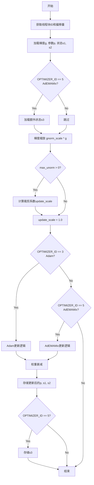
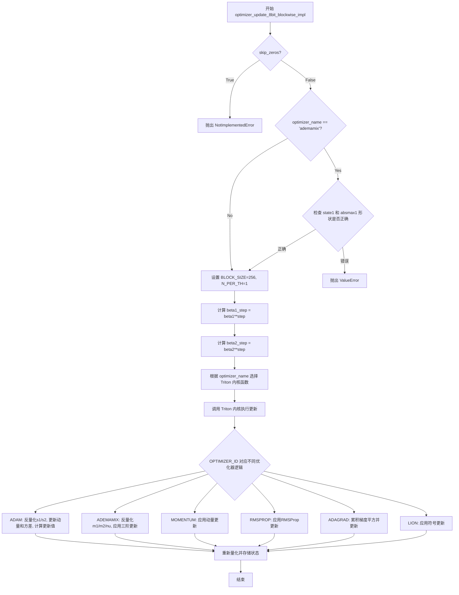

# `bitsandbytes\bitsandbytes\backends\triton\kernels_optim.py` 详细设计文档

这是一个基于 Triton 的高性能优化器实现库，支持 32 位浮点数和 8 位块量化（blockwise quantization）的优化算法更新（如 Adam, Momentum, RMSProp, Lion, AdEMAMix）。代码包含用于 GPU 加速的 Triton Kernel 以及纯 PyTorch 的参考实现。

## 整体流程

```mermaid
graph TD
    A[Start] --> B{选择实现路径}
    B -- 32位更新 --> C[optimizer_update_32bit_impl]
    B -- 8位块量化更新 --> D[optimizer_update_8bit_blockwise_impl]
    C --> C1{是否计算梯度范数?}
    C1 -- 是 --> C2[调用 _optimizer_precondition_*_32bit Kernel]
    C1 -- 否 --> C3[直接调用 _optimizer_update_*_32bit Kernel]
    C2 --> C3
    C3 --> C4[更新参数 P]
    C4 --> E[End]
    D --> D1[加载参数与状态]
    D1 --> D2[状态解量化 (Dequantize)]
    D2 --> D3{优化器类型}
    D3 -- Adam/AdEMAMix --> D4[调用 2状态 Kernel]
    D3 -- Momentum/RMSProp/Lion --> D5[调用 1状态 Kernel]
    D4 --> D6[参数更新与状态重量化 (Requantize)]
    D5 --> D6
    D6 --> E
```

## 类结构

```
optimizer.py (模块根目录)
├── 全局变量与映射 (Global Config)
│   ├── name2optimizer_id
│   ├── name2optimizer_32bit_fn
│   └── name2optimizer_fn
├── 32位 Triton Kernels
│   ├── _optimizer_precondition_2state_32bit (ADAM/ADEMAMIX 预处理)
│   ├── _optimizer_precondition_1state_32bit (Momentum/RMSProp 预处理)
│   ├── _optimizer_update_2state_32bit_triton_kernel (2状态参数更新)
│   └── _optimizer_update_1state_32bit_triton_kernel (1状态参数更新)
├── 8位 Triton Kernels
│   ├── _optimizer_update_1state_8bit_blockwise_triton_kernel
│   └── _optimizer_update_2state_8bit_blockwise_triton_kernel
└── Python 封装与实现
    ├── optimizer_update_32bit_impl
    ├── optimizer_update_8bit_blockwise_pytorch (纯 PyTorch 参考)
    ├── optimizer_update_8bit_blockwise_triton_quant (混合实现)
    └── optimizer_update_8bit_blockwise_impl (主入口)
```

## 全局变量及字段


### `MOMENTUM`
    
Optimizer ID constant for Momentum optimizer (value=0)

类型：`int`
    


### `RMSPROP`
    
Optimizer ID constant for RMSprop optimizer (value=1)

类型：`int`
    


### `ADAGRAD`
    
Optimizer ID constant for Adagrad optimizer (value=2)

类型：`int`
    


### `ADAM`
    
Optimizer ID constant for Adam optimizer (value=3)

类型：`int`
    


### `LION`
    
Optimizer ID constant for Lion optimizer (value=4)

类型：`int`
    


### `ADEMAMIX`
    
Optimizer ID constant for AdEMAMix optimizer (value=5)

类型：`int`
    


### `name2optimizer_id`
    
Mapping from optimizer name strings to their corresponding integer IDs for switch statements in kernels

类型：`Dict[str, int]`
    


### `name2optimizer_32bit_fn`
    
Mapping from optimizer names to their 32-bit preprocess and update Triton kernel functions

类型：`Dict[str, Dict[str, Callable]]`
    


### `name2optimizer_fn`
    
Mapping from optimizer names to their 8-bit blockwise Triton kernel functions for efficient quantized optimizer updates

类型：`Dict[str, Callable]`
    


    

## 全局函数及方法


### `_optimizer_precondition_2state_32bit`

该函数是一个Triton JIT编译的内核函数，用于2状态优化器（如Adam、AdEMAMix）的预处理阶段，计算参数更新值的范数（update norm），为后续的梯度裁剪提供依据。

参数：

- `g_ptr`：`<class 'tl.ptr'>`，梯度（gradient）指针，指向存储梯度的内存地址
- `p_ptr`：`<class 'tl.ptr'>`，参数（parameter）指针，指向模型参数的内存地址（当前函数未直接使用，仅为接口一致性）
- `state1_ptr`：`<class 'tl.ptr'>`，一阶状态指针，指向动量/一阶矩估计的内存地址
- `state2_ptr`：`<class 'tl.ptr'>`，二阶状态指针，指向二阶矩估计（方差）的内存地址
- `unorm_ptr`：`<class 'tl.ptr'>`，更新范数（update norm）指针，用于原子累加计算出的总范数值
- `beta1`：`tl.constexpr`，一阶矩衰减系数（beta1），用于动量更新
- `beta2`：`tl.constexpr`，二阶矩衰减系数（beta2），用于方差估计
- `eps`：`tl.constexpr`，epsilon值，防止除零错误
- `weight_decay`：`tl.constexpr`，权重衰减系数，当前函数中未直接使用
- `step`：`int`，当前训练步数，用于判断是否为首次更新
- `beta1_step`：`float`，beta1的step次方，用于偏差校正
- `beta2_step`：`float`，beta2的step次方，用于偏差校正
- `lr`：`float`，学习率，当前函数中未直接使用
- `gnorm_scale`：`tl.constexpr`，梯度范数缩放因子
- `n_elements`：`int`，处理的元素总数
- `OPTIMIZER_ID`：`tl.constexpr`，优化器标识符，用于区分不同的优化算法（3=Adam，5=AdEMAMix）
- `BLOCK_SIZE`：`tl.constexpr`，每个线程块处理的元素数量
- `N_PER_TH`：`tl.constexpr`，每个线程处理的块数量

返回值：`void`，无返回值。该函数通过原子操作将计算结果写入`unorm_ptr`指向的内存地址。

#### 流程图

```mermaid
flowchart TD
    A[开始: _optimizer_precondition_2state_32bit] --> B[获取程序ID: pid = tl.program_id]
    B --> C[计算块起始索引和偏移量]
    C --> D[创建掩码: mask = offsets < n_elements]
    D --> E[加载梯度值: g_vals = tl.load]
    E --> F[加载状态1: s1_vals = tl.load]
    F --> G[加载状态2: s2_vals = tl.load]
    G --> H[应用梯度缩放: g_vals = gnorm_scale * g_vals]
    H --> I[计算偏差校正因子]
    I --> J{OPTIMIZER_ID == 3?}
    J -->|Yes| K[ADAM优化器]
    J -->|No| L{OPTIMIZER_ID == 5?}
    L -->|Yes| M[ADEMAMIX优化器]
    L -->|No| N[其他优化器-不执行更新]
    K --> K1[更新s1: s1 = s1 * beta1 + (1-beta1) * g]
    K1 --> K2[更新s2: s2 = s2 * beta2 + (1-beta2) * g²]
    K2 --> K3[应用偏差校正]
    K3 --> K4[计算更新值: update = s1 / sqrt(s2 + eps)]
    K4 --> K5[计算更新范数: update_norm = update²]
    M --> M1[直接使用s1作为update_norm]
    K5 --> O[计算总范数: total_norm = sum]
    M1 --> O
    O --> P[原子累加: tl.atomic_add]
    P --> Q[结束]
```

#### 带注释源码

```python
@triton.jit
def _optimizer_precondition_2state_32bit(
    g_ptr,          # 梯度指针
    p_ptr,          # 参数指针（此函数中未使用）
    state1_ptr,     # 一阶状态指针（动量/m1）
    state2_ptr,     # 二阶状态指针（方差/nu）
    unorm_ptr,      # 更新范数累加指针
    beta1: tl.constexpr,        # Adam一阶衰减系数
    beta2: tl.constexpr,        # Adam二阶衰减系数
    eps: tl.constexpr,          # 防止除零的epsilon
    weight_decay: tl.constexpr, # 权重衰减（此函数中未使用）
    step,                      # 当前训练步数
    beta1_step,                # beta1的step次方（预计算）
    beta2_step,                # beta2的step次方（预计算）
    lr,                        # 学习率（此函数中未使用）
    gnorm_scale: tl.constexpr, # 梯度缩放因子
    n_elements,                # 元素总数
    OPTIMIZER_ID: tl.constexpr, # 优化器类型标识
    BLOCK_SIZE: tl.constexpr,  # 块大小
    N_PER_TH: tl.constexpr,    # 每线程块数
):
    """Preprocessing optimizer, computing update norm (2-state optimizer)"""
    # 获取当前线程的程序ID（用于并行计算）
    pid = tl.program_id(axis=0)
    
    # 计算当前线程块处理的起始索引
    block_start_idx = pid * N_PER_TH
    
    # 计算当前线程需要处理的元素偏移量
    # 生成0到BLOCK_SIZE*N_PER_TH的偏移序列
    offsets = block_start_idx * BLOCK_SIZE + tl.arange(0, BLOCK_SIZE * N_PER_TH)
    
    # 创建掩码，确保不越界（处理最后一个不完整块）
    mask = offsets < n_elements

    # 从内存加载梯度值，使用掩码处理边界情况
    g_vals = tl.load(g_ptr + offsets, mask=mask, other=0.0)
    
    # 加载一阶状态（动量）
    s1_vals = tl.load(state1_ptr + offsets, mask=mask, other=0.0)
    
    # 加载二阶状态（方差）
    s2_vals = tl.load(state2_ptr + offsets, mask=mask, other=0.0)

    # 对梯度进行缩放（可能用于梯度归一化）
    g_vals = gnorm_scale * g_vals

    # 计算偏差校正因子
    # 这是为了补偿初始化时动量/方差为0的偏差
    correction1 = 1.0 / (1.0 - beta1_step)
    correction2 = 1.0 / (1.0 - beta2_step)

    # 根据优化器类型执行不同逻辑
    if OPTIMIZER_ID == 3:  # ADAM
        # 更新一阶矩估计（动量）
        s1_vals = s1_vals * beta1 + (1.0 - beta1) * g_vals
        
        # 更新二阶矩估计（方差）
        s2_vals = s2_vals * beta2 + (1.0 - beta2) * g_vals * g_vals

        # 应用偏差校正
        s1_vals = s1_vals * correction1
        s2_vals = s2_vals * correction2

        # 计算更新值：m / (sqrt(v) + eps)
        update_vals = s1_vals / (tl.sqrt(s2_vals) + eps)

        # 计算更新值的平方（用于范数计算）
        update_norm = update_vals * update_vals

    elif OPTIMIZER_ID == 5:  # ADEMAMIX
        # AdEMAMix使用s1直接作为更新范数
        # （因为在update kernel中会重新计算完整的更新）
        update_norm = s1_vals

    # 使用掩码过滤无效元素，计算更新范数的总和
    total_norm = tl.sum(tl.where(mask, update_norm, 0.0))

    # 原子操作将总范数累加到全局内存
    # 多个线程块的结果会累加到一起
    tl.atomic_add(unorm_ptr, total_norm)
```


### `_optimizer_precondition_1state_32bit`

这是一个Triton JIT编译的内核函数，用于一阶状态优化器（如Momentum、RMSprop、Adagrad、LION）的预处理阶段，计算梯度更新向量的范数（用于梯度裁剪）。

参数：

- `g_ptr`：`ptr`，指向梯度张量的指针
- `p_ptr`：`ptr`，指向参数张量的指针（此函数中未直接使用）
- `state1_ptr`：`ptr`，指向优化器第一状态（如动量）的指针
- `state2_ptr`：`ptr`，指向优化器第二状态的指针（此函数中未直接使用）
- `unorm_ptr`：`ptr`，指向累积范数向量的指针，用于原子操作
- `beta1`：`tl.constexpr`，第一动量衰减系数（用于Momentum、RMSprop、Adagrad）
- `beta2`：`tl.constexpr`，第二动量衰减系数（用于LION）
- `eps`：`tl.constexpr`，用于数值稳定性的小常数
- `weight_decay`：权重衰减系数
- `step`：当前训练步数
- `beta1_step`：beta1的step次方（预计算偏差校正因子）
- `beta2_step`：beta2的step次方（预计算偏差校正因子）
- `lr`：学习率
- `gnorm_scale`：`tl.constexpr`，梯度范数缩放因子
- `n_elements`：要处理的元素总数
- `OPTIMIZER_ID`：`tl.constexpr`，优化器标识符（0=MOMENTUM, 1=RMSPROP, 2=ADAGRAD, 4=LION）
- `BLOCK_SIZE`：`tl.constexpr`，每个线程块的元素数量
- `N_PER_TH`：`tl.constexpr`，每个线程处理的数据块数量

返回值：无返回值（`void`），通过`tl.atomic_add`将计算出的`total_norm`累加到`unorm_ptr`指向的内存中

#### 流程图

```mermaid
flowchart TD
    A[开始] --> B[获取程序ID和块起始索引]
    B --> C[计算偏移量和掩码]
    D[加载梯度g_vals和状态s1_vals] --> E[应用gnorm_scale缩放]
    E --> F{OPTIMIZER_ID == 0<br/>MOMENTUM?}
    F -->|是| G{step == 1?}
    G -->|是| H[s1_vals = g_vals]
    G -->|否| I[s1_vals = s1_vals * beta1 + g_vals]
    H --> J[update_norm = s1_vals * s1_vals]
    I --> J
    F -->|否| K{OPTIMIZER_ID == 4<br/>LION?}
    K -->|是| L[s1_vals = s1_vals * beta2 + (1-beta2) * g_vals]
    L --> M[update_norm = s1_vals]
    K -->|否| N{OPTIMIZER_ID == 1<br/>RMSPROP?}
    N -->|是| O[s1_vals = s1_vals * beta1 + (1-beta1) * g_vals * g_vals]
    O --> P[update_vals = g_vals / (sqrt(s1_vals) + eps)]
    P --> Q[update_norm = update_vals * update_vals]
    N -->|否| R{OPTIMIZER_ID == 2<br/>ADAGRAD?}
    R -->|是| S[s1_vals = s1_vals + g_vals * g_vals]
    S --> T[update_vals = g_vals / (sqrt(s1_vals) + eps)]
    T --> Q
    J --> U[计算total_norm = sum(update_norm * mask)]
    M --> U
    Q --> U
    U --> V[tl.atomic_add累积范数到unorm_ptr]
    V --> Z[结束]
```

#### 带注释源码

```python
@triton.jit
def _optimizer_precondition_1state_32bit(
    g_ptr,          # 梯度张量指针
    p_ptr,          # 参数张量指针（此函数未使用）
    state1_ptr,     # 优化器第一状态指针
    state2_ptr,     # 优化器第二状态指针（此函数未使用）
    unorm_ptr,      # 累积范数指针
    beta1: tl.constexpr,      # 动量衰减系数
    beta2: tl.constexpr,      # LION用的衰减系数
    eps: tl.constexpr,        # 数值稳定性常数
    weight_decay,             # 权重衰减
    step,                     # 训练步数
    beta1_step,               # 预计算的beta1^step
    beta2_step,               # 预计算的beta2^step
    lr,                       # 学习率
    gnorm_scale: tl.constexpr, # 梯度缩放因子
    n_elements,               # 元素总数
    OPTIMIZER_ID: tl.constexpr, # 优化器类型标识
    BLOCK_SIZE: tl.constexpr,   # 块大小
    N_PER_TH: tl.constexpr,     # 每线程块数
):
    """Preprocessing optimizer, computing update norm (1-state optimizer)"""
    # 获取当前线程块的ID
    pid = tl.program_id(axis=0)
    
    # 计算当前块的起始索引
    block_start_idx = pid * N_PER_TH
    
    # 计算当前块内所有元素的偏移量
    offsets = block_start_idx * BLOCK_SIZE + tl.arange(0, BLOCK_SIZE * N_PER_TH)
    
    # 创建掩码，只处理有效元素
    mask = offsets < n_elements

    # 加载梯度值和第一状态（动量/累积状态）
    g_vals = tl.load(g_ptr + offsets, mask=mask, other=0.0)
    s1_vals = tl.load(state1_ptr + offsets, mask=mask, other=0.0)

    # 对梯度进行缩放
    g_vals = gnorm_scale * g_vals

    # ==================== 根据优化器类型进行不同的处理 ====================
    
    # MOMENTUM (ID=0): 使用指数移动平均累积梯度
    if OPTIMIZER_ID == 0:  # MOMENTUM
        if step == 1:
            # 第一步：直接使用梯度作为初始动量
            s1_vals = g_vals
        else:
            # 后续步骤：动量更新 s1 = beta1 * s1 + g
            s1_vals = s1_vals * beta1 + g_vals
        
        # 更新范数为动量的平方
        update_norm = s1_vals * s1_vals

    # LION (ID=4): 使用sign-SGD变体
    elif OPTIMIZER_ID == 4:  # LION
        # LION使用beta2作为动量系数
        s1_vals = s1_vals * beta2 + (1.0 - beta2) * g_vals
        # LION的更新范数就是状态本身
        update_norm = s1_vals

    # RMSPROP (ID=1): 使用梯度平方的指数移动平均
    elif OPTIMIZER_ID == 1:  # RMSPROP
        # 累积梯度平方: s1 = beta1 * s1 + (1-beta1) * g^2
        s1_vals = s1_vals * beta1 + (1.0 - beta1) * g_vals * g_vals
        
        # 计算归一化后的更新值: g / sqrt(s1 + eps)
        update_vals = g_vals / (tl.sqrt(s1_vals) + eps)
        
        # 更新范数为归一化更新的平方
        update_norm = update_vals * update_vals

    # ADAGRAD (ID=2): 累积所有历史梯度平方
    elif OPTIMIZER_ID == 2:  # ADAGRAD
        # 累积梯度平方（无衰减）: s1 = s1 + g^2
        s1_vals = s1_vals + g_vals * g_vals
        
        # 计算归一化后的更新值
        update_vals = g_vals / (tl.sqrt(s1_vals) + eps)
        update_norm = update_vals * update_vals

    # ==================== 计算并累积范数 ====================
    
    # 对当前块内所有有效元素的更新范数求和
    # 使用where确保只对mask内的元素求和
    total_norm = tl.sum(tl.where(mask, update_norm, 0.0))

    # 使用原子加法将当前块的范数添加到全局累积范数中
    tl.atomic_add(unorm_ptr, total_norm)
```


### `_optimizer_update_2state_32bit_triton_kernel`

这是2状态优化器（Adam/AdEMAMix）的Triton内核函数，负责在GPU上并行执行参数更新、状态（一阶和二阶矩估计）维护以及可选的梯度裁剪。

参数：

- `g_ptr`：`tl.ptr32`，梯度（gradients）指针，指向待处理的梯度数据
- `p_ptr`：`tl.ptr32`，参数（parameters）指针，指向待更新的模型参数
- `state1_ptr`：`tl.ptr32`，一阶矩估计（first moment estimate）指针，存储梯度的一阶指数移动平均
- `state2_ptr`：`tl.ptr32`，二阶矩估计（second moment estimate）指针，存储梯度平方的二阶指数移动平均
- `unorm_ptr`：`tl.ptr32`，更新范数（update norm）指针，用于梯度裁剪
- `max_unorm`：`tl.constexpr`，最大更新范数阈值，用于梯度裁剪
- `param_norm`：`tl.float32`，参数范数，用于计算裁剪比例
- `beta1`：`tl.constexpr`，一阶矩衰减系数（beta1）
- `beta2`：`tl.constexpr`，二阶矩衰减系数（beta2）
- `beta3`：`tl.float32`，三阶矩衰减系数（beta3），仅用于AdEMAMix
- `alpha`：`tl.float32`，混合系数，仅用于AdEMAMix
- `eps`：`tl.constexpr`，防止除零的小常数
- `weight_decay`：`tl.constexpr`，权重衰减系数
- `step`：`tl.int32`，当前优化步数
- `beta1_step`：`tl.float32`，预计算的beta1的step次幂（用于偏差校正）
- `beta2_step`：`tl.float32`，预计算的beta2的step次幂（用于偏差校正）
- `lr`：`tl.float32`，学习率
- `gnorm_scale`：`tl.constexpr`，梯度缩放因子
- `skip_zeros`：`tl.int32`，是否跳过零值梯度（当前未使用）
- `n_elements`：`tl.int32`，要处理的元素总数
- `OPTIMIZER_ID`：`tl.constexpr`，优化器标识符（3=Adam, 5=AdEMAMix）
- `BLOCK_SIZE`：`tl.constexpr`，每个线程块处理的元素数
- `N_PER_TH`：`tl.constexpr`，每个线程处理的块数

返回值：无返回值（通过指针直接修改GPU上的参数和状态张量）

#### 流程图



#### 带注释源码

```python
@triton.jit
def _optimizer_update_2state_32bit_triton_kernel(
    g_ptr,          # 梯度指针
    p_ptr,          # 参数指针
    state1_ptr,    # 一阶矩指针
    state2_ptr,    # 二阶矩指针
    unorm_ptr,      # 更新范数指针
    max_unorm: tl.constexpr,      # 最大更新范数
    param_norm,                   # 参数范数
    beta1: tl.constexpr,          # 一阶矩衰减
    beta2: tl.constexpr,          # 二阶矩衰减
    beta3,                        # 三阶矩衰减（AdEMAMix用）
    alpha,                       # 混合系数（AdEMAMix用）
    eps: tl.constexpr,           # 防止除零
    weight_decay: tl.constexpr, # 权重衰减
    step,                        # 当前步数
    beta1_step,                  # beta1的步数衰减
    beta2_step,                  # beta2的步数衰减
    lr,                          # 学习率
    gnorm_scale: tl.constexpr,   # 梯度缩放
    skip_zeros,                  # 跳过零值（未使用）
    n_elements,                  # 元素总数
    OPTIMIZER_ID: tl.constexpr,  # 优化器ID
    BLOCK_SIZE: tl.constexpr,    # 块大小
    N_PER_TH: tl.constexpr,      # 每线程块数
):
    """2-state optimizer kernel"""
    # 1. 获取线程块ID和计算偏移量
    pid = tl.program_id(axis=0)
    block_start_idx = pid * N_PER_TH
    offsets = block_start_idx * BLOCK_SIZE + tl.arange(0, BLOCK_SIZE * N_PER_TH)
    mask = offsets < n_elements

    # 2. 加载数据：梯度、参数、一阶矩、二阶矩
    g_vals = tl.load(g_ptr + offsets, mask=mask, other=0.0).to(tl.float32)
    p_vals = tl.load(p_ptr + offsets, mask=mask, other=0.0).to(tl.float32)
    s1_vals = tl.load(state1_ptr + offsets, mask=mask, other=0.0)
    s2_vals = tl.load(state2_ptr + offsets, mask=mask, other=0.0)

    # 3. AdEMAMix需要额外的第三状态（第二个一阶矩m2）
    if OPTIMIZER_ID == 5:  # ADEMAMIX
        s3_vals = tl.load(state1_ptr + n_elements + offsets, mask=mask, other=0.0)

    # 4. 梯度缩放
    g_vals = gnorm_scale * g_vals

    # 5. 梯度裁剪：如果设置max_unorm，则根据更新范数裁剪
    update_scale = 1.0
    if max_unorm > 0.0:
        current_unorm = tl.sqrt(tl.load(unorm_ptr))
        if current_unorm > max_unorm * param_norm:
            update_scale = (max_unorm * param_norm) / current_unorm

    # 6. 根据优化器类型执行更新
    if OPTIMIZER_ID == 3:  # ADAM
        # 更新一阶矩和二阶矩
        s1_vals = s1_vals * beta1 + (1.0 - beta1) * g_vals
        s2_vals = s2_vals * beta2 + (1.0 - beta2) * g_vals * g_vals

        # 计算偏差校正因子和步长
        correction1 = 1.0 - beta1_step
        correction2 = tl.sqrt(1.0 - beta2_step)
        step_size = -lr * correction2 / correction1

        # 权重衰减（L2正则化）
        if weight_decay > 0.0:
            p_vals = p_vals * (1.0 - lr * weight_decay)

        # 计算更新值并应用到参数
        update_val = update_scale * step_size * (s1_vals / (tl.sqrt(s2_vals) + eps * correction2))
        p_vals = p_vals + update_val

    elif OPTIMIZER_ID == 5:  # ADEMAMIX
        # 更新两个一阶矩（m1和m2）和一个二阶矩（nu）
        s1_vals = s1_vals * beta1 + (1.0 - beta1) * g_vals  # m1
        s3_vals = s3_vals * beta3 + (1.0 - beta3) * g_vals  # m2
        s2_vals = s2_vals * beta2 + (1.0 - beta2) * g_vals * g_vals  # nu

        # 偏差校正
        correction1 = 1.0 - beta1_step
        correction2 = tl.sqrt(1.0 - beta2_step)

        # 权重衰减
        if weight_decay > 0.0:
            p_vals = p_vals * (1.0 - lr * weight_decay)

        # 混合动量：m1 + alpha * m2
        mixed_momentum = (s1_vals / correction1) + (alpha * s3_vals)
        # 自适应项：sqrt(nu)
        adaptive_term = (tl.sqrt(s2_vals) / correction2) + eps
        # 参数更新
        p_vals = p_vals - lr * (mixed_momentum / adaptive_term)

    # 7. 存储更新后的参数和状态
    tl.store(p_ptr + offsets, p_vals, mask=mask)
    tl.store(state1_ptr + offsets, s1_vals, mask=mask)
    tl.store(state2_ptr + offsets, s2_vals, mask=mask)

    # 8. AdEMAMix需要额外存储第二个一阶矩
    if OPTIMIZER_ID == 5:  # ADEMAMIX
        tl.store(state1_ptr + n_elements + offsets, s3_vals, mask=mask)
```


### `_optimizer_update_1state_32bit_triton_kernel`

这是一个由 Triton JIT 编译的核函数（Kernel），用于在 GPU 上执行单状态优化器（如 Momentum、RMSProp、Adagrad、LION）的参数更新逻辑。该函数处理 32 位浮点张量，支持梯度累积、自适应学习率计算、权重衰减以及梯度裁剪。

参数：

- `g_ptr`：`tl.float32*`，指向梯度（Gradient）张量的指针。
- `p_ptr`：`tl.float32*`，指向模型参数（Parameter）张量的指针。
- `state1_ptr`：`tl.float32*`，指向优化器状态 1（State 1）的指针（例如 Momentum 或平方和缓存）。
- `state2_ptr`：`tl.float32*`，指向优化器状态 2 的指针（在此核函数中未使用，保留用于接口一致性）。
- `unorm_ptr`：`tl.float32*`，指向梯度更新范数（Update Norm）向量的指针，用于梯度裁剪。
- `max_unorm`：`tl.constexpr float`，梯度裁剪的最大范数值。
- `param_norm`：`float`，参数向量的原始范数，用于计算裁剪比例。
- `beta1`：`tl.constexpr float`，优化器的动量衰减系数（Momentum/RMSProp/Adagrad）。
- `beta2`：`tl.constexpr float`，优化器的二阶矩衰减系数（LION 使用）。
- `beta3`：`float`，未使用（用于 AdEMAMix）。
- `alpha`：`float`，未使用（用于 AdEMAMix）。
- `eps`：`tl.constexpr float`，防止除零的 epsilon 值。
- `weight_decay`：`tl.constexpr float`，权重衰减系数。
- `step`：`int`，当前的优化步骤。
- `beta1_step`：`float`，预计算的去偏因子 $(1 - \beta_1^t)$。
- `beta2_step`：`float`，预计算的去偏因子 $(1 - \beta_2^t)$。
- `lr`：`float`，学习率。
- `gnorm_scale`：`tl.constexpr float`，梯度缩放因子。
- `skip_zeros`：`bool`，是否跳过零值（此处未完全实现）。
- `n_elements`：`int`，张量的总元素数量。
- `OPTIMIZER_ID`：`tl.constexpr int`，优化器的唯一标识 ID（0:Momentum, 1:RMSProp, 2:Adagrad, 4:LION）。
- `BLOCK_SIZE`：`tl.constexpr int`，每个线程处理的块大小。
- `N_PER_TH`：`tl.constexpr int`，每个线程处理的块数量。

返回值：`void`，无返回值。函数通过直接内存写入（in-place）更新 `p_ptr` 和 `state1_ptr` 指向的张量。

#### 流程图

```mermaid
flowchart TD
    A[Start Kernel] --> B[Calculate Offsets & Mask]
    B --> C[Load Data: g, p, state1]
    C --> D[Apply gnorm_scale to Gradient]
    D --> E{weight_decay > 0?}
    E -- Yes --> F[Apply Weight Decay to Gradient]
    E -- No --> G[Skip Weight Decay]
    F --> G
    G --> H{Calculate Clipping Scale}
    H --> I{OPTIMIZER_ID == 0<br/>MOMENTUM?}
    I -- Yes --> J[Update Momentum: s1 = s1 * beta1 + g]
    J --> K[Calculate Update: p = p - lr * s1]
    
    I -- No --> L{OPTIMIZER_ID == 4<br/>LION?}
    L -- Yes --> M[Calc Momentum: m = s1*beta1 + g]
    M --> N[Sign Update: p = p - lr * sign(m)]
    N --> O[Update State: s1 = s1 * beta2 + g]
    
    L -- No --> P{OPTIMIZER_ID == 1<br/>RMSPROP?}
    P -- Yes --> Q[Update Variance: s1 = s1*beta1 + g*g]
    Q --> R[Update Param: p = p - lr * g / sqrt(s1+eps)]
    
    P -- No --> S{OPTIMIZER_ID == 2<br/>ADAGRAD?}
    S -- Yes --> T[Accumulate: s1 = s1 + g*g]
    T --> U[Update Param: p = p - lr * g / sqrt(s1+eps)]
    
    S -- No --> V[End]
    
    K --> W[Store p and state1]
    O --> W
    R --> W
    U --> W
```

#### 带注释源码

```python
@triton.jit
def _optimizer_update_1state_32bit_triton_kernel(
    g_ptr,
    p_ptr,
    state1_ptr,
    state2_ptr,
    unorm_ptr,
    max_unorm: tl.constexpr,
    param_norm,
    beta1: tl.constexpr,
    beta2: tl.constexpr,
    beta3,
    alpha,
    eps: tl.constexpr,
    weight_decay: tl.constexpr,
    step,
    beta1_step,
    beta2_step,
    lr,
    gnorm_scale: tl.constexpr,
    skip_zeros,
    n_elements,
    OPTIMIZER_ID: tl.constexpr,
    BLOCK_SIZE: tl.constexpr,
    N_PER_TH: tl.constexpr,
):
    """1-state optimizer kernel"""
    # 1. 获取线程ID和偏移量
    pid = tl.program_id(axis=0)
    block_start_idx = pid * N_PER_TH
    # 计算全局偏移地址，使用 BLOCK_SIZE * N_PER_TH 的步长
    offsets = block_start_idx * BLOCK_SIZE + tl.arange(0, BLOCK_SIZE * N_PER_TH)
    # 创建掩码以处理边界情况（最后一块可能不满）
    mask = offsets < n_elements

    # 2. 加载数据 (将数据加载到寄存器)
    g_vals = tl.load(g_ptr + offsets, mask=mask, other=0.0).to(tl.float32)
    p_vals = tl.load(p_ptr + offsets, mask=mask, other=0.0).to(tl.float32)
    s1_vals = tl.load(state1_ptr + offsets, mask=mask, other=0.0)

    # 3. 梯度预处理：缩放
    g_vals = gnorm_scale * g_vals
    
    # 4. 权重衰减：直接加到梯度上 (L2 Regularization)
    if weight_decay > 0.0:
        g_vals = g_vals + p_vals * weight_decay

    # 5. 梯度裁剪计算 (Gradient Clipping)
    # 根据更新向量的范数动态调整学习率
    update_scale = 1.0
    if max_unorm > 0.0:
        # 加载当前的总更新范数
        current_unorm = tl.sqrt(tl.load(unorm_ptr))
        # 如果范数超过阈值，则缩放更新步长
        if current_unorm > max_unorm * param_norm + eps:
            update_scale = (max_unorm * param_norm + eps) / current_unorm

    # 6. 根据优化器类型分发更新逻辑
    if OPTIMIZER_ID == 0:  # MOMENTUM
        # 第一步初始化动量，否则应用动量更新公式
        if step == 1:
            s1_vals = g_vals
        else:
            s1_vals = s1_vals * beta1 + g_vals

        # 应用更新：参数 = 参数 - 学习率 * 动量
        update_val = update_scale * (-lr * s1_vals)
        p_vals = p_vals + update_val

    elif OPTIMIZER_ID == 4:  # LION
        # LION 使用 sign-SGD 风格的动量
        momentum_update = s1_vals * beta1 + (1.0 - beta1) * g_vals
        # 根据动量方向决定更新方向 (+1, -1, 0)
        update_val = update_scale * lr * tl.where(momentum_update > 0, 1.0, tl.where(momentum_update < 0, -1.0, 0.0))
        p_vals = p_vals - update_val

        # 更新动量状态 (LION 的动量衰减使用 beta2)
        s1_vals = s1_vals * beta2 + (1.0 - beta2) * g_vals

    elif OPTIMIZER_ID == 1:  # RMSPROP
        # 更新二阶矩估计 (方差)
        s1_vals = s1_vals * beta1 + (1.0 - beta1) * g_vals * g_vals

        # 计算标准化梯度并更新参数
        update_val = update_scale * lr * g_vals / (tl.sqrt(s1_vals) + eps)
        p_vals = p_vals - update_val

    elif OPTIMIZER_ID == 2:  # ADAGRAD
        # 累加平方梯度 (Adagrad 不使用衰减)
        s1_vals = s1_vals + g_vals * g_vals

        # 计算更新
        update_val = lr * g_vals / (tl.sqrt(s1_vals) + eps)
        p_vals = p_vals - update_val

    # 7. 存储更新后的参数和状态
    tl.store(p_ptr + offsets, p_vals, mask=mask)
    tl.store(state1_ptr + offsets, s1_vals, mask=mask)
```


### `optimizer_update_32bit_impl`

**描述**：该函数是32位优化器的核心调度实现（基于Triton kernel）。它根据传入的优化器名称（如Adam, LION, Momentum等）动态选择对应的预处理核（用于计算梯度范数）和更新核（用于更新参数），并处理梯度裁剪（Gradient Clipping）的逻辑。对于LION优化器，其执行流程与其它优化器相反（先更新后预处理），这可能是一个潜在的设计问题。

**参数**：

- `optimizer_name`：`str`，优化器的名称（如 "adam", "lion", "momentum" 等），用于查找对应的内核。
- `g`：`torch.Tensor`，模型参数的梯度向量。
- `p`：`torch.Tensor`，模型参数向量。
- `state1`：`torch.Tensor`，优化器第一状态（如动量）。
- `state2`：`Optional[torch.Tensor]`，优化器第二状态（如Adam中的方差）。
- `unorm_vec`：`Optional[torch.Tensor]`，“更新范数”向量，用于存储梯度裁剪所需的范数计算结果。
- `max_unorm`：`float`，最大梯度范数阈值，用于裁剪。
- `param_norm`：`float`，参数向量的范数。
- `beta1`：`float`，优化器超参数 Beta1。
- `beta2`：`float`，优化器超参数 Beta2。
- `beta3`：`float`，优化器超参数 Beta3（用于 AdEMAMix）。
- `alpha`：`float`，优化器超参数 Alpha（用于 AdEMAMix）。
- `eps`：`float`，用于数值稳定的 epsilon 项。
- `weight_decay`：`float`，权重衰减系数。
- `step`：`int`，当前的训练步数。
- `lr`：`float`，学习率。
- `gnorm_scale`：`float` (默认值 1.0)，梯度范数的缩放因子。
- `skip_zeros`：`bool` (默认值 False)，是否跳过零值梯度（当前XPU不支持，抛出异常）。

**返回值**：`None`，该函数直接原地修改 `p`, `state1`, `state2` 和 `unorm_vec` 张量。

#### 流程图

```mermaid
graph TD
    A([开始 optimizer_update_32bit_impl]) --> B{skip_zeros == True?}
    B -- 是 --> C[raise NotImplementedError]
    B -- 否 --> D[初始化配置: BLOCK_SIZE=256, Grid, Beta Steps]
    D --> E{optimizer_name == 'lion'?}
    
    %% LION 分支
    E -- 是 --> F[执行 fn_update (更新参数)]
    F --> G{max_unorm > 0.0?}
    G -- 是 --> H[unorm_vec.zero_()]
    H --> I[执行 fn_preprocess (计算新范数)]
    G -- 否 --> Z([结束])
    
    %% 其他优化器分支
    E -- 否 --> J{max_unorm > 0.0?}
    J -- 是 --> K[unorm_vec.zero_()]
    K --> L[执行 fn_preprocess (计算范数)]
    J -- 否 --> M
    L --> M[执行 fn_update (更新参数)]
    M --> Z
    
    %% 样式
    style C fill:#f9f,stroke:#333,stroke-width:2px
    style I fill:#ff9,stroke:#333,stroke-width:2px
    style L fill:#ff9,stroke:#333,stroke-width:2px
```

#### 带注释源码

```python
def optimizer_update_32bit_impl(
    optimizer_name: str,
    g: torch.Tensor,
    p: torch.Tensor,
    state1: torch.Tensor,
    state2: Optional[torch.Tensor],
    unorm_vec: Optional[torch.Tensor],
    max_unorm: float,
    param_norm: float,
    beta1: float,
    beta2: float,
    beta3: float,
    alpha: float,
    eps: float,
    weight_decay: float,
    step: int,
    lr: float,
    gnorm_scale: float = 1.0,
    skip_zeros=False,
) -> None:
    """
    32-bit optimizer implemented by Triton
    """
    # 1. 检查参数，当前XPU不支持 skip_zeros
    if skip_zeros:
        raise NotImplementedError("skip_zeros is not supported on XPU yet")

    # 2. 配置 Triton Kernel 的并行参数
    BLOCK_SIZE = 256
    N_PER_TH = 1  # Number of blocks processed per thread.
    # 计算 Grid 维度，确保覆盖所有参数元素
    grid = (triton.cdiv(p.numel(), BLOCK_SIZE * N_PER_TH),)
    
    # 3. 获取优化器 ID 和对应的 Preprocess/Update Kernel 函数
    optimizer_id = name2optimizer_id[optimizer_name]
    fn_preprocess = name2optimizer_32bit_fn[optimizer_name]["preprocess"]
    fn_update = name2optimizer_32bit_fn[optimizer_name]["update"]

    # 4. 预计算偏置校正因子 (Bias Correction)，避免在 Triton Kernel 中使用 libdevice.pow
    beta1_step = beta1**step
    beta2_step = beta2**step

    # 5. 根据优化器名称分发执行逻辑
    if optimizer_name == "lion":
        # LION 优化器：先执行更新，再（可选地）执行预处理计算范数
        fn_update[grid](
            g, p, state1, state2, unorm_vec,
            max_unorm, param_norm, beta1, beta2, beta3, alpha,
            eps, weight_decay, step, beta1_step, beta2_step, lr,
            gnorm_scale, skip_zeros, p.numel(), optimizer_id,
            BLOCK_SIZE, N_PER_TH, num_warps=2,
        )

        # 如果需要梯度裁剪，在更新后计算范数（这意味着当前步的裁剪使用的是上一步的范数，或者如果刚初始化则不裁剪）
        if max_unorm > 0.0:
            unorm_vec.zero_()
            fn_preprocess[grid](
                g, p, state1, state2, unorm_vec,
                beta1, beta2, eps, weight_decay,
                step, beta1_step, beta2_step, lr,
                gnorm_scale, p.numel(), optimizer_id,
                BLOCK_SIZE, N_PER_TH, num_warps=2,
            )

    else:
        # 其他优化器 (Adam, Momentum, RMSProp, etc.)
        # 通常逻辑：先计算范数 (Preprocess)，再应用更新 (Update)
        if max_unorm > 0.0:
            unorm_vec.zero_()
            fn_preprocess[grid](
                g, p, state1, state2, unorm_vec,
                beta1, beta2, eps, weight_decay,
                step, beta1_step, beta2_step, lr,
                gnorm_scale, p.numel(), optimizer_id,
                BLOCK_SIZE, N_PER_TH, num_warps=2,
            )

        fn_update[grid](
            g, p, state1, state2, unorm_vec,
            max_unorm, param_norm, beta1, beta2, beta3, alpha,
            eps, weight_decay, step, beta1_step, beta2_step, lr,
            gnorm_scale, skip_zeros, p.numel(), optimizer_id,
            BLOCK_SIZE, N_PER_TH, num_warps=2,
        )
```

#### 关键技术债务或优化空间

1.  **LION 优化器的裁剪逻辑不一致**：代码中对于 "lion" 类型，优化器先执行 `fn_update`（此时读取的 `unorm_vec` 可能是上一步的值或初始零值），然后才执行 `fn_preprocess` 计算新的范数。而对于其他优化器（Adam, Momentum 等），则是先计算范数再更新。这意味着 **LION 优化器在开启梯度裁剪时，当前的更新步骤实际上应用的是“上一轮”的裁剪因子**，这可能导致梯度裁剪失效或行为异常。其他优化器则是正确的“计算-应用”流程。**这是需要修复的逻辑错误。**
2.  **Kernel 合并**：当前的实现调用了两次 Triton Kernel（Preprocess 和 Update）。对于支持融合的硬件，可以尝试将范数计算与参数更新合并到单个 Kernel 中，减少全局内存读写。
3.  **Precompute Beta Powers**：虽然代码已经在 Python 端预计算了 `beta1_step` 和 `beta2_step`，但这是在 Python 调用频率较高的地方做的优化，确认这是否是 Kernel 内部的瓶颈至关重要。


### `_dequantize_blockwise_pytorch`

该函数是块级量化（Block-wise Quantization）的纯 PyTorch 参考实现，用于将量化后的张量（例如 8 位整数索引）解量化回指定的浮点精度（如 FP32）。其核心逻辑是通过查表（Lookup）操作利用 `codebook`（`code`）将索引转换为浮点值，并结合块级别的最大绝对值（`absmax`）进行缩放，同时处理张量末尾不足一个块大小的填充（Padding）问题，以确保计算可以按块高效执行。

参数：

-  `A`：`torch.Tensor`，输入的量化张量，通常包含 8 位无符号整数索引，形状为原始输入形状。
-  `absmax`：`torch.Tensor`，一维张量，存储了每个量化块的最大绝对值，用于反量化时的缩放因子。
-  `code`：`torch.Tensor`，码本（Codebook），定义了索引与实际浮点值的映射关系。
-  `blocksize`：`int`，整数，表示每个量化块（Block）的大小。
-  `dtype`：`torch.dtype`，目标数据类型，指定反量化后输出的数据类型（如 `torch.float32`）。

返回值：`torch.Tensor`，返回与输入 `A` 形状相同的反量化后浮点张量。

#### 流程图

```mermaid
flowchart TD
    A[输入: 量化张量 A, absmax, code, blocksize, dtype] --> B{检查 A 是否为空}
    B -- 是 --> C[返回空张量 dtype]
    B -- 否 --> D[将 A 展平为 1D: A_flat]
    D --> E[查表: code[A_flat.long] 转为 dtype]
    E --> F[计算 Padding 长度: pad_len]
    F --> G{pad_len > 0?}
    G -- 是 --> H[填充 dequantized_flat 到块对齐]
    G -- 否 --> I[不填充]
    H --> J[ reshape 为 [num_blocks, blocksize] ]
    I --> J
    J --> K[absmax 升维至 [num_blocks, 1] 并转为 dtype]
    K --> L[块级别乘积: rescaled_blocks = dequantized_blocks * absmax]
    L --> M[ flatten rescaled_blocks ]
    M --> N{pad_len > 0?}
    N -- 是 --> O[移除尾部填充]
    N -- 否 --> P[保持原样]
    O --> Q[reshape 为原始 A.shape]
    P --> Q
    Q --> R[返回反量化张量]
```

#### 带注释源码

```python
@torch.compile
def _dequantize_blockwise_pytorch(
    A: torch.Tensor,
    absmax: torch.Tensor,
    code: torch.Tensor,
    blocksize: int,
    dtype: torch.dtype,
) -> torch.Tensor:
    """
    Pure PyTorch reference implementation for block-wise dequantization.
    """
    # 1. 边界检查：如果输入为空，直接返回指定 dtype 的空张量
    if A.numel() == 0:
        return torch.empty_like(A, dtype=dtype)

    # 2. 展平输入：将任意形状的量化张量展平为一维，以便按索引查表
    A_flat = A.flatten()
    num_elements = A_flat.numel()

    # 3. 反量化（查表）：将 A 中的索引转换为 code 中对应的浮点值
    #    code.to(A.device) 确保 code 在正确的设备上
    #    .to(dtype) 确保输出为目标精度
    dequantized_flat = code.to(A.device)[A_flat.long()].to(dtype)

    # 4. 填充处理：计算将总元素数填充至 blocksize 整数倍所需的填充长度
    num_blocks = math.ceil(num_elements / blocksize)
    pad_len = num_blocks * blocksize - num_elements
    
    # 如果需要填充（通常发生在最后一个块不完整时），在末尾补 0
    if pad_len > 0:
        dequantized_flat = torch.nn.functional.pad(dequantized_flat, (0, pad_len))

    # 5. 分块重组：将一维反量化数据 reshape 为 [块数量, 块大小] 的二维张量
    dequantized_blocks = dequantized_flat.reshape(num_blocks, blocksize)

    # 6. 块级缩放：使用 absmax 对每个块进行缩放
    #    unsqueeze(1) 将 absmax 从 [num_blocks] 变为 [num_blocks, 1]，利用广播机制与块内所有元素相乘
    rescaled_blocks = dequantized_blocks * absmax.unsqueeze(1).to(dtype)

    # 7. 恢复形状：将块级数据重新展平，并根据之前添加的填充长度去掉多余的填充部分
    rescaled_flat = rescaled_blocks.flatten()
    if pad_len > 0:
        rescaled_flat = rescaled_flat[:-pad_len]

    # 8. 返回结果：恢复原始输入张量 A 的形状
    return rescaled_flat.reshape(A.shape)
```


### `_quantize_blockwise_pytorch`

纯 PyTorch 参考实现，用于块方式的 8-bit 量化。该函数接收输入张量、量化码本和块大小，将输入数据按块进行归一化并映射到码本索引，同时计算每个块的最大绝对值用于反量化。

参数：

- `A`：`torch.Tensor`，待量化的输入张量
- `code`：`torch.Tensor`，量化码本（查找表），包含可能的离散值
- `blocksize`：`int`，块大小，指定每个块包含的元素数量

返回值：`tuple[torch.Tensor, torch.Tensor]`，第一个为量化后的张量（uint8），第二个为每个块的最大绝对值（float32）

#### 流程图

```mermaid
flowchart TD
    A[开始: 输入张量 A, code, blocksize] --> B{检查 A 是否为空}
    B -->|是| C[返回空张量]
    B -->|否| D[将 A 展平为一维]
    D --> E[计算块数量: num_blocks = ceil(num_elements / blocksize)]
    E --> F[计算填充长度并填充]
    F --> G[重塑为 num_blocks × blocksize 的块]
    G --> H[计算每块最大绝对值 absmax]
    H --> I{absmax 是否为 0}
    I -->|是| J[将 absmax 设为 1.0 避免除零]
    I -->|否| K[继续]
    J --> L[缩放块: scaled_blocks = A_blocks / absmax]
    K --> L
    L --> M[计算与码本的距离: diff = |scaled - code|]
    M --> N[取最小距离索引: quantized_indices = argmin diff]
    N --> O[展平并移除填充]
    O --> P[返回量化结果和 absmax]
```

#### 带注释源码

```python
@torch.compile
def _quantize_blockwise_pytorch(
    A: torch.Tensor,
    code: torch.Tensor,
    blocksize: int,
) -> tuple[torch.Tensor, torch.Tensor]:
    """
    Pure PyTorch reference implementation for block-wise quantization.
    """
    # 处理空张量的边界情况
    if A.numel() == 0:
        return torch.empty_like(A, dtype=torch.uint8), torch.empty(0, dtype=torch.float32, device=A.device)

    # 展平输入张量以便按块处理
    A_flat = A.flatten()
    num_elements = A_flat.numel()

    # 计算需要划分的块数量
    num_blocks = math.ceil(num_elements / blocksize)

    # 计算填充长度，使总元素数能被 blocksize 整除
    pad_len = num_blocks * blocksize - num_elements
    if pad_len > 0:
        A_flat = torch.nn.functional.pad(A_flat, (0, pad_len))

    # 将数据重塑为 (num_blocks, blocksize) 的块结构
    A_blocks = A_flat.reshape(num_blocks, blocksize)

    # 计算每个块的绝对最大值（用于归一化）
    absmax = torch.max(torch.abs(A_blocks), dim=1, keepdim=True)[0]
    # 避免除零错误，将零值块的最大值设为 1.0
    absmax[absmax == 0] = 1.0

    # 归一化块数据到 [-1, 1] 范围
    scaled_blocks = A_blocks / absmax

    # 计算每个缩放值与码本中所有值的绝对差
    # 这里使用了广播机制：scaled_blocks [blocks, size] -> [blocks, size, 1]
    # code [code_size] -> [1, 1, code_size]，结果为 [blocks, size, code_size]
    diff = torch.abs(scaled_blocks.unsqueeze(2) - code.to(A.device))
    
    # 找到最小距离对应的码本索引
    quantized_indices = torch.argmin(diff, dim=2).to(torch.uint8)

    # 展平并移除填充部分
    quantized_flat = quantized_indices.flatten()
    if pad_len > 0:
        quantized_flat = quantized_flat[:-pad_len]

    # 恢复原始形状并返回量化结果和每个块的最大绝对值
    return quantized_flat.reshape(A.shape), absmax.flatten()
```


### `optimizer_update_8bit_blockwise_pytorch`

纯 PyTorch 实现的 8 位分块优化器更新函数，通过在 32 位浮点精度下执行参数更新，然后重新量化状态张量，以确保 float16 参数的高精度更新。

参数：

- `p`：`torch.Tensor`，模型参数张量（in-place 更新）
- `g`：`torch.Tensor`，梯度张量
- `state1`：`torch.Tensor`，优化器状态 1（动量或 EMA）
- `state2`：`Optional[torch.Tensor]`，优化器状态 2（方差或 nu），可为 None
- `beta1`：`float`，Adam/Momentum/RMSprop/Adagrad 的动量衰减系数
- `beta2`：`float`，Adam/RMSprop/Adagrad 的方差衰减系数
- `beta3`：`float`，AdEMAMix 的第二个动量衰减系数
- `alpha`：`float`，AdEMAMix 的混合系数
- `eps`：`float`，防止除零的小常数
- `step`：`int`，当前优化步骤
- `lr`：`float`，学习率
- `qmap1`：`torch.Tensor`，状态 1 的量化映射表
- `qmap2`：`Optional[torch.Tensor]`，状态 2 的量化映射表，可为 None
- `absmax1`：`torch.Tensor`，状态 1 的块最大绝对值
- `absmax2`：`Optional[torch.Tensor]`，状态 2 的块最大绝对值，可为 None
- `weight_decay`：`float`，权重衰减系数
- `gnorm_scale`：`float`，梯度范数缩放因子
- `skip_zeros`：`bool`，是否跳过零值梯度（当前不支持）
- `optimizer_name`：`str`，优化器名称（adam/ademamix/momentum/rmsprop/lion/adagrad）

返回值：`None`，函数通过 in-place 方式更新参数和状态张量

#### 流程图

```mermaid
flowchart TD
    A[开始 optimizer_update_8bit_blockwise_pytorch] --> B{skip_zeros?}
    B -->|True| C[抛出 ValueError]
    B -->|False| D[设置 blocksize = 256]
    D --> E[在 torch.no_grad() 上下文中]
    
    E --> F{optimizer_name == 'ademamix' 且 absmax1.ndim == 2?}
    F -->|True| G[解量化 state1[0] 和 state1[1] 为 fp32]
    F -->|False| H[解量化 state1 为 fp32]
    G --> I[解量化 state2 为 fp32（如果存在）]
    H --> I
    
    I --> J[grad = g.float() * gnorm_scale]
    J --> K[p_fp32 = p.data.float()]
    
    K --> L{optimizer_name?}
    L -->|adam| M[更新 state1_fp32 和 state2_fp32<br/>计算偏差校正<br/>更新 p_fp32]
    L -->|ademamix| N[分离 m1, m2, nu<br/>更新三个状态<br/>计算偏差校正<br/>更新 p_fp32]
    L -->|momentum| O[添加权重衰减<br/>更新 state1_fp32<br/>更新 p_fp32]
    L -->|rmsprop| P[添加权重衰减<br/>更新 state1_fp32<br/>更新 p_fp32]
    L -->|lion| Q[添加权重衰减<br/>计算更新方向<br/>更新 p_fp32 和 state1_fp32]
    L -->|adagrad| R[添加权重衰减<br/>累积梯度平方<br/>更新 p_fp32]
    L -->|其他| S[抛出 NotImplementedError]
    
    M --> T[p.data.copy_(p_fp32)]
    N --> T
    O --> T
    P --> T
    Q --> T
    R --> T
    S --> T
    
    T --> U{optimizer_name == 'ademamix'?}
    U -->|True| V[量化 state1_fp32[0], state1_fp32[1] 和 state2_fp32]
    U -->|False| W[量化 state1_fp32<br/>量化 state2_fp32（如果存在）]
    
    V --> X[结束]
    W --> X
```

#### 带注释源码

```python
def optimizer_update_8bit_blockwise_pytorch(
    p: torch.Tensor,          # 模型参数张量，将被原地更新
    g: torch.Tensor,          # 梯度张量
    state1: torch.Tensor,     # 优化器状态1（动量/EMA）
    state2: Optional[torch.Tensor],  # 优化器状态2（方差/nu），可为None
    beta1: float,             # Adam/Momentum/RMSprop/Adagrad的动量参数
    beta2: float,             # Adam/RMSprop/Adagrad的方差参数
    beta3: float,             # ADEMIX的第二个动量参数
    alpha: float,             # ADEMIX的混合系数
    eps: float,               # 防止除零的常数
    step: int,                # 当前优化步数
    lr: float,                # 学习率
    qmap1: torch.Tensor,      # 状态1的量化映射表（codebook）
    qmap2: Optional[torch.Tensor],  # 状态2的量化映射表
    absmax1: torch.Tensor,    # 状态1的块最大绝对值（用于反量化）
    absmax2: Optional[torch.Tensor],  # 状态2的块最大绝对值
    weight_decay: float,      # 权重衰减系数
    gnorm_scale: float,       # 梯度范数缩放因子
    skip_zeros: bool,         # 是否跳过零值梯度（暂不支持）
    *,                        # 强制关键字参数
    optimizer_name: str,      # 优化器名称
) -> None:
    """
    Pure PyTorch implementation of the 8-bit block-wise optimizer update step.
    This version ensures high-precision updates for float16 parameters.
    """
    # 检查skip_zeros参数，当前版本不支持
    if skip_zeros:
        raise ValueError("skip_zeros is not supported on XPU yet.")

    # 量化块大小，固定为256
    blocksize = 256

    # 使用no_grad上下文，避免不必要的梯度跟踪
    with torch.no_grad():
        # 解量化状态到32位精度进行计算
        # 对于AdEMAMix，state1存储两个EMA，absmax1是堆叠的
        if optimizer_name == "ademamix" and absmax1.ndim == 2:
            s1_1_fp32 = _dequantize_blockwise_pytorch(state1[0], absmax1[0], qmap1, blocksize, torch.float32)
            s1_2_fp32 = _dequantize_blockwise_pytorch(state1[1], absmax1[1], qmap1, blocksize, torch.float32)
            state1_fp32 = torch.stack([s1_1_fp32, s1_2_fp32])  # 堆叠两个状态
        else:
            # 普通情况：直接解量化单个状态
            state1_fp32 = _dequantize_blockwise_pytorch(state1, absmax1, qmap1, blocksize, torch.float32)

        # 解量化state2（如果存在）
        state2_fp32 = None
        if state2 is not None:
            state2_fp32 = _dequantize_blockwise_pytorch(state2, absmax2, qmap2, blocksize, torch.float32)

        # 计算梯度：转换为float32并应用缩放
        grad = g.float() * gnorm_scale

        # 创建参数的32位副本，用于高精度更新
        p_fp32 = p.data.float()

        # ==================== 优化器特定更新逻辑 ====================
        
        # Adam优化器
        if optimizer_name == "adam":
            # 更新一阶矩估计（动量）
            state1_fp32.mul_(beta1).add_(grad, alpha=1.0 - beta1)
            # 更新二阶矩估计（方差）
            state2_fp32.mul_(beta2).addcmul_(grad, grad, value=1.0 - beta2)

            # 偏差校正
            bias_correction1 = 1.0 - beta1**step
            bias_correction2 = 1.0 - beta2**step

            # 计算分母：sqrt(v) / sqrt(bias_correction2) + eps
            denom = (state2_fp32.sqrt() / math.sqrt(bias_correction2)).add_(eps)

            # 权重衰减（L2正则化）
            if weight_decay > 0.0:
                p_fp32.mul_(1.0 - lr * weight_decay)
            
            # 参数更新：p = p - lr * m / denom
            p_fp32.addcdiv_(state1_fp32, denom, value=-lr / bias_correction1)

        # AdEMAMix优化器
        elif optimizer_name == "ademamix":
            # 分离m1, m2, nu状态
            m1_fp32, m2_fp32 = state1_fp32[0], state1_fp32[1]
            nu_fp32 = state2_fp32

            # 更新三个状态
            m1_fp32.mul_(beta1).add_(grad, alpha=1.0 - beta1)  # 第一个动量
            m2_fp32.mul_(beta3).add_(grad, alpha=1.0 - beta3)  # 第二个动量
            nu_fp32.mul_(beta2).addcmul_(grad, grad, value=1.0 - beta2)  # 方差

            # 偏差校正
            bias_correction1 = 1.0 - beta1**step
            bias_correction2 = math.sqrt(1.0 - beta2**step)

            # 计算混合更新
            update = (m1_fp32 / bias_correction1 + alpha * m2_fp32) / (nu_fp32.sqrt() / bias_correction2 + eps)

            # 权重衰减
            if weight_decay > 0.0:
                p_fp32.mul_(1.0 - lr * weight_decay)

            # 参数更新
            p_fp32.add_(update, alpha=-lr)
            # 重新堆叠状态
            state1_fp32 = torch.stack([m1_fp32, m2_fp32])

        # Momentum优化器
        elif optimizer_name == "momentum":
            grad.add_(p_fp32, alpha=weight_decay)  # 添加权重衰减
            if step == 1:
                state1_fp32.copy_(grad)  # 初始化动量
            else:
                state1_fp32.mul_(beta1).add_(grad)  # 更新动量
            p_fp32.add_(state1_fp32, alpha=-lr)  # 更新参数

        # RMSprop优化器
        elif optimizer_name == "rmsprop":
            grad.add_(p_fp32, alpha=weight_decay)
            state1_fp32.mul_(beta1).addcmul_(grad, grad, value=1.0 - beta1)  # 累积梯度平方
            p_fp32.addcdiv_(grad, state1_fp32.sqrt().add_(eps), value=-lr)

        # Lion优化器
        elif optimizer_name == "lion":
            if weight_decay > 0.0:
                p_fp32.mul_(1.0 - lr * weight_decay)

            # 计算更新方向：sign(beta1 * state1 + (1-beta1) * grad)
            update_dir = torch.sign(state1_fp32.mul(beta1) + grad.mul(1.0 - beta1))
            p_fp32.add_(update_dir, alpha=-lr)

            # 更新动量状态（使用beta2）
            state1_fp32.mul_(beta2).add_(grad, alpha=1.0 - beta2)

        # Adagrad优化器
        elif optimizer_name == "adagrad":
            grad.add_(p_fp32, alpha=weight_decay)
            state1_fp32.addcmul_(grad, grad, value=1.0)  # 累积梯度平方
            p_fp32.addcdiv_(grad, state1_fp32.sqrt().add_(eps), value=-lr)

        else:
            raise NotImplementedError(
                f"Pure PyTorch implementation for optimizer '{optimizer_name}' is not available."
            )

        # ==================== 保存更新后的参数 ====================
        
        # 将32位参数复制回原始张量
        p.data.copy_(p_fp32)

        # ==================== 重新量化状态 ====================
        
        # 对于AdEMAMix，需要量化三个状态
        if optimizer_name == "ademamix":
            new_m1_8bit, new_absmax_m1 = _quantize_blockwise_pytorch(state1_fp32[0], qmap1, blocksize)
            new_m2_8bit, new_absmax_m2 = _quantize_blockwise_pytorch(state1_fp32[1], qmap1, blocksize)
            state1[0].copy_(new_m1_8bit)
            state1[1].copy_(new_m2_8bit)
            absmax1[0].copy_(new_absmax_m1)
            absmax1[1].copy_(new_absmax_m2)

            new_state2_8bit, new_absmax2 = _quantize_blockwise_pytorch(state2_fp32, qmap2, blocksize)
            state2.copy_(new_state2_8bit)
            absmax2.copy_(new_absmax2)
        else:
            # 普通优化器：量化state1和state2
            new_state1_8bit, new_absmax1 = _quantize_blockwise_pytorch(state1_fp32, qmap1, blocksize)
            state1.copy_(new_state1_8bit)
            absmax1.copy_(new_absmax1)

            if state2_fp32 is not None:
                new_state2_8bit, new_absmax2 = _quantize_blockwise_pytorch(state2_fp32, qmap2, blocksize)
                state2.copy_(new_state2_8bit)
                absmax2.copy_(new_absmax2)
```


### `optimizer_update_8bit_blockwise_triton_quant`

该函数是一个混合实现了8位块状优化器更新步骤的函数，结合了PyTorch和Triton进行量化/反量化操作。它接收参数、梯度、优化器状态（存储为8位量化形式）以及优化器超参数，执行高精度的参数更新，然后重新量化状态以便高效存储。

参数：

- `p`：`torch.Tensor`，模型参数张量
- `g`：`torch.Tensor`，梯度张量
- `state1`：`torch.Tensor`，优化器第一状态（8位量化）
- `state2`：`Optional[torch.Tensor]`，优化器第二状态（8位量化，可选）
- `beta1`：`float`，Adam/AdEMAMix的beta1参数
- `beta2`：`float`，Adam/AdEMAMix的beta2参数
- `beta3`：`float`，AdEMAMix的beta3参数
- `alpha`：`float`，AdEMAMix的alpha参数
- `eps`：`float`，防止除零的小常数
- `step`：`int`，当前优化步骤
- `lr`：`float`，学习率
- `qmap1`：`torch.Tensor`，状态1的量化映射表
- `qmap2`：`Optional[torch.Tensor]`，状态2的量化映射表（可选）
- `absmax1`：`torch.Tensor`，状态1的绝对最大值（用于反量化）
- `absmax2`：`Optional[torch.Tensor]`，状态2的绝对最大值（可选）
- `weight_decay`：`float`，权重衰减系数
- `gnorm_scale`：`float`，梯度范数缩放因子
- `skip_zeros`：`bool`，是否跳过零梯度更新
- `optimizer_name`：`str`，优化器名称（关键字参数）

返回值：`None`，该函数直接修改输入的张量，不返回任何值。

#### 流程图

```mermaid
flowchart TD
    A[开始] --> B{skip_zeros 且 g 全为 0?}
    B -->|是| C[直接返回]
    B -->|否| D[grad = g.float * gnorm_scale]
    D --> E[p_fp32 = p.data.float 创建32位副本]
    E --> F{optimizer_name == 'ademamix' 且 absmax1.ndim == 2?}
    F -->|是| G[反量化 state1[0] 和 state1[1]]
    F -->|否| H[反量化 state1]
    G --> I[反量化 state2（如果存在）]
    H --> I
    I --> J{optimizer_name?}
    J -->|adam| K[应用Adam更新逻辑]
    J -->|ademamix| L[应用AdEMAMix更新逻辑]
    J -->|momentum| M[应用Momentum更新逻辑]
    J -->|rmsprop| N[应用RMSprop更新逻辑]
    J -->|lion| O[应用Lion更新逻辑]
    J -->|adagrad| P[应用Adagrad更新逻辑]
    K --> Q[p.data.copy_更新参数]
    L --> Q
    M --> Q
    N --> Q
    O --> Q
    P --> Q
    Q --> R{optimizer_name == 'ademamix'?}
    R -->|是| S[量化 state1[0], state1[1] 和 state2]
    R -->|否| T[量化 state1 和 state2（如果存在）]
    S --> U[结束]
    T --> U
```

#### 带注释源码

```python
def optimizer_update_8bit_blockwise_triton_quant(
    p: torch.Tensor,          # 模型参数张量
    g: torch.Tensor,          # 梯度张量
    state1: torch.Tensor,    # 优化器状态1（8位量化存储）
    state2: Optional[torch.Tensor],  # 优化器状态2（可选）
    beta1: float,             # Adam的beta1参数
    beta2: float,            # Adam的beta2参数
    beta3: float,            # ADEMIX的beta3参数
    alpha: float,            # ADEMIX的alpha参数
    eps: float,              # 防止除零的epsilon
    step: int,               # 当前优化步骤
    lr: float,               # 学习率
    qmap1: torch.Tensor,     # 状态1的量化映射表（codebook）
    qmap2: Optional[torch.Tensor],  # 状态2的量化映射表
    absmax1: torch.Tensor,   # 状态1的绝对最大值（块级别）
    absmax2: Optional[torch.Tensor], # 状态2的绝对最大值
    weight_decay: float,     # 权重衰减系数
    gnorm_scale: float,      # 梯度范数缩放因子
    skip_zeros: bool,        # 是否跳过零梯度
    # ADEMIX
    *,
    optimizer_name: str,     # 优化器名称（关键字参数）
) -> None:
    """
    Pure PyTorch implementation of the 8-bit block-wise optimizer update step.
    This version ensures high-precision updates for float16 parameters.
    """
    # 如果skip_zeros为真且梯度全为0，则直接返回，避免不必要的计算
    if skip_zeros and not torch.any(g):
        return

    blocksize = 256  # 量化块大小
    # 应用梯度范数缩放并转换为浮点数
    grad = g.float() * gnorm_scale

    # 使用torch.no_grad()上下文管理器，避免不必要的梯度追踪
    with torch.no_grad():
        # 创建参数的32位浮点数副本，用于高精度更新计算
        p_fp32 = p.data.float()

        # 使用Triton进行8位块状反量化，将量化状态恢复为32位浮点数
        if optimizer_name == "ademamix" and absmax1.ndim == 2:
            # 对于AdEMAMix，state1存储两个EMAs，absmax1是堆叠的
            # 分别反量化两个动量状态
            s1_1_fp32 = dequant_8bit_blockwise(state1[0], absmax1[0], qmap1, blocksize, dtype=torch.float32)
            s1_2_fp32 = dequant_8bit_blockwise(state1[1], absmax1[1], qmap1, blocksize, dtype=torch.float32)
            # 堆叠两个32位状态
            state1_fp32 = torch.stack([s1_1_fp32, s1_2_fp32])
        else:
            # 标准反量化流程
            state1_fp32 = dequant_8bit_blockwise(state1, absmax1, qmap1, blocksize, dtype=torch.float32)

        state2_fp32 = None
        if state2 is not None:
            # 反量化第二状态（如Adam的v_hat）
            state2_fp32 = dequant_8bit_blockwise(state2, absmax2, qmap2, blocksize, dtype=torch.float32)

        # 根据不同优化器应用特定的更新逻辑
        if optimizer_name == "adam":
            # Adam优化器更新
            if weight_decay > 0.0:
                # L2权重衰减
                p_fp32.mul_(1.0 - lr * weight_decay)

            # 更新一阶矩估计（动量）
            state1_fp32.mul_(beta1).add_(grad, alpha=1.0 - beta1)
            # 更新二阶矩估计（方差）
            state2_fp32.mul_(beta2).addcmul_(grad, grad, value=1.0 - beta2)

            # 计算偏差校正因子
            bias_correction1 = 1.0 - beta1**step
            bias_correction2 = 1.0 - beta2**step

            # 计算分母：sqrt(v_hat) / sqrt(bias_correction2) + eps
            denom = (state2_fp32.sqrt() / math.sqrt(bias_correction2)).add_(eps)
            # 参数更新：p = p - lr * m_hat / denom
            p_fp32.addcdiv_(state1_fp32, denom, value=-lr / bias_correction1)

        elif optimizer_name == "ademamix":
            # AdEMAMix优化器：双动量+自适应学习率
            m1_fp32, m2_fp32 = state1_fp32[0], state1_fp32[1]
            nu_fp32 = state2_fp32

            # 更新两个一阶矩估计（双动量）
            m1_fp32.mul_(beta1).add_(grad, alpha=1.0 - beta1)
            m2_fp32.mul_(beta3).add_(grad, alpha=1.0 - beta3)
            # 更新二阶矩估计
            nu_fp32.mul_(beta2).addcmul_(grad, grad, value=1.0 - beta2)

            # 偏差校正
            bias_correction1 = 1.0 - beta1**step
            bias_correction2 = math.sqrt(1.0 - beta2**step)

            # 计算混合动量更新
            update = (m1_fp32 / bias_correction1 + alpha * m2_fp32) / (nu_fp32.sqrt() / bias_correction2 + eps)

            if weight_decay > 0.0:
                p_fp32.mul_(1.0 - lr * weight_decay)

            # 应用更新
            p_fp32.add_(update, alpha=-lr)
            # 重新堆叠状态
            state1_fp32 = torch.stack([m1_fp32, m2_fp32])

        elif optimizer_name == "momentum":
            # SGD with Momentum
            grad.add_(p_fp32, alpha=weight_decay)
            if step == 1:
                state1_fp32.copy_(grad)
            else:
                state1_fp32.mul_(beta1).add_(grad)
            p_fp32.add_(state1_fp32, alpha=-lr)

        elif optimizer_name == "rmsprop":
            # RMSprop优化器
            grad.add_(p_fp32, alpha=weight_decay)
            state1_fp32.mul_(beta1).addcmul_(grad, grad, value=1.0 - beta1)
            p_fp32.addcdiv_(grad, state1_fp32.sqrt().add_(eps), value=-lr)

        elif optimizer_name == "lion":
            # LION优化器
            if weight_decay > 0.0:
                p_fp32.mul_(1.0 - lr * weight_decay)

            # 使用sign更新（SGD+Lion使用符号而非幅度）
            update_dir = torch.sign(state1_fp32.mul(beta1) + grad.mul(1.0 - beta1))
            p_fp32.add_(update_dir, alpha=-lr)

            state1_fp32.mul_(beta2).add_(grad, alpha=1.0 - beta2)

        elif optimizer_name == "adagrad":
            # Adagrad优化器
            grad.add_(p_fp32, alpha=weight_decay)
            state1_fp32.addcmul_(grad, grad, value=1.0)
            p_fp32.addcdiv_(grad, state1_fp32.sqrt().add_(eps), value=-lr)

        else:
            raise NotImplementedError(
                f"Pure PyTorch implementation for optimizer '{optimizer_name}' is not available."
            )

        # 将更新后的32位参数复制回原始参数张量
        p.data.copy_(p_fp32)

        # 重新量化状态并原地更新张量
        if optimizer_name == "ademamix":
            # 对AdEMAMix的三个状态进行量化
            new_m1_8bit, new_absmax_m1 = quantize_blockwise_triton(state1_fp32[0], qmap1, blocksize)
            new_m2_8bit, new_absmax_m2 = quantize_blockwise_triton(state1_fp32[1], qmap1, blocksize)
            state1[0].copy_(new_m1_8bit)
            state1[1].copy_(new_m2_8bit)
            absmax1[0].copy_(new_absmax_m1)
            absmax1[1].copy_(new_absmax_m2)

            new_state2_8bit, new_absmax2 = quantize_blockwise_triton(state2_fp32, qmap2, blocksize)
            state2.copy_(new_state2_8bit)
            absmax2.copy_(new_absmax2)
        else:
            # 对标准优化器的状态进行量化
            new_state1_8bit, new_absmax1 = quantize_blockwise_triton(state1_fp32, qmap1, blocksize)
            state1.copy_(new_state1_8bit)
            absmax1.copy_(new_absmax1)

            if state2_fp32 is not None:
                new_state2_8bit, new_absmax2 = quantize_blockwise_triton(state2_fp32, qmap2, blocksize)
                state2.copy_(new_state2_8bit)
                absmax2.copy_(new_absmax2)
```


### `_optimizer_update_1state_8bit_blockwise_triton_kernel`

Triton JIT 编译的内核函数，用于执行 8 位块状优化器的单状态更新操作。支持 Momentum、RMSprop、Adagrad 和 Lion 四种优化算法，在 GPU 上通过量化/反量化机制实现高效的参数更新。

参数：

- `p_ptr`：`tl.tensor`，参数张量的设备指针
- `g_ptr`：`tl.tensor`，梯度张量的设备指针
- `state1_ptr`：`tl.tensor`，优化器状态1（动量/方差）的设备指针
- `state2_ptr`：`tl.tensor`，优化器状态2的设备指针（此函数中未使用，保留参数位置）
- `beta1`：`tl.constexpr`，动量衰减系数（Momentum、Lion）
- `beta2`：`tl.constexpr`，二阶动量衰减系数（RMSprop、Adagrad、Lion）
- `beta3`：`tl.constexpr`，三阶动量衰减系数（AdEMAMix，未使用）
- `alpha`：`tl.constexpr`，混合系数（AdEMAMix，未使用）
- `eps`：`tl.constexpr`，防止除零的较小常数
- `step`：`tl.constexpr`，当前训练步数
- `beta1_step`：`tl.constexpr`，预计算的 beta1 的 step 次方（用于偏差修正）
- `beta2_step`：`tl.constexpr`，预计算的 beta2 的 step 次方（用于偏差修正）
- `lr`：`tl.constexpr`，学习率
- `qmap1_ptr`：`tl.tensor`，8位量化查找表1的设备指针
- `qmap2_ptr`：`tl.tensor`，8位量化查找表2的设备指针（此函数中未使用）
- `absmax1_ptr`：`tl.tensor`，块状最大绝对值1的设备指针
- `absmax2_ptr`：`tl.tensor`，块状最大绝对值2的设备指针（此函数中未使用）
- `weight_decay`：`tl.constexpr`，权重衰减系数
- `gnorm_scale`：`tl.constexpr`，梯度范数缩放因子
- `n_elements`：`tl.constexpr`，张量中的元素总数
- `BLOCK_SIZE_N`：`tl.constexpr`，每个块的元素数量（固定为256）
- `N_PER_TH`：`tl.constexpr`，每个线程处理的块数
- `OPTIMIZER_ID`：`tl.constexpr`，优化器标识符（0=Momentum, 1=RMSprop, 2=Adagrad, 4=Lion）

返回值：无返回值（`None`），函数通过指针直接修改设备上的张量数据

#### 流程图

```mermaid
flowchart TD
    A[开始] --> B[获取程序ID和块起始索引]
    B --> C[计算偏移量和掩码]
    C --> D[加载并反量化梯度g和参数p]
    D --> E{OPTIMIZER_ID?}
    E -->|0 MOMENTUM| F[Momentum更新]
    E -->|1 RMSPROP| G[RMSprop更新]
    E -->|2 ADAGRAD| H[Adagrad更新]
    E -->|4 LION| I[Lion更新]
    
    F --> J[应用权重衰减到g]
    G --> J
    H --> J
    I --> K[应用权重衰减到p]
    
    J --> L[Momentum: s1 = s1 * beta1 + g]
    L --> M[p = p - lr * s1]
    
    G --> N[RMSprop: s1 = s1 * beta1 + (1-beta1) * g*g]
    N --> O[p = p - lr * g / sqrt(s1+eps)]
    
    H --> P[Adagrad: s1 = s1 + g*g]
    P --> Q[p = p - lr * g / sqrt(s1+eps)]
    
    I --> R[Lion: val = s1*beta1 + (1-beta1)*g]
    R --> S[update = sign(val)]
    S --> T[p = p - lr * update]
    T --> U[s1 = s1*beta2 + (1-beta2)*g]
    
    M --> V[量化并存储参数p]
    O --> V
    Q --> V
    U --> V
    
    V --> W[量化并存储状态s1和absmax1]
    W --> X[结束]
```

#### 带注释源码

```python
@triton.jit
def _optimizer_update_1state_8bit_blockwise_triton_kernel(
    # Tensors
    p_ptr,          # 参数张量指针
    g_ptr,          # 梯度张量指针
    state1_ptr,    # 优化器状态1指针（动量/方差）
    state2_ptr,    # 优化器状态2指针（此核中未使用）
    beta1: tl.constexpr,    # 动量衰减系数
    beta2: tl.constexpr,    # RMSprop/二阶动量系数
    beta3,          # 未使用，保留参数位置
    alpha,         # 未使用，保留参数位置
    eps: tl.constexpr,      # 防止除零的小常数
    step,          # 当前训练步数
    beta1_step,    # 预计算的beta1^step
    beta2_step,    # 预计算的beta2^step
    lr,            # 学习率
    qmap1_ptr,     # 量化查找表1指针
    qmap2_ptr,     # 量化查找表2指针（此核中未使用）
    absmax1_ptr,   # 块最大绝对值1指针
    absmax2_ptr,   # 块最大绝对值2指针（此核中未使用）
    weight_decay,  # 权重衰减系数
    gnorm_scale,   # 梯度范数缩放因子
    # Meta-parameters
    n_elements,        # 元素总数
    BLOCK_SIZE_N: tl.constexpr,  # 块大小（256）
    N_PER_TH: tl.constexpr,      # 每线程块数
    OPTIMIZER_ID: tl.constexpr,  # 优化器ID
):
    """
    Triton kernel for 8-bit optimizers that use one momentum state.
    Supports: Momentum, RMSprop, Adagrad, Lion.
    """
    # 1. 获取程序ID，计算当前线程处理的块起始位置
    pid = tl.program_id(axis=0)
    block_start_idx = pid * N_PER_TH
    
    # 2. 计算偏移量和有效掩码
    offsets = block_start_idx * BLOCK_SIZE_N + tl.arange(0, BLOCK_SIZE_N * N_PER_TH)
    mask = offsets < n_elements

    # 3. 加载并反量化梯度、参数和状态
    # 将梯度加载为float32并应用缩放
    g = tl.load(g_ptr + offsets, mask=mask, other=0.0).to(tl.float32) * gnorm_scale
    # 加载参数为float32
    p = tl.load(p_ptr + offsets, mask=mask, other=0.0).to(tl.float32)
    # 使用块状反量化函数将8位状态还原为float32
    s1 = dequant_8bit_blockwise_kernel_util(state1_ptr, offsets, qmap1_ptr, absmax1_ptr, mask, BLOCK_SIZE_N)

    # 4. 根据OPTIMIZER_ID应用不同的优化器更新逻辑
    
    # LION: 特殊处理权重衰减（应用到参数而非梯度）
    if weight_decay > 0.0 and OPTIMIZER_ID == 2:
        p *= 1.0 - lr * weight_decay
    # Momentum, RMSprop, Adagrad: 权重衰减应用到梯度
    elif weight_decay > 0.0:
        g += p * weight_decay

    # === MOMENTUM (OPTIMIZER_ID == 0) ===
    if OPTIMIZER_ID == 0:
        if step == 1:
            # 第一次迭代：直接将梯度赋给动量
            s1 = g
        else:
            # 后续迭代：指数移动平均
            s1 = s1 * beta1 + g
        # 参数更新：沿动量方向更新
        p -= lr * s1

    # === RMSPROP (OPTIMIZER_ID == 1) ===
    elif OPTIMIZER_ID == 1:
        # 更新方差状态
        s1 = s1 * beta1 + (1.0 - beta1) * g * g
        # 参数更新：归一化梯度乘以学习率
        p -= lr * (g / (tl.sqrt(s1) + eps))

    # === ADAGRAD (OPTIMIZER_ID == 2) ===
    elif OPTIMIZER_ID == 2:
        # 累积平方梯度
        s1 += g * g
        # 参数更新
        p -= lr * (g / (tl.sqrt(s1) + eps))

    # === LION (OPTIMIZER_ID == 4) ===
    elif OPTIMIZER_ID == 4:
        # 计算混合动量
        val = s1 * beta1 + (1.0 - beta1) * g
        # 使用符号函数生成更新方向
        update = tl.where(val > 0.0, 1.0, tl.where(val < 0.0, -1.0, 0.0))
        # 更新参数
        p -= lr * update
        # 更新动量状态（使用不同的beta2）
        s1 = s1 * beta2 + (1.0 - beta2) * g

    # 5. 存储更新后的参数（重新量化回原始数据类型）
    tl.store(p_ptr + offsets, p.to(p_ptr.dtype.element_ty), mask=mask)
    
    # 6. 量化并存储更新后的状态
    s1_codes, new_absmax1 = quantize_8bit_blockwise_kernel_util(s1, qmap1_ptr, 256, BLOCK_SIZE_N, N_PER_TH)
    tl.store(state1_ptr + offsets, s1_codes, mask=mask)
    tl.store(absmax1_ptr + block_start_idx + tl.arange(0, N_PER_TH), new_absmax1)
```


### `_optimizer_update_2state_8bit_blockwise_triton_kernel`

这是一个 Triton JIT 编译的内核函数，用于在 GPU 上执行 8 位块级优化器的两步状态更新（Adam 和 AdEMAMix）。它支持两个优化器状态向量的更新（Adam 使用一阶和二阶矩，AdEMAMix 使用两个一阶矩和一个二阶矩），并在更新过程中对参数和状态进行量化和反量化。

参数：

- `p_ptr`：`tl.tensor`，参数张量的指针
- `g_ptr`：`tl.tensor`，梯度张量的指针
- `state1_ptr`：`tl.tensor`，优化器状态1的指针（Adam 中为一阶矩，AdEMAMix 中为堆叠的 m1 和 m2）
- `state2_ptr`：`tl.tensor`，优化器状态2的指针（Adam 和 AdEMAMix 中的二阶矩/nu）
- `beta1`：`tl.constexpr`（float），Adam 的一阶矩衰减率
- `beta2`：`tl.constexpr`（float），Adam 的二阶矩衰减率
- `beta3`：`tl.constexpr` 或 `float`，AdEMAMix 的第二个一阶矩衰减率
- `alpha`：`float`，AdEMAMix 中混合两个一阶矩的权重
- `eps`：`tl.constexpr`（float），防止除零的 epsilon 值
- `step`：`int`，当前优化步骤
- `beta1_step`：`float`，预计算的 beta1 的 step 次方（用于偏置校正）
- `beta2_step`：`float`，预计算的 beta2 的 step 次方（用于偏置校正）
- `lr`：`float`，学习率
- `qmap1_ptr`：`tl.tensor`，状态1的量化映射表指针
- `qmap2_ptr`：`tl.tensor`，状态2的量化映射表指针
- `absmax1_ptr`：`tl.tensor`，状态1的块级绝对最大值指针
- `absmax2_ptr`：`tl.tensor`，状态2的块级绝对最大值指针
- `weight_decay`：`tl.constexpr`（float），权重衰减系数
- `gnorm_scale`：`tl.constexpr`（float），梯度范数缩放因子
- `n_elements`：`int`，总元素数量
- `BLOCK_SIZE_N`：`tl.constexpr`（int），每个块的元素数量
- `N_PER_TH`：`tl.constexpr`（int），每个线程处理的块数
- `OPTIMIZER_ID`：`tl.constexpr`（int），优化器标识符（3=Adam，5=AdEMAMix）

返回值：`None`（无返回值），该函数直接修改 GPU 内存中的参数和状态张量

#### 流程图

```mermaid
flowchart TD
    A[开始: _optimizer_update_2state_8bit_blockwise_triton_kernel] --> B[计算 pid 和 block_start_idx]
    B --> C[计算 offsets 和 mask]
    C --> D[加载并反量化梯度 g 和参数 p]
    D --> E{OPTIMIZER_ID == 3<br/>是 Adam 吗?}
    E -->|Yes| F[Adam 分支]
    E -->|No| G{OPTIMIZER_ID == 5<br/>是 AdEMAMix 吗?}
    G -->|Yes| H[AdEMAMix 分支]
    G -->|No| I[结束]
    
    F --> F1[反量化 s1 和 s2]
    F1 --> F2[s1 = s1 * beta1 + (1-beta1) * g]
    F2 --> F3[s2 = s2 * beta2 + (1-beta2) * g*g]
    F3 --> F4[计算 bias_correction1 和 bias_correction2]
    F4 --> F5[应用权重衰减]
    F5 --> F6[计算 denom 和 update_val]
    F6 --> F7[更新参数 p]
    F7 --> F8[量化并存储 s1 和 s2]
    F8 --> I
    
    H --> H1[反量化 m1, m2 和 nu]
    H1 --> H2[m1 = m1 * beta1 + (1-beta1) * g]
    H2 --> H3[m2 = m2 * beta3 + (1-beta3) * g]
    H3 --> H4[nu = nu * beta2 + (1-beta2) * g*g]
    H4 --> H5[计算 bias_correction]
    H5 --> H6[应用权重衰减]
    H6 --> H7[计算 update = (m1/bias1 + alpha*m2) / (sqrt(nu)/bias2 + eps)]
    H7 --> H8[更新参数 p]
    H8 --> H9[量化并存储 m1, m2 和 nu]
    H9 --> I
```

#### 带注释源码

```python
@triton.jit
def _optimizer_update_2state_8bit_blockwise_triton_kernel(
    # Tensors
    p_ptr,          # 参数张量指针
    g_ptr,          # 梯度张量指针
    state1_ptr,    # 优化器状态1指针
    state2_ptr,    # 优化器状态2指针
    beta1: tl.constexpr,      # Adam 一阶矩衰减率
    beta2: tl.constexpr,      # Adam 二阶矩衰减率
    beta3,                     # AdEMAMix 第二个一阶矩衰减率
    alpha,                     # AdEMAMix 混合权重
    eps: tl.constexpr,         # 防止除零的小常数
    step,                      # 当前优化步数
    beta1_step,                # 预计算的 beta1^step
    beta2_step,                # 预计算的 beta2^step
    lr,                        # 学习率
    qmap1_ptr,                 # 状态1的量化映射表
    qmap2_ptr,                 # 状态2的量化映射表
    absmax1_ptr,               # 状态1的块级绝对最大值
    absmax2_ptr,               # 状态2的块级绝对最大值
    weight_decay: tl.constexpr,    # 权重衰减系数
    gnorm_scale: tl.constexpr,    # 梯度范数缩放因子
    # Meta-parameters
    n_elements,                # 总元素数量
    BLOCK_SIZE_N: tl.constexpr,    # 块大小
    N_PER_TH: tl.constexpr,        # 每个线程处理的块数
    OPTIMIZER_ID: tl.constexpr,    # 优化器类型标识
):
    """
    Triton kernel for 8-bit optimizers that use two momentum states.
    Supports: Adam, AdEMAMix.
    """
    # 1. Boilerplate: 计算线程ID、偏移量和掩码
    pid = tl.program_id(axis=0)  # 获取当前程序实例ID
    block_start_idx = pid * N_PER_TH  # 计算当前线程处理的起始块索引
    # 计算当前线程处理的所有元素的偏移量
    offsets = block_start_idx * BLOCK_SIZE_N + tl.arange(0, BLOCK_SIZE_N * N_PER_TH)
    mask = offsets < n_elements  # 创建有效元素掩码

    # 2. 加载并反量化张量
    # 加载梯度，乘以缩放因子，转换为 float32
    g = tl.load(g_ptr + offsets, mask=mask, other=0.0).to(tl.float32) * gnorm_scale
    # 加载参数，转换为 float32
    p = tl.load(p_ptr + offsets, mask=mask, other=0.0).to(tl.float32)

    # 3. 优化器特定更新逻辑
    if OPTIMIZER_ID == 3:  # ADAM
        # 从 8-bit 状态反量化一阶矩 s1 和二阶矩 s2
        s1 = dequant_8bit_blockwise_kernel_util(state1_ptr, offsets, qmap1_ptr, absmax1_ptr, mask, BLOCK_SIZE_N)
        s2 = dequant_8bit_blockwise_kernel_util(state2_ptr, offsets, qmap2_ptr, absmax2_ptr, mask, BLOCK_SIZE_N)

        # 更新一阶矩和二阶矩
        s1 = s1 * beta1 + (1.0 - beta1) * g
        s2 = s2 * beta2 + (1.0 - beta2) * g * g

        # 预计算偏置校正因子（避免使用 libdevice.pow 的兼容性问题）
        bias_correction1 = 1.0 - beta1_step
        bias_correction2 = 1.0 - beta2_step

        # 应用权重衰减（如果启用）
        if weight_decay > 0.0:
            p *= 1.0 - lr * weight_decay

        # 计算更新值：denom = sqrt(s2) / sqrt(bias_correction2) + eps
        denom = tl.sqrt(s2) / tl.sqrt(bias_correction2) + eps
        p -= (lr / bias_correction1) * (s1 / denom)

        # 存储更新后的参数
        tl.store(p_ptr + offsets, p.to(p_ptr.dtype.element_ty), mask=mask)

        # 量化并存储状态
        s1_codes, new_absmax1 = quantize_8bit_blockwise_kernel_util(s1, qmap1_ptr, 256, BLOCK_SIZE_N, N_PER_TH)
        tl.store(state1_ptr + offsets, s1_codes, mask=mask)
        tl.store(absmax1_ptr + block_start_idx + tl.arange(0, N_PER_TH), new_absmax1)

        s2_codes, new_absmax2 = quantize_8bit_blockwise_kernel_util(s2, qmap2_ptr, 256, BLOCK_SIZE_N, N_PER_TH)
        tl.store(state2_ptr + offsets, s2_codes, mask=mask)
        tl.store(absmax2_ptr + block_start_idx + tl.arange(0, N_PER_TH), new_absmax2)

    elif OPTIMIZER_ID == 5:  # ADEMAMIX
        # AdEMAMix 有堆叠的 state1 (m1, m2) 和 state2 (nu)
        # 从不同的内存区域反量化 m1
        m1 = dequant_8bit_blockwise_kernel_util(state1_ptr, offsets, qmap1_ptr, absmax1_ptr, mask, BLOCK_SIZE_N)
        # 从 state1 的后半部分反量化 m2
        m2 = dequant_8bit_blockwise_kernel_util(
            state1_ptr + n_elements,
            offsets,
            qmap1_ptr,
            absmax1_ptr + n_elements // BLOCK_SIZE_N,
            mask,
            BLOCK_SIZE_N,
        )
        # 反量化二阶矩 nu
        nu = dequant_8bit_blockwise_kernel_util(state2_ptr, offsets, qmap2_ptr, absmax2_ptr, mask, BLOCK_SIZE_N)

        # 更新三个状态向量
        m1 = m1 * beta1 + (1.0 - beta1) * g
        m2 = m2 * beta3 + (1.0 - beta3) * g
        nu = nu * beta2 + (1.0 - beta2) * g * g

        # 预计算偏置校正因子
        bias_correction1 = 1.0 - beta1_step
        bias_correction2 = tl.sqrt(1.0 - beta2_step)

        # 计算 AdEMAMix 特定的更新公式
        update = (m1 / bias_correction1 + alpha * m2) / (tl.sqrt(nu) / bias_correction2 + eps)

        # 应用权重衰减
        if weight_decay > 0.0:
            p *= 1.0 - lr * weight_decay

        # 应用更新
        p -= lr * update

        # 存储更新后的参数
        tl.store(p_ptr + offsets, p.to(p_ptr.dtype.element_ty), mask=mask)

        # 量化并存储所有三个状态
        m1_codes, new_absmax_m1 = quantize_8bit_blockwise_kernel_util(m1, qmap1_ptr, 256, BLOCK_SIZE_N, N_PER_TH)
        tl.store(state1_ptr + offsets, m1_codes, mask=mask)
        tl.store(absmax1_ptr + block_start_idx + tl.arange(0, N_PER_TH), new_absmax_m1)

        m2_codes, new_absmax_m2 = quantize_8bit_blockwise_kernel_util(m2, qmap1_ptr, 256, BLOCK_SIZE_N, N_PER_TH)
        tl.store(state1_ptr + n_elements + offsets, m2_codes, mask=mask)
        tl.store(
            absmax1_ptr + block_start_idx + tl.arange(0, N_PER_TH) + n_elements // BLOCK_SIZE_N,
            new_absmax_m2,
        )

        nu_codes, new_absmax_nu = quantize_8bit_blockwise_kernel_util(nu, qmap2_ptr, 256, BLOCK_SIZE_N, N_PER_TH)
        tl.store(state2_ptr + offsets, nu_codes, mask=mask)
        tl.store(absmax2_ptr + block_start_idx + tl.arange(0, N_PER_TH), new_absmax_nu)
```


### `optimizer_update_8bit_blockwise_impl`

该函数是8位块状优化器的Triton实现，用于在GPU上执行高效的参数更新操作。它支持多种优化器算法（Adam、AdEMAMix、Momentum、RMSprop、Adagrad、Lion），通过Triton内核进行量化状态的反量化、梯度更新和重新量化，从而在保持低内存占用的同时实现高精度更新。

#### 参数

- `optimizer_name`：`str`，优化器名称，支持 "adam"、"ademamix"、"momentum"、"rmsprop"、"adagrad"、"lion"
- `g`：`torch.Tensor`，梯度张量
- `p`：`torch.Tensor`，模型参数张量
- `state1`：`torch.Tensor`，一阶状态（动量或EMA），对于AdEMAMix是堆叠的张量 [m1, m2]
- `state2`：`Optional[torch.Tensor]`，二阶状态（用于Adam类优化器的方差），AdEMAMix中为nu
- `beta1`：`float`，一阶矩估计的指数衰减率
- `beta2`：`float`，二阶矩估计的指数衰减率
- `beta3`：`float`，AdEMAMix优化器的三阶参数（用于第二动量）
- `alpha`：`float`，AdEMAMix优化器的混合权重
- `eps`：`float`，防止除零的 epsilon 常数
- `step`：`int`，当前训练步数
- `lr`：`float`，学习率
- `qmap1`：`torch.Tensor`，state1的量化查找表
- `qmap2`：`Optional[torch.Tensor]`，state2的量化查找表
- `absmax1`：`torch.Tensor`，state1的块状最大绝对值，用于反量化
- `absmax2`：`Optional[torch.Tensor]`，state2的块状最大绝对值，用于反量化
- `weight_decay`：`float`，权重衰减系数，默认为0.0
- `gnorm_scale`：`float`，梯度范数缩放因子，默认为1.0
- `skip_zeros`：`bool`，是否跳过零梯度（当前不支持XPU）

#### 返回值：`None`，该函数直接修改传入的张量，不返回任何值

#### 流程图



#### 带注释源码

```python
def optimizer_update_8bit_blockwise_impl(
    optimizer_name: str,          # 优化器名称
    g: torch.Tensor,               # 梯度张量
    p: torch.Tensor,               # 参数张量
    state1: torch.Tensor,          # 一阶优化器状态
    state2: Optional[torch.Tensor], # 二阶优化器状态
    beta1: float,                  # 一阶衰减率
    beta2: float,                  # 二阶衰减率
    beta3: float,                  # AdEMAMix第三参数
    alpha: float,                  # AdEMAMix混合权重
    eps: float,                    # epsilon防止除零
    step: int,                     # 当前训练步
    lr: float,                     # 学习率
    qmap1: torch.Tensor,           # 状态1的量化映射表
    qmap2: Optional[torch.Tensor], # 状态2的量化映射表
    absmax1: torch.Tensor,         # 状态1的块最大绝对值
    absmax2: Optional[torch.Tensor], # 状态2的块最大绝对值
    weight_decay: float = 0.0,     # 权重衰减系数
    gnorm_scale: float = 1.0,      # 梯度范数缩放
    skip_zeros: bool = False,      # 是否跳过零梯度
) -> None:
    """
    8位块状优化器的Triton实现函数
    
    该函数执行以下主要步骤：
    1. 参数校验（skip_zeros和ademamix状态形状检查）
    2. 配置Triton网格和内核参数
    3. 调用相应的Triton内核进行优化器更新
    
    支持的优化器通过name2optimizer_fn字典映射到对应的Triton内核：
    - momentum/rmsprop/adagrad/lion -> _optimizer_update_1state_8bit_blockwise_triton_kernel
    - adam/ademamix -> _optimizer_update_2state_8bit_blockwise_triton_kernel
    """
    # 检查skip_zeros是否支持（XPU暂不支持）
    if skip_zeros:
        raise NotImplementedError("skip_zeros is not supported on XPU yet")

    # 对于AdEMAMix，优化器要求state1和absmax1为堆叠张量[2, ...]
    if optimizer_name == "ademamix":
        # 验证state1是否为堆叠的二阶张量
        if state1.dim() < 2 or state1.shape[0] != 2:
            raise ValueError(
                f"For ademamix, state1 must be a stacked tensor of shape (2, ...), but got {state1.shape}"
            )
        # 验证absmax1是否为堆叠的二阶张量
        if absmax1.dim() < 2 or absmax1.shape[0] != 2:
            raise ValueError(
                f"For ademamix, absmax1 must be a stacked tensor of shape (2, ...), but got {absmax1.shape}"
            )

    # 定义Triton内核的块大小配置
    BLOCK_SIZE = 256              # 每个块的元素数量
    N_PER_TH = 1                  # 每个线程处理的块数
    
    # 计算网格大小：按块大小分区参数数量
    grid = (triton.cdiv(p.numel(), BLOCK_SIZE * N_PER_TH),)
    
    # 根据优化器名称选择对应的Triton内核函数
    fn = name2optimizer_fn[optimizer_name]
    
    # 将优化器名称映射到数值ID（用于Triton内核中的条件分支）
    optimizer_id = name2optimizer_id[optimizer_name]

    # 预计算偏差校正因子（解决XPU上libdevice.pow的问题）
    beta1_step = beta1**step
    beta2_step = beta2**step

    # 调用Triton内核执行实际的优化器更新
    # 内核内部会：
    # 1. 加载并反量化8位状态
    # 2. 执行优化器特定的更新逻辑
    # 3. 重新量化并存储更新后的状态
    fn[grid](
        p,                        # 参数指针
        g,                        # 梯度指针
        state1,                   # 状态1指针
        state2,                   # 状态2指针
        beta1,                    # 一阶衰减率
        beta2,                    # 二阶衰减率
        beta3,                    # AdEMAMix第三参数
        alpha,                    # AdEMAMix混合权重
        eps,                      # epsilon
        step,                     # 当前步数
        beta1_step,               # 预计算的beta1^step
        beta2_step,               # 预计算的beta2^step
        lr,                       # 学习率
        qmap1,                    # 量化映射表1
        qmap2,                    # 量化映射表2
        absmax1,                  # 块最大绝对值1
        absmax2,                  # 块最大绝对值2
        weight_decay,             # 权重衰减
        gnorm_scale,              # 梯度缩放
        p.numel(),                # 元素总数
        BLOCK_SIZE_N=BLOCK_SIZE, # 块大小
        N_PER_TH=N_PER_TH,        # 每线程块数
        OPTIMIZER_ID=optimizer_id, # 优化器ID
        num_warps=2,              # Warp数量
    )
```

## 关键组件


### 32位优化器 Triton Kernel

用于在 GPU 上执行 32 位浮点精度优化器更新， 支持 Adam、AdEMAMix、Momentum、RMSprop、Adagrad 和 LION 算法， 通过 Triton JIT 编译实现高效的并行计算。

### 8位块量化优化器 Triton Kernel

实现在 8 位量化状态下的优化器更新， 通过内联解量化/量化 kernel 工具函数在 GPU kernel 内部直接处理压缩状态， 减少内存带宽开销并保持参数更新精度。

### 解量化与量化工具函数

提供块级别的 8 位解量化（`_dequantize_blockwise_pytorch`、`dequant_8bit_blockwise`）和量化（`_quantize_blockwise_pytorch`、`quantize_blockwise_triton`）实现， 支持将压缩的量化张量转换为 32 位浮点进行高精度计算， 再将结果重新量化存储。

### 优化器实现分发器

根据优化器名称映射到对应的 32 位 Triton kernel 函数（`name2optimizer_32bit_fn`）和 8 位 Triton kernel 函数（`name2optimizer_fn`）， 统一入口调度不同的优化算法实现。

### 纯 PyTorch 参考实现

提供 8 位块量化优化器的纯 PyTorch 实现（`optimizer_update_8bit_blockwise_pytorch`）作为功能正确性参考， 包含完整的解量化、状态更新、参数写入和再量化流程， 用于验证 Triton 实现的一致性。

### 混合 PyTorch + Triton 实现

结合 PyTorch 张量操作与 Triton 量化/解量化 kernel（`optimizer_update_8bit_blockwise_triton_quant`）， 在保持高精度参数更新的同时利用 Triton 加速量化计算， 平衡内存效率与计算性能。

### 优化器状态管理

支持 1 状态优化器（Momentum、RMSprop、Adagrad、Lion）和 2 状态优化器（Adam、AdEMAMix）的状态张量管理， AdEMAMix 使用堆叠状态张量存储两个动量估计， 通过 `absmax` 追踪每个块的量化缩放因子。

### 梯度归一化与裁剪

在预处理阶段计算梯度更新范数（`unorm_ptr`）， 支持最大范数裁剪（`max_unorm`）和梯度缩放（`gnorm_scale`）， 通过原子加法聚合分布式计算结果。

### 偏置校正因子预计算

预先计算 `beta1_step` 和 `beta2_step`（beta 的 step 次方）， 避免在 Triton kernel 中调用 libdevice.pow 导致的兼容性问题， 确保在 Intel XPU 等平台上的向后兼容性。

### 量化映射表与块大小

使用 256 元素固定块大小（`BLOCK_SIZE = 256`）进行块级量化， 依赖外部导入的量化映射表（`qmap1`、`qmap2`）将浮点值映射到 8 位码本， 支持不同优化器使用独立的量化映射。


## 问题及建议


### 已知问题

- **代码重复**: 存在多个优化器实现版本（32位Triton、8位分块PyTorch、8位分块Triton等），更新逻辑在各处重复出现，缺乏统一的抽象层。
- **不一致的错误处理**: `skip_zeros`参数的处理不一致——部分函数抛出`NotImplementedError`，部分函数静默返回或正常处理。
- **硬编码的魔数**: `BLOCK_SIZE = 256`、`N_PER_TH = 1`、`num_warps=2`等值被硬编码，缺少参数化或自动调优机制。
- **参数传递冗余**: `beta3`和`alpha`参数被传递给不使用的优化器内核（如Momentum、RMSprop、Adagrad、Lion），增加不必要的内存开销。
- **LION优化器特殊处理**: 32位实现中LION需要特殊的两步处理（先更新再预处理），与其它优化器的流程不一致，增加了代码复杂度。
- **类型转换不一致**: 部分位置使用`.to(tl.float32)`进行类型转换，部分位置未使用，可能导致潜在的类型不匹配或性能问题。
- **weight_decay应用不一致**: 在某些优化器中weight_decay应用于参数(p)，在另一些中应用于梯度(g)，行为不统一。
- **AdEMAMix状态处理复杂**: state1和absmax1需要堆叠处理(形状为(2,...))，在32位和8位实现中的处理逻辑存在差异。
- **设备特定兼容性注释**: 代码中存在"torch=2.7 on XPU"的兼容性注释和workaround，但缺乏运行时设备检测和动态适配机制。
- **注释掉的实验代码**: 文件末尾存在注释掉的`optimizer_update_8bit_blockwise_impl`选择代码，表明存在未完成或废弃的实验性实现。

### 优化建议

- **提取公共优化器逻辑**: 将各优化器的核心更新公式提取为独立的数学函数或类，消除代码重复。
- **统一参数校验与错误处理**: 对所有函数统一`skip_zeros`等参数的处理行为，并添加完整的参数校验。
- **配置参数化**: 将BLOCK_SIZE、N_PER_TH、num_warps等配置提取为函数参数或配置文件，支持针对不同硬件的自适应调整。
- **添加设备检测**: 使用`torch.cuda.is_available()`或`torch.xpu.is_available()`等API替代硬编码的XPU特定逻辑。
- **统一类型转换**: 规范所有内核中的类型转换操作，确保数据在不同精度间转换的一致性。
- **清理废弃代码**: 移除或完成文件末尾注释掉的实验性代码，避免混淆。
- **补充文档**: 为关键函数补充参数说明、返回值描述和使用示例。

## 其它


### 设计目标与约束

本模块旨在提供高性能的GPU优化器实现，支持多种优化算法（Momentum、RMSprop、Adagrad、Adam、LION、AdEMAMix），通过Triton内核实现计算加速。设计目标包括：1）支持32位和8位块级量化精度；2）利用GPU并行计算能力提升训练效率；3）保持与PyTorch优化器API的兼容性。约束条件包括：仅支持XPU/CUDA设备、8位量化版本不支持skip_zeros参数、依赖于特定版本的torch和triton库。

### 错误处理与异常设计

代码中的异常处理主要通过以下方式实现：1）NotImplementedError用于标识未支持的功能，如skip_zeros参数在XPU上暂不支持；2）ValueError用于参数校验，如AdEMAMix优化器要求state1和absmax1必须为二维张量（形状为(2, ...)）；3）对于不支持的优化器类型，抛出NotImplementedError并提示具体的错误信息。所有异常均带有明确的错误描述，便于开发者定位问题。

### 数据流与状态机

优化器的数据流遵循以下流程：1）加载参数(p)、梯度(g)和优化器状态(state1, state2)；2）对8位量化状态进行反量化操作；3）根据优化器类型执行对应的更新逻辑；4）计算参数更新值并应用到参数；5）对更新后的状态进行重新量化并存储。整个过程在GPU内存中完成，避免了CPU-GPU数据传输的开销。状态机方面，不同优化器具有不同的状态需求：单状态优化器（Momentum、RMSprop、Adagrad、LION）仅需state1；双状态优化器（Adam、AdEMAMIX）需要state1和state2。

### 外部依赖与接口契约

本模块依赖以下外部组件：1）PyTorch：提供Tensor操作和GPU计算能力；2）Triton：提供GPU内核编程和自动编译优化；3）triton.language：Triton领域特定语言；4）math模块：用于数学运算如math.ceil。模块导出的主要接口函数包括：optimizer_update_32bit_impl（32位优化器实现）、optimizer_update_8bit_blockwise_pytorch（纯PyTorch 8位实现）、optimizer_update_8bit_blockwise_triton_quant（混合Triton 8位实现）、optimizer_update_8bit_blockwise_impl（主入口函数，当前指向Triton实现）。

### 关键算法公式

各优化器的核心更新公式如下：1）Momentum：v = β₁v + g，p = p - lr×v；2）RMSprop：v = β₁v + (1-β₁)g²，p = p - lr×g/(√v + ε)；3）Adagrad：v = v + g²，p = p - lr×g/(√v + ε)；4）Adam：m = β₁m + (1-β₁)g，v = β₂v + (1-β₂)g²，p = p - lr×m/(√v + ε)/(1-β₁ᵗ)/(1-β₂ᵗ)½；5）LION：update = sign(β₁v + (1-β₁)g)，p = p - lr×update；6）AdEMAMix：m₁ = β₁m₁ + (1-β₁)g，m₂ = β₃m₂ + (1-β₃)g，v = β₂v + (1-β₂)g²，p = p - lr×(m₁/(1-β₁ᵗ) + αm₂)/(√v/(1-β₂ᵗ)½ + ε)。

### 内存布局与存储格式

8位块级量化采用以下存储格式：1）量化状态（state1/state2）：uint8类型张量，每个元素存储量化码本索引；2）块最大值（absmax）：float32类型张量，每256个元素对应一个块的缩放因子；3）码本（qmap）：预定义的量化查找表。32位版本直接存储float32类型的参数和状态。AdEMAMix优化器的state1采用堆叠存储方式，形状为(2, n_elements)，分别存储两个动量估计m₁和m₂。

### 性能特性与基准

当前实现的性能特性包括：1）BLOCK_SIZE设置为256，N_PER_TH设置为1，每个线程块处理256个元素；2）使用num_warps=2配置，平衡并行度和资源利用率；3）32位版本支持梯度范数裁剪（max_unorm参数）；4）8位版本通过Triton内核实现量化/反量化与参数更新的融合，减少内存访问次数。预期性能优于纯PyTorch实现，但具体数值需根据硬件环境测试确定。

### 配置参数说明

主要配置参数包括：1）beta1/beta2/beta3：动量衰减系数，默认值因优化器而异；2）alpha：AdEMAMix的混合参数；3）eps：防止除零的常数，通常设为1e-8；4）weight_decay：L2正则化系数；5）lr：学习率；6）step：当前训练步数，用于偏差校正；7）gnorm_scale：梯度缩放因子；8）max_unorm：梯度裁剪的最大范数阈值；9）blocksize：量化块大小，固定为256。

### 使用示例与最佳实践

使用示例：对于8位块级Adam优化器，首先需要初始化量化码本（qmap1/qmap2）和块最大值张量（absmax1/absmax2），然后调用optimizer_update_8bit_blockwise_impl函数。最佳实践包括：1）确保输入张量位于正确的设备（GPU/XPU）上；2）对于AdEMAMix，正确初始化堆叠的state1和absmax1张量；3）在内存受限时使用8位量化版本；4）需要高精度时使用32位实现。

### 版本兼容性与已知限制

已知限制包括：1）skip_zeros参数在XPU上暂不支持；2）在torch=2.7的XPU上存在libdevice.pow问题，因此预计算了偏差校正因子（beta1_step、beta2_step）；3）仅支持CUDA/XPU设备，不支持CPU；4）不同优化器对状态张量形状有特定要求，需按照文档初始化。该模块与triton 2.x版本兼容，与PyTorch 2.0+版本兼容。


    