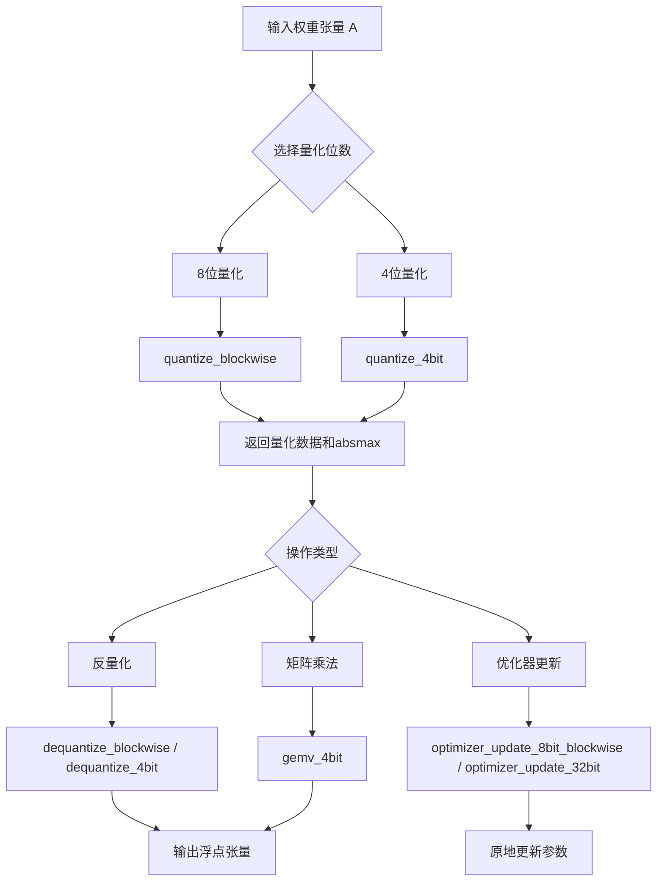
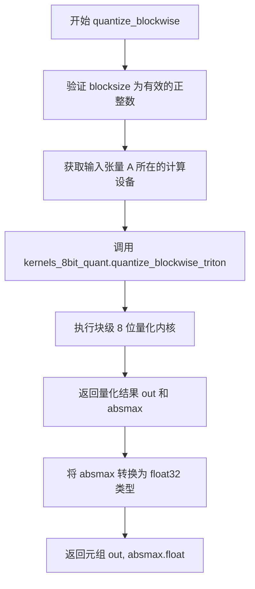
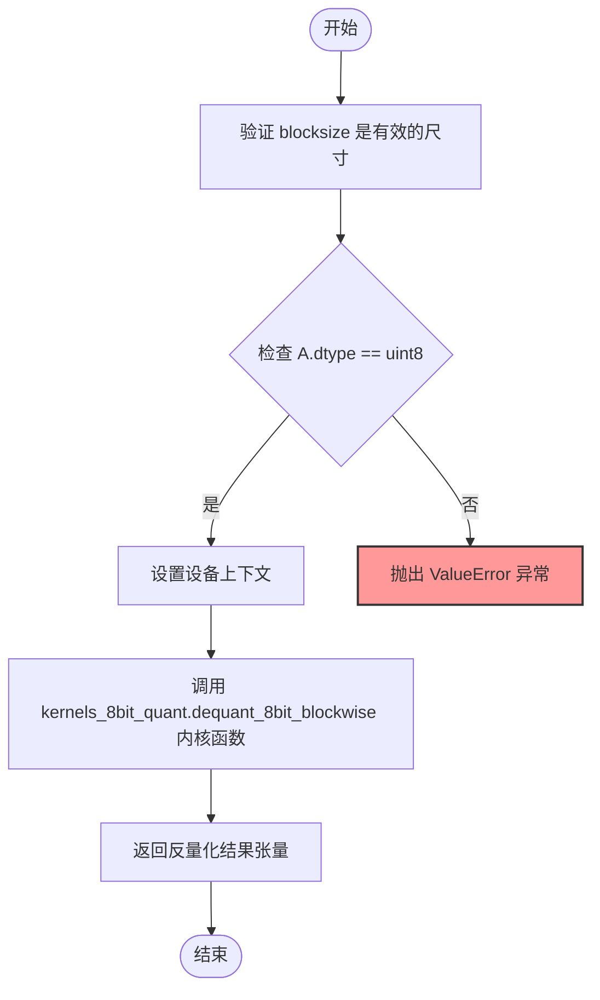
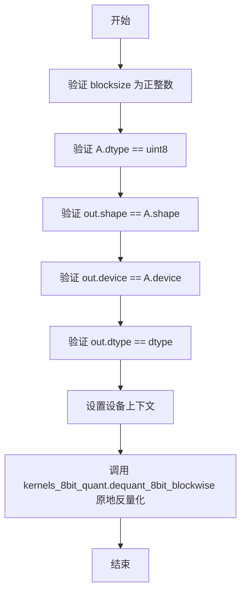
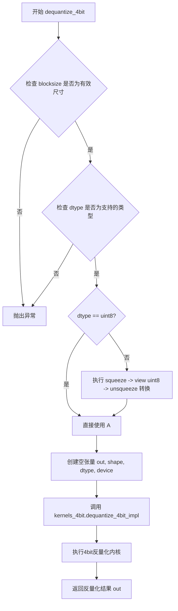
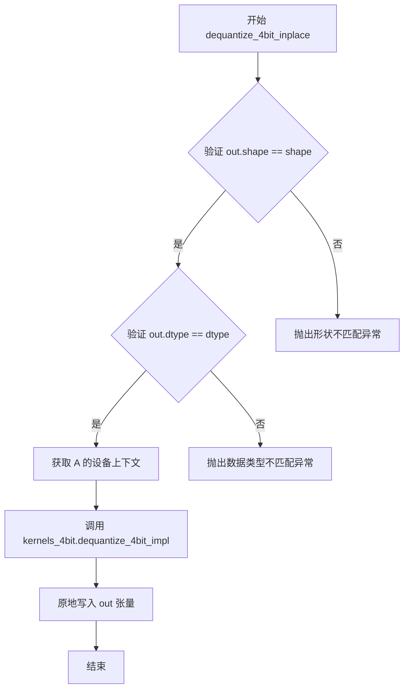
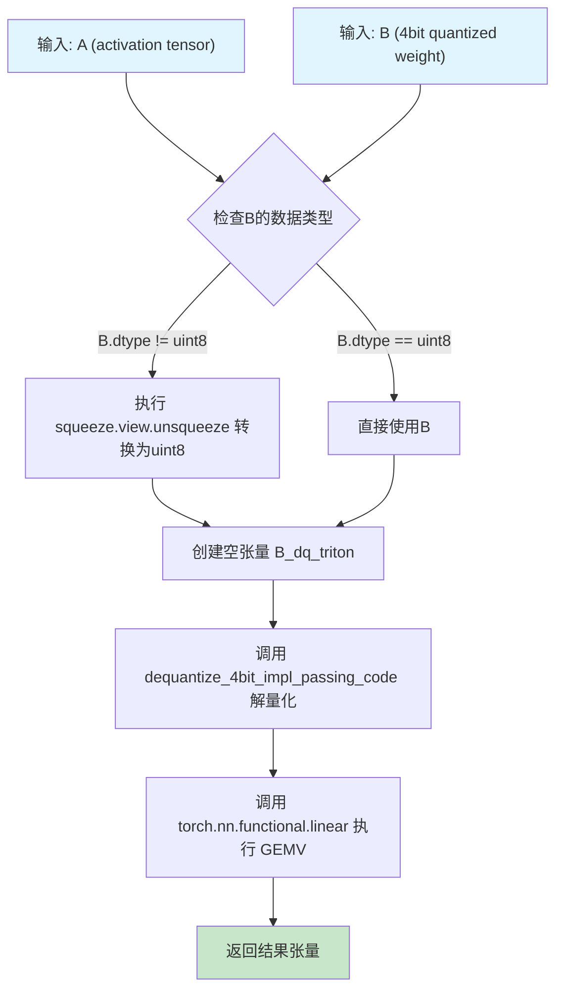
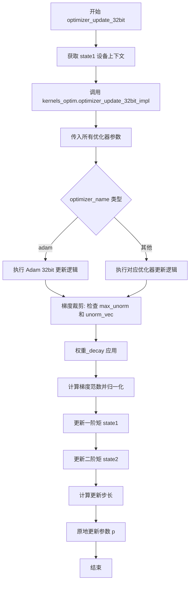

# `bitsandbytes\bitsandbytes\backends\triton\ops.py` 详细设计文档

这是一个神经网络权重量化库，提供8位和4位块级量化/反量化功能，支持量化后的矩阵向量乘法操作，以及相应的优化器参数更新实现，旨在减少模型存储和加速推理。

## 整体流程



## 类结构

```
模块级函数 (无类结构)
├── 量化函数
│   ├── quantize_blockwise (8位)
│   └── quantize_4bit (4位)
├── 反量化函数
│   ├── dequantize_blockwise
│   ├── dequantize_blockwise_inplace
│   ├── dequantize_4bit
│   └── dequantize_4bit_inplace
├── 矩阵运算
│   └── gemv_4bit
└── 优化器更新
    ├── optimizer_update_8bit_blockwise
    └── optimizer_update_32bit
```

## 全局变量及字段


### `device_type`
    
当前使用的加速器设备类型字符串，如 'cuda'、'xpu' 等

类型：`str`
    


### `torch_accelerator_module`
    
对应当前设备类型的 torch 模块对象，用于执行设备相关的张量操作

类型：`torch.Module`
    


### `optimizer_update_8bit_blockwise_impl`
    
8位块状优化器更新的实现函数引用，用于执行量化优化器的参数更新逻辑

类型：`Callable`
    


    

## 全局函数及方法


### `quantize_blockwise`

该函数执行块级 8 位量化，将输入的浮点张量按指定块大小转换为量化数据及对应的缩放因子。

参数：

- `A`：`torch.Tensor`，待量化的输入张量，通常为浮点类型
- `code`：`torch.Tensor`，量化编码表，用于定义量化映射规则
- `blocksize`：`int`，块大小，指定每个量化块包含的元素数量

返回值：`tuple[torch.Tensor, torch.Tensor]`，包含量化后的 uint8 张量及其对应的绝对最大值（float32）组成的元组

#### 流程图



#### 带注释源码

```python
def quantize_blockwise(A: torch.Tensor, code: torch.Tensor, blocksize: int) -> tuple[torch.Tensor, torch.Tensor]:
    """
    对输入张量执行块级 8 位量化
    
    参数:
        A: 待量化的浮点张量
        code: 量化编码表
        blocksize: 量化块大小
    
    返回:
        量化后的 uint8 张量及其绝对最大值
    """
    # 验证 blocksize 是有效的正整数（非零非负）
    torch._check_is_size(blocksize)
    # 注意: 原代码中保留了 A.dtype 的检查但被注释掉
    # torch._check(A.dtype == torch.float32, lambda: f"A must be float32 on xpu, got {A.dtype}")
    
    # 确保后续操作在输入张量所在的设备上执行
    with torch_accelerator_module.device(A.device):
        # 调用 Triton 内核执行实际的块级量化
        out, absmax = kernels_8bit_quant.quantize_blockwise_triton(A, code, blocksize)
        # 返回量化数据并将绝对最大值转换为 float32 以保持一致性
        return out, absmax.float()
```


### `dequantize_blockwise`

该函数执行块-wise 8位量化张量的反量化操作，将uint8量化数据还原为指定的浮点数据类型。

参数：

- `A`：`torch.Tensor`，量化后的uint8张量，包含要反量化的数据
- `absmax`：`torch.Tensor`，每个块的绝对最大值，用于反量化时的缩放
- `code`：`torch.Tensor`，量化码本，包含量化查找表
- `blocksize`：`int`，块大小，指定每多少个元素为一个量化块
- `dtype`：`torch.dtype`，目标数据类型，指定反量化后的浮点类型

返回值：`torch.Tensor`，反量化后的浮点张量

#### 流程图



#### 带注释源码

```python
def dequantize_blockwise(
    A: torch.Tensor,        # 输入：量化后的uint8张量
    absmax: torch.Tensor,   # 输入：每个块的绝对最大值（用于缩放）
    code: torch.Tensor,     # 输入：量化码本（查找表）
    blocksize: int,        # 输入：块大小（每块元素数）
    dtype: torch.dtype      # 输入：目标数据类型（float16/bfloat16/float32）
) -> torch.Tensor:          # 输出：反量化后的浮点张量
    """执行块-wise 8位量化张量的反量化"""
    
    # 验证 blocksize 是有效的非负整数尺寸
    torch._check_is_size(blocksize)
    
    # 验证输入张量 A 是 uint8 类型
    torch._check(A.dtype == torch.uint8, lambda: f"A must be uint8, got {A.dtype}")
    
    # 使用设备上下文管理器确保在正确的设备上执行
    with torch_accelerator_module.device(A.device):
        # 调用底层 Triton 内核执行实际的 8 位块-wise 反量化
        out = kernels_8bit_quant.dequant_8bit_blockwise(
            A,          # 量化数据
            absmax,     # 块最大值
            code,       # 量化码本
            blocksize,  # 块大小
            dtype=dtype,# 目标数据类型
        )
    
    # 返回反量化后的浮点张量
    return out
```


### `dequantize_blockwise_inplace`

原地将块级8位量化数据反量化为指定数据类型，并写入预分配的张量中。该函数执行原地操作，避免额外的内存分配，适用于对内存敏感的场景。

参数：

- `A`：`torch.Tensor`，量化后的 uint8 张量，包含待反量化的数据
- `absmax`：`torch.Tensor`，每个量化块的最大绝对值，用于缩放还原
- `code`：`torch.Tensor`，量化编码本，定义量化值到浮点数的映射关系
- `blocksize`：`int`，量化块大小，必须为正整数
- `dtype`：`torch.dtype`，目标输出数据类型（如 float32、float16、bfloat16）
- `out`：`torch.Tensor`，预分配的输出张量，形状、设备和类型必须匹配

返回值：`None`，该函数执行原地写入，不返回任何值

#### 流程图



#### 带注释源码

```python
def dequantize_blockwise_inplace(
    A: torch.Tensor,          # 输入：uint8 量化张量
    absmax: torch.Tensor,     # 输入：块级最大绝对值
    code: torch.Tensor,       # 输入：量化编码本
    blocksize: int,           # 输入：量化块大小
    dtype: torch.dtype,       # 输入：目标数据类型
    out: torch.Tensor,        # 输出：原地写入的目标张量
) -> None:
    """
    原地反量化 8 位块级量化张量到指定数据类型
    
    参数:
        A: 量化后的 uint8 张量
        absmax: 每个块的绝对最大值，用于反量化缩放
        code: 量化编码本
        blocksize: 块大小
        dtype: 目标数据类型
        out: 预分配的反量化输出张量
    """
    # 验证 blocksize 是有效的正整数
    torch._check_is_size(blocksize)
    
    # 验证输入张量 A 是 uint8 类型
    torch._check(A.dtype == torch.uint8, lambda: f"A must be uint8, got {A.dtype}")
    
    # 验证输出张量形状与输入一致
    torch._check(out.shape == A.shape, lambda: f"Expected out.shape == {A.shape}, got {out.shape}")
    
    # 验证输出设备与输入一致
    torch._check(out.device == A.device, lambda: f"Expected out.device == {A.device}, got {out.device}")
    
    # 验证输出数据类型与目标类型一致
    torch._check(out.dtype == dtype, lambda: f"Expected out.dtype == {dtype}, got {out.dtype}")

    # 使用适当的设备上下文管理器
    with torch_accelerator_module.device(A.device):
        # 调用底层 Triton 内核执行原地反量化
        kernels_8bit_quant.dequant_8bit_blockwise(
            A,
            absmax,
            code,
            blocksize,
            dtype=dtype,
            out=out,  # 原地写入，不创建新张量
        )
```


### `quantize_4bit`

该函数执行块级别的4位量化，将输入的浮点张量（A）转换为紧凑的4位表示，同时计算每个块的绝对最大值（absmax）用于后续解量化。它支持bfloat16、float16和float32三种输入数据类型，并允许指定不同的量化类型（如nf4）和存储格式。

参数：

- `A`：`torch.Tensor`，输入的浮点张量，支持 bfloat16、float16 或 float32 类型
- `blocksize`：`int`，量化块的大小，必须为正整数
- `quant_type`：`str`，量化类型（如 "nf4"、"fp4" 等）
- `quant_storage`：`torch.dtype`，量化后数据的存储数据类型（如 torch.uint8）

返回值：`tuple[torch.Tensor, torch.Tensor]`，返回两个张量——第一个是量化后的数据（packed），第二个是各块的绝对最大值（absmax）的float32副本

#### 流程图

```mermaid
flowchart TD
    A[输入: A, blocksize, quant_type, quant_storage] --> B[校验 blocksize 为合法大小]
    B --> C{检查 A.dtype 是否为 bfloat16/float16/float32}
    C -->|否| D[抛出 ValueError 异常]
    C -->|是| E[计算元素总数 n = A.numel]
    E --> F[计算块数: blocks = -(n // -(blocksize * 2))]
    F --> G[创建 absmax 张量: shape=(blocks*2,), dtype=A.dtype]
    G --> H[创建输出张量 out: shape=(n - n//2, 1), dtype=uint8]
    H --> I[调用 kernels_4bit.quantize_4bit_blockwise_triton]
    I --> J{检查 quant_storage 是否为 uint8}
    J -->|是| K[packed = out]
    J -->|否| L[packed = out.squeeze().view(quant_storage).unsqueeze(1)]
    K --> M[返回 packed, absmax.float]
    L --> M
```

#### 带注释源码

```python
def quantize_4bit(
    A: torch.Tensor, blocksize: int, quant_type: str, quant_storage: torch.dtype
) -> tuple[torch.Tensor, torch.Tensor]:
    """
    对输入张量进行4位块级量化
    
    参数:
        A: 输入的浮点张量，支持 bfloat16/float16/float32
        blocksize: 量化块的大小
        quant_type: 量化类型（如 nf4, fp4）
        quant_storage: 量化后数据的存储类型
    
    返回:
        (packed, absmax): 量化后的数据和各块的绝对最大值
    """
    # 校验 blocksize 为合法的正整数
    torch._check_is_size(blocksize)
    
    # 校验输入数据类型必须为支持的浮点类型
    torch._check(
        A.dtype in [torch.bfloat16, torch.float16, torch.float32],
        lambda: f"Blockwise 4bit quantization only supports 16/32-bit floats, but got {A.dtype}",
    )

    # 获取输入张量的元素总数
    n = A.numel()

    # TODO: Support when weight matrix is not divisible by blocksize
    # 预留的检查，当前已注释，支持不规则块大小的输入
    # torch._check(n % blocksize == 0, lambda: f"n must be divisible by blocksize, got {n} and {blocksize}")

    # 计算所需的块数量，每个块存储2个absmax值（用于nf4/fp4的量化表查找）
    # 使用负数除法技巧避免大整数溢出: blocks = ceil(n / blocksize)
    blocks = -(n // -(blocksize * 2))

    # 创建absmax张量，存储每个块的绝对最大值
    # 形状为 (blocks * 2,) 是因为nf4/fp4需要2倍的缩放因子
    absmax = torch.empty((blocks * 2,), device=A.device, dtype=A.dtype)
    
    # 创建输出张量存储量化后的4位数据
    # 每个uint8存储2个4位值（ nibble），因此长度为 n - n//2
    # 使用 n - n//2 而不是 (n+1)//2 避免大整数溢出
    out = torch.empty((n - n // 2, 1), device=A.device, dtype=torch.uint8)

    # 在输入张量所在的设备上执行量化操作
    with torch_accelerator_module.device(A.device):
        # 调用Triton内核执行实际的4位量化计算
        kernels_4bit.quantize_4bit_blockwise_triton(
            A, blocksize, quant_type, blocks, absmax, num_elements=n, quantized_out=out
        )
    packed = out

    # 如果量化存储类型不是 uint8，进行类型转换
    # 例如转换为 int2, int4 等更紧凑的类型
    if quant_storage != torch.uint8:
        packed = out.squeeze().view(quant_storage).unsqueeze(1)

    # 返回量化后的数据和各块的绝对最大值（转换为float32）
    return packed, absmax.float()
```


### `dequantize_4bit`

该函数执行4bit量化张量的反量化操作，将存储为uint8格式的量化数据（包含绝对最大值absmax和量化类型信息）转换回指定的浮点精度（bfloat16/float16/float32），支持NF4和FP4等量化类型。

参数：

- `A`：`torch.Tensor`，4bit量化数据，存储为uint8格式的压缩张量
- `absmax`：`torch.Tensor`，每个量化块的绝对最大值，用于反量化时的缩放
- `blocksize`：`int`，量化块大小，必须为有效的整数尺寸
- `quant_type`：`str`，量化类型字符串（如"nf4"、"fp4"），指定量化所使用的编码方案
- `shape`：`Sequence[int]`，输出张量的目标形状，用于创建输出缓冲区
- `dtype`：`torch.dtype`，输出数据类型，必须是torch.bfloat16、torch.float16或torch.float32之一

返回值：`torch.Tensor`，反量化后的浮点张量，形状为shape，dtype为指定的dtype

#### 流程图



#### 带注释源码

```python
def dequantize_4bit(
    A: torch.Tensor,          # 输入：4bit量化数据（uint8格式）
    absmax: torch.Tensor,    # 输入：每个block的绝对最大值（用于反量化缩放）
    blocksize: int,          # 输入：量化块大小
    quant_type: str,         # 输入：量化类型（nf4/fp4等）
    shape: Sequence[int],    # 输入：输出张量目标形状
    dtype: torch.dtype,      # 输入：输出数据类型（bfloat16/float16/float32）
) -> torch.Tensor:           # 输出：反量化后的浮点张量
    # 验证blocksize是有效的整数尺寸
    torch._check_is_size(blocksize)
    # 检查dtype是否支持（仅支持16/32位浮点数）
    # 注意：代码中注释掉了quant_type的检查（原本限制为nf4）
    torch._check(
        dtype in [torch.bfloat16, torch.float16, torch.float32],
        lambda: f"Blockwise 4bit dequantization only supports 16/32-bit floats, but got {dtype}",
    )
    
    # 如果输入A不是uint8格式，则进行格式转换
    # 将压缩的量化数据转换为uint8以便内核处理
    if A.dtype != torch.uint8:
        A = A.squeeze().view(torch.uint8).unsqueeze(1)

    # 创建输出张量，分配指定形状和数据类型的内存
    out = torch.empty(shape, dtype=dtype, device=A.device)
    
    # 使用设备上下文管理器确保在正确的设备上执行
    with torch_accelerator_module.device(A.device):
        # 调用底层Triton/CUDA内核执行4bit反量化
        # 内核参数：量化数据、absmax、块大小、量化类型、输出张量
        kernels_4bit.dequantize_4bit_impl(A, absmax, blocksize, quant_type, dtype, out=out)

    # 返回反量化后的浮点张量
    return out
```


### `dequantize_4bit_inplace`

原地反量化4位量化张量的函数，将已量化数据直接写入预分配输出张量，避免额外内存分配。

参数：

- `A`：`torch.Tensor`，量化后的4位权重数据（uint8格式）
- `absmax`：`torch.Tensor`，每个量化块的绝对最大值，用于反量化缩放
- `blocksize`：`int`，量化块大小，必须为正整数
- `quant_type`：`str`，量化类型（如"nf4"、"fp4"等）
- `shape`：`Sequence[int]`，输出张量的目标形状
- `dtype`：`torch.dtype`，输出数据类型（bfloat16/float16/float32）
- `out`：`torch.Tensor`，预分配的反量化输出张量

返回值：`None`，该函数为原地操作，结果直接写入 `out` 参数

#### 流程图



#### 带注释源码

```python
def dequantize_4bit_inplace(
    A: torch.Tensor,
    absmax: torch.Tensor,
    blocksize: int,
    quant_type: str,
    shape: Sequence[int],
    dtype: torch.dtype,
    out: torch.Tensor,
) -> None:
    """原地反量化4位量化张量到指定输出张量
    
    参数:
        A: 量化后的4位权重数据，存储为uint8格式
        absmax: 每个量化块的绝对最大值，用于反量化时的缩放计算
        blocksize: 量化块大小，必须为正整数
        quant_type: 量化类型，支持nf4、fp4等
        shape: 输出张量的目标形状
        dtype: 输出数据类型，支持bfloat16/float16/float32
        out: 预分配的反量化输出张量，函数将原地写入此张量
    
    返回:
        None，结果直接写入out参数指定的张量中
    """
    # 验证输出张量形状是否与目标形状匹配
    torch._check(out.shape == shape, lambda: f"Expected out.shape == {shape}, got {out.shape}")
    # 验证输出张量数据类型是否与目标数据类型匹配
    torch._check(out.dtype == dtype, lambda: f"Expected out.dtype == {dtype}, got {out.dtype}")
    
    # 确保在输入张量所在的设备上执行操作
    with torch_accelerator_module.device(A.device):
        # 调用底层4位反量化内核函数，原地将反量化结果写入out张量
        kernels_4bit.dequantize_4bit_impl(A, absmax, blocksize, quant_type, dtype, out=out)
```


### `gemv_4bit`

该函数执行4位量化矩阵向量乘法（GEMV），先将4位量化权重矩阵B解量化为全精度权重，然后使用PyTorch的`linear`函数执行矩阵向量乘法运算。

参数：

- `A`：`torch.Tensor`，输入激活张量（full precision）
- `B`：`torch.Tensor`，4位量化权重矩阵（存储为uint8格式）
- `shapeB`：`Sequence[int]`，解量化的权重矩阵的形状
- `absmax`：`torch.Tensor`，用于解量化的绝对最大值张量
- `code`：`torch.Tensor`，量化编码表/码本（NF4/FP4编码表）
- `blocksize`：`int`，量化块大小

返回值：`torch.Tensor`，矩阵向量乘法的结果（A × B_dq）

#### 流程图



#### 带注释源码

```python
def gemv_4bit(
    A: torch.Tensor,          # 输入激活矩阵 (例如: [batch_size, hidden_dim])
    B: torch.Tensor,          # 4bit量化权重矩阵 (uint8格式存储)
    shapeB: Sequence[int],   # 解量化后权重矩阵的形状 (例如: [hidden_dim, out_dim])
    absmax: torch.Tensor,     # 量化块的最大绝对值，用于解量化计算
    code: torch.Tensor,       # 量化编码表 (NF4/FP4的码本)
    blocksize: int,          # 量化块大小
) -> torch.Tensor:
    # 步骤1: 确保权重矩阵B是uint8格式
    # 如果不是，则将其从压缩格式转换为uint8
    if B.dtype != torch.uint8:
        B = B.squeeze().view(torch.uint8).unsqueeze(1)

    # 步骤2: 创建与输出形状相同的空张量用于存储解量化后的权重
    B_dq_triton = torch.empty(shapeB, dtype=A.dtype, device=A.device)

    # 步骤3: 在指定的设备上执行解量化操作
    with torch_accelerator_module.device(A.device):
        # 调用Triton内核将4bit权重解量化为全精度权重
        kernels_4bit.dequantize_4bit_impl_passing_code(
            B,                  # 量化权重
            absmax,             # 最大绝对值
            blocksize,          # 块大小
            code,               # 量化编码表
            dtype=A.dtype,      # 输出数据类型（与输入A一致）
            out=B_dq_triton,    # 输出张量
        )

        # 步骤4: 执行矩阵向量乘法 (GEMV)
        # 等价于: result = A @ B_dq_triton + bias (这里bias=None)
        return torch.nn.functional.linear(
            A,                  # 输入 [*, in_features]
            B_dq_triton,        # 权重 [out_features, in_features]
            bias=None,          # 无偏置
        )
```


### `optimizer_update_8bit_blockwise`

该函数是8位分块量化优化器的核心更新实现，通过量化状态张量（state1/state2）和对应的缩放因子（absmax1/absmax2）在指定设备上执行优化器步骤（如Adam），实现参数的高效更新，支持可选的权重衰减和梯度归一化缩放。

参数：

- `optimizer_name`：`str`，优化器名称（如"adam"、"adamw"等），用于指定具体的优化算法实现
- `g`：`torch.Tensor`，梯度张量，形状与参数相同， dtype 支持 float16/bfloat16/float32
- `p`：`torch.Tensor`，模型参数张量，需要更新的原始参数
- `state1`：`torch.Tensor`，一阶动量状态的量化表示（uint8），存储 AdaGrad/Adam 的一阶动量
- `state2`：`Optional[torch.Tensor]`，二阶动量状态的量化表示（uint8），仅 Adam 类优化器需要，存储二阶动量
- `beta1`：`float`，一阶动量衰减系数（beta1），控制历史梯度的指数加权平均
- `beta2`：`float`，二阶动量衰减系数（beta2），控制历史梯度平方的指数加权平均
- `beta3`：`float`，额外衰减系数，用于特定的优化器变体或偏差校正
- `alpha`：`float`，学习率缩放因子，用于动态调整有效学习率
- `eps`：`float`，防止除零的 epsilon 值，通常设为 1e-8
- `step`：`int`，当前训练步数，用于偏差校正和动量调整
- `lr`：`float`，基础学习率
- `qmap1`：`torch.Tensor`，state1 的量化映射表（float32），定义 uint8 到浮点值的映射关系
- `qmap2`：`Optional[torch.Tensor]`，state2 的量化映射表（float32），定义 uint8 到浮点值的映射关系
- `absmax1`：`torch.Tensor`，state1 的绝对最大值缩放因子（float32），用于反量化
- `absmax2`：`Optional[torch.Tensor]`，state2 的绝对最大值缩放因子（float32），用于反量化
- `weight_decay`：`float`，权重衰减系数（L2 正则化），默认 0.0
- `gnorm_scale`：`float`，梯度范数缩放因子，用于梯度裁剪后的恢复，默认 1.0
- `skip_zeros`：`bool`，是否跳过零值梯度更新，默认 False

返回值：`None`，函数直接修改 `p`（参数张量）和 `state1`/`state2`（状态张量），无返回值

#### 流程图

```mermaid
flowchart TD
    A[开始 optimizer_update_8bit_blockwise] --> B[检查并设置设备上下文]
    B --> C[调用 optimizer_update_8bit_blockwise_impl]
    
    C --> D1[传入 optimizer_name]
    C --> D2[传入梯度 g]
    C --> D3[传入参数 p]
    C --> D4[传入 state1 / state2]
    C --> D5[传入优化器超参数<br/>beta1, beta2, beta3, alpha, eps, step, lr]
    C --> D6[传入量化元数据<br/>qmap1, qmap2, absmax1, absmax2]
    C --> D7[传入可选参数<br/>weight_decay, gnorm_scale, skip_zeros]
    
    D1 --> E[内核执行优化器更新]
    D2 --> E
    D3 --> E
    D4 --> E
    D5 --> E
    D6 --> E
    D7 --> E
    
    E --> F[反量化状态张量 state1/state2]
    E --> G[计算梯度更新: m = beta1*m + (1-beta1)*g]
    E --> H[计算梯度平方更新: v = beta2*v + (1-beta2)*g^2]
    E --> I[偏差校正: m_hat = m / (1-beta1^step)]
    E --> J[应用权重_decay]
    E --> K[更新参数: p = p - lr * m_hat / (sqrt(v_hat) + eps)]
    E --> L[量化并存储新状态到 state1/state2]
    
    F --> L
    G --> L
    H --> L
    I --> L
    J --> L
    K --> L
    
    L --> M[结束]
```

#### 带注释源码

```python
def optimizer_update_8bit_blockwise(
    optimizer_name: str,
    g: torch.Tensor,
    p: torch.Tensor,
    state1: torch.Tensor,
    state2: Optional[torch.Tensor],
    beta1: float,
    beta2: float,
    beta3: float,
    alpha: float,
    eps: float,
    step: int,
    lr: float,
    qmap1: torch.Tensor,
    qmap2: Optional[torch.Tensor],
    absmax1: torch.Tensor,
    absmax2: Optional[torch.Tensor],
    weight_decay: float = 0.0,
    gnorm_scale: float = 1.0,
    skip_zeros=False,
) -> None:
    # 注意：以下验证代码已被注释，以提高性能
    # 在生产环境中建议添加这些检查以确保数据一致性
    
    # 验证梯度与参数形状一致
    # torch._check(
    #     g.numel() == p.numel(),
    #     lambda: f"g and p must have the same number of elements, got {g.numel()} and {p.numel()}",
    # )
    
    # 支持的计算 dtype
    # compute_dtypes = [torch.float16, torch.bfloat16, torch.float32]
    
    # 验证梯度 dtype 合法
    # torch._check(
    #     g.dtype in compute_dtypes,
    #     lambda: f"g must be bfloat16, float16, or float32, got {g.dtype}",
    # )
    
    # 验证参数与梯度 dtype 匹配
    # torch._check(
    #     g.dtype == p.dtype,
    #     lambda: f"Expected all tensors to have the same dtype, got g.dtype={g.dtype}, p.dtype={p.dtype}",
    # )
    
    # 验证 state1 量化格式
    # torch._check(
    #     state1.dtype == torch.uint8,
    #     lambda: f"state1 must be uint8, got {state1.dtype}",
    # )
    
    # 验证 state1 量化元数据 dtype
    # torch._check(
    #     qmap1.dtype == absmax1.dtype == torch.float32,
    #     lambda: f"Expected qmap1 and absmax1 to be float32, got qmap1.dtype={qmap1.dtype}, absmax1.dtype={absmax1.dtype}",
    # )
    
    # 如果存在 state2，验证其格式和量化元数据
    # if state2 is not None:
    #     torch._check(
    #         state2.dtype == torch.uint8,
    #         lambda: f"state2 must be uint8, got {state2.dtype}",
    #     )
    #     torch._check(
    #         qmap2.dtype == absmax2.dtype == torch.float32,
    #         lambda: f"Expected qmap2 and absmax2 to be float32, got qmap2.dtype={qmap2.dtype}, absmax2.dtype={absmax2.dtype}",
    #     )

    # 使用状态张量的设备创建计算上下文，确保内核在正确设备上执行
    with torch_accelerator_module.device(state1.device):
        # 调用底层的优化器更新实现
        # 实现细节由 kernels_optim 模块提供
        # 支持多种后端：PyTorch 原生、Triton 优化版本、torch.compile 加速版本
        optimizer_update_8bit_blockwise_impl(
            optimizer_name=optimizer_name,
            g=g,
            p=p,
            state1=state1,
            state2=state2,
            beta1=beta1,
            beta2=beta2,
            beta3=beta3,
            alpha=alpha,
            eps=eps,
            step=step,
            lr=lr,
            qmap1=qmap1,
            qmap2=qmap2,
            absmax1=absmax1,
            absmax2=absmax2,
            weight_decay=weight_decay,
            gnorm_scale=gnorm_scale,
            skip_zeros=skip_zeros,
        )
```


### `optimizer_update_32bit`

该函数执行32位优化器参数更新操作，通过调用底层的 `kernels_optim.optimizer_update_32bit_impl` 内核实现，支持 Adam 系列优化器的核心计算逻辑，包括梯度归一化、权重衰减、参数更新等关键步骤。

参数：

- `optimizer_name`：`str`，优化器名称（如 "adam"）
- `g`：`torch.Tensor`，梯度张量
- `p`：`torch.Tensor`，模型参数张量
- `state1`：`torch.Tensor`，一阶矩估计（动量）状态张量
- `state2`：`Optional[torch.Tensor]`，二阶矩估计（方差）状态张量，可为 None
- `unorm_vec`：`Optional[torch.Tensor]`，（可选）梯度向量范数，用于梯度裁剪
- `max_unorm`：`float`，最大梯度范数阈值，用于梯度裁剪
- `param_norm`：`float`，参数范数，用于梯度归一化
- `beta1`：`float`，一阶矩衰减系数（动量）
- `beta2`：`float`，二阶矩衰减系数（方差）
- `beta3`：`float`，三阶矩衰减系数（用于某些优化器变体）
- `alpha`：`float`，学习率缩放因子
- `eps`：`float`，防止除零的 epsilon 值
- `weight_decay`：`float`，权重衰减系数（L2 正则化）
- `step`：`int`，当前训练步数
- `lr`：`float`，学习率
- `gnorm_scale`：`float`，梯度范数缩放因子
- `skip_zeros`：`bool`，是否跳过零梯度更新

返回值：`None`，该函数为原地（in-place）操作，直接修改 `p` 和状态张量

#### 流程图



#### 带注释源码

```python
def optimizer_update_32bit(
    optimizer_name: str,          # 优化器名称字符串标识
    g: torch.Tensor,              # 梯度张量 input gradient tensor
    p: torch.Tensor,              # 参数张量 parameter tensor (will be updated in-place)
    state1: torch.Tensor,         # 一阶矩状态 first moment estimate (momentum)
    state2: Optional[torch.Tensor], # 二阶矩状态 second moment estimate (variance), 可选
    unorm_vec: Optional[torch.Tensor], # 梯度向量范数，用于梯度裁剪
    max_unorm: float,             # 最大允许梯度范数
    param_norm: float,            # 参数范数值
    beta1: float,                 # 动量衰减系数 beta1 for momentum
    beta2: float,                 # 方差衰减系数 beta2 for variance
    beta3: float,                 # 三阶矩系数 beta3 (reserved for advanced optimizers)
    alpha: float,                # 学习率缩放因子 learning rate scaling factor
    eps: float,                  # 数值稳定性 epsilon
    weight_decay: float,         # L2 正则化权重衰减系数
    step: int,                   # 当前训练步数 training step counter
    lr: float,                   # 基础学习率 base learning rate
    gnorm_scale: float,          # 梯度范数缩放因子 gradient norm scaling
    skip_zeros: bool = False,    # 是否跳过零梯度是否跳过零梯度更新
) -> None:
    """执行32位精度优化器的参数更新操作
    
    该函数是一个包装器，将参数传递给底层的 Triton/CUDA 实现。
    支持 Adam、AdamW 等优化器的 32 位参数更新逻辑。
    """
    # 确保在 state1 所在的设备上执行内核调用
    with torch_accelerator_module.device(state1.device):
        # 调用底层优化器更新内核实现
        kernels_optim.optimizer_update_32bit_impl(
            optimizer_name=optimizer_name,  # 优化器标识
            g=g,                            # 梯度
            p=p,                            # 参数（原地更新）
            state1=state1,                  # 一阶矩状态
            state2=state2,                  # 二阶矩状态
            unorm_vec=unorm_vec,            # 梯度范数向量
            max_unorm=max_unorm,            # 最大梯度范数
            param_norm=param_norm,          # 参数范数
            beta1=beta1,                    # 动量系数
            beta2=beta2,                    # 方差系数
            beta3=beta3,                    # 三阶矩系数
            alpha=alpha,                    # 学习率缩放
            eps=eps,                        # 数值稳定项
            weight_decay=weight_decay,      # 权重衰减
            step=step,                      # 步数
            lr=lr,                          # 学习率
            gnorm_scale=gnorm_scale,        # 梯度范数缩放
            skip_zeros=skip_zeros,          # 跳过零梯度
        )
```

## 关键组件


### 张量块式量化 (Blockwise Quantization)

对输入张量进行分块量化处理，将浮点张量转换为低比特表示，是量化神经网络权重的核心技术。

### 8位量化 (8-bit Quantization)

将张量量化为8位无符号整数，包含量化表(code)和绝对最大值(absmax)用于后续反量化，支持动态量化范围。

### 4位量化 (4-bit Quantization)

将张量量化为4位表示，支持nf4等量化类型，通过压缩减少模型存储和内存占用，支持不同量化存储格式。

### 惰性加载与设备适配 (Lazy Loading & Device Abstraction)

通过`torch_accelerator_module`动态适配当前硬件设备(CUDA/XPU)，实现设备无关的量化内核调用，支持运行时设备检测。

### 反量化支持 (Dequantization Support)

提供原地(out-of-place)和非原地(in-place)两种反量化方式，支持不同精度(float16/bfloat16/float32)的恢复，保持量化元数据。

### 量化矩阵向量乘法 (Quantized GEMV)

`gemv_4bit`函数在矩阵乘法前动态反量化权重，实现4位量化权重的高效推理，减少内存带宽需求。

### 优化器更新 (Optimizer Update)

支持8位块式优化器状态更新和32位优化器更新，包含Adam等优化器的量化参数更新逻辑，处理梯度裁剪和权重衰减。

### 量化存储格式转换

`quantize_4bit`中处理量化存储格式转换，根据`quant_storage`参数将量化结果转换为不同的存储类型(uint8或其他)。


## 问题及建议


### 已知问题

- **过多被注释掉的安全检查**：代码中大量`torch._check`调用被注释掉，如`quantize_4bit`中检查`n % blocksize == 0`的逻辑，这可能导致在边界情况下（如权重矩阵不可被blocksize整除）出现难以调试的错误。

- **未完成的TODO**：`quantize_4bit`函数中包含TODO注释表明不支持权重矩阵不可被blocksize整除的情况，但代码未实现相应处理逻辑。

- **硬编码设备检测逻辑**：`device_type = torch.accelerator.current_accelerator().type if hasattr(torch, "accelerator") else "cuda"`的fallback逻辑可能导致在非标准环境（如某些自定义PyTorch构建）中行为不一致。

- **全局可变配置**：`optimizer_update_8bit_blockwise_impl`作为全局变量直接赋值，这种方式不利于单元测试和动态配置，且注释掉的其他实现方案切换不灵活。

- **类型转换隐式行为**：在`quantize_4bit`中`quant_storage != torch.uint8`时的转换逻辑复杂且隐式，容易产生意外的形状和类型问题。

- **代码重复**：`dequantize_4bit`和`dequantize_4bit_inplace`以及`dequantize_blockwise`和`dequantize_blockwise_inplace`之间存在明显重复，可提取公共逻辑。

- **魔数缺乏解释**：如`blocks = -(n // -(blocksize * 2))`的计算和`n - n // 2`的逻辑缺少注释说明其数学原理。

- **缺失的文档字符串**：所有函数均无docstring，无法直接了解函数意图、参数约束和使用场景。

- **未使用的导入保留**：注释掉的`from bitsandbytes.functional import get_4bit_type`等代码保留但未使用，增加理解成本。

- **函数参数过多**：`optimizer_update_8bit_blockwise`和`optimizer_update_32bit`参数数量过多（超过15个参数），影响可读性和调用便利性。

### 优化建议

- **恢复或条件化安全检查**：将关键的安全检查（如blocksize整除性、dtype匹配、形状兼容性）改为可选的调试模式，或使用环境变量控制。

- **实现blocksize整除支持**：完成TODO中的功能，使函数能正确处理不可整除的权重矩阵。

- **抽象设备检测逻辑**：将设备检测封装为独立函数或使用配置类，提高可测试性和灵活性。

- **配置管理模式**：使用配置类或工厂模式管理`optimizer_update_8bit_blockwise_impl`的实现选择，便于切换和测试。

- **重构公共逻辑**：提取dequantize相关函数的公共逻辑到私有辅助函数，减少重复。

- **添加文档字符串**：为所有公开函数添加完整的docstring，说明参数、返回值、异常和示例。

- **参数对象封装**：将优化器更新函数的大量参数封装为命名元组或dataclass，提高可读性。

- **关键计算添加注释**：为魔数和相关计算添加详细注释，解释其数学原理和设计考量。

## 其它


### 设计目标与约束

本模块的核心设计目标是提供高效的神经网络权重量化与反量化功能，支持4bit和8bit两种量化精度，用于减少模型存储和加速推理。设计约束包括：仅支持float32/bfloat16/float16输入数据类型；blocksize必须是正整数；量化/反量化操作必须在支持的加速器设备（CUDA/XPU）上执行；4bit量化要求权重矩阵能被2个blocksize整除；优化器更新函数目前主要针对Adam优化器设计。

### 错误处理与异常设计

代码采用torch._check系列函数进行运行时参数校验，主要包括：blocksize必须为正整数（torch._check_is_size）；8bit反量化输入必须是uint8类型；输出tensor的shape、dtype、device必须与输入匹配；4bit量化/反量化仅支持16/32位浮点类型。对于不满足条件的操作，抛出清晰的错误信息说明期望值与实际值。设备相关错误通过torch._check配合lambda延迟求值实现。

### 数据流与状态机

模块的数据流主要包括两条路径：量化路径（quantize_blockwise、quantize_4bit）接收float32/bfloat16/float16张量，输出量化后的uint8张量和absmax（每个块的绝对最大值）；反量化路径（dequantize_blockwise、dequantize_4bit）接收量化张量和absmax，重建原始精度张量；gemv_4bit融合了反量化与矩阵乘法操作，直接输出矩阵乘结果；优化器更新路径（optimizer_update_8bit_blockwise、optimizer_update_32bit）接收梯度、参数、状态张量，就地更新参数和状态。

### 外部依赖与接口契约

模块依赖三个内部kernel模块：kernels_4bit（4bit量化内核）、kernels_8bit_quant（8bit量化内核）、kernels_optim（优化器内核）。设备依赖通过torch.accelerator模块动态检测当前加速器类型（cuda/xpu）。外部接口契约：所有量化函数返回(packed, absmax)元组；所有反量化函数返回重建的张量；所有optimizer_update函数为inplace操作，返回None；调用者需确保输入tensor已正确放置在目标设备上。

### 性能考虑与基准

代码中已包含多种实现对比注释：optimizer_update_8bit_blockwise_impl的pytorch实现约60ms，Triton实现约2.8ms，compile后约2.3ms，最终选用实现约0.95ms。4bit量化使用Triton kernel实现。gemv_4bit融合了反量化和矩阵乘法以减少中间张量开销。建议在生产环境中使用torch.compile加速。

### 安全性考虑

当前实现主要用于模型权重量化，安全性风险较低。主要安全考虑：输入tensor必须位于支持的设备上，否则会抛出设备错误；量化表（code）必须与量化时使用的表一致，否则解量化结果将不正确；优化器更新函数直接操作原位tensor，调用者需注意数据竞争问题。

### 测试策略

建议测试覆盖：量化/反量化往返精度测试，验证不同blocksize和数据类型；边界条件测试（blocksize=1、最大blocksize、不可整除矩阵）；设备兼容性测试（CUDA/XPU）；数值精度基准测试，与标准float32实现对比；性能基准测试，验证不同输入规模的执行时间；梯度更新正确性测试，验证优化器更新后的参数和状态符合预期。

### 版本兼容性

代码需要Python 3.9+（使用tuple类型注解）；PyTorch 2.0+（使用torch.accelerator模块）；Triton（用于4bit量化kernel）。torch._check_is_size要求PyTorch 2.0+。设备检测使用hasattr兼容较旧版本PyTorch。量化storage类型转换（quant_storage）需要PyTorch 2.0+的view行为支持。

### 配置与参数说明

关键参数说明：blocksize（int）：量化块大小，必须正整数，推荐值为4096或8192；quant_type（str）：4bit量化类型，可选"nf4"或"fp4"；quant_storage（torch.dtype）：量化后存储类型，推荐torch.uint8；dtype（torch.dtype）：反量化目标精度；optimizer_name（str）：优化器名称，当前支持"adam"相关实现。

### 使用示例

```python
# 4bit量化示例
import torch
packed, absmax = quantize_4bit(
    weight, blocksize=4096, quant_type="nf4", quant_storage=torch.uint8
)

# 4bit反量化示例
weight_dq = dequantize_4bit(
    packed, absmax, blocksize=4096, quant_type="nf4",
    shape=weight.shape, dtype=torch.bfloat16
)

# 8bit量化示例
packed, absmax = quantize_blockwise(weight, code, blocksize=4096)

# 8bit反量化示例
weight_dq = dequantize_blockwise(packed, absmax, code, blocksize, dtype=torch.float32)

# 融合矩阵乘法示例
result = gemv_4bit(input, packed, shapeB, absmax, code, blocksize)
```


    