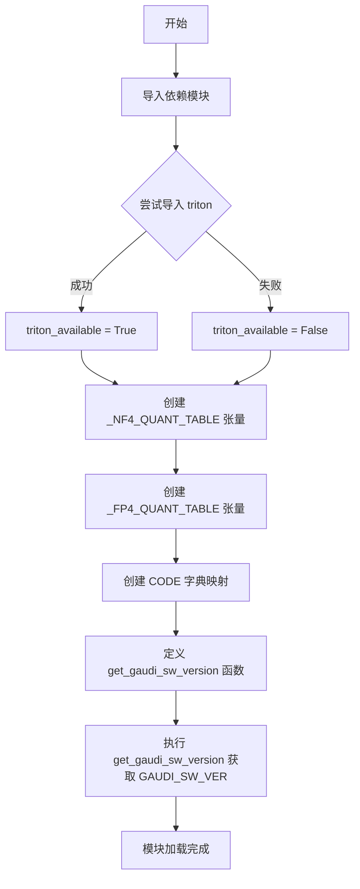

# `bitsandbytes\bitsandbytes\backends\utils.py` 详细设计文档

该模块提供NF4和FP4量化表用于模型量化，支持Triton库可用性检查，并检测Intel Gaudi加速器的软件版本，以支持硬件特定的优化和量化配置。

## 整体流程



## 类结构

```
quantization_tables.py (模块)
├── 全局变量
│   ├── triton_available (bool)
│   ├── _NF4_QUANT_TABLE (torch.Tensor)
│   ├── _FP4_QUANT_TABLE (torch.Tensor)
│   ├── CODE (dict)
│   └── GAUDI_SW_VER (version.Version | None)
└── 函数
    └── get_gaudi_sw_version()
```

## 全局变量及字段


### `triton_available`
    
布尔类型，表示Triton框架是否可用（用于加速量化操作）

类型：`bool`
    


### `_NF4_QUANT_TABLE`
    
存储NF4量化算法的16级量化查找表，用于NF4量化操作

类型：`torch.Tensor`
    


### `_FP4_QUANT_TABLE`
    
存储FP4量化算法的16级量化查找表，用于FP4量化操作

类型：`torch.Tensor`
    


### `CODE`
    
将量化类型（nf4/fp4）与对应的量化查找表进行映射的字典

类型：`Dict[str, torch.Tensor]`
    


### `GAUDI_SW_VER`
    
Gaudi软件的版本信息，如果未安装则返回None

类型：`Optional[version.Version]`
    


    

## 全局函数及方法


### `get_gaudi_sw_version`

该函数通过执行shell命令查询系统中已安装的Gaudi SW（Habana加速库的PyTorch插件）版本，使用`packaging.version.parse`解析版本号后返回。

参数：

- （无参数）

返回值：`version.Version` 或 `None`，返回解析后的Gaudi SW版本号，如果未安装则返回None

#### 流程图

```mermaid
flowchart TD
    A[开始] --> B[执行subprocess.run<br/>'pip list | grep habana-torch-plugin']
    B --> C{输出是否为空?}
    C -->|是| D[返回None]
    C -->|否| E[解析stdout<br/>提取版本号字符串]
    E --> F[version.parse<br/>解析版本号]
    F --> G[返回Version对象]
    D --> H[结束]
    G --> H
```

#### 带注释源码

```python
def get_gaudi_sw_version():
    """
    Returns the installed version of Gaudi SW.
    """
    # 使用subprocess执行shell命令，查询已安装的habana-torch-plugin包信息
    # pip list输出格式: habana-torch-plugin 1.16.0 ...
    output = subprocess.run(
        "pip list | grep habana-torch-plugin",  # shell命令：查找habana-torch-plugin包
        shell=True,                              # 使用shell解释器执行命令
        text=True,                               # 以文本模式返回输出
        capture_output=True,                     # 捕获stdout和stderr
    )
    
    # 如果grep未找到匹配项，stdout为空字符串
    # 检查输出是否为空或仅包含空白字符
    if not output.stdout.strip():
        return None  # 未安装Gaudi SW，返回None

    # 解析输出格式: "habana-torch-plugin 1.16.0"
    # 按行分割取第一行，再按空格分割取最后一个元素（版本号）
    # 例如: "habana-torch-plugin 1.16.0\n" -> "habana-torch-plugin 1.16.0" -> "1.16.0"
    return version.parse(output.stdout.split("\n")[0].split()[-1])
    # 使用packaging.version.parse将版本字符串解析为Version对象
    # 支持语义化版本比较操作
```

## 关键组件


### Triton框架检测与导入

负责检测并导入Triton框架（用于GPU内核编写），通过try-except处理ImportError，生成全局变量triton_available标识Triton是否可用。

### NF4量化表 (_NF4_QUANT_TABLE)

存储NF4（4位归一化浮点）量化查找表，包含16个预计算的量化值，用于将权重映射到NF4量化空间，支持CPU和XPU设备。

### FP4量化表 (_FP4_QUANT_TABLE)

存储FP4（4位浮点）量化查找表，包含16个预计算的量化值（包括正负值），用于FP4精度量化，支持CPU和XPU设备。

### 量化表统一入口 (CODE)

字典结构统一管理nf4和fp4量化表，提供按量化类型检索对应量化查找表的功能。

### Gaudi软件版本获取函数 (get_gaudi_sw_version)

通过subprocess执行pip命令查询habana-torch-plugin包版本，使用packaging.version解析版本号，返回Version对象或None（未安装时）。

### Gaudi软件版本全局变量 (GAUDI_SW_VER)

模块级全局变量，在导入时自动初始化，缓存Gaudi处理器的软件版本，供后续设备兼容性判断使用。


## 问题及建议


### 已知问题

-   **设备检测逻辑重复**：`_NF4_QUANT_TABLE` 和 `_FP4_QUANT_TABLE` 中重复书写了 `hasattr(torch, "xpu") and torch.xpu.is_available()` 的设备检测逻辑，导致代码冗余
-   **subprocess 安全性风险**：使用 `shell=True` 执行 `pip list | grep` 命令，存在命令注入风险
-   **模块导入时副作用**：`GAUDI_SW_VER` 在模块导入时立即执行 subprocess 调用，增加启动时间且可能在某些环境（如无 pip 权限）中失败
-   **版本解析逻辑脆弱**：`get_gaudi_sw_version()` 依赖特定的 pip 输出格式（"package-name version" 按空格分割），若输出格式变化会导致解析失败
-   **硬编码魔法字符串**："habana-torch-plugin" 字符串硬编码在函数内部，缺乏可配置性
-   **缺乏类型注解**：所有函数和变量均无类型注解，降低了代码可读性和 IDE 支持
-   **triton 导入未实际使用**：`triton.language` 和 `triton` 导入后仅用于检查可用性，但未在后续代码中使用，造成混淆
-   **异常处理不完整**：`get_gaudi_sw_version()` 中若 subprocess 执行失败（如 pip 命令不存在），程序可能抛出未捕获异常

### 优化建议

-   将设备检测逻辑提取为独立的函数或常量，避免重复代码
-   改用 `subprocess.run` 时移除 `shell=True`，直接调用 `pip` 命令或使用 Python 的 `importlib.metadata` 获取包版本
-   使用延迟初始化（lazy initialization）或提供显式初始化函数，延迟获取 GAUDI_SW_VER
-   使用 `importlib.metadata.version("habana-torch-plugin")` 替代 subprocess 调用，提高可靠性和可维护性
-   为所有函数添加类型注解，增强代码清晰度
-   若 triton 不可用时无需保留导入语句，或将检查逻辑封装为独立函数
-   增强错误处理，对 subprocess 失败和版本解析异常进行捕获并提供默认值

## 其它


### 设计目标与约束

本模块主要用于支持神经网络模型的量化操作，特别是NF4（4位正态浮点）和FP4（4位浮点）量化。设计目标包括：1）提供可移植的量化表，支持CPU和XPU设备；2）实现与Gaudi硬件的版本兼容性检查；3）为后续的模型量化推理提供必要的量化参数表。约束条件包括：仅支持PyTorch环境，且量化表目前仅针对CPU和XPU设备优化。

### 错误处理与异常设计

本模块主要涉及ImportError（triton不可用时的处理）、subprocess执行失败（获取Gaudi版本时）、版本解析异常（pip输出格式变化时）以及设备检测异常（torch.xpu属性不存在时）。对于ImportError，代码通过try-except捕获并设置triton_available标志；对于subprocess调用，通过检查stdout是否为空来判断是否成功；对于版本解析，使用version.parse进行安全转换。

### 数据流与状态机

数据流主要包括：量化表初始化流程（导入模块 → 检测设备 → 初始化量化表 → 存储到CODE字典）和版本检查流程（调用get_gaudi_sw_version → 执行shell命令 → 解析输出 → 返回版本对象）。状态机相对简单，主要有三个状态：初始化状态（模块加载）、设备检测状态（确定计算设备）、版本获取状态（获取Gaudi软件版本）。

### 外部依赖与接口契约

外部依赖包括：subprocess（用于执行shell命令）、packaging.version（用于版本解析）、torch（用于张量操作和设备检测）、triton（可选依赖，用于GPU内核编程）。接口契约方面：get_gaudi_sw_version函数无参数输入，返回version.Version对象或None；CODE字典提供nf4和fp4两种量化表的只读访问；triton_available布尔标志指示Triton是否可用。

### 性能考虑

量化表在模块加载时一次性初始化并存储在全局变量中，避免重复计算。设备检测仅在模块加载时执行一次。量化表使用torch.tensor存储，可以利用PyTorch的设备管理功能实现高效的设备间传输。

### 安全考虑

subprocess调用使用shell=True存在潜在的安全风险，建议使用subprocess.run的列表形式参数代替shell命令字符串拼接。pip命令输出解析依赖特定的输出格式，可能存在注入风险。

### 平台支持

本模块明确支持的平台包括：CPU（x86/ARM）、XPU（Intel Gaudi）。量化表初始化时会根据设备可用性自动选择目标设备。对于其他设备（如CUDA），量化表默认使用CPU设备。

### 配置管理

量化表的设备选择通过动态检测torch.xpu.is_available()实现，支持运行时配置。CODE字典提供了统一的量化表访问接口，便于后续扩展其他量化方法（如int8、int4等）。

### 版本兼容性

GAUDI_SW_VER存储的版本信息用于后续的兼容性检查，确保模块功能与Gaudi软件版本匹配。triton_available标志用于处理Triton可选依赖的兼容性问题。

    