# `bitsandbytes\bitsandbytes\backends\xpu\ops.py` 详细设计文档

该文件是 bitsandbytes 库的一部分，专注于在 Intel XPU (GPU) 上实现 4 位和分块量化/解量化操作以及矩阵向量乘法。通过注册自定义 PyTorch 内核，结合原生 C 库和 Triton 加速，实现高效的量化推理和训练流程。

## 整体流程

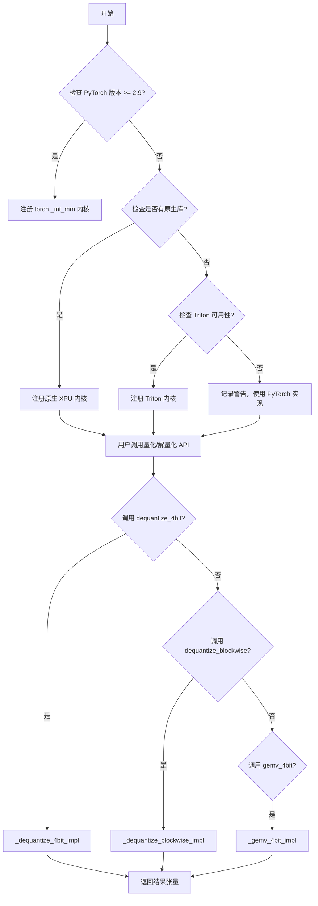

## 类结构

```
该文件为模块级代码，无类层次结构
主要包含模块级函数和内核注册逻辑
```

## 全局变量及字段


### `logger`
    
模块级日志记录器，用于记录bitsandbytes XPU后端相关的日志信息

类型：`logging.Logger`
    


    

## 全局函数及方法


### `_dequantize_4bit_impl`

该函数是4位量化张量的解量化核心实现，通过调用C++扩展库将量化后的4位张量（FP4或NF4格式）解量化到指定的输出数据类型（bfloat16、float16或float32），支持按块进行的解量化操作。

参数：

- `A`：`torch.Tensor`，输入的4位量化张量
- `absmax`：`torch.Tensor`，每个量化块的绝对最大值，用于反量化计算
- `blocksize`：`int`，量化块的大小
- `quant_type`：`str`，量化类型，支持"fp4"（浮点4位）或"nf4"（归一化浮点4位）
- `dtype`：`torch.dtype`，输出张量的目标数据类型（torch.bfloat16、torch.float16或torch.float32）
- `out`：`torch.Tensor`，用于存储解量化结果的张量

返回值：`None`，结果通过`out`参数以in-place方式输出

#### 流程图

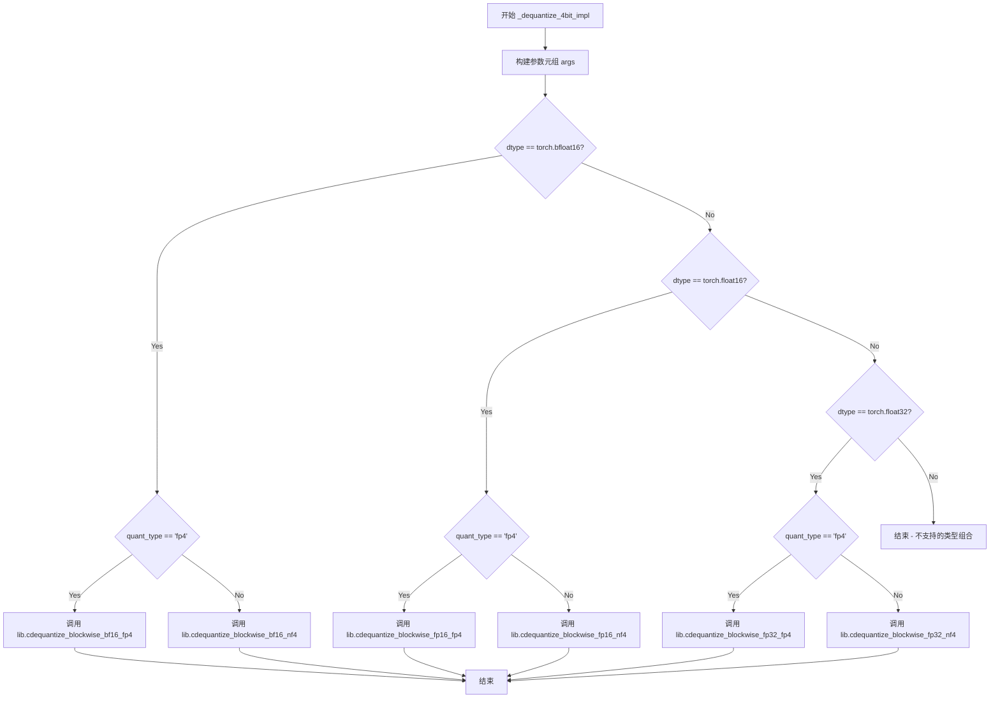

#### 带注释源码

```python
def _dequantize_4bit_impl(
    A: torch.Tensor,          # 输入的4位量化张量，包含压缩后的数据
    absmax: torch.Tensor,    # 每个块的绝对最大值，用于反量化计算
    blocksize: int,          # 量化块大小，决定每个块包含多少元素
    quant_type: str,         # 量化类型：'fp4' 或 'nf4'，决定解量化算法
    dtype: torch.dtype,      # 输出数据类型：bfloat16/float16/float32
    out: torch.Tensor,       # 预分配的输出张量，用于存储解量化结果
) -> None:
    """
    4位量化张量解量化实现函数。
    
    该函数根据不同的输出数据类型和量化类型，调用对应的C++扩展库函数
    执行高效的4位解量化操作。结果通过out参数以in-place方式返回。
    """
    # 构建传递给C扩展库的参数元组
    args = (
        None,                      # 保留参数，当前未使用
        get_ptr(A),                # 输入张量A的内存指针
        get_ptr(absmax),           # 绝对最大值张量的内存指针
        get_ptr(out),             # 输出张量的内存指针
        ct.c_int(blocksize),       # 量化块大小
        ct.c_int(out.numel()),   # 输出张量的元素总数
        _get_tensor_stream(A),    # 张量流句柄，用于异步执行
    )
    
    # 根据输出数据类型和量化类型选择对应的C库函数
    if dtype == torch.bfloat16:
        # 输出为 bfloat16
        if quant_type == "fp4":
            # 调用 bfloat16 + FP4 组合的解量化函数
            lib.cdequantize_blockwise_bf16_fp4(*args)
        else:
            # 调用 bfloat16 + NF4 组合的解量化函数
            lib.cdequantize_blockwise_bf16_nf4(*args)
    elif dtype == torch.float16:
        # 输出为 float16
        if quant_type == "fp4":
            # 调用 float16 + FP4 组合的解量化函数
            lib.cdequantize_blockwise_fp16_fp4(*args)
        else:
            # 调用 float16 + NF4 组合的解量化函数
            lib.cdequantize_blockwise_fp16_nf4(*args)
    elif dtype == torch.float32:
        # 输出为 float32
        if quant_type == "fp4":
            # 调用 float32 + FP4 组合的解量化函数
            lib.cdequantize_blockwise_fp32_fp4(*args)
        else:
            # 调用 float32 + NF4 组合的解量化函数
            lib.cdequantize_blockwise_fp32_nf4(*args)
    # 注意：不支持的dtype组合会被静默忽略，不会执行任何操作
```


### `_dequantize_blockwise_impl`

该函数是 4 位量化块级反量化的核心实现底层接口，通过接收量化数据、最大绝对值、码本和块大小等参数，根据目标数据类型（float16/bfloat16/float32）调用对应的 C 扩展库函数，将量化数据反量化为指定精度并输出到目标张量中。

参数：

- `A`：`torch.Tensor`，输入的量化张量，包含待反量化的 4 位压缩数据
- `absmax`：`torch.Tensor`，每个量化块的最大绝对值张量，用于缩放恢复原始数值范围
- `code`：`torch.Tensor`，量化码本，存储 4 位到浮点的映射表
- `blocksize`：`int`，量化块大小，指定多少个元素共享一个 absmax 值
- `dtype`：`torch.dtype`，目标输出数据类型，支持 float16/bfloat16/float32
- `out`：`torch.Tensor`，预分配的反量化输出张量，函数直接修改此张量的数据

返回值：`None`，函数通过修改 `out` 张量返回结果，无显式返回值

#### 流程图

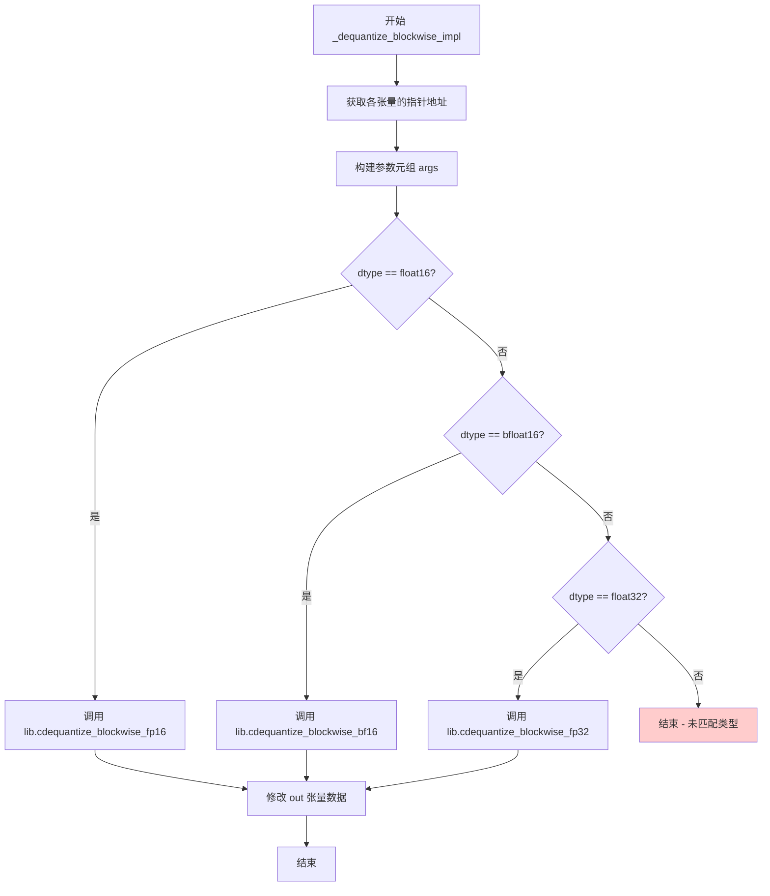

#### 带注释源码

```python
def _dequantize_blockwise_impl(
    A: torch.Tensor,              # 输入：量化后的4位数据张量
    absmax: torch.Tensor,         # 输入：每个块的绝对最大值，用于反量化缩放
    code: torch.Tensor,          # 输入：4位量化码本，定义量化映射关系
    blocksize: int,               # 输入：量化块大小，控制反量化粒度
    dtype: torch.dtype,          # 输入：目标数据类型，决定调用哪个C函数
    out: torch.Tensor,            # 输出：反量化结果张量，函数直接修改此张量
) -> None:
    """
    块级反量化的底层实现函数。
    
    该函数将 4 位量化数据块反量化为指定精度的浮点数张量。
    通过 C 扩展库调用针对不同数据精度优化的底层内核。
    
    参数说明：
        A: 形状为 (n,) 的连续 int8 张量，每两个字节存储 4 个 4-bit 值
        absmax: 形状为 (n // blocksize,) 的 1D 张量，每元素对应一个块的最大值
        code: 形状为 (16,) 的查找表，将 4-bit 索引映射为浮点值
        blocksize: 量化块大小，必须能整除 A 的元素个数
        dtype: 输出精度，可为 torch.float16, torch.bfloat16, torch.float32
        out: 预分配的输出张量，形状需与 A 相同
    
    注意：
        - 此函数不返回张量，结果直接写入 out 参数
        - 调用前需确保 out 张量已正确分配且形状匹配
    """
    # 将 PyTorch 张量转换为 C 指针，并准备其他 C 兼容参数
    args = (
        get_ptr(code),            # 获取码本张量的设备指针
        get_ptr(A),               # 获取输入量化张量的设备指针
        get_ptr(absmax),          # 获取绝对最大值张量的设备指针
        get_ptr(out),             # 获取输出张量的设备指针
        ct.c_int(blocksize),      # 转换为 C int 类型
        ct.c_int(A.numel()),      # 获取输入张量的元素总数
        _get_tensor_stream(A),    # 获取当前 CUDA/XPU 流，用于流同步
    )
    
    # 根据目标数据类型分派到不同的 C 库函数
    # 每个函数针对特定精度进行了优化
    if dtype == torch.float16:
        # 调用 float16 精度的反量化内核
        lib.cdequantize_blockwise_fp16(*args)
    elif dtype == torch.bfloat16:
        # 调用 bfloat16 精度的反量化内核
        lib.cdequantize_blockwise_bf16(*args)
    elif dtype == torch.float32:
        # 调用 float32 精度的反量化内核
        lib.cdequantize_blockwise_fp32(*args)
    # 注意：未处理其他 dtype 情况，调用方需保证 dtype 合法
```


### `_gemv_4bit_impl`

该函数实现4位量化矩阵向量乘法（GEMV）的底层计算逻辑，接收量化后的权重矩阵B、输入矩阵A以及量化参数（absmax、code、blocksize），根据A的数据类型调用相应的C扩展库函数完成矩阵向量乘法并将结果写入out张量。

参数：

- `A`：`torch.Tensor`，输入矩阵张量，支持float16、bfloat16或float32数据类型
- `B`：`torch.Tensor`，4位量化后的权重矩阵
- `shapeB`：`Sequence[int]`，权重矩阵B的形状序列，格式为 [n, k]，其中n为输出维度，k为输入维度
- `absmax`：`torch.Tensor`，每个量化块的绝对最大值，用于反量化计算
- `code`：`torch.Tensor`，量化编码表，存储4位量化值的解码映射
- `blocksize`：`int`，量化块大小，指定每多少个元素共享一个absmax值
- `out`：`torch.Tensor`，输出张量，用于存储矩阵向量乘法的结果

返回值：`None`，计算结果直接写入out张量中

#### 流程图

```mermaid
flowchart TD
    A[开始 _gemv_4bit_impl] --> B[设置 m=1, n=shapeB[0], k=shapeB[1]]
    B --> C[计算 lda = m]
    C --> D[计算 ldb = (A.shape[-1] + 1) // 2]
    D --> E[计算 ldc = m]
    E --> F[获取 tensor stream]
    F --> G{A.dtype == float16?}
    G -->|Yes| H[调用 cgemv_4bit_inference_fp16]
    G -->|No| I{A.dtype == bfloat16?}
    I -->|Yes| J[调用 cgemv_4bit_inference_bf16]
    I -->|No| K{A.dtype == float32?}
    K -->|Yes| L[调用 cgemv_4bit_inference_fp32]
    K -->|No| M[不支持的数据类型]
    H --> N[计算结果写入 out 张量]
    J --> N
    L --> N
    N --> O[结束]
```

#### 带注释源码

```python
def _gemv_4bit_impl(
    A: torch.Tensor,
    B: torch.Tensor,
    shapeB: Sequence[int],
    absmax: torch.Tensor,
    code: torch.Tensor,
    blocksize: int,
    out: torch.Tensor,
) -> None:
    """
    4位量化矩阵向量乘法实现函数
    
    参数:
        A: 输入矩阵，支持 float16/bfloat16/float32
        B: 4位量化权重矩阵
        shapeB: B的形状 [n, k]
        absmax: 每个量化块的绝对最大值
        code: 量化编码表
        blocksize: 量化块大小
        out: 输出张量
    """
    # 设置矩阵维度：m=1表示单个向量，n=输出维度，k=输入维度
    m = ct.c_int32(1)
    n = ct.c_int32(shapeB[0])
    k = ct.c_int32(shapeB[1])

    # lda: A的leading dimension，对于向量为1
    lda = m
    # ldb: B的leading dimension，由于B是4位量化存储，实际宽度为(A.shape[-1] + 1) // 2
    ldb = ct.c_int32((A.shape[-1] + 1) // 2)
    # ldc: C的leading dimension
    ldc = m

    # 获取CUDA/XPU stream用于异步执行
    stream = _get_tensor_stream(A)
    
    # 根据输入矩阵A的数据类型选择对应的C库函数
    if A.dtype == torch.float16:
        # 调用float16版本的4位量化GEMV kernel
        lib.cgemv_4bit_inference_fp16(
            m,
            n,
            k,
            get_ptr(A),        # 输入矩阵A的设备指针
            get_ptr(B),        # 量化权重矩阵B的设备指针
            get_ptr(absmax),   # 绝对最大值数组的设备指针
            get_ptr(code),     # 量化编码表的设备指针
            get_ptr(out),      # 输出张量的设备指针
            lda,
            ldb,
            ldc,
            ct.c_int32(blocksize),  # 量化块大小
            stream,            # CUDA/XPU流
        )
    elif A.dtype == torch.bfloat16:
        # 调用bfloat16版本的4位量化GEMV kernel
        lib.cgemv_4bit_inference_bf16(
            m,
            n,
            k,
            get_ptr(A),
            get_ptr(B),
            get_ptr(absmax),
            get_ptr(code),
            get_ptr(out),
            lda,
            ldb,
            ldc,
            ct.c_int32(blocksize),
            stream,
        )
    elif A.dtype == torch.float32:
        # 调用float32版本的4位量化GEMV kernel
        lib.cgemv_4bit_inference_fp32(
            m,
            n,
            k,
            get_ptr(A),
            get_ptr(B),
            get_ptr(absmax),
            get_ptr(code),
            get_ptr(out),
            lda,
            ldb,
            ldc,
            ct.c_int32(blocksize),
            stream,
        )
```


### `int8_linear_matmul` (条件注册)

该函数是针对 Intel XPU 的 int8 矩阵乘法加速实现，通过条件注册机制在 PyTorch 2.9+ 版本上利用 `torch._int_mm` 原语执行高效的整数矩阵运算。

参数：

- `A`：`torch.Tensor`，输入的 int8 类型张量，表示矩阵乘法的左矩阵
- `B`：`torch.Tensor`，输入的 int8 类型张量，表示矩阵乘法的右矩阵（权重矩阵）

返回值：`torch.Tensor`，返回 int8 类型的矩阵乘法结果，形状为 `(*A.shape[:-1], B.shape[0])`

#### 流程图

```mermaid
flowchart TD
    A[开始] --> B{检查 PyTorch 版本 >= 2.9?}
    B -->|是| C[注册 bitsandbytes::int8_linear_matmul 内核到 XPU]
    B -->|否| D[不注册该内核]
    C --> E[接收输入张量 A 和 B]
    E --> F[将 A reshape 为 2D: reshape(-1, A.shape[-1])]
    F --> G[对 B 转置: B.t()]
    G --> H[调用 torch._int_mm 执行整数矩阵乘法]
    H --> I[reshape 结果为 (*A.shape[:-1], B.shape[0])]
    I --> J[返回结果张量]
    D --> K[结束]
    J --> K
```

#### 带注释源码

```python
# 仅在 PyTorch 版本 >= 2.9 时注册该内核
if version.parse(torch.__version__).release >= version.parse("2.9").release:

    # 使用 register_kernel 装饰器将函数注册为 bitsandbytes::int8_linear_matmul 内核
    # 目标设备为 xpu (Intel GPU)
    @register_kernel("bitsandbytes::int8_linear_matmul", "xpu")
    def _(A: torch.Tensor, B: torch.Tensor):
        # 执行 int8 矩阵乘法
        # 步骤1: 将 A 张量 reshape 为 2D 张量 (batch_size * seq_len, hidden_size)
        # 步骤2: 对 B 进行转置 (hidden_size, out_features) -> (out_features, hidden_size)
        # 步骤3: 使用 torch._int_mm 执行高效的整数矩阵乘法
        # 步骤4: 将结果 reshape 回原始 batch 维度，输出形状为 (*A.shape[:-1], B.shape[0])
        return torch._int_mm(
            A.reshape(-1, A.shape[-1]),  # 将输入展平为 2D
            B.t(),                        # 转置权重矩阵
        ).reshape(*A.shape[:-1], B.shape[0])  # 恢复输出形状
```


### `dequantize_4bit` (xpu kernel)

该函数是 bitsandbytes 库中用于在 XPU (Intel GPU) 上将 4 位量化张量解量化为浮点张量的核心 kernel。它接受量化数据、块级最大值、量化类型等参数，通过调用底层 C 库实现高效的解量化操作。

参数：

- `A`：`torch.Tensor`，输入的 4 位量化张量
- `absmax`：`torch.Tensor`，每个量化块的绝对最大值，用于反量化缩放
- `blocksize`：`int`，量化块大小，决定了多少个元素共享一个 absmax 值
- `quant_type`：`str`，量化类型，支持 "fp4" (浮点 4 位) 或 "nf4" (归一化浮点 4 位)
- `shape`：`Sequence[int]`，输出张量的目标形状
- `dtype`：`torch.dtype`，输出张量的目标数据类型（float16、bfloat16 或 float32）

返回值：`torch.Tensor`，解量化后的浮点张量

#### 流程图

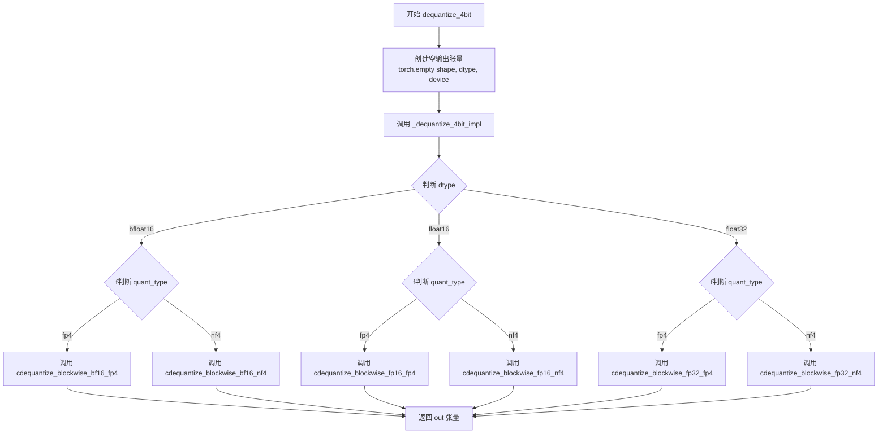

#### 带注释源码

```python
@register_kernel("bitsandbytes::dequantize_4bit", "xpu")
def _(
    A: torch.Tensor,          # 输入的 4 位量化张量
    absmax: torch.Tensor,     # 块级绝对最大值，用于反量化缩放
    blocksize: int,          # 量化块大小
    quant_type: str,          # 量化类型: "fp4" 或 "nf4"
    shape: Sequence[int],    # 输出张量的目标形状
    dtype: torch.dtype,       # 输出数据类型: float16/bfloat16/float32
) -> torch.Tensor:
    """
    XPU 上的 4 位解量化 kernel 入口函数。
    根据 dtype 和 quant_type 选择对应的底层 C 库函数执行解量化。
    """
    # 创建指定形状、数据类型和设备的外输出张量
    out = torch.empty(shape, dtype=dtype, device=A.device)
    
    # 调用底层实现函数，传入所有参数并指定输出张量
    _dequantize_4bit_impl(A, absmax, blocksize, quant_type, dtype, out=out)
    
    # 返回解量化后的浮点张量
    return out


def _dequantize_4bit_impl(
    A: torch.Tensor,          # 量化输入张量
    absmax: torch.Tensor,     # 块级最大值张量
    blocksize: int,          # 块大小
    quant_type: str,         # "fp4" 或 "nf4"
    dtype: torch.dtype,       # 目标数据类型
    out: torch.Tensor,        # 预分配的输出张量
) -> None:
    """
    底层 C 库调用实现函数。
    根据不同的 dtype 和 quant_type 组合，调用对应的 C 扩展函数。
    """
    # 构造传递给 C 库的参数元组
    # 参数顺序: null, A指针, absmax指针, out指针, blocksize, 元素总数, 流对象
    args = (
        None,
        get_ptr(A),                    # 获取 A 张量的原始指针
        get_ptr(absmax),               # 获取 absmax 张量的原始指针
        get_ptr(out),                  # 获取输出张量的原始指针
        ct.c_int(blocksize),           # 转换为 C int 类型
        ct.c_int(out.numel()),         # 输出张量的总元素数量
        _get_tensor_stream(A),         # 获取张量对应的流对象
    )
    
    # 根据目标数据类型和量化类型选择对应的 C 库函数
    if dtype == torch.bfloat16:
        if quant_type == "fp4":
            # bfloat16 + FP4 量化解量化
            lib.cdequantize_blockwise_bf16_fp4(*args)
        else:
            # bfloat16 + NF4 量化解量化
            lib.cdequantize_blockwise_bf16_nf4(*args)
    elif dtype == torch.float16:
        if quant_type == "fp4":
            # float16 + FP4 量化解量化
            lib.cdequantize_blockwise_fp16_fp4(*args)
        else:
            # float16 + NF4 量化解量化
            lib.cdequantize_blockwise_fp16_nf4(*args)
    elif dtype == torch.float32:
        if quant_type == "fp4":
            # float32 + FP4 量化解量化
            lib.cdequantize_blockwise_fp32_fp4(*args)
        else:
            # float32 + NF4 量化解量化
            lib.cdequantize_blockwise_fp32_nf4(*args)
```


### `bitsandbytes::dequantize_blockwise` (xpu)

该函数是 XPU 上的 4 位块式反量化内核，用于将量化后的 4 位张量反量化为指定数据类型的浮点张量。它通过底层 C 扩展库实现高效的反量化操作，支持 float16、bfloat16 和 float32 三种输出数据类型。

参数：

-  `A`：`torch.Tensor`，量化后的输入张量，包含 4 位量化数据
-  `absmax`：`torch.Tensor`，每个量化块的绝对最大值，用于反量化缩放
-  `code`：`torch.Tensor`，编码表/查找表，用于将量化索引映射回原始值
-  `blocksize`：`int`，量化块大小，指定每个块包含的元素数量
-  `dtype`：`torch.dtype`，输出张量的目标数据类型（float16/bfloat16/float32）

返回值：`torch.Tensor`，反量化后的浮点张量，形状与输入张量 A 相同

#### 流程图

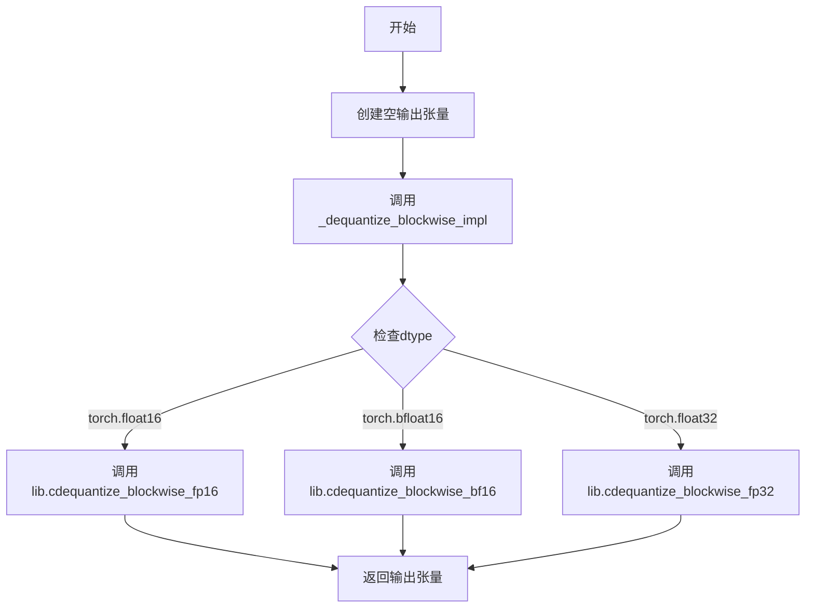

#### 带注释源码

```python
@register_kernel("bitsandbytes::dequantize_blockwise", "xpu")
def _(
    A: torch.Tensor, absmax: torch.Tensor, code: torch.Tensor, blocksize: int, dtype: torch.dtype
) -> torch.Tensor:
    """
    XPU 上的 4 位块式反量化内核（返回新张量版本）。
    
    参数:
        A: 量化后的输入张量（4位数据）
        absmax: 每个块的绝对最大值（用于缩放）
        code: 编码查找表
        blocksize: 量化块大小
        dtype: 目标输出数据类型
    
    返回:
        反量化后的浮点张量
    """
    # 创建一个与输入张量 A 形状和设备相同、但数据类型为 dtype 的空张量
    out = torch.empty_like(A, dtype=dtype)
    
    # 调用底层实现函数执行实际的反量化操作
    # 该函数会根据 dtype 调用相应的 C 库函数
    _dequantize_blockwise_impl(A, absmax, code, blocksize, dtype, out=out)
    
    # 返回反量化后的结果张量
    return out
```

---

**补充说明**：代码中还注册了 `bitsandbytes::dequantize_blockwise.out` 内核（inplace 版本），其接受额外的 `out` 参数并直接写入预分配的输出张量，末尾无返回值。两个内核共享同一个底层实现函数 `_dequantize_blockwise_impl`。


### `dequantize_blockwise.out`

该函数是 XPU 设备上的块式反量化内核，用于将块式量化后的张量（4bit）反量化为指定数据类型的浮点张量，结果写入预分配的输出张量中。

参数：

- `A`：`torch.Tensor`，输入的量化张量（4bit 编码数据）
- `absmax`：`torch.Tensor`，每个块的绝对最大值，用于反量化计算
- `code`：`torch.Tensor`，量化码本，包含量化查找表
- `blocksize`：`int`，块大小，指定每多少个元素共享一个 absmax 值
- `dtype`：`torch.dtype`，目标输出数据类型（float16/bfloat16/float32）
- `out`：`torch.Tensor`，预分配的输出张量，用于存储反量化结果

返回值：`None`，该函数通过修改 `out` 张量进行原地输出

#### 流程图

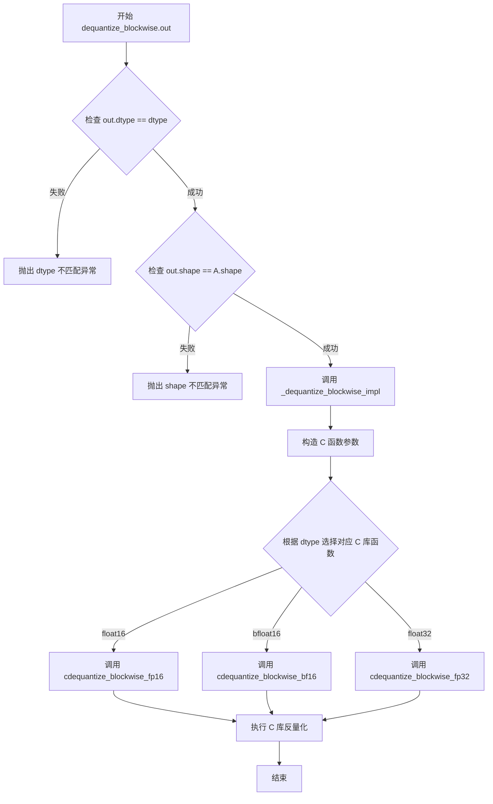

#### 带注释源码

```python
@register_kernel("bitsandbytes::dequantize_blockwise.out", "xpu")
def _(
    A: torch.Tensor,          # 输入的量化张量，包含 4bit 编码数据
    absmax: torch.Tensor,    # 每个量化块的绝对最大值数组
    code: torch.Tensor,      # 量化码本/查找表
    blocksize: int,          # 块大小，控制每个 absmax 对应的元素数量
    dtype: torch.dtype,      # 输出目标数据类型
    out: torch.Tensor,       # 预分配的输出张量
) -> None:
    """
    XPU 设备上的块式反量化内核入口函数。
    执行输入验证后调用底层 C 实现完成反量化操作。
    """
    # 验证输出张量的数据类型是否与指定 dtype 匹配
    torch._check(out.dtype == dtype, lambda: f"Expected out.dtype == {dtype}, got {out.dtype}")
    # 验证输出张量的形状是否与输入张量形状一致
    torch._check(out.shape == A.shape, lambda: f"Expected out.shape == {A.shape}, got {out.shape}")
    # 调用底层实现函数执行实际的反量化操作
    _dequantize_blockwise_impl(A, absmax, code, blocksize, dtype, out=out)


def _dequantize_blockwise_impl(
    A: torch.Tensor,        # 输入的量化张量
    absmax: torch.Tensor,  # 块级绝对最大值
    code: torch.Tensor,    # 量化码本
    blocksize: int,        # 块大小
    dtype: torch.dtype,    # 输出数据类型
    out: torch.Tensor,     # 输出张量
) -> None:
    """
    块式反量化的底层实现函数。
    根据目标数据类型选择对应的 C 库函数进行反量化。
    """
    # 构造传递给 C 库的参数元组
    # 参数顺序: code_ptr, A_ptr, absmax_ptr, out_ptr, blocksize, numel, stream
    args = (
        get_ptr(code),           # 获取码本张量的设备指针
        get_ptr(A),              # 获取输入张量的设备指针
        get_ptr(absmax),         # 获取 absmax 张量的设备指针
        get_ptr(out),            # 获取输出张量的设备指针
        ct.c_int(blocksize),     # 块大小转换为 C int
        ct.c_int(A.numel()),     # 输入张量的总元素数量
        _get_tensor_stream(A),   # 获取张量的计算流
    )
    
    # 根据目标数据类型选择对应的 C 库反量化函数
    if dtype == torch.float16:
        # float16 数据类型的反量化
        lib.cdequantize_blockwise_fp16(*args)
    elif dtype == torch.bfloat16:
        # bfloat16 数据类型的反量化
        lib.cdequantize_blockwise_bf16(*args)
    elif dtype == torch.float32:
        # float32 数据类型的反量化
        lib.cdequantize_blockwise_fp32(*args)
```


### `gemv_4bit` (xpu kernel)

该函数是注册在 XPU 上的 4-bit 矩阵向量乘法（GEMV）kernel，负责执行量化权重与输入矩阵的高效矩阵乘法运算，支持 fp16/bf16/fp32 三种输入精度，并通过块级量化编码表实现 4-bit 权重的反量化计算。

参数：

- `A`：`torch.Tensor`，输入矩阵，形状为 `(*, k)`，其中 `*` 表示任意数量的 batch 维度
- `B`：`torch.Tensor`，4-bit 量化权重矩阵，形状为 `(n, k//2)`（因为 4-bit 数据每 2 个字节存储在 1 个字节中）
- `shapeB`：`Sequence[int]`，权重矩阵 B 的原始形状 `(n, k)`
- `absmax`：`torch.Tensor`，块级量化的绝对最大值张量，用于反量化
- `code`：`torch.Tensor`，量化编码表，包含 NF4 或 FP4 的量化码本
- `blocksize`：`int`，量化块大小

返回值：`torch.Tensor`，矩阵乘法结果，形状为 `(*, n)`，数据类型与输入 A 相同

#### 流程图

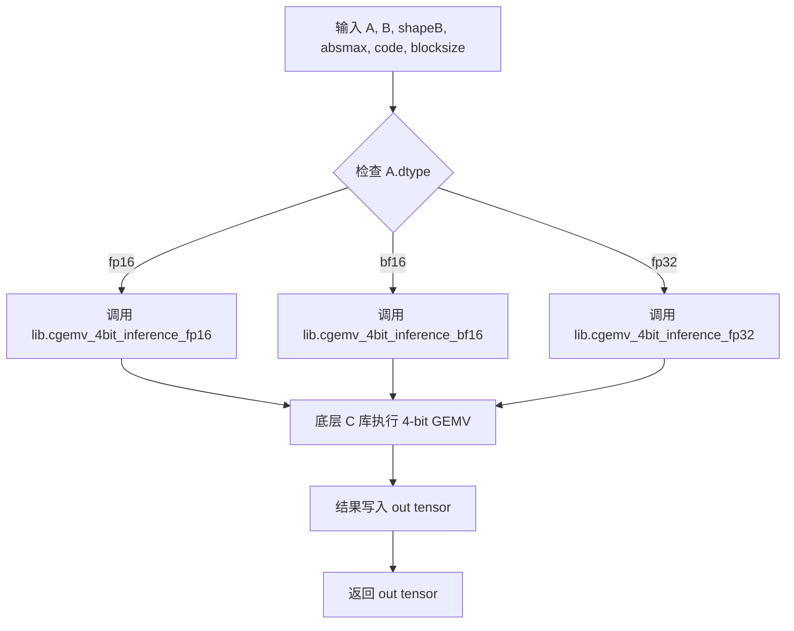

#### 带注释源码

```python
@register_kernel("bitsandbytes::gemv_4bit", "xpu")
def _(
    A: torch.Tensor,
    B: torch.Tensor,
    shapeB: Sequence[int],
    absmax: torch.Tensor,
    code: torch.Tensor,
    blocksize: int,
) -> torch.Tensor:
    # 计算输出形状：保持 A 的 batch 维度，输出列数为 B 的行数
    shape = (*A.shape[:-1], shapeB[0])
    # 创建与输入 A 相同 dtype 和设备的空输出 tensor
    out = torch.empty(shape, device=A.device, dtype=A.dtype)
    # 调用内部实现函数执行核心 GEMV 计算
    _gemv_4bit_impl(A, B, shapeB, absmax, code, blocksize, out=out)
    return out
```

---

### `_gemv_4bit_impl`

该函数是 4-bit GEMV 的核心内部实现，通过调用底层 C 库（lib）执行实际的矩阵向量乘法运算。函数根据输入张量的数据类型（fp16/bf16/fp32）选择对应的 C 库函数，并将量化参数（absmax、code、blocksize）传递给底层 kernel 进行反量化和计算。

参数：

- `A`：`torch.Tensor`，输入矩阵，形状为 `(1, k)` 或 `(batch, k)`
- `B`：`torch.Tensor`，4-bit 量化权重矩阵
- `shapeB`：`Sequence[int]`，B 的原始形状 `[n, k]`
- `absmax`：`torch.Tensor`，块级量化的绝对最大值
- `code`：`torch.Tensor`，量化编码表（NF4/FP4 码本）
- `blocksize`：`int`，量化块大小
- `out`：`torch.Tensor`，预分配的输出 tensor

返回值：`None`，结果通过 `out` 参数直接写入

#### 流程图

```mermaid
flowchart TD
    A[输入参数 A, B, shapeB, absmax, code, blocksize, out] --> B[构建矩阵维度参数]
    B --> C[m=1, n=shapeB[0], k=shapeB[1]]
    C --> D[计算 lda, ldb, ldc 步长]
    D --> E{判断 A.dtype}
    E -->|float16| F[调用 cgemv_4bit_inference_fp16]
    E -->|bfloat16| G[调用 cgemv_4bit_inference_bf16]
    E -->|float32| H[调用 cgemv_4bit_inference_fp32]
    F --> I[底层 C 库执行量化 GEMV]
    G --> I
    H --> I
    I --> J[结果写入 out tensor]
    J --> K[返回 None]
```

#### 带注释源码

```python
def _gemv_4bit_impl(
    A: torch.Tensor,
    B: torch.Tensor,
    shapeB: Sequence[int],
    absmax: torch.Tensor,
    code: torch.Tensor,
    blocksize: int,
    out: torch.Tensor,
) -> None:
    # 将维度参数转换为 ctypes 类型
    m = ct.c_int32(1)  # GEMV 操作中，m 固定为 1（向量）
    n = ct.c_int32(shapeB[0])  # B 的行数（输出维度）
    k = ct.c_int32(shapeB[1])  # B 的列数（输入维度）

    # 计算leading dimension参数
    lda = m  # A 的 leading dimension
    # B 的 leading dimension: 因为 4-bit 数据每 2 个字节打包成 1 字节，所以除以 2
    ldb = ct.c_int32((A.shape[-1] + 1) // 2)
    ldc = m  # 输出矩阵的 leading dimension

    # 获取 A tensor 的数据流指针
    stream = _get_tensor_stream(A)

    # 根据 A 的数据类型选择对应的底层 C 库函数
    if A.dtype == torch.float16:
        lib.cgemv_4bit_inference_fp16(
            m, n, k,  # 矩阵维度: (m=1, n, k)
            get_ptr(A),  # 输入矩阵 A 的指针
            get_ptr(B),  # 量化权重矩阵 B 的指针
            get_ptr(absmax),  # 绝对最大值指针（用于反量化缩放）
            get_ptr(code),  # 量化编码表指针
            get_ptr(out),  # 输出矩阵指针
            lda, ldb, ldc,  # leading dimensions
            ct.c_int32(blocksize),  # 量化块大小
            stream,  # CUDA/hip 流
        )
    elif A.dtype == torch.bfloat16:
        lib.cgemv_4bit_inference_bf16(
            m, n, k,
            get_ptr(A), get_ptr(B), get_ptr(absmax),
            get_ptr(code), get_ptr(out),
            lda, ldb, ldc,
            ct.c_int32(blocksize),
            stream,
        )
    elif A.dtype == torch.float32:
        lib.cgemv_4bit_inference_fp32(
            m, n, k,
            get_ptr(A), get_ptr(B), get_ptr(absmax),
            get_ptr(code), get_ptr(out),
            lda, ldb, ldc,
            ct.c_int32(blocksize),
            stream,
        )
```


### `bitsandbytes::gemv_4bit.out` (XPU 内核)

该函数是 bitsandbytes 库中针对 Intel XPU 的 4 位量化矩阵向量乘法（GEMV）内核的注册实现，负责执行高效的张量矩阵运算并输出到预分配的 out 张量中。

参数：

- `A`：`torch.Tensor`，输入矩阵（通常为权重量化后的 4 位编码数据）
- `B`：`torch.Tensor`，量化后的权重矩阵（以 4 位形式存储）
- `shapeB`：`Sequence[int]`，权重矩阵 B 的原始形状序列
- `absmax`：`torch.Tensor`，每个量化块的绝对最大值，用于反量化
- `code`：`torch.Tensor`，量化查找表（codebook），包含量化值
- `blocksize`：`int`，量化块大小
- `out`：`torch.Tensor`，预分配的计算结果输出张量

返回值：`None`，该函数直接修改 `out` 张量内容，不返回新张量

#### 流程图

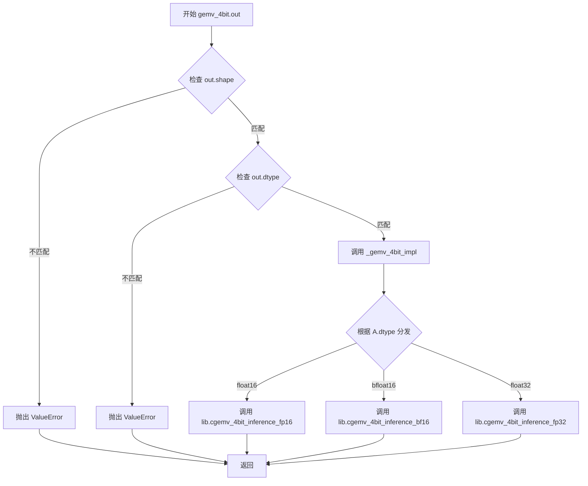

#### 带注释源码

```python
@register_kernel("bitsandbytes::gemv_4bit.out", "xpu")
def _(
    A: torch.Tensor,          # 输入张量，通常为激活值
    B: torch.Tensor,          # 4位量化权重矩阵
    shapeB: Sequence[int],    # 权重矩阵B的原始形状
    absmax: torch.Tensor,     # 量化块的最大绝对值，用于反量化
    code: torch.Tensor,       # 量化查找表，包含离散量化值
    blocksize: int,           # 量化块大小（每个块包含的元素数）
    out: torch.Tensor,        # 预分配的输出张量，存储GEMV结果
) -> None:
    # 验证输出张量形状是否与预期匹配
    # 预期形状: (A.shape[:-1] + (shapeB[0],))
    # 即保留A的前n-1维，最后一维替换为B的第一维（输出维度）
    torch._check(
        out.shape == (*A.shape[:-1], shapeB[0]),
        lambda: f"Expected out.shape == {(*A.shape[:-1], shapeB[0])}, got {out.shape}",
    )
    
    # 验证输出张量的数据类型是否与输入张量A的数据类型一致
    torch._check(out.dtype == A.dtype, lambda: f"Expected out.dtype == {A.dtype}, got {out.dtype}")
    
    # 调用底层实现函数，执行4位量化的GEMV计算
    _gemv_4bit_impl(A, B, shapeB, absmax, code, blocksize, out=out)


def _gemv_4bit_impl(
    A: torch.Tensor,          # 输入矩阵张量
    B: torch.Tensor,          # 4位量化权重矩阵
    shapeB: Sequence[int],    # 权重矩阵B的原始形状
    absmax: torch.Tensor,     # 量化块的最大绝对值
    code: torch.Tensor,       # 量化查找表
    blocksize: int,           # 量化块大小
    out: torch.Tensor,        # 输出张量
) -> None:
    # 将维度信息转换为ctypes类型
    m = ct.c_int32(1)                      # 矩阵A视为行向量 (1行)
    n = ct.c_int32(shapeB[0])              # 输出维度 = B的行数
    k = ct.c_int32(shapeB[1])              # B的列数 = A的最后一个维度
    
    # 计算leading dimension (lda, ldb, ldc)
    lda = m                                 # A是1行，lda=1
    # 4位数据每2个字节打包成一个值，所以ldb需要除以2并向上取整
    ldb = ct.c_int32((A.shape[-1] + 1) // 2)
    ldc = m                                 # 输出1行，ldc=1
    
    # 获取GPU流（用于异步执行）
    stream = _get_tensor_stream(A)
    
    # 根据输入数据类型选择对应的C库函数
    if A.dtype == torch.float16:
        # 调用float16版本的4位GEMV推理内核
        lib.cgemv_4bit_inference_fp16(
            m, n, k,                         # 矩阵维度
            get_ptr(A),                      # 输入矩阵A的指针
            get_ptr(B),                      # 量化权重矩阵B的指针
            get_ptr(absmax),                 # 量化块最大值指针
            get_ptr(code),                   # 量化查找表指针
            get_ptr(out),                    # 输出张量指针
            lda, ldb, ldc,                   # leading dimensions
            ct.c_int32(blocksize),           # 量化块大小
            stream,                          # GPU流
        )
    elif A.dtype == torch.bfloat16:
        # 调用bfloat16版本的4位GEMV推理内核
        lib.cgemv_4bit_inference_bf16(
            m, n, k,
            get_ptr(A),
            get_ptr(B),
            get_ptr(absmax),
            get_ptr(code),
            get_ptr(out),
            lda, ldb, ldc,
            ct.c_int32(blocksize),
            stream,
        )
    elif A.dtype == torch.float32:
        # 调用float32版本的4位GEMV推理内核
        lib.cgemv_4bit_inference_fp32(
            m, n, k,
            get_ptr(A),
            get_ptr(B),
            get_ptr(absmax),
            get_ptr(code),
            get_ptr(out),
            lda, ldb, ldc,
            ct.c_int32(blocksize),
            stream,
        )
```


### `bitsandbytes::quantize_blockwise` (xpu kernel)

该函数是 bitsandbytes 库在 XPU 设备上的分块量化核心内核，通过注册机制将 Triton 实现的分块量化操作绑定到 `bitsandbytes::quantize_blockwise` 调度点。函数接收输入张量、量化参数（如分块大小、量化类型等），将张量转换为分块量化表示，通常与 `dequantize_blockwise` 配合用于量化模型的推理或训练过程。

参数：

-  `A`：`torch.Tensor`，输入待量化的浮点张量
-  `absmax`：`torch.Tensor`，存储每个分块的最大绝对值，用于反量化时的缩放
-  `code`：`torch.Tensor`，量化编码表（如 NF4/FP4 的码本）
-  `blocksize`：`int`，分块大小，指定每多少个元素作为一个量化单元
-  `dtype`：`torch.dtype`，输出张量的目标数据类型

返回值：`torch.Tensor`，返回量化后的张量

#### 流程图

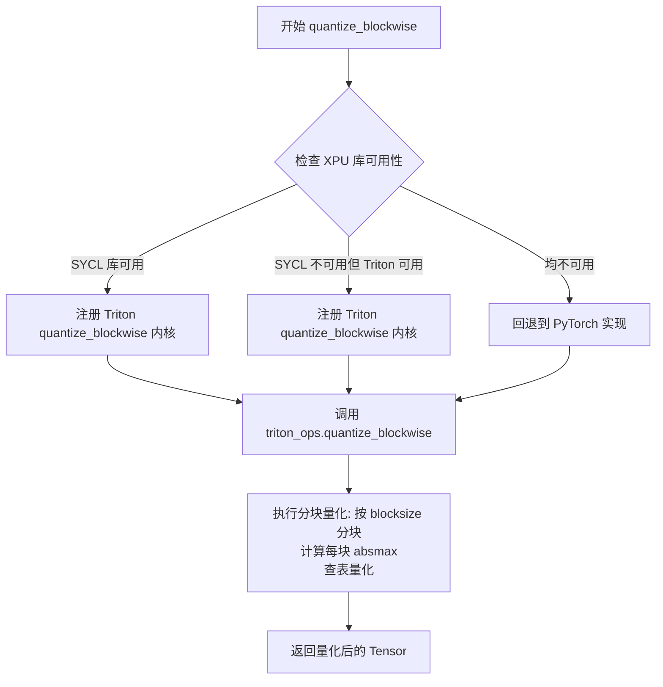

#### 带注释源码

```python
# XPU 设备上的 quantize_blockwise 内核注册
# 位于 bitsandbytes/functional.py 或类似模块中

# SYCL 库可用时的注册路径（优先使用 SYCL 加速）
if not isinstance(lib, ErrorHandlerMockBNBNativeLibrary):
    logger.info("Register sycl bitsandbytes kernels for XPU")

    # 检查 Triton 是否可用
    if triton_available:
        from ..triton import ops as triton_ops

        # 注册 quantize_blockwise 内核到 XPU 调度
        # 使用 triton_ops.quantize_blockwise 作为实际实现
        register_kernel("bitsandbytes::quantize_blockwise", "xpu")(
            triton_ops.quantize_blockwise
        )
        # 同时注册其他相关内核...
        register_kernel("bitsandbytes::quantize_4bit", "xpu")(triton_ops.quantize_4bit)

# SYCL 不可用但 Triton 可用时的回退注册
elif triton_available:
    logger.info("Register triton bitsandbytes kernels for XPU")
    from ..triton import ops as triton_ops

    # 同样注册 quantize_blockwise 内核
    # 当无 SYCL 原生库时，使用 Triton JIT 编译的核函数
    register_kernel("bitsandbytes::quantize_blockwise", "xpu")(
        triton_ops.quantize_blockwise
    )

# 实际实现位于 triton.ops 模块中
# 典型的 quantize_blockwise 签名如下（来自 triton 实现推断）:
# def quantize_blockwise(
#     A: torch.Tensor,      # 输入浮点张量
#     absmax: torch.Tensor, # 输出：每块的最大绝对值
#     code: torch.Tensor,   # 量化码本（如 NF4/FP4 编码表）
#     blocksize: int,       # 分块大小（如 64, 128 等）
#     quant_type: str = "nf4"  # 量化类型（nf4 或 fp4）
# ) -> torch.Tensor:       # 返回量化后的张量
```


### `quantize_4bit` (xpu 内核)

该函数是 bitsandbytes 库中针对 Intel XPU 设备注册的 4 位量化内核，用于将输入张量转换为 4 位量化表示。在代码中，该内核通过 `register_kernel` 装饰器注册，当 triton 可用时指向 `triton_ops.quantize_4bit`，否则会回退到其他实现方式。

参数：

- 无直接参数（该函数通过内核注册机制调用，参数由调用方传递）

返回值：`torch.Tensor`，返回量化后的张量

#### 流程图

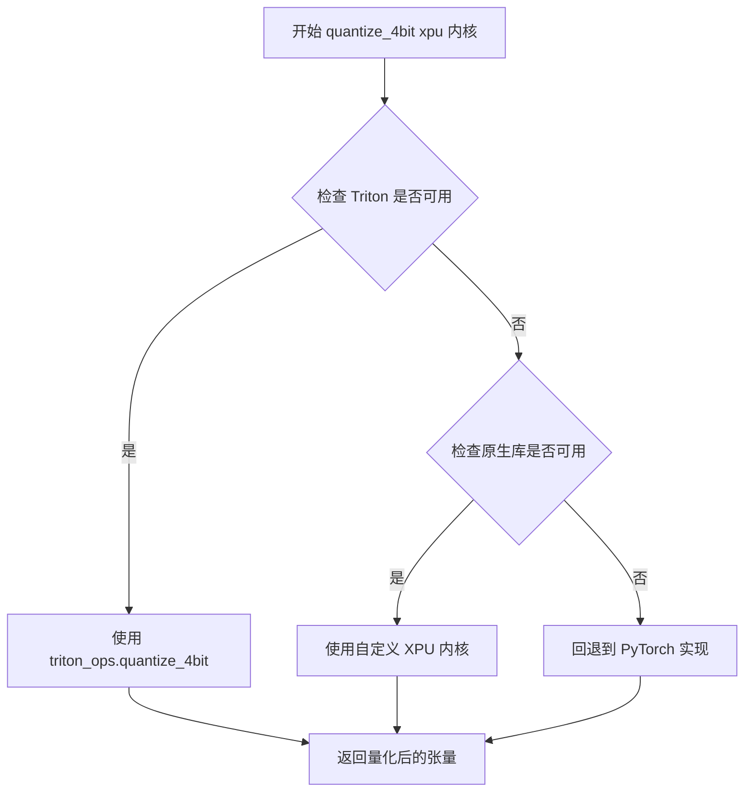

#### 带注释源码

```python
# SYCL should be faster for xpu, so at first checking if it is available.
# 检查是否使用了模拟库（ErrorHandlerMockBNBNativeLibrary）
if not isinstance(lib, ErrorHandlerMockBNBNativeLibrary):
    logger.info("Register sycl bitsandbytes kernels for XPU")

    # TODO: Remove the triton register when quantization sycl kernel is ready.
    # 如果 triton 可用，则注册 Triton 版本的内核
    if triton_available:
        from ..triton import ops as triton_ops

        # 注册 4 位量化内核到 XPU 后端
        # 该内核将输入张量量化为 4 位表示
        register_kernel("bitsandbytes::quantize_4bit", "xpu")(triton_ops.quantize_4bit)
        register_kernel("bitsandbytes::optimizer_update_8bit_blockwise", "xpu")(
            triton_ops.optimizer_update_8bit_blockwise
        )
        register_kernel("bitsandbytes::optimizer_update_32bit", "xpu")(triton_ops.optimizer_update_32bit)

    # ... 其他内核注册 ...
elif triton_available:
    # 如果原生库不可用但 triton 可用，记录并注册 triton 内核
    logger.info("Register triton bitsandbytes kernels for XPU")
    from ..triton import ops as triton_ops

    # ... 其他内核注册 ...
    # 同样注册 quantize_4bit 内核
    register_kernel("bitsandbytes::quantize_4bit", "xpu")(triton_ops.quantize_4bit)
    # ...
else:
    # 如果都没有，回退到 PyTorch 实现
    logger.warning("Register pytorch bitsandbytes kernels for XPU because no native library or triton packages found.")
```

---

### 补充说明

由于 `quantize_4bit` 的具体实现在 provided code 中并未直接给出（它引用自 `triton_ops.quantize_4bit`），以下是基于代码上下文的推断：

**潜在技术债务：**
1. 代码中存在 TODO 注释，表明当前使用的是 Triton 内核而非原生的 SYCL 内核，当 SYCL 内核准备就绪后需要移除 Triton 注册
2. `quantize_4bit` 的具体实现被隐藏在 `triton_ops` 模块中，透明度不足

**设计约束：**
- 该内核专门为 Intel XPU 设备设计
- 优先使用 SYCL 内核（如果可用），其次是 Triton，最后回退到 PyTorch 实现
- 4 位量化是存储和计算高效的关键技术，广泛用于大模型推理加速


### `optimizer_update_8bit_blockwise`

该函数是 bitsandbytes 库在 XPU (Intel GPU) 上的 8 位分块优化器更新内核的注册包装函数，通过调用 triton 操作实现高效的 8 位量化参数更新。

参数：

- `p`：torch.Tensor，优化器参数张量
- `g`：torch.Tensor，梯度张量  
- `p_copy`：torch.Tensor，参数副本（用于动量/自适应学习率）
- `absmax`：torch.Tensor，每个块的绝对最大值（量化参数）
- `quant_map`：torch.Tensor，量化映射表
- `blocksize`：int，块大小
- `out`：torch.Tensor，输出张量（可选）

返回值：`torch.Tensor` 或 `None`，更新的参数张量

#### 流程图

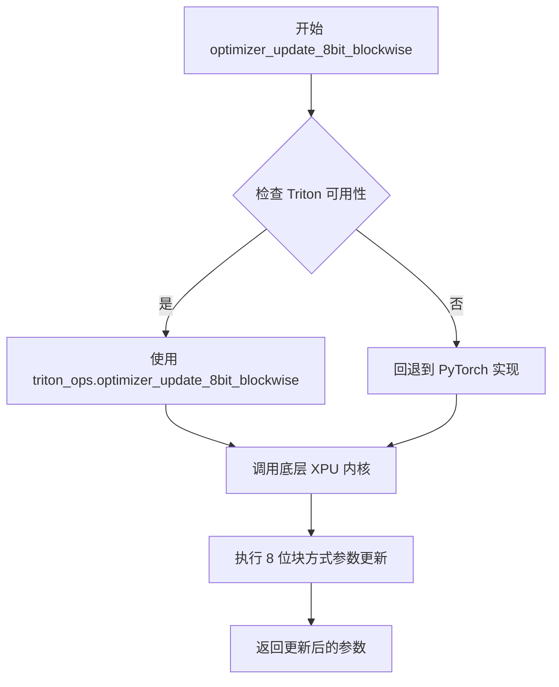

#### 带注释源码

```
# 从代码中提取的注册逻辑（实际实现位于 ..triton.ops 模块）

# 分支1：当存在原生库且 Triton 可用时
if not isinstance(lib, ErrorHandlerMockBNBNativeLibrary):
    if triton_available:
        from ..triton import ops as triton_ops
        # 注册 8 位块方式优化器更新内核到 XPU 后端
        register_kernel("bitsandbytes::optimizer_update_8bit_blockwise", "xpu")(
            triton_ops.optimizer_update_8bit_blockwise
        )

# 分支2：当无原生库但 Triton 可用时
elif triton_available:
    from ..triton import ops as triton_ops
    # 同样注册到 XPU 后端
    register_kernel("bitsandbytes::optimizer_update_8bit_blockwise", "xpu")(
        triton_ops.optimizer_update_8bit_blockwise
    )
```

---

**注意**：该函数的实际核心实现位于 `..triton.ops` 模块中，当前代码文件仅包含内核注册逻辑。通过 `register_kernel` 装饰器将该函数注册为 "bitsandbytes::optimizer_update_8bit_blockwise" 内核，XPU 设备将调用 triton 操作执行具体的 8 位块方式优化器更新。


### `optimizer_update_32bit` (xpu 内核注册)

该函数是 XPU 设备上的 32 位优化器更新内核的注册包装器，通过 `register_kernel` 将 Triton 实现的 `optimizer_update_32bit` 操作注册到 bitsandbytes 库中，用于在 Intel XPU 上执行高效的 32 位参数优化器更新操作。

参数：

-  由于该代码段仅包含内核注册逻辑，实际参数信息取决于 `triton_ops.optimizer_update_32bit` 的完整定义，建议查看 `..triton.ops` 模块获取详细参数列表。
-  从上下文推测，该操作通常包含：p (参数张量), g (梯度张量), state1 (优化器状态1), state2 (优化器状态2), exp_avg (指数平均), exp_avg_sq (指数平均平方), lr (学习率), beta1, beta2, eps 等参数。

返回值：

-  通常为 `None`（原地更新操作）或 `torch.Tensor`（返回更新后的参数），具体取决于 Triton 实现。

#### 流程图

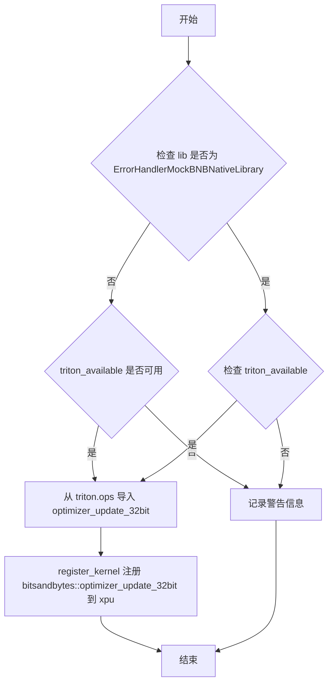

#### 带注释源码

```python
# SYCL should be faster for xpu, so at first checking if it is available.
# 检查是否使用了模拟的原生库（非真实 XPU 库）
if not isinstance(lib, ErrorHandlerMockBNBNativeLibrary):
    logger.info("Register sycl bitsandbytes kernels for XPU")

    # TODO: Remove the triton register when quantization sycl kernel is ready.
    # 如果 Triton 可用，则注册 Triton 实现的算子
    if triton_available:
        from ..triton import ops as triton_ops

        # 注册量化相关算子（注释中列出了部分注册）
        register_kernel("bitsandbytes::quantize_blockwise", "xpu")(triton_ops.quantize_blockwise)
        register_kernel("bitsandbytes::quantize_4bit", "xpu")(triton_ops.quantize_4bit)
        register_kernel("bitsandbytes::optimizer_update_8bit_blockwise", "xpu")(
            triton_ops.optimizer_update_8bit_blockwise
        )
        # 注册 32bit 优化器更新算子到 XPU 设备
        # 这是题目要求的 optimizer_update_32bit xpu 内核
        register_kernel("bitsandbytes::optimizer_update_32bit", "xpu")(triton_ops.optimizer_update_32bit)
    
    # ... 后续还有其他算子注册 ...

# 如果没有原生库但有 Triton
elif triton_available:
    logger.info("Register triton bitsandbytes kernels for XPU")
    from ..triton import ops as triton_ops
    
    # 同样注册 optimizer_update_32bit 到 XPU
    register_kernel("bitsandbytes::optimizer_update_32bit", "xpu")(triton_ops.optimizer_update_32bit)
    # ... 其他算子注册 ...

# 否则使用 PyTorch 实现
else:
    logger.warning("Register pytorch bitsandbytes kernels for XPU because no native library or triton packages found.")
```

**注意**：该代码段仅包含内核的注册逻辑，实际的 `optimizer_update_32bit` 函数实现位于 `triton_ops` 模块中（`..triton.ops`），该模块未在此代码片段中展示。

## 关键组件


### 张量指针获取与惰性加载

通过 `get_ptr()` 函数获取张量的底层指针，配合 `_get_tensor_stream()` 实现惰性流式加载，支持高效的设备间数据传输。

### 4位量化反量化实现

提供 `_dequantize_4bit_impl` 函数，支持 FP4 和 NF4 两种量化类型，根据目标数据类型（bf16/fp16/fp32）调用不同的 C 扩展库函数完成反量化。

### 分块反量化支持

`_dequantize_blockwise_impl` 函数实现基于代码本的块级反量化，按 blocksize 分块处理，支持 fp16/bf16/fp32 三种输出精度。

### 4位矩阵向量乘法

`_gemv_4bit_impl` 函数实现 4 位 GEMV 运算，根据输入张量精度选择对应的 C 库函数（fp16/bf16/fp32），支持 Intel XPU 高效推理。

### 内核注册机制

使用 `@register_kernel` 装饰器将实现函数注册到 bitsandbytes 内核系统，为 XPU 后端提供统一的量化/反量化算子接口。

### 多后端条件调度

代码根据环境条件动态选择 SYCL、Triton 或纯 PyTorch 三种后端之一进行内核注册，支持 Intel GPU 的异构计算场景。


## 问题及建议


### 已知问题

- **版本检查方式不够精确**：使用 `version.parse(torch.__version__).release >= version.parse("2.9").release` 进行版本比较，这种方式在处理次版本号时可能不够准确（如 2.10 会被错误处理）
- **重复的分支代码**：`_dequantize_4bit_impl` 函数中存在大量重复的 if-elif 分支，仅调用的 C 库函数不同，可通过字典映射或策略模式简化
- **函数命名不规范**：多个使用 `@register_kernel` 装饰的函数使用 `_` 作为函数名，虽然功能正确但可读性差，不利于调试和追踪
- **不必要的类型包装开销**：在 `_gemv_4bit_impl` 中频繁使用 `ct.c_int32` 包装数值，每次调用都会创建新对象，可预先定义常量
- **硬编码的计算逻辑**：`ldb = ct.c_int32((A.shape[-1] + 1) // 2)` 中的计算缺乏注释说明，后续维护者难以理解其含义
- **缺少全面的参数校验**：仅在少数函数中使用 `torch._check` 进行参数校验，许多底层实现函数（如 `_dequantize_4bit_impl`）缺乏输入验证
- **重复的形状检查逻辑**：`out.shape == (*A.shape[:-1], shapeB[0])` 的检查在多个地方重复出现，可提取为公共函数

### 优化建议

- 使用更精确的版本比较方式，如 `version.parse(torch.__version__) >= version.parse("2.9.0")`
- 将 C 库函数调用映射到字典中，消除 if-elif 分支
- 为注册函数使用描述性名称，便于调试和日志追踪
- 预定义常用的 ctypes 类型常量，减少运行时开销
- 添加输入张量形状和连续性的校验，确保内存布局符合预期
- 提取公共的形状检查逻辑为独立函数，提高代码复用性
- 考虑为 SYCL kernel 添加异步执行支持，提高吞吐量

## 其它


### 设计目标与约束

本模块旨在为Intel XPU设备提供高效的4bit和blockwise量化操作支持，通过SYCL原生库或Triton后端实现矩阵乘法和反量化运算。设计约束包括：1) 仅支持PyTorch 2.9及以上版本（因依赖torch._int_mm）；2) 必须适配Intel XPU设备；3) 支持fp4和nf4两种量化类型；4) 支持float16、bfloat16和float32三种输出精度。

### 错误处理与异常设计

代码中的错误处理主要通过torch._check函数实现参数验证，包括：out.dtype与期望类型一致性检查、out.shape与期望形状一致性检查。对于库加载失败的情况，通过ErrorHandlerMockBNBNativeLibrary进行降级处理。若SYCL库不可用且Triton也不可用，则回退到PyTorch原生实现并输出警告日志。建议增加对量化类型（quant_type）合法性的校验，以及blocksize必须为正整数的检查。

### 数据流与状态机

数据流主要分为三个路径：1) 量化路径：通过register_kernel注册的quantize_blockwise和quantize_4bit操作；2) 反量化路径：dequantize_4bit和dequantize_blockwise将量化数据还原为浮点数；3) GEMV计算路径：gemv_4bit执行4bit矩阵向量乘法。状态转换由后端选择逻辑控制：根据lib类型和triton_available标志决定使用SYCL、Triton或PyTorch原生实现。

### 外部依赖与接口契约

核心依赖包括：1) torch>=2.9（提供_int_mm操作）；2) bitsandbytes._ops.register_kernel（内核注册机制）；3) bitsandbytes.cextension（SYCL原生库接口）；4) bitsandbytes.functional（tensor流处理工具）；5) packaging.version（版本解析）；6) Triton（可选高性能后端）。接口契约：所有kernel函数接受torch.Tensor输入，返回Tensor或None（out参数版本），blocksize必须为正整数，quant_type必须为"fp4"或"nf4"。

### 性能考虑与优化空间

当前实现存在以下优化机会：1) 代码中TODO注释表明量化SYCL内核尚未完成，需等待完成后可移除Triton回退路径；2) _gemv_4bit_impl中硬编码m=1（仅支持向量输入），可扩展为矩阵乘法以提升批处理效率；3) 可考虑增加输入Tensor的连续性检查，避免不必要的数据拷贝；4) stream参数（_get_tensor_stream）可用于异步执行，当前未充分利用；5) 可添加基于输入大小的动态算法选择。

### 平台支持与兼容性

本模块专为Intel XPU设备设计，通过device=A.device自动检测目标设备。代码通过version.parse比较实现PyTorch版本兼容性检查，确保_int_mm可用。当前支持Intel Data Center GPU Max Series（PVC）等XPU设备，对其他GPU后端（CUDA、ROCm）不适用。量化参数（blocksize、quant_type）的组合需与量化时保持一致，否则会产生错误的解码结果。

### 资源管理与内存

内存管理主要体现在：1) torch.empty和torch.empty_like用于预分配输出Tensor，避免频繁分配；2) 所有函数采用out参数模式支持in-place操作，减少内存分配；3) C库调用通过ctypes直接传递指针，需确保输入Tensor在调用期间保持有效；4) stream参数用于关联Tensor的生命周期到特定计算流。建议增加输入输出Tensor的device一致性检查，避免跨设备操作导致的隐性数据迁移。

    