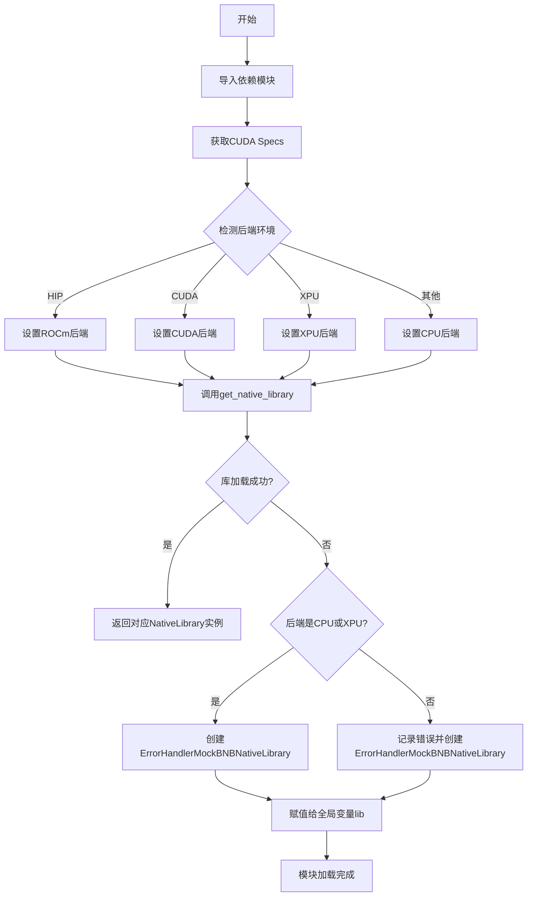
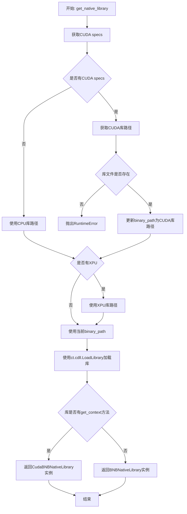
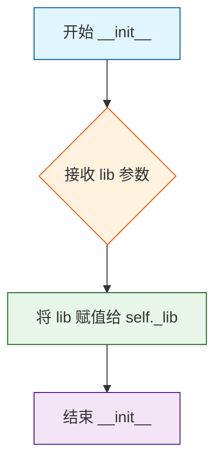
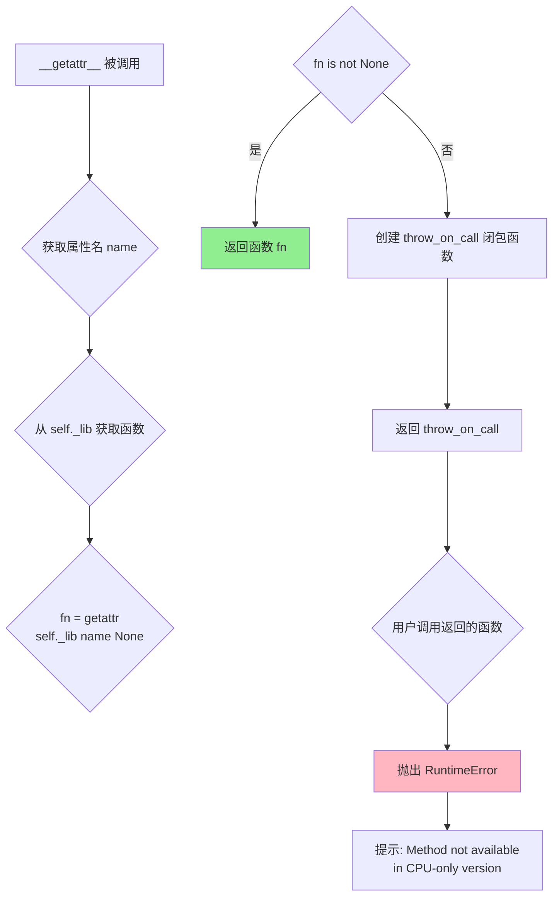
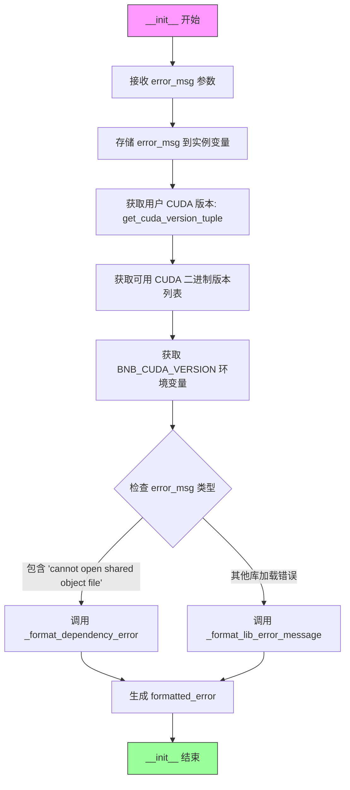
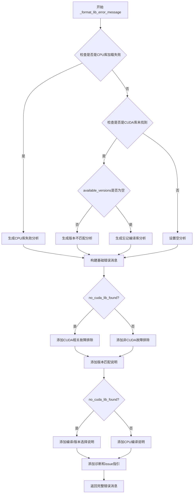
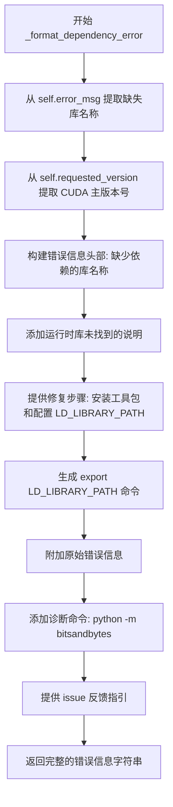
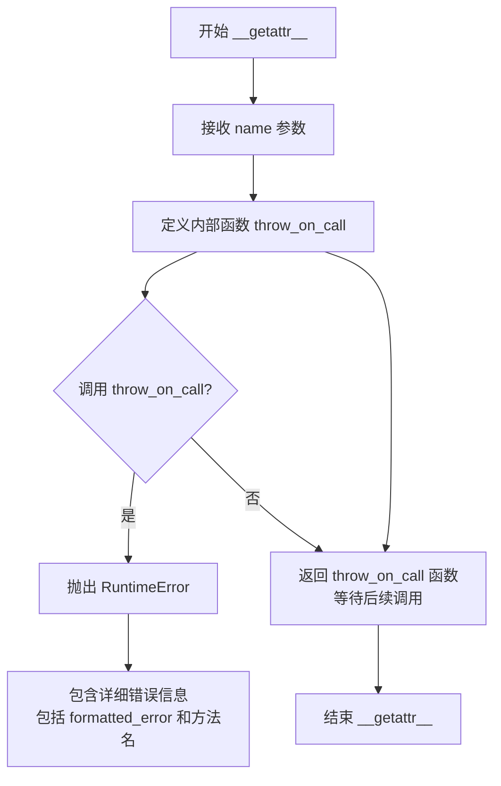
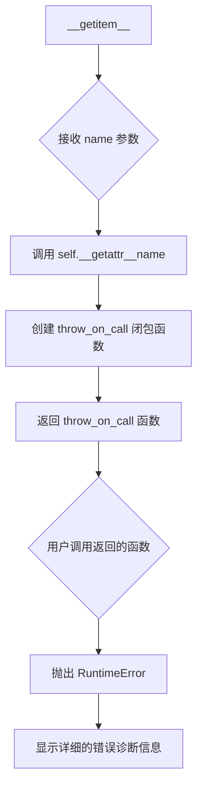

# `bitsandbytes\bitsandbytes\cextension.py` 详细设计文档

该文件负责bitsandbytes库的原生底层库加载与初始化，根据CUDA/ROCm/XPU/CPU环境动态选择对应后端，并提供详细的错误诊断信息以帮助用户解决库加载失败的问题。

## 整体流程



## 类结构

```
BNBNativeLibrary (原生库基类)
├── CudaBNBNativeLibrary (CUDA原生库)
└── ErrorHandlerMockBNBNativeLibrary (错误处理模拟库)
```

## 全局变量及字段


### `ROCM_GPU_ARCH`
    
ROCm GPU架构信息

类型：`str`
    


### `ROCM_WARP_SIZE_64`
    
ROCm warp大小是否为64

类型：`bool`
    


### `HIP_ENVIRONMENT`
    
是否在HIP环境中

类型：`bool`
    


### `BNB_BACKEND`
    
当前使用的后端类型(CPU/CUDA/ROCm/XPU)

类型：`str`
    


### `lib`
    
加载后的原生库实例(全局变量)

类型：`BNBNativeLibrary`
    


### `BNBNativeLibrary._lib`
    
原生库实例

类型：`ct.CDLL`
    


### `BNBNativeLibrary.compiled_with_cuda`
    
是否编译了CUDA支持

类型：`bool`
    


### `CudaBNBNativeLibrary.compiled_with_cuda`
    
标记为支持CUDA

类型：`bool`
    


### `ErrorHandlerMockBNBNativeLibrary.error_msg`
    
原始错误消息

类型：`str`
    


### `ErrorHandlerMockBNBNativeLibrary.user_cuda_version`
    
用户CUDA版本

类型：`Optional[tuple[int, int]]`
    


### `ErrorHandlerMockBNBNativeLibrary.available_versions`
    
可用的预编译版本列表

类型：`list[str]`
    


### `ErrorHandlerMockBNBNativeLibrary.override_value`
    
BNB_CUDA_VERSION环境变量值

类型：`Optional[str]`
    


### `ErrorHandlerMockBNBNativeLibrary.requested_version`
    
请求的CUDA版本

类型：`str`
    


### `ErrorHandlerMockBNBNativeLibrary.formatted_error`
    
格式化后的错误消息

类型：`str`
    
    

## 全局函数及方法


### `get_cuda_bnb_library_path`

获取CUDA BNB原生库的磁盘路径，根据CUDA规范和环境变量 `BNB_CUDA_VERSION` 动态构建库文件名，支持CUDA和ROCm两种后端。

参数：

- `cuda_specs`：`CUDASpecs`，包含CUDA版本信息的规范对象，用于确定要加载的库的版本

返回值：`Path`，返回CUDA BNB原生库文件的完整磁盘路径。需要注意的是，返回的路径并不保证库文件实际存在。

#### 流程图

```mermaid
flowchart TD
    A[开始: get_cuda_bnb_library_path] --> B{检查 torch.version.hip}
    B -->|是ROCm| C[prefix = "rocm"]
    B -->|否| D[prefix = "cuda"]
    C --> E[构建基础库文件名]
    D --> E
    E --> F{检查环境变量 BNB_CUDA_VERSION}
    F -->|未设置| G[直接返回库路径]
    F -->|已设置| H{当前是ROCm环境?}
    H -->|是| I[抛出RuntimeError]
    H -->|否| J[用override_value替换版本号]
    J --> K[记录警告日志]
    K --> G
    G --> L[返回 PACKAGE_DIR / library_name]
    I --> L
```

#### 带注释源码

```python
def get_cuda_bnb_library_path(cuda_specs: CUDASpecs) -> Path:
    """
    Get the disk path to the CUDA BNB native library specified by the
    given CUDA specs, taking into account the `BNB_CUDA_VERSION` override environment variable.

    The library is not guaranteed to exist at the returned path.
    """

    # 根据PyTorch的hip版本判断当前环境是ROCm还是CUDA
    # torch.version.hip 在ROCm环境下为True，CUDA环境下为False
    prefix = "rocm" if torch.version.hip else "cuda"
    
    # 构造基础库文件名，格式: libbitsandbytes_{prefix}{cuda_version_string}{.so/.dll}
    # cuda_specs.cuda_version_string 包含如 "118" (代表11.8) 的版本信息
    library_name = f"libbitsandbytes_{prefix}{cuda_specs.cuda_version_string}{DYNAMIC_LIBRARY_SUFFIX}"

    # 检查是否有BNB_CUDA_VERSION环境变量覆盖
    override_value = os.environ.get("BNB_CUDA_VERSION")
    if override_value:
        # 使用正则表达式替换库名中的CUDA版本号
        # 例如: cuda118 -> cuda120 (当override_value="120"时)
        library_name = re.sub(r"cuda\d+", f"cuda{override_value}", library_name, count=1)
        
        # 如果在ROCm环境下检测到CUDA版本覆盖，报错并提示清除环境变量
        if torch.version.hip:
            raise RuntimeError(
                f"BNB_CUDA_VERSION={override_value} detected for ROCm!! \n"
                f"Clear the variable and retry: export BNB_CUDA_VERSION=\n"
            )
        
        # 记录警告日志，说明使用了非PyTorch默认CUDA版本的库
        logger.warning(
            f"WARNING: BNB_CUDA_VERSION={override_value} environment variable detected; loading {library_name}.\n"
            "This can be used to load a bitsandbytes version built with a CUDA version that is different from the PyTorch CUDA version.\n"
            "If this was unintended set the BNB_CUDA_VERSION variable to an empty string: export BNB_CUDA_VERSION=\n"
        )

    # 组合包目录路径和库文件名，返回完整路径
    # PACKAGE_DIR 是bitsandbytes包的安装目录
    return PACKAGE_DIR / library_name
```


### `get_available_cuda_binary_versions`

获取当前环境中可用的CUDA（或ROCm）二进制版本列表。该函数通过扫描bitsandbytes包目录下的原生库文件，解析文件名中嵌入的版本信息，并返回格式化后的版本号列表（如["11.8", "12.1"]）。

参数：该函数无参数。

返回值：`list[str]`，返回排序后的可用CUDA/ROCm版本号字符串列表。

#### 流程图

```mermaid
flowchart TD
    A[开始] --> B[构建库文件匹配模式<br/>lib_pattern = libbitsandbytes_{BNB_BACKEND.lower()}*{DYNAMIC_LIBRARY_SUFFIX}]
    B --> C[初始化空版本列表 versions]
    C --> D[遍历匹配的所有库文件]
    D --> E{当前库文件是否匹配版本正则}
    E -->|是| F[提取版本码 ver_code]
    E -->|否| G[跳过, 继续下一个]
    F --> H[计算主版本号 major = ver_code // 10]
    H --> I[计算次版本号 minor = ver_code % 10]
    I --> J[格式化为 {major}.{minor} 并加入列表]
    J --> G
    G --> K{是否还有库文件未遍历}
    K -->|是| D
    K -->|否| L[返回排序后的版本列表]
    L --> M[结束]
```

#### 带注释源码

```python
def get_available_cuda_binary_versions() -> list[str]:
    """
    Get formatted CUDA versions from existing library files using cuda_specs logic
    
    该函数扫描bitsandbytes包目录下的原生库文件,
    从文件名中解析出CUDA/ROCm版本信息并返回格式化的版本号列表。
    """
    # 构建库文件匹配模式,BNB_BACKEND为'CUDA'或'ROCm',DYNAMIC_LIBRARY_SUFFIX为动态库后缀(如'.so')
    # 例如: libbitsandbytes_cuda*.so
    lib_pattern = f"libbitsandbytes_{BNB_BACKEND.lower()}*{DYNAMIC_LIBRARY_SUFFIX}"
    
    # 存储解析出的版本号
    versions = []
    
    # 使用Path.glob查找所有匹配的库文件
    # Path(__file__).parent 指向当前文件所在目录(即bitsandbytes包目录)
    for lib in Path(__file__).parent.glob(lib_pattern):
        # 构建正则表达式匹配版本号
        # 例如: cuda118 -> 匹配 'cuda' 后面的数字 '118'
        pattern = rf"{BNB_BACKEND.lower()}(\d+)"
        match = re.search(pattern, lib.name)
        
        if match:
            # 提取版本码,如 '118'
            ver_code = int(match.group(1))
            
            # 解析主版本号: 118 // 10 = 11
            major = ver_code // 10
            
            # 解析次版本号: 118 % 10 = 8
            minor = ver_code % 10
            
            # 格式化为 '11.8' 形式并添加到列表
            versions.append(f"{major}.{minor}")
    
    # 返回排序后的版本列表
    return sorted(versions)
```


### `parse_cuda_version`

该函数用于将原始版本字符串（如环境变量中的 "118"）转换为标准格式的版本号（如 "11.8"），以便在库文件路径和版本匹配逻辑中使用。它是 `bitsandbytes` 库版本管理机制的关键组成部分，负责解析用户指定的 CUDA 版本覆盖值。

参数：

- `version_str`：`str`，原始版本字符串，通常来自 `BNB_CUDA_VERSION` 环境变量，例如 "118"

返回值：`str`，格式化后的版本字符串，例如 "11.8"。如果输入不是纯数字，则原样返回作为安全网。

#### 流程图

```mermaid
flowchart TD
    A[开始: parse_cuda_version] --> B{version_str.isdigit?}
    B -- 是 --> C[格式化版本: version_str[:-1] + '.' + version_str[-1]]
    C --> D[返回: "11.8"]
    B -- 否 --> E[直接返回原字符串]
    E --> D
    D --> F[结束]
```

#### 带注释源码

```python
def parse_cuda_version(version_str: str) -> str:
    """
    将原始版本字符串（例如环境变量中的 '118'）转换为格式化版本（例如 '11.8'）
    
    此函数用于处理 BNB_CUDA_VERSION 环境变量，用户可以通过设置该变量来
    加载与 PyTorch CUDA 版本不同的预编译库。
    
    参数:
        version_str: 原始版本字符串，通常是两位数的版本代码（如 "118" 表示 11.8）
    
    返回:
        格式化后的版本字符串，格式为 "主版本号.次版本号"（如 "11.8"）
        如果输入不是纯数字字符串，则直接返回原字符串作为安全降级方案
    """
    # 检查版本字符串是否全部由数字组成（例如 "118"、"12" 等）
    if version_str.isdigit():
        # 将 "118" 转换为 "11.8"：取除最后一位外的所有字符作为主版本号，
        # 最后一位作为次版本号
        return f"{version_str[:-1]}.{version_str[-1]}"
    
    # 如果不是纯数字（如已经格式化或包含其他字符），直接返回原字符串
    # 这是一种安全网策略，避免因格式异常导致程序崩溃
    return version_str
```

#### 关键组件信息

| 组件名称 | 一句话描述 |
|---------|-----------|
| `BNB_CUDA_VERSION` 环境变量 | 允许用户手动覆盖要加载的 CUDA 库版本 |
| `get_cuda_bnb_library_path()` | 根据 CUDA 规格获取对应库文件的磁盘路径 |
| `ErrorHandlerMockBNBNativeLibrary` | 库加载失败时的错误处理和诊断信息生成器 |
| `get_native_library()` | 加载并返回适当的 native 库（CPU/CUDA/ROCm/XPU） |

#### 潜在技术债务与优化空间

1. **版本解析逻辑局限性**：当前函数仅支持两位数版本号（如 118 → 11.8），对于三位数版本号（如 1100 → 11.00）会产生错误结果。建议增加对三位数版本的支持或使用更严格的版本格式验证。

2. **缺乏输入验证**：函数未验证输入是否为空字符串或 `None`，可能导致意外行为。添加类型检查和输入验证将提高健壮性。

3. **错误处理不一致**：在文件其他位置有更详细的错误处理逻辑，但此函数采用静默降级策略，可能导致后续使用时难以追踪问题根源。

#### 其他项目

- **设计目标**：提供一种简单的方式来覆盖 bitsandbytes 库使用的 CUDA 版本，使得用户可以在 PyTorch CUDA 版本与预编译库版本不匹配时继续使用预编译二进制文件。

- **约束条件**：
  - 输入必须是字符串类型
  - 纯数字字符串应转换为 `major.minor` 格式
  - 非标准格式应原样返回以保证兼容性

- **调用上下文**：此函数被 `ErrorHandlerMockBNBNativeLibrary.__init__()` 调用，用于解析 `BNB_CUDA_VERSION` 环境变量，并生成版本相关的错误诊断信息。


### `get_native_library`

加载并返回原生库实例。该函数根据当前环境（CUDA/ROCm/XPU/CPU）动态选择并加载对应的原生库文件，返回适当的原生库包装类。

参数：

- 该函数无参数

返回值：`BNBNativeLibrary`，返回加载后的原生库实例，可能是 `CudaBNBNativeLibrary`（CUDA环境）或 `BNBNativeLibrary`（CPU环境）

#### 流程图



#### 带注释源码

```
def get_native_library() -> BNBNativeLibrary:
    """
    Load CUDA library XOR CPU, as the latter contains a subset of symbols of the former.
    """
    # 步骤1: 获取当前平台的CUDA specs（包含CUDA版本等信息）
    cuda_specs = get_cuda_specs()
    # 步骤2: 默认使用CPU库的路径作为fallback
    binary_path = PACKAGE_DIR / f"libbitsandbytes_cpu{DYNAMIC_LIBRARY_SUFFIX}"

    # 步骤3: 如果检测到CUDA环境（cuda_specs不为None）
    if cuda_specs:
        # 根据CUDA specs获取对应的BNB库路径
        cuda_binary_path = get_cuda_bnb_library_path(cuda_specs)

        # 检查CUDA库文件是否存在，不存在则抛出错误
        if not cuda_binary_path.exists():
            raise RuntimeError(f"Configured {BNB_BACKEND} binary not found at {cuda_binary_path}")

        # 更新binary_path为CUDA库路径
        binary_path = cuda_binary_path

    # 步骤4: 检查是否是XPU环境
    if torch._C._has_xpu:
        # 使用XPU专用的库路径覆盖
        binary_path = PACKAGE_DIR / f"libbitsandbytes_xpu{DYNAMIC_LIBRARY_SUFFIX}"

    # 记录debug日志，显示正在加载的库路径
    logger.debug(f"Loading bitsandbytes native library from: {binary_path}")

    # 步骤5: 使用ctypes加载动态库
    dll = ct.cdll.LoadLibrary(str(binary_path))

    # 步骤6: 判断加载的是否为CUDA编译的库（CUDA库会暴露get_context方法）
    if hasattr(dll, "get_context"):  # only a CUDA-built library exposes this
        # 返回CUDA专用的库包装类（包含额外的CUDA初始化逻辑）
        return CudaBNBNativeLibrary(dll)

    # 返回通用的库包装类（CPU或ROCm）
    return BNBNativeLibrary(dll)
```


### `BNBNativeLibrary.__init__`

初始化原生库实例，将传入的 CDLL 对象存储为类的内部属性，以便后续通过该类访问原生库中的函数。

参数：

- `lib`：`ct.CDLL`，原生库的 CDLL 实例，包含要调用的原生函数

返回值：`None`，无返回值（`__init__` 方法）

#### 流程图



#### 带注释源码

```python
class BNBNativeLibrary:
    """
    原生库的 Python 包装类，提供对 bitsandbytes 原生 C/C++ 函数的访问。
    
    类字段:
        _lib: ct.CDLL - 存储原生库的 CDLL 实例
        compiled_with_cuda: bool - 标记该库是否使用 CUDA 编译
    """
    
    _lib: ct.CDLL  # 原生库实例，通过 ctypes.CDLL 加载
    compiled_with_cuda = False  # 默认值为 False，表示非 CUDA 版本

    def __init__(self, lib: ct.CDLL):
        """
        初始化 BNBNativeLibrary 实例。
        
        参数:
            lib: ct.CDLL - 原生库的 CDLL 对象，通常通过 ctypes.cdll.LoadLibrary 加载
        
        行为:
            将传入的 lib 参数存储到实例属性 _lib 中，供后续方法调用
        """
        self._lib = lib  # 将原生库实例保存到实例属性
```


### `BNBNativeLibrary.__getattr__(name)`

动态获取库函数属性，当访问 BNBNativeLibrary 实例上不存在的属性时触发该方法。该方法首先尝试从底层 CDLL 对象获取对应的函数，如果不存在则返回一个会在调用时抛出 RuntimeError 的占位函数，以提供友好的错误提示。

参数：

- `name`：`str`，要获取的属性名称（即库函数名称）

返回值：`Callable`，如果底层库中存在该函数则返回该函数对象；否则返回一个抛出 RuntimeError 的可调用对象

#### 流程图



#### 带注释源码

```python
@functools.cache  # noqa: B019
def __getattr__(self, name):
    """
    动态获取库函数属性。
    
    当访问 BNBNativeLibrary 实例上不存在的属性时，Python 会自动调用此方法。
    该方法实现了惰性加载：只有在首次访问某个函数时才会从底层 CDLL 对象获取，
    后续访问会通过 functools.cache 缓存的结果直接返回。
    
    参数:
        name (str): 要获取的函数或属性的名称
        
    返回:
        function: 如果底层库中存在该名称的函数，返回对应的函数对象；
                  否则返回一个调用时会抛出 RuntimeError 的占位函数
    """
    
    # 尝试从底层 CDLL 库对象获取指定名称的函数
    # getattr 的第三个参数为默认值，当属性不存在时返回 None 而不是抛出 AttributeError
    fn = getattr(self._lib, name, None)

    # 如果成功获取到函数，直接返回
    if fn is not None:
        return fn

    # 库中不存在该函数，创建一个闭包函数作为占位符
    # 这个设计允许用户在 CPU-only 模式下导入模块而不立即报错，
    # 只有在实际调用该函数时才会抛出有意义的错误信息
    def throw_on_call(*args, **kwargs):
        """
        占位函数，当用户尝试调用不存在的库函数时触发。
        
        参数:
            *args: 任意位置参数（会被忽略）
            **kwargs: 任意关键字参数（会被忽略）
            
        抛出:
            RuntimeError: 提示用户该方法在 CPU-only 版本中不可用
        """
        raise RuntimeError(
            f"Method '{name}' not available in CPU-only version of bitsandbytes.\n"
            "Reinstall with GPU support or use CUDA-enabled hardware."
        )

    # 返回占位函数，而不是立即抛出异常
    # 这样可以保持 API 的一致性，让用户在尝试调用时才感知到功能不可用
    return throw_on_call
```


### `BNBNativeLibrary.__getitem__`

该方法是 `BNBNativeLibrary` 类的索引访问特殊方法，通过委托给 `__getattr__` 实现对底层原生库函数的无缝访问，支持类似字典的 `lib["function_name"]` 语法来获取库函数。

参数：

- `item`：任意类型，通过索引访问时使用的键，通常为字符串类型，表示要访问的库函数名称

返回值：任意类型，成功时返回对应的库函数对象；若函数不存在，则返回一个调用时抛出 `RuntimeError` 的函数对象

#### 流程图

```mermaid
flowchart TD
    A[开始 __getitem__] --> B[调用 self.__getattr__(item)]
    B --> C{底层CDLL库中是否存在该名称的函数?}
    C -->|是| D[返回找到的函数对象 fn]
    C -->|否| E[创建 throw_on_call 函数]
    E --> F[返回 throw_on_call 函数]
    D --> G[结束]
    F --> G
    
    subgraph __getattr__ 内部
    B -.-> H[getattr self._lib name None]
    end
```

#### 带注释源码

```python
def __getitem__(self, item):
    """
    通过索引访问库函数
    
    该方法是Python的特殊方法，支持使用下标语法访问对象属性。
    在BNBNativeLibrary中，它委托给__getattr__来查找底层的原生库函数。
    
    使用示例:
        library = BNBNativeLibrary(cdll)
        func = library['function_name']  # 获取名为function_name的函数
    """
    # 委托给 __getattr__ 方法处理实际的函数查找逻辑
    # 这样可以复用 __getattr__ 中的缓存和错误处理逻辑
    return self.__getattr__(item)
```


### `CudaBNBNativeLibrary.__init__`

该方法是 `CudaBNBNativeLibrary` 类的构造函数，用于初始化CUDA版本的bitsandbytes原生库封装器。它继承自 `BNBNativeLibrary` 基类，在调用父类初始化后，配置三个关键CUDA原生库函数（`get_context`、`get_cusparse`、`cget_managed_ptr`）的返回类型为 `c_void_p`，以确保与Python ctypes正确交互。

参数：

- `lib`：`ct.CDLL`，代表已加载的CUDA原生库（libbitsandbytes_cuda），用于后续函数调用和属性访问

返回值：`None`，该方法为构造函数，不返回任何值

#### 流程图

```mermaid
flowchart TD
    A[开始 __init__] --> B[调用 super().__init__(lib)]
    B --> C[设置 lib.get_context.restype = c_void_p]
    C --> D[设置 lib.get_cusparse.restype = c_void_p]
    D --> E[设置 lib.cget_managed_ptr.restype = c_void_p]
    E --> F[结束 __init__]
```

#### 带注释源码

```python
class CudaBNBNativeLibrary(BNBNativeLibrary):
    """
    CUDA版本的原生库封装器，继承自BNBNativeLibrary
    用于与CUDA编译的bitsandbytes原生库进行交互
    """
    compiled_with_cuda = True  # 类属性，标记是否使用CUDA编译

    def __init__(self, lib: ct.CDLL):
        """
        初始化CUDA原生库封装器
        
        参数:
            lib: ct.CDLL - 已加载的CUDA原生库实例
        """
        # 调用父类BNBNativeLibrary的构造函数
        # 内部将lib赋值给self._lib，作为后续getattr的代理对象
        super().__init__(lib)
        
        # 设置 get_context 函数的返回类型为 void指针
        # get_context 用于获取CUDA上下文句柄
        lib.get_context.restype = ct.c_void_p
        
        # 设置 get_cusparse 函数的返回类型为 void指针
        # get_cusparse 用于获取cuSPARSE库句柄
        lib.get_cusparse.restype = ct.c_void_p
        
        # 设置 cget_managed_ptr 函数的返回类型为 void指针
        # cget_managed_ptr 用于获取托管内存指针
        lib.cget_managed_ptr.restype = ct.c_void_p
```


### `ErrorHandlerMockBNBNativeLibrary.__init__`

初始化错误处理模拟库处理器，捕获原始错误信息并收集系统环境数据（CUDA版本、可用二进制版本、环境变量等），根据错误类型预生成详细的故障排除指导信息，以便在后续调用原生方法时提供诊断。

参数：

-  `error_msg`：`str`，从原生库加载失败处捕获的原始错误消息字符串

返回值：`None`，无返回值（Python 魔术方法默认返回 None）

#### 流程图



#### 带注释源码

```
def __init__(self, error_msg: str):
    """
    初始化 ErrorHandlerMockBNBNativeLibrary 实例。
    
    此方法在原生库加载失败时作为回退机制被调用，它会：
    1. 捕获原始错误信息
    2. 收集当前系统的 CUDA/ROCm 环境信息
    3. 预生成详细的错误诊断和故障排除指南
    
    Args:
        error_msg: 从原生库加载失败处捕获的原始错误消息
        
    Returns:
        None
        
    Note:
        选择延迟报告错误（直到方法被调用而非导入时）是为了保持向后兼容性，
        避免因缺少 GPU 依赖而在 CPU-only 环境中无法导入库
    """
    # 存储原始错误消息，供后续诊断使用
    self.error_msg = error_msg
    
    # 获取用户 PyTorch 编译时链接的 CUDA 版本
    # 返回格式: (major, minor, patch) 或 None
    self.user_cuda_version = get_cuda_version_tuple()
    
    # 扫描包目录获取当前可用的预编译二进制版本列表
    # 用于版本匹配诊断
    self.available_versions = get_available_cuda_binary_versions()
    
    # 检查用户是否通过环境变量指定了自定义 CUDA 版本
    self.override_value = os.environ.get("BNB_CUDA_VERSION")
    
    # 根据环境变量或检测到的版本确定请求的 CUDA 版本
    # 优先级: BNB_CUDA_VERSION > PyTorch CUDA 版本 > "unknown"
    self.requested_version = (
        parse_cuda_version(self.override_value)  # 解析环境变量指定版本
        if self.override_value
        else f"{self.user_cuda_version[0]}.{self.user_cuda_version[1]}"  # 格式化为 "major.minor"
        if self.user_cuda_version
        else "unknown"
    )

    # 根据错误类型选择不同的错误格式化策略
    # 预生成错误消息可避免在每次方法调用时重复处理
    if "cannot open shared object file" in error_msg:
        # 场景: 缺少共享库依赖（如 libcudart.so）
        self.formatted_error = self._format_dependency_error()
    else: 
        # 场景: 库加载失败的其他情况（版本不匹配、文件不存在等）
        self.formatted_error = self._format_lib_error_message(
            available_versions=self.available_versions,
            # 格式化用户 CUDA 版本为字符串
            user_cuda_version=f"{self.user_cuda_version[0]}.{self.user_cuda_version[1]}"
            if self.user_cuda_version
            else "unknown",
            # 附加原始错误信息到诊断消息
            original_error=f"Original error: {self.error_msg}\n" if self.error_msg else "",
            requested_version=self.requested_version,
        )
```


### `ErrorHandlerMockBNBNativeLibrary._format_lib_error_message`

格式化库加载失败时的详细错误消息，根据错误类型（CUDA版本不匹配、缺少预编译二进制文件、CPU库加载失败等）生成针对性的故障排除指南。

参数：

- `self`：`ErrorHandlerMockBNBNativeLibrary`，类的实例本身
- `available_versions`：`list[str]`，可用的预编译 CUDA/ROCm 版本列表
- `user_cuda_version`：`str`，检测到的 PyTorch CUDA 版本（如 "11.8"）
- `original_error`：`str`，原始库加载错误消息，默认为空字符串
- `requested_version`：`Optional[str]`，请求的 CUDA 版本（来自 BNB_CUDA_VERSION 环境变量），可选参数

返回值：`str`，格式化的详细错误消息，包含错误分析、故障排除步骤和诊断信息

#### 流程图



#### 带注释源码

```python
def _format_lib_error_message(
    self,
    available_versions: list[str],
    user_cuda_version: str,
    original_error: str = "",
    requested_version: Optional[str] = None,
) -> str:
    """Format detailed error message for library loading failures"""
    # 初始化分析字符串，根据错误类型填充不同内容
    analysis = ""
    # 检测是否是CPU库加载失败
    no_cpu_lib_found = "libbitsandbytes_cpu.so: cannot open" in original_error
    # 检测是否是CUDA/ROCm库未找到
    no_cuda_lib_found = f"{BNB_BACKEND} binary not found" in original_error

    # 如果是CPU库加载失败，生成相应错误分析
    if no_cpu_lib_found:
        analysis = "\n🚨 Failed to load CPU-only bitsandbytes library 🚨\n\n"

    # 如果是CUDA库未找到，根据available_versions生成不同分析
    elif no_cuda_lib_found:
        # 将可用版本列表格式化为可读字符串
        version_list_str = "\n  - " + "\n  - ".join(available_versions) if available_versions else "NONE"
        # 如果有可用版本，生成版本不匹配错误
        analysis = (
            (
                f"\n🚨 {BNB_BACKEND} VERSION MISMATCH 🚨\n"
                f"Requested {BNB_BACKEND} version:          {requested_version}\n"
                f"Detected PyTorch {BNB_BACKEND} version:   {user_cuda_version}\n"
                f"Available pre-compiled versions: {version_list_str}\n\n"
                "This means:\n"
                "The version you're trying to use is NOT distributed with this package\n\n"
            )
            # 如果没有可用版本，提示需要从源码编译
            if available_versions
            else "\n🚨 Forgot to compile the bitsandbytes library? 🚨\n"
            "1. You're not using the package but checked-out the source code\n"
            "2. You MUST compile from source\n\n"
        )

    # 基础错误消息前缀
    base_msg = "Attempted to use bitsandbytes native library functionality but it's not available.\n\n"

    # 根据是否是CUDA库未找到，生成不同的故障排除说明
    troubleshooting = (
        (
            f"This typically happens when:\n"
            f"1. bitsandbytes doesn't ship with a pre-compiled binary for your {BNB_BACKEND} version\n"
            f"2. The library wasn't compiled properly during installation from source\n\n"
        )
        if no_cuda_lib_found
        # 否则说明是从源码checkout但torch未检测到CUDA
        else f"This typically happens when you checked the code out from source and your torch installation doesn't detect {BNB_BACKEND} on your machine.\n\n"
    )

    # 如果是CUDA库未找到，添加版本匹配说明
    note = (
        (
            f"To make bitsandbytes work, the compiled library version MUST exactly match the linked {BNB_BACKEND} version.\n"
            f"If your {BNB_BACKEND} version doesn't have a pre-compiled binary, you MUST compile from source.\n\n"
        )
        if no_cuda_lib_found
        else ""
    )

    # 根据不同环境（CUDA/ROCm/CPU）生成不同的编译指导
    compile_instructions = (
        # 如果不是CUDA库未找到（即CPU库加载失败），提供CPU编译说明
        ("COMPILE FROM SOURCE for CPU-only:\n  `cmake -DCOMPUTE_BACKEND=cpu -S . && make`\n\n")
        if not no_cuda_lib_found
        # 如果是CUDA库未找到，提供CUDA编译或使用BNB_CUDA_VERSION的选项
        else (
            "You have two options:\n"
            "1. COMPILE FROM SOURCE (required if no binary exists):\n"
            "   https://huggingface.co/docs/bitsandbytes/main/en/installation#cuda-compile\n"
            "2. Use BNB_CUDA_VERSION to specify a DIFFERENT CUDA version from the detected one, which is installed on your machine and matching an available pre-compiled version listed above\n\n"
        )
        # 如果是ROCm环境，提供ROCm编译指导链接
        if not HIP_ENVIRONMENT
        else (
            "You can COMPILE FROM SOURCE as mentioned here:\n"
            "   https://huggingface.co/docs/bitsandbytes/main/en/installation?backend=AMD+ROCm#amd-gpu\n"
        )
    )

    # 生成诊断命令和issue提交指导
    diagnostics = (
        f"🔍 Run this command for detailed diagnostics:\n"
        f"python -m bitsandbytes\n\n"
        f"If you've tried everything and still have issues:\n"
        f"1. Include ALL version info (operating system, bitsandbytes, pytorch, {BNB_BACKEND.lower()}, python)\n"
        f"2. Describe what you've tried in detail\n"
        f"3. Open an issue with this information:\n"
        f"   https://github.com/bitsandbytes-foundation/bitsandbytes/issues\n\n"
    )

    # 拼接所有部分返回完整错误消息
    return f"{analysis}{base_msg}{troubleshooting}{note}{compile_instructions}{original_error}\n{diagnostics}"
```


### `ErrorHandlerMockBNBNativeLibrary._format_dependency_error`

该方法用于格式化依赖缺失错误信息，当原生库加载失败且错误信息包含"cannot open shared object file"时会调用此方法。它会从错误信息中提取缺失的库名称，根据请求的CUDA版本生成详细的故障排除指南，帮助用户解决LD_LIBRARY_PATH中缺少CUDA运行时库的问题。

参数：

- （无显式参数，隐含self参数）
  - `self`：`ErrorHandlerMockBNBNativeLibrary` 实例，包含 `error_msg`、`requested_version` 等实例属性

返回值：`str`，返回格式化的详细错误信息，包含缺失的库名称、CUDA/ROCm版本要求、LD_LIBRARY_PATH配置说明以及诊断和反馈指引。

#### 流程图



#### 带注释源码

```python
def _format_dependency_error(self) -> str:
    """Format error message for missing shared libraries"""
    # 从错误消息中提取缺失的库名称（冒号前部分）
    error_parts = self.error_msg.split(":")
    missing_lib = error_parts[0].strip() if len(error_parts) > 0 else "unknown library"
    
    # 从请求版本中提取主版本号（如 "11.8" -> "11"）
    cuda_major_version = (
        self.requested_version.split(".")[0] 
        if "." in self.requested_version 
        else self.requested_version
    )

    # 组装完整的错误提示信息
    return (
        f"\n🚨 {BNB_BACKEND} SETUP ERROR: Missing dependency: {missing_lib} 🚨\n\n"
        f"{BNB_BACKEND} {cuda_major_version}.x runtime libraries were not found in the LD_LIBRARY_PATH.\n\n"
        f"To fix this, make sure that:\n"
        f"1. You have installed {BNB_BACKEND} {cuda_major_version}.x toolkit on your system\n"
        f"2. The {BNB_BACKEND} runtime libraries are in your LD_LIBRARY_PATH\n\n"
        f"You can add them with (and persist the change by adding the line to your .bashrc):\n"
        # 根据是否为 HIP 环境选择 lib64 或 lib 路径
        f"   export LD_LIBRARY_PATH=$LD_LIBRARY_PATH:/path/to/{BNB_BACKEND.lower()}-{cuda_major_version}.x/\
                {'lib64' if not HIP_ENVIRONMENT else 'lib'}\n\n"
        f"Original error: {self.error_msg}\n\n"
        f"🔍 Run this command for detailed diagnostics:\n"
        f"python -m bitsandbytes\n\n"
        f"If you've tried everything and still have issues:\n"
        f"1. Include ALL version info (operating system, bitsandbytes, pytorch, {BNB_BACKEND.lower()}, python)\n"
        f"2. Describe what you've tried in detail\n"
        f"3. Open an issue with this information:\n"
        f"   https://github.com/bitsandbytes-foundation/bitsandbytes/issues\n\n"
    )
```


### `ErrorHandlerMockBNBNativeLibrary.__getattr__`

返回一个新的模拟函数，当该函数被调用时，会抛出包含详细错误信息的 RuntimeError，而不是在属性访问时立即报错。这种延迟错误机制可以避免在模块导入时就中断，并提供更友好的诊断信息。

参数：

- `name`：`str`，被访问的属性或方法名称

返回值：`Callable`，返回一个可调用函数（throw_on_call），该函数被调用时抛出 RuntimeError

#### 流程图



#### 带注释源码

```python
def __getattr__(self, name):
    """Return a dummy function that throws when called, rather than on attribute access"""

    # 定义内部函数，当被调用时抛出 RuntimeError
    # 使用闭包捕获 self.formatted_error 和 name
    def throw_on_call(*args, **kwargs):
        # 抛出运行时错误，包含预格式化的错误信息
        # formatted_error 在 __init__ 中已经根据错误类型生成
        # 包含依赖缺失、版本不匹配、编译问题等诊断信息
        raise RuntimeError(f"{self.formatted_error}Native code method attempted to call: lib.{name}()")

    # 返回这个函数，而不是立即执行
    # 这样属性访问不会报错，只有实际调用 native 方法时才会报错
    # 实现了延迟错误机制，保持向后兼容性
    return throw_on_call
```


### `ErrorHandlerMockBNBNativeLibrary.__getitem__`

该方法允许通过索引访问模拟函数，当访问时返回一个在调用时抛出错误信息的虚拟函数，用于延迟错误处理以保持向后兼容性。

参数：

- `name`：任意类型，索引访问的属性名称

返回值：函数类型，返回一个 `throw_on_call` 虚拟函数，该函数在被调用时抛出详细的 RuntimeError

#### 流程图



#### 带注释源码

```python
def __getitem__(self, name):
    """
    通过索引访问模拟函数
    
    该方法是 Python 的特殊方法，支持 obj[name] 形式的访问。
    它将访问请求委托给 __getattr__，返回一个延迟错误抛出的虚拟函数，
    避免在导入时立即崩溃，保持向后兼容性。
    """
    return self.__getattr__(name)  # 委托给 __getattr__ 处理
```

## 关键组件


### CUDA库路径解析与版本管理

负责根据CUDA规格获取对应版本的本地库路径，支持通过BNB_CUDA_VERSION环境变量覆盖默认版本，支持CUDA/ROCm前缀适配。

### BNBNativeLibrary 基础原生库封装类

使用ctypes加载原生库的封装类，通过__getattr__实现惰性加载和运行时方法解析，CPU版本通过throw_on_call抛出运行时错误提示需要GPU支持。

### CudaBNBNativeLibrary CUDA原生库封装类

继承自BNBNativeLibrary，设置CUDA特有的get_context、get_cusparse、cget_managed_ptr等函数返回类型为c_void_p，用于获取CUDA运行时上下文和cuSPARSE句柄。

### ErrorHandlerMockBNBNativeLibrary 错误处理模拟库类

当原生库加载失败时的降级处理类，延迟错误抛出时机以保持导入兼容性，根据错误类型（缺失依赖、版本不匹配、库文件不存在）生成详细的故障排除指南，支持CPU/XPU回退模式。

### get_available_cuda_binary_versions 可用版本检测函数

扫描包目录查找所有预编译的bitsandbytes库文件，使用正则表达式提取版本号并格式化为"主版本.次版本"形式返回排序后的版本列表。

### parse_cuda_version 版本字符串解析函数

将原始版本字符串（如"118"）转换为标准格式（如"11.8"），处理环境变量BNB_CUDA_VERSION传入的紧凑版本表示。

### get_native_library 主库加载函数

根据检测到的计算后端（CUDA/ROCm/XPU/CPU）动态选择并加载对应的原生库，设置函数返回类型，处理库加载异常并返回相应的库封装实例或多后端错误处理模拟对象。

### 后端检测与环境变量

通过torch.version.hip、torch.cuda.is_available()、torch._C._has_xpu自动检测运行环境，设置HIP_ENVIRONMENT、BNB_BACKEND全局变量标识当前计算平台。


## 问题及建议


### 已知问题

-   **全局可变状态导致模块级副作用**：模块级别的全局变量 `ROCM_GPU_ARCH`、`ROCM_WARP_SIZE_64`、`HIP_ENVIRONMENT`、`BNB_BACKEND` 和 `lib` 在导入时就被赋值，这会导致模块难以测试、难以重置状态，且在多线程环境下可能导致竞态条件。
-   **模块导入时执行关键逻辑**：`get_native_library()` 在模块导入时被调用，这意味着任何导入该模块的代码都会触发库加载逻辑，增加了启动时间并可能引发难以追踪的初始化错误。
-   **`get_available_cuda_binary_versions()` 的文件系统扫描开销**：该函数在每次调用时都会遍历目录查找可用的 CUDA 库版本，虽然使用了 `Path.glob()`，但在频繁调用时会造成性能开销，应该进行缓存。
-   **版本解析逻辑重复**：版本字符串解析逻辑在 `parse_cuda_version()` 函数和 `ErrorHandlerMockBNBNativeLibrary.__init__()` 方法中都有实现，可能导致行为不一致。
-   **类型注解不一致**：部分函数使用了新版类型注解如 `list[str]`，但错误处理相关方法缺乏类型注解，影响代码可维护性。
-   **硬编码的字符串和魔法数字**：如 `"cuda"` 和 `"rocm"` 前缀、CUDA 版本除以 10 和取模的逻辑等散落在多处，应提取为常量。
-   **正则表达式重复编译**：在 `get_cuda_bnb_library_path()` 和 `get_available_cuda_binary_versions()` 中使用了正则表达式，但没有预编译，运行时会有一定开销。
-   **异常处理降级后缺乏日志记录**：当 `BNB_BACKEND` 为 "CPU" 或 "XPU" 时，`ErrorHandlerMockBNBNativeLibrary` 被静默加载，没有任何日志输出，用户可能不清楚实际使用的是模拟对象。

### 优化建议

-   **引入懒加载机制**：将全局变量和库加载逻辑封装到函数或类中，使用延迟初始化模式，仅在实际需要时才加载原生库。
-   **添加缓存装饰器**：为 `get_available_cuda_binary_versions()` 添加 `@functools.lru_cache` 装饰器，避免重复扫描文件系统。
-   **统一版本解析逻辑**：将版本解析逻辑集中到 `parse_cuda_version()` 函数中，并在 `ErrorHandlerMockBNBNativeLibrary` 中复用。
-   **提取常量定义**：将前缀字符串、库文件名模式、错误消息模板等提取为模块级常量或配置类。
-   **预编译正则表达式**：将正则表达式模式在模块顶部预编译为 `re.Pattern` 对象，提高匹配效率。
-   **补充日志和警告**：在加载 `ErrorHandlerMockBNBNativeLibrary` 作为降级方案时，记录适当的警告日志，提示用户当前使用的是 CPU-only 或模拟模式。
-   **完善类型注解**：为所有公共方法添加完整的类型注解，包括参数和返回值类型，提高代码可读性和 IDE 支持。
-   **考虑使用 dataclass 或 namedtuple**：对于 `CUDASpecs` 的相关返回结果，考虑使用结构化数据类型替代字典或元组，提高代码清晰度。


## 其它


### 设计目标与约束

本模块的核心设计目标是实现bitsandbytes原生库的跨平台动态加载，支持CUDA、ROCm、CPU和XPU四种计算后端，并确保加载的库版本与PyTorch环境中的CUDA版本严格匹配。主要约束包括：(1) 库版本必须精确匹配，否则抛出明确的错误信息；(2) 需要兼容预编译二进制和源码编译两种安装场景；(3) 必须在导入时完成库加载，但延迟实际方法调用以保持向后兼容性；(4) 支持通过环境变量BNB_CUDA_VERSION覆盖自动检测的CUDA版本。

### 错误处理与异常设计

本代码实现了多层次的错误处理机制，主要分为三类场景：第一类是库文件不存在或路径错误，通过RuntimeError抛出并包含详细的文件路径信息；第二类是CUDA版本不匹配，这是最核心的错误场景，ErrorHandlerMockBNBNativeLibrary类会分析用户CUDA版本与可用预编译版本列表，给出详细的版本对比和编译指南；第三类是缺少共享依赖库（如libcudart.so），会提取缺失的库名并提供LD_LIBRARY_PATH配置指导。所有错误都通过ErrorHandlerMockBNBNativeLibrary延迟到实际调用原生方法时才抛出，避免在import阶段就中断程序。错误信息采用分级结构：分析问题类型 → 解释原因 → 提供解决步骤 → 编译指南 → 诊断命令。

### 数据流与状态机

库加载流程遵循以下状态转换：初始化 → 检测计算后端(通过torch.version.hip/torch.cuda.is_available()/torch._C._has_xpu) → 获取CUDA规范(CUDASpecs) → 构建库文件路径 → 验证文件存在性 → 加载动态库(ct.cdll.LoadLibrary) → 实例化对应包装类。关键分支点包括：(1) 当cuda_specs存在时优先加载CUDA库，否则回退到CPU库；(2) XPU环境下会覆盖前面的CUDA/CPU选择；(3) 库加载失败时，根据后端类型决定是否使用ErrorHandlerMockBNBNativeLibrary（CPU/XPU允许无库运行，CUDA/ROCm必须加载成功）。

### 外部依赖与接口契约

本模块依赖以下外部组件：(1) PyTorch的torch.version.hip、torch.cuda.is_available()、torch._C._has_xpu用于平台检测；(2) ctypes模块用于加载C动态库并定义函数签名；(3) bitsandbytes.consts中的DYNAMIC_LIBRARY_SUFFIX和PACKAGE_DIR定义库文件命名和搜索路径；(4) bitsandbytes.cuda_specs模块提供CUDA版本检测和GPU架构信息。与原生库的接口契约通过ctypes定义：get_context返回c_void_p上下文指针，get_cusparse返回c_void_p句柄，cget_managed_ptr返回c_void_p托管指针。这些函数仅在CUDA构建的库中暴露，CPU版本库不包含这些符号。

### 平台兼容性

本代码支持四种计算平台的动态库加载：CUDA平台通过torch.cuda.is_available()检测，加载libbitsandbytes_cuda*.so；ROCm平台通过torch.version.hip检测，加载libbitsandbytes_rocm*.so；CPU平台作为基础后端，始终存在libbitsandbytes_cpu.so；XPU平台通过torch._C._has_xpu检测，加载libbitsandbytes_xpu.so。库文件搜索基于PACKAGE_DIR（包目录），使用glob模式匹配可用版本。版本号格式处理支持两种输入：环境变量直接输入（如"118"转换为"11.8"）和从文件名提取（如cuda118提取为11.8）。

### 性能考量

代码中使用了functools.cache装饰器（@functools.cache）缓存__getattr__的方法查找结果，避免重复的getattr调用开销。库加载采用延迟策略：ErrorHandlerMockBNBNativeLibrary在实例化时不加载任何库，仅在真正调用原生方法时才触发错误。版本列表获取通过Path.glob一次扫描完成，结果缓存用于后续版本对比。整体设计倾向于在导入时完成一次性的库加载开销，而非运行时频繁切换。

### 安全性考量

库路径构建基于PACKAGE_DIR（包内固定目录），不直接使用用户输入的路径，避免路径遍历攻击。环境变量BNB_CUDA_VERSION虽然允许用户覆盖版本，但通过正则表达式限制替换格式，防止注入恶意命令。动态库加载使用ct.cdll.LoadLibrary，依赖操作系统的动态链接器安全机制。错误信息中不暴露敏感的内部路径或系统配置，仅提供通用的诊断指导。

### 配置与环境变量

本模块识别以下环境变量：(1) BNB_CUDA_VERSION：允许用户指定要加载的CUDA版本，覆盖自动检测结果，用于解决PyTorch CUDA版本与预编译库版本不一致的问题；(2) 其他通过torch和os.environ传递的系统环境变量如LD_LIBRARY_PATH（由用户系统配置，原生库加载时会间接使用）。配置优先级为：显式环境变量 > 自动检测 > 默认回退。

### 日志与可观测性

代码使用Python标准logging模块记录诊断信息。logger.debug记录实际加载的库文件路径，便于排查加载问题；logger.warning在检测到BNB_CUDA_VERSION覆盖时发出警告，提示可能存在版本不匹配；logger.error在库加载失败时记录完整错误堆栈。当库加载失败但后端为CPU或XPU时，系统降级为Mock库，不影响程序继续运行，但会记录详细错误供后续诊断。

    