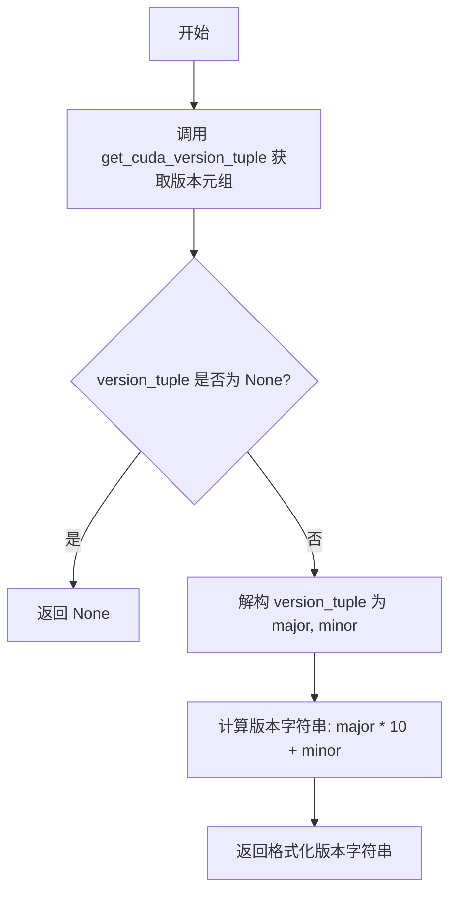
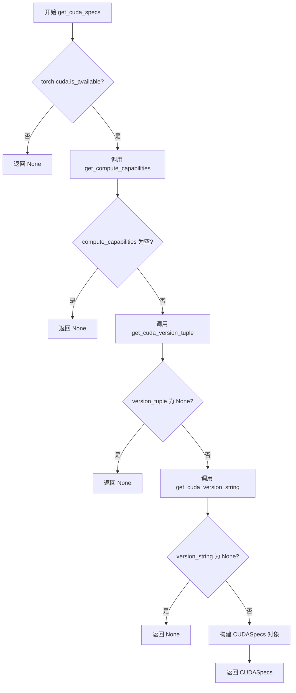

# `bitsandbytes\bitsandbytes\cuda_specs.py` 详细设计文档

该代码是一个GPU硬件信息检测工具库，用于获取CUDA/HIP（ROCm）计算能力、版本信息、ROCm GPU架构和warp size等硬件规格，为上层应用提供统一的GPU硬件抽象接口。

## 整体流程

```mermaid
graph TD
    A[开始] --> B{torch.cuda.is_available()}
    B -- 否 --> C[返回 None]
    B -- 是 --> D[get_compute_capabilities]
    D --> E{计算能力列表为空?}
    E -- 是 --> C
    E -- 否 --> F[get_cuda_version_tuple]
    F --> G{版本元组为空?}
    G -- 是 --> C
    G -- 否 --> H[get_cuda_version_string]
    H --> I{版本字符串为空?}
    I -- 是 --> C
    I -- 否 --> J[返回 CUDASpecs 对象]
    J --> K{检测ROCm?}
    K -- 是 --> L[get_rocm_gpu_arch]
    K -- 否 --> M[返回 unknown]
    L --> N[get_rocm_warpsize]
    N --> O[结束]
```

## 类结构

```
CUDASpecs (数据类)
    └── has_imma (属性方法)
```

## 全局变量及字段


### `CUDASpecs.highest_compute_capability`
    
最高计算能力版本

类型：`tuple[int, int]`
    


### `CUDASpecs.cuda_version_string`
    
CUDA版本字符串

类型：`str`
    


### `CUDASpecs.cuda_version_tuple`
    
CUDA版本元组

类型：`tuple[int, int]`
    
    

## 全局函数及方法


### `get_compute_capabilities`

获取当前系统中所有可用的 CUDA 设备（包括 HIP 兼容设备）的计算能力（Compute Capability）列表，并对结果进行升序排序。

参数：

- （无参数）

返回值：`list[tuple[int, int]]`，返回所有 GPU 设备的计算能力列表。每个计算能力以 `(major, minor)` 元组形式表示，例如 `(8, 6)` 表示 Compute Capability 8.6。列表按计算能力升序排列。

#### 流程图

```mermaid
flowchart TD
    A([开始]) --> B[获取 GPU 设备数量]
    B --> C{设备数量 > 0?}
    C -->|否| D[返回空列表]
    C -->|是| E[初始化空列表]
    E --> F[遍历设备索引 i 从 0 到 device_count-1]
    F --> G[获取设备对象: torch.cuda.device(i)]
    G --> H[获取设备计算能力: torch.cuda.get_device_capability]
    H --> I[将 (major, minor) 元组添加到列表]
    I --> F
    F --> J{遍历完成?}
    J -->|否| F
    J -->|是| K[对列表进行升序排序]
    K --> L([返回排序后的计算能力列表])
```

#### 带注释源码

```python
def get_compute_capabilities() -> list[tuple[int, int]]:
    """
    获取所有 GPU 设备的计算能力列表。
    
    Returns:
        list[tuple[int, int]]: 按升序排列的 (major, minor) 计算能力元组列表。
    """
    # 使用生成器表达式遍历所有 GPU 设备
    # range(torch.cuda.device_count()) 获取系统中 CUDA 可用设备总数
    # torch.cuda.device(i) 获取索引为 i 的设备对象
    # torch.cuda.get_device_capability(device) 获取该设备的计算能力，返回 (major, minor) 元组
    # sorted(...) 对结果进行升序排序，确保返回值是有序的
    return sorted(
        torch.cuda.get_device_capability(torch.cuda.device(i))
        for i in range(torch.cuda.device_count())
    )
```


### `get_cuda_version_tuple`

获取CUDA或HIP运行时的版本号，并以元组形式返回主版本号和次版本号。如果CUDA/HIP不可用或版本解析失败，则返回None。该函数使用LRU缓存以避免重复解析。

参数：

- 该函数无参数

返回值：`Optional[tuple[int, int]]`，返回CUDA/HIP版本元组(major, minor)，如(11, 8)；若无法获取版本则返回None

#### 流程图

```mermaid
flowchart TD
    A[开始] --> B{检查 torch.version.cuda}
    B -->|有值| C[获取 version_str = torch.version.cuda]
    B -->|无值| D{检查 torch.version.hip}
    D -->|有值| E[获取 version_str = torch.version.hip]
    D -->|无值| F[返回 None]
    C --> G[分割版本字符串]
    E --> G
    G --> H{parts 长度 >= 2?}
    H -->|是| I[返回 tuple[int, int]]
    H -->|否| J[返回 None]
    I --> K[结束]
    F --> K
    J --> K
    style I fill:#90EE90
    style F fill:#FFB6C1
    style J fill:#FFB6C1
```

#### 带注释源码

```python
@lru_cache(None)  # 使用LRU缓存装饰器，缓存大小无限制，避免重复执行
def get_cuda_version_tuple() -> Optional[tuple[int, int]]:
    """Get CUDA/HIP version as a tuple of (major, minor)."""
    try:  # 捕获可能的属性访问异常
        if torch.version.cuda:  # 检查CUDA版本是否可用
            version_str = torch.version.cuda  # 获取CUDA版本字符串
        elif torch.version.hip:  # 检查HIP版本是否可用（ROCm）
            version_str = torch.version.hip  # 获取HIP版本字符串
        else:
            return None  # CUDA和HIP都不可用，返回None

        parts = version_str.split(".")  # 按"."分割版本字符串
        if len(parts) >= 2:  # 确保至少有主版本号和次版本号
            return tuple(map(int, parts[:2]))  # 转换并返回版本元组
        return None  # 版本格式不符合预期，返回None
    except (AttributeError, ValueError, IndexError):  # 捕获属性错误、转换错误、索引错误
        return None  # 任何异常都返回None
```


### `get_cuda_version_string`

获取CUDA/HIP版本字符串，返回格式如 "110" 表示 CUDA 11.0。

参数： 无

返回值：`Optional[str]`，返回 CUDA/HIP 版本字符串（如 "110" 表示 11.0），如果无法获取版本则返回 `None`。

#### 流程图



#### 带注释源码

```python
def get_cuda_version_string() -> Optional[str]:
    """Get CUDA/HIP version as a string."""
    # 调用 get_cuda_version_tuple 获取版本元组 (major, minor)
    version_tuple = get_cuda_version_tuple()
    
    # 如果无法获取版本元组，返回 None
    if version_tuple is None:
        return None
    
    # 解构获取主版本号和次版本号
    major, minor = version_tuple
    
    # 将版本号格式化为字符串，例如 11.0 -> "110", 10.2 -> "102"
    return f"{major * 10 + minor}"
```


### `get_cuda_specs`

获取完整的 CUDA/HIP 规格对象，包含最高计算能力、CUDA 版本字符串和版本元组信息。

参数：

- （无参数）

返回值：`Optional[CUDASpecs]`：返回包含 CUDA/HIP 规格的 `CUDASpecs` 对象，如果 CUDA 不可用或获取失败则返回 `None`

#### 流程图



#### 带注释源码

```python
def get_cuda_specs() -> Optional[CUDASpecs]:
    """Get CUDA/HIP specifications."""
    # 检查 CUDA 是否可用，若不可用则直接返回 None
    if not torch.cuda.is_available():
        return None

    try:
        # 获取所有设备的计算能力列表
        compute_capabilities = get_compute_capabilities()
        # 如果没有计算能力（无 GPU），返回 None
        if not compute_capabilities:
            return None

        # 获取 CUDA/HIP 版本元组 (major, minor)
        version_tuple = get_cuda_version_tuple()
        if version_tuple is None:
            return None

        # 获取版本字符串表示
        version_string = get_cuda_version_string()
        if version_string is None:
            return None

        # 构造并返回 CUDASpecs 数据类对象
        # highest_compute_capability 取计算能力列表中的最大值（最后一个元素）
        return CUDASpecs(
            highest_compute_capability=compute_capabilities[-1],
            cuda_version_string=version_string,
            cuda_version_tuple=version_tuple,
        )
    except Exception:
        # 捕获所有异常，返回 None 确保函数不会抛出异常
        return None
```


### `get_rocm_gpu_arch`

获取ROCm GPU架构标识符。该函数通过执行 `rocminfo` 命令并使用正则表达式解析输出来检测当前系统使用的ROCm GPU架构（如 gfx1100），如果检测失败或非ROCm环境则返回 "unknown"。

参数：

- 该函数无参数

返回值：`str`，返回ROCm GPU架构标识符（如 "gfx1100"），若无法检测则返回 "unknown"

#### 流程图

```mermaid
flowchart TD
    A[开始] --> B{torch.version.hip 是否为 True}
    B -->|是| C[执行 subprocess.run<br/>运行 'rocminfo' 命令]
    B -->|否| K[返回 'unknown']
    C --> D{命令执行成功?}
    D -->|否| H[记录错误日志]
    D -->|是| E{正则匹配 'Name:\s+gfx([a-zA-Z\d]+)'}
    E -->|匹配成功| F[返回 'gfx' + 匹配组1]
    E -->|匹配失败| G[返回 'unknown']
    H --> I{torch.cuda.is_available()?}
    I -->|是| J[记录警告日志]
    I -->|否| K
    J --> K
    F --> L[结束]
    G --> L
    K --> L
```

#### 带注释源码

```python
def get_rocm_gpu_arch() -> str:
    """Get ROCm GPU architecture."""
    # 获取当前模块的日志记录器
    logger = logging.getLogger(__name__)
    try:
        # 检查当前环境是否使用ROCm/HIP (HIP是AMD的CUDA兼容层)
        if torch.version.hip:
            # 执行 rocminfo 命令获取GPU详细信息
            # rocminfo 是ROCm工具包提供的命令行工具
            result = subprocess.run(
                ["rocminfo"],           # 要执行的命令
                capture_output=True,    # 捕获标准输出和错误
                text=True               # 将输出解码为字符串
            )
            # 使用正则表达式匹配GPU架构名称
            # 匹配模式: "Name: gfx<数字/字母组合>"
            # 例如: "Name: gfx1100" 或 "Name: gfx90a"
            match = re.search(r"Name:\s+gfx([a-zA-Z\d]+)", result.stdout)
            if match:
                # 匹配成功，提取架构标识符并返回
                # 例如: "gfx1100"
                return "gfx" + match.group(1)
            else:
                # rocminfo输出中未找到GPU架构信息
                return "unknown"
        else:
            # 当前环境不是ROCm (可能是NVIDIA CUDA或CPU环境)
            return "unknown"
    except Exception as e:
        # 捕获所有可能的异常:
        # - FileNotFoundError: rocminfo命令不存在
        # - subprocess相关异常
        # - 正则表达式匹配异常
        logger.error(f"Could not detect ROCm GPU architecture: {e}")
        # 检查CUDA是否可用，以提供更详细的警告信息
        if torch.cuda.is_available():
            logger.warning(
                """
ROCm GPU architecture detection failed despite ROCm being available.
                """,
            )
        # 发生任何异常都返回 'unknown' 作为降级处理
        return "unknown"
```


### `get_rocm_warpsize`

获取ROCm warp大小。该函数用于检测AMD ROCm平台的warp size（波前大小），如果检测失败则返回默认值；对于NVIDIA GPU则直接返回32。

参数：

- 该函数无参数

返回值：`int`，返回检测到的warp大小（ROCm环境返回64或检测值，NVIDIA环境返回32）

#### 流程图

```mermaid
flowchart TD
    A[开始 get_rocm_warpsize] --> B{torch.version.hip 是 ROCm 环境?}
    B -- 是 --> C[执行 subprocess.run 调用 rocminfo 命令]
    C --> D{命令执行成功?}
    D -- 是 --> E[正则匹配 Wavefront Size: XX 模式]
    E --> F{匹配成功?}
    F -- 是 --> G[返回匹配的 warp size 整数]
    F -- 否 --> H[返回默认值 64]
    D -- 否 --> I[捕获异常]
    I --> J[记录错误日志]
    J --> K{torch.cuda.is_available()?}
    K -- 是 --> L[记录警告日志]
    K -- 否 --> H
    L --> H
    B -- 否 --> M[返回 NVIDIA 默认值 32]
    H --> N[结束]
    G --> N
    M --> N
```

#### 带注释源码

```python
def get_rocm_warpsize() -> int:
    """Get ROCm warp size."""
    # 获取当前模块的日志记录器，用于记录错误和警告信息
    logger = logging.getLogger(__name__)
    try:
        # 检查当前环境是否为ROCm（AMD HIP）环境
        if torch.version.hip:
            # 执行 rocminfo 命令获取ROCm GPU详细信息
            # rocminfo 是ROCm提供的工具，用于显示GPU和平台信息
            result = subprocess.run(["rocminfo"], capture_output=True, text=True)
            
            # 使用正则表达式匹配波前大小
            # 匹配格式如 "Wavefront Size:   64(0x40)"
            # warp size 在AMD ROCm中称为 Wavefront Size
            match = re.search(r"Wavefront Size:\s+([0-9]{2})\(0x[0-9]{2}\)", result.stdout)
            if match:
                # 成功匹配，返回检测到的warp大小作为整数
                return int(match.group(1))
            else:
                # 未匹配到波前大小信息，返回安全的默认值64
                # 这是AMD ROCm常用的warp size
                return 64
        else:
            # 非ROCm环境（NVIDIA CUDA环境），NVIDIA GPU warp size固定为32
            return 32
    except Exception as e:
        # 捕获所有异常，记录错误信息
        # 默认返回64，因为某些4-bit函数可能无法正常工作
        logger.error(f"Could not detect ROCm warp size: {e}. Defaulting to 64. (some 4-bit functions may not work!)")
        
        # 检查CUDA是否可用，尽管ROCm检测失败
        if torch.cuda.is_available():
            logger.warning(
                """
ROCm GPU architecture detection failed despite ROCm being available.
                """,
            )
        # 返回默认值64
        return 64
```


### `CUDASpecs.has_imma`

该方法是一个属性方法，用于判断当前CUDA/HIP环境是否支持IMMA（Integer Matrix Multiply Accumulate）整数矩阵乘累加运算。判断逻辑为：如果运行在ROCm（AMD HIP）环境，或者设备的最高计算能力大于等于(7, 5)（NVIDIA Ampere架构及以上），则返回True。

参数： 无（该方法为属性方法，仅使用隐式参数 `self`）

返回值：`bool`，如果支持IMMA整数运算则返回 `True`，否则返回 `False`

#### 流程图

```mermaid
flowchart TD
    A[开始 has_imma] --> B{self.highest_compute_capability >= (7, 5)?}
    B -->|是| D[返回 True]
    B -->|否| C{torch.version.hip?}
    C -->|是| D
    C -->|否| E[返回 False]
```

#### 带注释源码

```python
@property
def has_imma(self) -> bool:
    """
    判断是否支持IMMA整数运算。
    
    IMMA (Integer Matrix Multiply Accumulate) 是NVIDIA Ampere架构
    (Compute Capability 7.5+) 引入的整数矩阵乘累加指令集。
    对于AMD ROCm环境，也视为支持IMMA。
    
    Returns:
        bool: 如果支持IMMA整数运算返回True，否则返回False
    """
    # 检查是否运行在ROCm (AMD HIP) 环境
    # ROCm平台通常支持类似的整数运算能力
    if torch.version.hip:
        return True
    
    # 检查设备的最高计算能力是否 >= (7, 5)
    # 7.5 对应 NVIDIA Ampere 架构 (如 A100, RTX 30xx 系列)
    # 从该架构开始支持 INT8/INT4 等整数矩阵运算
    return self.highest_compute_capability >= (7, 5)
```

## 关键组件


### CUDASpecs 数据类

用于存储CUDA/HIP硬件规格信息的不可变数据类，包含GPU计算能力、CUDA版本字符串和版本元组。

### get_compute_capabilities 函数

获取系统中所有GPU设备的计算能力列表，返回按版本排序的元组列表。

### get_cuda_version_tuple 函数

使用lru_cache缓存获取CUDA/HIP版本号，返回(major, minor)格式的元组，支持CUDA和HIP两种版本。

### get_cuda_version_string 函数

将CUDA版本元组转换为字符串格式（如"120"表示12.0），用于版本兼容检查。

### get_cuda_specs 函数

主入口函数，整合计算能力和版本信息返回CUDASpecs对象，在CUDA不可用或获取失败时返回None。

### get_rocm_gpu_arch 函数

通过执行rocminfo命令解析ROCm GPU架构名称（如gfx1100），返回unknown表示检测失败。

### get_rocm_warpsize 函数

通过执行rocminfo命令获取ROCm的warp大小，NVIDIA GPU默认返回32，ROCm默认返回64并记录警告。


## 问题及建议


### 已知问题

- **重复调用subprocess**：函数`get_rocm_gpu_arch()`和`get_rocm_warpsize()`都独立执行`rocminfo`命令，导致重复的子进程调用和性能开销
- **异常处理过于宽泛**：`get_cuda_specs()`中使用`except Exception`捕获所有异常，会隐藏真实错误信息，不利于调试
- **返回值不一致**：部分函数返回`None`，部分函数返回默认值（如`get_rocm_warpsize()`返回64），这种不一致的错误处理模式可能导致调用方难以正确处理异常情况
- **`lru_cache`使用风险**：`get_cuda_version_tuple()`使用`lru_cache(None)`进行无限制缓存，如果CUDA版本在运行时发生变化，缓存不会更新
- **日志记录器未配置**：`logging.getLogger(__name__)`获取的logger未进行配置，可能导致日志输出行为不确定
- **`has_imma`属性逻辑缺陷**：属性`has_imma`中`torch.version.hip or self.highest_compute_capability >= (7, 5)`的条件对HIP平台始终返回`True`，可能不是预期行为
- **缺少类型提示**：部分内部逻辑缺少明确的类型注解
- **硬编码默认值**：ROCm的warp size默认值为64被硬编码，若检测失败可能导致兼容性问题

### 优化建议

- **提取公共逻辑**：将`rocminfo`的subprocess调用提取为独立函数并缓存结果，避免重复执行
- **细化异常处理**：针对不同类型的异常进行具体捕获和处理，或使用自定义异常类
- **统一错误处理模式**：考虑使用Result模式或统一返回Optional类型，保持接口一致性
- **改进缓存策略**：使用带参数的可配置缓存，或提供缓存清除机制
- **配置日志系统**：添加基本的logging配置，设置合理的日志级别和格式
- **修正`has_imma`逻辑**：明确HIP平台上的IMMA支持判断逻辑，确保与实际硬件能力匹配
- **添加单元测试**：为各函数添加测试用例，特别是边界条件和异常情况
- **考虑异步执行**：对于subprocess调用可考虑使用异步方式，避免阻塞主线程


## 其它


### 设计目标与约束

**设计目标**：
- 提供统一的接口来检测CUDA/HIP运行环境的规格信息
- 支持NVIDIA CUDA和AMD HIP两种GPU计算平台的兼容处理
- 为上层应用提供GPU计算能力、CUDA版本、Warp Size等关键参数

**约束条件**：
- 依赖PyTorch库的CUDA/HIP支持
- 需要系统安装rocminfo工具才能检测ROCm架构信息
- 仅支持Linux环境（rocminfo命令仅在Linux下可用）
- 假设torch.cuda.is_available()返回True时，CUDA/HIP环境可用

### 错误处理与异常设计

**异常处理策略**：
- `get_cuda_specs()`: 使用try-except捕获所有异常，返回None表示获取失败
- `get_rocm_gpu_arch()`: 捕获subprocess异常，记录error日志，返回"unknown"
- `get_rocm_warpsize()`: 捕获subprocess和正则匹配异常，记录error日志，返回默认值64
- `get_cuda_version_tuple()`: 捕获AttributeError、ValueError、IndexError，返回None

**默认值策略**：
- ROCm warp size无法检测时，默认返回64（保守估计）
- GPU架构无法识别时，返回"unknown"字符串
- 任一关键信息获取失败时，get_cuda_specs整体返回None

### 数据流与状态机

**主要数据流**：
1. `get_cuda_version_tuple()` → `get_cuda_version_string()` → `get_cuda_specs()`
2. `get_compute_capabilities()` → `get_cuda_specs()`
3. `subprocess.run("rocminfo")` → `re.search()` → `get_rocm_gpu_arch()` / `get_rocm_warpsize()`

**状态判断流程**：
- 首先通过`torch.version.cuda`和`torch.version.hip`判断运行平台
- CUDA平台：调用torch.cuda接口获取信息
- HIP平台：调用rocminfo命令行工具获取信息

### 外部依赖与接口契约

**外部依赖**：
- `torch`: 提供CUDA可用性检测、计算能力查询、版本信息
- `subprocess`: 执行rocminfo命令获取ROCm GPU信息
- `re`: 正则表达式解析rocminfo输出
- `logging`: 记录错误和警告信息

**接口契约**：
- `get_cuda_specs()`: 返回Optional[CUDASpecs]，失败时返回None
- `get_cuda_version_string()`: 返回Optional[str]，失败时返回None
- `get_rocm_gpu_arch()`: 返回str，始终有返回值（unknown表示失败）
- `get_rocm_warpsize()`: 返回int，始终有返回值（默认64或32）
- `CUDASpecs`为不可变数据类，所有字段为只读

### 性能考虑与优化

**已实现的优化**：
- `get_cuda_version_tuple()`使用@lru_cache(None)缓存结果，避免重复解析
- `get_compute_capabilities()`的结果未被缓存，可能重复调用

**潜在优化点**：
- 考虑对`get_compute_capabilities()`添加缓存
- subprocess调用缺乏超时控制，可能阻塞
- rocminfo执行两次（分别获取arch和warpsize），可合并为一次

### 安全性考虑

**安全风险**：
- subprocess调用外部命令rocminfo，未设置超时
- 正则表达式使用简单模式，理论上存在ReDoS风险（但当前输入可控）

**防护措施**：
- subprocess使用capture_output=True防止命令注入
- 异常捕获防止信息泄露

### 可测试性设计

**测试难点**：
- 高度依赖硬件环境和PyTorch配置
- subprocess调用外部工具，结果不确定

**测试建议**：
- Mock torch.cuda和torch.version模块
- Mock subprocess.run返回值
- 针对不同平台（CUDA/HIP/None）分别测试

### 版本兼容性考虑

**PyTorch版本要求**：
- 需要支持torch.cuda.get_device_capability()的版本
- 需要支持torch.version.cuda和torch.version.hip属性

**Python版本要求**：
- 使用 dataclasses (Python 3.7+)
- 使用 typing.Optional (Python 3.5+)
- 建议Python 3.8+以支持dataclasses的frozen参数

### 配置与扩展性

**当前扩展性限制**：
- CUDASpecs为固定结构，新增GPU平台需修改代码
- ROCm相关函数硬编码，无法灵活配置rocminfo路径

**扩展建议**：
- 考虑抽象GPUPlatform接口，支持插件式扩展
- rocminfo路径可配置化
- 支持获取多GPU架构信息（当前只返回最高计算能力）

    