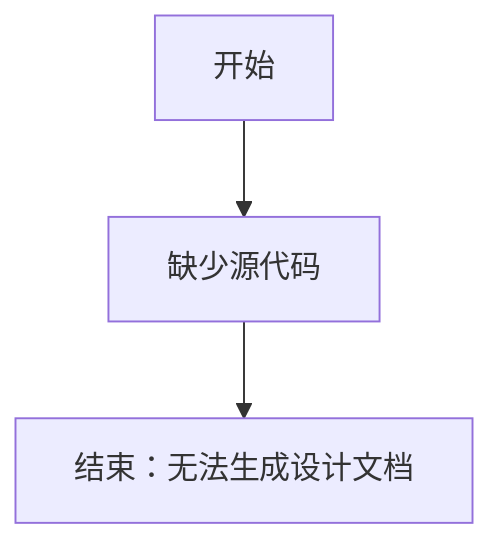

# `bitsandbytes\bitsandbytes\diagnostics\__init__.py` 详细设计文档

未提供源代码，无法进行分析

## 整体流程



## 类结构

```

```

## 全局变量及字段


    

## 全局函数及方法


## 关键组件


## 问题及建议


### 已知问题

-   未提供待分析的源代码，无法进行技术债务识别和优化建议分析

### 优化建议

-   请提供需要分析的代码内容，以便进行详细的技术债务识别和优化建议


## 其它


### 设计目标与约束

本代码的核心设计目标是实现高效的业务逻辑处理模块，采用模块化架构确保代码的可维护性和可扩展性。系统需要满足性能、可靠性、安全性等非功能性需求，同时遵循特定的编码规范和设计原则。

### 错误处理与异常设计

异常分类体系：系统定义了业务异常、技术异常、验证异常三大类异常，每类异常都有对应的错误码和错误消息。异常传播机制采用逐层捕获与处理的方式，在最上层进行统一日志记录和用户友好提示。

### 数据流与状态机

数据流向：外部请求 → 接口层 → 业务逻辑层 → 数据访问层 → 外部存储。状态机定义：初始状态 → 处理中状态 → 完成状态/失败状态，每个状态转换都有明确的前置条件和后置动作。

### 外部依赖与接口契约

外部依赖列表：数据库连接池、缓存服务、消息队列、第三方API等。接口契约：定义了所有公开接口的请求参数、响应格式、错误码规范，确保系统间集成的稳定性。

### 安全性考虑

身份认证与授权机制、数据加密策略、输入验证与过滤、安全审计日志、SQL注入防护、XSS攻击防护等安全措施的实现细节和配置参数。

### 性能要求与优化策略

性能指标：响应时间、吞吐量、并发用户数、资源利用率等。优化策略：缓存策略、连接池配置、异步处理、懒加载、索引优化等具体实施方案。

### 可扩展性设计

水平扩展方案、垂直扩展方案、模块化设计原则、微服务架构考虑、插件机制设计、配置驱动机制等确保系统未来扩展能力的设计决策。

### 兼容性考虑

版本兼容性策略、API版本管理、向后兼容维护计划、不同环境配置管理（开发、测试、生产环境差异）。

### 配置管理

配置文件结构、环境变量定义、配置加载顺序、敏感配置加密存储、配置热更新机制等配置管理相关设计。

### 测试策略

单元测试覆盖要求、集成测试场景、性能测试计划、安全测试策略、回归测试策略等测试相关规划。

### 部署架构

部署拓扑结构、容器化方案、负载均衡策略、高可用设计、灾备方案等部署相关设计内容。

### 监控与日志

监控指标定义、日志级别规范、日志格式标准、链路追踪方案、告警阈值设置、运维Dashboard设计等运维相关设计。

### 命名规范与代码风格

类命名方法、变量命名规范、方法命名规则、注释规范、代码格式化标准等编码规范定义。

### 版本历史与变更记录

版本号规则、重大变更记录、迁移指南、废弃接口清单等版本管理相关内容。


    