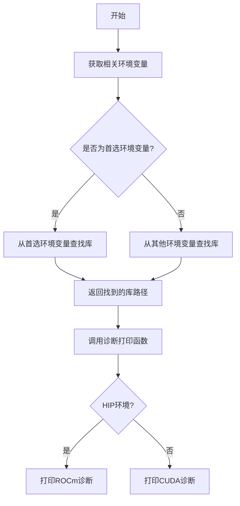
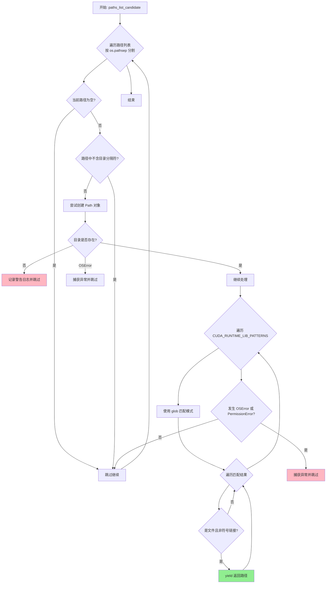
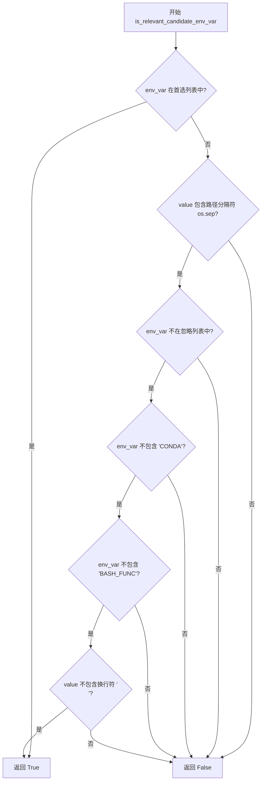
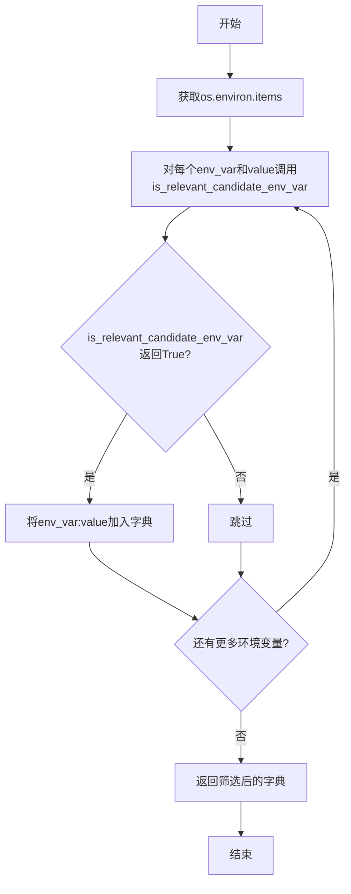
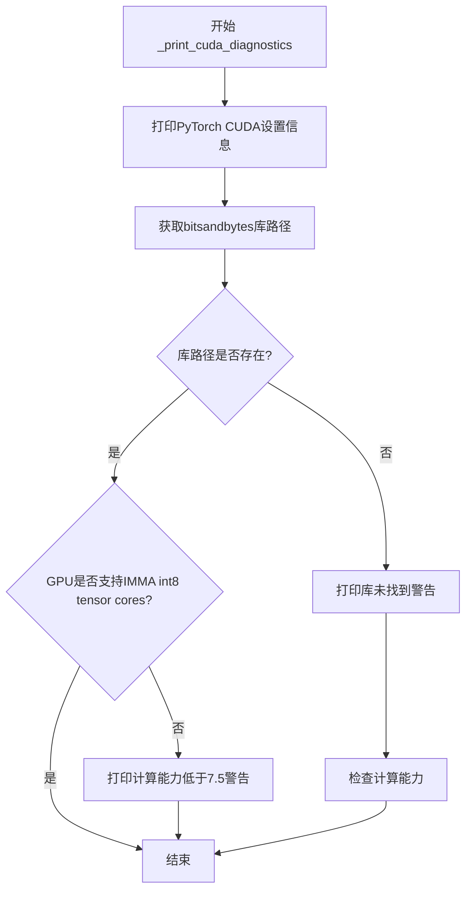
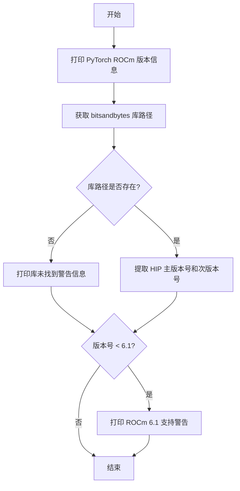
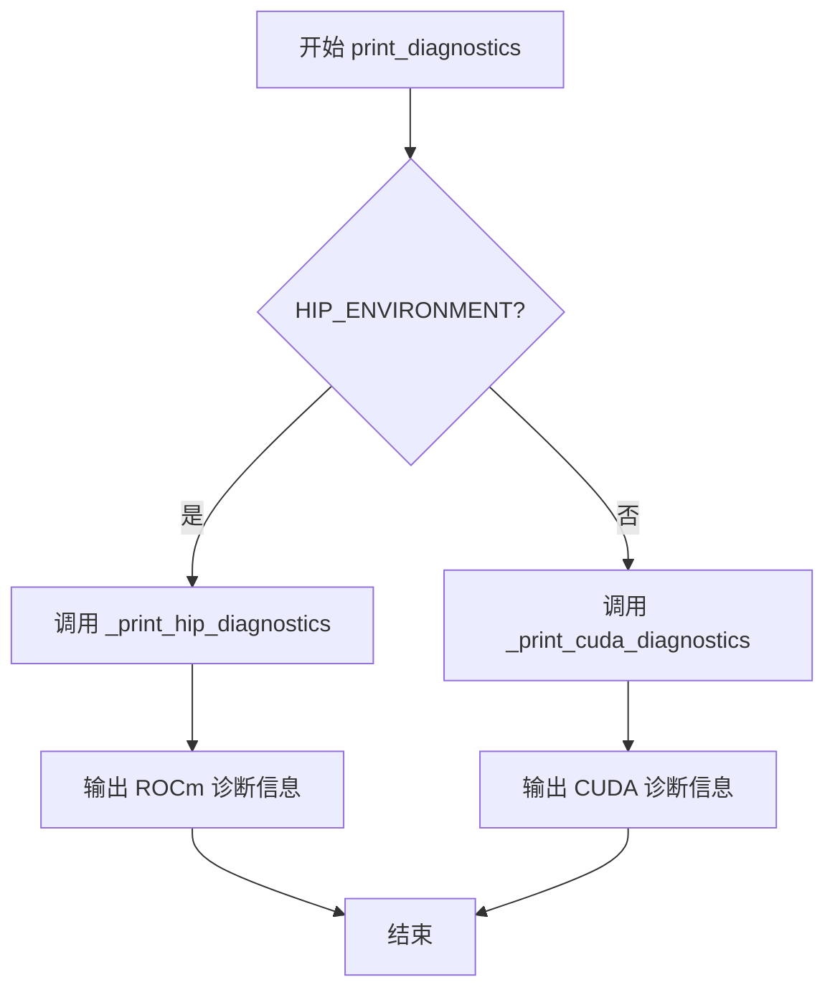
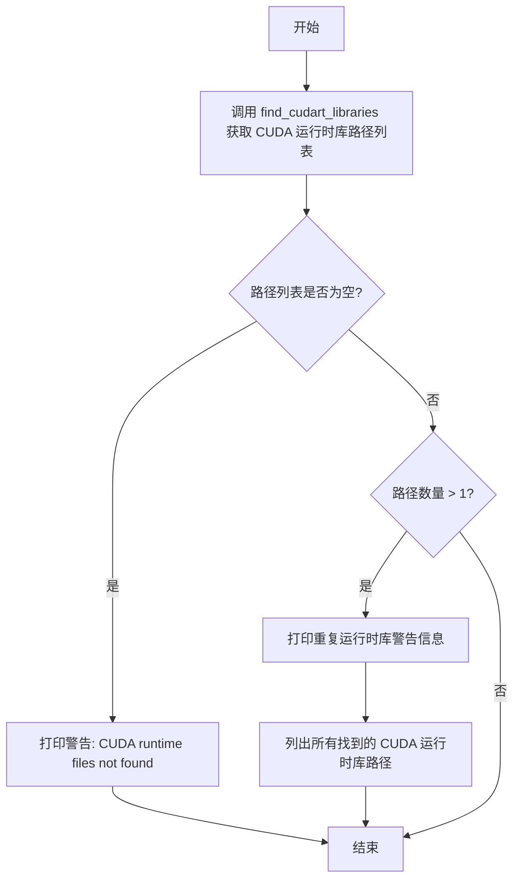
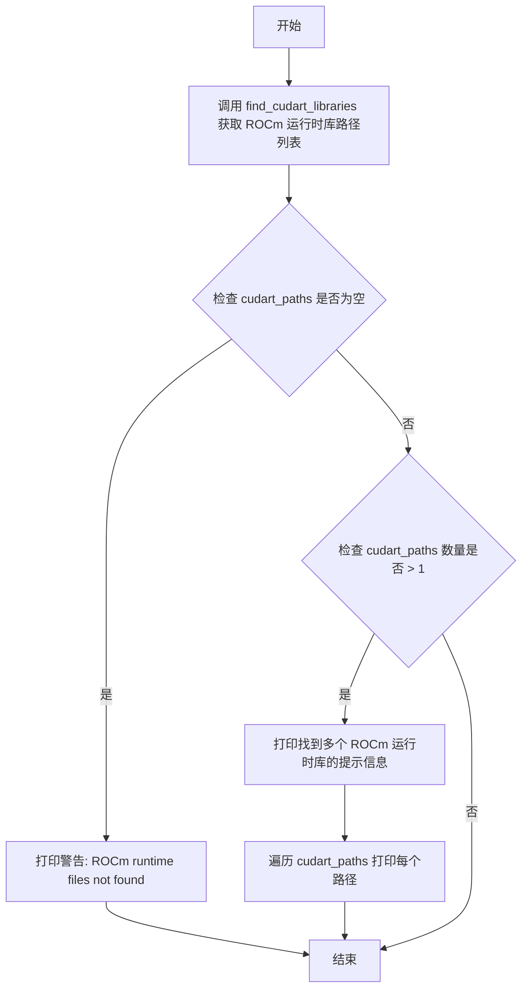
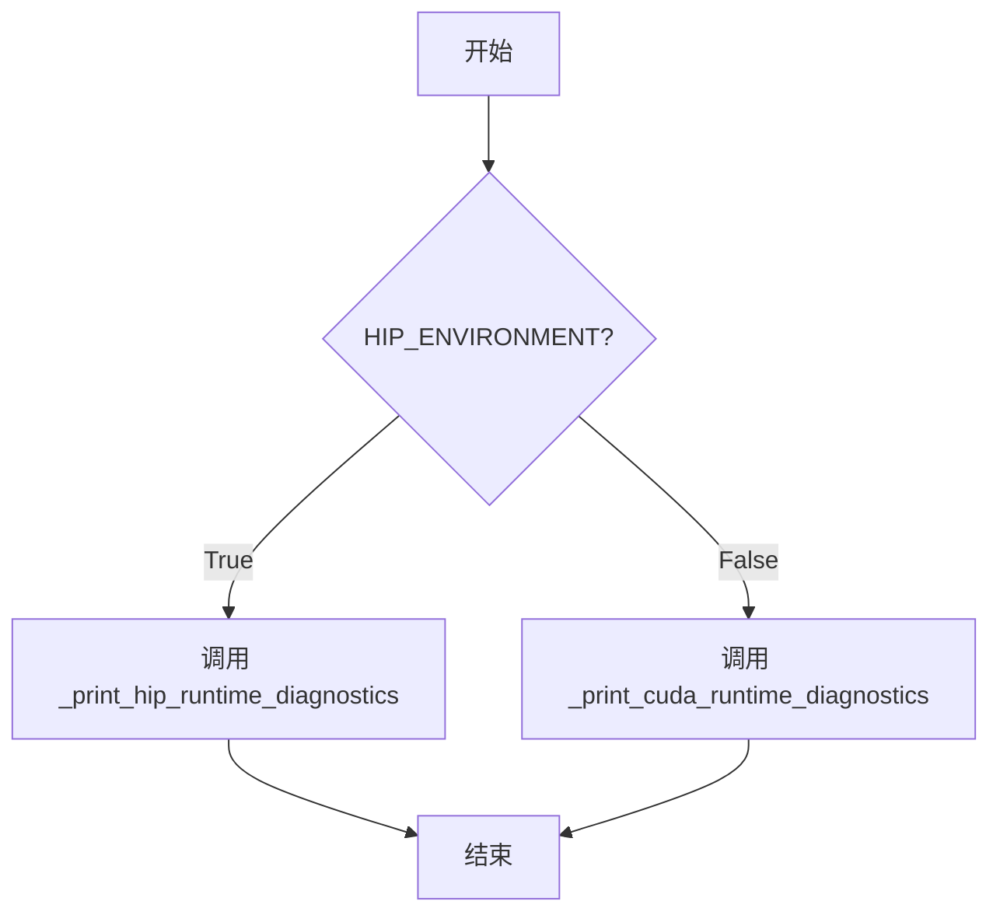

# `bitsandbytes\bitsandbytes\diagnostics\cuda.py` 详细设计文档

该模块是bitsandbytes库的诊断工具，用于检测和定位系统中的CUDA/ROCm运行时库。它通过分析环境变量和文件系统路径来查找CUDA运行时库，并提供详细的诊断信息，帮助用户解决常见的CUDA配置问题。

## 整体流程



## 类结构

```
无类层次结构（全为全局函数和变量）
```

## 全局变量及字段


### `CUDART_PATH_PREFERRED_ENVVARS`
    
元组，包含优先查找CUDA运行时库的環境变量名（CONDA_PREFIX和LD_LIBRARY_PATH）

类型：`tuple[str, ...]`
    


### `CUDART_PATH_IGNORED_ENVVARS`
    
集合，包含在搜索CUDA库时应忽略的环境变量名（如HOME、PATH、SHELL等无关系统变量）

类型：`set[str]`
    


### `CUDA_RUNTIME_LIB_PATTERNS`
    
元组，包含CUDA运行时库的文件名匹配模式（Windows为cudart64*.dll/nvcuda*.dll，Linux为libcudart*.so*，ROCm为libamdhip64.so*）

类型：`tuple[tuple[str, ...], ...]`
    


### `logger`
    
模块级日志记录器，用于记录警告信息（如目录不存在等）

类型：`logging.Logger`
    


### `HIP_ENVIRONMENT`
    
从bitsandbytes.cextension导入的布尔值，指示当前是否运行在AMD ROCm（HIP）环境中

类型：`bool`
    


### `CUDASpecs`
    
从bitsandbytes.cuda_specs导入的类，用于封装CUDA版本和计算能力等规格信息

类型：`type[CUDASpecs]`
    


    

## 全局函数及方法


### `find_cuda_libraries_in_path_list`

该函数用于在给定的路径列表中查找CUDA运行时库文件。它通过遍历路径字符串，使用通配符模式匹配CUDA库文件名（如`libcudart*.so*`、`cudart64*.dll`等），并过滤掉符号链接和非文件条目，返回找到的库文件路径的生成器。

参数：

- `paths_list_candidate`：`str`，包含多个路径的字符串，使用操作系统路径分隔符（如Linux上为`:`，Windows上为`;`）连接

返回值：`Iterable[Path]`，返回找到的CUDA库文件路径的迭代器（生成器）

#### 流程图



#### 带注释源码

```python
def find_cuda_libraries_in_path_list(paths_list_candidate: str) -> Iterable[Path]:
    """
    在给定的路径列表中查找CUDA运行时库文件。
    
    参数:
        paths_list_candidate: 包含多个路径的字符串，使用 os.pathsep 分隔
        
    返回:
        找到的CUDA库文件路径的生成器
    """
    # 按路径分隔符分割字符串（Linux为':'，Windows为';'）
    for dir_string in paths_list_candidate.split(os.pathsep):
        # 跳过空路径
        if not dir_string:
            continue
        # 跳过不含目录分隔符的路径（可能只是环境变量名而非实际路径）
        if os.sep not in dir_string:
            continue
        
        try:
            # 将路径字符串转换为 Path 对象
            dir = Path(dir_string)
            try:
                # 检查目录是否存在
                if not dir.exists():
                    # 记录警告日志：路径存在但目录不存在
                    logger.warning(f"The directory listed in your path is found to be non-existent: {dir}")
                    continue
            except OSError:  # 捕获访问目录时的未知错误
                pass
            
            # 遍历预定义的CUDA运行时库模式
            for lib_pattern in CUDA_RUNTIME_LIB_PATTERNS:
                # 使用 glob 模式匹配库文件
                for pth in dir.glob(lib_pattern):
                    # 仅返回普通文件，过滤掉符号链接
                    if pth.is_file() and not pth.is_symlink():
                        yield pth
        except (OSError, PermissionError):
            # 忽略权限错误或操作系统错误
            pass
```


### `is_relevant_candidate_env_var`

该函数用于判断给定的环境变量及其值是否可能是包含 CUDA 运行时库路径的候选变量。它通过检查环境变量名称是否在首选列表中，或者同时满足包含路径分隔符、不在忽略列表中、不包含特定关键字等条件来筛选潜在相关的环境变量。

参数：

- `env_var`：`str`，环境变量的名称
- `value`：`str`，环境变量的值

返回值：`bool`，如果该环境变量可能是 CUDA 库路径的候选则返回 `True`，否则返回 `False`

#### 流程图



#### 带注释源码

```python
def is_relevant_candidate_env_var(env_var: str, value: str) -> bool:
    """
    判断给定的环境变量及其值是否可能是包含 CUDA 运行时库路径的候选。
    
    参数:
        env_var: str, 环境变量的名称
        value: str, 环境变量的值
    
    返回:
        bool: 如果该环境变量可能是 CUDA 库路径的候选则返回 True
    """
    return (
        env_var in CUDART_PATH_PREFERRED_ENVVARS  # 优先检查是否在首选环境变量列表中
        or (
            os.sep in value  # 环境变量值可能包含路径分隔符
            and env_var not in CUDART_PATH_IGNORED_ENVVARS  # 排除已知的无关环境变量
            and "CONDA" not in env_var  # 排除其他 conda 相关环境变量（避免冲突）
            and "BASH_FUNC" not in env_var  # 排除通过环境变量定义的 bash 函数
            and "\n" not in value  # 排除可能包含脚本或复杂内容的值
        )
    )
```


### `get_potentially_lib_path_containing_env_vars`

该函数用于从当前系统环境变量中筛选出可能包含CUDA运行时库路径的候选环境变量。它通过`is_relevant_candidate_env_var`函数过滤掉已知不相关的环境变量（如`PATH`、`HOME`、`SHELL`等），返回环境变量名到值的字典。

参数：无

返回值：`dict[str, str]`，包含可能包含CUDA运行时库路径的环境变量名称及其对应的值

#### 流程图



#### 带注释源码

```python
def get_potentially_lib_path_containing_env_vars() -> dict[str, str]:
    """
    扫描当前进程的环境变量，筛选出可能包含CUDA运行时库路径的候选变量。
    
    筛选逻辑由is_relevant_candidate_env_var函数定义：
    - 优先选择CUDART_PATH_PREFERRED_ENVVARS中的变量（CONDA_PREFIX, LD_LIBRARY_PATH）
    - 其他变量必须满足：
      1. 值包含路径分隔符（os.sep）
      2. 不在CUDART_PATH_IGNORED_ENVVARS集合中
      3. 变量名不包含'CONDA'
      4. 变量名不包含'BASH_FUNC'
      5. 值不包含换行符
    
    Returns:
        dict[str, str]: 环境变量名到值的字典，仅包含与CUDA运行时库路径相关的变量
    """
    # 使用字典推导式过滤环境变量
    # os.environ是一个包含所有环境变量的字典
    # is_relevant_candidate_env_var用于判断每个环境变量是否可能包含库路径
    return {env_var: value for env_var, value in os.environ.items() if is_relevant_candidate_env_var(env_var, value)}
```


### `find_cudart_libraries`

该函数是 CUDA 运行时库查找器的核心实现，通过扫描环境变量（优先查找 Conda 环境 和 `LD_LIBRARY_PATH`，其次查找其他可能包含路径的环境变量）来定位系统中安装的 CUDA 运行时库（`libcudart.so*` 或 `cudart64*.dll`），并以迭代器方式返回所有找到的库文件路径。

参数：

- 该函数无参数

返回值：`Iterator[Path]` - 返回一个迭代器，迭代产生 `pathlib.Path` 对象，每个对象表示一个找到的 CUDA 运行时库文件的路径。如果没有找到任何库，则返回空迭代器。

#### 流程图

```mermaid
flowchart TD
    A([开始 find_cudart_libraries]) --> B[调用 get_potentially_lib_path_containing_env_vars<br/>获取所有候选环境变量]
    B --> C{遍历 CUDART_PATH_PREFERRED_ENVVARS<br/>['CONDA_PREFIX', 'LD_LIBRARY_PATH']}
    C -->|环境变量存在于候选列表| D[获取该环境变量的值作为目录路径]
    D --> E[调用 find_cuda_libraries_in_path_list<br/>在该目录中查找 CUDA 库文件]
    E --> F[使用 yield from 产出找到的库文件路径]
    F --> G[从候选列表中移除已处理的环境变量]
    G --> C
    C -->|遍历完成| H{遍历剩余的候选环境变量}
    H -->|存在剩余环境变量| I[获取环境变量的值]
    I --> J[调用 find_cuda_libraries_in_path_list<br/>查找 CUDA 库文件]
    J --> K[使用 yield from 产出找到的库文件路径]
    K --> H
    H -->|遍历完成| L([结束 / 返回迭代器])
    
    style A fill:#e1f5fe
    style L fill:#e8f5e8
```

#### 带注释源码

```python
def find_cudart_libraries() -> Iterator[Path]:
    """
    Searches for a cuda installations, in the following order of priority:
        1. active conda env
        2. LD_LIBRARY_PATH
        3. any other env vars, while ignoring those that
            - are known to be unrelated
            - don't contain the path separator `/`

    If multiple libraries are found in part 3, we optimistically try one,
    while giving a warning message.
    """
    # 步骤1：获取所有可能包含库路径的环境变量
    # 调用 helper 函数过滤出相关的环境变量（排除无关的如 HOME, PATH 等）
    candidate_env_vars = get_potentially_lib_path_containing_env_vars()

    # 步骤2：优先处理首选环境变量（CONDA_PREFIX 和 LD_LIBRARY_PATH）
    # 按照优先级顺序遍历这些环境变量
    for envvar in CUDART_PATH_PREFERRED_ENVVARS:
        # 检查该环境变量是否在候选列表中
        if envvar in candidate_env_vars:
            # 获取该环境变量指向的目录路径
            directory = candidate_env_vars[envvar]
            # 在该目录中查找 CUDA 运行时库文件
            # 使用 yield from 直接产出迭代结果，保持迭代器特性
            yield from find_cuda_libraries_in_path_list(directory)
            # 从候选列表中移除已处理的环境变量，避免后续重复处理
            candidate_env_vars.pop(envvar)

    # 步骤3：处理剩余的候选环境变量
    # 遍历所有其他可能包含路径的环境变量
    for env_var, value in candidate_env_vars.items():
        # 在每个环境变量指定的路径中查找 CUDA 库
        yield from find_cuda_libraries_in_path_list(value)
```


### `_print_cuda_diagnostics`

该函数用于打印CUDA诊断信息，检查PyTorch的CUDA版本、GPU计算能力以及bitsandbytes库的二进制文件是否存在，并根据GPU是否支持IMMA（int8张量核心）输出相应的警告信息。

参数：

- `cuda_specs`：`CUDASpecs`，包含CUDA版本和GPU计算能力等信息的规格对象

返回值：`None`，该函数仅执行打印操作，无返回值

#### 流程图



#### 带注释源码

```python
def _print_cuda_diagnostics(cuda_specs: CUDASpecs) -> None:
    """
    打印CUDA诊断信息，包括PyTorch CUDA版本、GPU计算能力和库文件检查结果。
    
    参数:
        cuda_specs: 包含CUDA版本和GPU计算能力信息的CUDASpecs对象
    """
    # 打印PyTorch的CUDA版本和最高计算能力
    print(
        f"PyTorch settings found: CUDA_VERSION={cuda_specs.cuda_version_string}, "
        f"Highest Compute Capability: {cuda_specs.highest_compute_capability}.",
    )

    # 获取bitsandbytes库的二进制文件路径
    binary_path = get_cuda_bnb_library_path(cuda_specs)
    
    # 检查库文件是否存在，不存在则打印警告信息
    if not binary_path.exists():
        print_dedented(
            f"""
            Library not found: {binary_path}. Maybe you need to compile it from source?
            """,
        )

    # 7.5是int8张量核心的最低计算能力要求
    # 如果GPU不支持IMMA（int8张量核心），打印警告信息
    if not cuda_specs.has_imma:
        print_dedented(
            """
            WARNING: Compute capability < 7.5 detected! Only slow 8-bit matmul is supported for your GPU!
            If you run into issues with 8-bit matmul, you can try 4-bit quantization:
            https://huggingface.co/blog/4bit-transformers-bitsandbytes
            """,
        )
```


### `_print_hip_diagnostics`

该函数用于打印 HIP/ROCm 环境的诊断信息，包括 PyTorch 的 ROCm 版本、bitsandbytes 库的二进制文件路径是否存在，以及检查 ROCm 版本是否满足最低要求（6.1）。

参数：

- `cuda_specs`：`CUDASpecs`，包含 CUDA/ROCm 版本和计算能力信息的规范对象

返回值：`None`，该函数仅打印诊断信息，不返回任何值

#### 流程图



#### 带注释源码

```python
def _print_hip_diagnostics(cuda_specs: CUDASpecs) -> None:
    """
    打印 HIP/ROCm 环境的诊断信息。
    
    该函数执行以下检查:
    1. 输出 PyTorch 使用的 ROCm 版本信息
    2. 检查 bitsandbytes 库文件是否存在
    3. 验证 ROCm 版本是否满足最低要求 (6.1)
    
    参数:
        cuda_specs: 包含 ROCm 版本和计算能力信息的 CUDASpecs 对象
    """
    # 打印 PyTorch 的 ROCm 版本信息
    print(f"PyTorch settings found: ROCM_VERSION={cuda_specs.cuda_version_string}")

    # 获取 bitsandbytes 库的二进制文件路径
    binary_path = get_cuda_bnb_library_path(cuda_specs)
    
    # 检查库文件是否存在，不存在则打印警告信息
    if not binary_path.exists():
        print_dedented(
            f"""
        Library not found: {binary_path}.
        Maybe you need to compile it from source? If you compiled from source, check that ROCm version
        in PyTorch Settings matches your ROCm install. If not, reinstall PyTorch for your ROCm version
        and rebuild bitsandbytes.
        """,
        )

    # 从 cuda_specs 中提取 HIP/ROCm 版本号
    hip_major, hip_minor = cuda_specs.cuda_version_tuple
    
    # 检查 ROCm 版本是否低于 6.1，低于则打印警告
    if (hip_major, hip_minor) < (6, 1):
        print_dedented(
            """
            WARNING: bitsandbytes is fully supported only from ROCm 6.1.
            """,
        )
```


### `print_diagnostics`

这是一个诊断信息打印函数，用于根据当前运行环境（CUDA 或 HIP/ROCm）调用相应的诊断打印函数，输出 PyTorch 与 CUDA/ROCm 相关的环境信息、库文件路径以及可能的兼容性警告。

参数：

- `cuda_specs`：`CUDASpecs`，包含 CUDA/ROCm 版本和计算能力等规格信息的对象

返回值：`None`，该函数不返回任何值，仅通过打印输出诊断信息

#### 流程图



#### 带注释源码

```python
def print_diagnostics(cuda_specs: CUDASpecs) -> None:
    """
    打印 CUDA 或 HIP/ROCm 环境的诊断信息。
    
    根据全局变量 HIP_ENVIRONMENT 的值（判断是否运行在 AMD ROCm 环境下），
    选择调用 _print_hip_diagnostics 或 _print_cuda_diagnostics 函数来输出
    相应的诊断信息。
    
    参数:
        cuda_specs: CUDASpecs 对象，包含 CUDA/ROCm 版本、计算能力等规格信息
    
    返回值:
        无返回值，仅打印诊断信息到标准输出
    """
    # 检查是否在 HIP/ROCm 环境中运行
    if HIP_ENVIRONMENT:
        # 如果是 HIP/ROCm 环境，调用 HIP 诊断打印函数
        _print_hip_diagnostics(cuda_specs)
    else:
        # 否则在 CUDA 环境中运行，调用 CUDA 诊断打印函数
        _print_cuda_diagnostics(cuda_specs)
```


### `_print_cuda_runtime_diagnostics`

该函数用于诊断CUDA运行时环境，搜索系统中可能存在的CUDA运行时库文件，并根据搜索结果输出相应的诊断信息，帮助用户识别潜在的CUDA版本冲突或缺失问题。

参数：
- 该函数无参数

返回值：`None`，该函数仅执行打印操作，不返回任何值

#### 流程图



#### 带注释源码

```python
def _print_cuda_runtime_diagnostics() -> None:
    """
    诊断 CUDA 运行时环境，搜索并报告系统中存在的 CUDA 运行时库。
    用于帮助用户识别 CUDA 版本配置问题。
    """
    # 搜索系统中的 CUDA 运行时库
    cudart_paths = list(find_cudart_libraries())
    
    # 如果未找到任何 CUDA 运行时库，打印警告信息
    if not cudart_paths:
        print("CUDA SETUP: WARNING! CUDA runtime files not found in any environmental path.")
    
    # 如果找到多个 CUDA 运行时库，打印警告和详细信息
    elif len(cudart_paths) > 1:
        print_dedented(
            f"""
            Found duplicate CUDA runtime files (see below).

            We select the PyTorch default CUDA runtime, which is {torch.version.cuda},
            but this might mismatch with the CUDA version that is needed for bitsandbytes.
            To override this behavior set the `BNB_CUDA_VERSION=<version string, e.g. 122>` environmental variable.

            For example, if you want to use the CUDA version 122,
                BNB_CUDA_VERSION=122 python ...

            OR set the environmental variable in your .bashrc:
                export BNB_CUDA_VERSION=122

            In the case of a manual override, make sure you set LD_LIBRARY_PATH, e.g.
            export LD_LIBRARY_PATH=$LD_LIBRARY_PATH:/usr/local/cuda-11.2,
            """,
        )
        # 遍历并打印所有找到的 CUDA 运行时库路径
        for pth in cudart_paths:
            print(f"* Found CUDA runtime at: {pth}")
```


### `_print_hip_runtime_diagnostics`

该函数用于诊断和报告系统中 ROCm（AMD GPU 运行时）的运行时库路径信息。它会搜索环境变量中的 ROCm 运行时库，并在找到多个库或未找到任何库时向用户打印相应的警告或提示信息。

参数：无参数

返回值：`None`，该函数仅通过 print 输出信息，不返回任何值

#### 流程图



#### 带注释源码

```python
def _print_hip_runtime_diagnostics() -> None:
    """
    诊断并打印 ROCm 运行时库的路径信息。
    
    该函数会：
    1. 搜索系统中可能存在的 ROCm 运行时库
    2. 检查是否找到任何运行时库
    3. 如果找到多个库，打印警告信息并列出所有路径
    4. 如果未找到任何库，打印警告信息
    """
    # 调用 find_cudart_libraries 查找 ROCm 运行时库
    # find_cudart_libraries 会搜索环境变量中的路径
    cudart_paths = list(find_cudart_libraries())
    
    # 如果未找到任何 ROCm 运行时库
    if not cudart_paths:
        # 打印警告信息，提示用户 ROCm 运行时文件未找到
        print("WARNING! ROCm runtime files not found in any environmental path.")
    # 如果找到多个 ROCm 运行时库
    elif len(cudart_paths) > 1:
        # 使用 print_dedented 打印格式化警告信息
        # 说明可能存在版本不匹配问题
        print_dedented(
            f"""
            Found duplicate ROCm runtime files (see below).

            We select the PyTorch default ROCm runtime, which is {torch.version.hip},
            but this might mismatch with the ROCm version that is needed for bitsandbytes.

            To resolve it, install PyTorch built for the ROCm version you want to use

            and set LD_LIBRARY_PATH to your ROCm install path, e.g.
            export LD_LIBRARY_PATH=$LD_LIBRARY_PATH:/opt/rocm-6.1.2/lib,
            """,
        )

        # 遍历并打印所有找到的 ROCm 运行时库路径
        for pth in cudart_paths:
            print(f"* Found ROCm runtime at: {pth}")
```


### `print_runtime_diagnostics`

该函数是模块级的诊断函数，用于根据当前运行环境（CUDA 或 ROCm/HIP）调用相应的运行时诊断函数，以打印系统中找到的 CUDA 或 ROCm 运行时库信息，帮助用户排查库路径配置问题。

参数：无

返回值：`None`，无返回值，仅打印诊断信息

#### 流程图



#### 带注释源码

```python
def print_runtime_diagnostics() -> None:
    """
    根据环境变量 HIP_ENVIRONMENT 判断当前运行环境是 ROCm/HIP 还是 CUDA，
    并调用相应的运行时诊断函数打印 CUDA 或 ROCm 运行时库的位置信息。
    
    该函数不接收任何参数，也不返回值，仅通过 print 语句输出诊断信息。
    """
    # 判断是否为 HIP/ROCm 环境（通过 bitsandbytes.cextension 模块的 HIP_ENVIRONMENT 变量）
    if HIP_ENVIRONMENT:
        # 调用 ROCm/HIP 运行时诊断函数
        _print_hip_runtime_diagnostics()
    else:
        # 调用 CUDA 运行时诊断函数
        _print_cuda_runtime_diagnostics()
```

## 关键组件


### 环境变量过滤机制 (CUDART_PATH_IGNORED_ENVVARS)

一组预定义的環境變量名稱集合，這些變量被認為與CUDA庫路徑無關（如HOME、PATH、SHELL等），用於過濾候選環境變量，避免錯誤地掃描無關路徑。

### CUDA運行時庫模式匹配 (CUDA_RUNTIME_LIB_PATTERNS)

根據不同平台（Windows/Linux/HIP）定義的CUDA運行時庫文件名模式，用於在目錄中查找匹配的CUDA運行時庫文件（libcudart.so*、cudart64*.dll等）。

### 候選環境變量過濾函數 (is_relevant_candidate_env_var)

判斷給定的環境變量是否可能包含CUDA庫路徑的函數，結合首選變量列表、忽略列表以及路徑分隔符和關鍵詞進行綜合判斷。

### CUDA庫路徑搜索函數 (find_cuda_libraries_in_path_list)

在指定的目錄列表中遍歷搜索CUDA運行時庫，使用glob模式匹配，支持符號鏈接過濾和目錄存在性檢查。

### 多環境變量源搜索函數 (find_cudart_libraries)

按照優先級順序（conda環境 → LD_LIBRARY_PATH → 其他環境變量）搜索CUDA運行時庫，支持多個庫路徑時發出警告信息。

### CUDA診斷信息打印 (_print_cuda_diagnostics)

打印CUDA版本、計算能力、庫文件路徑等診斷信息，並對計算能力低於7.5的情況發出8位矩陣乘法警告。

### HIP/ROCm診斷信息打印 (_print_hip_diagnostics)

針對AMD ROCm環境的專屬診斷函數，打印ROCm版本信息並檢查ROCm 6.1版本兼容性。

### CUDA運行時庫路徑診斷 (_print_cuda_runtime_diagnostics)

搜索並列出系統中所有找到的CUDA運行時庫路徑，處理單一、多個或未找到的情況，並提供版本覆蓋環境變量BNB_CUDA_VERSION的使用說明。

### HIP運行時庫路徑診斷 (_print_hip_runtime_diagnostics)

類似CUDA運行時診斷的ROCm版本，搜索並列出ROCm運行時庫路徑，提供LD_LIBRARY_PATH配置指導。


## 问题及建议


### 已知问题

- `is_relevant_candidate_env_var` 函数中对环境变量值的检查使用 `os.sep in value`，在Windows环境下使用反斜杠作为路径分隔符，可能导致判断不准确
- `find_cuda_libraries_in_path_list` 函数中使用 `os.sep not in dir_string` 过滤目录，同样存在跨平台兼容性问题
- 异常处理过于宽泛，使用 `pass` 静默吞掉 `OSError` 和 `PermissionError`，导致调试困难且无法追踪问题根源
- `find_cudart_libraries` 函数在找到多个非优先级的CUDA运行时库时，只发出警告但未提供明确的解决方案或自动选择机制
- 代码中大量硬编码的环境变量名和模式（如 `CUDART_PATH_IGNORED_ENVVARS`），未来添加新的需要忽略的环境变量时需要修改多处
- `is_relevant_candidate_env_var` 函数中的 `"CONDA" not in env_var` 条件过于严格，可能排除有效的conda相关环境变量（如 `CONDA_DEFAULT_ENV`）
- 缺少对找到的CUDA库版本与PyTorch所需版本匹配性的验证

### 优化建议

- 引入缓存机制（使用 `functools.lru_cache` 或类属性）存储已找到的库路径，避免重复搜索
- 统一使用 `pathlib.Path` 的路径比较方法替代 `os.sep` 字符串检查，增强跨平台兼容性
- 将异常处理改为记录日志而非静默跳过，提供更详细的调试信息
- 将硬编码的环境变量集合提取为配置文件或类常量，便于维护和扩展
- 添加版本匹配验证逻辑，检查找到的CUDA库版本是否与PyTorch/CUDA版本兼容
- 考虑将查找逻辑和诊断输出逻辑解耦，使模块更符合单一职责原则

## 其它


### 设计目标与约束

该模块旨在为bitsandbytes库自动检测和诊断CUDA/ROCm运行时环境，确保正确加载所需的CUDA库并提供有用的诊断信息。主要设计约束包括：支持Windows、Linux系统；兼容CUDA和ROCm（HIP）两种环境；优先使用Conda环境，其次是LD_LIBRARY_PATH，最后是其他环境变量；忽略已知的不相关环境变量以减少误判。

### 错误处理与异常设计

代码采用静默忽略策略处理大部分异常：文件目录不存在时记录警告日志后继续；权限错误或OSError时被捕获并跳过；环境变量值包含换行符时视为无效候选。在find_cuda_libraries_in_path_list函数中，目录不存在时仅发出警告而不抛出异常；尝试访问目录时的OSError被捕获并忽略。这种设计避免因单个路径问题导致整个搜索失败，但可能隐藏潜在的配置问题。

### 数据流与状态机

数据流如下：首先获取所有环境变量并通过is_relevant_candidate_env_var过滤出相关的候选变量；对于CUDART_PATH_PREFERRED_ENVVARS中的环境变量（CONDA_PREFIX、LD_LIBRARY_PATH）优先处理；然后处理其他候选环境变量；对每个候选路径调用find_cuda_libraries_in_path_list进行目录遍历和库文件匹配；最后在诊断函数中将所有找到的库路径列表化并输出。状态转换依赖于环境变量是否存在以及HIP_ENVIRONMENT标志来确定是CUDA还是ROCm模式。

### 外部依赖与接口契约

主要依赖包括：torch库获取版本信息、pathlib.Path进行路径操作、logging模块记录警告、os和collections.abc提供基础功能。外部接口契约：find_cudart_libraries返回Iterator[Path]可迭代对象；get_potentially_lib_path_containing_env_vars返回dict[str, str]；print_diagnostics和print_runtime_diagnostics接受CUDASpecs参数或无参数；所有find函数均为生成器函数以支持惰性求值。

### 性能考虑与优化空间

当前实现每次调用都会遍历所有环境变量并在文件系统中搜索，可能导致性能开销。优化方向包括：缓存环境变量扫描结果；使用更高效的文件系统遍历策略；并行处理多个候选路径的搜索。当前使用glob模式匹配可能效率较低，可考虑预编译正则表达式或维护已知库文件白名单。

### 兼容性设计

代码通过HIP_ENVIRONMENT标志区分CUDA和ROCm环境；CUDA_RUNTIME_LIB_PATTERNS根据平台（HIP vs CUDA）和操作系统（Windows的dll vs Linux的so）提供不同的匹配模式；支持多种CUDA版本库文件命名（libcudart.so、libcudart.so.11.0等）。与PyTorch版本兼容性通过torch.version.cuda和torch.version.hip获取并在诊断信息中显示。

### 配置与参数说明

关键配置项包括：CUDART_PATH_PREFERRED_ENVVARS元组定义优先查找的环境变量名；CUDART_PATH_IGNORED_ENVVARS集合定义应忽略的环境变量；CUDA_RUNTIME_LIB_PATTERNS元组定义库文件匹配模式；环境变量BNB_CUDA_VERSION可用于手动覆盖CUDA版本选择。

### 安全性考虑

代码仅读取环境变量和文件系统，不涉及敏感数据写入。路径遍历使用Path.glob方法，相对安全。但需要注意：环境变量值未经严格验证，恶意构造的长路径或特殊字符可能影响性能；符号链接文件被明确排除(is_symlink检查)，防止通过符号链接攻击。

### 并发与线程安全性

当前实现为单线程设计，不涉及共享状态修改。所有函数均为无状态或使用局部变量，具备天然的线程安全性。但需要注意：os.environ的读取在多线程环境下可能存在平台相关的安全问题，建议在初始化时缓存环境变量快照。


    