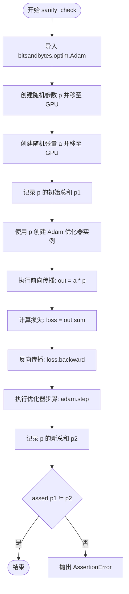
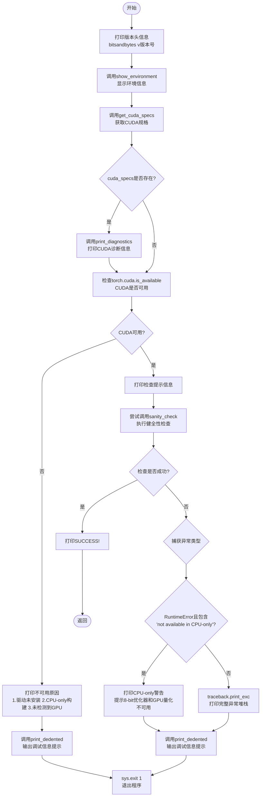

# `bitsandbytes\bitsandbytes\diagnostics\main.py` 详细设计文档

这是一个环境诊断工具，用于检查bitsandbytes库的安装环境，包括平台信息、Python版本、PyTorch版本、CUDA/HIP/XPU支持情况，以及相关依赖包的版本信息，并进行基本的GPU可用性测试(sanity_check)来确保库能够正常工作。

## 整体流程

```mermaid
graph TD
    A[开始] --> B[print_header: 打印bitsandbytes版本]
    B --> C[show_environment: 显示环境信息]
    C --> D[get_cuda_specs: 获取CUDA规格]
    D --> E{是否有CUDA specs?}
    E -- 是 --> F[print_diagnostics: 打印CUDA诊断信息]
    E -- 否 --> G{torch.cuda.is_available()?}
    G -- 否 --> H[打印不可用原因]
    G -- 是 --> I[执行sanity_check]
    I --> J{检查成功?}
    J -- 是 --> K[打印SUCCESS并返回]
    J -- 否 --> L{RuntimeError?}
    L -- 是 --> M[打印CPU-only警告]
    L -- 否 --> N[抛出异常]
    M --> O[打印调试信息并退出]
    N --> O
    H --> O
```

## 类结构

```
该文件为脚本模块，无类定义
主要包含4个全局函数和1个全局变量
```

## 全局变量及字段


### `_RELATED_PACKAGES`
    
存储需要检查版本的相关依赖包名称列表

类型：`list`
    


### `bnb_version`
    
bitsandbytes库的版本号

类型：`str`
    


### `PACKAGE_GITHUB_URL`
    
bitsandbytes的GitHub仓库URL

类型：`str`
    


### `BNB_BACKEND`
    
当前使用的后端类型(CUDA/HIP等)

类型：`str`
    


    

## 全局函数及方法


### `sanity_check`

该函数执行基本的GPU可用性测试，验证8-bit优化器和GPU量化功能是否可用，通过创建一个简单的神经网络参数并使用 Adam 优化器进行一步训练来确认库的核心功能是否正常运作。

参数：
- 无参数

返回值：`None`（无返回值），该函数通过 `assert` 语句在内部进行验证，如果失败会抛出 `AssertionError`。

#### 流程图



#### 带注释源码

```python
def sanity_check():
    # 从 bitsandbytes 库导入 Adam 优化器
    # 这一步隐式检查了 8-bit optimizer 是否可用
    # 如果库未正确安装或 GPU 不可用，可能会导入失败或后续调用失败
    from bitsandbytes.optim import Adam

    # 创建一个形状为 (10, 10) 的随机参数，并显式移至 CUDA 设备 (GPU)
    # 如果没有可用的 GPU，这里会抛出 RuntimeError
    p = torch.nn.Parameter(torch.rand(10, 10).cuda())
    
    # 创建一个形状为 (10, 10) 的随机张量，并移至 CUDA 设备
    a = torch.rand(10, 10).cuda()
    
    # 获取参数在更新前的数值总和，用于后续验证
    p1 = p.data.sum().item()
    
    # 使用参数 p 初始化 Adam 优化器
    # 如果 bitsandbytes 的 8-bit 优化器功能不可用，此处可能会失败
    adam = Adam([p])
    
    # 执行简单的矩阵乘法操作 (前向传播)
    out = a * p
    
    # 计算损失值 (标量)
    loss = out.sum()
    
    # 反向传播计算梯度
    loss.backward()
    
    # 执行优化器更新步骤
    adam.step()
    
    # 获取参数更新后的数值总和
    p2 = p.data.sum().item()
    
    # 断言：验证参数值在优化器步骤后发生了变化
    # 如果 p1 == p2，说明优化器没有正常工作 (例如运行在 CPU 模式或功能未启用)
    assert p1 != p2
```


### `get_package_version`

该函数用于通过 Python 标准库 `importlib.metadata` 获取指定包的版本号，如果包不存在则返回字符串 "not found"。

参数：

- `name`：`str`，Python 包的名称

返回值：`str`，包的版本字符串，若包未安装则返回 "not found"

#### 流程图

```mermaid
flowchart TD
    A[开始] --> B[调用 importlib.metadata.version name]
    B --> C{是否抛出 PackageNotFoundError?}
    C -->|是| D[version = "not found"]
    C -->|否| E[获取版本号到 version]
    D --> F[返回 version]
    E --> F
```

#### 带注释源码

```python
def get_package_version(name: str) -> str:
    """
    获取指定 Python 包的版本号。
    
    参数:
        name: str, Python 包的名称，例如 "torch", "numpy" 等
    
    返回:
        str, 包的版本字符串（例如 "2.0.0"），如果包未安装则返回 "not found"
    """
    try:
        # 尝试从包的元数据中获取版本号
        # importlib.metadata.version 会查询已安装包的 METADATA 文件
        version = importlib.metadata.version(name)
    except importlib.metadata.PackageNotFoundError:
        # 如果包不存在于已安装包列表中，捕获异常并返回 "not found"
        version = "not found"
    return version
```


### `show_environment`

打印平台、Python、PyTorch及CUDA/HIP/XPU版本信息，以及相关包版本信息，用于诊断环境和依赖兼容性。

参数： 无

返回值：`None`，无返回值

#### 流程图

```mermaid
flowchart TD
    A[开始 show_environment] --> B[获取并打印平台信息 platform.platform]
    B --> C{platform.system == "Linux"}
    C -->|是| D[打印libc版本信息]
    C -->|否| E[跳过libc打印]
    D --> E
    E --> F[打印Python版本]
    F --> G[打印PyTorch版本 torch.__version__]
    G --> H[打印CUDA版本 torch.version.cuda]
    H --> I[打印HIP版本 torch.version.hip]
    I --> J[打印XPU版本 torch.version.xpu]
    J --> K[打印Related packages标题]
    K --> L[遍历 _RELATED_PACKAGES 列表]
    L --> M{获取包版本}
    M -->|成功| N[打印包名和版本]
    M -->|失败| O[打印包名和 'not found']
    N --> P[继续下一个包]
    O --> P
    P --> L
    P --> Q[结束函数]
```

#### 带注释源码

```python
def show_environment():
    """Simple utility to print out environment information."""
    # 打印操作系统平台信息，包括系统名、版本等
    print(f"Platform: {platform.platform()}")
    
    # 仅在Linux系统下打印libc版本信息
    if platform.system() == "Linux":
        print(f"  libc: {'-'.join(platform.libc_ver())}")

    # 打印Python解释器版本
    print(f"Python: {platform.python_version()}")

    # 打印PyTorch框架版本
    print(f"PyTorch: {torch.__version__}")
    # 打印CUDA运行时常量版本，若不存在则显示N/A
    print(f"  CUDA: {torch.version.cuda or 'N/A'}")
    # 打印ROCm HIP版本，若不存在则显示N/A
    print(f"  HIP: {torch.version.hip or 'N/A'}")
    # 打印Intel XPU版本，使用getattr安全获取属性
    print(f"  XPU: {getattr(torch.version, 'xpu', 'N/A') or 'N/A'}")

    # 打印相关依赖包标题
    print("Related packages:")
    # 遍历预定义的关联包列表，逐一获取并打印版本号
    for pkg in _RELATED_PACKAGES:
        version = get_package_version(pkg)
        print(f"  {pkg}: {version}")
```


### `main`

主函数，协调整个诊断流程，控制程序逻辑和错误处理。它首先打印版本信息和环境详情，然后获取CUDA规格信息，接着检查PyTorch的CUDA可用性，最后运行sanity_check来验证库的可导入性和功能正常性。

参数：

- 无参数

返回值：`None`，无返回值

#### 流程图



#### 带注释源码

```
def main():
    # 打印bitsandbytes版本头信息
    print_header(f"bitsandbytes v{bnb_version}")
    
    # 显示系统环境信息（平台、Python版本、PyTorch版本、CUDA版本等）
    show_environment()
    print_header("")

    # 获取CUDA设备规格信息
    cuda_specs = get_cuda_specs()

    # 如果获取到CUDA规格，打印诊断信息
    if cuda_specs:
        print_diagnostics(cuda_specs)

    # TODO: There's a lot of noise in this; needs improvement.
    # print_cuda_runtime_diagnostics()

    # 检查CUDA是否可用（PyTorch是否能访问GPU）
    if not torch.cuda.is_available():
        # CUDA不可用，打印可能的错误原因列表
        print(f"PyTorch says {BNB_BACKEND} is not available. Possible reasons:")
        print(f"1. {BNB_BACKEND} driver not installed")
        print("2. Using a CPU-only PyTorch build")
        print("3. No GPU detected")

    else:
        # CUDA可用，开始检查库的可导入性和功能性
        print(f"Checking that the library is importable and {BNB_BACKEND} is callable...")

        try:
            # 执行sanity_check：创建参数、执行前向传播、执行Adam优化器步骤
            # 验证8-bit优化器和GPU量化功能是否正常工作
            sanity_check()
            # 检查通过，打印成功消息并正常返回
            print("SUCCESS!")
            return
        except RuntimeError as e:
            # 捕获运行时错误，特别处理CPU-only的情况
            if "not available in CPU-only" in str(e):
                # 当前运行在CPU-only模式，8-bit优化器和GPU量化不可用
                print(
                    f"WARNING: {__package__} is currently running as CPU-only!\n"
                    "Therefore, 8-bit optimizers and GPU quantization are unavailable.\n\n"
                    f"If you think that this is so erroneously,\nplease report an issue!",
                )
            else:
                # 其他运行时错误，重新抛出
                raise e
        except Exception:
            # 捕获所有其他异常，打印完整的堆栈跟踪信息
            traceback.print_exc()

        # 打印调试信息提示，引导用户提交issue时提供此信息
        print_dedented(
            f"""
            Above we output some debug information.
            Please provide this info when creating an issue via {PACKAGE_GITHUB_URL}/issues/new/choose
            WARNING: Please be sure to sanitize sensitive info from the output before posting it.
            """,
        )
        # 检查失败，退出程序并返回错误码1
        sys.exit(1)
```

## 关键组件


### bitsandbytes 环境诊断工具

这是 bitsandbytes 库的环境诊断工具，用于验证库的正确安装、CUDA 可用性，并执行基本的健全性检查以确保 8-bit 优化器和 GPU 量化功能正常工作。

### sanity_check

执行基本的健全性检查，验证 GPU 和 8-bit Adam 优化器功能是否正常。创建随机张量，执行前向传播、反向传播和优化器步骤，验证参数确实发生了更新。

### get_package_version

获取指定 Python 包的可读版本号。如果包未安装，返回 "not found"。

### show_environment

打印系统环境信息，包括平台、Python 版本、PyTorch 版本、CUDA/HIP/XPU 版本，以及相关依赖包（accelerate、diffusers、numpy、pip、peft、safetensors、transformers、triton、trl）的版本。

### main

主诊断流程：打印版本信息 → 显示环境 → 获取 CUDA 规格 → 执行诊断 → 检查 CUDA 可用性 → 运行健全性检查 → 处理各类异常并输出调试信息。

### _RELATED_PACKAGES

包含需要检查版本的关联包列表，用于环境诊断和兼容性验证。

### CUDA 诊断模块

通过 get_cuda_specs 获取 CUDA 设备规格，并调用 print_diagnostics 输出详细的 CUDA 诊断信息。

### 异常处理设计

针对 CPU-only 模式、CUDA 不可用、安装问题等场景设计了分级异常处理策略，提供友好的警告信息和问题排查指引。


## 问题及建议


### 已知问题

-   **硬编码的 CUDA 设备**：`sanity_check()` 函数中直接使用 `.cuda()` 方法，在 CPU-only 环境下会直接失败，虽然外层有 `torch.cuda.is_available()` 检查，但检查顺序和错误处理不够清晰
-   **缺乏统一的日志系统**：所有输出使用 `print()`，没有使用 Python 标准日志模块，导致无法控制日志级别、不便于集成到更大的应用系统中
-   **TODO 注释未完成**：`print_cuda_runtime_diagnostics()` 被注释掉，标注为"needs improvement"，表明该功能已知有问题但未修复
-   **错误处理不完整**：`main()` 函数中的 `except Exception: traceback.print_exc()` 捕获了所有异常但没有针对不同异常类型进行分类处理，某些情况下可能掩盖特定错误
-   **静态的包列表**：`_RELATED_PACKAGES` 是硬编码列表，扩展性差，新增相关包需要修改源代码
-   **平台支持不全面**：`show_environment()` 中 `platform.system() == "Linux"` 分支只处理 Linux，其他操作系统（如 Windows、macOS）的特殊信息被忽略

### 优化建议

-   **引入日志系统**：使用 `logging` 模块替代 `print()`，提供 DEBUG、INFO、WARNING、ERROR 等不同级别的日志输出，便于生产环境控制
-   **改进设备检测逻辑**：在 `sanity_check()` 中使用 `torch.cuda.is_available()` 或 `torch.device()` 来动态判断设备，提高兼容性
-   **完善错误分类**：将 `except Exception` 细分为具体异常类型（如 ImportError、RuntimeError、AttributeError），提供更有针对性的错误信息和恢复策略
-   **配置化包列表**：将 `_RELATED_PACKAGES` 移至配置文件（如 YAML/JSON）或环境变量，支持运行时扩展
-   **完成 TODO 功能**：实现或移除 `print_cuda_runtime_diagnostics()`，避免遗留未完成代码
-   **跨平台支持**：扩展 `show_environment()` 函数，为 Windows 和 macOS 添加特定信息显示（如 WMI 信息、Metal 框架信息等）

## 其它


### 设计目标与约束

本模块的设计目标是提供一个简单易用的环境诊断工具，帮助用户快速排查 bitsandbytes 库在运行时可能遇到的 CUDA/GPU 相关问题。约束条件包括：依赖 PyTorch、仅支持 Python 3.8+、需要 CUDA 可用（否则降级为 CPU 模式）。

### 错误处理与异常设计

异常处理采用分层策略：对于 `RuntimeError` 中包含 "not available in CPU-only" 的错误，进行友好警告并提示可能的解决步骤；对于其他 `RuntimeError` 直接向上抛出；对于通用异常，使用 `traceback.print_exc()` 打印完整堆栈信息后退出。`get_package_version` 函数通过 try-except 捕获 `PackageNotFoundError` 并返回 "not found" 字符串，避免因单个包缺失导致整个诊断流程中断。

### 数据流与状态机

程序执行流程如下：首先打印包版本和平台信息，然后获取 CUDA 规格信息，接着检查 CUDA 是否可用。若可用则执行 sanity_check 进行功能性验证；若不可用则输出可能的错误原因并退出。状态机包含三个主要状态：初始化状态（打印环境信息）、CUDA 检测状态、验证状态（sanity_check 成功或失败）。

### 外部依赖与接口契约

本模块直接依赖以下外部包：`torch`（核心依赖，必须可用）、`importlib.metadata`（Python 3.8+ 内置）、`platform`（Python 内置）、`traceback`（Python 内置）。间接依赖通过 `_RELATED_PACKAGES` 列表定义，包括 accelerate、diffusers、transformers 等常用 ML 框架。接口契约方面，`show_environment()` 无参数无返回值，`sanity_check()` 无参数在失败时抛异常，`get_package_version(name: str) -> str` 接收包名字符串并返回版本字符串。

### 性能考虑

性能影响主要在 `sanity_check` 函数，该函数会实际执行一次前向传播、反向传播和优化器步骤。在完整诊断流程中，这通常是可以接受的开销，但可以通过环境变量或参数控制是否跳过此检查以提升诊断速度。

### 兼容性考虑

本模块需要兼容多种平台：Linux（显示 libc 版本）、Windows、macOS。CUDA 兼容性通过 `get_cuda_specs()` 动态获取，HIP 和 XPU 支持通过 `torch.version` 属性动态检测。Python 版本支持取决于 `importlib.metadata` 的可用性（Python 3.8+）。

### 安全性考虑

输出信息中可能包含敏感路径信息，代码已在注释中提醒用户在使用诊断信息创建 issue 时需进行脱敏处理。sanity_check 使用的随机数据不会持久化或泄露到外部。

### 测试策略建议

建议添加单元测试验证 `get_package_version` 函数对存在/不存在包的处理，添加集成测试验证在不同 CUDA 可用性条件下的行为，以及添加 mock 测试模拟各种异常场景。

    