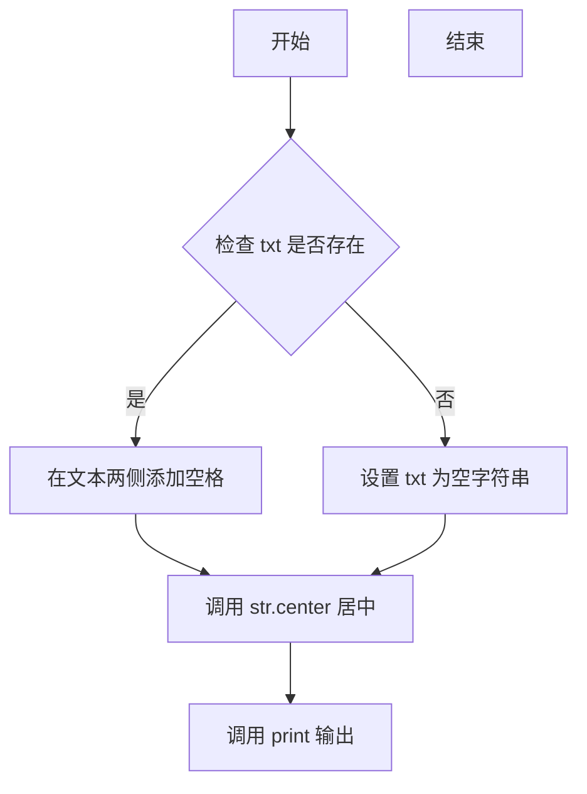
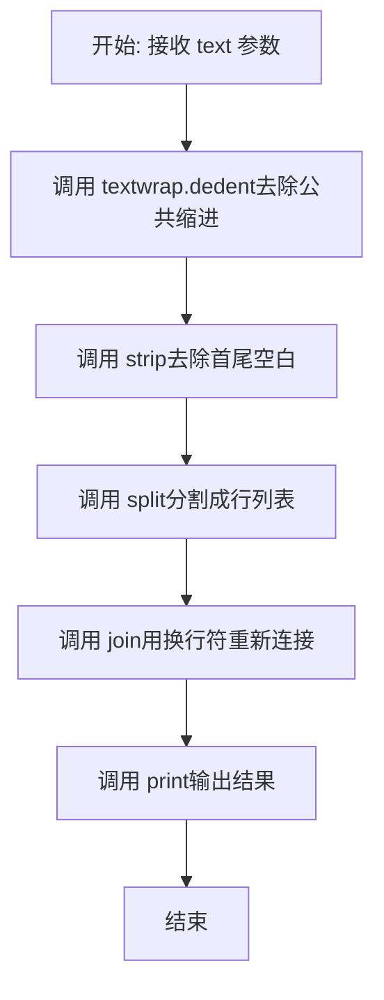
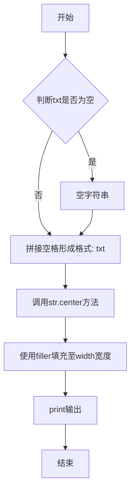
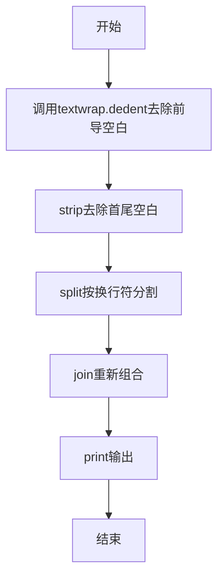

# `bitsandbytes\bitsandbytes\diagnostics\utils.py` 详细设计文档

一个简单的控制台输出格式化工具模块，提供带装饰线的标题打印和文本缩进去除功能

## 整体流程

```mermaid
graph TD
    A[开始] --> B{调用print_header?}
    B -- 是 --> C[接收txt参数]
    C --> D[txt为空?]
    D -- 是 --> E[设置txt为空字符串]
    D -- 否 --> F[添加前后空格: f' {txt} ']
    F --> G[使用center方法居中]
    G --> H[打印装饰线]
    B -- 否 --> I{调用print_dedented?}
    I -- 是 --> J[接收text参数]
    J --> K[使用textwrap.dedent去除缩进]
    K --> L[使用strip去除首尾空白]
    L --> M[使用split按行分割]
    M --> N[使用join合并并打印]
    H --> O[结束]
    N --> O
```

## 类结构

```
该代码无类层次结构，仅包含模块级函数
```

## 全局变量及字段


### `HEADER_WIDTH`
    
全局常量，控制标题装饰线宽度，值为60

类型：`int`
    


    

## 全局函数及方法


### `print_header`

打印带装饰线的格式化标题，通过中心对齐文本并使用指定填充字符填充剩余宽度，形成视觉分隔效果。

参数：

- `txt`：`str`，要打印的标题文本，如果为空则只打印装饰线
- `width`：`int`，输出总宽度，默认为 `HEADER_WIDTH`（60）
- `filler`：`str`，填充字符，默认为 `"="`

返回值：`None`，该函数直接输出到标准输出，不返回任何值

#### 流程图



#### 带注释源码

```python
import textwrap  # 导入文本包装模块，用于其他函数

# 全局常量：默认标题宽度
HEADER_WIDTH = 60


def print_header(txt: str, width: int = HEADER_WIDTH, filler: str = "=") -> None:
    """
    打印带装饰线的格式化标题
    
    参数:
        txt: 标题文本内容
        width: 输出总宽度，默认60字符
        filler: 填充字符，默认等号
    """
    # 如果文本存在，在两端添加空格使文本与装饰线之间有间隙
    txt = f" {txt} " if txt else ""
    # 使用 center() 方法将文本居中，fillchar 填充两侧
    print(txt.center(width, filler))


def print_dedented(text):
    """打印去除缩进的格式化文本"""
    # 使用 textwrap.dedent 移除公共缩进，然后打印每行
    print("\n".join(textwrap.dedent(text).strip().split("\n")))
```


### `print_dedented`

打印去除缩进的文本。该函数接收一个多行字符串，使用 `textwrap.dedented()` 去除所有行的公共前导空白字符，然后去除首尾空白，再按换行符重新连接并输出。

参数：

- `text`：`str`，需要去除缩进的文本字符串

返回值：`None`，无返回值，直接输出到控制台

#### 流程图



#### 带注释源码

```python
def print_dedented(text):
    # 使用 textwrap.dedent() 去除所有行的公共前导空白字符
    # 即找出所有行共同的前缀空格/制表符并移除
    dedented_text = textwrap.dedent(text)
    
    # 使用 strip() 去除结果字符串首尾的空白字符
    # 移除开头和结尾的换行符、空格等
    stripped_text = dedented_text.strip()
    
    # 使用 split("\n") 按换行符分割成行列表
    lines = stripped_text.split("\n")
    
    # 使用 "\n".join() 用换行符重新连接所有行
    # 并通过 print() 输出到控制台
    print("\n".join(lines))
```

#### 关键组件信息

| 组件名称 | 一句话描述 |
|---------|-----------|
| `textwrap.dedent()` | 去除多行文本中所有行的公共前导空白字符 |
| `str.strip()` | 移除字符串首尾的空白字符 |
| `str.split()` | 按指定分隔符分割字符串为列表 |
| `str.join()` | 用指定字符连接字符串列表 |

#### 潜在技术债务与优化空间

1. **缺乏参数验证**：未对 `text` 参数类型进行检查，若传入非字符串类型可能导致运行时错误
2. **功能单一**：仅支持字符串处理，可考虑扩展支持文件对象或列表输入
3. **空文本处理**：当输入为空字符串或仅包含空白时，输出结果可能不符合预期
4. **可测试性**：由于直接调用 `print()`，单元测试需要捕获标准输出，建议将核心逻辑分离以便测试

## 关键组件


### HEADER_WIDTH 常量

用于定义标题打印时的宽度，默认值为60个字符。

### print_header 函数

用于打印带有装饰线的格式化标题，支持自定义宽度和填充字符。

### print_dedented 函数

用于打印去除缩进的文本，常用于打印多行字符串源码。


## 问题及建议


### 已知问题

-   **缺少函数参数和返回值的类型注解**：`print_dedented` 函数的 `text` 参数和返回值均缺少类型注解，不利于静态分析和IDE支持
-   **参数处理可能产生副作用**：`print_header` 函数中直接修改输入参数 `txt`，当传入非空字符串时会改变原始变量的值
-   **字符串处理方式低效**：`print_dedented` 中使用 `split("\n")` 再 `join` 的方式处理换行不够简洁，可直接使用 `splitlines()` 方法
-   **缺乏错误处理**：未对 `None` 值、空字符串边界情况、异常输入等进行校验
-   **打印逻辑硬耦合**：`print` 语句直接写在函数内部，无法进行单元测试，也不利于扩展（如输出到文件或GUI）
-   **缺少文档字符串**：两个函数均无 docstring，调用者无法获知函数的具体用途和使用方式
-   **全局常量访问效率**：在函数内部可直接访问全局变量 `HEADER_WIDTH`，但当全局变量在多线程环境下被修改时，可能导致不确定行为

### 优化建议

-   **添加类型注解**：为 `print_dedented` 函数添加 `text: str` 参数类型和 `-> None` 返回值类型注解
-   **避免参数副作用**：在 `print_header` 中使用局部变量而非修改参数，例如 `centered_txt = f" {txt} " if txt else ""`
-   **简化字符串操作**：将 `"\n".join(textwrap.dedent(text).strip().split("\n"))` 替换为 `textwrap.dedent(text).strip()`
-   **增加输入校验**：在函数入口处检查 `text` 是否为 `None`，或使用 `typing.Optional` 明确参数可为 None
-   **分离输出逻辑**：将 `print` 替换为接受 `file` 参数或返回字符串，提高函数的可测试性和可复用性
-   **添加文档字符串**：为每个函数编写清晰的 docstring，说明函数功能、参数和返回值
-   **考虑配置对象**：如需更复杂的配置，可引入配置类或 dataclass 封装 width、filler 等参数


## 其它


### 一段话描述

该代码是一个简单的文本格式化工具库，提供两个工具函数：`print_header` 用于在控制台打印带有装饰字符（如"="）的标题行，`print_dedented` 用于打印去除文本前导缩进的格式化内容，主要用于美化命令行输出。

### 文件的整体运行流程

该模块为工具模块，不包含独立执行流程。作为导入模块供其他代码使用：
1. 模块被导入时，初始化全局常量 `HEADER_WIDTH`
2. 调用 `print_header(txt, width, filler)` 时，接收文本参数，生成装饰字符串并打印
3. 调用 `print_dedented(text)` 时，接收多行文本，去除公共前导空白后打印

### 全局变量

### HEADER_WIDTH
- 类型：`int`
- 描述：标题行的默认宽度，默认为60个字符

### 全局函数

### print_header
- 参数 `txt: str` - 要打印的标题文本
- 参数 `width: int` - 标题行总宽度，默认60
- 参数 `filler: str` - 填充字符，默认"="
- 返回值类型：`None`
- 返回值描述：无返回值，直接输出到标准输出
- **mermaid流程图**：

- **带注释源码**：
```python
def print_header(txt: str, width: int = HEADER_WIDTH, filler: str = "=") -> None:
    """打印带有装饰字符的标题行
    
    Args:
        txt: 要打印的标题文本
        width: 标题行总宽度，默认60
        filler: 填充字符，默认"="
    """
    txt = f" {txt} " if txt else ""  # 非空文本两侧加空格
    print(txt.center(width, filler))  # 居中填充并打印
```

### print_dedented
- 参数 `text: str` - 要打印的多行文本
- 返回值类型：`None`
- 返回值描述：无返回值，直接输出到标准输出
- **mermaid流程图**：

- **带注释源码**：
```python
def print_dedented(text):
    """打印去除缩进的格式化文本
    
    去除多行文本的公共前导空白，常用于打印代码块或格式化文档
    
    Args:
        text: 要打印的多行文本
    """
    print("\n".join(textwrap.dedent(text).strip().split("\n")))
    # textwrap.dedent: 去除所有行的公共前导空白
    # strip: 去除整体首尾空白
    # split/join: 规范换行符处理
```

### 关键组件信息

### textwrap 模块
- 描述：Python标准库模块，提供文本缩进处理功能，本代码主要使用其 `dedent` 函数去除文本前导空白

### 潜在的技术债务或优化空间

1. **参数校验缺失**：`print_header` 未验证 width 参数为正整数、filler 不能为空；`print_dedented` 未处理 None 输入
2. **功能单一**：仅支持简单的装饰打印，缺乏颜色支持（如ANSI转义码）、日志级别区分等高级功能
3. **可测试性不足**：直接使用 print 输出，难以进行单元测试验证输出内容
4. **Unicode支持**：filler 参数仅支持单字符，未考虑多字符装饰模式（如"=-"交替）
5. **文档不完整**：缺少模块级docstring，未说明使用场景和示例

### 设计目标与约束

- **设计目标**：提供轻量级的命令行输出格式化能力，使脚本输出更具可读性
- **约束条件**：依赖Python标准库（textwrap），无需外部包；保持极简实现，零配置即可使用
- **兼容性**：兼容Python 3.6+版本

### 错误处理与异常设计

- **当前实现**：代码未实现显式错误处理，依赖Python内置异常
- **潜在异常**：
  - `TypeError`：参数类型不匹配（如width传入字符串）
  - `AttributeError`：text为None时调用字符串方法
- **建议改进**：添加参数类型检查和默认值降级处理

### 外部依赖与接口契约

- **外部依赖**：`textwrap` 模块（Python标准库，无需额外安装）
- **接口契约**：
  - `print_header`：输入字符串返回None，通过stdout输出格式化标题
  - `print_dedented`：输入字符串返回None，通过stdout输出格式化文本
  - 两者均不修改原字符串，不产生副作用（仅IO输出）

### 使用示例与场景

- 打印脚本章节标题
- 格式化打印代码片段或配置文件内容
- 命令行工具的输出美化

### 版本与兼容性信息

- **Python版本**：3.6+
- **第三方库**：无
- **平台依赖**：跨平台（依赖标准输出）


    