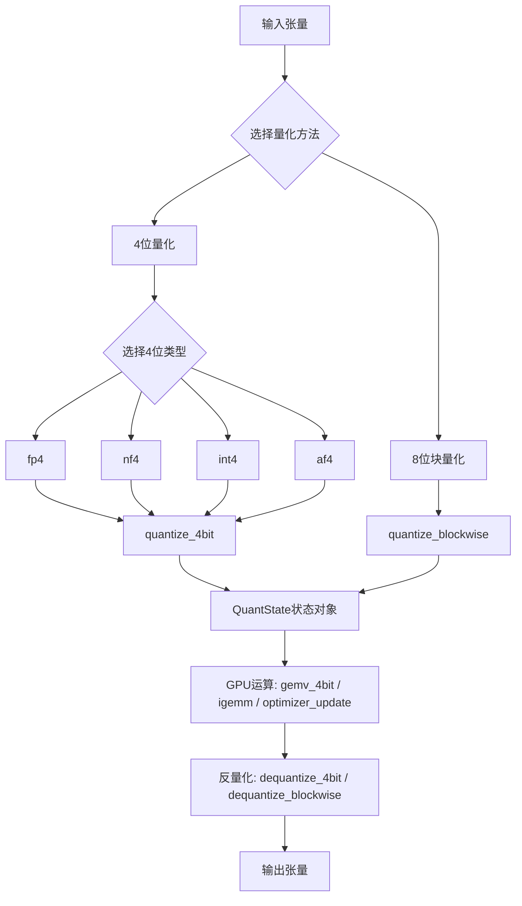
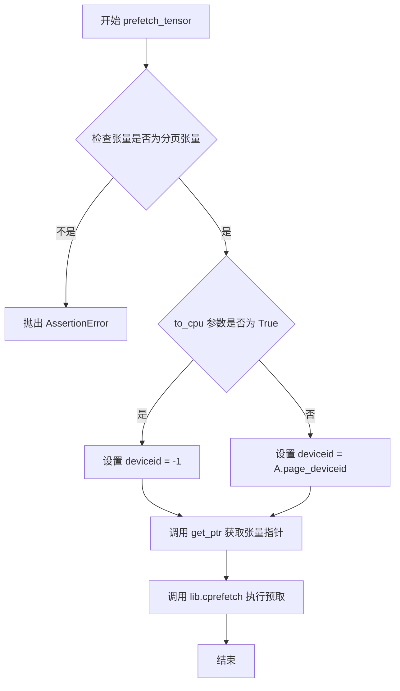
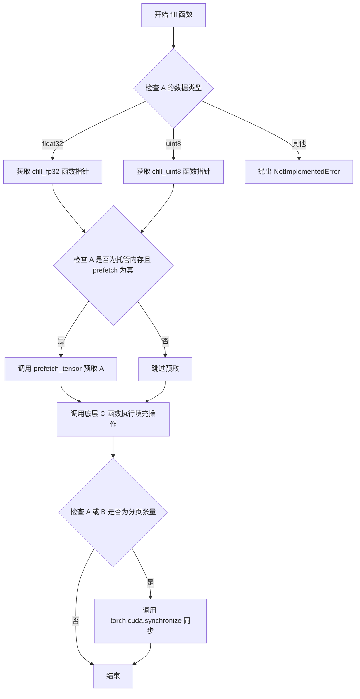
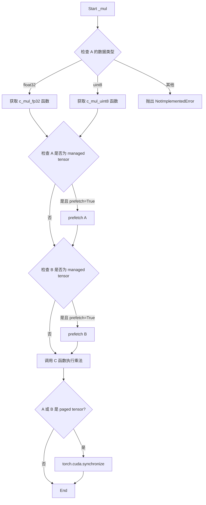
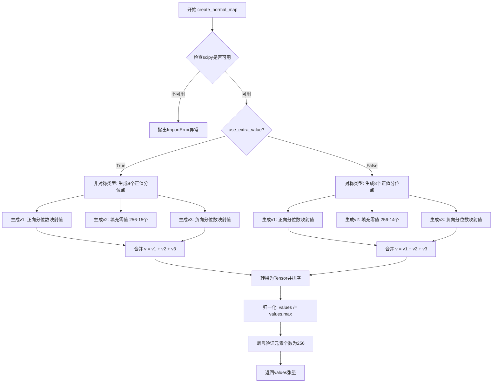
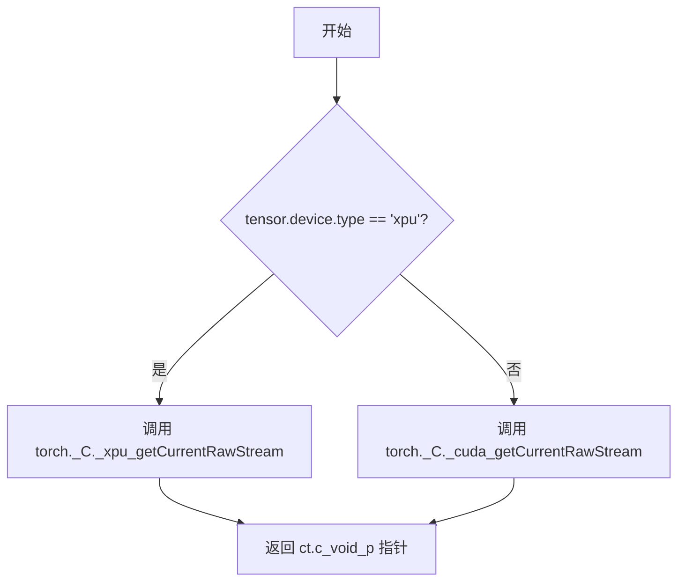
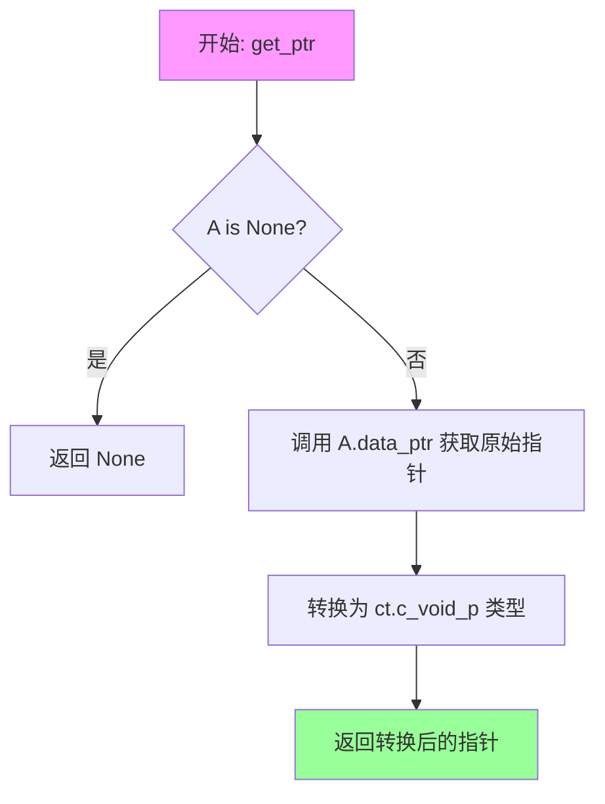
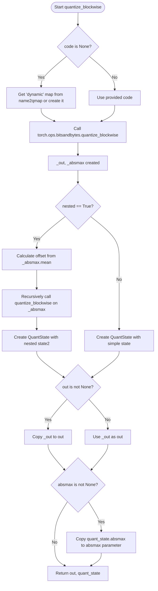
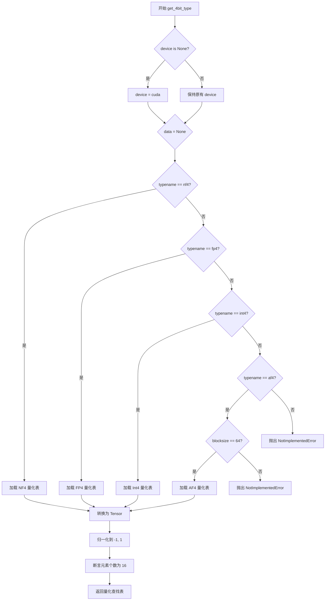
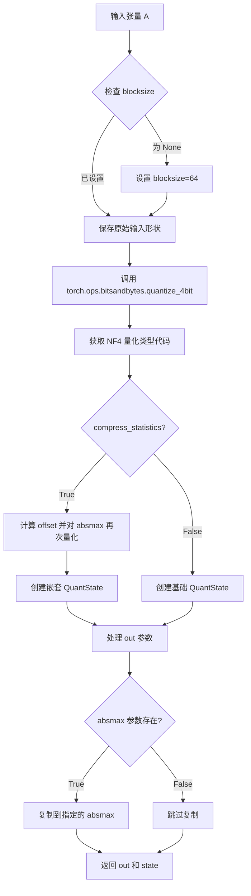

# `bitsandbytes\bitsandbytes\functional.py` 详细设计文档

这是一个用于神经网络权重8位和4位量化的核心库，支持动态量化、NF4、FP4等量化方法，提供量化/反量化操作、优化器更新、矩阵运算（GEMM）等GPU加速功能，主要用于大语言模型的量化推理和训练。

## 整体流程



## 类结构

```
Singleton Classes (单例类)
├── GlobalPageManager (页面内存管理)
├── CUBLAS_Context (cuBLAS上下文)
└── Cusparse_Context (cuSPARSE上下文)

Data Classes (数据结构)
├── QuantState (量化状态容器)
├── COOSparseTensor (COO格式稀疏张量)
├── CSRSparseTensor (CSR格式稀疏张量)
└── CSCSparseTensor (CSC格式稀疏张量)

Quantization Functions (量化函数)
├── create_*_map (量化映射创建)
│   ├── create_linear_map
│   ├── create_normal_map (NF4)
│   ├── create_fp8_map (FP4)
│   └── create_dynamic_map
├── quantize_* (量化)
│   ├── quantize_blockwise (8位块量化)
│   ├── quantize_4bit (4位量化)
│   ├── quantize_fp4
│   └── quantize_nf4
└── dequantize_* (反量化)
    ├── dequantize_blockwise
    ├── dequantize_4bit
    ├── dequantize_fp4
    └── dequantize_nf4

Optimizer Functions (优化器函数)
├── optimizer_update_32bit
├── optimizer_update_8bit (已废弃)
└── optimizer_update_8bit_blockwise

Matrix Operations (矩阵运算)
├── gemv_4bit (4位矩阵向量乘)
├── igemm / batched_igemm (整数矩阵乘)
├── int8_linear_matmul (int8矩阵乘)
├── int8_mm_dequant (int8反量化矩阵乘)
└── spmm_coo / spmm_coo_very_sparse (稀疏矩阵乘)
```

## 全局变量及字段


### `name2qmap`
    
全局字典，用于缓存量化映射表（quantization maps），避免重复创建

类型：`dict`
    


### `str2optimizer8bit`
    
全局字典，映射优化器名称到对应的8位优化器C函数元组

类型：`dict`
    


### `FIRST_CUDA_DEVICE`
    
第一个CUDA设备对象，索引为0

类型：`torch.device`
    


### `C`
    
常量127.0，用于量化计算中的缩放因子

类型：`float`
    


### `GlobalPageManager._instance`
    
单例实例，用于全局页面管理器

类型：`Optional[GlobalPageManager]`
    


### `GlobalPageManager.paged_tensors`
    
存储已分页张量的列表，用于内存管理

类型：`list`
    


### `CUBLAS_Context._instance`
    
单例实例，用于CUDA BLAS上下文管理

类型：`Optional[CUBLAS_Context]`
    


### `CUBLAS_Context.context`
    
字典，存储设备索引到CUBLAS上下文的映射

类型：`dict`
    


### `Cusparse_Context._instance`
    
单例实例，用于CUDA稀疏矩阵上下文管理

类型：`Optional[Cusparse_Context]`
    


### `Cusparse_Context.context`
    
Cusparse上下文的指针引用

类型：`ct.c_void_p`
    


### `QuantState.absmax`
    
存储每个量化块的绝对最大值，用于反量化时的缩放

类型：`torch.Tensor`
    


### `QuantState.shape`
    
原始张量的形状信息

类型：`Optional[torch.Size]`
    


### `QuantState.code`
    
量化查找表/码本，用于将量化值映射回浮点值

类型：`torch.Tensor`
    


### `QuantState.dtype`
    
原始输入张量的数据类型

类型：`torch.dtype`
    


### `QuantState.blocksize`
    
量化块的大小，决定了多少元素共享一个缩放因子

类型：`int`
    


### `QuantState.quant_type`
    
量化类型标识符，如'fp4'、'nf4'等

类型：`str`
    


### `QuantState.offset`
    
用于嵌套量化时的偏移量

类型：`Optional[torch.Tensor]`
    


### `QuantState.state2`
    
嵌套的第二个QuantState，用于存储二次量化的状态

类型：`Optional[QuantState]`
    


### `QuantState.nested`
    
标志位，指示是否启用了嵌套量化

类型：`bool`
    


### `QuantState.valid_quant_types`
    
类属性，有效的量化类型元组

类型：`tuple`
    


### `QuantState.valid_qs_type_keys`
    
类属性，有效的量化状态类型键列表

类型：`list`
    


### `QuantState.valid_qs_keys`
    
类属性，有效的量化状态键列表

类型：`list`
    


### `COOSparseTensor.rows`
    
稀疏矩阵的行数

类型：`int`
    


### `COOSparseTensor.cols`
    
稀疏矩阵的列数

类型：`int`
    


### `COOSparseTensor.nnz`
    
非零元素的数量

类型：`int`
    


### `COOSparseTensor.rowidx`
    
行索引张量，记录每个非零元素的行位置

类型：`torch.Tensor`
    


### `COOSparseTensor.colidx`
    
列索引张量，记录每个非零元素的列位置

类型：`torch.Tensor`
    


### `COOSparseTensor.values`
    
非零元素的值张量

类型：`torch.Tensor`
    


### `CSRSparseTensor.rows`
    
稀疏矩阵的行数

类型：`int`
    


### `CSRSparseTensor.cols`
    
稀疏矩阵的列数

类型：`int`
    


### `CSRSparseTensor.nnz`
    
非零元素的数量

类型：`int`
    


### `CSRSparseTensor.rowptr`
    
行指针张量，用于CSR格式定位每行的起始位置

类型：`torch.Tensor`
    


### `CSRSparseTensor.colidx`
    
列索引张量

类型：`torch.Tensor`
    


### `CSRSparseTensor.values`
    
非零元素的值张量

类型：`torch.Tensor`
    


### `CSCSparseTensor.rows`
    
稀疏矩阵的行数

类型：`int`
    


### `CSCSparseTensor.cols`
    
稀疏矩阵的列数

类型：`int`
    


### `CSCSparseTensor.nnz`
    
非零元素的数量

类型：`int`
    


### `CSCSparseTensor.colptr`
    
列指针张量，用于CSC格式定位每列的起始位置

类型：`torch.Tensor`
    


### `CSCSparseTensor.rowidx`
    
行索引张量

类型：`torch.Tensor`
    


### `CSCSparseTensor.values`
    
非零元素的值张量

类型：`torch.Tensor`
    
    

## 全局函数及方法


### `_cuda_device_of`

该函数用于获取输入张量所在的 CUDA 设备。当系统存在多个 GPU 时，它返回张量所在的设备；当仅有一个 GPU 时，为避免不必要的设备切换开销（cudaGetDevice/cudaSetDevice），返回一个无操作的上下文管理器。

参数：

- `a`：`torch.Tensor`，需要获取其所在设备的张量

返回值：
- 多 GPU 情况：`torch.device`，张量所在的 CUDA 设备
- 单 GPU 情况：`contextlib.nullcontext`，无操作的上下文管理器

#### 流程图

```mermaid
flowchart TD
    A[开始] --> B{torch.cuda.device_count > 1?}
    B -->|是| C[返回 torch.cuda.device_of(a)]
    B -->|否| D[返回 contextlib.nullcontext()]
    C --> E[结束]
    D --> E
```

#### 带注释源码

```python
# 当存在多个 GPU 时，使用上下文管理器切换到张量对应的设备
# 然后再调用 C++ 库的 CUDA kernel
if torch.cuda.device_count() > 1:

    def _cuda_device_of(a: torch.Tensor):
        # 返回给定张量所在的 CUDA 设备
        return torch.cuda.device_of(a)
else:
    import contextlib

    def _cuda_device_of(a: torch.Tensor):
        # 单 GPU 场景下，无需执行设备切换
        # 返回空上下文管理器，避免额外开销
        return contextlib.nullcontext()
```


### `get_paged`

该函数用于在 CUDA 设备上分配一个分页（paged）内存的张量。它通过调用 C 扩展库获取托管内存指针，创建一个与指定形状和数据类型匹配的张量，并标记该张量为分页张量，同时记录其所在设备 ID。

参数：

- `*shape`：`int`，可变长度参数列表，指定张量的维度（例如 `(3, 4)` 表示创建 3x4 的张量）
- `dtype`：`torch.dtype`，创建的张量的数据类型，默认为 `torch.float32`
- `device`：`torch.device`，指定 CUDA 设备，默认为 `FIRST_CUDA_DEVICE`（即 cuda:0）

返回值：`torch.Tensor`，返回创建的分页张量，该张量具有 `is_paged=True` 属性和 `page_deviceid` 属性记录设备索引。

#### 流程图

```mermaid
flowchart TD
    A[开始] --> B[计算所需字节数: num_bytes = dtype.itemsize × prod(shape)]
    B --> C[调用C库函数 cget_managed_ptr 分配托管内存]
    C --> D[将CUDA指针转换为C指针]
    D --> E[使用numpy.ctypeslib.as_array创建数组视图]
    E --> F[使用torch.frombuffer从数组缓冲区创建张量]
    F --> G[使用.view方法将张量reshape为目标形状]
    G --> H[设置张量属性: is_paged = True]
    H --> I[设置张量属性: page_deviceid = device.index]
    I --> J[返回分页张量]
```

#### 带注释源码

```python
def get_paged(*shape, dtype=torch.float32, device=FIRST_CUDA_DEVICE):
    # 计算所需内存字节数：数据类型大小 × 所有维度的元素总数
    # 例如：float32(4字节) × (3×4=12) = 48 字节
    num_bytes = dtype.itemsize * prod(shape)
    
    # 调用C扩展库函数分配托管内存（managed memory）
    # 返回一个CUDA设备上的指针
    cuda_ptr = lib.cget_managed_ptr(ct.c_size_t(num_bytes))
    
    # 将CUDA指针转换为C语言整数指针
    c_ptr = ct.cast(cuda_ptr, ct.POINTER(ct.c_int))
    
    # 使用numpy将C指针转换为numpy数组视图
    # 这个数组共享底层内存但没有拷贝
    new_array = np.ctypeslib.as_array(c_ptr, shape=shape)
    
    # 使用torch.frombuffer从numpy数组缓冲区创建PyTorch张量
    # count指定元素数量，dtype指定数据类型
    out = torch.frombuffer(new_array, dtype=dtype, count=prod(shape)).view(shape)
    
    # 标记该张量为分页张量，用于后续的内存管理识别
    out.is_paged = True
    
    # 记录该分页张量所在的CUDA设备索引
    out.page_deviceid = device.index
    
    # 返回创建的分页张量
    return out
```


### `prefetch_tensor`

该函数用于将分页张量（paged tensor）预取到指定设备（GPU或CPU）。它通过调用C++扩展库中的`cprefetch`函数，实现对分页内存的高效数据迁移，是bitsandbytes库中管理分页内存状态的关键函数。

参数：

- `A`：`torch.Tensor`，要预取的分页张量，必须是通过`get_paged`函数创建的带有`is_paged`属性的张量。
- `to_cpu`：`bool`，默认为`False`。当设置为`True`时，将张量预取到CPU内存；否则预取到张量原始的`page_deviceid`所指定的GPU设备。

返回值：`None`，该函数无返回值，执行结果通过张量的内存状态变化体现。

#### 流程图



#### 带注释源码

```python
def prefetch_tensor(A: torch.Tensor, to_cpu=False):
    """
    预取分页张量到指定设备。
    
    Args:
        A: 分页张量，必须是通过 get_paged() 创建的张量
        to_cpu: 是否预取到 CPU，默认为 False（预取到 GPU）
    """
    # 断言检查：只有分页张量才能被预取
    # is_paged 属性在 get_paged() 函数中设置
    assert A.is_paged, "Only paged tensors can be prefetched!"
    
    # 根据 to_cpu 参数决定目标设备ID
    # -1 表示 CPU 设备
    # A.page_deviceid 保存了张量原始创建的 GPU 设备索引
    if to_cpu:
        deviceid = -1
    else:
        deviceid = A.page_deviceid

    # 调用 C++ 扩展库中的 prefetch 函数
    # 参数1: 张量的内存指针，通过 get_ptr(A) 获取
    # 参数2: 张量的字节大小，A.nbytes
    # 参数3: 目标设备ID，-1 表示 CPU，非负数表示 GPU 设备索引
    lib.cprefetch(get_ptr(A), ct.c_size_t(A.nbytes), ct.c_int32(deviceid))
```


### `elementwise_func`

该函数是一个底层 CUDA 元素级操作封装器，根据输入张量的数据类型（float32 或 uint8）动态选择对应的 C 扩展函数，并处理分页内存的预取和同步，确保在 GPU 上执行高效的元素级运算。

参数：

- `func_name`：`str`，操作的函数名称（如 "fill"、"_mul" 等），用于构造 C 函数的符号名
- `A`：`torch.Tensor`，第一个输入张量，决定数据类型和 CUDA 指针
- `B`：`Optional[torch.Tensor]`，第二个输入张量，可为 None（如 fill 操作时）
- `value`：数值，操作所需的标量值，会根据 A 的数据类型转换为对应的 ctypes 类型
- `prefetch`：`bool`，是否在执行前预取分页内存，默认为 True

返回值：`None`，该函数执行原地操作，结果存储在张量 A 中

#### 流程图

```mermaid
flowchart TD
    A([开始 elementwise_func]) --> B{获取 func_name}
    B --> C{A.dtype == float32?}
    C -->|是| D[获取 c{func_name}_fp32]
    C -->|否| E{A.dtype == uint8?}
    E -->|是| F[获取 c{func_name}_uint8]
    E -->|否| G[抛出 NotImplementedError]
    D --> H[转换 value 为 c_float]
    F --> I[转换 value 为 c_uint8]
    H --> J{is_managed 且 prefetch?}
    I --> J
    J -->|是| K[预取 A 的数据]
    J -->|否| L
    K --> M{B 不为 None?}
    M -->|是| N[预取 B 的数据]
    M -->|否| L
    N --> L[调用 C 函数执行操作]
    L --> O{A 或 B 是 paged?}
    O -->|是| P[torch.cuda.synchronize]
    O -->|否| Q([结束])
    P --> Q
    G --> Q
```

#### 带注释源码

```python
def elementwise_func(func_name, A, B, value, prefetch=True):
    """执行 CUDA 元素级操作的底层封装函数
    
    Args:
        func_name: str, 操作名称，用于动态查找 C 扩展函数
        A: torch.Tensor, 第一个输入张量，决定数据类型和内存地址
        B: Optional[torch.Tensor], 第二个输入张量，可为 None
        value: 数值，操作所需的标量参数
        prefetch: bool, 是否在执行前预取分页内存到 GPU
    """
    func = None
    # 根据 A 的数据类型选择对应的 C 函数实现
    if A.dtype == torch.float32:
        # 尝试获取 32 位浮点版本的 C 函数
        func = getattr(lib, f"c{func_name}_fp32", None)
        # 将 Python 值转换为 C float 类型
        cvalue = ct.c_float(value)
    elif A.dtype == torch.uint8:
        # 尝试获取 8 位无符号整版本的 C 函数
        func = getattr(lib, f"c{func_name}_uint8", None)
        # 将 Python 值转换为 C uint8 类型
        cvalue = ct.c_uint8(value)

    # 如果没有找到对应的 C 函数实现，抛出异常
    if func is None:
        raise NotImplementedError(f"Function not implemented: {func_name}")

    # 检查 A 是否为托管内存（分页内存）
    is_managed = getattr(A, "is_managed", False)
    # 如果启用预取且 A 为托管内存，则将数据预取到 GPU
    if is_managed and prefetch:
        prefetch_tensor(A)
        # 如果存在第二个张量 B，也进行预取
        if B is not None:
            prefetch_tensor(B)

    # 调用 C 扩展函数执行实际的元素级操作
    # 参数：GPU 指针 A、GPU 指针 B、转换后的值、元素个数
    func(get_ptr(A), get_ptr(B), cvalue, ct.c_int64(A.numel()))
    
    # 如果操作涉及分页内存，需要同步 CUDA 流
    # 因为分页函数是完全异步的，为确保返回时张量处于正确最终状态
    if A.is_paged or B.is_paged:
        # paged function are fully asynchronous
        # if we return from this function, we want to the tensor
        # to be in the correct state, that is the final state after the
        # operation occurred. So we synchronize.
        torch.cuda.synchronize()
```


### `fill`

该函数是一个高层封装函数，用于将张量 `A` 的所有元素填充为指定的值 `value`。它通过调用底层的 `elementwise_func` 函数来实现针对 float32 和 uint8 数据类型的元素级操作，并支持对分页内存张量的预取和同步机制。

参数：

- `A`：`torch.Tensor`，需要填充的目标张量，支持 float32 和 uint8 数据类型
- `value`：数值类型（float 或 int），要填充的具体值
- `device`：`torch.device` 或 `None`，目标设备（当前代码中未直接使用，仅作为接口预留）
- `prefetch`：`bool`，是否在操作前对分页内存张量进行预取，默认为 True

返回值：无（`None`），该函数直接修改输入张量 `A` 的内容，属于原地操作

#### 流程图



#### 带注释源码

```python
def fill(A, value, device=None, prefetch=True):
    """
    将输入张量 A 的所有元素填充为指定的值 value。
    
    这是一个高层封装函数，底层通过调用 C 扩展库中的 elementwise 操作
    实现高效的原地填充。支持 float32 和 uint8 两种数据类型。
    
    参数:
        A: torch.Tensor - 需要填充的目标张量
        value: 数值类型 - 填充的具体值
        device: torch.device - 目标设备（当前版本未使用）
        prefetch: bool - 是否对托管内存张量进行预取
    
    返回:
        无返回值，直接修改输入张量 A
    """
    # 调用 elementwise_func 执行实际的填充操作
    # 传入 "fill" 作为函数名称，None 作为第二个操作数 B（因为是单目填充操作）
    elementwise_func("fill", A, None, value)


def elementwise_func(func_name, A, B, value, prefetch=True):
    """
    底层元素级操作的分发函数，根据张量数据类型选择对应的 C 函数。
    
    参数:
        func_name: str - 操作名称（如 "fill", "_mul" 等）
        A: torch.Tensor - 第一个操作数张量
        B: torch.Tensor 或 None - 第二个操作数张量
        value: 数值 - 操作使用的值
        prefetch: bool - 是否预取分页内存
    
    返回:
        无返回值，原地修改张量 A
    """
    func = None
    # 根据 A 的数据类型选择对应的 C 函数
    if A.dtype == torch.float32:
        # 获取 float32 版本的 C 函数
        func = getattr(lib, f"c{func_name}_fp32", None)
        # 将 Python 值转换为 ctypes 类型
        cvalue = ct.c_float(value)
    elif A.dtype == torch.uint8:
        # 获取 uint8 版本的 C 函数
        func = getattr(lib, f"c{func_name}_uint8", None)
        cvalue = ct.c_uint8(value)
    
    # 如果没有找到对应的实现，抛出异常
    if func is None:
        raise NotImplementedError(f"Function not implemented: {func_name}")
    
    # 检查 A 是否为托管内存（managed memory）张量
    is_managed = getattr(A, "is_managed", False)
    # 如果是托管内存且启用了预取，则预取相关张量到目标设备
    if is_managed and prefetch:
        prefetch_tensor(A)
        if B is not None:
            prefetch_tensor(B)
    
    # 获取张量的内存指针
    ptr_A = get_ptr(A)
    ptr_B = get_ptr(B)
    
    # 调用底层 C 函数执行实际操作
    # 参数：指针A，指针B，转换后的值，元素个数
    func(ptr_A, ptr_B, cvalue, ct.c_int64(A.numel()))
    
    # 如果操作涉及分页张量，需要同步 CUDA 以确保操作完成
    if A.is_paged or (B is not None and B.is_paged):
        # 分页函数是完全异步的
        # 如果从此函数返回，我们希望张量处于正确的最终状态
        # 因此需要同步
        torch.cuda.synchronize()
```


### `_mul`

该函数是一个全局张量运算函数，用于执行逐元素乘法操作（实际上是调用 C 扩展实现的 in-place 乘法操作，但参数 value 固定为 0，这可能是一个占位符或用于后续扩展）。

参数：

- `A`：`torch.Tensor`，参与运算的第一个输入张量
- `B`：`torch.Tensor`，参与运算的第二个输入张量
- `device`：`Optional[torch.device]`，可选参数，指定运算设备（当前函数体中未使用）

返回值：`None`，该函数无返回值，执行 in-place 张量修改

#### 流程图



#### 带注释源码

```python
def _mul(A, B, device=None):
    """
    执行逐元素乘法操作（调用底层 C 扩展）。
    
    注意：虽然名为 _mul，但实际调用时 value 参数固定为 0，
    这意味着实际执行的是 in-place 操作而非真正的乘法。
    该函数主要是为底层 C 扩展提供 Python 调用接口。
    
    参数:
        A: 第一个输入张量，支持 float32 或 uint8 数据类型
        B: 第二个输入张量，支持 float32 或 uint8 数据类型
        device: 可选参数，指定目标设备（当前未使用）
    
    返回:
        无返回值，执行 in-place 修改
    """
    # 调用 elementwise_func 执行底层 C 扩展
    # 传入 "_mul" 作为函数名标识，value=0 表示乘法操作（实际为占位）
    elementwise_func("_mul", A, B, 0)
```


### `create_linear_map`

该函数用于创建线性量化映射表（Linear Quantization Map），生成一个 256 元素的查找表，用于将浮点值线性映射到量化后的整数索引。映射表的值被归一化到 [-1, 1] 范围内，支持有符号和无符号量化，并自动填充零值以补齐到 256 元素便于 8 位索引。

参数：

- `signed`：`bool`，指示量化映射是否包含负值。为 `True` 时生成 [-1.0, 1.0] 范围，为 `False` 时生成 [0.0, 1.0] 范围
- `total_bits`：`int`，量化位宽，默认为 8 位。用于计算可表示的总值数量
- `add_zero`：`bool`，是否在映射表中显式添加零值。当模拟低于 8 位的量化时，需要将零值居中以补偿损失的值

返回值：`torch.Tensor`，256 元素的张量，包含排序后的量化级别值，归一化到 [-1, 1] 范围。前 `2^total_bits` 个元素为实际的量化映射值，剩余位置填充零值以满足 256 长度便于 8 位索引

#### 流程图

```mermaid
flowchart TD
    A[开始 create_linear_map] --> B{参数 signed?}
    B -->|True| C[sign = -1.0]
    B -->|False| D[sign = 0.0]
    C --> E[total_values = 2 ** total_bits]
    D --> E
    E --> F{add_zero or total_bits < 8?}
    F -->|True| G[计算 total_values]
    F -->|False| H[保持 total_values = 2 ** total_bits]
    G --> I[values = torch.linspace sign to 1.0, total_values]
    H --> I
    I --> J[gap = 256 - values.numel]
    J --> K{gap == 0?}
    K -->|True| L[返回 values]
    K -->|False| M[l = values.numel // 2]
    M --> N[构造新张量: values[:l] + [0]*gap + values[l:]]
    N --> O[返回新张量]
```

#### 带注释源码

```python
def create_linear_map(signed=True, total_bits=8, add_zero=True):
    # 根据 signed 参数确定量化范围的起始值
    # 有符号量化: 范围 [-1.0, 1.0]，使用 -1.0 作为起点
    # 无符号量化: 范围 [0.0, 1.0]，使用 0.0 作为起点
    sign = -1.0 if signed else 0.0
    
    # 根据位宽计算可表示的总值数量
    # 例如 8 位: 2^8 = 256 个值
    total_values = 2**total_bits
    
    # 判断是否需要添加零值或使用少于 8 位
    # 当 add_zero=True 或 total_bits < 8 时，需要特殊处理
    if add_zero or total_bits < 8:
        # 添加零值的原因：
        # 由于我们通过在数据类型中放置零来模拟较少的位数
        # 需要围绕零中心化量化，因此会损失一个值
        # 有符号: 2^total_bits - 1 (损失一个位置给零)
        # 无符号: 2^total_bits
        total_values = 2**total_bits if not signed else 2**total_bits - 1

    # 使用 torch.linspace 生成从 sign 到 1.0 的线性间隔值
    # 生成 total_values 个等间距的点
    values = torch.linspace(sign, 1.0, total_values)
    
    # 计算与 256 的差距
    # 256 是为了方便 8 位索引（每个字节 0-255）
    gap = 256 - values.numel()
    
    # 如果正好是 256 个值，直接返回
    if gap == 0:
        return values
    else:
        # 需要填充零值到 256 长度
        # 计算分割点 l（中间位置）
        l = values.numel() // 2  # noqa: E741
        
        # 构建返回张量：
        # 前半部分原始值 + gap 个零值 + 后半部分原始值
        # 这种布局将零值分散在映射表中间位置
        return torch.Tensor(values[:l].tolist() + [0] * gap + values[l:].tolist())
```


### `create_normal_map`

该函数用于创建 NormalFloat (NF4) 量化映射表，通过计算标准正态分布 N(0, 1) 的分位数来生成16个量化值，并存储在256元素的张量中以便于8位索引。这些量化值经过归一化处理到 [-1, 1] 范围内，专门用于神经网络权重等呈正态分布的数据的4位量化。

参数：

- `offset`：`float`，最外层分位数边界，控制正态分布的覆盖范围，默认为 0.9677083（约覆盖 1.845 个标准差）
- `use_extra_value`：`bool`，如果为 True 则创建非对称类型（8个负值+9个正值+零值，共15个非零值），否则创建对称类型（7个负值+7个正值+零值，共14个非零值），默认为 True

返回值：`torch.Tensor`，256元素的张量，前16个值为排序后的 NF4 量化级别（归一化到 [-1, 1]），其余值为零（用于8位索引的填充）

#### 流程图



#### 带注释源码

```python
def create_normal_map(offset=0.9677083, use_extra_value=True):
    """Create the NormalFloat (NF4) quantization map.

    Constructs a lookup table of 16 quantization values (stored in a 256-element tensor for
    indexing convenience) derived from quantiles of the standard normal distribution N(0, 1).
    Each bin has approximately equal probability mass under the normal distribution, which is
    optimal for normally-distributed data like neural network weights.

    Unlike floating-point types (FP4, FP8), NF4 is NOT a float encoding — the 4-bit index is
    simply a lookup into this table. There is no sign/exponent/mantissa decomposition.

    The values are generated by computing ``scipy.stats.norm.ppf()`` (inverse CDF) at evenly
    spaced quantile points, then normalizing to [-1, 1].

    For more details, see: QLoRA: Efficient Finetuning of Quantized LLMs
    (https://arxiv.org/abs/2305.14314)

    Args:
        offset: The outermost quantile boundary, controlling the range of the normal distribution
            that is covered. ``norm.ppf(offset)`` gives the largest bin edge in standard deviations.
            The default (0.9677083) covers up to ~1.845 standard deviations and was empirically
            optimized to minimize quantization error for typical neural network weight distributions.
        use_extra_value: If True, creates an asymmetric type with 8 negative and 9 positive values
            (including zero), for 15 non-zero values total. If False, creates a symmetric type
            with 7 negative and 7 positive values (14 non-zero values total).

    Returns:
        A 256-element tensor where the first 16 values are the sorted NF4 quantization levels
        normalized to [-1, 1], and the remaining values are zero (padding for 8-bit indexing).
    """
    # 导入scipy的正态分布函数，如果未安装则抛出明确的错误信息
    try:
        from scipy.stats import norm
    except ImportError as ie:
        raise ImportError(
            "Scipy is required for `create_normal_map`. Install `bitsandbytes` with the `[test]` extra.",
        ) from ie

    if use_extra_value:
        # 非对称类型：多一个正值，共15个非零值
        # 生成从offset到0.5的9个分位点，去掉最后一个（0.5本身）
        # 使用norm.ppf（逆累积分布函数）将分位点转换为标准差值
        v1 = norm.ppf(torch.linspace(offset, 0.5, 9)[:-1]).tolist()
        # 填充零值，使总长度为256（256-15=241个零）
        v2 = [0] * (256 - 15)
        # 负向值：取正向值的负数，也生成8个（去掉最后一个）
        v3 = (-norm.ppf(torch.linspace(offset, 0.5, 8)[:-1])).tolist()
    else:
        # 对称类型：共14个非零值
        # 正向生成8个分位点
        v1 = norm.ppf(torch.linspace(offset, 0.5, 8)[:-1]).tolist()
        # 填充零值（256-14=242个零）
        v2 = [0] * (256 - 14)
        # 负向值
        v3 = (-norm.ppf(torch.linspace(offset, 0.5, 8)[:-1])).tolist()

    # 合并正向值、零填充和负向值
    v = v1 + v2 + v3

    # 转换为PyTorch张量并排序
    values = torch.Tensor(v)
    values = values.sort().values
    # 归一化到[-1, 1]范围，除以最大值（最大正值）
    values /= values.max()

    # 验证输出长度正确
    assert values.numel() == 256

    return values
```


### `create_fp8_map`

该函数用于创建自定义浮点数格式（如 FP4、FP8 等）的量化查找表。通过可配置的指数位和尾数位生成符合 IEEE 754 风格的编码，支持正规值和次正规值的计算，并返回归一化到 [-1, 1] 范围的 256 元素张量。

参数：

- `signed`：`bool`，是否包含符号位
- `exponent_bits`：`int`，指数字段的位数
- `precision_bits`：`int`，尾数字段（精度/小数）的位数
- `total_bits`：`int`，每个值的总位数（必须等于 sign + exponent + precision）

返回值：`torch.Tensor`，256 元素的量化级别张量，归一化到 [-1, 1]。对于少于 8 位的类型，剩余条目为零填充。

#### 流程图

```mermaid
flowchart TD
    A[开始] --> B[计算 has_sign = 1 if signed else 0]
    B --> C{断言验证<br/>e + p == total_bits - has_sign}
    C -->|失败| D[抛出 AssertionError]
    C -->|成功| E[计算 exponent bias = 2^(exponent_bits - 1)]
    E --> F[遍历 exponent 值范围 0 到 2^exponent_bits]
    F --> G[遍历 precision 位模式的所有组合]
    G --> H{evalue == 0?}
    H -->|是| I[计算次正规值: value * 2^(-bias)]
    H -->|否| J[计算正规值: value * 2^-(evalue - bias - 1)]
    I --> K[添加 value 到列表]
    J --> K
    K --> L{signed?}
    L -->|是| M[添加 -value 到列表]
    L -->|否| N[继续下一个组合]
    M --> N
    N --> O{还有更多 exponent?}
    O -->|是| G
    O -->|否| P{断言 len(values) == 2^total_bits}
    P -->|失败| Q[抛出 AssertionError]
    P -->|成功| R[对 values 排序]
    R --> S{total_bits < 8?}
    S -->|是| T[计算 gap = 256 - len(values)]
    T --> U[添加 gap 个零到 values]
    S -->|否| V[再次排序 values]
    U --> V
    V --> W[转换为 torch.Tensor]
    W --> X[归一化: code /= code.max]
    X --> Y[返回 code 张量]
```

#### 带注释源码

```python
def create_fp8_map(signed=True, exponent_bits=5, precision_bits=2, total_bits=8):
    """Create a floating-point quantization map with configurable bit layout.

    Generates a lookup table for a custom floating-point format following IEEE 754-like encoding
    with configurable exponent and mantissa (precision) bits. Despite the name, this function
    handles any total bit width (including FP4 when called with ``total_bits=4``).

    The encoding uses:
        - Exponent bias: ``2^(exponent_bits - 1)``
        - Normal values: ``(1 + mantissa) * 2^(exponent - bias - 1)``
        - Subnormal values (exponent field = 0): ``mantissa * 2^(-bias)``

    Note: The values in the returned tensor are normalized by dividing by the maximum value,
    so the actual represented range is [-1, 1].

    For the FP4 type used in bitsandbytes (2 exponent bits, 1 mantissa bit, signed):
        ``create_fp8_map(signed=True, exponent_bits=2, precision_bits=1, total_bits=4)``

    Args:
        signed: Whether the format includes a sign bit.
        exponent_bits: Number of bits for the exponent field.
        precision_bits: Number of bits for the mantissa (precision/fraction) field.
        total_bits: Total number of bits per value (must equal sign + exponent + precision).

    Returns:
        A 256-element tensor of sorted quantization levels normalized to [-1, 1].
        For types with fewer than 8 bits, the remaining entries are zero-padded.
    """
    # 提取参数
    e = exponent_bits  # 5
    p = precision_bits  # 2
    has_sign = 1 if signed else 0  # 1
    
    # 验证位分配：指数位 + 精度位 = 总位数 - 符号位
    assert e + p == total_bits - has_sign
    
    # 计算指数偏差，用于正规值和次正规值的指数计算
    # 偏差 = 2^(e-1)，例如 e=5 时 bias=16
    bias = 2 ** (exponent_bits - 1)
    
    # 生成所有精度位模式的组合（0和1的所有排列）
    lst = list(itertools.product([0, 1], repeat=precision_bits))
    
    values = []  # 存储生成的量化值
    
    # 遍历所有可能的指数值（从 0 到 2^exponent_bits - 1）
    for evalue in range(2 ** (exponent_bits)):
        # 遍历所有精度位模式
        for bit_pattern in lst:
            # 初始化值：正规值有隐含的整数部分1，次正规值为0
            value = 1 if evalue != 0 else 0
            
            # 根据位模式计算尾数值（小数部分）
            # 例如 precision_bits=2 时，位模式 (1,0) 表示 1*2^-1 + 0*2^-2 = 0.5
            for i, pval in enumerate(list(bit_pattern)):
                value += pval * (2 ** -(i + 1))
            
            # 根据指数值应用正确的指数缩放
            if evalue == 0:
                # 次正规值：指数为0，使用 2^(-bias)
                # 次正规值用于表示非常接近零的数
                value = value * 2**-(bias)
            else:
                # 正规值：使用 2^(exponent - bias - 1)
                # 这是标准的浮点数表示
                value = value * 2 ** -(evalue - bias - 1)
            
            values.append(value)
            
            # 如果是有符号类型，添加负值
            if signed:
                values.append(-value)

    # 验证生成的值的数量是否符合预期
    assert len(values) == 2**total_bits
    
    # 对值进行排序
    values.sort()
    
    # 如果总位数少于8，用零填充到256个元素（便于8位索引）
    if total_bits < 8:
        gap = 256 - len(values)
        for i in range(gap):
            values.append(0)
    
    # 再次排序（添加零后需要重新排序）
    values.sort()
    
    # 转换为 PyTorch 张量
    code = torch.tensor(values)
    
    # 归一化：将值除以最大绝对值，使范围在 [-1, 1]
    code /= code.max()

    return code
```


### `create_dynamic_map`

创建动态量化映射表。动态数据类型由动态指数和分数（尾数）组成，随着指数从0增加到-7，可用于尾数的位数逐渐减少。该函数是动态量化类型的推广，允许保留一定数量的位用于线性量化区域。

参数：

- `signed`：`bool`，是否为有符号数，默认为True
- `max_exponent_bits`：`int`，最大指数位数，默认为7
- `total_bits`：`int`，总位数，默认为8

返回值：`torch.Tensor`，返回256元素的动态量化映射张量，值已归一化到[-1, 1]区间

#### 流程图

```mermaid
flowchart TD
    A[开始] --> B[计算非符号位数<br/>non_sign_bits = total_bits - 1]
    B --> C[计算额外项数量<br/>additional_items = 2^(non_sign_bits - max_exponent_bits) - 1]
    C --> D[循环 i 从 0 到 max_exponent_bits-1]
    D --> E[计算当前分数项数<br/>fraction_items]
    E --> F[生成边界和均值<br/>torch.linspace + mean计算]
    F --> G[根据指数生成量化值<br/>10^(-(max_exponent_bits-1)+i) * means]
    G --> H{signed?}
    H -->|Yes| I[添加负值<br/>data += -value]
    H -->|No| J[跳过负值]
    I --> K[检查additional_items > 0]
    J --> K
    K -->|Yes| L[处理额外项<br/>类似步骤E-J]
    K -->|No| M[添加0和1.0到data]
    M --> N[断言data长度 = 2^total_bits]
    N --> O[填充0到256元素<br/>gap = 256 - len(data)]
    O --> P[排序data]
    Q[结束] --> P
    
    D -->|循环结束| K
    L --> M
```

#### 带注释源码

```python
def create_dynamic_map(signed=True, max_exponent_bits=7, total_bits=8):
    """
    Creates the dynamic quantiztion map.

    The dynamic data type is made up of a dynamic exponent and
    fraction. As the exponent increase from 0 to -7 the number
    of bits available for the fraction shrinks.

    This is a generalization of the dynamic type where a certain
    number of the bits and be reserved for the linear quantization
    region (the fraction). n determines the maximum number of
    exponent bits.

    For more details see
    (8-Bit Approximations for Parallelism in Deep Learning)[https://arxiv.org/abs/1511.04561]
    """

    data = []  # 存储生成的量化值
    
    # 计算非符号位的数量（总位数减去符号位）
    non_sign_bits = total_bits - 1
    
    # 计算额外项数量：当所有指数位为0且没有指示位时的情况
    # 这表示最小的指数值对应的量化级别数量
    additional_items = 2 ** (non_sign_bits - max_exponent_bits) - 1
    
    # 遍历每个可能的指数位
    for i in range(max_exponent_bits):
        # 根据指数位置计算该层级可用的分数项数
        # 指数越小（绝对值越大），可用位数越少
        fraction_items = int(
            2 ** (i + non_sign_bits - max_exponent_bits + 1)
            if signed
            else 2 ** (i + non_sign_bits - max_exponent_bits + 1) + 1,
        )
        
        # 生成从0.1到1的等间距边界
        boundaries = torch.linspace(0.1, 1, fraction_items, dtype=torch.float32)
        # 计算相邻边界的中点作为量化代表值
        means = (boundaries[:-1] + boundaries[1:]) / 2.0
        
        # 根据指数幂次生成量化值
        # 10的负幂次对应不同的指数范围
        data += ((10 ** (-(max_exponent_bits - 1) + i)) * means).tolist()
        
        # 如果是有符号类型，同时添加负值
        if signed:
            data += (-(10 ** (-(max_exponent_bits - 1) + i)) * means).tolist()

    # 处理额外的项（当存在全零指数位模式时）
    if additional_items > 0:
        boundaries = torch.linspace(0.1, 1, additional_items + 1, dtype=torch.float32)
        means = (boundaries[:-1] + boundaries[1:]) / 2.0
        data += ((10 ** (-(max_exponent_bits - 1) + i)) * means).tolist()
        if signed:
            data += (-(10 ** (-(max_exponent_bits - 1) + i)) * means).tolist()

    # 添加零和最大值1.0作为量化边界
    data.append(0)
    data.append(1.0)

    # 验证生成的量化值数量是否符合预期
    assert len(data) == 2**total_bits

    # 填充到256个元素以方便8位索引
    gap = 256 - len(data)
    for i in range(gap):
        data.append(0)

    # 排序以确保量化级别有序
    data.sort()
    
    # 转换为PyTorch张量
    return torch.tensor(data, dtype=torch.float32)
```


### `is_on_gpu`

验证输入的张量是否全部位于同一个 GPU 设备上。该函数会检查所有非空且非分页的张量，确保它们的设备类型不为 "cpu"，并收集所有唯一的 GPU 设备标识（设备类型和索引）。如果发现任何张量不在 GPU 上，或发现多个不同的 GPU 设备，则抛出 `RuntimeError` 异常。

**参数：**

- `tensors`：`Iterable[Optional[torch.Tensor]]`，需要验证的张量列表，支持包含 None 值的可迭代对象

**返回值：** `Literal[True]`，始终返回 True，表示验证通过

#### 流程图

```mermaid
flowchart TD
    A[开始 is_on_gpu] --> B[初始化 on_gpu = True, gpu_ids = 空集合]
    B --> C[遍历 tensors 中的每个张量 t]
    C --> D{t 是否为 None}
    D -->|是| C
    D -->|否| E{t 是否有 is_paged 属性}
    E -->|是| C
    E -->|否| F[检查 t.device.type != 'cpu']
    F --> G[更新 on_gpu 状态]
    G --> H[添加 (device.type, device.index) 到 gpu_ids]
    H --> C
    C --> I{遍历结束}
    I --> J{on_gpu 为 False?}
    J -->|是| K[抛出 RuntimeError: 存在不在 GPU 上的张量]
    J -->|否| L{len(gpu_ids) > 1?}
    L -->|是| M[抛出 RuntimeError: 张量不在同一 GPU]
    L -->|否| N[返回 on_gpu = True]
    K --> O[结束]
    M --> O
    N --> O
```

#### 带注释源码

```python
def is_on_gpu(tensors: Iterable[Optional[torch.Tensor]]):
    """Verifies that the input tensors are all on the same device.

    An input tensor may also be marked as `paged`, in which case the device placement is ignored.

    Args:
        tensors (`Iterable[Optional[torch.Tensor]]`): A list of tensors to verify.

    Raises:
        `RuntimeError`: Raised when the verification fails.

    Returns:
        `Literal[True]`
    """

    # 初始化标志为 True，假设所有张量都在 GPU 上
    on_gpu = True
    # 用于存储不同的 GPU 设备标识 (device_type, device_index)
    gpu_ids = set()

    # 遍历所有输入的张量
    for t in tensors:
        # NULL 指针和 paged 张量是允许的，跳过检查
        if t is not None and not getattr(t, "is_paged", False):
            # 检查张量设备类型是否为非 CPU（即 GPU）
            on_gpu &= t.device.type != "cpu"
            # 记录当前张量的设备信息
            gpu_ids.add((t.device.type, t.device.index))

    # 如果发现任何张量不在 GPU 上，抛出运行时错误
    if not on_gpu:
        raise RuntimeError(
            f"All input tensors need to be on the same GPU, but found some tensors to not be on a GPU:\n {[(t.shape, t.device) for t in tensors]}",
        )

    # 如果发现多个不同的 GPU 设备，抛出运行时错误
    if len(gpu_ids) > 1:
        raise RuntimeError(
            f"Input tensors need to be on the same GPU, but found the following tensor and device combinations:\n {[(t.shape, t.device) for t in tensors]}",
        )
    
    # 验证通过，返回 True
    return on_gpu
```


### `_get_tensor_stream`

获取给定张量的底层CUDA/XPU原始流指针，用于与C扩展库进行高性能流同步。

参数：

- `tensor`：`Tensor`，PyTorch张量，用于获取其对应的CUDA/XPU流

返回值：`ct.c_void_p`，C语言空指针类型，表示当前CUDA/XPU流的原始指针

#### 流程图



#### 带注释源码

```python
def _get_tensor_stream(tensor: Tensor) -> ct.c_void_p:
    """
    获取给定张量的底层CUDA/XPU原始流指针。
    
    我们使用原始流（raw stream）而非封装后的流对象，以获得更好的性能。
    这在与C扩展库交互时特别重要，因为C库通常需要直接操作底层流句柄。
    
    参数:
        tensor: PyTorch张量，用于获取其对应的CUDA/XPU流
        
    返回:
        ct.c_void_p: 指向当前CUDA/XPU流的原始指针
    """
    # 检查张量所在的设备类型
    # 如果是Intel XPU设备，调用XPU特定的API获取原始流
    if tensor.device.type == "xpu":
        # 使用torch._C内部接口获取XPU原始流指针
        # 参数为XPU设备的索引号
        return ct.c_void_p(torch._C._xpu_getCurrentRawStream(tensor.device.index))
    
    # 默认情况下，假设为CUDA设备
    # 调用PyTorch C API获取CUDA原始流指针
    # 参数为CUDA设备的索引号
    return ct.c_void_p(torch._C._cuda_getCurrentRawStream(tensor.device.index))
```


### `get_ptr`

获取张量第一个元素的内存地址，用于与 C/C++ 扩展进行交互。

参数：

-  `A`：`Optional[Tensor]`，输入的 PyTorch 张量，可以为 None

返回值：`Optional[ct.c_void_p]`，指向张量底层数据的指针，如果输入为 None 则返回 None

#### 流程图



#### 带注释源码

```python
def get_ptr(A: Optional[Tensor]) -> Optional[ct.c_void_p]:
    """Gets the memory address of the first element of a tenso

    Args:
        A (`Optional[Tensor]`): A PyTorch tensor.

    Returns:
        `Optional[ct.c_void_p]`: A pointer to the underlying tensor data.
    """
    # 检查输入张量是否为 None
    if A is None:
        # 如果为 None，直接返回 None，保持类型一致性
        return None

    # 使用 PyTorch 的 data_ptr() 方法获取张量数据的原始指针地址
    # 然后使用 ctypes 的 c_void_p 封装为 C 可访问的指针类型
    return ct.c_void_p(A.data_ptr())
```


### quantize_blockwise

该函数执行输入张量的块级量化（Block-wise Quantization）。它使用特定的量化映射（Code，如动态量化图）将输入张量（支持 FP16/BF16/FP32）划分为大小为 `blocksize` 的块，计算每个块的绝对最大值（absmax）用于缩放，并将数据编码为低比特表示。函数返回量化后的张量以及包含解码所需元数据的 `QuantState` 对象。

参数：

-  `A`：`torch.Tensor`，输入张量，支持 `float16`、`bfloat16` 或 `float32` 数据类型。
-  `code`：`Optional[torch.Tensor]`，描述低比特数据类型的映射表。默认为带符号的 8 位动态类型。
-  `absmax`：`Optional[Tensor]`，用于存储 absmax 值的张量（已废弃参数）。
-  `out`：`Optional[Tensor]`，用于存储结果的张量（已废弃参数）。
-  `blocksize`：`int`，块的大小，默认为 4096。有效值为 64, 128, 256, 512, 1024, 2048, 4096。
-  `nested`：`bool`，是否额外对 absmax 值进行量化，默认为 False。

返回值：`Tuple[torch.Tensor, QuantState]`
- `torch.Tensor`：量化后的张量。
- `QuantState`：包含用于“反量化”状态的对象（例如 absmax、blocksize、quantization code）。

#### 流程图



#### 带注释源码

```python
def quantize_blockwise(
    A: torch.Tensor,
    code: Optional[torch.Tensor] = None,
    absmax: Optional[torch.Tensor] = None,
    out: Optional[torch.Tensor] = None,
    blocksize=4096,
    nested=False,
) -> tuple[torch.Tensor, QuantState]:
    """Quantize a tensor in blocks of values.

    The input tensor is quantized by dividing it into blocks of `blocksize` values.
    The the absolute maximum value within these blocks is calculated for scaling
    the non-linear quantization.

    Args:
        A (`torch.Tensor`): The input tensor. Supports `float16`, `bfloat16`, or `float32` datatypes.
        code (`torch.Tensor`, *optional*):
            A mapping describing the low-bit data type. Defaults to a signed 8-bit dynamic type.
            For more details, see  (8-Bit Approximations for Parallelism in Deep Learning)[https://arxiv.org/abs/1511.04561].
        absmax (`torch.Tensor`, *optional*): A tensor to use to store the absmax values.
        out (`torch.Tensor`, *optional*): A tensor to use to store the result.
        blocksize (`int`, *optional*):
            The size of the blocks. Defaults to 4096.
            Valid values are 64, 128, 256, 512, 1024, 2048, and 4096.
        nested (`bool`, *optional*): Whether to additionally quantize the absmax values. Defaults to False.

    Raises:
        ValueError: Raised when the input data type is not supported.

    Returns:
        `Tuple[torch.Tensor, QuantState]`: A tuple containing the quantization results.
        - `torch.Tensor`: The quantized tensor.
        - [`QuantState`]: The state object used to undo the quantization.
    """

    # 1. 获取或创建量化映射表 (Code)
    # 如果未提供 code，则使用全局缓存的 'dynamic' 映射，若无则创建并缓存
    if code is None:
        if "dynamic" not in name2qmap:
            name2qmap["dynamic"] = create_dynamic_map().to(A.device)
        code = name2qmap["dynamic"]

    # 2. 调用底层 CUDA kernel 执行实际的块级量化
    # 返回原始量化后的张量 _out 和对应的缩放因子 _absmax
    _out, _absmax = torch.ops.bitsandbytes.quantize_blockwise.default(
        A,
        code.to(A.device),
        blocksize,
    )

    # 3. 处理嵌套量化 (Nested Quantization)
    # 如果启用 nested，则对 absmax 值进行进一步的量化以节省内存
    if nested:
        offset = _absmax.mean()
        _absmax -= offset
        # 递归调用 quantize_blockwise 对 absmax 本身进行量化
        qabsmax, state2 = quantize_blockwise(_absmax, blocksize=blocksize, nested=False)
        # 构造包含二级状态的 QuantState
        quant_state = QuantState(
            absmax=qabsmax,
            code=code.to(A.device, copy=True),
            blocksize=blocksize,
            dtype=A.dtype,
            offset=offset,
            state2=state2,
        )
    else:
        # 构造普通的 QuantState
        quant_state = QuantState(absmax=_absmax, code=code.to(A.device, copy=True), blocksize=blocksize, dtype=A.dtype)

    # 4. 处理废弃的 'out' 参数
    # TODO(matthewdouglas): Deprecate out kwarg
    out = out.copy_(_out) if out is not None else _out

    # 5. 处理废弃的 'absmax' 参数
    # TODO(matthewdouglas): Deprecate absmax kwarg
    if absmax is not None:
        quant_state.absmax = absmax.copy_(quant_state.absmax)

    return out, quant_state
```


### `dequantize_blockwise`

该函数为 `bitsandbytes` 库中的核心量化逆变换函数，负责将块级量化后的张量（通常为 8 位动态整型）解量化回浮点精度（默认 float32）。它通过查找量化码本（codebook）并结合每个块的缩放因子（absmax）来恢复原始数值。函数支持“嵌套量化”（nested quantization），即对缩放因子本身进行二次量化以节省显存，同时也支持原地（in-place）操作以优化内存。

参数：

- `A`：`torch.Tensor`，待解量化的量化张量（通常是 uint8 类型）。
- `quant_state`：`Optional[QuantState]`（可选），包含解量化所需全部状态的容器对象（如缩放因子、量化码本、块大小等）。如果提供此参数，则忽略 `absmax` 和 `code` 参数。
- `absmax`：`Optional[torch.Tensor]`（可选），块级绝对最大值（缩放因子）。当 `quant_state` 未提供时必须传入。
- `code`：`Optional[torch.Tensor]`（可选），量化映射表（码本），定义了低-bit 数据类型的值。默认为动态 8-bit 量化映射。
- `out`：`Optional[torch.Tensor]`（可选），用于存储结果的预分配张量。如果指定，结果将直接写入此张量。
- `blocksize`：`int`（可选），块大小，默认为 4096。有效值为 64, 128, 256, 512, 1024, 2048, 4096。当 `quant_state` 提供时此参数被忽略。
- `nested`：`bool`（可选），布尔标志，用于指示是否对 `absmax` 进行了嵌套量化。实际逻辑主要依赖于 `quant_state` 对象内部的 `nested` 标志。

返回值：`torch.Tensor`，解量化后的浮点张量，数据类型由 `quant_state.dtype` 指定（通常为 `torch.float32`）。

#### 流程图

```mermaid
flowchart TD
    A([开始 dequantize_blockwise]) --> B{quant_state 是否为空?}
    B -- 是 --> C{absmax 是否为空?}
    C -- 是 --> D[抛出断言错误]
    C -- 否 --> E[使用 code, blocksize, absmax 构造 QuantState]
    B -- 否 --> F[从 quant_state 中提取 absmax, code, blocksize]
    E --> G
    F --> G{quant_state.nested 是否为真?}
    G -- 是 --> H[递归调用 dequantize_blockwise 解量化 absmax]
    H --> I[加上 offset 偏移量]
    I --> J{absmax 类型是否为 float32?}
    J -- 否 --> K[转换为 float32]
    J -- 是 --> L{out 参数是否指定?}
    G -- 否 --> L
    K --> L
    L -- 是 --> M[调用 torch.ops.bitsandbytes.dequantize_blockwise.out]
    M --> N([返回 out 张量])
    L -- 否 --> O[调用 torch.ops.bitsandbytes.dequantize_blockwise.default])
    O --> P([返回结果张量])
```

#### 带注释源码

```python
def dequantize_blockwise(
    A: torch.Tensor,
    quant_state: Optional[QuantState] = None,
    absmax: Optional[torch.Tensor] = None,
    code: Optional[torch.Tensor] = None,
    out: Optional[torch.Tensor] = None,
    blocksize: int = 4096,
    nested=False,
) -> torch.Tensor:
    """Dequantize a tensor in blocks of values.

    The input tensor is dequantized by dividing it into blocks of `blocksize` values.
    The the absolute maximum value within these blocks is used for scaling
    the non-linear dequantization.

    Args:
        A (`torch.Tensor`): The quantized input tensor.
        quant_state ([`QuantState`], *optional*):
            The quantization state as returned by [`quantize_blockwise`].
            Required if `absmax` is not provided.
        absmax (`torch.Tensor`, *optional*):
            A tensor containing the scaling values.
            Required if `quant_state` is not provided and ignored otherwise.
        code (`torch.Tensor`, *optional*):
            A mapping describing the low-bit data type. Defaults to a signed 8-bit dynamic type.
            For more details, see  (8-Bit Approximations for Parallelism in Deep Learning)[https://arxiv.org/abs/1511.04561].
            Ignored when `quant_state` is provided.
        out (`torch.Tensor`, *optional*): A tensor to use to store the result.
        blocksize (`int`, *optional*):
            The size of the blocks. Defaults to 4096.
            Valid values are 64, 128, 256, 512, 1024, 2048, and 4096.
            Ignored when `quant_state` is provided.

    Raises:
        ValueError: Raised when the input data type is not supported.

    Returns:
        `torch.Tensor`:
            The dequantized tensor. The datatype is indicated by `quant_state.dtype` and defaults to `torch.float32`.
    """

    # 1. 验证输入：必须提供 quant_state 或 absmax 之一
    assert quant_state is not None or absmax is not None
    
    # 2. 处理默认量化码本（Dynamic 8-bit）
    if code is None and quant_state is None:
        if "dynamic" not in name2qmap:
            name2qmap["dynamic"] = create_dynamic_map().to(A.device)
        code = name2qmap["dynamic"]

    # 3. 构建 QuantState 对象（如果只提供了 absmax）
    if quant_state is None:
        quant_state = QuantState(absmax=absmax, code=code, blocksize=blocksize, dtype=torch.float32)

    # 4. 提取缩放因子
    absmax = quant_state.absmax
    
    # 5. 处理嵌套量化（Nested Quantization）
    # 如果缩放因子本身也被量化了，需要先解量化缩放因子
    if quant_state.nested:
        # 递归解量化 absmax，使用第二层量化状态 state2
        absmax = dequantize_blockwise(quant_state.absmax, quant_state.state2)
        # 加上偏移量
        absmax += quant_state.offset
        # 确保数据类型为 float32 以进行后续计算
        if absmax.dtype != torch.float32:
            absmax = absmax.float()

    # 6. 调用底层 CUDA 核心进行解量化
    if out is not None:
        # 如果提供了输出张量，使用 out 变体（原地操作）
        torch.ops.bitsandbytes.dequantize_blockwise.out(
            A,
            absmax,
            quant_state.code.to(A.device),
            quant_state.blocksize,
            quant_state.dtype,
            out=out,
        )
        return out

    # 否则调用 default 变体，返回新的张量
    return torch.ops.bitsandbytes.dequantize_blockwise.default(
        A,
        absmax,
        quant_state.code.to(A.device),
        quant_state.blocksize,
        quant_state.dtype,
    )
```


### `get_4bit_type`

获取指定类型的 4-bit 量化查找表，根据不同的量化类型（nf4/fp4/int4/af4）返回对应的 16 个量化值，并归一化到 [-1, 1] 范围内。

参数：

- `typename`：`str`，量化类型标识符，支持 "nf4"（NormalFloat4）、"fp4"（4-bit 浮点）、"int4"（4-bit 有符号整数）和 "af4"（AbnormalFloat4）
- `device`：`str` 或 `torch.device`，可选，目标设备，默认为 "cuda"
- `blocksize`：`int`，可选，块大小，仅对 "af4" 类型有意义，默认为 64

返回值：`torch.Tensor`，包含 16 个元素的 1 维张量，为指定量化类型的查找表，已归一化到 [-1, 1] 范围

#### 流程图



#### 带注释源码

```python
def get_4bit_type(typename, device=None, blocksize=64):
    """获取 4-bit 量化类型的查找表

    Args:
        typename: 量化类型，支持 nf4, fp4, int4, af4
        device: 目标设备，默认为 cuda
        blocksize: 块大小，仅用于 af4 类型

    Returns:
        torch.Tensor: 16 元素的量化查找表，归一化到 [-1, 1]
    """
    # 默认使用 CUDA 设备
    if device is None:
        device = "cuda"
    
    data = None  # 初始化数据容器
    
    # NF4 (NormalFloat4) 量化类型
    # 这些值来自标准正态分布 N(0, 1) 的分位数，
    # 每个 bin 具有相等的概率质量。4-bit 索引只是表中的位置。
    # NF4 不是浮点编码（无符号/指数/尾数分解），这与 FP4 根本不同。
    if typename == "nf4":
        data = [
            -1.0, -0.6961928009986877, -0.5250730514526367, -0.39491748809814453,
            -0.28444138169288635, -0.18477343022823334, -0.09105003625154495, 0.0,
            0.07958029955625534, 0.16093020141124725, 0.24611230194568634,
            0.33791524171829224, 0.44070982933044434, 0.5626170039176941,
            0.7229568362236023, 1.0,
        ]
    
    # FP4 (4-bit 浮点) 量化类型
    # 与 NF4 不同，FP4 是实际的浮点编码：1 个符号位、2 个指数位、1 个尾数位
    # 指数偏置为 2，与 IEEE 754 不同
    elif typename == "fp4":
        data = [0, 0.0625, 8.0, 12.0, 4.0, 6.0, 2.0, 3.0,
                -0, -0.0625, -8.0, -12.0, -4.0, -6.0, -2.0, -3.0]
    
    # Int4 (4-bit 有符号整数) 量化类型
    elif typename == "int4":
        data = [7, 6, 5, 4, 3, 2, 1, 0, -0, -1, -2, -3, -4, -5, -6, -7]
    
    # AF4 (AbnormalFloat4) 量化类型
    # 来自论文：NF4 Isn't Information Theoretically Optimal
    elif typename == "af4":
        if blocksize == 64:
            data = [
                -1.0, -0.69441008, -0.51243739, -0.3736951,
                -0.25607552, -0.14982478, -0.04934812, 0.0,
                0.04273164, 0.12934483, 0.21961274, 0.31675666,
                0.42563882, 0.55496234, 0.72424863, 1.0,
            ][::-1]  # 反转数组
        else:
            raise NotImplementedError("4-bit AbnormalFloats currently only support blocksize 64.")
    
    # 如果没有匹配的类型，抛出异常
    if data is None:
        raise NotImplementedError(f"Typename {typename} not supported")
    
    # 转换为 PyTorch Tensor 并移动到指定设备
    data = torch.tensor(data, device=device)
    
    # 归一化到 [-1, 1] 范围：除以绝对值的最大值
    data.div_(data.abs().max())
    
    # 确保恰好有 16 个元素（4-bit = 16 个可能值）
    assert data.numel() == 16
    
    return data
```


### `quantize_fp4`

该函数是 4 位 FP4 (4-bit Floating Point) 量化的高层封装接口，通过调用 `quantize_4bit` 核心函数实现张量的 4 位 FP4 量化。它接收一个浮点张量，将其分割为块并使用 FP4 量化格式进行压缩，同时返回量化后的张量以及用于反量化的 QuantState 状态对象。

参数：

- `A`：`torch.Tensor`，输入张量，支持 `float16`、`bfloat16` 或 `float32` 数据类型。
- `absmax`：`Optional[torch.Tensor]`，可选，用于存储绝对最大值的张量。
- `out`：`Optional[torch.Tensor]`，可选，用于存储量化结果的张量。
- `blocksize`：`int`，可选，块大小，默认为 64。有效值为 32、64、128、256、512、1024、2048 和 4096。
- `compress_statistics`：`bool`，可选，是否额外量化绝对最大值，默认为 False。
- `quant_storage`：`torch.dtype`，可选，用于存储结果的张量数据类型，默认为 `torch.uint8`。

返回值：`tuple[torch.Tensor, QuantState]`，包含量化结果和量化状态的元组。第一个元素是打包后的 4 位量化张量，第二个元素是用于反量化的状态对象。

#### 流程图

```mermaid
flowchart TD
    A[开始 quantize_fp4] --> B{blocksize是否为None}
    B -->|是| C[设置blocksize=64]
    B -->|否| D[使用传入的blocksize]
    C --> E[保存输入张量形状]
    D --> E
    E --> F[调用torch.ops.bitsandbytes.quantize_4bit]
    F --> G[获取FP4量化码本<br>get_4bit_type]
    H{compress_statistics为True?}
    G --> H
    H -->|是| I[计算偏移量<br>计算qabsmax和state2<br>创建嵌套QuantState]
    H -->|否| J[创建基础QuantState]
    I --> K[处理out参数]
    J --> K
    K --> L{out参数非空?]
    L -->|是| M[复制_out到out]
    L -->|否| N[直接返回_out]
    M --> O[处理absmax参数]
    N --> O
    O --> P[返回out和state]
```

#### 带注释源码

```python
def quantize_fp4(
    A: torch.Tensor,                                    # 输入张量: float16/bfloat16/float32
    absmax: Optional[torch.Tensor] = None,             # 可选: 存储绝对最大值的张量
    out: Optional[torch.Tensor] = None,                # 可选: 存储输出结果
    blocksize=None,                                     # 可选: 块大小，默认64
    compress_statistics=False,                          # 可选: 是否压缩统计信息
    quant_storage=torch.uint8,                          # 可选: 量化存储数据类型
):
    # 该函数是 quantize_4bit 的包装器
    # 传入 quant_type="fp4" 指定使用 FP4 量化格式
    # FP4 是一种 4 位浮点格式，1 位符号位，2 位指数位，1 位尾数位
    return quantize_4bit(
        A, 
        absmax, 
        out, 
        blocksize, 
        compress_statistics, 
        "fp4",          # 指定 FP4 量化类型
        quant_storage
    )
```


### `quantize_nf4`

该函数是对 `quantize_4bit` 函数的便捷封装，专门用于 NF4（NormalFloat 4-bit）量化。它将输入张量按块进行 4-bit 量化，使用 NF4 数据类型，这是一种基于标准正态分布分位数的非浮点编码方式，非常适合量化神经网络权重。

参数：

- `A`：`torch.Tensor`，输入的张量，支持 `float16`、`bfloat16` 或 `float32` 数据类型
- `absmax`：`Optional[torch.Tensor]`，用于存储 absmax 值的张量（可选）
- `out`：`Optional[torch.Tensor]`，用于存储结果的张量（可选）
- `blocksize`：`int` 或 `None`，块大小，默认为 64；有效值为 32、64、128、256、512、1024、2048 和 4096（可选）
- `compress_statistics`：`bool`，是否额外量化 absmax 值，默认为 False（可选）
- `quant_storage`：`torch.dtype`，存储结果的张量数据类型，默认为 `torch.uint8`（可选）

返回值：`Tuple[torch.Tensor, QuantState]`，包含量化结果和量化状态的元组：
- `torch.Tensor`：打包后的 4-bit 量化张量
- `QuantState`：用于反量化的状态对象

#### 流程图



#### 带注释源码

```python
def quantize_nf4(
    A: torch.Tensor,  # 输入张量：float16/bfloat16/float32
    absmax: Optional[torch.Tensor] = None,  # 可选：预分配的 absmax 存储
    out: Optional[torch.Tensor] = None,      # 可选：预分配的结果存储
    blocksize=None,                          # 可选：块大小，默认 64
    compress_statistics=False,                # 可选：是否压缩统计信息
    quant_storage=torch.uint8,               # 可选：量化存储数据类型
):
    # quantize_nf4 是 quantize_4bit 的便捷包装函数
    # 内部直接调用 quantize_4bit 并指定 quant_type="nf4"
    return quantize_4bit(
        A,                      # 输入张量
        absmax,                 # absmax 张量
        out,                    # 输出张量
        blocksize,              # 块大小
        compress_statistics,    # 是否压缩统计信息
        "nf4",                  # 量化类型：NF4 (NormalFloat4)
        quant_storage           # 量化存储类型
    )
```


### `quantize_4bit`

该函数是 bitsandbytes 库中的核心量化函数，用于将输入的张量 A 按块（blocks）量化为 4-bit 表示。它通过调用底层的 CUDA/C++ 扩展 (`torch.ops.bitsandbytes.quantize_4bit`) 执行实际量化操作，支持 FP4 和 NF4 两种量化类型，并可选择性地对缩放因子（absmax）进行二次量化以压缩统计信息。

**参数：**

- `A`：`torch.Tensor`，输入张量，支持 `float16`、`bfloat16` 或 `float32` 数据类型。
- `absmax`：`Optional[torch.Tensor]`，可选张量，用于存储绝对最大值（缩放因子）。
- `out`：`Optional[torch.Tensor]`，可选张量，用于存储量化结果。
- `blocksize`：`Optional[int]`，块大小，默认为 64。有效值为 32、64、128、256、512、1024、2048 和 4096。
- `compress_statistics`：`bool`，是否额外量化 absmax 值以压缩统计信息，默认为 False。
- `quant_type`：`str`，量化数据类型，默认为 `"fp4"`，可选 `"nf4"`。
- `quant_storage`：`torch.dtype`，存储结果的张量数据类型，默认为 `torch.uint8`。

**返回值：** `Tuple[torch.Tensor, QuantState]`，包含量化结果元组：
- `torch.Tensor`：打包后的 4-bit 量化张量。
- `QuantState`：用于反量化的状态对象。

#### 流程图

```mermaid
flowchart TD
    A[开始 quantize_4bit] --> B{blocksize is None?}
    B -- 是 --> C[blocksize = 64]
    B -- 否 --> D[保留传入的 blocksize]
    C --> E[保存原始输入形状 input_shape]
    D --> E
    E --> F[调用 torch.ops.bitsandbytes.quantize_4bit.default<br/>获取量化结果 _out 和 absmax _absmax]
    F --> G[根据 quant_type 获取量化码表 code]
    H{compress_statistics?}
    G --> H
    H -- 是 --> I[计算 offset = _absmax.mean]
    I --> J[对 _absmax - offset 再次分块量化]
    J --> K[创建 QuantState 对象<br/>包含 qabsmax, offset, state2]
    H -- 否 --> L[创建 QuantState 对象<br/>包含 _absmax, code]
    K --> M{out is not None?}
    L --> M
    M -- 是 --> N[out.copy_(_out) 返回 out]
    M -- 否 --> O[返回 _out]
    N --> P{absmax is not None?}
    O --> P
    P -- 是 --> Q[state.absmax = absmax.copy_(state.absmax)]
    P -- 否 --> R[返回 out, state]
    Q --> R
```

#### 带注释源码

```python
def quantize_4bit(
    A: torch.Tensor,
    absmax: Optional[torch.Tensor] = None,
    out: Optional[torch.Tensor] = None,
    blocksize=None,
    compress_statistics=False,
    quant_type="fp4",
    quant_storage=torch.uint8,
) -> tuple[torch.Tensor, QuantState]:
    """Quantize tensor A in blocks of 4-bit values.

    Quantizes tensor A by dividing it into blocks which are independently quantized.

    Args:
        A (`torch.Tensor`): The input tensor. Supports `float16`, `bfloat16`, or `float32` datatypes.
        absmax (`torch.Tensor`, *optional*): A tensor to use to store the absmax values.
        out (`torch.Tensor`, *optional*): A tensor to use to store the result.
        blocksize (`int`, *optional`):
            The size of the blocks. Defaults to 64.
            Valid values are 32, 64, 128, 256, 512, 1024, 2048, and 4096.
        compress_statistics (`bool`, *optional*): Whether to additionally quantize the absmax values. Defaults to False.
        quant_type (`str`, *optional*): The data type to use: `nf4` or `fp4`. Defaults to `fp4`.
        quant_storage (`torch.dtype`, *optional*): The dtype of the tensor used to store the result. Defaults to `torch.uint8`.

    Raises:
        ValueError: Raised when the input data type is not supported.

    Returns:
        Tuple[`torch.Tensor`, `QuantState`]: A tuple containing the quantization results.
        - `torch.Tensor`: The quantized tensor with packed 4-bit values.
        - [`QuantState`]: The state object used to undo the quantization.
    """

    # 默认块大小为 64，这是 4-bit 量化的常用块大小
    if blocksize is None:
        blocksize = 64

    # 保存原始输入形状，用于后续反量化时恢复形状
    input_shape = A.shape

    # 调用底层的 CUDA/C++ 扩展执行实际的 4-bit 量化操作
    # 返回打包后的量化结果 _out 和每块的绝对最大值 _absmax
    _out, _absmax = torch.ops.bitsandbytes.quantize_4bit.default(
        A,
        blocksize,
        quant_type,
        quant_storage,
    )

    # 根据量化类型获取对应的量化码表（lookup table）
    # FP4 和 NF4 有不同的量化映射表
    code = get_4bit_type(quant_type, device=A.device)

    # 如果启用统计信息压缩，则对 absmax 值进行二次量化
    # 这可以减少存储的统计信息量，但会引入额外的量化误差
    if compress_statistics:
        # 计算偏移量，用于处理可能的负值
        offset = _absmax.mean()
        # 对去偏移后的 absmax 进行分块量化（使用更大的块大小 256）
        qabsmax, state2 = quantize_blockwise(_absmax - offset, blocksize=256)
        # 释放原始 _absmax 的内存
        del _absmax
        # 创建嵌套的 QuantState，包含二次量化的状态
        state = QuantState(
            absmax=qabsmax,
            shape=input_shape,
            dtype=A.dtype,
            blocksize=blocksize,
            code=code,
            quant_type=quant_type,
            offset=offset,
            state2=state2,
        )
    else:
        # 创建简单的 QuantState，直接存储原始 absmax
        state = QuantState(
            absmax=_absmax,
            shape=input_shape,
            dtype=A.dtype,
            blocksize=blocksize,
            code=code,
            quant_type=quant_type,
        )

    # 处理 deprecated 的 out 参数
    # 如果提供了 out 张量，则将结果复制到其中
    out = out.copy_(_out) if out is not None else _out

    # 处理 deprecated 的 absmax 参数
    # 如果用户提供了自己的 absmax 张量，则复制到其中
    if absmax is not None:
        state.absmax = absmax.copy_(state.absmax)

    # 返回量化后的张量和量化状态
    # 量化状态包含了反量化所需的所有信息
    return out, state
```


### `dequantize_fp4`

该函数是4位FP4量化张量的解量化（反量化）功能的入口包装器，通过调用通用的 `dequantize_4bit` 核心函数实现对FP4格式量化数据的恢复，将压缩的4位浮点数据解压缩还原为原始高精度张量。

参数：

- `A`：`torch.Tensor`，需要解量化的FP4量化输入张量
- `quant_state`：`Optional[QuantState]`，由 `quantize_4bit` 返回的量化状态对象，包含解量化所需的所有元数据（如缩放因子、块大小、量化类型等）
- `absmax`：`Optional[torch.Tensor]`，绝对最大值张量，用于存储每个量化块的缩放因子，当 `quant_state` 不提供时必须指定
- `out`：`Optional[torch.Tensor]`，用于存储解量化结果的可选输出张量
- `blocksize`：`Optional[int]`，量化块大小，默认值为64，有效值包括32、64、128、256、512、1024、2048、4096

返回值：`torch.Tensor`，解量化后的浮点张量

#### 流程图

```mermaid
graph TD
    A[开始 dequantize_fp4] --> B{quant_state 是否为 None}
    B -- 是 --> C{absmax 和 out 是否同时提供}
    B -- 否 --> D[调用 dequantize_4bit 函数]
    C -- 是 --> D
    C -- 否 --> E[抛出断言错误]
    D --> F[返回解量化后的张量]
    E --> F
```

#### 带注释源码

```python
def dequantize_fp4(
    A: torch.Tensor,                        # 输入：需要解量化的FP4量化张量
    quant_state: Optional[QuantState] = None,  # 可选：量化状态对象（包含absmax、blocksize等）
    absmax: Optional[torch.Tensor] = None,   # 可选：缩放因子张量
    out: Optional[torch.Tensor] = None,       # 可选：预分配输出张量
    blocksize: Optional[int] = None,          # 可选：量化块大小
) -> torch.Tensor:
    """
    解量化FP4格式的4位量化张量。
    
    这是一个轻量级包装函数，将FP4特定的参数传递给通用的 dequantize_4bit 函数。
    
    参数:
        A: FP4量化格式的输入张量
        quant_state: 量化状态（由 quantize_4bit 生成）
        absmax: 绝对最大值（缩放因子）
        out: 输出张量（可选）
        blocksize: 块大小（默认为64）
    
    返回:
        解量化后的浮点张量
    """
    # 调用核心解量化函数，指定 quant_type 为 "fp4"
    return dequantize_4bit(
        A,              # 量化输入张量
        quant_state,    # 量化状态对象
        absmax,         # 缩放因子
        out,            # 输出张量
        blocksize,      # 块大小
        "fp4"           # 量化类型：FP4格式
    )
```


### `dequantize_nf4`

该函数是 NF4（NormalFloat 4-bit）量化张量的解量化包装函数，通过调用通用的 `dequantize_4bit` 内核将 4 位量化数据还原为浮点张量。

参数：

-  `A`：`torch.Tensor`，NF4 量化后的输入张量
-  `quant_state`：`Optional[QuantState]`，[`quantize_4bit`] 返回的量化状态对象，包含解量化所需的量化映射和缩放因子
-  `absmax`：`Optional[torch.Tensor]`，绝对最大值张量，用于缩放解量化结果
-  `out`：`Optional[torch.Tensor]`，
-  `blocksize`：`Optional[int]`，块大小，默认为 64

返回值：`torch.Tensor`，解量化后的浮点张量

#### 流程图

```mermaid
flowchart TD
    A1["开始 dequantize_nf4"] --> A2{"检查 quant_state 是否为 None"}
    A2 -->|是| A3{"检查 absmax 和 out 是否同时不为 None"}
    A3 -->|是| A4["构造临时 QuantState"]
    A3 -->|否| A5["抛出断言错误"]
    A2 -->|否| A6["提取 quant_state 中的参数"]
    A6 --> A7{"检查嵌套量化状态"}
    A7 -->|是| A8["递归调用 dequantize_blockwise 解码嵌套的 absmax"]
    A8 --> A9["加上偏移量 offset"]
    A9 --> A10{"检查 absmax 数据类型"}
    A10 -->|非 float32| A11["转换为 float32"]
    A10 -->|是| A12["继续"]
    A7 -->|否| A12
    A11 --> A12
    A12 --> A13{"检查 out 是否提供"}
    A13 -->|是| A14["调用 torch.ops.bitsandbytes.dequantize_4bit.out<br/>并将结果写入 out"]
    A13 -->|否| A15["调用 torch.ops.bitsandbytes.dequantize_4bit.default<br/>获取返回值"]
    A14 --> A16{"检查是否转置<br/>A.shape[0] == 1"}
    A15 --> A16
    A16 -->|是| A17["转置输出张量"]
    A16 -->|否| A18["返回最终结果"]
    A17 --> A18
    A18["结束"]
    A4 --> A7
```

#### 带注释源码

```python
def dequantize_nf4(
    A: torch.Tensor,
    quant_state: Optional[QuantState] = None,
    absmax: Optional[torch.Tensor] = None,
    out: Optional[torch.Tensor] = None,
    blocksize: Optional[int] = None,
) -> torch.Tensor:
    """Dequantizes an NF4 (NormalFloat4) quantized tensor.
    
    This is a convenience wrapper around dequantize_4bit that hardcodes
    quant_type="nf4" for NF4 quantization format.
    
    Args:
        A: The NF4 quantized input tensor.
        quant_state: The quantization state from quantize_4bit/nf4.
        absmax: Alternative to quant_state for providing scale values.
        out: Optional output tensor to write result into.
        blocksize: Block size used during quantization.
    
    Returns:
        The dequantized floating-point tensor.
    """
    # Delegate to the core dequantize_4bit implementation
    # with quant_type explicitly set to "nf4"
    return dequantize_4bit(A, quant_state, absmax, out, blocksize, "nf4")
```


### `dequantize_4bit`

该函数将已打包的 4 位量化张量解量化回浮点张量。它通过使用量化时保存的缩放值（absmax）和量化码本（code）来重建原始精度的数值，支持 NF4 和 FP4 两种量化类型。

参数：

- `A`：`torch.Tensor`，量化后的输入张量（4位打包数据）
- `quant_state`：`Optional[QuantState]`，由 `quantize_4bit` 返回的量化状态对象，包含 absmax、blocksize、quant_type 等信息
- `absmax`：`Optional[torch.Tensor]`，缩放值张量，当 quant_state 为 None 时必须提供
- `out`：`Optional[torch.Tensor]`，用于存储解量化结果的可选输出张量
- `blocksize`：`Optional[int]`，量化块大小，默认 64，有效值包括 32, 64, 128, 256, 512, 1024, 2048, 4096
- `quant_type`：`str`，量化数据类型，默认为 "fp4"，可选 "nf4"

返回值：`torch.Tensor`，解量化后的浮点张量

#### 流程图

```mermaid
flowchart TD
    A[开始 dequantize_4bit] --> B{blocksize is None?}
    B -->|是| C[设置 blocksize = 64]
    B -->|否| D{quant_state is None?}
    
    D -->|是| E{assert absmax and out}
    E --> F[创建 QuantState 对象]
    F --> G[设置 absmax = quant_state.absmax]
    
    D -->|否| G
    
    G --> H{quant_state.nested?}
    H -->|是| I[递归调用 dequantize_blockwise 解量化 absmax]
    I --> J[加上 quant_state.offset]
    J --> K{absmax.dtype != float32?}
    K -->|是| L[转换为 float32]
    K -->|否| M[继续]
    
    H -->|否| M
    
    M --> N{out is not None?}
    N -->|是| O[调用 torch.ops.bitsandbytes.dequantize_4bit.out]
    N -->|否| P[调用 torch.ops.bitsandbytes.dequantize_4bit.default]
    
    O --> Q{out = result}
    P --> R{out = result}
    
    Q --> S{A.shape[0] == 1?}
    R --> S
    
    S -->|是| T[转置返回 out.t()]
    S -->|否| U[直接返回 out]
    
    T --> V[结束]
    U --> V
    
    L --> M
```

#### 带注释源码

```python
def dequantize_4bit(
    A: torch.Tensor,
    quant_state: Optional[QuantState] = None,
    absmax: Optional[torch.Tensor] = None,
    out: Optional[torch.Tensor] = None,
    blocksize: Optional[int] = None,
    quant_type="fp4",
) -> torch.Tensor:
    """Dequantizes a packed 4-bit quantized tensor.

    The input tensor is dequantized by dividing it into blocks of `blocksize` values.
    The the absolute maximum value within these blocks is used for scaling
    the non-linear dequantization.

    Args:
        A (`torch.Tensor`): The quantized input tensor.
        quant_state ([`QuantState`], *optional*):
            The quantization state as returned by [`quantize_4bit`].
            Required if `absmax` is not provided.
        absmax (`torch.Tensor`, *optional*):
            A tensor containing the scaling values.
            Required if `quant_state` is not provided and ignored otherwise.
        out (`torch.Tensor`, *optional*): A tensor to use to store the result.
        blocksize (`int`, *optional*):
            The size of the blocks. Defaults to 64.
            Valid values are 32, 64, 128, 256, 512, 1024, 2048, and 4096.
        quant_type (`str`, *optional*): The data type to use: `nf4` or `fp4`. Defaults to `fp4`.

    Raises:
        ValueError: Raised when the input data type or blocksize is not supported.

    Returns:
        `torch.Tensor`: The dequantized tensor.
    """

    # 设置默认块大小为 64
    if blocksize is None:
        blocksize = 64

    # 如果没有提供 quant_state，则需要提供 absmax 和 out
    if quant_state is None:
        assert absmax is not None and out is not None

        # 从提供的参数构建 QuantState 对象
        quant_state = QuantState(
            absmax=absmax,
            shape=out.shape,
            dtype=out.dtype,
            blocksize=blocksize,
            quant_type=quant_type,
        )
    else:
        # 从 quant_state 中获取 absmax
        absmax = quant_state.absmax

    # 处理嵌套量化状态（absmax 再次被量化的情况）
    if quant_state.nested:
        # 递归解量化 absmax（内部状态）
        absmax = dequantize_blockwise(quant_state.absmax, quant_state.state2)
        # 加上偏移量恢复原始缩放值
        absmax += quant_state.offset
        # 确保 absmax 为 float32 类型
        if absmax.dtype != torch.float32:
            absmax = absmax.float()

    # 根据是否有预分配的 out 张量选择不同的调用方式
    if out is not None:
        # 使用 out 参数进行原位解量化
        torch.ops.bitsandbytes.dequantize_4bit.out(
            A, absmax, quant_state.blocksize, quant_state.quant_type, 
            quant_state.shape, quant_state.dtype, out=out
        )
    else:
        # 默认方式，创建新的输出张量
        out = torch.ops.bitsandbytes.dequantize_4bit.default(
            A,
            absmax,
            quant_state.blocksize,
            quant_state.quant_type,
            quant_state.shape,
            quant_state.dtype,
        )

    # 如果输入是转置的（batch维度为1），需要转置回来
    if A.shape[0] == 1:  # is transposed, transpose back
        return out.t()
    return out
```


### `quantize`

该函数用于将32位浮点张量量化到8位表示，是`bitsandbytes`库中的经典量化接口（现已标记为废弃）。它通过计算输入张量的绝对最大值（absmax）进行缩放，然后使用量化码本（code）将归一化后的张量转换为8位整数。

参数：

-  `A`：`Tensor`，待量化的输入张量，通常为float16、bfloat16或float32类型
-  `code`：`Optional[torch.Tensor]`，量化码本/查找表，定义8位值到浮点值的映射，默认为None（使用动态量化映射）
-  `out`：`Optional[torch.Tensor]`，可选的输出张量，用于存储量化结果，默认为None

返回值：`tuple[Tensor, tuple[Tensor, Tensor]]`，返回一个元组，包含：
-  第一个元素：量化后的8位张量（uint8类型）
-  第二个元素：包含(absmax, code)的元组，用于后续解量化

#### 流程图

```mermaid
flowchart TD
    A[开始 quantize] --> B{code是否为None?}
    B -->|是| C[创建动态量化映射<br/>name2qmap['dynamic']]
    B -->|否| D[使用传入的code]
    C --> E[将code移动到A所在设备]
    D --> F[计算absmax: max(abs(A))]
    F --> G{absmax是否为float32?}
    G -->|否| H[将absmax转换为float32]
    G -->|是| I[归一化: inp = A / absmax]
    H --> I
    I --> J[调用quantize_no_absmax<br/>进行实际量化]
    J --> K[返回结果和状态<br/>(out, (absmax, code))]
```

#### 带注释源码

```python
@deprecated("This function is deprecated and will be removed in a future release.", category=FutureWarning)
def quantize(
    A: Tensor,  # 输入张量，待量化的浮点张量
    code: Optional[torch.Tensor] = None,  # 量化码本，定义uint8到浮点的映射
    out: Optional[torch.Tensor] = None,  # 可选的输出张量
) -> tuple[Tensor, tuple[Tensor, Tensor]]:
    """
    将32位浮点张量量化为8位表示。
    
    通过计算输入张量的绝对最大值(absmax)进行缩放，然后使用
    量化码本code将归一化后的张量转换为8位整数。
    """
    # 如果未提供量化码本，则使用动态量化映射
    if code is None:
        # 检查是否已有缓存的动态映射，不存在则创建
        if "dynamic" not in name2qmap:
            # 创建动态量化映射并缓存到name2qmap
            name2qmap["dynamic"] = create_dynamic_map().to(A.device)
        # 获取动态量化码本
        code = name2qmap["dynamic"]
        # 确保码本在正确的设备上
        code = code.to(A.device)

    # 计算输入张量的绝对最大值，用于归一化
    absmax = torch.abs(A).max()
    # 确保absmax为float32类型以保证计算精度
    if absmax.dtype != torch.float32:
        absmax = absmax.float()
    
    # 归一化输入：将张量缩放到[-1, 1]范围
    inp = A / absmax
    # 调用底层量化函数，完成从归一化张量到uint8的转换
    out = quantize_no_absmax(inp, code, out)
    # 返回量化结果和恢复所需的状态信息(absmax用于反归一化, code用于解码)
    return out, (absmax, code)
```


### `dequantize`

将8位量化张量去量化为32位浮点张量。该函数根据提供的量化状态（state）或缩放因子（absmax）和量化码本（code）将低精度的量化数据恢复为原始精度。

参数：

- `A`：`Tensor`，待去量化的8位输入张量
- `state`：`Optional[tuple[Tensor, Tensor]]`，包含(absmax, code)的元组，用于存储量化状态。若未提供则必须提供absmax
- `absmax`：`Optional[torch.Tensor]`，缩放因子张量，用于反量化时的数值还原。必须与code配合使用
- `code`：`Optional[torch.Tensor]`，量化映射表，定义如何将8位索引映射回浮点值
- `out`：`Optional[torch.Tensor]`：可选的输出张量，用于存储结果

返回值：`Tensor`，去量化后的32位浮点张量

#### 流程图

```mermaid
flowchart TD
    A[开始 dequantize] --> B{state 是否为 None?}
    B -->|是| C{absmax 是否为 None?}
    B -->|否| D[从 state 提取 code]
    C -->|是| E[抛出断言错误]
    C -->|否| F[创建 state = (absmax, code)]
    D --> G[调用 dequantize_no_absmax]
    F --> G
    G --> H[结果乘以 state[0] 即 absmax]
    H --> I[返回去量化张量]
```

#### 带注释源码

```python
@deprecated("This function is deprecated and will be removed in a future release.", category=FutureWarning)
def dequantize(
    A: Tensor,
    state: Optional[tuple[Tensor, Tensor]] = None,
    absmax: Optional[torch.Tensor] = None,
    code: Optional[torch.Tensor] = None,
    out: Optional[torch.Tensor] = None,
) -> Tensor:
    """将8位量化张量去量化为32位浮点张量
    
    Args:
        A: 8位量化输入张量
        state: 量化状态元组(absmax, code)
        absmax: 缩放因子
        code: 量化码本
        out: 可选的输出张量
    
    Returns:
        去量化后的32位浮点张量
    """
    # 断言：至少需要提供 state 或 absmax 其中之一
    assert state is not None or absmax is not None
    
    # 如果未提供 code 且没有 state，则使用默认的动态量化映射表
    if code is None and state is None:
        # 动态量化映射表缓存，避免重复创建
        if "dynamic" not in name2qmap:
            name2qmap["dynamic"] = create_dynamic_map().to(A.device)
        code = name2qmap["dynamic"]
        code = code.to(A.device)

    # 如果没有 state，则从 absmax 和 code 构建 state 元组
    if state is None:
        state = (absmax, code)
    
    # 调用底层去量化函数，使用码本进行索引映射
    out = dequantize_no_absmax(A, state[1], out)
    
    # 乘以缩放因子恢复原始数值范围
    return out * state[0]
```


### `quantize_no_absmax`

该函数用于将32位浮点输入张量使用给定的量化映射表量化成8位无符号整数张量，是deprecated函数，建议使用 `quantize_4bit` 或 `quantize_blockwise` 替代。

参数：

- `A`：`Tensor`，输入的32位浮点张量
- `code`：`Tensor`，量化查找表/映射表，定义了如何将浮点值映射到8位值
- `out`：`Optional[torch.Tensor]`，可选的输出张量，需为uint8类型，如果不提供则自动创建

返回值：`Tensor`，量化后的8位无符号整数张量

#### 流程图

```mermaid
flowchart TD
    A[开始 quantize_no_absmax] --> B{out是否为None}
    B -->|是| C[创建与A形状相同的uint8类型零张量]
    B -->|否| D[使用传入的out张量]
    C --> E[验证A和out都在GPU上]
    D --> E
    E --> F[进入CUDA设备上下文]
    F --> G[调用C扩展库函数cquantize]
    G --> H[返回量化后的out张量]
```

#### 带注释源码

```python
@deprecated("This function is deprecated and will be removed in a future release.", category=FutureWarning)
def quantize_no_absmax(A: Tensor, code: Tensor, out: Optional[torch.Tensor] = None) -> Tensor:
    """
    Quantizes input tensor to 8-bit.

    Quantizes the 32-bit input tensor `A` to the 8-bit output tensor
    `out` using the quantization map `code`.

    Parameters
    ----------
    A : torch.Tensor
        The input tensor.
    code : torch.Tensor
        The quantization map.
    out : torch.Tensor, optional
        The output tensor. Needs to be of type byte.

    Returns
    -------
    torch.Tensor:
        Quantized 8-bit tensor.
    """
    # 使用上下文管理器处理CUDA设备切换（单GPU时为空操作）
    with _cuda_device_of(A):
        # 如果未提供输出张量，则创建一个与输入A形状相同的uint8零张量
        if out is None:
            out = torch.zeros_like(A, dtype=torch.uint8)
        
        # 验证输入和输出张量都在GPU上
        is_on_gpu([A, out])
        
        # 调用C扩展库中的量化函数
        # 参数：量化映射表指针、输入张量指针、输出张量指针、元素个数
        lib.cquantize(get_ptr(code), get_ptr(A), get_ptr(out), ct.c_int(A.numel()))

    # 返回量化后的8位张量
    return out
```


### `dequantize_no_absmax`

该函数是一个已弃用的函数，用于将8位量化张量反量化为32位浮点张量。它通过量化映射表（code）对输入张量进行反量化，支持可选的输出张量以避免内存分配。

参数：

- `A`：`Tensor`，8位输入张量（量化后的张量）
- `code`：`Tensor`，量化映射表，定义了8位值到32位浮点值的映射关系
- `out`：`Optional[Tensor]`，可选参数，用于存储反量化结果的32位输出张量，若为None则自动创建

返回值：`Tensor`，反量化后的32位浮点张量

#### 流程图

```mermaid
flowchart TD
    A[开始 dequantize_no_absmax] --> B{out是否为None}
    B -->|是| C[创建与A相同形状的float32张量]
    B -->|否| D[使用提供的out张量]
    C --> E[验证code, A, out都在GPU上]
    D --> E
    E --> F[获取CUDA流]
    F --> G[调用C库函数cdequantize执行反量化]
    G --> H[返回out张量]
```

#### 带注释源码

```python
@deprecated("This function is deprecated and will be removed in a future release.", category=FutureWarning)
def dequantize_no_absmax(A: Tensor, code: Tensor, out: Optional[torch.Tensor] = None) -> Tensor:
    """
    Dequantizes the 8-bit tensor to 32-bit.

    Dequantizes the 8-bit tensor `A` to the 32-bit tensor `out` via
    the quantization map `code`.

    Parameters
    ----------
    A : torch.Tensor
        The 8-bit input tensor.
    code : torch.Tensor
        The quantization map.
    out : torch.Tensor
        The 32-bit output tensor.

    Returns
    -------
    torch.Tensor:
        32-bit output tensor.
    """
    # 使用CUDA设备上下文管理器，确保在正确的GPU设备上执行
    with _cuda_device_of(A):
        # 如果未提供输出张量，则创建与输入形状相同的float32零张量
        if out is None:
            out = torch.zeros_like(A, dtype=torch.float32)
        # 验证code、A和out都在GPU上
        is_on_gpu([code, A, out])
        # 获取当前CUDA流以进行异步操作
        stream = _get_tensor_stream(A)
        # 调用C扩展库中的cdequantize函数执行实际的反量化操作
        # 参数：量化映射表指针、输入张量指针、输出张量指针、元素数量、流
        lib.cdequantize(get_ptr(code), get_ptr(A), get_ptr(out), ct.c_int(A.numel()), stream)

    # 返回反量化后的32位张量
    return out
```


### `optimizer_update_32bit`

该函数执行原地优化器更新，支持一阶或二阶优化器状态，适用于32位状态与32/16位梯度/参数的组合。它是bitsandbytes库中用于大模型量化训练的关键函数，支持Adam等优化器的参数更新，并通过可选的梯度范数裁剪和权重范数约束实现稳定的训练过程。

参数：

- `optimizer_name`：`str`，优化器名称，目前支持"adam"
- `g`：`Tensor`，梯度张量
- `p`：`Tensor`，参数张量
- `state1`：`Tensor`，优化器第一状态（如Adam的动量）
- `beta1`：`float`，优化器beta1参数
- `eps`：`float`，优化器epsilon参数，防止除零
- `step`：`int`，当前优化器步数
- `lr`：`float`，学习率
- `state2`：`Optional[torch.Tensor]`，优化器第二状态（如Adam的方差），默认为None
- `beta2`：`float`，优化器beta2参数，默认为0.0
- `beta3`：`float`，优化器beta3参数（用于Lion等优化器），默认为0.0
- `alpha`：`float`，优化器alpha参数（用于Lion等优化器），默认为0.0
- `weight_decay`：`float`，权重衰减系数，默认为0.0
- `gnorm_scale`：`float`，梯度缩放因子，用于梯度裁剪，默认为1.0
- `unorm_vec`：`Optional[torch.Tensor]`，更新范数向量，用于梯度监控，默认为None
- `max_unorm`：`float`，最大更新范数，超过此值进行裁剪，默认为0.0
- `skip_zeros`：`bool`，是否跳过零值梯度，默认为False

返回值：`None`，该函数为原地操作，直接修改输入张量

#### 流程图

```mermaid
flowchart TD
    A[开始 optimizer_update_32bit] --> B{max_unorm > 0?}
    B -->|是| C[计算参数范数 param_norm = norm(p.data.float)]
    B -->|否| D[param_norm = 0.0]
    C --> E[调用 is_on_gpu 验证张量在 GPU]
    D --> E
    E --> F{验证通过?}
    F -->|否| G[抛出 RuntimeError]
    F -->|是| H[调用 torch.ops.bitsandbytes.optimizer_update_32bit]
    H --> I[执行 CUDA 内核完成参数更新]
    I --> J[结束]
```

#### 带注释源码

```python
def optimizer_update_32bit(
    optimizer_name: str,
    g: Tensor,
    p: Tensor,
    state1: Tensor,
    beta1: float,
    eps: float,
    step: int,
    lr: float,
    state2: Optional[torch.Tensor] = None,
    beta2: float = 0.0,
    beta3: float = 0.0,
    alpha: float = 0.0,
    weight_decay: float = 0.0,
    gnorm_scale: float = 1.0,
    unorm_vec: Optional[torch.Tensor] = None,
    max_unorm: float = 0.0,
    skip_zeros=False,
) -> None:
    """
    执行原地优化器更新，支持一或两个优化器状态。
    
    通用优化器更新接口，适用于32位状态和32/16位梯度/权重组合。
    支持Adam、Lion等多种优化器算法。

    参数说明：
    - optimizer_name: 优化器名称（当前仅支持adam）
    - g: 梯度张量
    - p: 参数张量  
    - state1: 优化器第一状态（如Adam的动量momentum）
    - beta1: 优化器beta1参数
    - eps: 优化器epsilon参数
    - weight_decay: 权重衰减系数
    - step: 当前优化器步数
    - lr: 学习率
    - state2: 优化器第二状态（如Adam的方差variance），可选
    - beta2: 优化器beta2参数
    - beta3: 优化器beta3参数（用于Lion等）
    - alpha: 优化器alpha参数（用于Lion等）
    - gnorm_scale: 梯度范数缩放因子
    - unorm_vec: 更新范数向量，用于监控
    - max_unorm: 最大更新范数，用于梯度裁剪
    - skip_zeros: 是否跳过零值梯度
    """

    # 初始化参数范数为0
    param_norm = 0.0
    
    # 如果设置了最大更新范数限制，则计算参数的数据范数
    # 用于后续的梯度裁剪计算
    if max_unorm > 0.0:
        # 将参数转换为float32后计算L2范数
        param_norm = torch.norm(p.data.float())

    # 验证所有张量是否在同一GPU上
    # 检查梯度、参数、状态向量、归一化向量等
    is_on_gpu([g, p, state1, state2, unorm_vec])
    
    # 调用底层的CUDA内核执行实际的优化器更新
    # torch.ops.bitsandbytes.optimizer_update_32bit 是C++/CUDA实现的高效函数
    # 原地更新参数p、状态state1和state2
    torch.ops.bitsandbytes.optimizer_update_32bit(
        optimizer_name,      # 优化器名称
        g,                  # 梯度
        p,                  # 参数（原地更新）
        state1,             # 第一状态（原地更新）
        state2,             # 第二状态（原地更新，可为None）
        unorm_vec,          # 更新范数向量
        max_unorm,          # 最大更新范数
        param_norm,         # 参数范数
        beta1,              # beta1参数
        beta2,              # beta2参数
        beta3,              # beta3参数
        alpha,              # alpha参数
        eps,                # epsilon参数
        weight_decay,       # 权重衰减
        step,               # 优化器步数
        lr,                 # 学习率
        gnorm_scale,        # 梯度范数缩放
        skip_zeros,         # 是否跳过零值
    )
```


### `optimizer_update_8bit`

这是一个执行原地 8 位 Adam 优化的函数，支持 32/8 位状态和 32/16 位梯度/权重的组合。该函数根据优化器名称和梯度/状态的数据类型调用相应的 C 扩展函数，使用 AdamW 公式进行权重衰减。

参数：

- `optimizer_name`：`str`，优化器的名称，支持的选择包括 {adam, momentum}
- `g`：`Tensor`，梯度张量
- `p`：`Tensor`，参数张量
- `state1`：`Tensor`，Adam 状态 1
- `state2`：`Optional[torch.Tensor]`，Adam 状态 2
- `beta1`：`float`，Adam beta1 参数
- `beta2`：`float`，Adam beta2 参数
- `eps`：`float`，Adam epsilon 参数
- `step`：`int`，当前优化器步数
- `lr`：`float`，学习率
- `qmap1`：`Tensor`，第一个 Adam 状态的量化映射
- `qmap2`：`Optional[torch.Tensor]`，第二个 Adam 状态的量化映射
- `max1`：`Tensor`，第一个 Adam 状态更新的最大值
- `max2`：`Optional[torch.Tensor]`，第二个 Adam 状态更新的最大值
- `new_max1`：`Tensor`，下一个 Adam 更新中第一个状态的最大值
- `new_max2`：`Optional[torch.Tensor]`，下一个 Adam 更新中第二个状态的最大值
- `weight_decay`：`float`，权重衰减系数，默认为 0.0
- `gnorm_scale`：`float`，用于将梯度重新缩放到最大剪裁值的因子，默认为 1.0
- `unorm_vec`：`Optional[torch.Tensor]`，用于更新范数的张量
- `max_unorm`：`float`，相对于权重范数的最大更新范数，默认为 0.0

返回值：`None`，该函数执行原地更新，不返回任何值

#### 流程图

```mermaid
flowchart TD
    A[开始 optimizer_update_8bit] --> B{max_unorm > 0?}
    B -->|是| C[计算 param_norm = norm(p.data.float())]
    B -->|否| D[param_norm = 0.0]
    C --> E[验证所有张量在 GPU 上]
    D --> E
    E --> F{grad.dtype == float32 AND state1.dtype == uint8?}
    F -->|是| G[调用 str2optimizer8bit[optimizer_name][0] 32位版本]
    F -->|否| H{grad.dtype == float16 AND state1.dtype == uint8?}
    H -->|是| I[调用 str2optimizer8bit[optimizer_name][1] 16位版本]
    H -->|否| J[抛出 ValueError 不支持的组合]
    G --> K[执行 C 扩展优化器更新]
    I --> K
    K --> L[结束]
    J --> L
```

#### 带注释源码

```python
@deprecated(
    "This function is deprecated and will be removed in a future release. "
    "Please use optimizer_update_8bit_blockwise instead. ",
    category=FutureWarning,
)
def optimizer_update_8bit(
    optimizer_name: str,
    g: Tensor,
    p: Tensor,
    state1: Tensor,
    state2: Optional[torch.Tensor],
    beta1: float,
    beta2: float,
    eps: float,
    step: int,
    lr: float,
    qmap1: Tensor,
    qmap2: Optional[torch.Tensor],
    max1: Tensor,
    max2: Optional[torch.Tensor],
    new_max1: Tensor,
    new_max2: Optional[torch.Tensor],
    weight_decay: float = 0.0,
    gnorm_scale: float = 1.0,
    unorm_vec: Optional[torch.Tensor] = None,
    max_unorm: float = 0.0,
) -> None:
    """
    Performs an inplace Adam update.

    Universal Adam update for 32/8-bit state and 32/16-bit gradients/weights.
    Uses AdamW formulation if weight_decay > 0.0.

    Parameters
    ----------
    optimizer_name : str
        The name of the optimizer. Choices {adam, momentum}
    g : torch.Tensor
        Gradient tensor.
    p : torch.Tensor
        Parameter tensor.
    state1 : torch.Tensor
        Adam state 1.
    state2 : torch.Tensor
        Adam state 2.
    beta1 : float
        Adam beta1.
    beta2 : float
        Adam beta2.
    eps : float
        Adam epsilon.
    weight_decay : float
        Weight decay.
    step : int
        Current optimizer step.
    lr : float
        The learning rate.
    qmap1 : torch.Tensor
        Quantization map for first Adam state.
    qmap2 : torch.Tensor
        Quantization map for second Adam state.
    max1 : torch.Tensor
        Max value for first Adam state update.
    max2 : torch.Tensor
        Max value for second Adam state update.
    new_max1 : torch.Tensor
        Max value for the next Adam update of the first state.
    new_max2 : torch.Tensor
        Max value for the next Adam update of the second state.
    gnorm_scale : float
        The factor to rescale the gradient to the max clip value.
    unorm_vec : torch.Tensor
        The tensor for the update norm.
    max_unorm : float
        The maximum update norm relative to the weight norm.
    """

    # 计算参数范数用于梯度裁剪
    param_norm = 0.0
    if max_unorm > 0.0:
        param_norm = torch.norm(p.data.float())

    # 使用上下文管理器切换到梯度所在的 CUDA 设备
    with _cuda_device_of(g):
        # 验证所有张量都在 GPU 上
        is_on_gpu([g, p, state1, state2, unorm_vec, qmap1, qmap2, max1, max2, new_max1, new_max2])
        
        # 根据梯度数据类型选择对应的 C 扩展函数
        # 32位梯度 + 8位状态使用第一个函数
        if g.dtype == torch.float32 and state1.dtype == torch.uint8:
            str2optimizer8bit[optimizer_name][0](
                get_ptr(p),
                get_ptr(g),
                get_ptr(state1),
                get_ptr(state2),
                get_ptr(unorm_vec),
                ct.c_float(max_unorm),
                ct.c_float(param_norm),
                ct.c_float(beta1),
                ct.c_float(beta2),
                ct.c_float(eps),
                ct.c_int32(step),
                ct.c_float(lr),
                get_ptr(qmap1),
                get_ptr(qmap2),
                get_ptr(max1),
                get_ptr(max2),
                get_ptr(new_max1),
                get_ptr(new_max2),
                ct.c_float(weight_decay),
                ct.c_float(gnorm_scale),
                ct.c_int32(g.numel()),
            )
        # 16位梯度 + 8位状态使用第二个函数
        elif g.dtype == torch.float16 and state1.dtype == torch.uint8:
            str2optimizer8bit[optimizer_name][1](
                get_ptr(p),
                get_ptr(g),
                get_ptr(state1),
                get_ptr(state2),
                get_ptr(unorm_vec),
                ct.c_float(max_unorm),
                ct.c_float(param_norm),
                ct.c_float(beta1),
                ct.c_float(beta2),
                ct.c_float(eps),
                ct.c_int32(step),
                ct.c_float(lr),
                get_ptr(qmap1),
                get_ptr(qmap2),
                get_ptr(max1),
                get_ptr(max2),
                get_ptr(new_max1),
                get_ptr(new_max2),
                ct.c_float(weight_decay),
                ct.c_float(gnorm_scale),
                ct.c_int32(g.numel()),
            )
        else:
            # 不支持的梯度/优化器位数据类型组合
            raise ValueError(
                f"Gradient+optimizer bit data type combination not supported: grad {g.dtype}, optimizer {state1.dtype}",
            )
```


### `optimizer_update_8bit_blockwise`

该函数执行基于分块 8 位状态的原地优化器更新（如 Adam、Momentum、RMSprop、LAMB 等），支持混合精度训练中的梯度压缩与参数更新。它通过调用底层的 bitsandbytes CUDA kernel 实现高效的 8 位量化优化器状态更新。

参数：

- `optimizer_name`：`str`，优化器名称，支持 "adam"、"momentum"、"rmsprop"、"lion"、"lamb"、"lars"
- `g`：`Tensor`，梯度张量
- `p`：`Tensor`，参数（模型权重）张量
- `state1`：`Tensor`，优化器第一状态（如 Adam 的动量），通常为 uint8 量化张量
- `state2`：`Optional[Tensor]`，优化器第二状态（如 Adam 的方差），可选
- `beta1`：`float`，优化器 beta1 参数（一阶矩估计衰减）
- `beta2`：`float`，优化器 beta2 参数（二阶矩估计衰减）
- `beta3`：`float`，优化器 beta3 参数（用于 LAMB 等优化器的自适应学习率）
- `alpha`：`float`，优化器 alpha 参数（用于 LAMB 等优化器的权重衰减因子）
- `eps`：`float`，优化器 epsilon（防止除零的小常数）
- `step`：`int`，当前优化步数
- `lr`：`float`，学习率
- `qmap1`：`Tensor`，第一状态的量化映射表（256 元素查找表）
- `qmap2`：`Optional[Tensor]`，第二状态的量化映射表，可选
- `absmax1`：`Tensor`，第一状态的绝对最大值（用于缩放量化）
- `absmax2`：`Optional[Tensor]`，第二状态的绝对最大值，可选
- `weight_decay`：`float`，权重衰减系数，默认为 0.0
- `gnorm_scale`：`float`，梯度范数缩放因子，默认为 1.0
- `skip_zeros`：`bool`，是否跳过零值梯度，默认为 False

返回值：`None`，该函数原地更新参数和优化器状态，无返回值

#### 流程图

```mermaid
flowchart TD
    A[开始 optimizer_update_8bit_blockwise] --> B[验证输入张量都在 GPU 上]
    B --> C[调用 torch.ops.bitsandbytes.optimizer_update_8bit_blockwise]
    C --> D[传递 optimizer_name]
    C --> E[传递梯度 g 和参数 p]
    C --> F[传递状态张量 state1, state2]
    C --> G[传递优化器超参数: beta1, beta2, beta3, alpha, eps, step, lr]
    C --> H[传递量化映射: qmap1, qmap2]
    C --> I[传递缩放因子: absmax1, absmax2]
    C --> J[传递 weight_decay, gnorm_scale, skip_zeros]
    J --> K[CUDA Kernel 执行 8 位块式优化器更新]
    K --> L[原地更新 p, state1, state2]
    L --> M[结束]
    
    style B fill:#f9f,stroke:#333
    style K fill:#ff9,stroke:#333
    style L fill:#9f9,stroke:#333
```

#### 带注释源码

```python
def optimizer_update_8bit_blockwise(
    optimizer_name: str,      # 优化器名称: adam, momentum, rmsprop, lion, lamb, lars
    g: Tensor,                # 输入梯度张量
    p: Tensor,               # 模型参数张量（原地更新）
    state1: Tensor,          # 优化器第一状态（动量/一阶矩），uint8 量化
    state2: Optional[torch.Tensor],  # 优化器第二状态（方差/二阶矩），可选
    beta1: float,            # Adam 一阶矩衰减系数
    beta2: float,            # Adam 二阶矩衰减系数
    beta3: float,            # LAMB 等优化器的自适应系数
    alpha: float,            # LAMB 的权重衰减系数
    eps: float,              # 防止除零的 epsilon
    step: int,               # 当前优化步数
    lr: float,               # 学习率
    qmap1: Tensor,           # state1 的 256 元素量化查找表
    qmap2: Optional[torch.Tensor],   # state2 的量化查找表，可选
    absmax1: Tensor,         # state1 的块级绝对最大值（缩放因子）
    absmax2: Optional[torch.Tensor],  # state2 的块级绝对最大值，可选
    weight_decay: float = 0.0,   # L2 权重衰减系数
    gnorm_scale: float = 1.0,     # 梯度范数缩放（用于梯度裁剪）
    skip_zeros: bool = False,     # 是否跳过零值梯度以优化性能
) -> None:
    """
    执行基于分块 8 位状态的原地优化器更新。
    
    该函数是 8 位量化优化器的核心更新函数，通过块级量化（blockwise quantization）
    维护优化器状态，支持多种优化器算法（Adam, Momentum, RMSprop, LAMB, LARS 等）。
    
    参数:
        optimizer_name: 优化器名称字符串
        g: 梯度张量
        p: 参数张量（原地修改）
        state1: 第一优化器状态（通常为量化后的 uint8 张量）
        state2: 第二优化器状态（可选，用于 Adam 的方差等）
        beta1/beta2/beta3/alpha: 优化器超参数
        eps: 数值稳定性常数
        step: 当前优化步数
        lr: 学习率
        qmap1/qmap2: 量化映射表（用于 8 位到浮点的转换）
        absmax1/absmax2: 块级绝对最大值（缩放因子）
        weight_decay: 权重衰减系数
        gnorm_scale: 梯度范数缩放因子
        skip_zeros: 是否跳过零值梯度
    
    返回:
        None（原地更新）
    """
    # 验证所有输入张量都在 GPU 上，确保 CUDA 操作安全
    is_on_gpu([p, g, state1, state2, qmap1, qmap2, absmax1, absmax2])

    # 调用底层的 bitsandbytes CUDA kernel 执行实际的优化器更新
    # 该 kernel 在 CUDA 设备上原地更新 p, state1, state2
    torch.ops.bitsandbytes.optimizer_update_8bit_blockwise(
        optimizer_name,   # 优化器类型
        g,               # 梯度
        p,               # 参数（原地更新）
        state1,          # 状态1（原地更新）
        state2,          # 状态2（原地更新，可为 None）
        beta1,           # 一阶矩衰减
        beta2,           # 二阶矩衰减
        beta3,           # 自适应系数
        alpha,           # 权重衰减系数
        eps,             # epsilon
        step,            # 步数
        lr,              # 学习率
        qmap1,           # 量化映射1
        qmap2,           # 量化映射2（可为 None）
        absmax1,         # 缩放因子1
        absmax2,         # 缩放因子2（可为 None）
        weight_decay,    # 权重衰减
        gnorm_scale,     # 梯度缩放
        skip_zeros,      # 跳过零值标志
    )
```


### `percentile_clipping`

该函数用于对梯度进行百分位裁剪（Percentile Clipping），通过计算当前梯度的范数并与历史梯度范数的百分位阈值进行比较，动态裁剪异常大的梯度，防止梯度爆炸，确保训练稳定性。

参数：

-  `grad`：`torch.Tensor`，待裁剪的梯度张量
-  `gnorm_vec`：`torch.Tensor`，存储历史梯度范数的向量，预期长度为 100
-  `step`：`int`，当前优化步数，用于索引历史范数向量
-  `percentile`：`int`，百分位阈值，默认为 5，用于确定裁剪基准

返回值：`tuple[torch.Tensor, torch.Tensor, float]`，包含三个元素：

-  当前梯度范数的平方根（`torch.Tensor`）
-  裁剪阈值（`torch.Tensor`）
-  梯度缩放因子（`float`），当需要裁剪时小于 1.0，否则为 1.0

#### 流程图

```mermaid
flowchart TD
    A[开始 percentile_clipping] --> B{grad dtype == float32?}
    B -->|Yes| C[调用 cpercentile_clipping_g32]
    B -->|No| D{grad dtype == float16?}
    D -->|Yes| E[调用 cpercentile_clipping_g16]
    D -->|No| F[抛出 ValueError]
    C --> G[计算 current_gnorm = sqrt(gnorm_vec[step % 100])]
    E --> G
    F --> H[结束]
    G --> I[对 gnorm_vec 排序]
    I --> J[计算 clip_value = sqrt(vals[percentile])]
    J --> K{current_gnorm > clip_value?}
    K -->|Yes| L[gnorm_scale = clip_value / current_gnorm]
    K -->|No| M[gnorm_scale = 1.0]
    L --> N[返回 current_gnorm, clip_value, gnorm_scale]
    M --> N
```

#### 带注释源码

```python
@deprecated("This function is deprecated and will be removed in a future release.", category=FutureWarning)
def percentile_clipping(grad: Tensor, gnorm_vec: Tensor, step: int, percentile: int = 5):
    """Applies percentile clipping

    grad: torch.Tensor
        The gradient tensor.
    gnorm_vec: torch.Tensor
        Vector of gradient norms. 100 elements expected.
    step: int
        The current optimization steps (number of past gradient norms).

    """
    # 使用上下文管理器切换到梯度所在的CUDA设备
    with _cuda_device_of(grad):
        # 验证输入张量是否在GPU上
        is_on_gpu([grad, gnorm_vec])
        
        # 根据梯度数据类型调用对应的C扩展函数
        if grad.dtype == torch.float32:
            # 调用32位浮点版本的裁剪函数
            lib.cpercentile_clipping_g32(
                get_ptr(grad),          # 梯度张量的内存指针
                get_ptr(gnorm_vec),     # 梯度范数向量的指针
                ct.c_int32(step),       # 当前优化步数
                ct.c_int32(grad.numel()),  # 梯度元素总数
            )
        elif grad.dtype == torch.float16:
            # 调用16位浮点版本的裁剪函数
            lib.cpercentile_clipping_g16(
                get_ptr(grad),
                get_ptr(gnorm_vec),
                ct.c_int32(step),
                ct.c_int32(grad.numel()),
            )
        else:
            # 不支持的梯度数据类型
            raise ValueError(f"Gradient type {grad.dtype} not supported!")

    # 计算当前梯度范数（取历史记录中的对应位置）
    current_gnorm = torch.sqrt(gnorm_vec[step % 100])
    
    # 对梯度范数向量进行排序，用于计算百分位阈值
    vals, _ = torch.sort(gnorm_vec)
    
    # 根据百分位计算裁剪阈值
    clip_value = torch.sqrt(vals[percentile])
    
    # 初始化缩放因子为1.0（不裁剪）
    gnorm_scale = 1.0

    # 如果当前梯度范数超过阈值，则进行裁剪
    if current_gnorm > clip_value:
        # 计算缩放因子，使梯度范数降低到阈值水平
        gnorm_scale = clip_value / current_gnorm

    # 返回当前范数、裁剪阈值和缩放因子
    return current_gnorm, clip_value, gnorm_scale
```


### `check_matmul`

该函数用于验证两个输入张量（`A`和`B`）的维度是否满足矩阵乘法的要求，并根据输入计算输出张量的形状。它确保在执行矩阵乘法之前，输入张量的维度兼容（考虑转置状态），如果不兼容则抛出异常。

参数：

- `A`：`torch.Tensor`，第一个输入矩阵，期望为`torch.int8`类型
- `B`：`torch.Tensor`，第二个输入矩阵，期望为`torch.int8`类型
- `out`：`torch.Tensor` 或 `None`，可选的输出张量，如果提供则验证其形状是否正确
- `transposed_A`：`bool`，表示矩阵A是否需要转置
- `transposed_B`：`bool`，表示矩阵B是否需要转置
- `expected_type`：`torch.dtype`，期望的输入数据类型，默认为`torch.int8`

返回值：`tuple[int, ...]`，返回计算出的输出张量的形状

#### 流程图

```mermaid
flowchart TD
    A[开始 check_matmul] --> B{torch.cuda 是否初始化}
    B -->|否| C[初始化 CUDA]
    B -->|是| D{检查 A.dtype == expected_type}
    D -->|否| E[抛出 TypeError]
    D -->|是| F{检查 B.dtype == expected_type}
    F -->|否| E
    F -->|是| G[获取 A 和 B 的形状]
    G --> H{根据维度组合验证形状兼容性}
    H --> I{len(A)==2 and len(B)==2}
    I -->|是| J[验证2D×2D情况]
    I -->|否| K{len(A)==3 and len(B)==2}
    K -->|是| L[验证3D×2D情况]
    K -->|否| M{len(A)==3 and len(B)==3}
    M -->|是| N[验证3D×3D情况]
    M -->|否| O[correct=False]
    J --> O
    L --> O
    N --> O
    O --> P{out 是否为 None}
    P -->|否| Q[验证 out 形状是否匹配]
    P -->|是| R[根据转置状态计算输出形状]
    Q --> S{correct 为 True?}
    R --> S
    S -->|否| T[抛出 ValueError]
    S -->|是| U[返回输出形状 sout]
    E --> V[结束]
    T --> V
    U --> V
```

#### 带注释源码

```python
def check_matmul(A, B, out, transposed_A, transposed_B, expected_type=torch.int8):
    """
    验证矩阵乘法的维度兼容性并计算输出形状。
    
    Args:
        A: 第一个输入矩阵张量
        B: 第二个输入矩阵张量
        out: 可选的输出张量
        transposed_A: A是否转置
        transposed_B: B是否转置
        expected_type: 期望的数据类型，默认int8
    
    Returns:
        输出张量的形状元组
    
    Raises:
        TypeError: 输入数据类型不匹配
        ValueError: 矩阵维度不兼容
    """
    # 确保CUDA已初始化
    if not torch.cuda.is_initialized():
        torch.cuda.init()
    
    # 验证输入数据类型是否符合预期
    if A.dtype != expected_type or B.dtype != expected_type:
        raise TypeError(f"Expected torch.int8 input tensors A and B, but got {A.dtype} and {B.dtype}")

    # 获取输入张量的形状和转置标志
    sA = A.shape
    sB = B.shape
    tA = transposed_A
    tB = transposed_B

    # 假设维度正确，后续根据具体情况修正
    correct = True

    # 验证2D × 2D矩阵乘法
    if len(sA) == 2 and len(sB) == 2:
        if not tA and not tB and A.shape[1] != B.shape[0]:
            correct = False
        elif tA and not tB and A.shape[0] != B.shape[0]:
            correct = False
        elif tA and tB and A.shape[0] != B.shape[1]:
            correct = False
        elif not tA and tB and A.shape[1] != B.shape[1]:
            correct = False
    # 验证3D × 2D矩阵乘法（批次矩阵 × 矩阵）
    elif len(sA) == 3 and len(sB) == 2:
        if not tA and not tB and A.shape[2] != B.shape[0]:
            correct = False
        elif tA and not tB and A.shape[1] != B.shape[0]:
            correct = False
        elif tA and tB and A.shape[1] != B.shape[1]:
            correct = False
        elif not tA and tB and A.shape[2] != B.shape[1]:
            correct = False
    # 验证3D × 3D矩阵乘法（批次矩阵乘法）
    elif len(sA) == 3 and len(sB) == 3:
        if not tA and not tB and A.shape[2] != B.shape[1]:
            correct = False
        elif tA and not tB and A.shape[1] != B.shape[1]:
            correct = False
        elif tA and tB and A.shape[1] != B.shape[2]:
            correct = False
        elif not tA and tB and A.shape[2] != B.shape[2]:
            correct = False

    # 如果提供了输出张量，验证其形状
    if out is not None:
        sout = out.shape
        # 反向传播中的特殊情况：允许特定的维度交换
        if not correct and len(sA) == 3 and len(sB) == 3:
            if sout[0] == sA[2] and sout[1] == sB[2] and sA[0] == sB[0] and sA[1] == sB[1]:
                correct = True
    else:
        # 根据转置状态计算输出形状
        if len(sA) == 2 and len(sB) == 2:
            if not tA and not tB:
                sout = (sA[0], sB[1])
            elif tA and tB:
                sout = (sA[1], sB[0])
            elif tA and not tB:
                sout = (sA[1], sB[1])
            elif not tA and tB:
                sout = (sA[0], sB[0])
        elif len(sA) == 3 and len(sB) == 2:
            if not tA and not tB:
                sout = (sA[0], sA[1], sB[1])
            elif tA and tB:
                sout = (sA[0], sA[2], sB[0])
            elif tA and not tB:
                sout = (sA[0], sA[2], sB[1])
            elif not tA and tB:
                sout = (sA[0], sA[1], sB[0])
        elif len(sA) == 3 and len(sB) == 3:
            if not tA and not tB:
                sout = (sA[0], sA[1], sB[2])
            elif tA and tB:
                sout = (sA[0], sA[2], sB[1])
            elif tA and not tB:
                sout = (sA[0], sA[2], sB[2])
            elif not tA and tB:
                sout = (sA[0], sA[1], sB[1])

    # 如果维度不兼容，抛出详细错误信息
    if not correct:
        raise ValueError(
            f"Tensor dimensions incorrect for matrix mulitiplication: A x B: {sA} x {sB} with transpose for A x B: {tA} x {tB}.",
        )

    return sout
```


### `gemv_4bit`

该函数执行 4 位量化矩阵向量乘法（GEMV），接收一个全精度输入矩阵 A 和一个 4 位量化权重矩阵 B，利用量化状态信息进行高效矩阵运算，支持嵌套量化并可选择就地输出结果。

参数：

- `A`：`Tensor`，输入矩阵（通常为全精度，如 float16/bfloat16/float32）
- `B`：`Tensor`，4 位量化权重矩阵（packed 格式存储为 uint8）
- `out`：`Optional[torch.Tensor]`，可选的输出张量，用于就地存储结果
- `transposed_A`：`bool`，是否转置矩阵 A（当前实现中未使用）
- `transposed_B`：`bool`，是否转置矩阵 B（当前实现中未使用）
- `state`：`QuantState`，量化状态对象，包含 absmax、code、blocksize 等解量化所需信息

返回值：`torch.Tensor`，矩阵乘法结果张量

#### 流程图

```mermaid
flowchart TD
    A[开始 gemv_4bit] --> B{state is None?}
    B -->|是| C[抛出 ValueError 异常]
    B -->|否| D[获取 state.absmax]
    E{state.nested?}
    D --> E
    E -->|是| F[调用 dequantize_blockwise 解量化 absmax<br>加上 offset]
    E -->|否| G[使用原始 absmax]
    F --> H[absmax = 解量化后的值]
    G --> H
    H --> I{out is not None?}
    I -->|是| J[调用 torch.ops.bitsandbytes.gemv_4bit.out<br>传入 out 参数]
    I -->|否| K[调用 torch.ops.bitsandbytes.gemv_4bit.default]
    J --> L[return out]
    K --> M[return result]
    C --> N[结束]
    L --> N
    M --> N
```

#### 带注释源码

```python
def gemv_4bit(
    A: Tensor,
    B: Tensor,
    out: Optional[torch.Tensor] = None,
    transposed_A=False,
    transposed_B=False,
    state=None,
):
    # 参数 state 不能为 None，必须提供 quantize_4bit() 返回的量化状态
    if state is None:
        raise ValueError("state cannot be None. gemv_4bit() requires the state from quantize_4bit()")

    # 从量化状态中获取绝对最大值（缩放因子）
    absmax = state.absmax
    
    # 如果存在嵌套量化（absmax 本身也被量化），需要先解量化
    if state.nested:
        # 递归解量化嵌套的 absmax，然后加上偏移量
        absmax = dequantize_blockwise(absmax, state.state2) + state.offset

    # 如果提供了输出张量，使用 out 变体（就地写入）
    if out is not None:
        torch.ops.bitsandbytes.gemv_4bit.out(
            A,              # 输入矩阵
            B,              # 量化权重
            state.shape,    # 原始张量形状
            absmax,         # 解量化后的缩放因子
            state.code,     # 4-bit 量化码本（lookup table）
            state.blocksize,# 量化块大小
            out=out,        # 输出张量
        )
        return out

    # 否则调用默认变体，创建新张量返回
    return torch.ops.bitsandbytes.gemv_4bit.default(
        A,
        B,
        state.shape,
        absmax,
        state.code,
        state.blocksize,
    )
```


### `igemm`

执行整数矩阵乘法（int32 GEMM），支持批量矩阵乘法，处理cuBLAS列主序与PyTorch行主序之间的转换，并调用C扩展库执行底层计算。

参数：

- `A`：`Tensor`，输入矩阵或批量矩阵（int8类型），第一个操作数
- `B`：`Tensor`，输入矩阵或批量矩阵（int8类型），第二个操作数
- `out`：`Optional[torch.Tensor]`，可选的输出张量，用于存储结果
- `transposed_A`：`bool`，是否转置A矩阵，默认为False
- `transposed_B`：`bool`，是否转置B矩阵，默认为False

返回值：`torch.Tensor`，矩阵乘法的结果，类型为int32

#### 流程图

```mermaid
flowchart TD
    A[Start igemm] --> B[调用check_matmul验证维度]
    B --> C{out是否为None?}
    C -->|是| D[创建int32零张量]
    C -->|否| E[使用现有out张量]
    D --> F{判断是否为批量3D矩阵}
    E --> F
    F -->|3D且批量大小相同| G[调用batched_igemm]
    F -->|2D或不符合批量条件| H[处理转置和维度]
    H --> I[计算m, n, k维度]
    H --> J[计算lda, ldb, ldc步长]
    I --> K[获取CUDA上下文指针]
    J --> K
    G --> L[调用lib.cigemm]
    K --> L
    L --> M[返回结果张量]
```

#### 带注释源码

```python
def igemm(
    A: Tensor,
    B: Tensor,
    out: Optional[torch.Tensor] = None,
    transposed_A=False,
    transposed_B=False,
):
    """执行整数矩阵乘法
    
    Args:
        A: 输入矩阵，int8类型
        B: 输入矩阵，int8类型  
        out: 可选的输出张量
        transposed_A: 是否转置A矩阵
        transposed_B: 是否转置B矩阵
        
    Returns:
        int32类型的矩阵乘法结果
    """
    # 步骤1：验证矩阵乘法的维度兼容性
    sout = check_matmul(A, B, out, transposed_A, transposed_B)
    
    # 步骤2：如果没有提供输出张量，创建一个int32类型的零张量
    if out is None:
        out = torch.zeros(size=sout, dtype=torch.int32, device=A.device)
    
    # 步骤3：检查是否为批量3D矩阵乘法
    if len(A.shape) == 3 and len(B.shape) == 3:
        if A.shape[0] == B.shape[0] and A.shape[2] == B.shape[1]:
            # 调用批量整数GEMM实现
            return batched_igemm(A, B, out)

    # 步骤4：获取输入矩阵的形状
    sA = A.shape
    sB = B.shape
    
    # 步骤5：处理A矩阵的转置
    if transposed_A and len(sA) == 2:
        sA = (sA[1], sA[0])
    elif transposed_A and len(sA) == 3:
        sA = (sA[0], sA[2], sA[0])
        
    # 步骤6：处理B矩阵的转置
    if transposed_B and len(sB) == 2:
        sB = (sB[1], sB[0])
    elif transposed_B and len(sB) == 3:
        sB = (sB[0], sB[2], sB[0])
    
    # 步骤7：处理cuBLAS列主序与PyTorch行主序的差异
    # cuBLAS期望列主序，但PyTorch使用行主序
    # 需要转置处理：计算B^T @ A^T = C^T
    # 矩阵维度处理：
    # 列主序: A @ B = C: [m, k] @ [k, n] = [m, n]
    # 行主序: B^T @ A^T = C^T: [n, k] @ [k, m] = [n, m]
    
    if len(sB) == 2:
        # 检测B矩阵的实际存储布局
        if B.stride()[0] == B.shape[1]:
            transposed_B = False
        elif B.stride()[1] == B.shape[0]:
            transposed_B = True
            
        # 检测A矩阵的实际存储布局
        if len(A.shape) == 2:
            if A.stride()[0] == A.shape[1]:
                transposed_A = False
            elif A.stride()[1] == A.shape[0]:
                transposed_A = True
        else:  # 3D
            if A.stride()[1] == A.shape[2]:
                transposed_A = False
            elif A.stride()[2] == A.shape[1]:
                transposed_A = True

        # 计算矩阵维度参数
        if len(sA) == 2:
            n = sA[0]
            ldb = A.stride()[1 if transposed_A else 0]
        elif len(sA) == 3 and len(sB) == 2:
            n = sA[0] * sA[1]
            ldb = sA[2]

        m = sB[1]  # 输出列数
        k = sB[0]  # 内部维度
        lda = B.stride()[(1 if transposed_B else 0)]  # A的leading dimension
        ldc = sB[1]  # C的leading dimension
        
    elif len(sB) == 3:
        # 处理3D批量矩阵乘法特殊情况
        assert len(sA) == 3
        if not (sA[0] == sB[0] and sA[1] == sB[1]):
            raise ValueError(
                f"Only bsi,bso->io supported for tensor contractions, but dims for A x B were: {sA} x {sB}",
            )

        transposed_A = True
        transposed_B = False

        m = sB[2]
        n = sA[2]
        k = sB[0] * sB[1]

        lda = m
        ldb = sA[2]
        ldc = m

    # 步骤8：获取CUDA上下文指针
    ptr = CUBLAS_Context.get_instance().get_context(A.device)

    # 验证所有张量在GPU上
    is_on_gpu([B, A, out])
    
    # 步骤9：调用C扩展库执行整数GEMM
    # B^T @ A^T = C^T: [k, m] @ [n, k] = [n, m]
    lib.cigemm(
        ptr,
        ct.c_bool(transposed_B),
        ct.c_bool(transposed_A),
        ct.c_int32(m),
        ct.c_int32(n),
        ct.c_int32(k),
        get_ptr(B),
        get_ptr(A),
        get_ptr(out),
        ct.c_int32(lda),
        ct.c_int32(ldb),
        ct.c_int32(ldc),
    )
    
    return out
```


### `batched_igemm`

执行批量整数矩阵乘法（Batched Integer GEMM），对3D张量A和B执行批量矩阵乘法操作，自动分析张量的连续性和步长（stride）信息，以确定最优的数据布局和转置标记，然后调用底层C扩展函数完成计算。

参数：

- `A`：`Tensor`，第一个输入的3D张量，通常形状为 [batch, m, k]
- `B`：`Tensor`，第二个输入的3D张量，通常形状为 [batch, k, n]
- `out`：`Optional[Tensor]`，可选的输出张量，用于存储结果
- `transposed_A`：`bool`，标记A是否被转置，默认为False
- `transposed_B`：`bool`，标记B是否被转置，默认为False

返回值：`Tensor`，整数类型的矩阵乘法结果，形状为 [batch, m, n]，数据类型为torch.int32

#### 流程图

```mermaid
flowchart TD
    A([开始: batched_igemm]) --> B{检查维度}
    B -->|不是3D张量| C[抛出ValueError]
    B -->|是3D张量| D[调用check_matmul验证形状]
    D --> E{out是否为None}
    E -->|是| F[创建零张量]
    E -->|否| G[使用提供的out]
    F --> H[分析B的连续性和步长]
    H --> I{确定最优lda和transposed_A}
    I --> J[分析A的连续性和步长]
    J --> K{确定最优ldb和transposed_B}
    K --> L[计算batch数、m、n、k维度]
    L --> M[计算ldc和步长信息]
    M --> N[获取CUDA上下文指针]
    N --> O[调用lib.cbatched_igemm执行C扩展]
    O --> P([返回out张量])
```

#### 带注释源码

```python
def batched_igemm(
    A: Tensor,
    B: Tensor,
    out: Optional[torch.Tensor] = None,
    transposed_A=False,
    transposed_B=False,
):
    """
    执行批量整数矩阵乘法（Batched Integer GEMM）。
    
    对3D张量执行批量矩阵乘法，支持自动转置和连续性优化。
    该函数是igemm的批量版本，专门处理多个矩阵同时相乘的场景。
    
    参数:
        A: 输入张量，形状为 [batch, m, k]
        B: 输入张量，形状为 [batch, k, n]
        out: 可选的输出张量，形状为 [batch, m, n]
        transposed_A: 是否转置A
        transposed_B: 是否转置B
        
    返回:
        整数类型的输出张量，形状为 [batch, m, n]
    """
    # 首先验证输入是3D张量
    if not len(A.shape) == 3 or not len(B.shape) == 3:
        raise ValueError(f"Expected 3-dimensional tensors for bmm, but got shapes A and B: {A.shape} and {B.shape}")
    
    # 使用check_matmul验证矩阵乘法的兼容性并计算输出形状
    sout = check_matmul(A, B, out, transposed_A, transposed_B)
    
    # 如果没有提供输出张量，则创建一个int32类型的零张量
    if out is None:
        out = torch.zeros(size=sout, dtype=torch.int32, device=A.device)

    # 分析B张量的内存布局，确定最优的lda和transposed_A
    if B.is_contiguous():
        lda = B.stride()[1]  # 获取第二维的步长
        transposed_A = False
    else:
        s = B.stride()
        if s[0] != B.shape[0]:  # 非连续批处理维度，需要复制
            B = B.contiguous()
            lda = B.stride()[1]
        elif s[2] == B.shape[1]:  # 检查是否需要转置
            transposed_A = True
            lda = B.stride()[2]
        else:
            # 处理其他非标准布局情况
            if s[2] == 1:
                B = B.contiguous()
                lda = B.stride()[1]
            elif s[1] == 1:
                B = B.contiguous()
                lda = B.stride()[1]
            else:
                B = B.contiguous()
                lda = B.stride()[1]

    # 分析A张量的内存布局，确定最优的ldb和transposed_B
    if A.is_contiguous():
        ldb = A.stride()[1]
        transposed_B = False
    else:
        s = A.stride()
        if s[0] != A.shape[0]:
            A = A.contiguous()
            ldb = A.stride()[1]
            transposed_B = False
        elif s[2] == A.shape[1]:
            ldb = A.stride()[2]
            transposed_B = True
        else:
            A = A.contiguous()
            ldb = A.stride()[1]
            transposed_B = False

    # 处理CUDA的列主序与PyTorch行主序的差异
    # 列主序: A @ B = C: [batch, m, k] @ [batch, k, n] = [batch, m, n]
    # 行主序: B^T @ A^T = C^T: [batch, m, k] @ [batch, k, n] = [batch, m, n]
    # 列主序+行主序布局: B^T @ A^T = C^T: [batch, k, m] @ [batch, n, k] = [batch, n, m]
    
    # 提取批量大小和矩阵维度
    num_batch = A.shape[0]
    n = A.shape[1]    # 输出列数（来自A的第二维）
    m = B.shape[2]    # 输出行数（来自B的第三维）
    k = B.shape[1]    # 公共维度

    ldc = m  # 输出矩阵的leading dimension

    # 计算批处理的步长信息，用于连续内存布局
    strideA = B.shape[1] * B.shape[2]
    strideB = A.shape[1] * A.shape[2]
    strideC = A.shape[1] * B.shape[2]

    # 获取CUDA上下文指针
    ptr = CUBLAS_Context.get_instance().get_context(A.device)

    # 验证所有张量在GPU上
    is_on_gpu([B, A, out])
    
    # 调用C扩展执行批量整数GEMM
    lib.cbatched_igemm(
        ptr,                        # CUDA上下文指针
        ct.c_bool(transposed_B),    # B是否转置
        ct.c_bool(transposed_A),    # A是否转置
        ct.c_int32(m),              # 输出矩阵行数
        ct.c_int32(n),              # 输出矩阵列数
        ct.c_int32(k),              # 公共维度
        get_ptr(B),                 # B的数据指针
        get_ptr(A),                 # A的数据指针
        get_ptr(out),               # 输出数据指针
        ct.c_int32(lda),            # B的leading dimension
        ct.c_int32(ldb),            # A的leading dimension
        ct.c_int32(ldc),            # C的leading dimension
        ct.c_long(strideA),         # B的批处理步长
        ct.c_long(strideB),         # A的批处理步长
        ct.c_long(strideC),         # C的批处理步长
        ct.c_uint32(num_batch),     # 批处理数量
    )
    return out
```


### `int8_linear_matmul`

执行 8 位整数矩阵乘法，通过调用 bitsandbytes 库的 int8_linear_matmul 操作实现 A @ B.T 的线性变换，在支持的情况下会利用整数 Tensor Core 硬件加速。

参数：

- `A`：`torch.Tensor`，第一个矩阵操作数，数据类型为 `torch.int8`
- `B`：`torch.Tensor`，第二个矩阵操作数，数据类型为 `torch.int8`
- `out`：`Optional[torch.Tensor]`，可选的预分配张量，用于存储结果
- `dtype`：`torch.dtype`，可选的输出数据类型，默认为 `torch.int32`

返回值：`torch.Tensor`，操作的结果

#### 流程图

```mermaid
flowchart TD
    A[开始 int8_linear_matmul] --> B{out 参数是否提供?}
    B -->|是| C[调用 torch.ops.bitsandbytes.int8_linear_matmul.out]
    B -->|否| D[调用 torch.ops.bitsandbytes.int8_linear_matmul.default]
    C --> E[返回 out 张量]
    D --> F[返回结果张量]
    E --> G[结束]
    F --> G
```

#### 带注释源码

```python
def int8_linear_matmul(A: torch.Tensor, B: torch.Tensor, out: Optional[torch.Tensor] = None, dtype=torch.int32):
    """Performs an 8-bit integer matrix multiplication.

    A linear transformation is applied such that `out = A @ B.T`. When possible, integer tensor core hardware is
    utilized to accelerate the operation.

    Args:
        A (`torch.Tensor`): The first matrix operand with the data type `torch.int8`.
        B (`torch.Tensor`): The second matrix operand with the data type `torch.int8`.
        out (`torch.Tensor`, *optional*): A pre-allocated tensor used to store the result.
        dtype (`torch.dtype`, *optional*): The expected data type of the output. Defaults to `torch.int32`.

    Raises:
        `NotImplementedError`: The operation is not supported in the current environment.
        `RuntimeError`: Raised when the cannot be completed for any other reason.

    Returns:
        `torch.Tensor`: The result of the operation.
    """
    # 如果提供了输出张量，使用 out 变体进行原地操作
    if out is not None:
        torch.ops.bitsandbytes.int8_linear_matmul.out(A, B, out)
        return out

    # 否则使用 default 变体，返回新的结果张量
    return torch.ops.bitsandbytes.int8_linear_matmul.default(A, B)
```


### `int8_mm_dequant`

执行量化int8矩阵乘法结果的解量化操作。该函数接收int8矩阵乘法的结果以及行方向和列方向的量化统计信息，通过调用bitsandbytes库的底层CUDA kernel进行解量化，并可选地加上偏置向量，最终输出float16类型的解量化结果。

参数：

- `A`：`torch.Tensor`（dtype为`torch.int32`），int8矩阵乘法的结果张量
- `row_stats`：`torch.Tensor`，左操作数的行方向量化统计信息（量化缩放因子）
- `col_stats`：`torch.Tensor`，右操作数的列方向量化统计信息（量化缩放因子）
- `out`：`torch.Tensor`，可选参数，用于存储输出的预分配张量
- `bias`：`torch.Tensor`，可选参数，要添加到结果中的偏置向量

返回值：`torch.Tensor`，解量化后的结果（dtype为`torch.float16`），包含可选的偏置

#### 流程图

```mermaid
flowchart TD
    A["输入: A (int32张量)<br/>row_stats, col_stats<br/>可选: out, bias"] --> B{out是否为空?}
    B -->|是| C["调用 torch.ops.bitsandbytes.int8_mm_dequant<br/>执行解量化核心计算"]
    B -->|否| D["调用 torch.ops.bitsandbytes.int8_mm_dequant<br/>执行解量化核心计算"]
    C --> E["返回结果张量"]
    D --> F["out.copy_(result)<br/>将结果复制到预分配张量"]
    F --> G["返回out张量"]
```

#### 带注释源码

```python
def int8_mm_dequant(
    A: torch.Tensor,           # 输入：int8矩阵乘法的int32结果
    row_stats: torch.Tensor,   # 输入：左操作数的行方向量化统计（缩放因子）
    col_stats: torch.Tensor,   # 输入：右操作数的列方向量化统计（缩放因子）
    out: Optional[torch.Tensor] = None,  # 可选：预分配输出张量
    bias: Optional[torch.Tensor] = None, # 可选：偏置向量
):
    """Performs dequantization on the result of a quantized int8 matrix multiplication.

    Args:
        A (`torch.Tensor` with dtype `torch.int32`): The result of a quantized int8 matrix multiplication.
        row_stats (`torch.Tensor`): The row-wise quantization statistics for the lhs operand of the matrix multiplication.
        col_stats (`torch.Tensor`): The column-wise quantization statistics for the rhs operand of the matrix multiplication.
        out (`torch.Tensor`, *optional*): A pre-allocated tensor to store the output of the operation.
        bias (`torch.Tensor`, *optional*): An optional bias vector to add to the result.

    Returns:
        `torch.Tensor`: The dequantized result with an optional bias, with dtype `torch.float16`.
    """
    # 调用bitsandbytes底层C++/CUDA实现执行解量化核心计算
    # 根据row_stats和col_stats将int32结果反量化回float16
    result = torch.ops.bitsandbytes.int8_mm_dequant.default(
        A, 
        row_stats, 
        col_stats, 
        dtype=torch.float16,  # 指定输出数据类型为float16
        bias=bias            # 传入可选偏置
    )

    # TODO(matthewdouglas): Deprecate out kwarg - 未来版本可能移除out参数支持
    if out is not None:
        # 如果提供了预分配张量，将结果复制到其中并返回
        return out.copy_(result)

    # 直接返回计算结果张量
    return result
```


### `coo2csr`

将COO（Coordinate）格式的稀疏矩阵转换为CSR（Compressed Sparse Row）格式。这是稀疏矩阵格式转换的核心函数，用于将行索引和列索引分开的坐标格式转换为压缩行格式，以便于高效的稀疏矩阵运算。

参数：

- `cooA`：`COOSparseTensor`，输入的COO格式稀疏张量，包含行索引(`rowidx`)、列索引(`colidx`)和数值(`values`)

返回值：`CSRSparseTensor`，转换后的CSR格式稀疏张量，包含行指针(`rowptr`)、列索引(`colidx`)和数值(`values`)

#### 流程图

```mermaid
flowchart TD
    A[开始: 输入COO稀疏张量 cooA] --> B[提取唯一行索引和计数]
    B --> C[行索引值加1]
    C --> D[创建rowptr数组<br/>长度为rows+1, 类型int32]
    D --> E[scatter计数到rowptr对应位置]
    E --> F[计算累积和得到行指针]
    F --> G[构建CSR稀疏张量]
    G --> H[返回CSRSparseTensor]
```

#### 带注释源码

```python
def coo2csr(cooA):
    """
    将COO格式稀疏矩阵转换为CSR格式
    
    参数:
        cooA: COOSparseTensor对象，包含以下属性:
            - rows: 矩阵行数
            - cols: 矩阵列数  
            - nnz: 非零元素个数
            - rowidx: 行索引数组 (int32)
            - colidx: 列索引数组 (int32)
            - values: 非零值数组 (float16)
    
    返回:
        CSRSparseTensor对象，包含:
            - rows, cols, nnz: 矩阵维度信息
            - rowptr: 行指针数组 (int32), 长度为rows+1
            - colidx: 列索引数组
            - values: 非零值数组
    """
    # Step 1: 获取唯一的行索引及其出现次数
    # torch.unique返回排序后的唯一值和每个值出现的次数
    values, counts = torch.unique(cooA.rowidx, return_counts=True)
    
    # Step 2: 行索引值加1
    # COO格式从0开始，CSR格式的行指针需要从1开始
    # 这样可以实现行指针从0开始的累积和
    values.add_(1)
    
    # Step 3: 创建行指针数组
    # 长度为rows+1，初始化为0
    rowptr = torch.zeros((cooA.rows + 1,), dtype=torch.int32, device=cooA.rowidx.device)
    
    # Step 4: 使用scatter将计数分布到对应行位置
    # values是行索引（1到rows），counts是该行非零元素个数
    rowptr.scatter_(index=values.long(), src=counts.int(), dim=0)
    
    # Step 5: 计算累积和，得到最终的行指针
    # rowptr[i]表示第i行元素在values数组中的起始位置
    rowptr.cumsum_(0)
    
    # Step 6: 构建并返回CSR格式稀疏张量
    return CSRSparseTensor(
        cooA.rows, 
        cooA.cols, 
        cooA.nnz, 
        rowptr, 
        cooA.colidx, 
        cooA.values
    )
```

#### 设计说明

| 项目 | 描述 |
|------|------|
| **核心功能** | COO到CSR格式转换，实现稀疏矩阵存储格式的压缩转换 |
| **算法复杂度** | O(nnz + rows)，其中nnz为非零元素个数 |
| **依赖组件** | `COOSparseTensor`（输入类）、`CSRSparseTensor`（输出类）、PyTorch张量操作 |
| **技术特点** | 利用`torch.unique`统计每行非零元素个数，通过`scatter`和`cumsum`构建行指针数组 |
| **潜在优化点** | 对于极大规模稀疏矩阵，可考虑GPU加速；当前实现对行索引排序有隐式依赖 |


### `coo2csc`

将 COO（Coordinate，坐标）格式的稀疏矩阵转换为 CSC（Compressed Sparse Column，压缩稀疏列）格式。

参数：

- `cooA`：`COOSparseTensor`，输入的 COO 格式稀疏张量，包含 `rowidx`、`colidx` 和 `values` 属性

返回值：`CSCSparseTensor`，转换后的 CSC 格式稀疏张量，包含 `colptr`（列指针数组）、`rowidx`（行索引数组）和 `values`（数值数组）

#### 流程图

```mermaid
flowchart TD
    A[开始: coo2csc] --> B[对 colidx 排序获取排序后的列索引和索引映射]
    B --> C[根据排序后的索引重新排列 rowidx 和 values]
    C --> D[对排序后的列值去重，获取每列的非零元素个数]
    D --> E[创建 colptr 数组并初始化为零]
    E --> F[使用 scatter_ 将每列的非零元素计数填充到 colptr]
    F --> G[对 colptr 进行 cumsum 得到压缩列指针]
    G --> H[创建 CSCSparseTensor 并返回]
```

#### 带注释源码

```python
def coo2csc(cooA):
    """
    将 COO 格式的稀疏矩阵转换为 CSC 格式。
    
    COO 格式使用 (rowidx, colidx, values) 三元组存储非零元素，
    CSC 格式使用 (colptr, rowidx, values) 存储，其中 colptr 是列指针数组。
    """
    # 1. 对列索引进行排序，得到排序后的列值和索引映射
    # val: 排序后的列索引
    # col2rowidx: 原始索引到排序后位置的映射
    val, col2rowidx = torch.sort(cooA.colidx)
    
    # 2. 根据排序后的索引重新排列行索引和值，保持 (列, 行) 对应关系
    rowidx = cooA.rowidx[col2rowidx]
    values = cooA.values[col2rowidx]
    
    # 3. 对排序后的列值进行去重，获取每列的非零元素个数
    # colvalues: 唯一的列索引（已排序）
    # counts: 每个列索引对应的非零元素数量
    colvalues, counts = torch.unique(val, return_counts=True)
    
    # 4. 由于 unique 返回的是 0-based 索引，需要加 1 得到实际的列索引
    colvalues.add_(1)
    
    # 5. 创建列指针数组，初始值为 0
    # 长度为 cols + 1，最后一个元素用于存放总非零元素个数
    colptr = torch.zeros((cooA.cols + 1,), dtype=torch.int32, device=cooA.colidx.device)
    
    # 6. 使用 scatter_ 将每个列的非零元素计数放入对应的 colptr 位置
    colptr.scatter_(index=colvalues.long(), src=counts.int(), dim=0)
    
    # 7. 对 colptr 进行累加求和，得到压缩列指针
    # colptr[i] 表示第 i 列在 values 数组中的起始位置（不包含）
    # colptr[i+1] - colptr[i] 表示第 i 列的非零元素个数
    colptr.cumsum_(0)
    
    # 8. 返回 CSC 格式的稀疏张量
    return CSCSparseTensor(cooA.rows, cooA.cols, cooA.nnz, colptr, rowidx, values)
```


### `coo_zeros`

该函数用于创建一个空的 COO（Coordinate）格式的稀疏张量，初始化行索引、列索引和值数组为零。

参数：

- `rows`：`int`，稀疏矩阵的行数
- `cols`：`int`，稀疏矩阵的列数
- `nnz`：`int`，非零元素的数量（Number of non-zeros）
- `device`：`torch.device`，张量存放的设备（如 CUDA 设备）
- `dtype`：`torch.dtype`，非零值的数据类型，默认为 `torch.half`（float16）

返回值：`COOSparseTensor`，一个 COO 格式的稀疏张量对象，包含行索引、列索引和值数组

#### 流程图

```mermaid
flowchart TD
    A[开始 coo_zeros] --> B[创建 rowidx 全零张量]
    B --> C[创建 colidx 全零张量]
    C --> D[创建 values 全零张量]
    D --> E[创建 COOSparseTensor 对象]
    E --> F[返回 COOSparseTensor]
```

#### 带注释源码

```python
def coo_zeros(rows, cols, nnz, device, dtype=torch.half):
    """
    创建一个空的 COO 格式稀疏张量，所有数据初始化为零。
    
    Args:
        rows: 稀疏矩阵的行数
        cols: 稀疏矩阵的列数
        nnz: 非零元素的数量
        device: 张量存放的设备
        dtype: 非零值的数据类型，默认为 float16
    
    Returns:
        COOSparseTensor: 包含初始化为零的行索引、列索引和值的稀疏张量对象
    """
    # 创建 nnz 个 int32 类型的行索引，初始化为 0
    rowidx = torch.zeros((nnz,), dtype=torch.int32, device=device)
    # 创建 nnz 个 int32 类型的列索引，初始化为 0
    colidx = torch.zeros((nnz,), dtype=torch.int32, device=device)
    # 创建 nnz 个指定 dtype 类型的值数组，初始化为 0
    values = torch.zeros((nnz,), dtype=dtype, device=device)
    # 封装为 COOSparseTensor 对象并返回
    return COOSparseTensor(rows, cols, nnz, rowidx, colidx, values)
```


### `int8_double_quant`

该函数实现了 LLM.int8() 算法的量化统计信息计算，对输入矩阵 A 同时进行行方向和列方向（转置）的量化统计，用于后续的 int8 矩阵乘法中的反量化操作。

参数：

- `A`：`torch.Tensor`，输入矩阵，数据类型为 `torch.float16`
- `col_stats`：`Optional[torch.Tensor]`，可选的预分配张量，用于保存列方向的量化尺度
- `row_stats`：`Optional[torch.Tensor]`，可选的预分配张量，用于保存行方向的量化尺度
- `out_col`：`Optional[torch.Tensor]`，可选的预分配张量，用于保存列方向量化后的数据
- `out_row`：`Optional[torch.Tensor]`，可选的预分配张量，用于保存行方向量化后的数据
- `threshold`：`float`，可选的稀疏分解阈值，当为 0.0 时不保留任何离群值，默认为 0.0

返回值：`Tuple[torch.Tensor, torch.Tensor, torch.Tensor, torch.Tensor, Optional[torch.Tensor]]`，包含：

- `torch.Tensor`（dtype `torch.int8`）：行方向量化后的数据
- `torch.Tensor`（dtype `torch.int8`）：列方向量化后的数据
- `torch.Tensor`（dtype `torch.float32`）：行方向量化尺度
- `torch.Tensor`（dtype `torch.float32`）：列方向量化尺度
- `torch.Tensor`（dtype `torch.int32`，可选）：包含离群特征的列索引列表

#### 流程图

```mermaid
flowchart TD
    A[开始 int8_double_quant] --> B{检查 row_stats 是否为 None}
    B -->|否| C[抛出 ValueError: row_stats must be None]
    B -->|是| D{检查 col_stats 是否为 None}
    D -->|否| E[抛出 ValueError: col_stats must be None]
    D -->|是| F{检查 out_col 是否为 None}
    F -->|否| G[抛出 ValueError: out_col must be None]
    F -->|是| H{检查 out_row 是否为 None}
    H -->|否| I[抛出 ValueError: out_row must be None]
    H -->|是| J[调用 torch.ops.bitsandbytes.int8_double_quant.default]
    J --> K[返回量化结果元组]
    C --> L[结束]
    E --> L
    G --> L
    I --> L
    K --> L
```

#### 带注释源码

```python
def int8_double_quant(
    A: torch.Tensor,
    col_stats: Optional[torch.Tensor] = None,
    row_stats: Optional[torch.Tensor] = None,
    out_col: Optional[torch.Tensor] = None,
    out_row: Optional[torch.Tensor] = None,
    threshold=0.0,
):
    """Determine the quantization statistics for input matrix `A` in accordance to the `LLM.int8()` algorithm.

    The statistics are determined both row-wise and column-wise (transposed).

    For more information, see the [LLM.int8() paper](https://arxiv.org/abs/2208.07339).

    <Tip>
    This function is useful for training, but for inference it is advised to use [`int8_vectorwise_quant`] instead.
    This implementation performs additional column-wise transposed calculations which are not optimized.
    </Tip>

    Args:
        A (`torch.Tensor` with dtype `torch.float16`): The input matrix.
        col_stats (`torch.Tensor`, *optional*): A pre-allocated tensor to hold the column-wise quantization scales.
        row_stats (`torch.Tensor`, *optional*): A pre-allocated tensor to hold the row-wise quantization scales.
        out_col (`torch.Tensor`, *optional*): A pre-allocated tensor to hold the column-wise quantized data.
        out_row (`torch.Tensor`, *optional*): A pre-allocated tensor to hold the row-wise quantized data.
        threshold (`float`, *optional*):
            An optional threshold for sparse decomposition of outlier features.

            No outliers are held back when 0.0. Defaults to 0.0.

    Returns:
        `Tuple[torch.Tensor, torch.Tensor, torch.Tensor, torch.Tensor, Optional[torch.Tensor]]`: A tuple containing the quantized tensor and relevant statistics.
        - `torch.Tensor` with dtype `torch.int8`: The row-wise quantized data.
        - `torch.Tensor` with dtype `torch.int8`: The column-wise quantized data.
        - `torch.Tensor` with dtype `torch.float32`: The row-wise quantization scales.
        - `torch.Tensor` with dtype `torch.float32`: The column-wise quantization scales.
        - `torch.Tensor` with dtype `torch.int32`, *optional*: A list of column indices which contain outlier features.
    """

    # 验证参数是否为 None，该函数不支持预分配的统计信息张量
    if row_stats is not None:
        raise ValueError("row_stats must be None. int8_double_quant() does not support pre-allocated row_stats.")
    if col_stats is not None:
        raise ValueError("col_stats must be None. int8_double_quant() does not support pre-allocated col_stats.")
    if out_col is not None:
        raise ValueError("out_col must be None. int8_double_quant() does not support pre-allocated out_col.")
    if out_row is not None:
        raise ValueError("out_row must be None. int8_double_quant() does not support pre-allocated out_row.")

    # 调用底层 C++/CUDA 实现进行 int8 双重量化
    # 返回: (out_row, out_col, row_stats, col_stats, outlier_indices)
    return torch.ops.bitsandbytes.int8_double_quant.default(A, threshold=threshold)
```


### `int8_vectorwise_dequant`

该函数执行int8向量方式的反量化操作，将量化后的int8张量根据行方向的统计信息还原为float32张量。

参数：

- `A`：`torch.Tensor`（dtype为`torch.int8`），待反量化的int8张量
- `stats`：`torch.Tensor`（dtype为`torch.float32`），行方向的量化统计信息（缩放因子）

返回值：`torch.Tensor`（dtype为`torch.float32`），反量化后的浮点张量

#### 流程图

```mermaid
flowchart TD
    A[输入: int8张量 A] --> B[输入: float32统计信息 stats]
    B --> C{调用CUDA kernel}
    C --> D[执行向量级反量化]
    D --> E[除以127或乘以倒数]
    E --> F[输出: float32张量]
```

#### 带注释源码

```python
def int8_vectorwise_dequant(A: torch.Tensor, stats: torch.Tensor):
    """Dequantizes a tensor with dtype `torch.int8` to `torch.float32`.

    Args:
        A (`torch.Tensor` with dtype `torch.int8`): The quantized int8 tensor.
        stats (`torch.Tensor` with dtype `torch.float32`): The row-wise quantization statistics.

    Returns:
        `torch.Tensor` with dtype `torch.float32`: The dequantized tensor.
    """
    # To dequantize we divide by 127, or multiply by the reciprocal.
    # 127是int8的有符号范围[-127, 127]的绝对值最大值
    return torch.ops.bitsandbytes.int8_vectorwise_dequant.default(A, stats)
```


### `int8_vectorwise_quant`

该函数实现了 LLM.int8() 算法的核心量化逻辑，将输入的 float16 张量量化为 int8 张量，同时计算量化统计信息，并根据可选的阈值进行稀疏分解以处理异常值特征。

参数：

-  `A`：`torch.Tensor`（dtype: `torch.float16`），输入张量，待量化的浮点张量
-  `threshold`：`float`（默认值：`0.0`），用于稀疏分解异常值特征的可选阈值，为 0.0 时不保留任何异常值

返回值：`Tuple[torch.Tensor, torch.Tensor, Optional[torch.Tensor]]`，包含：

- `torch.Tensor`（dtype: `torch.int8`）：量化后的数据
- `torch.Tensor`（dtype: `torch.float32`）：量化缩放因子（每行的缩放值）
- `torch.Tensor`（dtype: `torch.int32`，可选）：包含异常值特征的列索引列表

#### 流程图

```mermaid
flowchart TD
    A[输入: float16 张量 A] --> B{检查 threshold}
    B -->|threshold > 0| C[调用 C++ 算子进行向量量化<br/>包含异常值检测]
    B -->|threshold == 0| D[调用 C++ 算子进行向量量化<br/>不检测异常值]
    C --> E[返回量化结果 + 缩放因子 + 异常值列索引]
    D --> F[返回量化结果 + 缩放因子]
    
    E --> G[输出: (quantized_tensor, scales, outlier_indices)]
    F --> H[输出: (quantized_tensor, scales, None)]
```

#### 带注释源码

```python
def int8_vectorwise_quant(A: torch.Tensor, threshold=0.0):
    """Quantizes a tensor with dtype `torch.float16` to `torch.int8` in accordance to the `LLM.int8()` algorithm.

    For more information, see the [LLM.int8() paper](https://arxiv.org/abs/2208.07339).

    Args:
        A (`torch.Tensor` with dtype `torch.float16`): The input tensor.
        threshold (`float`, *optional*):
            An optional threshold for sparse decomposition of outlier features.

            No outliers are held back when 0.0. Defaults to 0.0.

    Returns:
        `Tuple[torch.Tensor, torch.Tensor, Optional[torch.Tensor]]`: A tuple containing the quantized tensor and relevant statistics.
        - `torch.Tensor` with dtype `torch.int8`: The quantized data.
        - `torch.Tensor` with dtype `torch.float32`: The quantization scales.
        - `torch.Tensor` with dtype `torch.int32`, *optional*: A list of column indices which contain outlier features.
    """
    # 调用 bitsandbytes C++ 扩展中的 int8_vectorwise_quant 算子
    # 该算子在 GPU 上执行实际的量化计算
    # 参数:
    #   - A: 输入的 float16 张量
    #   - threshold: 异常值检测阈值
    # 返回: (量化后的 int8 张量, 缩放因子, 异常值列索引)
    return torch.ops.bitsandbytes.int8_vectorwise_quant.default(A, threshold)
```


### `spmm_coo`

该函数执行稀疏矩阵与密集矩阵的乘法运算（SpMM），支持自定义的`COOSparseTensor`格式或PyTorch原生的COO稀疏张量格式，通过调用CUDA/cuSPARSE底层库实现高效的稀疏矩阵乘法。

参数：

- `cooA`：`COOSparseTensor | torch.Tensor`，输入的稀疏矩阵，支持自定义COOSparseTensor类或PyTorch的COO格式稀疏张量
- `B`：`torch.Tensor`，右侧的密集矩阵
- `out`：`Optional[torch.Tensor]`，可选的输出张量，若不提供则自动创建

返回值：`torch.Tensor`，稀疏矩阵乘法的结果矩阵，形状为`(cooA.rows, B.shape[1])`

#### 流程图

```mermaid
flowchart TD
    A[开始 spmm_coo] --> B{cooA是否为COOSparseTensor}
    B -- 否 --> C{cooA是否为sparse_coo布局}
    C -- 是 --> D[将PyTorch COO张量转换为COOSparseTensor]
    C -- 否 --> E[抛出断言错误]
    B -- 是 --> F{out是否为None}
    F -- 是 --> G[创建空输出张量 shape=(cooA.rows, B.shape[1])]
    F -- 否 --> H[使用提供的out张量]
    D --> G
    G --> I[获取稀疏矩阵参数: nnz, rowidx, colidx, values]
    H --> I
    I --> J[计算B的转置标志和步长]
    J --> K[获取Cusparse上下文指针]
    K --> L[准备cuSPARSE函数参数: 指针、维度、步长等]
    L --> M[调用lib.cspmm_coo执行稀疏矩阵乘法]
    M --> N[返回结果矩阵out]
```

#### 带注释源码

```python
def spmm_coo(
    cooA: COOSparseTensor | torch.Tensor,
    B: torch.Tensor,
    out: Optional[torch.Tensor] = None,
):
    """
    执行稀疏矩阵(COO格式)与密集矩阵的乘法
    
    参数:
        cooA: COO格式的稀疏矩阵，可以是自定义COOSparseTensor或PyTorch COO张量
        B: 右侧密集矩阵
        out: 可选的输出张量
    返回:
        稀疏矩阵乘法结果，形状为(rows_of_A, cols_of_B)
    """
    
    # 如果输入不是COOSparseTensor，尝试转换为COOSparseTensor
    if not isinstance(cooA, COOSparseTensor):
        # 验证输入确实是COO稀疏格式
        assert cooA.is_sparse and cooA.layout == torch.sparse_coo, (
            "Tensor must be `COOSparseTensor or a PyTorch COO tensor."
        )

        # 将PyTorch COO张量转换为自定义COOSparseTensor
        cooA = COOSparseTensor(
            rows=cooA.shape[0],           # 稀疏矩阵行数
            cols=cooA.shape[1],           # 稀疏矩阵列数
            nnz=cooA._nnz(),             # 非零元素数量
            rowidx=cooA.indices()[0].int(),  # 行索引
            colidx=cooA.indices()[1].int(),  # 列索引
            values=cooA.values(),         # 非零值
        )

    # 如果没有提供输出张量，则创建新的空张量
    if out is None:
        # 输出形状: (稀疏矩阵行数, B的列数)
        out = torch.empty((cooA.rows, B.shape[1]), device=B.device, dtype=B.dtype)
    
    nnz = cooA.nnz  # 非零元素个数
    
    # 验证数据一致性
    assert cooA.rowidx.numel() == nnz, "行索引元素数量与nnz不匹配"
    assert cooA.colidx.numel() == nnz, "列索引元素数量与nnz不匹配"
    assert cooA.values.numel() == nnz, "非零值数量与nnz不匹配"
    assert cooA.cols == B.shape[0], "稀疏矩阵列数必须等于B的行数"

    # 判断B是否需要转置（基于连续性）
    transposed_B = not B.is_contiguous()

    # 计算B的leading dimension（用于列主序/行主序转换）
    ldb = B.stride()[(1 if transposed_B else 0)]
    ldc = B.shape[1]

    # 获取cuSPARSE上下文指针
    ptr = Cusparse_Context.get_instance().context

    # 获取各张量的数据指针
    ptrRowidx = get_ptr(cooA.rowidx)
    ptrColidx = get_ptr(cooA.colidx)
    ptrValues = get_ptr(cooA.values)
    ptrB = get_ptr(B)
    ptrC = get_ptr(out)

    # 转换为ctypes参数
    cnnz = ct.c_int32(cooA.nnz)
    crowsA = ct.c_int32(cooA.rows)
    ccolsA = ct.c_int32(cooA.cols)
    ccolsB = ct.c_int32(B.shape[1])
    cldb = ct.c_int32(ldb)
    cldc = ct.c_int32(ldc)

    # 验证所有张量在GPU上
    is_on_gpu([cooA.rowidx, cooA.colidx, cooA.values, B, out])
    
    # 调用底层C库执行稀疏矩阵乘法
    lib.cspmm_coo(
        ptr,               # cuSPARSE上下文指针
        ptrRowidx,         # 行索引指针
        ptrColidx,         # 列索引指针
        ptrValues,         # 非零值指针
        cnnz,              # 非零元素数量
        crowsA,            # 稀疏矩阵行数
        ccolsA,            # 稀疏矩阵列数
        ccolsB,            # B的列数
        cldb,              # B的leading dimension
        ptrB,              # B的指针
        cldc,              # C的leading dimension
        ptrC,              # 输出矩阵指针
        ct.c_bool(transposed_B),  # B是否转置的标志
    )

    return out
```


### `spmm_coo_very_sparse`

该函数执行稀疏矩阵乘以密集矩阵的操作（SpMM），专门针对COO格式的非常稀疏的矩阵进行了优化。它使用唯一计数和累积偏移来高效处理稀疏数据，并通过调用底层的CUDA C++函数（`cspmm_coo_very_sparse_naive_fp16`或`cspmm_coo_very_sparse_naive_int8`）在GPU上执行计算。

参数：

-  `cooA`：`COOSparseTensor`，输入的COO格式稀疏矩阵
-  `B`：`torch.Tensor`，右侧的密集矩阵
-  `dequant_stats`：`Optional[torch.Tensor]`，用于解量化的统计数据，可选
-  `out`：`Optional[torch.Tensor]`，输出矩阵，可选

返回值：`torch.Tensor`，稀疏矩阵与密集矩阵的乘积结果

#### 流程图

```mermaid
flowchart TD
    A[开始 spmm_coo_very_sparse] --> B{out是否为None}
    B -->|是| C[创建零初始化的输出张量]
    B -->|否| D[使用提供的out张量]
    C --> E[获取cooA的nnz非零元素数量]
    D --> E
    E --> F[验证输入张量维度]
    F --> G[计算每行的唯一值计数]
    G --> H[计算累积偏移量offset]
    H --> I[排序获取最大计数和索引]
    I --> J{检查最大计数 <= 32}
    J -->|否| K[抛出断言错误]
    J -->|是| L{检查B.dtype}
    L -->|float16| M[调用cspmm_coo_very_sparse_naive_fp16]
    L -->|int8| N[调用cspmm_coo_very_sparse_naive_int8]
    M --> O[返回输出张量out]
    N --> O
    K --> O
```

#### 带注释源码

```python
def spmm_coo_very_sparse(cooA, B, dequant_stats=None, out=None):
    """
    执行COO格式稀疏矩阵与密集矩阵的乘法，针对极稀疏场景优化。
    
    该函数假设每行的非零元素数量较少（<= 32），并使用独特的方法
    来处理这种非常稀疏的模式。
    """
    # 如果未提供输出张量，则创建一个与稀疏矩阵行数和B的列数相同的零张量
    if out is None:
        out = torch.zeros((cooA.rows, B.shape[1]), device=B.device, dtype=cooA.values.dtype)
    
    # 获取非零元素的数量
    nnz = cooA.nnz

    # 验证输入数据的有效性
    assert cooA.rowidx.numel() == nnz, "rowidx元素数量必须等于nnz"
    assert cooA.colidx.numel() == nnz, "colidx元素数量必须等于nnz"
    assert cooA.values.numel() == nnz, "values元素数量必须等于nnz"
    assert cooA.cols == B.shape[0], f"稀疏矩阵列数{cooA.cols}必须等于B的行数{B.shape[0]}"

    # 计算每行的非零元素数量（唯一值计数）
    _, counts = torch.unique(cooA.rowidx, return_counts=True)
    
    # 计算累积偏移量，用于定位每行的起始位置
    offset = counts.cumsum(0).int()
    
    # 降序排序获取每行元素的最大计数及其对应的行索引
    max_count, max_idx = torch.sort(counts, descending=True)
    max_idx = max_idx.int()
    max_count = max_count.int()
    
    # 断言：每行最大非零元素数不能超过32（硬件限制）
    assert max_count[0] <= 32, f"Current max count per row is 8 but found {max_count[0]}."
    
    # 验证B的数据类型
    assert B.dtype in [torch.float16, torch.int8], "B必须是float16或int8类型"

    # 获取各种张量的指针
    ptrOffset = get_ptr(offset)
    ptrMaxCount = get_ptr(max_count)
    ptrMaxIdx = get_ptr(max_idx)

    ptrRowidx = get_ptr(cooA.rowidx)
    ptrColidx = get_ptr(cooA.colidx)
    ptrValues = get_ptr(cooA.values)
    ptrB = get_ptr(B)
    ptrC = get_ptr(out)
    ptrDequantStats = get_ptr(dequant_stats)

    # 准备ctypes参数
    cnnz_rows = ct.c_int32(counts.numel())
    cnnz = ct.c_int32(cooA.nnz)
    crowsA = ct.c_int32(cooA.rows)
    crowsB = ct.c_int32(B.shape[1])
    ccolsB = ct.c_int32(B.shape[1])

    # 在正确的GPU设备上执行操作
    with _cuda_device_of(B):
        # 验证所有张量都在GPU上
        is_on_gpu([cooA.rowidx, cooA.colidx, cooA.values, B, out, dequant_stats])
        
        # 根据B的数据类型调用相应的CUDA内核
        if B.dtype == torch.float16:
            lib.cspmm_coo_very_sparse_naive_fp16(
                ptrMaxCount,
                ptrMaxIdx,
                ptrOffset,
                ptrRowidx,
                ptrColidx,
                ptrValues,
                ptrB,
                ptrC,
                ptrDequantStats,
                cnnz_rows,
                cnnz,
                crowsA,
                crowsB,
                ccolsB,
            )
        elif B.dtype == torch.int8:
            lib.cspmm_coo_very_sparse_naive_int8(
                ptrMaxCount,
                ptrMaxIdx,
                ptrOffset,
                ptrRowidx,
                ptrColidx,
                ptrValues,
                ptrB,
                ptrC,
                ptrDequantStats,
                cnnz_rows,
                cnnz,
                crowsA,
                crowsB,
                ccolsB,
            )
        # 否则：断言错误

    return out
```


### `_convert_weight_packed_for_cpu`

该函数用于将GPU上的4-bit量化权重转换为CPU可用的格式。它执行权重解包、重塑和重新打包操作，同时调整量化状态（QuantState）以适应新的打包格式。主要用于在CPU和GPU之间迁移量化权重时进行必要的格式转换。

参数：

- `qweight`：`torch.Tensor`，形状为(K * N / 2)的uint8张量，表示打包的4-bit权重
- `quant_state`：`QuantState`，量化状态对象，包含量化的元数据（如absmax、blocksize、dtype等）
- `block_n`：`int`，默认为32，块维度N的分块大小

返回值：`tuple[torch.Tensor, QuantState]`，返回最终打包的权重和修改后的量化状态

#### 流程图

```mermaid
flowchart TD
    A[开始: _convert_weight_packed_for_cpu] --> B{检查qweight dtype}
    B -->|非uint8| C[保存原始dtype<br/>转换为uint8视图]
    B -->|uint8| D[保存原始量化状态信息]
    C --> D
    D --> E[重塑qweight为一维]
    E --> F[解包4-bit值<br/>每字节拆分为高低4位]
    F --> G[重塑为(*, N, K)形状<br/>转换为uint8]
    H[验证形状和维度<br/>N需被block_n整除<br/>K需为偶数] --> I[定义块参数<br/>BLOCK_N=block_n<br/>BIT_COUNT=32]
    I --> J[重塑为[N//BLOCK_N, BLOCK_N, K//2, 2]]
    J --> K[转置维度<br/>变为[N//BLOCK_N, K//2, BLOCK_N, 2]]
    K --> L[展平为[-1, 64]]
    L --> M[分离高低32位]
    M --> N[重新打包<br/>高4位左移4位后与低4位合并]
    N --> O[重塑为[N, K//2]形状]
    P{检查nested量化} -->|是| Q[解量化absmax<br/>添加offset<br/>转换为float32]
    P -->|否| R[删除嵌套状态属性]
    Q --> R
    R --> S[重塑absmax<br/>转置并转换为bfloat16]
    S --> T[更新quant_state元数据<br/>设置dtype为bfloat16<br/>标记packing_format_for_cpu]
    O --> T
    T --> U[返回final_qweight和quant_state]
```

#### 带注释源码

```python
def _convert_weight_packed_for_cpu(qweight: torch.Tensor, quant_state: QuantState, block_n: int = 32):
    """
    将4-bit量化权重从GPU格式转换为CPU可用格式的权重打包函数。
    
    参数:
        qweight: (K * N / 2) uint8 打包的4-bit权重张量
        quant_state: QuantState 量化状态对象
        block_n: int = 32 块维度N的分块大小
    
    返回:
        final_qweight: 重新打包后的权重张量
        quant_state: 修改后的量化状态对象
    """
    # Step 1: 处理qweight数据类型，确保为uint8
    if qweight.dtype != torch.uint8:
        # 保存原始数据类型以便后续恢复
        quant_state.original_storage_type = qweight.dtype
        # 将qweight视图转换为uint8
        qweight = qweight.view(torch.uint8)
    
    # Step 2: 保存原始量化状态信息
    quant_state.original_dtype = quant_state.dtype           # 保存原始数据类型 (如float16)
    quant_state.original_nested = quant_state.nested         # 保存原始嵌套状态标志
    quant_state.original_qshape = qweight.shape              # 保存原始权重形状
    
    # Step 3: 解包4-bit值 - 每个字节包含两个4-bit值
    qweight = qweight.reshape(-1)                             # 展平为一维
    unpacked_w = torch.empty(qweight.shape[0] * 2, dtype=torch.int32, device=qweight.device)  # 创建2倍大小的int32数组
    # 提取低4位 (奇数索引)
    unpacked_w[1::2] = qweight & 0xF
    # 提取高4位 (偶数索引，右移4位)
    unpacked_w[::2] = qweight >> 4
    # 重塑回(*, N, K)形状并转为uint8
    qweight_final = unpacked_w.reshape(quant_state.shape).to(torch.uint8)  # (*, N, K)
    
    # Step 4: 验证维度
    assert len(qweight_final.shape) == 2, "权重必须是2D张量"
    N, K = qweight_final.shape[0], qweight_final.shape[1]     # N=输出维度, K=输入维度
    assert N % block_n == 0, "N必须能被block_n整除"           # 验证块对齐
    assert K % 2 == 0, "K必须为偶数"                          # 验证K为偶数
    
    # Step 5: 重新打包权重 - 将[*, N, K]转换为[*, N, K/2]
    BLOCK_N = block_n                                          # 块大小
    BIT_COUNT = 32                                             # 32位低位 + 32位高位
    new_shape = [N // BLOCK_N, BLOCK_N, K // 2, 2]            # 目标形状
    out_shape = [N, K // 2]                                    # 输出形状
    
    # 重塑: [N, K] -> [N//BLOCK_N, BLOCK_N, K//2, 2]
    qw = qweight_final.reshape(new_shape)
    # 转置: [N//BLOCK_N, BLOCK_N, K//2, 2] -> [N//BLOCK_N, K//2, BLOCK_N, 2]
    qw = qw.transpose(-3, -2).contiguous()
    # 展平: [N//BLOCK_N, K//2, BLOCK_N, 2] -> [-1, 64]
    qw = qw.reshape(-1, BIT_COUNT * 2)
    
    # 分离高低32位
    high = qw[:, BIT_COUNT:]  # 高32位
    low = qw[:, :BIT_COUNT]   # 低32位
    
    # 重新打包: 高4位左移4位后与低4位合并为一个字节
    packed = ((high << 4) | low).to(torch.uint8)
    
    # 最终重塑为[N, K//2]
    final_qweight = packed.reshape(out_shape)
    
    # Step 6: 处理嵌套量化状态 (如果存在)
    if quant_state.nested:
        # 解量化absmax: 反量化嵌套的absmax
        absmax = dequantize_blockwise(quant_state.absmax, quant_state.state2)
        absmax += quant_state.offset
        if absmax.dtype != torch.float32:
            absmax = absmax.float()
        
        # 更新quant_state，移除嵌套结构
        quant_state.absmax = absmax
        quant_state.nested = False
        delattr(quant_state, "state2")
    
    # Step 7: 调整absmax形状和类型
    # 从[*, N, K]形状的absmax转换为[N, K/blocksize]并转置为bfloat16
    quant_state.absmax = (
        quant_state.absmax.reshape(quant_state.shape[0], quant_state.shape[1] // quant_state.blocksize)
        .T.to(torch.bfloat16)
        .contiguous()
    )
    
    # Step 8: 更新量化状态元数据
    quant_state.dtype = torch.bfloat16                        # 更新dtype为bfloat16
    quant_state.packing_format_for_cpu = True                 # 标记为CPU打包格式
    
    return final_qweight, quant_state
```


### `_convert_weight_packed_for_cpu_inverse`

这是一个用于将 CPU 端压缩的 4-bit 权重张量逆向恢复为原始形状的函数，配合 `_convert_weight_packed_for_cpu` 使用，实现权重在 GPU 和 CPU 之间的往返转换。

参数：

- `packed_weight`：`torch.Tensor`，压缩后的权重张量，形状为 `[N, K/2]`，数据类型为 `uint8`
- `quant_state`：`QuantState`，量化状态对象，包含原始量化参数和形状信息
- `block_n`：`int`，块大小，默认为 32，用于逆向重塑操作

返回值：`tuple[torch.Tensor, QuantState]`

- `torch.Tensor`：恢复后的原始量化权重，形状为 `[*, N, K]`，数据类型为 `uint8`
- `QuantState`：部分恢复的量化状态对象（best-effort 逆向恢复）

#### 流程图

```mermaid
flowchart TD
    A[开始] --> B{验证输入有效性}
    B -->|通过| C[计算维度信息]
    B -->|失败| Z[抛出断言错误]
    
    C --> D[步骤1: 解压权重数据]
    D --> D1[重塑为 -1 x 64]
    D1 --> D2[分离高低4位]
    D2 --> D3[拼接恢复64位]
    D3 --> D4[重塑为 N/B x K/2 x B x 2]
    D4 --> D5[转置和展平恢复 N x K]
    
    D5 --> E[步骤2: 提取4位权重]
    E --> E1[重塑为一维]
    E1 --> E2[分离奇偶位并重新组合为8位]
    
    E2 --> F[步骤3: 恢复量化状态]
    F --> F1{检查original_nested}
    F1 -->|是| F2[恢复嵌套absmax和offset]
    F1 -->|否| F3[跳过嵌套恢复]
    F2 --> F4[设置nested=True]
    F3 --> F5[恢复原始dtype]
    F5 --> F6[设置packing_format_for_cpu=False]
    
    F6 --> G{检查original_storage_type}
    G -->|存在| H[恢复原始存储类型]
    G -->|不存在| I[保持uint8]
    H --> J[返回结果]
    I --> J
    
    J --> K[结束]
```

#### 带注释源码

```python
def _convert_weight_packed_for_cpu_inverse(
    packed_weight: torch.Tensor,
    quant_state: QuantState,
    block_n: int = 32,
) -> tuple[torch.Tensor, QuantState]:
    """
    逆向转换函数：将CPU端压缩格式的权重恢复为原始形状
    
    packed_weight: [N, K/2] uint8, _convert_weight_packed_for_cpu的输出
    quant_state:   QuantState对象，已被_convert_weight_packed_for_cpu修改
    返回:
        qweight: [*, N, K] uint8，原始qweight形状
        recovered_state: 部分恢复的QuantState（尽力而为的逆向恢复）
    """
    # 验证输入有效性
    assert quant_state.packing_format_for_cpu, "only for packing format"
    assert packed_weight.dtype == torch.uint8
    assert len(packed_weight.shape) == 2, "packed_weight should be [N, K/2]"
    
    # 计算维度信息
    N, K_half = packed_weight.shape
    K = K_half * 2

    # 定义块大小和位计数常量
    BLOCK_N = block_n
    BIT_COUNT = 32  # (=32 low + 32 high)

    # 验证维度合法性
    assert N % BLOCK_N == 0, "N must be divisible by block_n"
    assert K % 2 == 0, "K must be even"

    # === 步骤1: 解压权重数据 ===
    # 将[N, K/2]重塑为[-1, 64]，即每行包含32个低4位和32个高4位
    packed = packed_weight.reshape(-1, BIT_COUNT)  # [-1, 64]
    
    # 分离高4位和低4位
    high = (packed >> 4) & 0xF   # 高4位
    low = packed & 0xF            # 低4位
    
    # 重新拼接：先低后高，恢复完整的64位表示
    qw = torch.cat([low, high], dim=-1).to(torch.uint8)  # [..., 64]

    # 逆向变换：
    # [..., 64] -> [N/BLOCK_N, K/2, BLOCK_N, 2]
    # -> [N/BLOCK_N, BLOCK_N, K/2, 2] (transpose)
    # -> [N, K]
    qw = qw.reshape(N // BLOCK_N, K_half, BLOCK_N, 2)  # [N/B, K/2, B, 2]
    qw = qw.transpose(-3, -2).contiguous()              # [N/B, B, K/2, 2]
    qw = qw.reshape(N, K)                               # [N, K]

    qweight = qw  # [N, K]

    # === 步骤2: 提取4位权重到8位 ===
    # 从[N, K]中提取原始的4位量化值
    unpacked_w = qweight.reshape(-1).to(torch.int32)  # [K*N]
    high4 = (unpacked_w[::2] & 0xF).to(torch.uint8)   # 提取偶数位的4位
    low4 = (unpacked_w[1::2] & 0xF).to(torch.uint8)   # 提取奇数位的4位
    qweight = (high4 << 4) | low4  # [K*N/2] 重新组合为8位

    # === 步骤3: 恢复QuantState字段 ===
    recovered_state = quant_state
    
    # 重塑为原始量化权重形状
    qweight = qweight.to(torch.uint8).reshape(recovered_state.original_qshape)

    # 如果原始有嵌套量化（nested），尝试恢复
    if recovered_state.original_nested:
        # 反转：先reshape再transpose恢复原始absmax
        absmax = recovered_state.absmax.T.reshape(-1).to(recovered_state.original_dtype)
        offset = absmax.mean()
        # 重新量化absmax
        qabsmax, state2 = quantize_blockwise(absmax - offset, blocksize=256)
        recovered_state.absmax = qabsmax
        recovered_state.offset = offset
        recovered_state.state2 = state2
        recovered_state.nested = True

    # 恢复原始数据类型
    recovered_state.dtype = recovered_state.original_dtype
    # 标记不再使用CPU压缩格式
    recovered_state.packing_format_for_cpu = False

    # 如果有原始存储类型限制，进行类型转换
    if getattr(recovered_state, "original_storage_type", None):
        qweight = qweight.view(recovered_state.original_storage_type)

    return qweight, recovered_state
```


### `has_avx512bf16`

该函数用于检测当前系统是否支持 AVX512 BF16（AVX-512 Brain Float 16）指令集。它尝试调用本地 C 库的 `has_avx512bf16_cpu()` 函数，如果符号缺失或调用失败则返回 False。

参数： 无

返回值：`bool`，表示系统是否支持 AVX512 BF16 指令集

#### 流程图

```mermaid
flowchart TD
    A[开始] --> B{尝试调用 lib.has_avx512bf16_cpu}
    B -->|成功| C[返回 True]
    B -->|AttributeError| D[返回 False]
    B -->|RuntimeError| D
    B -->|OSError| D
    C --> E[结束]
    D --> E
```

#### 带注释源码

```python
def has_avx512bf16():
    """
    Try calling native lib.has_avx512bf16_cpu().
    Return False explicitly if symbol missing or call fails.
    """
    # 尝试调用本地库函数检测 AVX512 BF16 支持
    try:
        # 调用 C 扩展库中的 has_avx512bf16_cpu 函数
        support_avx_bf16 = lib.has_avx512bf16_cpu()
    except (AttributeError, RuntimeError, OSError):
        # 如果函数不存在、运行时错误或系统错误，返回 False
        support_avx_bf16 = False
    # 返回检测结果
    return support_avx_bf16
```


### `GlobalPageManager.__init__`

该方法是 `GlobalPageManager` 类的构造函数，采用单例模式设计。通过显式抛出 `RuntimeError` 异常，强制用户通过 `get_instance()` 类方法获取实例，防止直接实例化此类对象。

参数：
- 无（除了隐式的 `self` 参数）

返回值：无（该方法不返回任何值，通过抛出异常终止执行）

#### 流程图

```mermaid
flowchart TD
    A[开始 __init__] --> B{检查调用}
    B --> C[抛出 RuntimeError]
    C --> D[错误信息: 'Call get_instance() instead']
    D --> E[终止执行]
    
    style C fill:#ffcccc
    style D fill:#ffcccc
    style E fill:#ffcccc
```

#### 带注释源码

```python
def __init__(self):
    # 重写 __init__ 方法以阻止直接实例化
    # GlobalPageManager 采用单例模式设计
    # 只能通过 get_instance() 类方法获取唯一实例
    raise RuntimeError("Call get_instance() instead")
```


### `GlobalPageManager.initialize`

该方法是 `GlobalPageManager` 类的实例方法，用于初始化单例实例的内部状态，具体为创建一个空列表来存储分页张量。这是单例模式实现的一部分，确保全局页面管理器在首次被调用时正确初始化。

参数：
- 该方法无显式参数（隐式参数 `self` 表示实例本身）

返回值：`None`，该方法不返回任何值，仅修改实例内部状态

#### 流程图

```mermaid
flowchart TD
    A[开始] --> B{_instance 是否为 None}
    B -->|是| C[创建新实例]
    B -->|否| D[返回已有实例]
    C --> E[调用 initialize 方法]
    E --> F[self.paged_tensors = []]
    F --> G[返回初始化后的实例]
    D --> G
    
    style E fill:#f9f,stroke:#333
    style F fill:#9f9,stroke:#333
```

#### 带注释源码

```python
def initialize(self):
    """
    初始化 GlobalPageManager 实例的内部状态。
    
    该方法在单例实例首次创建时被调用，用于设置实例的初始状态。
    具体操作是将 paged_tensors 属性初始化为空列表，用于后续存储
    被分页管理的张量对象。
    
    注意：
        - 此方法由 get_instance 类方法在创建单例实例时自动调用
        - 不应直接调用此方法，而应通过 get_instance() 获取实例
    """
    self.paged_tensors = []  # 初始化空列表，用于存储分页张量
```


### `GlobalPageManager.get_instance`

实现单例模式，获取 GlobalPageManager 的唯一实例。如果实例不存在，则创建并初始化该实例。

参数：
- 该方法为类方法（`@classmethod`），隐式参数 `cls` 表示类本身，无需显式传入

返回值：`GlobalPageManager`，返回 GlobalPageManager 的单例实例

#### 流程图

```mermaid
flowchart TD
    A[开始] --> B{cls._instance is None?}
    B -->|是| C[创建新实例: cls.__new__(cls)]
    C --> D[调用 initialize 初始化实例]
    D --> E[保存实例到 cls._instance]
    B -->|否| F[返回现有实例 cls._instance]
    E --> F
    F --> G[结束]
```

#### 带注释源码

```python
@classmethod
def get_instance(cls):
    """获取 GlobalPageManager 单例实例的类方法。
    
    使用懒汉式单例模式实现：
    1. 检查类属性 _instance 是否为 None
    2. 如果为 None，使用 __new__ 创建新实例（跳过 __init__ 避免触发 RuntimeError）
    3. 调用 initialize 方法初始化实例
    4. 返回单例实例
    
    Returns:
        GlobalPageManager: 唯一的 GlobalPageManager 实例
    """
    if cls._instance is None:
        # 使用 __new__ 直接创建实例，绕过 __init__ 中的 RuntimeError
        # 因为 __init__ 被设计为禁止直接实例化
        cls._instance = cls.__new__(cls)
        # 调用初始化方法，设置实例的初始状态
        cls._instance.initialize()
    # 返回单例实例
    return cls._instance
```


### `GlobalPageManager.prefetch_all`

该方法用于预取所有已管理的分页张量，通过反向迭代顺序确保最早添加的张量最后被预取，以优化内存交换性能。

参数：

- `to_cpu`：`bool`，可选参数，默认为 `False`。指示是否将张量预取到 CPU 设备；若为 `False`，则预取到原始分页设备。

返回值：`None`，该方法无返回值，直接在内部完成张量的预取操作。

#### 流程图

```mermaid
flowchart TD
    A[开始 prefetch_all] --> B{检查 to_cpu 参数}
    B -->|to_cpu=True| C[设置 deviceid = -1]
    B -->|to_cpu=False| D[从张量获取 page_deviceid]
    C --> E[遍历 paged_tensors 列表的反向顺序]
    D --> E
    E --> F{遍历是否结束}
    F -->|否| G[调用 prefetch_tensor 预取当前张量]
    G --> F
    F -->|是| H[结束]
```

#### 带注释源码

```python
def prefetch_all(self, to_cpu=False):
    """
    预取所有已管理的分页张量到目标设备。
    
    实现假设：
    - 最先添加的张量会最早被使用
    - 因此采用反向顺序进行预取，以便在需要再次换出时，
      最近使用的张量仍保留在 GPU 内存中
    
    参数:
        to_cpu (bool): 是否将张量预取到 CPU。
                       默认为 False，表示保留在原始分页设备上。
    """
    # 假设第一个添加的张量将最先被使用，
    # 所以在反向顺序中最后交换它们
    # 以防它们再次被换出
    for t in self.paged_tensors[::-1]:  # 反向遍历已分页的张量列表
        prefetch_tensor(t, to_cpu)      # 调用辅助函数执行实际预取操作
```


### `CUBLAS_Context.__init__`

该方法是 CUBLAS_Context 类的初始化方法，采用单例模式实现，通过抛出 RuntimeError 禁止直接实例化，强制用户通过 `get_instance()` 方法获取实例。

参数：

- `self`：`CUBLAS_Context`，类实例自身（隐式参数）

返回值：`None`，该方法不返回任何值，直接抛出异常

#### 流程图

```mermaid
flowchart TD
    A[开始 __init__] --> B[raise RuntimeError: Call get_instance() instead]
    B --> C[方法结束 - 永不返回]
    
    style A fill:#f9f,stroke:#333
    style B fill:#f66,stroke:#333
    style C fill:#fcc,stroke:#333
```

#### 带注释源码

```python
def __init__(self):
    """
    CUBLAS_Context 类的初始化方法。
    
    注意：此方法被设计为禁止直接实例化。采用单例模式，
    用户必须通过 get_instance() 类方法获取实例。
    
    这样做是为了确保整个程序中只有一个 CUBLAS_Context 实例，
    避免重复初始化 CUDA 上下文导致资源浪费或冲突。
    """
    # 强制抛出异常，禁止直接通过 CUBLAS_Context() 调用
    # 强制用户使用单例模式通过 get_instance() 获取实例
    raise RuntimeError("Call get_instance() instead")
```


### `CUBLAS_Context.initialize`

该方法是 `CUBLAS_Context` 类的实例初始化方法，用于初始化 CUBLAS 上下文字典，是单例模式的一部分，确保 CUBLAS 上下文只在首次调用时初始化一次。

参数：
- 无显式参数（隐式参数 `self` 表示类实例本身）

返回值：`None`，该方法不返回任何值，仅初始化实例属性。

#### 流程图

```mermaid
flowchart TD
    A[开始 initialize] --> B[创建 context 字典]
    B --> C{self.context = {}}
    C --> D[初始化完成]
    D --> E[返回 None]
```

#### 带注释源码

```python
def initialize(self):
    """
    初始化 CUBLAS 上下文字典。

    该方法为 CUBLAS_Context 单例类的实例方法，在首次创建实例时调用。
    用于初始化一个空的上下文字典，后续通过 get_context 方法为每个 CUDA 设备
    存储对应的 CUBLAS 上下文指针。

    参数:
        self: CUBLAS_Context 实例本身

    返回值:
        None
    """
    self.context = {}  # 初始化一个空字典，用于存储设备索引到 CUBLAS 上下文的映射
```


### `CUBLAS_Context.get_instance`

该函数是 CUBLAS_Context 类的类方法，采用单例模式设计，用于获取 CUBLAS 上下文的全局唯一实例。由于 CUBLAS 操作需要维护每个设备的上下文句柄，该单例确保在整个应用程序生命周期内只创建一个 CUBLAS_Context 实例，避免重复初始化带来的性能开销和潜在的状态不一致问题。

参数：无需参数（类方法，由类本身调用）

返回值：`CUBLAS_Context`，返回 CUBLAS_Context 类的单例实例。如果实例不存在，则创建并初始化后返回。

#### 流程图

```mermaid
flowchart TD
    A[开始调用 get_instance] --> B{cls._instance 是否为 None?}
    B -->|是| C[创建新实例: cls.__new__(cls)]
    C --> D[调用 initialize 方法初始化实例]
    D --> E[将实例赋值给 cls._instance]
    E --> F[返回 cls._instance 实例]
    B -->|否| F
```

#### 带注释源码

```python
@classmethod
def get_instance(cls):
    """获取 CUBLAS_Context 单例实例的类方法。
    
    采用懒加载单例模式，在首次调用时创建实例，后续调用直接返回已创建的实例。
    这确保了 CUBLAS 上下文句柄在整个程序生命周期内保持唯一性。
    
    Returns:
        CUBLAS_Context: 返回单例实例，该实例包含设备上下文字典 self.context，
                        用于存储不同 CUDA 设备的 CUBLAS 句柄。
    """
    # 检查是否已存在实例
    if cls._instance is None:
        # 使用 __new__ 创建新实例，绕过 __init__ 方法（因为 __init__ 会抛出异常）
        cls._instance = cls.__new__(cls)
        # 调用初始化方法，初始化实例的 context 字典
        cls._instance.initialize()
    # 返回单例实例
    return cls._instance
```


### `CUBLAS_Context.get_context`

该方法是 CUBLAS_Context 类的实例方法，用于获取指定 CUDA 设备的 cuBLAS 上下文。如果该设备的上下文尚未创建，则会创建新的上下文并缓存；否则返回已缓存的上下文。这确保了每个设备拥有独立的 cuBLAS 上下文，避免跨设备操作带来的错误。

参数：

- `device`：`torch.device`，CUDA 设备对象，用于获取或创建对应的 cuBLAS 上下文

返回值：`ct.c_void_p`，cuBLAS 上下文指针，用于后续 CUDA 操作

#### 流程图

```mermaid
flowchart TD
    A[开始: get_context] --> B{device.index 是否在 self.context 中?}
    B -->|是| C[返回已缓存的上下文 self.context[device.index]
    B -->|否| D[保存当前设备 prev_device = torch.cuda.current_device]
    D --> E[切换到目标设备 torch.cuda.set_device(device)]
    E --> F[调用 C 库获取新上下文 lib.get_context]
    F --> G[将上下文转换为 c_void_p 并缓存到 self.context[device.index]]
    G --> H[恢复原始设备 torch.cuda.set_device(prev_device)]
    H --> I[返回新创建的上下文]
    C --> J[结束]
    I --> J
```

#### 带注释源码

```python
def get_context(self, device):
    """
    获取指定 CUDA 设备的 cuBLAS 上下文。

    该方法实现了单设备单上下文的缓存机制：
    1. 检查设备索引是否已有对应的上下文
    2. 若无，则切换到该设备并调用 C 库创建新上下文
    3. 上下文使用设备索引作为键存储在字典中
    4. 操作完成后恢复原始设备，避免副作用

    参数:
        device: torch.device 对象，代表目标 CUDA 设备

    返回值:
        ct.c_void_p: cuBLAS 上下文的指针，可传递给后续 CUDA/CuBLAS 操作
    """
    # 检查该设备是否已有缓存的上下文
    if device.index not in self.context:
        # 保存当前设备，以便操作完成后恢复
        prev_device = torch.cuda.current_device()
        # 切换到目标设备（cuBLAS 上下文与设备绑定）
        torch.cuda.set_device(device)
        # 调用 C 扩展获取 cuBLAS 上下文指针
        self.context[device.index] = ct.c_void_p(lib.get_context())
        # 恢复原始设备，避免影响其他操作
        torch.cuda.set_device(prev_device)
    # 返回设备对应的 cuBLAS 上下文
    return self.context[device.index]
```


### Cusparse_Context.__init__

这是一个单例类的初始化方法，但设计为禁止直接实例化，强制通过类方法 `get_instance()` 获取单例实例。

参数：

- `self`：`Cusparse_Context`，类的实例本身

返回值：`None`，该方法不返回任何值，总是抛出 `RuntimeError` 异常。

#### 流程图

```mermaid
graph TD
    A[开始] --> B[调用 __init__]
    B --> C[抛出 RuntimeError]
    C --> D[终止执行<br/>提示使用 get_instance()]
    
    E[开始] --> F[调用 get_instance]
    F --> G{_instance 是否为 None}
    G -->|是| H[使用 __new__ 创建实例]
    H --> I[调用 initialize 初始化]
    I --> J[返回单例实例]
    G -->|否| J
```

#### 带注释源码

```python
class Cusparse_Context:
    """cuSPARSE 上下文的单例管理器，用于管理与 cuSPARSE 库的交互"""
    
    _instance = None  # 类变量，存储单例实例

    def __init__(self):
        """初始化方法 - 禁止直接实例化
        
        该方法被设计为始终抛出 RuntimeError，以确保只能通过
        get_instance() 类方法获取实例，保证单例模式。
        """
        raise RuntimeError("Call get_instance() instead")

    def initialize(self):
        """初始化 cuSPARSE 上下文
        
        通过 C++ 扩展库获取 cuSPARSE 句柄并存储为 ctypes void pointer。
        该方法由 get_instance() 调用，不应直接调用。
        """
        self.context = ct.c_void_p(lib.get_cusparse())

    @classmethod
    def get_instance(cls):
        """获取单例实例的类方法
        
        使用懒加载模式首次调用时创建实例，后续调用返回已存在的实例。
        这是访问 Cusparse_Context 的唯一方式。
        
        Returns:
            Cusparse_Context: 单例实例
        """
        if cls._instance is None:
            cls._instance = cls.__new__(cls)
            cls._instance.initialize()
        return cls._instance
```


### `Cusparse_Context.initialize`

该方法是 `Cusparse_Context` 类的实例方法，用于初始化 CUDA sparse 库的上下文。它通过调用 C 扩展库获取 cusparse 句柄，并将其存储在实例的 `context` 属性中，作为单例模式的一部分。

参数：
- 无

返回值：`None`，无返回值

#### 流程图

```mermaid
flowchart TD
    A[开始 initialize] --> B{类实例是否存在?}
    B -- 否 --> C[创建新实例]
    C --> D[调用 lib.get_cusparse 获取 cusparse 句柄]
    D --> E[创建 ct.c_void_p 指针]
    E --> F[将指针存储到 self.context]
    F --> G[结束]
    B -- 是 --> G
```

#### 带注释源码

```python
def initialize(self):
    """初始化 Cusparse_Context 实例的上下文
    
    该方法在单例模式初始化时调用，用于获取并存储
    CUDA cuSparse 库的上下文句柄。
    """
    # 调用 C 扩展库获取 cusparse 上下文句柄
    # lib.get_cusparse() 返回一个 cusparse 句柄
    # ct.c_void_p 将其转换为 C 类型的 void 指针
    self.context = ct.c_void_p(lib.get_cusparse())
```


### `Cusparse_Context.get_instance`

获取 Cusparse_Context 的单例实例，确保在整个应用程序生命周期内只有一个 CuSparse 上下文实例被创建和使用。

参数：

- 无参数（类方法，通过 `cls` 隐式接收类引用）

返回值：`Cusparse_Context`，返回单例的 Cusparse_Context 实例

#### 流程图

```mermaid
flowchart TD
    A[开始: get_instance 调用] --> B{cls._instance 是否为 None?}
    B -- 是 --> C[创建新实例: cls.__new__(cls)]
    C --> D[调用 initialize 方法]
    D --> E[将实例赋值给 cls._instance]
    E --> F[返回 cls._instance]
    B -- 否 --> F
    F --> G[结束: 返回单例实例]
```

#### 带注释源码

```python
@classmethod
def get_instance(cls):
    """获取 Cusparse_Context 单例实例的类方法。
    
    实现单例模式，确保 CuSparse 上下文在整个程序生命周期内
    只有一个实例。该方法采用延迟初始化策略，只有在首次调用时
    才会创建实例。
    
    Returns:
        Cusparse_Context: 单例实例，用于管理 CuSparse 操作上下文
    """
    # 检查类属性 _instance 是否为空（首次调用时为 None）
    if cls._instance is None:
        # 使用 __new__ 创建新实例，绕过 __init__ 的调用
        # 因为 __init__ 中抛出异常禁止直接实例化
        cls._instance = cls.__new__(cls)
        # 调用 initialize 方法初始化上下文
        cls._instance.initialize()
    # 返回单例实例
    return cls._instance
```


### `QuantState.__init__`

这是 `QuantState` 类的构造函数，用于初始化量化状态对象，存储张量量化所需的元数据信息，包括绝对最大值、量化码表、块大小、数据类型等，以便后续的量化和解量化操作使用。

参数：

- `absmax`：`Any`，绝对最大值，用于量化时的缩放因子
- `shape`：`Optional[tuple]`，原始张量的形状，默认为 None
- `code`：`Optional[torch.Tensor]`，量化码表（codebook），定义量化级别的映射，默认为 None
- `blocksize`：`Optional[int]`，量化块大小，默认为 None
- `quant_type`：`Optional[str]`，量化类型（如 "fp4"、"nf4"），默认为 None
- `dtype`：`Optional[torch.dtype]`，原始张量的数据类型，默认为 None
- `offset`：`Optional[Any]`，嵌套量化时的偏移量，默认为 None
- `state2`：`Optional[QuantState]`，嵌套的第二层量化状态，用于双层量化，默认为 None

返回值：`None`，构造函数不返回值，仅初始化对象状态

#### 流程图

```mermaid
flowchart TD
    A[开始 __init__] --> B[设置 self.absmax = absmax]
    B --> C[设置 self.shape = shape]
    C --> D[设置 self.code = code]
    D --> E[设置 self.dtype = dtype]
    E --> F[设置 self.blocksize = blocksize]
    F --> G[设置 self.quant_type = quant_type]
    G --> H[设置 self.offset = offset]
    H --> I[设置 self.state2 = state2]
    I --> J[计算 self.nested = state2 is not None]
    J --> K[结束 __init__]
```

#### 带注释源码

```python
def __init__(
    self,
    absmax,          # 绝对最大值，用于量化时的缩放因子
    shape=None,      # 原始张量的形状信息
    code=None,       # 量化码表/查找表
    blocksize=None,  # 量化块大小
    quant_type=None, # 量化类型：fp4 或 nf4
    dtype=None,      # 原始数据类型
    offset=None,     # 嵌套量化偏移量
    state2=None,     # 嵌套的第二层量化状态
):
    # 直接赋值各个参数到实例属性
    self.absmax = absmax          # 存储绝对最大值
    self.shape = shape            # 存储原始张量形状
    self.code = code              # 存储量化码表
    self.dtype = dtype            # 存储原始数据类型
    self.blocksize = blocksize    # 存储块大小
    self.quant_type = quant_type  # 存储量化类型
    self.offset = offset          # 存储偏移量
    self.state2 = state2          # 存储嵌套状态
    
    # 计算 nested 标志：如果提供了 state2，则表示使用了嵌套量化
    self.nested = state2 is not None
```


### `QuantState.__getitem__`

该方法用于确保与旧的量化状态方案的兼容性，将 QuantState 对象转换为列表格式表示。旧方案使用嵌套列表结构，该方法将当前 QuantState 对象的属性按特定顺序组装成列表，以便与旧的序列化/反序列化方案兼容。

参数：

- `self`：`QuantState`，当前的量化状态对象实例
- `idx`：`int`，要访问的列表索引

返回值：`Any`，返回列表中指定索引位置的元素

#### 流程图

```mermaid
flowchart TD
    A[__getitem__ 被调用] --> B{self.nested 为 True?}
    B -->|是| C[构建嵌套列表<br/>list_repr = [absmax, shape, dtype, blocksize, [offset, state2], quant_type]
    B -->|否| D[构建非嵌套列表<br/>list_repr = [absmax, shape, dtype, blocksize, None, quant_type]
    C --> E[return list_repr[idx]]
    D --> E
```

#### 带注释源码

```python
def __getitem__(self, idx):
    """
    ensures compatibility with older quant state scheme with nested lists.
    assumes the following layout:
    state = [qabsmax, input_shape, A.dtype, blocksize, [offset, state2], quant_type]
    state2 = [absmax, input_shape, A.dtype, blocksize, None, quant_type]
    """
    # 检查是否存在嵌套的量化状态（嵌套量化用于进一步压缩统计信息）
    if self.nested:
        # 嵌套模式：构建包含6个元素的列表
        # 索引0: absmax - 量化前的最大绝对值
        # 索引1: shape - 输入张量的形状
        # 索引2: dtype - 原始数据类型
        # 索引3: blocksize - 量化块大小
        # 索引4: [offset, state2] - 嵌套的偏移量和第二层量化状态
        # 索引5: quant_type - 量化类型（如 'fp4', 'nf4'）
        list_repr = [
            self.absmax,
            self.shape,
            self.dtype,
            self.blocksize,
            [self.offset, self.state2],
            self.quant_type,
        ]
    else:
        # 非嵌套模式：构建包含5个元素的列表
        # 索引4 为 None，表示没有嵌套的量化状态
        list_repr = [self.absmax, self.shape, self.dtype, self.blocksize, None, self.quant_type]
    
    # 根据传入的索引返回列表中的对应元素
    # 这使得 QuantState 对象可以像列表一样通过索引访问
    return list_repr[idx]
```


### `QuantState.from_dict`

该方法是一个类方法，用于将存储在字典（通常来自 state_dict）中的量化状态组件解包并转换为 `QuantState` 对象。它负责处理两种格式：打包格式（tensor 中包含非 tensor 组件）和非打包格式，同时处理嵌套的量化状态（如 NF4 配合 `compress_statistics=True` 使用时）。

参数：

- `cls`：类型，当前类（`QuantState`），调用时自动传入
- `qs_dict`：`dict[str, Any]`，基于 state_dict 的字典，包含相关的量化状态键，已去除前缀
- `device`：`torch.device`，目标设备，用于将张量移动到指定设备

返回值：`QuantState`，返回构建好的量化状态对象

#### 流程图

```mermaid
flowchart TD
    A[开始 from_dict] --> B{查找包含 quant_state 的 tensor 键}
    B --> C{找到键?}
    C -->|否| D{包含 quant_type?}
    C -->|是| E[从 tensor 中解包非 tensor 组件]
    D -->|否| F[抛出 ValueError]
    D -->|是| G[处理无 tensor 的情况]
    E --> H[去除键的前缀]
    G --> H
    H --> I{验证键集合是 valid_qs_keys 的子集}
    I -->|否| J[断言失败]
    I -->|是| K{存在 nested_absmax?}
    K -->|是| L[构建嵌套 state2]
    K -->|否| M[offset 和 state2 设为 None]
    L --> N[构建 QuantState 对象]
    M --> N
    N --> O[返回 QuantState]
```

#### 带注释源码

```python
@classmethod
def from_dict(cls, qs_dict: dict[str, Any], device: torch.device) -> "QuantState":
    """
    unpacks components of state_dict into QuantState
    where necessary, convert into strings, torch.dtype, ints, etc.

    qs_dict: based on state_dict, with only relevant keys, striped of prefixes.

    item with key `quant_state.bitsandbytes__[nf4/fp4]` may contain minor and non-tensor quant state items.
    """

    # 查找包含 quant_state 关键字且值为 torch.Tensor 的键（打包格式）
    qs_key = [k for k, v in qs_dict.items() if "quant_state" in k and isinstance(v, torch.Tensor)]
    
    # 验证：必须存在打包或非打包的 quant_state 项
    if not len(qs_key) and "quant_type" not in qs_dict:
        raise ValueError("Expected packed or unpacked quant_state items, found neither")
    # 验证：只能有一个 quant_state tensor 键，且后缀必须是有效的量化类型键
    elif len(qs_key) != 1 or qs_key[0].split(".")[-1] not in cls.valid_qs_type_keys:
        raise ValueError(
            f"There should be exactly one `quant_state` item with ending from {cls.valid_qs_type_keys}.\nDetected {qs_key}.",
        )

    # 如果找到了 quant_state tensor 键，说明是打包格式，需要从中解包出非 tensor 组件
    if len(qs_key) == 1:
        first_qs_key = qs_key[0]
        # 使用 unpack_tensor_to_dict 将打包的字典从 tensor 中解包出来，并更新 qs_dict
        qs_dict.update(unpack_tensor_to_dict(qs_dict.pop(first_qs_key)))

    # 去除所有键的前缀（例如 "module.xxx" -> "xxx"）
    qs_dict = {k.split(".")[-1]: v for k, v in qs_dict.items()}
    
    # 断言：确保所有键都是合法的量化状态键
    assert set(qs_dict.keys()).issubset(cls.valid_qs_keys)

    # 处理嵌套的量化状态（当 compress_statistics=True 时使用）
    if "nested_absmax" in qs_dict:
        # 创建 offset tensor 并移动到目标设备
        offset = torch.tensor(float(qs_dict["nested_offset"])).to(device)
        # 递归构建嵌套的 state2 对象
        state2 = cls(
            absmax=qs_dict["nested_absmax"].to(device),
            blocksize=qs_dict["nested_blocksize"],
            code=qs_dict["nested_quant_map"].to(device),
            dtype=getattr(torch, qs_dict["nested_dtype"]),
        )
    else:
        offset, state2 = None, None

    # 构建并返回主 QuantState 对象
    quant_state = cls(
        quant_type=qs_dict["quant_type"],
        absmax=qs_dict["absmax"].to(device),
        blocksize=qs_dict["blocksize"],
        code=qs_dict["quant_map"].to(device),
        dtype=getattr(torch, qs_dict["dtype"]),
        shape=torch.Size(qs_dict["shape"]) if qs_dict["shape"] is not None else None,
        offset=offset,
        state2=state2,
    )
    return quant_state
```


### `QuantState.as_dict`

该方法用于将当前的量化状态（QuantState）对象转换为字典格式，以便进行序列化（例如保存到模型权重中）。它支持两种返回模式：当 `packed=False`（默认）时，返回包含独立张量和字符串的字典；当 `packed=True` 时，将非张量属性（如 `quant_type`、`blocksize` 等字符串或整数）打包进一个特殊的张量中，以便与 `safetensors` 等库配合使用。

参数：

- `self`：当前 `QuantState` 实例。
- `packed`：`bool`，可选，默认值为 `False`。如果设为 `True`，则返回适合 `safetensors` 保存的打包字典。

返回值：`Dict[str, Any]`，返回包含量化状态信息的字典。

#### 流程图

```mermaid
graph TD
    A([Start as_dict]) --> B[创建基础 qs_dict 字典]
    B --> C{是否嵌套 (nested)?}
    C -- Yes --> D[向 qs_dict 添加 nested_absmax, nested_blocksize 等嵌套状态信息]
    C -- No --> E{是否打包 (packed)?}
    D --> E
    E -- No: 返回普通字典 --> F([End: Return qs_dict])
    E -- Yes: 打包格式 --> G[分离张量与非张量项]
    G --> H[使用 pack_dict_to_tensor 将非张量项打包]
    H --> I[构造特殊键 'quant_state.bitsandbytes__' + quant_type]
    I --> J[合并张量项与打包后的张量]
    J --> K([End: Return packed_dict])
```

#### 带注释源码

```python
def as_dict(self, packed=False):
    """
    returns dict of tensors and strings to use in serialization via _save_to_state_dict()
    param: packed -- returns dict[str, torch.Tensor] for state_dict fit for safetensors saving
    """
    # 1. 初始化基础字典，包含量化类型、缩放因子、块大小、量化映射、数据类型和形状
    qs_dict = {
        "quant_type": self.quant_type,
        "absmax": self.absmax,
        "blocksize": self.blocksize,
        "quant_map": self.code,
        "dtype": str(self.dtype).strip("torch."),
        "shape": tuple(self.shape),
    }
    
    # 2. 如果存在嵌套的量化状态（二次量化），则更新字典
    if self.nested:
        qs_dict.update(
            {
                "nested_absmax": self.state2.absmax,
                "nested_blocksize": self.state2.blocksize,
                # 克隆 code 以避免在 safetensors 移除共享张量后导致状态恢复问题
                "nested_quant_map": self.state2.code.clone(),  
                "nested_dtype": str(self.state2.dtype).strip("torch."),
                "nested_offset": self.offset.item(),
            },
        )
    
    # 3. 如果不需要打包，直接返回上述字典
    if not packed:
        return qs_dict

    # 4. 打包格式处理（用于 safetensors 序列化）
    # 将字典中的项分为张量(Tensor)和非张量(其他基本类型)
    qs_packed_dict = {k: v for k, v in qs_dict.items() if isinstance(v, torch.Tensor)}
    non_tensor_dict = {k: v for k, v in qs_dict.items() if not isinstance(v, torch.Tensor)}
    
    # 将非张量字典打包成一个特殊的张量
    qs_packed_dict["quant_state." + "bitsandbytes__" + self.quant_type] = pack_dict_to_tensor(non_tensor_dict)
    
    return qs_packed_dict
```


### `QuantState.to`

将量化状态（QuantState）的所有张量组件移动到指定的设备上。该方法确保 quantization code、absmax 以及嵌套状态（如嵌套的 state2）都被正确地迁移到目标 CUDA 设备或 CPU，以便在目标设备上进行后续的量化/反量化操作。

参数：

- `self`：`QuantState`，量化状态实例本身
- `device`：`torch.device`，目标设备，用于指定将张量移动到哪个计算设备（如 `cuda:0`、`cpu` 等）

返回值：`None`，该方法直接修改 QuantState 实例的内部状态，不返回任何值

#### 流程图

```mermaid
flowchart TD
    A[开始: QuantState.to] --> B{self.nested?}
    B -- 是 --> C[移动 self.offset 到 device]
    C --> D[移动 self.state2.absmax 到 device]
    D --> E[移动 self.state2.code 到 device]
    B -- 否 --> F[跳过嵌套状态处理]
    F --> G[移动 self.code 到 device]
    G --> H[移动 self.absmax 到 device]
    E --> I[结束: 所有张量已移动到目标设备]
    H --> I
```

#### 带注释源码

```python
def to(self, device):
    # 确保量化状态位于正确的设备上
    # 将量化查找表（code）移动到目标设备
    self.code = self.code.to(device)
    
    # 将绝对最大值缩放因子（absmax）移动到目标设备
    self.absmax = self.absmax.to(device)
    
    # 如果存在嵌套的量化状态（用于双重量化），则递归移动嵌套状态的张量
    if self.nested:
        # 移动嵌套状态的偏移量（offset）到目标设备
        self.offset = self.offset.to(device)
        
        # 移动嵌套状态的 absmax 到目标设备
        self.state2.absmax = self.state2.absmax.to(device)
        
        # 移动嵌套状态的量化查找表到目标设备
        self.state2.code = self.state2.code.to(device)
```


### `QuantState.__eq__`

该方法用于比较两个 `QuantState` 对象是否相等，通过逐个比较它们的所有属性（包括嵌套的 state2）来判断。

参数：

-  `self`：`QuantState`，当前要比较的 QuantState 对象
-  `other`：`Any`，要与之比较的另一个对象

返回值：`bool`，如果两个 QuantState 对象相等则返回 `True`，否则返回 `False`

#### 流程图

```mermaid
flowchart TD
    A[开始 __eq__] --> B{other 是否为 QuantState 实例}
    B -->|否| C[返回 False]
    B -->|是| D{self.absmax 与 other.absmax 是否接近}
    D -->|否| C
    D -->|是| E{self.shape == other.shape}
    E -->|否| C
    E -->|是| F{self.code 与 other.code 是否接近}
    F -->|否| C
    F -->|是| G{self.dtype == other.dtype}
    G -->|否| C
    G -->|是| H{self.blocksize == other.blocksize}
    H -->|否| C
    H -->|是| I{self.quant_type == other.quant_type}
    I -->|否| C
    I -->|是| J{self.offset 和 other.offset 是否都不为 None}
    J -->|是| K{self.offset == other.offset}
    J -->|否| L{self.offset is other.offset}
    K -->|否| C
    K -->|是| M{self.state2 和 other.state2 是否都不为 None}
    L -->|否| C
    L -->|是| M
    M -->|是| N{self.state2 == other.state2}
    M -->|否| O{self.state2 is other.state2}
    N -->|否| C
    N -->|是| P[返回 True]
    O -->|否| C
    O -->|是| P
```

#### 带注释源码

```python
def __eq__(self, other):
    """
    比较两个 QuantState 对象是否相等。
    
    该方法逐个比较两个 QuantState 对象的所有属性：
    - absmax: 使用 torch.allclose 进行浮点数比较（容差 1e-6）
    - shape: 直接比较
    - code: 使用 torch.allclose 进行浮点数比较（容差 1e-6）
    - dtype: 直接比较
    - blocksize: 直接比较
    - quant_type: 直接比较
    - offset: 需要两者都为 None 或值相等
    - state2: 需要两者都为 None 或递归相等
    """
    # 首先检查 other 是否为 QuantState 实例
    if not isinstance(other, QuantState):
        return False

    # 逐个比较所有属性，使用短路求值优化性能
    return (
        # 比较 absmax 字段（浮点数比较，使用容差 1e-6）
        torch.allclose(self.absmax, other.absmax, atol=1e-6)
        # 比较 shape 字段
        and self.shape == other.shape
        # 比较 code 字段（浮点数比较，使用容差 1e-6）
        and torch.allclose(self.code, other.code, atol=1e-6)
        # 比较 dtype 字段
        and self.dtype == other.dtype
        # 比较 blocksize 字段
        and self.blocksize == other.blocksize
        # 比较 quant_type 字段
        and self.quant_type == other.quant_type
        # 比较 offset 字段（需要都为 None 或值相等）
        and (
            self.offset == other.offset
            if self.offset is not None and other.offset is not None
            else self.offset is other.offset
        )
        # 比较 state2 字段（递归比较，需要都为 None 或相等）
        and (
            self.state2 == other.state2
            if self.state2 is not None and other.state2 is not None
            else self.state2 is other.state2
        )
    )
```


### `COOSparseTensor.__init__`

该方法用于初始化一个 COO 格式的稀疏张量对象，执行数据类型和形状的验证，并将输入参数存储为类的实例属性。

参数：

- `rows`：`int`，稀疏张量的行数
- `cols`：`int`，稀疏张量的列数
- `nnz`：`int`，非零元素的个数
- `rowidx`：`torch.Tensor`，非零元素的行索引，类型必须为 int32
- `colidx`：`torch.Tensor`，非零元素的列索引，类型必须为 int32
- `values`：`torch.Tensor`，非零元素的值，类型必须为 float16

返回值：`None`，无返回值（构造函数）

#### 流程图

```mermaid
flowchart TD
    A[开始 __init__] --> B{验证 rowidx.dtype == torch.int32}
    B -->|失败| C[抛出 AssertionError]
    B -->|成功| D{验证 colidx.dtype == torch.int32}
    D -->|失败| C
    D -->|成功| E{验证 values.dtype == torch.float16}
    E -->|失败| C
    E -->|成功| F{验证 values.numel == nnz}
    F -->|失败| C
    F -->|成功| G{验证 rowidx.numel == nnz}
    G -->|失败| C
    G -->|成功| H{验证 colidx.numel == nnz}
    H -->|失败| C
    H -->|成功| I[设置 self.rows = rows]
    I --> J[设置 self.cols = cols]
    J --> K[设置 self.nnz = nnz]
    K --> L[设置 self.rowidx = rowidx]
    L --> M[设置 self.colidx = colidx]
    M --> N[设置 self.values = values]
    N --> O[结束 __init__]
```

#### 带注释源码

```python
class COOSparseTensor:
    def __init__(
        self, rows: int, cols: int, nnz: int, rowidx: torch.Tensor, colidx: torch.Tensor, values: torch.Tensor
    ):
        # 验证 rowidx 的数据类型为 int32
        assert rowidx.dtype == torch.int32
        # 验证 colidx 的数据类型为 int32
        assert colidx.dtype == torch.int32
        # 验证 values 的数据类型为 float16
        assert values.dtype == torch.float16
        # 验证 values 的元素数量等于 nnz
        assert values.numel() == nnz
        # 验证 rowidx 的元素数量等于 nnz
        assert rowidx.numel() == nnz
        # 验证 colidx 的元素数量等于 nnz
        assert colidx.numel() == nnz

        # 存储稀疏张量的行数
        self.rows = rows
        # 存储稀疏张量的列数
        self.cols = cols
        # 存储非零元素的个数
        self.nnz = nnz
        # 存储行索引数组
        self.rowidx = rowidx
        # 存储列索引数组
        self.colidx = colidx
        # 存储非零元素值数组
        self.values = values
```


### CSRSparseTensor.__init__

这是一个CSR（压缩稀疏行）格式的稀疏张量初始化方法，用于存储和操作稀疏矩阵数据。

参数：

- `rows`：`int`，矩阵的行数
- `cols`：`int`，矩阵的列数
- `nnz`：`int`，非零元素的数量
- `rowptr`：`torch.Tensor`，CSR格式的行指针数组，类型为int32
- `colidx`：`torch.Tensor`，非零元素的列索引数组，类型为int32
- `values`：`torch.Tensor`，非零元素的值数组，类型为float16

返回值：无（`None`），该方法为构造函数，不返回任何值，仅初始化对象状态

#### 流程图

```mermaid
flowchart TD
    A[开始 __init__] --> B{验证 rowptr dtype == int32}
    B -->|是| C{验证 colidx dtype == int32}
    B -->|否| Z[抛出 AssertionError]
    C -->|是| D{验证 values dtype == float16}
    C -->|否| Z
    D -->|是| E{验证 values.numel == nnz}
    D -->|否| Z
    E -->|是| F{验证 colidx.numel == nnz}
    E -->|否| Z
    F -->|是| G{验证 rowptr.numel == rows + 1}
    F -->|否| Z
    G -->|是| H[赋值 self.rows = rows]
    G -->|否| Z
    H --> I[赋值 self.cols = cols]
    I --> J[赋值 self.nnz = nnz]
    J --> K[赋值 self.rowptr = rowptr]
    K --> L[赋值 self.colidx = colidx]
    L --> M[赋值 self.values = values]
    M --> N[结束 __init__]
```

#### 带注释源码

```python
class CSRSparseTensor:
    def __init__(self, rows, cols, nnz, rowptr, colidx, values):
        """
        初始化 CSR 格式的稀疏张量
        
        参数:
            rows: 矩阵的行数
            cols: 矩阵的列数
            nnz: 非零元素的数量
            rowptr: CSR格式的行指针数组
            colidx: 非零元素的列索引
            values: 非零元素的值
        """
        # 验证 rowptr 为 int32 类型
        assert rowptr.dtype == torch.int32
        # 验证 colidx 为 int32 类型
        assert colidx.dtype == torch.int32
        # 验证 values 为 float16 类型
        assert values.dtype == torch.float16
        # 验证 values 数量与 nnz 一致
        assert values.numel() == nnz
        # 验证 colidx 数量与 nnz 一致
        assert colidx.numel() == nnz
        # 验证 rowptr 长度为 rows+1（CSR格式要求）
        assert rowptr.numel() == rows + 1

        # 存储矩阵维度信息
        self.rows = rows    # 矩阵行数
        self.cols = cols    # 矩阵列数
        self.nnz = nnz      # 非零元素个数
        
        # 存储 CSR 格式的核心数据结构
        self.rowptr = rowptr  # 行指针，指向每行非零元素的起始位置
        self.colidx = colidx  # 列索引，记录每个非零元素所在的列
        self.values = values  # 非零元素的值
```


### `CSCSparseTensor.__init__`

该方法是一个稀疏矩阵类的构造函数，用于初始化 CSC（Compressed Sparse Column）格式的稀疏张量对象。它接收矩阵维度、非零元素数量以及 CSC 格式所需的列指针、行索引和值张量，并通过断言验证输入张量的数据类型和维度是否符合 CSC 格式规范，最后将参数存储为实例属性。

#### 参数

- `rows`：`int`，矩阵的行数
- `cols`：`int`，矩阵的列数
- `nnz`：`int`，非零元素的个数
- `colptr`：`torch.Tensor`，列指针张量，类型为 int32，长度为 cols + 1
- `rowidx`：`torch.Tensor`，行索引张量，类型为 int32，长度为 nnz
- `values`：`torch.Tensor`，非零值张量，类型为 float16，长度为 nnz

#### 返回值

无（`None`），该方法为构造函数，仅初始化对象状态

#### 流程图

```mermaid
flowchart TD
    A[开始 __init__] --> B{验证 colptr 数据类型}
    B -->|是 int32| C{验证 rowidx 数据类型}
    B -->|否 int32| E[抛出 AssertionError]
    C -->|是 int32| D{验证 values 数据类型}
    C -->|否 int32| E
    D -->|是 float16| F{验证 values 元素数量}
    D -->|否 float16| E
    F -->|等于 nnz| G{验证 rowidx 元素数量}
    F -->|不等于 nnz| E
    G -->|等于 nnz| H{验证 colptr 元素数量}
    G -->|不等于 nnz| E
    H -->|等于 cols + 1| I[设置实例属性 rows]
    H -->|不等于 cols + 1| E
    I --> J[设置实例属性 cols]
    J --> K[设置实例属性 nnz]
    K --> L[设置实例属性 colptr]
    L --> M[设置实例属性 rowidx]
    M --> N[设置实例属性 values]
    N --> O[结束 __init__]
```

#### 带注释源码

```python
class CSCSparseTensor:
    def __init__(self, rows, cols, nnz, colptr, rowidx, values):
        """
        初始化 CSC 格式的稀疏张量对象。

        参数:
            rows: 矩阵的行数
            cols: 矩阵的列数
            nnz: 非零元素的个数
            colptr: 列指针张量，指向每列非零元素在 values 数组中的范围
            rowidx: 行索引张量，记录每个非零元素所在的行位置
            values: 非零值张量，存储实际的稀疏矩阵数据
        """
        # 验证 colptr 是 int32 类型，用于 CSC 格式的列指针
        assert colptr.dtype == torch.int32
        # 验证 rowidx 是 int32 类型，记录非零元素的行索引
        assert rowidx.dtype == torch.int32
        # 验证 values 是 float16 类型，存储稀疏矩阵的非零值
        assert values.dtype == torch.float16
        # 验证 values 的元素数量等于非零元素个数
        assert values.numel() == nnz
        # 验证 rowidx 的元素数量等于非零元素个数
        assert rowidx.numel() == nnz
        # 验证 colptr 的元素数量等于列数加一（CSC 格式要求）
        assert colptr.numel() == cols + 1

        # 存储矩阵的行数
        self.rows = rows
        # 存储矩阵的列数
        self.cols = cols
        # 存储非零元素的个数
        self.nnz = nnz
        # 存储列指针张量
        self.colptr = colptr
        # 存储行索引张量
        self.rowidx = rowidx
        # 存储非零值张量
        self.values = values
```

## 关键组件


### 量化映射创建 (NF4/FP4/Dynamic/Linear Maps)

这些函数创建不同量化类型的查找表，包括 create_normal_map (NF4)、create_fp8_map (FP4)、create_dynamic_map (动态量化) 和 create_linear_map (线性量化)。这些映射表定义了低比特量化值的分布策略，是量化算法的核心组件。

### 块级量化与反量化 (Blockwise Quantization/Dequantization)

quantize_blockwise 和 dequantize_blockwise 函数实现基于块（blocksize）的 8 比特动态量化。核心思想是将张量分成固定大小的块，在每个块内计算绝对最大值（absmax）作为缩放因子，实现非均匀量化分布。

### 4比特量化 (4-bit Quantization)

quantize_4bit、quantize_fp4、quantize_nf4 及其对应的 dequantize_* 函数实现 4 比特量化。支持 FP4（浮点4比特）和 NF4（正态浮点4比特）两种量化类型，其中 NF4 基于正态分布的分位数创建查找表，FP4 遵循 IEEE 754 类似编码。

### 量化状态容器 (QuantState)

QuantState 类是量化状态的容器，存储量化所需的全部信息，包括 absmax（块级缩放因子）、code（量化查找表）、blocksize（块大小）、dtype（原始数据类型）、quant_type（量化类型）以及可选的 nested（嵌套量化）状态。

### GPU内存管理 (Paged Tensor Management)

GlobalPageManager 是管理分页张量的单例类，prefetch_tensor 和 get_paged 函数负责 CUDA 内存的预取和分页张量的创建，用于优化大模型的内存访问模式。

### cuBLAS/cuSparse 上下文管理

CUBLAS_Context 和 Cusparse_Context 是单例类，用于管理 CUDA 线性代数库的上下文，确保多设备环境下的正确设备切换和上下文初始化。

### 8比特优化器更新 (8-bit Optimizer)

optimizer_update_8bit_blockwise 和 optimizer_update_32bit 函数实现 8 比特和 32 比特优化器状态更新，支持 Adam、Momentum、RMSprop、Lion、LAMB 等优化器，利用量化技术减少显存占用。

### 矩阵乘法支持 (GEMM with Quantization)

gemv_4bit、igemm、batched_igemm、int8_linear_matmul 和 int8_mm_dequant 函数实现在量化张量上的矩阵乘法运算，包括 4 比特 GEMV、整数矩阵乘法和反量化步骤。

### 稀疏矩阵操作 (Sparse Matrix Operations)

spmm_coo、spmm_coo_very_sparse 以及 COOSparseTensor、CSRSparseTensor、CSCSparseTensor 类支持稀疏矩阵与密集矩阵的乘法运算，使用 COO 和 CSR 格式存储稀疏数据。

### int8 双重量化 (int8 Double Quantization)

int8_double_quant、int8_vectorwise_quant、int8_vectorwise_dequant 函数实现 LLM.int8() 算法中的双重量化，分别进行行方向和列方向的量化统计，用于推理时的异常值处理。

### CPU权重转换 (Weight Format Conversion)

_convert_weight_packed_for_cpu 和 _convert_weight_packed_for_cpu_inverse 函数实现 4 比特量化权重在 GPU 和 CPU 格式之间的转换，处理不同的位打包方式和存储布局。

### 设备验证与指针获取 (Device Verification & Pointer Access)

is_on_gpu 验证输入张量是否在同一 GPU 设备上，get_ptr 获取张量的底层内存地址（CUDA 指针），用于与 C 扩展库交互。


## 问题及建议


### 已知问题

- **单例模式重复实现**：`GlobalPageManager`、`CUBLAS_Context` 和 `Cusparse_Context` 三个类使用了完全相同的单例实现模式（`__init__` 抛出 `RuntimeError`，`get_instance` 方法），存在代码重复，可以提取为通用的基类。
- **废弃函数未清理**：多个函数（`quantize`、`dequantize`、`quantize_no_absmax`、`dequantize_no_absmax`、`optimizer_update_8bit`、`percentile_clipping`）已标记为 `@deprecated` 但仍在代码中保留，增加了维护负担和代码复杂度。
- **全局可变状态**：`name2qmap` 作为全局字典被直接修改（`name2qmap["dynamic"] = ...`），这会导致状态污染和潜在的线程安全问题，且难以进行单元测试。
- **过度使用 assert 进行错误处理**：代码中大量使用 `assert` 语句进行条件检查（如 `assert values.numel() == 256`、`assert A.is_paged`），而 `assert` 在 Python 中可以通过 `-O` 参数禁用，不适合作为生产环境的错误处理机制。
- **类型提示不一致**：部分参数使用 Python 内置类型（如 `int`）而非明确的 PyTorch 类型（如 `torch.int32`），且返回值类型标注不完整（如 `_get_tensor_stream` 返回 `ct.c_void_p` 但无类型提示）。
- **魔法数字和硬编码值**：多处使用硬编码的数值（如 `blocksize=4096`、`offset=0.9677083`、`BIT_COUNT=32`）而缺乏解释或常量定义，影响代码可读性和可维护性。
- **名称命名不规范**：全局变量 `name2qmap` 使用 snake_case 而非大写常量风格，`FIRST_CUDA_DEVICE` 却是常量风格，命名风格不一致。
- **潜在的张量复制开销**：在 `quantize_blockwise` 和 `quantize_4bit` 中使用 `code.to(A.device, copy=True)`，在某些情况下可能导致不必要的内存复制。
- **稀疏矩阵类缺乏封装**：`COOSparseTensor`、`CSRSparseTensor`、`CSCSparseTensor` 仅包含数据属性而缺乏方法封装，且没有提供任何验证或操作接口。

### 优化建议

- **提取单例基类**：创建一个通用的单例模式基类（如 `Singleton` 元类或基类），让 `GlobalPageManager`、`CUBLAS_Context`、`Cusparse_Context` 继承自该基类，消除重复代码。
- **移除废弃函数**：在下一个主要版本中移除所有标记为 `@deprecated` 的函数，并更新相关文档引导用户使用新 API。
- **消除全局可变状态**：将 `name2qmap` 改为函数局部变量或通过参数传递，或使用 `@lru_cache` 装饰器缓存量化映射；将 `str2optimizer8bit` 转换为不可变数据结构。
- **用异常替换 assert**：将关键路径中的 `assert` 语句替换为适当的 `ValueError`、`TypeError` 或 `RuntimeError` 异常，确保在生产环境中始终执行验证。
- **统一类型提示**：完善所有函数的类型提示，使用 `typing.Optional` 明确可选参数，确保参数和返回值类型一致。
- **提取魔法数字为常量**：定义明确的常量类或模块级常量替代硬编码数值，并为每个常量添加文档字符串解释其含义和来源。
- **优化张量操作**：评估 `copy=True` 的必要性，考虑使用视图（view）或其他无复制方式处理张量设备转换；使用 `torch.cuda.synchronize()` 时考虑条件同步以减少开销。
- **增强稀疏矩阵类**：为 `COOSparseTensor` 等类添加验证方法、转换方法（如 `to_csr()`、`to_coo()`）和其他常用操作，提高封装性和可用性。

## 其它


### 设计目标与约束

本库（bitsandbytes）的主要设计目标是提供高效的神经网络量化功能，支持8位和4位量化，以减少模型存储和加速推理。核心约束包括：仅支持CUDA设备（部分函数支持CPU），依赖PyTorch框架，要求输入张量满足特定的数据类型（float16/bfloat32/float32），并且需要特定的CUDA内核支持（通过bitsandbytes.cextension加载的C++库）。

### 错误处理与异常设计

代码中的错误处理主要采用以下机制：使用assert语句进行内部一致性检查（如张量形状、数据类型验证），使用ValueError、TypeError、NotImplementedError等标准异常进行参数验证，使用RuntimeError处理设备相关错误。对于不支持的操作（如未实现的量化类型），通过NotImplementedError明确告知。对于缺失的外部依赖（如scipy），通过ImportError并附带安装提示。关键函数（如quantize_4bit、dequantize_4bit）使用torch.ops.bitsandbytes的底层CUDA实现，错误由底层C++库传播。

### 数据流与状态机

量化数据流遵循以下路径：输入张量（float16/bfloat32/float32）→分块处理（按blocksize划分）→计算每块absmax（绝对最大值）→根据量化码本（code/quant_map）进行量化→输出量化张量+QuantState状态对象。反量化过程逆向执行：量化张量+QuantState→读取absmax和code→按块反量化→输出浮点张量。状态机主要体现在QuantState对象，它维护量化所需的所有元数据（absmax、blocksize、quant_type、dtype等），并支持嵌套量化（nested=True用于二次量化absmax）。

### 外部依赖与接口契约

核心外部依赖包括：PyTorch（张量操作、CUDA接口）、numpy（数组操作）、scipy（正态分布分位数计算，仅在create_normal_map时需要）、ctypes（C++库绑定）。C++库（lib）通过bitsandbytes.cextension模块加载，提供底层CUDA内核实现。接口契约方面：quantize_4bit/dequantize_4bit成对使用，QuantState对象必须在相同设备上，blocksize必须为64的倍数（64-4096），支持的量化类型包括nf4、fp4、int4、af4。

### 性能特性与基准

关键性能特性：块大小（blocksize）影响量化精度与计算开销，常用值为64和4096；嵌套量化（nested=True）可进一步压缩但增加计算延迟；量化操作主要在GPU上执行，部分辅助函数支持CPU；4位量化将内存占用降低至原始的1/4（nf4/fp4）或1/8（int4）。int8矩阵乘法（igemm、int8_linear_matmul）利用CUDA的tensor core加速。

### 内存管理与资源控制

内存管理策略：使用paged tensor机制（GlobalPageManager）管理页锁定内存；通过CUBLAS_Context和Cusparse_Context单例管理CUDA上下文；QuantState对象在设备间传递时需要显式调用.to(device)方法；稀疏矩阵操作（spmm_coo、spmm_coo_very_sparse）使用自定义数据结构（COOSparseTensor、CSRSparseTensor）避免中间张量分配。get_paged函数从CUDA统一内存分配页锁定内存。

### 并发模型与线程安全

并发特性：CUDA操作默认异步执行，但代码中通过torch.cuda.synchronize()在必要时同步；全局单例（GlobalPageManager、CUBLAS_Context、Cusparse_Context）非线程安全，不支持多线程并发初始化；_cuda_device_of根据设备数量返回实际设备或nullcontext，在多GPU环境下切换设备；is_on_gpu验证所有输入张量在同一GPU上。

### 平台兼容性

平台支持：主要支持CUDA设备，CPU支持有限（仅has_avx512bf16等少数函数）；通过torch.cuda.device_count()检测多GPU环境；支持XPU设备（通过_get_tensor_stream中的xpu分支）；量化类型nf4/fp4与标准浮点数格式兼容，int4为纯整数格式，af4为研究用异常值优化格式。create_normal_map依赖scipy，在无scipy环境下降级处理。

### 版本与兼容性考虑

版本相关注释：多处TODO标记待废弃的参数（out、absmax）；quantize和dequantize函数已标记@deprecated；QuantState.from_dict支持新旧两种状态字典格式；_convert_weight_packed_for_cpu及其逆函数用于CPU/GPU权重格式转换；代码中hardcoded的NF4/FP4值避免运行时依赖scipy。

### 配置参数与常量

关键配置参数：blocksize（块大小）默认64或4096；quant_type（量化类型）支持nf4/fp4/int4/af4；quant_storage（存储类型）默认uint8；compression_statistics（压缩统计）控制是否嵌套量化；threshold（阈值）用于int8双量化中的稀疏分解。全局常量：C=127.0（用于8位量化归一化）；FIRST_CUDA_DEVICE默认cuda:0；str2optimizer8bit映射优化器名称到C函数指针。

    