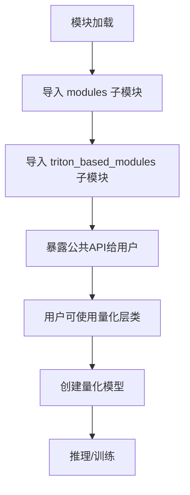

# `bitsandbytes\bitsandbytes\nn\__init__.py` 详细设计文档

这是一个量化神经网络层的库入口文件，主要功能是导出各种位宽量化（4bit/8bit/FP4/NF4）的Embedding和Linear层实现，用于大模型的参数量化，以减少显存占用和加速推理。

## 整体流程



## 类结构

```
modules (量化层模块)
├── 基础Embedding类
│   ├── Embedding
│   └── StableEmbedding
├── 量化Embedding类
│   ├── Embedding4bit
│   ├── Embedding8bit
│   ├── EmbeddingFP4
│   └── EmbeddingNF4
├── 基础Linear类
│   └── OutlierAwareLinear
├── 量化Linear类
Linear4bit
Linear8bitLt
LinearFP4
LinearNF4
SwitchBackLinearBnb
├── 参数类
│   ├── Int8Params
│   └── Params4bit
└── triton_based_modules (Triton加速模块)
├── StandardLinear
├── SwitchBackLinear
├── SwitchBackLinearGlobal
└── SwitchBackLinearVectorwise
```

## 全局变量及字段


    

## 全局函数及方法


## 关键组件


### 量化嵌入层组件

负责处理不同位宽的量化嵌入操作，包括Embedding4bit、Embedding8bit、EmbeddingFP4、EmbeddingNF4等变体，支持4位、8位、FP4和NF4量化策略的嵌入矩阵存储与计算。

### 量化线性层组件

实现不同量化位宽的线性层，包括Linear4bit、Linear8bitLt、LinearFP4、LinearNF4等类，支持4位和8位整数量化以及FP4、NF4浮点量化格式的前向传播。

### 参数量化组件

Int8Params和Params4bit类负责存储和管理量化后的参数数据，包括量化张量、反量化所需的缩放因子、零点和原始精度参数等信息。

### 异常值感知线性层

OutlierAwareLinear组件专门处理神经网络中的异常值检测与处理，在量化过程中识别并特殊处理离群点以保持模型精度。

### StableEmbedding组件

提供稳定嵌入层实现，可能包含额外的正则化或稳定化技术以确保嵌入向量的训练稳定性。

### Triton高性能线性层

基于Triton优化的线性层实现，包括StandardLinear标准实现、SwitchBackLinear切换线性层、SwitchBackLinearGlobal全局切换版本、SwitchBackLinearVectorwise向量级切换版本，提供GPU加速的高效矩阵运算。

### SwitchBackLinearBnb组件

结合bitsandbytes库的SwitchBackLinear实现，支持动态切换不同的量化策略以平衡推理速度与精度。


## 问题及建议


### 已知问题

-   **导入数量过多且无筛选机制**：一次性导入19个类，没有使用`__all__`控制公开API，用户导入时加载所有模块可能导致启动变慢
-   **缺乏模块级文档和类型注解**：顶层`__init__.py`没有文档字符串，没有类型提示，降低了可维护性和IDE支持
-   **暴露内部模块结构**：直接从子模块导入并重新导出，暴露了`modules`和`triton_based_modules`内部结构，限制了后续重构灵活性
-   **命名规范不一致**：存在多种量化格式命名风格（4bit/8bit vs FP4/NF4），可能导致用户困惑
-   **缺乏版本控制和兼容性声明**：没有版本信息，无法追踪API变更历史
-   **可能的循环依赖风险**：modules和triton_based_modules之间可能存在隐式依赖
-   **缺少弃用标记**：某些旧类（如SwitchBackLinearBnb）可能已过时但无明确标记
-   **量化类职责不清晰**：OutlierAwareLinear与其他量化Linear类职责边界不明确

### 优化建议

-   使用`__all__`显式定义公开API，仅导出稳定接口，减少不必要的加载
-   添加延迟导入（lazy import）或按需子模块导入，优化冷启动性能
-   补充模块级docstring和类型注解，提升开发者体验
-   统一量化类命名规范，考虑使用枚举或配置类封装量化参数
-   引入`__version__`变量，遵循语义化版本规范
-   对过时类添加`DeprecationWarning`，引导用户迁移
-   将量化相关配置抽离为独立配置类，减少类数量
-   考虑使用`packaging`模块添加版本兼容性检查
-   添加类型检查工具（如mypy）配置文件，确保类型安全
-   补充单元测试覆盖，特别是Triton相关模块的兼容性测试


## 其它


### 设计目标与约束

本模块的设计目标是提供一套完整的量化神经网络组件库，支持多种量化精度（4bit、8bit、FP4、NF4等），以便在保持模型性能的同时大幅降低内存占用和计算成本。核心约束包括：必须兼容PyTorch框架，支持CPU和CUDA设备，需保持与标准nn.Module接口的一致性以便于集成到现有模型中。

### 错误处理与异常设计

模块主要通过Python的异常机制处理错误场景。常见的异常情况包括：设备不支持错误（CUDA不可用时）、量化参数不合法、模型权重格式不匹配等。所有导出的类都继承自torch.nn.Module，遵循PyTorch的错误处理规范。

### 外部依赖与接口契约

主要外部依赖包括：PyTorch（>=1.8.0）、triton（用于Triton优化的线性层）、numpy。接口契约方面，所有模块类都继承torch.nn.Module基类，实现forward()方法，遵循PyTorch模块的标准接口规范。

### 配置与参数说明

量化模块的关键配置参数包括：quant_type（量化类型）、bits（量化位数）、compressed（是否启用压缩）、threshold（异常值检测阈值）等。不同的量化线性层和嵌入层支持不同的配置组合。

### 性能考虑

模块设计充分考虑了性能优化：使用Int8、FP4、NF4等低精度计算减少内存带宽需求；Triton优化的线性层利用GPU并行计算能力；OutlierAwareLinear支持异常值检测以提高模型精度。

### 安全性考虑

本模块主要用于模型量化加速，不涉及敏感数据处理。量化操作本身是数值精度转换，不引入额外安全风险。

### 版本兼容性

模块需要PyTorch 1.8.0或更高版本，部分Triton相关功能需要Triton 2.0+。不同版本的PyTorch可能影响某些量化操作的性能表现。

### 使用示例

```python
import torch
from bitsandbytes.nn import Linear8bitLt, Embedding4bit

# 8bit量化线性层
linear = Linear8bitLt(768, 3072, bias=False)
input_tensor = torch.randn(1, 768)
output = linear(input_tensor)

# 4bit量化嵌入层
embedding = Embedding4bit(10000, 768)
indices = torch.randint(0, 10000, (1, 10))
output = embedding(indices)
```

    