# `bitsandbytes\bitsandbytes\nn\modules.py` 详细设计文档

该文件实现了基于 bitsandbytes 库的量化神经网络层（Linear 和 Embedding），支持 4-bit（FP4/NF4）和 8-bit 整数量化，用于实现大型语言模型的高效推理和微调（QLoRA）。

## 整体流程

```mermaid
graph TD
    A[模型实例化 (如 Linear4bit)] --> B[加载 FP16 权重 (load_state_dict)]
    B --> C[设备迁移 (.to('cuda'))]
    C --> D{触发量化逻辑}
    D -->|是| E[Params4bit / Int8Params._quantize]
    D -->|否| F[使用已量化权重]
    E --> G[存储量化状态 (quant_state)]
    G --> H[前向传播 (forward)]
    F --> H
    H --> I[调用 bnb.matmul_4bit / bnb.matmul]
    I --> J[输出结果]
```

## 类结构

```
torch.nn.Module
├── StableEmbedding (继承 torch.nn.Embedding)
├── Embedding (继承 torch.nn.Embedding)
├── Linear4bit (继承 nn.Linear)
│   ├── LinearFP4
│   └── LinearNF4
├── Embedding4bit (继承 nn.Embedding)
│   ├── EmbeddingFP4
│   └── EmbeddingNF4
├── Embedding8bit (继承 nn.Embedding)
├── Linear8bitLt (继承 nn.Linear)
├── OutlierAwareLinear (继承 nn.Linear)
└── SwitchBackLinearBnb (继承 nn.Linear)
torch.nn.Parameter
├── Params4bit (专门处理 4-bit 量化参数)
└── Int8Params (专门处理 8-bit 量化参数)
```

## 全局变量及字段


### `T`
    
Type variable for generic PyTorch module types

类型：`TypeVar`
    


### `StableEmbedding.norm`
    
Layer normalization applied after the embedding to improve training stability

类型：`torch.nn.LayerNorm`
    


### `Params4bit.blocksize`
    
The block size for 4-bit quantization, determines how many elements are grouped together

类型：`int`
    


### `Params4bit.compress_statistics`
    
Whether to compress quantization statistics to save memory

类型：`bool`
    


### `Params4bit.quant_type`
    
The quantization type, either 'fp4' (4-bit floating point) or 'nf4' (normal float 4-bit)

类型：`str`
    


### `Params4bit.quant_state`
    
The quantization state containing scale factors and metadata needed for dequantization

类型：`Optional[QuantState]`
    


### `Params4bit.quant_storage`
    
The dtype used for storing quantized weights, typically torch.uint8

类型：`torch.dtype`
    


### `Params4bit.bnb_quantized`
    
Flag indicating whether the weights have been quantized by bitsandbytes

类型：`bool`
    


### `Params4bit.module`
    
Reference to the parent quantized linear module

类型：`Optional[Linear4bit]`
    


### `Params4bit.data`
    
The underlying tensor data for the quantized parameter

类型：`Tensor`
    


### `Linear4bit.weight`
    
The quantized 4-bit weight parameter of the linear layer

类型：`Params4bit`
    


### `Linear4bit.compute_dtype`
    
The computation dtype for matrix multiplication operations

类型：`Optional[dtype]`
    


### `Linear4bit.quant_state`
    
The quantization state for the 4-bit weights

类型：`Optional[QuantState]`
    


### `Linear4bit.quant_storage`
    
The storage dtype for quantized weights

类型：`torch.dtype`
    


### `Linear4bit.support_avx512bf16_for_cpu`
    
Flag indicating whether AVX512BF16 instruction set is available for CPU inference

类型：`bool`
    


### `Int8Params.CB`
    
The 8-bit quantized weight tensor in row-major format

类型：`Optional[Tensor]`
    


### `Int8Params.SCB`
    
The scalar constants (scale factors) for dequantization

类型：`Optional[Tensor]`
    


### `Int8Params.has_fp16_weights`
    
Flag indicating whether weights remain in fp16 format instead of being quantized

类型：`bool`
    


### `Int8Params.data`
    
The underlying weight tensor data

类型：`Tensor`
    


### `Embedding8bit.dtype`
    
The original dtype of the embedding weights before quantization

类型：`dtype`
    


### `Embedding8bit.weight`
    
The 8-bit quantized embedding weight parameter

类型：`Int8Params`
    


### `Embedding4bit.dtype`
    
The original dtype of the embedding weights before quantization

类型：`dtype`
    


### `Embedding4bit.weight`
    
The 4-bit quantized embedding weight parameter

类型：`Params4bit`
    


### `Linear8bitLt.state`
    
The state object containing 8-bit matrix multiplication parameters and statistics

类型：`MatmulLtState`
    


### `Linear8bitLt.index`
    
Indices for weight reordering used in mixed-precision decomposition

类型：`Optional[int]`
    


### `Linear8bitLt.weight`
    
The 8-bit quantized weight parameter of the linear layer

类型：`Int8Params`
    


### `OutlierAwareLinear.outlier_dim`
    
The dimension/indices of outlier values in the weight tensor

类型：`Optional[int]`
    


### `OutlierAwareLinear.is_quantized`
    
Flag indicating whether the weights have been quantized with outlier awareness

类型：`bool`
    


### `SwitchBackLinearBnb.state`
    
The state object containing mixed-precision matrix multiplication parameters

类型：`MatmulLtState`
    


### `SwitchBackLinearBnb.index`
    
Indices for weight reordering used internally

类型：`Optional[int]`
    


### `SwitchBackLinearBnb.weight`
    
The 8-bit quantized weight parameter with mixed-precision support

类型：`Int8Params`
    
    

## 全局函数及方法


### `fix_4bit_weight_quant_state_from_module`

该函数用于修复 4-bit 权重量化状态的丢失问题。当模块参数在分布式训练（如 FSDP）等场景下发生转换时，量化状态可能会丢失，此函数尝试从模块层级恢复量化状态。

参数：

- `module`：`Union["Embedding4bit", "Linear4bit"]`，需要修复量化状态的模块（Embedding4bit 或 Linear4bit 实例）

返回值：`None`（无返回值，修改传入的 module 对象）

#### 流程图

```mermaid
flowchart TD
    A[开始] --> B{module.weight.quant_state 是否存在?}
    B -->|是| C[直接返回]
    B -->|否| D{module.quant_state 是否存在?}
    D -->|否| E[发出警告: FP4量化状态未初始化]
    D -->|是| F[断言: weight.shape[1] == 1]
    F --> G{weight 是否为 Params4bit 类型?}
    G -->|是| H[直接设置 weight.quant_state = module.quant_state]
    G -->|否| I[创建新的 Params4bit 对象]
    I --> J[设置 quant_storage 和 bnb_quantized=True]
    J --> H
    H --> K[结束]
    E --> K
```

#### 带注释源码

```python
def fix_4bit_weight_quant_state_from_module(module: Union["Embedding4bit", "Linear4bit"]):
    """
    修复4-bit权重量化状态的函数。
    当模块参数在FSDP等场景下被转换时，量化状态可能会丢失，
    此函数尝试从模块层级恢复量化状态到weight参数中。
    
    参数:
        module: Union[Embedding4bit, Linear4bit] - 需要修复量化状态的模块
    """
    # 检查权重是否已有量化状态，如有则直接返回
    if getattr(module.weight, "quant_state", None) is not None:
        return

    # 检查模块本身是否有量化状态
    if getattr(module, "quant_state", None) is None:
        # 量化状态未初始化，发出警告
        warnings.warn(
            "FP4 quantization state not initialized. Please call .cuda() or .to(device) on the LinearFP4 layer first.",
        )

    # 量化状态在参数转换时丢失了，例如FSDP场景
    # 由于已注册模块，可以在此处恢复状态
    # 断言：量化后的权重形状第二个维度应为1（已打包）
    assert module.weight.shape[1] == 1
    
    # 如果权重还不是Params4bit类型，则将其转换为Params4bit
    if not isinstance(module.weight, Params4bit):
        module.weight = Params4bit(module.weight, quant_storage=module.quant_storage, bnb_quantized=True)
    
    # 将模块的量化状态赋给权重参数
    module.weight.quant_state = module.quant_state
```


### `maybe_rearrange_weight`

这是一个全局函数，用于在加载 8 位线性层状态字典时验证和调整权重格式。它作为 `Linear8bitLt` 类的 `_register_load_state_dict_pre_hook` 回调函数，确保权重格式的正确性。

参数：

-  `state_dict`：`dict`，包含模型状态键值对的字典
-  `prefix`：`str`，模块名称前缀，用于构建状态字典中的键名
-  `local_metadata`：`dict`，本地元数据，包含模块相关的配置信息
-  `strict`：`bool`，是否严格检查状态字典键的匹配
-  `missing_keys`：`list`，用于存储缺失的键
-  `unexpected_keys`：`list`，用于存储意外的键
-  `error_msgs`：`list`，用于存储错误消息

返回值：`None`，该函数无返回值，通过修改 `state_dict` 来处理权重格式

#### 流程图

```mermaid
flowchart TD
    A[开始] --> B{获取权重: state_dict.get(prefix + 'weight')}
    B --> C{weight 是否为 None?}
    C -->|是| D[返回, 不做任何处理]
    C -->|否| E[弹出 weight_format, 默认为 'row']
    E --> F{weight_format 是 Tensor?}
    F -->|是| G[转换为 Python 标量]
    F -->|否| H{weight_format 是 int?}
    G --> H
    H -->|是| I{weight_format 在映射表中?}
    H -->|否| J{weight_format 不等于 'row'?}
    I -->|否| K[抛出 ValueError: 不支持的权重格式]
    I -->|是| L[从映射表获取格式名称]
    L --> J
    J -->|是| M[抛出 ValueError: 只支持 'row' 格式]
    J -->|否| N[结束, 格式验证通过]
    D --> N
    K --> N
    M --> N
```

#### 带注释源码

```python
def maybe_rearrange_weight(state_dict, prefix, local_metadata, strict, missing_keys, unexpected_keys, error_msgs):
    """
    处理 8 位线性层权重格式的预加载钩子函数。
    
    此函数作为 load_state_dict 的预钩子被调用，用于验证和规范化权重格式。
    主要用于 Linear8bitLt 模块，确保从检查点加载时权重格式的正确性。
    
    参数:
        state_dict (dict): 包含模型状态的字典
        prefix (str): 模块名称前缀
        local_metadata (dict): 本地元数据
        strict (bool): 是否严格匹配
        missing_keys (list): 缺失的键列表
        unexpected_keys (list): 意外的键列表
        error_msgs (list): 错误消息列表
    
    返回:
        None: 函数直接修改 state_dict，不返回任何值
    """
    # 获取当前层的权重，如果不存在则直接返回（例如 LoRA 微调场景）
    weight = state_dict.get(f"{prefix}weight")
    if weight is None:
        # if the state dict has no weights for this layer (e.g., LoRA finetuning), do nothing
        return
    
    # 从状态字典中弹出权重格式，默认为 'row'（行主序）
    weight_format = state_dict.pop(f"{prefix}weight_format", "row")

    # 如果权重格式是 Tensor 类型，转换为 Python 标量
    if isinstance(weight_format, torch.Tensor):
        weight_format = weight_format.item()

    # 对于新的权重格式存储类型，显式检查 weight_format 是否在映射表中
    # 如果 weight_format 是整数且不在映射表中，抛出错误
    if isinstance(weight_format, int) and weight_format not in INVERSE_LINEAR_8BIT_WEIGHTS_FORMAT_MAPPING:
        raise ValueError(f"Expected supported weight format - got {weight_format}")
    # 如果在映射表中，则转换为格式名称字符串
    elif isinstance(weight_format, int) and weight_format in INVERSE_LINEAR_8BIT_WEIGHTS_FORMAT_MAPPING:
        weight_format = INVERSE_LINEAR_8BIT_WEIGHTS_FORMAT_MAPPING[weight_format]

    # 目前只支持 'row'（行主序）权重格式
    if weight_format != "row":
        raise ValueError(f"Only 'row' weight format is supported, got {weight_format}")
```


### `StableEmbedding.reset_parameters`

该方法用于重置StableEmbedding层的嵌入参数，采用Xavier均匀初始化方法对权重进行初始化，并通过将填充索引位置的权重置零来确保填充标记的表示为零向量。

参数：

- 该方法无显式参数（仅包含隐式参数 `self`）

返回值：`None`，无返回值

#### 流程图

```mermaid
flowchart TD
    A[开始 reset_parameters] --> B[调用 xavier_uniform_ 初始化 self.weight]
    B --> C{检查 padding_idx 是否存在}
    C -->|是| D[将 self.weight[padding_idx] 置零]
    C -->|否| E[跳过置零操作]
    D --> F[结束 reset_parameters]
    E --> F
```

#### 带注释源码

```python
def reset_parameters(self) -> None:
    """
    重置嵌入层的参数。
    
    使用Xavier均匀初始化方法对嵌入权重进行初始化，
    以保证训练初期的梯度流动稳定。随后检查是否存在
    填充索引，若存在则将对应位置的嵌入向量置为零。
    """
    # 使用Xavier均匀分布初始化嵌入权重矩阵
    # Xavier初始化有助于保持前向传播和反向传播时激活值和梯度的方差一致
    torch.nn.init.xavier_uniform_(self.weight)
    
    # 调用内部方法将填充索引位置的嵌入向量置为零
    # 这样可以确保padding token的表示为全零向量，不影响下游任务
    self._fill_padding_idx_with_zero()

def _fill_padding_idx_with_zero(self) -> None:
    """
    将填充索引位置的嵌入向量置零。
    
    这是一个兼容性重定义方法，用于兼容PyTorch < 1.9版本。
    若未来PyTorch版本中此行为发生变化，需要同步更新此方法。
    """
    # 仅当存在填充索引时才执行操作
    if self.padding_idx is not None:
        # 使用no_grad上下文避免记录梯度操作
        with torch.no_grad():
            # 直接使用fill_方法将指定索引位置的权重置为零
            self.weight[self.padding_idx].fill_(0)
```


### `StableEmbedding._fill_padding_idx_with_zero`

该方法是 `StableEmbedding` 类的私有方法，用于在初始化或重置参数时，将嵌入矩阵中填充索引（padding_idx）对应的行填充为零向量。这是为了确保在处理变长序列时，填充位置的嵌入表示为固定的零向量，从而避免填充值对模型训练造成干扰。

参数：无（该方法没有显式参数，但隐式使用 `self.padding_idx` 和 `self.weight`）

返回值：`None`，该方法不返回任何值，仅修改对象内部状态。

#### 流程图

```mermaid
flowchart TD
    A[开始] --> B{self.padding_idx is not None?}
    B -->|否| C[直接返回]
    B -->|是| D[使用 torch.no_grad]
    D --> E[self.weight[self.padding_idx].fill_(0)]
    E --> F[结束]
```

#### 带注释源码

```python
def _fill_padding_idx_with_zero(self) -> None:
    """
    将填充索引对应的嵌入向量置为零。
    该方法是 torch.nn.Embedding 中同名方法的重新定义，
    以兼容 PyTorch < 1.9 的版本。
    """
    # 检查是否设置了填充索引
    if self.padding_idx is not None:
        # 使用 no_grad 上下文管理器，禁用梯度计算
        # 因为这里只是初始化参数，不需要计算梯度
        with torch.no_grad():
            # 找到嵌入矩阵中填充索引对应的行
            # 并使用 fill_(0) 将其填充为 0
            self.weight[self.padding_idx].fill_(0)
```


### StableEmbedding.forward

该方法是StableEmbedding类的前向传播函数，继承自torch.nn.Embedding。它执行嵌入查找操作，并将结果转换为默认数据类型后应用LayerNorm进行归一化，最后再转换回权重的数据类型。这种设计旨在减少量化带来的梯度变化，提高NLP任务训练过程中的稳定性。

参数：

- `input`：`Tensor`，输入的张量，包含要查找的嵌入索引

返回值：`Tensor`，经过层归一化后的嵌入向量

#### 流程图

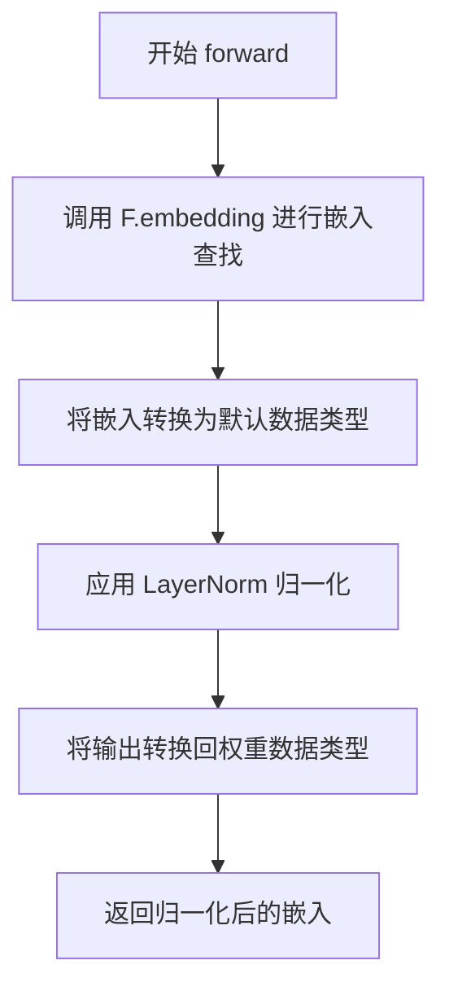

#### 带注释源码

```python
def forward(self, input: Tensor) -> Tensor:
    # 使用 PyTorch 的嵌入函数进行嵌入查找
    # 参数包括：输入索引、权重矩阵、填充索引、最大范数、范数类型、梯度缩放选项、稀疏梯度选项
    emb = F.embedding(
        input,
        self.weight,
        self.padding_idx,
        self.max_norm,
        self.norm_type,
        self.scale_grad_by_freq,
        self.sparse,
    )

    # 始终以全精度（默认数据类型）应用层归一化
    # 这有助于提高数值稳定性，减少量化带来的梯度变化
    emb = emb.to(torch.get_default_dtype())

    # 先应用 LayerNorm 归一化，然后转换回原始权重的数据类型
    # 这样可以在保持数值稳定性的同时，兼容量化权重
    return self.norm(emb).to(self.weight.dtype)
```


### Embedding.reset_parameters

该方法用于重置Embedding层的权重参数，使用Xavier均匀初始化方法对权重进行初始化，并将填充索引（padding_idx）对应的权重值设为零。

参数：
- 该方法无显式参数（仅有隐式参数`self`）

返回值：`None`，无返回值

#### 流程图

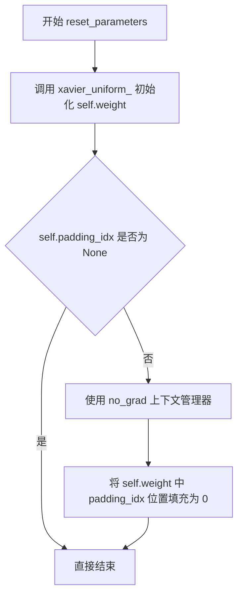

#### 带注释源码

```python
def reset_parameters(self) -> None:
    """
    重置Embedding层的权重参数。
    
    该方法执行两个关键操作：
    1. 使用Xavier均匀分布初始化权重矩阵
    2. 确保填充索引位置的权重值为零（兼容性处理）
    """
    # 使用Xavier均匀初始化方法对嵌入权重进行初始化
    # 这种初始化方式有助于保持梯度流动的稳定性
    torch.nn.init.xavier_uniform_(self.weight)
    
    # 调用内部方法将padding_idx位置填充为零
    # 这是为了兼容PyTorch < 1.9版本的实现
    self._fill_padding_idx_with_zero()
```


### `Embedding._fill_padding_idx_with_zero`

该方法用于在初始化嵌入层时，将填充索引（padding_idx）对应的嵌入向量填充为零。这是 `torch.nn.Embedding` 中同名方法的重新定义，旨在确保与 PyTorch < 1.9 版本的兼容性。

参数：

- `self`：`Embedding` 类实例，隐式参数，无需显式传递

返回值：`None`，该方法直接修改实例属性，无返回值

#### 流程图

```mermaid
flowchart TD
    A[开始] --> B{self.padding_idx 是否为 None}
    B -- 是 --> C[什么都不做]
    B -- 否 --> D[使用 torch.no_grad]
    D --> E[self.weight[self.padding_idx].fill_(0)]
    E --> F[结束]
    C --> F
```

#### 带注释源码

```python
def _fill_padding_idx_with_zero(self) -> None:
    """
    将填充索引对应的嵌入向量置零。
    这是为了兼容 PyTorch < 1.9 版本而重新定义的方法。
    """
    # 检查是否设置了 padding_idx（填充索引）
    if self.padding_idx is not None:
        # 使用 no_grad 上下文管理器，避免记录梯度计算图
        with torch.no_grad():
            # 将嵌入矩阵中 padding_idx 位置的向量填充为 0
            self.weight[self.padding_idx].fill_(0)
```


### `Embedding.forward`

该方法是 `Embedding` 类的前向传播函数，负责将输入的索引张量转换为对应的词嵌入向量。它继承自 `torch.nn.Embedding`，通过调用 `torch.nn.functional.embedding` 获取嵌入表示，并直接返回结果。

参数：
- `input`：`Tensor`，输入的索引张量，包含需要转换为嵌入的词汇索引

返回值：`Tensor`，返回词嵌入向量，形状为 `(input.shape[0], embedding_dim)` 或 `(input.shape[0], input.shape[1], embedding_dim)`

#### 流程图

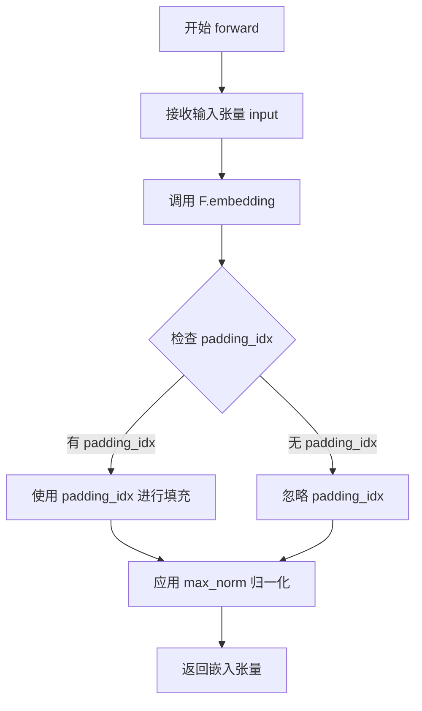

#### 带注释源码

```python
def forward(self, input: Tensor) -> Tensor:
    """
    Embedding 类的前向传播方法，将输入的索引转换为词嵌入向量。
    
    参数:
        input (Tensor): 输入的索引张量，形状为 (batch_size,) 或 (batch_size, seq_len)
    
    返回:
        Tensor: 词嵌入向量，形状为 (batch_size, embedding_dim) 或 (batch_size, seq_len, embedding_dim)
    """
    # 使用 torch.nn.functional.embedding 计算词嵌入
    # 该函数会根据 input 中的索引从 self.weight (嵌入矩阵) 中查找对应的向量
    emb = F.embedding(
        input,                  # 输入的索引张量
        self.weight,            # 嵌入权重矩阵，形状为 (num_embeddings, embedding_dim)
        self.padding_idx,       # 填充索引，如果指定则将对应行的权重设为零
        self.max_norm,          # 最大范数，用于梯度裁剪
        self.norm_type,         # 范数类型，用于 max_norm 计算
        self.scale_grad_by_freq # 是否按频率缩放梯度
        self.sparse,            # 是否使用稀疏梯度
    )
    
    # 直接返回嵌入结果，不进行额外处理
    return emb
```


### `Params4bit.__new__`

该方法是 `Params4bit` 类的构造函数，用于创建一个新的 4 位量化参数对象。它继承自 `torch.nn.Parameter`，专门设计用于存储和管理 4 位量化权重，支持 FP4 和 NF4 量化类型。

参数：

- `cls`：类型，`__new__` 方法的隐式参数，代表类本身
- `data`：`Optional[torch.Tensor]`，要存储的权重数据 tensor，如果为 None 则创建空 tensor
- `requires_grad`：`bool`，是否需要计算梯度，默认值为 False（量化权重默认冻结）
- `quant_state`：`Optional[QuantState]`，量化状态对象，包含量化所需的统计信息
- `blocksize`：`Optional[int]`，块大小，用于分块量化，默认值为 64
- `compress_statistics`：`bool`，是否压缩统计信息，默认值为 True
- `quant_type`：`str`，量化类型，支持 "fp4" 或 "nf4"，默认值为 "fp4"
- `quant_storage`：`torch.dtype`，存储数据类型，默认值为 torch.uint8
- `module`：`Optional["Linear4bit"]`，关联的 Linear4bit 模块，用于同步量化状态
- `bnb_quantized`：`bool`，标记是否已经过 bitsandbytes 量化，默认值为 False

返回值：`"Params4bit"`，返回新创建的 Params4bit 实例

#### 流程图

```mermaid
flowchart TD
    A[开始 __new__] --> B{data是否为None?}
    B -->|是| C[创建空tensor: torch.empty(0)]
    B -->|否| D[使用传入的data]
    C --> E{blocksize是否为None?}
    D --> E
    E -->|是| F[设置blocksize=64]
    E -->|否| G[使用传入的blocksize]
    F --> H[调用torch.Tensor._make_subclass创建子类实例]
    G --> H
    H --> I[设置实例属性: blocksize, compress_statistics, quant_type, quant_state, quant_storage, bnb_quantized, data, module]
    I --> J[返回Params4bit实例]
```

#### 带注释源码

```python
def __new__(
    cls,
    data: Optional[torch.Tensor] = None,
    requires_grad=False,  # quantized weights should be frozen by default
    quant_state: Optional[QuantState] = None,
    blocksize: Optional[int] = None,
    compress_statistics: bool = True,
    quant_type: str = "fp4",
    quant_storage: torch.dtype = torch.uint8,
    module: Optional["Linear4bit"] = None,
    bnb_quantized: bool = False,
) -> "Params4bit":
    # 如果未提供 data，则创建空 tensor（形状为 0）
    if data is None:
        data = torch.empty(0)

    # 如果未指定 blocksize，默认使用 64（4-bit 量化的常用块大小）
    if blocksize is None:
        blocksize = 64

    # 使用 PyTorch 的 _make_subclass 方法创建自定义 tensor 子类
    # 这使得 Params4bit 既是 Tensor 又是 Parameter，支持自动梯度计算
    self = torch.Tensor._make_subclass(cls, data, requires_grad)
    
    # 初始化量化相关的实例属性
    self.blocksize = blocksize  # 量化块大小
    self.compress_statistics = compress_statistics  # 是否压缩统计信息
    self.quant_type = quant_type  # 量化类型（fp4 或 nf4）
    self.quant_state = quant_state  # 量化状态对象
    self.quant_storage = quant_storage  # 存储数据类型
    self.bnb_quantized = bnb_quantized  # 是否已量化标记
    self.data = data  # 权重数据
    self.module = module  # 关联的 Linear4bit 模块
    
    return self
```


### `Params4bit.__getstate__`

该方法用于自定义对象的序列化（pickle）行为，返回一个字典，包含对象需要保存的状态信息。通过显式地选择需要保存的属性，避免保存不可序列化的对象引用（如 `module` 属性）。

参数：

- `self`：`Params4bit` 实例，隐式参数，不需要显式传递

返回值：`Dict[str, Any]`，返回一个字典，包含对象的可序列化状态

#### 流程图

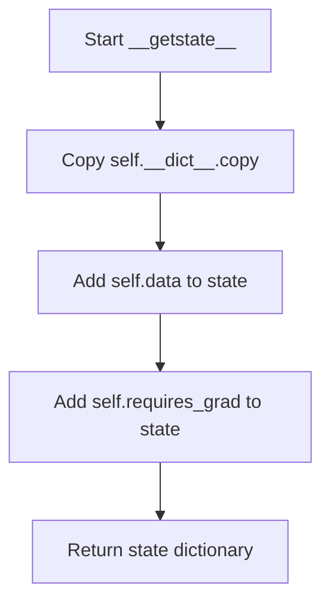

#### 带注释源码

```python
def __getstate__(self):
    """
    自定义序列化方法，用于 pickle 操作
    返回一个包含对象状态的字典
    """
    # 复制当前对象的 __dict__，获取所有实例属性
    state = self.__dict__.copy()
    
    # 显式保存 data 属性（权重数据）
    state["data"] = self.data
    
    # 显式保存 requires_grad 属性（梯度需求标志）
    state["requires_grad"] = self.requires_grad
    
    # 返回状态字典，用于后续的 pickle 序列化
    return state
```


### `Params4bit.__setstate__`

该方法是 Python pickle 序列化模块的反序列化回调函数，用于在对象反序列化时恢复 `Params4bit` 量化参数对象的完整状态，包括量化配置、数据张量以及关联模块等所有属性。

参数：

- `state`：`dict`，包含对象序列化时保存的所有状态信息字典，键包括 `requires_grad`、`blocksize`、`compress_statistics`、`quant_type`、`quant_state`、`data`、`quant_storage`、`bnb_quantized` 和 `module`

返回值：`None`，该方法直接修改对象内部状态，无返回值

#### 流程图

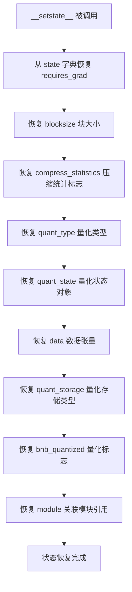

#### 带注释源码

```python
def __setstate__(self, state):
    """
    反序列化方法，用于从 pickle 加载的状态字典中恢复 Params4bit 对象。
    此方法在对象被反序列化（unpickle）时自动调用。
    
    Args:
        state (dict): 包含对象序列化时保存的所有属性值的字典。
                     预期包含以下键：
                     - requires_grad: 布尔值，表示参数是否需要梯度
                     - blocksize: 整数，量化块大小
                     - compress_statistics: 布尔值，是否压缩统计信息
                     - quant_type: 字符串，量化类型（如 'fp4', 'nf4'）
                     - quant_state: QuantState 对象，包含量化状态信息
                     - data: torch.Tensor，参数的实际数据张量
                     - quant_storage: torch.dtype，量化后数据的存储类型
                     - bnb_quantized: 布尔值，标识是否已进行量化
                     - module: 关联的 Linear4bit 模块引用
    
    Returns:
        None
    
    Note:
        此方法直接修改对象自身属性，不返回新对象。
        与 __getstate__ 方法配合使用实现对象的序列化和反序列化。
    """
    # 恢复梯度计算标志
    self.requires_grad = state["requires_grad"]
    
    # 恢复量化块大小（默认为64）
    self.blocksize = state["blocksize"]
    
    # 恢复是否压缩统计信息的标志
    self.compress_statistics = state["compress_statistics"]
    
    # 恢复量化类型（fp4 或 nf4）
    self.quant_type = state["quant_type"]
    
    # 恢复 QuantState 量化状态对象，包含量化所需的统计信息
    self.quant_state = state["quant_state"]
    
    # 恢复实际的数据张量（量化后的权重数据）
    self.data = state["data"]
    
    # 恢复量化存储的数据类型（通常为 torch.uint8）
    self.quant_storage = state["quant_storage"]
    
    # 恢复 bitsandbytes 量化标志，标识是否已完成量化
    self.bnb_quantized = state["bnb_quantized"]
    
    # 恢复关联的 Linear4bit 模块引用，用于后续操作和状态同步
    self.module = state["module"]
```


### `Params4bit.__deepcopy__`

实现 `Params4bit` 对象的深拷贝功能，用于在模型复制、分布式训练（如 FSDP）、检查点保存等场景中创建独立的量化参数副本。该方法确保量化状态（quant_state）和数据（data）都被正确深拷贝，而不是共享引用。

参数：

- `self`：隐式参数，当前 `Params4bit` 对象
- `memo`：`dict`，Python 标准库 `copy.deepcopy` 使用的备忘录字典，用于跟踪已拷贝对象以处理循环引用

返回值：`Params4bit`，返回一个新的深拷贝实例，量化状态和数据均已独立复制

#### 流程图

```mermaid
flowchart TD
    A[开始 __deepcopy__] --> B[创建新实例: type(self).__new__]
    B --> C[获取当前对象状态: __getstate__]
    C --> D[设置新实例状态: __setstate__]
    D --> E[深拷贝 quant_state: copy.deepcopy]
    E --> F[深拷贝 data: copy.deepcopy]
    F --> G[返回新实例]
    
    style A fill:#f9f,color:#000
    style G fill:#9f9,color:#000
```

#### 带注释源码

```python
def __deepcopy__(self, memo):
    # 使用 type(self).__new__ 创建一个新的 Params4bit 实例
    # 不调用 __init__，避免重复初始化逻辑
    new_instance = type(self).__new__(type(self))
    
    # 获取当前对象的序列化状态（包含所有必要属性）
    # 包括 blocksize, compress_statistics, quant_type, quant_state, data 等
    state = self.__getstate__()
    
    # 将状态应用到新实例
    # 这会设置 requires_grad, blocksize, compress_statistics, quant_type,
    # quant_state, data, quant_storage, bnb_quantized, module 等属性
    new_instance.__setstate__(state)
    
    # 深拷贝 quant_state（QuantState 对象）
    # 确保量化状态（如 absmax, quant_type 等）被独立复制
    # 而不是共享引用，这对于模型并行/分布式训练很重要
    new_instance.quant_state = copy.deepcopy(state["quant_state"])
    
    # 深拷贝实际的数据张量
    # 确保权重数据被完全复制，而不是共享内存
    new_instance.data = copy.deepcopy(state["data"])
    
    # 返回深拷贝后的新实例
    return new_instance
```

#### 设计考量说明

| 特性 | 说明 |
|------|------|
| **循环引用处理** | 使用 `memo` 字典（继承自 `copy.deepcopy` 机制）避免无限递归 |
| **状态分离** | 量化状态和数据都单独深拷贝，确保新实例完全独立 |
| **性能优化** | 使用 `__getstate__`/`__setstate__` 批量序列化和恢复属性，比逐个属性赋值更高效 |
| **与 PyTorch 兼容** | 正确处理 `torch.nn.Parameter` 子类的特殊序列化需求 |


### `Params4bit.__copy__`

该方法实现了 Python 的浅拷贝行为，用于在使用 `copy.copy()` 时创建 `Params4bit` 对象的副本。它通过获取当前对象的状态字典，然后创建一个新实例并设置相同的状态来实现浅拷贝。

参数：

- `self`：`Params4bit`，当前需要拷贝的对象（隐式参数）

返回值：`Params4bit`，返回一个新创建的 `Params4bit` 实例，其状态与原对象相同

#### 流程图

```mermaid
flowchart TD
    A[开始 __copy__ 调用] --> B[创建类型相同的新实例: type(self).__new__]
    B --> C[获取当前对象状态: __getstate__]
    C --> D[设置新实例状态: __setstate__]
    D --> E[返回新实例]
    E --> F[结束]
```

#### 带注释源码

```python
def __copy__(self):
    """
    实现 Python 的浅拷贝协议。
    当调用 copy.copy(obj) 时会自动调用此方法。
    
    注意：这是一个浅拷贝，只复制对象的状态字典引用，
    内部的 tensor 数据不会被深拷贝。如需深拷贝应使用 __deepcopy__。
    """
    # 使用 type(self) 确保子类也能正确创建实例
    # 创建相同类型的新空实例（尚未初始化）
    new_instance = type(self).__new__(type(self))
    
    # 获取当前对象的状态字典（包含所有必要属性）
    # __getstate__ 返回: data, requires_grad, blocksize, compress_statistics,
    #                    quant_type, quant_state, quant_storage, bnb_quantized
    state = self.__getstate__()
    
    # 将状态字典设置到新实例中
    # __setstate__ 会恢复所有属性到新实例
    new_instance.__setstate__(state)
    
    # 返回新创建的实例（浅拷贝）
    return new_instance
```


### Params4bit.from_prequantized

该类方法用于从预量化的权重张量和量化统计信息（quantized_stats）重建 `Params4bit` 对象，通常在加载量化模型权重时调用。它负责将原始数据转换为符合 4bit 量化格式的参数，并恢复量化状态。

参数：
- `cls`：类型，表示 `Params4bit` 类本身。
- `data`：`torch.Tensor`，原始的权重数据（通常是量化后的数据或用于初始化的张量）。
- `quantized_stats`：`dict[str, Any]`，包含量化状态的字典，如 blocksize、absmax、quant_type 等信息，用于恢复 `QuantState`。
- `requires_grad`：`bool`（默认为 False），表示参数是否需要计算梯度。
- `device`：`str`（默认为 "cuda"），指定张量存放的设备。
- `module`：`Optional["Linear4bit"]`（默认为 None），可选关联的 `Linear4bit` 模块，用于同步量化状态。
- `**kwargs`：可变关键字参数，用于传递额外的配置。

返回值：`Params4bit`，返回新创建的 `Params4bit` 实例。

#### 流程图

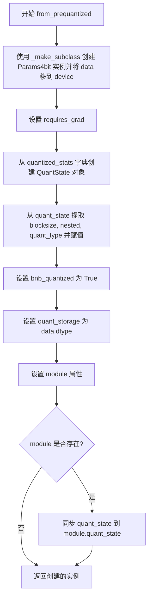

#### 带注释源码

```python
@classmethod
def from_prequantized(
    cls,
    data: torch.Tensor,
    quantized_stats: dict[str, Any],
    requires_grad: bool = False,
    device="cuda",
    module: Optional["Linear4bit"] = None,
    **kwargs,
) -> "Params4bit":
    # 1. 使用 PyTorch 内部方法 _make_subclass 创建自定义 Parameter 子类实例
    #    并将输入 data 移动到指定的 device 上
    self = torch.Tensor._make_subclass(cls, data.to(device))
    
    # 2. 设置参数的梯度需求
    self.requires_grad = requires_grad
    
    # 3. 从字典形式的量化统计信息恢复 QuantState 对象
    #    这是一个关键的重组过程，恢复了量化所需的全部元数据
    self.quant_state = QuantState.from_dict(qs_dict=quantized_stats, device=device)
    
    # 4. 从恢复的 QuantState 中提取并设置量化相关属性
    self.blocksize = self.quant_state.blocksize
    self.compress_statistics = self.quant_state.nested
    self.quant_type = self.quant_state.quant_type
    self.bnb_quantized = True  # 标记为已通过 bitsandbytes 量化

    # 5. 设置量化存储类型为原始数据的 dtype
    self.quant_storage = data.dtype
    
    # 6. 关联模块（如果存在）
    self.module = module

    # 7. 如果有关联的 Linear4bit 模块，同步量化状态到该模块
    if self.module is not None:
        self.module.quant_state = self.quant_state

    return self
```


### Params4bit._quantize

该方法实现4bit权重量化功能，将浮点权重数据转换为4bit量化格式，存储量化状态信息，以便在推理时进行高效的矩阵运算。

参数：

- `device`：`torch.device | str | int`，目标设备，用于将权重数据移动到指定设备并进行量化

返回值：`Params4bit`，返回自身（self），便于链式调用

#### 流程图

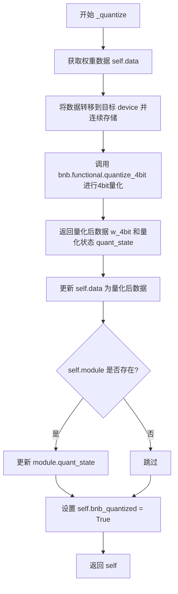

#### 带注释源码

```python
def _quantize(self, device):
    # 获取当前权重数据并确保其在内存中连续存储，然后转移到目标设备
    w = self.data.contiguous().to(device)
    
    # 调用 bitsandbytes 库的 quantize_4bit 函数进行4bit量化
    # 参数包括：块大小、是否压缩统计信息、量化类型、量化存储类型
    w_4bit, quant_state = bnb.functional.quantize_4bit(
        w,
        blocksize=self.blocksize,                  # 量化块大小，默认为64
        compress_statistics=self.compress_statistics, # 是否压缩统计信息
        quant_type=self.quant_type,                # 量化类型（fp4或nf4）
        quant_storage=self.quant_storage,          # 量化存储类型（uint8）
    )
    
    # 将量化后的数据更新到当前对象的data属性
    self.data = w_4bit
    
    # 保存量化状态（包含absmax、nested等统计信息）
    self.quant_state = quant_state
    
    # 如果关联了module对象，同步更新module的量化状态
    if self.module is not None:
        self.module.quant_state = quant_state
    
    # 标记该参数已完成量化
    self.bnb_quantized = True
    
    # 返回自身，支持链式调用
    return self
```


### Params4bit.cpu

将4bit量化参数从当前设备移动到CPU设备。

参数：无

返回值：`Params4bit`，返回一个新的Params4bit实例，其数据已迁移至CPU设备。

#### 流程图

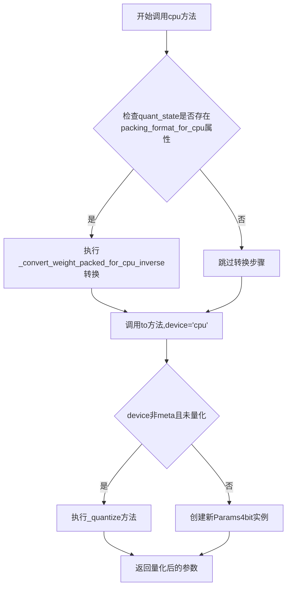

#### 带注释源码

```python
def cpu(self):
    """
    将参数移动到CPU设备。
    
    如果量化状态包含packing_format_for_cpu标记，
    则先将权重从CPU打包格式转换回原始格式，
    然后再移动到CPU设备。
    
    Returns:
        Params4bit: 移动到CPU后的新参数实例
    """
    return self.to(device="cpu")
```


### `Params4bit.cuda`

将 4bit 量化参数对象移动到 CUDA 设备上。如果量化状态中存在 CPU 打包格式，则在转移前先进行逆转换，以确保权重在 CUDA 设备上以正确的格式存储。

参数：

- `device`：`Optional[int | device | str]`，目标 CUDA 设备标识，默认为 `None`（表示使用默认 CUDA 设备）
- `non_blocking`：`bool`，是否使用非阻塞模式进行数据传输，默认为 `False`

返回值：返回转换到 CUDA 设备后的 `Params4bit` 对象（`Params4bit`）

#### 流程图

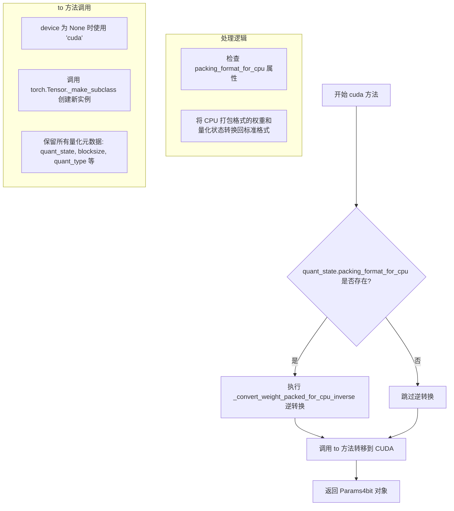

#### 带注释源码

```python
def cuda(self, device: Optional[int | device | str] = None, non_blocking: bool = False):
    """
    将 Params4bit 参数对象移动到 CUDA 设备。
    
    该方法处理 4bit 量化权重的设备转移：
    1. 检查量化状态是否存在 CPU 打包格式（packing_format_for_cpu）
    2. 如果存在，先执行逆转换将权重恢复到标准格式
    3. 调用 to 方法将参数转移到目标 CUDA 设备
    
    参数:
        device: 目标 CUDA 设备标识，可以是整数、设备对象或字符串。
                默认为 None，表示使用默认 CUDA 设备。
        non_blocking: 是否使用非阻塞传输。默认为 False（同步传输）。
    
    返回:
        转移到 CUDA 设备后的 Params4bit 对象。
    """
    # 检查量化状态中是否存在 CPU 打包格式标志
    # 当权重从 CUDA 转移到 CPU 时会进行打包以节省内存
    if getattr(self.quant_state, "packing_format_for_cpu", False):
        # 执行逆转换：将 CPU 打包格式转换回标准 4bit 格式
        # 这样可以确保在 CUDA 上进行正确的矩阵运算
        self.data, self.quant_state = _convert_weight_packed_for_cpu_inverse(
            self.data, 
            self.quant_state
        )
    
    # 调用 to 方法进行设备转移
    # 如果 device 为 None，则默认使用 'cuda' 字符串
    return self.to(
        device="cuda" if device is None else device, 
        non_blocking=non_blocking
    )
```


### `Params4bit.xpu`

将 4bit 量化参数移动到 Intel XPU 设备上，如果参数数据当前以 CPU 打包格式存储，则先进行解包处理，然后调用 `to` 方法将参数迁移到指定 XPU 设备。

参数：

- `self`：`Params4bit` 实例，隐式参数，表示当前 4bit 量化参数对象本身
- `device`：`Optional[int | device | str]`，可选，默认为 `None`，目标 XPU 设备标识，可以是设备编号、设备对象或设备字符串，默认为 "xpu"
- `non_blocking`：`bool`，可选，默认为 `False`，是否启用非阻塞异步传输，减少传输延迟

返回值：`T`（`Params4bit` 实例），返回已迁移到 XPU 设备的 4bit 量化参数对象

#### 流程图

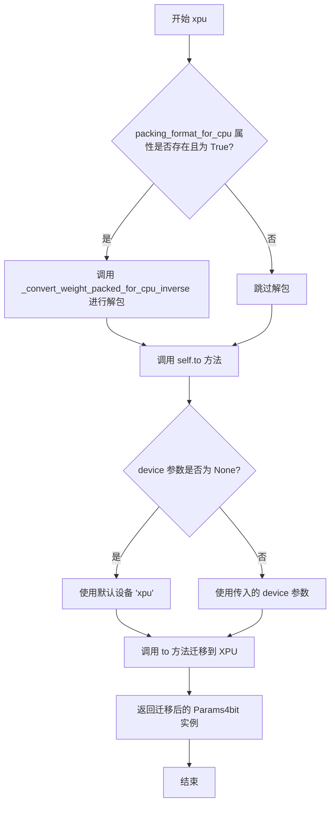

#### 带注释源码

```python
def xpu(self, device: Optional[int | device | str] = None, non_blocking: bool = False):
    """
    将参数移动到 Intel XPU 设备上。
    
    该方法处理两种场景：
    1. 如果量化状态包含 CPU 打包格式的权重数据（packing_format_for_cpu 为 True），
       则先调用 _convert_weight_packed_for_cpu_inverse 将数据从 CPU 打包格式解包恢复
    2. 然后使用 to 方法将参数迁移到指定的 XPU 设备
    
    Args:
        device: 目标 XPU 设备标识，支持整数设备编号、torch.device 对象或字符串标识。
               默认为 None，此时使用 "xpu" 作为默认设备。
        non_blocking: 是否使用非阻塞异步传输。设为 True 可与计算重叠传输，提升性能。
    
    Returns:
        迁移到 XPU 设备后的 Params4bit 实例
    """
    # 检查量化状态是否存在 CPU 打包格式的权重数据
    # packing_format_for_cpu 通常在权重从 CUDA 迁移到 CPU 时设置
    if getattr(self.quant_state, "packing_format_for_cpu", False):
        # 从 CPU 打包格式反向转换回标准 4bit 量化格式
        # 这样可以在 XPU 上进行正确的矩阵运算
        self.data, self.quant_state = _convert_weight_packed_for_cpu_inverse(self.data, self.quant_state)
    
    # 调用 to 方法将参数迁移到 XPU 设备
    # 如果 device 为 None，则默认使用 "xpu" 设备
    # non_blocking 参数控制是否异步传输
    return self.to(device="xpu" if device is None else device, non_blocking=non_blocking)
```


### `Params4bit.to`

该方法用于将 4bit 量化参数（Params4bit）移动到指定设备或转换为指定数据类型。当参数尚未量化且目标设备为非 meta 设备时，会自动触发量化过程；如果已量化，则将量化状态和参数数据一起转移到目标设备。

参数：

- `self`：类型为 `T`（Params4bit 或其子类），表示调用该方法的参数对象本身
- `*args`：可变位置参数，用于接收传递给 PyTorch `to()` 方法的参数（如设备标识符、数据类型或张量）
- `**kwargs`：可变关键字参数，用于接收传递给 PyTorch `to()` 方法的额外参数（如 `non_blocking`）

返回值：类型为 `T`（Params4bit 或其子类），返回已转换到目标设备/数据类型的 Params4bit 参数

#### 流程图

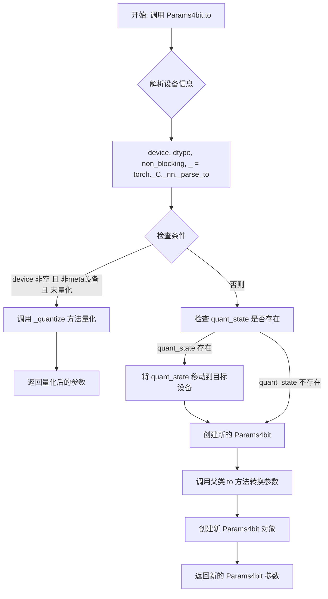

#### 带注释源码

```python
@overload
def to(
    self: T,
    device: Optional[int | device] = ...,
    dtype: Optional[dtype | str] = ...,
    non_blocking: bool = ...,
) -> T: ...

@overload
def to(self: T, dtype: dtype | str, non_blocking: bool = ...) -> T: ...

@overload
def to(self: T, tensor: Tensor, non_blocking: bool = ...) -> T: ...

def to(self, *args, **kwargs):
    # 解析传入的参数，提取 device, dtype, non_blocking 和其他信息
    device, dtype, non_blocking, _ = torch._C._nn._parse_to(*args, **kwargs)

    # 判断条件：
    # 1. device 不为空（需要移动到某个设备）
    # 2. 目标设备不是 meta 设备（meta 设备用于初始化参数结构，不执行实际数据移动）
    # 3. 参数尚未被量化（bnb_quantized == False）
    if device is not None and device.type != "meta" and not self.bnb_quantized:
        # 如果参数未量化且需要移动到实际设备，则先进行 4bit 量化
        return self._quantize(device)
    else:
        # 如果已量化或目标是 meta 设备，则处理量化状态的设备移动
        if self.quant_state is not None:
            # 将量化状态（如量化因子、缩放值等）移动到目标设备
            self.quant_state.to(device)

        # 创建新的 Params4bit 参数，包含所有量化相关属性
        new_param = Params4bit(
            # 调用父类的 to 方法，执行基础的参数设备/类型转换
            super().to(device=device, dtype=dtype, non_blocking=non_blocking),
            # 保持原有的梯度需求设置
            requires_grad=self.requires_grad,
            # 保留量化状态对象（已在上方移动到目标设备）
            quant_state=self.quant_state,
            # 保留量化块大小设置
            blocksize=self.blocksize,
            # 保留统计信息压缩设置
            compress_statistics=self.compress_statistics,
            # 保留量化类型（fp4 或 nf4）
            quant_type=self.quant_type,
            # 保留量化存储数据类型
            quant_storage=self.quant_storage,
            # 保留是否已量化的标志
            bnb_quantized=self.bnb_quantized,
        )

        # 返回新的 Params4bit 参数实例
        return new_param
```


### `Params4bit.__torch_function__`

该方法是 `Params4bit` 类的类方法，用于处理 PyTorch 的 `__torch_function__` 协议。当对 `Params4bit` 类型的张量调用 `torch.chunk` 或 `torch.split` 函数时，该方法会确保分割后的子张量仍然保持 4bit 量化状态（quant_state），从而在分布式训练（如 FSDP）中正确保存和恢复量化参数。

参数：

- `cls`：`classmethod`，表示该方法是一个类方法，指向 `Params4bit` 类本身
- `func`：`torch.Function`，被调用的 PyTorch 函数（如 `torch.chunk`、`torch.split`）
- `types`：`tuple`，涉及的类型元组
- `args`：`tuple`，位置参数元组，默认为空元组 `()`
- `kwargs`：`dict`，关键字参数字典，默认为 `None`

返回值：`Union[Params4bit, tuple[Params4bit]]`，返回分割后的 `Params4bit` 实例或其元组。如果原始操作返回元组（如 `torch.chunk`），则返回由 `Params4bit` 实例组成的元组；否则返回单个 `Params4bit` 实例。

#### 流程图

```mermaid
flowchart TD
    A[开始 __torch_function__] --> B{func 在 [torch.chunk, torch.split] 中?}
    B -->|是| C[获取 tensor = args[0]]
    B -->|否| D[调用父类方法并返回]
    C --> E[调用 super().__torch_function__]
    E --> F{result 是 tuple?}
    F -->|是| G[遍历 result 中的每个 chunk]
    F -->|否| H[直接封装 result]
    G --> I[为每个 chunk 创建新的 Params4bit]
    I --> J[复制原始 tensor 的量化状态]
    J --> K[包括 quant_state, blocksize, quant_type 等]
    K --> L[返回 Params4bit 元组]
    H --> M[复制原始 tensor 的量化状态]
    M --> N[返回单个 Params4bit]
    D --> O[调用 super().__torch_function__]
    O --> P[返回结果]
```

#### 带注释源码

```python
@classmethod
def __torch_function__(cls, func, types, args=(), kwargs=None):
    """
    处理 PyTorch 的 __torch_function__ 协议，
    确保在执行 torch.chunk 或 torch.split 时保持量化状态。
    
    Args:
        cls: 类方法引用，指向 Params4bit 类
        func: 被调用的 PyTorch 函数对象
        types: 涉及的类型元组
        args: 位置参数元组
        kwargs: 关键字参数字典
    
    Returns:
        保持量化状态的 Params4bit 实例或元组
    """
    # 处理 kwargs 为 None 的情况
    if kwargs is None:
        kwargs = {}

    # 检查是否为 chunk 或 split 操作，这些操作需要特殊处理以保持量化状态
    if func in [torch.chunk, torch.split]:
        # 获取第一个参数，即被分割的 Params4bit 张量
        tensor = args[0]

        # 调用父类的 __torch_function__ 方法执行实际分割操作
        result = super().__torch_function__(func, types, args, kwargs)

        # 如果结果是元组（例如 chunk 返回多个块）
        if isinstance(result, tuple):
            # 为每个分割后的块创建新的 Params4bit 实例，保持量化状态
            return tuple(
                cls(
                    data=chunk,                          # 分割后的数据块
                    requires_grad=tensor.requires_grad,  # 保持梯度要求
                    quant_state=tensor.quant_state,      # 保持量化状态
                    blocksize=tensor.blocksize,          # 保持块大小
                    compress_statistics=tensor.compress_statistics,  # 保持压缩统计标志
                    quant_type=tensor.quant_type,        # 保持量化类型 (fp4/nf4)
                    quant_storage=tensor.quant_storage,  # 保持量化存储类型
                    module=tensor.module,                # 保持关联的模块
                    bnb_quantized=tensor.bnb_quantized,   # 保持量化标志
                )
                for chunk in result
            )
        else:
            # 如果结果不是元组（例如 split 返回单个张量）
            return cls(
                data=result,                            # 分割后的结果
                requires_grad=tensor.requires_grad,
                quant_state=tensor.quant_state,
                blocksize=tensor.blocksize,
                compress_statistics=tensor.compress_statistics,
                quant_type=tensor.quant_type,
                quant_storage=tensor.quant_storage,
                module=tensor.module,
                bnb_quantized=tensor.bnb_quantized,
            )

    # 对于其他操作，直接调用父类方法处理
    return super().__torch_function__(func, types, args, kwargs)
```


### Linear4bit.__init__

该方法是 `Linear4bit` 类的构造函数，负责初始化一个4-bit量化线性层。它调用父类 `nn.Linear` 的初始化方法，并将权重转换为 `Params4bit` 对象以支持4-bit量化，同时设置计算数据类型、量化状态和存储格式等属性。

参数：

- `input_features`：`int`，输入特征数，线性层的输入维度
- `output_features`：`int`，输出特征数，线性层的输出维度
- `bias`：`bool`，是否使用偏置项，默认为 `True`
- `compute_dtype`：`torch.dtype`，计算时使用的数据类型，默认为 `None`
- `compress_statistics`：`bool`，是否压缩量化统计信息，默认为 `True`
- `quant_type`：`str`，量化类型（如 "fp4" 或 "nf4"），默认为 `"fp4"`
- `quant_storage`：`torch.dtype`，量化权重的存储数据类型，默认为 `torch.uint8`
- `device`：`device`，设备参数，指定模型运行的设备，默认为 `None`

返回值：无（构造函数不返回任何值）

#### 流程图

```mermaid
flowchart TD
    A[开始 __init__] --> B[调用 nn.Linear 父类初始化]
    B --> C[创建 Params4bit 权重对象]
    C --> D[设置 compute_dtype 属性]
    D --> E[设置 compute_type_is_set 标志]
    E --> F[初始化 quant_state 为 None]
    F --> G[保存 quant_storage]
    G --> H[检查 CPU AVX512BF16 支持]
    I[结束 __init__]
```

#### 带注释源码

```python
def __init__(
    self,
    input_features,
    output_features,
    bias=True,
    compute_dtype=None,
    compress_statistics=True,
    quant_type="fp4",
    quant_storage=torch.uint8,
    device=None,
):
    """
    Initialize Linear4bit class.

    Args:
        input_features (`str`):
            Number of input features of the linear layer.
        output_features (`str`):
            Number of output features of the linear layer.
        bias (`bool`, defaults to `True`):
            Whether the linear class uses the bias term as well.
    """
    # 调用父类 nn.Linear 的初始化方法
    super().__init__(input_features, output_features, bias, device)
    
    # 将权重转换为 Params4bit 对象以支持 4-bit 量化
    self.weight = Params4bit(
        self.weight.data,
        requires_grad=False,  # 量化权重默认冻结，不参与梯度计算
        compress_statistics=compress_statistics,  # 是否压缩统计信息
        quant_type=quant_type,  # 量化类型（fp4 或 nf4）
        quant_storage=quant_storage,  # 量化存储类型
        module=self,  # 引用当前模块，用于状态同步
    )
    
    # 设置计算数据类型，用于前向传播时的类型转换
    self.compute_dtype = compute_dtype
    
    # 标记是否已设置计算类型（在第一次前向传播时自动检测）
    self.compute_type_is_set = compute_dtype is not None
    
    # 初始化量化状态为 None（在移到设备时会被量化）
    self.quant_state = None
    
    # 保存量化存储类型
    self.quant_storage = quant_storage
    
    # 检查当前 CPU 是否支持 AVX512BF16 指令集（用于 CPU 推理加速）
    self.support_avx512bf16_for_cpu = has_avx512bf16()
```


### Linear4bit.set_compute_type

该方法用于根据输入张量的数据类型自动设置 Linear4bit 层的计算数据类型（compute_dtype），以优化推理和训练速度。如果检测到可能导致性能下降的配置（如输入为 float16 但计算类型为 float32），则会发出警告。

参数：

- `x`：`torch.Tensor`，输入张量，用于确定合适的计算数据类型

返回值：`None`，无返回值，仅修改实例的 compute_dtype 属性

#### 流程图

```mermaid
flowchart TD
    A[开始 set_compute_type] --> B{输入 x 的 dtype 是 float32 或 bfloat16?}
    B -->|是| C[设置 self.compute_dtype = x.dtype]
    B -->|否| D{输入 x 的 dtype 是 float16?}
    D -->|否| E[结束]
    D -->|是| F{self.compute_dtype 是 None 或 float32?}
    F -->|否| E
    F --> G{x.numel == x.shape[-1]?}
    G -->|是| H[发出警告: 单批次推理速度慢]
    G -->|否| I[发出警告: 推理或训练速度慢]
    H --> E
    I --> E
```

#### 带注释源码

```python
def set_compute_type(self, x):
    """
    根据输入张量 x 的数据类型自动设置计算数据类型。
    
    该方法会在首次前向传播时被调用（通过 forward 方法中的条件判断），
    以根据输入数据动态选择最优的计算精度，从而平衡性能与精度。
    
    Args:
        x (torch.Tensor): 输入张量，用于确定合适的计算数据类型
    """
    # 检查输入是否为安全可计算的 dtype（float32 或 bfloat16）
    if x.dtype in [torch.float32, torch.bfloat16]:
        # 输入类型安全，直接切换到该类型以提高速度和稳定性
        self.compute_dtype = x.dtype
    # 如果输入是 float16，则需要进一步检查 compute_dtype 设置
    elif x.dtype == torch.float16:
        # 使用层传入的 compute_dtype
        if self.compute_dtype in [None, torch.float32] and (x.numel() == x.shape[-1]):
            # 单批次推理情况：输入为 float16 但 compute_dtype 为 float32（默认）
            # 这会导致推理速度变慢，提醒用户
            warnings.warn(
                "Input type into Linear4bit is torch.float16, but bnb_4bit_compute_dtype=torch.float32 (default). This will lead to slow inference.",
            )
            warnings.filterwarnings("ignore", message=".*inference.")
        if self.compute_dtype in [None, torch.float32] and (x.numel() != x.shape[-1]):
            # 批量推理或训练情况：输入为 float16 但 compute_dtype 为 float32
            # 这会导致推理或训练速度变慢，提醒用户
            warnings.warn(
                "Input type into Linear4bit is torch.float16, but bnb_4bit_compute_dtype=torch.float32 (default). This will lead to slow inference or training speed.",
            )
            warnings.filterwarnings("ignore", message=".*inference or training")
```


### `Linear4bit._save_to_state_dict`

该方法负责将 4-bit 量化线性层的权重和量化状态保存到状态字典中。首先检查是否需要将 CPU 打包格式的权重转换回原始格式，然后调用父类方法保存权重和偏置，最后将量化状态的各个组件（如 abmax、quant_type 等）存储到状态字典中。

参数：

- `destination`：`Dict[str, Any]`，用于存储状态字典的目标字典
- `prefix`：`str`，状态字典中键的前缀
- `keep_vars`：`bool`，是否保留变量（True 保留 requires_grad，False 则 detach）

返回值：`None`，该方法直接修改 `destination` 字典，不返回值

#### 流程图

```mermaid
flowchart TD
    A[开始 _save_to_state_dict] --> B{self.weight.quant_state 是否存在?}
    B -->|是| C{packing_format_for_cpu 是否为 True?}
    B -->|否| D[调用父类 _save_to_state_dict]
    C -->|是| E[调用 _convert_weight_packed_for_cpu_inverse 转换权重和量化状态]
    C -->|否| D
    E --> D
    D --> F{self.weight.quant_state 是否存在?}
    F -->|是| G[遍历 quant_state.as_dict 返回的键值对]
    F -->|否| H[结束]
    G --> I{keep_vars 为 True?}
    I -->|是| J[直接存储 v]
    I -->|否| K[存储 v.detach()]
    J --> L[destination[prefix + 'weight.' + k] = v]
    K --> L
    L --> G
```

#### 带注释源码

```python
def _save_to_state_dict(self, destination, prefix, keep_vars):
    """
    save weight and bias,
    then fill state_dict with components of quant_state
    """
    # 检查权重是否具有量化状态，且量化状态是否包含 CPU 打包格式标志
    # 如果是 CPU 打包格式，需要先转换回原始格式才能正确保存
    if getattr(self.weight, "quant_state", None) is not None and getattr(
        self.weight.quant_state, "packing_format_for_cpu", False
    ):
        # 将 CPU 打包格式的权重和量化状态转换回原始格式
        # _convert_weight_packed_for_cpu_inverse 是 bitsandbytes 内部的转换函数
        self.weight.data, self.weight.quant_state = _convert_weight_packed_for_cpu_inverse(
            self.weight.data, self.weight.quant_state
        )
    
    # 调用父类 nn.Linear 的 _save_to_state_dict 方法
    # 保存权重 (weight) 和偏置 (bias) 到 destination 字典中
    super()._save_to_state_dict(destination, prefix, keep_vars)  # saving weight and bias
    
    # 如果权重具有量化状态，将量化状态的各个组件保存到状态字典中
    # 量化状态包含：abmax（每个块的绝对最大值）、quant_type（量化类型如 fp4/nf4）等
    if getattr(self.weight, "quant_state", None) is not None:
        # as_dict(packed=True) 将量化状态转换为字典格式
        # 遍历量化状态的每个组件，存储到 destination 中
        for k, v in self.weight.quant_state.as_dict(packed=True).items():
            # 键的格式为：prefix + "weight." + k（例如：'module.layer.weight.abmax'）
            # 根据 keep_vars 决定是否 detach
            destination[prefix + "weight." + k] = v if keep_vars else v.detach()
```


### Linear4bit.forward

该方法是 Linear4bit 类的核心前向传播函数，负责执行 4-bit 量化线性层的推理计算。它首先修复量化状态，处理 CPU 上的权重格式转换，管理偏置和输入数据类型，最后调用 bnb.matmul_4bit 执行高效的 4-bit 矩阵乘法运算并返回与输入数据类型一致的结果。

#### 参数

- `x`：`torch.Tensor`，输入张量，通常为隐藏状态或特征向量

#### 返回值

- `torch.Tensor`，线性层的输出，与输入 `x` 的数据类型相同

#### 流程图

```mermaid
flowchart TD
    A[开始 forward] --> B[fix_4bit_weight_quant_state_from_module<br/>修复4bit权重量化状态]
    B --> C{检查是否在CPU上<br/>且支持AVX512BF16<br/>且为推理模式}
    C -->|是| D[_convert_weight_packed_for_cpu<br/>转换CPU权重格式]
    C -->|否| E[跳过权重转换]
    D --> F[检查偏置数据类型<br/>是否与输入匹配]
    E --> F
    F -->|不匹配| G[将偏置转换为输入数据类型]
    F -->|匹配| H[设置计算数据类型]
    G --> H
    H --> I{compute_dtype<br/>是否已设置}
    I -->|否| J[set_compute_type<br/>根据输入设置计算类型]
    I -->|是| K[转换输入到计算类型]
    J --> K
    K --> L[准备偏置和权重<br/>权重根据格式决定是否转置]
    L --> M[bnb.matmul_4bit<br/>执行4bit矩阵乘法]
    M --> N[结果转换回输入数据类型]
    N --> O[返回输出张量]
```

#### 带注释源码

```python
def forward(self, x: torch.Tensor):
    """
    Linear4bit 层的前向传播方法，执行 4-bit 量化矩阵乘法。
    
    Args:
        x: 输入张量，形状为 (batch_size, input_features) 或任意形状的隐藏状态
        
    Returns:
        输出张量，形状为 (batch_size, output_features)，数据类型与输入相同
    """
    # 1. 修复量化状态：如果模块的量化状态丢失（如 FSDP 转换后），尝试恢复
    fix_4bit_weight_quant_state_from_module(self)
    
    # 2. 获取权重量化状态
    quant_state = self.weight.quant_state

    # 3. CPU 特定优化：如果在 CPU 上推理且支持 AVX512BF16，
    #    转换权重打包格式以加速计算
    if (
        not getattr(quant_state, "packing_format_for_cpu", False)  # 权重未针对 CPU 打包
        and x.device.type == "cpu"                                 # 当前在 CPU 设备上
        and self.support_avx512bf16_for_cpu                        # CPU 支持 AVX512BF16
        and not self.training                                       # 推理模式（非训练）
        and x.requires_grad == False                               # 不需要梯度
    ):
        # 转换权重为 CPU 优化格式
        self.weight.data, quant_state = _convert_weight_packed_for_cpu(self.weight.data, quant_state)

    # 4. 偏置类型转换：权重自动转换，但偏置需手动转换以匹配输入类型
    if self.bias is not None and self.bias.dtype != x.dtype:
        self.bias.data = self.bias.data.to(x.dtype)

    # 5. 设置计算数据类型：根据输入自动选择最优计算精度
    if not self.compute_type_is_set:
        self.set_compute_type(x)
        self.compute_type_is_set = True

    # 6. 保存输入原始数据类型，用于最终结果转换
    inp_dtype = x.dtype
    
    # 7. 将输入转换为计算数据类型（如 bfloat16）以提高计算效率
    if self.compute_dtype is not None:
        x = x.to(self.compute_dtype)

    # 8. 准备偏置和权重
    bias = None if self.bias is None else self.bias.to(self.compute_dtype)
    
    # 9. 根据量化状态决定权重是否需要转置
    #    - CPU 打包格式：使用原始权重
    #    - GPU 格式：需要转置 (weight.t())
    weight = self.weight if getattr(quant_state, "packing_format_for_cpu", False) else self.weight.t()

    # 10. 执行 4-bit 量化矩阵乘法，并转换回原始输入数据类型
    return bnb.matmul_4bit(x, weight, bias=bias, quant_state=quant_state).to(inp_dtype)
```


### `LinearFP4.__init__`

该方法是 `LinearFP4` 类的构造函数，用于初始化一个使用 FP4 数据类型的 4bit 量化线性层。它继承自 `Linear4bit` 类，并将量化类型设置为 "fp4"，从而实现 FP4（4位浮点）量化算法。

参数：

- `input_features`：`int`，输入特征的数量，指定线性层的输入维度
- `output_features`：`int`，输出特征的数量，指定线性层的输出维度
- `bias`：`bool`，默认为 `True`，是否使用偏置项
- `compute_dtype`：可选的 `torch.dtype`，计算时使用的数据类型，默认为 `None`
- `compress_statistics`：`bool`，默认为 `True`，是否压缩量化统计信息
- `quant_storage`：`torch.dtype`，默认为 `torch.uint8`，量化存储的数据类型
- `device`：可选的设备参数，指定模型放置的设备

返回值：`None`，构造函数不返回任何值

#### 流程图

```mermaid
flowchart TD
    A[开始初始化 LinearFP4] --> B[接收输入参数]
    B --> C{检查 bias 参数}
    C -->|True| D[保留偏置项]
    C -->|False| E[不使用偏置项]
    D --> F[调用父类 Linear4bit.__init__]
    E --> F
    F --> G[在父类中创建 Params4bit 权重参数]
    G --> H[设置量化类型为 'fp4']
    H --> I[初始化其他属性: compute_dtype, quant_state 等]
    I --> J[结束初始化]
```

#### 带注释源码

```python
def __init__(
    self,
    input_features,
    output_features,
    bias=True,
    compute_dtype=None,
    compress_statistics=True,
    quant_storage=torch.uint8,
    device=None,
):
    """
    Args:
        input_features (`str`):
            Number of input features of the linear layer.
        output_features (`str`):
            Number of output features of the linear layer.
        bias (`bool`, defaults to `True`):
            Whether the linear class uses the bias term as well.
    """
    # 调用父类 Linear4bit 的初始化方法
    # 传入 "fp4" 作为量化类型参数，这是 FP4 与 NF4 的关键区别
    super().__init__(
        input_features,
        output_features,
        bias,
        compute_dtype,
        compress_statistics,
        "fp4",  # 量化类型：FP4 (4位浮点)
        quant_storage,
        device,
    )
```


### LinearNF4.__init__

初始化LinearNF4类，该类是Linear4bit的子类，专门用于实现NF4（Normal Float 4-bit）数据类型。NF4是一种量化数据类型，其每个箱子在标准正态分布N(0,1)下具有相等的面积，并归一化到[-1,1]范围内。该类主要用于QLoRA量化算法中的线性层。

参数：

- `input_features`：`int`，输入特征的数量，定义线性层的输入维度
- `output_features`：`int`，输出特征的数量，定义线性层的输出维度
- `bias`：`bool`，默认为`True`，是否使用偏置项
- `compute_dtype`：`torch.dtype`或`None`，计算时使用的数据类型，用于指定矩阵乘法的计算精度
- `compress_statistics`：`bool`，默认为`True`，是否压缩量化统计信息，影响量化状态的存储方式
- `quant_storage`：`torch.dtype`，默认为`torch.uint8`，量化权重的存储数据类型
- `device`：`torch.device`或`None`，指定模型所在的设备

返回值：`None`，__init__方法不返回任何值，仅初始化对象状态

#### 流程图

```mermaid
flowchart TD
    A[开始 LinearNF4.__init__] --> B[调用父类Linear4bit.__init__]
    B --> C[传入参数: input_features, output_features, bias, compute_dtype, compress_statistics, 'nf4', quant_storage, device]
    C --> D[父类初始化: 调用nn.Linear基类]
    D --> E[创建Params4bit权重参数]
    E --> F[设置量化类型为'nf4']
    F --> G[初始化其他属性: compute_dtype, quant_state, quant_storage等]
    G --> H[结束]
```

#### 带注释源码

```python
class LinearNF4(Linear4bit):
    """Implements the NF4 data type.

    Constructs a quantization data type where each bin has equal area under a standard normal distribution N(0, 1) that
    is normalized into the range [-1, 1].

    For more information read the paper: QLoRA: Efficient Finetuning of Quantized LLMs (https://arxiv.org/abs/2305.14314)

    Implementation of the NF4 data type in bitsandbytes can be found in the `create_normal_map` function in
    the `functional.py` file: https://github.com/TimDettmers/bitsandbytes/blob/main/bitsandbytes/functional.py#L236.
    """

    def __init__(
        self,
        input_features,
        output_features,
        bias=True,
        compute_dtype=None,
        compress_statistics=True,
        quant_storage=torch.uint8,
        device=None,
    ):
        """
        Args:
            input_features (`str`):
                Number of input features of the linear layer.
            output_features (`str`):
                Number of output features of the linear layer.
            bias (`bool`, defaults to `True`):
                Whether the linear class uses the bias term as well.
        """
        # 调用父类Linear4bit的__init__方法，传入nf4作为quant_type
        # 父类会完成主要的初始化工作，包括：
        # 1. 调用nn.Linear基类初始化
        # 2. 创建Params4bit权重参数并设置量化类型为nf4
        # 3. 初始化compute_dtype、quant_state、quant_storage等属性
        super().__init__(
            input_features,
            output_features,
            bias,
            compute_dtype,
            compress_statistics,
            "nf4",  # 指定使用NF4量化类型
            quant_storage,
            device,
        )
```


### Int8Params.__new__

该方法是 `Int8Params` 类的构造函数，用于创建一个支持 8 位量化权重的 Parameter 对象。它通过 `torch.Tensor._make_subclass` 创建自定义 Parameter 子类，并初始化量化所需的元数据（CB、SCB、has_fp16_weights）。

参数：

- `cls`：类型，表示类本身（Python `__new__` 方法的隐式参数）
- `data`：`Optional[torch.Tensor]`，要存储的权重数据，默认为 None
- `requires_grad`：`bool`，是否需要梯度，默认为 True
- `has_fp16_weights`：`bool`，是否有 FP16 原始权重，默认为 False
- `CB`：`Optional[torch.Tensor]`，量化后的权重矩阵（Codebook），默认为 None
- `SCB`：`Optional[torch.Tensor]`，量化后的缩放因子（Scale CB），默认为 None

返回值：`Int8Params`，返回创建的 Int8Params 实例对象

#### 流程图

```mermaid
flowchart TD
    A[开始 __new__] --> B{data is None?}
    B -->|是| C[data = torch.empty(0)]
    B -->|否| D[保留原 data]
    C --> E[调用 torch.Tensor._make_subclass 创建子类实例]
    D --> E
    E --> F[设置 obj.CB = CB]
    F --> G[设置 obj.SCB = SCB]
    G --> H[设置 obj.has_fp16_weights = has_fp16_weights]
    H --> I[返回 obj 实例]
```

#### 带注释源码

```python
def __new__(
    cls,
    data: Optional[torch.Tensor] = None,
    requires_grad=True,
    has_fp16_weights=False,
    CB: Optional[torch.Tensor] = None,
    SCB: Optional[torch.Tensor] = None,
):
    # 如果没有传入数据，则创建一个空的 tensor 占位
    # 这是为了避免后续操作中因 data 为 None 而报错
    if data is None:
        data = torch.empty(0)
    
    # 使用 PyTorch 内部方法 _make_subclass 创建自定义 Parameter 子类
    # 第一个参数是类本身，第二个是数据，第三个是 requires_grad
    # 这样 Int8Params 既是 torch.nn.Parameter 的子类，又能保存自定义属性
    obj = torch.Tensor._make_subclass(cls, data, requires_grad)
    
    # CB (Codebook): 存储量化后的权重矩阵（int8 格式）
    obj.CB = CB
    
    # SCB (Scale for Codebook): 存储每个权重块的缩放因子
    obj.SCB = SCB
    
    # has_fp16_weights: 标记是否保留了原始 FP16 权重
    # False 表示权重已被量化，True 表示需要动态量化
    obj.has_fp16_weights = has_fp16_weights
    
    # 返回创建的实例，该实例可直接当作 torch.Tensor 使用
    return obj
```


### `Int8Params._quantize`

该方法负责将 `Int8Params` 对象的权重数据从原始精度（如 float16）量化到 int8 格式，并存储量化所需的统计信息（CB 和 SCB）。

参数：

- `device`：`torch.device`，目标设备，用于将权重移动到指定设备并进行量化

返回值：`Int8Params`，返回自身（量化后的参数对象）

#### 流程图

```mermaid
flowchart TD
    A[开始 _quantize] --> B{has_fp16_weights == True?}
    B -->|Yes| C[调用 super().to(device) 直接返回]
    B -->|No| D[开始量化流程]
    D --> E[获取 data 并转为 contiguous]
    E --> F[将数据移动到目标设备并转换为 float16]
    F --> G[调用 bnb.functional.int8_vectorwise_quant 进行量化]
    G --> H[获取量化后的 CB, SCB 和其他统计信息]
    H --> I[更新 self.data = CB]
    I --> J[更新 self.CB = CB]
    J --> K[更新 self.SCB = SCB]
    K --> L[返回 self]
```

#### 带注释源码

```python
def _quantize(self, device):
    """
    Quantize the weight data to int8 format.
    
    This method is called when the parameter is moved to a non-CPU device.
    It quantizes the float16 weights to int8 and stores the quantization
    statistics (CB and SCB) for later dequantization during inference.
    
    Args:
        device: The target device to quantize the weights for.
        
    Returns:
        Self: The quantized parameter object.
    """
    # Check if the weights are already in fp16 format (not quantized)
    # If True, just move to device without quantization
    if self.has_fp16_weights:
        return super().to(device)

    # We quantize the weight and store in 8bit row-major
    # Step 1: Ensure data is contiguous in memory
    # Step 2: Move to target device and convert to float16
    B = self.data.contiguous().to(device=device, dtype=torch.float16)
    
    # Step 3: Call bitsandbytes functional to perform int8 vectorwise quantization
    # CB: Quantized weights (int8)
    # SCB: Scaling factors for dequantization
    # Third return value is ignored (reserved for future use)
    CB, SCB, _ = bnb.functional.int8_vectorwise_quant(B)
    
    # Step 4: Store quantized data and statistics
    self.data = CB       # Store quantized weights
    self.CB = CB         # Store codebook (quantized values)
    self.SCB = SCB       # Store scaling factors

    return self
```


### `Int8Params.cpu`

将 8 位量化参数移动到 CPU 设备上。

参数：

- 无（仅包含隐式参数 `self`）

返回值：`Int8Params`，返回已移动到 CPU 设备的新的 `Int8Params` 对象。

#### 流程图

```mermaid
graph TD
    A[开始] --> B[调用 self.to device='cpu']
    B --> C{设备是否为非 meta 设备且未量化?}
    C -->|是| D[执行 _quantize 进行量化]
    C -->|否| E[创建新参数并迁移数据]
    D --> F[返回新的 Int8Params 对象]
    E --> F
```

#### 带注释源码

```python
def cpu(self):
    """
    将参数移动到 CPU 设备。
    
    此方法是 torch.nn.Parameter 的 cpu() 方法的包装，
    内部调用 to() 方法将参数迁移到 CPU。
    
    Returns:
        Int8Params: 位于 CPU 设备上的参数对象。
    """
    return self.to(device="cpu")
```


### `Int8Params.cuda`

将 Int8Params 参数移动到 CUDA 设备。该方法继承自 PyTorch 的 Parameter 类，用于将 8 位量化参数传输到 GPU 设备上进行计算。

参数：

- `device`：`Optional[int | device | str]`，目标 CUDA 设备，默认为 None（表示默认设备）
- `non_blocking`：`bool`，是否使用非阻塞传输，默认为 False

返回值：`Int8Params`（或 `T`），返回移动到 CUDA 设备后的参数对象

#### 流程图

```mermaid
flowchart TD
    A[开始 cuda 方法] --> B{device 参数是否为 None?}
    B -->|是| C[使用 'cuda' 作为目标设备]
    B -->|否| D[使用传入的 device 作为目标设备]
    C --> E[调用 to 方法, 设备为 'cuda', non_blocking=non_blocking]
    D --> E
    E --> F[返回移动到 CUDA 后的参数对象]
```

#### 带注释源码

```python
def cuda(self, device: Optional[int | device | str] = None, non_blocking: bool = False):
    """
    将参数移动到 CUDA 设备上。
    
    Args:
        device: 目标设备,可以是整数、设备对象或字符串。如果为 None,则使用默认 CUDA 设备。
        non_blocking: 如果为 True 且当前张量在 CPU 上,则数据传输可以与内核执行异步进行。
    
    Returns:
        移动到 CUDA 设备后的 Int8Params 对象。
    """
    # 调用 to 方法,将参数移动到 CUDA 设备
    # 如果 device 为 None,则默认为 'cuda'
    return self.to(device="cuda" if device is None else device, non_blocking=non_blocking)
```


### Int8Params.xpu

将8位量化参数（Int8Params）移动到XPU设备上。该方法是`cuda`方法的XPU版本，用于将量化权重从CPU或其他设备转移到Intel GPU（XPU）上执行推理或训练。

参数：

- `device`：`Optional[int | device | str]`，目标XPU设备标识，可以是整数索引、设备对象或字符串（如"xpu:0"），默认为None
- `non_blocking`：`bool`，是否使用非阻塞方式进行数据传输，默认为False

返回值：`T`（Int8Params类型），返回移动到XPU设备后的参数对象

#### 流程图

```mermaid
flowchart TD
    A[开始: xpu调用] --> B{device参数是否为空?}
    B -->|是| C[使用默认设备 "xpu"]
    B -->|否| D[使用传入的device参数]
    C --> E[调用self.to方法]
    D --> E
    E --> F[返回移动到XPU的参数对象]
```

#### 带注释源码

```python
def xpu(self, device: Optional[int | device | str] = None, non_blocking: bool = False):
    """
    将参数移动到XPU设备上。
    
    Args:
        device: 目标设备标识，默认为None，此时使用"xpu"作为默认设备
        non_blocking: 是否异步传输数据，默认为False（同步传输）
    
    Returns:
        移动到XPU设备后的Int8Params对象
    """
    return self.to(device="xpu" if device is None else device, non_blocking=non_blocking)
```


### `Int8Params.__deepcopy__`

实现 `Int8Params` 对象的深拷贝功能，用于在模型复制、分布式训练等场景中创建独立的参数副本，确保量化状态（CB、SCB）等关键数据被正确复制。

参数：

- `self`：`Int8Params`，隐含的实例参数，表示要拷贝的 Int8Params 对象
- `memo`：`dict`，Python 标准库 `copy.deepcopy` 传递的备忘录字典，用于跟踪已拷贝对象、避免循环引用

返回值：`Int8Params`，返回一个新的深拷贝后的 Int8Params 实例，包含与原始对象相同的量化参数和数据

#### 流程图

```mermaid
flowchart TD
    A[开始 __deepcopy__] --> B[获取 self 的类型]
    B --> C[创建新实例: type(self).__new__]
    D[调用 __getstate__ 获取当前状态] --> E[调用 __setstate__ 设置状态到新实例]
    E --> F[深拷贝 quant_state]
    F --> G[深拷贝 data]
    G --> H[返回新实例]
    
    C --> D
    H --> I[结束]
    
    style A fill:#f9f,color:#000
    style H fill:#9f9,color:#000
    style I fill:#f9f,color:#000
```

#### 带注释源码

```python
def __deepcopy__(self, memo):
    # adjust this if new arguments are added to the constructor
    # 使用 type(self).__new__ 创建一个新的空实例，保留原始对象的类型（支持子类）
    new_instance = type(self).__new__(
        type(self),
        # 使用 copy.deepcopy 深拷贝数据，确保新实例有独立的数据副本
        data=copy.deepcopy(self.data, memo),
        # 保留原始的 requires_grad 设置
        requires_grad=self.requires_grad,
        # 保留原始的 has_fp16_weights 标志
        has_fp16_weights=self.has_fp16_weights,
        # 深拷贝 CB（量化后的权重矩阵）
        CB=copy.deepcopy(self.CB, memo),
        # 深拷贝 SCB（缩放因子）
        SCB=copy.deepcopy(self.SCB, memo),
    )
    # 返回深拷贝后的新实例
    return new_instance
```


### Int8Params.to

该方法是 `Int8Params` 类的成员方法，用于将量化后的 8 位参数移动到指定设备或转换为指定数据类型。当参数从 CPU 设备移动到非 meta 设备时，如果尚未量化则自动触发量化；如果已经量化，则正确迁移缩放因子（CB 和 SCB）。

参数：

- `self`：隐含参数，类型为 `Int8Params`，表示当前参数对象本身
- `*args`：可变位置参数，类型为 `Any`，传递给 PyTorch 内部解析方法的原始位置参数，支持多种重载签名
- `**kwargs`：可变关键字参数，类型为 `Dict[str, Any]`，传递给 PyTorch 内部解析方法的原始关键字参数，支持设备、dtype、non_blocking 等

返回值：`Int8Params`，返回一个新的或更新后的参数对象，包含正确的量化状态

#### 流程图

```mermaid
flowchart TD
    A[开始: Int8Params.to] --> B[解析参数: torch._C._nn._parse_to]
    B --> C{设备是否存在且非meta}
    C -->|是| D{数据是否已量化}
    C -->|否| E[跳过量化和设备检查]
    D -->|否| F{原设备是CPU且目标非meta}
    D -->|是| G[数据已量化,跳过_quantize]
    F -->|是| H[调用self._quantize量化]
    F -->|否| I[跳过量化的quantize调用]
    H --> J[返回量化后的参数]
    G --> K[执行标准to操作]
    I --> K
    E --> K
    K --> L[创建新参数: Int8Params]
    L --> M{原数据已量化?}
    M -->|是| N[迁移CB到新参数data]
    M -->|否| O[跳过CB迁移]
    N --> P{SCB存在且非meta}
    O --> P
    P -->|是| Q[迁移SCB到新参数]
    P -->|否| R[跳过SCB迁移]
    Q --> S[返回新参数]
    R --> S
    J --> S
```

#### 带注释源码

```python
@overload
def to(
    self: T,
    device: Optional[int | device] = ...,
    dtype: Optional[dtype | str] = ...,
    non_blocking: bool = ...,
) -> T: ...

@overload
def to(self: T, dtype: dtype | str, non_blocking: bool = ...) -> T: ...

@overload
def to(self: T, tensor: Tensor, non_blocking: bool = ...) -> T: ...

def to(self, *args, **kwargs):
    # 使用 PyTorch 内部方法解析 to() 的参数，提取 device, dtype, non_blocking
    device, dtype, non_blocking, _ = torch._C._nn._parse_to(*args, **kwargs)

    # 检查数据是否已经是 int8 量化格式
    is_quantized = self.data.dtype == torch.int8

    # 条件判断：如果数据未量化且目标设备存在、非 meta 设备，且当前数据在 CPU 上
    # 这种情况下需要触发量化（从 fp16/bf16 转到 int8）
    if not is_quantized and device is not None and device.type != "meta" and self.data.device.type == "cpu":
        # We're moving from a CPU device to a non-meta device.
        # In this circumstance, we want to quantize if we haven't already.
        return self._quantize(device)

    # 创建新的参数对象，调用父类的 to 方法将数据移动到目标设备和dtype
    new_param = Int8Params(
        super().to(device=device, dtype=dtype, non_blocking=non_blocking),
        requires_grad=self.requires_grad,
        has_fp16_weights=self.has_fp16_weights,
    )

    # 如果数据已经量化，需要正确迁移量化相关的统计量
    if is_quantized:
        # 将量化后的权重数据（CB）复制到新参数的 data 属性
        new_param.CB = new_param.data

        # 如果存在缩放因子（SCB）且目标设备有效，将其也迁移到目标设备
        if device is not None and self.SCB is not None and self.SCB.device.type != "meta":
            new_param.SCB = self.SCB.to(device)

    return new_param
```


### `Embedding8bit._save_to_state_dict`

该方法用于将 Embedding8bit 模块的状态字典保存到指定的目标字典中。然而，该方法当前未实现，调用时会抛出 `NotImplementedError`。

参数：

- `destination`：`dict`，用于存储状态字典的目标字典
- `prefix`：`str`，状态字典中键的前缀
- `keep_vars`：`bool`，是否保留变量（若为 False，则对张量执行 detach 操作）

返回值：`None`，该方法会抛出 `NotImplementedError` 异常

#### 流程图

```mermaid
flowchart TD
    A[开始 _save_to_state_dict] --> B{调用方法}
    B --> C[抛出 NotImplementedError]
    C --> D[结束: 保存功能未实现]
```

#### 带注释源码

```
def _save_to_state_dict(self, destination, prefix, keep_vars):
    """
    保存模块的状态字典到 destination 中。
    注意：Embedding8bit 模块目前不支持保存功能。
    
    参数:
        destination (dict): 用于存储状态字典的目标字典
        prefix (str): 状态字典中键的前缀
        keep_vars (bool): 是否保留变量，False 时会对张量执行 detach
    
    返回:
        None: 该方法会抛出 NotImplementedError
    
    异常:
        NotImplementedError: 当尝试保存 Embedding8bit 模块时抛出
    """
    raise NotImplementedError("Saving Embedding8bit module is not implemented")
```


### `Embedding8bit.forward`

该方法实现了 LLM.int8() 算法的嵌入层前向传播，通过将输入索引映射到量化后的 int8 嵌入表，同时使用缩放因子（SCB）对输出进行反量化，以恢复原始精度。

参数：

- `input`：`Tensor`，输入的索引张量，形状为任意维度（通常为 batch 索引序列）

返回值：`Tensor`，量化嵌入的输出，形状为 `(*input.shape, embedding_dim)`，数据类型为原始精度（存储在 `self.dtype` 中）

#### 流程图

```mermaid
flowchart TD
    A[开始 forward] --> B{检查 SCB 属性是否存在}
    B -->|不存在| C[抛出 RuntimeError: Embedding layer is not quantized]
    B -->|存在| D[获取量化权重 rows 和缩放因子 SCB]
    D --> E[断言验证 rows 和 row_stats 的形状]
    E --> F[执行 F.embedding 获取压缩输出]
    G[执行 F.embedding 获取缩放因子输出]
    F --> H[计算输出: compressed_output * (compressed_output_stats / 127.0)]
    G --> H
    H --> I[将输出转换到原始 dtype]
    I --> J[返回最终输出]
```

#### 带注释源码

```python
def forward(self, input: Tensor) -> Tensor:
    # 检查嵌入层是否已量化，如果未量化则抛出异常
    if not hasattr(self.weight, "SCB"):
        raise RuntimeError("Embedding layer is not quantized. Please call .cuda() or .to(device) first.")

    # 获取量化后的权重（int8格式）和缩放因子（SCB）
    rows = self.weight.data          # 量化权重，形状为 (num_embeddings, embedding_dim)
    row_stats = self.weight.SCB      # 缩放因子，形状为 (num_embeddings,)

    # 断言验证权重和缩放因子的形状是否符合预期
    assert rows.shape == (self.num_embeddings, self.embedding_dim)
    assert row_stats.shape == (self.num_embeddings,)

    # 使用 F.embedding 查找输入索引对应的量化权重
    # 注意：这里直接返回量化后的值（int8），需要进行缩放
    compressed_output = F.embedding(input, rows)

    # 使用 F.embedding 查找输入索引对应的缩放因子
    # 将 row_stats 视图转换为 (num_embeddings, 1) 以便广播
    compressed_output_stats = F.embedding(input, row_stats.view(self.num_embeddings, 1))

    # 通过缩放因子对压缩输出进行反量化
    # 除以 127.0 是因为 int8 量化使用 [-127, 127] 范围
    output = compressed_output * (compressed_output_stats / 127.0)

    # 将输出从 float32 转换回原始精度（通常是 fp16 或 bf16）
    return output.to(self.dtype)
```


### Embedding4bit.__init__

这是 `Embedding4bit` 类的构造函数，用于初始化一个带有4位量化功能的嵌入层。该类基于 `nn.Embedding` 实现，通过 `Params4bit` 将嵌入权重转换为4位量化格式，支持 FP4 和 NF4 量化类型，以减少内存占用并加速推理。

参数：

- `num_embeddings`：`int`，词表大小，即嵌入矩阵的行数
- `embedding_dim`：`int`，嵌入向量的维度，即嵌入矩阵的列数
- `dtype`：`Optional[dtype]`，嵌入权重的原始数据类型，默认为 None
- `quant_type`：`str`，量化类型，可选 "fp4" 或 "nf4"，默认为 "fp4"
- `quant_storage`：`torch.dtype`，量化后权重的存储类型，默认为 torch.uint8
- `device`：`Optional[device]`，设备参数，默认为 None

返回值：`None`，构造函数无返回值

#### 流程图

```mermaid
flowchart TD
    A[开始 __init__] --> B[调用 nn.Embedding 父类初始化]
    B --> C[保存原始权重数据类型到 self.dtype]
    C --> D[创建 Params4bit 量化参数对象]
    D --> E{检查 embedding_dim 是否可被 blocksize 整除}
    E -->|是| F[结束 __init__]
    E -->|否| G[发出警告: 慢推理]
    G --> F
```

#### 带注释源码

```python
def __init__(
    self,
    num_embeddings,
    embedding_dim,
    dtype=None,
    quant_type="fp4",
    quant_storage=torch.uint8,
    device=None,
):
    """
    初始化 Embedding4bit 量化嵌入层。
    
    参数:
        num_embeddings: 词表大小
        embedding_dim: 嵌入维度
        dtype: 权重数据类型
        quant_type: 量化类型 ("fp4" 或 "nf4")
        quant_storage: 量化存储类型
        device: 设备
    """
    # 调用父类 nn.Embedding 的初始化方法，创建标准的嵌入层
    super().__init__(num_embeddings, embedding_dim, device=device, dtype=dtype)
    
    # 保存原始权重的 dtype，用于后续反量化时恢复原始精度
    self.dtype = self.weight.data.dtype

    # 将权重转换为 4-bit 量化参数
    # requires_grad=False: 量化权重默认冻结，不参与梯度更新
    # compress_statistics=None: 不压缩统计信息
    # quant_type: 量化类型 (fp4/nf4)
    # quant_storage: 存储格式 (uint8)
    # module=self: 引用当前模块，用于同步量化状态
    self.weight = Params4bit(
        self.weight.data,
        requires_grad=False,
        compress_statistics=None,
        quant_type=quant_type,
        quant_storage=quant_storage,
        module=self,
    )

    # 获取量化块大小
    blocksize = self.weight.blocksize

    # 检查嵌入维度是否能被块大小整除
    # 如果不能整除，会导致推理速度变慢
    if embedding_dim % blocksize != 0:
        warnings.warn(
            f"Embedding size {embedding_dim} is not divisible by block size {blocksize}. "
            "This will lead to slow inference.",
        )
```


### `Embedding4bit._forward_with_partial_dequantize`

该方法是 `Embedding4bit` 类的核心前向传播方法，实现了 4-bit 量化嵌入层的部分解量化前向传递。它通过直接从量化权重中解量化获取 absmax（绝对最大值），避免了完全解量化整个嵌入矩阵，从而优化了内存使用和计算效率。

参数：

- `input`：`Tensor`，输入张量，包含需要查找的嵌入索引

返回值：`Tensor`，解量化后的嵌入输出，张量形状为 `(*input.shape, self.embedding_dim)`

#### 流程图

```mermaid
flowchart TD
    A[开始] --> B[验证 embedding_dim 能被 blocksize 整除]
    B --> C[将 4bit 权重数据视图转换为 uint8]
    C --> D[执行嵌入查找获取量化权重 output_4bit]
    D --> E[计算每个嵌入的块数 blocks_per_emb]
    E --> F[从 quant_state 获取 absmax]
    F --> G[执行嵌入查找获取当前输入对应的 absmax 值]
    G --> H[深拷贝 quant_state 并更新 absmax 和 shape]
    H --> I[调用 dequantize_4bit 解量化输出]
    I --> J[验证输出形状]
    J --> K[转换输出 dtype 并返回]
```

#### 带注释源码

```
def _forward_with_partial_dequantize(self, input: Tensor):
    # 验证 embedding 维度能被量化块大小整除，确保可以均匀分块
    assert self.embedding_dim % self.weight.quant_state.blocksize == 0

    # 将 4bit 权重数据转换为 uint8 类型并重塑为 (num_embeddings * embedding_dim // 2, 1)
    # 每个字节存储 2 个 4bit 值
    w_4bit_uint8 = self.weight.data.view(torch.uint8).view(self.num_embeddings * self.embedding_dim // 2, 1)

    # 使用量化后的 4bit 权重执行嵌入查找
    # 将权重重塑为 (num_embeddings, embedding_dim // 2) 进行查找
    output_4bit = torch.nn.functional.embedding(
        weight=w_4bit_uint8.view(self.num_embeddings, self.embedding_dim // 2),
        input=input,
    ).view(-1, 1)
    # 验证输出形状：每个索引对应 embedding_dim // 2 个量化值
    assert output_4bit.shape == (input.numel() * self.embedding_dim // 2, 1)

    # 计算每个嵌入维度包含的块数量
    blocks_per_emb = self.embedding_dim // self.weight.blocksize

    # 从量化状态中获取绝对最大值（absmax）用于解量化
    absmax = self.weight.quant_state.absmax
    # 验证 absmax 形状：(num_embeddings * blocks_per_emb,)
    assert absmax.shape == (self.num_embeddings * blocks_per_emb,)

    # 对输入中每个索引，执行嵌入查找获取对应的 absmax 值
    # 将 absmax 重塑为 (num_embeddings, blocks_per_emb) 进行查找
    output_absmax = torch.nn.functional.embedding(
        weight=absmax.view(self.num_embeddings, blocks_per_emb),
        input=input,
    ).view(
        -1,
    )
    # 验证输出形状：(input.numel() * blocks_per_emb,)
    assert output_absmax.shape == (input.numel() * blocks_per_emb,)

    # 深拷贝量化状态并为当前输出创建新的量化状态
    output_quant_state = copy.deepcopy(self.weight.quant_state)
    # 更新新的 absmax 值（仅包含当前输入使用的嵌入的 absmax）
    output_quant_state.absmax = output_absmax
    # 更新输出形状信息
    output_quant_state.shape = torch.Size((*input.shape, self.embedding_dim))

    # 使用 4bit 解量化函数将量化数据解码为全精度
    output = bnb.functional.dequantize_4bit(output_4bit, output_quant_state)
    # 验证最终输出形状：(batch_size, seq_len, embedding_dim)
    assert output.shape == (*input.shape, self.embedding_dim)

    # 将输出转换回原始数据类型并返回
    return output.to(self.dtype)
```


### `Embedding4bit._save_to_state_dict`

该方法用于将 Embedding4bit 模块的状态保存到字典中，但当前实现直接抛出 `NotImplementedError`，表示不支持保存 Embedding4bit 模块。

参数：

- `destination`：`dict`，用于存储状态字典的目标字典
- `prefix`：`str`，状态字典中键的前缀
- `keep_vars`：`bool`，是否保留变量（如果为 False，则对张量进行 detach）

返回值：`None`，该方法不返回任何值，直接抛出异常

#### 流程图

```mermaid
flowchart TD
    A[开始 _save_to_state_dict] --> B{检查实现}
    B -->|当前实现| C[raise NotImplementedError]
    C --> D[结束]
    
    style C fill:#ff6b6b,color:#fff
    style D fill:#4ecdc4,color:#fff
```

#### 带注释源码

```python
def _save_to_state_dict(self, destination, prefix, keep_vars):
    """
    save weight and bias,
    then fill state_dict with components of quant_state
    
    注意: 当前实现不支持保存 Embedding4bit 模块,
    调用此方法会抛出 NotImplementedError
    """
    # 直接抛出异常，表示保存功能未实现
    # 这是因为 4-bit 量化状态的序列化较为复杂
    raise NotImplementedError("Saving Embedding4bit module is not implemented")
```


### `Embedding4bit.forward`

该方法是 `Embedding4bit` 类的核心前向传播函数，实现了 4-bit 量化嵌入层的前向计算。它首先调用 `fix_4bit_weight_quant_state_from_module` 修复量化状态，然后根据嵌入维度是否能被块大小整除选择两种量化策略之一：对于对齐的情况使用部分反量化策略以提高效率，对于未对齐的情况则先完整反量化权重再进行嵌入查找。

#### 参数

- `input`：`Tensor`，输入的索引张量，包含要查找的嵌入索引

#### 返回值

- `Tensor`，返回查找到的嵌入向量，形状为 `(*input.shape, embedding_dim)`

#### 流程图

```mermaid
flowchart TD
    A[开始 forward] --> B[调用 fix_4bit_weight_quant_state_from_module]
    B --> C{检查 embedding_dim<br>是否能被 blocksize 整除}
    C -->|是| D[调用 _forward_with_partial_dequantize]
    C -->|否| E[调用 bnb.functional.dequantize_4bit<br>完整反量化权重]
    E --> F[调用 F.embedding 查找嵌入]
    F --> G[转换为原始 dtype]
    D --> H[从量化数据中提取 4bit 值]
    H --> I[查找 absmax 统计量]
    I --> J[组合输出并调用 dequantize_4bit]
    J --> K[转换为原始 dtype]
    G --> L[返回结果]
    K --> L
```

#### 带注释源码

```python
def forward(self, input: Tensor) -> Tensor:
    """
    Embedding4bit 层的前向传播方法。
    
    该方法实现了两种前向传播策略：
    1. 当 embedding_dim 能被 blocksize 整除时，使用部分反量化策略（更高效）
    2. 否则，先完整反量化整个权重矩阵，再进行嵌入查找
    
    Args:
        input: 输入的索引张量，形状为 (batch_size, seq_len) 或 (seq_len,)
        
    Returns:
        查找到的嵌入向量，形状为 (*input.shape, embedding_dim)
    """
    # 修复 4bit 权重量化状态，防止在 FSDP 等场景中量化状态丢失
    fix_4bit_weight_quant_state_from_module(self)

    # 检查嵌入维度是否与量化块大小对齐
    # 对齐时可以使用更高效的部分反量化策略
    if self.embedding_dim % self.weight.quant_state.blocksize == 0:
        return self._forward_with_partial_dequantize(input)

    # 块大小不对齐时，完整反量化权重后再查找
    # 这种方式效率较低但支持任意嵌入维度
    dequantized_weight = bnb.functional.dequantize_4bit(
        self.weight.data, 
        self.weight.quant_state
    )

    # 使用 PyTorch 的标准嵌入层进行查找
    return torch.nn.functional.embedding(
        weight=dequantized_weight,
        input=input,
    ).to(self.dtype)
```


### `EmbeddingFP4.__init__`

该方法用于初始化一个使用 FP4（4 位浮点）量化算法的嵌入层。它继承自 `Embedding4bit` 类，通过调用父类的构造函数并指定 `quant_type="fp4"` 来实现 FP4 量化功能。

参数：

- `num_embeddings`：`int`，词表大小，即嵌入矩阵的行数（词汇数量）
- `embedding_dim`：`int`，嵌入向量的维度
- `dtype`：`Optional[dtype]`，张量的数据类型，默认为 None
- `quant_storage`：`torch.dtype`，量化存储的数据类型，默认为 `torch.uint8`
- `device`：`Optional[device]`，计算设备，默认为 None

返回值：`None`，无返回值（构造函数）

#### 流程图

```mermaid
flowchart TD
    A[开始 __init__] --> B[接收参数: num_embeddings, embedding_dim, dtype, quant_storage, device]
    B --> C[调用 super().__init__ 传递参数给 Embedding4bit]
    C --> D{Embedding4bit.__init__ 执行}
    D --> E[调用 nn.Embedding 父类初始化]
    E --> F[创建 Params4bit 权重张量<br/>quant_type='fp4']
    G{embedding_dim % blocksize == 0?}
    G -->|否| H[发出警告: 嵌入大小无法被块大小整除]
    G -->|是| I[结束]
    H --> I
    I[结束 __init__]
```

#### 带注释源码

```python
class EmbeddingFP4(Embedding4bit):
    """
    EmbeddingFP4 类：使用 FP4（4 位浮点）量化算法的嵌入层
    继承自 Embedding4bit，将量化类型固定为 "fp4"
    """
    
    def __init__(
        self,
        num_embeddings,      # int: 词汇表大小
        embedding_dim,        # int: 嵌入向量维度
        dtype=None,           # Optional[dtype]: 数据类型
        quant_storage=torch.uint8,  # torch.dtype: 量化存储类型，默认为 uint8
        device=None,          # Optional[device]: 计算设备
    ):
        """
        初始化 EmbeddingFP4 量化嵌入层
        
        Args:
            num_embeddings: 词汇数量
            embedding_dim: 嵌入维度
            dtype: 张量数据类型
            quant_storage: 量化存储的数据类型
            device: 计算设备
        """
        # 调用父类 Embedding4bit 的构造函数
        # 关键：传入 quant_type="fp4" 指定使用 FP4 量化
        super().__init__(
            num_embeddings,
            embedding_dim,
            dtype=dtype,
            quant_type="fp4",       # 指定量化类型为 FP4
            quant_storage=quant_storage,
            device=device,
        )
```


### `EmbeddingNF4.__init__`

该方法是 `EmbeddingNF4` 类的构造函数，用于初始化一个使用 NF4（Normal Float 4-bit）量化算法的嵌入层。NF4 是一种针对正态分布数据优化的 4 位量化数据类型，通过将标准正态分布 N(0,1) 映射到 [-1, 1] 区间内实现等面积量化。该类继承自 `Embedding4bit`，通过调用父类构造函数并指定 `quant_type="nf4"` 来实现 NF4 量化。

参数：

- `num_embeddings`：`int`，词汇表大小，表示唯一嵌入的数量（词表大小）
- `embedding_dim`：`int`，嵌入向量的维度大小
- `dtype`：`torch.dtype`，可选，嵌入层权重的原始数据类型，默认为 None
- `quant_storage`：`torch.dtype`，可选，量化存储的数据类型，默认为 `torch.uint8`
- `device`：`torch.device`，可选，嵌入层初始化所在的设备，默认为 None

返回值：`None`，构造函数无返回值

#### 流程图

```mermaid
flowchart TD
    A[开始 __init__] --> B[接收参数: num_embeddings, embedding_dim, dtype, quant_storage, device]
    B --> C[调用父类 Embedding4bit.__init__]
    C --> D[在父类中设置 quant_type='nf4']
    D --> E[执行父类初始化逻辑]
    E --> F[创建 Params4bit 量化权重参数]
    F --> G[检查 embedding_dim 与 blocksize 兼容性]
    G --> H{兼容?}
    H -->|是| I[正常初始化完成]
    H -->|否| J[发出警告: 嵌入大小不可被块大小整除将导致推理缓慢]
    J --> I
    I --> K[结束 __init__]
```

#### 带注释源码

```python
class EmbeddingNF4(Embedding4bit):
    def __init__(
        self,
        num_embeddings,      # int: 词汇表大小，表示唯一嵌入的数量
        embedding_dim,        # int: 嵌入向量的维度大小
        dtype=None,           # torch.dtype: 可选，嵌入层权重的数据类型
        quant_storage=torch.uint8,  # torch.dtype: 量化存储类型，默认为 uint8
        device=None,          # torch.device: 可选，初始化设备
    ):
        """
        初始化 EmbeddingNF4 类。

        Args:
            num_embeddings (int): 词汇表大小。
            embedding_dim (int): 嵌入维度。
            dtype: 权重的数据类型。
            quant_storage: 量化存储的数据类型。
            device: 设备参数。
        """
        # 调用父类 Embedding4bit 的构造函数
        # 关键点：传入 quant_type="nf4" 指定使用 NF4 量化方式
        super().__init__(
            num_embeddings,
            embedding_dim,
            dtype=dtype,
            quant_type="nf4",  # 指定量化类型为 NF4 (Normal Float 4-bit)
            quant_storage=quant_storage,
            device=device,
        )
        # 父类 Embedding4bit.__init__ 会执行以下操作:
        # 1. 调用 nn.Embedding 的初始化
        # 2. 将原始权重转换为 Params4bit 类型的量化权重
        # 3. 检查 embedding_dim 与 blocksize 的兼容性，如不兼容则警告
```


### `Linear8bitLt.__init__`

这是 `Linear8bitLt` 类的构造函数，用于初始化 8 位量化线性层。该方法继承自 `nn.Linear`，并配置了 LLM.int8() 量化算法所需的状态参数，包括阈值、权重格式、量化状态等。

参数：

- `input_features`：`int`，输入特征维度
- `output_features`：`int`，输出特征维度
- `bias`：`bool`，默认为 `True`，是否包含偏置项
- `has_fp16_weights`：`bool`，默认为 `True`，若为 `False` 则在 `.to(device)` 时量化权重到 int8，否则权重保持在 fp16 并在每次前向传播时动态量化
- `threshold`：`float`，默认为 `0.0`，用于混合精度分解的异常值阈值
- `index`：`Any`，权重重排序的索引（内部使用）
- `device`：`Any`，层初始化所在的设备

返回值：`None`，构造函数无返回值

#### 流程图

```mermaid
flowchart TD
    A[开始 __init__] --> B[调用 super().__init__ 初始化基类 nn.Linear]
    B --> C[创建 bnb.MatmulLtState 实例赋值给 self.state]
    C --> D[设置 self.index = index]
    D --> E[设置 self.state.threshold = threshold]
    E --> F[设置 self.state.has_fp16_weights = has_fp16_weights]
    F --> G{判断 threshold > 0.0 且 has_fp16_weights == False}
    G -->|是| H[设置 self.state.use_pool = True]
    G -->|否| I[跳过]
    H --> J[创建 Int8Params 实例赋值给 self.weight]
    I --> J
    J --> K[注册 maybe_rearrange_weight 预钩子用于加载状态字典]
    K --> L[结束 __init__]
```

#### 带注释源码

```python
def __init__(
    self,
    input_features: int,
    output_features: int,
    bias=True,
    has_fp16_weights=True,
    threshold=0.0,
    index=None,
    device=None,
):
    """
    Initialize Linear8bitLt class.

    Args:
        input_features (`int`):
            Number of input features of the linear layer.
        output_features (`int`):
            Number of output features of the linear layer.
        bias (`bool`, defaults to `True`):
            Whether the linear class uses the bias term as well.
        has_fp16_weights (`bool`, defaults to `True`):
            If False, weights are quantized to int8 on ``.to(device)``. If True,
            weights remain in fp16 and are quantized on-the-fly during each forward pass.
        threshold (`float`, defaults to `0.0`):
            Outlier threshold for mixed-precision decomposition (LLM.int8()). During the
            forward pass, activation columns where any value exceeds this threshold are
            computed in fp16, while the remaining columns use int8. This operates on
            **activations** (inputs), not on weight values. Set to 0.0 to disable
            mixed-precision decomposition and quantize all columns to int8.
        index: Indices for weight reordering (used internally).
        device: Device to initialize the layer on.
    """
    # 调用 nn.Linear 基类的初始化方法，创建标准线性层结构
    super().__init__(input_features, output_features, bias, device)
    
    # 创建 MatmulLtState 实例，用于存储量化矩阵乘法的状态信息
    self.state = bnb.MatmulLtState()
    
    # 存储权重重排序的索引（供内部使用）
    self.index = index

    # 设置混合精度分解的异常值阈值
    self.state.threshold = threshold
    
    # 设置是否保持 fp16 权重（True: 动态量化, False: 静态量化）
    self.state.has_fp16_weights = has_fp16_weights

    # 当阈值大于0且不保持fp16权重时，启用异常值池化优化
    if threshold > 0.0 and not has_fp16_weights:
        self.state.use_pool = True

    # 将权重转换为 Int8Params 参数类型，支持 8 位量化
    # 如果 has_fp16_weights 为 True，则保留梯度；否则冻结权重
    self.weight = Int8Params(self.weight.data, has_fp16_weights=has_fp16_weights, requires_grad=has_fp16_weights)
    
    # 注册状态字典加载前的钩子，用于处理权重格式重排
    self._register_load_state_dict_pre_hook(maybe_rearrange_weight)
```


### `Linear8bitLt._save_to_state_dict`

该方法负责将 Linear8bitLt（8位量化线性层）的模型状态保存到字典中。除了保存父类的权重和偏置外，还专门处理量化状态信息（SCB - Scale Column Byte）的保存，用于模型的序列化和反序列化。

参数：

- `destination`：`Dict[str, Any]`，用于存储状态字典的目标字典
- `prefix`：`str`，状态字典中键的前缀（通常为模块名称加点号）
- `keep_vars`：`bool`，是否保留梯度变量。为 `False` 时会将张量分离（detach）

返回值：`None`，该方法直接修改 `destination` 字典，不返回值

#### 流程图

```mermaid
flowchart TD
    A[开始 _save_to_state_dict] --> B[调用父类方法保存 weight 和 bias]
    B --> C[定义 scb_name = 'SCB']
    C --> D[从 self.weight 获取 SCB 参数]
    E[从 self.state 获取 SCB 参数]
    D --> G{检查 has_fp16_weights}
    E --> G
    G -->|False| H{param_from_weight is not None}
    H -->|是| I[保存 param_from_weight 到 destination]
    H -->|否| J{param_from_state is not None}
    J -->|是| K[保存 param_from_state 到 destination]
    I --> L[保存 weight_format = torch.tensor(0, dtype=torch.uint8)]
    K --> L
    J -->|否| M[结束]
    L --> M
    G -->|True| M
```

#### 带注释源码

```python
def _save_to_state_dict(self, destination, prefix, keep_vars):
    """
    保存模型状态到字典
    - 保存 weight 和 bias（调用父类方法）
    - 保存量化状态 SCB（如果权重是量化的）
    - 保存权重格式信息用于向后兼容
    """
    # 首先调用父类的 _save_to_state_dict 方法
    # 保存继承自 nn.Linear 的 weight 和 bias 参数
    super()._save_to_state_dict(destination, prefix, keep_vars)

    # 我们只需要保存 SCB 作为额外数据
    # 因为 CB（量化权重）已经存储在 weight.data 中
    scb_name = "SCB"

    # 情况1：调用了 .cuda() 方法，SCB 存储在 self.weight 中
    param_from_weight = getattr(self.weight, scb_name)
    # 情况2：调用了 self.init_8bit_state() 方法，SCB 存储在 self.state 中
    param_from_state = getattr(self.state, scb_name)

    # 构建 SCB 在 state_dict 中的键名
    key_name = prefix + f"{scb_name}"

    # 现在我们只保存 row-major 格式
    # 格式信息存储在 weight_format 键中，用于向后兼容
    format_name = prefix + "weight_format"

    # 只有当权重不是 fp16（而是量化后的 int8）时才保存 SCB
    if not self.state.has_fp16_weights:
        # 优先使用 weight 中的 SCB
        if param_from_weight is not None:
            # 根据 keep_vars 决定是否保留梯度
            destination[key_name] = param_from_weight if keep_vars else param_from_weight.detach()
            # 记录权重格式为 0（row-major）
            destination[format_name] = torch.tensor(0, dtype=torch.uint8)
        # 如果 weight 中没有，尝试使用 state 中的 SCB
        elif param_from_state is not None:
            destination[key_name] = param_from_state if keep_vars else param_from_state.detach()
            destination[format_name] = torch.tensor(0, dtype=torch.uint8)
```


### `Linear8bitLt._load_from_state_dict`

该方法用于从状态字典中加载 8 位量化线性层的参数和缓冲区，处理 SCB（缩放因子）键的加载，并将意外的 SCB 键从意外键列表中移除。

参数：

- `state_dict`：`dict`，包含序列化模型参数的字典
- `prefix`：`str`，当前模块在完整状态字典中的键前缀
- `local_metadata`：`dict`，本地元数据（通常包含设备的映射信息）
- `strict`：`bool`，是否严格检查状态字典的键是否完全匹配
- `missing_keys`：`list[str]`，模型中缺少的键列表
- `unexpected_keys`：`list[str]`，模型中不存在的额外键列表
- `error_msgs`：`list[str]`，加载过程中的错误信息列表

返回值：`None`，该方法直接修改对象状态，无返回值

#### 流程图

```mermaid
flowchart TD
    A[开始 _load_from_state_dict] --> B[调用父类方法加载基础参数]
    B --> C[复制意外键列表]
    C --> D{遍历意外键}
    D --> E[提取键名去掉前缀]
    E --> F{键名是否为 SCB?}
    F -->|否| G[跳过当前键]
    F -->|是| H{weight.SCB 是否为 None?}
    H -->|是| I[抛出 RuntimeError: 加载量化检查点到非量化模块]
    H -->|否| J[从 state_dict 获取 SCB 值]
    J --> K[将 SCB 值复制到 weight.SCB]
    K --> L{state.SCB 不为 None?}
    L -->|是| M[同步更新 state.SCB]
    L -->|否| N[不更新 state.SCB]
    M --> O[从意外键列表中移除该键]
    N --> O
    O --> P{继续遍历下一个键?}
    P -->|是| D
    P -->|否| Q[结束]
    G --> P
```

#### 带注释源码

```python
def _load_from_state_dict(
    self,
    state_dict,
    prefix,
    local_metadata,
    strict,
    missing_keys,
    unexpected_keys,
    error_msgs,
):
    # 首先调用父类的 _load_from_state_dict 方法
    # 加载父类 nn.Linear 的标准参数（weight, bias 等）
    super()._load_from_state_dict(
        state_dict,
        prefix,
        local_metadata,
        strict,
        missing_keys,
        unexpected_keys,
        error_msgs,
    )
    
    # 创建意外键的副本，避免在迭代过程中修改列表导致的潜在问题
    unexpected_copy = list(unexpected_keys)

    # 遍历所有意外的键
    for key in unexpected_copy:
        # 去掉前缀，得到相对键名
        # 例如：'module.layer.weight.SCB' -> 'weight.SCB' -> 'SCB'
        input_name = key[len(prefix) :]
        
        # 检查是否为 SCB（缩放因子）键
        if input_name == "SCB":
            # 检查 weight.SCB 是否已初始化
            # 如果 SCB 为 None，说明缓冲区尚未初始化（模块尚未调用 .cuda() 进行量化）
            if self.weight.SCB is None:
                # 抛出运行时错误，提示用户需要先量化模块
                raise RuntimeError(
                    "Loading a quantized checkpoint into non-quantized Linear8bitLt is "
                    "not supported. Please call module.cuda() before module.load_state_dict()",
                )

            # 从 state_dict 中获取 SCB 参数值
            input_param = state_dict[key]
            
            # 将 state_dict 中的 SCB 值复制到 weight.SCB
            # 使用 copy_ 方法进行就地复制
            self.weight.SCB.copy_(input_param)

            # 如果 state.SCB 也不为 None，同步更新 state 中的 SCB
            # state 是 bnb.MatmulLtState 对象，用于存储运行时状态
            if self.state.SCB is not None:
                self.state.SCB = self.weight.SCB

            # 从意外键列表中移除已处理的 SCB 键
            unexpected_keys.remove(key)
```


### `Linear8bitLt.init_8bit_state`

该方法用于初始化8位量化状态，将权重中的量化参数（CB和SCB）转移到内部state对象中，并清空权重中的这些参数，以便在后续的前向传播中使用。

参数：

- 无（仅包含隐式参数 `self`）

返回值：`None`，无返回值（该方法直接修改对象状态）

#### 流程图

```mermaid
flowchart TD
    A[开始 init_8bit_state] --> B[将 self.weight.CB 赋值给 self.state.CB]
    B --> C[将 self.weight.SCB 赋值给 self.state.SCB]
    C --> D[将 self.weight.CB 设为 None]
    D --> E[将 self.weight.SCB 设为 None]
    E --> F[结束]
```

#### 带注释源码

```python
def init_8bit_state(self):
    """
    初始化8位量化状态。
    
    该方法将存储在权重参数中的量化张量（CB和SCB）转移到
    MatmulLtState对象中，以便在矩阵乘法运算中使用。
    转移后，权重参数中的这些属性将被置为None。
    """
    # 将权重中的CB（Codebook）张量转移到state中
    self.state.CB = self.weight.CB
    
    # 将权重中的SCB（Scale Codebook）张量转移到state中
    self.state.SCB = self.weight.SCB
    
    # 清空权重中的CB引用，避免重复使用
    self.weight.CB = None
    
    # 清空权重中的SCB引用，避免重复使用
    self.weight.SCB = None
```


### `Linear8bitLt.to`

该方法是 `Linear8bitLt` 类的设备迁移方法，重写了 PyTorch 父类的 `to()` 方法，用于将线性层的参数、缓冲区和内部状态（如量化状态 CB 和 SCB）移动到指定设备（CPU、CUDA、XPU 等）。它确保在模型迁移设备时，量化相关的状态张量也能正确地转移到目标设备上。

参数：

- `*args`：可变位置参数，传递给父类的 `to()` 方法，用于指定目标设备、数据类型或张量。常见参数包括 `device`（设备）、`dtype`（数据类型）、`non_blocking`（异步传输）等。
- `**kwargs`：可变关键字参数，同样传递给父类的 `to()` 方法，用于更精细地控制迁移行为。

返回值：`Linear8bitLt`，返回移动到目标设备后的 `Linear8bitLt` 模块实例，包含迁移后的权重、偏置和量化状态。

#### 流程图

```mermaid
flowchart TD
    A[开始执行 Linear8bitLt.to] --> B[调用父类 nn.Linear 的 to 方法]
    B --> C{解析 device 参数}
    C -->|device 不为 None| D{检查 state.CB 是否存在}
    C -->|device 为 None| G[直接返回 result]
    D -->|state.CB 存在| E[将 state.CB 移动到目标设备]
    D -->|state.CB 不存在| F{检查 state.SCB 是否存在}
    E --> F
    F -->|state.SCB 存在| H[将 state.SCB 移动到目标设备]
    F -->|state.SCB 不存在| G
    H --> G
    G --> I[返回 result]
```

#### 带注释源码

```python
def to(self, *args, **kwargs):
    """
    将模块及其量化状态迁移到指定设备。

    该方法重写了 nn.Module.to()，以确保量化状态（CB 和 SCB）也能正确迁移。
    """
    # 调用父类的 to() 方法，处理标准参数和缓冲区的迁移
    # 父类会处理 weight、bias 等核心参数的设备迁移
    result = super().to(*args, **kwargs)

    # 解析传入的设备参数
    # torch._C._nn._parse_to 是一个内部方法，用于从 args 和 kwargs 中提取 device, dtype, non_blocking 等信息
    device, _, _, _ = torch._C._nn._parse_to(*args, **kwargs)

    # 处理内部状态张量（仅当指定了有效设备时）
    if device is not None:
        # CB（CodeBook）是量化权重的索引矩阵，如果存在则迁移到目标设备
        if result.state.CB is not None:
            result.state.CB = result.state.CB.to(device)
        
        # SCB（Scale CodeBook）是量化权重的缩放因子，如果存在则迁移到目标设备
        if result.state.SCB is not None:
            result.state.SCB = result.state.SCB.to(device)

    # 返回迁移后的模块实例
    return result
```


### `Linear8bitLt.forward`

该方法是 `Linear8bitLt` 类的前向传播函数，实现了 LLM.int8() 算法的核心逻辑。它首先设置训练状态，初始化 8 位状态（如需要），然后将输入与量化权重进行矩阵乘法运算，处理偏差并返回结果。

参数：

- `self`：`Linear8bitLt`，类的实例本身
- `x`：`torch.Tensor`，输入张量

返回值：`torch.Tensor`，矩阵乘法后的输出张量

#### 流程图

```mermaid
flowchart TD
    A[开始 forward] --> B[设置训练状态: self.state.is_training = self.training]
    B --> C{self.weight.CB is not None?}
    C -->|是| D[调用 init_8bit_state 初始化8位状态]
    C -->|否| E{self.bias is not None and bias.dtype != x.dtype?}
    D --> E
    E -->|是| F[将 bias 转换为 x.dtype]
    E -->|否| G[执行矩阵乘法: bnb.matmul]
    F --> G
    G --> H{not self.state.has_fp16_weights and self.state.CB is not None?}
    H -->|是| I[将 state.CB 复制回 weight.data]
    H -->|否| J[返回输出张量]
    I --> J
```

#### 带注释源码

```python
def forward(self, x: torch.Tensor):
    # 设置当前模块的训练状态到状态对象中
    # 用于决定是否启用训练相关的优化
    self.state.is_training = self.training
    
    # 检查权重是否已初始化了8位量化状态
    # 如果 CB (Codebook) 不为 None，说明权重已被量化
    if self.weight.CB is not None:
        # 初始化8位状态，将量化权重信息从 weight 移动到 state
        self.init_8bit_state()

    # 检查是否存在偏置且数据类型不匹配
    # Int8Params 会自动转换权重类型，但偏置需要手动转换
    if self.bias is not None and self.bias.dtype != x.dtype:
        # 将偏置数据转换为与输入相同的数据类型
        self.bias.data = self.bias.data.to(x.dtype)

    # 执行矩阵乘法运算
    # 使用 bitsandbytes 的 matmul 函数处理量化权重
    out = bnb.matmul(x, self.weight, bias=self.bias, state=self.state)

    # 如果权重不是 fp16 格式且状态中有 CB，更新权重数据
    # 这是为了保持权重数据的一致性
    if not self.state.has_fp16_weights and self.state.CB is not None:
        self.weight.data = self.state.CB

    # 返回矩阵乘法的结果
    return out
```


### `OutlierAwareLinear.forward_with_outliers`

该方法是一个用于处理异常值的线性层前向传播的占位符方法，旨在允许子类自定义异常值处理逻辑并执行异常值感知的矩阵乘法操作。

参数：

- `x`：`torch.Tensor`，输入张量，代表经过异常值检测处理后的输入数据
- `outlier_idx`：未指定类型，异常值索引，用于标识需要特殊处理的特征维度或位置

返回值：`未指定`（该方法当前抛出 `NotImplementedError`，表示尚未实现）

#### 流程图

```mermaid
flowchart TD
    A[开始 forward_with_outliers] --> B{方法是否被重写?}
    B -->|否| C[抛出 NotImplementedError]
    B -->|是| D[执行子类自定义的异常值处理逻辑]
    D --> E[返回异常值感知后的输出张量]
    C --> F[结束]
    E --> F
```

#### 带注释源码

```python
def forward_with_outliers(self, x, outlier_idx):
    """
    执行异常值感知的前向传播。
    
    该方法是一个接口方法，子类应当重写此方法以实现自定义的异常值处理逻辑。
    在基类中，此方法仅抛出 NotImplementedError，表明该功能需要由子类实现。
    
    参数:
        x (torch.Tensor): 输入张量，通常是经过异常值检测和预处理后的激活值
        outlier_idx: 异常值索引，标识哪些维度或位置包含异常值，需要特殊处理
        
    返回:
        torch.Tensor: 经过异常值处理后的输出张量
        
    Raises:
        NotImplementedError: 当子类未重写此方法时抛出
    """
    raise NotImplementedError("Please override the `forward_with_outliers(self, x, outlier_idx)` function")
```


### `OutlierAwareLinear.quantize_weight`

该方法是 `OutlierAwareLinear` 类的抽象方法，用于对权重进行量化处理，同时考虑异常值（outliers）的影响。目前该方法只是一个存根实现，抛出 `NotImplementedError`，需要子类重写实现具体的量化逻辑。

参数：

- `w`：`torch.nn.Parameter` 或 `Tensor`，需要被量化的权重矩阵
- `outlier_idx`：`Any`，通过 `OutlierTracer` 检测到的异常值索引，用于在量化过程中特殊处理这些异常维度

返回值：`Tensor`，量化后的权重矩阵

#### 流程图

```mermaid
flowchart TD
    A[开始 quantize_weight] --> B{检查实现}
    B -->|默认实现| C[抛出 NotImplementedError]
    B -->|子类重写| D[执行子类自定义量化逻辑]
    D --> E[返回量化后的权重]
    
    style C fill:#ffcccc
    style E fill:#ccffcc
```

#### 带注释源码

```python
def quantize_weight(self, w, outlier_idx):
    """
    quantize_weight 方法是对权重进行量化处理的抽象方法。
    该方法在 forward 方法中被调用，用于在首次前向传播时将权重转换为量化格式。
    
    参数:
        w: 权重张量，通常是 self.weight (nn.Parameter)
        outlier_idx: 异常值索引，标识哪些维度包含异常大的值需要特殊处理
    
    注意:
        当前实现仅为接口定义，子类需要重写此方法以实现具体的量化逻辑。
        例如，可以在对异常值维度使用不同精度进行量化。
    """
    raise NotImplementedError("Please override the `quantize_weights(self, w, outlier_idx)` function")
```


### `OutlierAwareLinear.forward`

该方法是 `OutlierAwareLinear` 类的核心前向传播方法，负责在检测异常值（outliers）后对权重进行量化，并执行线性变换。

参数：

- `x`：`torch.Tensor`，输入的张量，用于执行线性变换

返回值：`torch.Tensor`，经过线性变换后的输出张量

#### 流程图

```mermaid
flowchart TD
    A[开始 forward] --> B{self.outlier_dim is None?}
    B -->|是| C[获取 OutlierTracer 实例]
    C --> D{tracer.is_initialized?}
    D -->|否| E[打印警告信息]
    D -->|是| F[获取异常值索引 outlier_idx]
    E --> F
    F --> G[设置 self.outlier_dim = outlier_idx]
    B -->|否| H{self.is_quantized?}
    G --> H
    H -->|否| I[调用 quantize_weight 量化权重]
    I --> J[复制量化后的权重到 self.weight.data]
    J --> K[设置 self.is_quantized = True]
    H -->|是| L[执行父类 Linear 的前向传播]
    K --> L
    L --> M[返回输出张量]
```

#### 带注释源码

```python
def forward(self, x: torch.Tensor) -> torch.Tensor:
    # 检查是否已经检测过异常值
    if self.outlier_dim is None:
        # 获取异常值追踪器的单例实例
        tracer = OutlierTracer.get_instance()
        
        # 检查追踪器是否已初始化
        if not tracer.is_initialized():
            # 打印警告，提醒用户需要先初始化 OutlierTracer
            print("Please use OutlierTracer.initialize(model) before using the OutlierAwareLinear layer")
        
        # 从权重中获取异常值的索引位置
        outlier_idx = tracer.get_outliers(self.weight)
        
        # 保存异常值维度信息，供后续使用
        self.outlier_dim = outlier_idx

    # 如果权重尚未被量化
    if not self.is_quantized:
        # 调用子类的 quantize_weight 方法对权重进行量化
        # 该方法需要由子类实现
        w = self.quantize_weight(self.weight, self.outlier_dim)
        
        # 将量化后的权重数据复制到当前模块的权重中
        self.weight.data.copy_(w)
        
        # 标记权重已完成量化，避免重复量化
        self.is_quantized = True

    # 执行标准 Linear 层的前向传播计算
    # 调用 nn.Linear 的 forward 方法计算线性变换
    return super().forward(x)
```


### `SwitchBackLinearBnb.__init__`

这是 SwitchBackLinearBnb 类的构造函数，用于初始化一个支持混合精度和 Int8 量化的线性层。该类继承自 nn.Linear，结合了 bitsandbytes 的 8bit 量化技术和混合精度计算能力，支持动态切换不同精度的权重进行前向传播。

参数：

- `input_features`：`int`，输入特征的维度大小
- `output_features`：`int`，输出特征的维度大小
- `bias`：`bool`，默认为 `True`，是否使用偏置项
- `has_fp16_weights`：`bool`，默认为 `True`，如果为 `True`，权重保持在 fp16 精度并在每次前向传播时动态量化；如果为 `False`，权重在 `.to(device)` 时被量化为 int8
- `memory_efficient_backward`：`bool`，默认为 `False`，是否启用内存高效的反向传播模式
- `threshold`：`float`，默认为 `0.0`，用于混合精度分解的异常值阈值，当激活值超过此阈值时使用 fp16 计算
- `index`：`Optional[Any]`，用于权重重排序的索引（内部使用）
- `device`：`Optional[device]`，层初始化所在的设备

返回值：`None`，构造函数无返回值

#### 流程图

```mermaid
flowchart TD
    A[开始 __init__] --> B[调用父类 nn.Linear 初始化]
    B --> C[创建 bnb.MatmulLtState 实例赋值给 self.state]
    C --> D[设置 self.index = index]
    D --> E[设置 self.state.threshold = threshold]
    E --> F[设置 self.state.has_fp16_weights = has_fp16_weights]
    F --> G[设置 self.state.memory_efficient_backward = memory_efficient_backward]
    G --> H{threshold > 0.0 且 has_fp16_weights == False?}
    H -->|是| I[设置 self.state.use_pool = True]
    H -->|否| J[跳过]
    I --> K[创建 Int8Params 包装权重]
    J --> K
    K --> L[结束 __init__]
```

#### 带注释源码

```
def __init__(
    self,
    input_features,
    output_features,
    bias=True,
    has_fp16_weights=True,
    memory_efficient_backward=False,
    threshold=0.0,
    index=None,
    device=None,
):
    """
    初始化 SwitchBackLinearBnb 线性层
    
    参数:
        input_features: 输入特征维度
        output_features: 输出特征维度  
        bias: 是否使用偏置
        has_fp16_weights: 是否保持 fp16 权重（为 True 时动态量化）
        memory_efficient_backward: 是否启用内存高效反向传播
        threshold: 混合精度分解的异常值阈值
        index: 权重重排序索引
        device: 初始化设备
    """
    # 调用父类 nn.Linear 的初始化方法
    # 创建基础线性层结构
    super().__init__(input_features, output_features, bias, device)
    
    # 初始化 bitsandbytes 的矩阵乘法状态管理器
    # 用于管理量化状态和混合精度配置
    self.state = bnb.MatmulLtState()
    
    # 存储权重重排序索引（供内部使用）
    self.index = index

    # 设置异常值检测阈值
    # 当激活值超过此阈值时，使用 fp16 进行混合精度计算
    self.state.threshold = threshold
    
    # 设置权重类型标志
    # True: 保持 fp16 权重，每次前向时动态量化
    # False: 在 .to(device) 时量化权重为 int8
    self.state.has_fp16_weights = has_fp16_weights
    
    # 设置内存高效反向传播模式
    # 启用后可减少反向传播时的内存占用
    self.state.memory_efficient_backward = memory_efficient_backward
    
    # 当使用阈值且不是 fp16 权重时，启用状态池
    # 这有助于减少内存开销
    if threshold > 0.0 and not has_fp16_weights:
        self.state.use_pool = True

    # 将权重转换为 Int8Params 参数类型
    # Int8Params 是自定义参数类，支持 8bit 量化
    # requires_grad 与 has_fp16_weights 相同：
    #   - has_fp16_weights=True 时权重可训练
    #   - has_fp16_weights=False 时权重冻结
    self.weight = Int8Params(self.weight.data, has_fp16_weights=has_fp16_weights, requires_grad=has_fp16_weights)
```


### `SwitchBackLinearBnb.init_8bit_state`

该方法用于初始化8位量化状态，将权重中的量化参数（CB和SCB）转移到内部状态对象中，并清除权重中的这些参数。这是8位线性层在推理前必须执行的初始化步骤。

参数：无

返回值：`None`，无返回值

#### 流程图

```mermaid
flowchart TD
    A[开始 init_8bit_state] --> B[将 self.weight.CB 赋值给 self.state.CB]
    B --> C[将 self.weight.SCB 赋值给 self.state.SCB]
    C --> D[将 self.weight.CB 设为 None]
    D --> E[将 self.weight.SCB 设为 None]
    E --> F[结束]
```

#### 带注释源码

```python
def init_8bit_state(self):
    """
    初始化8位量化状态。
    
    此方法将权重中存储的量化参数（CB和SCB）转移到内部状态对象中，
    并清除权重中的这些参数。这是为了在后续的前向传播中使用这些量化信息。
    """
    # 将权重中的CB（量化后的权重矩阵）复制到状态对象中
    self.state.CB = self.weight.CB
    
    # 将权重中的SCB（缩放因子）复制到状态对象中
    self.state.SCB = self.weight.SCB
    
    # 清除权重中的CB和SCB，避免重复使用或内存浪费
    self.weight.CB = None
    self.weight.SCB = None
```


### SwitchBackLinearBnb.forward

该方法是 `SwitchBackLinearBnb` 类的前向传播函数，执行混合精度矩阵乘法（将输入转换为半精度 float16 与 8 位权重进行运算），然后返回结果加上偏置。

参数：

- `self`：`SwitchBackLinearBnb` 类实例，隐含参数
- `x`：`torch.Tensor`，输入的张量，通常是隐藏状态或特征向量

返回值：`torch.Tensor`，矩阵乘法的结果（float16）加上偏置

#### 流程图

```mermaid
flowchart TD
    A[开始 forward] --> B[设置训练状态]
    B --> C{self.weight.CB 是否存在?}
    C -->|是| D[调用 init_8bit_state 初始化8位状态]
    C -->|否| E[跳过初始化]
    D --> F[执行混合精度矩阵乘法]
    E --> F
    F --> G[将输入 x 转换为 half float16]
    G --> H[将权重转换为 half float16]
    H --> I[调用 bnb.matmul_mixed 进行矩阵乘法]
    I --> J[加上偏置 self.bias]
    J --> K[返回结果]
```

#### 带注释源码

```python
def forward(self, x: torch.Tensor):
    """
    前向传播方法，执行混合精度矩阵乘法。
    
    参数:
        x (torch.Tensor): 输入张量
        
    返回:
        torch.Tensor: 矩阵乘法的结果加上偏置
    """
    # 设置当前模块的训练状态到状态对象中
    self.state.is_training = self.training

    # 检查权重是否已经量化（CB 存储了量化的权重）
    if self.weight.CB is not None:
        # 如果权重已量化，初始化8位状态
        self.init_8bit_state()

    # 执行混合精度矩阵乘法:
    # 1. 将输入 x 转换为 float16 (half precision)
    # 2. 将权重转换为 float16
    # 3. 使用 bitsandbytes 的 matmul_mixed 函数进行矩阵乘法
    # 4. 加上偏置（如果有的话）
    return bnb.matmul_mixed(x.half(), self.weight.half(), bias=None, state=self.state) + self.bias
```

## 关键组件


### StableEmbedding

自定义嵌入层，继承自torch.nn.Embedding，通过使用32位优化器状态和LayerNorm提高NLP任务训练稳定性，采用Xavier均匀初始化。

### Embedding

标准量化嵌入层，继承自torch.nn.Embedding，通过GlobalOptimManager注册32位优化器，使用Xavier均匀初始化，支持padding_idx零填充。

### Params4bit

4位量化参数类，继承自torch.nn.Parameter，管理量化权重状态。核心功能包括：量化状态(QuantState)管理、权重块级量化(blocksize=64)、FP4/NF4量化类型支持、通过_to方法实现惰性量化(首次移到设备时触发量化)、支持序列化/反序列化(serialization)和深拷贝。关键方法包括_quantize(执行4位量化)、from_prequantized(从预量化数据创建)、__torch_function__(处理torch.split/torch.chunk操作保持量化状态)。

### Linear4bit

基于QLoRA算法的4位量化线性层，继承自nn.Linear。核心特性：块级量化、动态计算数据类型选择(自动根据输入dtype设置compute_dtype)、CPU端AVX512BF16支持、权重打包格式转换(用于CPU推理)。关键方法包括set_compute_type(根据输入设置计算精度)、forward(调用bnb.matmul_4bit执行量化矩阵乘法)。

### LinearFP4

Linear4bit的子类，明确指定quant_type为"fp4"的4位浮点量化。

### LinearNF4

Linear4bit的子类，实现NF4(正态分布4位)量化，数据类型按标准正态分布分箱。

### Int8Params

8位量化参数类，继承自torch.Parameter。核心特性：支持has_fp16_weights模式(保持原始fp16权重)、向量级8位量化(CB存储量化值、SCB存储缩放因子)、设备迁移时自动量化(_quantize方法)。方法包括_quantize(执行int8向量量化)、to(处理设备转换和量化状态迁移)。

### Embedding8bit

实现LLM.int8()算法的8位量化嵌入层。核心逻辑：使用F.embedding分别查询量化值和缩放因子，输出 = compressed_output * (compressed_output_stats / 127.0)。

### Embedding4bit

基于QLoRA的4位量化嵌入层。关键方法：_forward_with_partial_dequantize(部分反量化前向传播，通过张量索引实现惰性加载)、forward(根据embedding_dim是否可整除blocksize选择最优路径)。注意：保存功能未实现(抛出NotImplementedError)。

### EmbeddingFP4 / EmbeddingNF4

Embedding4bit的子类，分别用于FP4和NF4量化类型。

### Linear8bitLt

实现LLM.int8()算法的8位量化线性层，继承自nn.Linear。核心特性：混合精度分解(通过threshold控制outlier列使用fp16计算)、支持has_fp16_weights(动态量化或静态量化)、权重重排序支持。关键方法：init_8bit_state(初始化CB/SCB状态)、forward(调用bnb.matmul执行量化矩阵乘法)。

### OutlierAwareLinear

支持异常值感知的线性层，使用OutlierTracer检测权重中的异常值维度，实现自定义量化策略。

### SwitchBackLinearBnb

混合精度线性层，结合fp16权重和int8量化权重进行前向传播。

### fix_4bit_weight_quant_state_from_module

工具函数，用于恢复FSDP等场景下丢失的量化状态，将module的quant_state同步到weight参数。

### maybe_rearrange_weight

状态字典处理函数，用于8位线性层的权重格式转换和验证。


## 问题及建议


### 已知问题

- **重复代码问题**：StableEmbedding 和 Embedding 类中存在大量重复代码（reset_parameters、_fill_padding_idx_with_zero 方法完全相同），违反了 DRY 原则。
- **PyTorch 版本兼容性代码脆弱性**：_fill_padding_idx_with_zero 方法的注释明确指出“如果未来 PyTorch 版本更改此处代码也需要同步更改”，这是典型的技术债务标志。
- **状态字典保存未实现**：Embedding8bit、Embedding4bit、Linear4bit 的 _save_to_state_dict 方法直接 raise NotImplementedError，限制了模型的序列化和迁移能力。
- **类型注解不足**：多个方法的参数缺少类型注解（如 Linear4bit.__init__ 中的 input_features、output_features 参数），影响代码可读性和 IDE 支持。
- **量化状态同步问题**：Params4bit 中同时存在 self.module 和 self.quant_state 存储量化状态，可能导致状态不一致（如 line 147-148 设置了 module.quant_state，但 line 165 又重新设置）。
- **警告过滤全局影响**：Linear4bit.set_compute_type 中使用 warnings.filterwarnings("ignore") 是全局操作，可能影响其他代码的警告显示。
- **设备转换方法重复实现**：Params4bit 和 Int8Params 都实现了 cuda、xpu、cpu、to 方法，存在大量重复代码。
- **异常处理不完善**：maybe_rearrange_weight 函数在权重格式不匹配时直接 raise ValueError，但缺少具体的错误上下文信息。
- **权重格式验证不完整**：虽然检查了权重格式，但当权重格式不是 "row" 时直接抛出异常，没有提供回退机制。
- **文档字符串不完整**：OutlierAwareLinear 类的 forward_with_outliers 和 quantize_weight 方法只有 NotImplementedError，缺乏实际实现和文档。

### 优化建议

- **提取公共基类**：将 StableEmbedding 和 Embedding 的公共逻辑提取到一个基类中，减少代码重复。
- **使用组合而非继承**：考虑将 LayerNorm 作为组合组件而非继承，以减少对 PyTorch 内部实现的依赖。
- **完善类型注解**：为所有方法参数添加类型注解，特别是 Linear4bit、Linear8bitLt 等核心类的参数。
- **改进序列化支持**：实现 Embedding8bit、Embedding4bit 的状态字典保存功能，或至少提供清晰的文档说明限制原因。
- **局部化警告过滤**：将 warnings.filterwarnings 限制在特定警告类或上下文中，避免全局影响。
- **统一量化参数类**：考虑创建 Params4bit 和 Int8Params 的公共基类，统一设备转换逻辑。
- **增强错误处理**：为异常添加更多上下文信息，如当前设备、权重形状、量化类型等，便于调试。
- **添加日志记录**：在关键路径（如量化状态恢复、设备转换）添加日志记录，便于排查问题。
- **文档完善**：为抽象方法添加清晰的文档说明，说明子类需要实现的具体逻辑。
- **性能优化**：考虑在 forward 方法中添加缓存机制，避免重复计算（如 Linear4bit 中的 quant_state 检查）。


## 其它


### 设计目标与约束

本模块的设计目标是为大语言模型提供高效的量化层实现，支持4-bit（FP4/NF4）和8-bit量化，以显著减少模型显存占用和推理成本，同时保持接近全精度的模型性能。核心约束包括：必须与PyTorch的nn.Module体系完全兼容，支持模型状态的保存与加载，需支持CPU/GPU/XPU多设备部署，且量化操作对上层用户透明（通过.to()方法自动触发量化）。

### 错误处理与异常设计

代码中的错误处理主要采用以下机制：1) 使用warnings.warn()警告用户可能影响性能的配置（如输入为float16但计算精度为float32）；2) 对关键操作使用assert进行内部一致性检查（如参数形状、量化状态）；3) 对于不支持的操作抛出NotImplementedError（如Embedding8bit的保存功能）；4) 对于状态不正确的加载操作抛出RuntimeError并给出明确指引。QuantState相关属性访问使用getattr提供默认值，避免属性缺失导致的错误。

### 数据流与状态机

量化模块的数据流遵循以下状态转换：1) 初始化阶段：创建Param4bit/Int8Params对象，weight数据仍为全精度；2) 量化触发：调用.to(device)方法时，如果目标设备非meta设备且当前为CPU，则触发_quantize()进行量化；3) 前向传播：根据quant_state中的块大小、absmax等信息进行dequantize或直接使用量化计算；4) 保存时将quant_state组件序列化到state_dict，加载时通过fix_4bit_weight_quant_state_from_module恢复状态。

### 外部依赖与接口契约

主要依赖包括：1) torch>=1.7.0，提供Tensor、nn.Module、functional.embedding等基础能力；2) bitsandbytes.functional，提供quantize_4bit、dequantize_4bit、matmul_4bit、int8_vectorwise_quant、matmul等核心量化运算；3) bitsandbytes.optim.GlobalOptimManager，用于注册32位优化器状态；4) bitsandbytes.utils.InverseLinear8bitWeightsFormatMapping和OutlierTracer。接口契约：所有量化层均继承自对应PyTorch原生层，forward签名与原生层一致，.to()方法行为与PyTorch Parameter一致。

### 性能考虑与基准测试

性能优化点包括：1) LayerNorm始终在默认浮点精度下计算以保证数值稳定；2) CPU推理时支持AVX512BF16加速（需硬件支持）；3) 使用blocksize=64的块级量化平衡压缩率与计算效率；4) 通过packing_format_for_cpu优化CPU/GPU间权重转换。潜在瓶颈：单批次float16输入配合float32计算精度会导致额外类型转换开销；NF4/FP4量化类型选择影响精度表现。

### 配置与可扩展性

主要可配置参数包括：1) quant_type：量化类型（"fp4"或"nf4"），影响量化精度；2) quant_storage：量化后存储数据类型（默认torch.uint8）；3) compress_statistics：是否压缩统计信息；4) compute_dtype：计算时使用的精度类型；5) blocksize：块大小（默认64）。扩展性：可通过继承Linear4bit实现新的量化数据类型（如Int4），需实现对应的quantize_*/dequantize_*方法。

### 测试策略建议

应包含以下测试用例：1) 各量化层前向输出与全精度层的数值一致性测试（允许量化误差）；2) 状态保存/加载的完整性测试；3) 多设备（CPU/GPU/XPU）迁移测试；4) 混合精度输入的兼容性测试；5) 大批量输入的性能回归测试；6) 不同quant_type和blocksize组合的边界测试。

    