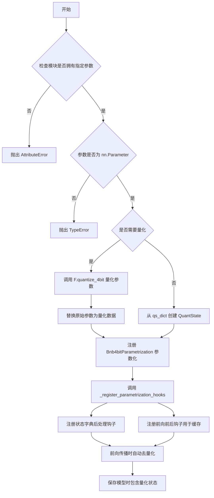
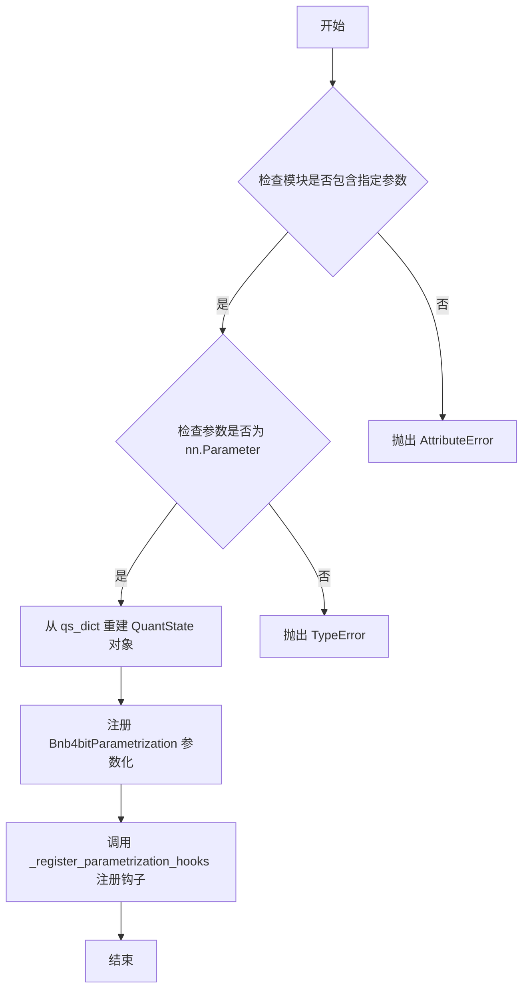
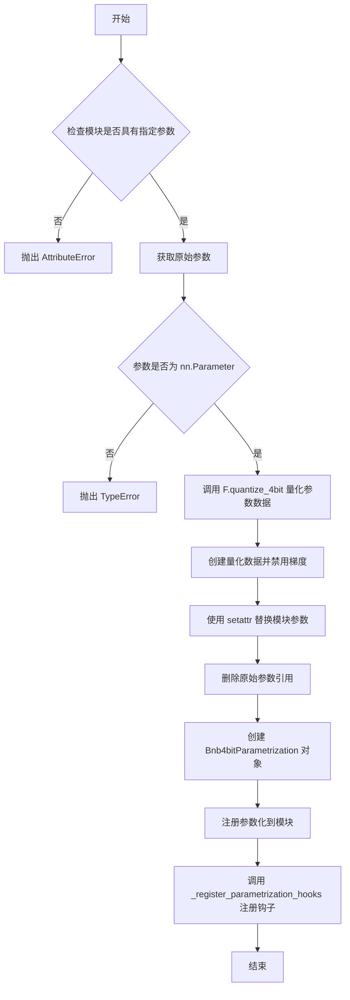
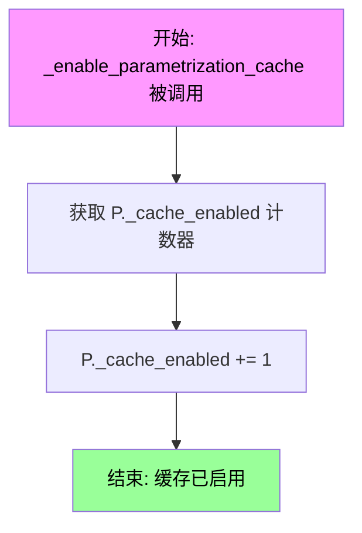
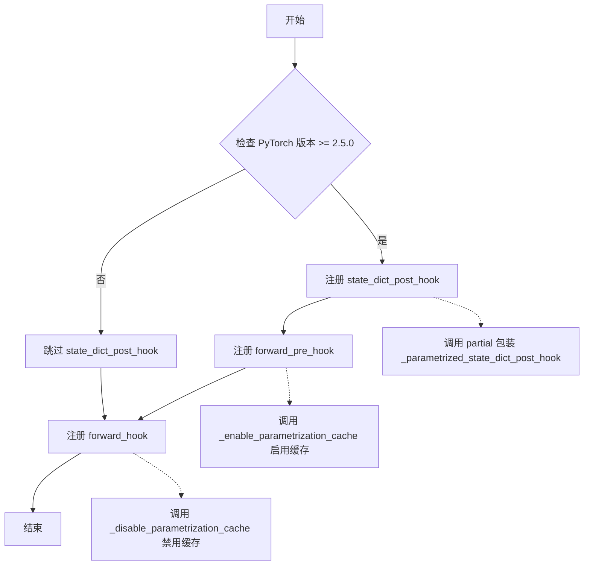
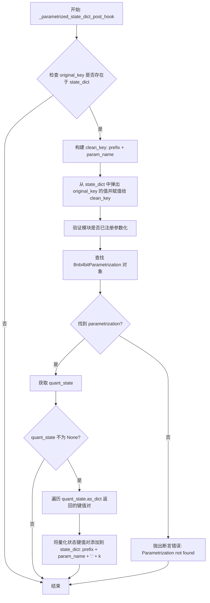
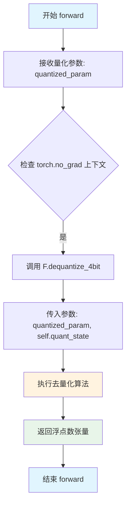

# `bitsandbytes\bitsandbytes\nn\parametrize.py` 详细设计文档

该代码实现了4位量化参数的替换和去量化功能，通过PyTorch的参数化机制（parametrization）在模型前向传播时自动将量化参数解压缩为原始浮点数表示，同时处理状态字典保存和缓存优化。

## 整体流程



## 类结构

```
nn.Module (PyTorch 基类)
└── Bnb4bitParametrization (4位量化参数化类)
```

## 全局变量及字段


### `F`
    
从上层模块导入的functional模块，提供量化与去量化函数

类型：`module`
    


### `Bnb4bitParametrization.quant_state`
    
存储量化状态信息，用于去量化操作

类型：`F.QuantState`
    
    

## 全局函数及方法


### `replace_parameter_4bit_prequantized`

将模块参数替换为4位量化版本的预处理函数，用于处理已量化但不包含量化状态参数的情况。该函数通过注册参数化（parametrization）机制来实现访问时的自动解量化。

参数：

- `module`：`nn.Module`，包含待处理参数的 PyTorch 模块
- `param_name`：`str`，模块中待处理参数的名称
- `qs_dict`：`dict[str, Any]`，包含量化状态信息的字典，用于重建量化状态
- `device`：`torch.device`，量化状态对象所在的目标设备

返回值：`None`，该函数直接修改传入的模块，不返回任何值

#### 流程图



#### 带注释源码

```
def replace_parameter_4bit_prequantized(
    module: nn.Module, param_name: str, qs_dict: dict[str, Any], device: torch.device
):
    """
    将模块参数替换为4位量化版本的预处理版本。
    
    此函数用于处理已经过量化但需要手动注入量化状态的参数。
    它不会对参数进行量化操作，而是基于提供的量化状态字典来注册参数化机制，
    使得在参数被访问时能够自动执行解量化操作。
    
    Args:
        module: 包含待处理参数的 PyTorch 模块
        param_name: 模块中参数的名称
        qs_dict: 包含量化状态的字典，通过 QuantState.as_dict() 生成
        device: 量化状态对象应放置的设备
    
    Raises:
        AttributeError: 当模块不包含指定参数时抛出
        TypeError: 当指定属性不是 nn.Parameter 实例时抛出
    """
    # 第一步：验证模块是否包含指定的参数
    if not hasattr(module, param_name):
        raise AttributeError(f"Module does not have parameter '{param_name}'")

    # 获取原始参数对象
    original_param = getattr(module, param_name)

    # 第二步：验证参数是否为 Parameter 类型
    if not isinstance(original_param, nn.Parameter):
        raise TypeError(f"Parameter '{param_name}' is not an instance of nn.Parameter")

    # 第三步：从字典重建量化状态对象
    # 这里假设 qs_dict 已经包含了量化所需的全部信息（如量化格式、块大小、统计信息等）
    quant_state = F.QuantState.from_dict(qs_dict, device=device)

    # 第四步：注册参数化处理模块
    # 使用 PyTorch 的 parametrize 机制注册自定义的参数化类 Bnb4bitParametrization
    # 该参数化类会在参数被访问时自动执行解量化操作
    # unsafe=True 允许覆盖已有的参数化
    P.register_parametrization(module, param_name, Bnb4bitParametrization(quant_state), unsafe=True)

    # 第五步：注册钩子函数
    # 用于处理状态字典的保存和缓存优化
    _register_parametrization_hooks(module, param_name)
```


### `replace_parameter_4bit`

该函数用于将 PyTorch 模块中的参数替换为 4 位量化版本，通过注册参数化（parametrization）机制实现自动解量化。支持 NF4 和 FP4 两种量化格式，适用于 MoE 模型或其他需要量化参数的场景，同时确保量化状态能正确保存到模型状态字典中。

参数：

- `module`：`nn.Module`，包含要量化参数的 PyTorch 模块
- `param_name`：`str`，模块中要量化的参数名称
- `compress_statistics`：`bool`，可选，默认为 `False`，是否压缩量化统计信息以减少内存占用
- `quant_type`：`Literal["nf4", "fp4"]`，可选，默认为 `"nf4"`，量化格式类型
- `blocksize`：`Optional[int]`，可选，默认为 `None`，量化块大小，为 None 时使用默认值

返回值：`None`，该函数无返回值，直接修改传入的模块

#### 流程图



#### 带注释源码

```python
def replace_parameter_4bit(
    module: nn.Module,
    param_name: str,
    compress_statistics: bool = False,
    quant_type: Literal["nf4", "fp4"] = "nf4",
    blocksize: Optional[int] = None,
):
    """
    Replace a module parameter with a 4-bit quantized version using parametrization.

    This function quantizes an existing parameter in a PyTorch module to 4-bit precision
    and sets up parametrization to handle automatic dequantization during forward passes.
    The original parameter is replaced with quantized data, and a parametrization layer
    is registered to manage the quantization state and dequantization process.

    Additional, it registers a state dict post-hook to ensure that the quantization state
    is saved correctly when the model's state dict is saved.

    It is useful for MoE models or other scenarios where you want to quantize parameters
    outside of nn.Linear layers without changing the model's architecture.

    <Tip warning={true}>This feature is experimental and may change in future releases.</Tip>

    Args:
        module (`nn.Module`):
            The PyTorch module containing the parameter to be quantized.
        param_name (`str`):
            The name of the parameter within the module to quantize.
        compress_statistics (`bool`, *optional*, defaults to `False`):
            Whether to compress quantization statistics to reduce memory usage.
        quant_type (`Literal["nf4", "fp4"]`, *optional*, defaults to `"nf4"`):
            The quantization format to use.
        blocksize (`int`, *optional*, defaults to `None`):
            The block size for quantization. If None, uses the default block size.

    Raises:
        AttributeError: If the module does not have the specified parameter.
        TypeError: If the specified attribute is not an instance of nn.Parameter.
    """

    # 检查模块是否具有指定的参数，如果不存在则抛出 AttributeError
    if not hasattr(module, param_name):
        raise AttributeError(f"Module does not have parameter '{param_name}'")

    # 获取模块中的原始参数对象
    original_param = getattr(module, param_name)

    # 验证参数是否为 nn.Parameter 类型
    if not isinstance(original_param, nn.Parameter):
        raise TypeError(f"Parameter '{param_name}' is not an instance of nn.Parameter")

    # 使用 4 位量化函数对原始参数数据进行量化
    # 返回量化后的数据和量化状态信息
    quantized_data, quant_state = F.quantize_4bit(
        original_param.data,
        blocksize=blocksize,
        compress_statistics=compress_statistics,
        quant_type=quant_type,
    )

    # 用量化数据替换原始参数
    # requires_grad=False 表示量化后的参数不需要梯度
    setattr(module, param_name, nn.Parameter(quantized_data, requires_grad=False))
    
    # 删除原始参数的引用，释放内存
    del original_param

    # 创建 4 位量化参数化对象，包含量化状态信息
    # 注册参数化到模块，用于在前向传播时自动解量化
    P.register_parametrization(module, param_name, Bnb4bitParametrization(quant_state), unsafe=True)

    # 注册钩子函数，用于处理状态字典保存和缓存管理
    _register_parametrization_hooks(module, param_name)
```


### `_disable_parametrization_cache`

这是一个PyTorch模块的forward hook函数，用于在模块的前向传播完成后禁用参数化缓存。它通过减少缓存计数器来关闭缓存功能，并在计数器归零时清空缓存字典，以释放内存。

参数：

- `module`：`nn.Module`，执行前向传播的模块实例
- `inputs`：`tuple[Any, ...]`，模块forward方法的输入参数元组（PyTorch forward hook约定参数）
- `output`：`Any`，模块forward方法的输出结果（PyTorch forward hook约定参数）

返回值：`None`，该函数没有返回值，仅执行副作用操作

#### 流程图

```mermaid
flowchart TD
    A[函数被调用<br/>作为forward hook] --> B[减少缓存计数器<br/>P._cache_enabled -= 1]
    B --> C{检查计数器<br/>P._cache_enabled == 0?}
    C -->|是| D[清空缓存字典<br/>P._cache = {}]
    C -->|否| E[什么都不做]
    D --> F[结束]
    E --> F
```

#### 带注释源码

```python
def _disable_parametrization_cache(module: nn.Module, inputs: tuple[Any, ...], output: Any):
    """
    PyTorch forward hook: 在模块前向传播完成后禁用参数化缓存。
    
    该hook与 _enable_parametrization_cache 配合使用，用于管理4-bit量化参数的
    解量化缓存。启用缓存可以提高同一量化参数在多次访问时的性能，但在不需要
    缓存时需要禁用它以释放内存。
    
    参数:
        module (nn.Module): 已经被注册该hook的PyTorch模块
        inputs (tuple[Any, ...]): 模块forward方法的输入元组
        output (Any): 模块forward方法的输出结果
        
    注意:
        此函数被注册为 forward_hook (后向hook)，在 forward() 方法执行完成后调用。
    """
    # 减少缓存启用计数
    # 每当一个模块完成前向传播时，计数减1
    P._cache_enabled -= 1
    
    # 检查缓存是否应该被完全禁用
    # 如果计数为0，说明所有启用的模块都已经完成前向传播
    # 此时应该清空缓存字典以释放内存
    if not P._cache_enabled:
        # 清空缓存字典
        # 重置为空字典，释放之前缓存的解量化结果
        P._cache = {}
```


### `_enable_parametrization_cache`

启用参数化缓存的全局函数，通过增加 `torch.nn.utils.parametrize._cache_enabled` 计数器来启用缓存机制。该函数作为前向预钩子（forward pre-hook）注册到模块上，在模块前向传播之前被调用，以确保量化参数的反量化结果被缓存，从而在后续访问时节省计算资源。

参数：

- `module`：`nn.Module`，执行前向传播的 PyTorch 模块，用于接收此 hook
- `inputs`：`tuple[Any, ...]`，模块 `forward` 方法的输入参数元组（由 PyTorch hook 机制自动传入）

返回值：`None`，无返回值，仅修改全局状态

#### 流程图



#### 带注释源码

```
def _enable_parametrization_cache(module: nn.Module, inputs: tuple[Any, ...]):
    """
    启用参数化缓存的 forward pre-hook。
    
    该函数作为 pre-hook 注册到模块上，在模块的 forward 方法执行之前调用。
    每次调用都会增加 P._cache_enabled 计数器的值，用于追踪当前前向传播中
    缓存是否应该被启用。当 _disable_parametrization_cache 在 forward 结束后
    被调用时，计数器会相应减少。
    
    这种配对机制确保了缓存仅在单个前向传播期间启用，避免跨批次的状态污染。
    
    Args:
        module (nn.Module): 正在执行前向传播的 PyTorch 模块
        inputs (tuple[Any, ...]): 模块 forward 方法的输入参数元组
    
    Returns:
        None: 此函数不返回值，仅修改全局状态
    """
    P._cache_enabled += 1  # 增加缓存启用计数，启用当前前向传播的反量化缓存
```


### `_register_parametrization_hooks`

该函数用于为模块注册多个钩子，以支持 4-bit 量化参数的状态字典保存和前向传播时的缓存优化。

参数：

- `module`：`nn.Module`，需要注册钩子的 PyTorch 模块
- `param_name`：`str`，要注册的参数名称，用于标识量化参数

返回值：`None`，该函数无返回值，仅执行副作用（注册钩子）

#### 流程图



#### 带注释源码

```python
def _register_parametrization_hooks(module: nn.Module, param_name: str):
    """
    为模块注册多个钩子，用于处理量化参数的状态字典保存和前向缓存优化。
    
    Args:
        module (nn.Module): 要注册钩子的 PyTorch 模块
        param_name (str): 参数名称，用于标识要处理的量化参数
    
    Returns:
        None: 该函数无返回值，仅执行副作用（注册钩子）
    """
    
    # 注册一个 state dict post-hook 用于保存量化状态
    # 注意：这需要 torch >= 2.5.0 版本
    if torch.__version__ >= (2, 5):
        # 使用 partial 预填充 param_name 参数
        module.register_state_dict_post_hook(
            partial(
                _parametrized_state_dict_post_hook,
                param_name=param_name,
            )
        )

    # 注册前向钩子以启用/禁用参数化缓存
    # 这有助于在多次访问同一量化参数时保持时间和内存效率
    # 在前向传播开始前启用缓存
    module.register_forward_pre_hook(_enable_parametrization_cache)
    
    # 在前向传播结束后禁用缓存
    module.register_forward_hook(_disable_parametrization_cache)
```


### `_parametrized_state_dict_post_hook`

该函数是一个状态字典后处理钩子（post-hook），用于在保存模型 state_dict 时将量化参数和量化状态正确序列化。它将量化后的数据从 `parametrizations.{param_name}.original` 键移动到 `{param_name}` 键，并把量化状态信息作为子键添加到 state_dict 中，确保模型加载时能够正确恢复量化参数。

参数：

- `module`：`nn.Module`，执行 state_dict 的 PyTorch 模块
- `state_dict`：`dict[str, Any]`，模块的参数字典，会被该钩子修改
- `prefix`：`str`，参数名称的前缀，通常用于嵌套模块
- `local_metadata`：`Any`，本地元数据信息
- `param_name`：`str`，被参数化的参数名称，默认为 `"weight"`
- `**kwargs`：`dict[str, Any]`，接收额外的关键字参数（可选）

返回值：`None`，该函数直接修改 `state_dict` 字典，无返回值

#### 流程图



#### 带注释源码

```python
def _parametrized_state_dict_post_hook(
    module: nn.Module,
    state_dict: dict[str, Any],
    prefix: str,
    local_metadata: Any,
    *,
    param_name: str = "weight",
    **kwargs: dict[str, Any],
) -> None:
    """
    Hook to modify the state dict to include the quantization state.
    """

    # 构建原始参数键名，格式为: "parametrizations.{param_name}.original"
    # 这是 PyTorch parametrization 注册后的内部存储键
    original_key = f"{prefix}parametrizations.{param_name}.original"

    # 检查原始键是否存在于 state_dict 中
    if original_key in state_dict:
        # 创建目标键名，将量化数据从 parametrizations 子结构中提升到顶层
        # 例如: "parametrizations.weight.original" -> "weight"
        clean_key = f"{prefix}{param_name}"
        # 使用 pop 取出原始数据并重新赋值到新键，同时从原位置删除
        state_dict[clean_key] = state_dict.pop(original_key)

        # 验证该模块确实对该参数注册了 parametrization
        assert P.is_parametrized(module, param_name)

        # 查找该参数对应的 Bnb4bitParametrization 对象
        # 通过 filter 过滤出 Bnb4bitParametrization 类型的参数化器
        parametrization: Bnb4bitParametrization = next(
            filter(lambda x: isinstance(x, Bnb4bitParametrization), module.parametrizations[param_name]), None
        )

        # 确保找到了参数化器，否则抛出断言错误
        assert parametrization is not None, "Parametrization not found for the parameter."

        # 从参数化器中获取量化状态对象
        quant_state = parametrization.quant_state

        # 如果量化状态存在，则将其序列化并添加到 state_dict
        if quant_state is not None:
            # 遍历量化状态的字典表示（packed=True 表示打包格式）
            for k, v in quant_state.as_dict(packed=True).items():
                # 键名格式: "{prefix}{param_name}.{量化状态键}"
                # 例如: "weight.quant_state" 或 "weight.absmax" 等
                state_dict[f"{prefix}{param_name}.{k}"] = v
```


### `Bnb4bitParametrization.__init__`

初始化 `Bnb4bitParametrization` 类实例。该方法是类的构造函数，接受一个量化状态对象作为输入，调用父类构造函数，并将量化状态保存为实例属性，以便在后续的 `forward` 方法中使用进行解量化处理。

参数：

-  `quant_state`：`F.QuantState`，量化状态对象

返回值：`None`，无返回值

#### 流程图

```mermaid
graph TD
    A([开始 __init__]) --> B{调用 super().__init__}
    B --> C[将 quant_state 赋值给 self.quant_state]
    C --> D([结束])
```

#### 带注释源码

```python
def __init__(self, quant_state: F.QuantState):
    """
    初始化参数化模块，保存量化状态。

    Args:
        quant_state: 量化状态对象
    """
    # 调用 nn.Module 的基类构造函数，初始化模块结构
    super().__init__()
    
    # 将传入的量化状态对象保存为当前模块的实例变量
    # 该状态将在前向传播时被用于解量化参数
    self.quant_state = quant_state
```


### `Bnb4bitParametrization.forward`

该方法实现了4位量化参数的去量化操作。当模块的前向传播被调用时（即访问参数时），该方法会将已经量化存储的参数张量通过 `F.dequantize_4bit` 函数恢复为原始的浮点数表示形式。

参数：

- `quantized_param`：`torch.Tensor`，量化后的参数张量（来自.original）

返回值：`torch.Tensor`，去量化后的参数张量，具有原始形状和数据类型

#### 流程图



#### 带注释源码

```python
@torch.no_grad()
def forward(self, quantized_param: torch.Tensor) -> torch.Tensor:
    """
    Forward pass to dequantize the parameter.
    
    此方法在参数被访问时自动调用，负责将存储的4位量化数据
    转换回原始的浮点数表示。使用了torch.no_grad()装饰器
    确保不记录梯度计算图，减少内存开销。
    
    Args:
        quantized_param (`torch.Tensor`): 
            The quantized parameter tensor (from .original)
            从参数化层获取的量化张量，包含4位压缩数据
        
    Returns:
        `torch.Tensor`: 
            The dequantized parameter tensor in the original shape and dtype.
            恢复后的全精度浮点数张量，保持原始shape和dtype
    
    Example:
        >>> # 假设 model 是一个含有量化参数的模块
        >>> weight = model.weight  # 访问参数时会自动调用 forward
        >>> print(weight.dtype)  # torch.float32
    """
    # 调用 functional 模块中的去量化函数
    # quantized_param: 存储的量化数据（4位压缩）
    # self.quant_state: 量化状态，包含量化参数（scale, zero_point等）
    return F.dequantize_4bit(quantized_param, self.quant_state)
```

#### 补充说明

1. **设计目的**：该方法是 `Bnb4bitParametrization` 类的核心，负责在运行时动态地将压缩的4位参数还原为全精度参数，使模型在保持低内存占用的同时能够正常执行前向计算。

2. **与量化状态的关系**：去量化过程依赖于 `self.quant_state` 中存储的量化元数据（如缩放因子、零点、量化类型等），这些信息在参数注册时由 `replace_parameter_4bit` 或 `replace_parameter_4bit_prequantized` 函数创建。

3. **性能优化**：使用 `@torch.no_grad()` 装饰器可避免构建梯度计算图，显著降低内存占用和计算开销，因为去量化结果仅用于前向传播，不需要反向传播。

## 关键组件


### Bnb4bitParametrization

一个PyTorch参数化模块，用于在访问参数时自动将4-bit量化数据反量化回原始浮点表示，通过在前向传播时调用dequantize_4bit实现惰性加载。

### replace_parameter_4bit

将模块中的现有参数转换为4-bit量化版本的函数，封装了量化流程、参数替换和参数化注册，支持NF4和FP4量化格式，并自动处理状态字典保存。

### replace_parameter_4bit_prequantized

用于替换已预先量化参数的函数，将现有的量化数据通过参数化机制暴露为可访问的浮点参数，适用于已量化权重的加载场景。

### _register_parametrization_hooks

注册PyTorch模块钩子的内部函数，负责状态字典后处理钩子（保存量化状态）和前向传播钩子（管理反量化缓存）以优化重复访问性能。

### _parametrized_state_dict_post_hook

状态字典后处理钩子函数，在模型保存时将量化参数和量化状态正确序列化到state_dict中，确保量化信息能够随模型一起保存和加载。

### QuantState (F.QuantState)

量化状态容器类，存储4-bit量化所需的元信息（如量化类型、分块大小、统计信息等），提供序列化和反序列化方法支持模型持久化。

### 4-bit 量化/反量化 (F.quantize_4bit / F.dequantize_4bit)

来自functional模块的核心函数，分别负责将浮点张量转换为4-bit量化表示和在访问时将量化数据还原为原始精度。

### 参数化缓存机制

通过register_forward_pre_hook和register_forward_hook配对使用的缓存控制机制，在前向传播前启用缓存、反向传播后清空缓存，以优化重复参数访问的效率。


## 问题及建议


### 已知问题

- **类型注解不完整**：函数 `replace_parameter_4bit_prequantized` 的 `device` 参数缺少类型注解；`_parametrized_state_dict_post_hook` 中 `**kwargs` 的类型注解 `dict[str, Any]` 是错误的，应为 `Any`
- **代码重复**：`replace_parameter_4bit` 和 `replace_parameter_4bit_prequantized` 中存在重复的参数存在性检查和类型检查逻辑
- **硬编码版本检查**：使用 `torch.__version__ >= (2, 5)` 进行版本检查，缺乏版本兼容性的灵活处理
- **内存管理不完善**：`del original_param` 后未考虑显式内存释放，在GPU上运行时应考虑调用 `torch.cuda.empty_cache()`
- **缓存机制线程不安全**：直接操作 `P._cache_enabled` 和 `P._cache` 模块级变量，可能在多线程环境下产生竞态条件
- **使用不安全的API**：`register_parametrization` 使用了 `unsafe=True`，跳过了安全检查，可能导致隐藏的bug
- **错误处理不全面**：未验证 `quant_state` 的有效性；`_register_parametrization_hooks` 中未检查 `param_name` 是否已存在parametrization

### 优化建议

- 抽取公共的参数验证逻辑到独立函数以减少代码重复
- 添加版本检查的工具函数或条件逻辑处理不同版本的兼容性问题
- 在删除大尺寸张量后考虑调用适当的内存清理机制
- 为缓存操作添加锁或使用线程安全的数据结构
- 移除 `unsafe=True` 并添加必要的参数验证，或在文档中明确说明使用该参数的前提条件
- 补充对 `quant_state` 有效性的检查和更详细的错误信息

## 其它


### 设计目标与约束

本模块的设计目标是在不改变模型架构的前提下，将PyTorch模型中的参数进行4位量化（支持NF4和FP4格式），以显著减少显存占用和加速推理。核心约束包括：仅支持4位量化格式；要求PyTorch版本 >= 2.5.0（用于state_dict钩子）；参数必须是`nn.Parameter`类型；量化后的参数梯度被禁用（`requires_grad=False`）。

### 错误处理与异常设计

模块包含以下错误处理机制：`AttributeError`在模块不存在指定参数时抛出；`TypeError`在参数不是`nn.Parameter`实例时抛出。异常设计遵循快速失败原则，在函数入口处进行参数验证，确保错误在使用前被发现。量化状态（QuantState）为None时不保存到state_dict。

### 数据流与状态机

数据流分为量化流程和解量化流程。**量化流程**：原始参数 → `F.quantize_4bit()` → 量化数据+量化状态 → 替换原参数为量化数据 → 注册`Bnb4bitParametrization` → 注册前向钩子控制缓存。**解量化流程**：访问参数时 → 触发`Bnb4bitParametrization.forward()` → 调用`F.dequantize_4bit()` → 返回浮点张量。状态机涉及缓存启用/禁用状态，通过`P._cache_enabled`计数器管理。

### 外部依赖与接口契约

主要依赖包括：`torch`（>= 2.5.0）、`torch.nn`、`torch.nn.utils.parametrize`、`..functional as F`（需提供`quantize_4bit`、`dequantize_4bit`、`QuantState`）。接口契约方面：`F.quantize_4bit`返回(量化数据, QuantState)；`F.dequantize_4bit`接受(量化张量, QuantState)返回浮点张量；`QuantState`需提供`from_dict()`和`as_dict(packed=True)`方法。

### 模块集成与扩展性

模块通过`torch.nn.utils.parametrize.register_parametrization`与PyTorch原生参数化系统集成，支持任意`nn.Module`的参数替换。扩展性方面，可通过修改`Bnb4bitParametrization.forward()`实现不同的解量化逻辑；可通过添加新的量化格式支持扩展`quant_type`参数；缓存机制可针对特定场景进行调优。

### 性能考虑与优化

模块实现了缓存优化机制：在前向传播前启用缓存（`P._cache_enabled += 1`），传播后禁用并清空缓存（`P._cache_enabled -= 1`），避免重复解量化计算。`compress_statistics`选项可压缩量化统计信息以减少内存。参数化机制利用PyTorch原生优化，避免手动管理张量生命周期。

### 版本兼容性

最低PyTorch版本要求为2.5.0，因为使用了`register_state_dict_post_hook`方法。低于2.5.0的版本无法正确保存量化状态到checkpoints。NF4和FP4量化格式的支持取决于底层`F.quantize_4bit`的实现。

### 已知限制与注意事项

量化后的参数`requires_grad`被强制设为`False`，不支持训练时量化参数的梯度反向传播。仅支持4位量化，不适用于其他位宽。参数化机制会修改原始模块的`parametrizations`属性，可能与其它参数化功能冲突。状态字典保存时，量化状态会以键值对形式存储（`{param_name}.{state_key}`），加载时需确保量化状态完整恢复。

### 使用示例与典型场景

典型使用场景包括：大规模语言模型的显存压缩（尤其是MoE模型）、推理优化、模型部署前的参数压缩。使用示例：`replace_parameter_4bit(module, "weight", quant_type="nf4")`将指定参数量化；`replace_parameter_4bit_prequantized(module, "weight", qs_dict, device)`用于加载已量化参数。
    