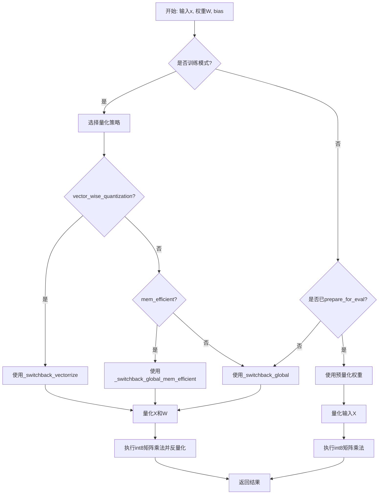
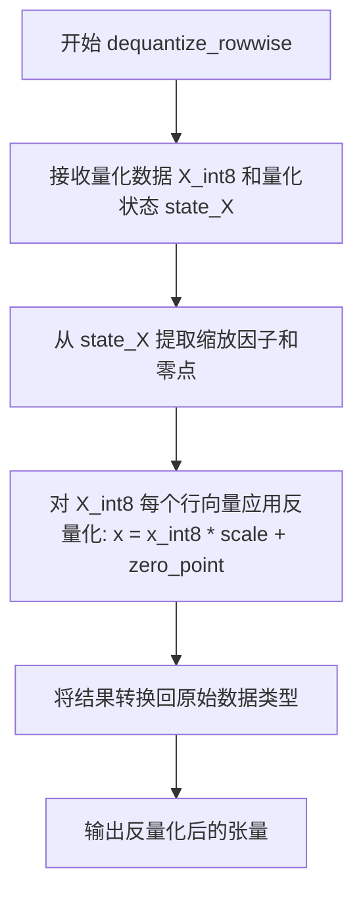
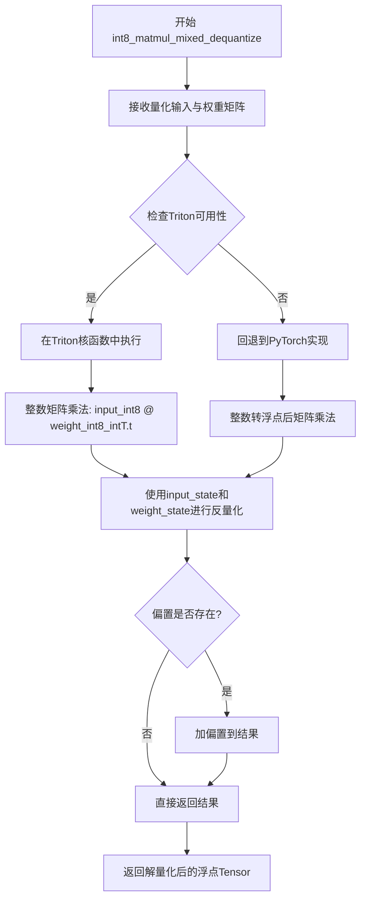
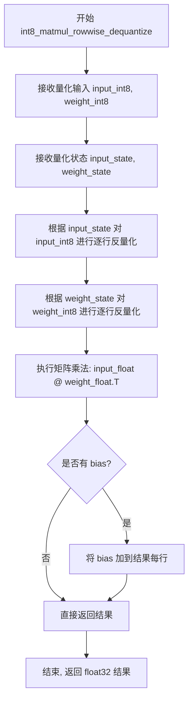
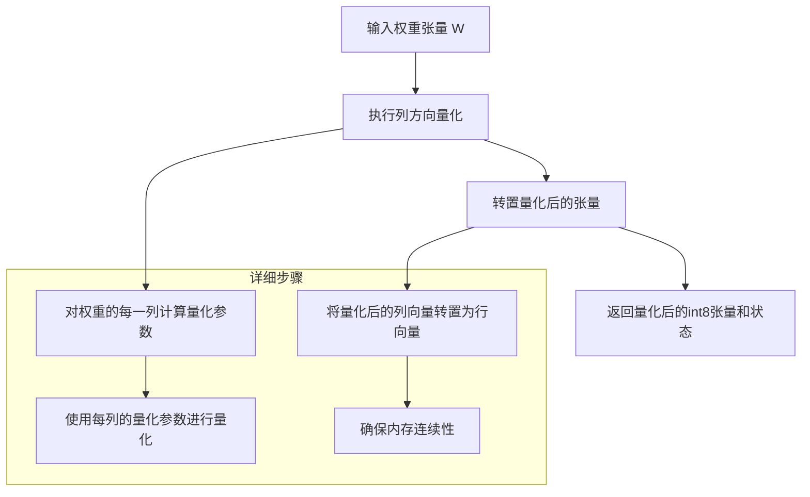
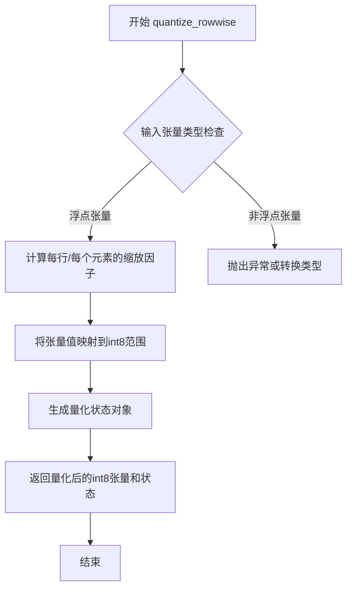
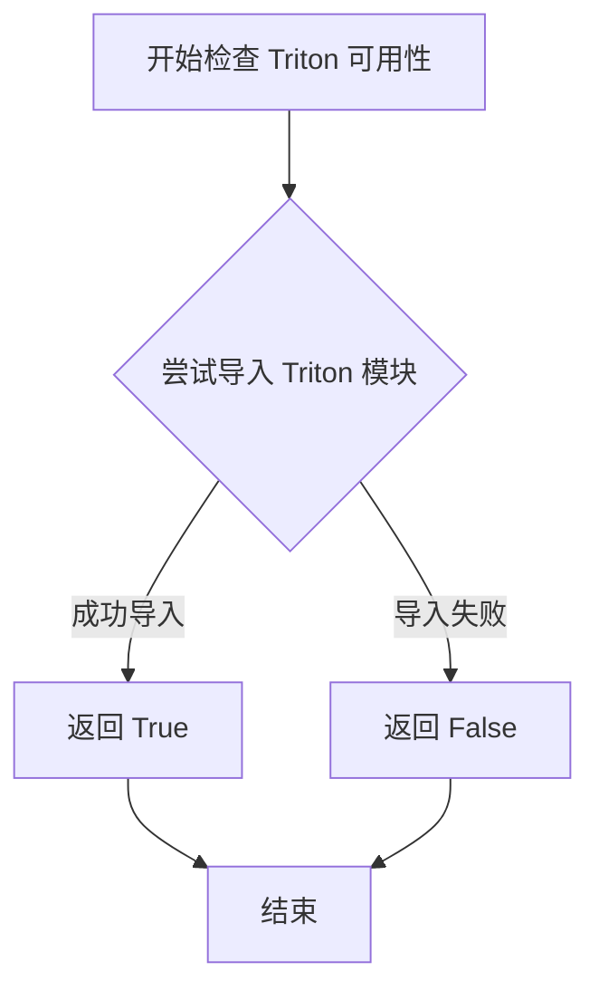
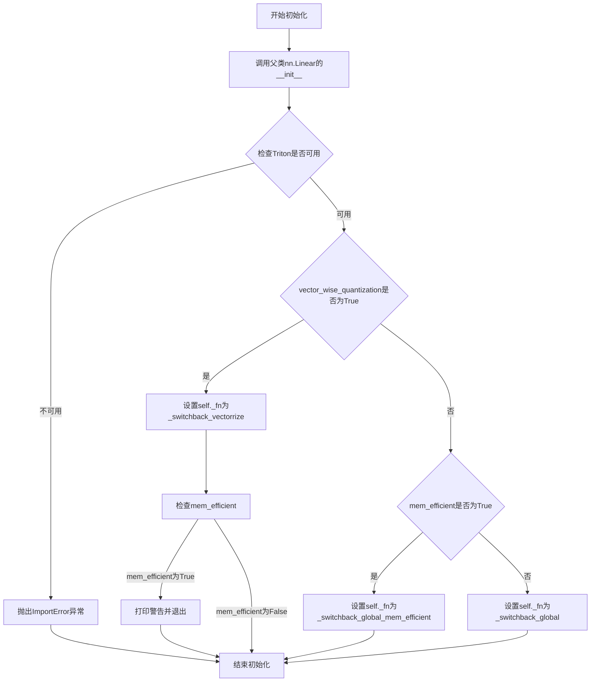

# `bitsandbytes\bitsandbytes\nn\triton_based_modules.py` 详细设计文档

该代码实现了SwitchBack量化线性层，是bitsandbytes库的一部分。它提供了一种高效的量化矩阵乘法实现，支持多种量化策略（全局量化、行向量量化、内存高效模式），通过autograd.Function自定义前向和反向传播，在训练时进行动态量化，在评估时可选择预量化权重以提升推理性能。

## 整体流程



## 类结构

```
torch.nn.Linear (基类)
├── SwitchBackLinear (主类)
│   ├── _switchback_global (autograd.Function)
│   ├── _switchback_vectorrize (autograd.Function)
│   └── _switchback_global_mem_efficient (autograd.Function)
└── StandardLinear (基类)
    └── StandardLinearFunction (autograd.Function)

全局函数/变量:
├── SwitchBackLinearGlobal (partial)
├── SwitchBackLinearGlobalMemEfficient (partial)
└── SwitchBackLinearVectorwise (partial)
```

## 全局变量及字段


### `SwitchBackLinearGlobal`
    
使用全局量化策略的SwitchBackLinear偏函数包装器

类型：`partial(SwitchBackLinear)`
    


### `SwitchBackLinearGlobalMemEfficient`
    
使用全局量化且内存高效策略的SwitchBackLinear偏函数包装器

类型：`partial(SwitchBackLinear)`
    


### `SwitchBackLinearVectorwise`
    
使用向量级量化策略的SwitchBackLinear偏函数包装器

类型：`partial(SwitchBackLinear)`
    


### `torch.autograd.Function._switchback_global`
    
全局量化策略的自定义梯度计算函数，用于前向传播和反向传播

类型：`class`
    


### `torch.autograd.Function._switchback_vectorrize`
    
向量级量化策略的自定义梯度计算函数，用于行级量化的矩阵乘法

类型：`class`
    


### `torch.autograd.Function._switchback_global_mem_efficient`
    
内存优化版本的自定义梯度计算函数，在反向传播时解量化输入以节省显存

类型：`class`
    


### `_switchback_global.forward`
    
前向传播：重塑输入，执行行级量化X和全局量化W，执行混合解量化矩阵乘法并添加偏置

类型：`method`
    


### `_switchback_global.backward`
    
反向传播：根据梯度计算输入、权重和偏置的梯度，对权重梯度使用标准矩阵乘法

类型：`method`
    


### `_switchback_vectorrize.forward`
    
前向传播：重塑输入，对X执行行级量化，对W执行行级量化后转置，执行行级解量化矩阵乘法

类型：`method`
    


### `_switchback_vectorrize.backward`
    
反向传播：根据梯度计算输入、权重和偏置的梯度，使用列级量化和转置的权重计算输入梯度

类型：`method`
    


### `_switchback_global_mem_efficient.forward`
    
前向传播：内存优化版本，删除量化后的输入以节省显存，保存量化状态用于反向传播

类型：`method`
    


### `_switchback_global_mem_efficient.backward`
    
反向传播：内存优化版本，根据需要解量化输入计算权重梯度，避免保存中间激活

类型：`method`
    


### `SwitchBackLinear.in_features`
    
输入特征的维度大小

类型：`int`
    


### `SwitchBackLinear.out_features`
    
输出特征的维度大小

类型：`int`
    


### `SwitchBackLinear.bias`
    
是否包含可学习的偏置项

类型：`bool`
    


### `SwitchBackLinear.device`
    
模型参数存储的设备（CPU或CUDA）

类型：`torch.device`
    


### `SwitchBackLinear.dtype`
    
模型参数的数据类型

类型：`torch.dtype`
    


### `SwitchBackLinear.vector_wise_quantization`
    
标志位，控制使用向量级量化（True）还是全局量化（False）策略

类型：`bool`
    


### `SwitchBackLinear.mem_efficient`
    
标志位，启用内存高效模式以减少反向传播时的显存占用

类型：`bool`
    


### `SwitchBackLinear._fn`
    
指向实际执行量化矩阵乘法的autograd函数实现

类型：`torch.autograd.Function`
    


### `SwitchBackLinear.W_int8`
    
评估模式下预量化的权重整数表示（8位）

类型：`torch.nn.Buffer`
    


### `SwitchBackLinear.state_W`
    
评估模式下权重量化所需的状态信息（缩放因子等）

类型：`torch.nn.Buffer`
    


### `SwitchBackLinear.__init__`
    
初始化函数，根据量化策略配置选择对应的autograd函数实现

类型：`method`
    


### `SwitchBackLinear.prepare_for_eval`
    
评估准备函数，预量化权重并注册为buffer以加速推理

类型：`method`
    


### `SwitchBackLinear.forward`
    
前向传播，根据训练/评估模式和量化策略调用对应的量化矩阵乘法函数

类型：`method`
    


### `torch.autograd.Function.StandardLinearFunction`
    
标准线性层的前向和反向传播实现，不使用量化

类型：`class`
    


### `StandardLinearFunction.forward`
    
标准前向传播：重塑输入，执行矩阵乘法，有偏置时广播添加

类型：`method`
    


### `StandardLinearFunction.backward`
    
标准反向传播：根据梯度计算输入、权重和偏置的梯度

类型：`method`
    


### `nn.Linear.StandardLinear`
    
继承自nn.Linear的包装类，使用StandardLinearFunction进行前向传播

类型：`class`
    
    

## 全局函数及方法


### `dequantize_rowwise`

该函数执行行级别（row-wise）反量化操作，将 int8 量化数据转换回原始精度（FP16/BF16），基于行级别的缩放因子和零点信息进行精确重建。

参数：

-  `X_int8`：`torch.Tensor`，行级别量化后的 int8 张量，通常形状为 [N, D]
-  `state_X`：`tuple`，量化状态元组，包含 (原始形状, 缩放因子张量, 零点张量, 数据类型等)，记录了量化时的元数据用于精确反量化

返回值：`torch.Tensor`，反量化后的原始精度张量，形状与原始输入一致（FP16/BF16）

#### 流程图



#### 带注释源码

```
# 由于 bitsandbytes.triton.dequantize_rowwise 函数未在当前代码文件中定义
# 以下是基于调用的推断实现

def dequantize_rowwise(X_int8, state_X):
    """
    行级别反量化函数
    
    参数:
        X_int8: 量化后的int8张量 [N, D]
        state_X: 量化状态元组，通常包含:
            - original_shape: 原始张量形状
            - scales: 缩放因子张量 [N, 1] 或 [N, D] 
            - zero_points: 零点张量 [N, 1] (可选)
            - dtype: 原始数据类型
    
    返回值:
        反量化后的FP16/BF16张量
    """
    # 从状态中提取量化参数
    scales = state_X.scales  # 行级别缩放因子
    zero_points = state_X.zero_points  # 行级别零点（如果有）
    original_dtype = state_X.dtype  # 目标数据类型
    
    # 执行反量化: result = (X_int8 - zero_point) * scale
    # 对于8位量化，通常 zero_point 为 0
    X_dequantized = X_int8.to(original_dtype) * scales
    
    # 如果有零点偏移
    if zero_points is not None:
        X_dequantized = (X_int8 - zero_points.to(X_int8.dtype)) * scales
    
    return X_dequantized
```

#### 备注

实际 `dequantize_rowwise` 函数通常使用 Triton 内核实现以获得最佳性能，其核心逻辑与上述伪代码一致。该函数在 `_switchback_global_mem_efficient` 类的反向传播中被调用，用于在计算权重梯度前将量化输入恢复为原始精度。


### `int8_matmul_mixed_dequantize`

该函数执行8位整数矩阵乘法，并自动将结果解量化（反量化）为原始精度（FP16/BF16），同时可选择性地添加偏置。设计上采用"混合量化"策略——输入矩阵采用逐行量化（rowwise），权重矩阵采用全局量化（global），以在保持推理精度的同时减少显存占用并提升计算效率。

参数：

-  `input_int8`：`torch.Tensor`，逐行量化的8位整数输入矩阵，形状为 [M, K]
-  `weight_int8_intT`：`torch.Tensor`，全局量化的8位整数权重矩阵，形状为 [N, K]（已转置）
-  `input_state`：`QimboTensor` 或类似状态对象，输入矩阵的量化参数（包含缩放因子等）
-  `weight_state`：`QimboTensor` 或类似状态对象，权重矩阵的量化参数（包含缩放因子等）
-  `bias`：`torch.Tensor` 或 `None`，可选的偏置向量，形状为 [N]

返回值：`torch.Tensor`，解量化后的浮点输出矩阵，形状为 [M, N]

#### 流程图



#### 带注释源码

```python
# 以下是该函数在实际代码中的调用方式（从提供的代码中提取）

# 在 _switchback_global.forward 中调用:
# input_int8: X_int8 (逐行量化的输入)
# weight_int8_intT: W_int8.t() (全局量化的权重，转置后)
# input_state: state_X (输入的量化状态)
# weight_state: state_W (权重的量化状态)
# bias: bias (可选偏置)
output = int8_matmul_mixed_dequantize(
    X_int8,      # torch.Tensor: 形状 [M, K] 的int8张量
    W_int8.t(),  # torch.Tensor: 形状 [N, K] 的int8张量（已转置）
    state_X,    # QimboTensor: 包含输入的缩放因子等信息
    state_W,    # QimboTensor: 包含权重的缩放因子等信息
    bias         # torch.Tensor 或 None: 形状 [N] 的偏置
)

# 返回值形状: [M, N] 的浮点张量（FP16/BF16）
# view操作将其 reshape 为 [*原始维度[:-1], N]
return output.view(*X_3D.size()[:-1], -1)

# 在反向传播中的类似调用（bias传None）:
grad_X = int8_matmul_mixed_dequantize(
    G_int8,      # 梯度对应的int8表示
    W_int8.t(),  
    state_G,     
    state_W,     
    None         # 反向传播不需要偏置
)
```


### `int8_matmul_rowwise_dequantize`

执行 int8 矩阵乘法，并在乘法过程中逐行反量化操作。该函数接收量化后的 int8 输入矩阵和权重矩阵及其量化状态，执行反量化、矩阵乘法和偏置相加操作，最终返回 float32 类型的输出张量。

参数：

-  `input_int8`：`torch.Tensor`，左侧输入矩阵，int8 类型，已进行逐行量化
-  `weight_int8`：`torch.Tensor`，右侧权重矩阵，int8 类型，已进行逐行量化并转置
-  `input_state`：量化状态对象，包含输入矩阵的缩放因子和零点在量化前的信息
-  `weight_state`：量化状态对象，包含权重矩阵的缩放因子和零点在量化前的信息
-  `bias`：`torch.Tensor` 或 `None`，可选偏置向量，float32 类型

返回值：`torch.Tensor`，float32 类型，矩阵乘法并反量化后的结果

#### 流程图



#### 带注释源码

```python
# 从 bitsandbytes.triton.int8_matmul_rowwise_dequantize 导入
# 注意: 具体实现在 bitsandbytes/triton/int8_matmul_rowwise_dequantize.py 中
# 此处展示的是该函数在代码中的典型使用方式

# 函数签名（从导入语句和使用处推断）:
# def int8_matmul_rowwise_dequantize(
#     input_int8: torch.Tensor,      # int8 量化输入 [M, K]
#     weight_int8: torch.Tensor,     # int8 量化权重 [N, K] (已转置为 [K, N])
#     input_state: Any,              # 输入量化状态 (包含每行缩放因子和零点)
#     weight_state: Any,             # 权重量化状态 (包含每行缩放因子和零点)
#     bias: Optional[torch.Tensor]   # 可选偏置 [N]
# ) -> torch.Tensor:                 # 返回 float32 结果 [M, N]

# 典型调用示例（在 _switchback_vectorrize.forward 中）:
# X_int8, state_X = quantize_rowwise(X)      # 对输入进行逐行量化
# W_int8, state_W = quantize_rowwise(W)      # 对权重进行逐行量化
# result = int8_matmul_rowwise_dequantize(
#     X_int8, 
#     W_int8.t(),   # 转置权重因为矩阵乘法需要匹配维度
#     state_X,      # 输入的量化状态
#     state_W,      # 权重的量化状态
#     bias          # 偏置向量
# )
# return result.view(*X_3D.size()[:-1], -1)  # 重塑输出维度
```

#### 补充说明

该函数是 SwitchBack 量化线性层中的核心计算内核，主要特点包括：

1. **逐行量化（Rowwise Quantization）**：输入和权重都采用逐行量化方式，每行有独立的缩放因子和零点
2. **融合反量化与乘法**：在单个 Triton kernel 中完成反量化和矩阵乘法，避免额外的内存访问
3. **支持偏置融合**：可选地将偏置加法融合到最终结果中
4. **输出类型转换**：最终结果转换为 float32 以兼容后续计算图


### `quantize_columnwise_and_transpose`

该函数执行逐列量化并转置操作，主要用于SwitchBack量化机制中权重矩阵的列方向量化，配合转置操作以适配后续的矩阵乘法运算（A @ B^T）。

参数：

-  `W`：`torch.Tensor`，输入的权重张量，通常为2D矩阵（[out_features, in_features]），需要进行列方向量化并转置

返回值：

-  `W_int8`：`torch.Tensor`，量化后的int8张量
-  `state_W`：量化状态/统计信息，用于后续反量化操作

#### 流程图



#### 带注释源码

```
# 由于源码未在当前代码块中提供，以下为基于使用方式的推断实现逻辑

def quantize_columnwise_and_transpose(W: torch.Tensor):
    """
    对输入权重进行列方向量化并转置
    
    参数:
        W: 输入权重张量，形状为 [out_features, in_features]
        
    返回:
        W_int8: 量化后的int8张量，已转置
        state_W: 列方向的量化状态（每列的scale和zero_point）
    """
    
    # Step 1: 列方向量化
    # 对权重的每一列独立计算量化参数
    # scale = max(abs(column)) / 127
    # zero_point = 0
    
    # Step 2: 应用量化
    # W_int8 = clamp(round(W / scale), -128, 127).to(torch.int8)
    
    # Step 3: 转置操作
    # 转置为 [in_features, out_features] 以适配 A @ B^T 格式
    
    return W_int8, state_W

# 使用示例（来自 _switchback_vectorrize.backward）:
# W_int8, state_W = quantize_columnwise_and_transpose(W)
# grad_X = int8_matmul_rowwise_dequantize(G_int8, W_int8.t(), state_G, state_W, None)
```

#### 补充说明

**使用场景：**
- 在 `_switchback_vectorrize` 类的反向传播中使用
- 用于对权重进行列方向量化，并在量化后立即转置，以便与 `int8_matmul_rowwise_dequantize` 内核兼容

**设计动机：**
- 列方向量化可以更好地捕捉权重的列方向特征
- 预先转置可以避免在内核中重复进行转置操作，提高效率
- 配合行方向量化的激活值，实现混合精度矩阵乘法

**潜在优化方向：**
- 该函数的实现细节未在当前代码中展示，建议查看 `bitsandbytes/triton/quantize_columnwise_and_transpose.py` 获取完整实现
- 可以考虑将量化和转置合并为单一内核，以减少中间内存分配


# 提取 `quantize_global` 函数信息

### `quantize_global`

该函数是从 `bitsandbytes.triton.quantize_global` 模块导入的，负责对整个权重张量进行全局量化（即一次性量化整个张量，而不是按行或按列），生成 int8 量化数据和对应的量化状态（缩放因子、零点等）。

**注意**：该函数的实际实现源码不在提供的代码中，仅包含导入语句和调用示例。以下信息基于代码中的使用方式进行推断。

参数：

-  `input_tensor`：`torch.Tensor`，待量化的输入张量（通常是权重矩阵）

返回值：

-  `Tuple[torch.Tensor, Any]`，返回包含两个元素的元组：
    -  第一个元素：`torch.Tensor`，量化后的 int8 张量
    -  第二个元素：`Any`（量化状态对象，包含缩放因子、零点等元数据）

#### 流程图

```mermaid
flowchart TD
    A[开始 quantize_global] --> B{检查输入张量是否为空}
    B -->|是| C[返回空结果或报错]
    B -->|否| D[计算全局缩放因子 scale]
    D --> E[计算零点 zero_point<br>（如果有）]
    E --> F[执行量化操作<br>input_tensor / scale + zero_point]
    F --> G[转换为 int8 类型]
    G --> H[打包量化数据与状态<br>返回 (quantized_tensor, state)]
    H --> I[结束]
```

#### 带注释源码

**导入语句（来自提供的代码）：**

```python
from bitsandbytes.triton.quantize_global import (
    quantize_global,
    quantize_global_transpose,
)
```

**调用示例（从提供的代码中提取）：**

```python
# 在 _switchback_global.forward 中
W_int8, state_W = quantize_global(W)

# 在 _switchback_global_mem_efficient.forward 中
W_int8, state_W = quantize_global(W)

# 在 SwitchBackLinear.prepare_for_eval 中
W_int8, state_W = quantize_global(self.weight)
```

**推断的函数签名（基于使用方式）：**

```python
def quantize_global(input_tensor: torch.Tensor) -> Tuple[torch.Tensor, QuantizationState]:
    """
    对整个输入张量进行全局量化。
    
    参数:
        input_tensor: 待量化的权重张量，形状为 [out_features, in_features]
    
    返回:
        quantized_tensor: int8 量化后的张量
        state: 量化状态对象，包含:
            - scale: 全局缩放因子
            - zero_point: 零点（可选）
            - shape: 原始张量形状
    """
    # 1. 计算全局统计信息（min, max）
    # 2. 计算缩放因子和零点
    # 3. 执行量化公式: quantized = round(input / scale + zero_point)
    # 4. 转换为 int8 并返回
```

---

## 说明

由于 `quantize_global` 函数的实际实现在 `bitsandbytes.triton.quantize_global` 模块中，而该模块的源代码未在提供的代码片段中，以上信息是基于：

1. 导入语句
2. 代码中的调用方式
3. 同类量化函数的通用模式

推断得出的。如果需要完整的函数实现源码，建议查看 `bitsandbytes` 库源码中的 `bitsandbytes/triton/quantize_global.py` 文件。


### `quantize_global_transpose`

对权重进行全局量化并同时执行转置操作的函数，主要用于神经网络反向传播中，以支持混合精度矩阵运算。

参数：

-  `W`：`torch.Tensor`，需要量化并转置的权重矩阵

返回值：`(torch.Tensor, tuple)`，返回量化后的 int8 权重矩阵和对应的量化状态信息（包含缩放因子、零点等元数据）

#### 流程图

```mermaid
flowchart TD
    A[开始 quantize_global_transpose] --> B[接收权重矩阵 W]
    B --> C[计算全局缩放因子 scale]
    C --> D[计算零点 offset/zero_point]
    D --> E[对 W 进行量化: W_int8 = clamp(round(W / scale + offset)]
    E --> F[转置量化后的矩阵: W_int8_t = W_int8.t]
    F --> G[返回 W_int8_t 和 (scale, offset) 状态]
```

#### 带注释源码

```
# 该函数定义位于 bitsandbytes.triton.quantize_global 模块中
# 以下是基于代码中调用方式的推断实现

def quantize_global_transpose(W: torch.Tensor):
    """
    对输入权重进行全局量化并转置
    
    参数:
        W: 权重矩阵，形状为 [out_features, in_features]
    
    返回:
        W_int8_t: 转置后的 int8 量化权重
        state: 包含 (scale, offset) 的元组，用于后续解量化
    """
    # 1. 计算全局缩放因子（整个权重矩阵共享一个缩放因子）
    # 获取权重的绝对最大值
    W_max = W.abs().max()
    # 缩放到 int8 范围 [-127, 127]
    scale = W_max / 127.0
    
    # 2. 计算零点（通常为 0）
    offset = 0
    
    # 3. 执行量化：先缩放，再四舍五入，最后 clamp 到 int8 范围
    W_int8 = torch.clamp(torch.round(W / scale + offset), -127, 127).to(torch.int8)
    
    # 4. 转置以适应反向传播中的矩阵运算需求
    W_int8_t = W_int8.t()
    
    # 5. 返回量化后的权重和状态信息（用于反向传播时解量化）
    state = (scale, offset)
    
    return W_int8_t, state
```

#### 使用示例

在 `_switchback_global.backward` 方法中的调用：

```python
# 反向传播时，对权重 W 进行全局量化并转置
# 转置是因为反向传播中需要计算 G @ W^T，而量化操作只支持 A @ B^T 格式
W_int8, state_W = quantize_global_transpose(W)

# 后续用于混合精度矩阵乘法
grad_X = int8_matmul_mixed_dequantize(G_int8, W_int8.t(), state_G, state_W, None)
```

---

**注意**：由于该函数定义在 `bitsandbytes.triton.quantize_global` 模块中（未在当前代码中提供），上述源码为基于其调用方式的合理推断。实际实现可能包含更多优化细节，如 Triton 内核实现等。


### `quantize_rowwise`

该函数执行逐行量化（row-wise quantization），将输入张量转换为int8格式并返回量化后的张量及其量化状态信息。该函数通常接收一个浮点张量，返回一个int8张量（或其包装）和一个包含量化参数（如缩放因子）的状态对象。在代码中，该函数由 `bitsandbytes.triton.quantize_rowwise` 模块导出，具体实现未在此代码文件中显示。

参数：

-  `X`：`torch.Tensor`，待量化的输入张量，通常为浮点类型（float32或float16）

返回值：`Tuple[torch.Tensor, Any]`，返回两个元素的元组。第一个元素为量化后的int8张量，第二个元素为包含量化状态（如缩放因子等）的状态对象，供后续反量化或混合精度矩阵乘法使用。

#### 流程图



#### 带注释源码

```
# 注意：实际的 quantize_rowwise 函数定义不在此代码文件中
# 该函数从 bitsandbytes.triton.quantize_rowwise 模块导入
from bitsandbytes.triton.quantize_rowwise import quantize_rowwise

# 使用示例（在 _switchback_global.forward 中）：
# X_int8, state_X = quantize_rowwise(X)
# 其中 X 是输入的 float32/float16 张量
# X_int8 是量化后的 int8 张量
# state_X 是包含每行缩放因子等信息的量化状态对象

# 使用示例（在 _switchback_vectorrize.forward 中）：
# W_int8, state_W = quantize_rowwise(W)
# 同样对权重张量进行逐行量化

# 使用示例（在 _switchback_global.backward 中）：
# G_int8, state_G = quantize_rowwise(G)
# 对梯度张量进行逐行量化以用于反向传播的矩阵乘法计算
```

**说明**：由于 `quantize_rowwise` 函数的完整实现位于 `bitsandbytes.triton.quantize_rowwise` 模块中（未在当前代码文件中给出），上述源码仅为该函数在当前代码中的导入语句和使用方式的展示。实际的量化逻辑（通常涉及Triton内核实现）需要查看 `bitsandbytes` 库的源代码才能获得完整细节。


### `is_triton_available`

该函数用于检查当前环境是否安装了 Triton 编译器，以便在 SwitchBackLinear 中使用基于 Triton 的优化矩阵运算。如果 Triton 不可用，则抛出 ImportError 提示用户安装 Triton 或使用备选方案 SwitchBackLinearBnb。

参数：无需参数

返回值：`bool`，返回 True 表示 Triton 可用，返回 False 表示 Triton 不可用

#### 流程图



#### 带注释源码

```
# 由于该函数定义在 bitsandbytes.triton.triton_utils 模块中，
# 用户提供的代码仅包含导入语句，未包含该函数的实际实现源码。
# 以下为基于函数名和上下文的推断实现：

def is_triton_available():
    """
    检查 Triton 编译器是否可用。
    
    Returns:
        bool: 如果 Triton 可用返回 True，否则返回 False。
    """
    try:
        import triton
        return True
    except ImportError:
        return False
```

#### 实际使用示例（来自提供代码）

```
# 在 SwitchBackLinear 类中的使用
if not is_triton_available():
    raise ImportError("""Could not import triton. Please install triton to use SwitchBackLinear.
                       Alternatively, you can use bnb.nn.SwitchBackLinearBnb, but it will be slower""")
```


### `_switchback_global.forward`

这是一个自定义的 PyTorch 自动求导函数，实现了 SwitchBack 线性层的全局量化前向传播。该函数对输入 X 进行行-wise 量化，对权重 W 进行全局量化，然后执行混合精度 int8 矩阵乘法，并在反量化过程中融合偏置项。

参数：

- `ctx`：`torch.autograd.Context`，PyTorch 自动求导上下文，用于保存前向传播中间状态供反向传播使用
- `X_3D`：`torch.Tensor`，输入张量，形状为 [N, L, D]，其中 N 是批量大小，L 是序列长度，D 是特征维度
- `W`：`torch.Tensor`，权重矩阵，形状为 [out_features, D]
- `bias`：`torch.Tensor` 或 `None`，偏置向量，形状为 [out_features]

返回值：`torch.Tensor`，输出张量，形状为 [N, L, out_features]，经过量化矩阵乘法和反量化后的结果

#### 流程图

```mermaid
flowchart TD
    A[输入 X_3D, W, bias] --> B[将 X_3D reshape 为 2D: X = X_3D.view(-1, D)]
    B --> C[对 X 进行行-wise 量化: X_int8, state_X = quantize_rowwise(X)]
    C --> D[对 W 进行全局量化: W_int8, state_W = quantize_global(W)]
    D --> E[保存 X 和 W 到 ctx.save_for_backward]
    E --> F[执行混合精度矩阵乘法并反量化: int8_matmul_mixed_dequantize]
    F --> G[添加 bias（如果存在）]
    G --> H[将结果 reshape 为 [N, L, out_features]]
    H --> I[返回输出]
```

#### 带注释源码

```python
@staticmethod
def forward(ctx, X_3D, W, bias):
    # 将 3D 输入 X_3D [N, L, D] reshape 为 2D 张量 X [N*L, D]
    # 以便进行批量矩阵运算
    X = X_3D.view(-1, X_3D.size(-1))

    # 对输入 X 进行行-wise 量化（per-row quantization）
    # 每行独立量化，保留更多局部信息
    X_int8, state_X = quantize_rowwise(X)

    # 对权重 W 进行全局量化（global quantization）
    # 整个权重矩阵使用统一的缩放因子，节省内存
    W_int8, state_W = quantize_global(W)

    # 保存输入和权重供反向传播使用
    # ctx.save_for_backward 是 PyTorch 自动求导的标准方式
    ctx.save_for_backward = X, W

    # 执行 int8 矩阵乘法，融合反量化操作
    # 使用 "mixed" 模式因为混合了行-wise 量化的 X 和全局量化的 W
    # 最后将结果 reshape 回原始的 3D 形状 [N, L, out_features]
    # .view(*X_3D.size()[:-1], -1) 将 [N*L, out_features] 转换为 [N, L, out_features]
    return int8_matmul_mixed_dequantize(X_int8, W_int8.t(), state_X, state_W, bias).view(*X_3D.size()[:-1], -1)
```


### `_switchback_global.backward`

该方法是 `_switchback_global` 类的静态方法，实现了 SwitchBack 全局量化线性层的反向传播。它接收上游梯度 `G_3D`，根据上下文保存的张量和梯度需求，分别计算输入 X、权重 W 和偏置 bias 的梯度。其中，输入梯度通过量化矩阵乘法计算，权重梯度使用标准 PyTorch 矩阵乘法，偏置梯度通过对梯度求和得到。

参数：

- `ctx`：`torch.autograd.Function` 的上下文对象，用于访问保存的张量（X, W）和判断是否需要计算输入梯度（`ctx.needs_input_grad`）
- `G_3D`：`torch.Tensor`，上游传回的梯度，形状为 `[N, L, D_out]`，其中 N 是批量大小，L 是序列长度，D_out 是输出维度

返回值：`Tuple[Optional[torch.Tensor], Optional[torch.Tensor], Optional[torch.Tensor]]`，返回三个梯度值组成的元组：
- 第一个元素：`grad_X` - 输入 X 的梯度，形状为 `[N, L, D_in]`（若 `needs_input_grad[0]` 为 False 则为 None）
- 第二个元素：`grad_W` - 权重 W 的梯度，形状为 `[D_out, D_in]`（若 `needs_input_grad[1]` 为 False 则为 None）
- 第三个元素：`grad_bias` - 偏置的梯度，形状为 `[D_out]`（若 `needs_input_grad[2]` 为 False 则为 None）

#### 流程图

```mermaid
flowchart TD
    A[开始 backward] --> B[将 G_3D reshape 为 2D: G]
    B --> C[初始化 grad_X, grad_W, grad_bias = None]
    C --> D[从 ctx 获取保存的张量 X, W]
    D --> E{检查 ctx.needs_input_grad[0]}
    E -->|是| F[对 G 进行 rowwise 量化: G_int8, state_G]
    F --> G[对 W 进行 global 量化并转置: W_int8, state_W]
    G --> H[计算 grad_X = int8_matmul_mixed_dequantize<br/>.view(*G_3D.size()[:-1], -1)]
    E -->|否| I{检查 ctx.needs_input_grad[1]}
    H --> I
    I -->|是| J[计算 grad_W = torch.matmul<br/>G.t() X.to(G.dtype)]
    I -->|否| K{检查 ctx.needs_input_grad[2]}
    J --> K
    K -->|是| L[计算 grad_bias = G.sum(dim=0)]
    K -->|否| M[返回 (grad_X, grad_W, grad_bias)]
    L --> M
    E -->|否| I
```

#### 带注释源码

```python
@staticmethod
def backward(ctx, G_3D):
    # 将 3D 梯度 G_3D [N, L, D] reshape 为 2D 矩阵 [N*L, D]
    # 以便进行矩阵运算
    G = G_3D.reshape(-1, G_3D.size(-1))

    # 初始化所有梯度为 None，后续根据需求计算
    grad_X = grad_W = grad_bias = None

    # 从上下文获取前向传播保存的张量
    # X: 输入数据 [N*L, D_in]
    # W: 权重矩阵 [D_out, D_in]
    X, W = ctx.save_for_backward
    
    # 计算输入 X 的梯度（需要梯度的条件：needs_input_grad[0] 为 True）
    if ctx.needs_input_grad[0]:
        # 对梯度 G 进行 rowwise 量化（与前向传播中对 X 的处理一致）
        G_int8, state_G = quantize_rowwise(G)
        
        # 对权重 W 进行 global 量化并融合转置操作
        # 注意：转置融合是因为 Triton kernel 只支持 A @ B^T 的形式
        W_int8, state_W = quantize_global_transpose(W)
        
        # 使用 int8 矩阵乘法混合反量化计算输入梯度
        # 核心公式: grad_X = dequantize(G_int8 @ W_int8.t())
        grad_X = int8_matmul_mixed_dequantize(
            G_int8, 
            W_int8.t(), 
            state_G, 
            state_W, 
            None  # 不需要偏置
        ).view(
            *G_3D.size()[:-1],  # 恢复为原始 3D 形状 [N, L, D_in]
            -1,
        )
    
    # 计算权重 W 的梯度（需要梯度的条件：needs_input_grad[1] 为 True）
    if ctx.needs_input_grad[1]:
        # 使用标准 PyTorch 矩阵乘法计算权重梯度
        # 公式: grad_W = G.t() @ X
        # 注意：需要将 X 转换为 G 的数据类型以保持精度一致
        grad_W = torch.matmul(G.t(), X.to(G.dtype))
    
    # 计算偏置的梯度（需要梯度的条件：needs_input_grad[2] 为 True）
    if ctx.needs_input_grad[2]:
        # 对梯度在序列维度求和，得到每个输出通道的偏置梯度
        grad_bias = G.sum(dim=0)

    # 返回三个梯度值，对应前向传播的三个输入 (X_3D, W, bias)
    return grad_X, grad_W, grad_bias
```


### `_switchback_vectorrize.forward`

这是一个实现了SwitchBack量化方法的Autograd Function前向传播函数，通过行-wise量化对输入和权重进行int8量化，然后执行矩阵乘法并融合反量化操作，最后将结果reshape回3D张量形式。

参数：

- `ctx`：`torch.autograd.Function` 的上下文对象，用于保存前向传播的中间张量供反向传播使用
- `X_3D`：`torch.Tensor`，输入的3D张量，形状为 [N, L, D]，其中 N 是批量大小，L 是序列长度，D 是特征维度
- `W`：`torch.Tensor`，权重矩阵，形状为 [out_features, in_features]，即 [D_out, D]
- `bias`：`torch.Tensor` 或 `None`，可选的偏置向量，形状为 [D_out]

返回值：`torch.Tensor`，输出的3D张量，形状为 [N, L, D_out]，其中 D_out 是输出特征维度

#### 流程图

```mermaid
flowchart TD
    A[开始 forward] --> B[将 X_3D reshape 为 2D 张量 X]
    B --> C[保存 X 和 W 到 ctx.save_for_backward]
    C --> D[对 X 进行行-wise 量化]
    D --> E[对 W 进行行-wise 量化]
    E --> F[调用 int8_matmul_rowwise_dequantize]
    F --> G[矩阵乘法 + 反量化 + 偏置加法]
    G --> H[将结果 reshape 为 [N, L, D_out]]
    I[结束 forward] --> H
```

#### 带注释源码

```python
@staticmethod
def forward(ctx, X_3D, W, bias):
    # 将输入的3D张量 X_3D 变形为2D张量
    # 从 [N, L, D] 变形为 [N*L, D]，以便进行矩阵乘法
    X = X_3D.view(-1, X_3D.size(-1))

    # 保存输入和权重供反向传播使用
    ctx.save_for_backward = X, W

    # 对输入 X 进行行-wise 量化，得到 int8 格式的张量和量化状态
    X_int8, state_X = quantize_rowwise(X)

    # 对权重 W 进行行-wise 量化，得到 int8 格式的张量和量化状态
    W_int8, state_W = quantize_rowwise(W)

    # 执行矩阵乘法，融合了反量化操作，并可选地加上偏置
    # 调用内核函数，期望输入和权重都是行-wise 量化后的 int8 张量
    # W_int8.t() 表示对权重进行转置，因为只支持 A @ B^T 的形式
    return int8_matmul_rowwise_dequantize(
        X_int8,          # 量化的输入 [N*L, D]
        W_int8.t(),      # 量化的权重转置 [D, D_out]
        state_X,         # 输入的量化状态
        state_W,         # 权重的量化状态
        bias             # 可选的偏置向量
    ).view(*X_3D.size()[:-1], -1)  # 将结果reshape回 [N, L, D_out]
```


### `_switchback_vectorrize.backward`

该方法是 `_switchback_vectorrize` 类的反向传播实现，负责在训练阶段计算量化线性层的梯度。它接收上游梯度 `G_3D`，根据保存的输入 `X` 和权重 `W` 计算对输入、权重和偏置的梯度，并返回三个梯度值。

参数：

- `ctx`：`torch.autograd.Function` 的上下文对象，包含 `save_for_backward` 保存的张量以及 `needs_input_grad` 信息，用于获取前向传播时保存的输入 X 和权重 W
- `G_3D`：`torch.Tensor`，上游传来的梯度，形状为 `[N, L, D_out]`，其中 N 是批量大小，L 是序列长度，D_out 是输出维度

返回值：`Tuple[torch.Tensor, torch.Tensor, torch.Tensor]`，返回三个梯度的元组：

- `grad_X`：输入 X 的梯度，形状为 `[N, L, D_in]`
- `grad_W`：权重 W 的梯度，形状为 `[D_in, D_out]`
- `grad_bias`：偏置的梯度，形状为 `[D_out]`

#### 流程图

```mermaid
flowchart TD
    A[开始 backward] --> B[从 ctx 获取保存的 X, W]
    B --> C[将 G_3D reshape 为 2D: G]
    C --> D[初始化 grad_X, grad_W, grad_bias 为 None]
    D --> E{需要输入梯度?<br>ctx.needs_input_grad[0]}
    E -->|是| F[对 G 进行 rowwise 量化<br>quantize_rowwise G]
    F --> G[对 W 进行 columnwise 量化并转置<br>quantize_columnwise_and_transpose W]
    G --> H[int8_matmul_rowwise_dequantize<br>计算 grad_X]
    H --> I[reshape grad_X 为 N, L, D_in]
    E -->|否| J{需要权重梯度?<br>ctx.needs_input_grad[1]}
    I --> J
    J -->|是| K[grad_W = G.t @ X.to G.dtype]
    J -->|否| L{需要偏置梯度?<br>ctx.needs_input_grad[2]}
    K --> L
    L -->|是| M[grad_bias = G.sum dim=0]
    L -->|否| N[返回 grad_X, grad_W, grad_bias]
    M --> N
```

#### 带注释源码

```python
@staticmethod
def backward(ctx, G_3D):
    """
    反向传播函数，计算对输入 X、权重 W 和偏置 bias 的梯度
    
    参数:
        ctx: 上下文对象，包含前向传播保存的张量
        G_3D: 上游梯度，形状为 [N, L, D_out]
    
    返回:
        grad_X, grad_W, grad_bias: 三个梯度值
    """
    # 从上下文获取前向传播时保存的输入 X 和权重 W
    X, W = ctx.save_for_backward

    # 将 3D 梯度 reshape 为 2D: [N * L, D_out]
    G = G_3D.reshape(-1, G_3D.size(-1))

    # 初始化所有梯度为 None
    grad_X = grad_W = grad_bias = None

    # 如果需要计算输入 X 的梯度
    if ctx.needs_input_grad[0]:
        # 对梯度 G 进行 rowwise 量化
        G_int8, state_G = quantize_rowwise(G)
        # 对权重 W 进行 columnwise 量化并转置
        # 因为 triton kernel 只支持 A @ B^T 操作
        W_int8, state_W = quantize_columnwise_and_transpose(W)
        # 使用 int8 矩阵乘加反量化计算输入梯度
        grad_X = int8_matmul_rowwise_dequantize(
            G_int8, 
            W_int8.t(), 
            state_G, 
            state_W, 
            None  # 无偏置
        ).view(
            *G_3D.size()[:-1],  # [N, L]
            -1,                 # D_in
        )
    
    # 如果需要计算权重 W 的梯度
    if ctx.needs_input_grad[1]:
        # 使用标准矩阵乘法计算权重梯度
        # grad_W = G^T @ X
        grad_W = torch.matmul(G.t(), X.to(G.dtype))
    
    # 如果需要计算偏置的梯度
    if ctx.needs_input_grad[2]:
        # 偏置梯度是梯度在维度 0 上的求和
        grad_bias = G.sum(dim=0)

    # 返回三个梯度，可能包含 None
    return grad_X, grad_W, grad_bias
```


### `_switchback_global_mem_efficient.forward`

该函数是 SwitchBack 量化线性层的核心前向传播实现，采用"混合量化"策略：对输入张量 X 执行逐行量化以保留梯度精度，对权重 W 执行全局量化以节省内存。函数通过 Triton 加速的矩阵乘法内核执行量化后的矩阵运算，并在计算完成后融合解量化与偏置加法，最终返回形状为 [N, L, out_features] 的结果张量。

参数：

- `ctx`：`torch.autograd.Function` 的上下文对象，用于保存反向传播所需的中间状态
- `X_3D`：`torch.Tensor`，形状为 [N, L, D] 的 3D 输入张量，其中 N 为批量大小，L 为序列长度，D 为特征维度
- `W`：`torch.Tensor`，形状为 [out_features, D] 的权重矩阵
- `bias`：`torch.Tensor` 或 `None`，形状为 [out_features] 的可选偏置向量

返回值：`torch.Tensor`，形状为 [N, L, out_features] 的 3D 张量，为量化矩阵乘法的结果（已融合解量化与偏置）

#### 流程图

```mermaid
flowchart TD
    A[开始 forward] --> B[将 X_3D 展平为 2D 张量 X]
    B --> C[保存原始 3D 尺寸 X_3D_sz]
    C --> D[对 X 执行逐行量化<br/>quantize_rowwise]
    D --> E[删除原始张量 X 释放内存]
    E --> F[对 W 执行全局量化<br/>quantize_global]
    F --> G[保存量化状态用于反向传播<br/>ctx.save_for_backward]
    G --> H[执行混合精度矩阵乘法<br/>int8_matmul_mixed_dequantize]
    H --> I[融合解量化与偏置加法]
    I --> J[将结果 reshape 为 [N, L, out_features]]
    J --> K[返回结果张量]
```

#### 带注释源码

```python
@staticmethod
def forward(ctx, X_3D, W, bias):
    # 将 3D 输入 [N, L, D] 展平为 2D 张量 [N*L, D]
    # 以便进行批量矩阵运算
    X = X_3D.view(-1, X_3D.size(-1))
    # 保存原始 3D 张量的尺寸信息，用于后续 reshape
    X_3D_sz = X_3D.size()

    # 对输入 X 执行逐行量化（per-row quantization）
    # 每行独立计算量化参数（scale 和 zero_point），保留更多梯度信息
    # 返回量化后的 int8 张量和量化状态（包含 scale/zero_point）
    X_int8, state_X = quantize_rowwise(X)
    # 立即删除原始张量以节省内存（mem_efficient 优化点）
    del X
    
    # 对权重 W 执行全局量化（global quantization）
    # 整个权重矩阵使用统一的量化参数，内存占用更小
    W_int8, state_W = quantize_global(W)

    # 保存反向传播所需的中间状态：
    # - X_int8: 量化后的输入，用于计算输入梯度
    # - state_X: 输入的量化状态
    # - W_int8: 量化后的权重
    # - state_W: 权重的量化状态
    ctx.save_for_backward = X_int8, state_X, W_int8, state_W

    # 执行矩阵乘法并融合解量化与偏置加法
    # 调用 "mixed" 版本的核函数，因为混合了逐行量化和全局量化
    # 1. X_int8 @ W_int8.t(): int8 矩阵乘法
    # 2. 使用保存的 state_X 和 state_W 进行解量化
    # 3. 加上 bias（如果提供）
    # 4. 最后将结果 reshape 回 3D 形状 [N, L, out_features]
    return int8_matmul_mixed_dequantize(X_int8, W_int8.t(), state_X, state_W, bias).view(*X_3D_sz[:-1], -1)
```


### `_switchback_global_mem_efficient.backward`

该方法是 `_switchback_global_mem_efficient` 类的反向传播实现，用于在训练阶段计算损失函数相对于输入 X、权重 W 和偏置 bias 的梯度。它是前向传播的逆操作，通过利用保存的量化状态和当前的梯度信息，依次计算各个输入的梯度。为了节省内存，该方法在计算完所需梯度后会立即删除不再需要的中间张量（如 X_int8、real_X、G）。

参数：

- `ctx`：`torch.autograd.Context`，PyTorch 自动梯度上下文对象，包含 `save_for_backward` 保存的张量（X_int8, state_X, W_int8, state_W）以及 `needs_input_grad` 属性用于判断是否需要计算某个输入的梯度
- `G_3D`：`torch.Tensor`，损失函数相对于输出的三维梯度，形状为 [N_out, L, D_out]，其中 N_out 是批量大小，L 是序列长度，D_out 是输出维度

返回值：`Tuple[Optional[torch.Tensor], Optional[torch.Tensor], Optional[torch.Tensor]]`，返回三个梯度的元组

- `grad_X`：`torch.Tensor` 或 `None`，相对于输入 X 的梯度，形状为 [N, L, D_in]
- `grad_W`：`torch.Tensor` 或 `None`，相对于权重 W 的梯度，形状与 W 相同
- `grad_bias`：`torch.Tensor` 或 `None`，相对于偏置 bias 的梯度，形状为 [D_out]

#### 流程图

```mermaid
flowchart TD
    A[开始 backward] --> B[将 G_3D reshape 为二维 G]
    B --> C[从 ctx 获取保存的 X_int8, state_X, W_int8, state_W]
    C --> D{需要计算 grad_W 吗?}
    D -->|是| E[dequantize_rowwise 恢复 X]
    E --> F[计算 grad_W = G.t() @ real_X.to dtype]
    F --> G[删除 X_int8 和 real_X 释放内存]
    G --> H{需要计算 grad_bias 吗?}
    D -->|否| H
    H -->|是| I[计算 grad_bias = G.sum dim=0]
    I --> J{需要计算 grad_X 吗?}
    H -->|否| J
    J -->|是| K[quantize_rowwise 量化 G]
    K --> L[转置 W_int8 并确保连续]
    L --> M[int8_matmul_mixed_dequantize 计算 grad_X]
    M --> N[reshape grad_X 为三维]
    J -->|否| O[返回 grad_X, grad_W, grad_bias]
    N --> O
```

#### 带注释源码

```python
@staticmethod
def backward(ctx, G_3D):
    # 将三维梯度 G_3D [N_out, L, D_out] 重塑为二维矩阵 G [N_out*L, D_out]
    # 便于后续矩阵运算
    G = G_3D.reshape(-1, G_3D.size(-1))
    # 保存原始三维张量的尺寸信息，用于后续 reshape 回三维
    G_3D_sz = G_3D.size()

    # 初始化所有梯度为 None，默认不计算任何梯度
    grad_X = grad_W = grad_bias = None

    # 从上下文获取前向传播时保存的量化数据
    # X_int8: 输入 X 的 int8 量化值, state_X: X 的量化状态（scale, zero_point 等）
    # W_int8: 权重 W 的 int8 量化值, state_W: W 的量化状态
    X_int8, state_X, W_int8, state_W = ctx.save_for_backward
    
    # --- 路径1: 计算权重梯度 grad_W ---
    # 只有当需要计算 W 的梯度时才执行
    if ctx.needs_input_grad[1]:
        # 将量化后的 X_int8 反量化回原始精度（FP16/BF16）
        real_X = dequantize_rowwise(X_int8, state_X)
        # 释放 X_int8 以节省显存
        del X_int8
        # 计算权重梯度: grad_W = G^T @ X
        # G.t() 将 [N_out*L, D_out] 转为 [D_out, N_out*L]
        # real_X.to(G.dtype) 确保数据类型一致
        grad_W = torch.matmul(G.t(), real_X.to(G.dtype))
        # 计算完成后删除 real_X 释放显存
        del real_X
    
    # --- 路径2: 计算偏置梯度 grad_bias ---
    # 只有当需要计算 bias 的梯度且 bias 不为 None 时才执行
    if ctx.needs_input_grad[2]:
        # 对梯度 G 在 batch 维度（dim=0）求和
        # 结果形状为 [D_out]
        grad_bias = G.sum(dim=0)
    
    # --- 路径3: 计算输入梯度 grad_X ---
    # 只有当需要计算 X 的梯度时才执行
    if ctx.needs_input_grad[0]:
        # 对梯度 G 进行按行量化（rowwise quantization）
        G_int8, state_G = quantize_rowwise(G)
        # 删除原始梯度 G 以释放显存
        del G
        # 对 W_int8 进行转置（因为矩阵乘法只支持 A @ B^T）
        # .t() 返回非连续的 tensor，需要调用 .contiguous() 确保内存连续
        W_int8 = W_int8.t().contiguous()
        # 使用混合反量化矩阵乘法计算输入梯度
        # 这是一个融合了反量化操作的矩阵乘法 kernel
        grad_X = int8_matmul_mixed_dequantize(
            G_int8,       # 量化后的梯度 [N_out*L, D_out]
            W_int8.t(),   # 转置后的量化权重 [D_in, D_out]
            state_G,      # G 的量化状态
            state_W,      # W 的量化状态
            None          # 无偏置参与此计算
        ).view(*G_3D_sz[:-1], -1)  # 将结果 reshape 回三维 [N_out, L, D_in]

    # 返回三个梯度，按 forward 参数顺序对应 X, W, bias
    return grad_X, grad_W, grad_bias
```


### `SwitchBackLinear.__init__`

这是`SwitchBackLinear`类的构造函数，用于初始化一个支持SwitchBack量化方法的线性层。该类继承自`nn.Linear`，并根据参数选择不同的量化策略（全局量化、向量化量化或内存高效模式）。

参数：

- `in_features`：`int`，输入特征的维度
- `out_features`：`int`，输出特征的维度
- `bias`：`bool`，是否使用偏置，默认为`True`
- `device`：`Optional[torch.device]`，模型运行的设备，默认为`None`
- `dtype`：`Optional[torch.dtype]`，模型参数的数据类型，默认为`None`
- `vector_wise_quantization`：`bool`，是否使用逐向量量化，默认为`False`
- `mem_efficient`：`bool`，是否使用内存高效模式，默认为`False`

返回值：`None`，构造函数没有返回值

#### 流程图



#### 带注释源码

```python
def __init__(
    self,
    in_features: int,
    out_features: int,
    bias: bool = True,
    device=None,
    dtype=None,
    vector_wise_quantization: bool = False,
    mem_efficient: bool = False,
):
    # 调用父类nn.Linear的构造函数，初始化基本的线性层参数
    # 包括权重矩阵(in_features x out_features)和可选的偏置向量
    super().__init__(in_features, out_features, bias, device, dtype)

    # 检查Triton是否可用，Triton是实现高效量化操作的关键依赖
    # 如果不可用，抛出ImportError并提示用户安装Triton或使用备选方案
    if not is_triton_available():
        raise ImportError("""Could not import triton. Please install triton to use SwitchBackLinear.
                           Alternatively, you can use bnb.nn.SwitchBackLinearBnb, but it will be slower""")

    # 保存量化模式配置，用于后续forward方法中选择正确的量化策略
    self.vector_wise_quantization = vector_wise_quantization
    
    # 根据配置选择不同的前向传播函数实现
    # SwitchBack量化有三种实现：
    # 1. _switchback_global：默认的全局量化模式
    # 2. _switchback_vectorrize：向量化量化模式
    # 3. _switchback_global_mem_efficient：内存高效模式
    if self.vector_wise_quantization:
        # 使用向量化量化方法
        self._fn = _switchback_vectorrize
        
        # 向量化量化模式不支持内存高效选项，因为两者设计目标冲突
        if mem_efficient:
            print("mem efficient is not supported for vector-wise quantization.")
            exit(1)
    else:
        # 使用全局量化方法
        if mem_efficient:
            # 内存高效模式：在前向传播中优化内存使用
            self._fn = _switchback_global_mem_efficient
        else:
            # 默认的标准全局量化模式
            self._fn = _switchback_global
```


### `SwitchBackLinear.prepare_for_eval`

该方法用于在评估模式下预先量化权重，以便在推理时避免每次前向传播都进行量化，从而提升推理性能。它会将权重在评估前进行量化并注册为缓冲区，同时删除原始权重。

参数：

- `self`：`SwitchBackLinear` 实例，隐式参数，表示调用该方法的对象本身

返回值：`None`，无返回值（该方法直接修改对象状态）

#### 流程图

```mermaid
flowchart TD
    A[开始 prepare_for_eval] --> B[打印 "=> preparing for eval."]
    B --> C{检查 vector_wise_quantization}
    C -->|True| D[使用 quantize_rowwise 量化权重]
    C -->|False| E[使用 quantize_global 量化权重]
    D --> F[获取 W_int8 和 state_W]
    E --> F
    F --> G[注册 W_int8 为缓冲区]
    G --> H[注册 state_W 为缓冲区]
    H --> I[删除原始 self.weight]
    I --> J[结束]
```

#### 带注释源码

```python
def prepare_for_eval(self):
    # 如果我们只想做评估，我们可以在前向传播之前预先量化权重，
    # 而不是每次前向传播都进行量化。注意这是实验性的，未经过充分测试。
    # 注意：这需要通过类似以下方式显式调用：
    # def cond_prepare(m):
    #     if hasattr(m, "prepare_for_eval"):
    #         m.prepare_for_eval()
    # model.apply(cond_prepare)
    print("=> preparing for eval.")
    
    # 根据量化模式选择量化方法
    if self.vector_wise_quantization:
        # 使用逐行量化方式量化权重
        W_int8, state_W = quantize_rowwise(self.weight)
    else:
        # 使用全局量化方式量化权重
        W_int8, state_W = quantize_global(self.weight)

    # 将量化后的权重和量化状态注册为缓冲区（非模型参数，不会被梯度更新）
    self.register_buffer("W_int8", W_int8)
    self.register_buffer("state_W", state_W)

    # 删除原始权重，释放内存
    del self.weight
```


### `SwitchBackLinear.forward`

该方法是 `SwitchBackLinear` 神经网络模块的前向传播函数，负责根据模型当前是否处于训练或评估模式，以及是否已准备好预计算的量化权重，来执行不同的矩阵运算流程（动态量化或使用预计算权重进行推理）。

参数：
-  `x`：`torch.Tensor`，输入张量，通常为三维（序列长度维度）或二维（批量大小 x 特征维度），代表经过线性层的输入数据。

返回值：`torch.Tensor`，经过矩阵乘法、量化反量化及偏置相加后的输出张量，其形状取决于输入形状（除最后一维外的维度保持不变，最后一维变为输出特征数）。

#### 流程图

```mermaid
graph TD
    A[Start: forward x] --> B{self.training?}
    B -- True --> C[调用 self._fn.apply<br>(动态量化前向)]
    B -- False --> D{hasattr W_int8?}
    D -- False --> C
    D -- True --> E[准备推理]
    E --> F[view x to 2D: X]
    F --> G[quantize_rowwise X]
    G --> H{X_wise_quantization?}
    H -- True --> I[int8_matmul_rowwise_dequantize]
    H -- False --> J[int8_matmul_mixed_dequantize]
    I --> K[reshape output]
    J --> K
    C --> L[Return]
    K --> L
```

#### 带注释源码

```python
def forward(self, x):
    # 判断模型是否处于训练模式
    if self.training:
        # 训练模式：使用动态选择的量化核函数进行前向计算
        return self._fn.apply(x, self.weight, self.bias)
    else:
        # 评估模式
        # 如果没有预计算权重（未调用prepare_for_eval），则仍使用动态量化核
        if not hasattr(self, "W_int8"):
            return self._fn.apply(x, self.weight, self.bias)

        # 使用预计算权重进行推理（已调用prepare_for_eval）
        # 将输入x展平为2D矩阵 [N*L, D]
        X = x.view(-1, x.size(-1))
        
        # 对输入X进行行级量化
        X_int8, state_X = quantize_rowwise(X)

        # 根据量化方式选择对应的融合核函数
        if self.vector_wise_quantization:
            # 使用行级量化解量化函数 (X和W均为行级量化)
            return int8_matmul_rowwise_dequantize(
                X_int8, 
                self.W_int8.t(), 
                state_X, 
                self.state_W, 
                self.bias
            ).view(*x.size()[:-1], -1)
        else:
            # 使用混合量化解量化函数 (X行级, W全局量化)
            return int8_matmul_mixed_dequantize(
                X_int8, 
                self.W_int8.t(), 
                state_X, 
                self.state_W, 
                self.bias
            ).view(*x.size()[:-1], -1)
```


### `StandardLinearFunction.forward`

该函数是标准的线性层前向传播实现，执行矩阵乘法（input × weight.T）并可选地添加偏置，然后重塑输出维度。

参数：

- `ctx`：`torch.autograd.Function` 上下文对象，用于在反向传播中保存张量
- `input`：`torch.Tensor`，输入张量，通常为 3D 张量 (batch_size, seq_len, in_features) 或 2D 张量 (N, in_features)
- `weight`：`torch.Tensor`，权重矩阵，形状为 (out_features, in_features)
- `bias`：`torch.Tensor`，可选偏置向量，形状为 (out_features)，默认为 None

返回值：`torch.Tensor`，输出张量，形状为 (*input.size()[:-1], out_features)，即将输入的最后维度转换为输出特征维度

#### 流程图

```mermaid
flowchart TD
    A[开始 forward] --> B[将输入重塑为2D: X = input.view(-1, input.size(-1))]
    B --> C[保存X, weight, bias用于反向传播: ctx.save_for_backward]
    C --> D[矩阵乘法: output = input.matmul(weight.t())]
    D --> E{bias is not None?}
    E -->|Yes| F[添加偏置: output += bias.unsqueeze(0).expand_as(output)]
    E -->|No| G[跳过偏置添加]
    F --> H[重塑输出: output.view(*input.size()[:-1], -1)]
    G --> H
    H --> I[返回输出张量]
```

#### 带注释源码

```python
class StandardLinearFunction(torch.autograd.Function):
    @staticmethod
    def forward(ctx, input, weight, bias=None):
        """
        标准线性层的前向传播函数
        
        参数:
            ctx: 上下文对象，用于保存反向传播所需的张量
            input: 输入张量，形状为 (..., in_features)
            weight: 权重矩阵，形状为 (out_features, in_features)
            bias: 可选偏置，形状为 (out_features)
        
        返回:
            输出张量，形状为 (..., out_features)
        """
        # 将输入张量重塑为二维 (N*L, D)
        # 其中 N 是批次大小，L 是序列长度，D 是特征维度
        # 这样可以将任意形状的输入 (batch, seq, hidden) 转换为 (batch*seq, hidden)
        X = input.view(-1, input.size(-1))

        # 保存输入、权重和偏置供反向传播使用
        # 这些张量会在 backward 方法中通过 ctx.saved_tensors 访问
        ctx.save_for_backward(X, weight, bias)

        # 执行矩阵乘法: input @ weight.T
        # input 形状: (N*L, in_features)
        # weight.t() 形状: (out_features, in_features)
        # output 形状: (N*L, out_features)
        output = input.matmul(weight.t())

        # 如果提供了偏置，则添加到输出
        # bias.unsqueeze(0) 将偏置从 (out_features,) 扩展为 (1, out_features)
        # expand_as(output) 将偏置广播到与输出相同的形状 (N*L, out_features)
        if bias is not None:
            output += bias.unsqueeze(0).expand_as(output)

        # 将输出重塑回原始输入形状，最后维度替换为输出特征数
        # 例如: input (batch, seq, in) -> output (batch, seq, out)
        return output.view(*input.size()[:-1], -1)
```


### `StandardLinearFunction.backward`

这是标准线性层的反向传播方法，用于计算输入、权重和偏置的梯度。

参数：

- `ctx`：`torch.autograd.function.FunctionCtx`，PyTorch 自动梯度上下文对象，包含 saved_tensors（保存的前向传播时的输入、权重和偏置）和 needs_input_grad（标记哪些输入需要梯度）
- `grad_output_3D`：`torch.Tensor`，输出梯度，形状为 [N, L, D_out]，其中 N 是批量大小，L 是序列长度，D_out 是输出维度

返回值：`Tuple[torch.Tensor, torch.Tensor, torch.Tensor]`，包含：
- `grad_input`：`torch.Tensor` 或 `None`，输入的梯度，形状与输入相同
- `grad_weight`：`torch.Tensor` 或 `None`，权重的梯度，形状为 [D_in, D_out]
- `grad_bias`：`torch.Tensor` 或 `None`，偏置的梯度，形状为 [D_out]

#### 流程图

```mermaid
flowchart TD
    A[backward 开始] --> B[从 ctx.saved_tensors 恢复 input, weight, bias]
    B --> C[将 grad_output_3D reshape 为 2D: [N*L, D_out]]
    C --> D{ctx.needs_input_grad[0]?}
    D -->|是| E[计算 grad_input: grad_output @ weight.t]
    D -->|否| F[grad_input = None]
    E --> G{ctx.needs_input_grad[1]?}
    F --> G
    G -->|是| H[计算 grad_weight: grad_output.t @ input]
    G -->|否| I[grad_weight = None]
    H --> J{bias is not None 且 ctx.needs_input_grad[2]?}
    I --> J
    J -->|是| K[计算 grad_bias: grad_output.sum(dim=0)]
    J -->|否| L[grad_bias = None]
    K --> M[返回 grad_input, grad_weight, grad_bias]
    L --> M
```

#### 带注释源码

```python
@staticmethod
def backward(ctx, grad_output_3D):
    """
    反向传播函数，计算输入、权重和偏置的梯度
    
    参数:
        ctx: 包含保存的 tensors 和梯度需求信息的上下文对象
        grad_output_3D: 输出的梯度，形状为 [N, L, D_out]
    
    返回:
        (grad_input, grad_weight, grad_bias) 元组
    """
    # 从上下文恢复前向传播时保存的张量
    input, weight, bias = ctx.saved_tensors

    # 将 3D 梯度 reshape 为 2D: [N*L, D_out]
    # 便于后续矩阵运算
    grad_output = grad_output_3D.reshape(-1, grad_output_3D.size(-1))

    # 初始化各梯度为 None
    grad_input = grad_weight = grad_bias = None

    # 计算输入梯度: grad_input = grad_output @ weight
    # 使用 weight.to(grad_output.dtype) 确保数据类型一致
    if ctx.needs_input_grad[0]:
        grad_input = grad_output.matmul(weight.to(grad_output.dtype)).view(
            *grad_output_3D.size()[:-1], -1  # 恢复原始 3D 形状 [N, L, D_in]
        )
    
    # 计算权重梯度: grad_weight = grad_output.t @ input
    # 形状为 [D_out, D_in]，转置后为 [D_in, D_out]
    if ctx.needs_input_grad[1]:
        grad_weight = grad_output.t().matmul(input.to(grad_output.dtype))
    
    # 计算偏置梯度: grad_bias = sum(grad_output, dim=0)
    # 对批量和序列维度求和，保留输出维度
    if bias is not None and ctx.needs_input_grad[2]:
        grad_bias = grad_output.sum(0)

    return grad_input, grad_weight, grad_bias
```


### `StandardLinear.forward`

这是 `StandardLinear` 类的前向传播方法，封装了标准的线性层（矩阵乘法加偏置）计算逻辑，支持 3D 输入的自动形状处理和梯度计算。

参数：

- `self`：`StandardLinear`，隐式参数，当前实例对象
- `x`：`torch.Tensor`，输入张量，通常为 2D 或 3D 张量，最后一维为特征维度

返回值：`torch.Tensor`，线性变换后的输出，形状为 `(*input_shape[:-1], out_features)`

#### 流程图

```mermaid
flowchart TD
    A[开始 forward] --> B[将输入 x 展平为 2D: X = x.view(-1, x.size(-1))]
    B --> C[保存 X, weight, bias 用于反向传播]
    D --> E[计算 output = X @ weight.t()]
    C --> D[执行矩阵乘法: input.matmul(weight.t())]
    E --> F{判断 bias 是否为 None}
    F -->|是| G[直接返回 output]
    F -->|否| H[添加偏置: output += bias.unsqueeze(0).expand_as(output)]
    H --> I[将输出重塑为原始形状: output.view(*input.size()[:-1], -1)]
    I --> J[返回结果]
    G --> J
```

#### 带注释源码

```
class StandardLinear(nn.Linear):
    def forward(self, x):
        # 调用 StandardLinearFunction.apply 执行前向计算
        # 参数: x (输入), self.weight (权重), self.bias (偏置)
        return StandardLinearFunction.apply(x, self.weight, self.bias)
```

> **注**：该方法的核心逻辑封装在 `StandardLinearFunction` 中，完整流程如下：

```
class StandardLinearFunction(torch.autograd.Function):
    @staticmethod
    def forward(ctx, input, weight, bias=None):
        # 1. 将输入从 N*L*D 展平为 [N*L, D] 的 2D 张量
        X = input.view(-1, input.size(-1))

        # 2. 保存输入、权重、偏置用于反向传播
        ctx.save_for_backward(X, weight, bias)
        
        # 3. 执行矩阵乘法: output = X @ W^T
        output = input.matmul(weight.t())
        
        # 4. 如果存在偏置，广播加到输出上
        if bias is not None:
            output += bias.unsqueeze(0).expand_as(output)
        
        # 5. 将输出重塑为 (*input_shape[:-1], out_features)
        return output.view(*input.size()[:-1], -1)

    @staticmethod
    def backward(ctx, grad_output_3D):
        # 获取前向保存的张量
        input, weight, bias = ctx.saved_tensors

        # 将梯度展平为 2D
        grad_output = grad_output_3D.reshape(-1, grad_output_3D.size(-1))

        grad_input = grad_weight = grad_bias = None

        # 计算输入梯度: grad_input = grad_output @ W
        if ctx.needs_input_grad[0]:
            grad_input = grad_output.matmul(weight.to(grad_output.dtype)).view(*grad_output_3D.size()[:-1], -1)
        
        # 计算权重梯度: grad_weight = grad_output^T @ X
        if ctx.needs_input_grad[1]:
            grad_weight = grad_output.t().matmul(input.to(grad_output.dtype))
        
        # 计算偏置梯度: grad_bias = sum(grad_output, dim=0)
        if bias is not None and ctx.needs_input_grad[2]:
            grad_bias = grad_output.sum(0)

        return grad_input, grad_weight, grad_bias
```

## 关键组件


### 张量索引与惰性加载

在_switchback_global等类的forward方法中，使用X_3D.view(-1, X_3D.size(-1))将3D张量reshape为2D矩阵进行量化计算，同时通过ctx.save_for_backward保存张量供反向传播使用，实现惰性加载以节省显存。

### 反量化支持

代码集成了int8_matmul_mixed_dequantize和int8_matmul_rowwise_dequantize两个Triton内核，在矩阵乘法过程中融合反量化操作，支持混合精度计算与即时反量化。

### 量化策略

实现了三种量化策略：quantize_global对权重进行全局量化、quantize_rowwise对输入进行行-wise量化、quantize_columnwise_and_transpose对权重进行列-wise量化并转置，支持不同的精度与性能权衡。

### _switchback_global Autograd函数

实现全局量化模式的自动求导，forward中对输入X采用row-wise量化、对权重W采用global量化，backward中支持梯度计算与量化状态的传递。

### _switchback_vectorrize Autograd函数

实现向量化量化模式的自动求导，forward中对输入X和权重W均采用row-wise量化，通过int8_matmul_rowwise_dequantize内核进行融合计算。

### _switchback_global_mem_efficient Autograd函数

实现内存高效的全局量化模式，在forward中主动删除原始张量X以节省显存，backward中根据需要动态解量化X进行权重梯度计算。

### SwitchBackLinear主类

继承nn.Linear的量化线性层类，通过vector_wise_quantization和mem_efficient参数支持不同量化策略切换，提供prepare_for_eval方法支持推理时的预量化优化。

### StandardLinear函数与类

作为基准实现的標準线性层，用于与量化版本进行性能对比，不包含任何量化操作。


## 问题及建议


### 已知问题

-   **不恰当的程序终止**：在 `__init__` 方法中使用 `exit(1)` 终止程序，这会导致整个 Python 进程退出，应抛出适当的异常
-   **使用 print 处理错误**：使用 `print` 输出警告信息而非使用 `logging` 模块或发出警告
-   **实验性功能缺乏文档**：`prepare_for_eval` 方法标记为实验性但未提供详细文档说明其限制和注意事项
-   **类型注解不完整**：多处缺少类型注解，特别是 `_switchback_global_mem_efficient` 的 forward 方法
-   **内存管理不当**：在 `_switchback_global_mem_efficient.backward` 中，`del X_int8` 后立即尝试使用 `real_X`，但 `real_X` 是从 `X_int8` 解量化而来，存在逻辑顺序问题
-   **梯度计算不一致**：`_switchback_global` 的 backward 中对 `grad_W` 的计算直接使用 `X`，而 `_switchback_global_mem_efficient` 使用 `dequantize_rowwise` 后的 `real_X`，两者数学上应一致但实现路径不同

### 优化建议

-   将 `exit(1)` 替换为 `raise ValueError(...)` 或 `raise NotImplementedError(...)`
-   使用 `warnings.warn()` 替代 `print` 语句输出警告
-   为实验性方法添加详细的 docstring，说明其用途、限制和调用方式
-   完善类型注解，使用 `typing` 模块标注参数和返回值类型
-   统一梯度计算逻辑，确保 `_switchback_global` 和 `_switchback_global_mem_efficient` 的 backward 行为一致
-   考虑提取公共的量化逻辑到独立函数中，减少代码重复
-   在评估模式下添加输入形状验证，确保 `x` 的维度符合预期
-   考虑将 `SwitchBackLinearGlobal`、`SwitchBackLinearVectorwise` 等别名重构为更清晰的工厂函数或配置类

## 其它


### 设计目标与约束

设计目标：实现一个支持int8量化推理的线性层（SwitchBackLinear），通过混合量化策略（在输入X上使用行级量化，在权重W上使用全局量化）来减少内存占用并加速推理，同时保持与标准nn.Linear相近的API接口。约束：必须依赖Triton进行量化计算加速，支持训练和推理两种模式，且在推理时可选择预量化权重以进一步提升性能。

### 错误处理与异常设计

代码中的错误处理主要通过以下方式实现：1）使用`is_triton_available()`检查Triton是否可用，若不可用则抛出ImportError并提示安装Triton或使用备选方案`SwitchBackLinearBnb`；2）在`__init__`中检查`vector_wise_quantization`和`mem_efficient`参数的兼容性，若同时启用则打印警告并退出；3）`prepare_for_eval()`方法为实验性功能，通过打印"=> preparing for eval."提示用户。当前缺少对输入张量维度、权重形状匹配等运行时验证，建议增加shape validation。

### 数据流与状态机

数据流主要分为训练模式和推理模式：训练模式下，forward调用`_switchback_global`、`_switchback_vectorrize`或`_switchback_global_mem_efficient`之一执行量化矩阵乘法；推理模式（`self.training=False`）下，若未调用`prepare_for_eval()`则使用标准forward路径，否则使用预计算的`W_int8`和`state_W`进行更高效的推理。状态转换通过`self.training`布尔标记和`hasattr(self, "W_int8")`是否存在来控制。

### 外部依赖与接口契约

主要外部依赖包括：1）PyTorch（torch, torch.nn）；2）Triton（bitsandbytes.triton下的多个模块：dequantize_rowwise、int8_matmul_mixed_dequantize、int8_matmul_rowwise_dequantize、quantize_columnwise_and_transpose、quantize_global、quantize_rowwise、quantize_global_transpose）；3）Triton可用性检查工具`is_triton_available`。接口契约：SwitchBackLinear继承nn.Linear，构造函数参数与nn.Linear一致（in_features, out_features, bias, device, dtype），额外参数vector_wise_quantization和mem_efficient控制量化策略；forward方法签名与nn.Linear一致，接受输入x并返回量化后的线性变换结果。

### 性能特征与基准

该实现针对int8推理场景设计，性能特征包括：1）量化策略选择影响性能——全局量化（global）速度最快但精度较低，行级量化（vector-wise）精度更高但速度稍慢，mem_efficient模式通过减少中间张量存储来降低显存占用；2）预量化权重（prepare_for_eval）可消除前向传播中的在线量化开销，进一步提升推理速度；3）矩阵乘法操作使用Triton内核融合了量化和反量化步骤，减少kernel launch开销。建议进行GPU推理延迟和吞吐量的基准测试以验证不同配置下的性能提升。

### 安全性考虑

当前代码主要关注功能实现，安全性考虑相对较少：1）`prepare_for_eval()`删除原始权重（del self.weight）后无法恢复，若需要继续训练会导致错误；2）预量化权重存储在buffer中，需确保模型序列化时正确保存量化状态；3）数值精度方面，int8量化可能导致数值溢出或精度损失，特别是在激活值分布较广的场景下。建议增加数值范围检查和溢出保护机制。

### 测试策略建议

建议包含以下测试用例：1）基本功能测试——验证与nn.Linear输出数值一致性（在未量化配置下）；2）量化正确性测试——验证量化矩阵乘法结果与浮点实现的误差在可接受范围内；3）梯度检查——验证反向传播梯度计算正确性；4）不同模式测试——分别测试global、vector-wise、mem_efficient模式；5）训练/推理模式切换——测试prepare_for_eval后的行为；6）边界条件——测试batch_size=1、序列长度=1等边界输入；7）内存泄漏检测——使用mem_efficient模式时检查中间张量是否正确释放。

### 使用示例

```python
# 基本用法
layer = SwitchBackLinear(512, 256, bias=True)
output = layer(input_tensor)  # input: [batch, seq_len, 512]

# 向量级量化（更高精度）
layer_vec = SwitchBackLinear(512, 256, vector_wise_quantization=True)

# 内存高效模式
layer_mem = SwitchBackLinear(512, 256, mem_efficient=True)

# 推理预量化（加速推理）
layer.prepare_for_eval()

# 使用partial创建便捷类
LinearGlobal = SwitchBackLinearGlobal  # 全局量化
LinearVec = SwitchBackLinearVectorwise  # 行级量化
```

    