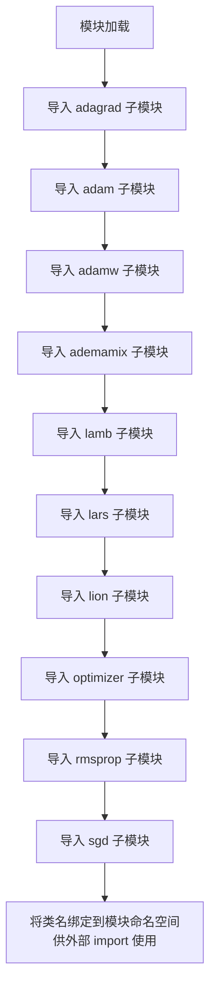

# `bitsandbytes\bitsandbytes\optim\__init__.py` 详细设计文档

该文件是 bitsandbytes 优化器模块的公共入口（__init__.py），通过聚合导入的方式统一向外暴露了多种深度学习优化算法（如 Adam、AdamW、LAMB、LARS、Lion、RMSprop、SGD 等）及其对应的 8bit、32bit 量化版和 Paged 内存优化变体，方便用户直接调用。

## 整体流程



## 类结构

```
bitsandbytes.optimizers (根包)
├── adagrad (Adagrad, Adagrad8bit, Adagrad32bit)
├── adam (Adam, Adam8bit, Adam32bit, PagedAdam, ...)
├── adamw (AdamW, AdamW8bit, AdamW32bit, PagedAdamW, ...)
├── ademamix (AdEMAMix, AdEMAMix8bit, ...)
├── lamb (LAMB, LAMB8bit, LAMB32bit)
├── lars (LARS, LARS8bit, LARS32bit, PytorchLARS)
├── lion (Lion, Lion8bit, Lion32bit, PagedLion, ...)
├── optimizer (GlobalOptimManager)
├── rmsprop (RMSprop, RMSprop8bit, RMSprop32bit)
└── sgd (SGD, SGD8bit, SGD32bit)
```

## 全局变量及字段


### `Adagrad`
    
Adagrad优化器类

类型：`class`
    


### `Adagrad8bit`
    
8位量化Adagrad优化器类

类型：`class`
    


### `Adagrad32bit`
    
32位Adagrad优化器类

类型：`class`
    


### `Adam`
    
Adam优化器类

类型：`class`
    


### `Adam8bit`
    
8位量化Adam优化器类

类型：`class`
    


### `Adam32bit`
    
32位Adam优化器类

类型：`class`
    


### `PagedAdam`
    
分页内存Adam优化器类

类型：`class`
    


### `PagedAdam8bit`
    
8位量化分页Adam优化器类

类型：`class`
    


### `PagedAdam32bit`
    
32位分页Adam优化器类

类型：`class`
    


### `AdamW`
    
AdamW权重衰减优化器类

类型：`class`
    


### `AdamW8bit`
    
8位量化AdamW优化器类

类型：`class`
    


### `AdamW32bit`
    
32位AdamW优化器类

类型：`class`
    


### `PagedAdamW`
    
分页内存AdamW优化器类

类型：`class`
    


### `PagedAdamW8bit`
    
8位量化分页AdamW优化器类

类型：`class`
    


### `PagedAdamW32bit`
    
32位分页AdamW优化器类

类型：`class`
    


### `AdEMAMix`
    
AdEMAMix优化器类

类型：`class`
    


### `AdEMAMix8bit`
    
8位量化AdEMAMix优化器类

类型：`class`
    


### `AdEMAMix32bit`
    
32位AdEMAMix优化器类

类型：`class`
    


### `PagedAdEMAMix`
    
分页内存AdEMAMix优化器类

类型：`class`
    


### `PagedAdEMAMix8bit`
    
8位量化分页AdEMAMix优化器类

类型：`class`
    


### `PagedAdEMAMix32bit`
    
32位分页AdEMAMix优化器类

类型：`class`
    


### `LAMB`
    
LAMB (Layer-wise Adaptive Moments) 优化器类

类型：`class`
    


### `LAMB8bit`
    
8位量化LAMB优化器类

类型：`class`
    


### `LAMB32bit`
    
32位LAMB优化器类

类型：`class`
    


### `LARS`
    
LARS (Layer-wise Adaptive Rate Scaling) 优化器类

类型：`class`
    


### `LARS8bit`
    
8位量化LARS优化器类

类型：`class`
    


### `LARS32bit`
    
32位LARS优化器类

类型：`class`
    


### `PytorchLARS`
    
PyTorch原生LARS优化器类

类型：`class`
    


### `Lion`
    
Lion (Language Model INT8 Optimizer) 优化器类

类型：`class`
    


### `Lion8bit`
    
8位量化Lion优化器类

类型：`class`
    


### `Lion32bit`
    
32位Lion优化器类

类型：`class`
    


### `PagedLion`
    
分页内存Lion优化器类

类型：`class`
    


### `PagedLion8bit`
    
8位量化分页Lion优化器类

类型：`class`
    


### `PagedLion32bit`
    
32位分页Lion优化器类

类型：`class`
    


### `GlobalOptimManager`
    
全局优化器管理器类

类型：`class`
    


### `RMSprop`
    
RMSprop优化器类

类型：`class`
    


### `RMSprop8bit`
    
8位量化RMSprop优化器类

类型：`class`
    


### `RMSprop32bit`
    
32位RMSprop优化器类

类型：`class`
    


### `SGD`
    
随机梯度下降优化器类

类型：`class`
    


### `SGD8bit`
    
8位量化SGD优化器类

类型：`class`
    


### `SGD32bit`
    
32位SGD优化器类

类型：`class`
    


    

## 全局函数及方法


## 关键组件


### Adagrad优化器系列

实现Adagrad自适应学习率优化算法，支持8bit和32bit量化版本，用于稀疏梯度场景的模型训练

### Adam优化器系列

实现Adam自适应矩估计优化算法，包含标准版、分页版(Paged)以及8bit和32bit量化版本，是最广泛使用的深度学习优化器之一

### AdamW优化器系列

实现AdamW带权重衰减的Adam优化器，分离权重衰减和梯度更新，包含分页版和量化版变体，用于防止模型过拟合

### AdEMAMix优化器系列

实现AdEMAMix混合指数移动平均优化器，结合多阶动量估计，包含分页版和量化版，提供更快的收敛速度

### LAMB优化器系列

实现LAMB层自适应学习率优化算法，支持8bit和32bit量化，专为大batch size训练场景设计

### LARS优化器系列

实现LARS层自适应学习率缩放优化算法，包含PyTorch原生版本，用于超大batch训练场景

### Lion优化器系列

实现Lion优化器，使用符号动量，包含分页版和量化版变体，是较新的高效优化器

### RMSprop优化器系列

实现RMSprop均方根传播优化算法，支持8bit和32bit量化，用于处理非平稳目标的训练

### SGD优化器系列

实现随机梯度下降优化器及其量化变体，是最基础的优化算法，支持动量等扩展

### GlobalOptimManager全局优化管理器

提供全局优化器实例管理和注册功能，协调不同优化器的创建和使用


## 问题及建议


### 已知问题

-   **高重复性导入（Boilerplate）**：当前文件通过显式导入语句导出了数十个类，违反了 DRY（Don't Repeat Yourself）原则。如果添加新的优化器（如 Lion 的 Paged 变体或新的数值精度版本）或修改导入路径，开发者需要在此文件中进行大量重复性编辑，易导致遗漏或不一致。
-   **缺乏灵活性与扩展性**：导出逻辑是“扁平式”的，直接列出具体类名。若需动态生成优化器变体（例如根据配置字符串实例化），当前结构无法提供直接的工厂支持（虽然下层可能有 `GlobalOptimManager`，但入口文件未体现）。
-   **导入性能隐患**：在包级别初始化时一次性导入所有优化器（包括可能不常用的 8bit、32bit 变体），会显著增加模块加载时间，影响应用的冷启动性能。对于仅需使用一两个优化器的场景，这造成了不必要的开销。
-   **模块耦合度**：入口文件直接依赖具体的优化器实现模块（`adagrad`, `adam` 等）。任何底层模块的路径或命名变化都会导致此处代码修改，增加了维护成本。
-   **命名空间冗余**：导出列表中包含了大量同质化的类名（如 `Adam8bit`, `Adam32bit`, `PagedAdam32bit`），可能导致命名空间污染，并增加下游代码的阅读难度。

### 优化建议

-   **引入自动化导入机制**：可使用 `importlib` 动态扫描并导入同目录下的优化器模块，通过元编程（如装饰器或配置文件）自动生成 `__all__` 列表，减少手动维护导入语句的工作量。
-   **实施延迟导入（Lazy Import）或按需导入**：将重量级的优化器类实现延迟到实际使用时再加载，或者提供子模块入口（如 `from optimizer.adam import Adam`），允许用户仅导入所需组件，从而优化加载性能。
-   **建立抽象层或工厂模式**：在 `__init__.py` 中暴露一个统一的优化器工厂函数或类（如 `get_optimizer(name, mode, ...)`），将具体的类实例化逻辑封装起来，对外提供更友好的 API，同时隐藏内部实现细节，降低耦合度。
-   **重构类导出结构**：考虑是否可以将 8bit、32bit、Paged 等变体通过统一的参数或配置来区分（例如 `Adam(precision='8bit')`），而不是作为独立的类导出，以简化接口。


## 其它


### 设计目标与约束

本模块的设计目标是提供一个统一的优化器接口，支持多种优化算法（Adam、Adagrad、LAMB、LARS、Lion、RMSprop、SGD等），并针对不同场景提供8bit、32bit以及Paged内存优化版本。约束包括：必须继承自PyTorch的Optimizer基类、需支持参数分组、需兼容分布式训练环境。

### 错误处理与异常设计

模块级别的导入错误会被传播到上层，个别优化器类初始化时若参数不合法（如学习率为负数、权重衰减为负）应抛出ValueError；GlobalOptimManager的方法应检查optimizer实例类型，不符合要求时抛出TypeError。所有异常应包含清晰的错误信息便于调试。

### 数据流与状态机

优化器实例创建时接收参数组列表，初始化各参数组的状态字典（state）用于存储动量、方差等状态信息。训练循环中调用step()方法时，根据状态机更新参数：检查梯度存在性→应用梯度裁剪（如需要）→更新一阶/二阶矩估计→计算偏差修正→更新参数。Paged版本额外管理分页内存块的生命周期。

### 外部依赖与接口契约

本模块依赖PyTorch的torch.optim.Optimizer基类和nn.Parameter张量类型。各优化器类需实现step(closure=None)方法，closure用于支持L-BFGS等二阶优化算法。8bit/32bit变体通过量化参数实现，量化参数（如scale、zero_point）由bitsandbytes库提供，模块需保持向后兼容。

### 性能考虑

Paged优化器通过分页内存管理减少显存碎片，适合大模型训练；8bit量化显著减少显存占用但可能影响收敛稳定性；32bit版本为基准实现。GlobalOptimManager提供全局优化器注册表以支持动态选择。建议在显存受限时优先使用Paged版本，在需要快速迭代时使用8bit版本。

### 安全性考虑

优化器状态包含模型参数的梯度历史，不应持久化到不安全的环境。Paged内存块需显式释放避免内存泄漏。外部传入的参数组必须验证其requires_grad属性，防止意外更新不可训练参数。

### 版本兼容性

本模块遵循语义化版本，API变更会在主版本号更新。PyTorch版本兼容性声明为>=1.9.0，bitsandbytes版本要求>=0.37.0。建议在生产环境锁定具体版本号。

### 测试策略

应包含单元测试覆盖各优化器的参数更新逻辑、边界条件检查、梯度累积场景；集成测试验证与nn.Module的组合使用；性能基准测试对比不同位宽版本的显存占用和训练速度；分布式测试验证多GPU环境下的行为一致性。


    