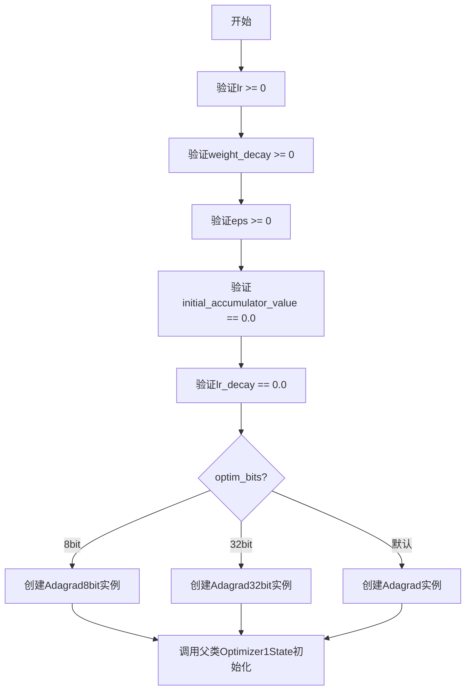
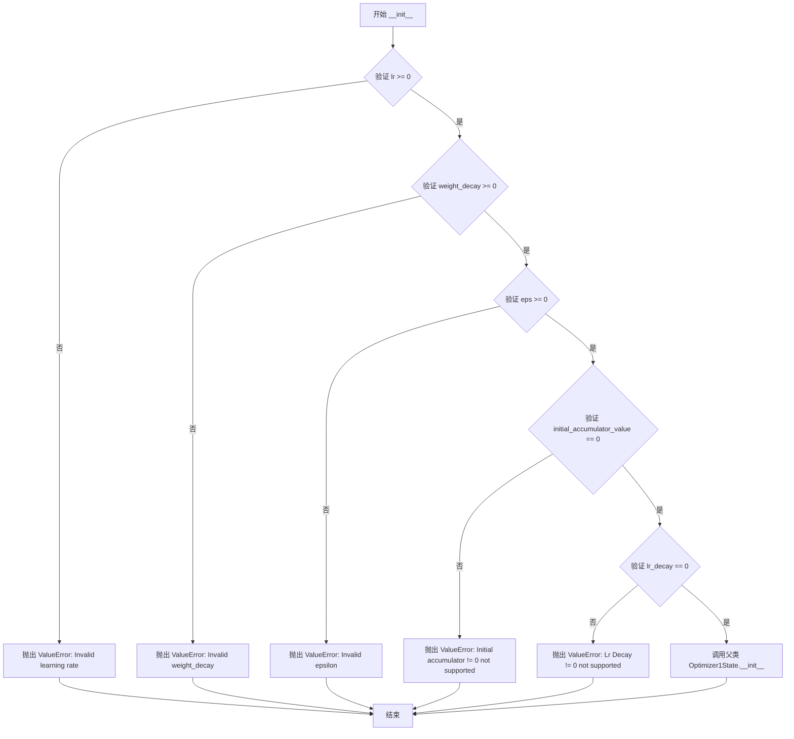
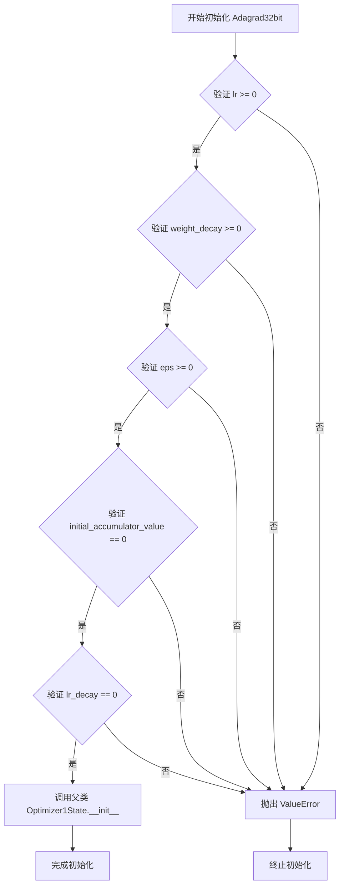

# `bitsandbytes\bitsandbytes\optim\adagrad.py` 详细设计文档

Adagrad优化器实现，包含基础Adagrad、8位和32位三个变体，继承自Optimizer1State，提供参数优化功能，支持学习率、权重衰减、梯度裁剪等高级特性

## 整体流程



## 类结构

```
Optimizer1State (基类)
└── Adagrad
    ├── Adagrad8bit
    └── Adagrad32bit
```

## 全局变量及字段


### `Optimizer1State`
    
Base optimizer class from bitsandbytes that stores state and implements core optimizer logic.

类型：`class`
    


### `Adagrad`
    
Adagrad optimizer implementation supporting configurable learning rate, weight decay, and optional 8‑bit/32‑bit state.

类型：`class`
    


### `Adagrad8bit`
    
8‑bit variant of the Adagrad optimizer, using reduced‑precision state for memory efficiency.

类型：`class`
    


### `Adagrad32bit`
    
32‑bit variant of the Adagrad optimizer, using full‑precision state.

类型：`class`
    


### `Adagrad.params`
    
The model parameters to be optimized.

类型：`torch.Tensor`
    


### `Adagrad.lr`
    
Learning rate for parameter updates.

类型：`float`
    


### `Adagrad.lr_decay`
    
Learning rate decay factor (currently not supported).

类型：`int`
    


### `Adagrad.weight_decay`
    
Weight decay (L2 regularization) coefficient.

类型：`float`
    


### `Adagrad.initial_accumulator_value`
    
Initial value for the accumulator (must be 0).

类型：`int`
    


### `Adagrad.eps`
    
Epsilon term to avoid division by zero.

类型：`float`
    


### `Adagrad.optim_bits`
    
Number of bits used for optimizer state (default 32).

类型：`int`
    


### `Adagrad.args`
    
Additional hyperparameter container.

类型：`object`
    


### `Adagrad.min_8bit_size`
    
Minimum number of elements in a tensor to apply 8‑bit quantization.

类型：`int`
    


### `Adagrad.percentile_clipping`
    
Percentile used for gradient norm clipping.

类型：`int`
    


### `Adagrad.block_wise`
    
Whether to quantize each tensor block independently.

类型：`bool`
    


### `Adagrad8bit.params`
    
The model parameters to be optimized.

类型：`torch.Tensor`
    


### `Adagrad8bit.lr`
    
Learning rate for parameter updates.

类型：`float`
    


### `Adagrad8bit.lr_decay`
    
Learning rate decay factor (currently not supported).

类型：`int`
    


### `Adagrad8bit.weight_decay`
    
Weight decay (L2 regularization) coefficient.

类型：`float`
    


### `Adagrad8bit.initial_accumulator_value`
    
Initial value for the accumulator (must be 0).

类型：`int`
    


### `Adagrad8bit.eps`
    
Epsilon term to avoid division by zero.

类型：`float`
    


### `Adagrad8bit.optim_bits`
    
Number of bits for optimizer state (default 8).

类型：`int`
    


### `Adagrad8bit.args`
    
Additional hyperparameter container.

类型：`object`
    


### `Adagrad8bit.min_8bit_size`
    
Minimum number of elements in a tensor to apply 8‑bit quantization.

类型：`int`
    


### `Adagrad8bit.percentile_clipping`
    
Percentile used for gradient norm clipping.

类型：`int`
    


### `Adagrad8bit.block_wise`
    
Whether to quantize each tensor block independently.

类型：`bool`
    


### `Adagrad32bit.params`
    
The model parameters to be optimized.

类型：`torch.Tensor`
    


### `Adagrad32bit.lr`
    
Learning rate for parameter updates.

类型：`float`
    


### `Adagrad32bit.lr_decay`
    
Learning rate decay factor (currently not supported).

类型：`int`
    


### `Adagrad32bit.weight_decay`
    
Weight decay (L2 regularization) coefficient.

类型：`float`
    


### `Adagrad32bit.initial_accumulator_value`
    
Initial value for the accumulator (must be 0).

类型：`int`
    


### `Adagrad32bit.eps`
    
Epsilon term to avoid division by zero.

类型：`float`
    


### `Adagrad32bit.optim_bits`
    
Number of bits for optimizer state (default 32).

类型：`int`
    


### `Adagrad32bit.args`
    
Additional hyperparameter container.

类型：`object`
    


### `Adagrad32bit.min_8bit_size`
    
Minimum number of elements in a tensor to apply 8‑bit quantization.

类型：`int`
    


### `Adagrad32bit.percentile_clipping`
    
Percentile used for gradient norm clipping.

类型：`int`
    


### `Adagrad32bit.block_wise`
    
Whether to quantize each tensor block independently.

类型：`bool`
    
    

## 全局函数及方法


### `Adagrad.__init__`

该方法是 `Adagrad` 优化器类的构造函数，用于初始化 Adagrad 优化器的参数。它接受模型参数、学习率、权重衰减、epsilon 等优化相关配置，进行参数合法性校验，并将配置传递给父类 `Optimizer1State` 完成初始化。

参数：

- `params`：`torch.tensor`，输入要优化的模型参数
- `lr`：`float`，学习率，默认值为 1e-2
- `lr_decay`：`int`，学习率衰减率，默认值为 0
- `weight_decay`：`float`，权重衰减系数，默认值为 0.0
- `initial_accumulator_value`：`int`，初始累积值，默认值为 0
- `eps`：`float`，防止除零的 epsilon 值，默认值为 1e-10
- `optim_bits`：`int`，优化器状态的位数，默认值为 32
- `args`：`object`，包含额外配置参数的对象，默认值为 None
- `min_8bit_size`：`int`，8 位优化的最小张量元素数，默认值为 4096
- `percentile_clipping`：`int`，自适应梯度裁剪的百分位阈值，默认值为 100
- `block_wise`：`bool`，是否对每个张量块独立量化，默认值为 True

返回值：`None`，该方法为构造函数，不返回任何值

#### 流程图



#### 带注释源码

```python
def __init__(
    self,
    params,
    lr=1e-2,
    lr_decay=0,
    weight_decay=0,
    initial_accumulator_value=0,
    eps=1e-10,
    optim_bits=32,
    args=None,
    min_8bit_size=4096,
    percentile_clipping=100,
    block_wise=True,
):
    """
    Base Adagrad optimizer.

    Arguments:
        params (`torch.tensor`):
            The input parameters to optimize.
        lr (`float`, defaults to 1e-2):
            The learning rate.
        lr_decay (`int`, defaults to 0):
            The learning rate decay.
        weight_decay (`float`, defaults to 0.0):
            The weight decay value for the optimizer.
        initial_accumulator_value (`int`, defaults to 0):
            The initial momemtum values.
        eps (`float`, defaults to 1e-10):
            The epsilon value prevents division by zero in the optimizer.
        optim_bits (`int`, defaults to 32):
            The number of bits of the optimizer state.
        args (`object`, defaults to `None`):
            An object with additional arguments.
        min_8bit_size (`int`, defaults to 4096):
            The minimum number of elements of the parameter tensors for 8-bit optimization.
        percentile_clipping (`int`, defaults to 100):
            Adapts clipping threshold automatically by tracking the last 100 gradient norms and clipping the gradient at a certain percentile to improve stability.
        block_wise (`bool`, defaults to `True`):
            Whether to independently quantize each block of tensors to reduce outlier effects and improve stability.
    """
    # 验证学习率必须为非负数
    if not 0.0 <= lr:
        raise ValueError(f"Invalid learning rate: {lr}")
    # 验证权重衰减必须为非负数
    if not 0.0 <= weight_decay:
        raise ValueError(f"Invalid weight_decay value: {weight_decay}")
    # 验证 epsilon 必须为非负数
    if not 0.0 <= eps:
        raise ValueError(f"Invalid epsilon value: {eps}")
    # 验证初始累积值必须为 0（当前版本不支持非零值）
    if initial_accumulator_value != 0.0:
        raise ValueError("Initial accumulator value != 0.0 not supported!")
    # 验证学习率衰减必须为 0（当前版本不支持学习率衰减）
    if lr_decay != 0.0:
        raise ValueError("Lr Decay != 0.0 not supported!")
    # 调用父类 Optimizer1State 的构造函数完成初始化
    super().__init__(
        "adagrad",                    # 优化器名称
        params,                       # 要优化的参数
        lr,                           # 学习率
        (0.0, 0.0),                   # 动量参数（Adagrad 不使用动量）
        eps,                          # epsilon 值
        weight_decay,                 # 权重衰减
        optim_bits,                   # 优化位数
        args,                         # 额外参数
        min_8bit_size,                # 8 位优化最小尺寸
        percentile_clipping,          # 百分位裁剪
        block_wise,                   # 块级量化
    )
```


### `Adagrad8bit.__init__`

8位Adagrad优化器的初始化方法，负责配置学习率、权重衰减、epsilon等超参数，并进行参数合法性校验后调用父类Optimizer1State的初始化方法。

参数：

- `params`：`torch.tensor`，需要优化的输入参数张量
- `lr`：`float`，学习率，默认值为1e-2
- `lr_decay`：`int`，学习率衰减，默认值为0
- `weight_decay`：`float`，权重衰减值，默认值为0.0
- `initial_accumulator_value`：`int`，初始动量值，默认值为0
- `eps`：`float`，防止优化器除零的epsilon值，默认值为1e-10
- `optim_bits`：`int`，优化器状态的位数，默认值为8
- `args`：`object`，包含额外参数的对象，默认值为None
- `min_8bit_size`：`int`，参数张量进行8位优化的最小元素数量，默认值为4096
- `percentile_clipping`：`int`，自适应裁剪阈值，通过跟踪最近100个梯度范数来调整裁剪阈值以提高稳定性，默认值为100
- `block_wise`：`bool`，是否独立量化每个张量块以减少异常值影响并提高稳定性，默认值为True

返回值：`None`，该方法无返回值，负责初始化对象状态

#### 流程图

```mermaid
flowchart TD
    A[开始初始化 Adagrad8bit] --> B{验证 lr >= 0}
    B -->|否| C[抛出 ValueError: Invalid learning rate]
    B -->|是| D{验证 weight_decay >= 0}
    D -->|否| E[抛出 ValueError: Invalid weight_decay value]
    D -->|是| F{验证 eps >= 0}
    F -->|否| G[抛出 ValueError: Invalid epsilon value]
    F -->|是| H{验证 initial_accumulator_value == 0}
    H -->|否| I[抛出 ValueError: Initial accumulator value != 0.0 not supported]
    H -->|是| J{验证 lr_decay == 0}
    J -->|否| K[抛出 ValueError: Lr Decay != 0.0 not supported]
    J -->|是| L[断言 block_wise == True]
    L -->|失败| M[抛出 AssertionError]
    L -->|成功| N[调用 super().__init__ 初始化父类]
    N --> O[结束初始化]
    
    C --> O
    E --> O
    G --> O
    I --> O
    K --> O
    M --> O
```

#### 带注释源码

```python
def __init__(
    self,
    params,                  # torch.tensor: 需要优化的模型参数
    lr=1e-2,                 # float: 学习率，默认1e-2
    lr_decay=0,              # int: 学习率衰减，当前不支持，固定为0
    weight_decay=0,          # float: 权重_decay系数，用于L2正则化
    initial_accumulator_value=0,  # int: 累加器初始值，当前仅支持0
    eps=1e-10,               # float: 防止除零的小常数
    optim_bits=8,            # int: 优化器状态量化位数，8位优化
    args=None,               # object: 额外配置参数对象
    min_8bit_size=4096,      # int: 触发8位优化的最小参数元素数量
    percentile_clipping=100, # int: 梯度裁剪的百分位阈值
    block_wise=True,         # bool: 是否采用块级量化策略
):
    """
    8-bit Adagrad optimizer.
    
    继承自Optimizer1State的Adagrad优化器实现，支持8位量化优化。
    通过块级量化减少异常值影响，提高训练稳定性。
    
    Arguments:
        params (`torch.tensor`): 输入的待优化参数张量
        lr (`float`, defaults to 1e-2): 学习率，控制参数更新步长
        lr_decay (`int`, defaults to 0): 学习率衰减（暂不支持）
        weight_decay (`float`, defaults to 0.0): 权重衰减系数
        initial_accumulator_value (`int`, defaults to 0): 初始累加器值
        eps (`float`, defaults to 1e-10): 数值稳定性常数
        optim_bits (`int`, defaults to 8): 优化器状态量化位数
        args (`object`, defaults to `None`): 附加参数容器
        min_8bit_size (`int`, defaults to 4096): 8位优化最小阈值
        percentile_clipping (`int`, defaults to 100): 百分位裁剪参数
        block_wise (`bool`, defaults to `True`): 是否启用块级量化
    """
    
    # 验证学习率必须非负
    if not 0.0 <= lr:
        raise ValueError(f"Invalid learning rate: {lr}")
    
    # 验证权重衰减必须非负
    if not 0.0 <= weight_decay:
        raise ValueError(f"Invalid weight_decay value: {weight_decay}")
    
    # 验证epsilon必须非负
    if not 0.0 <= eps:
        raise ValueError(f"Invalid epsilon value: {eps}")
    
    # Adagrad仅支持初始累加器值为0
    if initial_accumulator_value != 0.0:
        raise ValueError("Initial accumulator value != 0.0 not supported!")
    
    # Adagrad不支持学习率衰减
    if lr_decay != 0.0:
        raise ValueError("Lr Decay != 0.0 not supported!")
    
    # 8位优化必须使用块级量化以保证数值稳定性
    assert block_wise
    
    # 调用父类Optimizer1State的初始化方法
    # 传递优化器名称、参数、学习率、动量(0.0, 0.0)、epsilon、权重_decay、量化位数等配置
    super().__init__(
        "adagrad",           # str: 优化器类型名称
        params,              # torch.tensor: 待优化参数
        lr,                  # float: 学习率
        (0.0, 0.0),          # tuple: 动量参数（Adagrad不使用动量）
        eps,                 # float: epsilon常数
        weight_decay,        # float: 权重衰减系数
        8,                   # int: 强制使用8位量化
        args,                # object: 附加参数
        min_8bit_size,       # int: 8位优化最小阈值
        percentile_clipping, # int: 百分位裁剪
        block_wise,          # bool: 块级量化标志
    )
```


### `Adagrad32bit.__init__`

32位Adagrad优化器初始化方法，继承自Optimizer1State，用于管理神经网络训练过程中的参数更新，支持学习率、权重衰减、梯度裁剪等优化策略配置。

参数：

- `params`：`torch.tensor`，要优化的输入参数张量
- `lr`：`float`，学习率，默认值为1e-2
- `lr_decay`：`int`，学习率衰减率，默认值为0
- `weight_decay`：`float`，权重衰减系数，默认值为0.0
- `initial_accumulator_value`：`int`，初始动量值，默认值为0
- `eps`：`float`，防止除零的epsilon值，默认值为1e-10
- `optim_bits`：`int`，优化器状态位数，默认值为32
- `args`：`object`，包含额外参数的对象，默认值为None
- `min_8bit_size`：`int`，用于8位优化的张量元素最小数量，默认值为4096
- `percentile_clipping`：`int`，自动调整剪裁阈值，默认值为100
- `block_wise`：`bool`，是否独立量化每个张量块以减少异常值影响，默认值为True

返回值：`None`，构造函数无返回值

#### 流程图



#### 带注释源码

```python
class Adagrad32bit(Optimizer1State):
    def __init__(
        self,
        params,                      # torch.tensor: 要优化的参数
        lr=1e-2,                     # float: 学习率，默认1e-2
        lr_decay=0,                  # int: 学习率衰减，默认0（暂不支持）
        weight_decay=0,              # float: 权重衰减，默认0.0
        initial_accumulator_value=0, # int: 初始累加器值，默认0
        eps=1e-10,                   # float: 防止除零的epsilon，默认1e-10
        optim_bits=32,              # int: 优化器状态位数，默认32
        args=None,                   # object: 额外参数对象
        min_8bit_size=4096,         # int: 8位优化最小尺寸，默认4096
        percentile_clipping=100,    # int: 百分位裁剪，默认100
        block_wise=True,            # bool: 块级量化，默认True
    ):
        """
        32-bit Adagrad optimizer.

        Arguments:
            params (`torch.tensor`):
                The input parameters to optimize.
            lr (`float`, defaults to 1e-2):
                The learning rate.
            lr_decay (`int`, defaults to 0):
                The learning rate decay.
            weight_decay (`float`, defaults to 0.0):
                The weight decay value for the optimizer.
            initial_accumulator_value (`int`, defaults to 0):
                The initial momemtum values.
            eps (`float`, defaults to 1e-10):
                The epsilon value prevents division by zero in the optimizer.
            optim_bits (`int`, defaults to 32):
                The number of bits of the optimizer state.
            args (`object`, defaults to `None`):
                An object with additional arguments.
            min_8bit_size (`int`, defaults to 4096):
                The minimum number of elements of the parameter tensors for 8-bit optimization.
            percentile_clipping (`int`, defaults to 100):
                Adapts clipping threshold automatically by tracking the last 100 gradient norms and clipping the gradient at a certain percentile to improve stability.
            block_wise (`bool`, defaults to `True`):
                Whether to independently quantize each block of tensors to reduce outlier effects and improve stability.
        """
        # 验证学习率必须非负
        if not 0.0 <= lr:
            raise ValueError(f"Invalid learning rate: {lr}")
        # 验证权重衰减必须非负
        if not 0.0 <= weight_decay:
            raise ValueError(f"Invalid weight_decay value: {weight_decay}")
        # 验证epsilon必须非负
        if not 0.0 <= eps:
            raise ValueError(f"Invalid epsilon value: {eps}")
        # 验证初始累加器值必须为0（暂不支持非零值）
        if initial_accumulator_value != 0.0:
            raise ValueError("Initial accumulator value != 0.0 not supported!")
        # 验证学习率衰减必须为0（暂不支持衰减）
        if lr_decay != 0.0:
            raise ValueError("Lr Decay != 0.0 not supported!")
        # 调用父类Optimizer1State的初始化方法
        super().__init__(
            "adagrad",               # str: 优化器名称
            params,                  # tensor: 待优化参数
            lr,                      # float: 学习率
            (0.0, 0.0),             # tuple: 动量参数 (beta1, beta2)
            eps,                    # float: epsilon值
            weight_decay,           # float: 权重衰减
            32,                     # int: 强制使用32位优化
            args,                   # object: 额外参数
            min_8bit_size,         # int: 最小8位尺寸
            percentile_clipping,   # int: 百分位裁剪
            block_wise,            # bool: 块级量化
        )
```

## 关键组件


### 张量索引与惰性加载

该代码通过继承Optimizer1State基类实现参数和优化器状态的张量索引管理，支持对大规模参数的分块处理和惰性加载，减少内存占用。

### 反量化支持

通过optim_bits参数（8或32位）控制优化器状态的量化精度，在参数更新时需要将量化状态反量化为全精度进行计算，支持动态量化精度切换。

### 量化策略

采用分块量化（block_wise=True）策略，将张量划分为独立块分别量化，以减少异常值影响并提高稳定性；同时通过percentile_clipping参数实现基于梯度范数百分位的自适应裁剪，进一步优化数值稳定性。


## 问题及建议


### 已知问题

-   **大量代码重复**：三个类（Adagrad、Adagrad8bit、Adagrad32bit）中的参数验证逻辑完全重复，每个类都包含相同的5个if验证语句，违反了DRY原则。
-   **文档字符串重复**：三个类使用相同的docstring，未针对每个类的特定用途进行差异化描述。
-   **参数冗余设计**：`lr_decay`和`initial_accumulator_value`作为参数传入，但在验证后直接抛出"不支持"异常，实际上这些参数形同虚设，增加了API复杂度。
-   **硬编码值传递**：Adagrad8bit类中传入`optim_bits=8`但同时在super().__init__中又硬编码了`8`，这种写法冗余且容易产生不一致。
-   **缺乏类型提示**：代码中没有任何类型注解（Type Hints），不利于IDE自动补全和静态分析。
-   **参数校验不完整**：仅校验了lr、weight_decay、eps的下界，但没有校验optim_bits的有效值范围、min_8bit_size和percentile_clipping的合理性。
-   **错误信息不一致**：Adagrad8bit中使用了assert语句验证block_wise，而其他类使用if raise ValueError，验证风格不统一。
-   **magic number**：阈值4096和100作为默认值直接使用，未提取为有名称的常量，降低了可读性和可维护性。

### 优化建议

-   **提取公共基类或混入验证逻辑**：将重复的参数验证逻辑抽取到父类或使用装饰器/方法，避免在每个子类中重复定义。
-   **移除无效参数**：如果`lr_decay`和`initial_accumulator_value`确实不支持，应从函数签名中移除，或提供部分支持（如仅支持0值）。
-   **统一错误处理风格**：将Adagrad8bit中的`assert block_wise`改为与其他类一致的`if not block_wise: raise ValueError`形式。
-   **添加类型提示**：为所有参数、返回值添加类型注解，如`def __init__(self, params: torch.Tensor, lr: float = 1e-2, ...)`。
-   **提取魔数为常量**：将4096、100等默认值定义为类常量或模块级常量，如`DEFAULT_MIN_8BIT_SIZE = 4096`。
-   **增强参数校验**：添加对optim_bits（应为8或32）、min_8bit_size（正整数）、percentile_clipping（1-100）的范围校验。
-   **使用参数化减少重复**：考虑通过工厂函数或单一配置类来生成不同位数的Adagrad变体，减少类定义层面的重复。


## 其它


### 设计目标与约束

本模块旨在实现Facebook的Adagrad优化器变体，支持标准32位和量化8位优化，用于大规模深度学习模型的参数更新。设计约束包括：不支持学习率衰减（lr_decay必须为0）、不支持非零初始累积器值（initial_accumulator_value必须为0）、强制使用block_wise量化以确保稳定性、最小8位优化阈值为4096元素。

### 错误处理与异常设计

参数验证采用前置条件检查模式，使用ValueError异常类型。无效学习率（小于0）时抛出"Invalid learning rate: {lr}"；无效权重衰减（小于0）时抛出"Invalid weight_decay value: {weight_decay}"；无效epsilon（小于0）时抛出"Invalid epsilon value: {eps}"；不支持的功能（initial_accumulator_value != 0或lr_decay != 0）分别抛出特定错误信息。所有验证在调用父类构造器前执行，确保无效状态不会传递给底层优化器。

### 数据流与状态机

Adagrad优化器继承Optimizer1State基类，数据流遵循：参数初始化 → 参数组注册 → 梯度累积状态分配 → 每步梯度计算 → 累积器更新（grad^2）→ 参数更新（lr * grad / sqrt(accumulator + eps)）。状态机包含：初始化状态（分配累积器）、训练状态（梯度累积与参数更新）、量化状态（可选8位压缩）。block_wise=True时，每个参数块独立进行量化处理，减少离群值影响。

### 外部依赖与接口契约

核心依赖为bitsandbytes.optim.optimizer.Optimizer1State基类，定义标准PyTorch优化器接口。外部契约包括：params必须为可迭代的torch tensor；lr、weight_decay、eps为浮点数类型；optim_bits支持8或32位；min_8bit_size控制8位优化启用阈值；percentile_clipping控制梯度裁剪窗口；block_wise控制量化策略。返回值为优化后的参数迭代器，符合PyTorch优化器标准。

### 性能考虑与优化空间

当前实现支持量化压缩（8位）和块级量化以提升稳定性。潜在优化方向：支持动态量化精度切换、lr_decay功能实现、initial_accumulator_value非零支持、GPU内存优化（减少状态复制）、自适应percentile_clipping阈值。当前block_wise强制启用可能对小模型产生额外开销。

### 并发与线程安全

优化器实例通常在单个训练进程中按顺序调用step()，不涉及多线程并发访问。梯度累积状态在GPU/CPU张量中管理，由PyTorch自动处理内存一致性。多进程分布式训练时每个进程持有独立优化器实例，无共享状态冲突。

### 兼容性考虑

当前版本基于MIT许可证，支持PyTorch生态。optim_bits参数暴露给用户但内部强制覆盖：Adagrad8bit内部固定为8，Adagrad32bit固定为32。percentile_clipping默认100表示禁用裁剪，设置为小于100的值时启用自适应裁剪。与标准PyTorch Adagrad接口相比，增加了8位量化相关参数。

### 测试策略建议

应包含单元测试验证：参数验证逻辑（各类无效输入）、8位与32位模式输出一致性、梯度累积正确性、block_wise量化效果、溢出与NaN防护、与其他Adagrad实现的数值对比。集成测试应覆盖完整训练周期、分布式训练场景、不同模型架构兼容性。

    